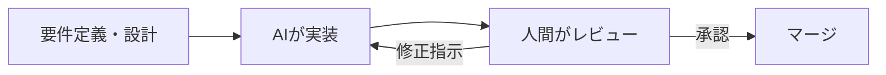

---

<!-- _class: lead -->
# AI時代のソフトウェアエンジニアの生存戦略

- 社内勉強会
- 2026-02-14

<!--
タイトルスライド。10分の発表であることを意識してテンポよく進める。
-->

---

# 目次

- 1. AI時代の開発現場
- 2. AIツール活用の最適解
- 3. 実装方針 — AIとの分担戦略
- 4. レビューコストへの対応
- 5. 進化し続ける人材へ

<!--
全体の流れを共有。現状認識→実践→マインドセットの順で話す。
-->

---

<!-- _class: lead -->
# AI時代の開発現場


---

# 現在地の確認

- AIコーディングツールは「補助」から「協働」へ進化した
- Claude Code / Cursor / GitHub Copilot — 生成精度は実用レベル
- コードを書く速度ではなく、正しい指示と判断が価値になる
- 「AIに置き換えられる」ではなく「AIと何を作れるか」が問われる

<!--
聴衆はAIツールを既に知っている前提。ツール紹介ではなく、開発現場の構造変化にフォーカスする。
-->

---

<!-- _class: lead -->
# AIツール活用の最適解


---

# AI協働の開発フロー

- 人間が設計・要件を定義し、AIが実装を担う
- 生成→レビュー→修正のイテレーションを高速に回す
- AIは「ドラフト生成器」、人間は「品質ゲートキーパー」



<!--
フロー図で視覚的に示す。従来の開発フローとの違いは、実装フェーズがAIに移り、人間の役割がレビューと設計に集中する点。
-->

---

# 実装方針 — AIとの分担戦略

- AIに任せる: ボイラープレート、テスト生成、型定義、リファクタリング
- 人間が握る: アーキテクチャ設計、ビジネスロジックの判断、セキュリティ
- AIへの指示は「コンテキスト」が命 — CLAUDE.mdやプロンプト設計

```typescript
// AIに任せる: 型定義とバリデーション
const userSchema = z.object({
  name: z.string().min(1),
  email: z.string().email(),
  role: z.enum(["admin", "member"]),
});

// 人間が判断: ビジネスルール
function canAccessResource(user: User, resource: Resource): boolean {
  // 権限ロジックは人間が設計・実装する
  return user.role === "admin" || resource.ownerId === user.id;
}
```

<!--
具体的なTS例で分担を示す。型定義やバリデーションはAIの得意領域。ビジネスロジックの判断は人間が責任を持つ。
-->

---

<!-- _class: lead -->
# レビューコストへの対応


---

# AI生成コードのレビュー戦略

- AI生成コードは量が増える — 従来のレビュー方法では破綻する
- レビュー観点を絞る: セキュリティ・ビジネスロジック・エッジケース
- AIにもレビューさせる: 静的解析・テスト自動生成でカバレッジ確保
- 「全行読む」から「リスクベースレビュー」へシフト
- CIパイプラインにAIレビューを組み込み、人間は最終判断に集中

<!--
レビューコスト増大は現場の切実な課題。全部読むのは非現実的。リスクの高い箇所に集中するレビュー戦略が必要。
-->

---

# 進化し続ける人材へ

- AIを使いこなすスキルは「新しい読み書き」になる
- 技術力 × 設計力 × AI活用力 — 掛け算で価値を出す
- 変化を恐れず、学び続けるマインドセットが最大の武器
- 今日からできること: AIとペアプロして自分のワークフローを最適化

<!--
キーメッセージ。スキルの掛け算で唯一無二の人材になる。行動を促すメッセージで締める。
-->

---

<!-- _class: lead -->
# まとめ

- AIは「脅威」ではなく「最強の協働パートナー」
- 設計力とレビュー力が、これからのエンジニアのコア価値
- 進化し続ける人材へ — 変化を味方につけよう

<!--
3つのキーテイクアウェイを繰り返す。最後のメッセージで行動を促す。
-->
