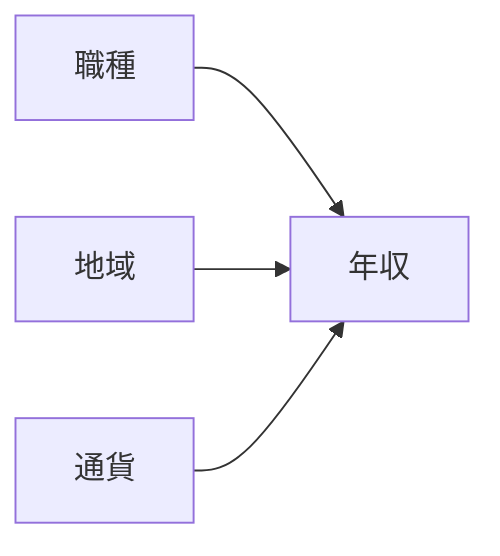
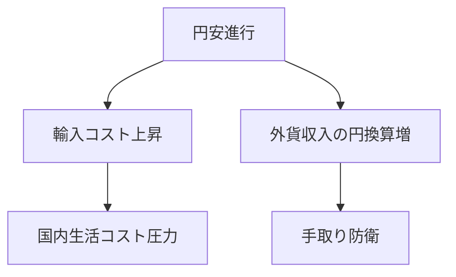
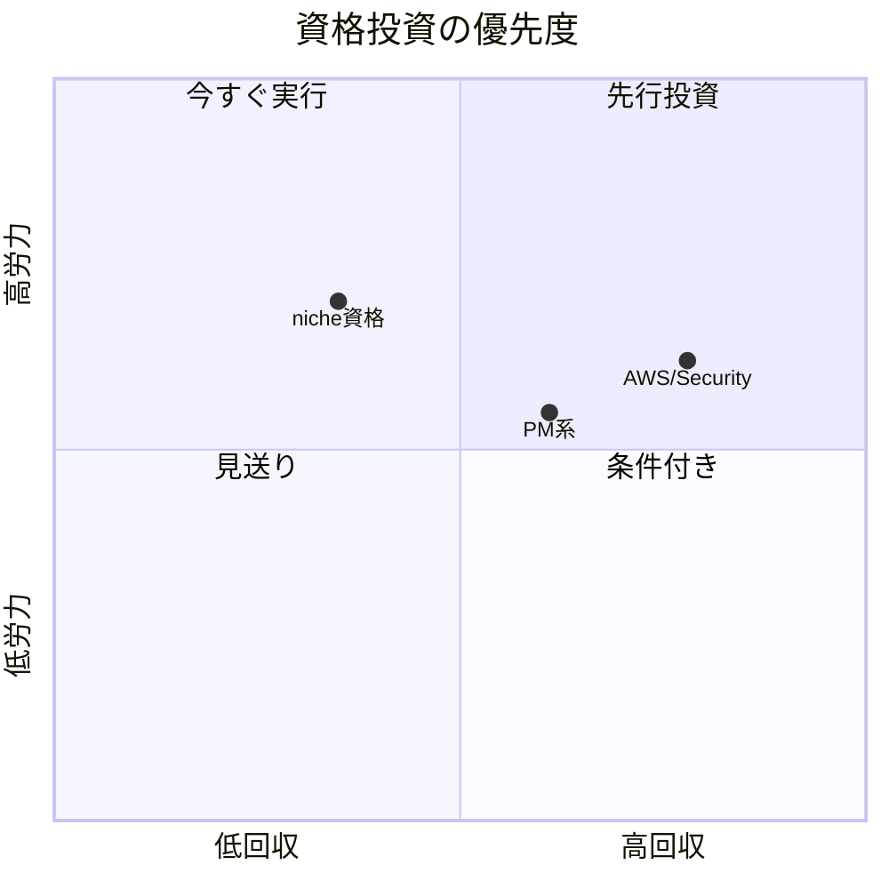
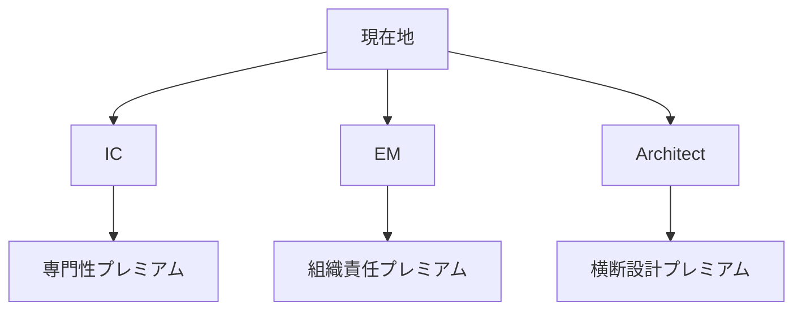
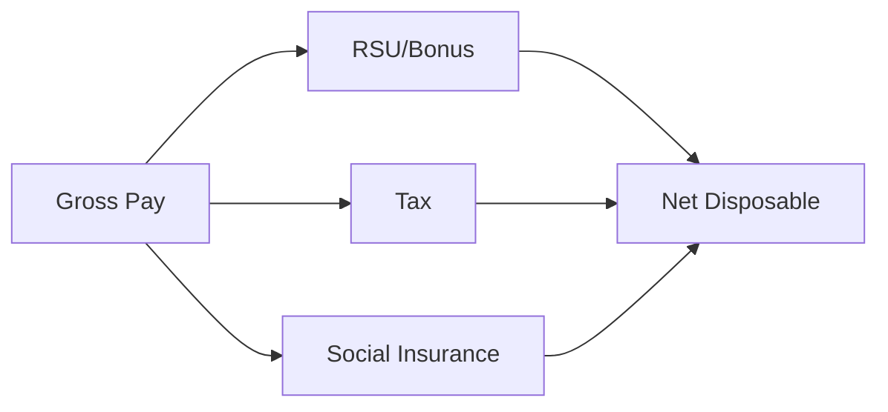
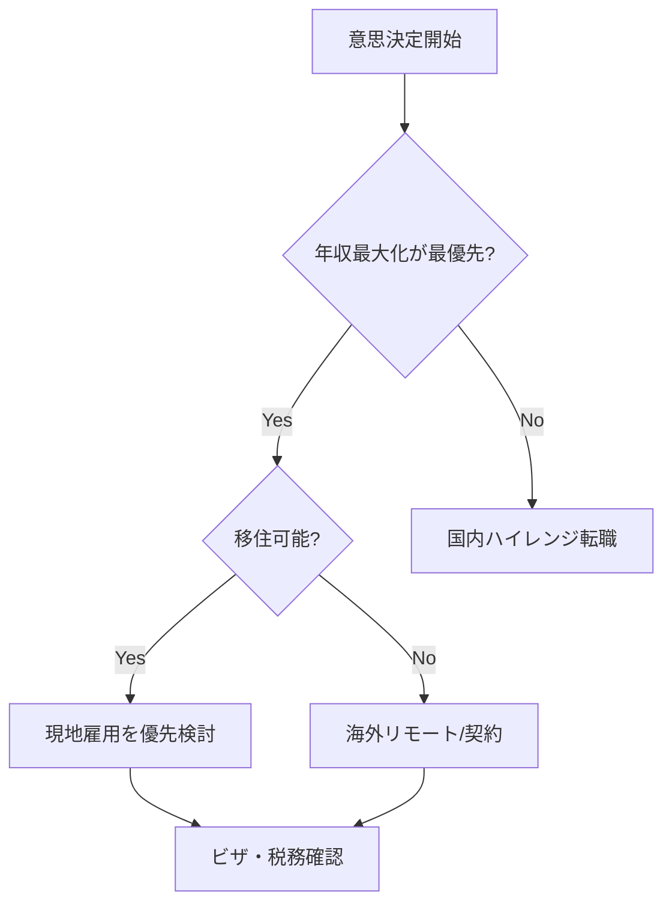
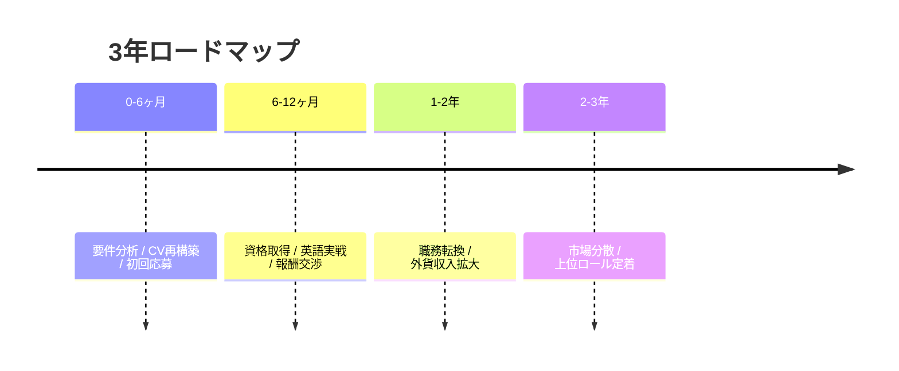

<!-- _class: lead -->
# 世界で年収を伸ばすスキル・資格と海外就業戦略

- 対象: マネージャー / シニアエンジニア
- ゴール: 転職 vs 海外就職の意思決定
- 範囲: スキル・資格・市場価値・円安戦略

---

# この60分で得るもの

- 年収を決める構造を分解して理解する
- 資格のROIを地域・職種別に判断できる
- 円安下での収入最大化シナリオを比較できる
- 90日/1年/3年の実行計画を作れる

---

# 先に結論: 3つのキーメッセージ

- 日本人は海外市場で働くことで収入上限を上げやすい
- 年収は希少な課題解決能力 × 影響範囲 × 交渉力で決まる
- 資格は目的ではなく高単価職に入る信用ショートカット

---

<!-- _class: lead -->
# セクション1: 市場全体像

- 世界の賃金差・通貨差・需要差を俯瞰する

---

# 報酬差を作る3要因

- 職種: IC/EM/Architectで報酬レンジが異なる
- 地域: 同職種でも市場単価が大きく異なる
- 通貨: 円建て生活者は為替の影響を強く受ける

---

# 報酬差を作る3要因（図解）

---

# 米国ソフトウェア職の賃金ベンチマーク

- 米BLSでSoftware Developersの年次賃金中央値は高水準
- 同職種の雇用見通しは全職種平均を上回る成長率
- 高成長市場の単価は日本市場の交渉基準を押し上げる

<!--
出典: https://www.bls.gov/ooh/computer-and-information-technology/software-developers.htm
-->

---

# 日本側の賃金現実をどう読むか

- 日本市場は職種定義が曖昧で単価が伸びにくい
- 転職時にジョブ型で職責を明確化すると単価改善しやすい
- 海外市場のレンジを基準に交渉材料を作る

<!--
出典: https://www.nta.go.jp/publication/statistics/kokuzeicho/minkan/index.htm
-->

---

# 円安は何を変えるか

- 外貨建て収入の円換算を押し上げる
- 国内給与のみだと実質購買力の防衛が難しい
- 通貨分散はキャリア戦略そのもの

---

# 円安は何を変えるか（図解）

---

<!-- _class: lead -->
# セクション2: 年収アップに効くスキル

- 技術と非技術を分けてROIで見る

---

# 年収決定式: 希少性 × 影響範囲 × 交渉力

- 希少性: 代替されにくい専門性
- 影響範囲: チーム/事業PLに与える効果
- 交渉力: オファー設計と条件交渉の技術
- 3要素を同時に伸ばすと年収は非線形に上がる

---

# グローバルで評価されやすい技術スキル

- Cloud Architecture: 可用性・コスト最適化
- Security Engineering: 監査・脅威対応・設計
- Data/ML Engineering: 収益接続するデータ活用
- Platform/SRE: 開発生産性と信頼性の改善

---

# 非技術スキルのインパクト

- 英語: 会議参加ではなく意思決定に影響する発話力
- ドキュメント: 非同期環境で評価を獲得する
- ステークホルダー調整: 影響範囲を拡張する
- 報酬交渉: オファー総額を最適化する

---

# スキルスタック戦略（T字→π字）

- 1本目: 現在の強みを深掘る
- 2本目: 高単価隣接領域を追加する
- 横軸: 英語・設計・ビジネス理解で橋渡しする

---

# スキルスタック戦略（T字→π字）（図解）

---

<!-- _class: lead -->
# セクション3: 資格のROI

- 資格を年収上昇に接続する使い方を整理する

---

# 資格は信用ショートカット

- 資格単体で給与が上がるわけではない
- 高単価職の選考通過率を上げる効果がある
- 実務実績と組み合わせて初めて強い

---

# クラウド資格の優先度

- AWS: 求人数・導入母数が大きく汎用性が高い
- GCP: Data/ML文脈で差別化しやすい
- Azure: エンタープライズ案件で有効
- 選定基準は狙う市場と職務記述書

---

# セキュリティ資格の優先度

- CISSP: 設計・統制・マネジメント文脈で強い
- CCSP: クラウドセキュリティで有効
- OSCP系: 実践技術ロールで差別化
- 規制業界では資格要件が報酬に直結しやすい

---

# PM/アーキ資格の優先度

- PMP: 複数職種を束ねる役割で有効
- TOGAF系: エンタープライズ設計で有効
- 管理職志向なら技術資格と組み合わせる

---

# 資格投資の意思決定マトリクス

- 労力: 学習時間と受験コスト
- 回収: 希望職種への到達確率
- 流動性: 国・企業を跨いで通用するか

---

# 資格投資の意思決定マトリクス（図解）

---

<!-- _class: lead -->
# セクション4: 市場価値の測定

- 感覚ではなく指標で自分を評価する

---

# 市場価値を測る4指標

- Compensation: 基本給+賞与+株式
- Offer Rate: 応募あたりオファー率
- Time to Fill: 自分の採用難易度
- Scope: 任される予算・人数・売上影響

---

# 自己診断スコアカード

- 技術深度（0-5）
- 事業インパクト（0-5）
- 英語実戦力（0-5）
- 交渉力（0-5）
- 外貨収入比率（0-5）

---

# キャリア分岐: IC / EM / Architect

- IC: 専門性深掘りで高単価
- EM: 組織成果責任で報酬上限拡大
- Architect: 横断影響力で希少性を獲得
- 自分の強みに合う分岐を選ぶ

---

# キャリア分岐: IC / EM / Architect（図解）

---

<!-- _class: lead -->
# セクション5: 円安下の海外就業戦略

- 働き方ごとの収益・リスクを比較する

---

# 3つの就業モデル比較

- 現地雇用: 最も報酬上限が高いが移住コストあり
- 海外リモート雇用: 移住なしで外貨収入を得やすい
- 業務委託/契約: 単価上振れ余地と不安定性が共存

---

# 手取り最適化の考え方

- 年収総額ではなく可処分所得で比較する
- 税率・社会保険・生活費・為替を同時に評価する
- 通貨の受取比率を戦略的に設計する

---

# 手取り最適化の考え方（図解）

---

# 海外選考突破の実務

- 英文CVは成果指標ベースで記述する
- 設計面接はトレードオフ説明を重視する
- 行動面接はSTARでリーダーシップを証明する
- 推薦と公開実績で信頼を補強する

---

# オファー交渉の要点

- 交渉対象を基本給だけに限定しない
- サインオン/RSU/査定時期/職位を同時交渉する
- 複数オファーで交渉力を作る
- 通貨建てと支払いタイミングを確認する

---

<!-- _class: lead -->
# セクション6: リスクと制度

- 攻めと同時に制度リスクを管理する

---

# ビザ・労働制度の確認項目

- 就労資格の要件と更新条件
- 雇用主変更時の制約
- 帯同家族の就労可否
- 退職時の在留資格リスク

<!--
出典: https://www.uscis.gov/working-in-the-united-states/h-1b-specialty-occupations
-->

---

# 税務・社会保険の論点

- 居住性判定で課税範囲が変わる
- 二重課税の回避ルールを確認する
- 社会保険の加入先と給付を整理する
- 契約形態ごとの控除可能項目を把握する

<!--
出典: https://www.nta.go.jp/english/taxes/individual/index.htm
-->

---

# 為替・雇用・健康リスクの管理

- 為替: 受取通貨の分散と換金ルール
- 雇用: 緊急時の生活防衛資金を確保
- 健康: 保険と医療アクセスを優先確認
- 法務: 契約条項を事前に弁護士確認

---

<!-- _class: lead -->
# セクション7: 意思決定フレーム

- 転職か海外就職かを構造化して判断する

---

# 意思決定ツリー

- 最優先を年収最大化に置くか
- 移住許容度と家庭条件はどうか
- 英語業務遂行力が基準を超えるか
- 制度リスクを受容できるか

---

# 意思決定ツリー（図解）

---

# ケース別推奨戦略

- 独身・高機動: 現地雇用チャレンジ
- 家族あり・安定重視: 海外リモート雇用
- 高スキル自走型: 外貨建て契約 + 複数顧客
- 全ケースで資格より先に職務要件適合を優先

---

# 意思決定を失敗させる典型

- 年収総額だけで比較して手取りを見ない
- 資格取得で満足し職務転換しない
- 英語を試験スコアだけで判断する
- 為替を短期予想で賭ける

---

<!-- _class: lead -->
# セクション8: 実行計画

- 短期・中期・長期で再現性のある計画に落とす

---

# 90日アクションプラン

- 職種ターゲットを1つに固定する
- 求人50件を分析して要件差分を抽出
- 不足スキル1つ・資格1つに集中投資する
- 英文CVと職務経歴を成果指標で再作成する

---

# 1年アクションプラン

- 高難度プロジェクトで成果実績を作る
- 国際案件または英語環境での実務経験を積む
- 希望市場で通用する資格を1-2個取得する
- 年2回は報酬交渉か転職活動を実施する

---

# 3年アクションプラン

- 外貨収入比率を段階的に引き上げる
- IC/EM/Architectの主戦場を確定する
- 地理・通貨・契約形態の分散を実装する
- 資産形成とキャリア戦略を統合する

---

# 3年アクションプラン（図解）

---

# 参考文献（一次情報）1/2

- [U.S. BLS: Software Developers](https://www.bls.gov/ooh/computer-and-information-technology/software-developers.htm)
- [FRED: JPY/USD (DEXJPUS)](https://fred.stlouisfed.org/series/DEXJPUS)
- [NTA: Tax information for individuals](https://www.nta.go.jp/english/taxes/individual/index.htm)
- [USCIS: H-1B Specialty Occupations](https://www.uscis.gov/working-in-the-united-states/h-1b-specialty-occupations)
- [Pearson VUE: Value of IT Certification](https://home.pearsonvue.com/Test-owners/Value-of-Certification.aspx)

---

# 参考文献（一次情報）2/2

- [OECD Data Portal](https://data.oecd.org/)
- [Stack Overflow Developer Survey](https://survey.stackoverflow.co/2024/)
- [World Bank Open Data](https://data.worldbank.org/)
- [IMF Data](https://data.imf.org/)
- [BOJ Statistics](https://www.boj.or.jp/en/statistics/index.htm/)

---

<!-- _class: lead -->
# まとめと行動宣言

- 今日決める: 目指す職種と市場を1つに絞る
- 今週やる: 求人要件分析と不足スキル特定
- 今月やる: 応募資料更新と初回応募開始
- この四半期で意思決定を完了する

