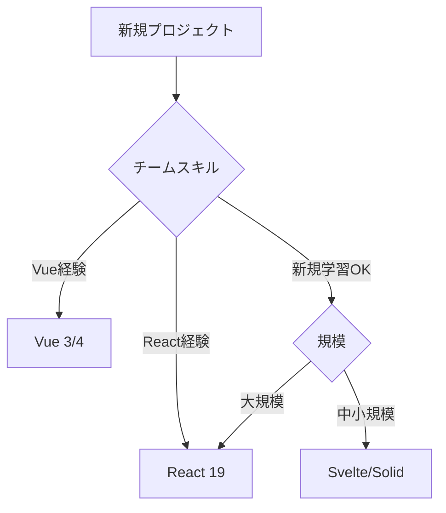

# 2026年のWeb技術トレンド予測

- 開発者・エンジニアのための完全ガイド
- フロントエンド / ランタイム / WebAPI / AI統合開発


---

# 本日のアジェンダ

- **1. フロントエンドフレームワーク** - React 19, Vue 4, Svelte 5の最新動向
- **2. ランタイム・ビルドツール** - Bun, Deno, Vite 6のパフォーマンス革命
- **3. WebプラットフォームAPI** - View Transitions, Popoverなどネイティブ機能の充実
- **4. AI統合開発** - GitHub Copilot, Cursor, Claude Codeが変える開発フロー


---

# 2026年のWeb開発を取り巻く状況

- **エコシステムの成熟**: 主要ツールが安定版に到達、選択肢が明確化
- **パフォーマンス競争**: Rust製ツールの台頭で10倍以上の高速化
- **標準化の加速**: Webプラットフォーム標準APIがフレームワーク機能を代替
- **AI統合の日常化**: コード生成・レビューがワークフローの一部に
- **開発者体験の重視**: DX向上がツール選定の最優先事項


---

# このプレゼンテーションの使い方

- **自己ペースで学習**: 各セクション独立、興味ある部分から読める
- **実践的な情報**: コード例、ベンチマーク、選定基準を豊富に掲載
- **参考資料完備**: 公式ドキュメント、記事へのリンクで深掘り可能
- **チーム共有に最適**: 技術選定会議や勉強会の資料として活用


---

# フロントエンドフレームワークの潮流

- **React**: 依然として最大シェア、Server Componentsで新時代へ
- **Vue**: 安定と革新のバランス、Vapor Modeで性能向上
- **Svelte**: Runes導入でリアクティビティを再定義
- **新興勢力**: Solid.js（Signals）、Qwik（Resumability）が注目
- **選定の鍵**: チーム習熟度 > 最新トレンド


---

# React 19: 新機能概要

- **Server Components**: サーバーサイドレンダリングの新標準
- **Server Actions**: フォーム処理・データ更新の簡素化
- **React Compiler**: 自動メモ化でuseMemo/useCallback不要に
- **use() Hook**: Promise/Contextを統一的に扱う新API
- **Suspense強化**: データフェッチングとの完全統合

<!--
React 19は2025年Q4にRC版リリース、2026年Q1に正式版を予定
-->

---

# React 19: Server Components詳解

- サーバーで実行、バンドルサイズゼロ
- 直接DBアクセス可能、シークレット使用OK

```tsx
// Server Component（デフォルト）
export default async function ProductList() {
  const products = await db.products.findMany()
  return (
    <div>
      {products.map(p => <ProductCard key={p.id} product={p} />)}
    </div>
  )
}

// Client Component（'use client'で明示）
'use client'
export function AddToCartButton({ productId }) {
  return <button onClick={() => addToCart(productId)}>カートに追加</button>
}
```


---

# React 19: React Compiler

- **自動最適化**: コンポーネントとHookを自動でメモ化
- **useMemo/useCallback削減**: 手動最適化がほぼ不要に
- **段階的導入**: ファイル・ディレクトリ単位で有効化可能

```javascript
// Before: 手動メモ化が必要
const val = useMemo(() => expensiveCalc(a, b), [a, b])

// After: Compilerが自動で最適化
const val = expensiveCalc(a, b)
```


---

# Vue 4への道のり

- **Vapor Mode**: コンパイル時最適化でVirtual DOM削減
- **パフォーマンス向上**: 初期レンダリング最大50%高速化
- **後方互換性**: Vue 3コードがそのまま動作
- **リリース時期**: 2026年Q2-Q3を予定


---

# Svelte 5とRunes

- **Runes**: 新しいリアクティビティプリミティブ（$state, $derived, $effect）
- **明示的リアクティビティ**: 変数の「どこが」リアクティブか一目瞭然
- **TypeScript統合強化**: 型推論が大幅改善
- **2024年12月正式リリース**: 既に本番利用可能


---

# Svelte 5: コード比較

- 可読性向上: リアクティブな値が明確
- デバッグ容易: 依存関係が追跡しやすい

```javascript
// Svelte 4: 暗黙的リアクティビティ
let count = 0
$: doubled = count * 2

// Svelte 5: Runes（明示的）
let count = $state(0)
let doubled = $derived(count * 2)
```


---

# Solid.js: Signals-first設計

- **細粒度リアクティビティ**: Virtual DOMなし、直接DOM更新
- **Signals API**: createSignal, createEffect, createMemoの3つが核
- **React風文法**: JSXでReact開発者が学習容易
- **超高速**: ベンチマークでReact/Vueを上回る性能

```javascript
import { createSignal } from 'solid-js'

function Counter() {
  const [count, setCount] = createSignal(0)
  return <button onClick={() => setCount(count() + 1)}>{count()}</button>
}
```


---

# Qwik: Resumability革命

- **Hydrationゼロ**: サーバーで実行状態をシリアライズ、クライアントで復元
- **遅延実行**: ユーザー操作まで一切JSを実行しない
- **初期表示最速**: TTI（Time to Interactive）が劇的に改善
- **Qwik City**: メタフレームワークで実用レベル


---

# フレームワーク性能比較

- **JS-Framework-Benchmark結果（2026年1月）**:
- - Solid.js: スコア 1.08（最速）
- - Svelte 5: スコア 1.12 / Vue 3: スコア 1.28 / React 18: スコア 1.52
- **バンドルサイズ**: Svelte 2.5KB / Solid 7KB / Vue 34KB / React 42KB


---

# フレームワーク選定フローチャート

- プロジェクト特性とチームスキルに応じた選定フロー




---

# メタフレームワークの進化

- **Next.js 15**: React 19対応、Turbopack安定化
- **Nuxt 4**: Vue 3.5統合、Nitro 2エンジン
- **SvelteKit 2**: Vite 5ベース、型安全ルーティング


---

# Islands Architecture

- **コンセプト**: ページ全体ではなく「島」だけをハイドレーション
- **Astro**: マルチフレームワーク対応
- **JS削減効果**: 通常のSPAより90%以上削減も可能


---

# フロントエンドFW: まとめ

- **React 19**: エコシステム最強、Server Componentsで新時代
- **Vue 3/4**: 安定性と革新のバランス
- **Svelte 5**: 学習曲線緩やか、中小規模に最適
- **選定の鉄則**: チーム > トレンド > 性能


---

# ランタイム戦争の現在地

- **Node.js**: 依然デファクトスタンダード、安定進化
- **Bun**: 2024年9月に1.0到達、全方位高速化
- **Deno**: 2.0でNode互換完成、セキュリティファースト
- **2026年の状況**: 3つが共存、プロジェクト特性で使い分け


---

# Bun 2.x: 全方位高速化

- **インストール速度**: npm比20-30倍高速
- **起動速度**: Node.js比4倍高速（Zig + JavaScriptCore）
- **TypeScript実行**: トランスパイル不要で直接実行
- **組み込みツール**: テスト・バンドラ・トランスパイラ内蔵


---

# Bun: 組み込みツール群

- 外部ツール不要、セットアップ簡単
- 統一されたDX

```bash
# テストランナー（Jest互換）
bun test

# バンドラー
bun build ./index.ts --outdir ./dist

# TypeScript実行
bun run index.ts

# パッケージインストール
bun install
```


---

# Deno 2.x: Node互換の完成

- **Node.js互換**: package.json、node_modules、npm完全サポート
- **セキュリティモデル**: デフォルトでネットワーク・ファイルアクセス禁止
- **TypeScript標準**: 追加設定なしでTS実行


---

# Node.js 22-24: 安定進化

- **Node.js 22 LTS**: V8 12.4、性能向上
- **Node.js 24**: ESM完全デフォルト化予定
- **エコシステム**: 最大最強、ほぼ全npmパッケージ対応


---

# ランタイム性能比較

- **起動時間**: Bun 8ms / Deno 18ms / Node.js 35ms
- **インストール速度**: Bun 1.2s / pnpm 3.5s / npm 24s
- **HTTP throughput**: Bun 145k / Deno 98k / Node.js 82k req/sec


---

# Vite 6: 次世代ビルドツール

- **Rollup 4統合**: プラグインエコシステム強化
- **Environment API**: SSR・MPA対応の抽象化
- **高速HMR**: 大規模プロジェクトでも即座に反映
- **2025年12月リリース**: 既に主流ツールの地位確立


---

# Turbopack: Vercelの秘密兵器

- **Rustベース**: webpackより10倍高速
- **増分コンピューティング**: 変更差分のみ再計算
- **Next.js 15統合**: `next dev --turbo`で有効化


---

# ビルドツール速度比較

- **開発ビルド（1000モジュール）**:
- Turbopack 1.2s / Vite 2.8s / esbuild 3.1s / webpack 12.5s
- **本番ビルド**:
- esbuild 3.8s / Vite 8.2s / webpack 35s


---

# パッケージマネージャー比較

- **npm**: 安定、広く使われる、やや遅い
- **pnpm**: ハードリンクで高速・省スペース、モノレポ対応
- **bun**: 最速、ただしエコシステム発展中
- **2026年推奨**: pnpm（バランス良）、Bun（速度重視）


---

# ランタイム・ビルド: まとめ

- **Node.js**: 安定性・エコシステム重視なら鉄板
- **Bun**: 開発速度・DX重視の新規プロジェクトで挑戦
- **Vite**: フレームワーク問わず開発ビルドツールのデファクト


---

# WebプラットフォームAPIの充実

- **トレンド**: ブラウザネイティブ機能がフレームワーク機能を代替
- **メリット**: バンドルサイズ削減、標準化、長期安定性
- **2026年の注目API**: View Transitions、Popover、Speculation Rules


---

# View Transitions API

- **機能**: ページ遷移時に滑らかなアニメーション
- **対応**: Chrome/Edge 111+、Safari 18+（2026年全ブラウザ対応）
- **SPA風体験**: MPAでもスムーズ遷移


---

# View Transitions: 実装例

- JavaScriptは最小限
- CSSでアニメーション制御

```javascript
// ページ遷移をアニメーション化
document.startViewTransition(() => {
  document.body.innerHTML = newPageHTML
})

// CSS（カスタムアニメーション）
@keyframes fade-in { from { opacity: 0 } }
::view-transition-new(root) {
  animation: 300ms ease-out fade-in
}
```


---

# Popover API

- **機能**: ネイティブのポップオーバー・ダイアログ
- **対応**: Chrome/Edge 114+、Safari 17+
- **メリット**: z-index管理不要、アクセシビリティ対応自動


---

# Popover API: 実装パターン

- JavaScript不要でアクセシビリティ対応
- ESCキーで自動的に閉じる

```html
<button popovertarget="menu">開く</button>

<div id="menu" popover>
  <p>コンテンツ</p>
  <button popovertarget="menu" popovertargetaction="hide">閉じる</button>
</div>
```


---

# Speculation Rules API

- **機能**: 投機的なプリレンダリング・プリフェッチ
- **対応**: Chrome/Edge 121+
- **高速化**: 次ページを事前レンダリング、遷移が瞬時に


---

# Container Queries

- **機能**: 親要素サイズに応じたレスポンシブデザイン
- **対応**: 全ブラウザ対応
- **革新性**: メディアクエリ→コンテナクエリ


---

# :has()セレクタの威力

- **機能**: 「子要素を持つ親」を選択（親セレクタ）
- **対応**: 全ブラウザ対応
- **革新性**: CSSだけで親要素をスタイリング可能

```css
/* エラーを含むフォームを赤枠に */
form:has(.error) { border: 2px solid red; }

/* 画像を含むカードを特別スタイル */
.card:has(img) { grid-column: span 2; }
```


---

# WebプラットフォームAPI: まとめ

- **View Transitions**: ページ遷移UX向上
- **Popover**: アクセシビリティ対応が楽に
- **Container Queries**: 真のコンポーネント指向CSS
- **戦略**: 新機能を積極採用→バンドルサイズ削減


---

# AI統合開発の現状

- **2026年の当たり前**: コード補完・生成・レビューにAI利用
- **主要ツール**: GitHub Copilot、Cursor、Claude Code
- **生産性向上**: 調査では20-40%の効率化報告
- **役割変化**: コード書き→設計・レビュー・テスト重視へ


---

# GitHub Copilot: 進化の軌跡

- **2021年**: コード補完として登場
- **2023年**: Copilot Chat（対話型）、CLI
- **2024-25年**: Workspace、PR要約、セキュリティスキャン
- **2026年**: エージェント機能強化
- **普及率**: Fortune 500の50%以上が導入


---

# Cursor: AI-firstエディタ

- **Composer Mode**: 複数ファイルを一括生成・編集
- **Agent Mode**: タスクを指示すると自律的に実装
- **Codebase理解**: プロジェクト全体をインデックス化
- **VSCode互換**: 拡張機能・設定をそのまま移行可能


---

# Claude Code: CLIエージェント

- **CLI統合**: ターミナルから自然言語で操作
- **ファイル操作**: 読み取り、編集、作成を自動化
- **Git連携**: コミット、PR作成を支援

```bash
# 自然言語でタスク指示
claude "すべてのTODOコメントを抽出してissue化"

# 複数ファイル横断
claude "認証ロジックをミドルウェアに分離"
```


---

# AI駆動開発フロー

- 人間とAIの役割分担を明確化した開発プロセス


---

# AI活用の生産性データ

- **GitHub調査（2024）**: Copilot利用で実装速度55%向上
- **実測例**:
- - ボイラープレートコード: 80%時間削減
- - テストコード作成: 60%削減
- **注意**: 複雑なアーキテクチャ設計では効果限定的


---

# AIペアプログラミングのコツ

- **明確な指示**: 曖昧な要求→期待外れ。具体的に型・仕様を指定
- **段階的生成**: 一度に全部→複雑すぎてミス。小さく作って積み上げ
- **コンテキスト提供**: 関連ファイル・型定義をAIに見せる
- **レビュー必須**: AIコードを無批判に受け入れない


---

# AIコード生成のリスク

- **セキュリティ脆弱性**: SQL injection、XSSなどを見逃す可能性
- **ライセンス問題**: 学習データ由来のコード
- **品質ばらつき**: テストなしで本番投入は危険
- **対策**: 自動テスト、セキュリティスキャン、人間レビューの徹底


---

# AI時代のコードレビュー

- **人間がチェックすべき項目**:
- - アーキテクチャ設計の妥当性
- - セキュリティ脆弱性（OWASP Top 10）
- - エッジケース・エラーハンドリング
- **AIに任せられる**: 文法、スタイル、単純なバグ検出


---

# AI統合開発: まとめ

- **GitHub Copilot**: 最も成熟、大企業に安心
- **Cursor**: スピード重視、スタートアップ向け
- **Claude Code**: CLI特化、自動化好きに最適
- **開発者の役割**: 設計・判断・レビューにシフト


---

# 2026 Web技術トレンド総括

- **フロントエンドFW**: React 19、Vue 4、Svelte 5が主流
- **ランタイム**: Bunの高速化が魅力、Node.js安定性も重要
- **WebAPI**: ネイティブ機能充実でフレームワーク依存度低下
- **AI開発**: 補完・生成が当たり前に
- **全体傾向**: パフォーマンス・DX・標準化が三大テーマ


---

# あなたの学習ロードマップ

- **Phase 1（3ヶ月）**: 現在のフレームワークを深掘り
- **Phase 2（3ヶ月）**: Vite/Bunなどビルドツール刷新
- **Phase 3（3ヶ月）**: WebプラットフォームAPI試用
- **Phase 4（3ヶ月）**: AI開発ツール導入
- **継続**: 週次でトレンドチェック


---

# 参考資料・リンク集

- **公式ドキュメント**:
- - [React 19](https://react.dev) / [Vue 3](https://vuejs.org)
- **ベンチマーク**: [JS Framework Benchmark](https://krausest.github.io/js-framework-benchmark)
- **AI開発**: [GitHub Copilot](https://github.com/features/copilot) / [Cursor](https://cursor.sh)


---

# Thank You & 次のアクション

- **今日から始められること**:
- 1. 現プロジェクトのビルド時間を計測
- 2. AI開発ツールのトライアルを試す
- 3. View Transitions APIを小規模プロジェクトで実験
- 4. チームで技術選定会議を開催
- **質問・フィードバック歓迎**: Web技術は常に進化、継続学習が鍵

