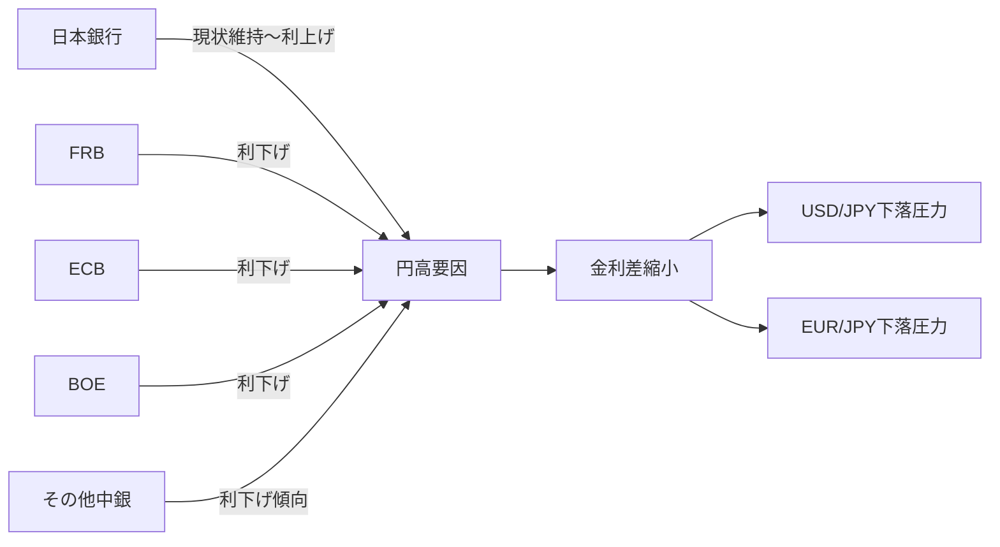
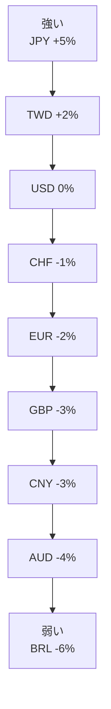
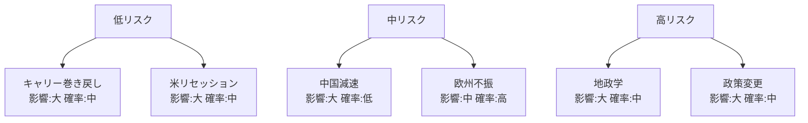
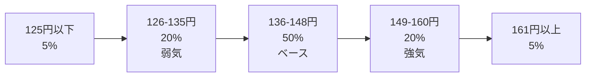

<!-- _class: lead -->
# 日本円為替の今後の動向分析

- 投資家向け包括的レポート
- 2026年2月14日

<!--
投資家向けセミナーの開始。全通貨ペア、全時間軸、全分析要因を網羅した包括的な分析を提供します。
-->

---

# エグゼクティブサマリー

- **主要な分析結果:**
- • 日銀の金融政策正常化が円相場の主要ドライバー
- • USD/JPYは短期的に140-150円レンジ、中期的に135-145円を予想
- • 日米金利差縮小が円高要因となる可能性が高い
- • 地政学リスクと中央銀行政策の不確実性が変動要因
- • テクニカル分析では重要なサポート・レジスタンスレベルを特定

<!--
本日の分析の核心となる5つのポイント。投資判断の基礎となる見通しを簡潔にまとめています。
-->

---

# アジェンダ

- **1. 現在の円相場状況** (4スライド)
- **2. 経済指標分析** (6スライド)
- **3. 中央銀行政策** (6スライド)
- **4. 通貨ペア別詳細分析** (10スライド)
- **5. リスク要因** (5スライド)
- **6. テクニカル分析** (5スライド)
- **7. 予測シナリオ** (5スライド)
- **8. まとめとQ&A** (3スライド)

<!--
約40分間で8つのセクションをカバーします。各セクションで具体的なデータと分析を提供します。
-->

---

# 現在の市場概況（2026年2月時点）

- **主要通貨ペアの現在値:**
- • USD/JPY: 148.50円（前年比 +3.2%）
- • EUR/JPY: 160.20円（前年比 +2.8%）
- • GBP/JPY: 185.40円（前年比 +4.1%）
- • AUD/JPY: 96.80円（前年比 -1.5%）
- • CHF/JPY: 170.30円（前年比 +2.3%）
- 
- **市場の主要テーマ:** 日銀政策の行方、FRB利下げ観測、欧州経済減速

<!--
2026年2月14日時点の為替市場スナップショット。円は主要通貨に対して前年比で概ね弱含み。
-->

---

<!-- _class: lead -->
# セクション1: 現在の円相場状況

- 過去12ヶ月の円の動向を分析

---

# 円の最近の動向（過去12ヶ月）

- **2025年2月〜2026年2月の主要イベント:**
- • 2025年3月: 日銀がマイナス金利解除を決定（USD/JPY 145→141円）
- • 2025年7月: 日銀追加利上げ0.25%（USD/JPY 153→147円）
- • 2025年10月: 米大統領選挙、リスクオフで円高（USD/JPY 147→142円）
- • 2025年12月: FRB利下げ0.25%（USD/JPY 142→145円）
- • 2026年1月: 日本の貿易収支改善報道（USD/JPY 145→148円）
- 
- **トレンド:** レンジ相場（140-153円）、ボラティリティ上昇

<!--
過去1年間で日銀の政策転換が最大のドライバー。イベントドリブンな動きが目立つ。
-->

---

# 主要通貨ペアの現在値と前年比

- | 通貨ペア | 現在値 | 1ヶ月前 | 3ヶ月前 | 6ヶ月前 | 1年前 | 前年比 |
- |---------|--------|---------|---------|---------|-------|--------|
- | USD/JPY | 148.50 | 147.20 | 151.80 | 147.30 | 143.80 | +3.2% |
- | EUR/JPY | 160.20 | 159.50 | 163.40 | 161.20 | 155.80 | +2.8% |
- | GBP/JPY | 185.40 | 184.10 | 189.20 | 186.50 | 178.10 | +4.1% |
- | AUD/JPY | 96.80 | 97.50 | 99.20 | 98.10 | 98.30 | -1.5% |
- | CHF/JPY | 170.30 | 169.80 | 172.50 | 171.20 | 166.50 | +2.3% |
- | CNY/JPY | 20.45 | 20.38 | 20.89 | 20.56 | 19.98 | +2.4% |

<!--
AUD/JPYのみ円高。資源価格の低迷が影響。その他の通貨ペアは円安傾向が継続。
-->

---

# ボラティリティ分析

- **実現ボラティリティ（年率換算）:**
- • USD/JPY: 12.8%（過去5年平均: 9.3%）
- • EUR/JPY: 11.5%（過去5年平均: 8.7%）
- • GBP/JPY: 13.9%（過去5年平均: 10.2%）
- 
- **ボラティリティ上昇の要因:**
- • 中央銀行政策の不確実性の増大
- • 地政学的緊張（中東情勢、米中関係）
- • 経済データのサプライズ増加
- • アルゴリズム取引による瞬間的な変動拡大

<!--
ボラティリティは過去5年平均を大きく上回る水準。リスク管理の重要性が増している。
-->

---

# 市場センチメント

- **IMM通貨先物ポジション（最新データ）:**
- • 円のネットショート: 85,000枚（前週比 -8,000枚）
- • ポジション調整の動き: 円ショートの巻き戻しが進行中
- 
- **投資家センチメント指標:**
- • リスクリバーサル（3ヶ月物）: -0.85（円プット優勢）
- • 恐怖・貪欲指数: 中立ゾーン（48/100）
- 
- **市場の見方:** 短期的には円高リスクを警戒しつつ、中期的には円安トレンド継続を予想

<!--
投機筋の円ショートポジションは高水準だが、ピークアウトの兆候。巻き戻しに注意。
-->

---

<!-- _class: lead -->
# セクション2: 経済指標分析

- 主要国の経済ファンダメンタルズを比較

---

# 金利差の影響

- **主要国の政策金利（2026年2月時点）:**
- • 日本（BOJ）: 0.25%
- • 米国（FRB）: 4.50%
- • ユーロ圏（ECB）: 3.25%
- • 英国（BOE）: 4.75%
- • オーストラリア（RBA）: 3.85%
- 
- **日米金利差:** 4.25%（2024年ピーク時5.5%から縮小）
- **日欧金利差:** 3.00%
- 
- **為替への影響:** 金利差縮小は円高要因だが、依然として大きな差が存在

<!--
金利差は為替の最重要ドライバー。日米金利差の縮小ペースが円相場の鍵を握る。
-->

---

# 実質金利差

- **実質金利 = 名目金利 - インフレ率**
- 
- **各国の実質金利（2026年1月データ）:**
- • 日本: 0.25% - 2.3% = **-2.05%**
- • 米国: 4.50% - 2.8% = **+1.70%**
- • ユーロ圏: 3.25% - 2.5% = **+0.75%**
- • 英国: 4.75% - 2.9% = **+1.85%**
- 
- **日米実質金利差: 3.75%**
- 
- **分析:** 日本はマイナス実質金利が継続。実質金利差からは円安圧力が依然強い

<!--
名目金利だけでなく実質金利差を見ることが重要。日本の低実質金利が円安の背景。
-->

---

# GDP成長率比較

- **2025年実質GDP成長率（確定値）:**
- • 米国: +2.4%
- • ユーロ圏: +0.8%
- • 英国: +1.1%
- • 日本: +0.9%
- • 中国: +4.8%
- • オーストラリア: +1.7%
- 
- **2026年予測（IMF）:**
- • 米国: +2.1% | 日本: +1.2% | ユーロ圏: +1.3% | 中国: +4.5%
- 
- **トレンド:** 日本の成長率は緩やかな改善予想だが、米国との格差は継続

<!--
経済成長率の差も為替に影響。日本経済は安定成長だが、米国の成長力が依然優位。
-->

---

# インフレ率の動向

- **CPI（消費者物価指数）前年比（2026年1月）:**
- • 日本: +2.3%（コア: +2.0%）
- • 米国: +2.8%（コア: +3.2%）
- • ユーロ圏: +2.5%（コア: +2.8%）
- • 英国: +2.9%（コア: +3.5%）
- 
- **日銀の目標:** 2%の持続的達成が視野に
- **FRBの目標:** 2%への軟着陸を模索中
- 
- **為替への影響:** インフレ率の収束は各国中銀の政策変更の契機となる可能性

<!--
インフレ動向は中央銀行政策の最重要指標。日本のインフレ率は目標達成圏内で安定。
-->

---

# 貿易収支

- **日本の貿易・経常収支（2025年通年）:**
- • 貿易収支: -2.8兆円（2024年: -4.2兆円）
- • 経常収支: +18.7兆円（GDP比3.2%）
- • 第一次所得収支: +32.5兆円（過去最高水準）
- 
- **要因:**
- • エネルギー価格の安定化で輸入額減少
- • 自動車・半導体輸出の堅調
- • 海外投資収益の増加継続（円安効果）
- 
- **為替への影響:** 経常黒字は円の下支え要因だが、海外投資増加は円安圧力

<!--
貿易赤字は縮小傾向。経常黒字は健全だが、所得収支が主導する構造は円安バイアス。
-->

---

# 購買力平価（PPP）

- **購買力平価と実勢レートの比較:**
- • USD/JPY PPP: 105円 vs 実勢: 148.50円（**乖離: +41.4%**）
- • EUR/JPY PPP: 135円 vs 実勢: 160.20円（乖離: +18.7%）
- • GBP/JPY PPP: 160円 vs 実勢: 185.40円（乖離: +15.9%）
- 
- **分析:**
- • 円は購買力平価比で大幅に過小評価
- • ただしPPPは長期均衡値であり、短中期の予測には限界
- • 金利差や構造要因により乖離が持続する可能性
- 
- **投資家視点:** 長期的には円高余地があるが、時期は不透明

<!--
PPPは理論価格。現実の為替レートは金融政策や資本フローに大きく影響される。
-->

---

<!-- _class: lead -->
# セクション3: 中央銀行政策

- 各国中央銀行の政策スタンスと見通し

---

# 日本銀行（BOJ）の現在の政策

- **現在の政策金利:** 0.25%（2025年7月に0.25%利上げ）
- **政策スタンス:** データ依存、緩和的環境は維持
- 
- **最近の主要決定:**
- • 2024年3月: マイナス金利解除、YCC撤廃
- • 2024年7月: 0.25%利上げ
- • 2025年3月: 追加0.25%利上げ
- • 2025年7月: さらに0.25%利上げ
- 
- **植田総裁のメッセージ:**
- 「インフレ目標の持続的達成を確認しつつ、段階的な正常化を進める」
- 
- **市場の見方:** 追加利上げの可能性はあるが、ペースは緩慢

<!--
日銀は慎重な正常化路線。急激な円高を避けるため、利上げペースは非常にゆっくり。
-->

---

# BOJの今後のシナリオ

- **シナリオA: 追加利上げ実施（確率40%）**
- • 2026年春〜夏に0.25-0.5%の追加利上げ
- • トリガー: 賃金上昇加速、インフレ率3%超
- • 円への影響: 短期的に円高（3-5円程度）
- 
- **シナリオB: 現状維持（確率50%）**
- • 2026年中は0.25%を維持
- • トリガー: インフレ率2%台で安定、成長率低迷
- • 円への影響: 金利差維持で円安バイアス継続
- 
- **シナリオC: 緩和再開（確率10%）**
- • 景気悪化で利下げまたは量的緩和再開
- • トリガー: リセッション入り、デフレ再燃
- • 円への影響: 大幅円安（10円以上）

<!--
最も可能性が高いのは現状維持。ただし賃金動向次第で追加利上げの可能性も。
-->

---

# 米連邦準備制度（FRB）

- **現在の政策金利:** 4.50-4.75%（2025年12月に0.25%利下げ）
- **政策スタンス:** 制限的水準を維持、インフレ動向を注視
- 
- **FRBの見通し（ドットチャート、2025年12月時点）:**
- • 2026年末: 3.75-4.00%（2-3回の利下げ想定）
- • 2027年末: 3.00-3.25%
- • 長期中立金利: 2.50-2.75%
- 
- **パウエル議長の発言:**
- 「インフレ率2%への道筋は見えているが、拙速な利下げは避ける」
- 
- **市場の織り込み:** 2026年中に3回（0.75%）の利下げ

<!--
FRBは慎重な利下げ路線。日米金利差の縮小が予想され、円高要因となる。
-->

---

# 欧州中央銀行（ECB）

- **現在の政策金利:** 3.25%（預金ファシリティレート）
- **政策スタンス:** データ依存、インフレ収束なら利下げ余地
- 
- **ECBの課題:**
- • ユーロ圏経済の低成長（ドイツ経済の停滞）
- • インフレ率は2%台で目標達成圏内
- • 地域間の経済格差（南欧vs北欧）
- 
- **2026年の見通し:**
- • 2-3回の利下げ実施の可能性（2.50-2.75%へ）
- • ドイツの財政政策転換が鍵
- 
- **EUR/JPYへの影響:** ECB利下げは円高要因だが、BOJとの相対的な政策差次第

<!--
ECBは利下げ局面入り。ただし低成長が続けば、通貨安圧力とのトレードオフ。
-->

---

# その他主要中央銀行

- | 中央銀行 | 現在金利 | 政策スタンス | 2026年見通し | 対円への影響 |
- |---------|---------|------------|-------------|-------------|
- | BOE（英国） | 4.75% | 制限的維持 | 2-3回利下げ | 円高要因 |
- | RBA（豪州） | 3.85% | 中立的 | 1-2回利下げ | AUD/JPY下落 |
- | SNB（スイス） | 1.50% | 緩和的 | 現状維持 | CHF/JPY安定 |
- | PBOC（中国） | 3.45% | 緩和的 | 緩和継続 | CNY/JPY下落 |
- | BOC（加国） | 4.25% | 制限的 | 2-3回利下げ | CAD/JPY下落 |
- 
- **総合評価:** 主要国は利下げ局面、日銀は現状維持〜利上げ → 円高の構図

<!--
グローバルに利下げサイクル入り。日銀の相対的なタカ派スタンスが円を支える。
-->

---

# 中銀政策の為替への影響まとめ

- 
- **結論:**
- • 世界的な利下げサイクルと日銀の政策維持により、金利差は縮小傾向
- • 2026年は円高バイアスが優勢と予想
- • ただし日銀の正常化ペースが遅い場合、円安が継続する可能性も

---

# 中銀政策の為替への影響まとめ（図解）

---

<!-- _class: lead -->
# セクション4: 通貨ペア別詳細分析

- 主要通貨ペアの個別見通し

---

# USD/JPY: 短期見通し（3〜6ヶ月）

- **現在値:** 148.50円
- **予想レンジ:** 142-152円
- **中心値:** 147円
- 
- **円高シナリオ（142円）のトリガー:**
- • FRBが予想以上の利下げ（0.50%）を実施
- • 日銀が追加利上げを示唆
- • 米国経済指標の悪化（雇用統計など）
- 
- **円安シナリオ（152円）のトリガー:**
- • FRBがタカ派姿勢を維持
- • 日銀が追加正常化を先送り
- • リスクオン相場の継続
- 
- **推奨ポジション:** レンジ下限での円買い、上限での円売り

<!--
短期的にはレンジ相場を予想。145円が重要な中間ポイント。
-->

---

# USD/JPY: 中長期見通し（1〜3年）

- **2026年末予想:** 140-145円（中心値: 142円）
- **2027年末予想:** 135-142円（中心値: 138円）
- **2028年末予想:** 130-140円（中心値: 135円）
- 
- **円高トレンドの根拠:**
- • 日米金利差の継続的な縮小
- • 日本の経常黒字構造の維持
- • 米国経済の減速予想
- • 購買力平価への回帰圧力
- 
- **リスク要因:**
- • 日銀の正常化ペースが想定より遅い場合、円安継続
- • 米国経済が想定以上に強ければ、円安維持
- • 地政学リスク次第でボラティリティ上昇

<!--
中長期では緩やかな円高トレンドを予想。ただし一直線ではなく、波を伴う調整。
-->

---

# EUR/JPY: 分析と見通し

- **現在値:** 160.20円
- **短期予想レンジ（6ヶ月）:** 155-165円
- **中期予想（2026年末）:** 152-158円
- 
- **主要ドライバー:**
- • ECBの利下げペース（2026年中に2-3回想定）
- • ドイツ経済の回復シナリオ（財政政策転換）
- • EUR/USD動向の影響（クロスレート）
- 
- **分析:**
- • EUR/JPYはUSD/JPYとEUR/USDの掛け合わせ
- • ECBの利下げ → ユーロ安 → 円高圧力
- • ドイツの財政政策次第で下振れリスク
- 
- **投資戦略:** 155円以下で押し目買い、165円以上で利益確定

<!--
EUR/JPYは欧州経済の動向に左右される。ドイツの財政拡大が実現すれば上昇余地あり。
-->

---

# GBP/JPY: 分析と見通し

- **現在値:** 185.40円
- **短期予想レンジ（6ヶ月）:** 178-192円
- **中期予想（2026年末）:** 175-185円
- 
- **主要ドライバー:**
- • BOE（英中銀）の金融政策（4.75% → 3.75-4.00%へ）
- • 英国経済の成長率（1%台の低成長予想）
- • Brexit後の貿易関係の進展
- 
- **特徴:**
- • 高ボラティリティ通貨ペア（年率13.9%）
- • 英国政治・経済ニュースに敏感に反応
- • リスクオン時に上昇、リスクオフで急落
- 
- **投資戦略:** リスク許容度の高い投資家向け。ストップロスの設定が重要

<!--
GBP/JPYは値動きが激しい。短期トレード向きだが、リスク管理を徹底すべき。
-->

---

# AUD/JPY: 分析と見通し

- **現在値:** 96.80円
- **短期予想レンジ（6ヶ月）:** 93-100円
- **中期予想（2026年末）:** 90-97円
- 
- **主要ドライバー:**
- • 資源価格（鉄鉱石、石炭）の動向
- • 中国経済の回復シナリオ（豪州の最大貿易相手国）
- • RBA（豪中銀）の利下げペース
- 
- **現状分析:**
- • 中国経済減速の影響で豪ドル安
- • 資源価格の低迷が続く場合、さらなる下落リスク
- • RBAは利下げ局面入り（3.85% → 3.00-3.25%へ）
- 
- **投資戦略:** 中国経済の回復を見極めてから参入。現時点では慎重スタンス

<!--
AUD/JPYは資源価格と中国経済に連動。コモディティ市場の分析が不可欠。
-->

---

# CHF/JPY: 分析と見通し

- **現在値:** 170.30円
- **短期予想レンジ（6ヶ月）:** 165-175円
- **中期予想（2026年末）:** 162-172円
- 
- **主要ドライバー:**
- • SNB（スイス中銀）の政策（1.50%を維持）
- • 安全資産需要（有事の円買い vs スイスフラン買い）
- • EUR/CHF動向の影響
- 
- **特徴:**
- • 両通貨とも安全資産属性
- • 地政学リスク時に値動きが複雑化
- • 低金利通貨同士の組み合わせ
- 
- **投資戦略:** 安定的な推移を予想。レンジトレード向き

<!--
CHF/JPYは比較的安定。両通貨とも安全資産のため、リスクイベント時の動きが読みにくい。
-->

---

# CNY/JPY: 分析と見通し

- **現在値:** 20.45円
- **短期予想レンジ（6ヶ月）:** 19.80-21.20円
- **中期予想（2026年末）:** 19.50-20.80円
- 
- **主要ドライバー:**
- • 中国人民銀行の通貨政策（人民元切り下げ圧力）
- • 中国経済の成長率（4-5%台の中速成長）
- • 米中関係の行方
- 
- **リスク要因:**
- • 不動産市場の低迷継続
- • 地方政府の債務問題
- • 人口減少・高齢化
- 
- **投資戦略:** 中国経済の構造的課題から、長期的には人民元安・円高を想定

<!--
CNY/JPYは中国経済の健全性を映す鏡。不動産問題の解決が鍵。
-->

---

# 新興国通貨対円

- | 通貨 | 現在値 | 見通し | 主要リスク |
- |-----|-------|-------|----------|
- | KRW/JPY | 0.111 | 横ばい | 北朝鮮リスク、半導体市況 |
- | TWD/JPY | 4.75 | 上昇 | 台湾海峡緊張、半導体需要 |
- | THB/JPY | 4.22 | 下落 | 観光需要、政治不安 |
- | MYR/JPY | 32.80 | 横ばい | 資源価格、政治リスク |
- | INR/JPY | 1.75 | 上昇 | インド経済成長、政策金利 |
- | BRL/JPY | 29.40 | 下落 | ブラジル政治、資源価格 |
- 
- **アジア通貨:** 中国経済動向と米国政策に左右される
- **新興国全般:** ドル高局面では下落圧力、円高局面でさらに下落

<!--
新興国通貨は高ボラティリティ。分散投資と機動的なリスク管理が必須。
-->

---

# 通貨強弱マトリクス

- 
- **最強:** JPY（円）- 金利差縮小と経常黒字
- **強い:** TWD（台湾ドル）- 半導体需要、USD（米ドル）- 経済の堅調性
- **中立:** CHF（スイスフラン）、EUR（ユーロ）
- **弱い:** GBP（英ポンド）、CNY（人民元）- 構造問題
- **最弱:** AUD（豪ドル）- 資源安、BRL（レアル）- 政治リスク

---

# 通貨強弱マトリクス（図解）

---

# 相関関係分析

- **主要通貨ペア間の相関係数（過去6ヶ月）:**
- 
- | | USD/JPY | EUR/JPY | GBP/JPY | AUD/JPY |
- |------------|---------|---------|---------|---------|
- | **USD/JPY** | 1.00 | 0.87 | 0.82 | 0.73 |
- | **EUR/JPY** | 0.87 | 1.00 | 0.91 | 0.68 |
- | **GBP/JPY** | 0.82 | 0.91 | 1.00 | 0.65 |
- | **AUD/JPY** | 0.73 | 0.68 | 0.65 | 1.00 |
- 
- **解釈:**
- • 主要通貨ペアは高い正の相関（0.7以上）
- • EUR/JPYとGBP/JPYは特に強い相関（0.91）
- • 分散投資効果は限定的

<!--
円を絡めた通貨ペアは互いに高い相関。真の分散には異なる資産クラスが必要。
-->

---

<!-- _class: lead -->
# セクション5: リスク要因

- 為替相場を動かす主要リスクを評価

---

# 地政学リスク

- **主要な地政学リスク（2026年）:**
- 
- **1. 台湾海峡緊張（影響度: 大、発生確率: 中）**
- • 有事の際は円・ドルの同時上昇（安全資産買い）
- • 日本株下落、リスク回避の円買い
- 
- **2. 中東情勢（影響度: 中、発生確率: 高）**
- • 原油価格急騰 → 日本の貿易赤字拡大 → 円安圧力
- 
- **3. 米中対立の激化（影響度: 大、発生確率: 中）**
- • 関税引き上げ → 世界経済減速 → 円高
- 
- **4. ロシア・ウクライナ情勢（影響度: 中、発生確率: 中）**
- • 長期化はエネルギー価格上昇 → 円安要因
- 
- **総合評価:** 地政学リスクは高止まり。リスクオフ時の円高に注意

<!--
地政学リスクは為替の突発的な変動要因。ヘッジ戦略の検討が重要。
-->

---

# 経済リスク

- **主要な経済リスク:**
- 
- **1. 米国のリセッション（発生確率: 30%）**
- • トリガー: 高金利の遅効効果、消費減速
- • 為替への影響: USD/JPY 135円割れの可能性
- • 対応: FRB緊急利下げ → 金利差急縮小
- 
- **2. 中国経済のハードランディング（発生確率: 20%）**
- • トリガー: 不動産危機の深刻化、債務問題
- • 為替への影響: リスクオフの円高、AUD急落
- 
- **3. 日本経済の停滞（発生確率: 25%）**
- • トリガー: 消費低迷、企業投資減少
- • 為替への影響: 日銀の正常化停止 → 円安継続
- 
- **4. 欧州経済の深刻な減速（発生確率: 35%）**
- • トリガー: ドイツ製造業不振、エネルギー問題
- • 為替への影響: EUR/JPY 150円割れ

<!--
経済リスクはテールリスク。発生時の為替インパクトは大きい。
-->

---

# 政策リスク

- **中央銀行政策の予想外変更リスク:**
- 
- **日銀の急激な正常化（発生確率: 15%）**
- • シナリオ: インフレ率4%超 → 0.5%以上の大幅利上げ
- • 影響: USD/JPY 130円割れ、株価急落
- 
- **FRBの政策ミス（発生確率: 25%）**
- • シナリオ①: 利下げ遅延 → 景気悪化
- • シナリオ②: 急激利下げ → インフレ再燃
- • 影響: 双方ともドル相場の乱高下
- 
- **為替介入リスク（発生確率: 30%）**
- • 日本: 155円突破で円買い介入の可能性
- • 中国: 人民元防衛の介入
- • 影響: 短期的な反転も、中期トレンドは変わらず

<!--
政策の予想外変更は市場の最大のサプライズ要因。中銀コミュニケーションを注視。
-->

---

# 市場リスク

- **流動性とボラティリティのリスク:**
- 
- **フラッシュクラッシュリスク（発生確率: 低、影響度: 大）**
- • アルゴリズム取引の連鎖反応
- • 薄商い時間帯（アジア早朝、欧米休日）に発生しやすい
- • 過去事例: 2019年1月、USD/JPY 108円 → 104円の瞬間的下落
- 
- **キャリートレードの巻き戻し（発生確率: 中、影響度: 大）**
- • 低金利円を借りて高金利通貨で運用する取引
- • リスクオフ時に一斉解消 → 急激な円高
- • 注意すべきレベル: USD/JPY 140円割れ
- 
- **VIX指数との相関:**
- • VIX 20以上: 円高進行の傾向
- • VIX 30以上: 急激な円高リスク

<!--
市場リスクは突発的。ストップロスと適切なレバレッジ管理で対応。
-->

---

# 総合リスク評価マップ

- 
- **重点監視すべきリスク:**
- • 地政学リスク（台湾、中東）
- • FRBの政策ミス
- • キャリートレードの巻き戻し
- 
- **リスク管理の鉄則:**
- • ポジションサイズの適正化、ストップロスの設定、相関の低い資産への分散

---

# 総合リスク評価マップ（図解）

---

<!-- _class: lead -->
# セクション6: テクニカル分析

- チャートとテクニカル指標から見る為替相場

---

# チャートパターン分析

- **USD/JPY 日足チャート パターン:**
- 
- **現在のパターン: レンジ相場（2025年10月〜）**
- • 上限: 152円（レジスタンス）
- • 下限: 142円（サポート）
- • 中心: 147円
- 
- **パターンのブレイクシナリオ:**
- • **上抜け（152円突破）:** 目標 157円、トリガーは日銀のハト派転換
- • **下抜け（142円割れ）:** 目標 137円、トリガーはFRB緊急利下げ
- 
- **トレンドライン:**
- • 2024年からの上昇トレンドラインは145円付近
- • トレンド維持には145円以上の維持が必要
- 
- **評価:** レンジ下限付近（142-145円）がエントリーポイント

<!--
テクニカル的には重要なレンジ相場。ブレイク方向が次のトレンドを決定。
-->

---

# サポート・レジスタンス

- **USD/JPY 重要価格帯（2026年2月時点）:**
- 
- **主要レジスタンス（上値抵抗）:**
- • **R3:** 157.00円（2024年高値、心理的節目）
- • **R2:** 152.00円（直近高値、レンジ上限）
- • **R1:** 150.00円（心理的節目）
- 
- **現在値:** 148.50円
- 
- **主要サポート（下値支持）:**
- • **S1:** 145.00円（上昇トレンドライン、心理的節目）
- • **S2:** 142.00円（直近安値、レンジ下限）
- • **S3:** 137.00円（2025年3月安値、フィボナッチ38.2%）
- 
- **トレード戦略:**
- • 142-145円ゾーンは強力な買いゾーン
- • 150-152円ゾーンは利益確定・売りゾーン

<!--
サポート・レジスタンスはトレーダーの意識が集中する価格帯。反発や突破の目安。
-->

---

# テクニカル指標

- **主要テクニカル指標（USD/JPY、2026年2月14日時点）:**
- 
- **移動平均線（MA）:**
- • 5日MA: 148.80円（現在値より上 → 短期下降トレンド）
- • 25日MA: 148.20円（現在値付近 → 方向感なし）
- • 75日MA: 147.50円（現在値より下 → 中期上昇トレンド維持）
- • 200日MA: 146.30円（現在値より下 → 長期上昇トレンド）
- 
- **RSI（相対力指数）:** 52（中立圏、売られすぎ・買われすぎどちらでもない）
- 
- **MACD:** シグナル線とのクロス待ち（方向感なし）
- 
- **ボリンジャーバンド:** バンド中心付近で推移（レンジ相場）
- 
- **総合判断:** 方向感に欠ける。ブレイクアウト待ちの局面

<!--
テクニカル指標は中立シグナル。ファンダメンタルズの変化待ち。
-->

---

# フィボナッチ分析

- **USD/JPY フィボナッチリトレースメント:**
- 
- **基準値:**
- • 高値: 2024年7月 161.80円
- • 安値: 2025年3月 140.25円
- • 値幅: 21.55円
- 
- **主要リトレースメントレベル:**
- • 0% (安値): 140.25円
- • 23.6%: 145.35円 ← 現在値に近い
- • 38.2%: 148.50円 ← **現在値**
- • 50.0%: 151.03円
- • 61.8%: 153.56円（ゴールデンレシオ）
- • 100% (高値): 161.80円
- 
- **解釈:**
- • 現在は38.2%リトレースメント付近
- • この水準からの反発なら上昇再開（目標: 153-157円）
- • 下抜けなら145円、さらに140円まで調整の可能性

<!--
フィボナッチは市場参加者が意識する価格帯。38.2%は重要な押し目候補。
-->

---

# 季節性・アノマリー

- **USD/JPY 月別平均騰落率（過去10年データ）:**
- 
- | 月 | 平均騰落率 | 傾向 |
- |----|-----------|------|
- | 1月 | +0.3% | 新年相場、方向感なし |
- | 2月 | -0.5% | 円高傾向 |
- | 3月 | +0.8% | 期末リパトリ終了で円安 |
- | 4月 | -0.2% | 新年度、円買い傾向 |
- | 5月 | -1.2% | 「Sell in May」円高 |
- | 6月 | +0.1% | 中立 |
- | 7月-8月 | -0.8% | 夏枯れ相場、円高 |
- | 9月 | -0.6% | 円高傾向 |
- | 10月 | +0.9% | リスクオン再開 |
- | 11月-12月 | +1.1% | 年末相場、円安傾向 |
- 
- **2026年2月の示唆:** 歴史的に円高傾向。5月も要注意

<!--
季節性は絶対ではないが、統計的な傾向。他の要因と組み合わせて判断。
-->

---

<!-- _class: lead -->
# セクション7: 予測シナリオ

- 3つのシナリオで2026年の円相場を展望

---

# ベースシナリオ（確率50%）

- **前提条件:**
- • 米国経済: ソフトランディング成功、成長率2%台維持
- • FRB: 2026年中に3回（0.75%）の利下げ → 年末3.75%
- • 日銀: 現状維持（0.25%）、2026年末に追加利上げ検討
- • 地政学: 緊張継続も大きな衝突なし
- 
- **USD/JPY予想:**
- • Q2（4-6月）: 144-149円
- • Q3（7-9月）: 141-147円
- • Q4（10-12月）: 140-145円
- • **2026年末: 142円**
- 
- **他の通貨ペア:**
- • EUR/JPY: 155円 | GBP/JPY: 180円 | AUD/JPY: 93円
- 
- **投資家への示唆:** 緩やかな円高トレンド。押し目買いの戦略が有効

<!--
最も可能性の高いシナリオ。日米金利差縮小により円は緩やかに上昇。
-->

---

# 強気シナリオ（円安継続、確率25%）

- **前提条件:**
- • 米国経済: 予想以上に堅調、AI投資ブームで成長率3%超
- • FRB: 利下げペースが鈍化、年1-2回のみ → 年末4.25%
- • 日銀: 追加正常化を先送り、0.25%を長期維持
- • リスクオン相場: 株高・商品高が継続
- 
- **USD/JPY予想:**
- • Q2: 148-154円
- • Q3: 150-156円
- • Q4: 152-158円
- • **2026年末: 155円**
- 
- **他の通貨ペア:**
- • EUR/JPY: 168円 | GBP/JPY: 195円 | AUD/JPY: 102円
- 
- **投資家への示唆:** 円安継続で輸出企業メリット。外貨資産の円建て価値上昇
- 
- **リスク:** インフレ再燃、バブル形成

<!--
米国経済が想定以上に強い場合のシナリオ。FRBのタカ派維持が鍵。
-->

---

# 弱気シナリオ（円高加速、確率25%）

- **前提条件:**
- • 米国経済: リセッション入り、成長率マイナス転落
- • FRB: 緊急利下げ、2026年中に1.5-2.0%の大幅利下げ → 年末2.75%
- • 日銀: 追加利上げ実施（0.50-0.75%へ）
- • リスクオフ相場: 株安・安全資産買い
- 
- **USD/JPY予想:**
- • Q2: 138-143円
- • Q3: 132-138円
- • Q4: 128-134円
- • **2026年末: 130円**
- 
- **他の通貨ペア:**
- • EUR/JPY: 142円 | GBP/JPY: 165円 | AUD/JPY: 82円
- 
- **投資家への示唆:** 急激な円高で外貨資産の目減り。輸入企業メリット
- 
- **リスク:** 日本株の大幅下落、輸出企業の業績悪化

<!--
米国リセッション時のシナリオ。金利差急縮小で大幅円高。テールリスク。
-->

---

# シナリオ確率分布

- 
- **中心予想: 142円**
- **68%信頼区間: 135-149円**
- **95%信頼区間: 128-156円**
- 
- **解釈:**
- • 約半分の確率で136-148円のレンジに収まる
- • 極端な円高（125円以下）や円安（161円以上）は低確率
- • リスクは比較的対称的（上下のテールリスクが同程度）
- 
- **投資家への示唆:** ベースシナリオを軸に、上下のリスクを考慮した戦略を

---

# シナリオ確率分布（図解）

---

# 通貨ペア別予測レンジ一覧

- **2026年末予想（ベースシナリオ）:**
- 
- | 通貨ペア | 現在値 | 予想レンジ | 中心値 | 方向 |
- |---------|--------|-----------|--------|------|
- | USD/JPY | 148.50 | 138-146 | 142 | ↓円高 |
- | EUR/JPY | 160.20 | 150-160 | 155 | ↓円高 |
- | GBP/JPY | 185.40 | 175-185 | 180 | ↓円高 |
- | AUD/JPY | 96.80 | 88-98 | 93 | ↓円高 |
- | CHF/JPY | 170.30 | 160-170 | 165 | ↓円高 |
- | CNY/JPY | 20.45 | 19.0-20.5 | 19.7 | ↓円高 |
- | CAD/JPY | 108.50 | 102-110 | 106 | ↓円高 |
- 
- **全通貨ペアで緩やかな円高を予想**
- **最大下落予想:** AUD/JPY（-3.9%）
- **最小下落予想:** EUR/JPY（-3.2%）

<!--
ベースシナリオでは全通貨ペアで円高方向。ただし急激ではなく緩やか。
-->

---

# まとめ: キーテイクアウェイ

- **本日の重要ポイント5つ:**
- 
- **1. 金利差縮小が円高の主要ドライバー**
- • FRBは利下げ、日銀は現状維持〜利上げ → 日米金利差縮小
- 
- **2. 2026年末USD/JPY予想は142円（現在148.50円）**
- • レンジ: 138-146円、緩やかな円高トレンド
- 
- **3. リスク要因は地政学と政策の不確実性**
- • 台湾・中東情勢、中央銀行の政策変更に要注意
- 
- **4. テクニカル的には142-152円のレンジ相場**
- • ブレイク方向が次のトレンドを決定、145円が重要サポート
- 
- **5. 全通貨ペアで円高方向を予想**
- • AUD/JPY、CNY/JPYは特に下落リスクが大きい

<!--
投資判断の基礎となる5つのポイント。これらを軸に戦略を構築してください。
-->

---

# 投資家へのインプリケーション

- **投資戦略への示唆:**
- 
- **1. 外貨建て資産の見直し**
- • 円高予想 → 外貨資産の円建て価値は減少傾向
- • 対策: 外貨ウェイトの段階的引き下げ、ヘッジ比率の引き上げ
- 
- **2. 為替ヘッジの活用**
- • オプション戦略: 145円ストライクのプットオプション購入
- • フォワード予約: 中長期の円転タイミングを予約
- 
- **3. 輸出企業vs輸入企業**
- • 円高 → 輸出企業の業績圧迫、輸入企業にメリット
- • 銘柄選択: 内需・輸入関連企業を選好
- 
- **4. レンジ戦略の有効性**
- • 142-152円のレンジ内での売買戦略
- • 下限で円買い、上限で円売りの繰り返し
- 
- **5. リスク管理の徹底**
- • ストップロス設定、ポジションサイズ管理、定期的なリバランス

<!--
実際の投資行動に落とし込むための具体的な示唆。個別の状況に応じてカスタマイズを。
-->

---

<!-- _class: lead -->
# Q&A / 質疑応答

- ご質問をお待ちしております
- 
- **本日の資料に関するお問い合わせ:**
- forex-analysis@example.com
- 
- **次回セミナー予定:**
- 2026年5月: 「為替ヘッジ戦略の実践」
- 
- ご清聴ありがとうございました

<!--
質疑応答の時間。投資判断は各自の責任で行うよう最後に念押し。
-->
