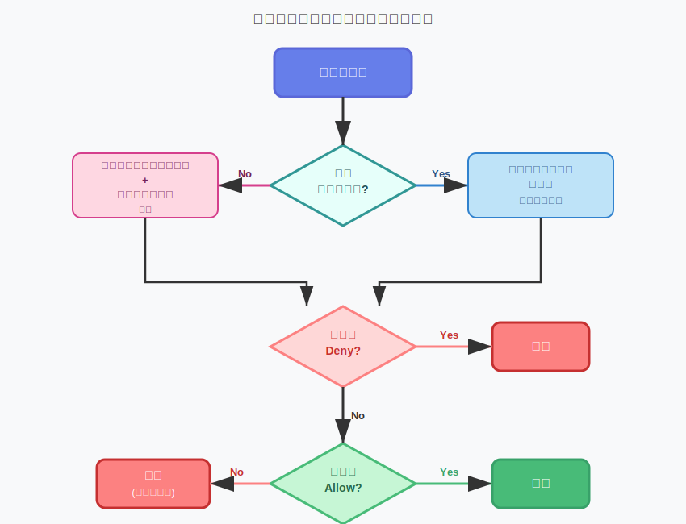
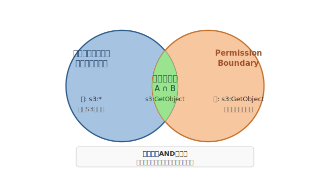

# AWS IAMの権限管理
完全ガイド

- ポリシー、ロール、トラストポリシー、リソースポリシー
- AssumeRoleから権限の境界まで徹底解説


---

# アジェンダ (1/2)

- **IAM基礎** - 認証・認可の概念整理
- **IAMポリシー詳細** - 構造、評価ロジック、ABAC
- **IAMロール詳細** - トラストポリシー、AssumeRole
- **リソースポリシー** - アイデンティティベースとの違い
- **権限の境界** - Permission Boundariesの活用


---

# アジェンダ (2/2)

- **SCP** - Organizationsとの統合、評価順序
- **高度なトピック** - SAML/WebIdentity、外部ID
- **ベストプラクティス** - 設計パターン、監査
- **トラブルシューティング** - 権限エラーの診断


---

# IAMの全体像

- **Identity and Access Management (IAM)** - AWSリソースへのアクセスを安全に制御
- **プリンシパル** - ユーザー、ロール、サービス
- **リソース** - S3、EC2、Lambda等のAWSサービス
- **ポリシー** - JSON形式の権限定義ドキュメント
- **評価エンジン** - リクエスト時に権限を判定


---

# IAMの全体像（図解）


---

# 認証 vs 認可

- **認証 (Authentication)** - 「あなたは誰か？」
-   - アクセスキー、パスワード、一時認証情報
-   - AssumeRoleで取得したセッショントークン
- **認可 (Authorization)** - 「何ができるか？」
-   - IAMポリシーによる権限評価
-   - リソース、アクション、条件の組み合わせ
- **IAMはこの両方を管理する基盤**


---

# プリンシパルとリソース

- **プリンシパル** - リクエストを行う主体
-   - IAMユーザー (長期認証情報)
-   - IAMロール (一時認証情報)
-   - AWSサービス (ec2.amazonaws.com等)
-   - フェデレーテッドユーザー (SAML/OIDC)
- **リソース** - アクセスされる対象
-   - S3バケット、EC2インスタンス、Lambda関数等
-   - ARNで一意に識別


---

# IAMポリシーの基本構造

- **Version** - 常に `2012-10-17` を使用
- **Statement** - 権限定義の配列 (複数可)
- **Sid** - ステートメントID (オプション、説明用)
- **Effect** - `Allow` または `Deny`
- **Action** - 許可/拒否するAPI操作
- **Resource** - 対象リソースのARN


---

# IAMポリシーの基本構造（コード例）

```json
{
  "Version": "2012-10-17",
  "Statement": [
    {
      "Sid": "AllowS3Read",
      "Effect": "Allow",
      "Action": ["s3:GetObject", "s3:ListBucket"],
      "Resource": [
        "arn:aws:s3:::my-bucket",
        "arn:aws:s3:::my-bucket/*"
      ]
    }
  ]
}
```


---

# ポリシー評価ロジック - 明示的Deny優先

- **1. デフォルト: Deny** - 何も許可されていない状態からスタート
- **2. 明示的Allow** - いずれかのポリシーでAllowがあれば許可候補
- **3. 明示的Deny** - 1つでもDenyがあれば拒否確定
- **4. 最終判定** - Denyがなく、Allowがあれば許可
- **重要**: Denyは常にAllowを上書き


---

# ポリシー評価ロジック - 明示的Deny優先（図解）


---

# 管理ポリシー vs インラインポリシー

- **管理ポリシー (Managed Policy)**
-   - 独立したエンティティ、複数のプリンシパルにアタッチ可
-   - AWS管理ポリシー (AWSが提供) とカスタマー管理ポリシー
-   - バージョン管理、ロールバック可能
- **インラインポリシー (Inline Policy)**
-   - プリンシパルに直接埋め込み、1対1の関係
-   - プリンシパル削除時に一緒に削除される
- **使い分け**: 再利用するなら管理、1回限りならインライン


---

# ポリシー変数 - 動的な権限制御

- **${aws:username}** - IAMユーザー名
- **${aws:userid}** - 一意のユーザーID
- **${aws:PrincipalTag/キー}** - プリンシパルのタグ値
- **${aws:RequestedRegion}** - リクエストされたリージョン
- **ユースケース**: ユーザーごとのフォルダ分離、タグベースアクセス


---

# ポリシー変数 - 動的な権限制御（コード例）

```json
{
  "Effect": "Allow",
  "Action": "s3:*",
  "Resource": "arn:aws:s3:::my-bucket/${aws:username}/*",
  "Condition": {
    "StringEquals": {
      "s3:ExistingObjectTag/owner": "${aws:username}"
    }
  }
}
```


---

# Conditionキー - 詳細な条件制御

- **グローバル条件キー**: SourceIp, CurrentTime, SecureTransport等
- **サービス固有キー**: s3:prefix, ec2:InstanceType等
- **演算子**: StringEquals, NumericLessThan, DateGreaterThan, IpAddress等


---

# Conditionキー - 詳細な条件制御（コード例）

```json
{
  "Condition": {
    "IpAddress": {
      "aws:SourceIp": "203.0.113.0/24"
    },
    "DateGreaterThan": {
      "aws:CurrentTime": "2026-01-01T00:00:00Z"
    },
    "StringLike": {
      "s3:prefix": ["home/${aws:username}/*"]
    },
    "Bool": {
      "aws:SecureTransport": "true"
    }
  }
}
```


---

# タグベースアクセス制御 (ABAC)

- **Attribute-Based Access Control** - 属性に基づく動的な権限管理
- **プリンシパルタグ** - ユーザー/ロールにタグを付与
- **リソースタグ** - S3、EC2等のリソースにタグを付与
- **ポリシーで比較** - `aws:PrincipalTag` と `リソースタグ` を照合
- **スケーラビリティ**: 新しいリソースを追加してもポリシー変更不要
- **例**: `Project=Alpha` タグを持つユーザーは、同じタグのリソースのみアクセス可


---

# ABAC実装例

- プリンシパルの `Project` と `CostCenter` タグが一致するEC2のみ操作可
- 新規プロジェクト追加時もポリシー変更不要
- タグ管理が鍵: 命名規則、必須タグの強制


---

# ABAC実装例（コード例）

```json
{
  "Effect": "Allow",
  "Action": ["ec2:StartInstances", "ec2:StopInstances"],
  "Resource": "*",
  "Condition": {
    "StringEquals": {
      "ec2:ResourceTag/Project": "${aws:PrincipalTag/Project}",
      "ec2:ResourceTag/CostCenter": "${aws:PrincipalTag/CostCenter}"
    }
  }
}
```


---

# IAMロールの概念

- **一時的な権限** - 長期認証情報を持たない
- **AssumeRole** - ロールを引き受けて一時認証情報を取得
- **セッショントークン** - AccessKeyId, SecretAccessKey, SessionToken
- **有効期限** - デフォルト1時間、最大12時間
- **ユースケース**:
-   - EC2インスタンスからのAWSサービスアクセス
-   - クロスアカウントアクセス
-   - フェデレーション (SAML/OIDC)


---

# トラストポリシーの構造

- **Principal** - 誰がAssumeRoleできるか
- **Action** - 通常は `sts:AssumeRole`
- **Condition** - 追加の制約 (ExternalId等)
- **重要**: トラストポリシーはロール側で定義


---

# トラストポリシーの構造（コード例）

```json
{
  "Version": "2012-10-17",
  "Statement": [
    {
      "Effect": "Allow",
      "Principal": {
        "AWS": "arn:aws:iam::123456789012:root"
      },
      "Action": "sts:AssumeRole",
      "Condition": {
        "StringEquals": {
          "sts:ExternalId": "unique-external-id"
        }
      }
    }
  ]
}
```


---

# AssumeRoleの仕組み

- **STS (Security Token Service)** - 一時認証情報を発行
- **トラストポリシー** - AssumeRoleの可否を判定
- **権限ポリシー** - ロールの権限を定義
- 両方が `Allow` で初めて操作可能


---

# AssumeRoleの仕組み（図解）


---

# 一時認証情報の詳細

- **構成要素**:
-   - `AccessKeyId` - ASIA... で始まる (一時的の証)
-   - `SecretAccessKey`
-   - `SessionToken` - 必須、これがないと認証失敗
- **有効期限**:
-   - `Expiration` - ISO8601形式のタイムスタンプ
-   - 期限切れ前に再度AssumeRoleが必要
- **セキュリティ**: 短命なので漏洩リスクが低い


---

# クロスアカウントアクセス

- **両側で許可が必要**: トラストポリシー + AssumeRole権限
- **外部ID**: 混乱した代理問題の対策 (後述)
- **監査**: CloudTrailで両アカウントの操作を追跡


---

# クロスアカウントアクセス（コード例）

```json
// アカウントBのロールのトラストポリシー
{
  "Effect": "Allow",
  "Principal": {
    "AWS": "arn:aws:iam::111111111111:root"
  },
  "Action": "sts:AssumeRole"
}

// アカウントAのユーザーポリシー
{
  "Effect": "Allow",
  "Action": "sts:AssumeRole",
  "Resource": "arn:aws:iam::222222222222:role/CrossAccountRole"
}
```


---

# サービスロール

- **AWSサービスがAssumeRoleする**
-   - EC2インスタンスプロファイル
-   - Lambda実行ロール
-   - ECSタスクロール
- **トラストポリシーのPrincipal**:
-   - `"Service": "ec2.amazonaws.com"`
-   - `"Service": "lambda.amazonaws.com"`
- **ベストプラクティス**: サービスごとに専用ロールを作成
- **最小権限**: 必要なアクションのみ許可


---

# サービスリンクロール

- **AWSサービスが自動作成・管理するロール**
-   - 例: `AWSServiceRoleForAutoScaling`
- **特徴**:
-   - 名前が `AWSServiceRoleFor...` で始まる
-   - ポリシーは AWS が管理 (変更不可)
-   - サービスが必要に応じて自動作成
- **削除**: サービスのリソースがすべて削除された後のみ可能
- **用途**: サービスが他のAWSサービスを呼び出すための権限


---

# リソースベースポリシーとは

- **リソース側で定義する権限**
-   - S3バケットポリシー
-   - Lambda関数ポリシー
-   - SNSトピックポリシー
-   - SQSキューポリシー
- **アイデンティティベースとの違い**:
-   - アイデンティティ: 「誰が何をできるか」 (プリンシパル側)
-   - リソース: 「誰にアクセスを許可するか」 (リソース側)
- **両方が必要な場合と不要な場合がある**


---

# リソースポリシーの構造

- **Principal要素** - 誰に許可するか (アイデンティティベースにはない)
- **Resource** - このポリシーが適用されるリソース
- **クロスアカウント**: Principalに他アカウントのARNを指定可


---

# リソースポリシーの構造（コード例）

```json
{
  "Version": "2012-10-17",
  "Statement": [
    {
      "Sid": "AllowCrossAccountAccess",
      "Effect": "Allow",
      "Principal": {
        "AWS": "arn:aws:iam::123456789012:root"
      },
      "Action": ["s3:GetObject", "s3:PutObject"],
      "Resource": "arn:aws:s3:::my-bucket/*"
    }
  ]
}
```


---

# アイデンティティベース vs リソースベース

- **同一アカウント内**:
-   - アイデンティティベースのみでOK
-   - 例: IAMロール → S3バケット
- **クロスアカウント**:
-   - 両方が必要 (双方向の許可)
-   - 例外: リソースベースで完結する場合もある (S3→Lambda呼び出し等)
- **匿名アクセス**:
-   - リソースベースのみで制御 (Principal: "*")


---

# S3バケットポリシーの例

- CloudFrontからのアクセスのみ許可
- 特定のディストリビューションに限定 (SourceArn)
- **よくあるミス**: Principalを "*" にしてConditionなし → 全公開


---

# S3バケットポリシーの例（コード例）

```json
{
  "Statement": [
    {
      "Effect": "Allow",
      "Principal": {"Service": "cloudfront.amazonaws.com"},
      "Action": "s3:GetObject",
      "Resource": "arn:aws:s3:::my-bucket/*",
      "Condition": {
        "StringEquals": {
          "AWS:SourceArn": "arn:aws:cloudfront::123456789012:distribution/E1234"
        }
      }
    }
  ]
}
```


---

# Lambda関数ポリシーの例

- S3バケットがLambda関数を呼び出す権限
- 特定のバケットからのみ許可
- **重要**: Lambda実行ロールとは別の権限


---

# Lambda関数ポリシーの例（コード例）

```json
{
  "Statement": [
    {
      "Effect": "Allow",
      "Principal": {"Service": "s3.amazonaws.com"},
      "Action": "lambda:InvokeFunction",
      "Resource": "arn:aws:lambda:us-east-1:123456789012:function:MyFunction",
      "Condition": {
        "ArnLike": {
          "AWS:SourceArn": "arn:aws:s3:::my-bucket"
        }
      }
    }
  ]
}
```


---

# ポリシー評価フロー - 全体像

- **同一アカウント**: アイデンティティベースのみで判定可
- **クロスアカウント**: 両方にAllowが必要
- **明示的Deny**: 常に優先


---

# ポリシー評価フロー - 全体像（図解）




---

# Permission Boundaries - 概念

- **権限の上限を設定** - これ以上の権限は付与できない
- **ユースケース**:
-   - 開発者に委任: 自分でIAMロールを作成可、ただし管理者権限は付与不可
-   - コンプライアンス: 組織のポリシーで上限を強制
- **効果**:
-   - 実際の権限 = (アイデンティティベースポリシー) AND (Permission Boundary)
-   - Boundaryで許可されていない操作は実行不可
- **対象**: IAMユーザーとロール (グループには適用不可)


---

# Permission Boundariesの効果範囲

- **積集合**: 両方にAllowがある操作のみ実行可
- **例**: ポリシーで `s3:*` を許可、Boundaryで `s3:GetObject` のみ許可
-   → 実際は `s3:GetObject` のみ可能
- **Deny**: ポリシーまたはBoundaryのどちらかにDenyがあれば拒否


---

# Permission Boundariesの効果範囲（図解）




---

# Permission Boundaries実装例

- 開発者は自由にロールを作成可
- ただし必ずBoundaryを適用 → S3/DynamoDB/Lambda以外は使えない
- 管理者権限の付与を防止


---

# Permission Boundaries実装例（コード例）

```json
// Permission Boundary ポリシー
{
  "Effect": "Allow",
  "Action": [
    "s3:*",
    "dynamodb:*",
    "lambda:*"
  ],
  "Resource": "*"
}

// 開発者に付与する権限 (IAMロール作成を委任)
{
  "Effect": "Allow",
  "Action": "iam:CreateRole",
  "Resource": "*",
  "Condition": {
    "StringEquals": {
      "iam:PermissionsBoundary": "arn:aws:iam::123456789012:policy/DeveloperBoundary"
    }
  }
}
```


---

# 委任管理のユースケース

- **シナリオ**: 開発チームに権限管理を委任したい
- **課題**: 開発者が自分に管理者権限を付与できてしまう (権限昇格)
- **解決策**:
-   1. Permission Boundaryポリシーを作成 (許可する操作の上限)
-   2. 開発者に `iam:CreateRole` を付与 (Boundary適用を条件に)
-   3. 開発者が作成するロールには自動的にBoundaryが適用
- **効果**: 管理者はガバナンスを維持しつつ、開発者は自律的に作業可能


---

# Service Control Policies (SCP)

- **AWS Organizationsの機能** - 組織レベルでの権限制御
- **適用範囲**: OU (組織単位) またはアカウント全体
- **効果**: そのアカウント内のすべてのプリンシパルに影響
-   - ルートユーザーにも適用 (一部例外あり)
- **許可ではなく制限**: SCPは許可を追加しない、上限を設定するのみ
- **デフォルト**: `FullAWSAccess` SCP (すべて許可)
- **用途**: 組織全体のガバナンス、コンプライアンス強制


---

# SCPとIAMポリシーの関係

- **3つの積集合**: すべてにAllowがある操作のみ実行可
- **SCPの例**: リージョン制限、特定サービスの禁止
- **重要**: SCPを変更すると組織全体に影響


---

# SCPとIAMポリシーの関係（図解）


---

# ポリシー評価の全体像

- **評価順序** (すべてANDで結合):
-   1. **SCP** - 組織の上限
-   2. **Permission Boundary** - ユーザー/ロールの上限
-   3. **アイデンティティベースポリシー** - 実際の権限
-   4. **リソースベースポリシー** - クロスアカウント時
-   5. **セッションポリシー** - AssumeRole時の追加制限
- **明示的Deny**: どの段階でもDenyがあれば即座に拒否
- **デフォルトDeny**: すべてにAllowがなければ拒否


---

# AssumeRoleWithSAML

- **SAML 2.0フェデレーション** - 企業のIdP (Okta, Azure AD等) と連携
- **フロー**:
-   1. ユーザーが IdP でログイン
-   2. IdP が SAML アサーションを発行
-   3. `sts:AssumeRoleWithSAML` で一時認証情報を取得
-   4. AWS リソースにアクセス
- **ロールのトラストポリシー**: `"Principal": {"Federated": "arn:aws:iam::123456789012:saml-provider/MyIdP"}`
- **メリット**: AWS認証情報の管理不要、既存のIdPを活用


---

# AssumeRoleWithWebIdentity

- **OIDCフェデレーション** - Google, Facebook, Amazon Cognito等
- **モバイルアプリのユースケース**:
-   - アプリユーザーがGoogleでログイン
-   - IDトークンを取得
-   - `sts:AssumeRoleWithWebIdentity` で一時認証情報
-   - S3にファイルアップロード等
- **Amazon Cognito推奨**: 複数IdPの統合、ユーザープール管理
- **トラストポリシー**: `"Principal": {"Federated": "cognito-identity.amazonaws.com"}`


---

# 外部IDによる混乱した代理問題対策

- **混乱した代理問題 (Confused Deputy)**:
-   - サードパーティがあなたのロールを不正にAssumeRoleする
-   - 例: SaaSベンダーのアカウントIDをトラストポリシーに追加
-   - 別の顧客があなたのロールARNを推測して使用
- **対策: 外部ID (ExternalId)**
-   - 顧客ごとに一意のランダム文字列
-   - トラストポリシーの条件に追加
-   - AssumeRole時に外部IDも提供が必要
- **重要**: 外部IDは秘密ではない、一意性が重要


---

# 外部ID実装例

- 他の顧客の外部IDでは AssumeRole 失敗
- 推測攻撃を防止


---

# 外部ID実装例（コード例）

```python
// あなたのAWSアカウントのロールのトラストポリシー
{
  "Effect": "Allow",
  "Principal": {
    "AWS": "arn:aws:iam::123456789012:root"
  },
  "Action": "sts:AssumeRole",
  "Condition": {
    "StringEquals": {
      "sts:ExternalId": "unique-customer-id-abc123"
    }
  }
}

// サードパーティのAssumeRole呼び出し
sts.assume_role(
  RoleArn='arn:aws:iam::999999999999:role/YourRole',
  ExternalId='unique-customer-id-abc123'
)
```


---

# セッションポリシー

- **AssumeRole時に追加の制限を適用**
-   - `--policy` パラメータでインラインポリシーを渡す
- **効果**: ロールの権限をさらに制限 (拡張は不可)
- **ユースケース**:
-   - 一時的にスコープを絞る (特定のS3バケットのみ)
-   - トークンを外部に渡す際のリスク軽減
- **制限**: 最大2048文字
- **評価**: (ロールのポリシー) AND (セッションポリシー)


---

# 最小権限の原則

- **必要最小限の権限のみ付与** - 過剰な権限は攻撃対象を増やす
- **アプローチ**:
-   1. 広い権限で開始 (例: `s3:*`)
-   2. CloudTrailで実際に使用されたアクションを確認
-   3. 使用されたアクションのみに絞り込む
-   4. 定期的にレビュー、不要な権限を削除
- **ツール**:
-   - **IAM Access Analyzer** - 未使用の権限を検出
-   - **Access Advisor** - 最終使用日時を確認


---

# ロール設計パターン

- **1. サービスごとに専用ロール**
-   - Lambda用、ECS用、EC2用を分離
- **2. 環境ごとに分離**
-   - Dev/Staging/Prod で別ロール
- **3. チームごとに分離**
-   - Team-A-Developers, Team-B-Operators
- **4. クロスアカウント用の中継ロール**
-   - アカウントAのユーザー → 中継ロール → アカウントBのリソース
- **5. ブレイクグラス用の緊急ロール**
-   - 通常は使用禁止、緊急時のみ (CloudTrail監視必須)


---

# よくある設計ミス

- **1. ワイルドカード乱用**: `Resource: "*"` は本当に必要か？
- **2. 管理ポリシーの過剰付与**: `AdministratorAccess` を安易に使わない
- **3. 長期認証情報の放置**: IAMユーザーのアクセスキーをローテーション
- **4. トラストポリシーの緩さ**: `Principal: "*"` は危険
- **5. インラインポリシーの濫用**: 管理が煩雑になる
- **6. 権限レビューの欠如**: 定期的な棚卸しを実施


---

# IAM Access Analyzer

- **外部アクセスの検出** - 組織外からアクセス可能なリソースを特定
-   - S3バケット、IAMロール、KMSキー、Lambda関数等
- **未使用権限の検出** - 過去90日間使用されていないアクションを報告
- **ポリシー検証** - JSON構文エラー、ベストプラクティス違反を検出
- **継続的モニタリング** - 新しいリソースを自動スキャン
- **アクション**: FindingsをSNS/EventBridgeで通知、自動修復


---

# CloudTrailによる監査

- **すべてのAPI呼び出しをログ記録**
-   - 誰が (userIdentity)
-   - いつ (eventTime)
-   - 何を (eventName, requestParameters)
-   - どこから (sourceIPAddress)
- **重要なイベント**:
-   - `AssumeRole` - ロールの引き受け
-   - `CreatePolicy`, `AttachRolePolicy` - 権限変更
-   - `AccessDenied` - 失敗したリクエスト
- **ベストプラクティス**: S3に長期保存、Athenaで分析


---

# 権限エラーの診断手順

- **1. エラーメッセージを確認**
-   - `AccessDenied`: 権限不足
-   - `InvalidClientTokenId`: 認証情報が無効
-   - `SignatureDoesNotMatch`: 認証情報の設定ミス
- **2. CloudTrailでイベントを確認**
-   - `errorCode` と `errorMessage` をチェック
- **3. ポリシーシミュレーターで検証**
-   - 実際の権限を可視化
- **4. SCP/Permission Boundaryを確認**
-   - 意図しない制限がないか


---

# IAMポリシーシミュレーター

- **機能**: 特定のアクションが許可されるかテスト
- **使い方**:
-   1. プリンシパルを選択 (ユーザー/ロール)
-   2. テストしたいアクション・リソースを指定
-   3. 結果を確認 (Allow/Deny、理由を表示)
- **メリット**: 実際に実行せずに検証可能
- **制限**: SCPは反映されない (組織設定は別途確認が必要)
- **アクセス**: AWS Management Console または CLI (`aws iam simulate-principal-policy`)


---

# よくあるエラーと対策

- **AssumeRoleが失敗**
-   → トラストポリシーを確認、ExternalIdが正しいか
- **一時認証情報で認証エラー**
-   → SessionTokenを渡しているか、有効期限切れでないか
- **クロスアカウントで拒否**
-   → 両側のポリシーで許可されているか
- **Resource: "*" でも拒否**
-   → SCP, Permission Boundaryでブロックされていないか
- **ルートユーザーでも拒否**
-   → SCPで制限されている (一部操作は例外)


---

# まとめ - 重要ポイント

- **ポリシー評価**: 明示的Deny > 明示的Allow > デフォルトDeny
- **ロール**: 一時認証情報、AssumeRoleで取得、トラストポリシーが鍵
- **リソースポリシー**: クロスアカウント・サービス連携で必須
- **Permission Boundary**: 権限の上限設定、委任管理に有効
- **SCP**: 組織レベルのガバナンス、ルートユーザーにも適用
- **最小権限**: 定期的なレビュー、IAM Access Analyzerで検出
- **監査**: CloudTrail + Athena で継続的モニタリング


---

# 参考資料

- **公式ドキュメント:**
- - [IAM ユーザーガイド](https://docs.aws.amazon.com/ja_jp/IAM/latest/UserGuide/)
- - [ポリシー評価ロジック](https://docs.aws.amazon.com/ja_jp/IAM/latest/UserGuide/reference_policies_evaluation-logic.html)
- - [IAM Access Analyzer](https://docs.aws.amazon.com/ja_jp/IAM/latest/UserGuide/what-is-access-analyzer.html)
- **ベストプラクティス:**
- - [IAM Best Practices](https://docs.aws.amazon.com/ja_jp/IAM/latest/UserGuide/best-practices.html)
- - [AWS Security Blog](https://aws.amazon.com/jp/blogs/security/)

