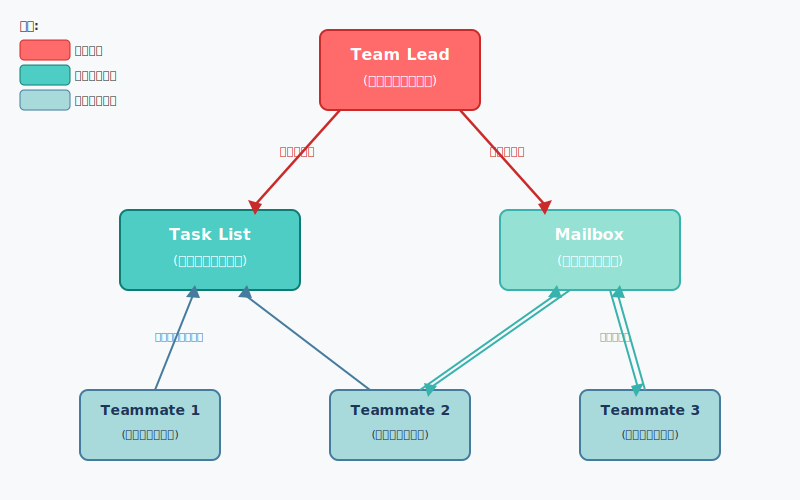
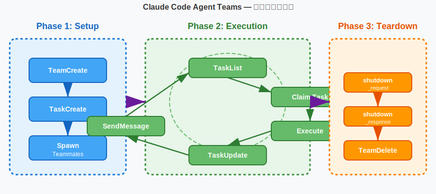
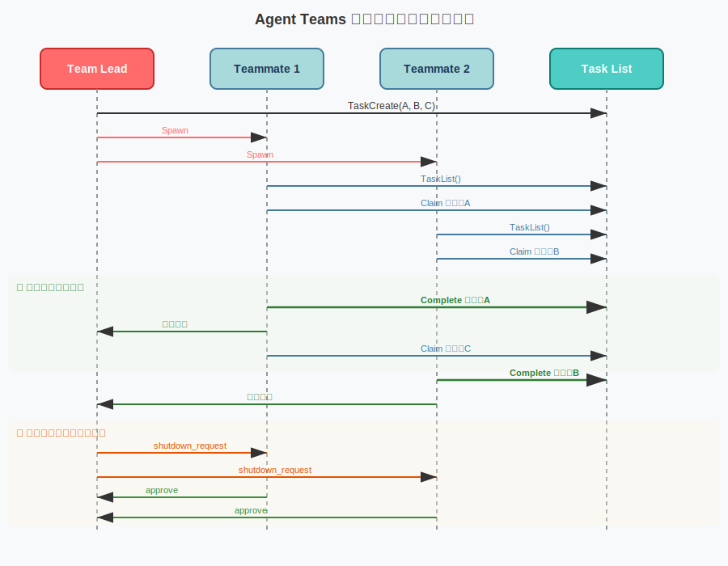

<!-- _class: lead -->
# Claude Code Agent Teams

- マルチエージェント協調による開発ワークフロー革新
- 
- 2026.02.14 Workshop

<!--
本日はClaude Code Agent Teamsについて、概念からベストプラクティスまで網羅的にカバーします。45分のワークショップ形式で進めます。
-->

---

# アジェンダ (1/2)

- 1. **イントロダクション** — なぜAgent Teamsなのか？
- 2. **アーキテクチャ** — 4コンポーネント構成とファイル構造
- 3. **7つの基本プリミティブ** — TeamCreate〜TeamDelete
- 4. **エージェントタイプ** — ビルトイン＆カスタム
- 5. **ワークフローパターン** — ライフサイクルと協調モデル

<!--
前半は基本概念とアーキテクチャ、ツールの詳細を扱います。
-->

---

# アジェンダ (2/2)

- 6. **セットアップと設定** — 環境構築と設定オプション
- 7. **ユースケース** — 実践的な活用シナリオと事例
- 8. **ベストプラクティス** — 効果的な運用のコツ
- 9. **コストと制限事項** — トークン消費と既知の制限
- 10. **まとめ** — 要点振り返りとリソース

<!--
後半は実践的な内容に焦点を当て、導入判断に必要な情報を提供します。
-->

---

<!-- _class: lead -->
# 1. イントロダクション

- なぜAgent Teamsなのか？

<!--
まず、なぜマルチエージェントが必要なのかを整理します。
-->

---

# なぜAgent Teamsなのか？

- **単一エージェントの限界:**
- - コンテキストウィンドウに全情報を詰め込む必要がある
- - 複数領域の作業を逐次処理 → 時間がかかる
- - 関心の混在によるコンテキスト汚染
- **マルチエージェントの価値:**
- - 専門領域ごとに独立したコンテキスト
- - 並列実行による大幅な時間短縮

<!--
シングルエージェントでは、フロントエンド・バックエンド・テストなど異なる領域を1つのコンテキストで処理する必要があります。Agent Teamsはこの制約を解消します。
-->

---

# Agent Teamsとは

- **複数のClaude Codeインスタンスがチームとして協調動作する仕組み**
- - 2026年2月、Claude Opus 4.6と共にリリース（実験的機能）
- - 各チームメイトは**独立したコンテキストウィンドウ**を持つ
- - **共有タスクリスト**で作業を分担・調整
- - エージェント間の**直接メッセージング**が可能
- - リーダーが全体をオーケストレーション

<!--
Agent Teamsは実験的機能として環境変数で有効化します。各エージェントは完全に独立したセッションとして動作します。
-->

---

# シングルエージェント vs Agent Teams

| 観点 | シングル / サブエージェント | Agent Teams |
|------|--------------------------|-------------|
| コンテキスト | 共有（結果が呼び出し元に返る） | 各自独立 |
| 通信 | メインエージェント経由のみ | 直接メッセージ可能 |
| 並列性 | 限定的（バックグラウンド実行） | 完全並列実行 |
| 最適用途 | 結果のみ必要な集中タスク | 議論・協調が必要な複雑タスク |
| トークンコスト | 低（結果を要約して返却） | 高（各自が独立インスタンス） |

<!--
サブエージェントは結果を返すだけですが、Agent Teamsのチームメイトは相互にコミュニケーションでき、独立して作業を続けます。
-->

---

<!-- _class: lead -->
# 2. アーキテクチャ

- 4コンポーネント構成

<!--
Agent Teamsのアーキテクチャを4つのコンポーネントに分けて解説します。
-->

---

# アーキテクチャ概要



<!--
Team Leadがチーム全体を管理し、Teammatesは共有タスクリストとメールボックスを通じて協調します。各コンポーネントはローカルディスク上のファイルとして管理されます。
-->

---

# ファイル構造

- チーム情報とタスクはローカルディスクに永続化される

```text
~/.claude/
├── teams/
│   └── my-project/
│       └── config.json    # メンバー情報
│           ├── name        # チームメイト名
│           ├── agentId     # 一意識別子
│           └── agentType   # エージェント種別
└── tasks/
    └── my-project/
        ├── task-1.json     # 個別タスク
        ├── task-2.json
        └── task-3.json
```

<!--
チーム設定はconfig.jsonに、タスクは個別のJSONファイルとして管理されます。チームメイトはconfig.jsonを読んで他のメンバーを発見できます。
-->

---

<!-- _class: lead -->
# 3. 7つの基本プリミティブ

- Agent Teamsを構成するツール群

<!--
Agent Teamsは7つの基本ツールで構成されています。それぞれの役割を見ていきましょう。
-->

---

# 7つの基本プリミティブ 一覧

| プリミティブ | 役割 |
|-------------|------|
| **TeamCreate** | チームの作成・初期化 |
| **TeamDelete** | チームの削除・クリーンアップ |
| **TaskCreate** | タスクの作成 |
| **TaskGet** | タスク詳細の取得 |
| **TaskUpdate** | タスクの更新・ステータス変更 |
| **TaskList** | タスク一覧の取得 |
| **SendMessage** | エージェント間メッセージング |

<!--
これら7つのプリミティブがAgent Teamsの全機能を提供します。シンプルですが、組み合わせにより柔軟な協調パターンを実現できます。
-->

---

# TeamCreate / TeamDelete

- **TeamCreate** — チームインフラの初期化
- - `~/.claude/teams/{team_name}/config.json` を作成
- - `~/.claude/tasks/{team_name}/` ディレクトリを作成
- - チーム名と説明を指定
- **TeamDelete** — チームリソースの削除
- - チームディレクトリとタスクディレクトリを削除
- - **アクティブなメンバーがいると失敗する** → 先にシャットダウン必須

<!--
TeamCreateでチームを作り、全作業完了後にTeamDeleteでクリーンアップします。TeamDeleteはアクティブなメンバーがいると安全のため失敗します。
-->

---

# TaskCreate / TaskGet

- **TaskCreate** — タスクの作成

```json
{
  "subject": "認証モジュールのリファクタリング",
  "description": "OAuth2フローを簡素化し...",
  "activeForm": "認証モジュールをリファクタリング中"
}
```

<!--
TaskCreateでタスクを作成する際、subjectは命令形、activeFormは進行形で記述します。descriptionには他のエージェントが理解できる十分な詳細を含めます。TaskGetでタスクの全詳細（依存関係含む）を取得できます。
-->

---

# TaskUpdate / TaskList

- **TaskUpdate** — タスクの状態管理
- - ステータス: `pending` → `in_progress` → `completed`
- - `owner` でタスクの担当者を設定
- - `addBlocks` / `addBlockedBy` で依存関係を定義
- - ファイルロックで**同時書き込みの競合を防止**
- **TaskList** — タスク一覧の確認
- - 全タスクのサマリー（ID、状態、担当者、ブロック状況）
- - チームメイトが次の作業を自律的に発見する手段

<!--
TaskUpdateはタスクの状態遷移と依存関係管理を担います。ファイルロックにより、複数のチームメイトが同時にタスクを取り合っても安全です。
-->

---

# SendMessage — 5つのメッセージタイプ

| タイプ | 用途 |
|--------|------|
| `message` | 特定のチームメイトへの直接メッセージ |
| `broadcast` | 全メンバーへの一斉送信（高コスト） |
| `shutdown_request` | シャットダウン要求 |
| `shutdown_response` | シャットダウン承認/拒否 |
| `plan_approval_response` | 計画の承認/却下 |
- 
- **注意:** `broadcast`はN人×Nメッセージ配信 → 通常は`message`を使用

<!--
SendMessageの5つのタイプを使い分けます。broadcastはコストが高いため、クリティカルな全体通知のみに使用します。通常のやりとりはmessageで十分です。
-->

---

<!-- _class: lead -->
# 4. エージェントタイプ

- ビルトイン＆カスタムエージェント

<!--
チームメイトとして使えるエージェントタイプを見ていきます。
-->

---

# ビルトインエージェントタイプ

| タイプ | モデル | ツール | 用途 |
|--------|--------|--------|------|
| **Explore** | Haiku（高速） | 読み取り専用 | コード検索・調査 |
| **Plan** | 継承 | 読み取り専用 | 設計・計画立案 |
| **General-purpose** | 継承 | 全ツール | 実装・複雑なタスク |
| **Bash** | 継承 | ターミナル | コマンド実行 |
- 
- **読み取り専用エージェントに実装タスクを割り当てない**こと

<!--
Exploreは高速なHaikuモデルを使い、コードベースの調査に特化しています。実装が必要なタスクにはGeneral-purposeを使います。エージェントタイプの選択はタスクの性質に合わせて行います。
-->

---

# カスタムエージェント

- `.claude/agents/` にMarkdownファイルで定義
- - カスタムシステムプロンプト
- - ツール制限の設定
- - モデル選択（sonnet, opus, haiku）
- - 権限モード（default, plan, dontAsk等）
- - MCPサーバーアクセス
- - スキルのプリロード

```yaml
# .claude/agents/security-reviewer.md
---
model: sonnet
mode: plan
---
セキュリティ観点でコードレビューを行う
```

<!--
カスタムエージェントにより、チーム特有の役割（セキュリティレビュアー、テストエンジニア等）を定義できます。YAML frontmatterで設定を行います。
-->

---

<!-- _class: lead -->
# 5. ワークフローパターン

- ライフサイクルと協調モデル

<!--
Agent Teamsの具体的なワークフローパターンを見ていきます。
-->

---

# 3フェーズライフサイクル



<!--
Setup→Execution→Teardownの3フェーズです。ExecutionフェーズではチームメイトがTaskList→Claim→Execute→Update→Messageのループを自律的に回します。
-->

---

# ライフサイクル シーケンス図



<!--
Leadがタスクを作成しチームメイトをSpawnすると、各チームメイトが自律的にタスクを取得・実行・完了報告します。全タスク完了後にシャットダウンを要求します。
-->

---

# リーダー・チームメイトモデル

- **Team Lead（メインセッション）の役割:**
- - チーム作成・タスク分解・チームメイトのSpawn
- - 進捗監視・成果の統合・最終判断
- **Teammates（独立セッション）の特徴:**
- - リーダーの会話履歴は**引き継がない**
- - プロジェクトコンテキスト（CLAUDE.md等）は自動ロード
- - タスク完了後に**自動的にidle状態**になる
- - idle状態でもメッセージ受信で再開可能

<!--
チームメイトはリーダーの会話履歴を持ちませんが、CLAUDE.mdやMCPサーバーの設定は自動的にロードされます。idle状態は正常な動作であり、エラーではありません。
-->

---

# タスク依存関係と波状実行

- **依存関係の定義:**
- - `addBlocks`: このタスクが完了するまで他タスクをブロック
- - `addBlockedBy`: 他タスクの完了を待ってから開始


<!--
Wave 1でタスクAが実行され、完了するとWave 2でB・Cが並列実行、両方完了するとWave 3でDが実行されます。依存関係の自動解決により手動の調整は不要です。
-->

---

# Plan Approvalワークフロー

- リスクの高いタスクには**計画承認**を要求できる
- 1. チームメイトがread-onlyモードで調査・計画
- 2. `ExitPlanMode` で計画をリーダーに送信
- 3. リーダーが `plan_approval_response` で承認/却下
- 4. 承認後、チームメイトが実装開始
- 5. 却下時はフィードバックを受けて計画を修正
- **活用例:** アーキテクチャ変更、セキュリティ関連の修正

<!--
Plan Approvalにより、重要な変更を加える前にリーダーがレビューできます。チームメイトは承認されるまで読み取り専用モードで動作し、安全性を確保します。
-->

---

# Delegateモード

- **リーダーを「コーディネーション専任」にするモード**
- - `Shift+Tab` で有効化
- - リーダーは実装タスクを自分で実行**できなくなる**
- - 使えるのはコーディネーション系ツールのみ:
-   - チームメイトのSpawn・メッセージ送信
-   - タスク管理（作成・更新・一覧）
-   - シャットダウン要求
- **メリット:** リーダーが実装に手を出さず、全体最適に集中できる

<!--
Delegateモードは、リーダーが誤って自分でタスクを実装してしまうのを防ぎます。大規模チームでは特に有効で、リーダーがオーケストレーションに集中できます。
-->

---

<!-- _class: lead -->
# 6. セットアップと設定

- 環境構築

<!--
Agent Teamsを使い始めるための設定方法を説明します。
-->

---

# セットアップ手順

- **1. 環境変数で有効化（実験的機能）**

```json
// settings.json
{
  "env": {
    "CLAUDE_CODE_EXPERIMENTAL_AGENT_TEAMS": "1"
  }
}

// または CLI で
// export CLAUDE_CODE_EXPERIMENTAL_AGENT_TEAMS=1
```

<!--
Agent Teamsはデフォルト無効です。settings.jsonまたは環境変数で明示的に有効化する必要があります。
-->

---

# 表示モードと設定オプション

| モード | 説明 | 要件 |
|--------|------|------|
| **in-process** | 1つのターミナルに統合 | どのターミナルでもOK |
| **split pane** | チームメイトごとに別ペイン | tmux / iTerm2 |
| **auto**（デフォルト） | tmux内ならsplit、それ以外はin-process | — |
- 
- **権限:** チームメイトはリーダーの権限設定を継承
- **モデル:** リーダーをOpus、チームメイトをSonnetが推奨

<!--
in-processモードではShift+Up/Downでチームメイトを切り替えます。split paneモードでは各チームメイトの作業をリアルタイムで確認できます。VS Code統合ターミナルではsplit paneは未対応です。
-->

---

<!-- _class: lead -->
# 7. ユースケース

- 実践的な活用シナリオ

<!--
Agent Teamsが特に効果を発揮するユースケースを紹介します。
-->

---

# 主要ユースケース

- **1. リサーチ＆レビュー** — 複数の観点から同時調査・相互検証
- **2. 新機能の並列開発** — フロント・バック・テストを別チームメイトに分担
- **3. 競合仮説によるデバッグ** — 異なる仮説を並列検証し収束を加速
- **4. クロスレイヤー変更** — UI・API・DBの横断的変更を各担当者に割当
- **5. 並列コードレビュー** — セキュリティ・パフォーマンス・テスト網羅性を同時チェック

<!--
EMとしては、チームの開発プロセスにAgent Teamsをどう組み込むかが重要です。特にリサーチ＆レビューは導入のハードルが低く、最初のユースケースとしておすすめです。
-->

---

# 事例: 16エージェントでCコンパイラ開発

- **Anthropic研究者 Nicholas Carlini氏の事例**
- - **16のエージェント**がRust製Cコンパイラを構築
- - 約**2,000セッション**、APIコスト約**$20,000**
- - **100,000行**のコンパイラコードを生成
- - Linux 6.9カーネルを**x86 / ARM / RISC-V**でコンパイル可能
- - 単独では非現実的な規模の作業をAgent Teamsで実現

<!--
この事例はAgent Teamsの可能性を示す象徴的なプロジェクトです。16のエージェントがそれぞれ異なるコンパイラコンポーネントを担当し、大規模なソフトウェアを協調して構築しました。
-->

---

<!-- _class: lead -->
# 8. ベストプラクティス

- 効果的な運用のコツ

<!--
Agent Teamsを効果的に使うためのベストプラクティスを紹介します。
-->

---

# ベストプラクティス (1/2)

- **十分なコンテキストを提供する**
- - チームメイトはリーダーの会話履歴を引き継がない
- - Spawnプロンプトにタスク固有の詳細を含める
- **タスクサイズを適切に設定**
- - 1チームメイトあたり**5〜6タスク**が理想
- - 小さすぎ → 調整オーバーヘッド > メリット
- - 大きすぎ → 手戻りリスク増大
- **ファイル競合を回避する**
- - 同じファイルを複数チームメイトが編集 → 上書き発生

<!--
最も重要なのはコンテキストの提供です。チームメイトはリーダーの会話を知らないため、タスクの背景と目的を明確に伝える必要があります。
-->

---

# ベストプラクティス (2/2)

- **Plan First, Execute Second**
- - 計画フェーズ（~10kトークン、低コスト）で分解を確認
- - 承認後に実行フェーズ（高コストだが高速）へ
- **権限を事前設定**
- - チームメイトSpawn前に権限設定を済ませる
- - 中断プロンプトの削減 → スムーズな実行
- **コスト最適化パターン**
- - リーダー: Opus（高精度な判断）
- - チームメイト: Sonnet（コスト効率の良い実行）

<!--
Plan Firstアプローチにより、高コストな実行フェーズに入る前に方針を確認できます。リーダーをOpus、チームメイトをSonnetにする構成が推奨されています。
-->

---

# コスト考慮事項

- **トークン消費量の目安**
| 構成 | トークン消費 | 倍率 |
|------|-------------|------|
| ソロセッション | ~200kトークン | 1x |
| 3人チーム（Sonnet） | ~800kトークン | 4x |
- 
- **コスト最適化のポイント:**
- - リサーチ系タスクから始めて効果を検証
- - 並列化のメリットが明確なタスクに限定
- - Delegateモードでリーダーの無駄な実装を防止

<!--
コストは約4倍になりますが、時間短縮と品質向上を考慮するとROIは十分に見合う場合が多いです。まずはリサーチ系タスクで試すことを推奨します。
-->

---

# 制限事項

| 制限 | 詳細 |
|------|------|
| セッション復元不可 | `/resume` でチームメイトは復元されない |
| 1セッション1チーム | 複数チームの同時管理は不可 |
| ネスト不可 | チームメイトが自身のチームを作成できない |
| リーダー固定 | リーダーシップの移譲・昇格は不可 |
| Split pane制限 | VS Code統合ターミナル等では未対応 |
| 実験的機能 | 環境変数による明示的な有効化が必要 |

<!--
現時点での制限事項を把握しておくことが重要です。特にセッション復元不可は長時間の作業で注意が必要です。実験的機能のため、今後のアップデートで改善される可能性があります。
-->

---

# まとめ

- **Claude Code Agent Teams** は複数エージェントの協調により開発を加速する仕組み
- - **4コンポーネント**: Team Lead / Teammates / Task List / Mailbox
- - **7プリミティブ**: TeamCreate〜TeamDelete で柔軟な協調を実現
- - **3フェーズ**: Setup → Execution → Teardown のライフサイクル
- - **Plan First**: 計画→承認→実行のフローでコストと品質を最適化
- - **段階的導入**: リサーチ・レビューから始めて徐々に拡大

<!--
Agent Teamsはまだ実験的機能ですが、複雑なタスクの並列処理において大きな可能性を持っています。まずはリスクの低いリサーチタスクから試し、チームの開発プロセスへの組み込みを検討してください。
-->
