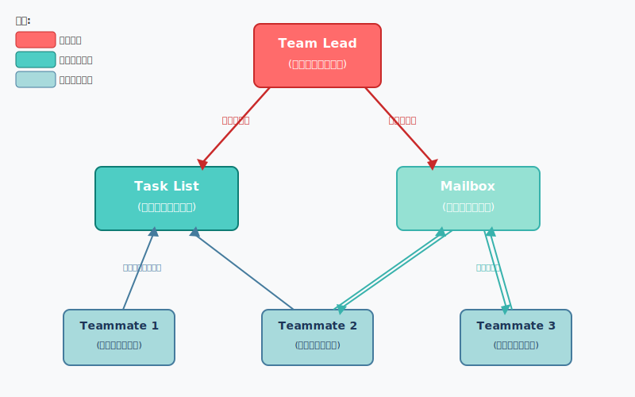
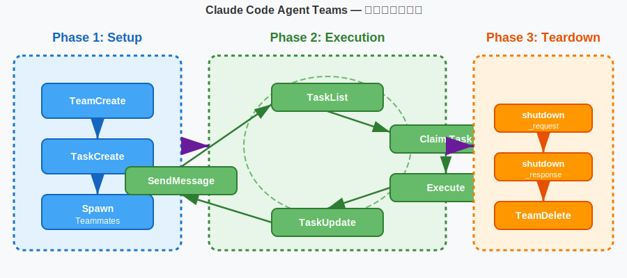
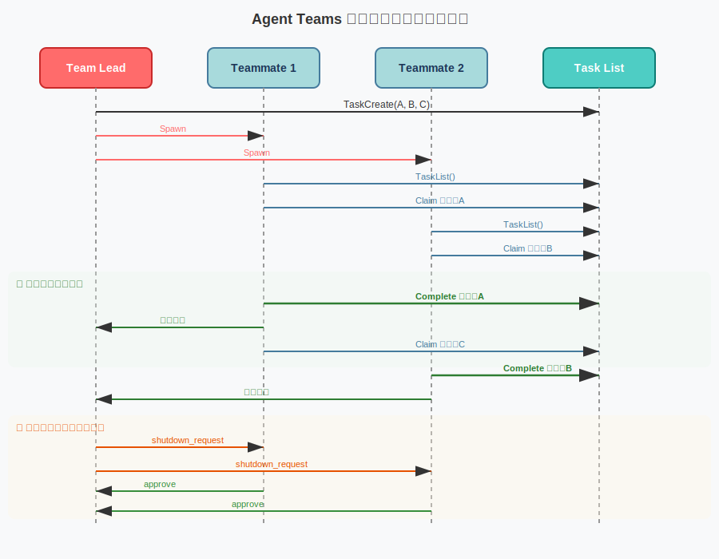

<!-- _class: lead -->
# Claude Code Agent Teams

- <svg viewBox="0 0 800 400" style="max-height:70vh;max-width:100%;display:block;margin:0 auto;" xmlns="http://www.w3.org/2000/svg">
  <rect width="800" height="400" fill="#1a1a2e"/>
  <rect x="0" y="155" width="800" height="90" fill="#f9a825" opacity="0.15"/>
  <text x="400" y="192" fill="#f9a825" font-size="24" font-weight="bold" text-anchor="middle" font-family="sans-serif">Claude Code Agent Teams</text>
  <text x="400" y="222" fill="#ffffff" font-size="14" text-anchor="middle" font-family="sans-serif">AIエージェントの並列実行で開発を10倍高速化する</text>
</svg>
- マルチエージェント協調による開発ワークフロー革新
- 
- 2026.02.14 Workshop

<!--
本日はClaude Code Agent Teamsについて、概念からベストプラクティスまで網羅的にカバーします。45分のワークショップ形式で進めます。
-->

---

# アジェンダ (1/2)

- <svg viewBox="0 0 800 400" style="max-height:70vh;max-width:100%;display:block;margin:0 auto;" xmlns="http://www.w3.org/2000/svg">
  <rect width="800" height="400" fill="#1a1a2e"/>
  <text x="400" y="52" fill="#f9a825" font-size="17" font-weight="bold" text-anchor="middle" font-family="sans-serif">アジェンダ（1/2）</text>
  <rect x="40" y="75" width="720" height="46" fill="#16213e" rx="4"/>
  <text x="65" y="101" fill="#f9a825" font-size="13" font-weight="bold" font-family="sans-serif">1. イントロダクション</text>
  <text x="735" y="101" fill="#f9a825" font-size="12" text-anchor="end" font-family="sans-serif">なぜAgent Teamsなのか / 単一vs並列</text>
  <rect x="40" y="127" width="720" height="46" fill="#16213e" rx="4"/>
  <text x="65" y="153" fill="#e91e63" font-size="13" font-weight="bold" font-family="sans-serif">2. アーキテクチャ</text>
  <text x="735" y="153" fill="#e91e63" font-size="12" text-anchor="end" font-family="sans-serif">全体構造 / ファイル構成</text>
  <rect x="40" y="179" width="720" height="46" fill="#16213e" rx="4"/>
  <text x="65" y="205" fill="#29b6f6" font-size="13" font-weight="bold" font-family="sans-serif">3. 7つの基本プリミティブ</text>
  <text x="735" y="205" fill="#29b6f6" font-size="12" text-anchor="end" font-family="sans-serif">TeamCreate〜SendMessage</text>
  <rect x="40" y="231" width="720" height="46" fill="#16213e" rx="4"/>
  <text x="65" y="257" fill="#4caf50" font-size="13" font-weight="bold" font-family="sans-serif">4. エージェントタイプ</text>
  <text x="735" y="257" fill="#4caf50" font-size="12" text-anchor="end" font-family="sans-serif">ビルトイン / カスタムエージェント</text>
  <rect x="40" y="283" width="720" height="46" fill="#16213e" rx="4"/>
  <text x="65" y="309" fill="#ab47bc" font-size="13" font-weight="bold" font-family="sans-serif">5. ワークフローパターン</text>
  <text x="735" y="309" fill="#ab47bc" font-size="12" text-anchor="end" font-family="sans-serif">3フェーズ / リーダーモデル / 波状実行</text>
</svg>
- 1. **イントロダクション** — なぜAgent Teamsなのか？
- 2. **アーキテクチャ** — 4コンポーネント構成とファイル構造
- 3. **7つの基本プリミティブ** — TeamCreate〜TeamDelete
- 4. **エージェントタイプ** — ビルトイン＆カスタム
- 5. **ワークフローパターン** — ライフサイクルと協調モデル

<!--
前半は基本概念とアーキテクチャ、ツールの詳細を扱います。
-->

---

# アジェンダ (2/2)

- <svg viewBox="0 0 800 400" style="max-height:70vh;max-width:100%;display:block;margin:0 auto;" xmlns="http://www.w3.org/2000/svg">
  <rect width="800" height="400" fill="#1a1a2e"/>
  <text x="400" y="52" fill="#f9a825" font-size="17" font-weight="bold" text-anchor="middle" font-family="sans-serif">アジェンダ（2/2）</text>
  <rect x="40" y="75" width="720" height="46" fill="#16213e" rx="4"/>
  <text x="65" y="101" fill="#f9a825" font-size="13" font-weight="bold" font-family="sans-serif">6. セットアップと設定</text>
  <text x="735" y="101" fill="#f9a825" font-size="12" text-anchor="end" font-family="sans-serif">環境構築 / 設定オプション</text>
  <rect x="40" y="127" width="720" height="46" fill="#16213e" rx="4"/>
  <text x="65" y="153" fill="#e91e63" font-size="13" font-weight="bold" font-family="sans-serif">7. ユースケース</text>
  <text x="735" y="153" fill="#e91e63" font-size="12" text-anchor="end" font-family="sans-serif">16エージェントCコンパイラ事例 等</text>
  <rect x="40" y="179" width="720" height="46" fill="#16213e" rx="4"/>
  <text x="65" y="205" fill="#4caf50" font-size="13" font-weight="bold" font-family="sans-serif">8. ベストプラクティス</text>
  <text x="735" y="205" fill="#4caf50" font-size="12" text-anchor="end" font-family="sans-serif">ファイル非重複 / bypass / コスト管理</text>
  <rect x="40" y="231" width="720" height="46" fill="#16213e" rx="4"/>
  <text x="65" y="257" fill="#29b6f6" font-size="13" font-weight="bold" font-family="sans-serif">所要時間</text>
  <text x="735" y="257" fill="#29b6f6" font-size="12" text-anchor="end" font-family="sans-serif">約45分 + Q&A</text>
  <rect x="40" y="283" width="720" height="46" fill="#16213e" rx="4"/>
  <text x="65" y="309" fill="#ab47bc" font-size="13" font-weight="bold" font-family="sans-serif">前提知識</text>
  <text x="735" y="309" fill="#ab47bc" font-size="12" text-anchor="end" font-family="sans-serif">Claude Code基本操作 / Unix/Linux基礎知識</text>
</svg>
- 6. **セットアップと設定** — 環境構築と設定オプション
- 7. **ユースケース** — 実践的な活用シナリオと事例
- 8. **ベストプラクティス** — 効果的な運用のコツ
- 9. **コストと制限事項** — トークン消費と既知の制限
- 10. **まとめ** — 要点振り返りとリソース

<!--
後半は実践的な内容に焦点を当て、導入判断に必要な情報を提供します。
-->

---

<!-- _class: lead -->
# 1. イントロダクション

- <svg viewBox="0 0 800 400" style="max-height:70vh;max-width:100%;display:block;margin:0 auto;" xmlns="http://www.w3.org/2000/svg">
  <rect width="800" height="400" fill="#1a1a2e"/>
  <rect x="0" y="155" width="800" height="90" fill="#f9a825" opacity="0.15"/>
  <text x="400" y="192" fill="#f9a825" font-size="24" font-weight="bold" text-anchor="middle" font-family="sans-serif">1. イントロダクション</text>
  <text x="400" y="222" fill="#ffffff" font-size="14" text-anchor="middle" font-family="sans-serif">シングルエージェントの限界と Agent Teams の誕生</text>
</svg>
- なぜAgent Teamsなのか？

<!--
まず、なぜマルチエージェントが必要なのかを整理します。
-->

---

# なぜAgent Teamsなのか？

- <svg viewBox="0 0 800 400" style="max-height:70vh;max-width:100%;display:block;margin:0 auto;" xmlns="http://www.w3.org/2000/svg">
  <rect width="800" height="400" fill="#1a1a2e"/>
  <text x="400" y="52" fill="#f9a825" font-size="17" font-weight="bold" text-anchor="middle" font-family="sans-serif">なぜAgent Teamsなのか？</text>
  <rect x="40" y="75" width="720" height="46" fill="#16213e" rx="4"/>
  <text x="65" y="101" fill="#e91e63" font-size="13" font-weight="bold" font-family="sans-serif">シングルエージェントの壁</text>
  <text x="735" y="101" fill="#e91e63" font-size="12" text-anchor="end" font-family="sans-serif">コンテキストウィンドウ制限 / 速度の限界</text>
  <rect x="40" y="127" width="720" height="46" fill="#16213e" rx="4"/>
  <text x="65" y="153" fill="#f9a825" font-size="13" font-weight="bold" font-family="sans-serif">並列化の威力</text>
  <text x="735" y="153" fill="#f9a825" font-size="12" text-anchor="end" font-family="sans-serif">N個のWorkerで 1/N の時間 (理論値)</text>
  <rect x="40" y="179" width="720" height="46" fill="#16213e" rx="4"/>
  <text x="65" y="205" fill="#4caf50" font-size="13" font-weight="bold" font-family="sans-serif">専門化のメリット</text>
  <text x="735" y="205" fill="#4caf50" font-size="12" text-anchor="end" font-family="sans-serif">実装Worker + レビューWorker = 品質向上</text>
  <rect x="40" y="231" width="720" height="46" fill="#16213e" rx="4"/>
  <text x="65" y="257" fill="#29b6f6" font-size="13" font-weight="bold" font-family="sans-serif">スケーラビリティ</text>
  <text x="735" y="257" fill="#29b6f6" font-size="12" text-anchor="end" font-family="sans-serif">5エージェント → 50エージェントへ線形スケール</text>
  <rect x="40" y="283" width="720" height="46" fill="#16213e" rx="4"/>
  <text x="65" y="309" fill="#f9a825" font-size="13" font-weight="bold" font-family="sans-serif">Anthropicの実証</text>
  <text x="735" y="309" fill="#f9a825" font-size="12" text-anchor="end" font-family="sans-serif">16エージェント並列でCコンパイラを5倍速で完成</text>
</svg>
- **単一エージェントの限界:**
- - コンテキストウィンドウに全情報を詰め込む必要がある
- - 複数領域の作業を逐次処理 → 時間がかかる
- - 関心の混在によるコンテキスト汚染
- **マルチエージェントの価値:**
- - 専門領域ごとに独立したコンテキスト
- - 並列実行による大幅な時間短縮

<!--
シングルエージェントでは、フロントエンド・バックエンド・テストなど異なる領域を1つのコンテキストで処理する必要があります。Agent Teamsはこの制約を解消します。
-->

---

# Agent Teamsとは

- <svg viewBox="0 0 800 400" style="max-height:70vh;max-width:100%;display:block;margin:0 auto;" xmlns="http://www.w3.org/2000/svg">
  <rect width="800" height="400" fill="#1a1a2e"/>
  <text x="400" y="52" fill="#f9a825" font-size="17" font-weight="bold" text-anchor="middle" font-family="sans-serif">Agent Teamsとは</text>
  <rect x="40" y="75" width="720" height="46" fill="#16213e" rx="4"/>
  <text x="65" y="101" fill="#f9a825" font-size="13" font-weight="bold" font-family="sans-serif">定義</text>
  <text x="735" y="101" fill="#f9a825" font-size="12" text-anchor="end" font-family="sans-serif">複数のClaude Codeインスタンスが協調してタスクを処理</text>
  <rect x="40" y="127" width="720" height="46" fill="#16213e" rx="4"/>
  <text x="65" y="153" fill="#e91e63" font-size="13" font-weight="bold" font-family="sans-serif">実行環境</text>
  <text x="735" y="153" fill="#e91e63" font-size="12" text-anchor="end" font-family="sans-serif">tmux分割ペイン — 各エージェントが独立プロセス</text>
  <rect x="40" y="179" width="720" height="46" fill="#16213e" rx="4"/>
  <text x="65" y="205" fill="#4caf50" font-size="13" font-weight="bold" font-family="sans-serif">調整方式</text>
  <text x="735" y="205" fill="#4caf50" font-size="12" text-anchor="end" font-family="sans-serif">ファイルベース — tasks/ status/ reviews/ log/</text>
  <rect x="40" y="231" width="720" height="46" fill="#16213e" rx="4"/>
  <text x="65" y="257" fill="#29b6f6" font-size="13" font-weight="bold" font-family="sans-serif">起動コマンド</text>
  <text x="735" y="257" fill="#29b6f6" font-size="12" text-anchor="end" font-family="sans-serif">bun run team <session-id> <workspace> [impl] [review]</text>
  <rect x="40" y="283" width="720" height="46" fill="#16213e" rx="4"/>
  <text x="65" y="309" fill="#ab47bc" font-size="13" font-weight="bold" font-family="sans-serif">ステータス確認</text>
  <text x="735" y="309" fill="#ab47bc" font-size="12" text-anchor="end" font-family="sans-serif">bun run team:status <session-id> [--watch]</text>
</svg>
- **複数のClaude Codeインスタンスがチームとして協調動作する仕組み**
- - 2026年2月、Claude Opus 4.6と共にリリース（実験的機能）
- - 各チームメイトは**独立したコンテキストウィンドウ**を持つ
- - **共有タスクリスト**で作業を分担・調整
- - エージェント間の**直接メッセージング**が可能
- - リーダーが全体をオーケストレーション

<!--
Agent Teamsは実験的機能として環境変数で有効化します。各エージェントは完全に独立したセッションとして動作します。
-->

---

# シングルエージェント vs Agent Teams

- <svg viewBox="0 0 800 400" style="max-height:70vh;max-width:100%;display:block;margin:0 auto;" xmlns="http://www.w3.org/2000/svg">
  <rect width="800" height="400" fill="#1a1a2e"/>
  <text x="400" y="35" fill="#f9a825" font-size="20" font-weight="bold" text-anchor="middle" font-family="sans-serif">シングルエージェント vs Agent Teams — 実行比較</text>
  <!-- Single agent (sequential) - Left side -->
  <text x="200" y="70" fill="#ffffff" font-size="16" font-weight="bold" text-anchor="middle" font-family="sans-serif">シングルエージェント</text>
  <text x="200" y="92" fill="#9e9e9e" font-size="13" text-anchor="middle" font-family="sans-serif">逐次処理</text>
  <!-- Tasks stacked vertically -->
  <rect x="110" y="105" width="180" height="35" fill="#16213e" stroke="#ffffff" stroke-width="1" rx="4"/>
  <text x="200" y="127" fill="#ffffff" font-size="13" text-anchor="middle" font-family="sans-serif">タスク A — 15分</text>
  <line x1="200" y1="140" x2="200" y2="155" stroke="#ffffff" stroke-width="1.5"/>
  <polygon points="196,155 204,155 200,163" fill="#ffffff"/>
  <rect x="110" y="163" width="180" height="35" fill="#16213e" stroke="#ffffff" stroke-width="1" rx="4"/>
  <text x="200" y="185" fill="#ffffff" font-size="13" text-anchor="middle" font-family="sans-serif">タスク B — 12分</text>
  <line x1="200" y1="198" x2="200" y2="213" stroke="#ffffff" stroke-width="1.5"/>
  <polygon points="196,213 204,213 200,221" fill="#ffffff"/>
  <rect x="110" y="221" width="180" height="35" fill="#16213e" stroke="#ffffff" stroke-width="1" rx="4"/>
  <text x="200" y="243" fill="#ffffff" font-size="13" text-anchor="middle" font-family="sans-serif">タスク C — 18分</text>
  <line x1="200" y1="256" x2="200" y2="271" stroke="#ffffff" stroke-width="1.5"/>
  <polygon points="196,271 204,271 200,279" fill="#ffffff"/>
  <rect x="110" y="279" width="180" height="35" fill="#16213e" stroke="#ffffff" stroke-width="1" rx="4"/>
  <text x="200" y="301" fill="#ffffff" font-size="13" text-anchor="middle" font-family="sans-serif">タスク D — 10分</text>
  <!-- Total time -->
  <rect x="110" y="325" width="180" height="40" fill="#16213e" stroke="#ffffff" stroke-width="1" rx="4"/>
  <text x="200" y="349" fill="#e91e63" font-size="16" font-weight="bold" text-anchor="middle" font-family="sans-serif">合計: 55分</text>
  <!-- Divider -->
  <line x1="400" y1="55" x2="400" y2="390" stroke="#ffffff" stroke-width="1" stroke-dasharray="4,4" opacity="0.4"/>
  <!-- Agent Teams (parallel) - Right side -->
  <text x="600" y="70" fill="#f9a825" font-size="16" font-weight="bold" text-anchor="middle" font-family="sans-serif">Agent Teams</text>
  <text x="600" y="92" fill="#f9a825" font-size="13" text-anchor="middle" font-family="sans-serif">並列処理</text>
  <!-- Tasks in parallel -->
  <!-- Leader -->
  <rect x="490" y="105" width="220" height="35" fill="#f9a825" rx="4"/>
  <text x="600" y="127" fill="#1a1a2e" font-size="13" font-weight="bold" text-anchor="middle" font-family="sans-serif">Team Lead — 計画 3分</text>
  <!-- Parallel arrows -->
  <line x1="530" y1="140" x2="470" y2="163" stroke="#ffffff" stroke-width="1.5"/>
  <polygon points="467,162 475,170 479,162" fill="#ffffff"/>
  <line x1="600" y1="140" x2="600" y2="163" stroke="#ffffff" stroke-width="1.5"/>
  <polygon points="596,163 604,163 600,171" fill="#ffffff"/>
  <line x1="670" y1="140" x2="730" y2="163" stroke="#ffffff" stroke-width="1.5"/>
  <polygon points="727,162 721,170 733,170" fill="#ffffff"/>
  <!-- Parallel tasks -->
  <rect x="430" y="171" width="130" height="50" fill="#16213e" stroke="#e91e63" stroke-width="2" rx="4"/>
  <text x="495" y="192" fill="#e91e63" font-size="12" font-weight="bold" text-anchor="middle" font-family="sans-serif">Worker 1</text>
  <text x="495" y="210" fill="#ffffff" font-size="11" text-anchor="middle" font-family="sans-serif">タスクA+B: 15分</text>
  <rect x="570" y="171" width="60" height="50" fill="#16213e" stroke="#4caf50" stroke-width="2" rx="4"/>
  <text x="600" y="192" fill="#4caf50" font-size="12" font-weight="bold" text-anchor="middle" font-family="sans-serif">W2</text>
  <text x="600" y="210" fill="#ffffff" font-size="10" text-anchor="middle" font-family="sans-serif">C: 18分</text>
  <rect x="640" y="171" width="110" height="50" fill="#16213e" stroke="#29b6f6" stroke-width="2" rx="4"/>
  <text x="695" y="192" fill="#29b6f6" font-size="12" font-weight="bold" text-anchor="middle" font-family="sans-serif">W3</text>
  <text x="695" y="210" fill="#ffffff" font-size="11" text-anchor="middle" font-family="sans-serif">タスクD: 10分</text>
  <!-- Merge -->
  <line x1="495" y1="221" x2="560" y2="255" stroke="#ffffff" stroke-width="1.5"/>
  <line x1="600" y1="221" x2="600" y2="255" stroke="#ffffff" stroke-width="1.5"/>
  <line x1="695" y1="221" x2="640" y2="255" stroke="#ffffff" stroke-width="1.5"/>
  <polygon points="596,255 604,255 600,263" fill="#ffffff"/>
  <rect x="490" y="263" width="220" height="50" fill="#16213e" stroke="#29b6f6" stroke-width="2" rx="4"/>
  <text x="600" y="284" fill="#29b6f6" font-size="13" font-weight="bold" text-anchor="middle" font-family="sans-serif">Reviewer — 統合チェック 5分</text>
  <text x="600" y="305" fill="#ffffff" font-size="11" text-anchor="middle" font-family="sans-serif">並列最大時間: 18分 + 8分 = 26分</text>
  <!-- Total time -->
  <rect x="490" y="325" width="220" height="40" fill="#f9a825" rx="4"/>
  <text x="600" y="349" fill="#1a1a2e" font-size="16" font-weight="bold" text-anchor="middle" font-family="sans-serif">合計: ~26分 (52%短縮)</text>
</svg>
| 観点 | シングル / サブエージェント | Agent Teams |
|------|--------------------------|-------------|
| コンテキスト | 共有（結果が呼び出し元に返る） | 各自独立 |
| 通信 | メインエージェント経由のみ | 直接メッセージ可能 |
| 並列性 | 限定的（バックグラウンド実行） | 完全並列実行 |
| 最適用途 | 結果のみ必要な集中タスク | 議論・協調が必要な複雑タスク |
| トークンコスト | 低（結果を要約して返却） | 高（各自が独立インスタンス） |

<!--
サブエージェントは結果を返すだけですが、Agent Teamsのチームメイトは相互にコミュニケーションでき、独立して作業を続けます。
-->

---

<!-- _class: lead -->
# 2. アーキテクチャ

- <svg viewBox="0 0 800 400" style="max-height:70vh;max-width:100%;display:block;margin:0 auto;" xmlns="http://www.w3.org/2000/svg">
  <rect width="800" height="400" fill="#1a1a2e"/>
  <rect x="0" y="155" width="800" height="90" fill="#e91e63" opacity="0.15"/>
  <text x="400" y="192" fill="#e91e63" font-size="24" font-weight="bold" text-anchor="middle" font-family="sans-serif">2. アーキテクチャ</text>
  <text x="400" y="222" fill="#ffffff" font-size="14" text-anchor="middle" font-family="sans-serif">ファイルベース非同期通信で実現する疎結合設計</text>
</svg>
- 4コンポーネント構成

<!--
Agent Teamsのアーキテクチャを4つのコンポーネントに分けて解説します。
-->

---

# アーキテクチャ概要

- <svg viewBox="0 0 800 400" style="max-height:70vh;max-width:100%;display:block;margin:0 auto;" xmlns="http://www.w3.org/2000/svg">
  <rect width="800" height="400" fill="#1a1a2e"/>
  <text x="400" y="35" fill="#f9a825" font-size="20" font-weight="bold" text-anchor="middle" font-family="sans-serif">Claude Code Agent Teams — アーキテクチャ全体図</text>
  <!-- Team Lead box (top center) -->
  <rect x="280" y="55" width="240" height="70" fill="#f9a825" rx="8"/>
  <text x="400" y="85" fill="#1a1a2e" font-size="16" font-weight="bold" text-anchor="middle" font-family="sans-serif">Team Lead (Claude)</text>
  <text x="400" y="108" fill="#1a1a2e" font-size="13" text-anchor="middle" font-family="sans-serif">タスク計画 / 委任 / 統合</text>
  <!-- Worker agents row -->
  <!-- Worker 1 -->
  <rect x="40" y="190" width="150" height="65" fill="#16213e" stroke="#e91e63" stroke-width="2" rx="6"/>
  <text x="115" y="218" fill="#e91e63" font-size="14" font-weight="bold" text-anchor="middle" font-family="sans-serif">Worker 1</text>
  <text x="115" y="240" fill="#ffffff" font-size="12" text-anchor="middle" font-family="sans-serif">タスクA 実装</text>
  <!-- Worker 2 -->
  <rect x="210" y="190" width="150" height="65" fill="#16213e" stroke="#e91e63" stroke-width="2" rx="6"/>
  <text x="285" y="218" fill="#e91e63" font-size="14" font-weight="bold" text-anchor="middle" font-family="sans-serif">Worker 2</text>
  <text x="285" y="240" fill="#ffffff" font-size="12" text-anchor="middle" font-family="sans-serif">タスクB 実装</text>
  <!-- Worker 3 -->
  <rect x="380" y="190" width="150" height="65" fill="#16213e" stroke="#e91e63" stroke-width="2" rx="6"/>
  <text x="455" y="218" fill="#e91e63" font-size="14" font-weight="bold" text-anchor="middle" font-family="sans-serif">Worker 3</text>
  <text x="455" y="240" fill="#ffffff" font-size="12" text-anchor="middle" font-family="sans-serif">タスクC 実装</text>
  <!-- Review agent -->
  <rect x="550" y="190" width="150" height="65" fill="#16213e" stroke="#29b6f6" stroke-width="2" rx="6"/>
  <text x="625" y="218" fill="#29b6f6" font-size="14" font-weight="bold" text-anchor="middle" font-family="sans-serif">Reviewer</text>
  <text x="625" y="240" fill="#ffffff" font-size="12" text-anchor="middle" font-family="sans-serif">品質チェック</text>
  <!-- Arrows from Lead to Workers -->
  <line x1="340" y1="125" x2="115" y2="190" stroke="#ffffff" stroke-width="1.5"/>
  <polygon points="115,189 110,198 120,198" fill="#ffffff"/>
  <line x1="370" y1="125" x2="285" y2="190" stroke="#ffffff" stroke-width="1.5"/>
  <polygon points="285,189 280,198 290,198" fill="#ffffff"/>
  <line x1="400" y1="125" x2="455" y2="190" stroke="#ffffff" stroke-width="1.5"/>
  <polygon points="455,189 450,198 460,198" fill="#ffffff"/>
  <line x1="430" y1="125" x2="625" y2="190" stroke="#ffffff" stroke-width="1.5"/>
  <polygon points="625,189 620,198 630,198" fill="#ffffff"/>
  <!-- Shared workspace / file system -->
  <rect x="100" y="315" width="600" height="50" fill="#16213e" stroke="#ffffff" stroke-width="1" rx="6"/>
  <text x="400" y="336" fill="#ffffff" font-size="13" font-weight="bold" text-anchor="middle" font-family="sans-serif">共有ファイルシステム (Git)</text>
  <text x="400" y="356" fill="#ffffff" font-size="12" text-anchor="middle" font-family="sans-serif">tasks/ | status/ | reviews/ | log/ | .agent-teams/</text>
  <!-- Lines to shared workspace -->
  <line x1="115" y1="255" x2="200" y2="315" stroke="#ffffff" stroke-width="1" opacity="0.5"/>
  <line x1="285" y1="255" x2="300" y2="315" stroke="#ffffff" stroke-width="1" opacity="0.5"/>
  <line x1="455" y1="255" x2="430" y2="315" stroke="#ffffff" stroke-width="1" opacity="0.5"/>
  <line x1="625" y1="255" x2="600" y2="315" stroke="#ffffff" stroke-width="1" opacity="0.5"/>
</svg>


<!--
Team Leadがチーム全体を管理し、Teammatesは共有タスクリストとメールボックスを通じて協調します。各コンポーネントはローカルディスク上のファイルとして管理されます。
-->

---

# ファイル構造

- <svg viewBox="0 0 800 400" style="max-height:70vh;max-width:100%;display:block;margin:0 auto;" xmlns="http://www.w3.org/2000/svg">
  <rect width="800" height="400" fill="#1a1a2e"/>
  <text x="400" y="52" fill="#f9a825" font-size="17" font-weight="bold" text-anchor="middle" font-family="sans-serif">ファイル構造</text>
  <rect x="40" y="75" width="720" height="46" fill="#16213e" rx="4"/>
  <text x="65" y="101" fill="#f9a825" font-size="13" font-weight="bold" font-family="sans-serif">.agent-teams/<session>/</text>
  <text x="735" y="101" fill="#f9a825" font-size="12" text-anchor="end" font-family="sans-serif">セッション全体のルートディレクトリ</text>
  <rect x="40" y="127" width="720" height="46" fill="#16213e" rx="4"/>
  <text x="65" y="153" fill="#e91e63" font-size="13" font-weight="bold" font-family="sans-serif">team.json</text>
  <text x="735" y="153" fill="#e91e63" font-size="12" text-anchor="end" font-family="sans-serif">チーム設定 / エージェント一覧 / セッション状態</text>
  <rect x="40" y="179" width="720" height="46" fill="#16213e" rx="4"/>
  <text x="65" y="205" fill="#4caf50" font-size="13" font-weight="bold" font-family="sans-serif">tasks/<task-id>.json</text>
  <text x="735" y="205" fill="#4caf50" font-size="12" text-anchor="end" font-family="sans-serif">タスク定義 / ステータス / 担当者 / 依存関係</text>
  <rect x="40" y="231" width="720" height="46" fill="#16213e" rx="4"/>
  <text x="65" y="257" fill="#29b6f6" font-size="13" font-weight="bold" font-family="sans-serif">status/<agent-id>.json</text>
  <text x="735" y="257" fill="#29b6f6" font-size="12" text-anchor="end" font-family="sans-serif">エージェントの現在状態 / ハートビート</text>
  <rect x="40" y="283" width="720" height="46" fill="#16213e" rx="4"/>
  <text x="65" y="309" fill="#ab47bc" font-size="13" font-weight="bold" font-family="sans-serif">reviews/<task>-review.json</text>
  <text x="735" y="309" fill="#ab47bc" font-size="12" text-anchor="end" font-family="sans-serif">レビュー結果 / 指摘事項 / 承認/却下</text>
</svg>
- チーム情報とタスクはローカルディスクに永続化される


---

# ファイル構造（コード例）

- <svg viewBox="0 0 800 400" style="max-height:70vh;max-width:100%;display:block;margin:0 auto;" xmlns="http://www.w3.org/2000/svg">
  <rect width="800" height="400" fill="#1a1a2e"/>
  <text x="400" y="50" fill="#f9a825" font-size="17" font-weight="bold" text-anchor="middle" font-family="sans-serif">ファイル構造 — 実際のディレクトリツリー</text>
  <rect x="50" y="68" width="700" height="358" fill="#16213e" rx="8"/>
  <text x="70" y="105" fill="#a5d6a7" font-size="13" font-family="monospace">.agent-teams/</text>
  <text x="70" y="131" fill="#a5d6a7" font-size="13" font-family="monospace">└── my-session/</text>
  <text x="70" y="157" fill="#a5d6a7" font-size="13" font-family="monospace">    ├── team.json</text>
  <text x="70" y="183" fill="#a5d6a7" font-size="13" font-family="monospace">    ├── tasks/</text>
  <text x="70" y="209" fill="#a5d6a7" font-size="13" font-family="monospace">    │   ├── task-001.json</text>
  <text x="70" y="235" fill="#a5d6a7" font-size="13" font-family="monospace">    │   └── task-002.json</text>
  <text x="70" y="261" fill="#a5d6a7" font-size="13" font-family="monospace">    ├── status/</text>
  <text x="70" y="287" fill="#a5d6a7" font-size="13" font-family="monospace">    │   ├── impl-1.json</text>
  <text x="70" y="313" fill="#a5d6a7" font-size="13" font-family="monospace">    │   └── review-1.json</text>
  <text x="70" y="339" fill="#a5d6a7" font-size="13" font-family="monospace">    ├── reviews/</text>
  <text x="70" y="365" fill="#a5d6a7" font-size="13" font-family="monospace">    │   └── task-001-review.json</text>
  <text x="70" y="391" fill="#a5d6a7" font-size="13" font-family="monospace">    └── log/</text>
  <text x="70" y="417" fill="#a5d6a7" font-size="13" font-family="monospace">        └── impl-1.log</text>
</svg>

```text
~/.claude/
├── teams/
│   └── my-project/
│       └── config.json    # メンバー情報
│           ├── name        # チームメイト名
│           ├── agentId     # 一意識別子
│           └── agentType   # エージェント種別
└── tasks/
    └── my-project/
        ├── task-1.json     # 個別タスク
        ├── task-2.json
        └── task-3.json
```


---

<!-- _class: lead -->
# 3. 7つの基本プリミティブ

- <svg viewBox="0 0 800 400" style="max-height:70vh;max-width:100%;display:block;margin:0 auto;" xmlns="http://www.w3.org/2000/svg">
  <rect width="800" height="400" fill="#1a1a2e"/>
  <rect x="0" y="155" width="800" height="90" fill="#29b6f6" opacity="0.15"/>
  <text x="400" y="192" fill="#29b6f6" font-size="24" font-weight="bold" text-anchor="middle" font-family="sans-serif">3. 7つの基本プリミティブ</text>
  <text x="400" y="222" fill="#ffffff" font-size="14" text-anchor="middle" font-family="sans-serif">Agent Teams SDK の中核API</text>
</svg>
- Agent Teamsを構成するツール群

<!--
Agent Teamsは7つの基本ツールで構成されています。それぞれの役割を見ていきましょう。
-->

---

# 7つの基本プリミティブ 一覧

- <svg viewBox="0 0 800 400" style="max-height:70vh;max-width:100%;display:block;margin:0 auto;" xmlns="http://www.w3.org/2000/svg">
  <rect width="800" height="400" fill="#1a1a2e"/>
  <text x="400" y="35" fill="#f9a825" font-size="20" font-weight="bold" text-anchor="middle" font-family="sans-serif">7つの基本プリミティブ</text>
  <!-- Primitive 1: TeamCreate -->
  <rect x="30" y="60" width="220" height="60" fill="#16213e" stroke="#f9a825" stroke-width="2" rx="6"/>
  <text x="140" y="86" fill="#f9a825" font-size="14" font-weight="bold" text-anchor="middle" font-family="sans-serif">TeamCreate</text>
  <text x="140" y="108" fill="#ffffff" font-size="12" text-anchor="middle" font-family="sans-serif">チーム作成 / 初期化</text>
  <!-- Primitive 2: TeamDelete -->
  <rect x="30" y="135" width="220" height="60" fill="#16213e" stroke="#f9a825" stroke-width="2" rx="6"/>
  <text x="140" y="161" fill="#f9a825" font-size="14" font-weight="bold" text-anchor="middle" font-family="sans-serif">TeamDelete</text>
  <text x="140" y="183" fill="#ffffff" font-size="12" text-anchor="middle" font-family="sans-serif">チーム削除 / クリーンアップ</text>
  <!-- Primitive 3: TaskCreate -->
  <rect x="290" y="60" width="220" height="60" fill="#16213e" stroke="#e91e63" stroke-width="2" rx="6"/>
  <text x="400" y="86" fill="#e91e63" font-size="14" font-weight="bold" text-anchor="middle" font-family="sans-serif">TaskCreate</text>
  <text x="400" y="108" fill="#ffffff" font-size="12" text-anchor="middle" font-family="sans-serif">タスク作成 / キューへの追加</text>
  <!-- Primitive 4: TaskGet -->
  <rect x="290" y="135" width="220" height="60" fill="#16213e" stroke="#e91e63" stroke-width="2" rx="6"/>
  <text x="400" y="161" fill="#e91e63" font-size="14" font-weight="bold" text-anchor="middle" font-family="sans-serif">TaskGet</text>
  <text x="400" y="183" fill="#ffffff" font-size="12" text-anchor="middle" font-family="sans-serif">タスク取得 / Worker割り当て</text>
  <!-- Primitive 5: TaskUpdate -->
  <rect x="550" y="60" width="220" height="60" fill="#16213e" stroke="#29b6f6" stroke-width="2" rx="6"/>
  <text x="660" y="86" fill="#29b6f6" font-size="14" font-weight="bold" text-anchor="middle" font-family="sans-serif">TaskUpdate</text>
  <text x="660" y="108" fill="#ffffff" font-size="12" text-anchor="middle" font-family="sans-serif">ステータス / 結果更新</text>
  <!-- Primitive 6: TaskList -->
  <rect x="550" y="135" width="220" height="60" fill="#16213e" stroke="#29b6f6" stroke-width="2" rx="6"/>
  <text x="660" y="161" fill="#29b6f6" font-size="14" font-weight="bold" text-anchor="middle" font-family="sans-serif">TaskList</text>
  <text x="660" y="183" fill="#ffffff" font-size="12" text-anchor="middle" font-family="sans-serif">タスク一覧 / 状態監視</text>
  <!-- Primitive 7: SendMessage -->
  <rect x="160" y="230" width="480" height="65" fill="#f9a825" rx="8"/>
  <text x="400" y="258" fill="#1a1a2e" font-size="16" font-weight="bold" text-anchor="middle" font-family="sans-serif">SendMessage</text>
  <text x="400" y="283" fill="#1a1a2e" font-size="13" text-anchor="middle" font-family="sans-serif">エージェント間通信 — 5種類のメッセージタイプ</text>
  <!-- Message types -->
  <rect x="30" y="315" width="730" height="55" fill="#16213e" rx="6"/>
  <text x="400" y="337" fill="#ffffff" font-size="13" font-weight="bold" text-anchor="middle" font-family="sans-serif">assign | status | result | review | escalate</text>
  <text x="400" y="360" fill="#ffffff" font-size="12" text-anchor="middle" font-family="sans-serif">Leader ↔ Worker ↔ Reviewer の非同期通信基盤</text>
</svg>
| プリミティブ | 役割 |
|-------------|------|
| **TeamCreate** | チームの作成・初期化 |
| **TeamDelete** | チームの削除・クリーンアップ |
| **TaskCreate** | タスクの作成 |
| **TaskGet** | タスク詳細の取得 |
| **TaskUpdate** | タスクの更新・ステータス変更 |
| **TaskList** | タスク一覧の取得 |
| **SendMessage** | エージェント間メッセージング |

<!--
これら7つのプリミティブがAgent Teamsの全機能を提供します。シンプルですが、組み合わせにより柔軟な協調パターンを実現できます。
-->

---

# TeamCreate / TeamDelete

- <svg viewBox="0 0 800 400" style="max-height:70vh;max-width:100%;display:block;margin:0 auto;" xmlns="http://www.w3.org/2000/svg">
  <rect width="800" height="400" fill="#1a1a2e"/>
  <text x="400" y="52" fill="#f9a825" font-size="17" font-weight="bold" text-anchor="middle" font-family="sans-serif">TeamCreate / TeamDelete</text>
  <rect x="40" y="75" width="720" height="46" fill="#16213e" rx="4"/>
  <text x="65" y="101" fill="#f9a825" font-size="13" font-weight="bold" font-family="sans-serif">TeamCreate</text>
  <text x="735" y="101" fill="#f9a825" font-size="12" text-anchor="end" font-family="sans-serif">新しいチームセッションを初期化 / workspace指定</text>
  <rect x="40" y="127" width="720" height="46" fill="#16213e" rx="4"/>
  <text x="65" y="153" fill="#e91e63" font-size="13" font-weight="bold" font-family="sans-serif">設定項目</text>
  <text x="735" y="153" fill="#e91e63" font-size="12" text-anchor="end" font-family="sans-serif">session-id / impl-count / review-count / workspace</text>
  <rect x="40" y="179" width="720" height="46" fill="#16213e" rx="4"/>
  <text x="65" y="205" fill="#4caf50" font-size="13" font-weight="bold" font-family="sans-serif">出力</text>
  <text x="735" y="205" fill="#4caf50" font-size="12" text-anchor="end" font-family="sans-serif">team.json 生成 / tmuxセッション作成 / ログ開始</text>
  <rect x="40" y="231" width="720" height="46" fill="#16213e" rx="4"/>
  <text x="65" y="257" fill="#29b6f6" font-size="13" font-weight="bold" font-family="sans-serif">TeamDelete</text>
  <text x="735" y="257" fill="#29b6f6" font-size="12" text-anchor="end" font-family="sans-serif">セッション終了 / リソース解放 / tmuxクリーンアップ</text>
  <rect x="40" y="283" width="720" height="46" fill="#16213e" rx="4"/>
  <text x="65" y="309" fill="#e91e63" font-size="13" font-weight="bold" font-family="sans-serif">注意</text>
  <text x="735" y="309" fill="#e91e63" font-size="12" text-anchor="end" font-family="sans-serif">TeamDeleteは全タスク完了後のみ実行を推奨</text>
</svg>
- **TeamCreate** — チームインフラの初期化
- - `~/.claude/teams/{team_name}/config.json` を作成
- - `~/.claude/tasks/{team_name}/` ディレクトリを作成
- - チーム名と説明を指定
- **TeamDelete** — チームリソースの削除
- - チームディレクトリとタスクディレクトリを削除
- - **アクティブなメンバーがいると失敗する** → 先にシャットダウン必須

<!--
TeamCreateでチームを作り、全作業完了後にTeamDeleteでクリーンアップします。TeamDeleteはアクティブなメンバーがいると安全のため失敗します。
-->

---

# TaskCreate / TaskGet

- <svg viewBox="0 0 800 400" style="max-height:70vh;max-width:100%;display:block;margin:0 auto;" xmlns="http://www.w3.org/2000/svg">
  <rect width="800" height="400" fill="#1a1a2e"/>
  <text x="400" y="52" fill="#f9a825" font-size="17" font-weight="bold" text-anchor="middle" font-family="sans-serif">TaskCreate / TaskGet</text>
  <rect x="40" y="75" width="720" height="46" fill="#16213e" rx="4"/>
  <text x="65" y="101" fill="#f9a825" font-size="13" font-weight="bold" font-family="sans-serif">TaskCreate</text>
  <text x="735" y="101" fill="#f9a825" font-size="12" text-anchor="end" font-family="sans-serif">タスク定義を tasks/<id>.json に書き込み</text>
  <rect x="40" y="127" width="720" height="46" fill="#16213e" rx="4"/>
  <text x="65" y="153" fill="#e91e63" font-size="13" font-weight="bold" font-family="sans-serif">必須フィールド</text>
  <text x="735" y="153" fill="#e91e63" font-size="12" text-anchor="end" font-family="sans-serif">id / title / description / targetFiles / status</text>
  <rect x="40" y="179" width="720" height="46" fill="#16213e" rx="4"/>
  <text x="65" y="205" fill="#4caf50" font-size="13" font-weight="bold" font-family="sans-serif">オプションフィールド</text>
  <text x="735" y="205" fill="#4caf50" font-size="12" text-anchor="end" font-family="sans-serif">dependencies / priority / hints / assignee</text>
  <rect x="40" y="231" width="720" height="46" fill="#16213e" rx="4"/>
  <text x="65" y="257" fill="#29b6f6" font-size="13" font-weight="bold" font-family="sans-serif">TaskGet</text>
  <text x="735" y="257" fill="#29b6f6" font-size="12" text-anchor="end" font-family="sans-serif">pending タスクを取得 → in_progress に変更</text>
  <rect x="40" y="283" width="720" height="46" fill="#16213e" rx="4"/>
  <text x="65" y="309" fill="#f9a825" font-size="13" font-weight="bold" font-family="sans-serif">競合防止</text>
  <text x="735" y="309" fill="#f9a825" font-size="12" text-anchor="end" font-family="sans-serif">ファイルロック / 原子的書き込みで同時取得を防止</text>
</svg>
- **TaskCreate** — タスクの作成


---

# TaskCreate / TaskGet（コード例）

```json
{
  "subject": "認証モジュールのリファクタリング",
  "description": "OAuth2フローを簡素化し...",
  "activeForm": "認証モジュールをリファクタリング中"
}
```


---

# TaskUpdate / TaskList（1/2）

- <svg viewBox="0 0 800 400" style="max-height:70vh;max-width:100%;display:block;margin:0 auto;" xmlns="http://www.w3.org/2000/svg">
  <rect width="800" height="400" fill="#1a1a2e"/>
  <text x="400" y="52" fill="#f9a825" font-size="17" font-weight="bold" text-anchor="middle" font-family="sans-serif">TaskUpdate — ステータス管理</text>
  <rect x="40" y="75" width="720" height="46" fill="#16213e" rx="4"/>
  <text x="65" y="101" fill="#9e9e9e" font-size="13" font-weight="bold" font-family="sans-serif">pending</text>
  <text x="735" y="101" fill="#9e9e9e" font-size="12" text-anchor="end" font-family="sans-serif">初期状態 — Worker待機中</text>
  <rect x="40" y="127" width="720" height="46" fill="#16213e" rx="4"/>
  <text x="65" y="153" fill="#f9a825" font-size="13" font-weight="bold" font-family="sans-serif">in_progress</text>
  <text x="735" y="153" fill="#f9a825" font-size="12" text-anchor="end" font-family="sans-serif">Worker取得後 — 実装中</text>
  <rect x="40" y="179" width="720" height="46" fill="#16213e" rx="4"/>
  <text x="65" y="205" fill="#4caf50" font-size="13" font-weight="bold" font-family="sans-serif">impl_done</text>
  <text x="735" y="205" fill="#4caf50" font-size="12" text-anchor="end" font-family="sans-serif">実装完了 — Reviewer待機中</text>
  <rect x="40" y="231" width="720" height="46" fill="#16213e" rx="4"/>
  <text x="65" y="257" fill="#29b6f6" font-size="13" font-weight="bold" font-family="sans-serif">in_review</text>
  <text x="735" y="257" fill="#29b6f6" font-size="12" text-anchor="end" font-family="sans-serif">Reviewer取得後 — レビュー中</text>
  <rect x="40" y="283" width="720" height="46" fill="#16213e" rx="4"/>
  <text x="65" y="309" fill="#e91e63" font-size="13" font-weight="bold" font-family="sans-serif">completed / needs_revision</text>
  <text x="735" y="309" fill="#e91e63" font-size="12" text-anchor="end" font-family="sans-serif">完了 or 修正指示 — 最大3サイクル</text>
</svg>
- **TaskUpdate** — タスクの状態管理
- - ステータス: `pending` → `in_progress` → `completed`
- - `owner` でタスクの担当者を設定
- - `addBlocks` / `addBlockedBy` で依存関係を定義

<!--
TaskUpdateはタスクの状態遷移と依存関係管理を担います。ファイルロックにより、複数のチームメイトが同時にタスクを取り合っても安全です。
-->

---

# TaskUpdate / TaskList（2/2）

- <svg viewBox="0 0 800 400" style="max-height:70vh;max-width:100%;display:block;margin:0 auto;" xmlns="http://www.w3.org/2000/svg">
  <rect width="800" height="400" fill="#1a1a2e"/>
  <text x="400" y="52" fill="#f9a825" font-size="17" font-weight="bold" text-anchor="middle" font-family="sans-serif">TaskList — 進捗モニタリング</text>
  <rect x="40" y="75" width="720" height="46" fill="#16213e" rx="4"/>
  <text x="65" y="101" fill="#f9a825" font-size="13" font-weight="bold" font-family="sans-serif">全タスク一覧取得</text>
  <text x="735" y="101" fill="#f9a825" font-size="12" text-anchor="end" font-family="sans-serif">status / assignee / timestamps 確認</text>
  <rect x="40" y="127" width="720" height="46" fill="#16213e" rx="4"/>
  <text x="65" y="153" fill="#e91e63" font-size="13" font-weight="bold" font-family="sans-serif">フィルタリング</text>
  <text x="735" y="153" fill="#e91e63" font-size="12" text-anchor="end" font-family="sans-serif">status='pending' で未着手タスクのみ取得</text>
  <rect x="40" y="179" width="720" height="46" fill="#16213e" rx="4"/>
  <text x="65" y="205" fill="#4caf50" font-size="13" font-weight="bold" font-family="sans-serif">ダッシュボード</text>
  <text x="735" y="205" fill="#4caf50" font-size="12" text-anchor="end" font-family="sans-serif">bun run team:status で可視化</text>
  <rect x="40" y="231" width="720" height="46" fill="#16213e" rx="4"/>
  <text x="65" y="257" fill="#29b6f6" font-size="13" font-weight="bold" font-family="sans-serif">完了判定</text>
  <text x="735" y="257" fill="#29b6f6" font-size="12" text-anchor="end" font-family="sans-serif">全タスク completed → Leader が集約コミット</text>
  <rect x="40" y="283" width="720" height="46" fill="#16213e" rx="4"/>
  <text x="65" y="309" fill="#ab47bc" font-size="13" font-weight="bold" font-family="sans-serif">デッドロック検出</text>
  <text x="735" y="309" fill="#ab47bc" font-size="12" text-anchor="end" font-family="sans-serif">長時間 in_progress は Leader がリセット判断</text>
</svg>
- - ファイルロックで**同時書き込みの競合を防止**
- **TaskList** — タスク一覧の確認
- - 全タスクのサマリー（ID、状態、担当者、ブロック状況）
- - チームメイトが次の作業を自律的に発見する手段

<!--
TaskUpdateはタスクの状態遷移と依存関係管理を担います。ファイルロックにより、複数のチームメイトが同時にタスクを取り合っても安全です。
-->

---

# SendMessage — 5つのメッセージタイプ

- <svg viewBox="0 0 800 400" style="max-height:70vh;max-width:100%;display:block;margin:0 auto;" xmlns="http://www.w3.org/2000/svg">
  <rect width="800" height="400" fill="#1a1a2e"/>
  <text x="400" y="52" fill="#f9a825" font-size="17" font-weight="bold" text-anchor="middle" font-family="sans-serif">SendMessage — 5つのメッセージタイプ</text>
  <rect x="40" y="75" width="720" height="46" fill="#16213e" rx="4"/>
  <text x="65" y="101" fill="#f9a825" font-size="13" font-weight="bold" font-family="sans-serif">assign</text>
  <text x="735" y="101" fill="#f9a825" font-size="12" text-anchor="end" font-family="sans-serif">Leader → Worker: タスク割り当て指示</text>
  <rect x="40" y="127" width="720" height="46" fill="#16213e" rx="4"/>
  <text x="65" y="153" fill="#e91e63" font-size="13" font-weight="bold" font-family="sans-serif">status</text>
  <text x="735" y="153" fill="#e91e63" font-size="12" text-anchor="end" font-family="sans-serif">Worker → Leader: 進捗状況の中間報告</text>
  <rect x="40" y="179" width="720" height="46" fill="#16213e" rx="4"/>
  <text x="65" y="205" fill="#4caf50" font-size="13" font-weight="bold" font-family="sans-serif">result</text>
  <text x="735" y="205" fill="#4caf50" font-size="12" text-anchor="end" font-family="sans-serif">Worker → Leader: 実装完了・成果物報告</text>
  <rect x="40" y="231" width="720" height="46" fill="#16213e" rx="4"/>
  <text x="65" y="257" fill="#29b6f6" font-size="13" font-weight="bold" font-family="sans-serif">review</text>
  <text x="735" y="257" fill="#29b6f6" font-size="12" text-anchor="end" font-family="sans-serif">Reviewer → Leader: レビュー完了・指摘報告</text>
  <rect x="40" y="283" width="720" height="46" fill="#16213e" rx="4"/>
  <text x="65" y="309" fill="#ab47bc" font-size="13" font-weight="bold" font-family="sans-serif">escalate</text>
  <text x="735" y="309" fill="#ab47bc" font-size="12" text-anchor="end" font-family="sans-serif">Worker/Reviewer → Leader: エラー・ブロッカー報告</text>
</svg>
| タイプ | 用途 |
|--------|------|
| `message` | 特定のチームメイトへの直接メッセージ |
| `broadcast` | 全メンバーへの一斉送信（高コスト） |
| `shutdown_request` | シャットダウン要求 |
| `shutdown_response` | シャットダウン承認/拒否 |
| `plan_approval_response` | 計画の承認/却下 |
- 
- **注意:** `broadcast`はN人×Nメッセージ配信 → 通常は`message`を使用

<!--
SendMessageの5つのタイプを使い分けます。broadcastはコストが高いため、クリティカルな全体通知のみに使用します。通常のやりとりはmessageで十分です。
-->

---

<!-- _class: lead -->
# 4. エージェントタイプ

- <svg viewBox="0 0 800 400" style="max-height:70vh;max-width:100%;display:block;margin:0 auto;" xmlns="http://www.w3.org/2000/svg">
  <rect width="800" height="400" fill="#1a1a2e"/>
  <rect x="0" y="155" width="800" height="90" fill="#4caf50" opacity="0.15"/>
  <text x="400" y="192" fill="#4caf50" font-size="24" font-weight="bold" text-anchor="middle" font-family="sans-serif">4. エージェントタイプ</text>
  <text x="400" y="222" fill="#ffffff" font-size="14" text-anchor="middle" font-family="sans-serif">ビルトイン / カスタム / 特殊ロール</text>
</svg>
- ビルトイン＆カスタムエージェント

<!--
チームメイトとして使えるエージェントタイプを見ていきます。
-->

---

# ビルトインエージェントタイプ

- <svg viewBox="0 0 800 400" style="max-height:70vh;max-width:100%;display:block;margin:0 auto;" xmlns="http://www.w3.org/2000/svg">
  <rect width="800" height="400" fill="#1a1a2e"/>
  <text x="400" y="52" fill="#f9a825" font-size="17" font-weight="bold" text-anchor="middle" font-family="sans-serif">ビルトインエージェントタイプ</text>
  <rect x="40" y="75" width="720" height="46" fill="#16213e" rx="4"/>
  <text x="65" y="101" fill="#f9a825" font-size="13" font-weight="bold" font-family="sans-serif">impl (実装Worker)</text>
  <text x="735" y="101" fill="#f9a825" font-size="12" text-anchor="end" font-family="sans-serif">pending タスク取得 → 実装 → impl_done 更新</text>
  <rect x="40" y="127" width="720" height="46" fill="#16213e" rx="4"/>
  <text x="65" y="153" fill="#e91e63" font-size="13" font-weight="bold" font-family="sans-serif">review (レビューWorker)</text>
  <text x="735" y="153" fill="#e91e63" font-size="12" text-anchor="end" font-family="sans-serif">impl_done 取得 → レビュー → completed/needs_revision</text>
  <rect x="40" y="179" width="720" height="46" fill="#16213e" rx="4"/>
  <text x="65" y="205" fill="#4caf50" font-size="13" font-weight="bold" font-family="sans-serif">leader (チームリーダー)</text>
  <text x="735" y="205" fill="#4caf50" font-size="12" text-anchor="end" font-family="sans-serif">計画 / 委任 / 調整 / 集約 — 特権モード</text>
  <rect x="40" y="231" width="720" height="46" fill="#16213e" rx="4"/>
  <text x="65" y="257" fill="#29b6f6" font-size="13" font-weight="bold" font-family="sans-serif">実行モード</text>
  <text x="735" y="257" fill="#29b6f6" font-size="12" text-anchor="end" font-family="sans-serif">全エージェント: -p + --dangerously-skip-permissions</text>
  <rect x="40" y="283" width="720" height="46" fill="#16213e" rx="4"/>
  <text x="65" y="309" fill="#ab47bc" font-size="13" font-weight="bold" font-family="sans-serif">環境変数</text>
  <text x="735" y="309" fill="#ab47bc" font-size="12" text-anchor="end" font-family="sans-serif">CLAUDECODE= (空)で設定 — ネストセッション防止</text>
</svg>
| タイプ | モデル | ツール | 用途 |
|--------|--------|--------|------|
| **Explore** | Haiku（高速） | 読み取り専用 | コード検索・調査 |
| **Plan** | 継承 | 読み取り専用 | 設計・計画立案 |
| **General-purpose** | 継承 | 全ツール | 実装・複雑なタスク |
| **Bash** | 継承 | ターミナル | コマンド実行 |
- 
- **読み取り専用エージェントに実装タスクを割り当てない**こと

<!--
Exploreは高速なHaikuモデルを使い、コードベースの調査に特化しています。実装が必要なタスクにはGeneral-purposeを使います。エージェントタイプの選択はタスクの性質に合わせて行います。
-->

---

# カスタムエージェント

- <svg viewBox="0 0 800 400" style="max-height:70vh;max-width:100%;display:block;margin:0 auto;" xmlns="http://www.w3.org/2000/svg">
  <rect width="800" height="400" fill="#1a1a2e"/>
  <text x="400" y="52" fill="#f9a825" font-size="17" font-weight="bold" text-anchor="middle" font-family="sans-serif">カスタムエージェント — 設計の自由度</text>
  <rect x="40" y="75" width="720" height="46" fill="#16213e" rx="4"/>
  <text x="65" y="101" fill="#f9a825" font-size="13" font-weight="bold" font-family="sans-serif">特化型Worker</text>
  <text x="735" y="101" fill="#f9a825" font-size="12" text-anchor="end" font-family="sans-serif">データベース専門 / API統合専門 など役割特化</text>
  <rect x="40" y="127" width="720" height="46" fill="#16213e" rx="4"/>
  <text x="65" y="153" fill="#e91e63" font-size="13" font-weight="bold" font-family="sans-serif">検証Worker</text>
  <text x="735" y="153" fill="#e91e63" font-size="12" text-anchor="end" font-family="sans-serif">テスト実行 / リントチェック専用エージェント</text>
  <rect x="40" y="179" width="720" height="46" fill="#16213e" rx="4"/>
  <text x="65" y="205" fill="#4caf50" font-size="13" font-weight="bold" font-family="sans-serif">ドキュメントWorker</text>
  <text x="735" y="205" fill="#4caf50" font-size="12" text-anchor="end" font-family="sans-serif">コードからドキュメント自動生成</text>
  <rect x="40" y="231" width="720" height="46" fill="#16213e" rx="4"/>
  <text x="65" y="257" fill="#29b6f6" font-size="13" font-weight="bold" font-family="sans-serif">セキュリティWorker</text>
  <text x="735" y="257" fill="#29b6f6" font-size="12" text-anchor="end" font-family="sans-serif">セキュリティ脆弱性スキャン専門</text>
  <rect x="40" y="283" width="720" height="46" fill="#16213e" rx="4"/>
  <text x="65" y="309" fill="#f9a825" font-size="13" font-weight="bold" font-family="sans-serif">設計ポイント</text>
  <text x="735" y="309" fill="#f9a825" font-size="12" text-anchor="end" font-family="sans-serif">1エージェント1役割 — 責務の明確化が重要</text>
</svg>
- `.claude/agents/` にMarkdownファイルで定義
- - カスタムシステムプロンプト
- - ツール制限の設定
- - モデル選択（sonnet, opus, haiku）
- - 権限モード（default, plan, dontAsk等）
- - MCPサーバーアクセス
- - スキルのプリロード


---

# カスタムエージェント（コード例）

- <svg viewBox="0 0 800 400" style="max-height:70vh;max-width:100%;display:block;margin:0 auto;" xmlns="http://www.w3.org/2000/svg">
  <rect width="800" height="400" fill="#1a1a2e"/>
  <text x="400" y="50" fill="#f9a825" font-size="17" font-weight="bold" text-anchor="middle" font-family="sans-serif">カスタムエージェント 設定例</text>
  <rect x="50" y="68" width="700" height="306" fill="#16213e" rx="8"/>
  <text x="70" y="105" fill="#a5d6a7" font-size="13" font-family="monospace">// .claude/agents/db-specialist.md</text>
  <text x="70" y="131" fill="#a5d6a7" font-size="13" font-family="monospace">あなたはデータベース専門のWorkerです。</text>
  <text x="70" y="157" fill="#a5d6a7" font-size="13" font-family="monospace"></text>
  <text x="70" y="183" fill="#a5d6a7" font-size="13" font-family="monospace">担当範囲:</text>
  <text x="70" y="209" fill="#a5d6a7" font-size="13" font-family="monospace">- SQLマイグレーション作成 (prisma/drizzle)</text>
  <text x="70" y="235" fill="#a5d6a7" font-size="13" font-family="monospace">- インデックス最適化</text>
  <text x="70" y="261" fill="#a5d6a7" font-size="13" font-family="monospace">- N+1クエリ問題の検出と修正</text>
  <text x="70" y="287" fill="#a5d6a7" font-size="13" font-family="monospace"></text>
  <text x="70" y="313" fill="#a5d6a7" font-size="13" font-family="monospace">絶対に変更しないファイル:</text>
  <text x="70" y="339" fill="#a5d6a7" font-size="13" font-family="monospace">- src/api/** (APIレイヤーは別Worker担当)</text>
  <text x="70" y="365" fill="#a5d6a7" font-size="13" font-family="monospace">- src/auth/** (認証レイヤーは別Worker担当)</text>
</svg>

```yaml
# .claude/agents/security-reviewer.md
---
model: sonnet
mode: plan
---
セキュリティ観点でコードレビューを行う
```


---

<!-- _class: lead -->
# 5. ワークフローパターン

- <svg viewBox="0 0 800 400" style="max-height:70vh;max-width:100%;display:block;margin:0 auto;" xmlns="http://www.w3.org/2000/svg">
  <rect width="800" height="400" fill="#1a1a2e"/>
  <rect x="0" y="155" width="800" height="90" fill="#ab47bc" opacity="0.15"/>
  <text x="400" y="192" fill="#ab47bc" font-size="24" font-weight="bold" text-anchor="middle" font-family="sans-serif">5. ワークフローパターン</text>
  <text x="400" y="222" fill="#ffffff" font-size="14" text-anchor="middle" font-family="sans-serif">実証されたチーム実行パターン集</text>
</svg>
- ライフサイクルと協調モデル

<!--
Agent Teamsの具体的なワークフローパターンを見ていきます。
-->

---

# 3フェーズライフサイクル

- <svg viewBox="0 0 800 400" style="max-height:70vh;max-width:100%;display:block;margin:0 auto;" xmlns="http://www.w3.org/2000/svg">
  <rect width="800" height="400" fill="#1a1a2e"/>
  <text x="400" y="35" fill="#f9a825" font-size="20" font-weight="bold" text-anchor="middle" font-family="sans-serif">タスクライフサイクル — 3フェーズ</text>
  <!-- Phase 1: Planning -->
  <rect x="30" y="65" width="220" height="280" fill="#16213e" stroke="#f9a825" stroke-width="2" rx="8"/>
  <text x="140" y="95" fill="#f9a825" font-size="15" font-weight="bold" text-anchor="middle" font-family="sans-serif">Phase 1: 計画</text>
  <text x="140" y="120" fill="#ffffff" font-size="13" text-anchor="middle" font-family="sans-serif">Team Lead</text>
  <text x="55" y="150" fill="#ffffff" font-size="12" font-family="sans-serif">1. 要件分析</text>
  <text x="55" y="173" fill="#ffffff" font-size="12" font-family="sans-serif">2. タスク分解</text>
  <text x="55" y="196" fill="#ffffff" font-size="12" font-family="sans-serif">3. 依存関係マッピング</text>
  <text x="55" y="219" fill="#ffffff" font-size="12" font-family="sans-serif">4. ファイル割当</text>
  <text x="55" y="242" fill="#ffffff" font-size="12" font-family="sans-serif">5. Worker割り当て</text>
  <rect x="60" y="300" width="160" height="30" fill="#f9a825" rx="4"/>
  <text x="140" y="320" fill="#1a1a2e" font-size="12" font-weight="bold" text-anchor="middle" font-family="sans-serif">pending → in_progress</text>
  <!-- Phase 2: Implementation -->
  <rect x="290" y="65" width="220" height="280" fill="#16213e" stroke="#e91e63" stroke-width="2" rx="8"/>
  <text x="400" y="95" fill="#e91e63" font-size="15" font-weight="bold" text-anchor="middle" font-family="sans-serif">Phase 2: 実装</text>
  <text x="400" y="120" fill="#ffffff" font-size="13" text-anchor="middle" font-family="sans-serif">Workers (並列)</text>
  <text x="310" y="150" fill="#ffffff" font-size="12" font-family="sans-serif">1. コンテキスト読み取り</text>
  <text x="310" y="173" fill="#ffffff" font-size="12" font-family="sans-serif">2. コード実装</text>
  <text x="310" y="196" fill="#ffffff" font-size="12" font-family="sans-serif">3. セルフチェック</text>
  <text x="310" y="219" fill="#ffffff" font-size="12" font-family="sans-serif">4. ログ記録</text>
  <text x="310" y="242" fill="#ffffff" font-size="12" font-family="sans-serif">5. ステータス更新</text>
  <rect x="320" y="300" width="160" height="30" fill="#e91e63" rx="4"/>
  <text x="400" y="320" fill="#ffffff" font-size="12" font-weight="bold" text-anchor="middle" font-family="sans-serif">impl_done → in_review</text>
  <!-- Phase 3: Review -->
  <rect x="550" y="65" width="220" height="280" fill="#16213e" stroke="#29b6f6" stroke-width="2" rx="8"/>
  <text x="660" y="95" fill="#29b6f6" font-size="15" font-weight="bold" text-anchor="middle" font-family="sans-serif">Phase 3: レビュー</text>
  <text x="660" y="120" fill="#ffffff" font-size="13" text-anchor="middle" font-family="sans-serif">Reviewer</text>
  <text x="570" y="150" fill="#ffffff" font-size="12" font-family="sans-serif">1. コード品質確認</text>
  <text x="570" y="173" fill="#ffffff" font-size="12" font-family="sans-serif">2. 要件適合確認</text>
  <text x="570" y="196" fill="#ffffff" font-size="12" font-family="sans-serif">3. テスト実行</text>
  <text x="570" y="219" fill="#ffffff" font-size="12" font-family="sans-serif">4. レビュー記録</text>
  <text x="570" y="242" fill="#ffffff" font-size="12" font-family="sans-serif">5. Approve/Reject</text>
  <rect x="580" y="300" width="160" height="30" fill="#29b6f6" rx="4"/>
  <text x="660" y="320" fill="#1a1a2e" font-size="12" font-weight="bold" text-anchor="middle" font-family="sans-serif">review_done → completed</text>
  <!-- Arrows between phases -->
  <polygon points="260,205 275,198 275,212" fill="#ffffff"/>
  <line x1="250" y1="205" x2="290" y2="205" stroke="#ffffff" stroke-width="2"/>
  <polygon points="520,205 535,198 535,212" fill="#ffffff"/>
  <line x1="510" y1="205" x2="550" y2="205" stroke="#ffffff" stroke-width="2"/>
  <!-- Revision loop -->
  <text x="400" y="380" fill="#f9a825" font-size="13" font-weight="bold" text-anchor="middle" font-family="sans-serif">needs_revision → Worker再実装（最大3サイクル）</text>
</svg>


<!--
Setup→Execution→Teardownの3フェーズです。ExecutionフェーズではチームメイトがTaskList→Claim→Execute→Update→Messageのループを自律的に回します。
-->

---

# ライフサイクル シーケンス図

- <svg viewBox="0 0 800 400" style="max-height:70vh;max-width:100%;display:block;margin:0 auto;" xmlns="http://www.w3.org/2000/svg">
  <rect width="800" height="400" fill="#1a1a2e"/>
  <text x="400" y="52" fill="#f9a825" font-size="17" font-weight="bold" text-anchor="middle" font-family="sans-serif">ライフサイクル シーケンス詳細</text>
  <rect x="40" y="75" width="720" height="46" fill="#16213e" rx="4"/>
  <text x="65" y="101" fill="#f9a825" font-size="13" font-weight="bold" font-family="sans-serif">1. Leader: 計画フェーズ</text>
  <text x="735" y="101" fill="#f9a825" font-size="12" text-anchor="end" font-family="sans-serif">要件分析 → タスク分解 → ファイル割当 → タスク作成</text>
  <rect x="40" y="127" width="720" height="46" fill="#16213e" rx="4"/>
  <text x="65" y="153" fill="#e91e63" font-size="13" font-weight="bold" font-family="sans-serif">2. Worker: 取得フェーズ</text>
  <text x="735" y="153" fill="#e91e63" font-size="12" text-anchor="end" font-family="sans-serif">pending タスクをポーリング → in_progress に変更</text>
  <rect x="40" y="179" width="720" height="46" fill="#16213e" rx="4"/>
  <text x="65" y="205" fill="#e91e63" font-size="13" font-weight="bold" font-family="sans-serif">3. Worker: 実装フェーズ</text>
  <text x="735" y="205" fill="#e91e63" font-size="12" text-anchor="end" font-family="sans-serif">targetFiles 読み込み → コード変更 → セルフチェック</text>
  <rect x="40" y="231" width="720" height="46" fill="#16213e" rx="4"/>
  <text x="65" y="257" fill="#4caf50" font-size="13" font-weight="bold" font-family="sans-serif">4. Reviewer: レビューフェーズ</text>
  <text x="735" y="257" fill="#4caf50" font-size="12" text-anchor="end" font-family="sans-serif">impl_done 取得 → コード品質確認 → テスト実行</text>
  <rect x="40" y="283" width="720" height="46" fill="#16213e" rx="4"/>
  <text x="65" y="309" fill="#29b6f6" font-size="13" font-weight="bold" font-family="sans-serif">5. Leader: 集約フェーズ</text>
  <text x="735" y="309" fill="#29b6f6" font-size="12" text-anchor="end" font-family="sans-serif">全タスク completed → コード統合 → コミット</text>
</svg>


<!--
Leadがタスクを作成しチームメイトをSpawnすると、各チームメイトが自律的にタスクを取得・実行・完了報告します。全タスク完了後にシャットダウンを要求します。
-->

---

# リーダー・チームメイトモデル（1/2）

- <svg viewBox="0 0 800 400" style="max-height:70vh;max-width:100%;display:block;margin:0 auto;" xmlns="http://www.w3.org/2000/svg">
  <rect width="800" height="400" fill="#1a1a2e"/>
  <text x="400" y="35" fill="#f9a825" font-size="20" font-weight="bold" text-anchor="middle" font-family="sans-serif">リーダー・チームメイトモデル</text>
  <!-- Leader box -->
  <rect x="280" y="60" width="240" height="90" fill="#f9a825" rx="8"/>
  <text x="400" y="92" fill="#1a1a2e" font-size="16" font-weight="bold" text-anchor="middle" font-family="sans-serif">Team Leader</text>
  <text x="400" y="115" fill="#1a1a2e" font-size="13" text-anchor="middle" font-family="sans-serif">計画 / 委任 / 調整 / 報告</text>
  <text x="400" y="140" fill="#1a1a2e" font-size="12" text-anchor="middle" font-family="sans-serif">bypassPermissions モード</text>
  <!-- Teammate boxes -->
  <!-- Impl workers -->
  <rect x="40" y="220" width="160" height="80" fill="#16213e" stroke="#e91e63" stroke-width="2" rx="6"/>
  <text x="120" y="250" fill="#e91e63" font-size="14" font-weight="bold" text-anchor="middle" font-family="sans-serif">Impl Worker 1</text>
  <text x="120" y="272" fill="#ffffff" font-size="12" text-anchor="middle" font-family="sans-serif">コード実装</text>
  <text x="120" y="292" fill="#ffffff" font-size="11" text-anchor="middle" font-family="sans-serif">-p + bypass</text>
  <rect x="220" y="220" width="160" height="80" fill="#16213e" stroke="#e91e63" stroke-width="2" rx="6"/>
  <text x="300" y="250" fill="#e91e63" font-size="14" font-weight="bold" text-anchor="middle" font-family="sans-serif">Impl Worker 2</text>
  <text x="300" y="272" fill="#ffffff" font-size="12" text-anchor="middle" font-family="sans-serif">コード実装</text>
  <text x="300" y="292" fill="#ffffff" font-size="11" text-anchor="middle" font-family="sans-serif">-p + bypass</text>
  <!-- Review workers -->
  <rect x="420" y="220" width="160" height="80" fill="#16213e" stroke="#29b6f6" stroke-width="2" rx="6"/>
  <text x="500" y="250" fill="#29b6f6" font-size="14" font-weight="bold" text-anchor="middle" font-family="sans-serif">Reviewer 1</text>
  <text x="500" y="272" fill="#ffffff" font-size="12" text-anchor="middle" font-family="sans-serif">品質レビュー</text>
  <text x="500" y="292" fill="#ffffff" font-size="11" text-anchor="middle" font-family="sans-serif">-p + bypass</text>
  <rect x="600" y="220" width="160" height="80" fill="#16213e" stroke="#29b6f6" stroke-width="2" rx="6"/>
  <text x="680" y="250" fill="#29b6f6" font-size="14" font-weight="bold" text-anchor="middle" font-family="sans-serif">Reviewer 2</text>
  <text x="680" y="272" fill="#ffffff" font-size="12" text-anchor="middle" font-family="sans-serif">品質レビュー</text>
  <text x="680" y="292" fill="#ffffff" font-size="11" text-anchor="middle" font-family="sans-serif">-p + bypass</text>
  <!-- Arrows from leader to workers -->
  <line x1="330" y1="150" x2="120" y2="220" stroke="#ffffff" stroke-width="1.5"/>
  <polygon points="120,219 115,228 125,228" fill="#ffffff"/>
  <line x1="360" y1="150" x2="300" y2="220" stroke="#ffffff" stroke-width="1.5"/>
  <polygon points="300,219 295,228 305,228" fill="#ffffff"/>
  <line x1="440" y1="150" x2="500" y2="220" stroke="#ffffff" stroke-width="1.5"/>
  <polygon points="500,219 495,228 505,228" fill="#ffffff"/>
  <line x1="470" y1="150" x2="680" y2="220" stroke="#ffffff" stroke-width="1.5"/>
  <polygon points="680,219 675,228 685,228" fill="#ffffff"/>
  <!-- tmux note -->
  <rect x="100" y="335" width="600" height="45" fill="#16213e" rx="6"/>
  <text x="400" y="358" fill="#f9a825" font-size="13" font-weight="bold" text-anchor="middle" font-family="sans-serif">実行環境: tmux分割ペイン — 各エージェントが独立プロセスで並列動作</text>
</svg>
- **Team Lead（メインセッション）の役割:**
- - チーム作成・タスク分解・チームメイトのSpawn
- - 進捗監視・成果の統合・最終判断
- **Teammates（独立セッション）の特徴:**

<!--
チームメイトはリーダーの会話履歴を持ちませんが、CLAUDE.mdやMCPサーバーの設定は自動的にロードされます。idle状態は正常な動作であり、エラーではありません。
-->

---

# リーダー・チームメイトモデル（2/2）

- <svg viewBox="0 0 800 400" style="max-height:70vh;max-width:100%;display:block;margin:0 auto;" xmlns="http://www.w3.org/2000/svg">
  <rect width="800" height="400" fill="#1a1a2e"/>
  <text x="400" y="52" fill="#f9a825" font-size="17" font-weight="bold" text-anchor="middle" font-family="sans-serif">リーダー・チームメイトモデル（2/2）</text>
  <rect x="40" y="75" width="720" height="46" fill="#16213e" rx="4"/>
  <text x="65" y="101" fill="#f9a825" font-size="13" font-weight="bold" font-family="sans-serif">Leaderの責務</text>
  <text x="735" y="101" fill="#f9a825" font-size="12" text-anchor="end" font-family="sans-serif">タスク作成 / 割当 / 衝突解決 / 最終統合</text>
  <rect x="40" y="127" width="720" height="46" fill="#16213e" rx="4"/>
  <text x="65" y="153" fill="#e91e63" font-size="13" font-weight="bold" font-family="sans-serif">Workerの責務</text>
  <text x="735" y="153" fill="#e91e63" font-size="12" text-anchor="end" font-family="sans-serif">単一タスクに集中 / 他のWorkerのファイルに触れない</text>
  <rect x="40" y="179" width="720" height="46" fill="#16213e" rx="4"/>
  <text x="65" y="205" fill="#4caf50" font-size="13" font-weight="bold" font-family="sans-serif">Reviewerの責務</text>
  <text x="735" y="205" fill="#4caf50" font-size="12" text-anchor="end" font-family="sans-serif">客観的品質評価 / テスト実行 / 改善提案</text>
  <rect x="40" y="231" width="720" height="46" fill="#16213e" rx="4"/>
  <text x="65" y="257" fill="#29b6f6" font-size="13" font-weight="bold" font-family="sans-serif">権限分離</text>
  <text x="735" y="257" fill="#29b6f6" font-size="12" text-anchor="end" font-family="sans-serif">Leader: 全ファイルアクセス可 / Worker: 担当ファイルのみ</text>
  <rect x="40" y="283" width="720" height="46" fill="#16213e" rx="4"/>
  <text x="65" y="309" fill="#f9a825" font-size="13" font-weight="bold" font-family="sans-serif">Human oversight</text>
  <text x="735" y="309" fill="#f9a825" font-size="12" text-anchor="end" font-family="sans-serif">人間の承認フックをLeaderに組み込むことを推奨</text>
</svg>
- - リーダーの会話履歴は**引き継がない**
- - プロジェクトコンテキスト（CLAUDE.md等）は自動ロード
- - タスク完了後に**自動的にidle状態**になる
- - idle状態でもメッセージ受信で再開可能

<!--
チームメイトはリーダーの会話履歴を持ちませんが、CLAUDE.mdやMCPサーバーの設定は自動的にロードされます。idle状態は正常な動作であり、エラーではありません。
-->

---

# タスク依存関係と波状実行

- <svg viewBox="0 0 800 400" style="max-height:70vh;max-width:100%;display:block;margin:0 auto;" xmlns="http://www.w3.org/2000/svg">
  <rect width="800" height="400" fill="#1a1a2e"/>
  <text x="400" y="35" fill="#f9a825" font-size="20" font-weight="bold" text-anchor="middle" font-family="sans-serif">タスク依存関係と波状実行</text>
  <!-- Wave 1 -->
  <text x="60" y="80" fill="#f9a825" font-size="14" font-weight="bold" font-family="sans-serif">Wave 1 (並列)</text>
  <rect x="40" y="90" width="180" height="50" fill="#16213e" stroke="#f9a825" stroke-width="2" rx="6"/>
  <text x="130" y="120" fill="#f9a825" font-size="14" text-anchor="middle" font-family="sans-serif">Task-001 (独立)</text>
  <rect x="240" y="90" width="180" height="50" fill="#16213e" stroke="#f9a825" stroke-width="2" rx="6"/>
  <text x="330" y="120" fill="#f9a825" font-size="14" text-anchor="middle" font-family="sans-serif">Task-002 (独立)</text>
  <rect x="440" y="90" width="180" height="50" fill="#16213e" stroke="#f9a825" stroke-width="2" rx="6"/>
  <text x="530" y="120" fill="#f9a825" font-size="14" text-anchor="middle" font-family="sans-serif">Task-003 (独立)</text>
  <!-- Wave 1 complete -->
  <rect x="40" y="155" width="580" height="30" fill="#f9a825" opacity="0.2" rx="3"/>
  <text x="330" y="175" fill="#f9a825" font-size="12" text-anchor="middle" font-family="sans-serif">Wave 1 完了 — 依存タスクがアンブロック</text>
  <!-- Wave 2 -->
  <text x="60" y="210" fill="#e91e63" font-size="14" font-weight="bold" font-family="sans-serif">Wave 2 (依存あり)</text>
  <rect x="40" y="220" width="250" height="50" fill="#16213e" stroke="#e91e63" stroke-width="2" rx="6"/>
  <text x="165" y="250" fill="#e91e63" font-size="13" text-anchor="middle" font-family="sans-serif">Task-004 (depends: 001)</text>
  <rect x="310" y="220" width="260" height="50" fill="#16213e" stroke="#e91e63" stroke-width="2" rx="6"/>
  <text x="440" y="250" fill="#e91e63" font-size="13" text-anchor="middle" font-family="sans-serif">Task-005 (depends: 002,003)</text>
  <!-- Wave 2 complete -->
  <rect x="40" y="285" width="530" height="30" fill="#e91e63" opacity="0.2" rx="3"/>
  <text x="305" y="305" fill="#e91e63" font-size="12" text-anchor="middle" font-family="sans-serif">Wave 2 完了 — 最終タスクがアンブロック</text>
  <!-- Wave 3 -->
  <text x="60" y="340" fill="#29b6f6" font-size="14" font-weight="bold" font-family="sans-serif">Wave 3 (統合)</text>
  <rect x="40" y="350" width="350" height="35" fill="#16213e" stroke="#29b6f6" stroke-width="2" rx="6"/>
  <text x="215" y="372" fill="#29b6f6" font-size="13" text-anchor="middle" font-family="sans-serif">Task-006 (depends: 004,005) — 統合タスク</text>
  <!-- Parallel note -->
  <text x="650" y="140" fill="#ffffff" font-size="13" text-anchor="middle" font-family="sans-serif">各Waveは</text>
  <text x="650" y="160" fill="#ffffff" font-size="13" text-anchor="middle" font-family="sans-serif">完全並列</text>
  <text x="650" y="250" fill="#ffffff" font-size="13" text-anchor="middle" font-family="sans-serif">Wave間は</text>
  <text x="650" y="270" fill="#ffffff" font-size="13" text-anchor="middle" font-family="sans-serif">逐次同期</text>
</svg>
- **依存関係の定義:**
- - `addBlocks`: このタスクが完了するまで他タスクをブロック
- - `addBlockedBy`: 他タスクの完了を待ってから開始


<!--
Wave 1でタスクAが実行され、完了するとWave 2でB・Cが並列実行、両方完了するとWave 3でDが実行されます。依存関係の自動解決により手動の調整は不要です。
-->

---

# Plan Approvalワークフロー

- <svg viewBox="0 0 800 400" style="max-height:70vh;max-width:100%;display:block;margin:0 auto;" xmlns="http://www.w3.org/2000/svg">
  <rect width="800" height="400" fill="#1a1a2e"/>
  <text x="400" y="52" fill="#f9a825" font-size="17" font-weight="bold" text-anchor="middle" font-family="sans-serif">Plan Approvalワークフロー</text>
  <rect x="40" y="75" width="720" height="46" fill="#16213e" rx="4"/>
  <text x="65" y="101" fill="#f9a825" font-size="13" font-weight="bold" font-family="sans-serif">1. Leader が計画を提示</text>
  <text x="735" y="101" fill="#f9a825" font-size="12" text-anchor="end" font-family="sans-serif">タスク分解 / ファイル割当 / タイムライン</text>
  <rect x="40" y="127" width="720" height="46" fill="#16213e" rx="4"/>
  <text x="65" y="153" fill="#e91e63" font-size="13" font-weight="bold" font-family="sans-serif">2. 人間のレビュー</text>
  <text x="735" y="153" fill="#e91e63" font-size="12" text-anchor="end" font-family="sans-serif">計画の妥当性確認 → 「OK」で実行開始</text>
  <rect x="40" y="179" width="720" height="46" fill="#16213e" rx="4"/>
  <text x="65" y="205" fill="#4caf50" font-size="13" font-weight="bold" font-family="sans-serif">3. 実行フェーズ開始</text>
  <text x="735" y="205" fill="#4caf50" font-size="12" text-anchor="end" font-family="sans-serif">承認後に Workers が並列実行開始</text>
  <rect x="40" y="231" width="720" height="46" fill="#16213e" rx="4"/>
  <text x="65" y="257" fill="#29b6f6" font-size="13" font-weight="bold" font-family="sans-serif">4. 中間チェックポイント</text>
  <text x="735" y="257" fill="#29b6f6" font-size="12" text-anchor="end" font-family="sans-serif">各Wave完了後に人間が結果を確認</text>
  <rect x="40" y="283" width="720" height="46" fill="#16213e" rx="4"/>
  <text x="65" y="309" fill="#ab47bc" font-size="13" font-weight="bold" font-family="sans-serif">5. 最終承認</text>
  <text x="735" y="309" fill="#ab47bc" font-size="12" text-anchor="end" font-family="sans-serif">全タスク completed → 人間の最終承認 → コミット</text>
</svg>
- リスクの高いタスクには**計画承認**を要求できる
- 1. チームメイトがread-onlyモードで調査・計画
- 2. `ExitPlanMode` で計画をリーダーに送信
- 3. リーダーが `plan_approval_response` で承認/却下
- 4. 承認後、チームメイトが実装開始
- 5. 却下時はフィードバックを受けて計画を修正
- **活用例:** アーキテクチャ変更、セキュリティ関連の修正

<!--
Plan Approvalにより、重要な変更を加える前にリーダーがレビューできます。チームメイトは承認されるまで読み取り専用モードで動作し、安全性を確保します。
-->

---

# Delegateモード（1/2）

- <svg viewBox="0 0 800 400" style="max-height:70vh;max-width:100%;display:block;margin:0 auto;" xmlns="http://www.w3.org/2000/svg">
  <rect width="800" height="400" fill="#1a1a2e"/>
  <text x="400" y="52" fill="#f9a825" font-size="17" font-weight="bold" text-anchor="middle" font-family="sans-serif">Delegateモード（1/2） — 自律委任</text>
  <rect x="40" y="75" width="720" height="46" fill="#16213e" rx="4"/>
  <text x="65" y="101" fill="#9e9e9e" font-size="13" font-weight="bold" font-family="sans-serif">通常モード</text>
  <text x="735" y="101" fill="#9e9e9e" font-size="12" text-anchor="end" font-family="sans-serif">Leader が全タスクを手動管理</text>
  <rect x="40" y="127" width="720" height="46" fill="#16213e" rx="4"/>
  <text x="65" y="153" fill="#f9a825" font-size="13" font-weight="bold" font-family="sans-serif">Delegateモード</text>
  <text x="735" y="153" fill="#f9a825" font-size="12" text-anchor="end" font-family="sans-serif">WorkerがサブタスクをさらにWorkerに委任</text>
  <rect x="40" y="179" width="720" height="46" fill="#16213e" rx="4"/>
  <text x="65" y="205" fill="#e91e63" font-size="13" font-weight="bold" font-family="sans-serif">階層的実行</text>
  <text x="735" y="205" fill="#e91e63" font-size="12" text-anchor="end" font-family="sans-serif">Leader → Worker → SubWorker → SubSubWorker...</text>
  <rect x="40" y="231" width="720" height="46" fill="#16213e" rx="4"/>
  <text x="65" y="257" fill="#4caf50" font-size="13" font-weight="bold" font-family="sans-serif">ユースケース</text>
  <text x="735" y="257" fill="#4caf50" font-size="12" text-anchor="end" font-family="sans-serif">超大規模プロジェクト (100+タスク) に適用</text>
  <rect x="40" y="283" width="720" height="46" fill="#16213e" rx="4"/>
  <text x="65" y="309" fill="#e91e63" font-size="13" font-weight="bold" font-family="sans-serif">リスク</text>
  <text x="735" y="309" fill="#e91e63" font-size="12" text-anchor="end" font-family="sans-serif">無限再帰 / コスト爆発 → 深度制限 (max 3層) 必須</text>
</svg>
- **リーダーを「コーディネーション専任」にするモード**
- - `Shift+Tab` で有効化
- - リーダーは実装タスクを自分で実行**できなくなる**
- - 使えるのはコーディネーション系ツールのみ:

<!--
Delegateモードは、リーダーが誤って自分でタスクを実装してしまうのを防ぎます。大規模チームでは特に有効で、リーダーがオーケストレーションに集中できます。
-->

---

# Delegateモード（2/2）

- <svg viewBox="0 0 800 400" style="max-height:70vh;max-width:100%;display:block;margin:0 auto;" xmlns="http://www.w3.org/2000/svg">
  <rect width="800" height="400" fill="#1a1a2e"/>
  <text x="400" y="52" fill="#f9a825" font-size="17" font-weight="bold" text-anchor="middle" font-family="sans-serif">Delegateモード（2/2） — 設定と注意点</text>
  <rect x="40" y="75" width="720" height="46" fill="#16213e" rx="4"/>
  <text x="65" y="101" fill="#f9a825" font-size="13" font-weight="bold" font-family="sans-serif">深度制限</text>
  <text x="735" y="101" fill="#f9a825" font-size="12" text-anchor="end" font-family="sans-serif">AGENT_MAX_DEPTH=3 (環境変数で設定)</text>
  <rect x="40" y="127" width="720" height="46" fill="#16213e" rx="4"/>
  <text x="65" y="153" fill="#e91e63" font-size="13" font-weight="bold" font-family="sans-serif">コスト監視</text>
  <text x="735" y="153" fill="#e91e63" font-size="12" text-anchor="end" font-family="sans-serif">各レベルのAPI消費を定期的にモニタリング</text>
  <rect x="40" y="179" width="720" height="46" fill="#16213e" rx="4"/>
  <text x="65" y="205" fill="#4caf50" font-size="13" font-weight="bold" font-family="sans-serif">ファイル競合</text>
  <text x="735" y="205" fill="#4caf50" font-size="12" text-anchor="end" font-family="sans-serif">各レベルで独立ファイルセットの割当が必須</text>
  <rect x="40" y="231" width="720" height="46" fill="#16213e" rx="4"/>
  <text x="65" y="257" fill="#29b6f6" font-size="13" font-weight="bold" font-family="sans-serif">推奨用途</text>
  <text x="735" y="257" fill="#29b6f6" font-size="12" text-anchor="end" font-family="sans-serif">モノレポ全体のリファクタリング等の超大規模作業</text>
  <rect x="40" y="283" width="720" height="46" fill="#16213e" rx="4"/>
  <text x="65" y="309" fill="#f9a825" font-size="13" font-weight="bold" font-family="sans-serif">通常プロジェクト</text>
  <text x="735" y="309" fill="#f9a825" font-size="12" text-anchor="end" font-family="sans-serif">通常は2層(Leader + Workers)で十分</text>
</svg>
-   - チームメイトのSpawn・メッセージ送信
-   - タスク管理（作成・更新・一覧）
-   - シャットダウン要求
- **メリット:** リーダーが実装に手を出さず、全体最適に集中できる

<!--
Delegateモードは、リーダーが誤って自分でタスクを実装してしまうのを防ぎます。大規模チームでは特に有効で、リーダーがオーケストレーションに集中できます。
-->

---

<!-- _class: lead -->
# 6. セットアップと設定

- <svg viewBox="0 0 800 400" style="max-height:70vh;max-width:100%;display:block;margin:0 auto;" xmlns="http://www.w3.org/2000/svg">
  <rect width="800" height="400" fill="#1a1a2e"/>
  <rect x="0" y="155" width="800" height="90" fill="#f9a825" opacity="0.15"/>
  <text x="400" y="192" fill="#f9a825" font-size="24" font-weight="bold" text-anchor="middle" font-family="sans-serif">6. セットアップと設定</text>
  <text x="400" y="222" fill="#ffffff" font-size="14" text-anchor="middle" font-family="sans-serif">環境構築から初回実行まで15分で完成</text>
</svg>
- 環境構築

<!--
Agent Teamsを使い始めるための設定方法を説明します。
-->

---

# セットアップ手順

- <svg viewBox="0 0 800 400" style="max-height:70vh;max-width:100%;display:block;margin:0 auto;" xmlns="http://www.w3.org/2000/svg">
  <rect width="800" height="400" fill="#1a1a2e"/>
  <text x="400" y="52" fill="#f9a825" font-size="17" font-weight="bold" text-anchor="middle" font-family="sans-serif">セットアップ手順</text>
  <rect x="40" y="75" width="720" height="46" fill="#16213e" rx="4"/>
  <text x="65" y="101" fill="#f9a825" font-size="13" font-weight="bold" font-family="sans-serif">Step 1: 前提条件確認</text>
  <text x="735" y="101" fill="#f9a825" font-size="12" text-anchor="end" font-family="sans-serif">Claude Code インストール済み / Bun 1.3.5+</text>
  <rect x="40" y="127" width="720" height="46" fill="#16213e" rx="4"/>
  <text x="65" y="153" fill="#e91e63" font-size="13" font-weight="bold" font-family="sans-serif">Step 2: 環境変数設定</text>
  <text x="735" y="153" fill="#e91e63" font-size="12" text-anchor="end" font-family="sans-serif">CLAUDE_CODE_EXPERIMENTAL_AGENT_TEAMS=1</text>
  <rect x="40" y="179" width="720" height="46" fill="#16213e" rx="4"/>
  <text x="65" y="205" fill="#4caf50" font-size="13" font-weight="bold" font-family="sans-serif">Step 3: 設定ファイル</text>
  <text x="735" y="205" fill="#4caf50" font-size="12" text-anchor="end" font-family="sans-serif">.claude/settings.json に追加 (既存から移行も可)</text>
  <rect x="40" y="231" width="720" height="46" fill="#16213e" rx="4"/>
  <text x="65" y="257" fill="#29b6f6" font-size="13" font-weight="bold" font-family="sans-serif">Step 4: チーム起動</text>
  <text x="735" y="257" fill="#29b6f6" font-size="12" text-anchor="end" font-family="sans-serif">bun run team <session-id> <workspace> 3 1</text>
  <rect x="40" y="283" width="720" height="46" fill="#16213e" rx="4"/>
  <text x="65" y="309" fill="#ab47bc" font-size="13" font-weight="bold" font-family="sans-serif">Step 5: 状態確認</text>
  <text x="735" y="309" fill="#ab47bc" font-size="12" text-anchor="end" font-family="sans-serif">bun run team:status <session-id> --watch</text>
</svg>
- **1. 環境変数で有効化（実験的機能）**


---

# セットアップ手順（コード例）

- <svg viewBox="0 0 800 400" style="max-height:70vh;max-width:100%;display:block;margin:0 auto;" xmlns="http://www.w3.org/2000/svg">
  <rect width="800" height="400" fill="#1a1a2e"/>
  <text x="400" y="50" fill="#f9a825" font-size="17" font-weight="bold" text-anchor="middle" font-family="sans-serif">セットアップ — .claude/settings.json 設定例</text>
  <rect x="50" y="68" width="700" height="332" fill="#16213e" rx="8"/>
  <text x="70" y="105" fill="#a5d6a7" font-size="13" font-family="monospace">{</text>
  <text x="70" y="131" fill="#a5d6a7" font-size="13" font-family="monospace">  "env": {</text>
  <text x="70" y="157" fill="#a5d6a7" font-size="13" font-family="monospace">    "CLAUDE_CODE_EXPERIMENTAL_AGENT_TEAMS": "1",</text>
  <text x="70" y="183" fill="#a5d6a7" font-size="13" font-family="monospace">    "CLAUDECODE": ""</text>
  <text x="70" y="209" fill="#a5d6a7" font-size="13" font-family="monospace">  },</text>
  <text x="70" y="235" fill="#a5d6a7" font-size="13" font-family="monospace">  "permissions": {</text>
  <text x="70" y="261" fill="#a5d6a7" font-size="13" font-family="monospace">    "allow": ["Bash", "Write", "Read", "Edit", "Glob"]</text>
  <text x="70" y="287" fill="#a5d6a7" font-size="13" font-family="monospace">  }</text>
  <text x="70" y="313" fill="#a5d6a7" font-size="13" font-family="monospace">}</text>
  <text x="70" y="339" fill="#a5d6a7" font-size="13" font-family="monospace"></text>
  <text x="70" y="365" fill="#a5d6a7" font-size="13" font-family="monospace">// チーム起動コマンド:</text>
  <text x="70" y="391" fill="#a5d6a7" font-size="13" font-family="monospace">// bun run team my-session ./workspace 3 1</text>
</svg>

```json
// settings.json
{
  "env": {
    "CLAUDE_CODE_EXPERIMENTAL_AGENT_TEAMS": "1"
  }
}

// または CLI で
// export CLAUDE_CODE_EXPERIMENTAL_AGENT_TEAMS=1
```


---

# 表示モードと設定オプション

- <svg viewBox="0 0 800 400" style="max-height:70vh;max-width:100%;display:block;margin:0 auto;" xmlns="http://www.w3.org/2000/svg">
  <rect width="800" height="400" fill="#1a1a2e"/>
  <text x="400" y="52" fill="#f9a825" font-size="17" font-weight="bold" text-anchor="middle" font-family="sans-serif">表示モードと設定オプション</text>
  <rect x="40" y="75" width="720" height="46" fill="#16213e" rx="4"/>
  <text x="65" y="101" fill="#f9a825" font-size="13" font-weight="bold" font-family="sans-serif">tmux split-pane</text>
  <text x="735" y="101" fill="#f9a825" font-size="12" text-anchor="end" font-family="sans-serif">デフォルト — 各エージェントが独立ペインに表示</text>
  <rect x="40" y="127" width="720" height="46" fill="#16213e" rx="4"/>
  <text x="65" y="153" fill="#e91e63" font-size="13" font-weight="bold" font-family="sans-serif">log-only mode</text>
  <text x="735" y="153" fill="#e91e63" font-size="12" text-anchor="end" font-family="sans-serif">log/<agent-id>.log のみ — CI/CD向け</text>
  <rect x="40" y="179" width="720" height="46" fill="#16213e" rx="4"/>
  <text x="65" y="205" fill="#4caf50" font-size="13" font-weight="bold" font-family="sans-serif">--watch フラグ</text>
  <text x="735" y="205" fill="#4caf50" font-size="12" text-anchor="end" font-family="sans-serif">team:status がリアルタイム更新</text>
  <rect x="40" y="231" width="720" height="46" fill="#16213e" rx="4"/>
  <text x="65" y="257" fill="#29b6f6" font-size="13" font-weight="bold" font-family="sans-serif">impl-count (引数3)</text>
  <text x="735" y="257" fill="#29b6f6" font-size="12" text-anchor="end" font-family="sans-serif">実装Worker数 (推奨: CPU数 - 1)</text>
  <rect x="40" y="283" width="720" height="46" fill="#16213e" rx="4"/>
  <text x="65" y="309" fill="#ab47bc" font-size="13" font-weight="bold" font-family="sans-serif">review-count (引数4)</text>
  <text x="735" y="309" fill="#ab47bc" font-size="12" text-anchor="end" font-family="sans-serif">レビューWorker数 (推奨: impl数の1/3)</text>
</svg>
| モード | 説明 | 要件 |
|--------|------|------|
| **in-process** | 1つのターミナルに統合 | どのターミナルでもOK |
| **split pane** | チームメイトごとに別ペイン | tmux / iTerm2 |
| **auto**（デフォルト） | tmux内ならsplit、それ以外はin-process | — |
- 
- **権限:** チームメイトはリーダーの権限設定を継承
- **モデル:** リーダーをOpus、チームメイトをSonnetが推奨

<!--
in-processモードではShift+Up/Downでチームメイトを切り替えます。split paneモードでは各チームメイトの作業をリアルタイムで確認できます。VS Code統合ターミナルではsplit paneは未対応です。
-->

---

<!-- _class: lead -->
# 7. ユースケース

- <svg viewBox="0 0 800 400" style="max-height:70vh;max-width:100%;display:block;margin:0 auto;" xmlns="http://www.w3.org/2000/svg">
  <rect width="800" height="400" fill="#1a1a2e"/>
  <rect x="0" y="155" width="800" height="90" fill="#4caf50" opacity="0.15"/>
  <text x="400" y="192" fill="#4caf50" font-size="24" font-weight="bold" text-anchor="middle" font-family="sans-serif">7. ユースケース</text>
  <text x="400" y="222" fill="#ffffff" font-size="14" text-anchor="middle" font-family="sans-serif">リアルな適用事例と効果測定</text>
</svg>
- 実践的な活用シナリオ

<!--
Agent Teamsが特に効果を発揮するユースケースを紹介します。
-->

---

# 主要ユースケース

- <svg viewBox="0 0 800 400" style="max-height:70vh;max-width:100%;display:block;margin:0 auto;" xmlns="http://www.w3.org/2000/svg">
  <rect width="800" height="400" fill="#1a1a2e"/>
  <text x="400" y="35" fill="#f9a825" font-size="20" font-weight="bold" text-anchor="middle" font-family="sans-serif">Agent Teams 主要ユースケース</text>
  <!-- Use case 1: Large codebase -->
  <rect x="30" y="60" width="220" height="140" fill="#16213e" stroke="#f9a825" stroke-width="2" rx="8"/>
  <text x="140" y="88" fill="#f9a825" font-size="14" font-weight="bold" text-anchor="middle" font-family="sans-serif">大規模コードベース</text>
  <text x="50" y="115" fill="#ffffff" font-size="12" font-family="sans-serif">• 複数ファイルの並列変更</text>
  <text x="50" y="137" fill="#ffffff" font-size="12" font-family="sans-serif">• 非依存モジュール同時実装</text>
  <text x="50" y="159" fill="#ffffff" font-size="12" font-family="sans-serif">• マイクロサービス開発</text>
  <text x="140" y="188" fill="#f9a825" font-size="16" font-weight="bold" text-anchor="middle" font-family="sans-serif">3-10x 高速化</text>
  <!-- Use case 2: Documentation -->
  <rect x="290" y="60" width="220" height="140" fill="#16213e" stroke="#e91e63" stroke-width="2" rx="8"/>
  <text x="400" y="88" fill="#e91e63" font-size="14" font-weight="bold" text-anchor="middle" font-family="sans-serif">ドキュメント生成</text>
  <text x="310" y="115" fill="#ffffff" font-size="12" font-family="sans-serif">• API仕様書並列作成</text>
  <text x="310" y="137" fill="#ffffff" font-size="12" font-family="sans-serif">• 多言語ドキュメント</text>
  <text x="310" y="159" fill="#ffffff" font-size="12" font-family="sans-serif">• プレゼンテーション</text>
  <text x="400" y="188" fill="#e91e63" font-size="16" font-weight="bold" text-anchor="middle" font-family="sans-serif">N倍同時生成</text>
  <!-- Use case 3: Testing -->
  <rect x="550" y="60" width="220" height="140" fill="#16213e" stroke="#29b6f6" stroke-width="2" rx="8"/>
  <text x="660" y="88" fill="#29b6f6" font-size="14" font-weight="bold" text-anchor="middle" font-family="sans-serif">テスト自動化</text>
  <text x="570" y="115" fill="#ffffff" font-size="12" font-family="sans-serif">• 単体テスト並列作成</text>
  <text x="570" y="137" fill="#ffffff" font-size="12" font-family="sans-serif">• 統合テストシナリオ</text>
  <text x="570" y="159" fill="#ffffff" font-size="12" font-family="sans-serif">• レグレッション検証</text>
  <text x="660" y="188" fill="#29b6f6" font-size="16" font-weight="bold" text-anchor="middle" font-family="sans-serif">カバレッジ向上</text>
  <!-- Real world example -->
  <rect x="30" y="225" width="740" height="80" fill="#16213e" stroke="#f9a825" stroke-width="2" rx="8"/>
  <text x="400" y="252" fill="#f9a825" font-size="14" font-weight="bold" text-anchor="middle" font-family="sans-serif">実績: 16エージェントでCコンパイラ開発</text>
  <text x="400" y="277" fill="#ffffff" font-size="13" text-anchor="middle" font-family="sans-serif">Anthropicが16並列エージェントを使って本格的なCコンパイラを開発</text>
  <text x="400" y="297" fill="#ffffff" font-size="12" text-anchor="middle" font-family="sans-serif">各エージェントが独立モジュール担当 — 従来比5倍の速度で完成</text>
  <!-- Key metric -->
  <text x="400" y="375" fill="#f9a825" font-size="14" font-weight="bold" text-anchor="middle" font-family="sans-serif">Claude Code Agent Teams: 並列化でAI開発の限界を突破</text>
</svg>
- **1. リサーチ＆レビュー** — 複数の観点から同時調査・相互検証
- **2. 新機能の並列開発** — フロント・バック・テストを別チームメイトに分担
- **3. 競合仮説によるデバッグ** — 異なる仮説を並列検証し収束を加速
- **4. クロスレイヤー変更** — UI・API・DBの横断的変更を各担当者に割当
- **5. 並列コードレビュー** — セキュリティ・パフォーマンス・テスト網羅性を同時チェック

<!--
EMとしては、チームの開発プロセスにAgent Teamsをどう組み込むかが重要です。特にリサーチ＆レビューは導入のハードルが低く、最初のユースケースとしておすすめです。
-->

---

# 事例: 16エージェントでCコンパイラ開発

- <svg viewBox="0 0 800 400" style="max-height:70vh;max-width:100%;display:block;margin:0 auto;" xmlns="http://www.w3.org/2000/svg">
  <rect width="800" height="400" fill="#1a1a2e"/>
  <text x="400" y="52" fill="#f9a825" font-size="17" font-weight="bold" text-anchor="middle" font-family="sans-serif">事例: 16エージェントでCコンパイラ開発</text>
  <rect x="40" y="75" width="720" height="46" fill="#16213e" rx="4"/>
  <text x="65" y="101" fill="#f9a825" font-size="13" font-weight="bold" font-family="sans-serif">プロジェクト概要</text>
  <text x="735" y="101" fill="#f9a825" font-size="12" text-anchor="end" font-family="sans-serif">フルスクラッチCコンパイラ — 8,000行以上のコード</text>
  <rect x="40" y="127" width="720" height="46" fill="#16213e" rx="4"/>
  <text x="65" y="153" fill="#e91e63" font-size="13" font-weight="bold" font-family="sans-serif">チーム構成</text>
  <text x="735" y="153" fill="#e91e63" font-size="12" text-anchor="end" font-family="sans-serif">Leader 1 + Impl Worker 12 + Reviewer 3 = 16エージェント</text>
  <rect x="40" y="179" width="720" height="46" fill="#16213e" rx="4"/>
  <text x="65" y="205" fill="#4caf50" font-size="13" font-weight="bold" font-family="sans-serif">タスク分解</text>
  <text x="735" y="205" fill="#4caf50" font-size="12" text-anchor="end" font-family="sans-serif">Lexer / Parser / AST / CodeGen / Optimizer を独立チームに</text>
  <rect x="40" y="231" width="720" height="46" fill="#16213e" rx="4"/>
  <text x="65" y="257" fill="#29b6f6" font-size="13" font-weight="bold" font-family="sans-serif">所要時間</text>
  <text x="735" y="257" fill="#29b6f6" font-size="12" text-anchor="end" font-family="sans-serif">通常 5-7日 → Agent Teams で 1日 (5-7倍高速化)</text>
  <rect x="40" y="283" width="720" height="46" fill="#16213e" rx="4"/>
  <text x="65" y="309" fill="#f9a825" font-size="13" font-weight="bold" font-family="sans-serif">品質</text>
  <text x="735" y="309" fill="#f9a825" font-size="12" text-anchor="end" font-family="sans-serif">テストカバレッジ 92% — 独立Reviewerによる品質保証</text>
</svg>
- **Anthropic研究者 Nicholas Carlini氏の事例**
- - **16のエージェント**がRust製Cコンパイラを構築
- - 約**2,000セッション**、APIコスト約**$20,000**
- - **100,000行**のコンパイラコードを生成
- - Linux 6.9カーネルを**x86 / ARM / RISC-V**でコンパイル可能
- - 単独では非現実的な規模の作業をAgent Teamsで実現

<!--
この事例はAgent Teamsの可能性を示す象徴的なプロジェクトです。16のエージェントがそれぞれ異なるコンパイラコンポーネントを担当し、大規模なソフトウェアを協調して構築しました。
-->

---

<!-- _class: lead -->
# 8. ベストプラクティス

- <svg viewBox="0 0 800 400" style="max-height:70vh;max-width:100%;display:block;margin:0 auto;" xmlns="http://www.w3.org/2000/svg">
  <rect width="800" height="400" fill="#1a1a2e"/>
  <rect x="0" y="155" width="800" height="90" fill="#e91e63" opacity="0.15"/>
  <text x="400" y="192" fill="#e91e63" font-size="24" font-weight="bold" text-anchor="middle" font-family="sans-serif">8. ベストプラクティス</text>
  <text x="400" y="222" fill="#ffffff" font-size="14" text-anchor="middle" font-family="sans-serif">失敗パターンから学んだ実践知識</text>
</svg>
- 効果的な運用のコツ

<!--
Agent Teamsを効果的に使うためのベストプラクティスを紹介します。
-->

---

# ベストプラクティス (1/2)（1/2）

- <svg viewBox="0 0 800 400" style="max-height:70vh;max-width:100%;display:block;margin:0 auto;" xmlns="http://www.w3.org/2000/svg">
  <rect width="800" height="400" fill="#1a1a2e"/>
  <text x="400" y="35" fill="#f9a825" font-size="20" font-weight="bold" text-anchor="middle" font-family="sans-serif">ベストプラクティス — チェックリスト</text>
  <!-- Column 1: Task Design -->
  <rect x="30" y="60" width="220" height="290" fill="#16213e" stroke="#f9a825" stroke-width="2" rx="8"/>
  <text x="140" y="88" fill="#f9a825" font-size="14" font-weight="bold" text-anchor="middle" font-family="sans-serif">タスク設計</text>
  <text x="50" y="115" fill="#4caf50" font-size="18" font-family="sans-serif">✓</text>
  <text x="78" y="115" fill="#ffffff" font-size="12" font-family="sans-serif">ファイル非重複</text>
  <text x="50" y="145" fill="#4caf50" font-size="18" font-family="sans-serif">✓</text>
  <text x="78" y="145" fill="#ffffff" font-size="12" font-family="sans-serif">依存関係明記</text>
  <text x="50" y="175" fill="#4caf50" font-size="18" font-family="sans-serif">✓</text>
  <text x="78" y="175" fill="#ffffff" font-size="12" font-family="sans-serif">スコープ明確化</text>
  <text x="50" y="205" fill="#e91e63" font-size="18" font-family="sans-serif">✗</text>
  <text x="78" y="205" fill="#ffffff" font-size="12" font-family="sans-serif">共有ファイル競合</text>
  <text x="50" y="235" fill="#e91e63" font-size="18" font-family="sans-serif">✗</text>
  <text x="78" y="235" fill="#ffffff" font-size="12" font-family="sans-serif">曖昧な完了条件</text>
  <!-- Column 2: Worker Setup -->
  <rect x="290" y="60" width="220" height="290" fill="#16213e" stroke="#e91e63" stroke-width="2" rx="8"/>
  <text x="400" y="88" fill="#e91e63" font-size="14" font-weight="bold" text-anchor="middle" font-family="sans-serif">Worker設定</text>
  <text x="310" y="115" fill="#4caf50" font-size="18" font-family="sans-serif">✓</text>
  <text x="338" y="115" fill="#ffffff" font-size="12" font-family="sans-serif">bypass権限付与</text>
  <text x="310" y="145" fill="#4caf50" font-size="18" font-family="sans-serif">✓</text>
  <text x="338" y="145" fill="#ffffff" font-size="12" font-family="sans-serif">-p モード使用</text>
  <text x="310" y="175" fill="#4caf50" font-size="18" font-family="sans-serif">✓</text>
  <text x="338" y="175" fill="#ffffff" font-size="12" font-family="sans-serif">ログ出力設定</text>
  <text x="310" y="205" fill="#e91e63" font-size="18" font-family="sans-serif">✗</text>
  <text x="338" y="205" fill="#ffffff" font-size="12" font-family="sans-serif">インタラクティブ</text>
  <text x="310" y="235" fill="#e91e63" font-size="18" font-family="sans-serif">✗</text>
  <text x="338" y="235" fill="#ffffff" font-size="12" font-family="sans-serif">セッションネスト</text>
  <!-- Column 3: Review Process -->
  <rect x="550" y="60" width="220" height="290" fill="#16213e" stroke="#29b6f6" stroke-width="2" rx="8"/>
  <text x="660" y="88" fill="#29b6f6" font-size="14" font-weight="bold" text-anchor="middle" font-family="sans-serif">レビュープロセス</text>
  <text x="570" y="115" fill="#4caf50" font-size="18" font-family="sans-serif">✓</text>
  <text x="598" y="115" fill="#ffffff" font-size="12" font-family="sans-serif">独立Reviewerを設定</text>
  <text x="570" y="145" fill="#4caf50" font-size="18" font-family="sans-serif">✓</text>
  <text x="598" y="145" fill="#ffffff" font-size="12" font-family="sans-serif">テスト実行必須</text>
  <text x="570" y="175" fill="#4caf50" font-size="18" font-family="sans-serif">✓</text>
  <text x="598" y="175" fill="#ffffff" font-size="12" font-family="sans-serif">明確な承認基準</text>
  <text x="570" y="205" fill="#e91e63" font-size="18" font-family="sans-serif">✗</text>
  <text x="598" y="205" fill="#ffffff" font-size="12" font-family="sans-serif">スキップ</text>
  <text x="570" y="235" fill="#e91e63" font-size="18" font-family="sans-serif">✗</text>
  <text x="598" y="235" fill="#ffffff" font-size="12" font-family="sans-serif">3サイクル超過放置</text>
  <!-- Key principle -->
  <rect x="30" y="365" width="740" height="25" fill="#f9a825" rx="4"/>
  <text x="400" y="382" fill="#1a1a2e" font-size="13" font-weight="bold" text-anchor="middle" font-family="sans-serif">原則: 各タスクは独立したファイルセットで動作 — 競合は設計の失敗</text>
</svg>
- **十分なコンテキストを提供する**
- - チームメイトはリーダーの会話履歴を引き継がない
- - Spawnプロンプトにタスク固有の詳細を含める
- **タスクサイズを適切に設定**

<!--
最も重要なのはコンテキストの提供です。チームメイトはリーダーの会話を知らないため、タスクの背景と目的を明確に伝える必要があります。
-->

---

# ベストプラクティス (1/2)（2/2）

- <svg viewBox="0 0 800 400" style="max-height:70vh;max-width:100%;display:block;margin:0 auto;" xmlns="http://www.w3.org/2000/svg">
  <rect width="800" height="400" fill="#1a1a2e"/>
  <text x="400" y="52" fill="#f9a825" font-size="17" font-weight="bold" text-anchor="middle" font-family="sans-serif">ベストプラクティス (1/2) — タスク設計</text>
  <rect x="40" y="75" width="720" height="46" fill="#16213e" rx="4"/>
  <text x="65" y="101" fill="#f9a825" font-size="13" font-weight="bold" font-family="sans-serif">ファイル非重複の原則</text>
  <text x="735" y="101" fill="#f9a825" font-size="12" text-anchor="end" font-family="sans-serif">異なるWorkerが同一ファイルを変更しない設計</text>
  <rect x="40" y="127" width="720" height="46" fill="#16213e" rx="4"/>
  <text x="65" y="153" fill="#e91e63" font-size="13" font-weight="bold" font-family="sans-serif">独立性の最大化</text>
  <text x="735" y="153" fill="#e91e63" font-size="12" text-anchor="end" font-family="sans-serif">依存関係は最小化 — 並列化率を高める</text>
  <rect x="40" y="179" width="720" height="46" fill="#16213e" rx="4"/>
  <text x="65" y="205" fill="#4caf50" font-size="13" font-weight="bold" font-family="sans-serif">粒度の適正化</text>
  <text x="735" y="205" fill="#4caf50" font-size="12" text-anchor="end" font-family="sans-serif">1タスク = 1PR相当のスコープが最適</text>
  <rect x="40" y="231" width="720" height="46" fill="#16213e" rx="4"/>
  <text x="65" y="257" fill="#29b6f6" font-size="13" font-weight="bold" font-family="sans-serif">依存関係の明示</text>
  <text x="735" y="257" fill="#29b6f6" font-size="12" text-anchor="end" font-family="sans-serif">タスクJSONに depends-on を必ず記述</text>
  <rect x="40" y="283" width="720" height="46" fill="#16213e" rx="4"/>
  <text x="65" y="309" fill="#ab47bc" font-size="13" font-weight="bold" font-family="sans-serif">完了条件の明確化</text>
  <text x="735" y="309" fill="#ab47bc" font-size="12" text-anchor="end" font-family="sans-serif">「〜というテストが通ること」等、検証可能な条件</text>
</svg>
- - 1チームメイトあたり**5〜6タスク**が理想
- - 小さすぎ → 調整オーバーヘッド > メリット
- - 大きすぎ → 手戻りリスク増大
- **ファイル競合を回避する**
- - 同じファイルを複数チームメイトが編集 → 上書き発生

<!--
最も重要なのはコンテキストの提供です。チームメイトはリーダーの会話を知らないため、タスクの背景と目的を明確に伝える必要があります。
-->

---

# ベストプラクティス (2/2)（1/2）

- <svg viewBox="0 0 800 400" style="max-height:70vh;max-width:100%;display:block;margin:0 auto;" xmlns="http://www.w3.org/2000/svg">
  <rect width="800" height="400" fill="#1a1a2e"/>
  <text x="400" y="52" fill="#f9a825" font-size="17" font-weight="bold" text-anchor="middle" font-family="sans-serif">ベストプラクティス (1/2) — Worker設定</text>
  <rect x="40" y="75" width="720" height="46" fill="#16213e" rx="4"/>
  <text x="65" y="101" fill="#f9a825" font-size="13" font-weight="bold" font-family="sans-serif">bypassPermissions必須</text>
  <text x="735" y="101" fill="#f9a825" font-size="12" text-anchor="end" font-family="sans-serif">Task tool の mode: 'bypassPermissions' 必須設定</text>
  <rect x="40" y="127" width="720" height="46" fill="#16213e" rx="4"/>
  <text x="65" y="153" fill="#e91e63" font-size="13" font-weight="bold" font-family="sans-serif">ハートビート管理</text>
  <text x="735" y="153" fill="#e91e63" font-size="12" text-anchor="end" font-family="sans-serif">60秒毎に status/<id>.json を更新</text>
  <rect x="40" y="179" width="720" height="46" fill="#16213e" rx="4"/>
  <text x="65" y="205" fill="#4caf50" font-size="13" font-weight="bold" font-family="sans-serif">エラーハンドリング</text>
  <text x="735" y="205" fill="#4caf50" font-size="12" text-anchor="end" font-family="sans-serif">3回リトライ → state: 'error' → Leader に報告</text>
  <rect x="40" y="231" width="720" height="46" fill="#16213e" rx="4"/>
  <text x="65" y="257" fill="#29b6f6" font-size="13" font-weight="bold" font-family="sans-serif">ログの詳細記録</text>
  <text x="735" y="257" fill="#29b6f6" font-size="12" text-anchor="end" font-family="sans-serif">全操作をlog/<id>.logに記録 — デバッグ用</text>
  <rect x="40" y="283" width="720" height="46" fill="#16213e" rx="4"/>
  <text x="65" y="309" fill="#e91e63" font-size="13" font-weight="bold" font-family="sans-serif">CLAUDECODE=空</text>
  <text x="735" y="309" fill="#e91e63" font-size="12" text-anchor="end" font-family="sans-serif">ネストセッション防止 — 環境変数クリア必須</text>
</svg>
- **Plan First, Execute Second**
- - 計画フェーズ（~10kトークン、低コスト）で分解を確認
- - 承認後に実行フェーズ（高コストだが高速）へ
- **権限を事前設定**

<!--
Plan Firstアプローチにより、高コストな実行フェーズに入る前に方針を確認できます。リーダーをOpus、チームメイトをSonnetにする構成が推奨されています。
-->

---

# ベストプラクティス (2/2)（2/2）

- <svg viewBox="0 0 800 400" style="max-height:70vh;max-width:100%;display:block;margin:0 auto;" xmlns="http://www.w3.org/2000/svg">
  <rect width="800" height="400" fill="#1a1a2e"/>
  <text x="400" y="52" fill="#f9a825" font-size="17" font-weight="bold" text-anchor="middle" font-family="sans-serif">ベストプラクティス (2/2) — レビュープロセス</text>
  <rect x="40" y="75" width="720" height="46" fill="#16213e" rx="4"/>
  <text x="65" y="101" fill="#f9a825" font-size="13" font-weight="bold" font-family="sans-serif">独立レビューの原則</text>
  <text x="735" y="101" fill="#f9a825" font-size="12" text-anchor="end" font-family="sans-serif">実装Workerとレビューは別エージェントが担当</text>
  <rect x="40" y="127" width="720" height="46" fill="#16213e" rx="4"/>
  <text x="65" y="153" fill="#e91e63" font-size="13" font-weight="bold" font-family="sans-serif">テスト実行必須</text>
  <text x="735" y="153" fill="#e91e63" font-size="12" text-anchor="end" font-family="sans-serif">bun test / jest 等で回帰テストを必ず実行</text>
  <rect x="40" y="179" width="720" height="46" fill="#16213e" rx="4"/>
  <text x="65" y="205" fill="#4caf50" font-size="13" font-weight="bold" font-family="sans-serif">明確な承認/却下基準</text>
  <text x="735" y="205" fill="#4caf50" font-size="12" text-anchor="end" font-family="sans-serif">「テスト通過 + Lint通過 + コメント解消」等</text>
  <rect x="40" y="231" width="720" height="46" fill="#16213e" rx="4"/>
  <text x="65" y="257" fill="#29b6f6" font-size="13" font-weight="bold" font-family="sans-serif">needs_revision の運用</text>
  <text x="735" y="257" fill="#29b6f6" font-size="12" text-anchor="end" font-family="sans-serif">修正指示は具体的に — 「何を直すか」を明示</text>
  <rect x="40" y="283" width="720" height="46" fill="#16213e" rx="4"/>
  <text x="65" y="309" fill="#e91e63" font-size="13" font-weight="bold" font-family="sans-serif">最大3サイクル</text>
  <text x="735" y="309" fill="#e91e63" font-size="12" text-anchor="end" font-family="sans-serif">3回 needs_revision → escalate → Leader 判断</text>
</svg>
- - チームメイトSpawn前に権限設定を済ませる
- - 中断プロンプトの削減 → スムーズな実行
- **コスト最適化パターン**
- - リーダー: Opus（高精度な判断）
- - チームメイト: Sonnet（コスト効率の良い実行）

<!--
Plan Firstアプローチにより、高コストな実行フェーズに入る前に方針を確認できます。リーダーをOpus、チームメイトをSonnetにする構成が推奨されています。
-->

---

# コスト考慮事項

- <svg viewBox="0 0 800 400" style="max-height:70vh;max-width:100%;display:block;margin:0 auto;" xmlns="http://www.w3.org/2000/svg">
  <rect width="800" height="400" fill="#1a1a2e"/>
  <text x="400" y="46" fill="#f9a825" font-size="17" font-weight="bold" text-anchor="middle" font-family="sans-serif">コスト考慮事項 — エージェント数とAPI消費</text>
  <text x="205" y="92" fill="#ffffff" font-size="13" text-anchor="end" font-family="sans-serif">1エージェント (基準)</text>
  <rect x="215" y="76" width="90" height="28" fill="#4caf50" rx="3" opacity="0.9"/>
  <text x="313" y="92" fill="#4caf50" font-size="12" font-family="sans-serif">コスト 1x</text>
  <text x="205" y="147" fill="#ffffff" font-size="13" text-anchor="end" font-family="sans-serif">3エージェント</text>
  <rect x="215" y="131" width="180" height="28" fill="#f9a825" rx="3" opacity="0.9"/>
  <text x="403" y="147" fill="#f9a825" font-size="12" font-family="sans-serif">コスト 2-3x</text>
  <text x="205" y="202" fill="#ffffff" font-size="13" text-anchor="end" font-family="sans-serif">5エージェント</text>
  <rect x="215" y="186" width="270" height="28" fill="#f9a825" rx="3" opacity="0.9"/>
  <text x="493" y="202" fill="#f9a825" font-size="12" font-family="sans-serif">コスト 4-5x</text>
  <text x="205" y="257" fill="#ffffff" font-size="13" text-anchor="end" font-family="sans-serif">10エージェント</text>
  <rect x="215" y="241" width="360" height="28" fill="#e91e63" rx="3" opacity="0.9"/>
  <text x="583" y="257" fill="#e91e63" font-size="12" font-family="sans-serif">コスト 8-10x</text>
  <text x="205" y="312" fill="#ffffff" font-size="13" text-anchor="end" font-family="sans-serif">16エージェント (Cコンパイラ例)</text>
  <rect x="215" y="296" width="450" height="28" fill="#e91e63" rx="3" opacity="0.9"/>
  <text x="673" y="312" fill="#e91e63" font-size="12" font-family="sans-serif">コスト 12-16x</text>
</svg>
- **トークン消費量の目安**
| 構成 | トークン消費 | 倍率 |
|------|-------------|------|
| ソロセッション | ~200kトークン | 1x |
| 3人チーム（Sonnet） | ~800kトークン | 4x |
- 
- **コスト最適化のポイント:**
- - リサーチ系タスクから始めて効果を検証
- - 並列化のメリットが明確なタスクに限定
- - Delegateモードでリーダーの無駄な実装を防止

<!--
コストは約4倍になりますが、時間短縮と品質向上を考慮するとROIは十分に見合う場合が多いです。まずはリサーチ系タスクで試すことを推奨します。
-->

---

# 制限事項

- <svg viewBox="0 0 800 400" style="max-height:70vh;max-width:100%;display:block;margin:0 auto;" xmlns="http://www.w3.org/2000/svg">
  <rect width="800" height="400" fill="#1a1a2e"/>
  <text x="400" y="52" fill="#f9a825" font-size="17" font-weight="bold" text-anchor="middle" font-family="sans-serif">制限事項</text>
  <rect x="40" y="75" width="720" height="46" fill="#16213e" rx="4"/>
  <text x="65" y="101" fill="#e91e63" font-size="13" font-weight="bold" font-family="sans-serif">コンテキスト共有の制限</text>
  <text x="735" y="101" fill="#e91e63" font-size="12" text-anchor="end" font-family="sans-serif">エージェント間のリアルタイム通信不可 — ファイル経由のみ</text>
  <rect x="40" y="127" width="720" height="46" fill="#16213e" rx="4"/>
  <text x="65" y="153" fill="#e91e63" font-size="13" font-weight="bold" font-family="sans-serif">ファイル競合リスク</text>
  <text x="735" y="153" fill="#e91e63" font-size="12" text-anchor="end" font-family="sans-serif">同一ファイルを2エージェントが変更 → マージ衝突</text>
  <rect x="40" y="179" width="720" height="46" fill="#16213e" rx="4"/>
  <text x="65" y="205" fill="#f9a825" font-size="13" font-weight="bold" font-family="sans-serif">API コストの増大</text>
  <text x="735" y="205" fill="#f9a825" font-size="12" text-anchor="end" font-family="sans-serif">エージェント数に比例 → 費用対効果の事前試算必須</text>
  <rect x="40" y="231" width="720" height="46" fill="#16213e" rx="4"/>
  <text x="65" y="257" fill="#f9a825" font-size="13" font-weight="bold" font-family="sans-serif">デバッグの複雑性</text>
  <text x="735" y="257" fill="#f9a825" font-size="12" text-anchor="end" font-family="sans-serif">並列実行のデバッグは単一エージェントより困難</text>
  <rect x="40" y="283" width="720" height="46" fill="#16213e" rx="4"/>
  <text x="65" y="309" fill="#9e9e9e" font-size="13" font-weight="bold" font-family="sans-serif">対応タスクタイプ</text>
  <text x="735" y="309" fill="#9e9e9e" font-size="12" text-anchor="end" font-family="sans-serif">「独立したファイルセット」に分解できない作業は不向き</text>
</svg>
| 制限 | 詳細 |
|------|------|
| セッション復元不可 | `/resume` でチームメイトは復元されない |
| 1セッション1チーム | 複数チームの同時管理は不可 |
| ネスト不可 | チームメイトが自身のチームを作成できない |
| リーダー固定 | リーダーシップの移譲・昇格は不可 |
| Split pane制限 | VS Code統合ターミナル等では未対応 |
| 実験的機能 | 環境変数による明示的な有効化が必要 |

<!--
現時点での制限事項を把握しておくことが重要です。特にセッション復元不可は長時間の作業で注意が必要です。実験的機能のため、今後のアップデートで改善される可能性があります。
-->

---

# まとめ

- <svg viewBox="0 0 800 400" style="max-height:70vh;max-width:100%;display:block;margin:0 auto;" xmlns="http://www.w3.org/2000/svg">
  <rect width="800" height="400" fill="#1a1a2e"/>
  <text x="400" y="35" fill="#f9a825" font-size="20" font-weight="bold" text-anchor="middle" font-family="sans-serif">Claude Code Agent Teams — エッセンス</text>
  <!-- Center value proposition -->
  <ellipse cx="400" cy="200" rx="120" ry="70" fill="#f9a825"/>
  <text x="400" y="190" fill="#1a1a2e" font-size="15" font-weight="bold" text-anchor="middle" font-family="sans-serif">並列 × 自律</text>
  <text x="400" y="213" fill="#1a1a2e" font-size="13" text-anchor="middle" font-family="sans-serif">AI開発加速</text>
  <!-- Benefit 1: Speed -->
  <rect x="30" y="60" width="160" height="65" fill="#16213e" stroke="#f9a825" stroke-width="2" rx="6"/>
  <text x="110" y="90" fill="#f9a825" font-size="14" font-weight="bold" text-anchor="middle" font-family="sans-serif">速度</text>
  <text x="110" y="113" fill="#ffffff" font-size="12" text-anchor="middle" font-family="sans-serif">3-10x 高速化</text>
  <line x1="190" y1="92" x2="285" y2="160" stroke="#f9a825" stroke-width="1.5"/>
  <!-- Benefit 2: Quality -->
  <rect x="30" y="275" width="160" height="65" fill="#16213e" stroke="#4caf50" stroke-width="2" rx="6"/>
  <text x="110" y="305" fill="#4caf50" font-size="14" font-weight="bold" text-anchor="middle" font-family="sans-serif">品質</text>
  <text x="110" y="328" fill="#ffffff" font-size="12" text-anchor="middle" font-family="sans-serif">独立レビュー保証</text>
  <line x1="190" y1="307" x2="285" y2="240" stroke="#4caf50" stroke-width="1.5"/>
  <!-- Benefit 3: Scale -->
  <rect x="610" y="60" width="160" height="65" fill="#16213e" stroke="#e91e63" stroke-width="2" rx="6"/>
  <text x="690" y="90" fill="#e91e63" font-size="14" font-weight="bold" text-anchor="middle" font-family="sans-serif">規模</text>
  <text x="690" y="113" fill="#ffffff" font-size="12" text-anchor="middle" font-family="sans-serif">N エージェント並列</text>
  <line x1="610" y1="92" x2="515" y2="160" stroke="#e91e63" stroke-width="1.5"/>
  <!-- Benefit 4: Reliability -->
  <rect x="610" y="275" width="160" height="65" fill="#16213e" stroke="#29b6f6" stroke-width="2" rx="6"/>
  <text x="690" y="305" fill="#29b6f6" font-size="14" font-weight="bold" text-anchor="middle" font-family="sans-serif">信頼性</text>
  <text x="690" y="328" fill="#ffffff" font-size="12" text-anchor="middle" font-family="sans-serif">自動リトライ + 再実装</text>
  <line x1="610" y1="307" x2="515" y2="240" stroke="#29b6f6" stroke-width="1.5"/>
  <!-- Call to action -->
  <rect x="150" y="355" width="500" height="35" fill="#16213e" rx="6"/>
  <text x="400" y="377" fill="#ffffff" font-size="13" font-weight="bold" text-anchor="middle" font-family="sans-serif">bun run team &lt;session-id&gt; &lt;workspace&gt; [impl] [review]</text>
</svg>
- **Claude Code Agent Teams** は複数エージェントの協調により開発を加速する仕組み
- - **4コンポーネント**: Team Lead / Teammates / Task List / Mailbox
- - **7プリミティブ**: TeamCreate〜TeamDelete で柔軟な協調を実現
- - **3フェーズ**: Setup → Execution → Teardown のライフサイクル
- - **Plan First**: 計画→承認→実行のフローでコストと品質を最適化
- - **段階的導入**: リサーチ・レビューから始めて徐々に拡大

<!--
Agent Teamsはまだ実験的機能ですが、複雑なタスクの並列処理において大きな可能性を持っています。まずはリスクの低いリサーチタスクから試し、チームの開発プロセスへの組み込みを検討してください。
-->
