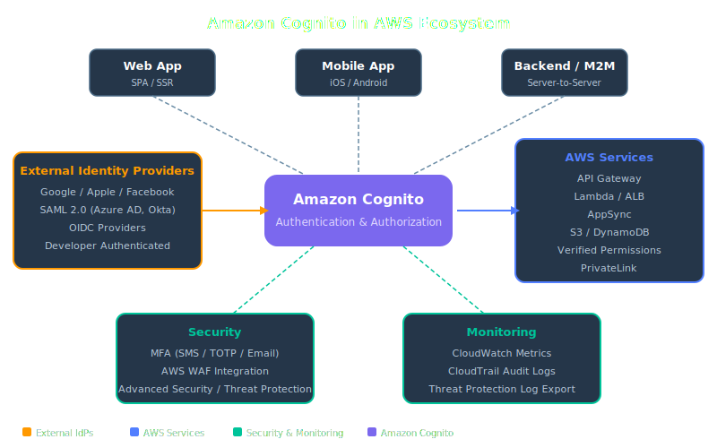
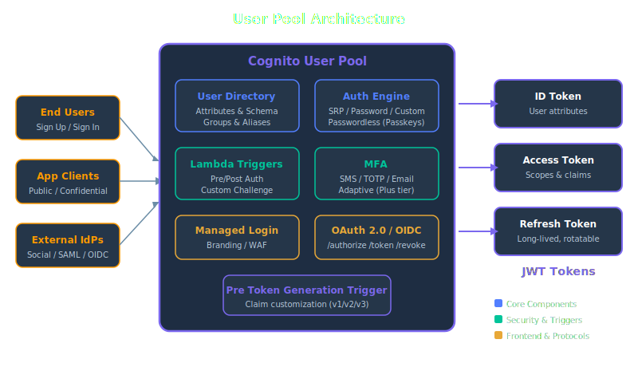
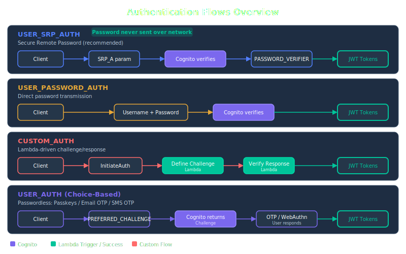
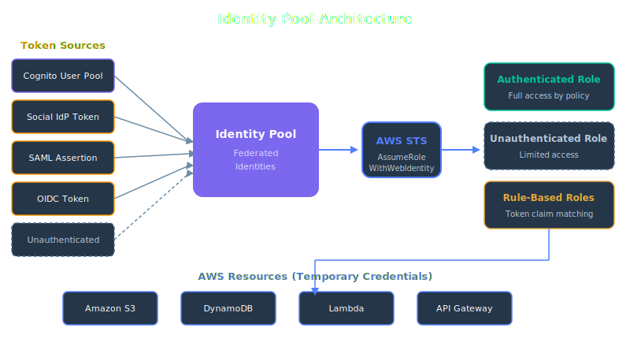
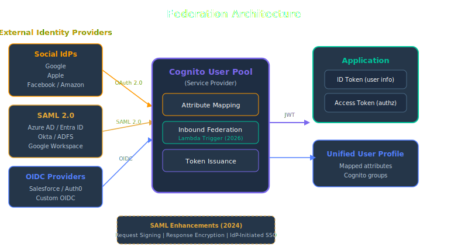
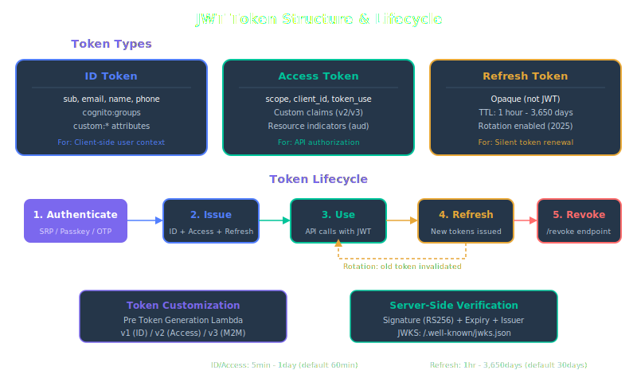
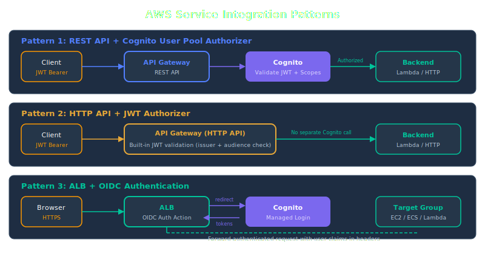

<!-- _class: lead -->
# Amazon Cognito 詳細レポート

- <svg viewBox="0 0 800 360" style="max-height:70vh;max-width:100%;display:block;margin:0 auto;" xmlns="http://www.w3.org/2000/svg"><rect width="800" height="360" fill="#1a1a2e" rx="8"/><rect x="280" y="10" width="240" height="44" fill="#f9a825" rx="8"/><text x="400" y="38" text-anchor="middle" fill="#1a1a2e" font-size="16" font-family="sans-serif" font-weight="bold">Amazon Cognito</text><line x1="320" y1="54" x2="320" y2="88" stroke="#f9a825" stroke-width="2"/><polygon points="320,100 314,88 326,88" fill="#f9a825"/><line x1="480" y1="54" x2="480" y2="88" stroke="#f9a825" stroke-width="2"/><polygon points="480,100 474,88 486,88" fill="#f9a825"/><rect x="40" y="100" width="280" height="200" fill="#1565c0" rx="8"/><text x="180" y="125" text-anchor="middle" fill="#ffffff" font-size="15" font-family="sans-serif" font-weight="bold">User Pool</text><text x="180" y="150" text-anchor="middle" fill="#b0bec5" font-size="12" font-family="sans-serif" font-weight="normal">ユーザーディレクトリ</text><text x="180" y="170" text-anchor="middle" fill="#b0bec5" font-size="12" font-family="sans-serif" font-weight="normal">認証エンジン (JWT 発行)</text><text x="180" y="190" text-anchor="middle" fill="#b0bec5" font-size="12" font-family="sans-serif" font-weight="normal">OAuth 2.0 / OIDC</text><text x="180" y="210" text-anchor="middle" fill="#b0bec5" font-size="12" font-family="sans-serif" font-weight="normal">MFA / パスワードポリシー</text><text x="180" y="230" text-anchor="middle" fill="#b0bec5" font-size="12" font-family="sans-serif" font-weight="normal">Lambda Triggers</text><text x="180" y="270" text-anchor="middle" fill="#f9a825" font-size="11" font-family="sans-serif" font-weight="normal">出力: ID Token / Access Token</text><rect x="480" y="100" width="280" height="200" fill="#6a1b9a" rx="8"/><text x="620" y="125" text-anchor="middle" fill="#ffffff" font-size="15" font-family="sans-serif" font-weight="bold">Identity Pool</text><text x="620" y="150" text-anchor="middle" fill="#b0bec5" font-size="12" font-family="sans-serif" font-weight="normal">AWS 認可エンジン</text><text x="620" y="170" text-anchor="middle" fill="#b0bec5" font-size="12" font-family="sans-serif" font-weight="normal">一時 AWS 認証情報を付与</text><text x="620" y="190" text-anchor="middle" fill="#b0bec5" font-size="12" font-family="sans-serif" font-weight="normal">Authenticated / Guest</text><text x="620" y="210" text-anchor="middle" fill="#b0bec5" font-size="12" font-family="sans-serif" font-weight="normal">IAM Role Mapping</text><text x="620" y="230" text-anchor="middle" fill="#b0bec5" font-size="10" font-family="sans-serif" font-weight="normal">STS AssumeRoleWithWebIdentity</text><text x="620" y="270" text-anchor="middle" fill="#f9a825" font-size="11" font-family="sans-serif" font-weight="normal">出力: AccessKey / SecretKey</text><text x="400" y="340" text-anchor="middle" fill="#b0bec5" font-size="11" font-family="sans-serif" font-weight="normal">User Pool = 認証 (Who are you?)  |  Identity Pool = 認可 (What can you do?)</text></svg>
- AWS 認証・認可サービスの包括的技術ガイド
- 2026年2月

---

# アジェンダ (1/2)

- <svg viewBox="0 0 800 420" style="max-height:70vh;max-width:100%;display:block;margin:0 auto;" xmlns="http://www.w3.org/2000/svg"><rect width="800" height="420" fill="#1a1a2e" rx="8"/><rect x="40" y="40" width="150" height="44" fill="#16213e" rx="6"/><text x="115" y="68" text-anchor="middle" fill="#ffffff" font-size="13" font-family="sans-serif" font-weight="normal">Client App</text><rect x="330" y="40" width="140" height="44" fill="#1565c0" rx="6"/><text x="400" y="68" text-anchor="middle" fill="#ffffff" font-size="12" font-family="sans-serif" font-weight="normal">Cognito User Pool</text><rect x="620" y="40" width="140" height="44" fill="#6a1b9a" rx="6"/><text x="690" y="68" text-anchor="middle" fill="#ffffff" font-size="13" font-family="sans-serif" font-weight="normal">Your Backend</text><line x1="190" y1="62" x2="318" y2="62" stroke="#f9a825" stroke-width="2"/><polygon points="330,62 318,68 318,56" fill="#f9a825"/><text x="260" y="54" text-anchor="middle" fill="#b0bec5" font-size="11" font-family="sans-serif" font-weight="normal">1. Login request</text><line x1="400" y1="62" x2="342" y2="62" stroke="#e91e63" stroke-width="2"/><polygon points="330,62 342,56 342,68" fill="#e91e63"/><text x="270" y="76" text-anchor="middle" fill="#b0bec5" font-size="10" font-family="sans-serif" font-weight="normal">2. Tokens (JWT)</text><line x1="330" y1="62" x2="201.90202930368912" y2="78.46973908952569" stroke="#e91e63" stroke-width="2"/><polygon points="190,80 201.13689884845195,72.51872443768113 202.6671597589263,84.42075374137025" fill="#e91e63"/><line x1="190" y1="130" x2="608" y2="130" stroke="#f9a825" stroke-width="2"/><polygon points="620,130 608,136 608,124" fill="#f9a825"/><text x="405" y="122" text-anchor="middle" fill="#b0bec5" font-size="11" font-family="sans-serif" font-weight="normal">3. API call + ID Token (Bearer)</text><rect x="330" y="160" width="140" height="44" fill="#00695c" rx="6"/><text x="400" y="188" text-anchor="middle" fill="#ffffff" font-size="12" font-family="sans-serif" font-weight="normal">JWKS Validation</text><line x1="690" y1="84" x2="411.60799937808486" y2="156.95790361126052" stroke="#b0bec5" stroke-width="2"/><polygon points="400,160 410.08695118371514,151.1539039222181 413.12904757245457,162.76190330030295" fill="#b0bec5"/><text x="580" y="135" text-anchor="middle" fill="#b0bec5" font-size="10" font-family="sans-serif" font-weight="normal">4. Validate token</text><line x1="400" y1="204" x2="400" y2="242" stroke="#f9a825" stroke-width="2"/><polygon points="400,254 394,242 406,242" fill="#f9a825"/><rect x="330" y="254" width="140" height="44" fill="#2e7d32" rx="6"/><text x="400" y="282" text-anchor="middle" fill="#ffffff" font-size="13" font-family="sans-serif" font-weight="normal">Response</text><line x1="400" y1="298" x2="201.8630605069599" y2="328.19229554179657" stroke="#f9a825" stroke-width="2"/><polygon points="190,330 200.95920827785818,322.26076528831663 202.7669127360616,334.1238257952765" fill="#f9a825"/><rect x="40" y="330" width="150" height="44" fill="#16213e" rx="6"/><text x="115" y="358" text-anchor="middle" fill="#ffffff" font-size="12" font-family="sans-serif" font-weight="normal">Receive data</text><text x="400" y="400" text-anchor="middle" fill="#b0bec5" font-size="12" font-family="sans-serif" font-weight="normal">Cognito JWT 認証フロー</text></svg>
- 1. **Cognito Overview** — サービス概要と全体像
- 2. **User Pool Deep Dive** — 認証エンジンの内部構造
- 3. **Authentication Flows** — 認証フロー設計と選択指針
- 4. **Identity Pool** — AWS リソースへの認可
- 5. **Federation** — 外部 IdP 連携
- 6. **Token Management** — JWT の構造・カスタマイズ・ローテーション

---

# アジェンダ (2/2)

- <svg viewBox="0 0 800 380" style="max-height:70vh;max-width:100%;display:block;margin:0 auto;" xmlns="http://www.w3.org/2000/svg"><rect width="800" height="380" fill="#1a1a2e" rx="8"/><rect x="40" y="100" width="140" height="50" fill="#16213e" rx="6"/><text x="110" y="130" text-anchor="middle" fill="#ffffff" font-size="14" font-family="sans-serif" font-weight="normal">User</text><rect x="310" y="60" width="180" height="50" fill="#f9a825" rx="8"/><text x="400" y="90" text-anchor="middle" fill="#1a1a2e" font-size="13" font-family="sans-serif" font-weight="bold">Cognito Hosted UI</text><rect x="310" y="160" width="180" height="50" fill="#1565c0" rx="6"/><text x="400" y="190" text-anchor="middle" fill="#ffffff" font-size="13" font-family="sans-serif" font-weight="normal">User Pool</text><rect x="570" y="60" width="160" height="50" fill="#880e4f" rx="6"/><text x="650" y="90" text-anchor="middle" fill="#ffffff" font-size="12" font-family="sans-serif" font-weight="normal">Google / Facebook</text><rect x="570" y="160" width="160" height="50" fill="#1a237e" rx="6"/><text x="650" y="190" text-anchor="middle" fill="#ffffff" font-size="12" font-family="sans-serif" font-weight="normal">SAML 2.0 IdP</text><rect x="570" y="260" width="160" height="50" fill="#00695c" rx="6"/><text x="650" y="290" text-anchor="middle" fill="#ffffff" font-size="12" font-family="sans-serif" font-weight="normal">OIDC Provider</text><line x1="180" y1="125" x2="298" y2="125" stroke="#f9a825" stroke-width="2"/><polygon points="310,125 298,131 298,119" fill="#f9a825"/><text x="245" y="115" text-anchor="middle" fill="#b0bec5" font-size="10" font-family="sans-serif" font-weight="normal">1. Login click</text><line x1="490" y1="85" x2="558" y2="85" stroke="#f9a825" stroke-width="2"/><polygon points="570,85 558,91 558,79" fill="#f9a825"/><text x="530" y="75" text-anchor="middle" fill="#b0bec5" font-size="10" font-family="sans-serif" font-weight="normal">2. Redirect</text><line x1="570" y1="85" x2="501.907334520564" y2="76.48841681507051" stroke="#e91e63" stroke-width="2"/><polygon points="490,75 502.6515429280993,70.5347495547885 501.16312611302874,82.44208407535251" fill="#e91e63"/><text x="530" y="100" text-anchor="middle" fill="#b0bec5" font-size="10" font-family="sans-serif" font-weight="normal">3. Auth code</text><line x1="400" y1="110" x2="400" y2="148" stroke="#f9a825" stroke-width="2"/><polygon points="400,160 394,148 406,148" fill="#f9a825"/><text x="420" y="143" text-anchor="middle" fill="#b0bec5" font-size="10" font-family="sans-serif" font-weight="normal">4. Exchange token</text><line x1="490" y1="185" x2="558" y2="185" stroke="#b0bec5" stroke-width="2"/><polygon points="570,185 558,191 558,179" fill="#b0bec5"/><line x1="490" y1="285" x2="558" y2="285" stroke="#b0bec5" stroke-width="2"/><polygon points="570,285 558,291 558,279" fill="#b0bec5"/><rect x="280" y="280" width="240" height="44" fill="#2e7d32" rx="6"/><text x="400" y="308" text-anchor="middle" fill="#ffffff" font-size="13" font-family="sans-serif" font-weight="normal">JWT Tokens issued</text><line x1="400" y1="210" x2="400" y2="268" stroke="#f9a825" stroke-width="2"/><polygon points="400,280 394,268 406,268" fill="#f9a825"/><text x="400" y="360" text-anchor="middle" fill="#b0bec5" font-size="12" font-family="sans-serif" font-weight="normal">ソーシャル / フェデレーション IdP 統合</text></svg>
- 7. **Security & Compliance** — MFA・WAF・脅威保護・認証取得
- 8. **AWS Service Integrations** — API Gateway / ALB / Lambda 連携
- 9. **Operations & Monitoring** — 運用・監視・移行
- 10. **Pricing** — 料金ティアとコスト最適化
- 11. **Best Practices** — 設計指針・アンチパターン
- 12. **Summary** — まとめ・参考リソース

---

<!-- _class: lead -->
# Cognito Overview

- <svg viewBox="0 0 800 315" style="max-height:70vh;max-width:100%;display:block;margin:0 auto;" xmlns="http://www.w3.org/2000/svg"><rect width="800" height="315" fill="#1a1a2e" rx="8"/><text x="400" y="30" text-anchor="middle" fill="#ffffff" font-size="15" font-family="sans-serif" font-weight="bold">Cognito JWT トークン種別</text><rect x="40" y="60" width="210" height="200" fill="#1565c0" rx="8"/><text x="145" y="85" text-anchor="middle" fill="#f9a825" font-size="14" font-family="sans-serif" font-weight="bold">ID Token</text><text x="145" y="110" text-anchor="middle" fill="#b0bec5" font-size="12" font-family="sans-serif" font-weight="normal">ユーザー情報を含む</text><text x="145" y="132" text-anchor="middle" fill="#b0bec5" font-size="11" font-family="sans-serif" font-weight="normal">sub / email / custom attrs</text><text x="145" y="154" text-anchor="middle" fill="#b0bec5" font-size="11" font-family="sans-serif" font-weight="normal">有効期限: 1h (default)</text><text x="145" y="176" text-anchor="middle" fill="#b0bec5" font-size="12" font-family="sans-serif" font-weight="normal">バックエンド認証に使用</text><text x="145" y="198" text-anchor="middle" fill="#b0bec5" font-size="11" font-family="sans-serif" font-weight="normal">Audience: App Client ID</text><text x="145" y="232" text-anchor="middle" fill="#b0bec5" font-size="11" font-family="sans-serif" font-weight="normal">OpenID Connect 準拠</text><rect x="295" y="60" width="210" height="200" fill="#6a1b9a" rx="8"/><text x="400" y="85" text-anchor="middle" fill="#f9a825" font-size="14" font-family="sans-serif" font-weight="bold">Access Token</text><text x="400" y="110" text-anchor="middle" fill="#b0bec5" font-size="12" font-family="sans-serif" font-weight="normal">スコープ・グループ情報</text><text x="400" y="132" text-anchor="middle" fill="#b0bec5" font-size="11" font-family="sans-serif" font-weight="normal">cognito:groups 等</text><text x="400" y="154" text-anchor="middle" fill="#b0bec5" font-size="11" font-family="sans-serif" font-weight="normal">有効期限: 1h (default)</text><text x="400" y="176" text-anchor="middle" fill="#b0bec5" font-size="12" font-family="sans-serif" font-weight="normal">Cognito API 呼び出しに使用</text><text x="400" y="198" text-anchor="middle" fill="#b0bec5" font-size="11" font-family="sans-serif" font-weight="normal">OAuth 2.0 スコープ付き</text><text x="400" y="232" text-anchor="middle" fill="#b0bec5" font-size="11" font-family="sans-serif" font-weight="normal">OAuth 2.0 準拠</text><rect x="550" y="60" width="210" height="200" fill="#00695c" rx="8"/><text x="655" y="85" text-anchor="middle" fill="#f9a825" font-size="14" font-family="sans-serif" font-weight="bold">Refresh Token</text><text x="655" y="110" text-anchor="middle" fill="#b0bec5" font-size="12" font-family="sans-serif" font-weight="normal">新規トークン取得用</text><text x="655" y="132" text-anchor="middle" fill="#b0bec5" font-size="11" font-family="sans-serif" font-weight="normal">有効期限: 30日 (default)</text><text x="655" y="154" text-anchor="middle" fill="#b0bec5" font-size="11" font-family="sans-serif" font-weight="normal">安全に保管が必要</text><text x="655" y="176" text-anchor="middle" fill="#b0bec5" font-size="12" font-family="sans-serif" font-weight="normal">Revoke 可能</text><text x="655" y="198" text-anchor="middle" fill="#b0bec5" font-size="11" font-family="sans-serif" font-weight="normal">デバイス単位で管理</text><text x="655" y="232" text-anchor="middle" fill="#b0bec5" font-size="11" font-family="sans-serif" font-weight="normal">ローテーション対応</text><text x="400" y="295" text-anchor="middle" fill="#b0bec5" font-size="12" font-family="sans-serif" font-weight="normal">全トークンは RS256 署名済み / JWKS で検証</text></svg>
- Amazon Cognitoの全体像と位置づけ

---

# Amazon Cognitoとは

- <svg viewBox="0 0 800 450" style="max-height:70vh;max-width:100%;display:block;margin:0 auto;" xmlns="http://www.w3.org/2000/svg"><rect width="800" height="450" fill="#1a1a2e" rx="8"/><rect x="280" y="10" width="240" height="40" fill="#1565c0" rx="8"/><text x="400" y="36" text-anchor="middle" fill="#ffffff" font-size="14" font-family="sans-serif" font-weight="bold">Cognito User Pool</text><rect x="100" y="70" width="200" height="38" fill="#6a1b9a" rx="6"/><text x="200" y="94" text-anchor="middle" fill="#ffffff" font-size="12" font-family="sans-serif" font-weight="normal">Pre Sign-up</text><rect x="500" y="70" width="200" height="38" fill="#16213e" rx="6"/><text x="600" y="94" text-anchor="middle" fill="#b0bec5" font-size="12" font-family="sans-serif" font-weight="normal">Lambda Function</text><line x1="300" y1="89" x2="488" y2="89" stroke="#f9a825" stroke-width="2"/><polygon points="500,89 488,95 488,83" fill="#f9a825"/><rect x="100" y="120" width="200" height="38" fill="#2e7d32" rx="6"/><text x="200" y="144" text-anchor="middle" fill="#ffffff" font-size="12" font-family="sans-serif" font-weight="normal">Post Confirmation</text><rect x="500" y="120" width="200" height="38" fill="#16213e" rx="6"/><text x="600" y="144" text-anchor="middle" fill="#b0bec5" font-size="12" font-family="sans-serif" font-weight="normal">Lambda Function</text><line x1="300" y1="139" x2="488" y2="139" stroke="#f9a825" stroke-width="2"/><polygon points="500,139 488,145 488,133" fill="#f9a825"/><rect x="100" y="170" width="200" height="38" fill="#1565c0" rx="6"/><text x="200" y="194" text-anchor="middle" fill="#ffffff" font-size="12" font-family="sans-serif" font-weight="normal">Pre Authentication</text><rect x="500" y="170" width="200" height="38" fill="#16213e" rx="6"/><text x="600" y="194" text-anchor="middle" fill="#b0bec5" font-size="12" font-family="sans-serif" font-weight="normal">Lambda Function</text><line x1="300" y1="189" x2="488" y2="189" stroke="#f9a825" stroke-width="2"/><polygon points="500,189 488,195 488,183" fill="#f9a825"/><rect x="100" y="220" width="200" height="38" fill="#1565c0" rx="6"/><text x="200" y="244" text-anchor="middle" fill="#ffffff" font-size="12" font-family="sans-serif" font-weight="normal">Post Authentication</text><rect x="500" y="220" width="200" height="38" fill="#16213e" rx="6"/><text x="600" y="244" text-anchor="middle" fill="#b0bec5" font-size="12" font-family="sans-serif" font-weight="normal">Lambda Function</text><line x1="300" y1="239" x2="488" y2="239" stroke="#f9a825" stroke-width="2"/><polygon points="500,239 488,245 488,233" fill="#f9a825"/><rect x="100" y="270" width="200" height="38" fill="#e91e63" rx="6"/><text x="200" y="294" text-anchor="middle" fill="#ffffff" font-size="12" font-family="sans-serif" font-weight="normal">Pre Token Generation</text><rect x="500" y="270" width="200" height="38" fill="#16213e" rx="6"/><text x="600" y="294" text-anchor="middle" fill="#b0bec5" font-size="12" font-family="sans-serif" font-weight="normal">Lambda Function</text><line x1="300" y1="289" x2="488" y2="289" stroke="#f9a825" stroke-width="2"/><polygon points="500,289 488,295 488,283" fill="#f9a825"/><rect x="100" y="320" width="200" height="38" fill="#00695c" rx="6"/><text x="200" y="344" text-anchor="middle" fill="#ffffff" font-size="12" font-family="sans-serif" font-weight="normal">Custom Message</text><rect x="500" y="320" width="200" height="38" fill="#16213e" rx="6"/><text x="600" y="344" text-anchor="middle" fill="#b0bec5" font-size="12" font-family="sans-serif" font-weight="normal">Lambda Function</text><line x1="300" y1="339" x2="488" y2="339" stroke="#f9a825" stroke-width="2"/><polygon points="500,339 488,345 488,333" fill="#f9a825"/><rect x="100" y="370" width="200" height="38" fill="#795548" rx="6"/><text x="200" y="394" text-anchor="middle" fill="#ffffff" font-size="12" font-family="sans-serif" font-weight="normal">User Migration</text><rect x="500" y="370" width="200" height="38" fill="#16213e" rx="6"/><text x="600" y="394" text-anchor="middle" fill="#b0bec5" font-size="12" font-family="sans-serif" font-weight="normal">Lambda Function</text><line x1="300" y1="389" x2="488" y2="389" stroke="#f9a825" stroke-width="2"/><polygon points="500,389 488,395 488,383" fill="#f9a825"/><text x="400" y="428" text-anchor="middle" fill="#b0bec5" font-size="12" font-family="sans-serif" font-weight="normal">Lambda Trigger ポイント一覧</text></svg>
- **AWS が提供するフルマネージド認証・認可サービス**
- Web・モバイル・サーバーアプリにユーザー認証機能を迅速に追加
- **User Pool**: ユーザーディレクトリ + 認証エンジン（JWT 発行）
- **Identity Pool**: 認証済みユーザーに AWS 一時認証情報を付与
- OAuth 2.0 / OpenID Connect 完全準拠の認可サーバー
- 数百万ユーザーまでスケール — サーバーレス・従量課金

---

# AWSエコシステムにおけるCognito

---

# User Pool vs Identity Pool

- <svg viewBox="0 0 800 490" style="max-height:70vh;max-width:100%;display:block;margin:0 auto;" xmlns="http://www.w3.org/2000/svg"><rect width="800" height="490" fill="#1a1a2e" rx="8"/><rect x="40" y="40" width="140" height="44" fill="#16213e" rx="6"/><text x="110" y="68" text-anchor="middle" fill="#ffffff" font-size="14" font-family="sans-serif" font-weight="normal">User</text><rect x="330" y="40" width="140" height="44" fill="#1565c0" rx="6"/><text x="400" y="68" text-anchor="middle" fill="#ffffff" font-size="14" font-family="sans-serif" font-weight="normal">Cognito</text><line x1="180" y1="62" x2="318" y2="62" stroke="#f9a825" stroke-width="2"/><polygon points="330,62 318,68 318,56" fill="#f9a825"/><text x="255" y="52" text-anchor="middle" fill="#b0bec5" font-size="11" font-family="sans-serif" font-weight="normal">1. Username + PW</text><rect x="330" y="140" width="140" height="44" fill="#6a1b9a" rx="6"/><text x="400" y="168" text-anchor="middle" fill="#ffffff" font-size="13" font-family="sans-serif" font-weight="normal">MFA Challenge</text><line x1="400" y1="84" x2="400" y2="128" stroke="#f9a825" stroke-width="2"/><polygon points="400,140 394,128 406,128" fill="#f9a825"/><line x1="400" y1="184" x2="121.93630152591862" y2="212.76521018697395" stroke="#e91e63" stroke-width="2"/><polygon points="110,214 121.3189066194056,206.79705942401463 122.55369643243165,218.73336094993326" fill="#e91e63"/><text x="255" y="198" text-anchor="middle" fill="#b0bec5" font-size="11" font-family="sans-serif" font-weight="normal">2. MFA required</text><rect x="40" y="220" width="140" height="44" fill="#16213e" rx="6"/><text x="110" y="248" text-anchor="middle" fill="#ffffff" font-size="13" font-family="sans-serif" font-weight="normal">TOTP / SMS</text><line x1="180" y1="242" x2="318" y2="242" stroke="#f9a825" stroke-width="2"/><polygon points="330,242 318,248 318,236" fill="#f9a825"/><text x="255" y="232" text-anchor="middle" fill="#b0bec5" font-size="11" font-family="sans-serif" font-weight="normal">3. OTP code</text><rect x="330" y="240" width="140" height="44" fill="#16213e" rx="6"/><text x="400" y="268" text-anchor="middle" fill="#ffffff" font-size="13" font-family="sans-serif" font-weight="normal">Verify OTP</text><line x1="400" y1="284" x2="400" y2="328" stroke="#f9a825" stroke-width="2"/><polygon points="400,340 394,328 406,328" fill="#f9a825"/><rect x="330" y="340" width="140" height="44" fill="#2e7d32" rx="6"/><text x="400" y="368" text-anchor="middle" fill="#ffffff" font-size="13" font-family="sans-serif" font-weight="normal">JWT Tokens</text><line x1="400" y1="384" x2="121.98177761962994" y2="399.3389364071928" stroke="#f9a825" stroke-width="2"/><polygon points="110,400 121.65124582322635,393.34804759737784 122.31230941603353,405.3298252170078" fill="#f9a825"/><rect x="40" y="400" width="140" height="44" fill="#16213e" rx="6"/><text x="110" y="428" text-anchor="middle" fill="#ffffff" font-size="13" font-family="sans-serif" font-weight="normal">Logged In</text><text x="400" y="470" text-anchor="middle" fill="#b0bec5" font-size="12" font-family="sans-serif" font-weight="normal">MFA 認証フロー (TOTP / SMS)</text></svg>
- **User Pool（認証 / Authentication）**
- ユーザーディレクトリ + 認証エンジン → JWT トークン発行
- サインアップ・ログイン・MFA・パスワードリセットを管理
- **Identity Pool（認可 / Authorization）**
- JWT を AWS 一時認証情報（STS）に変換
- IAM ロールで S3 / DynamoDB 等へのアクセスを制御
- **両者を組み合わせて認証→認可の完全なパイプラインを構築**

---

<!-- _class: lead -->
# User Pool Deep Dive

- <svg viewBox="0 0 800 460" style="max-height:70vh;max-width:100%;display:block;margin:0 auto;" xmlns="http://www.w3.org/2000/svg"><rect width="800" height="460" fill="#1a1a2e" rx="8"/><rect x="40" y="60" width="160" height="50" fill="#1565c0" rx="6"/><text x="120" y="90" text-anchor="middle" fill="#ffffff" font-size="12" font-family="sans-serif" font-weight="normal">Cognito User Pool</text><text x="120" y="106" text-anchor="middle" fill="#b0bec5" font-size="10" font-family="sans-serif" font-weight="normal">(ID Token)</text><rect x="40" y="160" width="160" height="50" fill="#6a1b9a" rx="6"/><text x="120" y="190" text-anchor="middle" fill="#ffffff" font-size="12" font-family="sans-serif" font-weight="normal">Social IdP</text><text x="120" y="206" text-anchor="middle" fill="#b0bec5" font-size="10" font-family="sans-serif" font-weight="normal">(Google token)</text><rect x="40" y="260" width="160" height="50" fill="#00695c" rx="6"/><text x="120" y="290" text-anchor="middle" fill="#ffffff" font-size="12" font-family="sans-serif" font-weight="normal">SAML IdP</text><text x="120" y="306" text-anchor="middle" fill="#b0bec5" font-size="10" font-family="sans-serif" font-weight="normal">(SAML assertion)</text><rect x="40" y="360" width="160" height="50" fill="#16213e" rx="6"/><text x="120" y="390" text-anchor="middle" fill="#ffffff" font-size="12" font-family="sans-serif" font-weight="normal">Guest User</text><text x="120" y="406" text-anchor="middle" fill="#b0bec5" font-size="10" font-family="sans-serif" font-weight="normal">(Unauthenticated)</text><rect x="310" y="210" width="180" height="50" fill="#f9a825" rx="8"/><text x="400" y="240" text-anchor="middle" fill="#1a1a2e" font-size="14" font-family="sans-serif" font-weight="bold">Identity Pool</text><line x1="200" y1="85" x2="298" y2="85" stroke="#f9a825" stroke-width="2"/><polygon points="310,85 298,91 298,79" fill="#f9a825"/><line x1="200" y1="185" x2="298" y2="185" stroke="#f9a825" stroke-width="2"/><polygon points="310,185 298,191 298,179" fill="#f9a825"/><line x1="200" y1="285" x2="298" y2="285" stroke="#f9a825" stroke-width="2"/><polygon points="310,285 298,291 298,279" fill="#f9a825"/><line x1="200" y1="385" x2="298" y2="385" stroke="#f9a825" stroke-width="2"/><polygon points="310,385 298,391 298,379" fill="#f9a825"/><line x1="490" y1="235" x2="548" y2="235" stroke="#f9a825" stroke-width="2"/><polygon points="560,235 548,241 548,229" fill="#f9a825"/><rect x="560" y="160" width="200" height="50" fill="#1565c0" rx="6"/><text x="660" y="190" text-anchor="middle" fill="#ffffff" font-size="13" font-family="sans-serif" font-weight="normal">IAM Role A</text><text x="660" y="206" text-anchor="middle" fill="#b0bec5" font-size="10" font-family="sans-serif" font-weight="normal">(Authenticated)</text><rect x="560" y="260" width="200" height="50" fill="#2e7d32" rx="6"/><text x="660" y="290" text-anchor="middle" fill="#ffffff" font-size="13" font-family="sans-serif" font-weight="normal">IAM Role B</text><text x="660" y="306" text-anchor="middle" fill="#b0bec5" font-size="10" font-family="sans-serif" font-weight="normal">(Guest)</text><line x1="660" y1="210" x2="660" y2="248" stroke="#e91e63" stroke-width="2"/><polygon points="660,260 654,248 666,248" fill="#e91e63"/><rect x="560" y="340" width="200" height="50" fill="#16213e" rx="6"/><text x="660" y="370" text-anchor="middle" fill="#ffffff" font-size="12" font-family="sans-serif" font-weight="normal">Temp AWS Creds</text><text x="660" y="386" text-anchor="middle" fill="#b0bec5" font-size="10" font-family="sans-serif" font-weight="normal">via STS</text><line x1="660" y1="310" x2="660" y2="328" stroke="#f9a825" stroke-width="2"/><polygon points="660,340 654,328 666,328" fill="#f9a825"/><text x="400" y="440" text-anchor="middle" fill="#b0bec5" font-size="11" font-family="sans-serif" font-weight="normal">Identity Pool: 認証済みユーザーに AWS 一時認証情報を付与</text></svg>
- 認証エンジンの内部アーキテクチャ

---

# User Pool アーキテクチャ

---

# ユーザー属性とスキーマ

- <svg viewBox="0 0 800 470" style="max-height:70vh;max-width:100%;display:block;margin:0 auto;" xmlns="http://www.w3.org/2000/svg"><rect width="800" height="470" fill="#1a1a2e" rx="8"/><rect x="40" y="50" width="140" height="50" fill="#16213e" rx="6"/><text x="110" y="80" text-anchor="middle" fill="#ffffff" font-size="14" font-family="sans-serif" font-weight="normal">Browser</text><rect x="330" y="50" width="140" height="50" fill="#1565c0" rx="6"/><text x="400" y="80" text-anchor="middle" fill="#ffffff" font-size="14" font-family="sans-serif" font-weight="normal">App Server</text><line x1="180" y1="75" x2="318" y2="75" stroke="#f9a825" stroke-width="2"/><polygon points="330,75 318,81 318,69" fill="#f9a825"/><text x="255" y="65" text-anchor="middle" fill="#b0bec5" font-size="11" font-family="sans-serif" font-weight="normal">GET /protected</text><line x1="400" y1="100" x2="400" y2="158" stroke="#f9a825" stroke-width="2"/><polygon points="400,170 394,158 406,158" fill="#f9a825"/><text x="430" y="138" text-anchor="middle" fill="#b0bec5" font-size="10" font-family="sans-serif" font-weight="normal">Redirect to</text><text x="430" y="150" text-anchor="middle" fill="#b0bec5" font-size="10" font-family="sans-serif" font-weight="normal">/oauth2/authorize</text><rect x="330" y="170" width="140" height="50" fill="#f9a825" rx="8"/><text x="400" y="200" text-anchor="middle" fill="#1a1a2e" font-size="12" font-family="sans-serif" font-weight="bold">Cognito Hosted UI</text><line x1="400" y1="220" x2="121.93630152591862" y2="248.76521018697395" stroke="#b0bec5" stroke-width="2"/><polygon points="110,250 121.3189066194056,242.79705942401463 122.55369643243165,254.73336094993326" fill="#b0bec5"/><text x="255" y="240" text-anchor="middle" fill="#b0bec5" font-size="10" font-family="sans-serif" font-weight="normal">Login page redirect</text><rect x="40" y="250" width="140" height="50" fill="#16213e" rx="6"/><text x="110" y="280" text-anchor="middle" fill="#ffffff" font-size="12" font-family="sans-serif" font-weight="normal">User enters
credentials</text><line x1="180" y1="275" x2="318" y2="275" stroke="#f9a825" stroke-width="2"/><polygon points="330,275 318,281 318,269" fill="#f9a825"/><text x="255" y="265" text-anchor="middle" fill="#b0bec5" font-size="10" font-family="sans-serif" font-weight="normal">POST credentials</text><rect x="330" y="270" width="140" height="50" fill="#e91e63" rx="6"/><text x="400" y="300" text-anchor="middle" fill="#ffffff" font-size="12" font-family="sans-serif" font-weight="normal">Auth Code issued</text><line x1="400" y1="320" x2="121.93630152591862" y2="348.76521018697395" stroke="#e91e63" stroke-width="2"/><polygon points="110,350 121.3189066194056,342.79705942401466 122.55369643243165,354.7333609499332" fill="#e91e63"/><text x="255" y="340" text-anchor="middle" fill="#b0bec5" font-size="10" font-family="sans-serif" font-weight="normal">Redirect + code</text><rect x="40" y="350" width="140" height="50" fill="#16213e" rx="6"/><line x1="180" y1="375" x2="318" y2="375" stroke="#f9a825" stroke-width="2"/><polygon points="330,375 318,381 318,369" fill="#f9a825"/><text x="255" y="365" text-anchor="middle" fill="#b0bec5" font-size="10" font-family="sans-serif" font-weight="normal">POST /oauth2/token</text><rect x="330" y="370" width="140" height="50" fill="#2e7d32" rx="6"/><text x="400" y="400" text-anchor="middle" fill="#ffffff" font-size="13" font-family="sans-serif" font-weight="normal">JWT Tokens</text><text x="400" y="450" text-anchor="middle" fill="#b0bec5" font-size="12" font-family="sans-serif" font-weight="normal">Authorization Code Flow (Hosted UI)</text></svg>
- **標準属性**: email, phone_number, name, address 等（OIDC 準拠）
- **カスタム属性**: `custom:` プレフィックスで定義（作成後の削除不可）
- 属性の **必須/オプション** 設定 — サインアップ時の検証ルール
- **エイリアス属性**: email / phone_number をユーザー名として使用可能
- 属性マッピング: 外部 IdP の属性を Cognito 属性に自動変換
- スキーマは **作成後に変更不可** — 設計段階での慎重な計画が重要

---

# App Clients & OAuth 2.0 エンドポイント

- <svg viewBox="0 0 800 490" style="max-height:70vh;max-width:100%;display:block;margin:0 auto;" xmlns="http://www.w3.org/2000/svg"><rect width="800" height="490" fill="#1a1a2e" rx="8"/><rect x="40" y="100" width="140" height="50" fill="#16213e" rx="6"/><text x="110" y="130" text-anchor="middle" fill="#ffffff" font-size="14" font-family="sans-serif" font-weight="normal">Client</text><line x1="180" y1="125" x2="268" y2="125" stroke="#f9a825" stroke-width="2"/><polygon points="280,125 268,131 268,119" fill="#f9a825"/><text x="230" y="115" text-anchor="middle" fill="#b0bec5" font-size="10" font-family="sans-serif" font-weight="normal">API call
+ JWT</text><rect x="280" y="100" width="160" height="50" fill="#1565c0" rx="6"/><text x="360" y="130" text-anchor="middle" fill="#ffffff" font-size="14" font-family="sans-serif" font-weight="normal">API Gateway</text><line x1="360" y1="150" x2="360" y2="188" stroke="#f9a825" stroke-width="2"/><polygon points="360,200 354,188 366,188" fill="#f9a825"/><rect x="280" y="200" width="160" height="50" fill="#f9a825" rx="8"/><text x="360" y="230" text-anchor="middle" fill="#1a1a2e" font-size="12" font-family="sans-serif" font-weight="bold">Cognito Authorizer</text><line x1="360" y1="250" x2="360" y2="288" stroke="#f9a825" stroke-width="2"/><polygon points="360,300 354,288 366,288" fill="#f9a825"/><rect x="280" y="300" width="160" height="44" fill="#16213e" rx="6"/><text x="360" y="327" text-anchor="middle" fill="#b0bec5" font-size="11" font-family="sans-serif" font-weight="normal">Validate JWT
(JWKS)</text><line x1="360" y1="344" x2="360" y2="382" stroke="#f9a825" stroke-width="2"/><polygon points="360,394 354,382 366,382" fill="#f9a825"/><rect x="220" y="394" width="280" height="44" fill="#2e7d32" rx="6"/><text x="360" y="422" text-anchor="middle" fill="#ffffff" font-size="13" font-family="sans-serif" font-weight="normal">Lambda / Backend</text><rect x="560" y="200" width="160" height="50" fill="#e91e63" rx="6"/><text x="640" y="230" text-anchor="middle" fill="#ffffff" font-size="12" font-family="sans-serif" font-weight="normal">403 Unauthorized</text><line x1="440" y1="225" x2="548" y2="225" stroke="#e91e63" stroke-width="2"/><polygon points="560,225 548,231 548,219" fill="#e91e63"/><text x="500" y="216" text-anchor="middle" fill="#b0bec5" font-size="10" font-family="sans-serif" font-weight="normal">invalid token</text><text x="400" y="470" text-anchor="middle" fill="#b0bec5" font-size="12" font-family="sans-serif" font-weight="normal">API Gateway Cognito Authorizer フロー</text></svg>
- **App Client**: アプリケーションごとの認証設定単位
- Public Client（SPA/モバイル）: シークレットなし + **PKCE 必須**
- Confidential Client（バックエンド）: シークレットあり
- **OAuth 2.0 エンドポイント**:
- `/authorize` → `/token` → `/userInfo` → `/revoke`
- M2M 認証: Client Credentials Grant でサービス間通信

---

# Managed Login（旧 Hosted UI）

- <svg viewBox="0 0 800 325" style="max-height:70vh;max-width:100%;display:block;margin:0 auto;" xmlns="http://www.w3.org/2000/svg"><rect width="800" height="325" fill="#1a1a2e" rx="8"/><text x="400" y="30" text-anchor="middle" fill="#ffffff" font-size="15" font-family="sans-serif" font-weight="bold">Cognito セキュリティ機能</text><rect x="40" y="60" width="160" height="220" fill="#16213e" rx="8"/><text x="120" y="85" text-anchor="middle" fill="#f9a825" font-size="14" font-family="sans-serif" font-weight="bold">MFA</text><text x="120" y="110" text-anchor="middle" fill="#b0bec5" font-size="11" font-family="sans-serif" font-weight="normal">TOTP (Google Auth)</text><text x="120" y="130" text-anchor="middle" fill="#b0bec5" font-size="11" font-family="sans-serif" font-weight="normal">SMS OTP</text><text x="120" y="150" text-anchor="middle" fill="#b0bec5" font-size="11" font-family="sans-serif" font-weight="normal">Email OTP</text><text x="120" y="170" text-anchor="middle" fill="#b0bec5" font-size="11" font-family="sans-serif" font-weight="normal">パスキー (WebAuthn)</text><text x="120" y="195" text-anchor="middle" fill="#b0bec5" font-size="11" font-family="sans-serif" font-weight="normal">必須 / オプション</text><text x="120" y="215" text-anchor="middle" fill="#b0bec5" font-size="11" font-family="sans-serif" font-weight="normal">ユーザー単位設定可</text><text x="120" y="255" text-anchor="middle" fill="#b0bec5" font-size="11" font-family="sans-serif" font-weight="normal">認証強化</text><rect x="230" y="60" width="160" height="220" fill="#16213e" rx="8"/><text x="310" y="85" text-anchor="middle" fill="#f9a825" font-size="14" font-family="sans-serif" font-weight="bold">Advanced Security</text><text x="310" y="110" text-anchor="middle" fill="#b0bec5" font-size="11" font-family="sans-serif" font-weight="normal">不正アクセス検知</text><text x="310" y="130" text-anchor="middle" fill="#b0bec5" font-size="11" font-family="sans-serif" font-weight="normal">Adaptive Auth</text><text x="310" y="150" text-anchor="middle" fill="#b0bec5" font-size="11" font-family="sans-serif" font-weight="normal">リスクスコアリング</text><text x="310" y="170" text-anchor="middle" fill="#b0bec5" font-size="11" font-family="sans-serif" font-weight="normal">ブルートフォース防御</text><text x="310" y="195" text-anchor="middle" fill="#b0bec5" font-size="11" font-family="sans-serif" font-weight="normal">侵害認証情報チェック</text><text x="310" y="215" text-anchor="middle" fill="#b0bec5" font-size="11" font-family="sans-serif" font-weight="normal">IP レピュテーション</text><text x="310" y="255" text-anchor="middle" fill="#b0bec5" font-size="11" font-family="sans-serif" font-weight="normal">Plus ティア</text><rect x="420" y="60" width="160" height="220" fill="#16213e" rx="8"/><text x="500" y="85" text-anchor="middle" fill="#f9a825" font-size="14" font-family="sans-serif" font-weight="bold">WAF</text><text x="500" y="110" text-anchor="middle" fill="#b0bec5" font-size="11" font-family="sans-serif" font-weight="normal">AWS WAF 統合</text><text x="500" y="130" text-anchor="middle" fill="#b0bec5" font-size="11" font-family="sans-serif" font-weight="normal">レート制限</text><text x="500" y="150" text-anchor="middle" fill="#b0bec5" font-size="11" font-family="sans-serif" font-weight="normal">IP ブロック</text><text x="500" y="170" text-anchor="middle" fill="#b0bec5" font-size="11" font-family="sans-serif" font-weight="normal">Bot 検知</text><text x="500" y="195" text-anchor="middle" fill="#b0bec5" font-size="11" font-family="sans-serif" font-weight="normal">Cognito User Pool</text><text x="500" y="215" text-anchor="middle" fill="#b0bec5" font-size="11" font-family="sans-serif" font-weight="normal">に直接アタッチ</text><text x="500" y="255" text-anchor="middle" fill="#b0bec5" font-size="11" font-family="sans-serif" font-weight="normal">Hosted UI 保護</text><rect x="610" y="60" width="160" height="220" fill="#16213e" rx="8"/><text x="690" y="85" text-anchor="middle" fill="#f9a825" font-size="14" font-family="sans-serif" font-weight="bold">Token Security</text><text x="690" y="110" text-anchor="middle" fill="#b0bec5" font-size="11" font-family="sans-serif" font-weight="normal">RS256 署名</text><text x="690" y="130" text-anchor="middle" fill="#b0bec5" font-size="11" font-family="sans-serif" font-weight="normal">JWKS 検証</text><text x="690" y="150" text-anchor="middle" fill="#b0bec5" font-size="11" font-family="sans-serif" font-weight="normal">有効期限管理</text><text x="690" y="170" text-anchor="middle" fill="#b0bec5" font-size="11" font-family="sans-serif" font-weight="normal">Revocation</text><text x="690" y="195" text-anchor="middle" fill="#b0bec5" font-size="11" font-family="sans-serif" font-weight="normal">Rotation</text><text x="690" y="215" text-anchor="middle" fill="#b0bec5" font-size="11" font-family="sans-serif" font-weight="normal">スコープ制限</text><text x="690" y="255" text-anchor="middle" fill="#b0bec5" font-size="11" font-family="sans-serif" font-weight="normal">Fine-grained access</text><text x="400" y="305" text-anchor="middle" fill="#b0bec5" font-size="12" font-family="sans-serif" font-weight="normal">多層防御によるセキュリティ</text></svg>
- **2024年11月リリース** — Hosted UI の後継となるモダン UI
- レスポンシブデザイン + ノーコードブランディングエディタ
- **Passwordless 対応**: パスキー / Email OTP / SMS OTP
- 利用規約・プライバシーポリシーリンクの表示（2025年10月〜）
- AWS WAF 統合でボット・攻撃対策（2025年6月〜）
- **Essentials / Plus ティアで利用可能**（Lite は従来の Hosted UI のみ）

---

<!-- _class: lead -->
# Authentication Flows

- <svg viewBox="0 0 800 360" style="max-height:70vh;max-width:100%;display:block;margin:0 auto;" xmlns="http://www.w3.org/2000/svg"><rect width="800" height="360" fill="#1a1a2e" rx="8"/><text x="400" y="25" text-anchor="middle" fill="#ffffff" font-size="15" font-family="sans-serif" font-weight="bold">Cognito 料金ティア</text><rect x="40" y="50" width="220" height="260" fill="#0d1b3e" rx="8"/><text x="150" y="75" text-anchor="middle" fill="#f9a825" font-size="16" font-family="sans-serif" font-weight="bold">Lite</text><text x="150" y="100" text-anchor="middle" fill="#b0bec5" font-size="12" font-family="sans-serif" font-weight="normal">MAU 単価 最安</text><text x="150" y="125" text-anchor="middle" fill="#ffffff" font-size="12" font-family="sans-serif" font-weight="normal">基本認証機能</text><text x="150" y="148" text-anchor="middle" fill="#b0bec5" font-size="12" font-family="sans-serif" font-weight="normal">User Pool のみ</text><text x="150" y="170" text-anchor="middle" fill="#b0bec5" font-size="12" font-family="sans-serif" font-weight="normal">MFA: SMS / TOTP</text><text x="150" y="192" text-anchor="middle" fill="#b0bec5" font-size="12" font-family="sans-serif" font-weight="normal">Hosted UI</text><text x="150" y="215" text-anchor="middle" fill="#b0bec5" font-size="12" font-family="sans-serif" font-weight="normal">Social IdP</text><text x="150" y="238" text-anchor="middle" fill="#b0bec5" font-size="12" font-family="sans-serif" font-weight="normal">Lambda Triggers</text><text x="150" y="280" text-anchor="middle" fill="#b0bec5" font-size="12" font-family="sans-serif" font-weight="normal">小規模向け</text><rect x="290" y="50" width="220" height="260" fill="#1a0d3e" rx="8"/><text x="400" y="75" text-anchor="middle" fill="#f9a825" font-size="16" font-family="sans-serif" font-weight="bold">Essentials</text><text x="400" y="100" text-anchor="middle" fill="#b0bec5" font-size="12" font-family="sans-serif" font-weight="normal">Lite + α</text><text x="400" y="125" text-anchor="middle" fill="#ffffff" font-size="12" font-family="sans-serif" font-weight="normal">Managed Login (新UI)</text><text x="400" y="148" text-anchor="middle" fill="#b0bec5" font-size="12" font-family="sans-serif" font-weight="normal">パスキー対応</text><text x="400" y="170" text-anchor="middle" fill="#b0bec5" font-size="12" font-family="sans-serif" font-weight="normal">カスタムドメイン</text><text x="400" y="192" text-anchor="middle" fill="#b0bec5" font-size="12" font-family="sans-serif" font-weight="normal">拡張ログ</text><text x="400" y="215" text-anchor="middle" fill="#b0bec5" font-size="12" font-family="sans-serif" font-weight="normal">Token Revocation</text><text x="400" y="238" text-anchor="middle" fill="#b0bec5" font-size="12" font-family="sans-serif" font-weight="normal">メール OTP</text><text x="400" y="280" text-anchor="middle" fill="#b0bec5" font-size="12" font-family="sans-serif" font-weight="normal">成長期向け</text><rect x="540" y="50" width="220" height="260" fill="#0d2e1a" rx="8"/><text x="650" y="75" text-anchor="middle" fill="#f9a825" font-size="16" font-family="sans-serif" font-weight="bold">Plus</text><text x="650" y="100" text-anchor="middle" fill="#b0bec5" font-size="12" font-family="sans-serif" font-weight="normal">Essentials + α</text><text x="650" y="125" text-anchor="middle" fill="#ffffff" font-size="12" font-family="sans-serif" font-weight="normal">Advanced Security</text><text x="650" y="148" text-anchor="middle" fill="#b0bec5" font-size="12" font-family="sans-serif" font-weight="normal">不正アクセス検知</text><text x="650" y="170" text-anchor="middle" fill="#b0bec5" font-size="12" font-family="sans-serif" font-weight="normal">Adaptive Auth</text><text x="650" y="192" text-anchor="middle" fill="#b0bec5" font-size="12" font-family="sans-serif" font-weight="normal">侵害パスワード検知</text><text x="650" y="215" text-anchor="middle" fill="#b0bec5" font-size="12" font-family="sans-serif" font-weight="normal">IP レピュテーション</text><text x="650" y="238" text-anchor="middle" fill="#b0bec5" font-size="12" font-family="sans-serif" font-weight="normal">WAF 統合</text><text x="650" y="280" text-anchor="middle" fill="#b0bec5" font-size="11" font-family="sans-serif" font-weight="normal">エンタープライズ向け</text><text x="400" y="340" text-anchor="middle" fill="#b0bec5" font-size="12" font-family="sans-serif" font-weight="normal">MAU = Monthly Active Users 単位の従量課金</text></svg>
- 認証フロー設計と選択指針

---

# 認証フロー全体像

---

# SRP & Password Authentication

- <svg viewBox="0 0 800 380" style="max-height:70vh;max-width:100%;display:block;margin:0 auto;" xmlns="http://www.w3.org/2000/svg"><rect width="800" height="380" fill="#1a1a2e" rx="8"/><text x="400" y="28" text-anchor="middle" fill="#ffffff" font-size="15" font-family="sans-serif" font-weight="bold">Cognito ベストプラクティス</text><rect x="40" y="55" width="340" height="280" fill="#16213e" rx="8"/><text x="210" y="80" text-anchor="middle" fill="#f9a825" font-size="14" font-family="sans-serif" font-weight="bold">設計</text><text x="210" y="106" text-anchor="middle" fill="#b0bec5" font-size="12" font-family="sans-serif" font-weight="normal">User Pool と Identity Pool を分離</text><text x="210" y="128" text-anchor="middle" fill="#b0bec5" font-size="12" font-family="sans-serif" font-weight="normal">カスタムドメインを使用</text><text x="210" y="150" text-anchor="middle" fill="#b0bec5" font-size="12" font-family="sans-serif" font-weight="normal">App Client ごとにスコープを制限</text><text x="210" y="172" text-anchor="middle" fill="#b0bec5" font-size="12" font-family="sans-serif" font-weight="normal">不要な App Client を削除</text><text x="210" y="194" text-anchor="middle" fill="#b0bec5" font-size="12" font-family="sans-serif" font-weight="normal">Pre Token Generation で</text><text x="210" y="212" text-anchor="middle" fill="#b0bec5" font-size="12" font-family="sans-serif" font-weight="normal">カスタムクレーム付与</text><text x="210" y="236" text-anchor="middle" fill="#b0bec5" font-size="12" font-family="sans-serif" font-weight="normal">Refresh Token 有効期限を</text><text x="210" y="254" text-anchor="middle" fill="#b0bec5" font-size="12" font-family="sans-serif" font-weight="normal">セキュリティ要件に合わせる</text><text x="210" y="276" text-anchor="middle" fill="#b0bec5" font-size="12" font-family="sans-serif" font-weight="normal">MFA を必須化 (管理者)</text><text x="210" y="298" text-anchor="middle" fill="#b0bec5" font-size="12" font-family="sans-serif" font-weight="normal">Hosted UI でパスキー対応</text><rect x="420" y="55" width="340" height="280" fill="#16213e" rx="8"/><text x="590" y="80" text-anchor="middle" fill="#f9a825" font-size="14" font-family="sans-serif" font-weight="bold">運用・監視</text><text x="590" y="106" text-anchor="middle" fill="#b0bec5" font-size="12" font-family="sans-serif" font-weight="normal">CloudTrail で全 API ログ記録</text><text x="590" y="128" text-anchor="middle" fill="#b0bec5" font-size="12" font-family="sans-serif" font-weight="normal">CloudWatch でサインイン失敗監視</text><text x="590" y="150" text-anchor="middle" fill="#b0bec5" font-size="12" font-family="sans-serif" font-weight="normal">クォータに余裕を持ったデザイン</text><text x="590" y="172" text-anchor="middle" fill="#b0bec5" font-size="12" font-family="sans-serif" font-weight="normal">WAF でブルートフォース防御</text><text x="590" y="194" text-anchor="middle" fill="#b0bec5" font-size="12" font-family="sans-serif" font-weight="normal">Plus ティアで脅威保護を有効化</text><text x="590" y="216" text-anchor="middle" fill="#b0bec5" font-size="12" font-family="sans-serif" font-weight="normal">定期的な JWKS キーローテーション</text><text x="590" y="238" text-anchor="middle" fill="#b0bec5" font-size="12" font-family="sans-serif" font-weight="normal">ユーザー属性は最小限に</text><text x="590" y="260" text-anchor="middle" fill="#b0bec5" font-size="12" font-family="sans-serif" font-weight="normal">本番環境は削除保護を有効化</text><text x="590" y="282" text-anchor="middle" fill="#b0bec5" font-size="12" font-family="sans-serif" font-weight="normal">Dev / Staging / Prod を分離</text><text x="590" y="304" text-anchor="middle" fill="#b0bec5" font-size="12" font-family="sans-serif" font-weight="normal">コスト: MAU 監視アラート設定</text><text x="400" y="360" text-anchor="middle" fill="#b0bec5" font-size="12" font-family="sans-serif" font-weight="normal">設計・セキュリティ・運用の三本柱</text></svg>
- **USER_SRP_AUTH（推奨）**
- Secure Remote Password プロトコルで認証
- パスワードがネットワーク上を **一切流れない** — 暗号ハッシュのみ交換
- **USER_PASSWORD_AUTH**
- ユーザー名 + パスワードを直接送信（HTTPS 必須）
- **ADMIN_USER_PASSWORD_AUTH**: サーバーサイド専用（AdminInitiateAuth API）

---

# Custom Auth & Lambda Triggers

- <svg viewBox="0 0 800 400" style="max-height:70vh;max-width:100%;display:block;margin:0 auto;" xmlns="http://www.w3.org/2000/svg"><rect width="800" height="400" fill="#1a1a2e" rx="8"/><rect x="280" y="10" width="240" height="44" fill="#f9a825" rx="8"/><text x="400" y="38" text-anchor="middle" fill="#1a1a2e" font-size="15" font-family="sans-serif" font-weight="bold">Passwordless 認証</text><rect x="40" y="90" width="200" height="60" fill="#1565c0" rx="8"/><text x="140" y="115" text-anchor="middle" fill="#ffffff" font-size="13" font-family="sans-serif" font-weight="bold">パスキー (WebAuthn)</text><text x="140" y="135" text-anchor="middle" fill="#b0bec5" font-size="11" font-family="sans-serif" font-weight="normal">生体認証 / FIDO2</text><rect x="300" y="90" width="200" height="60" fill="#6a1b9a" rx="8"/><text x="400" y="115" text-anchor="middle" fill="#ffffff" font-size="13" font-family="sans-serif" font-weight="bold">Email / SMS OTP</text><text x="400" y="135" text-anchor="middle" fill="#b0bec5" font-size="11" font-family="sans-serif" font-weight="normal">ワンタイムパスコード</text><rect x="560" y="90" width="200" height="60" fill="#00695c" rx="8"/><text x="660" y="115" text-anchor="middle" fill="#ffffff" font-size="13" font-family="sans-serif" font-weight="bold">Magic Link</text><text x="660" y="135" text-anchor="middle" fill="#b0bec5" font-size="11" font-family="sans-serif" font-weight="normal">メールリンク認証</text><line x1="140" y1="150" x2="140" y2="188" stroke="#f9a825" stroke-width="2"/><polygon points="140,200 134,188 146,188" fill="#f9a825"/><line x1="400" y1="150" x2="400" y2="188" stroke="#f9a825" stroke-width="2"/><polygon points="400,200 394,188 406,188" fill="#f9a825"/><line x1="660" y1="150" x2="660" y2="188" stroke="#f9a825" stroke-width="2"/><polygon points="660,200 654,188 666,188" fill="#f9a825"/><rect x="260" y="200" width="280" height="50" fill="#16213e" rx="6"/><text x="400" y="230" text-anchor="middle" fill="#ffffff" font-size="13" font-family="sans-serif" font-weight="normal">Custom Auth Lambda Trigger</text><line x1="400" y1="250" x2="400" y2="288" stroke="#f9a825" stroke-width="2"/><polygon points="400,300 394,288 406,288" fill="#f9a825"/><rect x="300" y="300" width="200" height="50" fill="#2e7d32" rx="6"/><text x="400" y="330" text-anchor="middle" fill="#ffffff" font-size="14" font-family="sans-serif" font-weight="normal">JWT Tokens</text><text x="400" y="380" text-anchor="middle" fill="#b0bec5" font-size="12" font-family="sans-serif" font-weight="normal">Cognito Passwordless 認証 (Essentials+)</text></svg>
- **CUSTOM_AUTH**: Lambda 駆動のチャレンジ/レスポンス認証
- **DefineAuthChallenge**: 次のチャレンジを決定するステートマシン
- **CreateAuthChallenge**: チャレンジパラメータを生成
- **VerifyAuthChallengeResponse**: ユーザーの回答を検証
- CAPTCHA・セキュリティ質問・外部 MFA など任意の認証ステップ
- SRP / パスワード認証との **組み合わせ** も可能

---

# Passwordless: パスキー & OTP

- <svg viewBox="0 0 800 410" style="max-height:70vh;max-width:100%;display:block;margin:0 auto;" xmlns="http://www.w3.org/2000/svg"><rect width="800" height="410" fill="#1a1a2e" rx="8"/><rect x="300" y="10" width="200" height="44" fill="#1565c0" rx="8"/><text x="400" y="38" text-anchor="middle" fill="#ffffff" font-size="14" font-family="sans-serif" font-weight="bold">Cognito User Pool</text><line x1="400" y1="54" x2="400" y2="88" stroke="#f9a825" stroke-width="2"/><polygon points="400,100 394,88 406,88" fill="#f9a825"/><rect x="40" y="100" width="720" height="50" fill="#16213e" rx="6"/><text x="400" y="130" text-anchor="middle" fill="#b0bec5" font-size="11" font-family="sans-serif" font-weight="normal">CloudTrail: 全 API イベント記録 (CreateUserPool / AdminCreateUser / InitiateAuth ...)</text><line x1="400" y1="150" x2="400" y2="188" stroke="#f9a825" stroke-width="2"/><polygon points="400,200 394,188 406,188" fill="#f9a825"/><rect x="40" y="200" width="340" height="50" fill="#16213e" rx="6"/><text x="220" y="230" text-anchor="middle" fill="#ffffff" font-size="13" font-family="sans-serif" font-weight="normal">CloudWatch Metrics</text><text x="220" y="246" text-anchor="middle" fill="#b0bec5" font-size="11" font-family="sans-serif" font-weight="normal">SignIn / SignUp / TokenRefresh</text><rect x="420" y="200" width="340" height="50" fill="#16213e" rx="6"/><text x="590" y="230" text-anchor="middle" fill="#ffffff" font-size="13" font-family="sans-serif" font-weight="normal">CloudWatch Logs Insights</text><text x="590" y="246" text-anchor="middle" fill="#b0bec5" font-size="11" font-family="sans-serif" font-weight="normal">エラー率・レイテンシ分析</text><line x1="220" y1="250" x2="220" y2="298" stroke="#f9a825" stroke-width="2"/><polygon points="220,310 214,298 226,298" fill="#f9a825"/><line x1="590" y1="250" x2="590" y2="298" stroke="#f9a825" stroke-width="2"/><polygon points="590,310 584,298 596,298" fill="#f9a825"/><rect x="40" y="310" width="340" height="50" fill="#6a1b9a" rx="6"/><text x="220" y="340" text-anchor="middle" fill="#ffffff" font-size="13" font-family="sans-serif" font-weight="normal">Alarm → SNS → Lambda</text><rect x="420" y="310" width="340" height="50" fill="#2e7d32" rx="6"/><text x="590" y="340" text-anchor="middle" fill="#ffffff" font-size="13" font-family="sans-serif" font-weight="normal">Athena ログ分析</text><text x="400" y="390" text-anchor="middle" fill="#b0bec5" font-size="12" font-family="sans-serif" font-weight="normal">監視・アラート・監査パイプライン</text></svg>
- **USER_AUTH（Choice-Based）フロー** で Passwordless を実現
- **WebAuthn / FIDO2 パスキー**: 指紋・顔認証・セキュリティキー
- フィッシング耐性 — リライングパーティオリジンにバインド
- **Email OTP**: メール経由のワンタイムパスワード
- **SMS OTP**: SMS 経由のワンタイムパスワード
- Passwordless 認証では追加 MFA は **不要**（単一の強力な認証要素）

---

<!-- _class: lead -->
# Identity Pool Deep Dive

- <svg viewBox="0 0 800 360" style="max-height:70vh;max-width:100%;display:block;margin:0 auto;" xmlns="http://www.w3.org/2000/svg"><rect width="800" height="360" fill="#1a1a2e" rx="8"/><rect x="280" y="10" width="240" height="44" fill="#f9a825" rx="8"/><text x="400" y="38" text-anchor="middle" fill="#1a1a2e" font-size="16" font-family="sans-serif" font-weight="bold">Amazon Cognito</text><line x1="320" y1="54" x2="320" y2="88" stroke="#f9a825" stroke-width="2"/><polygon points="320,100 314,88 326,88" fill="#f9a825"/><line x1="480" y1="54" x2="480" y2="88" stroke="#f9a825" stroke-width="2"/><polygon points="480,100 474,88 486,88" fill="#f9a825"/><rect x="40" y="100" width="280" height="200" fill="#1565c0" rx="8"/><text x="180" y="125" text-anchor="middle" fill="#ffffff" font-size="15" font-family="sans-serif" font-weight="bold">User Pool</text><text x="180" y="150" text-anchor="middle" fill="#b0bec5" font-size="12" font-family="sans-serif" font-weight="normal">ユーザーディレクトリ</text><text x="180" y="170" text-anchor="middle" fill="#b0bec5" font-size="12" font-family="sans-serif" font-weight="normal">認証エンジン (JWT 発行)</text><text x="180" y="190" text-anchor="middle" fill="#b0bec5" font-size="12" font-family="sans-serif" font-weight="normal">OAuth 2.0 / OIDC</text><text x="180" y="210" text-anchor="middle" fill="#b0bec5" font-size="12" font-family="sans-serif" font-weight="normal">MFA / パスワードポリシー</text><text x="180" y="230" text-anchor="middle" fill="#b0bec5" font-size="12" font-family="sans-serif" font-weight="normal">Lambda Triggers</text><text x="180" y="270" text-anchor="middle" fill="#f9a825" font-size="11" font-family="sans-serif" font-weight="normal">出力: ID Token / Access Token</text><rect x="480" y="100" width="280" height="200" fill="#6a1b9a" rx="8"/><text x="620" y="125" text-anchor="middle" fill="#ffffff" font-size="15" font-family="sans-serif" font-weight="bold">Identity Pool</text><text x="620" y="150" text-anchor="middle" fill="#b0bec5" font-size="12" font-family="sans-serif" font-weight="normal">AWS 認可エンジン</text><text x="620" y="170" text-anchor="middle" fill="#b0bec5" font-size="12" font-family="sans-serif" font-weight="normal">一時 AWS 認証情報を付与</text><text x="620" y="190" text-anchor="middle" fill="#b0bec5" font-size="12" font-family="sans-serif" font-weight="normal">Authenticated / Guest</text><text x="620" y="210" text-anchor="middle" fill="#b0bec5" font-size="12" font-family="sans-serif" font-weight="normal">IAM Role Mapping</text><text x="620" y="230" text-anchor="middle" fill="#b0bec5" font-size="10" font-family="sans-serif" font-weight="normal">STS AssumeRoleWithWebIdentity</text><text x="620" y="270" text-anchor="middle" fill="#f9a825" font-size="11" font-family="sans-serif" font-weight="normal">出力: AccessKey / SecretKey</text><text x="400" y="340" text-anchor="middle" fill="#b0bec5" font-size="11" font-family="sans-serif" font-weight="normal">User Pool = 認証 (Who are you?)  |  Identity Pool = 認可 (What can you do?)</text></svg>
- AWS リソースへの認可メカニズム

---

# Identity Pool アーキテクチャ

---

# Authenticated vs Unauthenticated アクセス

- <svg viewBox="0 0 800 420" style="max-height:70vh;max-width:100%;display:block;margin:0 auto;" xmlns="http://www.w3.org/2000/svg"><rect width="800" height="420" fill="#1a1a2e" rx="8"/><rect x="40" y="40" width="150" height="44" fill="#16213e" rx="6"/><text x="115" y="68" text-anchor="middle" fill="#ffffff" font-size="13" font-family="sans-serif" font-weight="normal">Client App</text><rect x="330" y="40" width="140" height="44" fill="#1565c0" rx="6"/><text x="400" y="68" text-anchor="middle" fill="#ffffff" font-size="12" font-family="sans-serif" font-weight="normal">Cognito User Pool</text><rect x="620" y="40" width="140" height="44" fill="#6a1b9a" rx="6"/><text x="690" y="68" text-anchor="middle" fill="#ffffff" font-size="13" font-family="sans-serif" font-weight="normal">Your Backend</text><line x1="190" y1="62" x2="318" y2="62" stroke="#f9a825" stroke-width="2"/><polygon points="330,62 318,68 318,56" fill="#f9a825"/><text x="260" y="54" text-anchor="middle" fill="#b0bec5" font-size="11" font-family="sans-serif" font-weight="normal">1. Login request</text><line x1="400" y1="62" x2="342" y2="62" stroke="#e91e63" stroke-width="2"/><polygon points="330,62 342,56 342,68" fill="#e91e63"/><text x="270" y="76" text-anchor="middle" fill="#b0bec5" font-size="10" font-family="sans-serif" font-weight="normal">2. Tokens (JWT)</text><line x1="330" y1="62" x2="201.90202930368912" y2="78.46973908952569" stroke="#e91e63" stroke-width="2"/><polygon points="190,80 201.13689884845195,72.51872443768113 202.6671597589263,84.42075374137025" fill="#e91e63"/><line x1="190" y1="130" x2="608" y2="130" stroke="#f9a825" stroke-width="2"/><polygon points="620,130 608,136 608,124" fill="#f9a825"/><text x="405" y="122" text-anchor="middle" fill="#b0bec5" font-size="11" font-family="sans-serif" font-weight="normal">3. API call + ID Token (Bearer)</text><rect x="330" y="160" width="140" height="44" fill="#00695c" rx="6"/><text x="400" y="188" text-anchor="middle" fill="#ffffff" font-size="12" font-family="sans-serif" font-weight="normal">JWKS Validation</text><line x1="690" y1="84" x2="411.60799937808486" y2="156.95790361126052" stroke="#b0bec5" stroke-width="2"/><polygon points="400,160 410.08695118371514,151.1539039222181 413.12904757245457,162.76190330030295" fill="#b0bec5"/><text x="580" y="135" text-anchor="middle" fill="#b0bec5" font-size="10" font-family="sans-serif" font-weight="normal">4. Validate token</text><line x1="400" y1="204" x2="400" y2="242" stroke="#f9a825" stroke-width="2"/><polygon points="400,254 394,242 406,242" fill="#f9a825"/><rect x="330" y="254" width="140" height="44" fill="#2e7d32" rx="6"/><text x="400" y="282" text-anchor="middle" fill="#ffffff" font-size="13" font-family="sans-serif" font-weight="normal">Response</text><line x1="400" y1="298" x2="201.8630605069599" y2="328.19229554179657" stroke="#f9a825" stroke-width="2"/><polygon points="190,330 200.95920827785818,322.26076528831663 202.7669127360616,334.1238257952765" fill="#f9a825"/><rect x="40" y="330" width="150" height="44" fill="#16213e" rx="6"/><text x="115" y="358" text-anchor="middle" fill="#ffffff" font-size="12" font-family="sans-serif" font-weight="normal">Receive data</text><text x="400" y="400" text-anchor="middle" fill="#b0bec5" font-size="12" font-family="sans-serif" font-weight="normal">Cognito JWT 認証フロー</text></svg>
- **Authenticated（認証済み）アクセス**
- User Pool / Social / SAML / OIDC トークンで ID を確立
- IAM ロールに基づく権限で AWS リソースにアクセス
- **Unauthenticated（未認証 / ゲスト）アクセス**
- ログイン不要で限定的な AWS リソースにアクセス許可
- ゲスト → 認証ユーザーへの **シームレスな移行** をサポート

---

# IAM Role Mapping

- <svg viewBox="0 0 800 380" style="max-height:70vh;max-width:100%;display:block;margin:0 auto;" xmlns="http://www.w3.org/2000/svg"><rect width="800" height="380" fill="#1a1a2e" rx="8"/><rect x="40" y="100" width="140" height="50" fill="#16213e" rx="6"/><text x="110" y="130" text-anchor="middle" fill="#ffffff" font-size="14" font-family="sans-serif" font-weight="normal">User</text><rect x="310" y="60" width="180" height="50" fill="#f9a825" rx="8"/><text x="400" y="90" text-anchor="middle" fill="#1a1a2e" font-size="13" font-family="sans-serif" font-weight="bold">Cognito Hosted UI</text><rect x="310" y="160" width="180" height="50" fill="#1565c0" rx="6"/><text x="400" y="190" text-anchor="middle" fill="#ffffff" font-size="13" font-family="sans-serif" font-weight="normal">User Pool</text><rect x="570" y="60" width="160" height="50" fill="#880e4f" rx="6"/><text x="650" y="90" text-anchor="middle" fill="#ffffff" font-size="12" font-family="sans-serif" font-weight="normal">Google / Facebook</text><rect x="570" y="160" width="160" height="50" fill="#1a237e" rx="6"/><text x="650" y="190" text-anchor="middle" fill="#ffffff" font-size="12" font-family="sans-serif" font-weight="normal">SAML 2.0 IdP</text><rect x="570" y="260" width="160" height="50" fill="#00695c" rx="6"/><text x="650" y="290" text-anchor="middle" fill="#ffffff" font-size="12" font-family="sans-serif" font-weight="normal">OIDC Provider</text><line x1="180" y1="125" x2="298" y2="125" stroke="#f9a825" stroke-width="2"/><polygon points="310,125 298,131 298,119" fill="#f9a825"/><text x="245" y="115" text-anchor="middle" fill="#b0bec5" font-size="10" font-family="sans-serif" font-weight="normal">1. Login click</text><line x1="490" y1="85" x2="558" y2="85" stroke="#f9a825" stroke-width="2"/><polygon points="570,85 558,91 558,79" fill="#f9a825"/><text x="530" y="75" text-anchor="middle" fill="#b0bec5" font-size="10" font-family="sans-serif" font-weight="normal">2. Redirect</text><line x1="570" y1="85" x2="501.907334520564" y2="76.48841681507051" stroke="#e91e63" stroke-width="2"/><polygon points="490,75 502.6515429280993,70.5347495547885 501.16312611302874,82.44208407535251" fill="#e91e63"/><text x="530" y="100" text-anchor="middle" fill="#b0bec5" font-size="10" font-family="sans-serif" font-weight="normal">3. Auth code</text><line x1="400" y1="110" x2="400" y2="148" stroke="#f9a825" stroke-width="2"/><polygon points="400,160 394,148 406,148" fill="#f9a825"/><text x="420" y="143" text-anchor="middle" fill="#b0bec5" font-size="10" font-family="sans-serif" font-weight="normal">4. Exchange token</text><line x1="490" y1="185" x2="558" y2="185" stroke="#b0bec5" stroke-width="2"/><polygon points="570,185 558,191 558,179" fill="#b0bec5"/><line x1="490" y1="285" x2="558" y2="285" stroke="#b0bec5" stroke-width="2"/><polygon points="570,285 558,291 558,279" fill="#b0bec5"/><rect x="280" y="280" width="240" height="44" fill="#2e7d32" rx="6"/><text x="400" y="308" text-anchor="middle" fill="#ffffff" font-size="13" font-family="sans-serif" font-weight="normal">JWT Tokens issued</text><line x1="400" y1="210" x2="400" y2="268" stroke="#f9a825" stroke-width="2"/><polygon points="400,280 394,268 406,268" fill="#f9a825"/><text x="400" y="360" text-anchor="middle" fill="#b0bec5" font-size="12" font-family="sans-serif" font-weight="normal">ソーシャル / フェデレーション IdP 統合</text></svg>
- **デフォルトロール**: 認証済み / 未認証それぞれに IAM ロールを割り当て
- **ルールベースマッピング**: トークンクレームに基づくロール選択
- 例: `cognito:groups` = "admin" → AdminRole を付与
- **トークンベースマッピング**: IdP トークンのロールクレームを使用
- **細粒度アクセス制御**: IAM ポリシー変数でユーザー固有リソースに制限
- S3 プレフィックス / DynamoDB パーティションキーでデータ分離

---

<!-- _class: lead -->
# Federation

- <svg viewBox="0 0 800 315" style="max-height:70vh;max-width:100%;display:block;margin:0 auto;" xmlns="http://www.w3.org/2000/svg"><rect width="800" height="315" fill="#1a1a2e" rx="8"/><text x="400" y="30" text-anchor="middle" fill="#ffffff" font-size="15" font-family="sans-serif" font-weight="bold">Cognito JWT トークン種別</text><rect x="40" y="60" width="210" height="200" fill="#1565c0" rx="8"/><text x="145" y="85" text-anchor="middle" fill="#f9a825" font-size="14" font-family="sans-serif" font-weight="bold">ID Token</text><text x="145" y="110" text-anchor="middle" fill="#b0bec5" font-size="12" font-family="sans-serif" font-weight="normal">ユーザー情報を含む</text><text x="145" y="132" text-anchor="middle" fill="#b0bec5" font-size="11" font-family="sans-serif" font-weight="normal">sub / email / custom attrs</text><text x="145" y="154" text-anchor="middle" fill="#b0bec5" font-size="11" font-family="sans-serif" font-weight="normal">有効期限: 1h (default)</text><text x="145" y="176" text-anchor="middle" fill="#b0bec5" font-size="12" font-family="sans-serif" font-weight="normal">バックエンド認証に使用</text><text x="145" y="198" text-anchor="middle" fill="#b0bec5" font-size="11" font-family="sans-serif" font-weight="normal">Audience: App Client ID</text><text x="145" y="232" text-anchor="middle" fill="#b0bec5" font-size="11" font-family="sans-serif" font-weight="normal">OpenID Connect 準拠</text><rect x="295" y="60" width="210" height="200" fill="#6a1b9a" rx="8"/><text x="400" y="85" text-anchor="middle" fill="#f9a825" font-size="14" font-family="sans-serif" font-weight="bold">Access Token</text><text x="400" y="110" text-anchor="middle" fill="#b0bec5" font-size="12" font-family="sans-serif" font-weight="normal">スコープ・グループ情報</text><text x="400" y="132" text-anchor="middle" fill="#b0bec5" font-size="11" font-family="sans-serif" font-weight="normal">cognito:groups 等</text><text x="400" y="154" text-anchor="middle" fill="#b0bec5" font-size="11" font-family="sans-serif" font-weight="normal">有効期限: 1h (default)</text><text x="400" y="176" text-anchor="middle" fill="#b0bec5" font-size="12" font-family="sans-serif" font-weight="normal">Cognito API 呼び出しに使用</text><text x="400" y="198" text-anchor="middle" fill="#b0bec5" font-size="11" font-family="sans-serif" font-weight="normal">OAuth 2.0 スコープ付き</text><text x="400" y="232" text-anchor="middle" fill="#b0bec5" font-size="11" font-family="sans-serif" font-weight="normal">OAuth 2.0 準拠</text><rect x="550" y="60" width="210" height="200" fill="#00695c" rx="8"/><text x="655" y="85" text-anchor="middle" fill="#f9a825" font-size="14" font-family="sans-serif" font-weight="bold">Refresh Token</text><text x="655" y="110" text-anchor="middle" fill="#b0bec5" font-size="12" font-family="sans-serif" font-weight="normal">新規トークン取得用</text><text x="655" y="132" text-anchor="middle" fill="#b0bec5" font-size="11" font-family="sans-serif" font-weight="normal">有効期限: 30日 (default)</text><text x="655" y="154" text-anchor="middle" fill="#b0bec5" font-size="11" font-family="sans-serif" font-weight="normal">安全に保管が必要</text><text x="655" y="176" text-anchor="middle" fill="#b0bec5" font-size="12" font-family="sans-serif" font-weight="normal">Revoke 可能</text><text x="655" y="198" text-anchor="middle" fill="#b0bec5" font-size="11" font-family="sans-serif" font-weight="normal">デバイス単位で管理</text><text x="655" y="232" text-anchor="middle" fill="#b0bec5" font-size="11" font-family="sans-serif" font-weight="normal">ローテーション対応</text><text x="400" y="295" text-anchor="middle" fill="#b0bec5" font-size="12" font-family="sans-serif" font-weight="normal">全トークンは RS256 署名済み / JWKS で検証</text></svg>
- 外部 IdP 連携アーキテクチャ

---

# フェデレーション全体像

---

# Social / SAML / OIDC フェデレーション

- <svg viewBox="0 0 800 450" style="max-height:70vh;max-width:100%;display:block;margin:0 auto;" xmlns="http://www.w3.org/2000/svg"><rect width="800" height="450" fill="#1a1a2e" rx="8"/><rect x="280" y="10" width="240" height="40" fill="#1565c0" rx="8"/><text x="400" y="36" text-anchor="middle" fill="#ffffff" font-size="14" font-family="sans-serif" font-weight="bold">Cognito User Pool</text><rect x="100" y="70" width="200" height="38" fill="#6a1b9a" rx="6"/><text x="200" y="94" text-anchor="middle" fill="#ffffff" font-size="12" font-family="sans-serif" font-weight="normal">Pre Sign-up</text><rect x="500" y="70" width="200" height="38" fill="#16213e" rx="6"/><text x="600" y="94" text-anchor="middle" fill="#b0bec5" font-size="12" font-family="sans-serif" font-weight="normal">Lambda Function</text><line x1="300" y1="89" x2="488" y2="89" stroke="#f9a825" stroke-width="2"/><polygon points="500,89 488,95 488,83" fill="#f9a825"/><rect x="100" y="120" width="200" height="38" fill="#2e7d32" rx="6"/><text x="200" y="144" text-anchor="middle" fill="#ffffff" font-size="12" font-family="sans-serif" font-weight="normal">Post Confirmation</text><rect x="500" y="120" width="200" height="38" fill="#16213e" rx="6"/><text x="600" y="144" text-anchor="middle" fill="#b0bec5" font-size="12" font-family="sans-serif" font-weight="normal">Lambda Function</text><line x1="300" y1="139" x2="488" y2="139" stroke="#f9a825" stroke-width="2"/><polygon points="500,139 488,145 488,133" fill="#f9a825"/><rect x="100" y="170" width="200" height="38" fill="#1565c0" rx="6"/><text x="200" y="194" text-anchor="middle" fill="#ffffff" font-size="12" font-family="sans-serif" font-weight="normal">Pre Authentication</text><rect x="500" y="170" width="200" height="38" fill="#16213e" rx="6"/><text x="600" y="194" text-anchor="middle" fill="#b0bec5" font-size="12" font-family="sans-serif" font-weight="normal">Lambda Function</text><line x1="300" y1="189" x2="488" y2="189" stroke="#f9a825" stroke-width="2"/><polygon points="500,189 488,195 488,183" fill="#f9a825"/><rect x="100" y="220" width="200" height="38" fill="#1565c0" rx="6"/><text x="200" y="244" text-anchor="middle" fill="#ffffff" font-size="12" font-family="sans-serif" font-weight="normal">Post Authentication</text><rect x="500" y="220" width="200" height="38" fill="#16213e" rx="6"/><text x="600" y="244" text-anchor="middle" fill="#b0bec5" font-size="12" font-family="sans-serif" font-weight="normal">Lambda Function</text><line x1="300" y1="239" x2="488" y2="239" stroke="#f9a825" stroke-width="2"/><polygon points="500,239 488,245 488,233" fill="#f9a825"/><rect x="100" y="270" width="200" height="38" fill="#e91e63" rx="6"/><text x="200" y="294" text-anchor="middle" fill="#ffffff" font-size="12" font-family="sans-serif" font-weight="normal">Pre Token Generation</text><rect x="500" y="270" width="200" height="38" fill="#16213e" rx="6"/><text x="600" y="294" text-anchor="middle" fill="#b0bec5" font-size="12" font-family="sans-serif" font-weight="normal">Lambda Function</text><line x1="300" y1="289" x2="488" y2="289" stroke="#f9a825" stroke-width="2"/><polygon points="500,289 488,295 488,283" fill="#f9a825"/><rect x="100" y="320" width="200" height="38" fill="#00695c" rx="6"/><text x="200" y="344" text-anchor="middle" fill="#ffffff" font-size="12" font-family="sans-serif" font-weight="normal">Custom Message</text><rect x="500" y="320" width="200" height="38" fill="#16213e" rx="6"/><text x="600" y="344" text-anchor="middle" fill="#b0bec5" font-size="12" font-family="sans-serif" font-weight="normal">Lambda Function</text><line x1="300" y1="339" x2="488" y2="339" stroke="#f9a825" stroke-width="2"/><polygon points="500,339 488,345 488,333" fill="#f9a825"/><rect x="100" y="370" width="200" height="38" fill="#795548" rx="6"/><text x="200" y="394" text-anchor="middle" fill="#ffffff" font-size="12" font-family="sans-serif" font-weight="normal">User Migration</text><rect x="500" y="370" width="200" height="38" fill="#16213e" rx="6"/><text x="600" y="394" text-anchor="middle" fill="#b0bec5" font-size="12" font-family="sans-serif" font-weight="normal">Lambda Function</text><line x1="300" y1="389" x2="488" y2="389" stroke="#f9a825" stroke-width="2"/><polygon points="500,389 488,395 488,383" fill="#f9a825"/><text x="400" y="428" text-anchor="middle" fill="#b0bec5" font-size="12" font-family="sans-serif" font-weight="normal">Lambda Trigger ポイント一覧</text></svg>
- **Social IdP（組み込みサポート）**: Google / Apple / Facebook / Amazon
- **SAML 2.0**: Azure AD / Okta / ADFS / Google Workspace 等と連携
- SAML リクエスト署名 + レスポンス暗号化（2024年2月〜）
- IdP-Initiated SSO サポート（2024年2月〜）
- **OIDC**: 任意の OpenID Connect 準拠 IdP（Salesforce / Auth0 等）
- 属性マッピングで外部 IdP の属性を Cognito ユーザー属性に変換

---

# Inbound Federation Lambda Trigger（2026年1月〜）

- <svg viewBox="0 0 800 490" style="max-height:70vh;max-width:100%;display:block;margin:0 auto;" xmlns="http://www.w3.org/2000/svg"><rect width="800" height="490" fill="#1a1a2e" rx="8"/><rect x="40" y="40" width="140" height="44" fill="#16213e" rx="6"/><text x="110" y="68" text-anchor="middle" fill="#ffffff" font-size="14" font-family="sans-serif" font-weight="normal">User</text><rect x="330" y="40" width="140" height="44" fill="#1565c0" rx="6"/><text x="400" y="68" text-anchor="middle" fill="#ffffff" font-size="14" font-family="sans-serif" font-weight="normal">Cognito</text><line x1="180" y1="62" x2="318" y2="62" stroke="#f9a825" stroke-width="2"/><polygon points="330,62 318,68 318,56" fill="#f9a825"/><text x="255" y="52" text-anchor="middle" fill="#b0bec5" font-size="11" font-family="sans-serif" font-weight="normal">1. Username + PW</text><rect x="330" y="140" width="140" height="44" fill="#6a1b9a" rx="6"/><text x="400" y="168" text-anchor="middle" fill="#ffffff" font-size="13" font-family="sans-serif" font-weight="normal">MFA Challenge</text><line x1="400" y1="84" x2="400" y2="128" stroke="#f9a825" stroke-width="2"/><polygon points="400,140 394,128 406,128" fill="#f9a825"/><line x1="400" y1="184" x2="121.93630152591862" y2="212.76521018697395" stroke="#e91e63" stroke-width="2"/><polygon points="110,214 121.3189066194056,206.79705942401463 122.55369643243165,218.73336094993326" fill="#e91e63"/><text x="255" y="198" text-anchor="middle" fill="#b0bec5" font-size="11" font-family="sans-serif" font-weight="normal">2. MFA required</text><rect x="40" y="220" width="140" height="44" fill="#16213e" rx="6"/><text x="110" y="248" text-anchor="middle" fill="#ffffff" font-size="13" font-family="sans-serif" font-weight="normal">TOTP / SMS</text><line x1="180" y1="242" x2="318" y2="242" stroke="#f9a825" stroke-width="2"/><polygon points="330,242 318,248 318,236" fill="#f9a825"/><text x="255" y="232" text-anchor="middle" fill="#b0bec5" font-size="11" font-family="sans-serif" font-weight="normal">3. OTP code</text><rect x="330" y="240" width="140" height="44" fill="#16213e" rx="6"/><text x="400" y="268" text-anchor="middle" fill="#ffffff" font-size="13" font-family="sans-serif" font-weight="normal">Verify OTP</text><line x1="400" y1="284" x2="400" y2="328" stroke="#f9a825" stroke-width="2"/><polygon points="400,340 394,328 406,328" fill="#f9a825"/><rect x="330" y="340" width="140" height="44" fill="#2e7d32" rx="6"/><text x="400" y="368" text-anchor="middle" fill="#ffffff" font-size="13" font-family="sans-serif" font-weight="normal">JWT Tokens</text><line x1="400" y1="384" x2="121.98177761962994" y2="399.3389364071928" stroke="#f9a825" stroke-width="2"/><polygon points="110,400 121.65124582322635,393.34804759737784 122.31230941603353,405.3298252170078" fill="#f9a825"/><rect x="40" y="400" width="140" height="44" fill="#16213e" rx="6"/><text x="110" y="428" text-anchor="middle" fill="#ffffff" font-size="13" font-family="sans-serif" font-weight="normal">Logged In</text><text x="400" y="470" text-anchor="middle" fill="#b0bec5" font-size="12" font-family="sans-serif" font-weight="normal">MFA 認証フロー (TOTP / SMS)</text></svg>
- **最新機能**: 外部 IdP からの属性を認証フロー中に変換
- SAML / OIDC プロバイダーからの属性を **リアルタイムで正規化**
- ユーザープロファイル作成/更新前に属性を加工可能
- **ユースケース:**
- 複数 IdP からの属性フォーマット統一
- 外部属性に基づく Cognito グループの動的割り当て

---

<!-- _class: lead -->
# Token Management

- <svg viewBox="0 0 800 460" style="max-height:70vh;max-width:100%;display:block;margin:0 auto;" xmlns="http://www.w3.org/2000/svg"><rect width="800" height="460" fill="#1a1a2e" rx="8"/><rect x="40" y="60" width="160" height="50" fill="#1565c0" rx="6"/><text x="120" y="90" text-anchor="middle" fill="#ffffff" font-size="12" font-family="sans-serif" font-weight="normal">Cognito User Pool</text><text x="120" y="106" text-anchor="middle" fill="#b0bec5" font-size="10" font-family="sans-serif" font-weight="normal">(ID Token)</text><rect x="40" y="160" width="160" height="50" fill="#6a1b9a" rx="6"/><text x="120" y="190" text-anchor="middle" fill="#ffffff" font-size="12" font-family="sans-serif" font-weight="normal">Social IdP</text><text x="120" y="206" text-anchor="middle" fill="#b0bec5" font-size="10" font-family="sans-serif" font-weight="normal">(Google token)</text><rect x="40" y="260" width="160" height="50" fill="#00695c" rx="6"/><text x="120" y="290" text-anchor="middle" fill="#ffffff" font-size="12" font-family="sans-serif" font-weight="normal">SAML IdP</text><text x="120" y="306" text-anchor="middle" fill="#b0bec5" font-size="10" font-family="sans-serif" font-weight="normal">(SAML assertion)</text><rect x="40" y="360" width="160" height="50" fill="#16213e" rx="6"/><text x="120" y="390" text-anchor="middle" fill="#ffffff" font-size="12" font-family="sans-serif" font-weight="normal">Guest User</text><text x="120" y="406" text-anchor="middle" fill="#b0bec5" font-size="10" font-family="sans-serif" font-weight="normal">(Unauthenticated)</text><rect x="310" y="210" width="180" height="50" fill="#f9a825" rx="8"/><text x="400" y="240" text-anchor="middle" fill="#1a1a2e" font-size="14" font-family="sans-serif" font-weight="bold">Identity Pool</text><line x1="200" y1="85" x2="298" y2="85" stroke="#f9a825" stroke-width="2"/><polygon points="310,85 298,91 298,79" fill="#f9a825"/><line x1="200" y1="185" x2="298" y2="185" stroke="#f9a825" stroke-width="2"/><polygon points="310,185 298,191 298,179" fill="#f9a825"/><line x1="200" y1="285" x2="298" y2="285" stroke="#f9a825" stroke-width="2"/><polygon points="310,285 298,291 298,279" fill="#f9a825"/><line x1="200" y1="385" x2="298" y2="385" stroke="#f9a825" stroke-width="2"/><polygon points="310,385 298,391 298,379" fill="#f9a825"/><line x1="490" y1="235" x2="548" y2="235" stroke="#f9a825" stroke-width="2"/><polygon points="560,235 548,241 548,229" fill="#f9a825"/><rect x="560" y="160" width="200" height="50" fill="#1565c0" rx="6"/><text x="660" y="190" text-anchor="middle" fill="#ffffff" font-size="13" font-family="sans-serif" font-weight="normal">IAM Role A</text><text x="660" y="206" text-anchor="middle" fill="#b0bec5" font-size="10" font-family="sans-serif" font-weight="normal">(Authenticated)</text><rect x="560" y="260" width="200" height="50" fill="#2e7d32" rx="6"/><text x="660" y="290" text-anchor="middle" fill="#ffffff" font-size="13" font-family="sans-serif" font-weight="normal">IAM Role B</text><text x="660" y="306" text-anchor="middle" fill="#b0bec5" font-size="10" font-family="sans-serif" font-weight="normal">(Guest)</text><line x1="660" y1="210" x2="660" y2="248" stroke="#e91e63" stroke-width="2"/><polygon points="660,260 654,248 666,248" fill="#e91e63"/><rect x="560" y="340" width="200" height="50" fill="#16213e" rx="6"/><text x="660" y="370" text-anchor="middle" fill="#ffffff" font-size="12" font-family="sans-serif" font-weight="normal">Temp AWS Creds</text><text x="660" y="386" text-anchor="middle" fill="#b0bec5" font-size="10" font-family="sans-serif" font-weight="normal">via STS</text><line x1="660" y1="310" x2="660" y2="328" stroke="#f9a825" stroke-width="2"/><polygon points="660,340 654,328 666,328" fill="#f9a825"/><text x="400" y="440" text-anchor="middle" fill="#b0bec5" font-size="11" font-family="sans-serif" font-weight="normal">Identity Pool: 認証済みユーザーに AWS 一時認証情報を付与</text></svg>
- JWT の構造・カスタマイズ・セキュリティ

---

# JWT トークン構造

---

# トークンカスタマイズ

- <svg viewBox="0 0 800 470" style="max-height:70vh;max-width:100%;display:block;margin:0 auto;" xmlns="http://www.w3.org/2000/svg"><rect width="800" height="470" fill="#1a1a2e" rx="8"/><rect x="40" y="50" width="140" height="50" fill="#16213e" rx="6"/><text x="110" y="80" text-anchor="middle" fill="#ffffff" font-size="14" font-family="sans-serif" font-weight="normal">Browser</text><rect x="330" y="50" width="140" height="50" fill="#1565c0" rx="6"/><text x="400" y="80" text-anchor="middle" fill="#ffffff" font-size="14" font-family="sans-serif" font-weight="normal">App Server</text><line x1="180" y1="75" x2="318" y2="75" stroke="#f9a825" stroke-width="2"/><polygon points="330,75 318,81 318,69" fill="#f9a825"/><text x="255" y="65" text-anchor="middle" fill="#b0bec5" font-size="11" font-family="sans-serif" font-weight="normal">GET /protected</text><line x1="400" y1="100" x2="400" y2="158" stroke="#f9a825" stroke-width="2"/><polygon points="400,170 394,158 406,158" fill="#f9a825"/><text x="430" y="138" text-anchor="middle" fill="#b0bec5" font-size="10" font-family="sans-serif" font-weight="normal">Redirect to</text><text x="430" y="150" text-anchor="middle" fill="#b0bec5" font-size="10" font-family="sans-serif" font-weight="normal">/oauth2/authorize</text><rect x="330" y="170" width="140" height="50" fill="#f9a825" rx="8"/><text x="400" y="200" text-anchor="middle" fill="#1a1a2e" font-size="12" font-family="sans-serif" font-weight="bold">Cognito Hosted UI</text><line x1="400" y1="220" x2="121.93630152591862" y2="248.76521018697395" stroke="#b0bec5" stroke-width="2"/><polygon points="110,250 121.3189066194056,242.79705942401463 122.55369643243165,254.73336094993326" fill="#b0bec5"/><text x="255" y="240" text-anchor="middle" fill="#b0bec5" font-size="10" font-family="sans-serif" font-weight="normal">Login page redirect</text><rect x="40" y="250" width="140" height="50" fill="#16213e" rx="6"/><text x="110" y="280" text-anchor="middle" fill="#ffffff" font-size="12" font-family="sans-serif" font-weight="normal">User enters
credentials</text><line x1="180" y1="275" x2="318" y2="275" stroke="#f9a825" stroke-width="2"/><polygon points="330,275 318,281 318,269" fill="#f9a825"/><text x="255" y="265" text-anchor="middle" fill="#b0bec5" font-size="10" font-family="sans-serif" font-weight="normal">POST credentials</text><rect x="330" y="270" width="140" height="50" fill="#e91e63" rx="6"/><text x="400" y="300" text-anchor="middle" fill="#ffffff" font-size="12" font-family="sans-serif" font-weight="normal">Auth Code issued</text><line x1="400" y1="320" x2="121.93630152591862" y2="348.76521018697395" stroke="#e91e63" stroke-width="2"/><polygon points="110,350 121.3189066194056,342.79705942401466 122.55369643243165,354.7333609499332" fill="#e91e63"/><text x="255" y="340" text-anchor="middle" fill="#b0bec5" font-size="10" font-family="sans-serif" font-weight="normal">Redirect + code</text><rect x="40" y="350" width="140" height="50" fill="#16213e" rx="6"/><line x1="180" y1="375" x2="318" y2="375" stroke="#f9a825" stroke-width="2"/><polygon points="330,375 318,381 318,369" fill="#f9a825"/><text x="255" y="365" text-anchor="middle" fill="#b0bec5" font-size="10" font-family="sans-serif" font-weight="normal">POST /oauth2/token</text><rect x="330" y="370" width="140" height="50" fill="#2e7d32" rx="6"/><text x="400" y="400" text-anchor="middle" fill="#ffffff" font-size="13" font-family="sans-serif" font-weight="normal">JWT Tokens</text><text x="400" y="450" text-anchor="middle" fill="#b0bec5" font-size="12" font-family="sans-serif" font-weight="normal">Authorization Code Flow (Hosted UI)</text></svg>
- **Pre Token Generation Lambda Trigger** でクレームをカスタマイズ
- **v1**: ID トークンのクレーム追加・抑制
- **v2**: アクセストークンのスコープ・クレームカスタマイズ（Essentials〜）
- **v3**: M2M Client Credentials のアクセストークン対応（2025年3月〜）
- 複合オブジェクト（配列・JSON）のクレーム追加（2024年5月〜）
- **Resource Indicators（RFC 8707）**: オーディエンス限定トークン（2025年10月〜）

---

# トークンリボケーション & ローテーション

- <svg viewBox="0 0 800 490" style="max-height:70vh;max-width:100%;display:block;margin:0 auto;" xmlns="http://www.w3.org/2000/svg"><rect width="800" height="490" fill="#1a1a2e" rx="8"/><rect x="40" y="100" width="140" height="50" fill="#16213e" rx="6"/><text x="110" y="130" text-anchor="middle" fill="#ffffff" font-size="14" font-family="sans-serif" font-weight="normal">Client</text><line x1="180" y1="125" x2="268" y2="125" stroke="#f9a825" stroke-width="2"/><polygon points="280,125 268,131 268,119" fill="#f9a825"/><text x="230" y="115" text-anchor="middle" fill="#b0bec5" font-size="10" font-family="sans-serif" font-weight="normal">API call
+ JWT</text><rect x="280" y="100" width="160" height="50" fill="#1565c0" rx="6"/><text x="360" y="130" text-anchor="middle" fill="#ffffff" font-size="14" font-family="sans-serif" font-weight="normal">API Gateway</text><line x1="360" y1="150" x2="360" y2="188" stroke="#f9a825" stroke-width="2"/><polygon points="360,200 354,188 366,188" fill="#f9a825"/><rect x="280" y="200" width="160" height="50" fill="#f9a825" rx="8"/><text x="360" y="230" text-anchor="middle" fill="#1a1a2e" font-size="12" font-family="sans-serif" font-weight="bold">Cognito Authorizer</text><line x1="360" y1="250" x2="360" y2="288" stroke="#f9a825" stroke-width="2"/><polygon points="360,300 354,288 366,288" fill="#f9a825"/><rect x="280" y="300" width="160" height="44" fill="#16213e" rx="6"/><text x="360" y="327" text-anchor="middle" fill="#b0bec5" font-size="11" font-family="sans-serif" font-weight="normal">Validate JWT
(JWKS)</text><line x1="360" y1="344" x2="360" y2="382" stroke="#f9a825" stroke-width="2"/><polygon points="360,394 354,382 366,382" fill="#f9a825"/><rect x="220" y="394" width="280" height="44" fill="#2e7d32" rx="6"/><text x="360" y="422" text-anchor="middle" fill="#ffffff" font-size="13" font-family="sans-serif" font-weight="normal">Lambda / Backend</text><rect x="560" y="200" width="160" height="50" fill="#e91e63" rx="6"/><text x="640" y="230" text-anchor="middle" fill="#ffffff" font-size="12" font-family="sans-serif" font-weight="normal">403 Unauthorized</text><line x1="440" y1="225" x2="548" y2="225" stroke="#e91e63" stroke-width="2"/><polygon points="560,225 548,231 548,219" fill="#e91e63"/><text x="500" y="216" text-anchor="middle" fill="#b0bec5" font-size="10" font-family="sans-serif" font-weight="normal">invalid token</text><text x="400" y="470" text-anchor="middle" fill="#b0bec5" font-size="12" font-family="sans-serif" font-weight="normal">API Gateway Cognito Authorizer フロー</text></svg>
- **Refresh Token Revocation**: `/revoke` エンドポイントで無効化
- リフレッシュトークン無効化で後続の ID / Access トークン発行を停止
- **Refresh Token Rotation**（2025年4月〜）: リフレッシュごとに新トークン発行
- 旧リフレッシュトークンを自動無効化 — リプレイ攻撃リスクを低減
- **注意**: ID / Access トークンは有効期限まで有効（サーバー側の追加検証推奨）
- **推奨**: Access Token の有効期限を短く設定（15〜60分）

---

<!-- _class: lead -->
# Security & Compliance

- <svg viewBox="0 0 800 325" style="max-height:70vh;max-width:100%;display:block;margin:0 auto;" xmlns="http://www.w3.org/2000/svg"><rect width="800" height="325" fill="#1a1a2e" rx="8"/><text x="400" y="30" text-anchor="middle" fill="#ffffff" font-size="15" font-family="sans-serif" font-weight="bold">Cognito セキュリティ機能</text><rect x="40" y="60" width="160" height="220" fill="#16213e" rx="8"/><text x="120" y="85" text-anchor="middle" fill="#f9a825" font-size="14" font-family="sans-serif" font-weight="bold">MFA</text><text x="120" y="110" text-anchor="middle" fill="#b0bec5" font-size="11" font-family="sans-serif" font-weight="normal">TOTP (Google Auth)</text><text x="120" y="130" text-anchor="middle" fill="#b0bec5" font-size="11" font-family="sans-serif" font-weight="normal">SMS OTP</text><text x="120" y="150" text-anchor="middle" fill="#b0bec5" font-size="11" font-family="sans-serif" font-weight="normal">Email OTP</text><text x="120" y="170" text-anchor="middle" fill="#b0bec5" font-size="11" font-family="sans-serif" font-weight="normal">パスキー (WebAuthn)</text><text x="120" y="195" text-anchor="middle" fill="#b0bec5" font-size="11" font-family="sans-serif" font-weight="normal">必須 / オプション</text><text x="120" y="215" text-anchor="middle" fill="#b0bec5" font-size="11" font-family="sans-serif" font-weight="normal">ユーザー単位設定可</text><text x="120" y="255" text-anchor="middle" fill="#b0bec5" font-size="11" font-family="sans-serif" font-weight="normal">認証強化</text><rect x="230" y="60" width="160" height="220" fill="#16213e" rx="8"/><text x="310" y="85" text-anchor="middle" fill="#f9a825" font-size="14" font-family="sans-serif" font-weight="bold">Advanced Security</text><text x="310" y="110" text-anchor="middle" fill="#b0bec5" font-size="11" font-family="sans-serif" font-weight="normal">不正アクセス検知</text><text x="310" y="130" text-anchor="middle" fill="#b0bec5" font-size="11" font-family="sans-serif" font-weight="normal">Adaptive Auth</text><text x="310" y="150" text-anchor="middle" fill="#b0bec5" font-size="11" font-family="sans-serif" font-weight="normal">リスクスコアリング</text><text x="310" y="170" text-anchor="middle" fill="#b0bec5" font-size="11" font-family="sans-serif" font-weight="normal">ブルートフォース防御</text><text x="310" y="195" text-anchor="middle" fill="#b0bec5" font-size="11" font-family="sans-serif" font-weight="normal">侵害認証情報チェック</text><text x="310" y="215" text-anchor="middle" fill="#b0bec5" font-size="11" font-family="sans-serif" font-weight="normal">IP レピュテーション</text><text x="310" y="255" text-anchor="middle" fill="#b0bec5" font-size="11" font-family="sans-serif" font-weight="normal">Plus ティア</text><rect x="420" y="60" width="160" height="220" fill="#16213e" rx="8"/><text x="500" y="85" text-anchor="middle" fill="#f9a825" font-size="14" font-family="sans-serif" font-weight="bold">WAF</text><text x="500" y="110" text-anchor="middle" fill="#b0bec5" font-size="11" font-family="sans-serif" font-weight="normal">AWS WAF 統合</text><text x="500" y="130" text-anchor="middle" fill="#b0bec5" font-size="11" font-family="sans-serif" font-weight="normal">レート制限</text><text x="500" y="150" text-anchor="middle" fill="#b0bec5" font-size="11" font-family="sans-serif" font-weight="normal">IP ブロック</text><text x="500" y="170" text-anchor="middle" fill="#b0bec5" font-size="11" font-family="sans-serif" font-weight="normal">Bot 検知</text><text x="500" y="195" text-anchor="middle" fill="#b0bec5" font-size="11" font-family="sans-serif" font-weight="normal">Cognito User Pool</text><text x="500" y="215" text-anchor="middle" fill="#b0bec5" font-size="11" font-family="sans-serif" font-weight="normal">に直接アタッチ</text><text x="500" y="255" text-anchor="middle" fill="#b0bec5" font-size="11" font-family="sans-serif" font-weight="normal">Hosted UI 保護</text><rect x="610" y="60" width="160" height="220" fill="#16213e" rx="8"/><text x="690" y="85" text-anchor="middle" fill="#f9a825" font-size="14" font-family="sans-serif" font-weight="bold">Token Security</text><text x="690" y="110" text-anchor="middle" fill="#b0bec5" font-size="11" font-family="sans-serif" font-weight="normal">RS256 署名</text><text x="690" y="130" text-anchor="middle" fill="#b0bec5" font-size="11" font-family="sans-serif" font-weight="normal">JWKS 検証</text><text x="690" y="150" text-anchor="middle" fill="#b0bec5" font-size="11" font-family="sans-serif" font-weight="normal">有効期限管理</text><text x="690" y="170" text-anchor="middle" fill="#b0bec5" font-size="11" font-family="sans-serif" font-weight="normal">Revocation</text><text x="690" y="195" text-anchor="middle" fill="#b0bec5" font-size="11" font-family="sans-serif" font-weight="normal">Rotation</text><text x="690" y="215" text-anchor="middle" fill="#b0bec5" font-size="11" font-family="sans-serif" font-weight="normal">スコープ制限</text><text x="690" y="255" text-anchor="middle" fill="#b0bec5" font-size="11" font-family="sans-serif" font-weight="normal">Fine-grained access</text><text x="400" y="305" text-anchor="middle" fill="#b0bec5" font-size="12" font-family="sans-serif" font-weight="normal">多層防御によるセキュリティ</text></svg>
- 多層防御とコンプライアンス

---

# MFA オプション

- <svg viewBox="0 0 800 360" style="max-height:70vh;max-width:100%;display:block;margin:0 auto;" xmlns="http://www.w3.org/2000/svg"><rect width="800" height="360" fill="#1a1a2e" rx="8"/><text x="400" y="25" text-anchor="middle" fill="#ffffff" font-size="15" font-family="sans-serif" font-weight="bold">Cognito 料金ティア</text><rect x="40" y="50" width="220" height="260" fill="#0d1b3e" rx="8"/><text x="150" y="75" text-anchor="middle" fill="#f9a825" font-size="16" font-family="sans-serif" font-weight="bold">Lite</text><text x="150" y="100" text-anchor="middle" fill="#b0bec5" font-size="12" font-family="sans-serif" font-weight="normal">MAU 単価 最安</text><text x="150" y="125" text-anchor="middle" fill="#ffffff" font-size="12" font-family="sans-serif" font-weight="normal">基本認証機能</text><text x="150" y="148" text-anchor="middle" fill="#b0bec5" font-size="12" font-family="sans-serif" font-weight="normal">User Pool のみ</text><text x="150" y="170" text-anchor="middle" fill="#b0bec5" font-size="12" font-family="sans-serif" font-weight="normal">MFA: SMS / TOTP</text><text x="150" y="192" text-anchor="middle" fill="#b0bec5" font-size="12" font-family="sans-serif" font-weight="normal">Hosted UI</text><text x="150" y="215" text-anchor="middle" fill="#b0bec5" font-size="12" font-family="sans-serif" font-weight="normal">Social IdP</text><text x="150" y="238" text-anchor="middle" fill="#b0bec5" font-size="12" font-family="sans-serif" font-weight="normal">Lambda Triggers</text><text x="150" y="280" text-anchor="middle" fill="#b0bec5" font-size="12" font-family="sans-serif" font-weight="normal">小規模向け</text><rect x="290" y="50" width="220" height="260" fill="#1a0d3e" rx="8"/><text x="400" y="75" text-anchor="middle" fill="#f9a825" font-size="16" font-family="sans-serif" font-weight="bold">Essentials</text><text x="400" y="100" text-anchor="middle" fill="#b0bec5" font-size="12" font-family="sans-serif" font-weight="normal">Lite + α</text><text x="400" y="125" text-anchor="middle" fill="#ffffff" font-size="12" font-family="sans-serif" font-weight="normal">Managed Login (新UI)</text><text x="400" y="148" text-anchor="middle" fill="#b0bec5" font-size="12" font-family="sans-serif" font-weight="normal">パスキー対応</text><text x="400" y="170" text-anchor="middle" fill="#b0bec5" font-size="12" font-family="sans-serif" font-weight="normal">カスタムドメイン</text><text x="400" y="192" text-anchor="middle" fill="#b0bec5" font-size="12" font-family="sans-serif" font-weight="normal">拡張ログ</text><text x="400" y="215" text-anchor="middle" fill="#b0bec5" font-size="12" font-family="sans-serif" font-weight="normal">Token Revocation</text><text x="400" y="238" text-anchor="middle" fill="#b0bec5" font-size="12" font-family="sans-serif" font-weight="normal">メール OTP</text><text x="400" y="280" text-anchor="middle" fill="#b0bec5" font-size="12" font-family="sans-serif" font-weight="normal">成長期向け</text><rect x="540" y="50" width="220" height="260" fill="#0d2e1a" rx="8"/><text x="650" y="75" text-anchor="middle" fill="#f9a825" font-size="16" font-family="sans-serif" font-weight="bold">Plus</text><text x="650" y="100" text-anchor="middle" fill="#b0bec5" font-size="12" font-family="sans-serif" font-weight="normal">Essentials + α</text><text x="650" y="125" text-anchor="middle" fill="#ffffff" font-size="12" font-family="sans-serif" font-weight="normal">Advanced Security</text><text x="650" y="148" text-anchor="middle" fill="#b0bec5" font-size="12" font-family="sans-serif" font-weight="normal">不正アクセス検知</text><text x="650" y="170" text-anchor="middle" fill="#b0bec5" font-size="12" font-family="sans-serif" font-weight="normal">Adaptive Auth</text><text x="650" y="192" text-anchor="middle" fill="#b0bec5" font-size="12" font-family="sans-serif" font-weight="normal">侵害パスワード検知</text><text x="650" y="215" text-anchor="middle" fill="#b0bec5" font-size="12" font-family="sans-serif" font-weight="normal">IP レピュテーション</text><text x="650" y="238" text-anchor="middle" fill="#b0bec5" font-size="12" font-family="sans-serif" font-weight="normal">WAF 統合</text><text x="650" y="280" text-anchor="middle" fill="#b0bec5" font-size="11" font-family="sans-serif" font-weight="normal">エンタープライズ向け</text><text x="400" y="340" text-anchor="middle" fill="#b0bec5" font-size="12" font-family="sans-serif" font-weight="normal">MAU = Monthly Active Users 単位の従量課金</text></svg>
- **SMS MFA**: Amazon SNS 経由の OTP 配信
- **TOTP MFA**: Google Authenticator / Authy 等の認証アプリ
- **Email MFA**: Amazon SES 経由の OTP 配信（2024年9月〜、Essentials 以上）
- **MFA 設定モード**: Required（全ユーザー必須）/ Optional / Off
- Passwordless サインイン（パスキー）は追加 MFA 不要
- **推奨**: TOTP を第一選択 — コスト低・SMS ポンピング詐欺リスクなし

---

# Advanced Security Features（Plus ティア）

- <svg viewBox="0 0 800 380" style="max-height:70vh;max-width:100%;display:block;margin:0 auto;" xmlns="http://www.w3.org/2000/svg"><rect width="800" height="380" fill="#1a1a2e" rx="8"/><text x="400" y="28" text-anchor="middle" fill="#ffffff" font-size="15" font-family="sans-serif" font-weight="bold">Cognito ベストプラクティス</text><rect x="40" y="55" width="340" height="280" fill="#16213e" rx="8"/><text x="210" y="80" text-anchor="middle" fill="#f9a825" font-size="14" font-family="sans-serif" font-weight="bold">設計</text><text x="210" y="106" text-anchor="middle" fill="#b0bec5" font-size="12" font-family="sans-serif" font-weight="normal">User Pool と Identity Pool を分離</text><text x="210" y="128" text-anchor="middle" fill="#b0bec5" font-size="12" font-family="sans-serif" font-weight="normal">カスタムドメインを使用</text><text x="210" y="150" text-anchor="middle" fill="#b0bec5" font-size="12" font-family="sans-serif" font-weight="normal">App Client ごとにスコープを制限</text><text x="210" y="172" text-anchor="middle" fill="#b0bec5" font-size="12" font-family="sans-serif" font-weight="normal">不要な App Client を削除</text><text x="210" y="194" text-anchor="middle" fill="#b0bec5" font-size="12" font-family="sans-serif" font-weight="normal">Pre Token Generation で</text><text x="210" y="212" text-anchor="middle" fill="#b0bec5" font-size="12" font-family="sans-serif" font-weight="normal">カスタムクレーム付与</text><text x="210" y="236" text-anchor="middle" fill="#b0bec5" font-size="12" font-family="sans-serif" font-weight="normal">Refresh Token 有効期限を</text><text x="210" y="254" text-anchor="middle" fill="#b0bec5" font-size="12" font-family="sans-serif" font-weight="normal">セキュリティ要件に合わせる</text><text x="210" y="276" text-anchor="middle" fill="#b0bec5" font-size="12" font-family="sans-serif" font-weight="normal">MFA を必須化 (管理者)</text><text x="210" y="298" text-anchor="middle" fill="#b0bec5" font-size="12" font-family="sans-serif" font-weight="normal">Hosted UI でパスキー対応</text><rect x="420" y="55" width="340" height="280" fill="#16213e" rx="8"/><text x="590" y="80" text-anchor="middle" fill="#f9a825" font-size="14" font-family="sans-serif" font-weight="bold">運用・監視</text><text x="590" y="106" text-anchor="middle" fill="#b0bec5" font-size="12" font-family="sans-serif" font-weight="normal">CloudTrail で全 API ログ記録</text><text x="590" y="128" text-anchor="middle" fill="#b0bec5" font-size="12" font-family="sans-serif" font-weight="normal">CloudWatch でサインイン失敗監視</text><text x="590" y="150" text-anchor="middle" fill="#b0bec5" font-size="12" font-family="sans-serif" font-weight="normal">クォータに余裕を持ったデザイン</text><text x="590" y="172" text-anchor="middle" fill="#b0bec5" font-size="12" font-family="sans-serif" font-weight="normal">WAF でブルートフォース防御</text><text x="590" y="194" text-anchor="middle" fill="#b0bec5" font-size="12" font-family="sans-serif" font-weight="normal">Plus ティアで脅威保護を有効化</text><text x="590" y="216" text-anchor="middle" fill="#b0bec5" font-size="12" font-family="sans-serif" font-weight="normal">定期的な JWKS キーローテーション</text><text x="590" y="238" text-anchor="middle" fill="#b0bec5" font-size="12" font-family="sans-serif" font-weight="normal">ユーザー属性は最小限に</text><text x="590" y="260" text-anchor="middle" fill="#b0bec5" font-size="12" font-family="sans-serif" font-weight="normal">本番環境は削除保護を有効化</text><text x="590" y="282" text-anchor="middle" fill="#b0bec5" font-size="12" font-family="sans-serif" font-weight="normal">Dev / Staging / Prod を分離</text><text x="590" y="304" text-anchor="middle" fill="#b0bec5" font-size="12" font-family="sans-serif" font-weight="normal">コスト: MAU 監視アラート設定</text><text x="400" y="360" text-anchor="middle" fill="#b0bec5" font-size="12" font-family="sans-serif" font-weight="normal">設計・セキュリティ・運用の三本柱</text></svg>
- **リスクベース適応認証**: デバイス・IP・位置情報でリスクスコアを算出
- リスクレベルに応じて: 許可 / MFA 要求 / ブロック を自動判定
- **不可能旅行検出**: 地理的に不可能なログインを検知（2024年8月〜）
- **漏洩クレデンシャル検出**: 公開済みの侵害リストと照合
- **ユーザーアクティビティログ**: S3 / CloudWatch / Firehose にエクスポート
- **Custom Auth 脅威保護**: カスタム認証フローにも脅威検知を拡張

---

# AWS WAF 統合

- <svg viewBox="0 0 800 400" style="max-height:70vh;max-width:100%;display:block;margin:0 auto;" xmlns="http://www.w3.org/2000/svg"><rect width="800" height="400" fill="#1a1a2e" rx="8"/><rect x="280" y="10" width="240" height="44" fill="#f9a825" rx="8"/><text x="400" y="38" text-anchor="middle" fill="#1a1a2e" font-size="15" font-family="sans-serif" font-weight="bold">Passwordless 認証</text><rect x="40" y="90" width="200" height="60" fill="#1565c0" rx="8"/><text x="140" y="115" text-anchor="middle" fill="#ffffff" font-size="13" font-family="sans-serif" font-weight="bold">パスキー (WebAuthn)</text><text x="140" y="135" text-anchor="middle" fill="#b0bec5" font-size="11" font-family="sans-serif" font-weight="normal">生体認証 / FIDO2</text><rect x="300" y="90" width="200" height="60" fill="#6a1b9a" rx="8"/><text x="400" y="115" text-anchor="middle" fill="#ffffff" font-size="13" font-family="sans-serif" font-weight="bold">Email / SMS OTP</text><text x="400" y="135" text-anchor="middle" fill="#b0bec5" font-size="11" font-family="sans-serif" font-weight="normal">ワンタイムパスコード</text><rect x="560" y="90" width="200" height="60" fill="#00695c" rx="8"/><text x="660" y="115" text-anchor="middle" fill="#ffffff" font-size="13" font-family="sans-serif" font-weight="bold">Magic Link</text><text x="660" y="135" text-anchor="middle" fill="#b0bec5" font-size="11" font-family="sans-serif" font-weight="normal">メールリンク認証</text><line x1="140" y1="150" x2="140" y2="188" stroke="#f9a825" stroke-width="2"/><polygon points="140,200 134,188 146,188" fill="#f9a825"/><line x1="400" y1="150" x2="400" y2="188" stroke="#f9a825" stroke-width="2"/><polygon points="400,200 394,188 406,188" fill="#f9a825"/><line x1="660" y1="150" x2="660" y2="188" stroke="#f9a825" stroke-width="2"/><polygon points="660,200 654,188 666,188" fill="#f9a825"/><rect x="260" y="200" width="280" height="50" fill="#16213e" rx="6"/><text x="400" y="230" text-anchor="middle" fill="#ffffff" font-size="13" font-family="sans-serif" font-weight="normal">Custom Auth Lambda Trigger</text><line x1="400" y1="250" x2="400" y2="288" stroke="#f9a825" stroke-width="2"/><polygon points="400,300 394,288 406,288" fill="#f9a825"/><rect x="300" y="300" width="200" height="50" fill="#2e7d32" rx="6"/><text x="400" y="330" text-anchor="middle" fill="#ffffff" font-size="14" font-family="sans-serif" font-weight="normal">JWT Tokens</text><text x="400" y="380" text-anchor="middle" fill="#b0bec5" font-size="12" font-family="sans-serif" font-weight="normal">Cognito Passwordless 認証 (Essentials+)</text></svg>
- **AWS WAF Web ACL** を Cognito User Pool エンドポイントに適用
- **Bot 対策**: Bot Control マネージドルールで自動化攻撃をブロック
- **レート制限**: IP ベースのリクエストレート制限でブルートフォース防御
- **地理的フィルタリング**: 特定の国・地域からのアクセスを制御
- **SMS ポンピング対策**: 不正な SMS 送信要求を WAF で遮断
- **Managed Login にも WAF 適用可能**（2025年6月〜）

---

# コンプライアンス認証

- <svg viewBox="0 0 800 410" style="max-height:70vh;max-width:100%;display:block;margin:0 auto;" xmlns="http://www.w3.org/2000/svg"><rect width="800" height="410" fill="#1a1a2e" rx="8"/><rect x="300" y="10" width="200" height="44" fill="#1565c0" rx="8"/><text x="400" y="38" text-anchor="middle" fill="#ffffff" font-size="14" font-family="sans-serif" font-weight="bold">Cognito User Pool</text><line x1="400" y1="54" x2="400" y2="88" stroke="#f9a825" stroke-width="2"/><polygon points="400,100 394,88 406,88" fill="#f9a825"/><rect x="40" y="100" width="720" height="50" fill="#16213e" rx="6"/><text x="400" y="130" text-anchor="middle" fill="#b0bec5" font-size="11" font-family="sans-serif" font-weight="normal">CloudTrail: 全 API イベント記録 (CreateUserPool / AdminCreateUser / InitiateAuth ...)</text><line x1="400" y1="150" x2="400" y2="188" stroke="#f9a825" stroke-width="2"/><polygon points="400,200 394,188 406,188" fill="#f9a825"/><rect x="40" y="200" width="340" height="50" fill="#16213e" rx="6"/><text x="220" y="230" text-anchor="middle" fill="#ffffff" font-size="13" font-family="sans-serif" font-weight="normal">CloudWatch Metrics</text><text x="220" y="246" text-anchor="middle" fill="#b0bec5" font-size="11" font-family="sans-serif" font-weight="normal">SignIn / SignUp / TokenRefresh</text><rect x="420" y="200" width="340" height="50" fill="#16213e" rx="6"/><text x="590" y="230" text-anchor="middle" fill="#ffffff" font-size="13" font-family="sans-serif" font-weight="normal">CloudWatch Logs Insights</text><text x="590" y="246" text-anchor="middle" fill="#b0bec5" font-size="11" font-family="sans-serif" font-weight="normal">エラー率・レイテンシ分析</text><line x1="220" y1="250" x2="220" y2="298" stroke="#f9a825" stroke-width="2"/><polygon points="220,310 214,298 226,298" fill="#f9a825"/><line x1="590" y1="250" x2="590" y2="298" stroke="#f9a825" stroke-width="2"/><polygon points="590,310 584,298 596,298" fill="#f9a825"/><rect x="40" y="310" width="340" height="50" fill="#6a1b9a" rx="6"/><text x="220" y="340" text-anchor="middle" fill="#ffffff" font-size="13" font-family="sans-serif" font-weight="normal">Alarm → SNS → Lambda</text><rect x="420" y="310" width="340" height="50" fill="#2e7d32" rx="6"/><text x="590" y="340" text-anchor="middle" fill="#ffffff" font-size="13" font-family="sans-serif" font-weight="normal">Athena ログ分析</text><text x="400" y="390" text-anchor="middle" fill="#b0bec5" font-size="12" font-family="sans-serif" font-weight="normal">監視・アラート・監査パイプライン</text></svg>
- **SOC 1 / SOC 2 / SOC 3**: システム・組織統制レポート
- **HIPAA**: 医療情報保護 — BAA（事業提携契約）対象サービス
- **PCI DSS**: クレジットカード業界データセキュリティ基準
- **ISO 27001 / 27017 / 27018 / 9001**: 情報セキュリティ管理
- **FedRAMP / FIPS 140-3**: 米国連邦政府セキュリティ基準
- **GDPR** 準拠 + 各国基準（IRAP / MTCS / C5 / ENS）

---

<!-- _class: lead -->
# AWS Service Integrations

- <svg viewBox="0 0 800 360" style="max-height:70vh;max-width:100%;display:block;margin:0 auto;" xmlns="http://www.w3.org/2000/svg"><rect width="800" height="360" fill="#1a1a2e" rx="8"/><rect x="280" y="10" width="240" height="44" fill="#f9a825" rx="8"/><text x="400" y="38" text-anchor="middle" fill="#1a1a2e" font-size="16" font-family="sans-serif" font-weight="bold">Amazon Cognito</text><line x1="320" y1="54" x2="320" y2="88" stroke="#f9a825" stroke-width="2"/><polygon points="320,100 314,88 326,88" fill="#f9a825"/><line x1="480" y1="54" x2="480" y2="88" stroke="#f9a825" stroke-width="2"/><polygon points="480,100 474,88 486,88" fill="#f9a825"/><rect x="40" y="100" width="280" height="200" fill="#1565c0" rx="8"/><text x="180" y="125" text-anchor="middle" fill="#ffffff" font-size="15" font-family="sans-serif" font-weight="bold">User Pool</text><text x="180" y="150" text-anchor="middle" fill="#b0bec5" font-size="12" font-family="sans-serif" font-weight="normal">ユーザーディレクトリ</text><text x="180" y="170" text-anchor="middle" fill="#b0bec5" font-size="12" font-family="sans-serif" font-weight="normal">認証エンジン (JWT 発行)</text><text x="180" y="190" text-anchor="middle" fill="#b0bec5" font-size="12" font-family="sans-serif" font-weight="normal">OAuth 2.0 / OIDC</text><text x="180" y="210" text-anchor="middle" fill="#b0bec5" font-size="12" font-family="sans-serif" font-weight="normal">MFA / パスワードポリシー</text><text x="180" y="230" text-anchor="middle" fill="#b0bec5" font-size="12" font-family="sans-serif" font-weight="normal">Lambda Triggers</text><text x="180" y="270" text-anchor="middle" fill="#f9a825" font-size="11" font-family="sans-serif" font-weight="normal">出力: ID Token / Access Token</text><rect x="480" y="100" width="280" height="200" fill="#6a1b9a" rx="8"/><text x="620" y="125" text-anchor="middle" fill="#ffffff" font-size="15" font-family="sans-serif" font-weight="bold">Identity Pool</text><text x="620" y="150" text-anchor="middle" fill="#b0bec5" font-size="12" font-family="sans-serif" font-weight="normal">AWS 認可エンジン</text><text x="620" y="170" text-anchor="middle" fill="#b0bec5" font-size="12" font-family="sans-serif" font-weight="normal">一時 AWS 認証情報を付与</text><text x="620" y="190" text-anchor="middle" fill="#b0bec5" font-size="12" font-family="sans-serif" font-weight="normal">Authenticated / Guest</text><text x="620" y="210" text-anchor="middle" fill="#b0bec5" font-size="12" font-family="sans-serif" font-weight="normal">IAM Role Mapping</text><text x="620" y="230" text-anchor="middle" fill="#b0bec5" font-size="10" font-family="sans-serif" font-weight="normal">STS AssumeRoleWithWebIdentity</text><text x="620" y="270" text-anchor="middle" fill="#f9a825" font-size="11" font-family="sans-serif" font-weight="normal">出力: AccessKey / SecretKey</text><text x="400" y="340" text-anchor="middle" fill="#b0bec5" font-size="11" font-family="sans-serif" font-weight="normal">User Pool = 認証 (Who are you?)  |  Identity Pool = 認可 (What can you do?)</text></svg>
- 主要 AWS サービスとの統合パターン

---

# API Gateway + Cognito 統合パターン

---

# ALB & AppSync 統合

- <svg viewBox="0 0 800 420" style="max-height:70vh;max-width:100%;display:block;margin:0 auto;" xmlns="http://www.w3.org/2000/svg"><rect width="800" height="420" fill="#1a1a2e" rx="8"/><rect x="40" y="40" width="150" height="44" fill="#16213e" rx="6"/><text x="115" y="68" text-anchor="middle" fill="#ffffff" font-size="13" font-family="sans-serif" font-weight="normal">Client App</text><rect x="330" y="40" width="140" height="44" fill="#1565c0" rx="6"/><text x="400" y="68" text-anchor="middle" fill="#ffffff" font-size="12" font-family="sans-serif" font-weight="normal">Cognito User Pool</text><rect x="620" y="40" width="140" height="44" fill="#6a1b9a" rx="6"/><text x="690" y="68" text-anchor="middle" fill="#ffffff" font-size="13" font-family="sans-serif" font-weight="normal">Your Backend</text><line x1="190" y1="62" x2="318" y2="62" stroke="#f9a825" stroke-width="2"/><polygon points="330,62 318,68 318,56" fill="#f9a825"/><text x="260" y="54" text-anchor="middle" fill="#b0bec5" font-size="11" font-family="sans-serif" font-weight="normal">1. Login request</text><line x1="400" y1="62" x2="342" y2="62" stroke="#e91e63" stroke-width="2"/><polygon points="330,62 342,56 342,68" fill="#e91e63"/><text x="270" y="76" text-anchor="middle" fill="#b0bec5" font-size="10" font-family="sans-serif" font-weight="normal">2. Tokens (JWT)</text><line x1="330" y1="62" x2="201.90202930368912" y2="78.46973908952569" stroke="#e91e63" stroke-width="2"/><polygon points="190,80 201.13689884845195,72.51872443768113 202.6671597589263,84.42075374137025" fill="#e91e63"/><line x1="190" y1="130" x2="608" y2="130" stroke="#f9a825" stroke-width="2"/><polygon points="620,130 608,136 608,124" fill="#f9a825"/><text x="405" y="122" text-anchor="middle" fill="#b0bec5" font-size="11" font-family="sans-serif" font-weight="normal">3. API call + ID Token (Bearer)</text><rect x="330" y="160" width="140" height="44" fill="#00695c" rx="6"/><text x="400" y="188" text-anchor="middle" fill="#ffffff" font-size="12" font-family="sans-serif" font-weight="normal">JWKS Validation</text><line x1="690" y1="84" x2="411.60799937808486" y2="156.95790361126052" stroke="#b0bec5" stroke-width="2"/><polygon points="400,160 410.08695118371514,151.1539039222181 413.12904757245457,162.76190330030295" fill="#b0bec5"/><text x="580" y="135" text-anchor="middle" fill="#b0bec5" font-size="10" font-family="sans-serif" font-weight="normal">4. Validate token</text><line x1="400" y1="204" x2="400" y2="242" stroke="#f9a825" stroke-width="2"/><polygon points="400,254 394,242 406,242" fill="#f9a825"/><rect x="330" y="254" width="140" height="44" fill="#2e7d32" rx="6"/><text x="400" y="282" text-anchor="middle" fill="#ffffff" font-size="13" font-family="sans-serif" font-weight="normal">Response</text><line x1="400" y1="298" x2="201.8630605069599" y2="328.19229554179657" stroke="#f9a825" stroke-width="2"/><polygon points="190,330 200.95920827785818,322.26076528831663 202.7669127360616,334.1238257952765" fill="#f9a825"/><rect x="40" y="330" width="150" height="44" fill="#16213e" rx="6"/><text x="115" y="358" text-anchor="middle" fill="#ffffff" font-size="12" font-family="sans-serif" font-weight="normal">Receive data</text><text x="400" y="400" text-anchor="middle" fill="#b0bec5" font-size="12" font-family="sans-serif" font-weight="normal">Cognito JWT 認証フロー</text></svg>
- **Application Load Balancer（ALB）認証**
- リスナールールで OIDC 認証をオフロード
- アプリケーション側の認証実装が不要 — ALB が JWT を検証
- **AWS AppSync 統合**
- `AMAZON_COGNITO_USER_POOLS` 認可モード
- `@auth` ディレクティブで Cognito グループベースのフィールドレベル認可

---

# Lambda Triggers 一覧

- <svg viewBox="0 0 800 380" style="max-height:70vh;max-width:100%;display:block;margin:0 auto;" xmlns="http://www.w3.org/2000/svg"><rect width="800" height="380" fill="#1a1a2e" rx="8"/><rect x="40" y="100" width="140" height="50" fill="#16213e" rx="6"/><text x="110" y="130" text-anchor="middle" fill="#ffffff" font-size="14" font-family="sans-serif" font-weight="normal">User</text><rect x="310" y="60" width="180" height="50" fill="#f9a825" rx="8"/><text x="400" y="90" text-anchor="middle" fill="#1a1a2e" font-size="13" font-family="sans-serif" font-weight="bold">Cognito Hosted UI</text><rect x="310" y="160" width="180" height="50" fill="#1565c0" rx="6"/><text x="400" y="190" text-anchor="middle" fill="#ffffff" font-size="13" font-family="sans-serif" font-weight="normal">User Pool</text><rect x="570" y="60" width="160" height="50" fill="#880e4f" rx="6"/><text x="650" y="90" text-anchor="middle" fill="#ffffff" font-size="12" font-family="sans-serif" font-weight="normal">Google / Facebook</text><rect x="570" y="160" width="160" height="50" fill="#1a237e" rx="6"/><text x="650" y="190" text-anchor="middle" fill="#ffffff" font-size="12" font-family="sans-serif" font-weight="normal">SAML 2.0 IdP</text><rect x="570" y="260" width="160" height="50" fill="#00695c" rx="6"/><text x="650" y="290" text-anchor="middle" fill="#ffffff" font-size="12" font-family="sans-serif" font-weight="normal">OIDC Provider</text><line x1="180" y1="125" x2="298" y2="125" stroke="#f9a825" stroke-width="2"/><polygon points="310,125 298,131 298,119" fill="#f9a825"/><text x="245" y="115" text-anchor="middle" fill="#b0bec5" font-size="10" font-family="sans-serif" font-weight="normal">1. Login click</text><line x1="490" y1="85" x2="558" y2="85" stroke="#f9a825" stroke-width="2"/><polygon points="570,85 558,91 558,79" fill="#f9a825"/><text x="530" y="75" text-anchor="middle" fill="#b0bec5" font-size="10" font-family="sans-serif" font-weight="normal">2. Redirect</text><line x1="570" y1="85" x2="501.907334520564" y2="76.48841681507051" stroke="#e91e63" stroke-width="2"/><polygon points="490,75 502.6515429280993,70.5347495547885 501.16312611302874,82.44208407535251" fill="#e91e63"/><text x="530" y="100" text-anchor="middle" fill="#b0bec5" font-size="10" font-family="sans-serif" font-weight="normal">3. Auth code</text><line x1="400" y1="110" x2="400" y2="148" stroke="#f9a825" stroke-width="2"/><polygon points="400,160 394,148 406,148" fill="#f9a825"/><text x="420" y="143" text-anchor="middle" fill="#b0bec5" font-size="10" font-family="sans-serif" font-weight="normal">4. Exchange token</text><line x1="490" y1="185" x2="558" y2="185" stroke="#b0bec5" stroke-width="2"/><polygon points="570,185 558,191 558,179" fill="#b0bec5"/><line x1="490" y1="285" x2="558" y2="285" stroke="#b0bec5" stroke-width="2"/><polygon points="570,285 558,291 558,279" fill="#b0bec5"/><rect x="280" y="280" width="240" height="44" fill="#2e7d32" rx="6"/><text x="400" y="308" text-anchor="middle" fill="#ffffff" font-size="13" font-family="sans-serif" font-weight="normal">JWT Tokens issued</text><line x1="400" y1="210" x2="400" y2="268" stroke="#f9a825" stroke-width="2"/><polygon points="400,280 394,268 406,268" fill="#f9a825"/><text x="400" y="360" text-anchor="middle" fill="#b0bec5" font-size="12" font-family="sans-serif" font-weight="normal">ソーシャル / フェデレーション IdP 統合</text></svg>
- **サインアップ**: Pre Sign-up / Post Confirmation
- **認証**: Pre Authentication / Post Authentication
- **カスタム認証**: Define / Create / Verify Auth Challenge
- **トークン**: Pre Token Generation（v1 / v2 / v3）
- **フェデレーション**: Inbound Federation（2026年1月〜）
- **メッセージ**: Custom Message / Email Sender / SMS Sender
- **移行**: Migrate User — 初回ログイン時にオンデマンド移行

---

# S3 / DynamoDB アクセス制御

- <svg viewBox="0 0 800 315" style="max-height:70vh;max-width:100%;display:block;margin:0 auto;" xmlns="http://www.w3.org/2000/svg"><rect width="800" height="315" fill="#1a1a2e" rx="8"/><text x="400" y="30" text-anchor="middle" fill="#ffffff" font-size="15" font-family="sans-serif" font-weight="bold">Cognito JWT トークン種別</text><rect x="40" y="60" width="210" height="200" fill="#1565c0" rx="8"/><text x="145" y="85" text-anchor="middle" fill="#f9a825" font-size="14" font-family="sans-serif" font-weight="bold">ID Token</text><text x="145" y="110" text-anchor="middle" fill="#b0bec5" font-size="12" font-family="sans-serif" font-weight="normal">ユーザー情報を含む</text><text x="145" y="132" text-anchor="middle" fill="#b0bec5" font-size="11" font-family="sans-serif" font-weight="normal">sub / email / custom attrs</text><text x="145" y="154" text-anchor="middle" fill="#b0bec5" font-size="11" font-family="sans-serif" font-weight="normal">有効期限: 1h (default)</text><text x="145" y="176" text-anchor="middle" fill="#b0bec5" font-size="12" font-family="sans-serif" font-weight="normal">バックエンド認証に使用</text><text x="145" y="198" text-anchor="middle" fill="#b0bec5" font-size="11" font-family="sans-serif" font-weight="normal">Audience: App Client ID</text><text x="145" y="232" text-anchor="middle" fill="#b0bec5" font-size="11" font-family="sans-serif" font-weight="normal">OpenID Connect 準拠</text><rect x="295" y="60" width="210" height="200" fill="#6a1b9a" rx="8"/><text x="400" y="85" text-anchor="middle" fill="#f9a825" font-size="14" font-family="sans-serif" font-weight="bold">Access Token</text><text x="400" y="110" text-anchor="middle" fill="#b0bec5" font-size="12" font-family="sans-serif" font-weight="normal">スコープ・グループ情報</text><text x="400" y="132" text-anchor="middle" fill="#b0bec5" font-size="11" font-family="sans-serif" font-weight="normal">cognito:groups 等</text><text x="400" y="154" text-anchor="middle" fill="#b0bec5" font-size="11" font-family="sans-serif" font-weight="normal">有効期限: 1h (default)</text><text x="400" y="176" text-anchor="middle" fill="#b0bec5" font-size="12" font-family="sans-serif" font-weight="normal">Cognito API 呼び出しに使用</text><text x="400" y="198" text-anchor="middle" fill="#b0bec5" font-size="11" font-family="sans-serif" font-weight="normal">OAuth 2.0 スコープ付き</text><text x="400" y="232" text-anchor="middle" fill="#b0bec5" font-size="11" font-family="sans-serif" font-weight="normal">OAuth 2.0 準拠</text><rect x="550" y="60" width="210" height="200" fill="#00695c" rx="8"/><text x="655" y="85" text-anchor="middle" fill="#f9a825" font-size="14" font-family="sans-serif" font-weight="bold">Refresh Token</text><text x="655" y="110" text-anchor="middle" fill="#b0bec5" font-size="12" font-family="sans-serif" font-weight="normal">新規トークン取得用</text><text x="655" y="132" text-anchor="middle" fill="#b0bec5" font-size="11" font-family="sans-serif" font-weight="normal">有効期限: 30日 (default)</text><text x="655" y="154" text-anchor="middle" fill="#b0bec5" font-size="11" font-family="sans-serif" font-weight="normal">安全に保管が必要</text><text x="655" y="176" text-anchor="middle" fill="#b0bec5" font-size="12" font-family="sans-serif" font-weight="normal">Revoke 可能</text><text x="655" y="198" text-anchor="middle" fill="#b0bec5" font-size="11" font-family="sans-serif" font-weight="normal">デバイス単位で管理</text><text x="655" y="232" text-anchor="middle" fill="#b0bec5" font-size="11" font-family="sans-serif" font-weight="normal">ローテーション対応</text><text x="400" y="295" text-anchor="middle" fill="#b0bec5" font-size="12" font-family="sans-serif" font-weight="normal">全トークンは RS256 署名済み / JWKS で検証</text></svg>
- **Identity Pool 経由のリソースアクセス**
- Cognito JWT → Identity Pool → STS 一時認証情報 → AWS リソース
- **S3 ユーザー固有プレフィックス制御:**
- IAM ポリシー変数 `${cognito-identity.amazonaws.com:sub}` で専用フォルダ
- **DynamoDB 行レベルアクセス制御:**
- パーティションキー条件で自分のデータのみ読み書き可能

---

# PrivateLink & Verified Permissions

- <svg viewBox="0 0 800 450" style="max-height:70vh;max-width:100%;display:block;margin:0 auto;" xmlns="http://www.w3.org/2000/svg"><rect width="800" height="450" fill="#1a1a2e" rx="8"/><rect x="280" y="10" width="240" height="40" fill="#1565c0" rx="8"/><text x="400" y="36" text-anchor="middle" fill="#ffffff" font-size="14" font-family="sans-serif" font-weight="bold">Cognito User Pool</text><rect x="100" y="70" width="200" height="38" fill="#6a1b9a" rx="6"/><text x="200" y="94" text-anchor="middle" fill="#ffffff" font-size="12" font-family="sans-serif" font-weight="normal">Pre Sign-up</text><rect x="500" y="70" width="200" height="38" fill="#16213e" rx="6"/><text x="600" y="94" text-anchor="middle" fill="#b0bec5" font-size="12" font-family="sans-serif" font-weight="normal">Lambda Function</text><line x1="300" y1="89" x2="488" y2="89" stroke="#f9a825" stroke-width="2"/><polygon points="500,89 488,95 488,83" fill="#f9a825"/><rect x="100" y="120" width="200" height="38" fill="#2e7d32" rx="6"/><text x="200" y="144" text-anchor="middle" fill="#ffffff" font-size="12" font-family="sans-serif" font-weight="normal">Post Confirmation</text><rect x="500" y="120" width="200" height="38" fill="#16213e" rx="6"/><text x="600" y="144" text-anchor="middle" fill="#b0bec5" font-size="12" font-family="sans-serif" font-weight="normal">Lambda Function</text><line x1="300" y1="139" x2="488" y2="139" stroke="#f9a825" stroke-width="2"/><polygon points="500,139 488,145 488,133" fill="#f9a825"/><rect x="100" y="170" width="200" height="38" fill="#1565c0" rx="6"/><text x="200" y="194" text-anchor="middle" fill="#ffffff" font-size="12" font-family="sans-serif" font-weight="normal">Pre Authentication</text><rect x="500" y="170" width="200" height="38" fill="#16213e" rx="6"/><text x="600" y="194" text-anchor="middle" fill="#b0bec5" font-size="12" font-family="sans-serif" font-weight="normal">Lambda Function</text><line x1="300" y1="189" x2="488" y2="189" stroke="#f9a825" stroke-width="2"/><polygon points="500,189 488,195 488,183" fill="#f9a825"/><rect x="100" y="220" width="200" height="38" fill="#1565c0" rx="6"/><text x="200" y="244" text-anchor="middle" fill="#ffffff" font-size="12" font-family="sans-serif" font-weight="normal">Post Authentication</text><rect x="500" y="220" width="200" height="38" fill="#16213e" rx="6"/><text x="600" y="244" text-anchor="middle" fill="#b0bec5" font-size="12" font-family="sans-serif" font-weight="normal">Lambda Function</text><line x1="300" y1="239" x2="488" y2="239" stroke="#f9a825" stroke-width="2"/><polygon points="500,239 488,245 488,233" fill="#f9a825"/><rect x="100" y="270" width="200" height="38" fill="#e91e63" rx="6"/><text x="200" y="294" text-anchor="middle" fill="#ffffff" font-size="12" font-family="sans-serif" font-weight="normal">Pre Token Generation</text><rect x="500" y="270" width="200" height="38" fill="#16213e" rx="6"/><text x="600" y="294" text-anchor="middle" fill="#b0bec5" font-size="12" font-family="sans-serif" font-weight="normal">Lambda Function</text><line x1="300" y1="289" x2="488" y2="289" stroke="#f9a825" stroke-width="2"/><polygon points="500,289 488,295 488,283" fill="#f9a825"/><rect x="100" y="320" width="200" height="38" fill="#00695c" rx="6"/><text x="200" y="344" text-anchor="middle" fill="#ffffff" font-size="12" font-family="sans-serif" font-weight="normal">Custom Message</text><rect x="500" y="320" width="200" height="38" fill="#16213e" rx="6"/><text x="600" y="344" text-anchor="middle" fill="#b0bec5" font-size="12" font-family="sans-serif" font-weight="normal">Lambda Function</text><line x1="300" y1="339" x2="488" y2="339" stroke="#f9a825" stroke-width="2"/><polygon points="500,339 488,345 488,333" fill="#f9a825"/><rect x="100" y="370" width="200" height="38" fill="#795548" rx="6"/><text x="200" y="394" text-anchor="middle" fill="#ffffff" font-size="12" font-family="sans-serif" font-weight="normal">User Migration</text><rect x="500" y="370" width="200" height="38" fill="#16213e" rx="6"/><text x="600" y="394" text-anchor="middle" fill="#b0bec5" font-size="12" font-family="sans-serif" font-weight="normal">Lambda Function</text><line x1="300" y1="389" x2="488" y2="389" stroke="#f9a825" stroke-width="2"/><polygon points="500,389 488,395 488,383" fill="#f9a825"/><text x="400" y="428" text-anchor="middle" fill="#b0bec5" font-size="12" font-family="sans-serif" font-weight="normal">Lambda Trigger ポイント一覧</text></svg>
- **AWS PrivateLink for User Pools**（2025年11月〜）
- VPC エンドポイント経由でパブリックインターネットを経由せず認証
- **AWS PrivateLink for Identity Pools**（2025年12月〜）
- クレデンシャル取得もプライベート接続で完結
- **Amazon Verified Permissions 統合**（2024年5月〜）
- Cedar ポリシー言語で細粒度認可 — Cognito トークンクレームを直接評価

---

<!-- _class: lead -->
# Operations & Monitoring

- <svg viewBox="0 0 800 490" style="max-height:70vh;max-width:100%;display:block;margin:0 auto;" xmlns="http://www.w3.org/2000/svg"><rect width="800" height="490" fill="#1a1a2e" rx="8"/><rect x="40" y="40" width="140" height="44" fill="#16213e" rx="6"/><text x="110" y="68" text-anchor="middle" fill="#ffffff" font-size="14" font-family="sans-serif" font-weight="normal">User</text><rect x="330" y="40" width="140" height="44" fill="#1565c0" rx="6"/><text x="400" y="68" text-anchor="middle" fill="#ffffff" font-size="14" font-family="sans-serif" font-weight="normal">Cognito</text><line x1="180" y1="62" x2="318" y2="62" stroke="#f9a825" stroke-width="2"/><polygon points="330,62 318,68 318,56" fill="#f9a825"/><text x="255" y="52" text-anchor="middle" fill="#b0bec5" font-size="11" font-family="sans-serif" font-weight="normal">1. Username + PW</text><rect x="330" y="140" width="140" height="44" fill="#6a1b9a" rx="6"/><text x="400" y="168" text-anchor="middle" fill="#ffffff" font-size="13" font-family="sans-serif" font-weight="normal">MFA Challenge</text><line x1="400" y1="84" x2="400" y2="128" stroke="#f9a825" stroke-width="2"/><polygon points="400,140 394,128 406,128" fill="#f9a825"/><line x1="400" y1="184" x2="121.93630152591862" y2="212.76521018697395" stroke="#e91e63" stroke-width="2"/><polygon points="110,214 121.3189066194056,206.79705942401463 122.55369643243165,218.73336094993326" fill="#e91e63"/><text x="255" y="198" text-anchor="middle" fill="#b0bec5" font-size="11" font-family="sans-serif" font-weight="normal">2. MFA required</text><rect x="40" y="220" width="140" height="44" fill="#16213e" rx="6"/><text x="110" y="248" text-anchor="middle" fill="#ffffff" font-size="13" font-family="sans-serif" font-weight="normal">TOTP / SMS</text><line x1="180" y1="242" x2="318" y2="242" stroke="#f9a825" stroke-width="2"/><polygon points="330,242 318,248 318,236" fill="#f9a825"/><text x="255" y="232" text-anchor="middle" fill="#b0bec5" font-size="11" font-family="sans-serif" font-weight="normal">3. OTP code</text><rect x="330" y="240" width="140" height="44" fill="#16213e" rx="6"/><text x="400" y="268" text-anchor="middle" fill="#ffffff" font-size="13" font-family="sans-serif" font-weight="normal">Verify OTP</text><line x1="400" y1="284" x2="400" y2="328" stroke="#f9a825" stroke-width="2"/><polygon points="400,340 394,328 406,328" fill="#f9a825"/><rect x="330" y="340" width="140" height="44" fill="#2e7d32" rx="6"/><text x="400" y="368" text-anchor="middle" fill="#ffffff" font-size="13" font-family="sans-serif" font-weight="normal">JWT Tokens</text><line x1="400" y1="384" x2="121.98177761962994" y2="399.3389364071928" stroke="#f9a825" stroke-width="2"/><polygon points="110,400 121.65124582322635,393.34804759737784 122.31230941603353,405.3298252170078" fill="#f9a825"/><rect x="40" y="400" width="140" height="44" fill="#16213e" rx="6"/><text x="110" y="428" text-anchor="middle" fill="#ffffff" font-size="13" font-family="sans-serif" font-weight="normal">Logged In</text><text x="400" y="470" text-anchor="middle" fill="#b0bec5" font-size="12" font-family="sans-serif" font-weight="normal">MFA 認証フロー (TOTP / SMS)</text></svg>
- 運用・監視・移行戦略

---

# モニタリング & 監査

- <svg viewBox="0 0 800 460" style="max-height:70vh;max-width:100%;display:block;margin:0 auto;" xmlns="http://www.w3.org/2000/svg"><rect width="800" height="460" fill="#1a1a2e" rx="8"/><rect x="40" y="60" width="160" height="50" fill="#1565c0" rx="6"/><text x="120" y="90" text-anchor="middle" fill="#ffffff" font-size="12" font-family="sans-serif" font-weight="normal">Cognito User Pool</text><text x="120" y="106" text-anchor="middle" fill="#b0bec5" font-size="10" font-family="sans-serif" font-weight="normal">(ID Token)</text><rect x="40" y="160" width="160" height="50" fill="#6a1b9a" rx="6"/><text x="120" y="190" text-anchor="middle" fill="#ffffff" font-size="12" font-family="sans-serif" font-weight="normal">Social IdP</text><text x="120" y="206" text-anchor="middle" fill="#b0bec5" font-size="10" font-family="sans-serif" font-weight="normal">(Google token)</text><rect x="40" y="260" width="160" height="50" fill="#00695c" rx="6"/><text x="120" y="290" text-anchor="middle" fill="#ffffff" font-size="12" font-family="sans-serif" font-weight="normal">SAML IdP</text><text x="120" y="306" text-anchor="middle" fill="#b0bec5" font-size="10" font-family="sans-serif" font-weight="normal">(SAML assertion)</text><rect x="40" y="360" width="160" height="50" fill="#16213e" rx="6"/><text x="120" y="390" text-anchor="middle" fill="#ffffff" font-size="12" font-family="sans-serif" font-weight="normal">Guest User</text><text x="120" y="406" text-anchor="middle" fill="#b0bec5" font-size="10" font-family="sans-serif" font-weight="normal">(Unauthenticated)</text><rect x="310" y="210" width="180" height="50" fill="#f9a825" rx="8"/><text x="400" y="240" text-anchor="middle" fill="#1a1a2e" font-size="14" font-family="sans-serif" font-weight="bold">Identity Pool</text><line x1="200" y1="85" x2="298" y2="85" stroke="#f9a825" stroke-width="2"/><polygon points="310,85 298,91 298,79" fill="#f9a825"/><line x1="200" y1="185" x2="298" y2="185" stroke="#f9a825" stroke-width="2"/><polygon points="310,185 298,191 298,179" fill="#f9a825"/><line x1="200" y1="285" x2="298" y2="285" stroke="#f9a825" stroke-width="2"/><polygon points="310,285 298,291 298,279" fill="#f9a825"/><line x1="200" y1="385" x2="298" y2="385" stroke="#f9a825" stroke-width="2"/><polygon points="310,385 298,391 298,379" fill="#f9a825"/><line x1="490" y1="235" x2="548" y2="235" stroke="#f9a825" stroke-width="2"/><polygon points="560,235 548,241 548,229" fill="#f9a825"/><rect x="560" y="160" width="200" height="50" fill="#1565c0" rx="6"/><text x="660" y="190" text-anchor="middle" fill="#ffffff" font-size="13" font-family="sans-serif" font-weight="normal">IAM Role A</text><text x="660" y="206" text-anchor="middle" fill="#b0bec5" font-size="10" font-family="sans-serif" font-weight="normal">(Authenticated)</text><rect x="560" y="260" width="200" height="50" fill="#2e7d32" rx="6"/><text x="660" y="290" text-anchor="middle" fill="#ffffff" font-size="13" font-family="sans-serif" font-weight="normal">IAM Role B</text><text x="660" y="306" text-anchor="middle" fill="#b0bec5" font-size="10" font-family="sans-serif" font-weight="normal">(Guest)</text><line x1="660" y1="210" x2="660" y2="248" stroke="#e91e63" stroke-width="2"/><polygon points="660,260 654,248 666,248" fill="#e91e63"/><rect x="560" y="340" width="200" height="50" fill="#16213e" rx="6"/><text x="660" y="370" text-anchor="middle" fill="#ffffff" font-size="12" font-family="sans-serif" font-weight="normal">Temp AWS Creds</text><text x="660" y="386" text-anchor="middle" fill="#b0bec5" font-size="10" font-family="sans-serif" font-weight="normal">via STS</text><line x1="660" y1="310" x2="660" y2="328" stroke="#f9a825" stroke-width="2"/><polygon points="660,340 654,328 666,328" fill="#f9a825"/><text x="400" y="440" text-anchor="middle" fill="#b0bec5" font-size="11" font-family="sans-serif" font-weight="normal">Identity Pool: 認証済みユーザーに AWS 一時認証情報を付与</text></svg>
- **CloudWatch Metrics**: SignUpSuccesses / SignInSuccesses / TokenRefreshSuccesses
- 認証エラー率・スロットリング発生率のアラーム設定
- **CloudTrail**: 全 API コール（CreateUserPool / AdminCreateUser 等）を記録
- セキュリティ監査・インシデント調査のための証跡
- **脅威保護ログエクスポート**（Plus ティア）:
- S3 / CloudWatch Logs / Amazon Data Firehose への配信

---

# クォータ・制限 & ユーザー移行

- <svg viewBox="0 0 800 470" style="max-height:70vh;max-width:100%;display:block;margin:0 auto;" xmlns="http://www.w3.org/2000/svg"><rect width="800" height="470" fill="#1a1a2e" rx="8"/><rect x="40" y="50" width="140" height="50" fill="#16213e" rx="6"/><text x="110" y="80" text-anchor="middle" fill="#ffffff" font-size="14" font-family="sans-serif" font-weight="normal">Browser</text><rect x="330" y="50" width="140" height="50" fill="#1565c0" rx="6"/><text x="400" y="80" text-anchor="middle" fill="#ffffff" font-size="14" font-family="sans-serif" font-weight="normal">App Server</text><line x1="180" y1="75" x2="318" y2="75" stroke="#f9a825" stroke-width="2"/><polygon points="330,75 318,81 318,69" fill="#f9a825"/><text x="255" y="65" text-anchor="middle" fill="#b0bec5" font-size="11" font-family="sans-serif" font-weight="normal">GET /protected</text><line x1="400" y1="100" x2="400" y2="158" stroke="#f9a825" stroke-width="2"/><polygon points="400,170 394,158 406,158" fill="#f9a825"/><text x="430" y="138" text-anchor="middle" fill="#b0bec5" font-size="10" font-family="sans-serif" font-weight="normal">Redirect to</text><text x="430" y="150" text-anchor="middle" fill="#b0bec5" font-size="10" font-family="sans-serif" font-weight="normal">/oauth2/authorize</text><rect x="330" y="170" width="140" height="50" fill="#f9a825" rx="8"/><text x="400" y="200" text-anchor="middle" fill="#1a1a2e" font-size="12" font-family="sans-serif" font-weight="bold">Cognito Hosted UI</text><line x1="400" y1="220" x2="121.93630152591862" y2="248.76521018697395" stroke="#b0bec5" stroke-width="2"/><polygon points="110,250 121.3189066194056,242.79705942401463 122.55369643243165,254.73336094993326" fill="#b0bec5"/><text x="255" y="240" text-anchor="middle" fill="#b0bec5" font-size="10" font-family="sans-serif" font-weight="normal">Login page redirect</text><rect x="40" y="250" width="140" height="50" fill="#16213e" rx="6"/><text x="110" y="280" text-anchor="middle" fill="#ffffff" font-size="12" font-family="sans-serif" font-weight="normal">User enters
credentials</text><line x1="180" y1="275" x2="318" y2="275" stroke="#f9a825" stroke-width="2"/><polygon points="330,275 318,281 318,269" fill="#f9a825"/><text x="255" y="265" text-anchor="middle" fill="#b0bec5" font-size="10" font-family="sans-serif" font-weight="normal">POST credentials</text><rect x="330" y="270" width="140" height="50" fill="#e91e63" rx="6"/><text x="400" y="300" text-anchor="middle" fill="#ffffff" font-size="12" font-family="sans-serif" font-weight="normal">Auth Code issued</text><line x1="400" y1="320" x2="121.93630152591862" y2="348.76521018697395" stroke="#e91e63" stroke-width="2"/><polygon points="110,350 121.3189066194056,342.79705942401466 122.55369643243165,354.7333609499332" fill="#e91e63"/><text x="255" y="340" text-anchor="middle" fill="#b0bec5" font-size="10" font-family="sans-serif" font-weight="normal">Redirect + code</text><rect x="40" y="350" width="140" height="50" fill="#16213e" rx="6"/><line x1="180" y1="375" x2="318" y2="375" stroke="#f9a825" stroke-width="2"/><polygon points="330,375 318,381 318,369" fill="#f9a825"/><text x="255" y="365" text-anchor="middle" fill="#b0bec5" font-size="10" font-family="sans-serif" font-weight="normal">POST /oauth2/token</text><rect x="330" y="370" width="140" height="50" fill="#2e7d32" rx="6"/><text x="400" y="400" text-anchor="middle" fill="#ffffff" font-size="13" font-family="sans-serif" font-weight="normal">JWT Tokens</text><text x="400" y="450" text-anchor="middle" fill="#b0bec5" font-size="12" font-family="sans-serif" font-weight="normal">Authorization Code Flow (Hosted UI)</text></svg>
- **主要クォータ**: User Pools / リージョンあたり 1,000（引き上げ可能）
- API リクエストレート: カテゴリごとに RPS 制限（有料引き上げ可、2024年1月〜）
- カスタム属性: ユーザープールあたり最大 50 個
- **ユーザー移行戦略:**
- **Migrate User Trigger**: 初回ログイン時にオンデマンドで移行（推奨）
- **CSV 一括インポート**: CloudWatch ジョブで既存ユーザーを一括登録

---

<!-- _class: lead -->
# Pricing

- <svg viewBox="0 0 800 490" style="max-height:70vh;max-width:100%;display:block;margin:0 auto;" xmlns="http://www.w3.org/2000/svg"><rect width="800" height="490" fill="#1a1a2e" rx="8"/><rect x="40" y="100" width="140" height="50" fill="#16213e" rx="6"/><text x="110" y="130" text-anchor="middle" fill="#ffffff" font-size="14" font-family="sans-serif" font-weight="normal">Client</text><line x1="180" y1="125" x2="268" y2="125" stroke="#f9a825" stroke-width="2"/><polygon points="280,125 268,131 268,119" fill="#f9a825"/><text x="230" y="115" text-anchor="middle" fill="#b0bec5" font-size="10" font-family="sans-serif" font-weight="normal">API call
+ JWT</text><rect x="280" y="100" width="160" height="50" fill="#1565c0" rx="6"/><text x="360" y="130" text-anchor="middle" fill="#ffffff" font-size="14" font-family="sans-serif" font-weight="normal">API Gateway</text><line x1="360" y1="150" x2="360" y2="188" stroke="#f9a825" stroke-width="2"/><polygon points="360,200 354,188 366,188" fill="#f9a825"/><rect x="280" y="200" width="160" height="50" fill="#f9a825" rx="8"/><text x="360" y="230" text-anchor="middle" fill="#1a1a2e" font-size="12" font-family="sans-serif" font-weight="bold">Cognito Authorizer</text><line x1="360" y1="250" x2="360" y2="288" stroke="#f9a825" stroke-width="2"/><polygon points="360,300 354,288 366,288" fill="#f9a825"/><rect x="280" y="300" width="160" height="44" fill="#16213e" rx="6"/><text x="360" y="327" text-anchor="middle" fill="#b0bec5" font-size="11" font-family="sans-serif" font-weight="normal">Validate JWT
(JWKS)</text><line x1="360" y1="344" x2="360" y2="382" stroke="#f9a825" stroke-width="2"/><polygon points="360,394 354,382 366,382" fill="#f9a825"/><rect x="220" y="394" width="280" height="44" fill="#2e7d32" rx="6"/><text x="360" y="422" text-anchor="middle" fill="#ffffff" font-size="13" font-family="sans-serif" font-weight="normal">Lambda / Backend</text><rect x="560" y="200" width="160" height="50" fill="#e91e63" rx="6"/><text x="640" y="230" text-anchor="middle" fill="#ffffff" font-size="12" font-family="sans-serif" font-weight="normal">403 Unauthorized</text><line x1="440" y1="225" x2="548" y2="225" stroke="#e91e63" stroke-width="2"/><polygon points="560,225 548,231 548,219" fill="#e91e63"/><text x="500" y="216" text-anchor="middle" fill="#b0bec5" font-size="10" font-family="sans-serif" font-weight="normal">invalid token</text><text x="400" y="470" text-anchor="middle" fill="#b0bec5" font-size="12" font-family="sans-serif" font-weight="normal">API Gateway Cognito Authorizer フロー</text></svg>
- 料金モデルとコスト最適化

---

# 料金ティア比較（Lite / Essentials / Plus）

- <svg viewBox="0 0 800 325" style="max-height:70vh;max-width:100%;display:block;margin:0 auto;" xmlns="http://www.w3.org/2000/svg"><rect width="800" height="325" fill="#1a1a2e" rx="8"/><text x="400" y="30" text-anchor="middle" fill="#ffffff" font-size="15" font-family="sans-serif" font-weight="bold">Cognito セキュリティ機能</text><rect x="40" y="60" width="160" height="220" fill="#16213e" rx="8"/><text x="120" y="85" text-anchor="middle" fill="#f9a825" font-size="14" font-family="sans-serif" font-weight="bold">MFA</text><text x="120" y="110" text-anchor="middle" fill="#b0bec5" font-size="11" font-family="sans-serif" font-weight="normal">TOTP (Google Auth)</text><text x="120" y="130" text-anchor="middle" fill="#b0bec5" font-size="11" font-family="sans-serif" font-weight="normal">SMS OTP</text><text x="120" y="150" text-anchor="middle" fill="#b0bec5" font-size="11" font-family="sans-serif" font-weight="normal">Email OTP</text><text x="120" y="170" text-anchor="middle" fill="#b0bec5" font-size="11" font-family="sans-serif" font-weight="normal">パスキー (WebAuthn)</text><text x="120" y="195" text-anchor="middle" fill="#b0bec5" font-size="11" font-family="sans-serif" font-weight="normal">必須 / オプション</text><text x="120" y="215" text-anchor="middle" fill="#b0bec5" font-size="11" font-family="sans-serif" font-weight="normal">ユーザー単位設定可</text><text x="120" y="255" text-anchor="middle" fill="#b0bec5" font-size="11" font-family="sans-serif" font-weight="normal">認証強化</text><rect x="230" y="60" width="160" height="220" fill="#16213e" rx="8"/><text x="310" y="85" text-anchor="middle" fill="#f9a825" font-size="14" font-family="sans-serif" font-weight="bold">Advanced Security</text><text x="310" y="110" text-anchor="middle" fill="#b0bec5" font-size="11" font-family="sans-serif" font-weight="normal">不正アクセス検知</text><text x="310" y="130" text-anchor="middle" fill="#b0bec5" font-size="11" font-family="sans-serif" font-weight="normal">Adaptive Auth</text><text x="310" y="150" text-anchor="middle" fill="#b0bec5" font-size="11" font-family="sans-serif" font-weight="normal">リスクスコアリング</text><text x="310" y="170" text-anchor="middle" fill="#b0bec5" font-size="11" font-family="sans-serif" font-weight="normal">ブルートフォース防御</text><text x="310" y="195" text-anchor="middle" fill="#b0bec5" font-size="11" font-family="sans-serif" font-weight="normal">侵害認証情報チェック</text><text x="310" y="215" text-anchor="middle" fill="#b0bec5" font-size="11" font-family="sans-serif" font-weight="normal">IP レピュテーション</text><text x="310" y="255" text-anchor="middle" fill="#b0bec5" font-size="11" font-family="sans-serif" font-weight="normal">Plus ティア</text><rect x="420" y="60" width="160" height="220" fill="#16213e" rx="8"/><text x="500" y="85" text-anchor="middle" fill="#f9a825" font-size="14" font-family="sans-serif" font-weight="bold">WAF</text><text x="500" y="110" text-anchor="middle" fill="#b0bec5" font-size="11" font-family="sans-serif" font-weight="normal">AWS WAF 統合</text><text x="500" y="130" text-anchor="middle" fill="#b0bec5" font-size="11" font-family="sans-serif" font-weight="normal">レート制限</text><text x="500" y="150" text-anchor="middle" fill="#b0bec5" font-size="11" font-family="sans-serif" font-weight="normal">IP ブロック</text><text x="500" y="170" text-anchor="middle" fill="#b0bec5" font-size="11" font-family="sans-serif" font-weight="normal">Bot 検知</text><text x="500" y="195" text-anchor="middle" fill="#b0bec5" font-size="11" font-family="sans-serif" font-weight="normal">Cognito User Pool</text><text x="500" y="215" text-anchor="middle" fill="#b0bec5" font-size="11" font-family="sans-serif" font-weight="normal">に直接アタッチ</text><text x="500" y="255" text-anchor="middle" fill="#b0bec5" font-size="11" font-family="sans-serif" font-weight="normal">Hosted UI 保護</text><rect x="610" y="60" width="160" height="220" fill="#16213e" rx="8"/><text x="690" y="85" text-anchor="middle" fill="#f9a825" font-size="14" font-family="sans-serif" font-weight="bold">Token Security</text><text x="690" y="110" text-anchor="middle" fill="#b0bec5" font-size="11" font-family="sans-serif" font-weight="normal">RS256 署名</text><text x="690" y="130" text-anchor="middle" fill="#b0bec5" font-size="11" font-family="sans-serif" font-weight="normal">JWKS 検証</text><text x="690" y="150" text-anchor="middle" fill="#b0bec5" font-size="11" font-family="sans-serif" font-weight="normal">有効期限管理</text><text x="690" y="170" text-anchor="middle" fill="#b0bec5" font-size="11" font-family="sans-serif" font-weight="normal">Revocation</text><text x="690" y="195" text-anchor="middle" fill="#b0bec5" font-size="11" font-family="sans-serif" font-weight="normal">Rotation</text><text x="690" y="215" text-anchor="middle" fill="#b0bec5" font-size="11" font-family="sans-serif" font-weight="normal">スコープ制限</text><text x="690" y="255" text-anchor="middle" fill="#b0bec5" font-size="11" font-family="sans-serif" font-weight="normal">Fine-grained access</text><text x="400" y="305" text-anchor="middle" fill="#b0bec5" font-size="12" font-family="sans-serif" font-weight="normal">多層防御によるセキュリティ</text></svg>
- **Lite**: 〜$0.0025/MAU（従量制、10,000 MAU 無料）
- **Essentials**: $0.015/MAU（10,000 MAU 無料、Managed Login・Passwordless 含む）
- **Plus**: $0.020/MAU（無料枠なし、脅威保護・適応認証を含む）
- **SAML/OIDC Federation**: $0.015/MAU（50 MAU 無料）
- **無料枠は 12 か月制限なし** — 恒久的に 10,000 MAU 無料
- 追加コスト: SMS（SNS）/ Email（SES）/ PrivateLink エンドポイント料金

---

# コスト最適化戦略

- <svg viewBox="0 0 800 360" style="max-height:70vh;max-width:100%;display:block;margin:0 auto;" xmlns="http://www.w3.org/2000/svg"><rect width="800" height="360" fill="#1a1a2e" rx="8"/><text x="400" y="25" text-anchor="middle" fill="#ffffff" font-size="15" font-family="sans-serif" font-weight="bold">Cognito 料金ティア</text><rect x="40" y="50" width="220" height="260" fill="#0d1b3e" rx="8"/><text x="150" y="75" text-anchor="middle" fill="#f9a825" font-size="16" font-family="sans-serif" font-weight="bold">Lite</text><text x="150" y="100" text-anchor="middle" fill="#b0bec5" font-size="12" font-family="sans-serif" font-weight="normal">MAU 単価 最安</text><text x="150" y="125" text-anchor="middle" fill="#ffffff" font-size="12" font-family="sans-serif" font-weight="normal">基本認証機能</text><text x="150" y="148" text-anchor="middle" fill="#b0bec5" font-size="12" font-family="sans-serif" font-weight="normal">User Pool のみ</text><text x="150" y="170" text-anchor="middle" fill="#b0bec5" font-size="12" font-family="sans-serif" font-weight="normal">MFA: SMS / TOTP</text><text x="150" y="192" text-anchor="middle" fill="#b0bec5" font-size="12" font-family="sans-serif" font-weight="normal">Hosted UI</text><text x="150" y="215" text-anchor="middle" fill="#b0bec5" font-size="12" font-family="sans-serif" font-weight="normal">Social IdP</text><text x="150" y="238" text-anchor="middle" fill="#b0bec5" font-size="12" font-family="sans-serif" font-weight="normal">Lambda Triggers</text><text x="150" y="280" text-anchor="middle" fill="#b0bec5" font-size="12" font-family="sans-serif" font-weight="normal">小規模向け</text><rect x="290" y="50" width="220" height="260" fill="#1a0d3e" rx="8"/><text x="400" y="75" text-anchor="middle" fill="#f9a825" font-size="16" font-family="sans-serif" font-weight="bold">Essentials</text><text x="400" y="100" text-anchor="middle" fill="#b0bec5" font-size="12" font-family="sans-serif" font-weight="normal">Lite + α</text><text x="400" y="125" text-anchor="middle" fill="#ffffff" font-size="12" font-family="sans-serif" font-weight="normal">Managed Login (新UI)</text><text x="400" y="148" text-anchor="middle" fill="#b0bec5" font-size="12" font-family="sans-serif" font-weight="normal">パスキー対応</text><text x="400" y="170" text-anchor="middle" fill="#b0bec5" font-size="12" font-family="sans-serif" font-weight="normal">カスタムドメイン</text><text x="400" y="192" text-anchor="middle" fill="#b0bec5" font-size="12" font-family="sans-serif" font-weight="normal">拡張ログ</text><text x="400" y="215" text-anchor="middle" fill="#b0bec5" font-size="12" font-family="sans-serif" font-weight="normal">Token Revocation</text><text x="400" y="238" text-anchor="middle" fill="#b0bec5" font-size="12" font-family="sans-serif" font-weight="normal">メール OTP</text><text x="400" y="280" text-anchor="middle" fill="#b0bec5" font-size="12" font-family="sans-serif" font-weight="normal">成長期向け</text><rect x="540" y="50" width="220" height="260" fill="#0d2e1a" rx="8"/><text x="650" y="75" text-anchor="middle" fill="#f9a825" font-size="16" font-family="sans-serif" font-weight="bold">Plus</text><text x="650" y="100" text-anchor="middle" fill="#b0bec5" font-size="12" font-family="sans-serif" font-weight="normal">Essentials + α</text><text x="650" y="125" text-anchor="middle" fill="#ffffff" font-size="12" font-family="sans-serif" font-weight="normal">Advanced Security</text><text x="650" y="148" text-anchor="middle" fill="#b0bec5" font-size="12" font-family="sans-serif" font-weight="normal">不正アクセス検知</text><text x="650" y="170" text-anchor="middle" fill="#b0bec5" font-size="12" font-family="sans-serif" font-weight="normal">Adaptive Auth</text><text x="650" y="192" text-anchor="middle" fill="#b0bec5" font-size="12" font-family="sans-serif" font-weight="normal">侵害パスワード検知</text><text x="650" y="215" text-anchor="middle" fill="#b0bec5" font-size="12" font-family="sans-serif" font-weight="normal">IP レピュテーション</text><text x="650" y="238" text-anchor="middle" fill="#b0bec5" font-size="12" font-family="sans-serif" font-weight="normal">WAF 統合</text><text x="650" y="280" text-anchor="middle" fill="#b0bec5" font-size="11" font-family="sans-serif" font-weight="normal">エンタープライズ向け</text><text x="400" y="340" text-anchor="middle" fill="#b0bec5" font-size="12" font-family="sans-serif" font-weight="normal">MAU = Monthly Active Users 単位の従量課金</text></svg>
- **ティア選択の指針**: 開発環境は Lite、本番は Essentials 以上
- **MAU 定義を理解**: サインイン・トークンリフレッシュ・Admin 操作でカウント
- リフレッシュトークンの長寿命化で不要な MAU カウントを削減
- **SMS コスト削減**: TOTP MFA を優先、SMS は代替手段に
- **M2M 最適化**: Client Credentials のトークンキャッシュで API コール削減
- **Plus ティア**: 脅威保護が必要な場合のみ — Essentials で十分なケースが多い

---

<!-- _class: lead -->
# Best Practices

- <svg viewBox="0 0 800 380" style="max-height:70vh;max-width:100%;display:block;margin:0 auto;" xmlns="http://www.w3.org/2000/svg"><rect width="800" height="380" fill="#1a1a2e" rx="8"/><text x="400" y="28" text-anchor="middle" fill="#ffffff" font-size="15" font-family="sans-serif" font-weight="bold">Cognito ベストプラクティス</text><rect x="40" y="55" width="340" height="280" fill="#16213e" rx="8"/><text x="210" y="80" text-anchor="middle" fill="#f9a825" font-size="14" font-family="sans-serif" font-weight="bold">設計</text><text x="210" y="106" text-anchor="middle" fill="#b0bec5" font-size="12" font-family="sans-serif" font-weight="normal">User Pool と Identity Pool を分離</text><text x="210" y="128" text-anchor="middle" fill="#b0bec5" font-size="12" font-family="sans-serif" font-weight="normal">カスタムドメインを使用</text><text x="210" y="150" text-anchor="middle" fill="#b0bec5" font-size="12" font-family="sans-serif" font-weight="normal">App Client ごとにスコープを制限</text><text x="210" y="172" text-anchor="middle" fill="#b0bec5" font-size="12" font-family="sans-serif" font-weight="normal">不要な App Client を削除</text><text x="210" y="194" text-anchor="middle" fill="#b0bec5" font-size="12" font-family="sans-serif" font-weight="normal">Pre Token Generation で</text><text x="210" y="212" text-anchor="middle" fill="#b0bec5" font-size="12" font-family="sans-serif" font-weight="normal">カスタムクレーム付与</text><text x="210" y="236" text-anchor="middle" fill="#b0bec5" font-size="12" font-family="sans-serif" font-weight="normal">Refresh Token 有効期限を</text><text x="210" y="254" text-anchor="middle" fill="#b0bec5" font-size="12" font-family="sans-serif" font-weight="normal">セキュリティ要件に合わせる</text><text x="210" y="276" text-anchor="middle" fill="#b0bec5" font-size="12" font-family="sans-serif" font-weight="normal">MFA を必須化 (管理者)</text><text x="210" y="298" text-anchor="middle" fill="#b0bec5" font-size="12" font-family="sans-serif" font-weight="normal">Hosted UI でパスキー対応</text><rect x="420" y="55" width="340" height="280" fill="#16213e" rx="8"/><text x="590" y="80" text-anchor="middle" fill="#f9a825" font-size="14" font-family="sans-serif" font-weight="bold">運用・監視</text><text x="590" y="106" text-anchor="middle" fill="#b0bec5" font-size="12" font-family="sans-serif" font-weight="normal">CloudTrail で全 API ログ記録</text><text x="590" y="128" text-anchor="middle" fill="#b0bec5" font-size="12" font-family="sans-serif" font-weight="normal">CloudWatch でサインイン失敗監視</text><text x="590" y="150" text-anchor="middle" fill="#b0bec5" font-size="12" font-family="sans-serif" font-weight="normal">クォータに余裕を持ったデザイン</text><text x="590" y="172" text-anchor="middle" fill="#b0bec5" font-size="12" font-family="sans-serif" font-weight="normal">WAF でブルートフォース防御</text><text x="590" y="194" text-anchor="middle" fill="#b0bec5" font-size="12" font-family="sans-serif" font-weight="normal">Plus ティアで脅威保護を有効化</text><text x="590" y="216" text-anchor="middle" fill="#b0bec5" font-size="12" font-family="sans-serif" font-weight="normal">定期的な JWKS キーローテーション</text><text x="590" y="238" text-anchor="middle" fill="#b0bec5" font-size="12" font-family="sans-serif" font-weight="normal">ユーザー属性は最小限に</text><text x="590" y="260" text-anchor="middle" fill="#b0bec5" font-size="12" font-family="sans-serif" font-weight="normal">本番環境は削除保護を有効化</text><text x="590" y="282" text-anchor="middle" fill="#b0bec5" font-size="12" font-family="sans-serif" font-weight="normal">Dev / Staging / Prod を分離</text><text x="590" y="304" text-anchor="middle" fill="#b0bec5" font-size="12" font-family="sans-serif" font-weight="normal">コスト: MAU 監視アラート設定</text><text x="400" y="360" text-anchor="middle" fill="#b0bec5" font-size="12" font-family="sans-serif" font-weight="normal">設計・セキュリティ・運用の三本柱</text></svg>
- 設計指針とアンチパターン

---

# アーキテクチャベストプラクティス

- <svg viewBox="0 0 800 400" style="max-height:70vh;max-width:100%;display:block;margin:0 auto;" xmlns="http://www.w3.org/2000/svg"><rect width="800" height="400" fill="#1a1a2e" rx="8"/><rect x="280" y="10" width="240" height="44" fill="#f9a825" rx="8"/><text x="400" y="38" text-anchor="middle" fill="#1a1a2e" font-size="15" font-family="sans-serif" font-weight="bold">Passwordless 認証</text><rect x="40" y="90" width="200" height="60" fill="#1565c0" rx="8"/><text x="140" y="115" text-anchor="middle" fill="#ffffff" font-size="13" font-family="sans-serif" font-weight="bold">パスキー (WebAuthn)</text><text x="140" y="135" text-anchor="middle" fill="#b0bec5" font-size="11" font-family="sans-serif" font-weight="normal">生体認証 / FIDO2</text><rect x="300" y="90" width="200" height="60" fill="#6a1b9a" rx="8"/><text x="400" y="115" text-anchor="middle" fill="#ffffff" font-size="13" font-family="sans-serif" font-weight="bold">Email / SMS OTP</text><text x="400" y="135" text-anchor="middle" fill="#b0bec5" font-size="11" font-family="sans-serif" font-weight="normal">ワンタイムパスコード</text><rect x="560" y="90" width="200" height="60" fill="#00695c" rx="8"/><text x="660" y="115" text-anchor="middle" fill="#ffffff" font-size="13" font-family="sans-serif" font-weight="bold">Magic Link</text><text x="660" y="135" text-anchor="middle" fill="#b0bec5" font-size="11" font-family="sans-serif" font-weight="normal">メールリンク認証</text><line x1="140" y1="150" x2="140" y2="188" stroke="#f9a825" stroke-width="2"/><polygon points="140,200 134,188 146,188" fill="#f9a825"/><line x1="400" y1="150" x2="400" y2="188" stroke="#f9a825" stroke-width="2"/><polygon points="400,200 394,188 406,188" fill="#f9a825"/><line x1="660" y1="150" x2="660" y2="188" stroke="#f9a825" stroke-width="2"/><polygon points="660,200 654,188 666,188" fill="#f9a825"/><rect x="260" y="200" width="280" height="50" fill="#16213e" rx="6"/><text x="400" y="230" text-anchor="middle" fill="#ffffff" font-size="13" font-family="sans-serif" font-weight="normal">Custom Auth Lambda Trigger</text><line x1="400" y1="250" x2="400" y2="288" stroke="#f9a825" stroke-width="2"/><polygon points="400,300 394,288 406,288" fill="#f9a825"/><rect x="300" y="300" width="200" height="50" fill="#2e7d32" rx="6"/><text x="400" y="330" text-anchor="middle" fill="#ffffff" font-size="14" font-family="sans-serif" font-weight="normal">JWT Tokens</text><text x="400" y="380" text-anchor="middle" fill="#b0bec5" font-size="12" font-family="sans-serif" font-weight="normal">Cognito Passwordless 認証 (Essentials+)</text></svg>
- **SRP 認証を標準に**: パスワードがネットワーク上を流れない安全な方式
- **Passwordless 推進**: パスキー（WebAuthn）でフィッシング耐性を確保
- **Refresh Token Rotation を有効化**: リプレイ攻撃リスクを低減
- **Resource Indicators（RFC 8707）**: アクセストークンをリソース限定で発行
- **Pre Token Generation Trigger**: アプリ固有クレーム追加で過剰な属性取得を回避
- **PrivateLink 活用**: 機密ワークロードでは認証トラフィックをプライベートに

---

# セキュリティベストプラクティス

- <svg viewBox="0 0 800 410" style="max-height:70vh;max-width:100%;display:block;margin:0 auto;" xmlns="http://www.w3.org/2000/svg"><rect width="800" height="410" fill="#1a1a2e" rx="8"/><rect x="300" y="10" width="200" height="44" fill="#1565c0" rx="8"/><text x="400" y="38" text-anchor="middle" fill="#ffffff" font-size="14" font-family="sans-serif" font-weight="bold">Cognito User Pool</text><line x1="400" y1="54" x2="400" y2="88" stroke="#f9a825" stroke-width="2"/><polygon points="400,100 394,88 406,88" fill="#f9a825"/><rect x="40" y="100" width="720" height="50" fill="#16213e" rx="6"/><text x="400" y="130" text-anchor="middle" fill="#b0bec5" font-size="11" font-family="sans-serif" font-weight="normal">CloudTrail: 全 API イベント記録 (CreateUserPool / AdminCreateUser / InitiateAuth ...)</text><line x1="400" y1="150" x2="400" y2="188" stroke="#f9a825" stroke-width="2"/><polygon points="400,200 394,188 406,188" fill="#f9a825"/><rect x="40" y="200" width="340" height="50" fill="#16213e" rx="6"/><text x="220" y="230" text-anchor="middle" fill="#ffffff" font-size="13" font-family="sans-serif" font-weight="normal">CloudWatch Metrics</text><text x="220" y="246" text-anchor="middle" fill="#b0bec5" font-size="11" font-family="sans-serif" font-weight="normal">SignIn / SignUp / TokenRefresh</text><rect x="420" y="200" width="340" height="50" fill="#16213e" rx="6"/><text x="590" y="230" text-anchor="middle" fill="#ffffff" font-size="13" font-family="sans-serif" font-weight="normal">CloudWatch Logs Insights</text><text x="590" y="246" text-anchor="middle" fill="#b0bec5" font-size="11" font-family="sans-serif" font-weight="normal">エラー率・レイテンシ分析</text><line x1="220" y1="250" x2="220" y2="298" stroke="#f9a825" stroke-width="2"/><polygon points="220,310 214,298 226,298" fill="#f9a825"/><line x1="590" y1="250" x2="590" y2="298" stroke="#f9a825" stroke-width="2"/><polygon points="590,310 584,298 596,298" fill="#f9a825"/><rect x="40" y="310" width="340" height="50" fill="#6a1b9a" rx="6"/><text x="220" y="340" text-anchor="middle" fill="#ffffff" font-size="13" font-family="sans-serif" font-weight="normal">Alarm → SNS → Lambda</text><rect x="420" y="310" width="340" height="50" fill="#2e7d32" rx="6"/><text x="590" y="340" text-anchor="middle" fill="#ffffff" font-size="13" font-family="sans-serif" font-weight="normal">Athena ログ分析</text><text x="400" y="390" text-anchor="middle" fill="#b0bec5" font-size="12" font-family="sans-serif" font-weight="normal">監視・アラート・監査パイプライン</text></svg>
- **MFA を必須化**: TOTP を推奨、SMS は代替手段として設定
- **WAF を必ず適用**: ブルートフォース・Bot・SMS ポンピング対策
- **トークンの有効期限を短く**: Access Token は 15〜60 分に設定
- **サーバーサイド検証**: JWT の署名・issuer・audience を必ず検証
- **Public Client は PKCE 必須**: Authorization Code + PKCE でトークン窃取を防止
- **エラーメッセージを汎用化**: ユーザー存在の漏洩を防ぐ

---

# アンチパターン（避けるべき実装）

- <svg viewBox="0 0 800 360" style="max-height:70vh;max-width:100%;display:block;margin:0 auto;" xmlns="http://www.w3.org/2000/svg"><rect width="800" height="360" fill="#1a1a2e" rx="8"/><rect x="280" y="10" width="240" height="44" fill="#f9a825" rx="8"/><text x="400" y="38" text-anchor="middle" fill="#1a1a2e" font-size="16" font-family="sans-serif" font-weight="bold">Amazon Cognito</text><line x1="320" y1="54" x2="320" y2="88" stroke="#f9a825" stroke-width="2"/><polygon points="320,100 314,88 326,88" fill="#f9a825"/><line x1="480" y1="54" x2="480" y2="88" stroke="#f9a825" stroke-width="2"/><polygon points="480,100 474,88 486,88" fill="#f9a825"/><rect x="40" y="100" width="280" height="200" fill="#1565c0" rx="8"/><text x="180" y="125" text-anchor="middle" fill="#ffffff" font-size="15" font-family="sans-serif" font-weight="bold">User Pool</text><text x="180" y="150" text-anchor="middle" fill="#b0bec5" font-size="12" font-family="sans-serif" font-weight="normal">ユーザーディレクトリ</text><text x="180" y="170" text-anchor="middle" fill="#b0bec5" font-size="12" font-family="sans-serif" font-weight="normal">認証エンジン (JWT 発行)</text><text x="180" y="190" text-anchor="middle" fill="#b0bec5" font-size="12" font-family="sans-serif" font-weight="normal">OAuth 2.0 / OIDC</text><text x="180" y="210" text-anchor="middle" fill="#b0bec5" font-size="12" font-family="sans-serif" font-weight="normal">MFA / パスワードポリシー</text><text x="180" y="230" text-anchor="middle" fill="#b0bec5" font-size="12" font-family="sans-serif" font-weight="normal">Lambda Triggers</text><text x="180" y="270" text-anchor="middle" fill="#f9a825" font-size="11" font-family="sans-serif" font-weight="normal">出力: ID Token / Access Token</text><rect x="480" y="100" width="280" height="200" fill="#6a1b9a" rx="8"/><text x="620" y="125" text-anchor="middle" fill="#ffffff" font-size="15" font-family="sans-serif" font-weight="bold">Identity Pool</text><text x="620" y="150" text-anchor="middle" fill="#b0bec5" font-size="12" font-family="sans-serif" font-weight="normal">AWS 認可エンジン</text><text x="620" y="170" text-anchor="middle" fill="#b0bec5" font-size="12" font-family="sans-serif" font-weight="normal">一時 AWS 認証情報を付与</text><text x="620" y="190" text-anchor="middle" fill="#b0bec5" font-size="12" font-family="sans-serif" font-weight="normal">Authenticated / Guest</text><text x="620" y="210" text-anchor="middle" fill="#b0bec5" font-size="12" font-family="sans-serif" font-weight="normal">IAM Role Mapping</text><text x="620" y="230" text-anchor="middle" fill="#b0bec5" font-size="10" font-family="sans-serif" font-weight="normal">STS AssumeRoleWithWebIdentity</text><text x="620" y="270" text-anchor="middle" fill="#f9a825" font-size="11" font-family="sans-serif" font-weight="normal">出力: AccessKey / SecretKey</text><text x="400" y="340" text-anchor="middle" fill="#b0bec5" font-size="11" font-family="sans-serif" font-weight="normal">User Pool = 認証 (Who are you?)  |  Identity Pool = 認可 (What can you do?)</text></svg>
- **Client Secret をフロントエンドに埋め込む** → Public Client + PKCE を使用
- **ID Token で API 認可** → Access Token + スコープで認可すべき
- **トークン検証を省略** → 必ずサーバーサイドで JWT 署名を検証
- **USER_PASSWORD_AUTH をクライアントで使用** → USER_SRP_AUTH に切り替え
- **Cognito エラーをそのまま表示** → 汎用エラーメッセージに変換
- **単一リージョン構成で全世界展開** → マルチリージョン戦略を検討

---

<!-- _class: lead -->
# Key Takeaways

- <svg viewBox="0 0 800 420" style="max-height:70vh;max-width:100%;display:block;margin:0 auto;" xmlns="http://www.w3.org/2000/svg"><rect width="800" height="420" fill="#1a1a2e" rx="8"/><rect x="40" y="40" width="150" height="44" fill="#16213e" rx="6"/><text x="115" y="68" text-anchor="middle" fill="#ffffff" font-size="13" font-family="sans-serif" font-weight="normal">Client App</text><rect x="330" y="40" width="140" height="44" fill="#1565c0" rx="6"/><text x="400" y="68" text-anchor="middle" fill="#ffffff" font-size="12" font-family="sans-serif" font-weight="normal">Cognito User Pool</text><rect x="620" y="40" width="140" height="44" fill="#6a1b9a" rx="6"/><text x="690" y="68" text-anchor="middle" fill="#ffffff" font-size="13" font-family="sans-serif" font-weight="normal">Your Backend</text><line x1="190" y1="62" x2="318" y2="62" stroke="#f9a825" stroke-width="2"/><polygon points="330,62 318,68 318,56" fill="#f9a825"/><text x="260" y="54" text-anchor="middle" fill="#b0bec5" font-size="11" font-family="sans-serif" font-weight="normal">1. Login request</text><line x1="400" y1="62" x2="342" y2="62" stroke="#e91e63" stroke-width="2"/><polygon points="330,62 342,56 342,68" fill="#e91e63"/><text x="270" y="76" text-anchor="middle" fill="#b0bec5" font-size="10" font-family="sans-serif" font-weight="normal">2. Tokens (JWT)</text><line x1="330" y1="62" x2="201.90202930368912" y2="78.46973908952569" stroke="#e91e63" stroke-width="2"/><polygon points="190,80 201.13689884845195,72.51872443768113 202.6671597589263,84.42075374137025" fill="#e91e63"/><line x1="190" y1="130" x2="608" y2="130" stroke="#f9a825" stroke-width="2"/><polygon points="620,130 608,136 608,124" fill="#f9a825"/><text x="405" y="122" text-anchor="middle" fill="#b0bec5" font-size="11" font-family="sans-serif" font-weight="normal">3. API call + ID Token (Bearer)</text><rect x="330" y="160" width="140" height="44" fill="#00695c" rx="6"/><text x="400" y="188" text-anchor="middle" fill="#ffffff" font-size="12" font-family="sans-serif" font-weight="normal">JWKS Validation</text><line x1="690" y1="84" x2="411.60799937808486" y2="156.95790361126052" stroke="#b0bec5" stroke-width="2"/><polygon points="400,160 410.08695118371514,151.1539039222181 413.12904757245457,162.76190330030295" fill="#b0bec5"/><text x="580" y="135" text-anchor="middle" fill="#b0bec5" font-size="10" font-family="sans-serif" font-weight="normal">4. Validate token</text><line x1="400" y1="204" x2="400" y2="242" stroke="#f9a825" stroke-width="2"/><polygon points="400,254 394,242 406,242" fill="#f9a825"/><rect x="330" y="254" width="140" height="44" fill="#2e7d32" rx="6"/><text x="400" y="282" text-anchor="middle" fill="#ffffff" font-size="13" font-family="sans-serif" font-weight="normal">Response</text><line x1="400" y1="298" x2="201.8630605069599" y2="328.19229554179657" stroke="#f9a825" stroke-width="2"/><polygon points="190,330 200.95920827785818,322.26076528831663 202.7669127360616,334.1238257952765" fill="#f9a825"/><rect x="40" y="330" width="150" height="44" fill="#16213e" rx="6"/><text x="115" y="358" text-anchor="middle" fill="#ffffff" font-size="12" font-family="sans-serif" font-weight="normal">Receive data</text><text x="400" y="400" text-anchor="middle" fill="#b0bec5" font-size="12" font-family="sans-serif" font-weight="normal">Cognito JWT 認証フロー</text></svg>
- Cognito は **認証（User Pool）+ 認可（Identity Pool）** の統合サービス
- **Passwordless / パスキー** 対応で次世代認証を実現（2024年11月〜）
- **3 ティア構成**（Lite / Essentials / Plus）で段階的にセキュリティ強化
- **2024-2026 の大幅アップデート**: Managed Login / PrivateLink / Token Rotation
- アーキテクトの選定ポイント: **ティア選択 × MFA 戦略 × 統合パターン**

---

# 参考リンク (1/2)

- <svg viewBox="0 0 800 380" style="max-height:70vh;max-width:100%;display:block;margin:0 auto;" xmlns="http://www.w3.org/2000/svg"><rect width="800" height="380" fill="#1a1a2e" rx="8"/><rect x="40" y="100" width="140" height="50" fill="#16213e" rx="6"/><text x="110" y="130" text-anchor="middle" fill="#ffffff" font-size="14" font-family="sans-serif" font-weight="normal">User</text><rect x="310" y="60" width="180" height="50" fill="#f9a825" rx="8"/><text x="400" y="90" text-anchor="middle" fill="#1a1a2e" font-size="13" font-family="sans-serif" font-weight="bold">Cognito Hosted UI</text><rect x="310" y="160" width="180" height="50" fill="#1565c0" rx="6"/><text x="400" y="190" text-anchor="middle" fill="#ffffff" font-size="13" font-family="sans-serif" font-weight="normal">User Pool</text><rect x="570" y="60" width="160" height="50" fill="#880e4f" rx="6"/><text x="650" y="90" text-anchor="middle" fill="#ffffff" font-size="12" font-family="sans-serif" font-weight="normal">Google / Facebook</text><rect x="570" y="160" width="160" height="50" fill="#1a237e" rx="6"/><text x="650" y="190" text-anchor="middle" fill="#ffffff" font-size="12" font-family="sans-serif" font-weight="normal">SAML 2.0 IdP</text><rect x="570" y="260" width="160" height="50" fill="#00695c" rx="6"/><text x="650" y="290" text-anchor="middle" fill="#ffffff" font-size="12" font-family="sans-serif" font-weight="normal">OIDC Provider</text><line x1="180" y1="125" x2="298" y2="125" stroke="#f9a825" stroke-width="2"/><polygon points="310,125 298,131 298,119" fill="#f9a825"/><text x="245" y="115" text-anchor="middle" fill="#b0bec5" font-size="10" font-family="sans-serif" font-weight="normal">1. Login click</text><line x1="490" y1="85" x2="558" y2="85" stroke="#f9a825" stroke-width="2"/><polygon points="570,85 558,91 558,79" fill="#f9a825"/><text x="530" y="75" text-anchor="middle" fill="#b0bec5" font-size="10" font-family="sans-serif" font-weight="normal">2. Redirect</text><line x1="570" y1="85" x2="501.907334520564" y2="76.48841681507051" stroke="#e91e63" stroke-width="2"/><polygon points="490,75 502.6515429280993,70.5347495547885 501.16312611302874,82.44208407535251" fill="#e91e63"/><text x="530" y="100" text-anchor="middle" fill="#b0bec5" font-size="10" font-family="sans-serif" font-weight="normal">3. Auth code</text><line x1="400" y1="110" x2="400" y2="148" stroke="#f9a825" stroke-width="2"/><polygon points="400,160 394,148 406,148" fill="#f9a825"/><text x="420" y="143" text-anchor="middle" fill="#b0bec5" font-size="10" font-family="sans-serif" font-weight="normal">4. Exchange token</text><line x1="490" y1="185" x2="558" y2="185" stroke="#b0bec5" stroke-width="2"/><polygon points="570,185 558,191 558,179" fill="#b0bec5"/><line x1="490" y1="285" x2="558" y2="285" stroke="#b0bec5" stroke-width="2"/><polygon points="570,285 558,291 558,279" fill="#b0bec5"/><rect x="280" y="280" width="240" height="44" fill="#2e7d32" rx="6"/><text x="400" y="308" text-anchor="middle" fill="#ffffff" font-size="13" font-family="sans-serif" font-weight="normal">JWT Tokens issued</text><line x1="400" y1="210" x2="400" y2="268" stroke="#f9a825" stroke-width="2"/><polygon points="400,280 394,268 406,268" fill="#f9a825"/><text x="400" y="360" text-anchor="middle" fill="#b0bec5" font-size="12" font-family="sans-serif" font-weight="normal">ソーシャル / フェデレーション IdP 統合</text></svg>
- **公式ドキュメント:**
- [Amazon Cognito Developer Guide](https://docs.aws.amazon.com/cognito/latest/developerguide/)
- [Amazon Cognito API Reference](https://docs.aws.amazon.com/cognito-user-identity-pools/latest/APIReference/)
- **料金・機能:**
- [Amazon Cognito Pricing](https://aws.amazon.com/cognito/pricing/)
- [Amazon Cognito Features](https://aws.amazon.com/cognito/features/)

---

# 参考リンク (2/2)

- <svg viewBox="0 0 800 315" style="max-height:70vh;max-width:100%;display:block;margin:0 auto;" xmlns="http://www.w3.org/2000/svg"><rect width="800" height="315" fill="#1a1a2e" rx="8"/><text x="400" y="30" text-anchor="middle" fill="#ffffff" font-size="15" font-family="sans-serif" font-weight="bold">Cognito JWT トークン種別</text><rect x="40" y="60" width="210" height="200" fill="#1565c0" rx="8"/><text x="145" y="85" text-anchor="middle" fill="#f9a825" font-size="14" font-family="sans-serif" font-weight="bold">ID Token</text><text x="145" y="110" text-anchor="middle" fill="#b0bec5" font-size="12" font-family="sans-serif" font-weight="normal">ユーザー情報を含む</text><text x="145" y="132" text-anchor="middle" fill="#b0bec5" font-size="11" font-family="sans-serif" font-weight="normal">sub / email / custom attrs</text><text x="145" y="154" text-anchor="middle" fill="#b0bec5" font-size="11" font-family="sans-serif" font-weight="normal">有効期限: 1h (default)</text><text x="145" y="176" text-anchor="middle" fill="#b0bec5" font-size="12" font-family="sans-serif" font-weight="normal">バックエンド認証に使用</text><text x="145" y="198" text-anchor="middle" fill="#b0bec5" font-size="11" font-family="sans-serif" font-weight="normal">Audience: App Client ID</text><text x="145" y="232" text-anchor="middle" fill="#b0bec5" font-size="11" font-family="sans-serif" font-weight="normal">OpenID Connect 準拠</text><rect x="295" y="60" width="210" height="200" fill="#6a1b9a" rx="8"/><text x="400" y="85" text-anchor="middle" fill="#f9a825" font-size="14" font-family="sans-serif" font-weight="bold">Access Token</text><text x="400" y="110" text-anchor="middle" fill="#b0bec5" font-size="12" font-family="sans-serif" font-weight="normal">スコープ・グループ情報</text><text x="400" y="132" text-anchor="middle" fill="#b0bec5" font-size="11" font-family="sans-serif" font-weight="normal">cognito:groups 等</text><text x="400" y="154" text-anchor="middle" fill="#b0bec5" font-size="11" font-family="sans-serif" font-weight="normal">有効期限: 1h (default)</text><text x="400" y="176" text-anchor="middle" fill="#b0bec5" font-size="12" font-family="sans-serif" font-weight="normal">Cognito API 呼び出しに使用</text><text x="400" y="198" text-anchor="middle" fill="#b0bec5" font-size="11" font-family="sans-serif" font-weight="normal">OAuth 2.0 スコープ付き</text><text x="400" y="232" text-anchor="middle" fill="#b0bec5" font-size="11" font-family="sans-serif" font-weight="normal">OAuth 2.0 準拠</text><rect x="550" y="60" width="210" height="200" fill="#00695c" rx="8"/><text x="655" y="85" text-anchor="middle" fill="#f9a825" font-size="14" font-family="sans-serif" font-weight="bold">Refresh Token</text><text x="655" y="110" text-anchor="middle" fill="#b0bec5" font-size="12" font-family="sans-serif" font-weight="normal">新規トークン取得用</text><text x="655" y="132" text-anchor="middle" fill="#b0bec5" font-size="11" font-family="sans-serif" font-weight="normal">有効期限: 30日 (default)</text><text x="655" y="154" text-anchor="middle" fill="#b0bec5" font-size="11" font-family="sans-serif" font-weight="normal">安全に保管が必要</text><text x="655" y="176" text-anchor="middle" fill="#b0bec5" font-size="12" font-family="sans-serif" font-weight="normal">Revoke 可能</text><text x="655" y="198" text-anchor="middle" fill="#b0bec5" font-size="11" font-family="sans-serif" font-weight="normal">デバイス単位で管理</text><text x="655" y="232" text-anchor="middle" fill="#b0bec5" font-size="11" font-family="sans-serif" font-weight="normal">ローテーション対応</text><text x="400" y="295" text-anchor="middle" fill="#b0bec5" font-size="12" font-family="sans-serif" font-weight="normal">全トークンは RS256 署名済み / JWKS で検証</text></svg>
- **AWS ブログ:**
- [Improve your app authentication workflow](https://aws.amazon.com/blogs/aws/improve-your-app-authentication-workflow-with-new-amazon-cognito-features/)
- [How to customize access tokens](https://aws.amazon.com/blogs/security/how-to-customize-access-tokens-in-amazon-cognito-user-pools/)
- [Implement passwordless with WebAuthn](https://aws.amazon.com/blogs/security/how-to-implement-password-less-authentication-with-amazon-cognito-and-webauthn/)
- **セキュリティ:**
- [Security best practices](https://docs.aws.amazon.com/cognito/latest/developerguide/user-pool-security-best-practices.html)

