<!-- _class: lead -->
# AWS Direct Connect 完全ガイド

- **VIF・Gateway・冗長化設計の詳細解説**
- 
- ネットワークエンジニアのための DX 設計リファレンス

---

# アジェンダ (1/2)

- 1. **AWS Direct Connect 概要** — 専用線接続の基本と物理構成
- 2. **物理接続の基礎** — Dedicated / Hosted / LAG
- 3. **Virtual Interface (VIF)** — 3種類のVIFと基本パラメータ
- 4. **Private VIF 詳細** — VGW・DX Gateway・BGPルーティング
- 5. **Public VIF 詳細** — パブリックサービスへの直接アクセス

---

# アジェンダ (2/2)

- 6. **Transit VIF 詳細** — TGW連携とマルチVPC接続
- 7. **VIF 選定ガイド** — Private vs Transit の判断基準
- 8. **DX Gateway 詳細** — クロスアカウント・マルチリージョン
- 9. **冗長化・高可用性設計** — AWS推奨モデルとVPNフェイルオーバー
- 10. **まとめ** — ベストプラクティスと参考リンク

---

# AWS Direct Connect とは

- - オンプレミス環境と AWS を **専用線** で接続するサービス
- - インターネットを経由せず、**一貫したネットワーク品質** を提供
- - 帯域: **50 Mbps 〜 100 Gbps** まで柔軟に選択可能
- - **BGP (Border Gateway Protocol)** によるルーティング
- - **802.1Q VLAN** で論理的に複数の接続（VIF）を多重化
- - 東京・大阪を含む **100+ のDXロケーション** をグローバル展開

---

# DX の主なユースケース

- - **大容量データ転送** — S3/Glacier への TB〜PB 級データ移行
- - **ハイブリッドクラウド** — オンプレ DC と VPC のシームレス接続
- - **リアルタイムアプリ** — 低レイテンシが求められる金融・製造系
- - **規制対応** — インターネット非経由の通信要件（金融・医療）
- - **災害対策 (DR)** — オンプレ⇔AWS間の安定したレプリケーション
- - **マルチクラウド接続** — DXロケーションでの他クラウド相互接続

---

# DX 接続の全体像

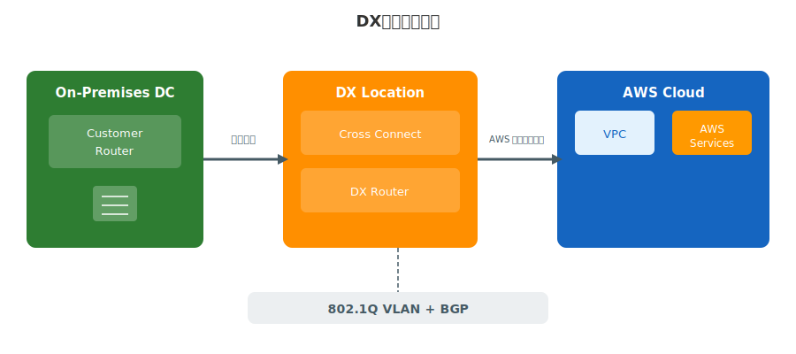

---

# DX ロケーションとパートナー

- - **日本のDXロケーション**: Equinix TY2 (東京)、NTT 堂島 (大阪) 等
- - **パートナー接続**: NTT、KDDI、IIJ、SoftBank 等が Hosted Connection を提供
- - 自社でクロスコネクトを用意する **Dedicated** と、パートナー経由の **Hosted** の2方式
- - DXロケーションには **AWS のルーター (DX Router)** が設置済み
- - 物理接続は **シングルモード光ファイバー**（1000BASE-LX / 10GBASE-LR / 100GBASE-LR4）

---

<!-- _class: lead -->
# 物理接続の基礎

- DX の物理レイヤーとコネクション管理

---

# 物理接続のコンポーネント

- - **カスタマールーター** — お客様拠点のBGP対応ルーター
- - **クロスコネクト** — DXロケーション内の物理ケーブル接続
- - **DX ルーター** — AWS側のルーター（DXロケーション内に設置）
- - **ポート** — AWS が割り当てる物理ポート（1G / 10G / 100G）
- - **LOA-CFA** — Letter of Authorization（クロスコネクト許可書）
- - 構成: お客様ルーター ↔ クロスコネクト ↔ DXルーター ↔ AWS バックボーン

---

# Dedicated Connection

- - AWS から **専用の物理ポート** が割り当てられる接続方式
- - 帯域: **1 Gbps / 10 Gbps / 100 Gbps**
- - お客様が DX ロケーションまでの回線とクロスコネクトを手配
- - **最大50個の VIF** を1つの Dedicated Connection 上に作成可能
- - AWS コンソールから接続リクエスト → **LOA-CFA 発行** → クロスコネクト工事
- - リードタイム: 通常 **2〜4週間**（ロケーションにより異なる）

---

# Hosted Connection

- - **AWS Direct Connect パートナー** 経由で提供される接続方式
- - 帯域: **50 Mbps 〜 10 Gbps**（パートナーにより異なる）
- - パートナーが物理接続を所有し、お客様に **論理的な接続を提供**
- - **1つの Hosted Connection に VIF は1つ** のみ（Dedicated との大きな違い）
- - お客様は DX ロケーションの機器・回線の管理が不要
- - リードタイム: パートナー次第だが、一般的に **Dedicated より短い**

---

# Dedicated vs Hosted 比較表

| 項目 | Dedicated | Hosted |
|------|-----------|--------|
| 帯域 | 1 / 10 / 100 Gbps | 50 Mbps〜10 Gbps |
| VIF 数 | 最大 50 | 1 |
| 物理管理 | お客様 | パートナー |
| クロスコネクト | お客様手配 | パートナー手配 |
| LAG 対応 | ○ | × |
| リードタイム | 2〜4 週間 | パートナー次第 |

---

# LAG (Link Aggregation Group)

- - 複数の Dedicated Connection を **1つの論理接続** として束ねる
- - **LACP (802.3ad)** ベースのリンクアグリゲーション
- - 同一帯域・同一DXロケーションの接続のみ束ね可能
- - 最大 **4本** の接続を1つの LAG に集約
- - LAG 内の1本が障害 → 残りの接続で **自動フェイルオーバー**
- - **最小リンク数** を設定可能（閾値を下回ると LAG 全体がダウン）

---

# 接続確立までのフロー

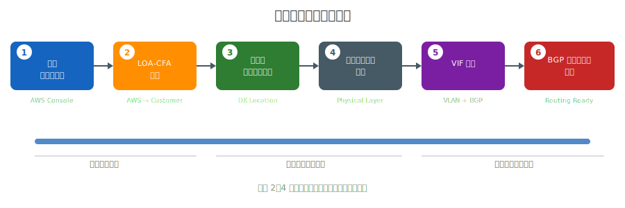

---

<!-- _class: lead -->
# Virtual Interface (VIF)

- 論理インターフェースの種類と設計

---

# VIF とは何か

- - DX 物理接続上に作成する **論理的なインターフェース**
- - **802.1Q VLAN タグ** で1本の物理接続を論理分割
- - 各 VIF ごとに **BGP セッション** を確立
- - VIF の種類によって **接続先（VGW / AWS Public / TGW）が異なる**
- - 1つの Dedicated Connection に **最大50 VIF** を多重化可能
- - Hosted Connection では **1 VIF のみ**

---

# VIF の3種類

- - **Private VIF** — VPC 内のリソースにプライベート IP でアクセス
-   - 接続先: Virtual Private Gateway (VGW) / DX Gateway
- - **Public VIF** — AWS パブリックサービスに直接アクセス
-   - 接続先: AWS パブリックエンドポイント（S3, DynamoDB 等）
- - **Transit VIF** — Transit Gateway 経由で複数 VPC に一括アクセス
-   - 接続先: DX Gateway → Transit Gateway

---

# VLAN タグと BGP セッション

- - **VLAN ID**: 1〜4094 の範囲で指定（物理接続内で一意）
- - **BGP ASN**: お客様側の AS 番号（パブリック or プライベート ASN）
-   - AWS 側: Private/Transit VIF = **64512**、Public VIF = **7224**
- - **BGP ピアリング IP**: /30 または /31 サブネットで指定
-   - AWS 割り当て or お客様指定（Public VIF はパブリック IP 必須）
- - **BGP MD5 認証**: オプションだが **強く推奨**
- - **BGP キープアライブ**: デフォルト 30秒、ホールドタイム 90秒

---

# VIF 作成時のパラメータ

| パラメータ | Private VIF | Public VIF | Transit VIF |
|-----------|-------------|------------|-------------|
| VLAN ID | 必須 | 必須 | 必須 |
| BGP ASN | 必須 | 必須 | 必須 |
| BGP ピアIP | 自動/手動 | パブリックIP必須 | 自動/手動 |
| 接続先 | VGW / DX GW | なし（自動） | DX GW → TGW |
| Jumbo Frame | 9001 MTU 可 | 1500 MTU 固定 | 8500 MTU 可 |
| アドレスファミリ | IPv4 / IPv6 | IPv4 / IPv6 | IPv4 / IPv6 |

---

# VIF と接続先の対応関係

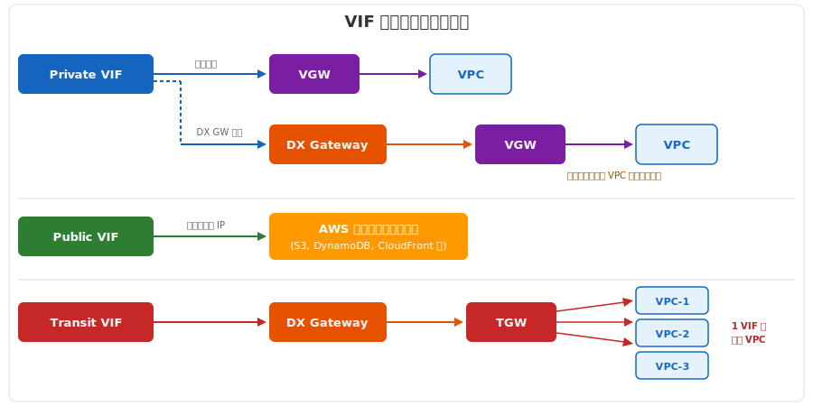

---

# VIF 種別 完全比較表

| 項目 | Private VIF | Public VIF | Transit VIF |
|------|------------|------------|-------------|
| 接続先 | VGW / DX GW | AWS Public | DX GW → TGW |
| アクセス対象 | VPC 内リソース | S3, DynamoDB 等 | 複数 VPC |
| BGP プレフィックス | VPC CIDR | AWS Public IP | TGW ルート |
| 最大プレフィックス数 | 100 (受信) | 1,000 (受信) | 100 (受信) |
| Jumbo Frame | 9001 MTU | 1500 MTU | 8500 MTU |
| DX Gateway | 任意 | 不要 | 必須 |

---

<!-- _class: lead -->
# Private VIF 詳細

- VGW・DX Gateway によるプライベート接続

---

# Private VIF の概要

- - VPC 内のリソース（EC2, RDS, ELB 等）に **プライベート IP** でアクセス
- - 接続先は **Virtual Private Gateway (VGW)** または **DX Gateway**
- - BGP で VPC の CIDR を受信し、オンプレのルートを広報
- - **Jumbo Frame 対応**: MTU 9001 でスループット向上
- - VPC CIDR 以外のルートは広報されない（VPC内通信に限定）
- - **VPC エンドポイント** 経由で S3 等にもアクセス可能

---

# Private VIF アーキテクチャ

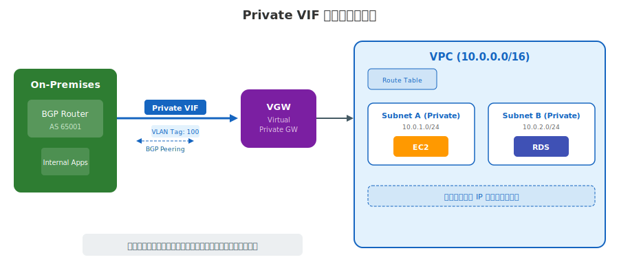

---

# Virtual Private Gateway (VGW)

- - **VPC にアタッチする仮想ルーター**（AWS マネージド）
- - Direct Connect の Private VIF と VPN の両方の終端点
- - **1つの VPC に 1つの VGW** のみアタッチ可能
- - VGW は **特定の AWS リージョンに属する** リソース
- - ASN はデフォルト 64512 だが、**カスタム ASN** を指定可能
- - VPC のルートテーブルに **ルート伝搬 (Route Propagation)** を有効化する必要あり

---

# VGW の制約事項

- - **1 VPC : 1 VGW** — VPC あたり VGW は1つのみ
- - **リージョン固定** — VGW は作成したリージョンでのみ利用可能
- - **VIF 数の制限** — 1つの VGW に接続できる Private VIF は最大 **30個**
- - **ECMP 非対応** — 複数 VIF からの同一プレフィックスは1つだけアクティブ
-   - （Transit VIF + TGW なら ECMP 対応可能）
- - **トランジットルーティング不可** — VGW 経由で VPC 間通信はできない

---

# Private VIF + VGW 構成パターン

- **単一 VPC 接続（最もシンプルな構成）**
- - DX → Private VIF → VGW → VPC
- - オンプレ〜VPC 間の直接的なL3接続
- 
- **設計ポイント:**
- - VPC CIDR が BGP で自動広報される（ルート伝搬有効化が必要）
- - オンプレ側のルートは **カスタマーBGP** で広報
- - AS PATH による経路制御が可能

---

# DX Gateway 経由のマルチリージョン接続

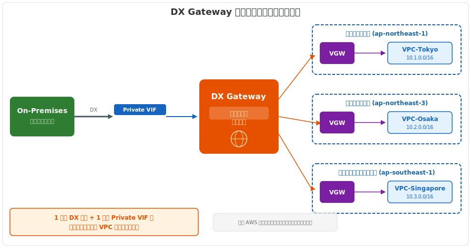

---

# Private VIF の BGP ルーティング

- - **AWS → オンプレ**: VPC CIDR が BGP で広報される
-   - DX Gateway 利用時は **Allowed Prefixes** でフィルタ可能
- - **オンプレ → AWS**: お客様のルートを BGP で広報
-   - Private VIF で **最大 100 プレフィックス** まで受信可能
-   - 超過すると BGP セッションが **ダウン**
- - **経路選択の優先順位** (同一プレフィックスの場合):
-   1. ロンゲストマッチ
-   2. AS PATH が短い方
-   3. DX > VPN（DX が常に優先）

---

# Jumbo Frame と MTU 設定

- - **Private VIF**: MTU **9001** まで対応（Jumbo Frame）
- - **Transit VIF**: MTU **8500** まで対応
- - **Public VIF**: MTU **1500** 固定（Jumbo Frame 非対応）
- - Jumbo Frame 有効化の条件:
-   - VGW またはTGW側でも Jumbo Frame 対応が必要
-   - VPC 内の EC2 インスタンスの MTU 設定も合わせる
-   - **パス上の全ホップで MTU が統一** されていること
- - 不一致時は **Path MTU Discovery (PMTUD)** で自動調整

---

<!-- _class: lead -->
# Public VIF 詳細

- AWS パブリックサービスへの専用線アクセス

---

# Public VIF の概要

- - **AWS のパブリックサービス** に DX 経由で直接アクセス
- - インターネットを経由せずに S3、DynamoDB 等に到達
- - **パブリック IP アドレス** が BGP ピアリングに必要
-   - お客様所有のパブリック IP or AWS 割り当ての /31
- - VPC を経由しない — **VGW / TGW は不要**
- - 全リージョンの AWS パブリックサービスにアクセス可能

---

# Public VIF アーキテクチャ

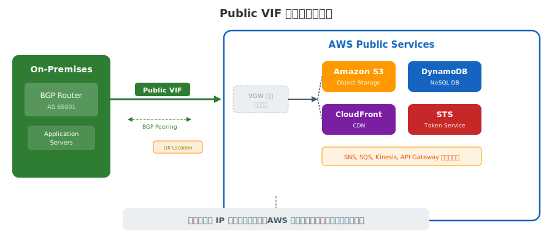

---

# アクセス可能なサービス一覧

- - **ストレージ**: Amazon S3、S3 Glacier、EFS（VPCエンドポイント不要）
- - **データベース**: DynamoDB（Gateway エンドポイント代替）
- - **セキュリティ**: AWS STS、CloudHSM、Certificate Manager
- - **ネットワーク**: CloudFront、Route 53、Global Accelerator
- - **管理**: CloudWatch、CloudFormation、Systems Manager
- - **注意**: EC2、RDS 等の VPC 内リソースには **Private VIF が必要**

---

# Public VIF の BGP ルーティング

- - **AWS → オンプレ**: Amazon が所有する **パブリック IP プレフィックス** を広報
-   - 全リージョンのプレフィックスが広報される（数千プレフィックス）
-   - BGP コミュニティでリージョン単位のフィルタリング可能
- - **オンプレ → AWS**: お客様の **パブリック IP プレフィックス** を広報
-   - RIR に登録された IP アドレスが必要
-   - AWS が **ROA (Route Origin Authorization)** で検証
- - **受信プレフィックス上限**: 1,000（Private VIF の10倍）

---

# Public VIF のユースケース

- - **S3 大容量転送**: TB〜PB 級のデータ移行を安定した帯域で実行
-   - VPC エンドポイントと異なり、VPC を経由しない直接アクセス
- - **AWS API アクセス**: マネジメントコンソール、CLI、SDK の通信を専用線化
- - **CloudFront オリジン取得**: DX 経由でオリジンサーバーに低レイテンシ接続
- - **Public VIF vs VPC Gateway Endpoint**:
-   - S3 へのアクセスは **Gateway Endpoint（無料）** で十分なケースが多い
-   - Public VIF は VPC 外から直接 S3 にアクセスしたい場合に有効

---

<!-- _class: lead -->
# Transit VIF 詳細

- TGW 連携によるマルチVPCアクセス

---

# Transit VIF の概要

- - **Transit Gateway (TGW)** 経由で **複数の VPC に一括接続**
- - DX Gateway との組み合わせが **必須**（直接TGWには接続不可）
- - 構成: DX → Transit VIF → **DX Gateway** → **TGW** → 複数VPC
- - Private VIF では VPC ごとに VIF が必要 → Transit VIF は **1本で複数VPC**
- - **ECMP (Equal-Cost Multi-Path)** による負荷分散をサポート
- - MTU: 最大 **8500**（Private VIF の 9001 より若干小さい）

---

# Transit Gateway (TGW) の基礎

- - **リージョナルなネットワークハブ** — VPC、VPN、DX を集約
- - **ハブ＆スポーク** トポロジで VPC 間通信を実現
- - **ルートテーブル** による柔軟な経路制御（セグメンテーション可能）
- - **TGW アタッチメント** で接続先を管理:
-   - VPC アタッチメント / VPN アタッチメント / DX Gateway アタッチメント
- - **TGW ピアリング** でリージョン間接続も可能
- - **帯域**: アタッチメントあたり最大 **50 Gbps**

---

# Transit VIF アーキテクチャ

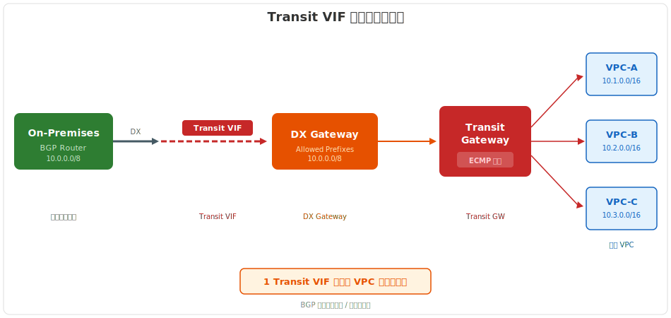

---

# DX Gateway + TGW 連携構成

- - **DX Gateway**: グローバルリソース（リージョンに依存しない）
- - **Transit VIF → DX Gateway**: VIF を DX GW にアソシエーション
- - **DX Gateway → TGW**: DX GW を TGW にアソシエーション
- - **1つの DX Gateway に TGW は最大 3個** まで関連付け可能
- - **Allowed Prefixes** で TGW から広報するプレフィックスを制限
- - DX GW と TGW は **異なる AWS アカウント** でも関連付け可能

---

# TGW 経由マルチVPC接続

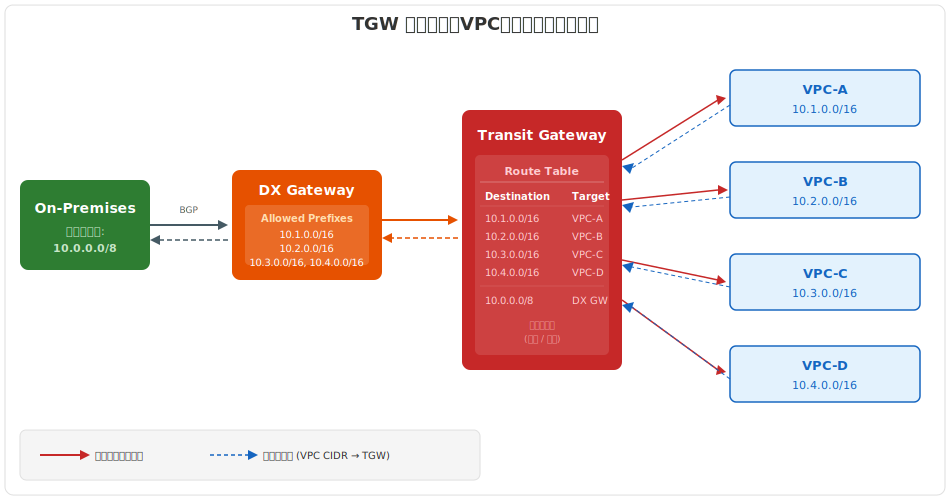

---

# Transit VIF の制約と注意点

- - **DX Gateway 必須** — Transit VIF は DX GW 経由でのみ TGW に接続
- - **1 DX GW : 最大 3 TGW** — TGW アソシエーション数に上限あり
- - **受信プレフィックス上限**: 100（Private VIF と同じ）
- - **MTU 8500** — Private VIF の 9001 より小さい点に注意
- - **Hosted Connection**: Transit VIF は **1 Gbps 以上** の接続が必要
- - **同一 DX GW に Private VIF と Transit VIF は共存不可**

---

# TGW ピアリングとの組合せ

- - **TGW ピアリング**: 異なるリージョンの TGW 同士を接続
- - DX + TGW + ピアリングで **マルチリージョン・フルメッシュ** 接続が可能
- - 構成例: オンプレ → DX → TGW(東京) ↔ TGW(大阪) → VPC(大阪)
- - **注意点**:
-   - ピアリング経由のトラフィックはリージョン間転送料金が発生
-   - ピアリングの帯域は **50 Gbps** が上限
-   - ルートは **静的設定** が必要（BGP自動伝搬なし）

---

<!-- _class: lead -->
# VIF 選定ガイド

- Private VIF vs Transit VIF の判断基準

---

# Private VIF vs Transit VIF 詳細比較

| 項目 | Private VIF | Transit VIF |
|------|-----------|-------------|
| 接続先 | VGW (直接) / DX GW | DX GW → TGW |
| VPC 接続数 | VIF 1本 = 1 VPC | VIF 1本 = 複数VPC |
| ECMP | × | ○ |
| MTU | 9001 | 8500 |
| VPC 間通信 | × (VGW はトランジット不可) | ○ (TGW 経由) |
| コスト | DX ポート料 + 転送料 | + TGW アタッチ/処理料 |

---

# VIF 選定フローチャート

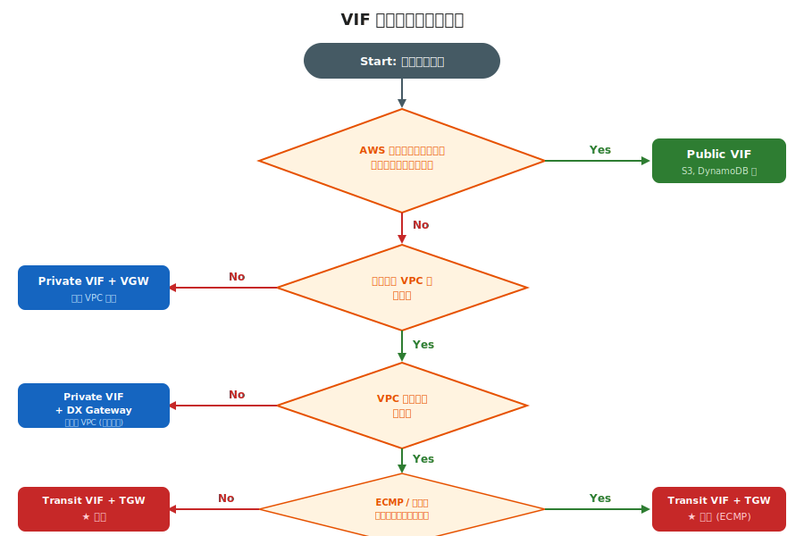

---

# 構成パターン別コスト比較

- **Private VIF 構成 (VPC 10個の場合)**
- - DX ポート (10G): $2,270/月
- - Private VIF × 10: 追加料金なし
- - DX Gateway: 無料
- 
- **Transit VIF 構成 (VPC 10個の場合)**
- - DX ポート (10G): $2,270/月
- - Transit VIF × 1: 追加料金なし
- - TGW アタッチメント × 11: $0.07/時間 × 11 ≈ $560/月
- - TGW データ処理: $0.02/GB

---

<!-- _class: lead -->
# DX Gateway 詳細

- グローバルハブとしての役割と設計

---

# DX Gateway の役割

- - **グローバルリソース** — 特定リージョンに属さない
- - Private VIF / Transit VIF と VGW / TGW の **仲介役**
- - DX Gateway 自体に **追加料金は発生しない**
- - **1つの DX に複数リージョンの VPC を接続** するための中継点
- - DX GW なしの場合: DX と VGW は同一リージョン内のみ接続可能
- - DX GW ありの場合: **任意のリージョン** の VGW/TGW に接続可能

---

# DX Gateway アーキテクチャ

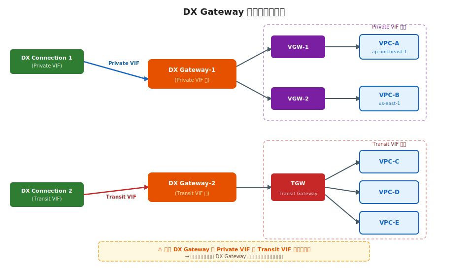

---

# 許可プレフィックスとルーティング

- - **Allowed Prefixes (許可プレフィックス)**: DX GW で広報するルートを制限
- - VGW 関連付け時: AWS → オンプレ方向のプレフィックスをフィルタ
-   - デフォルト: VPC CIDR がそのまま広報
-   - カスタム: サマリルートや特定サブネットのみ広報
- - TGW 関連付け時: 双方向でプレフィックスを制御
-   - TGW → オンプレ: TGW ルートテーブルのルートを広報
-   - オンプレ → TGW: Allowed Prefixes で受け入れを制限

---

# クロスアカウント共有

- - DX Gateway は **別の AWS アカウント** の VGW/TGW と関連付け可能
- - **AWS Organizations 不要** — アカウント ID だけで共有可能
- - ユースケース: 共有サービスアカウントで DX を管理し、各事業部の VPC に接続
- - **共有の流れ:**
-   1. DX GW 所有者が関連付け提案を作成
-   2. VGW/TGW 所有者が提案を **承認**
-   3. BGP セッション確立・ルーティング開始
- - 関連付けの **上限**: 1 DX GW あたり VGW **30個** / TGW **3個**

---

# DX Gateway 構成パターン比較

| 構成パターン | VGW 直接 | DX GW + VGW | DX GW + TGW |
|-------------|---------|-------------|-------------|
| リージョン制約 | 同一リージョン | マルチリージョン | マルチリージョン |
| VPC 接続数 | 1 VPC/VIF | 複数 VPC (VGW 30個) | 複数 VPC (TGW 配下) |
| VPC 間通信 | × | × | ○ |
| ECMP | × | × | ○ |
| クロスアカウント | × | ○ | ○ |
| 推奨規模 | 小規模 PoC | 中規模マルチVPC | 大規模エンタープライズ |

---

<!-- _class: lead -->
# 冗長化・高可用性設計

- AWS 推奨モデルと VPN フェイルオーバー

---

# AWS 推奨の冗長化モデル

- - AWS は **4段階の回復性モデル** を定義
- - ビジネス要件（RTO/RPO・コスト）に応じて選択
- 
| レベル | 構成 | SLA |
|-------|------|-----|
| Maximum Resiliency | 2ロケーション × 2接続 | 99.99% |
| High Resiliency | 2ロケーション × 1接続 | 99.9% |
| Development | 1ロケーション × 2接続 | — |
| 非冗長 | 1ロケーション × 1接続 | — |

---

# Maximum Resiliency（最大回復性）

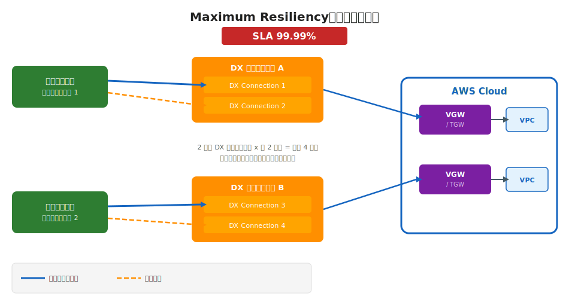

<!--
2つのDXロケーションにそれぞれ2本の接続。ロケーション障害にも耐えられる最高レベルの冗長構成。SLA 99.99%。
-->

---

# High Resiliency（高回復性）

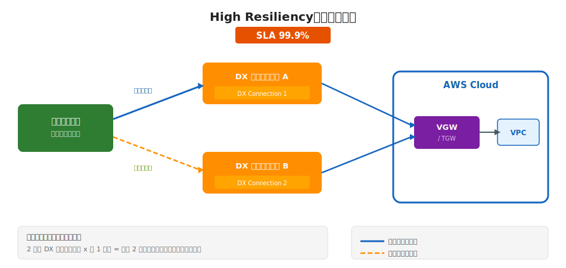

<!--
2つのDXロケーションにそれぞれ1本の接続。ロケーション障害に耐えられるが、接続障害には弱い。SLA 99.9%。
-->

---

# 開発・テスト環境の冗長化

- - **単一 DX ロケーション** に2本の接続（コスト優先）
- - SLA の保証なし — ロケーション障害時は全断
- - **VPN バックアップ** との併用を推奨:
-   - DX 障害時に VPN で最低限の接続を維持
-   - VPN の帯域は DX より小さいため、重要トラフィックのみ
- - LAG を使って2本を束ねることも可能
- - 本番環境では **非推奨** — 最低でも High Resiliency を検討

---

# VPN フェイルオーバー構成

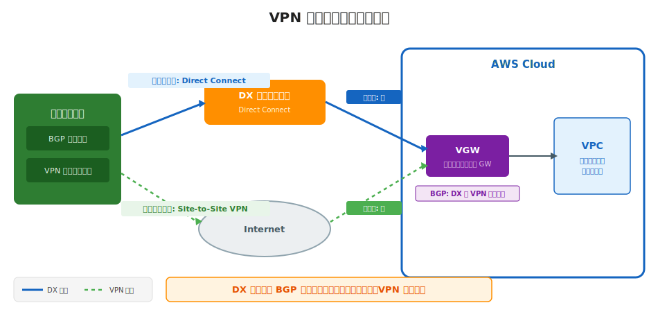

<!--
DXをプライマリ、VPNをバックアップとして構成。BGPのAS PATH prepending等で優先度を制御。DX障害時に自動的にVPNへフェイルオーバー。
-->

---

# BFD と SiteLink

- **BFD (Bidirectional Forwarding Detection)**
- - BGP のデフォルト障害検知 (90秒) を **300ms 以下** に短縮
- - DX 接続で **強く推奨** — 高速フェイルオーバーに必須
- - カスタマールーター側で有効化が必要
- 
- **SiteLink**
- - DX ロケーション間を **AWS バックボーン経由** で直接通信
- - オンプレ拠点間通信を AWS ネットワーク上で実現
- - DX ロケーション間のフェイルオーバーパスとしても利用可能

---

# 移行戦略: VPN → DX

- **段階的移行の推奨手順:**
- 1. **準備**: DX 接続の申請・物理回線の手配（2〜4週間）
- 2. **並行運用**: VPN を維持しつつ DX を追加接続
- 3. **ルーティング切替**: BGP で DX を優先（AS PATH / MED 調整）
- 4. **検証**: トラフィックが DX 経由であることを CloudWatch で確認
- 5. **VPN バックアップ化**: VPN を待機系として残す or 撤去
- - **ポイント**: DX と VPN の同一プレフィックスでは **DX が自動優先**

---

# 設計時のベストプラクティス

- - **冗長化**: 本番は最低 High Resiliency（2ロケーション）を確保
- - **BFD 有効化**: 全 DX 接続で BFD を有効にし高速障害検知
- - **BGP MD5 認証**: 全 VIF で MD5 認証を設定
- - **プレフィックス管理**: 広報するルートは最小限に（100プレフィックス上限に注意）
- - **モニタリング**: CloudWatch で接続状態・BGP状態・トラフィックを監視
- - **MACsec 暗号化**: 10G/100G Dedicated で利用可能（L2暗号化）

---

# 全体アーキテクチャ サマリ

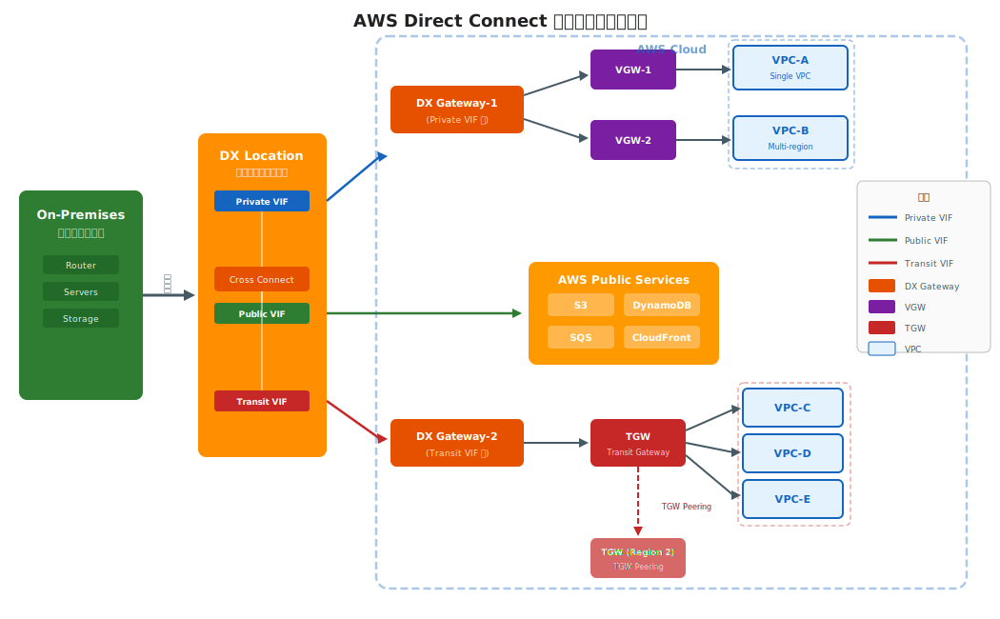

---

# 参考リンク

- - **公式ドキュメント:**
-   - [AWS Direct Connect ユーザーガイド](https://docs.aws.amazon.com/directconnect/latest/UserGuide/)
-   - [Direct Connect FAQ](https://aws.amazon.com/directconnect/faqs/)
- - **設計ガイド:**
-   - [AWS Direct Connect Resiliency Recommendations](https://aws.amazon.com/directconnect/resiliency-recommendation/)
-   - [Networking & Content Delivery Blog](https://aws.amazon.com/blogs/networking-and-content-delivery/)
- - **料金:**
-   - [Direct Connect の料金](https://aws.amazon.com/directconnect/pricing/)

