<!-- _class: lead -->
# AWS Certified Generative AI Developer - Professional

- <svg viewBox="0 0 800 400" style="max-height:70vh;max-width:100%;display:block;margin:0 auto;" xmlns="http://www.w3.org/2000/svg"><rect x="0" y="0" width="800" height="400" fill="#1a1a2e" rx="0"/><rect x="100" y="130" width="600" height="140" fill="#0d1b3e" rx="12"/><rect x="100" y="130" width="600" height="8" fill="#e91e63" rx="4"/><text x="400" y="190" font-family="sans-serif" font-size="22" fill="#f9a825" text-anchor="middle" font-weight="bold">AWS Certified Generative AI Developer</text><text x="400" y="225" font-family="sans-serif" font-size="20" fill="#f9a825" text-anchor="middle" font-weight="bold">Professional 試験対策</text><text x="400" y="260" font-family="sans-serif" font-size="14" fill="#b0b8d0" text-anchor="middle" font-weight="normal">Domain 1〜5 完全カバー</text></svg>
- 試験対策 基礎資料
- エンジニアチーム向け内部研修 | 2026年2月
- 対象: 全評価領域（Domain 1〜5）を均等にカバー

---

# 本日のアジェンダ（1/2）（1/2）

- <svg viewBox="0 0 800 400" style="max-height:70vh;max-width:100%;display:block;margin:0 auto;" xmlns="http://www.w3.org/2000/svg">
<rect x="0" y="0" width="800" height="400" fill="#1a1a2e" rx="0"/>
<text x="400" y="40" font-family="sans-serif" font-size="22" fill="#f9a825" text-anchor="middle" font-weight="bold">評価領域 — Domain Overview</text>

<rect x="45" y="80" width="110" height="240" fill="#16213e" rx="8"/>
<rect x="55" y="230" width="90" height="140" fill="#e91e63" rx="4"/>
<text x="100" y="220" font-family="sans-serif" font-size="18" fill="#f9a825" text-anchor="middle" font-weight="bold">20%</text>
<text x="100" y="345" font-family="sans-serif" font-size="12" fill="#b0b8d0" text-anchor="middle" font-weight="normal">AI/ML基礎</text>
<text x="100" y="360" font-family="sans-serif" font-size="11" fill="#b0b8d0" text-anchor="middle" font-weight="normal">Domain 1</text>

<rect x="165" y="80" width="110" height="240" fill="#16213e" rx="8"/>
<rect x="175" y="202" width="90" height="168" fill="#e91e63" rx="4"/>
<text x="220" y="192" font-family="sans-serif" font-size="18" fill="#f9a825" text-anchor="middle" font-weight="bold">24%</text>
<text x="220" y="345" font-family="sans-serif" font-size="12" fill="#b0b8d0" text-anchor="middle" font-weight="normal">生成AI基礎</text>
<text x="220" y="360" font-family="sans-serif" font-size="11" fill="#b0b8d0" text-anchor="middle" font-weight="normal">Domain 2</text>

<rect x="285" y="80" width="110" height="240" fill="#16213e" rx="8"/>
<rect x="295" y="174" width="90" height="196" fill="#e91e63" rx="4"/>
<text x="340" y="164" font-family="sans-serif" font-size="18" fill="#f9a825" text-anchor="middle" font-weight="bold">28%</text>
<text x="340" y="345" font-family="sans-serif" font-size="12" fill="#b0b8d0" text-anchor="middle" font-weight="normal">FM活用</text>
<text x="340" y="360" font-family="sans-serif" font-size="11" fill="#b0b8d0" text-anchor="middle" font-weight="normal">Domain 3</text>

<rect x="405" y="80" width="110" height="240" fill="#16213e" rx="8"/>
<rect x="415" y="272" width="90" height="98" fill="#e91e63" rx="4"/>
<text x="460" y="262" font-family="sans-serif" font-size="18" fill="#f9a825" text-anchor="middle" font-weight="bold">14%</text>
<text x="460" y="345" font-family="sans-serif" font-size="12" fill="#b0b8d0" text-anchor="middle" font-weight="normal">責任あるAI</text>
<text x="460" y="360" font-family="sans-serif" font-size="11" fill="#b0b8d0" text-anchor="middle" font-weight="normal">Domain 4</text>

<rect x="525" y="80" width="110" height="240" fill="#16213e" rx="8"/>
<rect x="535" y="272" width="90" height="98" fill="#e91e63" rx="4"/>
<text x="580" y="262" font-family="sans-serif" font-size="18" fill="#f9a825" text-anchor="middle" font-weight="bold">14%</text>
<text x="580" y="345" font-family="sans-serif" font-size="12" fill="#b0b8d0" text-anchor="middle" font-weight="normal">セキュリティ</text>
<text x="580" y="360" font-family="sans-serif" font-size="11" fill="#b0b8d0" text-anchor="middle" font-weight="normal">Domain 5</text>

</svg>
- **試験概要** — 形式・評価領域・合格スコア・準備方法
- **Domain 1（20%）** — AI/ML の基礎: 機械学習種類・ML ワークフロー・AWS AI サービス
- **Domain 2（24%）** — 生成 AI の基礎: FM の仕組み・プロンプトエンジニアリング・ハルシネーション

---

# 本日のアジェンダ（1/2）（2/2）

> *Domain 3が最重要28%、Bedrock全機能+責任あるAI+セキュリティが試験の核心*

- **Domain 3（28%）** — Foundation Models の活用: Bedrock・RAG・Agents・カスタマイズ
- **Domain 4（14%）** — 責任ある AI: 原則・バイアス・SageMaker Clarify
- **Domain 5（14%）** — セキュリティ: Guardrails・IAM・データガバナンス
- **試験対策** — よく出るパターン・学習リソース・まとめ

---

# 試験の位置づけ

> *AWS Certified Generative AI Developer Professional、3年有効で有効期間3年*

- <svg viewBox="0 0 800 400" style="max-height:70vh;max-width:100%;display:block;margin:0 auto;" xmlns="http://www.w3.org/2000/svg">
<rect x="0" y="0" width="800" height="400" fill="#1a1a2e" rx="0"/>
<text x="400" y="35" font-family="sans-serif" font-size="22" fill="#f9a825" text-anchor="middle" font-weight="bold">AWS 認定資格ロードマップ</text>
<rect x="30" y="120" width="180" height="80" fill="#16213e" rx="8"/>
<text x="120" y="152" font-family="sans-serif" font-size="14" fill="#ffffff" text-anchor="middle" font-weight="bold">AI Practitioner</text>
<text x="120" y="172" font-family="sans-serif" font-size="12" fill="#b0b8d0" text-anchor="middle" font-weight="normal">基礎レベル</text>
<rect x="310" y="120" width="180" height="80" fill="#1e3a5f" rx="8"/>
<text x="400" y="152" font-family="sans-serif" font-size="14" fill="#f9a825" text-anchor="middle" font-weight="bold">GenAI Developer</text>
<text x="400" y="172" font-family="sans-serif" font-size="12" fill="#f9a825" text-anchor="middle" font-weight="normal">Professional ★本試験</text>
<rect x="590" y="120" width="180" height="80" fill="#16213e" rx="8"/>
<text x="680" y="152" font-family="sans-serif" font-size="14" fill="#ffffff" text-anchor="middle" font-weight="bold">ML Specialty</text>
<text x="680" y="172" font-family="sans-serif" font-size="12" fill="#b0b8d0" text-anchor="middle" font-weight="normal">専門深化</text>
<line x1="210" y1="160" x2="300" y2="160" stroke="#f9a825" stroke-width="2"/><polygon points="310,160 300,165 300,155" fill="#f9a825"/>
<line x1="490" y1="160" x2="580" y2="160" stroke="#f9a825" stroke-width="2"/><polygon points="590,160 580,165 580,155" fill="#f9a825"/>
<text x="400" y="250" font-family="sans-serif" font-size="15" fill="#b0b8d0" text-anchor="middle" font-weight="normal">推奨経験: AWS実務1年以上 + 生成AI/ML基礎知識</text>
<text x="400" y="280" font-family="sans-serif" font-size="15" fill="#b0b8d0" text-anchor="middle" font-weight="normal">有効期間: 3年間 | 合格スコア: 750/1000</text>
<text x="400" y="310" font-family="sans-serif" font-size="15" fill="#b0b8d0" text-anchor="middle" font-weight="normal">受験料: USD 300 | 問題数: 85問（採点対象65問）</text>
</svg>
- **認定名**: AWS Certified Generative AI Developer - Professional
- **対象者**: AWS 上で生成 AI / ML ソリューションを設計・実装・最適化するエンジニア
- **推奨経験**: AWS 実務経験 1 年以上 + 生成 AI / ML の基礎知識
- **目的**: Amazon Bedrock・SageMaker を中心とした AWS 生成 AI スキルの証明
- **関連資格**: AWS Certified AI Practitioner（基礎）→ 本試験（実践応用）→ ML Specialty（専門深化）
- **有効期間**: 3 年間（再認定が必要）

---

# 本資料の使い方

> *合格スコア750/1000、65問の単一/複数選択、試験ガイドとサンプル問題も必ず参照*

- <svg viewBox="0 0 800 400" style="max-height:70vh;max-width:100%;display:block;margin:0 auto;" xmlns="http://www.w3.org/2000/svg">
<rect x="0" y="0" width="800" height="400" fill="#1a1a2e" rx="0"/>
<text x="400" y="35" font-family="sans-serif" font-size="22" fill="#f9a825" text-anchor="middle" font-weight="bold">学習フロー</text>

<rect x="-40" y="70" width="110" height="90" fill="#16213e" rx="8"/>
<circle cx="15" cy="95" r="20" fill="#e91e63"/>
<text x="15" y="101" font-family="sans-serif" font-size="18" fill="#ffffff" text-anchor="middle" font-weight="bold">1</text>
<text x="16" y="132" font-family="sans-serif" font-size="11" fill="#ffffff" text-anchor="middle" font-weight="bold">セクション別に読む</text>
<text x="16" y="148" font-family="sans-serif" font-size="10" fill="#b0b8d0" text-anchor="middle" font-weight="normal">各ドメインから順番に</text>

<rect x="80" y="70" width="110" height="90" fill="#16213e" rx="8"/>
<circle cx="135" cy="95" r="20" fill="#e91e63"/>
<text x="135" y="101" font-family="sans-serif" font-size="18" fill="#ffffff" text-anchor="middle" font-weight="bold">2</text>
<text x="136" y="132" font-family="sans-serif" font-size="11" fill="#ffffff" text-anchor="middle" font-weight="bold">チェックリスト確認</text>
<text x="136" y="148" font-family="sans-serif" font-size="10" fill="#b0b8d0" text-anchor="middle" font-weight="normal">各末尾で理解度確認</text>

<rect x="200" y="70" width="110" height="90" fill="#16213e" rx="8"/>
<circle cx="255" cy="95" r="20" fill="#e91e63"/>
<text x="255" y="101" font-family="sans-serif" font-size="18" fill="#ffffff" text-anchor="middle" font-weight="bold">3</text>
<text x="256" y="132" font-family="sans-serif" font-size="11" fill="#ffffff" text-anchor="middle" font-weight="bold">Bedrockを実操作</text>
<text x="256" y="148" font-family="sans-serif" font-size="10" fill="#b0b8d0" text-anchor="middle" font-weight="normal">コンソール/APIで体験</text>

<rect x="320" y="70" width="110" height="90" fill="#16213e" rx="8"/>
<circle cx="375" cy="95" r="20" fill="#e91e63"/>
<text x="375" y="101" font-family="sans-serif" font-size="18" fill="#ffffff" text-anchor="middle" font-weight="bold">4</text>
<text x="376" y="132" font-family="sans-serif" font-size="11" fill="#ffffff" text-anchor="middle" font-weight="bold">模擬試験で確認</text>
<text x="376" y="148" font-family="sans-serif" font-size="10" fill="#b0b8d0" text-anchor="middle" font-weight="normal">AWS公式模擬問題集</text>

<rect x="440" y="70" width="110" height="90" fill="#16213e" rx="8"/>
<circle cx="495" cy="95" r="20" fill="#e91e63"/>
<text x="495" y="101" font-family="sans-serif" font-size="18" fill="#ffffff" text-anchor="middle" font-weight="bold">5</text>
<text x="496" y="132" font-family="sans-serif" font-size="11" fill="#ffffff" text-anchor="middle" font-weight="bold">弱点ドメイン復習</text>
<text x="496" y="148" font-family="sans-serif" font-size="10" fill="#b0b8d0" text-anchor="middle" font-weight="normal">繰り返しで定着</text>

<line x1="140" y1="115" x2="170" y2="115" stroke="#f9a825" stroke-width="2"/><polygon points="180,115 170,120 170,110" fill="#f9a825"/><line x1="260" y1="115" x2="290" y2="115" stroke="#f9a825" stroke-width="2"/><polygon points="300,115 290,120 290,110" fill="#f9a825"/><line x1="380" y1="115" x2="410" y2="115" stroke="#f9a825" stroke-width="2"/><polygon points="420,115 410,120 410,110" fill="#f9a825"/><line x1="500" y1="115" x2="530" y2="115" stroke="#f9a825" stroke-width="2"/><polygon points="540,115 530,120 530,110" fill="#f9a825"/>
<text x="400" y="220" font-family="sans-serif" font-size="16" fill="#b0b8d0" text-anchor="middle" font-weight="normal">合格スコア: 750/1000 スケールスコア（65問中）</text>
<text x="400" y="250" font-family="sans-serif" font-size="15" fill="#b0b8d0" text-anchor="middle" font-weight="normal">問題形式: 単一選択 + 複数選択（記述問題なし）</text>
</svg>
- **学習フロー**: 各ドメインのセクションスライドから順番に読み進める
- **チェックリスト活用**: 各ドメイン末尾の「重要ポイント」で理解度を確認
- **図解の活用**: SVG 図解は試験に頻出のアーキテクチャを視覚的に整理
- **合格スコア**: 750/1000（65問中の正答率に基づくスケールスコア）
- **問題形式**: 単一選択（最も適切な 1 つを選ぶ）& 複数選択（正しいものをすべて選ぶ）
- **ヒント**: AWS 公式の「試験ガイド」と「サンプル問題」も必ず参照すること

---

<!-- _class: lead -->
# 試験概要

- <svg viewBox="0 0 800 400" style="max-height:70vh;max-width:100%;display:block;margin:0 auto;" xmlns="http://www.w3.org/2000/svg"><rect x="0" y="0" width="800" height="400" fill="#1a1a2e" rx="0"/><text x="400" y="35" font-family="sans-serif" font-size="24" fill="#f9a825" text-anchor="middle" font-weight="bold">試験概要</text><rect x="150" y="90" width="500" height="220" fill="#16213e" rx="8"/><text x="400" y="135" font-family="sans-serif" font-size="16" fill="#b0b8d0" text-anchor="middle" font-weight="normal">形式・評価領域・合格スコア</text><text x="400" y="175" font-family="sans-serif" font-size="22" fill="#f9a825" text-anchor="middle" font-weight="bold">85問 / 170分 / USD300</text><text x="400" y="220" font-family="sans-serif" font-size="16" fill="#b0b8d0" text-anchor="middle" font-weight="normal">合格スコア: 750/1000</text><text x="400" y="255" font-family="sans-serif" font-size="14" fill="#ffffff" text-anchor="middle" font-weight="normal">評価領域: Domain 1〜5</text></svg>
- 形式・評価領域・合格スコア・学習計画を把握する

---

# 試験形式・詳細（1/2）

- <svg viewBox="0 0 800 400" style="max-height:70vh;max-width:100%;display:block;margin:0 auto;" xmlns="http://www.w3.org/2000/svg">
<rect x="0" y="0" width="800" height="400" fill="#1a1a2e" rx="0"/>
<text x="400" y="35" font-family="sans-serif" font-size="22" fill="#f9a825" text-anchor="middle" font-weight="bold">試験形式 詳細</text>

<rect x="20" y="80" width="240" height="110" fill="#16213e" rx="8"/>
<text x="140" y="118" font-family="sans-serif" font-size="13" fill="#b0b8d0" text-anchor="middle" font-weight="normal">問題数</text>
<text x="140" y="148" font-family="sans-serif" font-size="22" fill="#f9a825" text-anchor="middle" font-weight="bold">85問</text>
<text x="140" y="170" font-family="sans-serif" font-size="11" fill="#b0b8d0" text-anchor="middle" font-weight="normal">採点65問 + ノンスコア20問</text>

<rect x="280" y="80" width="240" height="110" fill="#16213e" rx="8"/>
<text x="400" y="118" font-family="sans-serif" font-size="13" fill="#b0b8d0" text-anchor="middle" font-weight="normal">試験時間</text>
<text x="400" y="148" font-family="sans-serif" font-size="22" fill="#f9a825" text-anchor="middle" font-weight="bold">170分</text>
<text x="400" y="170" font-family="sans-serif" font-size="11" fill="#b0b8d0" text-anchor="middle" font-weight="normal">約2分/問のペース</text>

<rect x="540" y="80" width="240" height="110" fill="#16213e" rx="8"/>
<text x="660" y="118" font-family="sans-serif" font-size="13" fill="#b0b8d0" text-anchor="middle" font-weight="normal">合格スコア</text>
<text x="660" y="148" font-family="sans-serif" font-size="22" fill="#f9a825" text-anchor="middle" font-weight="bold">750/1000</text>
<text x="660" y="170" font-family="sans-serif" font-size="11" fill="#b0b8d0" text-anchor="middle" font-weight="normal">スケールスコア</text>

<rect x="20" y="210" width="240" height="110" fill="#16213e" rx="8"/>
<text x="140" y="248" font-family="sans-serif" font-size="13" fill="#b0b8d0" text-anchor="middle" font-weight="normal">受験料</text>
<text x="140" y="278" font-family="sans-serif" font-size="22" fill="#f9a825" text-anchor="middle" font-weight="bold">USD 300</text>
<text x="140" y="300" font-family="sans-serif" font-size="11" fill="#b0b8d0" text-anchor="middle" font-weight="normal">Professional レベル</text>

<rect x="280" y="210" width="240" height="110" fill="#16213e" rx="8"/>
<text x="400" y="248" font-family="sans-serif" font-size="13" fill="#b0b8d0" text-anchor="middle" font-weight="normal">言語</text>
<text x="400" y="278" font-family="sans-serif" font-size="22" fill="#f9a825" text-anchor="middle" font-weight="bold">英語</text>
<text x="400" y="300" font-family="sans-serif" font-size="11" fill="#b0b8d0" text-anchor="middle" font-weight="normal">日本語UI選択可</text>

<rect x="540" y="210" width="240" height="110" fill="#16213e" rx="8"/>
<text x="660" y="248" font-family="sans-serif" font-size="13" fill="#b0b8d0" text-anchor="middle" font-weight="normal">受験方法</text>
<text x="660" y="278" font-family="sans-serif" font-size="22" fill="#f9a825" text-anchor="middle" font-weight="bold">PearsonVUE / 自宅</text>
<text x="660" y="300" font-family="sans-serif" font-size="11" fill="#b0b8d0" text-anchor="middle" font-weight="normal">テストセンター or オンライン</text>

</svg>
- **問題数**: 85 問（採点対象 65 問 + ノンスコアリング 20 問）
- **試験時間**: 170 分（約 2 分/問のペース配分）
- **出題形式**: 単一回答・複数回答の選択式（記述問題なし）

---

# 試験形式・詳細（2/2）

> *受験料USD 300、合格スコア750/1000、ピアソンVUEまたはオンライン監督試験*

- **受験料**: USD 300（Professional レベル）
- **言語**: 英語（日本語試験 UI は選択可能）
- **合格スコア**: 750/1000 スケールスコア
- **受験方法**: ピアソン VUE テストセンター または オンライン監督試験（自宅受験）

---

# 評価領域と出題比率

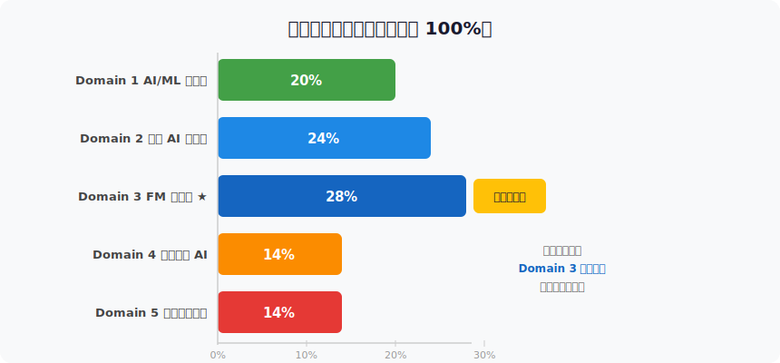

---

# 試験準備の目安

> *AWS経験1年以上なら4〜6週間、Bedrock Knowledge Bases/Agents/Guardrailsの実装経験が必須*

- <svg viewBox="0 0 800 400" style="max-height:70vh;max-width:100%;display:block;margin:0 auto;" xmlns="http://www.w3.org/2000/svg">
<rect x="0" y="0" width="800" height="380" fill="#1a1a2e" rx="0"/>
<text x="400" y="35" font-family="sans-serif" font-size="22" fill="#f9a825" text-anchor="middle" font-weight="bold">学習スケジュール目安</text>

<rect x="20" y="70" width="175" height="160" fill="#16213e" rx="8"/>
<rect x="20" y="70" width="175" height="8" fill="#e91e63" rx="4"/>
<text x="107" y="110" font-family="sans-serif" font-size="14" fill="#e91e63" text-anchor="middle" font-weight="bold">Week 1-2</text>
<text x="107" y="135" font-family="sans-serif" font-size="12" fill="#ffffff" text-anchor="middle" font-weight="bold">AWS AI/ML全体像</text>
<text x="107" y="155" font-family="sans-serif" font-size="11" fill="#b0b8d0" text-anchor="middle" font-weight="normal">Bedrockコンソール基礎操作</text>

<rect x="210" y="70" width="175" height="160" fill="#16213e" rx="8"/>
<rect x="210" y="70" width="175" height="8" fill="#0d7377" rx="4"/>
<text x="297" y="110" font-family="sans-serif" font-size="14" fill="#0d7377" text-anchor="middle" font-weight="bold">Week 3-4</text>
<text x="297" y="135" font-family="sans-serif" font-size="12" fill="#ffffff" text-anchor="middle" font-weight="bold">RAG・Agents・Guardrails</text>
<text x="297" y="155" font-family="sans-serif" font-size="11" fill="#b0b8d0" text-anchor="middle" font-weight="normal">プロンプトエンジニアリング実践</text>

<rect x="400" y="70" width="175" height="160" fill="#16213e" rx="8"/>
<rect x="400" y="70" width="175" height="8" fill="#6b2d8b" rx="4"/>
<text x="487" y="110" font-family="sans-serif" font-size="14" fill="#6b2d8b" text-anchor="middle" font-weight="bold">Week 5-6</text>
<text x="487" y="135" font-family="sans-serif" font-size="12" fill="#ffffff" text-anchor="middle" font-weight="bold">責任あるAI・セキュリティ</text>
<text x="487" y="155" font-family="sans-serif" font-size="11" fill="#b0b8d0" text-anchor="middle" font-weight="normal">コンプライアンス理解</text>

<rect x="590" y="70" width="175" height="160" fill="#16213e" rx="8"/>
<rect x="590" y="70" width="175" height="8" fill="#1a6b3c" rx="4"/>
<text x="677" y="110" font-family="sans-serif" font-size="14" fill="#1a6b3c" text-anchor="middle" font-weight="bold">Week 7-8</text>
<text x="677" y="135" font-family="sans-serif" font-size="12" fill="#ffffff" text-anchor="middle" font-weight="bold">模擬試験繰り返し</text>
<text x="677" y="155" font-family="sans-serif" font-size="11" fill="#b0b8d0" text-anchor="middle" font-weight="normal">弱点ドメイン集中復習</text>

<text x="400" y="270" font-family="sans-serif" font-size="15" fill="#f9a825" text-anchor="middle" font-weight="bold">Domain 3（28%）は最重点 — Bedrockを実際に操作して理解する</text>
</svg>
- **学習期間の目安**: AWS 経験 1 年以上なら 4〜6 週間、未経験者は 8〜12 週間
- **必須の実践経験**: Amazon Bedrock（Knowledge Bases・Agents・Guardrails）の実装経験
- **AWS Skill Builder**: 公式オンライン学習プラットフォームで試験対応コースを受講
- **模擬試験**: AWS 公式模擬試験（有料）で本番形式に慣れる
- **Hands-on**: AWS マネジメントコンソールで Bedrock を実際に操作する
- **コミュニティ**: AWS re:Post・公式ドキュメント・GitHub の Bedrock サンプルを活用

---

# 合格に向けたアプローチ

> *Domain 3（28%）が最重点、Bedrockを実際に操作して各機能を手を動かして理解すること*

- <svg viewBox="0 0 800 400" style="max-height:70vh;max-width:100%;display:block;margin:0 auto;" xmlns="http://www.w3.org/2000/svg"><rect x="0" y="0" width="800" height="380" fill="#1a1a2e" rx="0"/><text x="400" y="32" font-family="sans-serif" font-size="21" fill="#f9a825" text-anchor="middle" font-weight="bold">合格に向けたアプローチ</text><rect x="15" y="70" width="170" height="240" fill="#16213e" rx="8"/><rect x="15" y="70" width="170" height="7" fill="#e91e63" rx="4"/><text x="100" y="108" font-family="sans-serif" font-size="16" fill="#e91e63" text-anchor="middle" font-weight="bold">W1-2</text><text x="100" y="140" font-family="sans-serif" font-size="11" fill="#ffffff" text-anchor="middle" font-weight="normal">AWS AI/ML + Bedrock基礎</text><rect x="135" y="70" width="170" height="240" fill="#16213e" rx="8"/><rect x="135" y="70" width="170" height="7" fill="#0d7377" rx="4"/><text x="220" y="108" font-family="sans-serif" font-size="16" fill="#0d7377" text-anchor="middle" font-weight="bold">W3-4</text><text x="220" y="140" font-family="sans-serif" font-size="11" fill="#ffffff" text-anchor="middle" font-weight="normal">RAG・Agents・Guardrails</text><rect x="255" y="70" width="170" height="240" fill="#16213e" rx="8"/><rect x="255" y="70" width="170" height="7" fill="#6b2d8b" rx="4"/><text x="340" y="108" font-family="sans-serif" font-size="16" fill="#6b2d8b" text-anchor="middle" font-weight="bold">W5-6</text><text x="340" y="140" font-family="sans-serif" font-size="11" fill="#ffffff" text-anchor="middle" font-weight="normal">責任あるAI・セキュリティ</text><rect x="375" y="70" width="170" height="240" fill="#16213e" rx="8"/><rect x="375" y="70" width="170" height="7" fill="#1a6b3c" rx="4"/><text x="460" y="108" font-family="sans-serif" font-size="16" fill="#1a6b3c" text-anchor="middle" font-weight="bold">W7-8</text><text x="460" y="140" font-family="sans-serif" font-size="11" fill="#ffffff" text-anchor="middle" font-weight="normal">模擬試験・弱点復習</text></svg>
- **Week 1-2**: AWS AI/ML サービスの全体像 + Bedrock の基礎操作（コンソール・API）
- **Week 3-4**: RAG・Agents・Guardrails の実装 + プロンプトエンジニアリング実践
- **Week 5-6**: 責任ある AI・セキュリティ・コンプライアンスの理解
- **Week 7-8**: 模擬試験繰り返し + 弱点ドメインの集中復習
- **重要**: Domain 3（28%）は最重点。Bedrock の全機能を手を動かして理解する
- **直前確認**: 各ドメイン末尾のチェックリストですべて ✅ になることを確認

---

<!-- _class: lead -->
# Domain 1: AI と ML の基礎

- <svg viewBox="0 0 800 400" style="max-height:70vh;max-width:100%;display:block;margin:0 auto;" xmlns="http://www.w3.org/2000/svg"><rect x="0" y="0" width="800" height="380" fill="#1a1a2e" rx="0"/><text x="400" y="32" font-family="sans-serif" font-size="21" fill="#f9a825" text-anchor="middle" font-weight="bold">Domain 1: AI と ML の基礎</text><rect x="150" y="80" width="500" height="80" fill="#16213e" rx="8"/><text x="400" y="120" font-family="sans-serif" font-size="14" fill="#b0b8d0" text-anchor="middle" font-weight="normal">出題比率 20% — AI/MLの基本概念とAWS AIサービスの全体像</text><rect x="10" y="190" width="180" height="130" fill="#16213e" rx="8"/><rect x="10" y="190" width="180" height="7" fill="#e91e63" rx="4"/><text x="100" y="222" font-family="sans-serif" font-size="15" fill="#e91e63" text-anchor="middle" font-weight="bold">教師あり学習</text><text x="100" y="250" font-family="sans-serif" font-size="12" fill="#ffffff" text-anchor="middle" font-weight="normal">分類・回帰</text><rect x="260" y="190" width="180" height="130" fill="#16213e" rx="8"/><rect x="260" y="190" width="180" height="7" fill="#0d7377" rx="4"/><text x="350" y="222" font-family="sans-serif" font-size="15" fill="#0d7377" text-anchor="middle" font-weight="bold">教師なし学習</text><text x="350" y="250" font-family="sans-serif" font-size="12" fill="#ffffff" text-anchor="middle" font-weight="normal">クラスタリング</text><rect x="510" y="190" width="180" height="130" fill="#16213e" rx="8"/><rect x="510" y="190" width="180" height="7" fill="#6b2d8b" rx="4"/><text x="600" y="222" font-family="sans-serif" font-size="15" fill="#6b2d8b" text-anchor="middle" font-weight="bold">強化学習</text><text x="600" y="250" font-family="sans-serif" font-size="12" fill="#ffffff" text-anchor="middle" font-weight="normal">RLHF・制御</text></svg>
- 出題比率 20% | AI/ML の基本概念と AWS AI サービスの全体像を理解する

---

# AI/ML/生成 AI の関係

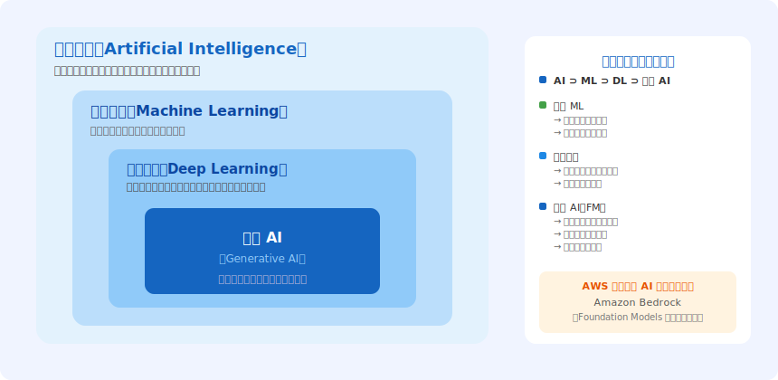

---

# 機械学習の種類

> *教師あり・教師なし・強化学習・半教師あり・自己教師ありの5種類、LLMはRLHFで改善*

- <svg viewBox="0 0 800 400" style="max-height:70vh;max-width:100%;display:block;margin:0 auto;" xmlns="http://www.w3.org/2000/svg"><rect x="0" y="0" width="800" height="380" fill="#1a1a2e" rx="0"/><text x="400" y="32" font-family="sans-serif" font-size="20" fill="#f9a825" text-anchor="middle" font-weight="bold">機械学習の種類 — 試験ポイント</text><rect x="15" y="70" width="230" height="260" fill="#16213e" rx="8"/><rect x="15" y="70" width="230" height="7" fill="#e91e63" rx="4"/><text x="130" y="110" font-family="sans-serif" font-size="16" fill="#e91e63" text-anchor="middle" font-weight="bold">教師あり学習</text><text x="130" y="145" font-family="sans-serif" font-size="12" fill="#ffffff" text-anchor="middle" font-weight="normal">ラベル付きデータ</text><text x="130" y="175" font-family="sans-serif" font-size="11" fill="#b0b8d0" text-anchor="middle" font-weight="normal">分類・回帰・SageMaker</text><rect x="285" y="70" width="230" height="260" fill="#16213e" rx="8"/><rect x="285" y="70" width="230" height="7" fill="#0d7377" rx="4"/><text x="400" y="110" font-family="sans-serif" font-size="16" fill="#0d7377" text-anchor="middle" font-weight="bold">教師なし学習</text><text x="400" y="145" font-family="sans-serif" font-size="12" fill="#ffffff" text-anchor="middle" font-weight="normal">ラベルなしデータ</text><text x="400" y="175" font-family="sans-serif" font-size="11" fill="#b0b8d0" text-anchor="middle" font-weight="normal">クラスタリング・次元削減</text><rect x="555" y="70" width="230" height="260" fill="#16213e" rx="8"/><rect x="555" y="70" width="230" height="7" fill="#6b2d8b" rx="4"/><text x="670" y="110" font-family="sans-serif" font-size="16" fill="#6b2d8b" text-anchor="middle" font-weight="bold">強化学習</text><text x="670" y="145" font-family="sans-serif" font-size="12" fill="#ffffff" text-anchor="middle" font-weight="normal">報酬最大化</text><text x="670" y="175" font-family="sans-serif" font-size="11" fill="#b0b8d0" text-anchor="middle" font-weight="normal">ゲームAI・RLHF</text></svg>
- **教師あり学習（Supervised Learning）**: ラベル付きデータから予測モデルを学習。分類（スパム判定）・回帰（価格予測）
- **教師なし学習（Unsupervised Learning）**: ラベルなしデータからパターン発見。クラスタリング・次元削減・異常検知
- **強化学習（Reinforcement Learning）**: 環境との相互作用から報酬を最大化。ゲーム AI・ロボット制御・RLHF（LLM の人間フィードバック学習）
- **半教師あり学習**: 少量のラベル付き + 大量のラベルなしデータを組み合わせる
- **自己教師あり学習**: データ自体から教師信号を生成（LLM の事前学習・BERT・GPT）

---

# 機械学習ワークフロー

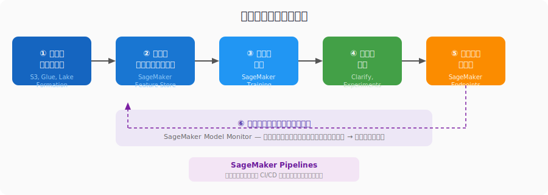

---

# ML モデルの主要評価指標

> *クラス不均衡時はAccuracyより F1 Score、がん診断など偽陰性を減らす場合はRecall優先*

- <svg viewBox="0 0 800 400" style="max-height:70vh;max-width:100%;display:block;margin:0 auto;" xmlns="http://www.w3.org/2000/svg"><rect x="0" y="0" width="800" height="380" fill="#1a1a2e" rx="0"/><text x="400" y="32" font-family="sans-serif" font-size="20" fill="#f9a825" text-anchor="middle" font-weight="bold">ML モデル評価指標 — 使い分け</text><rect x="20" y="70" width="240" height="130" fill="#16213e" rx="8"/><rect x="20" y="70" width="240" height="6" fill="#e91e63" rx="3"/><text x="140" y="105" font-family="sans-serif" font-size="17" fill="#e91e63" text-anchor="middle" font-weight="bold">Accuracy</text><text x="140" y="130" font-family="sans-serif" font-size="11" fill="#ffffff" text-anchor="middle" font-weight="normal">全体正解率</text><text x="140" y="152" font-family="sans-serif" font-size="10" fill="#b0b8d0" text-anchor="middle" font-weight="normal">クラス不均衡時は不適</text><rect x="275" y="70" width="240" height="130" fill="#16213e" rx="8"/><rect x="275" y="70" width="240" height="6" fill="#0d7377" rx="3"/><text x="395" y="105" font-family="sans-serif" font-size="17" fill="#0d7377" text-anchor="middle" font-weight="bold">Precision</text><text x="395" y="130" font-family="sans-serif" font-size="11" fill="#ffffff" text-anchor="middle" font-weight="normal">陽性予測適合率</text><text x="395" y="152" font-family="sans-serif" font-size="10" fill="#b0b8d0" text-anchor="middle" font-weight="normal">偽陽性最小化</text><rect x="530" y="70" width="240" height="130" fill="#16213e" rx="8"/><rect x="530" y="70" width="240" height="6" fill="#6b2d8b" rx="3"/><text x="650" y="105" font-family="sans-serif" font-size="17" fill="#6b2d8b" text-anchor="middle" font-weight="bold">Recall</text><text x="650" y="130" font-family="sans-serif" font-size="11" fill="#ffffff" text-anchor="middle" font-weight="normal">実陽性検出率</text><text x="650" y="152" font-family="sans-serif" font-size="10" fill="#b0b8d0" text-anchor="middle" font-weight="normal">偽陰性最小化（医療）</text><rect x="20" y="220" width="240" height="130" fill="#16213e" rx="8"/><rect x="20" y="220" width="240" height="6" fill="#1a6b3c" rx="3"/><text x="140" y="255" font-family="sans-serif" font-size="17" fill="#1a6b3c" text-anchor="middle" font-weight="bold">F1 Score</text><text x="140" y="280" font-family="sans-serif" font-size="11" fill="#ffffff" text-anchor="middle" font-weight="normal">調和平均</text><text x="140" y="302" font-family="sans-serif" font-size="10" fill="#b0b8d0" text-anchor="middle" font-weight="normal">不均衡データ</text><rect x="275" y="220" width="240" height="130" fill="#16213e" rx="8"/><rect x="275" y="220" width="240" height="6" fill="#b45309" rx="3"/><text x="395" y="255" font-family="sans-serif" font-size="17" fill="#b45309" text-anchor="middle" font-weight="bold">AUC-ROC</text><text x="395" y="280" font-family="sans-serif" font-size="11" fill="#ffffff" text-anchor="middle" font-weight="normal">判別能力</text><text x="395" y="302" font-family="sans-serif" font-size="10" fill="#b0b8d0" text-anchor="middle" font-weight="normal">0.5〜1.0</text><rect x="530" y="220" width="240" height="130" fill="#16213e" rx="8"/><rect x="530" y="220" width="240" height="6" fill="#0891b2" rx="3"/><text x="650" y="255" font-family="sans-serif" font-size="17" fill="#0891b2" text-anchor="middle" font-weight="bold">RMSE/MAE</text><text x="650" y="280" font-family="sans-serif" font-size="11" fill="#ffffff" text-anchor="middle" font-weight="normal">回帰誤差</text><text x="650" y="302" font-family="sans-serif" font-size="10" fill="#b0b8d0" text-anchor="middle" font-weight="normal">外れ値感度</text></svg>
- **Accuracy（精度）**: 全サンプル中の正解率。クラス不均衡時は不適切（95% 正解でも実は全部「陰性」予測かも）
- **Precision（適合率）**: 「陽性と予測した」うち本当の陽性の割合。偽陽性を減らしたい時
- **Recall（再現率）**: 「実際の陽性」のうち正しく検出できた割合。偽陰性を減らしたい時（がん診断など）
- **F1 Score**: Precision と Recall の調和平均。不均衡データの総合指標
- **AUC-ROC**: モデルの判別能力を 0〜1 で評価。0.5 = ランダム、1.0 = 完璧
- **RMSE/MAE**: 回帰問題の誤差指標。RMSE は外れ値に敏感

---

# AWS AI/ML サービスの全体像

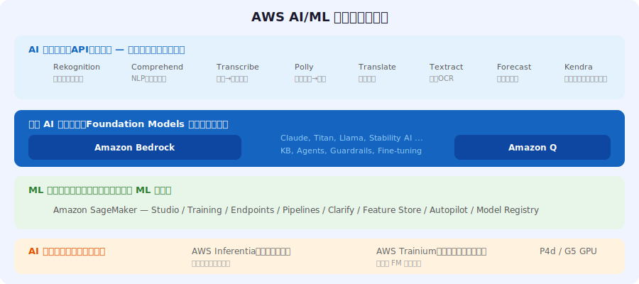

---

# Amazon SageMaker — 主要機能

> *Studio/Autopilot/Training/Endpoints/Pipelines/Model Registryが6大機能、MLワークフロー全体をカバー*

- <svg viewBox="0 0 800 400" style="max-height:70vh;max-width:100%;display:block;margin:0 auto;" xmlns="http://www.w3.org/2000/svg">
<rect x="0" y="0" width="800" height="400" fill="#1a1a2e" rx="0"/>
<text x="400" y="32" font-family="sans-serif" font-size="20" fill="#f9a825" text-anchor="middle" font-weight="bold">SageMaker 追加コンポーネント</text>

<rect x="-20" y="50" width="280" height="110" fill="#16213e" rx="8"/>
<text x="120" y="80" font-family="sans-serif" font-size="16" fill="#f9a825" text-anchor="middle" font-weight="bold">Feature Store</text>
<text x="120" y="110" font-family="sans-serif" font-size="12" fill="#ffffff" text-anchor="middle" font-weight="normal">特徴量オンライン/オフライン一元管理</text>

<rect x="260" y="50" width="280" height="110" fill="#16213e" rx="8"/>
<text x="400" y="80" font-family="sans-serif" font-size="16" fill="#f9a825" text-anchor="middle" font-weight="bold">Model Monitor</text>
<text x="400" y="110" font-family="sans-serif" font-size="12" fill="#ffffff" text-anchor="middle" font-weight="normal">データドリフト・品質劣化検出</text>

<rect x="540" y="50" width="280" height="110" fill="#16213e" rx="8"/>
<text x="680" y="80" font-family="sans-serif" font-size="16" fill="#f9a825" text-anchor="middle" font-weight="bold">Ground Truth</text>
<text x="680" y="110" font-family="sans-serif" font-size="12" fill="#ffffff" text-anchor="middle" font-weight="normal">人手ラベリング+自動ラベリング</text>

<rect x="60" y="200" width="280" height="110" fill="#16213e" rx="8"/>
<text x="200" y="230" font-family="sans-serif" font-size="16" fill="#f9a825" text-anchor="middle" font-weight="bold">JumpStart</text>
<text x="200" y="260" font-family="sans-serif" font-size="12" fill="#ffffff" text-anchor="middle" font-weight="normal">事前学習済みモデルの検索・FT・デプロイ</text>

<rect x="360" y="200" width="280" height="110" fill="#16213e" rx="8"/>
<text x="500" y="230" font-family="sans-serif" font-size="16" fill="#f9a825" text-anchor="middle" font-weight="bold">Data Wrangler</text>
<text x="500" y="260" font-family="sans-serif" font-size="12" fill="#ffffff" text-anchor="middle" font-weight="normal">ノーコードデータ前処理・可視化</text>

</svg>
- **SageMaker Studio**: 統合 ML 開発環境（IDE）。ノートブック・実験・パイプラインを一元管理
- **SageMaker Autopilot**: AutoML。データを与えるだけで最適なモデルを自動構築
- **SageMaker Training**: 分散学習ジョブの管理。Spot インスタンスでコスト削減
- **SageMaker Endpoints**: リアルタイム推論エンドポイント（オートスケーリング対応）
- **SageMaker Pipelines**: ML ワークフローを CI/CD パイプラインとして自動化
- **SageMaker Model Registry**: モデルバージョン管理・承認フロー・デプロイ追跡

---

# SageMaker — 追加コンポーネント

> *Clarify(SHAP)・Feature Store・Model Monitor・Ground Truth・JumpStart・Data Wranglerで完全なMLOps*

- <svg viewBox="0 0 800 400" style="max-height:70vh;max-width:100%;display:block;margin:0 auto;" xmlns="http://www.w3.org/2000/svg">
<rect x="0" y="0" width="800" height="380" fill="#1a1a2e" rx="0"/>
<text x="400" y="32" font-family="sans-serif" font-size="20" fill="#f9a825" text-anchor="middle" font-weight="bold">Domain 1 — 重要ポイントまとめ</text>

<rect x="60" y="65" width="680" height="48" fill="#16213e" rx="8"/>
<rect x="60" y="65" width="6" height="48" fill="#e91e63" rx="3"/>
<text x="110" y="85" font-family="sans-serif" font-size="14" fill="#e91e63" text-anchor="start" font-weight="bold">機械学習の種類</text>
<text x="110" y="103" font-family="sans-serif" font-size="12" fill="#ffffff" text-anchor="start" font-weight="normal">教師あり/なし/強化学習の違い</text>

<rect x="60" y="121" width="680" height="48" fill="#16213e" rx="8"/>
<rect x="60" y="121" width="6" height="48" fill="#0d7377" rx="3"/>
<text x="110" y="141" font-family="sans-serif" font-size="14" fill="#0d7377" text-anchor="start" font-weight="bold">評価指標</text>
<text x="110" y="159" font-family="sans-serif" font-size="12" fill="#ffffff" text-anchor="start" font-weight="normal">Precision・Recall・F1・AUC-ROC</text>

<rect x="60" y="177" width="680" height="48" fill="#16213e" rx="8"/>
<rect x="60" y="177" width="6" height="48" fill="#6b2d8b" rx="3"/>
<text x="110" y="197" font-family="sans-serif" font-size="14" fill="#6b2d8b" text-anchor="start" font-weight="bold">AWS AIサービス</text>
<text x="110" y="215" font-family="sans-serif" font-size="12" fill="#ffffff" text-anchor="start" font-weight="normal">Rekognition=画像 Comprehend=NLP</text>

<rect x="60" y="233" width="680" height="48" fill="#16213e" rx="8"/>
<rect x="60" y="233" width="6" height="48" fill="#1a6b3c" rx="3"/>
<text x="110" y="253" font-family="sans-serif" font-size="14" fill="#1a6b3c" text-anchor="start" font-weight="bold">SageMaker主要機能</text>
<text x="110" y="271" font-family="sans-serif" font-size="12" fill="#ffffff" text-anchor="start" font-weight="normal">Studio/Pipelines/Clarify/Monitor</text>

<rect x="60" y="289" width="680" height="48" fill="#16213e" rx="8"/>
<rect x="60" y="289" width="6" height="48" fill="#b45309" rx="3"/>
<text x="110" y="309" font-family="sans-serif" font-size="14" fill="#b45309" text-anchor="start" font-weight="bold">MLワークフロー</text>
<text x="110" y="327" font-family="sans-serif" font-size="12" fill="#ffffff" text-anchor="start" font-weight="normal">各ステップとAWSサービスの対応</text>

</svg>
- **SageMaker Clarify**: バイアス検出（学習前・後）+ SHAP による説明可能性（XAI）
- **SageMaker Feature Store**: 特徴量のオンライン/オフライン一元管理・再利用促進
- **SageMaker Model Monitor**: リアルタイムでデータドリフト・品質劣化・バイアスを検出
- **SageMaker Ground Truth**: 人手ラベリング（Mechanical Turk / 専門家）+ 自動ラベリング
- **SageMaker JumpStart**: 事前学習済みモデルの検索・ファインチューニング・デプロイを簡略化
- **SageMaker Data Wrangler**: ノーコードのデータ前処理・変換・可視化ツール

---

# Domain 1 — 試験対策チェックリスト

> *SageMaker主要コンポーネントとML評価指標（F1/AUC-ROC）の理解がDomain 1の核心*

- ✅ 教師あり/なし/強化学習の違いと AWS サービスへの対応を説明できる
- ✅ Precision・Recall・F1 の計算と使い分け（クラス不均衡時は Accuracy より F1）
- ✅ AWS AI サービスを適切なユースケースに対応付けられる（Rekognition=画像、Comprehend=NLP）
- ✅ SageMaker の主要コンポーネント（Studio/Pipelines/Clarify/Monitor）の役割を把握
- ✅ ML ワークフローの各ステップと対応 AWS サービスを図で説明できる
- ✅ AUC-ROC と F1 Score の違いを理解（AUC=判別能力、F1=不均衡データ）

---

<!-- _class: lead -->
# Domain 2: 生成 AI の基礎

- <svg viewBox="0 0 800 400" style="max-height:70vh;max-width:100%;display:block;margin:0 auto;" xmlns="http://www.w3.org/2000/svg">
<rect x="0" y="0" width="800" height="400" fill="#1a1a2e" rx="0"/>
<text x="400" y="32" font-family="sans-serif" font-size="20" fill="#f9a825" text-anchor="middle" font-weight="bold">生成AI vs 従来AI — アーキテクチャ比較</text>
<rect x="30" y="70" width="340" height="270" fill="#16213e" rx="8"/>
<rect x="30" y="70" width="340" height="8" fill="#555" rx="4"/>
<text x="200" y="105" font-family="sans-serif" font-size="17" fill="#b0b8d0" text-anchor="middle" font-weight="bold">従来の判別AI</text>
<text x="200" y="135" font-family="sans-serif" font-size="13" fill="#b0b8d0" text-anchor="middle" font-weight="normal">Input → Classify / Predict</text>
<text x="200" y="160" font-family="sans-serif" font-size="13" fill="#ffffff" text-anchor="middle" font-weight="normal">例: スパム判定・画像分類</text>
<text x="200" y="185" font-family="sans-serif" font-size="13" fill="#ffffff" text-anchor="middle" font-weight="normal">特定タスクに特化</text>
<text x="200" y="210" font-family="sans-serif" font-size="12" fill="#b0b8d0" text-anchor="middle" font-weight="normal">タスク固有の学習データが必要</text>
<rect x="430" y="70" width="340" height="270" fill="#16213e" rx="8"/>
<rect x="430" y="70" width="340" height="8" fill="#e91e63" rx="4"/>
<text x="600" y="105" font-family="sans-serif" font-size="17" fill="#f9a825" text-anchor="middle" font-weight="bold">生成AI / Foundation Models</text>
<text x="600" y="135" font-family="sans-serif" font-size="13" fill="#f9a825" text-anchor="middle" font-weight="normal">Input → Generate New Content</text>
<text x="600" y="160" font-family="sans-serif" font-size="13" fill="#ffffff" text-anchor="middle" font-weight="normal">例: テキスト・画像・コード生成</text>
<text x="600" y="185" font-family="sans-serif" font-size="13" fill="#ffffff" text-anchor="middle" font-weight="normal">Zero-shot / Few-shot 対応</text>
<text x="600" y="210" font-family="sans-serif" font-size="12" fill="#b0b8d0" text-anchor="middle" font-weight="normal">数十億〜数千億パラメータ</text>
<text x="600" y="235" font-family="sans-serif" font-size="12" fill="#b0b8d0" text-anchor="middle" font-weight="normal">Claude・GPT-4・Titan・Llama</text>
<text x="400" y="370" font-family="sans-serif" font-size="14" fill="#b0b8d0" text-anchor="middle" font-weight="normal">Foundation Models: 大規模データで事前学習済みの汎用モデル</text>
</svg>
- 出題比率 24% | Foundation Models の仕組み・プロンプトエンジニアリング・ハルシネーション対策

---

# 生成 AI と Foundation Models

> *FMは数十億〜数千億パラメータの汎用モデル、Zero-shotで多様タスクに対応できるのが革新点*

- <svg viewBox="0 0 800 400" style="max-height:70vh;max-width:100%;display:block;margin:0 auto;" xmlns="http://www.w3.org/2000/svg">
<rect x="0" y="0" width="800" height="400" fill="#1a1a2e" rx="0"/>
<text x="400" y="32" font-family="sans-serif" font-size="20" fill="#f9a825" text-anchor="middle" font-weight="bold">Transformer アーキテクチャ</text>
<rect x="50" y="70" width="200" height="270" fill="#16213e" rx="8"/>
<text x="150" y="100" font-family="sans-serif" font-size="14" fill="#b0b8d0" text-anchor="middle" font-weight="bold">Input</text>
<text x="150" y="125" font-family="sans-serif" font-size="12" fill="#ffffff" text-anchor="middle" font-weight="normal">Tokenization</text>
<text x="150" y="148" font-family="sans-serif" font-size="12" fill="#ffffff" text-anchor="middle" font-weight="normal">Embedding</text>
<text x="150" y="170" font-family="sans-serif" font-size="12" fill="#ffffff" text-anchor="middle" font-weight="normal">Positional</text>
<text x="150" y="190" font-family="sans-serif" font-size="12" fill="#ffffff" text-anchor="middle" font-weight="normal">Encoding</text>
<rect x="300" y="70" width="200" height="270" fill="#1e3a5f" rx="8"/>
<text x="400" y="100" font-family="sans-serif" font-size="14" fill="#e91e63" text-anchor="middle" font-weight="bold">Attention</text>
<text x="400" y="125" font-family="sans-serif" font-size="12" fill="#ffffff" text-anchor="middle" font-weight="normal">Self-Attention</text>
<text x="400" y="148" font-family="sans-serif" font-size="12" fill="#ffffff" text-anchor="middle" font-weight="normal">単語間の関係を</text>
<text x="400" y="168" font-family="sans-serif" font-size="12" fill="#ffffff" text-anchor="middle" font-weight="normal">並列計算で学習</text>
<text x="400" y="195" font-family="sans-serif" font-size="12" fill="#b0b8d0" text-anchor="middle" font-weight="normal">長距離依存も対応</text>
<rect x="550" y="70" width="200" height="270" fill="#16213e" rx="8"/>
<text x="650" y="100" font-family="sans-serif" font-size="14" fill="#f9a825" text-anchor="middle" font-weight="bold">Output</text>
<text x="650" y="125" font-family="sans-serif" font-size="12" fill="#ffffff" text-anchor="middle" font-weight="normal">BERT: エンコーダ型</text>
<text x="650" y="148" font-family="sans-serif" font-size="12" fill="#b0b8d0" text-anchor="middle" font-weight="normal">→ 理解タスク</text>
<text x="650" y="170" font-family="sans-serif" font-size="12" fill="#ffffff" text-anchor="middle" font-weight="normal">GPT: デコーダ型</text>
<text x="650" y="190" font-family="sans-serif" font-size="12" fill="#b0b8d0" text-anchor="middle" font-weight="normal">→ 生成タスク</text>
<text x="650" y="215" font-family="sans-serif" font-size="11" fill="#b0b8d0" text-anchor="middle" font-weight="normal">LLMは次トークン予測</text>
<line x1="250" y1="205" x2="290" y2="205" stroke="#f9a825" stroke-width="2"/><polygon points="300,205 290,210 290,200" fill="#f9a825"/>
<line x1="500" y1="205" x2="540" y2="205" stroke="#f9a825" stroke-width="2"/><polygon points="550,205 540,210 540,200" fill="#f9a825"/>
<text x="400" y="370" font-family="sans-serif" font-size="12" fill="#b0b8d0" text-anchor="middle" font-weight="normal">Scaling Law: パラメータ数・データ量・計算量を増やすほど能力が急激に向上</text>
</svg>
- **生成 AI（Generative AI）とは**: 学習データのパターンから新しいコンテンツ（テキスト・画像・コード・音声・動画）を生成する AI
- **従来 AI との違い**: 判別 AI（入力→分類/予測）vs 生成 AI（入力→新しいコンテンツ創出）
- **Foundation Models（FM）**: 大規模データで事前学習済みの汎用モデル。数十億〜数千億パラメータ
- **FMの特徴**: ファインチューニングなしで多様なタスクに対応（Zero-shot/Few-shot）
- **マルチモーダル**: テキスト・画像・音声・動画など複数モダリティに対応するモデル
- **代表モデル**: Claude（Anthropic）・GPT-4（OpenAI）・Titan（Amazon）・Llama（Meta）

---

# Transformer アーキテクチャの仕組み

> *Transformerデコーダ型がLLMの基盤、Scaling Lawでパラメータ・データ・計算量増加が性能向上に直結*

- <svg viewBox="0 0 800 400" style="max-height:70vh;max-width:100%;display:block;margin:0 auto;" xmlns="http://www.w3.org/2000/svg">
<rect x="0" y="0" width="800" height="380" fill="#1a1a2e" rx="0"/>
<text x="400" y="32" font-family="sans-serif" font-size="19" fill="#f9a825" text-anchor="middle" font-weight="bold">トークン・エンベディング・コンテキストウィンドウ</text>
<rect x="30" y="70" width="220" height="240" fill="#16213e" rx="8"/>
<text x="140" y="100" font-family="sans-serif" font-size="16" fill="#f9a825" text-anchor="middle" font-weight="bold">トークン</text>
<text x="140" y="125" font-family="sans-serif" font-size="12" fill="#ffffff" text-anchor="middle" font-weight="normal">テキストの基本処理単位</text>
<text x="140" y="148" font-family="sans-serif" font-size="12" fill="#b0b8d0" text-anchor="middle" font-weight="normal">1 token ≈ 0.75 英語単語</text>
<text x="140" y="168" font-family="sans-serif" font-size="12" fill="#b0b8d0" text-anchor="middle" font-weight="normal">≈ 0.5 日本語文字</text>
<text x="140" y="195" font-family="sans-serif" font-size="12" fill="#ffffff" text-anchor="middle" font-weight="normal">サブワード分割で</text>
<text x="140" y="212" font-family="sans-serif" font-size="12" fill="#ffffff" text-anchor="middle" font-weight="normal">語彙を最適化</text>
<rect x="290" y="70" width="220" height="240" fill="#16213e" rx="8"/>
<text x="400" y="100" font-family="sans-serif" font-size="16" fill="#f9a825" text-anchor="middle" font-weight="bold">エンベディング</text>
<text x="400" y="125" font-family="sans-serif" font-size="12" fill="#ffffff" text-anchor="middle" font-weight="normal">テキスト→数値ベクトル変換</text>
<text x="400" y="148" font-family="sans-serif" font-size="12" fill="#b0b8d0" text-anchor="middle" font-weight="normal">意味情報を保持</text>
<text x="400" y="168" font-family="sans-serif" font-size="12" fill="#b0b8d0" text-anchor="middle" font-weight="normal">類似テキスト=近いベクトル</text>
<text x="400" y="195" font-family="sans-serif" font-size="12" fill="#f9a825" text-anchor="middle" font-weight="normal">Amazon Titan Embeddings</text>
<text x="400" y="212" font-family="sans-serif" font-size="12" fill="#b0b8d0" text-anchor="middle" font-weight="normal">RAGで必須の技術</text>
<rect x="550" y="70" width="220" height="240" fill="#16213e" rx="8"/>
<text x="660" y="100" font-family="sans-serif" font-size="14" fill="#f9a825" text-anchor="middle" font-weight="bold">コンテキストウィンドウ</text>
<text x="660" y="125" font-family="sans-serif" font-size="12" fill="#ffffff" text-anchor="middle" font-weight="normal">1リクエストの最大トークン数</text>
<text x="660" y="148" font-family="sans-serif" font-size="12" fill="#b0b8d0" text-anchor="middle" font-weight="normal">（入力+出力の合計）</text>
<text x="660" y="175" font-family="sans-serif" font-size="12" fill="#b0b8d0" text-anchor="middle" font-weight="normal">Claude: 最大 200K tokens</text>
<text x="660" y="195" font-family="sans-serif" font-size="12" fill="#ffffff" text-anchor="middle" font-weight="normal">長文書・会話履歴対応</text>
<text x="660" y="215" font-family="sans-serif" font-size="12" fill="#b0b8d0" text-anchor="middle" font-weight="normal">チャンキングで分割処理</text>
</svg>
- **Transformer とは**: 2017 年に Google が発表した「Attention Is All You Need」に基づく DL アーキテクチャ
- **Self-Attention メカニズム**: 文章内の単語間の関係性を並列計算で捉える（長距離依存も対応）
- **エンコーダ・デコーダ構造**: BERT（エンコーダ型）= 理解タスク / GPT（デコーダ型）= 生成タスク
- **位置エンコーディング**: 単語の順序情報を数値化してモデルに付与（RNN 不要）
- **Scale の重要性**: パラメータ数・データ量・計算量を増やすほど能力が急激に向上（Scaling Law）
- **試験ポイント**: LLM は基本的に Transformer デコーダ型。テキストを次々予測して生成

---

# トークン・エンベディング・コンテキストウィンドウ

> *コンテキストウィンドウが処理能力の上限、RAGではチャンキングで長文書をウィンドウに収める*

- <svg viewBox="0 0 800 400" style="max-height:70vh;max-width:100%;display:block;margin:0 auto;" xmlns="http://www.w3.org/2000/svg">
<rect x="0" y="0" width="800" height="400" fill="#1a1a2e" rx="0"/>
<text x="400" y="32" font-family="sans-serif" font-size="21" fill="#f9a825" text-anchor="middle" font-weight="bold">LLM 推論パラメータ</text>

<rect x="50" y="65" width="700" height="50" fill="#16213e" rx="8"/>
<rect x="50" y="65" width="5" height="50" fill="#e91e63" rx="3"/>
<text x="150" y="85" font-family="sans-serif" font-size="14" fill="#e91e63" text-anchor="start" font-weight="bold">Temperature</text>
<text x="270" y="85" font-family="sans-serif" font-size="14" fill="#b0b8d0" text-anchor="start" font-weight="normal">0〜2</text>
<text x="350" y="85" font-family="sans-serif" font-size="13" fill="#ffffff" text-anchor="start" font-weight="normal">低=確定的 高=創造的</text>
<text x="590" y="85" font-family="sans-serif" font-size="11" fill="#b0b8d0" text-anchor="start" font-weight="normal">事実確認→低 創作→高</text>

<rect x="50" y="123" width="700" height="50" fill="#16213e" rx="8"/>
<rect x="50" y="123" width="5" height="50" fill="#0d7377" rx="3"/>
<text x="150" y="143" font-family="sans-serif" font-size="14" fill="#0d7377" text-anchor="start" font-weight="bold">Top-P</text>
<text x="270" y="143" font-family="sans-serif" font-size="14" fill="#b0b8d0" text-anchor="start" font-weight="normal">0〜1</text>
<text x="350" y="143" font-family="sans-serif" font-size="13" fill="#ffffff" text-anchor="start" font-weight="normal">累積確率サンプリング</text>
<text x="590" y="143" font-family="sans-serif" font-size="11" fill="#b0b8d0" text-anchor="start" font-weight="normal">Nucleus Sampling</text>

<rect x="50" y="181" width="700" height="50" fill="#16213e" rx="8"/>
<rect x="50" y="181" width="5" height="50" fill="#6b2d8b" rx="3"/>
<text x="150" y="201" font-family="sans-serif" font-size="14" fill="#6b2d8b" text-anchor="start" font-weight="bold">Top-K</text>
<text x="270" y="201" font-family="sans-serif" font-size="14" fill="#b0b8d0" text-anchor="start" font-weight="normal">整数</text>
<text x="350" y="201" font-family="sans-serif" font-size="13" fill="#ffffff" text-anchor="start" font-weight="normal">上位K個からサンプル</text>
<text x="590" y="201" font-family="sans-serif" font-size="11" fill="#b0b8d0" text-anchor="start" font-weight="normal">K=1はGreedy（最高確率）</text>

<rect x="50" y="239" width="700" height="50" fill="#16213e" rx="8"/>
<rect x="50" y="239" width="5" height="50" fill="#1a6b3c" rx="3"/>
<text x="150" y="259" font-family="sans-serif" font-size="14" fill="#1a6b3c" text-anchor="start" font-weight="bold">Max Tokens</text>
<text x="270" y="259" font-family="sans-serif" font-size="14" fill="#b0b8d0" text-anchor="start" font-weight="normal">整数</text>
<text x="350" y="259" font-family="sans-serif" font-size="13" fill="#ffffff" text-anchor="start" font-weight="normal">生成トークン数上限</text>
<text x="590" y="259" font-family="sans-serif" font-size="11" fill="#b0b8d0" text-anchor="start" font-weight="normal">コスト制御と応答長</text>

<rect x="50" y="297" width="700" height="50" fill="#16213e" rx="8"/>
<rect x="50" y="297" width="5" height="50" fill="#b45309" rx="3"/>
<text x="150" y="317" font-family="sans-serif" font-size="14" fill="#b45309" text-anchor="start" font-weight="bold">Stop Sequence</text>
<text x="270" y="317" font-family="sans-serif" font-size="14" fill="#b0b8d0" text-anchor="start" font-weight="normal">文字列</text>
<text x="350" y="317" font-family="sans-serif" font-size="13" fill="#ffffff" text-anchor="start" font-weight="normal">特定文字列で生成停止</text>
<text x="590" y="317" font-family="sans-serif" font-size="11" fill="#b0b8d0" text-anchor="start" font-weight="normal">出力形式の制御</text>

</svg>
- **トークン**: LLM が処理するテキストの基本単位（サブワード）。1 トークン ≈ 0.75 英語単語 / 0.5 日本語文字
- **エンベディング**: テキストを意味を保持した高次元数値ベクトルに変換。類似テキスト = 近いベクトル
- **コンテキストウィンドウ**: 1 回のリクエストで処理できる最大トークン数（入力 + 出力の合計）
- **重要性**: コンテキストウィンドウが大きい = 長い文書・会話履歴を一度に処理可能
- **チャンキング**: 長文書をコンテキストウィンドウに収まるサイズに分割する手法（RAG で重要）
- **Titan Embeddings**: Amazon 提供のエンベディングモデル（Bedrock 経由で利用可能）

---

# LLM 推論パラメータ

> *事実確認・コード生成→低Temperature、創作・アイデア出し→高Temperature が基本原則*

- **Temperature（0〜2）**: 出力の多様性。低い値（0.1）→確定的・一貫性高い / 高い値（1.5）→創造的・ランダム
- **Top-P（0〜1）**: 累積確率が P を超えるまでの上位トークンからサンプリング（Nucleus Sampling）
- **Top-K**: 上位 K 個のトークンの中からサンプリング。K=1 → Greedy（最高確率を常に選択）
- **Max Tokens**: 生成するトークン数の上限（コスト制御と応答長のバランス）
- **Stop Sequences**: 特定の文字列が出現したら生成を停止する（出力形式の制御）
- **試験ポイント**: 事実確認・コード生成 → 低 Temperature / 創作・アイデア出し → 高 Temperature

---

# プロンプトエンジニアリング手法

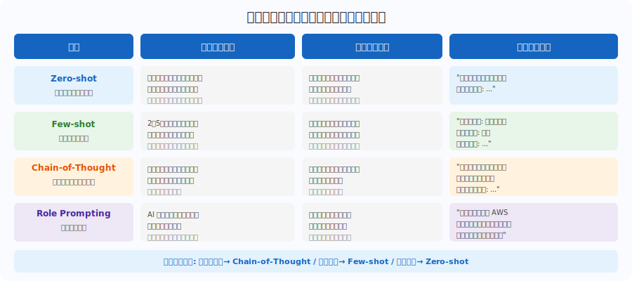

---

# 高度なプロンプト技法

> *ReActがBedrock Agentsの基盤、Reflection・ToTで複雑問題の精度向上、Prompt Injection対策必須*

- <svg viewBox="0 0 800 400" style="max-height:70vh;max-width:100%;display:block;margin:0 auto;" xmlns="http://www.w3.org/2000/svg">
<rect x="0" y="0" width="800" height="400" fill="#1a1a2e" rx="0"/>
<text x="400" y="32" font-family="sans-serif" font-size="21" fill="#f9a825" text-anchor="middle" font-weight="bold">プロンプト 4つの構成要素</text>
<rect x="50" y="70" width="165" height="260" fill="#16213e" rx="8"/>
<rect x="50" y="70" width="165" height="8" fill="#e91e63" rx="4"/>
<text x="132" y="110" font-family="sans-serif" font-size="18" fill="#ffffff" text-anchor="middle" font-weight="bold">指示</text>
<text x="132" y="132" font-family="sans-serif" font-size="13" fill="#b0b8d0" text-anchor="middle" font-weight="normal">Instruction</text>
<text x="132" y="160" font-family="sans-serif" font-size="12" fill="#ffffff" text-anchor="middle" font-weight="normal">何をしてほしいか</text>
<text x="132" y="180" font-family="sans-serif" font-size="12" fill="#b0b8d0" text-anchor="middle" font-weight="normal">具体的・明確に記述</text>
<rect x="230" y="70" width="165" height="260" fill="#16213e" rx="8"/>
<rect x="230" y="70" width="165" height="8" fill="#0d7377" rx="4"/>
<text x="312" y="110" font-family="sans-serif" font-size="17" fill="#ffffff" text-anchor="middle" font-weight="bold">コンテキスト</text>
<text x="312" y="132" font-family="sans-serif" font-size="13" fill="#b0b8d0" text-anchor="middle" font-weight="normal">Context</text>
<text x="312" y="160" font-family="sans-serif" font-size="12" fill="#ffffff" text-anchor="middle" font-weight="normal">背景情報・制約・前提</text>
<rect x="410" y="70" width="165" height="260" fill="#16213e" rx="8"/>
<rect x="410" y="70" width="165" height="8" fill="#6b2d8b" rx="4"/>
<text x="492" y="110" font-family="sans-serif" font-size="17" fill="#ffffff" text-anchor="middle" font-weight="bold">入力データ</text>
<text x="492" y="132" font-family="sans-serif" font-size="13" fill="#b0b8d0" text-anchor="middle" font-weight="normal">Input Data</text>
<text x="492" y="160" font-family="sans-serif" font-size="12" fill="#ffffff" text-anchor="middle" font-weight="normal">Few-shotの例</text>
<text x="492" y="180" font-family="sans-serif" font-size="12" fill="#b0b8d0" text-anchor="middle" font-weight="normal">処理対象データ</text>
<rect x="590" y="70" width="165" height="260" fill="#16213e" rx="8"/>
<rect x="590" y="70" width="165" height="8" fill="#1a6b3c" rx="4"/>
<text x="672" y="110" font-family="sans-serif" font-size="18" fill="#ffffff" text-anchor="middle" font-weight="bold">出力形式</text>
<text x="672" y="132" font-family="sans-serif" font-size="12" fill="#b0b8d0" text-anchor="middle" font-weight="normal">Output Indicator</text>
<text x="672" y="160" font-family="sans-serif" font-size="12" fill="#ffffff" text-anchor="middle" font-weight="normal">JSON/箇条書き/表</text>
<text x="400" y="365" font-family="sans-serif" font-size="13" fill="#b0b8d0" text-anchor="middle" font-weight="normal">ベスト: 具体的・肯定で指示・例を提示(Few-shot)・段階的に分解</text>
</svg>
- **Self-Consistency**: 同じ質問を複数回（異なる Temperature で）生成し、多数決で最終回答を決定
- **ReAct（Reasoning + Acting）**: 推論とツール使用を交互に繰り返す。Bedrock Agents の基盤
- **Reflection**: モデルが自分の回答を批評・修正する反復プロセス（精度向上）
- **Tree-of-Thought（ToT）**: 複数の推論パスを木構造で探索（複雑な問題に有効）
- **Prompt Injection 対策**: ユーザー入力を信頼しない設計・入力のサニタイズ・Guardrails 活用
- **System Prompt**: AI の役割・制約・出力形式をセッション全体で定義する事前指示

---

# プロンプトの構成要素

> *指示・コンテキスト・入力データ・出力形式の4要素、具体的・肯定的・Few-shot提示が3大ベストプラクティス*

- <svg viewBox="0 0 800 400" style="max-height:70vh;max-width:100%;display:block;margin:0 auto;" xmlns="http://www.w3.org/2000/svg">
<rect x="0" y="0" width="800" height="380" fill="#1a1a2e" rx="0"/>
<text x="400" y="32" font-family="sans-serif" font-size="20" fill="#f9a825" text-anchor="middle" font-weight="bold">ハルシネーション（幻覚）の原因</text>

<rect x="30" y="75" width="240" height="200" fill="#16213e" rx="8"/>
<rect x="30" y="75" width="240" height="8" fill="#e91e63" rx="4"/>
<circle cx="150" cy="135" r="28" fill="#e91e63" style="opacity:0.2"/>
<text x="150" y="141" font-family="sans-serif" font-size="28" fill="#e91e63" text-anchor="middle" font-weight="bold">1</text>
<text x="150" y="185" font-family="sans-serif" font-size="14" fill="#e91e63" text-anchor="middle" font-weight="bold">学習データの問題</text>
<text x="150" y="208" font-family="sans-serif" font-size="11" fill="#ffffff" text-anchor="middle" font-weight="normal">誤ったデータ・知識カットオフ</text><text x="150" y="226" font-family="sans-serif" font-size="11" fill="#ffffff" text-anchor="middle" font-weight="normal">最新情報がモデルに存在しない</text>

<rect x="285" y="75" width="240" height="200" fill="#16213e" rx="8"/>
<rect x="285" y="75" width="240" height="8" fill="#e74c3c" rx="4"/>
<circle cx="405" cy="135" r="28" fill="#e74c3c" style="opacity:0.2"/>
<text x="405" y="141" font-family="sans-serif" font-size="28" fill="#e74c3c" text-anchor="middle" font-weight="bold">2</text>
<text x="405" y="185" font-family="sans-serif" font-size="14" fill="#e74c3c" text-anchor="middle" font-weight="bold">確率的生成の性質</text>
<text x="405" y="208" font-family="sans-serif" font-size="11" fill="#ffffff" text-anchor="middle" font-weight="normal">次トークンを確率的に予測</text><text x="405" y="226" font-family="sans-serif" font-size="11" fill="#ffffff" text-anchor="middle" font-weight="normal">「それらしい嘘」が生まれる</text>

<rect x="540" y="75" width="240" height="200" fill="#16213e" rx="8"/>
<rect x="540" y="75" width="240" height="8" fill="#9b59b6" rx="4"/>
<circle cx="660" cy="135" r="28" fill="#9b59b6" style="opacity:0.2"/>
<text x="660" y="141" font-family="sans-serif" font-size="28" fill="#9b59b6" text-anchor="middle" font-weight="bold">3</text>
<text x="660" y="185" font-family="sans-serif" font-size="14" fill="#9b59b6" text-anchor="middle" font-weight="bold">コンテキスト不足</text>
<text x="660" y="208" font-family="sans-serif" font-size="11" fill="#ffffff" text-anchor="middle" font-weight="normal">情報なしに質問→埋め合わせで誤情報</text><text x="660" y="226" font-family="sans-serif" font-size="11" fill="#ffffff" text-anchor="middle" font-weight="normal">不明確な質問が原因になる</text>

<text x="400" y="308" font-family="sans-serif" font-size="13" fill="#b0b8d0" text-anchor="middle" font-weight="normal">特徴: LLMは「確信度」を正確に表現できないため、嘘でも断定的に答える</text>
<text x="400" y="335" font-family="sans-serif" font-size="12" fill="#e91e63" text-anchor="middle" font-weight="normal">→ 被害事例: 架空の法律条文・医療情報の誤り・架空の引用文献</text>
</svg>
- **指示（Instruction）**: モデルに何をしてほしいかを具体的・明確に記述
- **コンテキスト（Context）**: タスクに関連する背景情報・制約・前提条件
- **入力データ（Input Data）**: 処理対象のデータや Few-shot の例
- **出力形式（Output Indicator）**: 期待する出力の形式（JSON / 箇条書き / 表など）
- **ベストプラクティス**: ①具体的・明確に記述 ②否定より肯定で指示 ③例を提示（Few-shot）④段階的に分解
- **注意点**: プロンプトが長すぎるとコンテキストウィンドウを消費し、コスト増加・精度低下に繋がる

---

# ハルシネーション（幻覚）とは

> *確率的生成で「それらしい嘘」が生まれる、知識カットオフとコンテキスト不足が主要原因*

- <svg viewBox="0 0 800 400" style="max-height:70vh;max-width:100%;display:block;margin:0 auto;" xmlns="http://www.w3.org/2000/svg">
<rect x="0" y="0" width="800" height="380" fill="#1a1a2e" rx="0"/>
<text x="400" y="32" font-family="sans-serif" font-size="20" fill="#f9a825" text-anchor="middle" font-weight="bold">ハルシネーション軽減戦略</text>

<rect x="20" y="75" width="240" height="110" fill="#16213e" rx="8"/>
<rect x="20" y="75" width="240" height="6" fill="#e91e63" rx="3"/>
<text x="140" y="110" font-family="sans-serif" font-size="14" fill="#e91e63" text-anchor="middle" font-weight="bold">① RAG</text>
<text x="140" y="133" font-family="sans-serif" font-size="11" fill="#ffffff" text-anchor="middle" font-weight="normal">外部ナレッジから根拠取得</text><text x="140" y="151" font-family="sans-serif" font-size="11" fill="#ffffff" text-anchor="middle" font-weight="normal">→ Bedrock Knowledge Bases</text>

<rect x="275" y="75" width="240" height="110" fill="#16213e" rx="8"/>
<rect x="275" y="75" width="240" height="6" fill="#0d7377" rx="3"/>
<text x="395" y="110" font-family="sans-serif" font-size="14" fill="#0d7377" text-anchor="middle" font-weight="bold">② Grounding</text>
<text x="395" y="133" font-family="sans-serif" font-size="11" fill="#ffffff" text-anchor="middle" font-weight="normal">Bedrock Guardrailsで</text><text x="395" y="151" font-family="sans-serif" font-size="11" fill="#ffffff" text-anchor="middle" font-weight="normal">RAG回答をソース検証</text>

<rect x="530" y="75" width="240" height="110" fill="#16213e" rx="8"/>
<rect x="530" y="75" width="240" height="6" fill="#6b2d8b" rx="3"/>
<text x="650" y="110" font-family="sans-serif" font-size="14" fill="#6b2d8b" text-anchor="middle" font-weight="bold">③ Temperature低下</text>
<text x="650" y="133" font-family="sans-serif" font-size="11" fill="#ffffff" text-anchor="middle" font-weight="normal">0.0〜0.3に設定</text><text x="650" y="151" font-family="sans-serif" font-size="11" fill="#ffffff" text-anchor="middle" font-weight="normal">→ 決定論的出力を促進</text>

<rect x="20" y="205" width="240" height="110" fill="#16213e" rx="8"/>
<rect x="20" y="205" width="240" height="6" fill="#1a6b3c" rx="3"/>
<text x="140" y="240" font-family="sans-serif" font-size="14" fill="#1a6b3c" text-anchor="middle" font-weight="bold">④ Chain-of-Thought</text>
<text x="140" y="263" font-family="sans-serif" font-size="11" fill="#ffffff" text-anchor="middle" font-weight="normal">推論ステップを明示させ</text><text x="140" y="281" font-family="sans-serif" font-size="11" fill="#ffffff" text-anchor="middle" font-weight="normal">論理的正解を誘導</text>

<rect x="275" y="205" width="240" height="110" fill="#16213e" rx="8"/>
<rect x="275" y="205" width="240" height="6" fill="#b45309" rx="3"/>
<text x="395" y="240" font-family="sans-serif" font-size="14" fill="#b45309" text-anchor="middle" font-weight="bold">⑤ HITL</text>
<text x="395" y="263" font-family="sans-serif" font-size="11" fill="#ffffff" text-anchor="middle" font-weight="normal">高リスク判断には</text><text x="395" y="281" font-family="sans-serif" font-size="11" fill="#ffffff" text-anchor="middle" font-weight="normal">人間の確認を挟む</text>

<rect x="530" y="205" width="240" height="110" fill="#16213e" rx="8"/>
<rect x="530" y="205" width="240" height="6" fill="#f9a825" rx="3"/>
<text x="650" y="240" font-family="sans-serif" font-size="14" fill="#f9a825" text-anchor="middle" font-weight="bold">⑥ Few-shot</text>
<text x="650" y="263" font-family="sans-serif" font-size="11" fill="#ffffff" text-anchor="middle" font-weight="normal">正確な参照例を提示</text><text x="650" y="281" font-family="sans-serif" font-size="11" fill="#ffffff" text-anchor="middle" font-weight="normal">出力の方向性を固定</text>

</svg>
- **定義**: LLM が事実に反する内容や存在しない情報を、自信を持って生成する現象
- **原因①（学習データ）**: 誤った・偏ったデータを学習。知識カットオフ（最新情報なし）
- **原因②（確率的生成）**: 次のトークンを確率的に予測するため、「それらしい嘘」が生まれる
- **原因③（コンテキスト不足）**: 十分な情報なしに質問されると、埋め合わせで誤情報を生成
- **被害事例**: 存在しない法律条文・医療情報の誤り・架空の引用文献
- **特徴**: LLM は「確信度」を正確に表現できないため、嘘でも断定的に答える

---

# ハルシネーション対策

> *RAGが最も効果的、Guardrails Groundingで自動検証・Temperature低下・CoTで決定論的回答を誘導*

- <svg viewBox="0 0 800 400" style="max-height:70vh;max-width:100%;display:block;margin:0 auto;" xmlns="http://www.w3.org/2000/svg">
<rect x="0" y="0" width="800" height="380" fill="#1a1a2e" rx="0"/>
<text x="400" y="32" font-family="sans-serif" font-size="20" fill="#f9a825" text-anchor="middle" font-weight="bold">Domain 2 — 重要ポイントまとめ</text>

<rect x="60" y="65" width="680" height="48" fill="#16213e" rx="8"/>
<rect x="60" y="65" width="6" height="48" fill="#e91e63" rx="3"/>
<text x="110" y="85" font-family="sans-serif" font-size="14" fill="#e91e63" text-anchor="start" font-weight="bold">FM vs 従来ML</text>
<text x="110" y="103" font-family="sans-serif" font-size="12" fill="#ffffff" text-anchor="start" font-weight="normal">汎用性・スケール・Zero-shot対応の違い</text>

<rect x="60" y="121" width="680" height="48" fill="#16213e" rx="8"/>
<rect x="60" y="121" width="6" height="48" fill="#0d7377" rx="3"/>
<text x="110" y="141" font-family="sans-serif" font-size="14" fill="#0d7377" text-anchor="start" font-weight="bold">推論パラメータ</text>
<text x="110" y="159" font-family="sans-serif" font-size="12" fill="#ffffff" text-anchor="start" font-weight="normal">Temperature/Top-P/Top-Kの影響</text>

<rect x="60" y="177" width="680" height="48" fill="#16213e" rx="8"/>
<rect x="60" y="177" width="6" height="48" fill="#6b2d8b" rx="3"/>
<text x="110" y="197" font-family="sans-serif" font-size="14" fill="#6b2d8b" text-anchor="start" font-weight="bold">プロンプト手法</text>
<text x="110" y="215" font-family="sans-serif" font-size="12" fill="#ffffff" text-anchor="start" font-weight="normal">Zero-shot/Few-shot/CoTの使い分け</text>

<rect x="60" y="233" width="680" height="48" fill="#16213e" rx="8"/>
<rect x="60" y="233" width="6" height="48" fill="#1a6b3c" rx="3"/>
<text x="110" y="253" font-family="sans-serif" font-size="14" fill="#1a6b3c" text-anchor="start" font-weight="bold">ハルシネーション</text>
<text x="110" y="271" font-family="sans-serif" font-size="12" fill="#ffffff" text-anchor="start" font-weight="normal">原因（確率的生成）と対策（RAG・Grounding）</text>

<rect x="60" y="289" width="680" height="48" fill="#16213e" rx="8"/>
<rect x="60" y="289" width="6" height="48" fill="#b45309" rx="3"/>
<text x="110" y="309" font-family="sans-serif" font-size="14" fill="#b45309" text-anchor="start" font-weight="bold">Transformer</text>
<text x="110" y="327" font-family="sans-serif" font-size="12" fill="#ffffff" text-anchor="start" font-weight="normal">Self-Attention・デコーダ型の基本概念</text>

</svg>
- **① RAG（Retrieval-Augmented Generation）**: 外部ナレッジから根拠を取得して回答生成。最も効果的
- **② Grounding（Bedrock Guardrails）**: RAG の回答がソースに基づくかを自動検証・ブロック
- **③ Temperature 低下**: 0.0〜0.3 に設定することで決定論的・一貫性の高い出力を促進
- **④ Chain-of-Thought**: 推論ステップを明示させることで、論理的に正しい回答を誘導
- **⑤ 人間によるレビュー（HITL）**: 高リスクな判断には人間の確認を挟む
- **⑥ Few-shot でのグラウンディング**: 正確な参照例を提示して出力の方向性を固定

---

# Domain 2 — 試験対策チェックリスト

> *FM仕組み・プロンプト技法（Zero-shot/Few-shot/CoT）・ハルシネーション対策がDomain 2の核心*

- ✅ FM と従来 ML モデルの違いを説明できる（汎用性・スケール・Zero-shot 対応）
- ✅ トークン・エンベディング・コンテキストウィンドウの概念を理解
- ✅ Temperature / Top-P / Top-K がモデル出力に与える影響を説明できる
- ✅ Zero-shot / Few-shot / Chain-of-Thought の使い分けを把握
- ✅ ハルシネーションの原因（学習データ・確率的生成）と軽減策（RAG・Grounding）を理解
- ✅ Self-Attention・Transformer デコーダ型の基本概念を説明できる

---

<!-- _class: lead -->
# Domain 3: Foundation Models の活用

- 出題比率 28%（最重要） | Amazon Bedrock の全機能と RAG・Agents・カスタマイズを深く理解する

---

# Amazon Bedrock — コンポーネント全体像

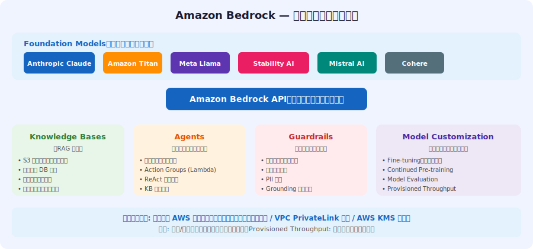

---

# Bedrock Foundation Models の特徴

> *Claudeは200Kトークン長文対応、Titanはテキスト+Embeddings、モデル選択はタスク・コスト・レイテンシで決定*

- <svg viewBox="0 0 800 400" style="max-height:70vh;max-width:100%;display:block;margin:0 auto;" xmlns="http://www.w3.org/2000/svg">
<rect x="0" y="0" width="800" height="400" fill="#1a1a2e" rx="0"/>
<text x="400" y="32" font-family="sans-serif" font-size="21" fill="#f9a825" text-anchor="middle" font-weight="bold">RAG 基本フロー</text>

<rect x="10" y="100" width="115" height="100" fill="#16213e" rx="8"/>
<text x="70" y="130" font-family="sans-serif" font-size="13" fill="#f9a825" text-anchor="middle" font-weight="bold">クエリ入力</text>
<text x="70" y="155" font-family="sans-serif" font-size="11" fill="#ffffff" text-anchor="middle" font-weight="normal">ユーザーの質問</text>

<rect x="150" y="100" width="115" height="100" fill="#16213e" rx="8"/>
<text x="210" y="130" font-family="sans-serif" font-size="13" fill="#f9a825" text-anchor="middle" font-weight="bold">エンベディング</text>
<text x="210" y="155" font-family="sans-serif" font-size="11" fill="#ffffff" text-anchor="middle" font-weight="normal">ベクトル変換</text>

<rect x="310" y="100" width="115" height="100" fill="#16213e" rx="8"/>
<text x="370" y="130" font-family="sans-serif" font-size="13" fill="#f9a825" text-anchor="middle" font-weight="bold">ベクトルDB検索</text>
<text x="370" y="155" font-family="sans-serif" font-size="11" fill="#ffffff" text-anchor="middle" font-weight="normal">類似チャンク取得</text>

<rect x="470" y="100" width="115" height="100" fill="#16213e" rx="8"/>
<text x="530" y="130" font-family="sans-serif" font-size="13" fill="#f9a825" text-anchor="middle" font-weight="bold">コンテキスト付与</text>
<text x="530" y="155" font-family="sans-serif" font-size="11" fill="#ffffff" text-anchor="middle" font-weight="normal">関連情報をFMへ</text>

<rect x="620" y="100" width="115" height="100" fill="#16213e" rx="8"/>
<text x="680" y="130" font-family="sans-serif" font-size="13" fill="#f9a825" text-anchor="middle" font-weight="bold">回答生成</text>
<text x="680" y="155" font-family="sans-serif" font-size="11" fill="#ffffff" text-anchor="middle" font-weight="normal">根拠付き回答</text>

<line x1="130" y1="150" x2="140" y2="150" stroke="#f9a825" stroke-width="2"/><polygon points="150,150 140,155 140,145" fill="#f9a825"/><line x1="290" y1="150" x2="300" y2="150" stroke="#f9a825" stroke-width="2"/><polygon points="310,150 300,155 300,145" fill="#f9a825"/><line x1="450" y1="150" x2="460" y2="150" stroke="#f9a825" stroke-width="2"/><polygon points="470,150 460,155 460,145" fill="#f9a825"/><line x1="610" y1="150" x2="620" y2="150" stroke="#f9a825" stroke-width="2"/><polygon points="630,150 620,155 620,145" fill="#f9a825"/>
<rect x="60" y="230" width="680" height="130" fill="#16213e" rx="8"/>
<text x="400" y="260" font-family="sans-serif" font-size="14" fill="#b0b8d0" text-anchor="middle" font-weight="bold">解決する問題:</text>
<text x="400" y="290" font-family="sans-serif" font-size="13" fill="#ffffff" text-anchor="middle" font-weight="normal">① 知識カットオフ  ② ハルシネーション  ③ 社内固有情報への対応</text>
<text x="400" y="320" font-family="sans-serif" font-size="13" fill="#f9a825" text-anchor="middle" font-weight="normal">AWS実装: Amazon Bedrock Knowledge Bases（マネージドRAG）</text>
<text x="400" y="348" font-family="sans-serif" font-size="12" fill="#b0b8d0" text-anchor="middle" font-weight="normal">ベクトルストア: OpenSearch Serverless / Aurora pgvector / Pinecone / Redis</text>
</svg>
- **Anthropic Claude**: 長文理解・複雑な推論・安全性に優れる。最大コンテキストウィンドウ 200K tokens
- **Amazon Titan**: AWS ネイティブ FM。テキスト生成（Titan Text）と Embeddings の 2 系統
- **Meta Llama**: オープンソース系。ファインチューニングのベースモデルとして人気
- **Stability AI**: Stable Diffusion で画像生成に特化。テキスト→画像変換
- **Mistral AI**: 効率的なアーキテクチャで低レイテンシー推論を実現
- **選択基準**: タスクの種類（テキスト/画像）・必要なコンテキスト長・コスト・レイテンシー要件・ライセンス

---

# RAG（Retrieval-Augmented Generation）とは

> *クエリ→エンベディング→ベクトルDB検索→FM入力→生成の5ステップでハルシネーションを大幅軽減*

- **RAG の定義**: 外部ナレッジベースから関連情報を取得（Retrieve）して FM の回答生成（Generate）を補強するパターン
- **解決する問題**: ① 知識カットオフ ② ハルシネーション ③ 社内固有情報への対応（Fine-tuning 不要）
- **基本フロー**: クエリ → エンベディング変換 → ベクトル DB 類似検索 → 関連チャンク取得 → FM に入力 → 回答生成
- **AWS 実装**: Amazon Bedrock Knowledge Bases（マネージド RAG）
- **ベクトルストア選択肢**: OpenSearch Serverless / Aurora PostgreSQL（pgvector）/ Pinecone / Redis Enterprise
- **メリット**: 最新情報対応・引用付き回答・ハルシネーション大幅軽減・Fine-tuning 不要

---

# RAG アーキテクチャ詳細

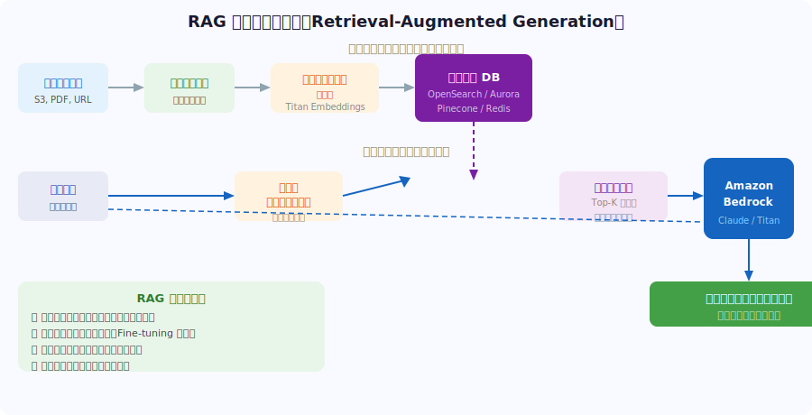

---

# Amazon Bedrock Knowledge Bases

> *S3・Confluence・SharePointを自動処理、RetrieveAndGenerateで引用付き回答生成が可能*

- **定義**: S3 のドキュメントを自動的に処理し、ベクトル DB と統合するマネージド RAG サービス
- **データソース**: Amazon S3 / Confluence / SharePoint / Salesforce / Web Crawler
- **処理フロー**: ドキュメント読み込み → チャンキング → エンベディング（Titan）→ ベクトル DB 保存
- **API**: `RetrieveAndGenerate`（引用付き回答生成）/ `Retrieve`（検索のみ・後続処理を自由に設計）
- **チャンキング戦略**: Fixed-size / Semantic（意味単位）/ Hierarchical（階層分割）で検索精度が変わる
- **統合ベクトル DB**: OpenSearch Serverless（デフォルト）/ Aurora pgvector / Pinecone / Redis Enterprise

---

# ベクトル DB と類似度検索

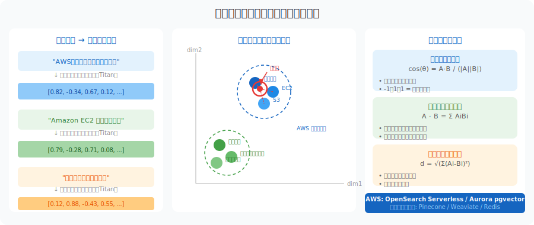

---

# Amazon Bedrock Agents

> *ReActパターンでOpenAPI定義のLambda関数を自律呼び出し、Return Controlで高リスクアクション前に人間確認*

- **定義**: FM を使ってマルチステップタスクを自律実行するエージェント構築サービス
- **仕組み（ReAct パターン）**: FM が Reasoning（推論）→ Action（ツール実行）→ Observation（結果確認）を繰り返す
- **Action Groups**: OpenAPI スキーマで定義した API を FM が呼び出す（Lambda 関数に接続）
- **Return Control**: エージェントが人間の確認を求めて一時停止できる（高リスクアクション前）
- **Knowledge Bases 連携**: Agent から KB を参照して事実根拠に基づいた回答を生成
- **ユースケース**: カスタマーサポート自動化 / 社内 Q&A / コード生成 / ワークフロー自動化

---

# Bedrock Agents — ReAct フロー

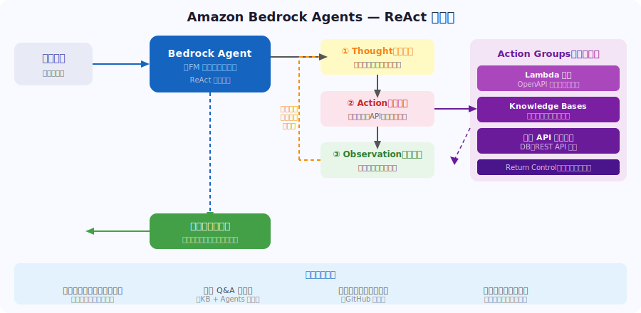

---

# FM カスタマイズ手法の比較

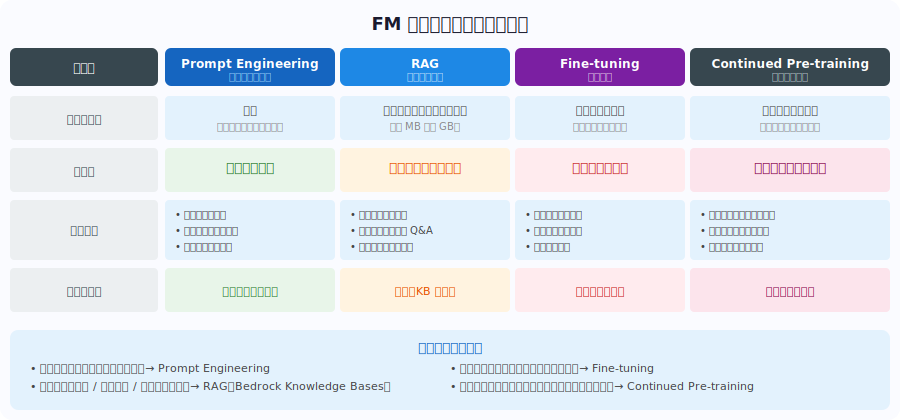

---

# Fine-tuning と Continued Pre-training

> *Fine-tuningは特定タスク精度向上、Continued Pre-trainingはドメイン特化、カタストロフィック忘却に注意*

- <svg viewBox="0 0 800 400" style="max-height:70vh;max-width:100%;display:block;margin:0 auto;" xmlns="http://www.w3.org/2000/svg">
<rect x="0" y="0" width="800" height="380" fill="#1a1a2e" rx="0"/>
<text x="400" y="32" font-family="sans-serif" font-size="20" fill="#f9a825" text-anchor="middle" font-weight="bold">Domain 3 — 重要ポイントまとめ</text>

<rect x="60" y="65" width="680" height="48" fill="#16213e" rx="8"/>
<rect x="60" y="65" width="6" height="48" fill="#e91e63" rx="3"/>
<text x="110" y="85" font-family="sans-serif" font-size="14" fill="#e91e63" text-anchor="start" font-weight="bold">Bedrock機能</text>
<text x="110" y="103" font-family="sans-serif" font-size="12" fill="#ffffff" text-anchor="start" font-weight="normal">KB・Agents・Guardrails・Fine-tuningの全体像</text>

<rect x="60" y="121" width="680" height="48" fill="#16213e" rx="8"/>
<rect x="60" y="121" width="6" height="48" fill="#0d7377" rx="3"/>
<text x="110" y="141" font-family="sans-serif" font-size="14" fill="#0d7377" text-anchor="start" font-weight="bold">RAGフロー</text>
<text x="110" y="159" font-family="sans-serif" font-size="12" fill="#ffffff" text-anchor="start" font-weight="normal">クエリ→エンベディング→検索→コンテキスト付与→生成</text>

<rect x="60" y="177" width="680" height="48" fill="#16213e" rx="8"/>
<rect x="60" y="177" width="6" height="48" fill="#6b2d8b" rx="3"/>
<text x="110" y="197" font-family="sans-serif" font-size="14" fill="#6b2d8b" text-anchor="start" font-weight="bold">カスタマイズ比較</text>
<text x="110" y="215" font-family="sans-serif" font-size="12" fill="#ffffff" text-anchor="start" font-weight="normal">Prompt < RAG < Fine-tuning < Pre-training（コスト順）</text>

<rect x="60" y="233" width="680" height="48" fill="#16213e" rx="8"/>
<rect x="60" y="233" width="6" height="48" fill="#1a6b3c" rx="3"/>
<text x="110" y="253" font-family="sans-serif" font-size="14" fill="#1a6b3c" text-anchor="start" font-weight="bold">ベクトルDB選択</text>
<text x="110" y="271" font-family="sans-serif" font-size="12" fill="#ffffff" text-anchor="start" font-weight="normal">OpenSearch / Aurora pgvectorと類似度計算手法</text>

<rect x="60" y="289" width="680" height="48" fill="#16213e" rx="8"/>
<rect x="60" y="289" width="6" height="48" fill="#b45309" rx="3"/>
<text x="110" y="309" font-family="sans-serif" font-size="14" fill="#b45309" text-anchor="start" font-weight="bold">Agents仕組み</text>
<text x="110" y="327" font-family="sans-serif" font-size="12" fill="#ffffff" text-anchor="start" font-weight="normal">Action Groups・ReAct・Return Control・KB連携</text>

</svg>
- **Fine-tuning（追加学習）**: 事前学習済み FM に特定タスクのデータ（入力/出力ペア）で追加学習
- **Fine-tuning のメリット**: 特定タスクの精度向上 / 応答スタイルの固定 / 推論速度改善
- **Fine-tuning の注意**: カタストロフィック忘却（以前の能力低下）/ 大量の高品質データが必要
- **Continued Pre-training**: 特定ドメインの大量テキストで Base Model を継続学習（医療・法律・言語等）
- **Bedrock での実装**: コンソール / API でファインチューニングジョブを実行（Titan・Llama 対応）
- **Provisioned Throughput**: Fine-tuned モデルを専用スループットでデプロイ（低レイテンシー保証）

---

# Bedrock Model Evaluation

> *ROUGE/BERTScoreで自動評価、A/BテストでFine-tuning前後を比較、CloudWatch統合でリアルタイム監視*

- **自動評価（Automatic Evaluation）**: 定義済みデータセットでモデルを自動採点
- **人手評価（Human Evaluation）**: AWS Managed Team または プライベートチームが回答を採点
- **評価指標（テキスト生成）**: ROUGE（要約）/ BERTScore（意味的類似度）/ カスタム指標
- **A/B テスト形式**: 複数モデルを並列比較し、最適モデルを選択
- **用途**: ベースモデル選択 / Fine-tuning 前後の比較 / プロンプト改善の効果測定
- **CloudWatch 統合**: Bedrock API のレイテンシー・スループット・エラー率をリアルタイム監視

---

# Domain 3 — 試験対策チェックリスト

> *RAG処理フロー・Bedrock Agents仕組み・Fine-tuningとContinued Pre-trainingの違いがDomain 3の核心*

- <svg viewBox="0 0 800 400" style="max-height:70vh;max-width:100%;display:block;margin:0 auto;" xmlns="http://www.w3.org/2000/svg">
<rect x="0" y="0" width="800" height="380" fill="#1a1a2e" rx="0"/>
<text x="400" y="32" font-family="sans-serif" font-size="21" fill="#f9a825" text-anchor="middle" font-weight="bold">責任あるAI — 6つの原則</text>

<rect x="20" y="70" width="240" height="115" fill="#16213e" rx="8"/>
<rect x="20" y="70" width="240" height="7" fill="#e91e63" rx="4"/>
<text x="140" y="105" font-family="sans-serif" font-size="14" fill="#e91e63" text-anchor="middle" font-weight="bold">公平性</text><text x="140" y="125" font-family="sans-serif" font-size="11" fill="#b0b8d0" text-anchor="middle" font-weight="normal">Fairness</text>
<text x="140" y="153" font-family="sans-serif" font-size="11" fill="#ffffff" text-anchor="middle" font-weight="normal">全ユーザーへの公平な結果</text><text x="140" y="171" font-family="sans-serif" font-size="11" fill="#ffffff" text-anchor="middle" font-weight="normal">差別・偏見の防止</text>

<rect x="275" y="70" width="240" height="115" fill="#16213e" rx="8"/>
<rect x="275" y="70" width="240" height="7" fill="#0d7377" rx="4"/>
<text x="395" y="105" font-family="sans-serif" font-size="14" fill="#0d7377" text-anchor="middle" font-weight="bold">説明可能性</text><text x="395" y="125" font-family="sans-serif" font-size="11" fill="#b0b8d0" text-anchor="middle" font-weight="normal">Explainability</text>
<text x="395" y="153" font-family="sans-serif" font-size="11" fill="#ffffff" text-anchor="middle" font-weight="normal">予測根拠を人間が理解</text><text x="395" y="171" font-family="sans-serif" font-size="11" fill="#ffffff" text-anchor="middle" font-weight="normal">ブラックボックス解消</text>

<rect x="530" y="70" width="240" height="115" fill="#16213e" rx="8"/>
<rect x="530" y="70" width="240" height="7" fill="#6b2d8b" rx="4"/>
<text x="650" y="105" font-family="sans-serif" font-size="14" fill="#6b2d8b" text-anchor="middle" font-weight="bold">プライバシー</text><text x="650" y="125" font-family="sans-serif" font-size="11" fill="#b0b8d0" text-anchor="middle" font-weight="normal">Privacy & Security</text>
<text x="650" y="153" font-family="sans-serif" font-size="11" fill="#ffffff" text-anchor="middle" font-weight="normal">個人データ保護・最小化</text><text x="650" y="171" font-family="sans-serif" font-size="11" fill="#ffffff" text-anchor="middle" font-weight="normal">GDPR準拠</text>

<rect x="20" y="205" width="240" height="115" fill="#16213e" rx="8"/>
<rect x="20" y="205" width="240" height="7" fill="#1a6b3c" rx="4"/>
<text x="140" y="240" font-family="sans-serif" font-size="14" fill="#1a6b3c" text-anchor="middle" font-weight="bold">安全性</text><text x="140" y="260" font-family="sans-serif" font-size="11" fill="#b0b8d0" text-anchor="middle" font-weight="normal">Safety</text>
<text x="140" y="288" font-family="sans-serif" font-size="11" fill="#ffffff" text-anchor="middle" font-weight="normal">有害コンテンツ防止</text><text x="140" y="306" font-family="sans-serif" font-size="11" fill="#ffffff" text-anchor="middle" font-weight="normal">Guardrails活用</text>

<rect x="275" y="205" width="240" height="115" fill="#16213e" rx="8"/>
<rect x="275" y="205" width="240" height="7" fill="#b45309" rx="4"/>
<text x="395" y="240" font-family="sans-serif" font-size="14" fill="#b45309" text-anchor="middle" font-weight="bold">制御可能性</text><text x="395" y="260" font-family="sans-serif" font-size="11" fill="#b0b8d0" text-anchor="middle" font-weight="normal">Controllability</text>
<text x="395" y="288" font-family="sans-serif" font-size="11" fill="#ffffff" text-anchor="middle" font-weight="normal">人間が監視・制御・修正</text><text x="395" y="306" font-family="sans-serif" font-size="11" fill="#ffffff" text-anchor="middle" font-weight="normal">HITLの組み込み</text>

<rect x="530" y="205" width="240" height="115" fill="#16213e" rx="8"/>
<rect x="530" y="205" width="240" height="7" fill="#f9a825" rx="4"/>
<text x="650" y="240" font-family="sans-serif" font-size="14" fill="#f9a825" text-anchor="middle" font-weight="bold">正確性</text><text x="650" y="260" font-family="sans-serif" font-size="11" fill="#b0b8d0" text-anchor="middle" font-weight="normal">Veracity</text>
<text x="650" y="288" font-family="sans-serif" font-size="11" fill="#ffffff" text-anchor="middle" font-weight="normal">ハルシネーション最小化</text><text x="650" y="306" font-family="sans-serif" font-size="11" fill="#ffffff" text-anchor="middle" font-weight="normal">RAG・Grounding</text>

</svg>
- ✅ Amazon Bedrock の主要機能（Knowledge Bases・Agents・Guardrails・Fine-tuning）を理解
- ✅ RAG の処理フローを図で説明できる（クエリ→エンベディング→検索→コンテキスト付与→生成）
- ✅ Prompt Engineering / RAG / Fine-tuning / Pre-training の使い分け基準を把握
- ✅ ベクトル DB の選択肢（OpenSearch / Aurora pgvector）と類似度計算手法を理解
- ✅ Bedrock Agents の仕組み（Action Groups・ReAct・Return Control・KB 連携）を説明できる
- ✅ Fine-tuning と Continued Pre-training の違いと適用場面を理解

---

<!-- _class: lead -->
# Domain 4: 責任ある AI

- 出題比率 14% | AI 倫理・バイアス・公平性・透明性・説明可能性のガイドラインを理解する

---

# 責任ある AI の原則

> *公平性・説明可能性・プライバシー・安全性・制御可能性・正確性の6原則がAWS責任あるAIの基盤*

- <svg viewBox="0 0 800 400" style="max-height:70vh;max-width:100%;display:block;margin:0 auto;" xmlns="http://www.w3.org/2000/svg">
<rect x="0" y="0" width="800" height="380" fill="#1a1a2e" rx="0"/>
<text x="400" y="32" font-family="sans-serif" font-size="20" fill="#f9a825" text-anchor="middle" font-weight="bold">説明可能AI（XAI）— 手法比較</text>

<rect x="30" y="75" width="230" height="250" fill="#16213e" rx="8"/>
<rect x="30" y="75" width="230" height="7" fill="#e91e63" rx="4"/>
<text x="145" y="110" font-family="sans-serif" font-size="18" fill="#e91e63" text-anchor="middle" font-weight="bold">SHAP</text>
<text x="145" y="132" font-family="sans-serif" font-size="11" fill="#b0b8d0" text-anchor="middle" font-weight="normal">SHapley Additive Explanations</text>
<text x="145" y="187" font-family="sans-serif" font-size="11" fill="#ffffff" text-anchor="middle" font-weight="normal">ゲーム理論ベース</text><text x="145" y="207" font-family="sans-serif" font-size="11" fill="#ffffff" text-anchor="middle" font-weight="normal">全特徴量の貢献を公平配分</text><text x="145" y="227" font-family="sans-serif" font-size="11" fill="#ffffff" text-anchor="middle" font-weight="normal">SageMaker Clarifyが採用</text>

<rect x="285" y="75" width="230" height="250" fill="#16213e" rx="8"/>
<rect x="285" y="75" width="230" height="7" fill="#0d7377" rx="4"/>
<text x="400" y="110" font-family="sans-serif" font-size="18" fill="#0d7377" text-anchor="middle" font-weight="bold">LIME</text>
<text x="400" y="132" font-family="sans-serif" font-size="11" fill="#b0b8d0" text-anchor="middle" font-weight="normal">Local Interpretable</text><text x="400" y="149" font-family="sans-serif" font-size="11" fill="#b0b8d0" text-anchor="middle" font-weight="normal">Model-agnostic Explanations</text>
<text x="400" y="187" font-family="sans-serif" font-size="11" fill="#ffffff" text-anchor="middle" font-weight="normal">局所線形モデルで近似</text><text x="400" y="207" font-family="sans-serif" font-size="11" fill="#ffffff" text-anchor="middle" font-weight="normal">個別予測の説明</text><text x="400" y="227" font-family="sans-serif" font-size="11" fill="#ffffff" text-anchor="middle" font-weight="normal">Clarifyでは非対応</text>

<rect x="540" y="75" width="230" height="250" fill="#16213e" rx="8"/>
<rect x="540" y="75" width="230" height="7" fill="#6b2d8b" rx="4"/>
<text x="655" y="110" font-family="sans-serif" font-size="18" fill="#6b2d8b" text-anchor="middle" font-weight="bold">Feature Importance</text>
<text x="655" y="132" font-family="sans-serif" font-size="11" fill="#b0b8d0" text-anchor="middle" font-weight="normal">特徴量重要度ランキング</text><text x="655" y="149" font-family="sans-serif" font-size="11" fill="#b0b8d0" text-anchor="middle" font-weight="normal">(グローバル解釈)</text>
<text x="655" y="187" font-family="sans-serif" font-size="11" fill="#ffffff" text-anchor="middle" font-weight="normal">ランダムフォレスト等</text><text x="655" y="207" font-family="sans-serif" font-size="11" fill="#ffffff" text-anchor="middle" font-weight="normal">モデル全体の傾向</text><text x="655" y="227" font-family="sans-serif" font-size="11" fill="#ffffff" text-anchor="middle" font-weight="normal">快速・シンプル</text>

<text x="400" y="365" font-family="sans-serif" font-size="13" fill="#e91e63" text-anchor="middle" font-weight="bold">試験ポイント: LIME は Clarify でサポートされていない！</text>
</svg>
- **Fairness（公平性）**: すべてのユーザーに対して公平な結果を提供。特定グループへの差別・偏見を防止
- **Explainability（説明可能性）**: モデルの予測根拠を人間が理解できる形で提示（ブラックボックス問題の解消）
- **Privacy & Security（プライバシー）**: 個人データの保護・最小化・安全な取り扱い（GDPR 準拠）
- **Safety（安全性）**: 有害なコンテンツの生成・意図しない悪用を防止（Guardrails）
- **Controllability（制御可能性）**: 人間が AI の動作を監視・制御・修正できる仕組み（HITL）
- **Veracity（正確性）**: 正確な情報を提供し、ハルシネーションを最小化（RAG・Grounding）

---

# 責任ある AI — 原則の全体像

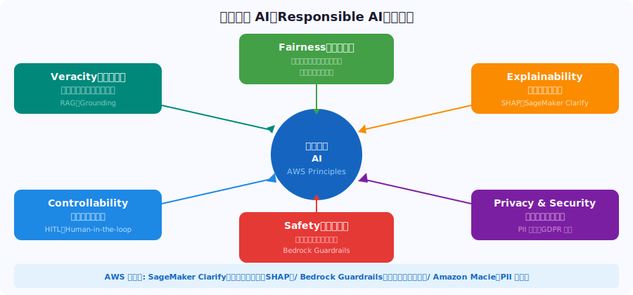

---

# AI バイアスの種類と対策

> *学習データ・選択・測定・確認バイアスの4種類、SageMaker Clarifyでバイアス測定が必須対策*

- <svg viewBox="0 0 800 400" style="max-height:70vh;max-width:100%;display:block;margin:0 auto;" xmlns="http://www.w3.org/2000/svg">
<rect x="0" y="0" width="800" height="380" fill="#1a1a2e" rx="0"/>
<text x="400" y="32" font-family="sans-serif" font-size="20" fill="#f9a825" text-anchor="middle" font-weight="bold">ヒューマンインザループ (HITL) 設計</text>
<rect x="50" y="70" width="700" height="100" fill="#16213e" rx="8"/>
<text x="400" y="110" font-family="sans-serif" font-size="15" fill="#b0b8d0" text-anchor="middle" font-weight="bold">AIの判断フロー</text>
<rect x="100" y="200" width="130" height="80" fill="#1e3a5f" rx="8"/>
<text x="165" y="240" font-family="sans-serif" font-size="13" fill="#ffffff" text-anchor="middle" font-weight="normal">AIによる予測</text>
<rect x="310" y="200" width="130" height="80" fill="#1e3a5f" rx="8"/>
<text x="375" y="232" font-family="sans-serif" font-size="13" fill="#ffffff" text-anchor="middle" font-weight="normal">信頼スコア</text>
<text x="375" y="252" font-family="sans-serif" font-size="13" fill="#ffffff" text-anchor="middle" font-weight="normal">の評価</text>
<rect x="520" y="160" width="180" height="60" fill="#16213e" rx="8"/>
<rect x="520" y="160" width="180" height="5" fill="#1a6b3c" rx="3"/>
<text x="610" y="190" font-family="sans-serif" font-size="12" fill="#ffffff" text-anchor="middle" font-weight="normal">高信頼度→自動承認</text>
<rect x="520" y="240" width="180" height="60" fill="#16213e" rx="8"/>
<rect x="520" y="240" width="180" height="5" fill="#e91e63" rx="3"/>
<text x="610" y="270" font-family="sans-serif" font-size="12" fill="#ffffff" text-anchor="middle" font-weight="normal">低信頼度→人間レビュー</text>
<line x1="230" y1="240" x2="300" y2="240" stroke="#f9a825" stroke-width="2"/><polygon points="310,240 300,245 300,235" fill="#f9a825"/>
<line x1="440" y1="220" x2="510.29857499854666" y2="202.42535625036334" stroke="#f9a825" stroke-width="2"/><polygon points="520,200 511.5112531237283,207.27606875109 509.085896873365,197.57464374963666" fill="#f9a825"/>
<line x1="440" y1="260" x2="510" y2="260" stroke="#f9a825" stroke-width="2"/><polygon points="520,260 510,265 510,255" fill="#f9a825"/>
<text x="400" y="348" font-family="sans-serif" font-size="12" fill="#b0b8d0" text-anchor="middle" font-weight="normal">AWS実装: Amazon A2I / SageMaker Ground Truth Plus / Bedrock Return Control</text>
</svg>
- **学習データバイアス**: 過去の差別的データを学習したモデルが同様の偏りを再現（採用スクリーニング等）
- **選択バイアス（サンプリングバイアス）**: 特定グループが過小/過剰代表されたデータセットでの学習
- **測定バイアス**: 特定グループのデータ品質・精度が他のグループと異なる（顔認識での人種差）
- **確認バイアス**: モデルが既存の前提・ステレオタイプを強化する方向に学習
- **対策①（データ）**: データ拡張・再重み付け・バランス調整・多様なデータ収集
- **対策②（モデル）**: SageMaker Clarify でバイアス測定・Fairness Indicators でモニタリング

---

# 説明可能 AI（XAI）と透明性

> *SHAPが標準手法でフィーチャー貢献度を数値化、SageMaker Clarifyで自動SHAP値算出とモデルカード生成*

- <svg viewBox="0 0 800 400" style="max-height:70vh;max-width:100%;display:block;margin:0 auto;" xmlns="http://www.w3.org/2000/svg">
<rect x="0" y="0" width="800" height="380" fill="#1a1a2e" rx="0"/>
<text x="400" y="32" font-family="sans-serif" font-size="20" fill="#f9a825" text-anchor="middle" font-weight="bold">Domain 4 — 重要ポイントまとめ</text>

<rect x="60" y="65" width="680" height="48" fill="#16213e" rx="8"/>
<rect x="60" y="65" width="6" height="48" fill="#e91e63" rx="3"/>
<text x="110" y="85" font-family="sans-serif" font-size="14" fill="#e91e63" text-anchor="start" font-weight="bold">責任あるAI6原則</text>
<text x="110" y="103" font-family="sans-serif" font-size="12" fill="#ffffff" text-anchor="start" font-weight="normal">公平性・説明可能性・プライバシー・安全性・制御・正確性</text>

<rect x="60" y="121" width="680" height="48" fill="#16213e" rx="8"/>
<rect x="60" y="121" width="6" height="48" fill="#0d7377" rx="3"/>
<text x="110" y="141" font-family="sans-serif" font-size="14" fill="#0d7377" text-anchor="start" font-weight="bold">バイアスの種類</text>
<text x="110" y="159" font-family="sans-serif" font-size="12" fill="#ffffff" text-anchor="start" font-weight="normal">学習データ/選択/測定/確認バイアスと対策</text>

<rect x="60" y="177" width="680" height="48" fill="#16213e" rx="8"/>
<rect x="60" y="177" width="6" height="48" fill="#6b2d8b" rx="3"/>
<text x="110" y="197" font-family="sans-serif" font-size="14" fill="#6b2d8b" text-anchor="start" font-weight="bold">Clarifyの機能</text>
<text x="110" y="215" font-family="sans-serif" font-size="12" fill="#ffffff" text-anchor="start" font-weight="normal">バイアス検出（事前・事後）とSHAP値の提供</text>

<rect x="60" y="233" width="680" height="48" fill="#16213e" rx="8"/>
<rect x="60" y="233" width="6" height="48" fill="#1a6b3c" rx="3"/>
<text x="110" y="253" font-family="sans-serif" font-size="14" fill="#1a6b3c" text-anchor="start" font-weight="bold">HITL実装</text>
<text x="110" y="271" font-family="sans-serif" font-size="12" fill="#ffffff" text-anchor="start" font-weight="normal">A2I・Ground Truth Plus・Bedrock Return Control</text>

<rect x="60" y="289" width="680" height="48" fill="#16213e" rx="8"/>
<rect x="60" y="289" width="6" height="48" fill="#b45309" rx="3"/>
<text x="110" y="309" font-family="sans-serif" font-size="14" fill="#b45309" text-anchor="start" font-weight="bold">XAI手法の違い</text>
<text x="110" y="327" font-family="sans-serif" font-size="12" fill="#ffffff" text-anchor="start" font-weight="normal">SHAP（Clarify採用）・LIME（非対応）・Feature Importance</text>

</svg>
- **XAI（Explainable AI）の必要性**: 医療・金融・採用など高リスク判断での説明責任・規制準拠
- **SHAP（SHapley Additive exPlanations）**: 各特徴量が予測結果に与える影響量を数値化（標準手法）
- **LIME（Local Interpretable Model-agnostic Explanations）**: 個別の予測に対して局所的な線形モデルで近似説明
- **Feature Importance**: ランダムフォレスト等での特徴量重要度ランキング（グローバル解釈）
- **モデルカード**: モデルの目的・学習データ・性能・制限事項を文書化（倫理審査用）
- **AWS 実装**: SageMaker Clarify（SHAP 値計算）/ SageMaker Model Cards

---

# Amazon SageMaker Clarify

> *学習前/後のバイアス検出とSHAP値可視化、Model Monitorと組み合わせてリアルタイムバイアスモニタリング*

- **目的**: ML モデルのバイアス検出とモデル説明性（SHAP）を提供する SageMaker の機能
- **バイアス検出①（学習前）**: データセット内のバイアス指標を計算（Class Imbalance・DPL など）
- **バイアス検出②（学習後）**: モデル予測のバイアス指標（Equal Opportunity・Demographic Parity）を算出
- **SHAP 値の提供**: 各特徴量が個別の予測に与えた影響を可視化（フィーチャー貢献度）
- **Clarify レポート**: SageMaker Studio 上でバイアス・説明性レポートを自動生成
- **継続監視**: SageMaker Model Monitor と組み合わせてリアルタイムバイアスモニタリングが可能

---

# ヒューマンインザループ（HITL）

> *医療・融資・採用などの高リスク判断にA2I・Ground Truth Plus・Return Controlで人間確認を組み込む*

- <svg viewBox="0 0 800 400" style="max-height:70vh;max-width:100%;display:block;margin:0 auto;" xmlns="http://www.w3.org/2000/svg">
<rect x="0" y="0" width="800" height="380" fill="#1a1a2e" rx="0"/>
<text x="400" y="32" font-family="sans-serif" font-size="21" fill="#f9a825" text-anchor="middle" font-weight="bold">Bedrock セキュリティ設計</text>

<rect x="60" y="65" width="680" height="46" fill="#16213e" rx="8"/>
<circle cx="95" cy="88" r="16" fill="#e91e63"/>
<text x="95" y="94" font-family="sans-serif" font-size="14" fill="#ffffff" text-anchor="middle" font-weight="bold">1</text>
<text x="130" y="84" font-family="sans-serif" font-size="14" fill="#e91e63" text-anchor="start" font-weight="bold">IAM最小権限</text>
<text x="130" y="103" font-family="sans-serif" font-size="12" fill="#ffffff" text-anchor="start" font-weight="normal">bedrock:InvokeModel等アクション単位で権限設定</text>

<rect x="60" y="119" width="680" height="46" fill="#16213e" rx="8"/>
<circle cx="95" cy="142" r="16" fill="#0d7377"/>
<text x="95" y="148" font-family="sans-serif" font-size="14" fill="#ffffff" text-anchor="middle" font-weight="bold">2</text>
<text x="130" y="138" font-family="sans-serif" font-size="14" fill="#0d7377" text-anchor="start" font-weight="bold">VPC PrivateLink</text>
<text x="130" y="157" font-family="sans-serif" font-size="12" fill="#ffffff" text-anchor="start" font-weight="normal">パブリックインターネットを介さずBedrock APIを処理</text>

<rect x="60" y="173" width="680" height="46" fill="#16213e" rx="8"/>
<circle cx="95" cy="196" r="16" fill="#6b2d8b"/>
<text x="95" y="202" font-family="sans-serif" font-size="14" fill="#ffffff" text-anchor="middle" font-weight="bold">3</text>
<text x="130" y="192" font-family="sans-serif" font-size="14" fill="#6b2d8b" text-anchor="start" font-weight="bold">AWS KMS暗号化</text>
<text x="130" y="211" font-family="sans-serif" font-size="12" fill="#ffffff" text-anchor="start" font-weight="normal">S3学習データ・モデル・Knowledge Basesコンテンツを暗号化</text>

<rect x="60" y="227" width="680" height="46" fill="#16213e" rx="8"/>
<circle cx="95" cy="250" r="16" fill="#1a6b3c"/>
<text x="95" y="256" font-family="sans-serif" font-size="14" fill="#ffffff" text-anchor="middle" font-weight="bold">4</text>
<text x="130" y="246" font-family="sans-serif" font-size="14" fill="#1a6b3c" text-anchor="start" font-weight="bold">CloudTrail監査</text>
<text x="130" y="265" font-family="sans-serif" font-size="12" fill="#ffffff" text-anchor="start" font-weight="normal">全Bedrock/SageMaker APIコールを完全記録・監査</text>

<rect x="60" y="281" width="680" height="46" fill="#16213e" rx="8"/>
<circle cx="95" cy="304" r="16" fill="#b45309"/>
<text x="95" y="310" font-family="sans-serif" font-size="14" fill="#ffffff" text-anchor="middle" font-weight="bold">5</text>
<text x="130" y="300" font-family="sans-serif" font-size="14" fill="#b45309" text-anchor="start" font-weight="bold">Amazon Macie</text>
<text x="130" y="319" font-family="sans-serif" font-size="12" fill="#ffffff" text-anchor="start" font-weight="normal">S3の学習データ・ドキュメントのPIIを自動検出・通知</text>

</svg>
- **HITL の定義**: AI の判断に人間が介入するレビュー・承認・修正プロセスを組み込む設計
- **必要な場面**: 高リスクな判断（医療診断・融資審査・採用）/ 低信頼スコアの出力 / 法的責任が問われる場合
- **AWS SageMaker Ground Truth Plus**: ヒューマンレビューワークフローを簡単に組み込めるサービス
- **Amazon Augmented AI（A2I）**: ML モデルの出力に人間のレビューを追加するマネージドサービス
- **Bedrock Agents Return Control**: エージェントが特定アクション前に人間の確認を要求する機能
- **設計原則**: どのケースを自動化し、どのケースで人間が介入するかの明確な閾値設定が重要

---

# Domain 4 — 試験対策チェックリスト

> *責任あるAI6原則・Clarify（バイアス検出・SHAP）・HITL実装がDomain 4の全問題を包含*

- <svg viewBox="0 0 800 400" style="max-height:70vh;max-width:100%;display:block;margin:0 auto;" xmlns="http://www.w3.org/2000/svg">
<rect x="0" y="0" width="800" height="400" fill="#1a1a2e" rx="0"/>
<text x="400" y="32" font-family="sans-serif" font-size="20" fill="#f9a825" text-anchor="middle" font-weight="bold">Bedrock Guardrails — 4つの主要機能</text>

<rect x="20" y="75" width="370" height="130" fill="#16213e" rx="8"/>
<rect x="20" y="75" width="370" height="7" fill="#e91e63" rx="4"/>
<text x="205" y="110" font-family="sans-serif" font-size="16" fill="#e91e63" text-anchor="middle" font-weight="bold">コンテンツフィルタ</text>
<text x="205" y="135" font-family="sans-serif" font-size="12" fill="#ffffff" text-anchor="middle" font-weight="normal">暴力/性的/ヘイト/侮辱</text><text x="205" y="157" font-family="sans-serif" font-size="12" fill="#ffffff" text-anchor="middle" font-weight="normal">None/Low/Medium/High</text>

<rect x="410" y="75" width="370" height="130" fill="#16213e" rx="8"/>
<rect x="410" y="75" width="370" height="7" fill="#0d7377" rx="4"/>
<text x="595" y="110" font-family="sans-serif" font-size="16" fill="#0d7377" text-anchor="middle" font-weight="bold">トピックの拒否</text>
<text x="595" y="135" font-family="sans-serif" font-size="12" fill="#ffffff" text-anchor="middle" font-weight="normal">競合製品・政治・法律など</text><text x="595" y="157" font-family="sans-serif" font-size="12" fill="#ffffff" text-anchor="middle" font-weight="normal">指定トピックへの回答を禁止</text>

<rect x="20" y="225" width="370" height="130" fill="#16213e" rx="8"/>
<rect x="20" y="225" width="370" height="7" fill="#6b2d8b" rx="4"/>
<text x="205" y="260" font-family="sans-serif" font-size="16" fill="#6b2d8b" text-anchor="middle" font-weight="bold">PII保護</text>
<text x="205" y="285" font-family="sans-serif" font-size="12" fill="#ffffff" text-anchor="middle" font-weight="normal">氏名/メール/電話等を自動検出</text><text x="205" y="307" font-family="sans-serif" font-size="12" fill="#ffffff" text-anchor="middle" font-weight="normal">BLOCKまたはANONYMIZE</text>

<rect x="410" y="225" width="370" height="130" fill="#16213e" rx="8"/>
<rect x="410" y="225" width="370" height="7" fill="#1a6b3c" rx="4"/>
<text x="595" y="260" font-family="sans-serif" font-size="16" fill="#1a6b3c" text-anchor="middle" font-weight="bold">Groundingチェック</text>
<text x="595" y="285" font-family="sans-serif" font-size="12" fill="#ffffff" text-anchor="middle" font-weight="normal">RAGの回答がソースに基づくか</text><text x="595" y="307" font-family="sans-serif" font-size="12" fill="#ffffff" text-anchor="middle" font-weight="normal">ハルシネーション検出・ブロック</text>

</svg>
- ✅ AWS の責任ある AI 6 原則（公平性・説明可能性・プライバシー・安全性・制御可能性・正確性）を説明できる
- ✅ バイアスの種類（学習データ/選択/測定/確認）と対策（データ拡張・Clarify・フェアネス指標）を理解
- ✅ SageMaker Clarify の機能（バイアス検出・SHAP 値）と使用場面を把握
- ✅ HITL（ヒューマンインザループ）の必要性と AWS 実装（A2I・Ground Truth Plus・Return Control）
- ✅ XAI の手法（SHAP・LIME・Feature Importance）の違いを理解
- ✅ モデルカードの目的（モデルの透明性・説明責任の文書化）を把握

---

<!-- _class: lead -->
# Domain 5: セキュリティ・コンプライアンス・ガバナンス

- 出題比率 14% | AI ワークロードのセキュリティ設計・データガバナンス・コンプライアンスを理解する

---

# AWS 共有責任モデル（AI ワークロード）

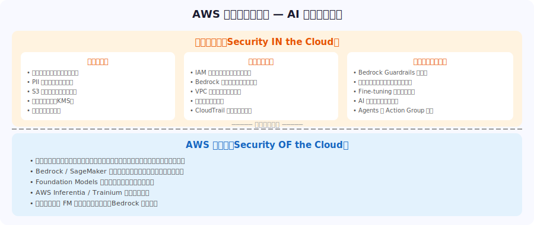

---

# Bedrock セキュリティ設計の基本

> *IAM最小権限+VPC PrivateLink+KMS暗号化+CloudTrailの4セットがBedrockセキュリティの基本*

- <svg viewBox="0 0 800 400" style="max-height:70vh;max-width:100%;display:block;margin:0 auto;" xmlns="http://www.w3.org/2000/svg">
<rect x="0" y="0" width="800" height="380" fill="#1a1a2e" rx="0"/>
<text x="400" y="32" font-family="sans-serif" font-size="20" fill="#f9a825" text-anchor="middle" font-weight="bold">IAM と最小権限設計 — Bedrock</text>
<rect x="30" y="70" width="730" height="60" fill="#16213e" rx="8"/>
<text x="400" y="92" font-family="sans-serif" font-size="14" fill="#b0b8d0" text-anchor="middle" font-weight="normal">最小権限の原則: 必要最低限の権限のみ付与。「*」ワイルドカードを避ける</text>
<text x="400" y="112" font-family="sans-serif" font-size="12" fill="#ffffff" text-anchor="middle" font-weight="normal">リソースポリシー: 特定のモデルARNにのみアクセスを許可（Cross-Account設定も可能）</text>

<rect x="30" y="150" width="740" height="40" fill="#16213e" rx="8"/>
<text x="310" y="168" font-family="sans-serif" font-size="13" fill="#f9a825" text-anchor="start" font-weight="normal">bedrock:InvokeModel</text>
<text x="520" y="168" font-family="sans-serif" font-size="12" fill="#ffffff" text-anchor="start" font-weight="normal">モデル呼び出し権限</text>
<text x="660" y="168" font-family="sans-serif" font-size="11" fill="#b0b8d0" text-anchor="start" font-weight="normal">基本的な推論処理</text>

<rect x="30" y="198" width="740" height="40" fill="#16213e" rx="8"/>
<text x="310" y="216" font-family="sans-serif" font-size="13" fill="#f9a825" text-anchor="start" font-weight="normal">bedrock:InvokeAgent</text>
<text x="520" y="216" font-family="sans-serif" font-size="12" fill="#ffffff" text-anchor="start" font-weight="normal">Agent実行権限</text>
<text x="660" y="216" font-family="sans-serif" font-size="11" fill="#b0b8d0" text-anchor="start" font-weight="normal">Agents機能の利用</text>

<rect x="30" y="246" width="740" height="40" fill="#16213e" rx="8"/>
<text x="310" y="264" font-family="sans-serif" font-size="13" fill="#f9a825" text-anchor="start" font-weight="normal">bedrock:CreateKnowledgeBase</text>
<text x="520" y="264" font-family="sans-serif" font-size="12" fill="#ffffff" text-anchor="start" font-weight="normal">KB作成権限</text>
<text x="660" y="264" font-family="sans-serif" font-size="11" fill="#b0b8d0" text-anchor="start" font-weight="normal">Knowledge Bases管理</text>

<rect x="30" y="294" width="740" height="40" fill="#16213e" rx="8"/>
<text x="310" y="312" font-family="sans-serif" font-size="13" fill="#f9a825" text-anchor="start" font-weight="normal">bedrock:RetrieveAndGenerate</text>
<text x="520" y="312" font-family="sans-serif" font-size="12" fill="#ffffff" text-anchor="start" font-weight="normal">RAG回答生成権限</text>
<text x="660" y="312" font-family="sans-serif" font-size="11" fill="#b0b8d0" text-anchor="start" font-weight="normal">KBからの検索・生成</text>

</svg>
- **IAM 最小権限**: `bedrock:InvokeModel` / `bedrock:InvokeAgent` など Bedrock アクション単位で権限設定
- **VPC エンドポイント（PrivateLink）**: Bedrock API コールをパブリックインターネットを介さずに処理
- **AWS KMS**: 学習データ（S3）・モデルアーティファクト・Knowledge Bases コンテンツを暗号化
- **CloudTrail**: Bedrock / SageMaker へのすべての API コールを完全記録・監査（誰が・いつ・何を呼んだか）
- **Amazon Macie**: S3 の学習データ・ドキュメントに含まれる PII（個人情報）を自動検出・通知
- **モデルデータ保護**: Bedrock は顧客のリクエスト/レスポンスデータをモデル学習に使用しない

---

# Amazon Bedrock Guardrails — 詳細

> *コンテンツフィルタ・トピック拒否・PII保護・Groundingの4機能でモデル入出力を完全制御*

- <svg viewBox="0 0 800 400" style="max-height:70vh;max-width:100%;display:block;margin:0 auto;" xmlns="http://www.w3.org/2000/svg">
<rect x="0" y="0" width="800" height="380" fill="#1a1a2e" rx="0"/>
<text x="400" y="32" font-family="sans-serif" font-size="20" fill="#f9a825" text-anchor="middle" font-weight="bold">Domain 5 — 重要ポイントまとめ</text>

<rect x="60" y="65" width="680" height="48" fill="#16213e" rx="8"/>
<rect x="60" y="65" width="6" height="48" fill="#e91e63" rx="3"/>
<text x="110" y="85" font-family="sans-serif" font-size="14" fill="#e91e63" text-anchor="start" font-weight="bold">Guardrails機能</text>
<text x="110" y="103" font-family="sans-serif" font-size="12" fill="#ffffff" text-anchor="start" font-weight="normal">コンテンツフィルタ・トピック拒否・PII保護・Grounding</text>

<rect x="60" y="121" width="680" height="48" fill="#16213e" rx="8"/>
<rect x="60" y="121" width="6" height="48" fill="#0d7377" rx="3"/>
<text x="110" y="141" font-family="sans-serif" font-size="14" fill="#0d7377" text-anchor="start" font-weight="bold">VPC PrivateLink</text>
<text x="110" y="159" font-family="sans-serif" font-size="12" fill="#ffffff" text-anchor="start" font-weight="normal">Bedrock閉域アクセス設計の理解</text>

<rect x="60" y="177" width="680" height="48" fill="#16213e" rx="8"/>
<rect x="60" y="177" width="6" height="48" fill="#6b2d8b" rx="3"/>
<text x="110" y="197" font-family="sans-serif" font-size="14" fill="#6b2d8b" text-anchor="start" font-weight="bold">共有責任モデル</text>
<text x="110" y="215" font-family="sans-serif" font-size="12" fill="#ffffff" text-anchor="start" font-weight="normal">AIワークロードの顧客/AWS責任境界</text>

<rect x="60" y="233" width="680" height="48" fill="#16213e" rx="8"/>
<rect x="60" y="233" width="6" height="48" fill="#1a6b3c" rx="3"/>
<text x="110" y="253" font-family="sans-serif" font-size="14" fill="#1a6b3c" text-anchor="start" font-weight="bold">IAM最小権限</text>
<text x="110" y="271" font-family="sans-serif" font-size="12" fill="#ffffff" text-anchor="start" font-weight="normal">アクション単位の権限制御（bedrock:InvokeModel等）</text>

<rect x="60" y="289" width="680" height="48" fill="#16213e" rx="8"/>
<rect x="60" y="289" width="6" height="48" fill="#b45309" rx="3"/>
<text x="110" y="309" font-family="sans-serif" font-size="14" fill="#b45309" text-anchor="start" font-weight="bold">CloudTrail監査</text>
<text x="110" y="327" font-family="sans-serif" font-size="12" fill="#ffffff" text-anchor="start" font-weight="normal">Bedrock API監査ログの有効化と活用方法</text>

</svg>
- **定義**: Bedrock の FM 入力・出力に対するコンテンツフィルタリング・ポリシー適用機能
- **コンテンツフィルタ**: 有害・暴力的・性的・ヘイトスピーチコンテンツを検出・ブロック（強度調整可：None/Low/Medium/High）
- **トピックの拒否**: 指定したトピック（競合製品・政治・法律相談）への回答を禁止
- **PII 保護**: 氏名・メール・電話番号・クレジットカード番号を自動検出→ BLOCK または ANONYMIZE
- **Grounding チェック**: RAG の回答がソースに基づいているか検証し、ハルシネーションを検出・ブロック
- **適用範囲**: 単体モデル呼び出し・Agents・Knowledge Bases すべてに同一ポリシーを適用可能

---

# Bedrock Guardrails — フィルタリングフロー

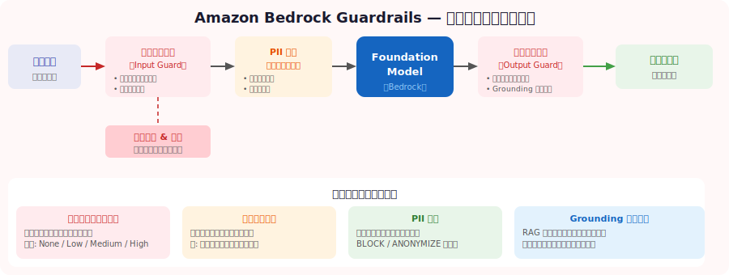

---

# AI データガバナンス

> *PII収集最小化・データリネージ・Feature Storeバージョニング・AWS Artifactでコンプライアンス自動化*

- **データ分類**: 機密レベルに応じた分類（Public / Internal / Confidential / Restricted）と保護措置
- **個人情報（PII）の取り扱い**: GDPR・個人情報保護法に準拠。収集最小化・目的外利用禁止・削除権対応
- **学習データの品質管理**: データリネージ（出所追跡）・バージョン管理・品質スコアの記録
- **SageMaker Feature Store**: 特徴量のオンライン/オフライン統合管理。特徴量ストアのバージョニング
- **AWS Artifact**: SOC 2・ISO 27001・HIPAA などコンプライアンスレポートをオンデマンドで取得
- **データ削除・保持ポリシー**: S3 ライフサイクルポリシーで学習データの保持期間を自動管理

---

# IAM と最小権限設計

> *InvokeModelアクション単位で権限設定、Organizations SCPでリージョン・モデルを組織全体で制限*

- **最小権限の原則**: 必要最低限の権限のみを付与。`*` ワイルドカードを避ける
- **Bedrock の IAM アクション粒度**: `bedrock:InvokeModel`（モデル呼び出し）/ `bedrock:CreateKnowledgeBase`（KB 作成）/ `bedrock:InvokeAgent`（Agent 実行）
- **リソースポリシー**: 特定のモデル ARN にのみアクセスを許可（Cross-Account も設定可能）
- **サービスロール**: Bedrock Agents / Knowledge Bases が S3・Lambda・OpenSearch にアクセスするための専用 IAM ロール
- **AWS Organizations SCP**: 組織単位で Bedrock 利用リージョン・モデルを制限
- **CloudTrail + Config**: 権限の誰が使ったかの監査 + IAM ポリシー変更の検出・アラート

---

# Domain 5 — 試験対策チェックリスト

> *Guardrails4機能・VPC PrivateLink・IAM最小権限・CloudTrail監査ログがDomain 5の試験範囲*

- <svg viewBox="0 0 800 400" style="max-height:70vh;max-width:100%;display:block;margin:0 auto;" xmlns="http://www.w3.org/2000/svg">
<rect x="0" y="0" width="800" height="400" fill="#1a1a2e" rx="0"/>
<text x="400" y="32" font-family="sans-serif" font-size="21" fill="#f9a825" text-anchor="middle" font-weight="bold">試験合格への最重要ポイント</text>

<rect x="20" y="65" width="160" height="260" fill="#16213e" rx="8"/>
<rect x="20" y="65" width="160" height="8" fill="#555" rx="4"/>
<text x="100" y="98" font-family="sans-serif" font-size="14" fill="#ffffff" text-anchor="middle" font-weight="bold">Domain 1</text><text x="100" y="120" font-family="sans-serif" font-size="14" fill="#ffffff" text-anchor="middle" font-weight="bold">(20%)</text>
<text x="100" y="158" font-family="sans-serif" font-size="11" fill="#ffffff" text-anchor="middle" font-weight="normal">MLの種類・F1/AUC-ROC</text><text x="100" y="180" font-family="sans-serif" font-size="11" fill="#ffffff" text-anchor="middle" font-weight="normal">SageMakerコンポーネント</text>

<rect x="140" y="65" width="160" height="260" fill="#16213e" rx="8"/>
<rect x="140" y="65" width="160" height="8" fill="#555" rx="4"/>
<text x="220" y="98" font-family="sans-serif" font-size="14" fill="#ffffff" text-anchor="middle" font-weight="bold">Domain 2</text><text x="220" y="120" font-family="sans-serif" font-size="14" fill="#ffffff" text-anchor="middle" font-weight="bold">(24%)</text>
<text x="220" y="158" font-family="sans-serif" font-size="11" fill="#ffffff" text-anchor="middle" font-weight="normal">FMの仕組み・プロンプト技法</text><text x="220" y="180" font-family="sans-serif" font-size="11" fill="#ffffff" text-anchor="middle" font-weight="normal">ハルシネーション対策</text>

<rect x="260" y="65" width="160" height="260" fill="#16213e" rx="8"/>
<rect x="260" y="65" width="160" height="8" fill="#e91e63" rx="4"/>
<text x="340" y="98" font-family="sans-serif" font-size="14" fill="#f9a825" text-anchor="middle" font-weight="bold">Domain 3</text><text x="340" y="120" font-family="sans-serif" font-size="14" fill="#f9a825" text-anchor="middle" font-weight="bold">(28%)★</text>
<text x="340" y="158" font-family="sans-serif" font-size="11" fill="#ffffff" text-anchor="middle" font-weight="normal">Bedrock全機能</text><text x="340" y="180" font-family="sans-serif" font-size="11" fill="#ffffff" text-anchor="middle" font-weight="normal">RAGの詳細フロー必須</text>

<rect x="380" y="65" width="160" height="260" fill="#16213e" rx="8"/>
<rect x="380" y="65" width="160" height="8" fill="#555" rx="4"/>
<text x="460" y="98" font-family="sans-serif" font-size="14" fill="#ffffff" text-anchor="middle" font-weight="bold">Domain 4</text><text x="460" y="120" font-family="sans-serif" font-size="14" fill="#ffffff" text-anchor="middle" font-weight="bold">(14%)</text>
<text x="460" y="158" font-family="sans-serif" font-size="11" fill="#ffffff" text-anchor="middle" font-weight="normal">責任あるAI6原則</text><text x="460" y="180" font-family="sans-serif" font-size="11" fill="#ffffff" text-anchor="middle" font-weight="normal">Clarify・HITL</text>

<rect x="500" y="65" width="160" height="260" fill="#16213e" rx="8"/>
<rect x="500" y="65" width="160" height="8" fill="#555" rx="4"/>
<text x="580" y="98" font-family="sans-serif" font-size="14" fill="#ffffff" text-anchor="middle" font-weight="bold">Domain 5</text><text x="580" y="120" font-family="sans-serif" font-size="14" fill="#ffffff" text-anchor="middle" font-weight="bold">(14%)</text>
<text x="580" y="158" font-family="sans-serif" font-size="11" fill="#ffffff" text-anchor="middle" font-weight="normal">セキュリティ設計</text><text x="580" y="180" font-family="sans-serif" font-size="11" fill="#ffffff" text-anchor="middle" font-weight="normal">Guardrails・共有責任</text>

<text x="400" y="368" font-family="sans-serif" font-size="12" fill="#b0b8d0" text-anchor="middle" font-weight="normal">合格の鍵: 各サービスの「なぜそれを使うか」を実践的に理解し、Bedrockを実際に操作すること</text>
</svg>
- ✅ Bedrock Guardrails の 4 機能（コンテンツフィルタ・トピック拒否・PII 保護・Grounding）を理解
- ✅ VPC PrivateLink による Bedrock の閉域アクセス設計を把握
- ✅ 共有責任モデルにおける AI ワークロードの顧客/AWS の責任境界を説明できる
- ✅ IAM 最小権限原則の Bedrock への適用（アクション単位の権限制御）を理解
- ✅ PII 検出・保護の仕組み（Macie=S3 検出、Guardrails=入出力保護）を把握
- ✅ CloudTrail による Bedrock API 監査ログの有効化と活用方法を理解

---

# 試験でよく出るパターン

> *RAG=Knowledge Bases、ハルシネーション→RAG+Guardrails、リアルタイム情報→RAGが正解パターン*

- **「最適なサービスを選べ」系**: RAG が必要→Bedrock KB / 画像分析→Rekognition / NLP→Comprehend
- **「最もコスト効率の良い方法は」系**: Prompt Engineering < RAG < Fine-tuning < Pre-training の順でコスト上昇
- **「ハルシネーションを減らすには」系**: RAG（Knowledge Bases）+ Guardrails（Grounding チェック）
- **「セキュリティを確保するには」系**: 最小権限 IAM + VPC エンドポイント + KMS 暗号化 + CloudTrail
- **「責任ある AI の観点から」系**: Clarify でバイアス検出 + Guardrails でコンテンツ制御 + HITL
- **「リアルタイム情報や社内データが必要」系**: Fine-tuning は不正解、RAG（Knowledge Bases）が正解

---

# 推奨学習リソース（1/2）

- **AWS 公式ドキュメント:**
- [Amazon Bedrock ユーザーガイド](https://docs.aws.amazon.com/bedrock/latest/userguide/)
- [Amazon SageMaker ドキュメント](https://docs.aws.amazon.com/sagemaker/latest/dg/)
- **AWS Skill Builder（無料/有料）:**

---

# 推奨学習リソース（2/2）

- [AWS Certified AI Practitioner 学習パス](https://aws.amazon.com/training/learn-about/ai-practitioner/)
- [Generative AI with Amazon Bedrock コース](https://explore.skillbuilder.aws/)
- **ハンズオン・ワークショップ:**
- [Amazon Bedrock Workshop（AWS Catalog）](https://catalog.us-east-1.prod.workshops.aws/workshops/a4bdb007-5600-4368-81c5-ff5b4154f518/)

---

# まとめ — 試験合格のための最重要ポイント

> *Domain 3（Bedrock全機能）が28%最重点、Bedrockの実際の操作経験が合格の鍵*

- **Domain 1（20%）**: 機械学習の種類・評価指標（F1/AUC-ROC）・SageMaker コンポーネントを体系的に理解
- **Domain 2（24%）**: FM の仕組み・プロンプト技法（Zero-shot/Few-shot/CoT）・ハルシネーション対策
- **Domain 3（28% 最重要）**: Bedrock 全機能（KB・Agents・Guardrails）+ RAG の詳細な処理フローを必ず習得
- **Domain 4（14%）**: 責任ある AI 6 原則・SageMaker Clarify（バイアス検出・SHAP）・HITL
- **Domain 5（14%）**: セキュリティ設計（IAM・VPC・KMS）・Guardrails・共有責任モデル
- **合格の鍵**: 各サービスの「なぜそれを使うか」という選択基準を実践的に理解し、Bedrock を実際に操作して体験すること

