<!-- _class: lead -->
# DevSecOps実践ガイド

- セキュリティエンジニア向け 完全実践ガイド
- シフトレフト・SBOM・脅威モデリング・クラウドネイティブセキュリティ
- 2026年版


---

# アジェンダ (1/2)

- **Chapter 1:** DevSecOpsとは（定義・背景・成熟度）
- **Chapter 2:** シフトレフト戦略（SAST・SCA・シークレットスキャン・DAST）
- **Chapter 3:** SBOM・サプライチェーンセキュリティ
- **Chapter 4:** 脅威モデリング・STRIDE


---

# アジェンダ (2/2)

- **Chapter 5:** クラウドネイティブセキュリティ（4C's・Falco・OPA・CSPM）
- **Chapter 6:** ゼロトラスト・ID管理
- **Chapter 7:** 実践ロードマップ・まとめ


---

<!-- _class: lead -->
# Chapter 1: DevSecOpsとは

- 定義・背景・成熟度モデル・ロードマップ


---

# DevSecOpsの定義と3本柱

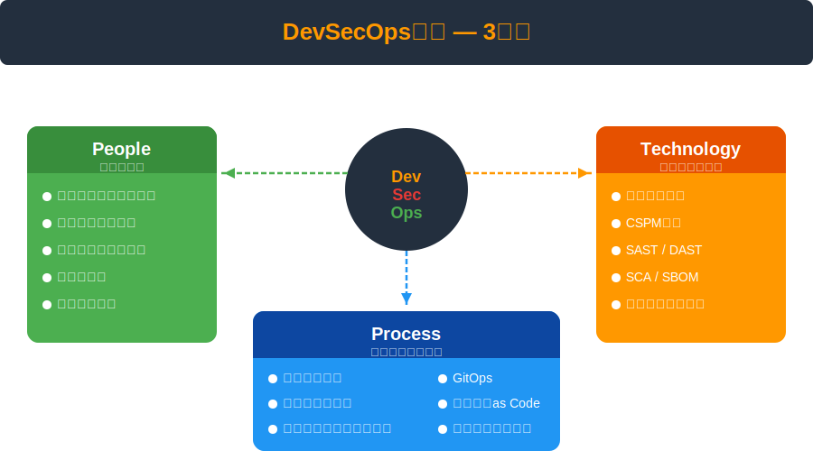


---

# セキュリティ侵害のコスト

- **2023年データ侵害の平均コスト: $4.45M**（IBM報告）
- 侵害発見までの平均日数: **197日**（発見→封じ込め: +73日）
- サプライチェーン攻撃: 前年比 **742%増**（2021年）
- 開発段階で発見した場合の修正コスト: 本番の **1/100**
- セキュリティインシデントの **82%** は人的ミスが起因


---

# DevOps vs DevSecOps

| 観点 | DevOps | DevSecOps |
|------|--------|-----------|
| セキュリティ投入時期 | 開発完了後 | 設計から全フェーズ |
| セキュリティ担当者 | セキュリティチームのみ | 全エンジニア |
| テスト方式 | ペネトレーションテスト（年次）| 自動スキャン（毎コミット）|
| 脆弱性対応 | リリース後パッチ | CI/CDゲートでブロック |


---

# DevSecOps成熟度モデル

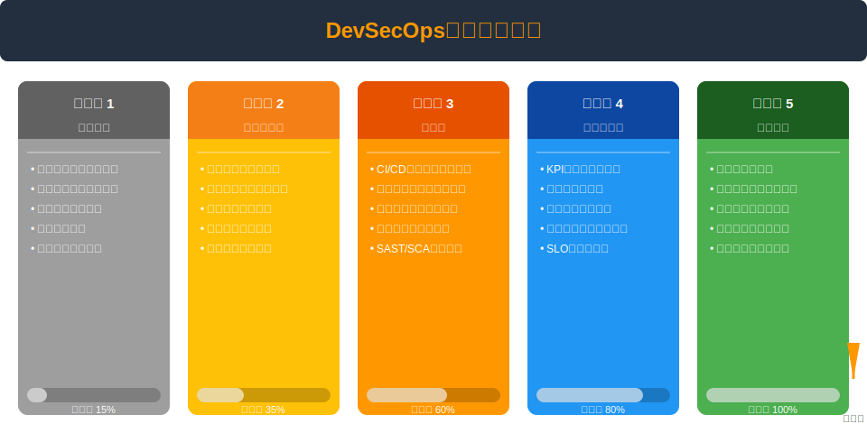


---

# 本資料のロードマップ

- **このガイドで学べること:**
- シフトレフト: CI/CDに自動セキュリティゲートを組み込む
- SBOM管理: ソフトウェアサプライチェーンを可視化・保護
- 脅威モデリング: 設計段階で攻撃者視点を取り入れる
- クラウドネイティブ: コンテナ・K8s・クラウドの多層防御
- ゼロトラスト: 「信頼しない、常に検証」アーキテクチャ


---

<!-- _class: lead -->
# Chapter 2: シフトレフト戦略

- SAST・SCA・シークレットスキャン・DAST・セキュリティゲート


---

# フェーズ別修正コスト

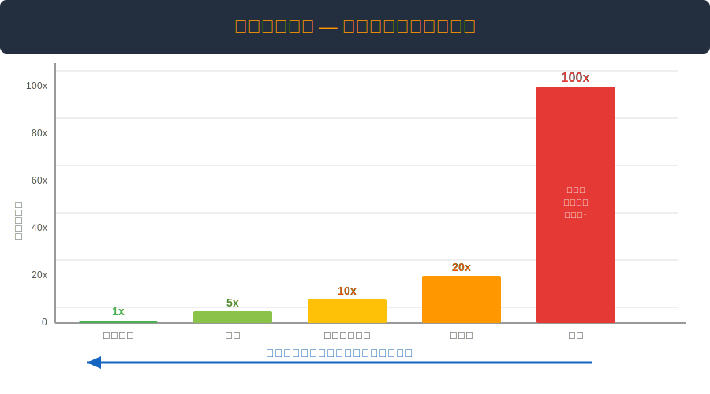


---

# シフトレフトの5原則

- ① **早期発見**: コードレビュー時にセキュリティ問題を検出
- ② **自動化**: すべてのセキュリティチェックをCI/CDに統合
- ③ **開発者ファースト**: 修正方法を明示し、学習機会に変える
- ④ **段階的導入**: まず高リスク項目から自動化を開始
- ⑤ **継続的計測**: MTTRやfalse positive率でKPIを管理


---

# CI/CDセキュリティパイプライン

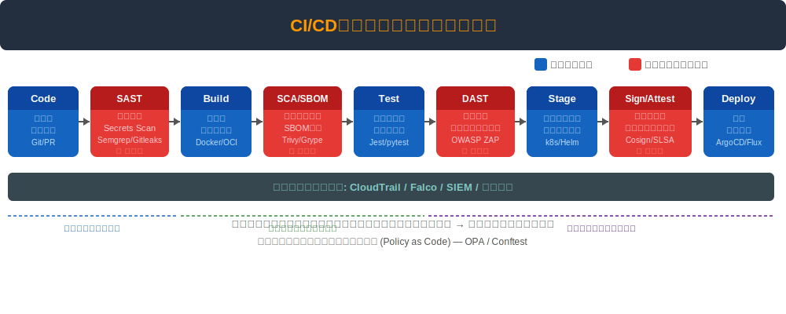


---

<!-- _class: lead -->
# SAST（静的解析）

- コードを実行せず脆弱性を検出するホワイトボックステスト手法


---

# SASTとは — 検出できる脆弱性

- **SAST（Static Application Security Testing）**
- SQLインジェクション / コマンドインジェクション
- クロスサイトスクリプティング（XSS）
- 安全でない暗号化・ハードコードされたシークレット
- バッファオーバーフロー・メモリリーク
- 安全でないデシリアライゼーション


---

# SASTツール比較

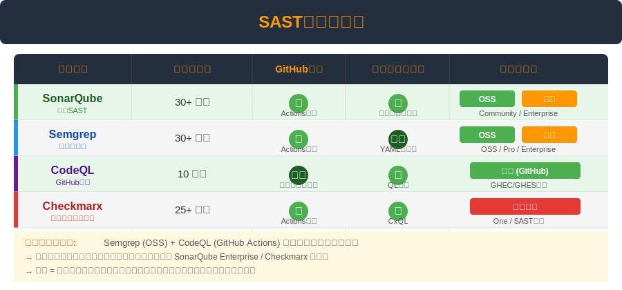


---

# Semgrep実践 — カスタムルール

- **Semgrep**: パターンマッチングで独自ルールを記述
- 公式レジストリに2,000+のルールが公開済み
- CI/CD: `semgrep --config=auto --error`

```yaml
rules:
  - id: hardcoded-secret
    patterns:
      - pattern: $SECRET = "..."
      - metavariable-regex:
          metavariable: $SECRET
          regex: '(?i)(password|secret|token|key)'
    message: ハードコードされたシークレットを検出
    languages: [python, javascript, typescript]
    severity: ERROR
```


---

# CodeQL — GitHub Actions連携

- **CodeQL**: GitHubネイティブ統合、PRにインラインコメント
- クエリ言語でカスタム脆弱性検出ルールを定義可能

```yaml
name: CodeQL Analysis
on: [push, pull_request]
jobs:
  analyze:
    runs-on: ubuntu-latest
    steps:
      - uses: actions/checkout@v4
      - uses: github/codeql-action/init@v3
        with:
          languages: javascript, python
      - uses: github/codeql-action/autobuild@v3
      - uses: github/codeql-action/analyze@v3
```


---

<!-- _class: lead -->
# SCA・依存性管理

- オープンソースコンポーネントの脆弱性とライセンスを管理


---

# SCA（Software Composition Analysis）とは

- **SCA**: 使用している OSS の脆弱性・ライセンスを自動スキャン
| ツール | 特徴 | 価格 |
|--------|------|------|
| Dependabot | GitHub統合、自動PR | 無料 |
| Snyk | 開発者向けUI、修正提案 | Free/有償 |
| OWASP Dep-Check | エンタープライズ対応 | 無料 |
| Renovate | 柔軟な自動更新設定 | OSS |


---

# OSSライセンスリスク

| ライセンス | 商用利用 | コピーレフト | リスク |
|------------|---------|-------------|--------|
| MIT / Apache 2.0 | ✓ | なし | 低 |
| LGPL | ✓（条件付き）| 弱い | 中 |
| GPL v2/v3 | ✓（条件付き）| 強い | 高 |
| AGPL | ✓（条件付き）| 最強 | 高 |
- **対策**: SCA + ライセンス承認ポリシーを定義


---

# Dependabot設定例

- 週次自動PR + グルーピングで更新コストを削減

```yaml
# .github/dependabot.yml
version: 2
updates:
  - package-ecosystem: npm
    directory: "/"
    schedule:
      interval: weekly
    open-pull-requests-limit: 10
    groups:
      production-dependencies:
        dependency-type: production
        update-types:
          - minor
          - patch
```


---

<!-- _class: lead -->
# シークレットスキャン

- コードリポジトリへの誤ったシークレット混入を検出・防止


---

# シークレットスキャンとは

- **問題**: APIキー・パスワードをGitにコミットする事故が年間数千件
- **被害**: クレデンシャルの悪用→不正アクセス→データ漏洩
- **検出対象**: AWS/GCP APIキー・DBパスワード・JWTシークレット・OAuthトークン
- **3層防御**: pre-commit フック → CI/CDスキャン → リポジトリ監視


---

# シークレットスキャンツール比較

| ツール | 実行タイミング | 精度 | カスタムパターン |
|--------|--------------|------|----------------|
| GitLeaks | pre-commit/CI | 高 | ✓ |
| TruffleHog v3 | CI/GitHubActions | 最高 | ✓ |
| GitHub Secret Scanning | Push時 | 高（パートナー）| 限定 |
| detect-secrets | pre-commit | 中 | ✓ |
- **推奨**: TruffleHog v3（エントロピー検出） + GitHub Secret Scanning


---

# pre-commitフック設定

- `pre-commit install` で自動的にフックを登録

```yaml
# .pre-commit-config.yaml
repos:
  - repo: https://github.com/gitleaks/gitleaks
    rev: v8.18.4
    hooks:
      - id: gitleaks
  - repo: https://github.com/Yelp/detect-secrets
    rev: v1.4.0
    hooks:
      - id: detect-secrets
        args: ['--baseline', '.secrets.baseline']
```


---

# HashiCorp Vault — CI/CD連携

- JWT認証で環境変数にシークレットを注入
- ハードコード不要・有効期限付き動的シークレット

```yaml
# GitHub Actions: Vault動的シークレット取得
- name: Retrieve secrets from Vault
  uses: hashicorp/vault-action@v3
  with:
    url: https://vault.example.com
    method: jwt
    jwtGithubAudience: vault.example.com
    secrets: |
      secret/data/app/prod db_password | DB_PASSWORD ;
      aws/creds/my-role access_key | AWS_ACCESS_KEY_ID
```


---

<!-- _class: lead -->
# DAST（動的解析）

- 実行中のアプリケーションに対する外部攻撃シミュレーション


---

# DASTとは — SAST vs DAST

| 観点 | SAST | DAST |
|------|------|------|
| テスト対象 | ソースコード | 実行中アプリ |
| 実行タイミング | ビルド前 | テスト/ステージング環境 |
| 検出できる問題 | 実装レベルの欠陥 | ランタイム脆弱性・設定ミス |
| False Positive | 高め | 低め |
- **主なツール**: OWASP ZAP, Burp Suite, Nuclei, nikto


---

# OWASP ZAP自動化

- Baselineスキャン: パッシブのみ（安全）
- Full Scan: アクティブ攻撃シミュレーション（ステージングのみ）

```yaml
# GitHub Actions: ZAP Scan
- name: ZAP Baseline Scan
  uses: zaproxy/action-baseline@v0.10.0
  with:
    target: 'https://staging.example.com'
    rules_file_name: '.zap/rules.tsv'
    cmd_options: '-a'
  env:
    ZAP_AUTH_HEADER: "Authorization"
    ZAP_AUTH_HEADER_VALUE: ${{ secrets.STAGING_TOKEN }}
```


---

<!-- _class: lead -->
# セキュリティゲート設計

- CI/CDパイプラインで自動的に品質基準を強制する


---

# Gatingポリシー設計

- **ゲート1 — コミット時**: シークレットスキャン（違反でブロック）
- **ゲート2 — PR時**: SAST（高・重大脆弱性でブロック）、SCA（CVSSスコア9.0+でブロック）
- **ゲート3 — ビルド時**: コンテナイメージスキャン（CRITICAL CVEでブロック）
- **ゲート4 — デプロイ前**: DAST・ペネトレーション（ステージング）
- **例外管理**: セキュリティチームによる承認フロー


---

# セキュリティKPI・メトリクス

| KPI | 目標値 | 計測ツール |
|-----|--------|-----------|
| MTTR（平均修復時間）| < 7日 | Jira/GitHub |
| 脆弱性密度 | < 0.5/KLOC | SonarQube |
| False Positive率 | < 10% | SAST設定 |
| クリティカル未修正数 | 0件 | SecurityHub |
| SLAコンプライアンス | > 95% | ダッシュボード |


---

<!-- _class: lead -->
# Chapter 3: SBOM・サプライチェーンセキュリティ

- SolarWinds型攻撃への対策・SBOM・SLSA・Sigstore


---

# SolarWinds攻撃 タイムライン

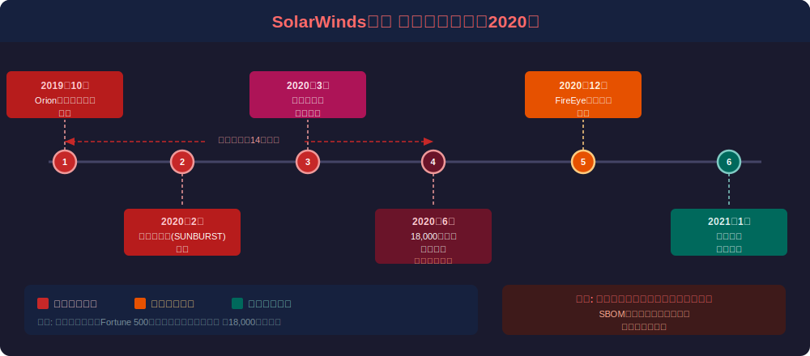


---

# サプライチェーン攻撃の4パターン

- ① **ビルドシステム侵害**: ビルドサーバーにバックドアを挿入（SolarWinds型）
- ② **依存パッケージ汚染**: 正規パッケージへのマルウェア混入（event-stream型）
- ③ **タイポスクワッティング**: 類似名パッケージで騙す（lodash → l0dash）
- ④ **依存関係コンフュージョン**: プライベートパッケージ名を公開リポジトリで奪う
- **共通対策**: SBOM生成・署名・SLSA準拠のビルドパイプライン


---

# SBOMとは（Software Bill of Materials）

- **SBOM**: ソフトウェアに含まれる全コンポーネントの「部品表」
- 記録内容: コンポーネント名・バージョン・ライセンス・依存関係・ハッシュ値
- **活用場面**: 脆弱性CVE照合・ライセンスコンプライアンス・規制対応
- **米国大統領令 EO 14028（2021）**: 政府調達ソフトウェアはSBOM提出必須
- **生成タイミング**: CIビルド時に毎回自動生成し署名して保存


---

# SBOM形式比較 — SPDX vs CycloneDX

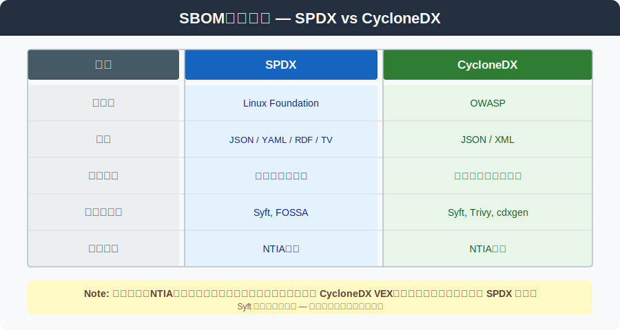


---

# SBOMツールチェーン

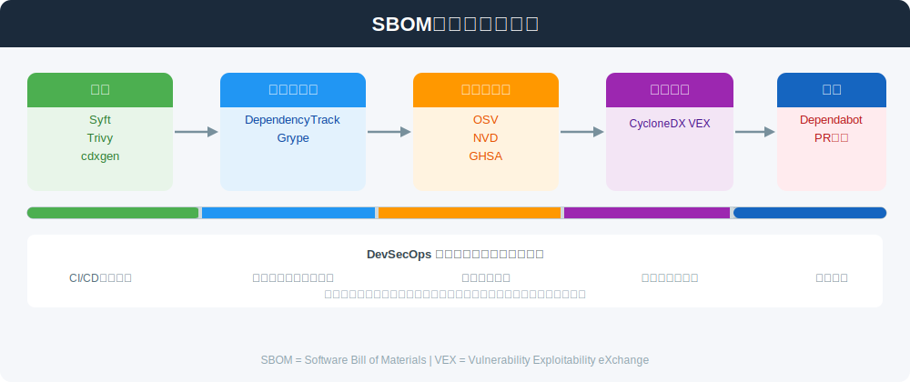


---

# Syft/Trivyによる SBOM生成

- CycloneDXフォーマットで出力 → Grypeで脆弱性照合

```bash
# Syft: コンテナイメージからSBOM生成
syft myapp:latest -o cyclonedx-json > sbom.json

# Trivy: ファイルシステムスキャン + SBOM
trivy fs --format cyclonedx --output sbom.cdx.json .

# Grype: SBOMから脆弱性照合
grype sbom:sbom.json --fail-on high
```


---

# SLSA Framework

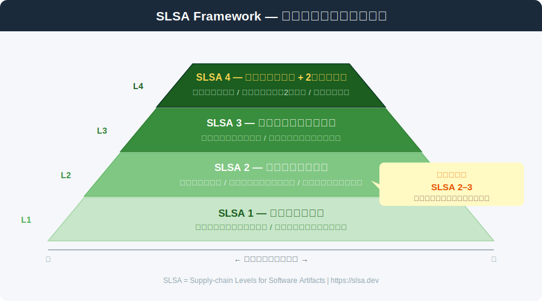


---

# Sigstore — コード署名の民主化

- **Sigstore**: メールアドレスで誰でも無料でコード署名できるPKI基盤
- **3つのコンポーネント**: Cosign（署名）・Fulcio（証明書発行）・Rekor（透明性ログ）
- **特徴**: 鍵管理不要（OIDC/GitHub ActionsのIDで署名）
- **用途**: コンテナイメージ・SBOM・バイナリへの署名
- **採用例**: Kubernetes本体・Distrolessイメージ・PyPIパッケージ


---

# cosign署名・検証

- キーレス署名: GitHub ActionsのOIDCトークンを使用

```bash
# GitHub Actionsからキーレス署名
cosign sign \
  --identity-token=$(cat $ACTIONS_ID_TOKEN_REQUEST_TOKEN) \
  ghcr.io/myorg/myapp:v1.0.0

# 検証（署名チェーン確認）
cosign verify \
  --certificate-identity="https://github.com/myorg/myapp/.github/workflows/build.yml@refs/heads/main"\
  --certificate-oidc-issuer="https://token.actions.githubusercontent.com"\
  ghcr.io/myorg/myapp:v1.0.0
```


---

# GitHub dependency-review-action

- PRマージ前に新規依存性の CVE + ライセンスを自動チェック

```yaml
# .github/workflows/dependency-review.yml
name: Dependency Review
on: pull_request
jobs:
  dependency-review:
    runs-on: ubuntu-latest
    steps:
      - uses: actions/checkout@v4
      - uses: actions/dependency-review-action@v4
        with:
          fail-on-severity: high
          deny-licenses: GPL-2.0, AGPL-3.0
```


---

# SBOM運用フロー

- **Step 1 — 生成**: ビルドCI実行時にSBOMを自動生成（Syft/Trivy）
- **Step 2 — 署名**: Cosignでビルド証明書を添付
- **Step 3 — 保存**: OCI Artifactストアまたは DependencyTrack へアップロード
- **Step 4 — 照合**: 新規CVE公開時に既存SBOMに対して自動スキャン
- **Step 5 — 通知**: 影響を受けるバージョン一覧をSlack/Jiraに通知


---

# 規制・コンプライアンス対応

- **EO 14028（2021）**: 米政府調達ソフトウェアにSBOM必須
- **NTIA最小要素**: サプライヤー名・コンポーネント名・バージョン・依存関係・タイムスタンプ
- **EU Cyber Resilience Act**: デジタル製品のCEマーキングにSBOM必須（2025年〜）
- **NIS2指令**: 重要インフラのサプライチェーンリスク管理義務
- **PCI DSS v4.0**: ソフトウェア部品表による依存性管理の強化


---

# サプライチェーンセキュリティ成熟度

| レベル | 状態 | 実施内容 |
|--------|------|---------|
| L0 | 対策なし | 依存性管理なし |
| L1 | 可視化 | SCA・ライセンス確認 |
| L2 | SBOM生成 | 毎ビルドSBOM・CVE照合 |
| L3 | 署名・証明 | Cosign署名・SLSA 2 |
| L4 | 完全追跡性 | SLSA 3+ ・再現可能ビルド |


---

# DependencyTrack導入

- 継続的なSBOM管理・脆弱性ダッシュボード・Slack通知連携

```bash
# Docker Composeで起動
docker run -d -m 4096m \
  -p 8080:8080 \
  -v /opt/dependency-track:/data \
  dependencytrack/bundled

# SBOM をAPIでアップロード
curl -X PUT https://dt.example.com/api/v1/bom \
  -H 'X-API-Key: YOUR_API_KEY' \
  -F 'projectName=myapp' \
  -F 'bom=@sbom.cdx.json'
```


---

<!-- _class: lead -->
# Chapter 4: 脅威モデリング・STRIDE

- 設計フェーズにセキュリティを組み込む実践手法


---

# 脅威モデリングとは

- **定義**: システムに対する潜在的な脅威を体系的に特定・優先度付けするプロセス
- **4つの質問（Adam Shostack）**: 何を作っているか？何が問題か？どう対処するか？正しく対処できたか？
- **効果**: 設計段階での修正コストは本番の1/100以下
- **頻度**: 新機能追加ごと・四半期ごとに実施（継続的TM）
- **チーム**: 開発者・セキュリティエンジニア・アーキテクト合同で実施


---

# 4つの脅威モデリング手法

| 手法 | 特徴 | 向いている場面 |
|------|------|--------------|
| **STRIDE** | Microsoftが開発、6カテゴリ | Webアプリ・API設計 |
| **PASTA** | リスクベース、9ステップ | エンタープライズ |
| **LINDDUN** | プライバシー特化 | GDPRコンプライアンス |
| **TRIKE** | リスク許容ベース | 金融・重要インフラ |
- **スタートアップ推奨**: STRIDEがシンプルで学習コスト低


---

# なぜ設計フェーズか — 修正コスト比較

- **IBM NIST研究**: バグ修正コストはフェーズが進むほど指数的に増加
- 要件定義での発見: **$1**（基準）
- 設計での発見: **$6**
- コーディングでの発見: **$25**
- テストでの発見: **$100**
- 本番リリース後の発見: **$600〜$6,000**


---

# STRIDE概要 — 6カテゴリ

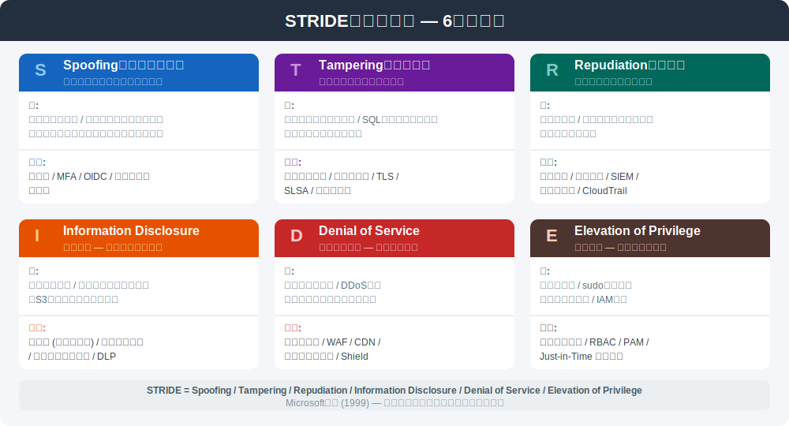


---

# S: Spoofing（なりすまし）詳解

- **定義**: 正規ユーザーや別のシステムになりすます攻撃
- **事例**: 偽のログインページ・JWTトークン偽造・IPスプーフィング
- **対策リスト:**
- 強力な認証（MFA・パスキー）の強制
- HTTPS証明書ピンニング
- CSRF対策トークン / リクエスト署名（HMACまたはJWT）


---

# T: Tampering（改ざん）詳解

- **定義**: データやコードを不正に変更する攻撃
- **事例**: DBデータの改ざん・メモリ改ざん・ネットワークパケット書き換え
- **対策リスト:**
- 入力値検証・サニタイゼーション
- データベース整合性チェック（チェックサム）
- 読み取り専用マウント（コンテナ）/ デジタル署名によるコード完全性検証


---

# R: Repudiation（否認）詳解

- **定義**: 実行した行動を否定・証拠を改ざんする攻撃
- **事例**: トランザクションログの削除・監査証跡の改ざん
- **対策リスト:**
- 改ざん不可能な監査ログ（append-only）
- 構造化ログ + ログ署名
- デジタル署名トランザクション / CloudTrail・AWS CloudWatch Logs Insights


---

# I: Information Disclosure（情報漏洩）詳解

- **定義**: 権限外のユーザーへの機密情報漏洩
- **事例**: エラーメッセージにスタックトレース・HTTPレスポンスヘッダー暴露
- **対策リスト:**
- 最小権限アクセス（RBAC/ABAC）
- 機密データの暗号化（保存時・転送時）
- エラーメッセージの情報最小化 / APIレスポンスのデータマスキング


---

# D: Denial of Service（サービス拒否）詳解

- **定義**: 正規ユーザーのサービス利用を妨害する攻撃
- **事例**: フラッド攻撃・リソース枯渇・アルゴリズム複雑性攻撃
- **対策リスト:**
- レート制限（API Gateway・WAF）
- 自動スケーリング（HPA/KEDA）/ 入力値サイズ上限の設定
- DDoS保護（AWS Shield / Cloudflare）


---

# E: Elevation of Privilege（権限昇格）詳解

- **定義**: 低権限ユーザーが高権限を取得する攻撃
- **事例**: SQLインジェクション→DBA権限・コンテナエスケープ→root
- **対策リスト:**
- 最小権限原則（Least Privilege）の徹底
- コンテナ: non-root + read-only FS
- RBACの定期棚卸し（IAM Access Analyzer）/ 入力値検証による SQLi/RCE 防止


---

# DFD（データフロー図）— 実践例

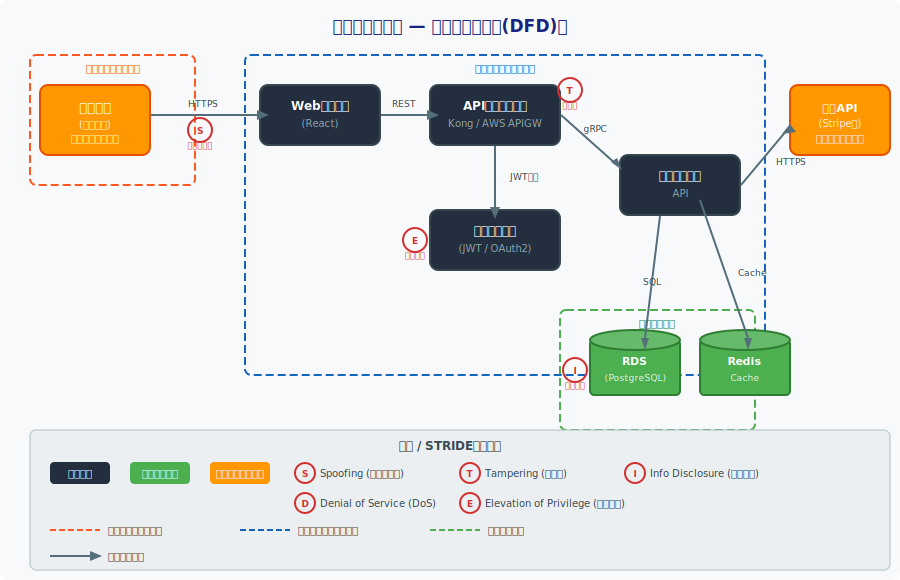


---

# DFDの描き方ルール

- **4つの要素:**
- □ **プロセス**: データを処理するコンポーネント（円または角丸四角）
- → **データフロー**: データの流れ（矢印） / = **データストア**: データの保存先（平行線）
- [ **外部エンティティ**: システム境界外の存在（四角）
- **トラストバウンダリー**: 信頼レベルが変わる境界を点線で囲む
- **各フローにSTRIDEを適用して脅威をリストアップ**


---

# 攻撃ツリー分析

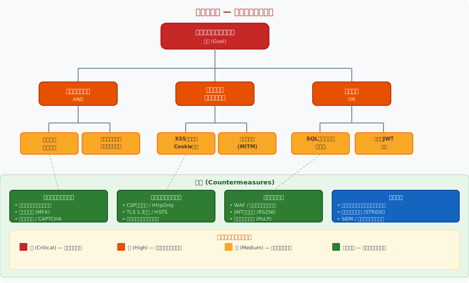


---

# DREADスコアリング

| 要素 | 意味 | スコア（1-3）|
|------|------|------------|
| **D**amage | 被害の大きさ | 軽微→重大 |
| **R**eproducibility | 再現性の高さ | 困難→容易 |
| **E**xploitability | 悪用の容易さ | 専門知識→スクリプト |
| **A**ffected users | 影響ユーザー数 | 少数→全員 |
| **D**iscoverability | 発見されやすさ | 困難→公開情報 |


---

# Microsoft Threat Modeling Tool

- **Microsoft Threat Modeling Tool 2016 (無料)**
- DFDを描くと自動でSTRIDE脅威を列挙
- 各脅威にステータス管理・レポート出力
- **代替ツール:**
- OWASP Threat Dragon（Web版・OSS）
- IriusRisk（エンタープライズ・有償）/ Threagile（YAML定義・K8s向け・OSS）


---

# 継続的脅威モデリング（Agile TM）

- **従来**: 大規模な脅威モデリングセッションを年に1回
- **Agile TM**: スプリントごとに小さな脅威モデリングを繰り返す
- **実践方法:**
- 新機能のDFDをPRに添付する文化を作る
- 脅威チェックリストをPRテンプレートに組み込む
- セキュリティチャンピオンがレビュー担当 / 発見された脅威はバックログに追加して管理


---

# APIへの脅威モデリング実践例

- **対象**: RESTful API + JWT認証 + RDS
- **識別した主要脅威:**
- S: JWTトークン窃取によるなりすまし → 対策: 短い有効期限 + Refresh Token Rotation
- T: SQLインジェクションによるDB改ざん → 対策: ORM + パラメータバインディング
- I: エラーレスポンスでのDB情報漏洩 → 対策: 汎用エラーメッセージ
- E: IDOR（水平権限昇格）→ 対策: リソース所有者チェック


---

# マイクロサービスへの脅威モデリング適用

- **追加で考慮すべき脅威面:**
- サービス間認証: mTLSなし→なりすまし（S）
- サービスメッシュ未導入→横断的な盗聴（I）
- 過剰なサービス権限→侵害時の横移動被害拡大（E）
- **対策パターン:**
- SPIFFE/SPIREによるワークロードID / Istio/Linkerdでmtls強制 / ゼロトラスト: 同一クラスタ内でも認証・認可


---

<!-- _class: lead -->
# Chapter 5: クラウドネイティブセキュリティ

- 4C's・コンテナ・Kubernetes・OPA・CSPM・eBPF


---

# 4C's of Cloud Native Security

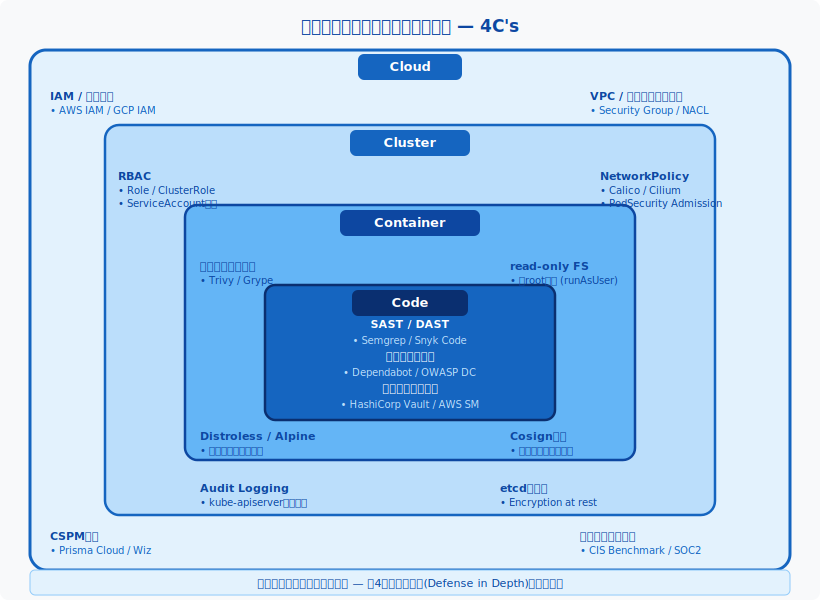


---

# コンテナセキュリティの全体像

- **4つのレイヤー:**
- ① イメージセキュリティ: 脆弱なベースイメージの検出・署名
- ② ランタイムセキュリティ: 異常な振る舞いの検出・遮断
- ③ レジストリセキュリティ: アクセス制御・スキャン
- ④ オーケストレーション: K8s設定の強化・ポリシー強制
- **原則**: イミュータブルインフラ + 最小イメージ（Distroless）


---

# Dockerイメージスキャン

- **Trivy（推奨）**: 高速・精度高・SBOM生成対応
- **Snyk Container**: 開発者向けUIが優秀・修正提案あり
- **Grype**: SBOMからの脆弱性照合に特化
- **スキャン対象**: CVE・設定ミス・シークレット・ライセンス
- **CI/CDへの統合**: レジストリプッシュ前に自動スキャン+CRITICAL拒否


---

# Trivy実践 — イメージスキャン

- `--exit-code 1` でCI/CDゲートとして機能

```bash
# イメージスキャン（Critical/Highのみ表示）
trivy image --severity CRITICAL,HIGH \
  --format table \
  myapp:latest

# CriticalCVEがあれば終了コード1でCIをブロック
trivy image --exit-code 1 \
  --severity CRITICAL \
  myapp:latest

# SBOM付きスキャン
trivy image --format cyclonedx \
  --output sbom.json myapp:latest
```


---

# Dockerfileベストプラクティス

- Distroless: シェル・パッケージマネージャーなし → 攻撃面を最小化

```dockerfile
# ❌ 危険な例
FROM ubuntu:latest
RUN apt-get install -y curl wget
COPY . /app
RUN npm install
CMD ["node", "server.js"]

# ✅ 安全な例
FROM node:20-alpine AS builder
WORKDIR /app
COPY package*.json ./
RUN npm ci --only=production

FROM gcr.io/distroless/nodejs20
COPY --from=builder /app /app
USER nonroot
CMD ["/app/server.js"]
```


---

# コンテナランタイムセキュリティ — Falco

- **Falco（CNCF Graduated）**: カーネルシステムコールを監視し異常を検出
- **検出例:**
- コンテナ内でのシェル実行（/bin/bash）
- 機密ファイルへのアクセス（/etc/passwd）
- 予期しないネットワーク接続 / 特権昇格の試み
- **対応**: Slack/PagerDuty通知 + 自動Pod隔離


---

# Falcoルール作成例

- MITREタグ付きで攻撃フェーズを分類

```yaml
# /etc/falco/rules.d/custom.yaml
- rule: Shell in container
  desc: コンテナ内でシェルを実行
  condition: >
    spawned_process and container
    and proc.name in (shell_binaries)
  output: >
    シェル実行検出 (user=%user.name
    container=%container.name
    cmd=%proc.cmdline)
  priority: WARNING
  tags: [container, shell, mitre_execution]
```


---

# Kubernetesセキュリティ全体像

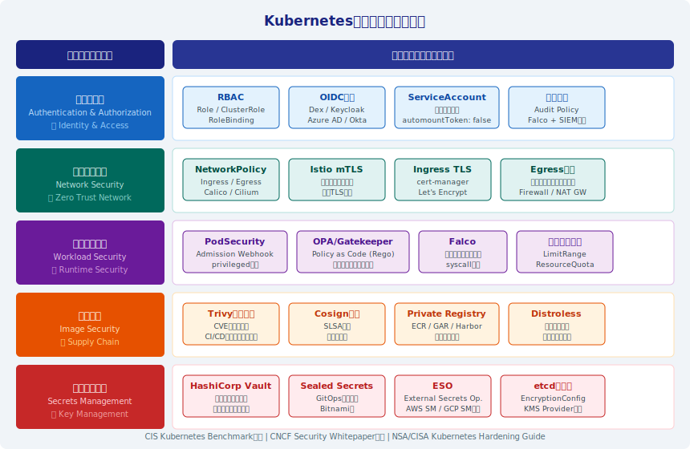


---

# PodSecurityAdmission（PSA）設定

- **3段階**: privileged → baseline → restricted

```yaml
# Namespaceラベルでポリシーを適用
apiVersion: v1
kind: Namespace
metadata:
  name: production
  labels:
    pod-security.kubernetes.io/enforce: restricted
    pod-security.kubernetes.io/audit: restricted
    pod-security.kubernetes.io/warn: restricted
---
# restrictedポリシー: root禁止・seccomp必須・capabilities DROP ALL
```


---

# NetworkPolicy — ゼロトラスト通信

- 明示的許可リストで最小通信に制限

```yaml
# デフォルト全拒否
apiVersion: networking.k8s.io/v1
kind: NetworkPolicy
metadata:
  name: default-deny-all
spec:
  podSelector: {}
  policyTypes: [Ingress, Egress]
---
# バックエンドからDBへの許可のみ
spec:
  podSelector:
    matchLabels: {role: db}
  ingress:
    - from:
      - podSelector:
          matchLabels: {role: backend}
      ports: [{port: 5432}]
```


---

# RBAC最小権限設計

- ツール: `kubectl-who-can`・`rakkess`でRBACを可視化

```yaml
# ❌ 過剰な権限（よくある間違い）
rules:
- apiGroups: ["*"]
  resources: ["*"]
  verbs: ["*"]

# ✅ 最小権限の例
rules:
- apiGroups: [""] # core
  resources: ["pods"]
  verbs: ["get", "list", "watch"]
- apiGroups: ["apps"]
  resources: ["deployments"]
  verbs: ["get", "list"]
```


---

# OPA / Gatekeeper

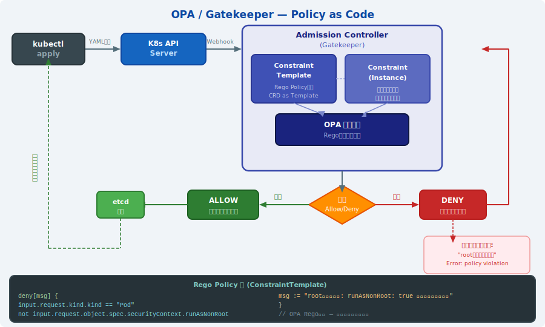


---

# Regoポリシー記述例

- **Constraint**: `labels: ["team", "env", "owner"]` のように指定

```rego
# ConstraintTemplate: 必須ラベルチェック
package requiredlabels

violation[{"msg": msg}] {
  provided := {label | input.review.object.metadata.labels[label]}
  required := {label | label := input.parameters.labels[_]}
  missing := required - provided
  count(missing) > 0
  msg := sprintf("必須ラベルがありません: %v", [missing])
}
```


---

# Kyverno — K8sネイティブポリシーエンジン

- OPA/Gatekeeper比: Rego不要・YAML記述・Mutate/Generateも対応

```yaml
# Kyverno: root実行禁止ポリシー
apiVersion: kyverno.io/v1
kind: ClusterPolicy
metadata:
  name: disallow-root-user
spec:
  rules:
    - name: check-runAsNonRoot
      match:
        resources:
          kinds: [Pod]
      validate:
        message: "root実行は禁止"
        pattern:
          spec:
            securityContext:
              runAsNonRoot: true
```


---

# CSPMとは

- **CSPM（Cloud Security Posture Management）**
- クラウド環境の設定ミスを継続的にスキャンし修正提案
- **検出する問題例:**
- S3バケットのパブリックアクセス許可
- セキュリティグループの0.0.0.0/0開放 / MFA未設定のIAMユーザー
- 暗号化されていないEBSボリューム / **ROI**: クラウド侵害の **99%** が設定ミスに起因（Gartner）


---

# CSPMツール比較

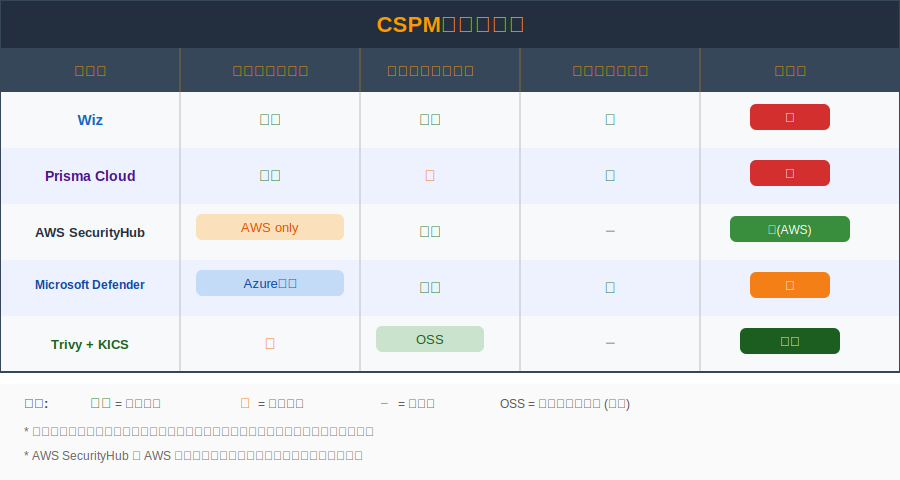


---

# AWS SecurityHub × Organizations

- **AWS SecurityHub**: AWSネイティブCSPM（追加費用最小）
- Organizations連携: 全アカウントのセキュリティを一元管理
- **統合されるサービス:**
- GuardDuty（脅威検知）/ Inspector（脆弱性スキャン）
- Macie（機密データ検出）/ Config（設定コンプライアンス）
- **ASFF（セキュリティ統一フォーマット）**で全知見を集約


---

# eBPFランタイムセキュリティ

- **eBPF**: カーネルを改変せずにLinux内部を観測する革命的技術
- **セキュリティ活用:**
- すべてのシステムコールをゼロオーバーヘッドで観測
- カーネルレベルの不正なメモリアクセスを検出
- ネットワークパケットをカーネルでフィルタリング
- **主要ツール**: Falco（eBPFモード）・Tetragon・Cilium


---

# Tetragon設定例

- Cilium/Hubbleと連携して観測性を向上

```yaml
# Tetragon: /etc/passwdアクセスを監視
apiVersion: cilium.io/v1alpha1
kind: TracingPolicy
metadata:
  name: monitor-passwd
spec:
  kprobes:
    - call: "security_file_permission"
      syscall: false
      args:
        - index: 0
          type: "file"
      selectors:
        - matchArgs:
            - index: 0
              operator: "Prefix"
              values: ["/etc/passwd"]
```


---

# サービスメッシュ — Istio mTLS

- **Istio mTLS**: サービス間通信をすべて相互TLSで暗号化
| モード | 説明 | 推奨 |
|--------|------|------|
| DISABLE | TLSなし | ❌ |
| PERMISSIVE | TLS/平文両対応 | 移行期のみ |
| STRICT | mTLSのみ | ✅ 本番 |
- **証明書管理**: Istio CAが自動でSVID証明書をローテーション


---

<!-- _class: lead -->
# Chapter 6: ゼロトラスト・ID管理

- NIST SP 800-207 / SPIFFE・SPIRE / Vault / IAM最小権限


---

# ゼロトラストアーキテクチャ

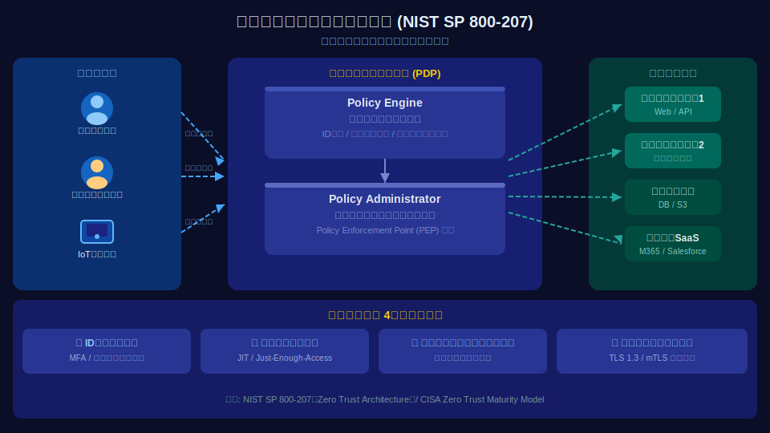


---

# ゼロトラストの7原則（NIST SP 800-207）

- ① 全てのデータソース・コンピューティングをリソースとみなす
- ② ネットワーク上の場所に関わらず全通信を保護する
- ③ 個別リソースへのアクセスはセッション単位で付与する
- ④ アクセスポリシーは動的に決定し常に再評価する
- ⑤ 全資産の整合性・セキュリティ状態を監視・測定する
- ⑥ 全ての認証・認可は動的に実施し厳格に強制する


---

# SPIFFE / SPIRE — ワークロードID

- **SPIFFE（Secure Production Identity Framework For Everyone）**
- マイクロサービス・コンテナに暗号的に証明されたIDを付与
- **SVID（SPIFFE Verifiable Identity Document）**: X.509証明書またはJWT形式
- 有効期限付き（ローテーション自動）
- **SPIRE**: SPIFFEの参照実装（CNCF Graduated）
- **用途**: Vault認証・Istio証明書・サービス間認証


---

# SPIRE設定例

- K8sのNamespace+ServiceAccountでIDを自動付与

```yaml
# SPIRE Server設定
server:
  bind_address: 0.0.0.0
  bind_port: 8081
  trust_domain: example.org
  data_dir: /opt/spire/data/server
  log_level: INFO
  ca_ttl: 12h
  default_svid_ttl: 1h

# WorkloadRegistrationEntry
spire-server entry create \
  -spiffeID spiffe://example.org/backend \
  -parentID spiffe://example.org/spire-agent \
  -selector k8s:ns:production \
  -selector k8s:sa:backend-sa
```


---

# HashiCorp Vault — シークレット管理

- **Vault**: 動的シークレット・暗号化・PKIの統合管理プラットフォーム
- **主要機能:**
- 動的シークレット: DBパスワードを都度生成（有効期限付き）
- 暗号化as a Service: データの暗号化/復号をAPIで提供
- PKI: 証明書の自動発行・ローテーション
- Kubernetes統合: `vault-agent`でサイドカーとして自動注入


---

# Vault Dynamic Secrets

- 1時間で失効するDBユーザーを都度生成

```bash
# PostgreSQL動的シークレット設定
vault secrets enable database
vault write database/config/my-postgresql \
  plugin_name=postgresql-database-plugin \
  connection_url="postgresql://{{username}}:{{password}}@db:5432/mydb" \
  allowed_roles="readonly"

vault write database/roles/readonly \
  db_name=my-postgresql \
  default_ttl="1h" max_ttl="24h" \
  creation_statements="CREATE USER '{{name}}' WITH PASSWORD '{{password}}'"

# 動的シークレット取得
vault read database/creds/readonly
```


---

# AWS IAM最小権限設計

- **原則**: デフォルト拒否 + 必要なアクション・リソースのみ明示的許可
- **ツール活用:**
- IAM Access Analyzer: 過剰権限のポリシーを自動検出
- CloudTrail → Athena: 実際に使ったAPIを分析し最小化
- AWS Policy Generator: ビジュアルでポリシー作成
- **SCP（Service Control Policy）**: 組織レベルで強制制限


---

# IAM Access Analyzer活用

- 年次ではなく継続的（月次）でIAM棚卸しを実施

```bash
# 外部アクセス可能なリソースを検出
aws accessanalyzer list-findings \
  --analyzer-arn arn:aws:access-analyzer:ap-northeast-1:123:analyzer/MyAnalyzer \
  --filter '{"resourceType": {"eq": ["AWS::S3::Bucket"]}}'

# 未使用IAMロールの検出（最終使用日）
aws iam generate-service-last-accessed-details \
  --arn arn:aws:iam::123456789:role/MyRole

# Pythonで一括棚卸し: boto3でフィルタリング
```


---

# SSO / MFA / OIDC設計

- **MFA戦略（リスクベース）:**
- FIDO2 / パスキー（最強・フィッシング耐性）: 全管理者に必須
- TOTP（Authenticator App）: 全開発者に必須
- SMS OTP（非推奨）: SIMスワップ攻撃に脆弱
- **OIDC / OAuth 2.0 ベストプラクティス:**
- PKCE必須（Authorization Code Flow）/ Implicit Flow廃止（RFC 9700）


---

<!-- _class: lead -->
# Chapter 7: 実践ロードマップ・まとめ

- 導入ロードマップ・失敗パターン・KPI・ツール全景


---

# DevSecOps導入ロードマップ

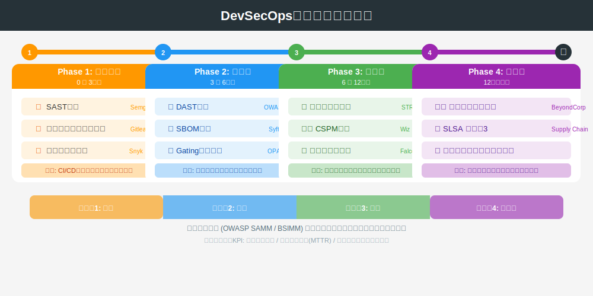


---

# よくある失敗パターンと対策

| 失敗パターン | 原因 | 対策 |
|------------|------|------|
| セキュリティが開発の障壁に | False Positive過多 | チューニング + 段階的導入 |
| ツールだらけで運用不能 | 技術先行 | プロセス設計先行 |
| セキュリティサイロ | 組織分断 | セキュリティチャンピオン制度 |
| SBOMを生成するだけ | 活用フロー未設計 | DependencyTrack連携 |


---

# セキュリティチャンピオン制度

- **セキュリティチャンピオン**: 各開発チームに1人、セキュリティ推進役を配置
- **役割:**
- チーム内でのセキュリティレビュー実施
- 脅威モデリングのファシリテーター
- セキュリティツールの導入・運用サポート
- **育成:** 月次トレーニング + CTF参加 + 報奨金制度


---

# ツールエコシステム全体図

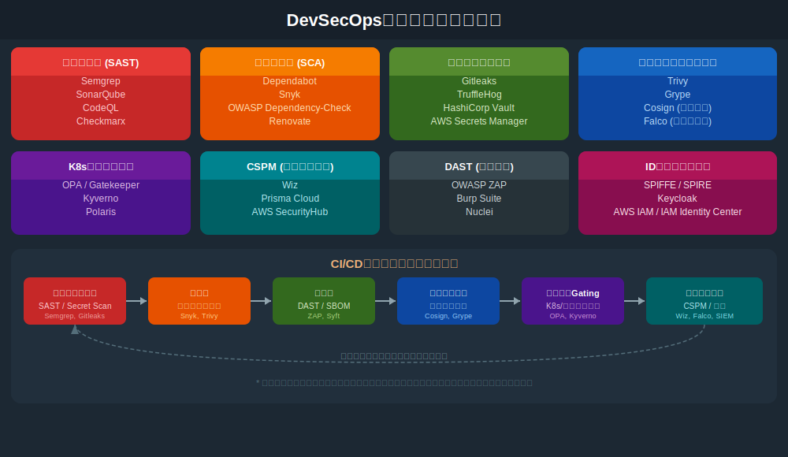


---

# 参考リソース

- **公式ドキュメント・標準:**
- [OWASP DevSecOps Guideline](https://owasp.org/www-project-devsecops-guideline/)
- [NIST SP 800-207 Zero Trust](https://csrc.nist.gov/publications/detail/sp/800-207/final)
- [SLSA Framework](https://slsa.dev/) / [Sigstore Documentation](https://docs.sigstore.dev/)
- **学習リソース:**
- [OWASP Top 10](https://owasp.org/www-project-top-ten/) / [CNCF Security Whitepaper](https://github.com/cncf/tag-security) / [Falco Rules Reference](https://falco.org/docs/rules/) / [HashiCorp Vault Tutorials](https://developer.hashicorp.com/vault/tutorials)


---

# DevSecOps 黄金律

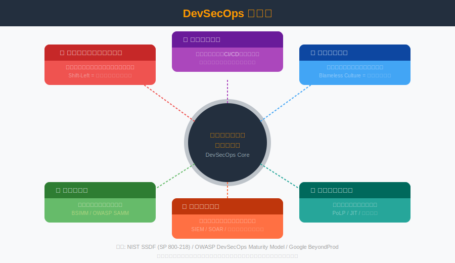

