<!-- _class: lead -->
# DevSecOps実践ガイド

- セキュリティエンジニア向け 完全実践ガイド
- シフトレフト・SBOM・脅威モデリング・クラウドネイティブセキュリティ
- 2026年版


---

# アジェンダ (1/2)

- <svg viewBox="0 0 800 400" style="max-height:70vh;max-width:100%;display:block;margin:0 auto;" xmlns="http://www.w3.org/2000/svg"><rect width="800" height="400" fill="#1a1a2e"/><text x="400" y="35" text-anchor="middle" fill="#f9a825" font-size="18" font-family="sans-serif" font-weight="bold">DevSecOps サイクル</text><rect x="80" y="160" width="130" height="55" rx="6" fill="#1565c0" stroke="#f9a825" stroke-width="1.5"/><text x="145" y="192.5" text-anchor="middle" fill="#ffffff" font-size="17" font-family="sans-serif">Dev</text><rect x="335" y="65" width="130" height="55" rx="6" fill="#b71c1c" stroke="#e91e63" stroke-width="1.5"/><text x="400" y="97.5" text-anchor="middle" fill="#ffffff" font-size="17" font-family="sans-serif">Sec</text><rect x="590" y="160" width="130" height="55" rx="6" fill="#1b5e20" stroke="#66bb6a" stroke-width="1.5"/><text x="655" y="192.5" text-anchor="middle" fill="#ffffff" font-size="17" font-family="sans-serif">Ops</text><path d="M210,187 Q335,140 335,120" stroke="#f9a825" stroke-width="2" fill="none"/><polygon points="333,108 341,124 325,124" fill="#f9a825"/><path d="M465,92 Q530,130 590,175" stroke="#f9a825" stroke-width="2" fill="none"/><polygon points="582,169 594,181 579,180" fill="#f9a825"/><path d="M590,215 Q400,320 210,215" stroke="#f9a825" stroke-width="2" fill="none"/><polygon points="212,207 204,220 219,221" fill="#f9a825"/><text x="260" y="130" text-anchor="middle" fill="#ffffff" font-size="11" font-family="sans-serif">設計・実装</text><text x="550" y="135" text-anchor="middle" fill="#ffffff" font-size="11" font-family="sans-serif">テスト・スキャン</text><text x="400" y="310" text-anchor="middle" fill="#ffffff" font-size="11" font-family="sans-serif">監視・フィードバック</text><rect x="315" y="170" width="170" height="45" rx="6" fill="#4a148c" stroke="#ce93d8" stroke-width="1.5"/><text x="400" y="197.5" text-anchor="middle" fill="#ffffff" font-size="11" font-family="sans-serif">継続的セキュリティ</text><text x="400" y="375" text-anchor="middle" fill="#888" font-size="11" font-family="sans-serif">セキュリティを全フェーズに統合</text></svg>
- **Chapter 1:** DevSecOpsとは（定義・背景・成熟度）
- **Chapter 2:** シフトレフト戦略（SAST・SCA・シークレットスキャン・DAST）
- **Chapter 3:** SBOM・サプライチェーンセキュリティ
- **Chapter 4:** 脅威モデリング・STRIDE


---

# アジェンダ (2/2)

- <svg viewBox="0 0 800 400" style="max-height:70vh;max-width:100%;display:block;margin:0 auto;" xmlns="http://www.w3.org/2000/svg"><rect width="800" height="400" fill="#1a1a2e"/><text x="400" y="35" text-anchor="middle" fill="#f9a825" font-size="18" font-family="sans-serif" font-weight="bold">シフトレフト セキュリティ</text><line x1="60" y1="200" x2="740" y2="200" stroke="#444" stroke-width="2"/><polygon points="735,194 750,200 735,206" fill="#444"/><rect x="60" y="158" width="100" height="44" rx="6" fill="#16213e" stroke="#f9a825" stroke-width="1.5"/><text x="110" y="185" text-anchor="middle" fill="#ffffff" font-size="13" font-family="sans-serif">設計</text><rect x="183" y="158" width="100" height="44" rx="6" fill="#16213e" stroke="#f9a825" stroke-width="1.5"/><text x="233" y="185" text-anchor="middle" fill="#ffffff" font-size="11" font-family="sans-serif">コーディング</text><rect x="306" y="158" width="100" height="44" rx="6" fill="#16213e" stroke="#f9a825" stroke-width="1.5"/><text x="356" y="185" text-anchor="middle" fill="#ffffff" font-size="13" font-family="sans-serif">ビルド</text><rect x="429" y="158" width="100" height="44" rx="6" fill="#16213e" stroke="#555" stroke-width="1.5"/><text x="479" y="185" text-anchor="middle" fill="#ffffff" font-size="13" font-family="sans-serif">テスト</text><rect x="552" y="158" width="100" height="44" rx="6" fill="#16213e" stroke="#e91e63" stroke-width="1.5"/><text x="602" y="185" text-anchor="middle" fill="#ffffff" font-size="13" font-family="sans-serif">本番</text><text x="110" y="228" text-anchor="middle" fill="#f9a825" font-size="10" font-family="sans-serif">脅威モデリング</text><text x="233" y="228" text-anchor="middle" fill="#f9a825" font-size="10" font-family="sans-serif">SAST/シークレット</text><text x="356" y="228" text-anchor="middle" fill="#f9a825" font-size="10" font-family="sans-serif">SCA/SBOM</text><text x="479" y="228" text-anchor="middle" fill="#ffffff" font-size="10" font-family="sans-serif">DAST</text><text x="602" y="228" text-anchor="middle" fill="#e91e63" font-size="10" font-family="sans-serif">CSPM</text><rect x="60" y="255" width="360" height="28" rx="4" fill="#1565c0" opacity="0.7"/><text x="240" y="274" text-anchor="middle" fill="#ffffff" font-size="11" font-family="sans-serif">シフトレフト領域 — 修正コスト: 低</text><rect x="440" y="255" width="212" height="28" rx="4" fill="#e91e63" opacity="0.6"/><text x="546" y="274" text-anchor="middle" fill="#ffffff" font-size="11" font-family="sans-serif">遅延発見 — コスト: 高</text><text x="400" y="355" text-anchor="middle" fill="#888" font-size="11" font-family="sans-serif">早期発見により修正コストを最大1/100に削減</text></svg>
- **Chapter 5:** クラウドネイティブセキュリティ（4C's・Falco・OPA・CSPM）
- **Chapter 6:** ゼロトラスト・ID管理
- **Chapter 7:** 実践ロードマップ・まとめ


---

<!-- _class: lead -->
# Chapter 1: DevSecOpsとは

- 定義・背景・成熟度モデル・ロードマップ


---

# DevSecOpsの定義と3本柱

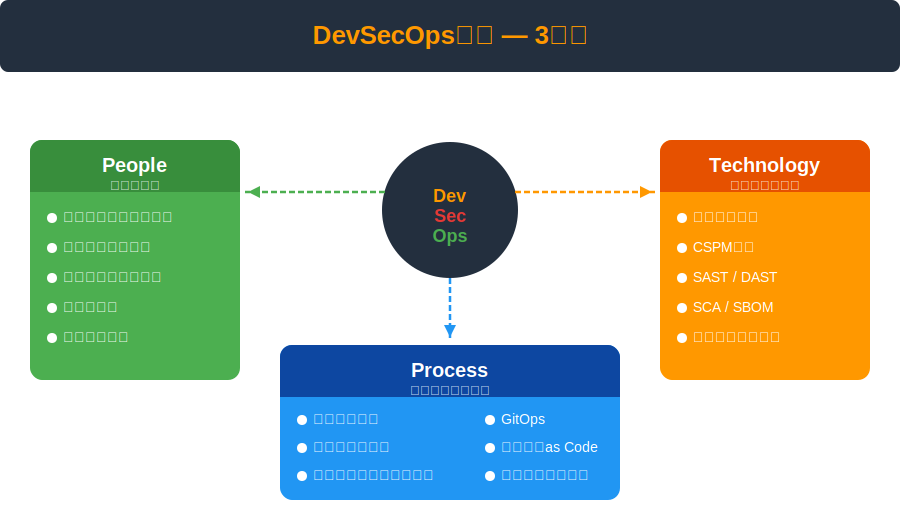


---

# セキュリティ侵害のコスト

- <svg viewBox="0 0 800 400" style="max-height:70vh;max-width:100%;display:block;margin:0 auto;" xmlns="http://www.w3.org/2000/svg"><rect width="800" height="400" fill="#1a1a2e"/><text x="400" y="35" text-anchor="middle" fill="#f9a825" font-size="18" font-family="sans-serif" font-weight="bold">CI/CD セキュリティパイプライン</text><rect x="20" y="162" width="85" height="46" rx="6" fill="#16213e" stroke="#42a5f5" stroke-width="1.5"/><text x="62.5" y="190" text-anchor="middle" fill="#ffffff" font-size="13" font-family="sans-serif">コード</text>
<line x1="105" y1="185" x2="123" y2="185" stroke="#f9a825" stroke-width="2"/><polygon points="118,179 133,185 118,191" fill="#f9a825"/>
<rect x="133" y="162" width="85" height="46" rx="6" fill="#1565c0" stroke="#42a5f5" stroke-width="1.5"/><text x="175.5" y="190" text-anchor="middle" fill="#ffffff" font-size="13" font-family="sans-serif">SAST</text>
<line x1="218" y1="185" x2="236" y2="185" stroke="#f9a825" stroke-width="2"/><polygon points="231,179 246,185 231,191" fill="#f9a825"/>
<rect x="246" y="162" width="85" height="46" rx="6" fill="#1565c0" stroke="#42a5f5" stroke-width="1.5"/><text x="288.5" y="190" text-anchor="middle" fill="#ffffff" font-size="13" font-family="sans-serif">SCA</text>
<line x1="331" y1="185" x2="349" y2="185" stroke="#f9a825" stroke-width="2"/><polygon points="344,179 359,185 344,191" fill="#f9a825"/>
<rect x="359" y="162" width="85" height="46" rx="6" fill="#1b5e20" stroke="#66bb6a" stroke-width="1.5"/><text x="401.5" y="190" text-anchor="middle" fill="#ffffff" font-size="13" font-family="sans-serif">ビルド</text>
<line x1="444" y1="185" x2="462" y2="185" stroke="#f9a825" stroke-width="2"/><polygon points="457,179 472,185 457,191" fill="#f9a825"/>
<rect x="472" y="162" width="85" height="46" rx="6" fill="#1565c0" stroke="#42a5f5" stroke-width="1.5"/><text x="514.5" y="190" text-anchor="middle" fill="#ffffff" font-size="13" font-family="sans-serif">DAST</text>
<line x1="557" y1="185" x2="575" y2="185" stroke="#f9a825" stroke-width="2"/><polygon points="570,179 585,185 570,191" fill="#f9a825"/>
<rect x="585" y="162" width="85" height="46" rx="6" fill="#4a148c" stroke="#ce93d8" stroke-width="1.5"/><text x="627.5" y="190" text-anchor="middle" fill="#ffffff" font-size="13" font-family="sans-serif">Scan</text>
<line x1="670" y1="185" x2="688" y2="185" stroke="#66bb6a" stroke-width="2"/><polygon points="683,179 698,185 683,191" fill="#66bb6a"/>
<rect x="698" y="162" width="82" height="46" rx="6" fill="#1b5e20" stroke="#66bb6a" stroke-width="1.5"/><text x="739" y="190" text-anchor="middle" fill="#ffffff" font-size="13" font-family="sans-serif">Deploy</text>
<rect x="133" y="233" width="537" height="28" rx="4" fill="#16213e" stroke="#f9a825" stroke-width="1.5"/>
<text x="401" y="252" text-anchor="middle" fill="#f9a825" font-size="12" font-family="sans-serif">セキュリティゲート: 失敗時はパイプライン自動停止</text>
<text x="400" y="360" text-anchor="middle" fill="#888" font-size="11" font-family="sans-serif">毎コミットで自動スキャン — 問題を早期に検出・ブロック</text></svg>
- **2023年データ侵害の平均コスト: $4.45M**（IBM報告）
- 侵害発見までの平均日数: **197日**（発見→封じ込め: +73日）
- サプライチェーン攻撃: 前年比 **742%増**（2021年）
- 開発段階で発見した場合の修正コスト: 本番の **1/100**
- セキュリティインシデントの **82%** は人的ミスが起因


---

# DevOps vs DevSecOps

- <svg viewBox="0 0 800 200" style="max-height:70vh;max-width:100%;display:block;margin:0 auto;" xmlns="http://www.w3.org/2000/svg"><rect width="800" height="200" fill="#1a1a2e"/><text x="400" y="28" text-anchor="middle" fill="#f9a825" font-size="16" font-family="sans-serif" font-weight="bold">DevOps vs DevSecOps</text><rect x="60" y="50" width="300" height="110" rx="6" fill="#1565c0" stroke="#42a5f5" stroke-width="1.5"/><text x="210" y="110" text-anchor="middle" fill="#ffffff" font-size="12" font-family="sans-serif">DevOps</text><text x="210" y="90" text-anchor="middle" fill="#ffffff" font-size="11" font-family="sans-serif">開発+運用の協働</text><text x="210" y="110" text-anchor="middle" fill="#888" font-size="10" font-family="sans-serif">セキュリティ: 後付け</text><rect x="440" y="50" width="300" height="110" rx="6" fill="#16213e" stroke="#f9a825" stroke-width="1.5"/><text x="590" y="110" text-anchor="middle" fill="#ffffff" font-size="12" font-family="sans-serif">DevSecOps</text><text x="590" y="90" text-anchor="middle" fill="#ffffff" font-size="11" font-family="sans-serif">開発+セキュリティ+運用</text><text x="590" y="110" text-anchor="middle" fill="#f9a825" font-size="10" font-family="sans-serif">セキュリティ: 設計から統合</text><line x1="360" y1="105" x2="440" y2="105" stroke="#f9a825" stroke-width="2"/><polygon points="435,99 450,105 435,111" fill="#f9a825"/></svg>
| 観点 | DevOps | DevSecOps |
|------|--------|-----------|
| セキュリティ投入時期 | 開発完了後 | 設計から全フェーズ |
| セキュリティ担当者 | セキュリティチームのみ | 全エンジニア |
| テスト方式 | ペネトレーションテスト（年次）| 自動スキャン（毎コミット）|
| 脆弱性対応 | リリース後パッチ | CI/CDゲートでブロック |


---

# DevSecOps成熟度モデル

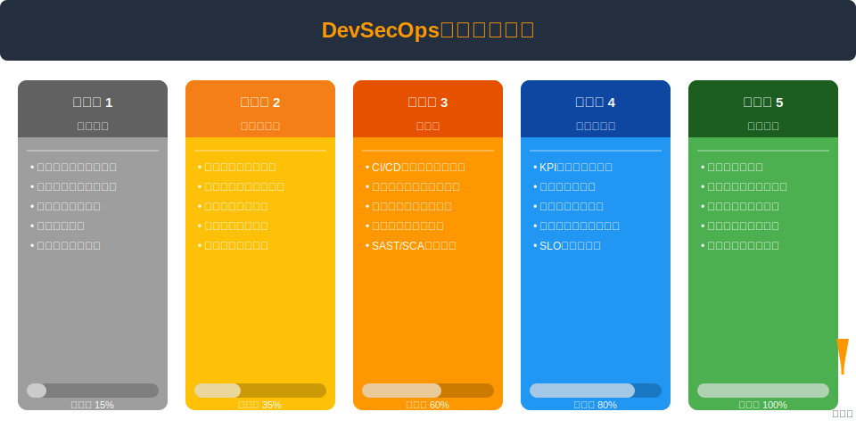


---

# 本資料のロードマップ

- <svg viewBox="0 0 800 400" style="max-height:70vh;max-width:100%;display:block;margin:0 auto;" xmlns="http://www.w3.org/2000/svg"><rect width="800" height="400" fill="#1a1a2e"/><text x="400" y="35" text-anchor="middle" fill="#f9a825" font-size="18" font-family="sans-serif" font-weight="bold">STRIDE 脅威モデリング</text>
<rect x="20" y="60" width="230" height="52" rx="6" fill="#16213e" stroke="#e91e63" stroke-width="1.5"/><text x="135" y="91" text-anchor="middle" fill="#ffffff" font-size="12" font-family="sans-serif">S — Spoofing (なりすまし)</text>
<text x="135" y="127" text-anchor="middle" fill="#888" font-size="10" font-family="sans-serif">対策: 多要素認証・証明書検証</text>
<rect x="285" y="60" width="230" height="52" rx="6" fill="#16213e" stroke="#e91e63" stroke-width="1.5"/><text x="400" y="91" text-anchor="middle" fill="#ffffff" font-size="12" font-family="sans-serif">T — Tampering (改ざん)</text>
<text x="400" y="127" text-anchor="middle" fill="#888" font-size="10" font-family="sans-serif">対策: デジタル署名・整合性チェック</text>
<rect x="550" y="60" width="230" height="52" rx="6" fill="#16213e" stroke="#e91e63" stroke-width="1.5"/><text x="665" y="91" text-anchor="middle" fill="#ffffff" font-size="12" font-family="sans-serif">R — Repudiation (否認)</text>
<text x="665" y="127" text-anchor="middle" fill="#888" font-size="10" font-family="sans-serif">対策: 監査ログ・タイムスタンプ</text>
<rect x="20" y="150" width="230" height="52" rx="6" fill="#16213e" stroke="#f9a825" stroke-width="1.5"/><text x="135" y="181" text-anchor="middle" fill="#ffffff" font-size="12" font-family="sans-serif">I — Info Disclosure (漏洩)</text>
<text x="135" y="217" text-anchor="middle" fill="#888" font-size="10" font-family="sans-serif">対策: 暗号化・アクセス制御</text>
<rect x="285" y="150" width="230" height="52" rx="6" fill="#16213e" stroke="#f9a825" stroke-width="1.5"/><text x="400" y="181" text-anchor="middle" fill="#ffffff" font-size="12" font-family="sans-serif">D — Denial of Service</text>
<text x="400" y="217" text-anchor="middle" fill="#888" font-size="10" font-family="sans-serif">対策: レート制限・スケーリング</text>
<rect x="550" y="150" width="230" height="52" rx="6" fill="#16213e" stroke="#f9a825" stroke-width="1.5"/><text x="665" y="181" text-anchor="middle" fill="#ffffff" font-size="11" font-family="sans-serif">E — Elevation of Priv (昇格)</text>
<text x="665" y="217" text-anchor="middle" fill="#888" font-size="10" font-family="sans-serif">対策: 最小権限・サンドボックス</text>
<rect x="180" y="250" width="440" height="55" rx="8" fill="#4a148c" stroke="#ce93d8" stroke-width="1.5"/>
<text x="400" y="274" text-anchor="middle" fill="#ffffff" font-size="13" font-family="sans-serif" font-weight="bold">脅威モデリングプロセス</text>
<text x="400" y="295" text-anchor="middle" fill="#ce93d8" font-size="11" font-family="sans-serif">資産特定 → 脅威列挙 → リスク評価 → 対策設計</text>
<text x="400" y="360" text-anchor="middle" fill="#888" font-size="11" font-family="sans-serif">設計フェーズで実施することで手戻りを最小化</text></svg>
- **このガイドで学べること:**
- シフトレフト: CI/CDに自動セキュリティゲートを組み込む
- SBOM管理: ソフトウェアサプライチェーンを可視化・保護
- 脅威モデリング: 設計段階で攻撃者視点を取り入れる
- クラウドネイティブ: コンテナ・K8s・クラウドの多層防御
- ゼロトラスト: 「信頼しない、常に検証」アーキテクチャ


---

<!-- _class: lead -->
# Chapter 2: シフトレフト戦略

- SAST・SCA・シークレットスキャン・DAST・セキュリティゲート


---

# フェーズ別修正コスト

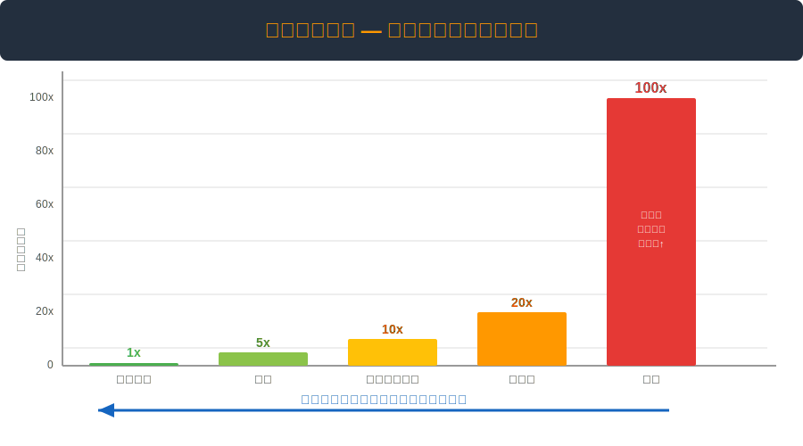


---

# シフトレフトの5原則

- <svg viewBox="0 0 800 400" style="max-height:70vh;max-width:100%;display:block;margin:0 auto;" xmlns="http://www.w3.org/2000/svg"><rect width="800" height="400" fill="#1a1a2e"/><text x="400" y="35" text-anchor="middle" fill="#f9a825" font-size="18" font-family="sans-serif" font-weight="bold">セキュリティゲート 判断フロー</text>
<rect x="305" y="60" width="190" height="48" rx="6" fill="#1565c0" stroke="#42a5f5" stroke-width="1.5"/><text x="400" y="89" text-anchor="middle" fill="#ffffff" font-size="13" font-family="sans-serif">コードプッシュ</text>
<line x1="400" y1="108" x2="400" y2="126" stroke="#f9a825" stroke-width="2"/><polygon points="394,121 400,136 406,121" fill="#f9a825"/>
<rect x="305" y="136" width="190" height="48" rx="6" fill="#16213e" stroke="#f9a825" stroke-width="1.5"/><text x="400" y="165" text-anchor="middle" fill="#ffffff" font-size="13" font-family="sans-serif">自動スキャン実行</text>
<line x1="400" y1="184" x2="400" y2="202" stroke="#f9a825" stroke-width="2"/><polygon points="394,197 400,212 406,197" fill="#f9a825"/>
<polygon points="400,212 490,248 400,284 310,248" fill="#16213e" stroke="#f9a825" stroke-width="1.5"/>
<text x="400" y="244" text-anchor="middle" fill="#f9a825" font-size="12" font-family="sans-serif">重大な脆弱性</text>
<text x="400" y="262" text-anchor="middle" fill="#f9a825" font-size="12" font-family="sans-serif">あり?</text>
<line x1="490" y1="248" x2="560" y2="248" stroke="#e91e63" stroke-width="2"/><polygon points="555,242 570,248 555,254" fill="#e91e63"/>
<text x="525" y="240" fill="#e91e63" font-size="11" font-family="sans-serif">YES</text>
<rect x="570" y="224" width="180" height="48" rx="6" fill="#b71c1c" stroke="#e91e63" stroke-width="1.5"/><text x="660" y="253" text-anchor="middle" fill="#ffffff" font-size="13" font-family="sans-serif">パイプライン停止</text>
<line x1="400" y1="284" x2="400" y2="312" stroke="#66bb6a" stroke-width="2"/><polygon points="394,307 400,322 406,307" fill="#66bb6a"/>
<text x="415" y="302" fill="#66bb6a" font-size="11" font-family="sans-serif">NO</text>
<rect x="305" y="322" width="190" height="48" rx="6" fill="#1b5e20" stroke="#66bb6a" stroke-width="1.5"/><text x="400" y="351" text-anchor="middle" fill="#ffffff" font-size="13" font-family="sans-serif">次ステージへ進む</text>
<text x="400" y="390" text-anchor="middle" fill="#888" font-size="11" font-family="sans-serif">Critical/High は即時ブロック — Low は許容ポリシー設定可</text></svg>
- ① **早期発見**: コードレビュー時にセキュリティ問題を検出
- ② **自動化**: すべてのセキュリティチェックをCI/CDに統合
- ③ **開発者ファースト**: 修正方法を明示し、学習機会に変える
- ④ **段階的導入**: まず高リスク項目から自動化を開始
- ⑤ **継続的計測**: MTTRやfalse positive率でKPIを管理


---

# CI/CDセキュリティパイプライン

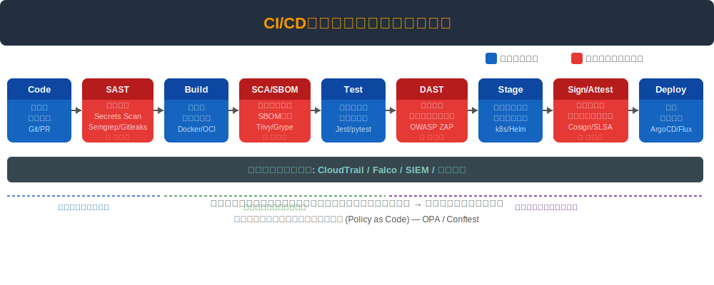


---

<!-- _class: lead -->
# SAST（静的解析）

- コードを実行せず脆弱性を検出するホワイトボックステスト手法


---

# SASTとは — 検出できる脆弱性

- <svg viewBox="0 0 800 400" style="max-height:70vh;max-width:100%;display:block;margin:0 auto;" xmlns="http://www.w3.org/2000/svg"><rect width="800" height="400" fill="#1a1a2e"/><text x="400" y="35" text-anchor="middle" fill="#f9a825" font-size="18" font-family="sans-serif" font-weight="bold">コンテナイメージ スキャンパイプライン</text>
<rect x="20" y="155" width="110" height="50" rx="6" fill="#16213e" stroke="#42a5f5" stroke-width="1.5"/><text x="75" y="185" text-anchor="middle" fill="#ffffff" font-size="13" font-family="sans-serif">Dockerfile</text>
<line x1="130" y1="180" x2="148" y2="180" stroke="#f9a825" stroke-width="2"/><polygon points="143,174 158,180 143,186" fill="#f9a825"/>
<rect x="158" y="155" width="110" height="50" rx="6" fill="#16213e" stroke="#f9a825" stroke-width="1.5"/><text x="213" y="185" text-anchor="middle" fill="#ffffff" font-size="11" font-family="sans-serif">イメージビルド</text>
<line x1="268" y1="180" x2="286" y2="180" stroke="#f9a825" stroke-width="2"/><polygon points="281,174 296,180 281,186" fill="#f9a825"/>
<rect x="296" y="155" width="110" height="50" rx="6" fill="#1565c0" stroke="#42a5f5" stroke-width="1.5"/><text x="351" y="185" text-anchor="middle" fill="#ffffff" font-size="11" font-family="sans-serif">脆弱性スキャン</text>
<line x1="406" y1="180" x2="424" y2="180" stroke="#f9a825" stroke-width="2"/><polygon points="419,174 434,180 419,186" fill="#f9a825"/>
<polygon points="460,155 505,180 460,205" fill="#16213e" stroke="#f9a825" stroke-width="1.5"/>
<text x="462" y="177" text-anchor="middle" fill="#f9a825" font-size="10" font-family="sans-serif">合格?</text>
<text x="462" y="193" text-anchor="middle" fill="#f9a825" font-size="10" font-family="sans-serif">PASS?</text>
<line x1="505" y1="180" x2="540" y2="180" stroke="#66bb6a" stroke-width="2"/><polygon points="535,174 550,180 535,186" fill="#66bb6a"/>
<text x="522" y="170" fill="#66bb6a" font-size="10" font-family="sans-serif">YES</text>
<rect x="550" y="155" width="110" height="50" rx="6" fill="#1b5e20" stroke="#66bb6a" stroke-width="1.5"/><text x="605" y="185" text-anchor="middle" fill="#ffffff" font-size="11" font-family="sans-serif">レジストリPUSH</text>
<line x1="660" y1="180" x2="698" y2="180" stroke="#66bb6a" stroke-width="2"/><polygon points="693,174 708,180 693,186" fill="#66bb6a"/>
<rect x="708" y="155" width="72" height="50" rx="6" fill="#1b5e20" stroke="#66bb6a" stroke-width="1.5"/><text x="744" y="185" text-anchor="middle" fill="#ffffff" font-size="11" font-family="sans-serif">デプロイ</text>
<line x1="462" y1="205" x2="462" y2="265" stroke="#e91e63" stroke-width="2"/><polygon points="456,260 462,275 468,260" fill="#e91e63"/>
<text x="477" y="240" fill="#e91e63" font-size="10" font-family="sans-serif">NO</text>
<rect x="362" y="275" width="200" height="48" rx="6" fill="#b71c1c" stroke="#e91e63" stroke-width="1.5"/><text x="462" y="304" text-anchor="middle" fill="#ffffff" font-size="13" font-family="sans-serif">ビルド失敗 / 通知</text>
<text x="400" y="360" text-anchor="middle" fill="#888" font-size="11" font-family="sans-serif">Trivy / Snyk / ECR Scan — Critical CVE はブロック</text></svg>
- **SAST（Static Application Security Testing）**
- SQLインジェクション / コマンドインジェクション
- クロスサイトスクリプティング（XSS）
- 安全でない暗号化・ハードコードされたシークレット
- バッファオーバーフロー・メモリリーク
- 安全でないデシリアライゼーション


---

# SASTツール比較

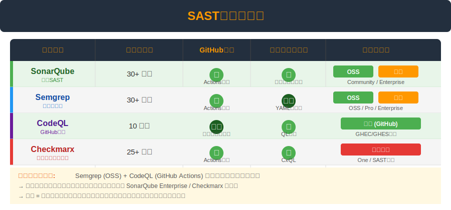


---

# Semgrep実践 — カスタムルール

- <svg viewBox="0 0 800 400" style="max-height:70vh;max-width:100%;display:block;margin:0 auto;" xmlns="http://www.w3.org/2000/svg"><rect width="800" height="400" fill="#1a1a2e"/><text x="400" y="35" text-anchor="middle" fill="#f9a825" font-size="18" font-family="sans-serif" font-weight="bold">IaC セキュリティチェックフロー</text>
<rect x="20" y="162" width="120" height="46" rx="6" fill="#16213e" stroke="#42a5f5" stroke-width="1.5"/><text x="80" y="190" text-anchor="middle" fill="#ffffff" font-size="13" font-family="sans-serif">Terraform/CF</text>
<line x1="140" y1="185" x2="158" y2="185" stroke="#f9a825" stroke-width="2"/><polygon points="153,179 168,185 153,191" fill="#f9a825"/>
<rect x="168" y="162" width="120" height="46" rx="6" fill="#1565c0" stroke="#42a5f5" stroke-width="1.5"/><text x="228" y="190" text-anchor="middle" fill="#ffffff" font-size="13" font-family="sans-serif">静的解析</text>
<text x="228" y="222" text-anchor="middle" fill="#42a5f5" font-size="10" font-family="sans-serif">tfsec / Checkov</text>
<line x1="288" y1="185" x2="306" y2="185" stroke="#f9a825" stroke-width="2"/><polygon points="301,179 316,185 301,191" fill="#f9a825"/>
<rect x="316" y="162" width="120" height="46" rx="6" fill="#4a148c" stroke="#ce93d8" stroke-width="1.5"/><text x="376" y="190" text-anchor="middle" fill="#ffffff" font-size="11" font-family="sans-serif">ポリシーチェック</text>
<text x="376" y="222" text-anchor="middle" fill="#ce93d8" font-size="10" font-family="sans-serif">OPA / Sentinel</text>
<line x1="436" y1="185" x2="454" y2="185" stroke="#f9a825" stroke-width="2"/><polygon points="449,179 464,185 449,191" fill="#f9a825"/>
<rect x="464" y="162" width="120" height="46" rx="6" fill="#16213e" stroke="#f9a825" stroke-width="1.5"/><text x="524" y="190" text-anchor="middle" fill="#ffffff" font-size="13" font-family="sans-serif">コストチェック</text>
<text x="524" y="222" text-anchor="middle" fill="#f9a825" font-size="10" font-family="sans-serif">Infracost</text>
<line x1="584" y1="185" x2="602" y2="185" stroke="#66bb6a" stroke-width="2"/><polygon points="597,179 612,185 597,191" fill="#66bb6a"/>
<rect x="612" y="162" width="120" height="46" rx="6" fill="#1b5e20" stroke="#66bb6a" stroke-width="1.5"/><text x="672" y="190" text-anchor="middle" fill="#ffffff" font-size="11" font-family="sans-serif">ドリフト検出</text>
<line x1="732" y1="185" x2="750" y2="185" stroke="#66bb6a" stroke-width="2"/><polygon points="745,179 760,185 745,191" fill="#66bb6a"/>
<rect x="762" y="162" width="18" height="46" rx="6" fill="#1b5e20" stroke="#66bb6a" stroke-width="1.5"/><text x="771" y="190" text-anchor="middle" fill="#ffffff" font-size="13" font-family="sans-serif"></text>
<rect x="168" y="270" width="464" height="48" rx="6" fill="#16213e" stroke="#f9a825" stroke-width="1.5"/>
<text x="400" y="292" text-anchor="middle" fill="#ffffff" font-size="12" font-family="sans-serif" font-weight="bold">検出される設定ミス例</text>
<text x="400" y="312" text-anchor="middle" fill="#f9a825" font-size="11" font-family="sans-serif">S3パブリック公開 / SG 0.0.0.0/0 / 暗号化なし / IAM *</text>
<text x="400" y="360" text-anchor="middle" fill="#888" font-size="11" font-family="sans-serif">インフラコードもアプリコードと同様にスキャン必須</text></svg>
- **Semgrep**: パターンマッチングで独自ルールを記述
- 公式レジストリに2,000+のルールが公開済み
- CI/CD: `semgrep --config=auto --error`


---

# Semgrep実践 — カスタムルール（コード例）

```yaml
rules:
  - id: hardcoded-secret
    patterns:
      - pattern: $SECRET = "..."
      - metavariable-regex:
          metavariable: $SECRET
          regex: '(?i)(password|secret|token|key)'
    message: ハードコードされたシークレットを検出
    languages: [python, javascript, typescript]
    severity: ERROR
```


---

# CodeQL — GitHub Actions連携

- <svg viewBox="0 0 800 400" style="max-height:70vh;max-width:100%;display:block;margin:0 auto;" xmlns="http://www.w3.org/2000/svg"><rect width="800" height="400" fill="#1a1a2e"/><text x="400" y="35" text-anchor="middle" fill="#f9a825" font-size="18" font-family="sans-serif" font-weight="bold">Compliance as Code ワークフロー</text>
<rect x="20" y="75" width="155" height="48" rx="6" fill="#16213e" stroke="#e91e63" stroke-width="1.5"/><text x="97.5" y="104" text-anchor="middle" fill="#ffffff" font-size="13" font-family="sans-serif">規制要件</text>
<text x="97" y="140" text-anchor="middle" fill="#888" font-size="10" font-family="sans-serif">PCI-DSS / SOC2 / ISO27001</text>
<rect x="20" y="215" width="155" height="48" rx="6" fill="#16213e" stroke="#e91e63" stroke-width="1.5"/><text x="97.5" y="244" text-anchor="middle" fill="#ffffff" font-size="13" font-family="sans-serif">ベースライン</text>
<text x="97" y="280" text-anchor="middle" fill="#888" font-size="10" font-family="sans-serif">CIS Benchmark / NIST</text>
<line x1="175" y1="99" x2="230" y2="150" stroke="#f9a825" stroke-width="2"/>
<polygon points="222,143 234,155 221,142" fill="#f9a825"/>
<line x1="175" y1="239" x2="230" y2="200" stroke="#f9a825" stroke-width="2"/>
<polygon points="225,196 236,207 223,195" fill="#f9a825"/>
<rect x="240" y="148" width="155" height="48" rx="6" fill="#4a148c" stroke="#ce93d8" stroke-width="1.5"/><text x="317.5" y="177" text-anchor="middle" fill="#ffffff" font-size="11" font-family="sans-serif">ポリシーコード化</text>
<text x="317" y="213" text-anchor="middle" fill="#ce93d8" font-size="10" font-family="sans-serif">OPA Rego / Config Rules</text>
<line x1="395" y1="172" x2="428" y2="172" stroke="#f9a825" stroke-width="2"/><polygon points="423,166 438,172 423,178" fill="#f9a825"/>
<rect x="438" y="148" width="155" height="48" rx="6" fill="#1565c0" stroke="#42a5f5" stroke-width="1.5"/><text x="515.5" y="177" text-anchor="middle" fill="#ffffff" font-size="12" font-family="sans-serif">継続的監査</text>
<text x="515" y="213" text-anchor="middle" fill="#42a5f5" font-size="10" font-family="sans-serif">自動評価・レポート</text>
<line x1="593" y1="172" x2="626" y2="172" stroke="#66bb6a" stroke-width="2"/><polygon points="621,166 636,172 621,178" fill="#66bb6a"/>
<rect x="636" y="148" width="144" height="48" rx="6" fill="#1b5e20" stroke="#66bb6a" stroke-width="1.5"/><text x="708" y="177" text-anchor="middle" fill="#ffffff" font-size="11" font-family="sans-serif">合格 / 修正指示</text>
<rect x="240" y="290" width="400" height="45" rx="6" fill="#16213e" stroke="#f9a825" stroke-width="1.5"/>
<text x="440" y="310" text-anchor="middle" fill="#ffffff" font-size="12" font-family="sans-serif" font-weight="bold">コンプライアンス状態をダッシュボードで可視化</text>
<text x="440" y="328" text-anchor="middle" fill="#f9a825" font-size="11" font-family="sans-serif">Security Hub / AWS Config / Prowler</text>
<text x="400" y="370" text-anchor="middle" fill="#888" font-size="11" font-family="sans-serif">手作業監査を自動化 — 常時準拠状態を維持</text></svg>
- **CodeQL**: GitHubネイティブ統合、PRにインラインコメント
- クエリ言語でカスタム脆弱性検出ルールを定義可能


---

# CodeQL — GitHub Actions連携（コード例）

```yaml
name: CodeQL Analysis
on: [push, pull_request]
jobs:
  analyze:
    runs-on: ubuntu-latest
    steps:
      - uses: actions/checkout@v4
      - uses: github/codeql-action/init@v3
        with:
          languages: javascript, python
      - uses: github/codeql-action/autobuild@v3
      - uses: github/codeql-action/analyze@v3
```


---

<!-- _class: lead -->
# SCA・依存性管理

- オープンソースコンポーネントの脆弱性とライセンスを管理


---

# SCA（Software Composition Analysis）とは

- <svg viewBox="0 0 800 200" style="max-height:70vh;max-width:100%;display:block;margin:0 auto;" xmlns="http://www.w3.org/2000/svg"><rect width="800" height="200" fill="#1a1a2e"/><text x="400" y="28" text-anchor="middle" fill="#f9a825" font-size="16" font-family="sans-serif" font-weight="bold">SCA スキャンフロー</text><rect x="40" y="50" width="140" height="110" rx="6" fill="#16213e" stroke="#42a5f5" stroke-width="1.5"/><text x="110" y="110" text-anchor="middle" fill="#ffffff" font-size="11" font-family="sans-serif">ソースコード</text><line x1="180" y1="105" x2="210" y2="105" stroke="#f9a825" stroke-width="2"/><polygon points="205,99 220,105 205,111" fill="#f9a825"/><rect x="220" y="50" width="160" height="110" rx="6" fill="#16213e" stroke="#f9a825" stroke-width="1.5"/><text x="300" y="110" text-anchor="middle" fill="#ffffff" font-size="11" font-family="sans-serif">依存性解析</text><line x1="380" y1="105" x2="410" y2="105" stroke="#f9a825" stroke-width="2"/><polygon points="405,99 420,105 405,111" fill="#f9a825"/><rect x="420" y="50" width="160" height="110" rx="6" fill="#1565c0" stroke="#42a5f5" stroke-width="1.5"/><text x="500" y="110" text-anchor="middle" fill="#ffffff" font-size="11" font-family="sans-serif">CVE照合</text><line x1="580" y1="105" x2="610" y2="105" stroke="#66bb6a" stroke-width="2"/><polygon points="605,99 620,105 605,111" fill="#66bb6a"/><rect x="620" y="50" width="140" height="110" rx="6" fill="#1b5e20" stroke="#66bb6a" stroke-width="1.5"/><text x="690" y="110" text-anchor="middle" fill="#ffffff" font-size="11" font-family="sans-serif">レポート</text></svg>
- **SCA**: 使用している OSS の脆弱性・ライセンスを自動スキャン
| ツール | 特徴 | 価格 |
|--------|------|------|
| Dependabot | GitHub統合、自動PR | 無料 |
| Snyk | 開発者向けUI、修正提案 | Free/有償 |
| OWASP Dep-Check | エンタープライズ対応 | 無料 |
| Renovate | 柔軟な自動更新設定 | OSS |


---

# OSSライセンスリスク

- <svg viewBox="0 0 800 200" style="max-height:70vh;max-width:100%;display:block;margin:0 auto;" xmlns="http://www.w3.org/2000/svg"><rect width="800" height="200" fill="#1a1a2e"/><text x="400" y="28" text-anchor="middle" fill="#f9a825" font-size="16" font-family="sans-serif" font-weight="bold">SAST vs DAST</text><rect x="60" y="50" width="300" height="110" rx="6" fill="#16213e" stroke="#42a5f5" stroke-width="1.5"/><text x="210" y="110" text-anchor="middle" fill="#ffffff" font-size="12" font-family="sans-serif">SAST (静的)</text><text x="210" y="85" text-anchor="middle" fill="#ffffff" font-size="11" font-family="sans-serif">コード解析</text><text x="210" y="105" text-anchor="middle" fill="#888" font-size="10" font-family="sans-serif">実行前・早期検出</text><text x="210" y="123" text-anchor="middle" fill="#888" font-size="10" font-family="sans-serif">False Positive多め</text><rect x="440" y="50" width="300" height="110" rx="6" fill="#16213e" stroke="#e91e63" stroke-width="1.5"/><text x="590" y="110" text-anchor="middle" fill="#ffffff" font-size="12" font-family="sans-serif">DAST (動的)</text><text x="590" y="85" text-anchor="middle" fill="#ffffff" font-size="11" font-family="sans-serif">実行時テスト</text><text x="590" y="105" text-anchor="middle" fill="#888" font-size="10" font-family="sans-serif">本番前・実際の脆弱性検出</text><text x="590" y="123" text-anchor="middle" fill="#888" font-size="10" font-family="sans-serif">実行環境必要</text><text x="400" y="185" text-anchor="middle" fill="#f9a825" font-size="11" font-family="sans-serif">両方の組み合わせで高いカバレッジを実現</text></svg>
| ライセンス | 商用利用 | コピーレフト | リスク |
|------------|---------|-------------|--------|
| MIT / Apache 2.0 | ✓ | なし | 低 |
| LGPL | ✓（条件付き）| 弱い | 中 |
| GPL v2/v3 | ✓（条件付き）| 強い | 高 |
| AGPL | ✓（条件付き）| 最強 | 高 |
- **対策**: SCA + ライセンス承認ポリシーを定義


---

# Dependabot設定例

- <svg viewBox="0 0 800 400" style="max-height:70vh;max-width:100%;display:block;margin:0 auto;" xmlns="http://www.w3.org/2000/svg"><rect width="800" height="400" fill="#1a1a2e"/><text x="400" y="35" text-anchor="middle" fill="#f9a825" font-size="18" font-family="sans-serif" font-weight="bold">ゼロトラスト アーキテクチャ</text>
<rect x="295" y="150" width="210" height="115" rx="8" fill="#16213e" stroke="#f9a825" stroke-width="2"/>
<text x="400" y="190" text-anchor="middle" fill="#f9a825" font-size="13" font-family="sans-serif" font-weight="bold">ポリシーエンジン</text>
<text x="400" y="210" text-anchor="middle" fill="#ffffff" font-size="11" font-family="sans-serif">Never Trust, Always Verify</text>
<text x="400" y="230" text-anchor="middle" fill="#888" font-size="10" font-family="sans-serif">IAM / MFA / デバイス証明書</text>
<text x="400" y="250" text-anchor="middle" fill="#888" font-size="10" font-family="sans-serif">継続的認証・認可</text>
<rect x="20" y="80" width="140" height="46" rx="6" fill="#16213e" stroke="#42a5f5" stroke-width="1.5"/><text x="90" y="108" text-anchor="middle" fill="#ffffff" font-size="13" font-family="sans-serif">ユーザー</text>
<rect x="20" y="178" width="140" height="46" rx="6" fill="#16213e" stroke="#42a5f5" stroke-width="1.5"/><text x="90" y="206" text-anchor="middle" fill="#ffffff" font-size="13" font-family="sans-serif">デバイス</text>
<rect x="20" y="278" width="140" height="46" rx="6" fill="#16213e" stroke="#42a5f5" stroke-width="1.5"/><text x="90" y="306" text-anchor="middle" fill="#ffffff" font-size="13" font-family="sans-serif">ワークロード</text>
<rect x="640" y="80" width="140" height="46" rx="6" fill="#16213e" stroke="#66bb6a" stroke-width="1.5"/><text x="710" y="108" text-anchor="middle" fill="#ffffff" font-size="13" font-family="sans-serif">アプリ A</text>
<rect x="640" y="178" width="140" height="46" rx="6" fill="#16213e" stroke="#66bb6a" stroke-width="1.5"/><text x="710" y="206" text-anchor="middle" fill="#ffffff" font-size="13" font-family="sans-serif">アプリ B</text>
<rect x="640" y="278" width="140" height="46" rx="6" fill="#16213e" stroke="#66bb6a" stroke-width="1.5"/><text x="710" y="306" text-anchor="middle" fill="#ffffff" font-size="13" font-family="sans-serif">データストア</text>
<line x1="160" y1="103" x2="295" y2="175" stroke="#f9a825" stroke-width="1.5"/><polygon points="287,169 299,180 287,167" fill="#f9a825"/>
<line x1="160" y1="201" x2="295" y2="205" stroke="#f9a825" stroke-width="1.5"/><polygon points="289,199 304,205 289,211" fill="#f9a825"/>
<line x1="160" y1="301" x2="295" y2="245" stroke="#f9a825" stroke-width="1.5"/><polygon points="288,240 300,249 288,238" fill="#f9a825"/>
<line x1="505" y1="175" x2="640" y2="103" stroke="#66bb6a" stroke-width="1.5"/><polygon points="632,98 644,107 633,96" fill="#66bb6a"/>
<line x1="505" y1="205" x2="640" y2="201" stroke="#66bb6a" stroke-width="1.5"/><polygon points="634,195 649,201 634,207" fill="#66bb6a"/>
<line x1="505" y1="245" x2="640" y2="301" stroke="#66bb6a" stroke-width="1.5"/><polygon points="633,295 645,304 633,293" fill="#66bb6a"/>
<text x="400" y="375" text-anchor="middle" fill="#888" font-size="11" font-family="sans-serif">ネットワーク境界ではなくID・コンテキストで判断</text></svg>
- 週次自動PR + グルーピングで更新コストを削減


---

# Dependabot設定例（コード例）

```yaml
# .github/dependabot.yml
version: 2
updates:
  - package-ecosystem: npm
    directory: "/"
    schedule:
      interval: weekly
    open-pull-requests-limit: 10
    groups:
      production-dependencies:
        dependency-type: production
        update-types:
          - minor
          - patch
```


---

<!-- _class: lead -->
# シークレットスキャン

- コードリポジトリへの誤ったシークレット混入を検出・防止


---

# シークレットスキャンとは

- <svg viewBox="0 0 800 400" style="max-height:70vh;max-width:100%;display:block;margin:0 auto;" xmlns="http://www.w3.org/2000/svg"><rect width="800" height="400" fill="#1a1a2e"/><text x="400" y="35" text-anchor="middle" fill="#f9a825" font-size="18" font-family="sans-serif" font-weight="bold">シークレット管理 ベストプラクティス</text>
<rect x="295" y="65" width="210" height="50" rx="6" fill="#4a148c" stroke="#ce93d8" stroke-width="1.5"/><text x="400" y="95" text-anchor="middle" fill="#ffffff" font-size="13" font-family="sans-serif">シークレットストア</text>
<text x="400" y="133" text-anchor="middle" fill="#ce93d8" font-size="10" font-family="sans-serif">AWS Secrets Manager / HashiCorp Vault</text>
<line x1="400" y1="115" x2="400" y2="148" stroke="#f9a825" stroke-width="2"/><polygon points="394,143 400,158 406,143" fill="#f9a825"/>
<rect x="295" y="158" width="210" height="50" rx="6" fill="#1565c0" stroke="#42a5f5" stroke-width="1.5"/><text x="400" y="188" text-anchor="middle" fill="#ffffff" font-size="12" font-family="sans-serif">動的クレデンシャル</text>
<text x="400" y="226" text-anchor="middle" fill="#42a5f5" font-size="10" font-family="sans-serif">短期有効期限・自動ローテーション</text>
<line x1="295" y1="183" x2="220" y2="183" stroke="#f9a825" stroke-width="2"/><polygon points="225,177 210,183 225,189" fill="#f9a825"/>
<rect x="30" y="158" width="170" height="50" rx="6" fill="#16213e" stroke="#66bb6a" stroke-width="1.5"/><text x="115" y="188" text-anchor="middle" fill="#ffffff" font-size="12" font-family="sans-serif">アプリケーション</text>
<text x="115" y="226" text-anchor="middle" fill="#888" font-size="10" font-family="sans-serif">APIで取得 / 環境変数に依存しない</text>
<line x1="505" y1="183" x2="570" y2="183" stroke="#f9a825" stroke-width="2"/><polygon points="565,177 580,183 565,189" fill="#f9a825"/>
<rect x="580" y="158" width="190" height="50" rx="6" fill="#16213e" stroke="#66bb6a" stroke-width="1.5"/><text x="675" y="188" text-anchor="middle" fill="#ffffff" font-size="11" font-family="sans-serif">CI/CDパイプライン</text>
<text x="675" y="226" text-anchor="middle" fill="#888" font-size="10" font-family="sans-serif">Gitにシークレットを保存しない</text>
<rect x="130" y="280" width="540" height="55" rx="8" fill="#16213e" stroke="#e91e63" stroke-width="2"/>
<text x="400" y="303" text-anchor="middle" fill="#e91e63" font-size="13" font-family="sans-serif" font-weight="bold">禁止事項</text>
<text x="400" y="323" text-anchor="middle" fill="#ffffff" font-size="11" font-family="sans-serif">ハードコード / .env をGitコミット / ログへの出力 / 長期キー</text>
<text x="400" y="370" text-anchor="middle" fill="#888" font-size="11" font-family="sans-serif">git-secrets / truffleHog で事前検出</text></svg>
- **問題**: APIキー・パスワードをGitにコミットする事故が年間数千件
- **被害**: クレデンシャルの悪用→不正アクセス→データ漏洩
- **検出対象**: AWS/GCP APIキー・DBパスワード・JWTシークレット・OAuthトークン
- **3層防御**: pre-commit フック → CI/CDスキャン → リポジトリ監視


---

# シークレットスキャンツール比較

- <svg viewBox="0 0 800 200" style="max-height:70vh;max-width:100%;display:block;margin:0 auto;" xmlns="http://www.w3.org/2000/svg"><rect width="800" height="200" fill="#1a1a2e"/><text x="400" y="28" text-anchor="middle" fill="#f9a825" font-size="16" font-family="sans-serif" font-weight="bold">セキュリティ KPI</text><rect x="30" y="50" width="170" height="110" rx="6" fill="#16213e" stroke="#42a5f5" stroke-width="1.5"/><text x="115" y="110" text-anchor="middle" fill="#ffffff" font-size="11" font-family="sans-serif">脆弱性MTTR</text><text x="115" y="120" text-anchor="middle" fill="#888" font-size="10" font-family="sans-serif">平均修復時間</text><rect x="220" y="50" width="170" height="110" rx="6" fill="#16213e" stroke="#e91e63" stroke-width="1.5"/><text x="305" y="110" text-anchor="middle" fill="#ffffff" font-size="11" font-family="sans-serif">Critical件数</text><text x="305" y="120" text-anchor="middle" fill="#888" font-size="10" font-family="sans-serif">未対処Critical CVE</text><rect x="410" y="50" width="170" height="110" rx="6" fill="#16213e" stroke="#f9a825" stroke-width="1.5"/><text x="495" y="110" text-anchor="middle" fill="#ffffff" font-size="11" font-family="sans-serif">カバレッジ</text><text x="495" y="120" text-anchor="middle" fill="#888" font-size="10" font-family="sans-serif">コードスキャン率</text><rect x="600" y="50" width="170" height="110" rx="6" fill="#4a148c" stroke="#ce93d8" stroke-width="1.5"/><text x="685" y="110" text-anchor="middle" fill="#ffffff" font-size="11" font-family="sans-serif">偽陽性率</text><text x="685" y="120" text-anchor="middle" fill="#888" font-size="10" font-family="sans-serif">False Positive %</text></svg>
| ツール | 実行タイミング | 精度 | カスタムパターン |
|--------|--------------|------|----------------|
| GitLeaks | pre-commit/CI | 高 | ✓ |
| TruffleHog v3 | CI/GitHubActions | 最高 | ✓ |
| GitHub Secret Scanning | Push時 | 高（パートナー）| 限定 |
| detect-secrets | pre-commit | 中 | ✓ |
- **推奨**: TruffleHog v3（エントロピー検出） + GitHub Secret Scanning


---

# pre-commitフック設定

- <svg viewBox="0 0 800 400" style="max-height:70vh;max-width:100%;display:block;margin:0 auto;" xmlns="http://www.w3.org/2000/svg"><rect width="800" height="400" fill="#1a1a2e"/><text x="400" y="35" text-anchor="middle" fill="#f9a825" font-size="18" font-family="sans-serif" font-weight="bold">DevSecOps サイクル</text><rect x="80" y="160" width="130" height="55" rx="6" fill="#1565c0" stroke="#f9a825" stroke-width="1.5"/><text x="145" y="192.5" text-anchor="middle" fill="#ffffff" font-size="17" font-family="sans-serif">Dev</text><rect x="335" y="65" width="130" height="55" rx="6" fill="#b71c1c" stroke="#e91e63" stroke-width="1.5"/><text x="400" y="97.5" text-anchor="middle" fill="#ffffff" font-size="17" font-family="sans-serif">Sec</text><rect x="590" y="160" width="130" height="55" rx="6" fill="#1b5e20" stroke="#66bb6a" stroke-width="1.5"/><text x="655" y="192.5" text-anchor="middle" fill="#ffffff" font-size="17" font-family="sans-serif">Ops</text><path d="M210,187 Q335,140 335,120" stroke="#f9a825" stroke-width="2" fill="none"/><polygon points="333,108 341,124 325,124" fill="#f9a825"/><path d="M465,92 Q530,130 590,175" stroke="#f9a825" stroke-width="2" fill="none"/><polygon points="582,169 594,181 579,180" fill="#f9a825"/><path d="M590,215 Q400,320 210,215" stroke="#f9a825" stroke-width="2" fill="none"/><polygon points="212,207 204,220 219,221" fill="#f9a825"/><text x="260" y="130" text-anchor="middle" fill="#ffffff" font-size="11" font-family="sans-serif">設計・実装</text><text x="550" y="135" text-anchor="middle" fill="#ffffff" font-size="11" font-family="sans-serif">テスト・スキャン</text><text x="400" y="310" text-anchor="middle" fill="#ffffff" font-size="11" font-family="sans-serif">監視・フィードバック</text><rect x="315" y="170" width="170" height="45" rx="6" fill="#4a148c" stroke="#ce93d8" stroke-width="1.5"/><text x="400" y="197.5" text-anchor="middle" fill="#ffffff" font-size="11" font-family="sans-serif">継続的セキュリティ</text><text x="400" y="375" text-anchor="middle" fill="#888" font-size="11" font-family="sans-serif">セキュリティを全フェーズに統合</text></svg>
- `pre-commit install` で自動的にフックを登録


---

# pre-commitフック設定（コード例）

```yaml
# .pre-commit-config.yaml
repos:
  - repo: https://github.com/gitleaks/gitleaks
    rev: v8.18.4
    hooks:
      - id: gitleaks
  - repo: https://github.com/Yelp/detect-secrets
    rev: v1.4.0
    hooks:
      - id: detect-secrets
        args: ['--baseline', '.secrets.baseline']
```


---

# HashiCorp Vault — CI/CD連携

- <svg viewBox="0 0 800 400" style="max-height:70vh;max-width:100%;display:block;margin:0 auto;" xmlns="http://www.w3.org/2000/svg"><rect width="800" height="400" fill="#1a1a2e"/><text x="400" y="35" text-anchor="middle" fill="#f9a825" font-size="18" font-family="sans-serif" font-weight="bold">シフトレフト セキュリティ</text><line x1="60" y1="200" x2="740" y2="200" stroke="#444" stroke-width="2"/><polygon points="735,194 750,200 735,206" fill="#444"/><rect x="60" y="158" width="100" height="44" rx="6" fill="#16213e" stroke="#f9a825" stroke-width="1.5"/><text x="110" y="185" text-anchor="middle" fill="#ffffff" font-size="13" font-family="sans-serif">設計</text><rect x="183" y="158" width="100" height="44" rx="6" fill="#16213e" stroke="#f9a825" stroke-width="1.5"/><text x="233" y="185" text-anchor="middle" fill="#ffffff" font-size="11" font-family="sans-serif">コーディング</text><rect x="306" y="158" width="100" height="44" rx="6" fill="#16213e" stroke="#f9a825" stroke-width="1.5"/><text x="356" y="185" text-anchor="middle" fill="#ffffff" font-size="13" font-family="sans-serif">ビルド</text><rect x="429" y="158" width="100" height="44" rx="6" fill="#16213e" stroke="#555" stroke-width="1.5"/><text x="479" y="185" text-anchor="middle" fill="#ffffff" font-size="13" font-family="sans-serif">テスト</text><rect x="552" y="158" width="100" height="44" rx="6" fill="#16213e" stroke="#e91e63" stroke-width="1.5"/><text x="602" y="185" text-anchor="middle" fill="#ffffff" font-size="13" font-family="sans-serif">本番</text><text x="110" y="228" text-anchor="middle" fill="#f9a825" font-size="10" font-family="sans-serif">脅威モデリング</text><text x="233" y="228" text-anchor="middle" fill="#f9a825" font-size="10" font-family="sans-serif">SAST/シークレット</text><text x="356" y="228" text-anchor="middle" fill="#f9a825" font-size="10" font-family="sans-serif">SCA/SBOM</text><text x="479" y="228" text-anchor="middle" fill="#ffffff" font-size="10" font-family="sans-serif">DAST</text><text x="602" y="228" text-anchor="middle" fill="#e91e63" font-size="10" font-family="sans-serif">CSPM</text><rect x="60" y="255" width="360" height="28" rx="4" fill="#1565c0" opacity="0.7"/><text x="240" y="274" text-anchor="middle" fill="#ffffff" font-size="11" font-family="sans-serif">シフトレフト領域 — 修正コスト: 低</text><rect x="440" y="255" width="212" height="28" rx="4" fill="#e91e63" opacity="0.6"/><text x="546" y="274" text-anchor="middle" fill="#ffffff" font-size="11" font-family="sans-serif">遅延発見 — コスト: 高</text><text x="400" y="355" text-anchor="middle" fill="#888" font-size="11" font-family="sans-serif">早期発見により修正コストを最大1/100に削減</text></svg>
- JWT認証で環境変数にシークレットを注入
- ハードコード不要・有効期限付き動的シークレット


---

# HashiCorp Vault — CI/CD連携（コード例）

```yaml
# GitHub Actions: Vault動的シークレット取得
- name: Retrieve secrets from Vault
  uses: hashicorp/vault-action@v3
  with:
    url: https://vault.example.com
    method: jwt
    jwtGithubAudience: vault.example.com
    secrets: |
      secret/data/app/prod db_password | DB_PASSWORD ;
      aws/creds/my-role access_key | AWS_ACCESS_KEY_ID
```


---

<!-- _class: lead -->
# DAST（動的解析）

- 実行中のアプリケーションに対する外部攻撃シミュレーション


---

# DASTとは — SAST vs DAST

| 観点 | SAST | DAST |
|------|------|------|
| テスト対象 | ソースコード | 実行中アプリ |
| 実行タイミング | ビルド前 | テスト/ステージング環境 |
| 検出できる問題 | 実装レベルの欠陥 | ランタイム脆弱性・設定ミス |
| False Positive | 高め | 低め |
- **主なツール**: OWASP ZAP, Burp Suite, Nuclei, nikto


---

# OWASP ZAP自動化

- <svg viewBox="0 0 800 400" style="max-height:70vh;max-width:100%;display:block;margin:0 auto;" xmlns="http://www.w3.org/2000/svg"><rect width="800" height="400" fill="#1a1a2e"/><text x="400" y="35" text-anchor="middle" fill="#f9a825" font-size="18" font-family="sans-serif" font-weight="bold">CI/CD セキュリティパイプライン</text><rect x="20" y="162" width="85" height="46" rx="6" fill="#16213e" stroke="#42a5f5" stroke-width="1.5"/><text x="62.5" y="190" text-anchor="middle" fill="#ffffff" font-size="13" font-family="sans-serif">コード</text>
<line x1="105" y1="185" x2="123" y2="185" stroke="#f9a825" stroke-width="2"/><polygon points="118,179 133,185 118,191" fill="#f9a825"/>
<rect x="133" y="162" width="85" height="46" rx="6" fill="#1565c0" stroke="#42a5f5" stroke-width="1.5"/><text x="175.5" y="190" text-anchor="middle" fill="#ffffff" font-size="13" font-family="sans-serif">SAST</text>
<line x1="218" y1="185" x2="236" y2="185" stroke="#f9a825" stroke-width="2"/><polygon points="231,179 246,185 231,191" fill="#f9a825"/>
<rect x="246" y="162" width="85" height="46" rx="6" fill="#1565c0" stroke="#42a5f5" stroke-width="1.5"/><text x="288.5" y="190" text-anchor="middle" fill="#ffffff" font-size="13" font-family="sans-serif">SCA</text>
<line x1="331" y1="185" x2="349" y2="185" stroke="#f9a825" stroke-width="2"/><polygon points="344,179 359,185 344,191" fill="#f9a825"/>
<rect x="359" y="162" width="85" height="46" rx="6" fill="#1b5e20" stroke="#66bb6a" stroke-width="1.5"/><text x="401.5" y="190" text-anchor="middle" fill="#ffffff" font-size="13" font-family="sans-serif">ビルド</text>
<line x1="444" y1="185" x2="462" y2="185" stroke="#f9a825" stroke-width="2"/><polygon points="457,179 472,185 457,191" fill="#f9a825"/>
<rect x="472" y="162" width="85" height="46" rx="6" fill="#1565c0" stroke="#42a5f5" stroke-width="1.5"/><text x="514.5" y="190" text-anchor="middle" fill="#ffffff" font-size="13" font-family="sans-serif">DAST</text>
<line x1="557" y1="185" x2="575" y2="185" stroke="#f9a825" stroke-width="2"/><polygon points="570,179 585,185 570,191" fill="#f9a825"/>
<rect x="585" y="162" width="85" height="46" rx="6" fill="#4a148c" stroke="#ce93d8" stroke-width="1.5"/><text x="627.5" y="190" text-anchor="middle" fill="#ffffff" font-size="13" font-family="sans-serif">Scan</text>
<line x1="670" y1="185" x2="688" y2="185" stroke="#66bb6a" stroke-width="2"/><polygon points="683,179 698,185 683,191" fill="#66bb6a"/>
<rect x="698" y="162" width="82" height="46" rx="6" fill="#1b5e20" stroke="#66bb6a" stroke-width="1.5"/><text x="739" y="190" text-anchor="middle" fill="#ffffff" font-size="13" font-family="sans-serif">Deploy</text>
<rect x="133" y="233" width="537" height="28" rx="4" fill="#16213e" stroke="#f9a825" stroke-width="1.5"/>
<text x="401" y="252" text-anchor="middle" fill="#f9a825" font-size="12" font-family="sans-serif">セキュリティゲート: 失敗時はパイプライン自動停止</text>
<text x="400" y="360" text-anchor="middle" fill="#888" font-size="11" font-family="sans-serif">毎コミットで自動スキャン — 問題を早期に検出・ブロック</text></svg>
- Baselineスキャン: パッシブのみ（安全）
- Full Scan: アクティブ攻撃シミュレーション（ステージングのみ）


---

# OWASP ZAP自動化（コード例）

```yaml
# GitHub Actions: ZAP Scan
- name: ZAP Baseline Scan
  uses: zaproxy/action-baseline@v0.10.0
  with:
    target: 'https://staging.example.com'
    rules_file_name: '.zap/rules.tsv'
    cmd_options: '-a'
  env:
    ZAP_AUTH_HEADER: "Authorization"
    ZAP_AUTH_HEADER_VALUE: ${{ secrets.STAGING_TOKEN }}
```


---

<!-- _class: lead -->
# セキュリティゲート設計

- CI/CDパイプラインで自動的に品質基準を強制する


---

# Gatingポリシー設計

- <svg viewBox="0 0 800 400" style="max-height:70vh;max-width:100%;display:block;margin:0 auto;" xmlns="http://www.w3.org/2000/svg"><rect width="800" height="400" fill="#1a1a2e"/><text x="400" y="35" text-anchor="middle" fill="#f9a825" font-size="18" font-family="sans-serif" font-weight="bold">STRIDE 脅威モデリング</text>
<rect x="20" y="60" width="230" height="52" rx="6" fill="#16213e" stroke="#e91e63" stroke-width="1.5"/><text x="135" y="91" text-anchor="middle" fill="#ffffff" font-size="12" font-family="sans-serif">S — Spoofing (なりすまし)</text>
<text x="135" y="127" text-anchor="middle" fill="#888" font-size="10" font-family="sans-serif">対策: 多要素認証・証明書検証</text>
<rect x="285" y="60" width="230" height="52" rx="6" fill="#16213e" stroke="#e91e63" stroke-width="1.5"/><text x="400" y="91" text-anchor="middle" fill="#ffffff" font-size="12" font-family="sans-serif">T — Tampering (改ざん)</text>
<text x="400" y="127" text-anchor="middle" fill="#888" font-size="10" font-family="sans-serif">対策: デジタル署名・整合性チェック</text>
<rect x="550" y="60" width="230" height="52" rx="6" fill="#16213e" stroke="#e91e63" stroke-width="1.5"/><text x="665" y="91" text-anchor="middle" fill="#ffffff" font-size="12" font-family="sans-serif">R — Repudiation (否認)</text>
<text x="665" y="127" text-anchor="middle" fill="#888" font-size="10" font-family="sans-serif">対策: 監査ログ・タイムスタンプ</text>
<rect x="20" y="150" width="230" height="52" rx="6" fill="#16213e" stroke="#f9a825" stroke-width="1.5"/><text x="135" y="181" text-anchor="middle" fill="#ffffff" font-size="12" font-family="sans-serif">I — Info Disclosure (漏洩)</text>
<text x="135" y="217" text-anchor="middle" fill="#888" font-size="10" font-family="sans-serif">対策: 暗号化・アクセス制御</text>
<rect x="285" y="150" width="230" height="52" rx="6" fill="#16213e" stroke="#f9a825" stroke-width="1.5"/><text x="400" y="181" text-anchor="middle" fill="#ffffff" font-size="12" font-family="sans-serif">D — Denial of Service</text>
<text x="400" y="217" text-anchor="middle" fill="#888" font-size="10" font-family="sans-serif">対策: レート制限・スケーリング</text>
<rect x="550" y="150" width="230" height="52" rx="6" fill="#16213e" stroke="#f9a825" stroke-width="1.5"/><text x="665" y="181" text-anchor="middle" fill="#ffffff" font-size="11" font-family="sans-serif">E — Elevation of Priv (昇格)</text>
<text x="665" y="217" text-anchor="middle" fill="#888" font-size="10" font-family="sans-serif">対策: 最小権限・サンドボックス</text>
<rect x="180" y="250" width="440" height="55" rx="8" fill="#4a148c" stroke="#ce93d8" stroke-width="1.5"/>
<text x="400" y="274" text-anchor="middle" fill="#ffffff" font-size="13" font-family="sans-serif" font-weight="bold">脅威モデリングプロセス</text>
<text x="400" y="295" text-anchor="middle" fill="#ce93d8" font-size="11" font-family="sans-serif">資産特定 → 脅威列挙 → リスク評価 → 対策設計</text>
<text x="400" y="360" text-anchor="middle" fill="#888" font-size="11" font-family="sans-serif">設計フェーズで実施することで手戻りを最小化</text></svg>
- **ゲート1 — コミット時**: シークレットスキャン（違反でブロック）
- **ゲート2 — PR時**: SAST（高・重大脆弱性でブロック）、SCA（CVSSスコア9.0+でブロック）
- **ゲート3 — ビルド時**: コンテナイメージスキャン（CRITICAL CVEでブロック）
- **ゲート4 — デプロイ前**: DAST・ペネトレーション（ステージング）
- **例外管理**: セキュリティチームによる承認フロー


---

# セキュリティKPI・メトリクス

| KPI | 目標値 | 計測ツール |
|-----|--------|-----------|
| MTTR（平均修復時間）| < 7日 | Jira/GitHub |
| 脆弱性密度 | < 0.5/KLOC | SonarQube |
| False Positive率 | < 10% | SAST設定 |
| クリティカル未修正数 | 0件 | SecurityHub |
| SLAコンプライアンス | > 95% | ダッシュボード |


---

<!-- _class: lead -->
# Chapter 3: SBOM・サプライチェーンセキュリティ

- SolarWinds型攻撃への対策・SBOM・SLSA・Sigstore


---

# SolarWinds攻撃 タイムライン

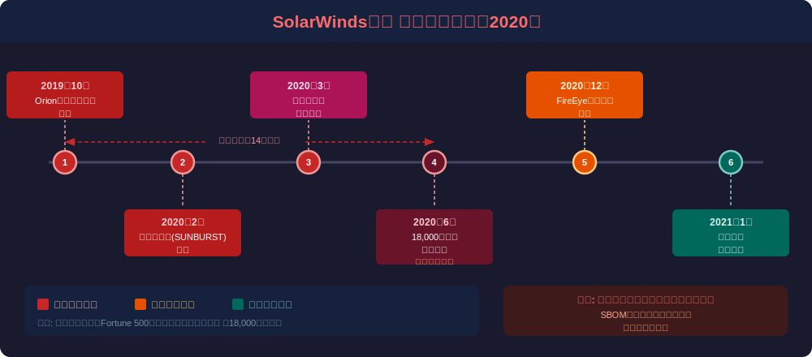


---

# サプライチェーン攻撃の4パターン

- <svg viewBox="0 0 800 400" style="max-height:70vh;max-width:100%;display:block;margin:0 auto;" xmlns="http://www.w3.org/2000/svg"><rect width="800" height="400" fill="#1a1a2e"/><text x="400" y="35" text-anchor="middle" fill="#f9a825" font-size="18" font-family="sans-serif" font-weight="bold">セキュリティゲート 判断フロー</text>
<rect x="305" y="60" width="190" height="48" rx="6" fill="#1565c0" stroke="#42a5f5" stroke-width="1.5"/><text x="400" y="89" text-anchor="middle" fill="#ffffff" font-size="13" font-family="sans-serif">コードプッシュ</text>
<line x1="400" y1="108" x2="400" y2="126" stroke="#f9a825" stroke-width="2"/><polygon points="394,121 400,136 406,121" fill="#f9a825"/>
<rect x="305" y="136" width="190" height="48" rx="6" fill="#16213e" stroke="#f9a825" stroke-width="1.5"/><text x="400" y="165" text-anchor="middle" fill="#ffffff" font-size="13" font-family="sans-serif">自動スキャン実行</text>
<line x1="400" y1="184" x2="400" y2="202" stroke="#f9a825" stroke-width="2"/><polygon points="394,197 400,212 406,197" fill="#f9a825"/>
<polygon points="400,212 490,248 400,284 310,248" fill="#16213e" stroke="#f9a825" stroke-width="1.5"/>
<text x="400" y="244" text-anchor="middle" fill="#f9a825" font-size="12" font-family="sans-serif">重大な脆弱性</text>
<text x="400" y="262" text-anchor="middle" fill="#f9a825" font-size="12" font-family="sans-serif">あり?</text>
<line x1="490" y1="248" x2="560" y2="248" stroke="#e91e63" stroke-width="2"/><polygon points="555,242 570,248 555,254" fill="#e91e63"/>
<text x="525" y="240" fill="#e91e63" font-size="11" font-family="sans-serif">YES</text>
<rect x="570" y="224" width="180" height="48" rx="6" fill="#b71c1c" stroke="#e91e63" stroke-width="1.5"/><text x="660" y="253" text-anchor="middle" fill="#ffffff" font-size="13" font-family="sans-serif">パイプライン停止</text>
<line x1="400" y1="284" x2="400" y2="312" stroke="#66bb6a" stroke-width="2"/><polygon points="394,307 400,322 406,307" fill="#66bb6a"/>
<text x="415" y="302" fill="#66bb6a" font-size="11" font-family="sans-serif">NO</text>
<rect x="305" y="322" width="190" height="48" rx="6" fill="#1b5e20" stroke="#66bb6a" stroke-width="1.5"/><text x="400" y="351" text-anchor="middle" fill="#ffffff" font-size="13" font-family="sans-serif">次ステージへ進む</text>
<text x="400" y="390" text-anchor="middle" fill="#888" font-size="11" font-family="sans-serif">Critical/High は即時ブロック — Low は許容ポリシー設定可</text></svg>
- ① **ビルドシステム侵害**: ビルドサーバーにバックドアを挿入（SolarWinds型）
- ② **依存パッケージ汚染**: 正規パッケージへのマルウェア混入（event-stream型）
- ③ **タイポスクワッティング**: 類似名パッケージで騙す（lodash → l0dash）
- ④ **依存関係コンフュージョン**: プライベートパッケージ名を公開リポジトリで奪う
- **共通対策**: SBOM生成・署名・SLSA準拠のビルドパイプライン


---

# SBOMとは（Software Bill of Materials）

- <svg viewBox="0 0 800 400" style="max-height:70vh;max-width:100%;display:block;margin:0 auto;" xmlns="http://www.w3.org/2000/svg"><rect width="800" height="400" fill="#1a1a2e"/><text x="400" y="35" text-anchor="middle" fill="#f9a825" font-size="18" font-family="sans-serif" font-weight="bold">コンテナイメージ スキャンパイプライン</text>
<rect x="20" y="155" width="110" height="50" rx="6" fill="#16213e" stroke="#42a5f5" stroke-width="1.5"/><text x="75" y="185" text-anchor="middle" fill="#ffffff" font-size="13" font-family="sans-serif">Dockerfile</text>
<line x1="130" y1="180" x2="148" y2="180" stroke="#f9a825" stroke-width="2"/><polygon points="143,174 158,180 143,186" fill="#f9a825"/>
<rect x="158" y="155" width="110" height="50" rx="6" fill="#16213e" stroke="#f9a825" stroke-width="1.5"/><text x="213" y="185" text-anchor="middle" fill="#ffffff" font-size="11" font-family="sans-serif">イメージビルド</text>
<line x1="268" y1="180" x2="286" y2="180" stroke="#f9a825" stroke-width="2"/><polygon points="281,174 296,180 281,186" fill="#f9a825"/>
<rect x="296" y="155" width="110" height="50" rx="6" fill="#1565c0" stroke="#42a5f5" stroke-width="1.5"/><text x="351" y="185" text-anchor="middle" fill="#ffffff" font-size="11" font-family="sans-serif">脆弱性スキャン</text>
<line x1="406" y1="180" x2="424" y2="180" stroke="#f9a825" stroke-width="2"/><polygon points="419,174 434,180 419,186" fill="#f9a825"/>
<polygon points="460,155 505,180 460,205" fill="#16213e" stroke="#f9a825" stroke-width="1.5"/>
<text x="462" y="177" text-anchor="middle" fill="#f9a825" font-size="10" font-family="sans-serif">合格?</text>
<text x="462" y="193" text-anchor="middle" fill="#f9a825" font-size="10" font-family="sans-serif">PASS?</text>
<line x1="505" y1="180" x2="540" y2="180" stroke="#66bb6a" stroke-width="2"/><polygon points="535,174 550,180 535,186" fill="#66bb6a"/>
<text x="522" y="170" fill="#66bb6a" font-size="10" font-family="sans-serif">YES</text>
<rect x="550" y="155" width="110" height="50" rx="6" fill="#1b5e20" stroke="#66bb6a" stroke-width="1.5"/><text x="605" y="185" text-anchor="middle" fill="#ffffff" font-size="11" font-family="sans-serif">レジストリPUSH</text>
<line x1="660" y1="180" x2="698" y2="180" stroke="#66bb6a" stroke-width="2"/><polygon points="693,174 708,180 693,186" fill="#66bb6a"/>
<rect x="708" y="155" width="72" height="50" rx="6" fill="#1b5e20" stroke="#66bb6a" stroke-width="1.5"/><text x="744" y="185" text-anchor="middle" fill="#ffffff" font-size="11" font-family="sans-serif">デプロイ</text>
<line x1="462" y1="205" x2="462" y2="265" stroke="#e91e63" stroke-width="2"/><polygon points="456,260 462,275 468,260" fill="#e91e63"/>
<text x="477" y="240" fill="#e91e63" font-size="10" font-family="sans-serif">NO</text>
<rect x="362" y="275" width="200" height="48" rx="6" fill="#b71c1c" stroke="#e91e63" stroke-width="1.5"/><text x="462" y="304" text-anchor="middle" fill="#ffffff" font-size="13" font-family="sans-serif">ビルド失敗 / 通知</text>
<text x="400" y="360" text-anchor="middle" fill="#888" font-size="11" font-family="sans-serif">Trivy / Snyk / ECR Scan — Critical CVE はブロック</text></svg>
- **SBOM**: ソフトウェアに含まれる全コンポーネントの「部品表」
- 記録内容: コンポーネント名・バージョン・ライセンス・依存関係・ハッシュ値
- **活用場面**: 脆弱性CVE照合・ライセンスコンプライアンス・規制対応
- **米国大統領令 EO 14028（2021）**: 政府調達ソフトウェアはSBOM提出必須
- **生成タイミング**: CIビルド時に毎回自動生成し署名して保存


---

# SBOM形式比較 — SPDX vs CycloneDX

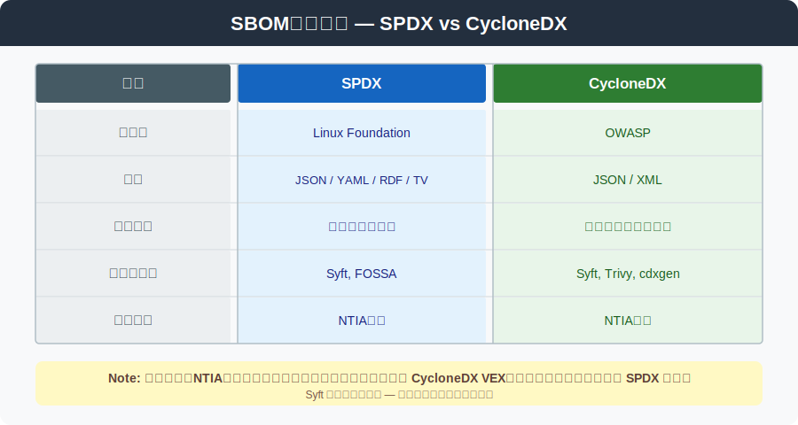


---

# SBOMツールチェーン

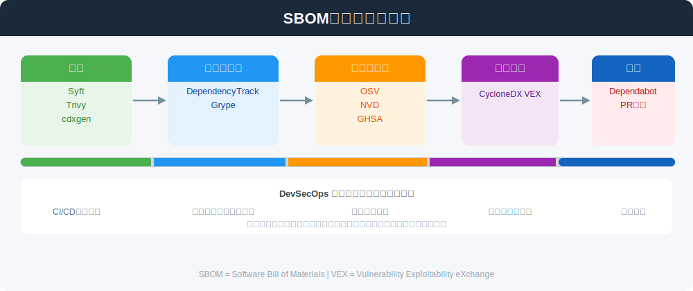


---

# Syft/Trivyによる SBOM生成

- <svg viewBox="0 0 800 400" style="max-height:70vh;max-width:100%;display:block;margin:0 auto;" xmlns="http://www.w3.org/2000/svg"><rect width="800" height="400" fill="#1a1a2e"/><text x="400" y="35" text-anchor="middle" fill="#f9a825" font-size="18" font-family="sans-serif" font-weight="bold">IaC セキュリティチェックフロー</text>
<rect x="20" y="162" width="120" height="46" rx="6" fill="#16213e" stroke="#42a5f5" stroke-width="1.5"/><text x="80" y="190" text-anchor="middle" fill="#ffffff" font-size="13" font-family="sans-serif">Terraform/CF</text>
<line x1="140" y1="185" x2="158" y2="185" stroke="#f9a825" stroke-width="2"/><polygon points="153,179 168,185 153,191" fill="#f9a825"/>
<rect x="168" y="162" width="120" height="46" rx="6" fill="#1565c0" stroke="#42a5f5" stroke-width="1.5"/><text x="228" y="190" text-anchor="middle" fill="#ffffff" font-size="13" font-family="sans-serif">静的解析</text>
<text x="228" y="222" text-anchor="middle" fill="#42a5f5" font-size="10" font-family="sans-serif">tfsec / Checkov</text>
<line x1="288" y1="185" x2="306" y2="185" stroke="#f9a825" stroke-width="2"/><polygon points="301,179 316,185 301,191" fill="#f9a825"/>
<rect x="316" y="162" width="120" height="46" rx="6" fill="#4a148c" stroke="#ce93d8" stroke-width="1.5"/><text x="376" y="190" text-anchor="middle" fill="#ffffff" font-size="11" font-family="sans-serif">ポリシーチェック</text>
<text x="376" y="222" text-anchor="middle" fill="#ce93d8" font-size="10" font-family="sans-serif">OPA / Sentinel</text>
<line x1="436" y1="185" x2="454" y2="185" stroke="#f9a825" stroke-width="2"/><polygon points="449,179 464,185 449,191" fill="#f9a825"/>
<rect x="464" y="162" width="120" height="46" rx="6" fill="#16213e" stroke="#f9a825" stroke-width="1.5"/><text x="524" y="190" text-anchor="middle" fill="#ffffff" font-size="13" font-family="sans-serif">コストチェック</text>
<text x="524" y="222" text-anchor="middle" fill="#f9a825" font-size="10" font-family="sans-serif">Infracost</text>
<line x1="584" y1="185" x2="602" y2="185" stroke="#66bb6a" stroke-width="2"/><polygon points="597,179 612,185 597,191" fill="#66bb6a"/>
<rect x="612" y="162" width="120" height="46" rx="6" fill="#1b5e20" stroke="#66bb6a" stroke-width="1.5"/><text x="672" y="190" text-anchor="middle" fill="#ffffff" font-size="11" font-family="sans-serif">ドリフト検出</text>
<line x1="732" y1="185" x2="750" y2="185" stroke="#66bb6a" stroke-width="2"/><polygon points="745,179 760,185 745,191" fill="#66bb6a"/>
<rect x="762" y="162" width="18" height="46" rx="6" fill="#1b5e20" stroke="#66bb6a" stroke-width="1.5"/><text x="771" y="190" text-anchor="middle" fill="#ffffff" font-size="13" font-family="sans-serif"></text>
<rect x="168" y="270" width="464" height="48" rx="6" fill="#16213e" stroke="#f9a825" stroke-width="1.5"/>
<text x="400" y="292" text-anchor="middle" fill="#ffffff" font-size="12" font-family="sans-serif" font-weight="bold">検出される設定ミス例</text>
<text x="400" y="312" text-anchor="middle" fill="#f9a825" font-size="11" font-family="sans-serif">S3パブリック公開 / SG 0.0.0.0/0 / 暗号化なし / IAM *</text>
<text x="400" y="360" text-anchor="middle" fill="#888" font-size="11" font-family="sans-serif">インフラコードもアプリコードと同様にスキャン必須</text></svg>
- CycloneDXフォーマットで出力 → Grypeで脆弱性照合


---

# Syft/Trivyによる SBOM生成（コード例）

```bash
# Syft: コンテナイメージからSBOM生成
syft myapp:latest -o cyclonedx-json > sbom.json

# Trivy: ファイルシステムスキャン + SBOM
trivy fs --format cyclonedx --output sbom.cdx.json .

# Grype: SBOMから脆弱性照合
grype sbom:sbom.json --fail-on high
```


---

# SLSA Framework

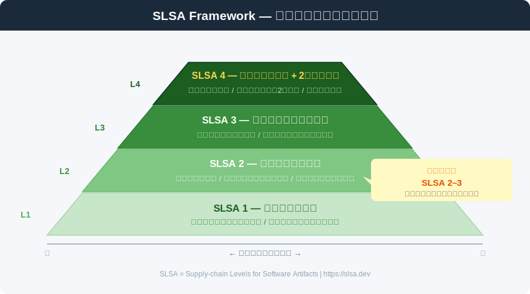


---

# Sigstore — コード署名の民主化

- <svg viewBox="0 0 800 400" style="max-height:70vh;max-width:100%;display:block;margin:0 auto;" xmlns="http://www.w3.org/2000/svg"><rect width="800" height="400" fill="#1a1a2e"/><text x="400" y="35" text-anchor="middle" fill="#f9a825" font-size="18" font-family="sans-serif" font-weight="bold">Compliance as Code ワークフロー</text>
<rect x="20" y="75" width="155" height="48" rx="6" fill="#16213e" stroke="#e91e63" stroke-width="1.5"/><text x="97.5" y="104" text-anchor="middle" fill="#ffffff" font-size="13" font-family="sans-serif">規制要件</text>
<text x="97" y="140" text-anchor="middle" fill="#888" font-size="10" font-family="sans-serif">PCI-DSS / SOC2 / ISO27001</text>
<rect x="20" y="215" width="155" height="48" rx="6" fill="#16213e" stroke="#e91e63" stroke-width="1.5"/><text x="97.5" y="244" text-anchor="middle" fill="#ffffff" font-size="13" font-family="sans-serif">ベースライン</text>
<text x="97" y="280" text-anchor="middle" fill="#888" font-size="10" font-family="sans-serif">CIS Benchmark / NIST</text>
<line x1="175" y1="99" x2="230" y2="150" stroke="#f9a825" stroke-width="2"/>
<polygon points="222,143 234,155 221,142" fill="#f9a825"/>
<line x1="175" y1="239" x2="230" y2="200" stroke="#f9a825" stroke-width="2"/>
<polygon points="225,196 236,207 223,195" fill="#f9a825"/>
<rect x="240" y="148" width="155" height="48" rx="6" fill="#4a148c" stroke="#ce93d8" stroke-width="1.5"/><text x="317.5" y="177" text-anchor="middle" fill="#ffffff" font-size="11" font-family="sans-serif">ポリシーコード化</text>
<text x="317" y="213" text-anchor="middle" fill="#ce93d8" font-size="10" font-family="sans-serif">OPA Rego / Config Rules</text>
<line x1="395" y1="172" x2="428" y2="172" stroke="#f9a825" stroke-width="2"/><polygon points="423,166 438,172 423,178" fill="#f9a825"/>
<rect x="438" y="148" width="155" height="48" rx="6" fill="#1565c0" stroke="#42a5f5" stroke-width="1.5"/><text x="515.5" y="177" text-anchor="middle" fill="#ffffff" font-size="12" font-family="sans-serif">継続的監査</text>
<text x="515" y="213" text-anchor="middle" fill="#42a5f5" font-size="10" font-family="sans-serif">自動評価・レポート</text>
<line x1="593" y1="172" x2="626" y2="172" stroke="#66bb6a" stroke-width="2"/><polygon points="621,166 636,172 621,178" fill="#66bb6a"/>
<rect x="636" y="148" width="144" height="48" rx="6" fill="#1b5e20" stroke="#66bb6a" stroke-width="1.5"/><text x="708" y="177" text-anchor="middle" fill="#ffffff" font-size="11" font-family="sans-serif">合格 / 修正指示</text>
<rect x="240" y="290" width="400" height="45" rx="6" fill="#16213e" stroke="#f9a825" stroke-width="1.5"/>
<text x="440" y="310" text-anchor="middle" fill="#ffffff" font-size="12" font-family="sans-serif" font-weight="bold">コンプライアンス状態をダッシュボードで可視化</text>
<text x="440" y="328" text-anchor="middle" fill="#f9a825" font-size="11" font-family="sans-serif">Security Hub / AWS Config / Prowler</text>
<text x="400" y="370" text-anchor="middle" fill="#888" font-size="11" font-family="sans-serif">手作業監査を自動化 — 常時準拠状態を維持</text></svg>
- **Sigstore**: メールアドレスで誰でも無料でコード署名できるPKI基盤
- **3つのコンポーネント**: Cosign（署名）・Fulcio（証明書発行）・Rekor（透明性ログ）
- **特徴**: 鍵管理不要（OIDC/GitHub ActionsのIDで署名）
- **用途**: コンテナイメージ・SBOM・バイナリへの署名
- **採用例**: Kubernetes本体・Distrolessイメージ・PyPIパッケージ


---

# cosign署名・検証

- <svg viewBox="0 0 800 400" style="max-height:70vh;max-width:100%;display:block;margin:0 auto;" xmlns="http://www.w3.org/2000/svg"><rect width="800" height="400" fill="#1a1a2e"/><text x="400" y="35" text-anchor="middle" fill="#f9a825" font-size="18" font-family="sans-serif" font-weight="bold">ゼロトラスト アーキテクチャ</text>
<rect x="295" y="150" width="210" height="115" rx="8" fill="#16213e" stroke="#f9a825" stroke-width="2"/>
<text x="400" y="190" text-anchor="middle" fill="#f9a825" font-size="13" font-family="sans-serif" font-weight="bold">ポリシーエンジン</text>
<text x="400" y="210" text-anchor="middle" fill="#ffffff" font-size="11" font-family="sans-serif">Never Trust, Always Verify</text>
<text x="400" y="230" text-anchor="middle" fill="#888" font-size="10" font-family="sans-serif">IAM / MFA / デバイス証明書</text>
<text x="400" y="250" text-anchor="middle" fill="#888" font-size="10" font-family="sans-serif">継続的認証・認可</text>
<rect x="20" y="80" width="140" height="46" rx="6" fill="#16213e" stroke="#42a5f5" stroke-width="1.5"/><text x="90" y="108" text-anchor="middle" fill="#ffffff" font-size="13" font-family="sans-serif">ユーザー</text>
<rect x="20" y="178" width="140" height="46" rx="6" fill="#16213e" stroke="#42a5f5" stroke-width="1.5"/><text x="90" y="206" text-anchor="middle" fill="#ffffff" font-size="13" font-family="sans-serif">デバイス</text>
<rect x="20" y="278" width="140" height="46" rx="6" fill="#16213e" stroke="#42a5f5" stroke-width="1.5"/><text x="90" y="306" text-anchor="middle" fill="#ffffff" font-size="13" font-family="sans-serif">ワークロード</text>
<rect x="640" y="80" width="140" height="46" rx="6" fill="#16213e" stroke="#66bb6a" stroke-width="1.5"/><text x="710" y="108" text-anchor="middle" fill="#ffffff" font-size="13" font-family="sans-serif">アプリ A</text>
<rect x="640" y="178" width="140" height="46" rx="6" fill="#16213e" stroke="#66bb6a" stroke-width="1.5"/><text x="710" y="206" text-anchor="middle" fill="#ffffff" font-size="13" font-family="sans-serif">アプリ B</text>
<rect x="640" y="278" width="140" height="46" rx="6" fill="#16213e" stroke="#66bb6a" stroke-width="1.5"/><text x="710" y="306" text-anchor="middle" fill="#ffffff" font-size="13" font-family="sans-serif">データストア</text>
<line x1="160" y1="103" x2="295" y2="175" stroke="#f9a825" stroke-width="1.5"/><polygon points="287,169 299,180 287,167" fill="#f9a825"/>
<line x1="160" y1="201" x2="295" y2="205" stroke="#f9a825" stroke-width="1.5"/><polygon points="289,199 304,205 289,211" fill="#f9a825"/>
<line x1="160" y1="301" x2="295" y2="245" stroke="#f9a825" stroke-width="1.5"/><polygon points="288,240 300,249 288,238" fill="#f9a825"/>
<line x1="505" y1="175" x2="640" y2="103" stroke="#66bb6a" stroke-width="1.5"/><polygon points="632,98 644,107 633,96" fill="#66bb6a"/>
<line x1="505" y1="205" x2="640" y2="201" stroke="#66bb6a" stroke-width="1.5"/><polygon points="634,195 649,201 634,207" fill="#66bb6a"/>
<line x1="505" y1="245" x2="640" y2="301" stroke="#66bb6a" stroke-width="1.5"/><polygon points="633,295 645,304 633,293" fill="#66bb6a"/>
<text x="400" y="375" text-anchor="middle" fill="#888" font-size="11" font-family="sans-serif">ネットワーク境界ではなくID・コンテキストで判断</text></svg>
- キーレス署名: GitHub ActionsのOIDCトークンを使用


---

# cosign署名・検証（コード例）

```bash
# GitHub Actionsからキーレス署名
cosign sign \
  --identity-token=$(cat $ACTIONS_ID_TOKEN_REQUEST_TOKEN) \
  ghcr.io/myorg/myapp:v1.0.0

# 検証（署名チェーン確認）
cosign verify \
  --certificate-identity="https://github.com/myorg/myapp/.github/workflows/build.yml@refs/heads/main"\
  --certificate-oidc-issuer="https://token.actions.githubusercontent.com"\
  ghcr.io/myorg/myapp:v1.0.0
```


---

# GitHub dependency-review-action

- <svg viewBox="0 0 800 400" style="max-height:70vh;max-width:100%;display:block;margin:0 auto;" xmlns="http://www.w3.org/2000/svg"><rect width="800" height="400" fill="#1a1a2e"/><text x="400" y="35" text-anchor="middle" fill="#f9a825" font-size="18" font-family="sans-serif" font-weight="bold">シークレット管理 ベストプラクティス</text>
<rect x="295" y="65" width="210" height="50" rx="6" fill="#4a148c" stroke="#ce93d8" stroke-width="1.5"/><text x="400" y="95" text-anchor="middle" fill="#ffffff" font-size="13" font-family="sans-serif">シークレットストア</text>
<text x="400" y="133" text-anchor="middle" fill="#ce93d8" font-size="10" font-family="sans-serif">AWS Secrets Manager / HashiCorp Vault</text>
<line x1="400" y1="115" x2="400" y2="148" stroke="#f9a825" stroke-width="2"/><polygon points="394,143 400,158 406,143" fill="#f9a825"/>
<rect x="295" y="158" width="210" height="50" rx="6" fill="#1565c0" stroke="#42a5f5" stroke-width="1.5"/><text x="400" y="188" text-anchor="middle" fill="#ffffff" font-size="12" font-family="sans-serif">動的クレデンシャル</text>
<text x="400" y="226" text-anchor="middle" fill="#42a5f5" font-size="10" font-family="sans-serif">短期有効期限・自動ローテーション</text>
<line x1="295" y1="183" x2="220" y2="183" stroke="#f9a825" stroke-width="2"/><polygon points="225,177 210,183 225,189" fill="#f9a825"/>
<rect x="30" y="158" width="170" height="50" rx="6" fill="#16213e" stroke="#66bb6a" stroke-width="1.5"/><text x="115" y="188" text-anchor="middle" fill="#ffffff" font-size="12" font-family="sans-serif">アプリケーション</text>
<text x="115" y="226" text-anchor="middle" fill="#888" font-size="10" font-family="sans-serif">APIで取得 / 環境変数に依存しない</text>
<line x1="505" y1="183" x2="570" y2="183" stroke="#f9a825" stroke-width="2"/><polygon points="565,177 580,183 565,189" fill="#f9a825"/>
<rect x="580" y="158" width="190" height="50" rx="6" fill="#16213e" stroke="#66bb6a" stroke-width="1.5"/><text x="675" y="188" text-anchor="middle" fill="#ffffff" font-size="11" font-family="sans-serif">CI/CDパイプライン</text>
<text x="675" y="226" text-anchor="middle" fill="#888" font-size="10" font-family="sans-serif">Gitにシークレットを保存しない</text>
<rect x="130" y="280" width="540" height="55" rx="8" fill="#16213e" stroke="#e91e63" stroke-width="2"/>
<text x="400" y="303" text-anchor="middle" fill="#e91e63" font-size="13" font-family="sans-serif" font-weight="bold">禁止事項</text>
<text x="400" y="323" text-anchor="middle" fill="#ffffff" font-size="11" font-family="sans-serif">ハードコード / .env をGitコミット / ログへの出力 / 長期キー</text>
<text x="400" y="370" text-anchor="middle" fill="#888" font-size="11" font-family="sans-serif">git-secrets / truffleHog で事前検出</text></svg>
- PRマージ前に新規依存性の CVE + ライセンスを自動チェック


---

# GitHub dependency-review-action（コード例）

```yaml
# .github/workflows/dependency-review.yml
name: Dependency Review
on: pull_request
jobs:
  dependency-review:
    runs-on: ubuntu-latest
    steps:
      - uses: actions/checkout@v4
      - uses: actions/dependency-review-action@v4
        with:
          fail-on-severity: high
          deny-licenses: GPL-2.0, AGPL-3.0
```


---

# SBOM運用フロー

- <svg viewBox="0 0 800 400" style="max-height:70vh;max-width:100%;display:block;margin:0 auto;" xmlns="http://www.w3.org/2000/svg"><rect width="800" height="400" fill="#1a1a2e"/><text x="400" y="35" text-anchor="middle" fill="#f9a825" font-size="18" font-family="sans-serif" font-weight="bold">DevSecOps サイクル</text><rect x="80" y="160" width="130" height="55" rx="6" fill="#1565c0" stroke="#f9a825" stroke-width="1.5"/><text x="145" y="192.5" text-anchor="middle" fill="#ffffff" font-size="17" font-family="sans-serif">Dev</text><rect x="335" y="65" width="130" height="55" rx="6" fill="#b71c1c" stroke="#e91e63" stroke-width="1.5"/><text x="400" y="97.5" text-anchor="middle" fill="#ffffff" font-size="17" font-family="sans-serif">Sec</text><rect x="590" y="160" width="130" height="55" rx="6" fill="#1b5e20" stroke="#66bb6a" stroke-width="1.5"/><text x="655" y="192.5" text-anchor="middle" fill="#ffffff" font-size="17" font-family="sans-serif">Ops</text><path d="M210,187 Q335,140 335,120" stroke="#f9a825" stroke-width="2" fill="none"/><polygon points="333,108 341,124 325,124" fill="#f9a825"/><path d="M465,92 Q530,130 590,175" stroke="#f9a825" stroke-width="2" fill="none"/><polygon points="582,169 594,181 579,180" fill="#f9a825"/><path d="M590,215 Q400,320 210,215" stroke="#f9a825" stroke-width="2" fill="none"/><polygon points="212,207 204,220 219,221" fill="#f9a825"/><text x="260" y="130" text-anchor="middle" fill="#ffffff" font-size="11" font-family="sans-serif">設計・実装</text><text x="550" y="135" text-anchor="middle" fill="#ffffff" font-size="11" font-family="sans-serif">テスト・スキャン</text><text x="400" y="310" text-anchor="middle" fill="#ffffff" font-size="11" font-family="sans-serif">監視・フィードバック</text><rect x="315" y="170" width="170" height="45" rx="6" fill="#4a148c" stroke="#ce93d8" stroke-width="1.5"/><text x="400" y="197.5" text-anchor="middle" fill="#ffffff" font-size="11" font-family="sans-serif">継続的セキュリティ</text><text x="400" y="375" text-anchor="middle" fill="#888" font-size="11" font-family="sans-serif">セキュリティを全フェーズに統合</text></svg>
- **Step 1 — 生成**: ビルドCI実行時にSBOMを自動生成（Syft/Trivy）
- **Step 2 — 署名**: Cosignでビルド証明書を添付
- **Step 3 — 保存**: OCI Artifactストアまたは DependencyTrack へアップロード
- **Step 4 — 照合**: 新規CVE公開時に既存SBOMに対して自動スキャン
- **Step 5 — 通知**: 影響を受けるバージョン一覧をSlack/Jiraに通知


---

# 規制・コンプライアンス対応

- <svg viewBox="0 0 800 400" style="max-height:70vh;max-width:100%;display:block;margin:0 auto;" xmlns="http://www.w3.org/2000/svg"><rect width="800" height="400" fill="#1a1a2e"/><text x="400" y="35" text-anchor="middle" fill="#f9a825" font-size="18" font-family="sans-serif" font-weight="bold">シフトレフト セキュリティ</text><line x1="60" y1="200" x2="740" y2="200" stroke="#444" stroke-width="2"/><polygon points="735,194 750,200 735,206" fill="#444"/><rect x="60" y="158" width="100" height="44" rx="6" fill="#16213e" stroke="#f9a825" stroke-width="1.5"/><text x="110" y="185" text-anchor="middle" fill="#ffffff" font-size="13" font-family="sans-serif">設計</text><rect x="183" y="158" width="100" height="44" rx="6" fill="#16213e" stroke="#f9a825" stroke-width="1.5"/><text x="233" y="185" text-anchor="middle" fill="#ffffff" font-size="11" font-family="sans-serif">コーディング</text><rect x="306" y="158" width="100" height="44" rx="6" fill="#16213e" stroke="#f9a825" stroke-width="1.5"/><text x="356" y="185" text-anchor="middle" fill="#ffffff" font-size="13" font-family="sans-serif">ビルド</text><rect x="429" y="158" width="100" height="44" rx="6" fill="#16213e" stroke="#555" stroke-width="1.5"/><text x="479" y="185" text-anchor="middle" fill="#ffffff" font-size="13" font-family="sans-serif">テスト</text><rect x="552" y="158" width="100" height="44" rx="6" fill="#16213e" stroke="#e91e63" stroke-width="1.5"/><text x="602" y="185" text-anchor="middle" fill="#ffffff" font-size="13" font-family="sans-serif">本番</text><text x="110" y="228" text-anchor="middle" fill="#f9a825" font-size="10" font-family="sans-serif">脅威モデリング</text><text x="233" y="228" text-anchor="middle" fill="#f9a825" font-size="10" font-family="sans-serif">SAST/シークレット</text><text x="356" y="228" text-anchor="middle" fill="#f9a825" font-size="10" font-family="sans-serif">SCA/SBOM</text><text x="479" y="228" text-anchor="middle" fill="#ffffff" font-size="10" font-family="sans-serif">DAST</text><text x="602" y="228" text-anchor="middle" fill="#e91e63" font-size="10" font-family="sans-serif">CSPM</text><rect x="60" y="255" width="360" height="28" rx="4" fill="#1565c0" opacity="0.7"/><text x="240" y="274" text-anchor="middle" fill="#ffffff" font-size="11" font-family="sans-serif">シフトレフト領域 — 修正コスト: 低</text><rect x="440" y="255" width="212" height="28" rx="4" fill="#e91e63" opacity="0.6"/><text x="546" y="274" text-anchor="middle" fill="#ffffff" font-size="11" font-family="sans-serif">遅延発見 — コスト: 高</text><text x="400" y="355" text-anchor="middle" fill="#888" font-size="11" font-family="sans-serif">早期発見により修正コストを最大1/100に削減</text></svg>
- **EO 14028（2021）**: 米政府調達ソフトウェアにSBOM必須
- **NTIA最小要素**: サプライヤー名・コンポーネント名・バージョン・依存関係・タイムスタンプ
- **EU Cyber Resilience Act**: デジタル製品のCEマーキングにSBOM必須（2025年〜）
- **NIS2指令**: 重要インフラのサプライチェーンリスク管理義務
- **PCI DSS v4.0**: ソフトウェア部品表による依存性管理の強化


---

# サプライチェーンセキュリティ成熟度

| レベル | 状態 | 実施内容 |
|--------|------|---------|
| L0 | 対策なし | 依存性管理なし |
| L1 | 可視化 | SCA・ライセンス確認 |
| L2 | SBOM生成 | 毎ビルドSBOM・CVE照合 |
| L3 | 署名・証明 | Cosign署名・SLSA 2 |
| L4 | 完全追跡性 | SLSA 3+ ・再現可能ビルド |


---

# DependencyTrack導入

- <svg viewBox="0 0 800 400" style="max-height:70vh;max-width:100%;display:block;margin:0 auto;" xmlns="http://www.w3.org/2000/svg"><rect width="800" height="400" fill="#1a1a2e"/><text x="400" y="35" text-anchor="middle" fill="#f9a825" font-size="18" font-family="sans-serif" font-weight="bold">CI/CD セキュリティパイプライン</text><rect x="20" y="162" width="85" height="46" rx="6" fill="#16213e" stroke="#42a5f5" stroke-width="1.5"/><text x="62.5" y="190" text-anchor="middle" fill="#ffffff" font-size="13" font-family="sans-serif">コード</text>
<line x1="105" y1="185" x2="123" y2="185" stroke="#f9a825" stroke-width="2"/><polygon points="118,179 133,185 118,191" fill="#f9a825"/>
<rect x="133" y="162" width="85" height="46" rx="6" fill="#1565c0" stroke="#42a5f5" stroke-width="1.5"/><text x="175.5" y="190" text-anchor="middle" fill="#ffffff" font-size="13" font-family="sans-serif">SAST</text>
<line x1="218" y1="185" x2="236" y2="185" stroke="#f9a825" stroke-width="2"/><polygon points="231,179 246,185 231,191" fill="#f9a825"/>
<rect x="246" y="162" width="85" height="46" rx="6" fill="#1565c0" stroke="#42a5f5" stroke-width="1.5"/><text x="288.5" y="190" text-anchor="middle" fill="#ffffff" font-size="13" font-family="sans-serif">SCA</text>
<line x1="331" y1="185" x2="349" y2="185" stroke="#f9a825" stroke-width="2"/><polygon points="344,179 359,185 344,191" fill="#f9a825"/>
<rect x="359" y="162" width="85" height="46" rx="6" fill="#1b5e20" stroke="#66bb6a" stroke-width="1.5"/><text x="401.5" y="190" text-anchor="middle" fill="#ffffff" font-size="13" font-family="sans-serif">ビルド</text>
<line x1="444" y1="185" x2="462" y2="185" stroke="#f9a825" stroke-width="2"/><polygon points="457,179 472,185 457,191" fill="#f9a825"/>
<rect x="472" y="162" width="85" height="46" rx="6" fill="#1565c0" stroke="#42a5f5" stroke-width="1.5"/><text x="514.5" y="190" text-anchor="middle" fill="#ffffff" font-size="13" font-family="sans-serif">DAST</text>
<line x1="557" y1="185" x2="575" y2="185" stroke="#f9a825" stroke-width="2"/><polygon points="570,179 585,185 570,191" fill="#f9a825"/>
<rect x="585" y="162" width="85" height="46" rx="6" fill="#4a148c" stroke="#ce93d8" stroke-width="1.5"/><text x="627.5" y="190" text-anchor="middle" fill="#ffffff" font-size="13" font-family="sans-serif">Scan</text>
<line x1="670" y1="185" x2="688" y2="185" stroke="#66bb6a" stroke-width="2"/><polygon points="683,179 698,185 683,191" fill="#66bb6a"/>
<rect x="698" y="162" width="82" height="46" rx="6" fill="#1b5e20" stroke="#66bb6a" stroke-width="1.5"/><text x="739" y="190" text-anchor="middle" fill="#ffffff" font-size="13" font-family="sans-serif">Deploy</text>
<rect x="133" y="233" width="537" height="28" rx="4" fill="#16213e" stroke="#f9a825" stroke-width="1.5"/>
<text x="401" y="252" text-anchor="middle" fill="#f9a825" font-size="12" font-family="sans-serif">セキュリティゲート: 失敗時はパイプライン自動停止</text>
<text x="400" y="360" text-anchor="middle" fill="#888" font-size="11" font-family="sans-serif">毎コミットで自動スキャン — 問題を早期に検出・ブロック</text></svg>
- 継続的なSBOM管理・脆弱性ダッシュボード・Slack通知連携


---

# DependencyTrack導入（コード例）

```bash
# Docker Composeで起動
docker run -d -m 4096m \
  -p 8080:8080 \
  -v /opt/dependency-track:/data \
  dependencytrack/bundled

# SBOM をAPIでアップロード
curl -X PUT https://dt.example.com/api/v1/bom \
  -H 'X-API-Key: YOUR_API_KEY' \
  -F 'projectName=myapp' \
  -F 'bom=@sbom.cdx.json'
```


---

<!-- _class: lead -->
# Chapter 4: 脅威モデリング・STRIDE

- 設計フェーズにセキュリティを組み込む実践手法


---

# 脅威モデリングとは

- <svg viewBox="0 0 800 400" style="max-height:70vh;max-width:100%;display:block;margin:0 auto;" xmlns="http://www.w3.org/2000/svg"><rect width="800" height="400" fill="#1a1a2e"/><text x="400" y="35" text-anchor="middle" fill="#f9a825" font-size="18" font-family="sans-serif" font-weight="bold">STRIDE 脅威モデリング</text>
<rect x="20" y="60" width="230" height="52" rx="6" fill="#16213e" stroke="#e91e63" stroke-width="1.5"/><text x="135" y="91" text-anchor="middle" fill="#ffffff" font-size="12" font-family="sans-serif">S — Spoofing (なりすまし)</text>
<text x="135" y="127" text-anchor="middle" fill="#888" font-size="10" font-family="sans-serif">対策: 多要素認証・証明書検証</text>
<rect x="285" y="60" width="230" height="52" rx="6" fill="#16213e" stroke="#e91e63" stroke-width="1.5"/><text x="400" y="91" text-anchor="middle" fill="#ffffff" font-size="12" font-family="sans-serif">T — Tampering (改ざん)</text>
<text x="400" y="127" text-anchor="middle" fill="#888" font-size="10" font-family="sans-serif">対策: デジタル署名・整合性チェック</text>
<rect x="550" y="60" width="230" height="52" rx="6" fill="#16213e" stroke="#e91e63" stroke-width="1.5"/><text x="665" y="91" text-anchor="middle" fill="#ffffff" font-size="12" font-family="sans-serif">R — Repudiation (否認)</text>
<text x="665" y="127" text-anchor="middle" fill="#888" font-size="10" font-family="sans-serif">対策: 監査ログ・タイムスタンプ</text>
<rect x="20" y="150" width="230" height="52" rx="6" fill="#16213e" stroke="#f9a825" stroke-width="1.5"/><text x="135" y="181" text-anchor="middle" fill="#ffffff" font-size="12" font-family="sans-serif">I — Info Disclosure (漏洩)</text>
<text x="135" y="217" text-anchor="middle" fill="#888" font-size="10" font-family="sans-serif">対策: 暗号化・アクセス制御</text>
<rect x="285" y="150" width="230" height="52" rx="6" fill="#16213e" stroke="#f9a825" stroke-width="1.5"/><text x="400" y="181" text-anchor="middle" fill="#ffffff" font-size="12" font-family="sans-serif">D — Denial of Service</text>
<text x="400" y="217" text-anchor="middle" fill="#888" font-size="10" font-family="sans-serif">対策: レート制限・スケーリング</text>
<rect x="550" y="150" width="230" height="52" rx="6" fill="#16213e" stroke="#f9a825" stroke-width="1.5"/><text x="665" y="181" text-anchor="middle" fill="#ffffff" font-size="11" font-family="sans-serif">E — Elevation of Priv (昇格)</text>
<text x="665" y="217" text-anchor="middle" fill="#888" font-size="10" font-family="sans-serif">対策: 最小権限・サンドボックス</text>
<rect x="180" y="250" width="440" height="55" rx="8" fill="#4a148c" stroke="#ce93d8" stroke-width="1.5"/>
<text x="400" y="274" text-anchor="middle" fill="#ffffff" font-size="13" font-family="sans-serif" font-weight="bold">脅威モデリングプロセス</text>
<text x="400" y="295" text-anchor="middle" fill="#ce93d8" font-size="11" font-family="sans-serif">資産特定 → 脅威列挙 → リスク評価 → 対策設計</text>
<text x="400" y="360" text-anchor="middle" fill="#888" font-size="11" font-family="sans-serif">設計フェーズで実施することで手戻りを最小化</text></svg>
- **定義**: システムに対する潜在的な脅威を体系的に特定・優先度付けするプロセス
- **4つの質問（Adam Shostack）**: 何を作っているか？何が問題か？どう対処するか？正しく対処できたか？
- **効果**: 設計段階での修正コストは本番の1/100以下
- **頻度**: 新機能追加ごと・四半期ごとに実施（継続的TM）
- **チーム**: 開発者・セキュリティエンジニア・アーキテクト合同で実施


---

# 4つの脅威モデリング手法

| 手法 | 特徴 | 向いている場面 |
|------|------|--------------|
| **STRIDE** | Microsoftが開発、6カテゴリ | Webアプリ・API設計 |
| **PASTA** | リスクベース、9ステップ | エンタープライズ |
| **LINDDUN** | プライバシー特化 | GDPRコンプライアンス |
| **TRIKE** | リスク許容ベース | 金融・重要インフラ |
- **スタートアップ推奨**: STRIDEがシンプルで学習コスト低


---

# なぜ設計フェーズか — 修正コスト比較

- <svg viewBox="0 0 800 400" style="max-height:70vh;max-width:100%;display:block;margin:0 auto;" xmlns="http://www.w3.org/2000/svg"><rect width="800" height="400" fill="#1a1a2e"/><text x="400" y="35" text-anchor="middle" fill="#f9a825" font-size="18" font-family="sans-serif" font-weight="bold">セキュリティゲート 判断フロー</text>
<rect x="305" y="60" width="190" height="48" rx="6" fill="#1565c0" stroke="#42a5f5" stroke-width="1.5"/><text x="400" y="89" text-anchor="middle" fill="#ffffff" font-size="13" font-family="sans-serif">コードプッシュ</text>
<line x1="400" y1="108" x2="400" y2="126" stroke="#f9a825" stroke-width="2"/><polygon points="394,121 400,136 406,121" fill="#f9a825"/>
<rect x="305" y="136" width="190" height="48" rx="6" fill="#16213e" stroke="#f9a825" stroke-width="1.5"/><text x="400" y="165" text-anchor="middle" fill="#ffffff" font-size="13" font-family="sans-serif">自動スキャン実行</text>
<line x1="400" y1="184" x2="400" y2="202" stroke="#f9a825" stroke-width="2"/><polygon points="394,197 400,212 406,197" fill="#f9a825"/>
<polygon points="400,212 490,248 400,284 310,248" fill="#16213e" stroke="#f9a825" stroke-width="1.5"/>
<text x="400" y="244" text-anchor="middle" fill="#f9a825" font-size="12" font-family="sans-serif">重大な脆弱性</text>
<text x="400" y="262" text-anchor="middle" fill="#f9a825" font-size="12" font-family="sans-serif">あり?</text>
<line x1="490" y1="248" x2="560" y2="248" stroke="#e91e63" stroke-width="2"/><polygon points="555,242 570,248 555,254" fill="#e91e63"/>
<text x="525" y="240" fill="#e91e63" font-size="11" font-family="sans-serif">YES</text>
<rect x="570" y="224" width="180" height="48" rx="6" fill="#b71c1c" stroke="#e91e63" stroke-width="1.5"/><text x="660" y="253" text-anchor="middle" fill="#ffffff" font-size="13" font-family="sans-serif">パイプライン停止</text>
<line x1="400" y1="284" x2="400" y2="312" stroke="#66bb6a" stroke-width="2"/><polygon points="394,307 400,322 406,307" fill="#66bb6a"/>
<text x="415" y="302" fill="#66bb6a" font-size="11" font-family="sans-serif">NO</text>
<rect x="305" y="322" width="190" height="48" rx="6" fill="#1b5e20" stroke="#66bb6a" stroke-width="1.5"/><text x="400" y="351" text-anchor="middle" fill="#ffffff" font-size="13" font-family="sans-serif">次ステージへ進む</text>
<text x="400" y="390" text-anchor="middle" fill="#888" font-size="11" font-family="sans-serif">Critical/High は即時ブロック — Low は許容ポリシー設定可</text></svg>
- **IBM NIST研究**: バグ修正コストはフェーズが進むほど指数的に増加
- 要件定義での発見: **$1**（基準）
- 設計での発見: **$6**
- コーディングでの発見: **$25**
- テストでの発見: **$100**
- 本番リリース後の発見: **$600〜$6,000**


---

# STRIDE概要 — 6カテゴリ

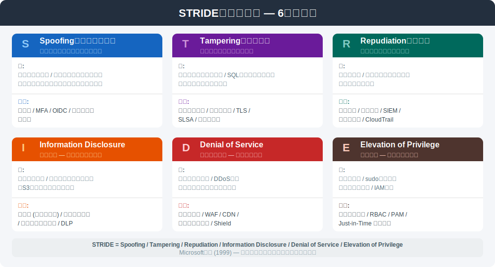


---

# S: Spoofing（なりすまし）詳解

- <svg viewBox="0 0 800 400" style="max-height:70vh;max-width:100%;display:block;margin:0 auto;" xmlns="http://www.w3.org/2000/svg"><rect width="800" height="400" fill="#1a1a2e"/><text x="400" y="35" text-anchor="middle" fill="#f9a825" font-size="18" font-family="sans-serif" font-weight="bold">コンテナイメージ スキャンパイプライン</text>
<rect x="20" y="155" width="110" height="50" rx="6" fill="#16213e" stroke="#42a5f5" stroke-width="1.5"/><text x="75" y="185" text-anchor="middle" fill="#ffffff" font-size="13" font-family="sans-serif">Dockerfile</text>
<line x1="130" y1="180" x2="148" y2="180" stroke="#f9a825" stroke-width="2"/><polygon points="143,174 158,180 143,186" fill="#f9a825"/>
<rect x="158" y="155" width="110" height="50" rx="6" fill="#16213e" stroke="#f9a825" stroke-width="1.5"/><text x="213" y="185" text-anchor="middle" fill="#ffffff" font-size="11" font-family="sans-serif">イメージビルド</text>
<line x1="268" y1="180" x2="286" y2="180" stroke="#f9a825" stroke-width="2"/><polygon points="281,174 296,180 281,186" fill="#f9a825"/>
<rect x="296" y="155" width="110" height="50" rx="6" fill="#1565c0" stroke="#42a5f5" stroke-width="1.5"/><text x="351" y="185" text-anchor="middle" fill="#ffffff" font-size="11" font-family="sans-serif">脆弱性スキャン</text>
<line x1="406" y1="180" x2="424" y2="180" stroke="#f9a825" stroke-width="2"/><polygon points="419,174 434,180 419,186" fill="#f9a825"/>
<polygon points="460,155 505,180 460,205" fill="#16213e" stroke="#f9a825" stroke-width="1.5"/>
<text x="462" y="177" text-anchor="middle" fill="#f9a825" font-size="10" font-family="sans-serif">合格?</text>
<text x="462" y="193" text-anchor="middle" fill="#f9a825" font-size="10" font-family="sans-serif">PASS?</text>
<line x1="505" y1="180" x2="540" y2="180" stroke="#66bb6a" stroke-width="2"/><polygon points="535,174 550,180 535,186" fill="#66bb6a"/>
<text x="522" y="170" fill="#66bb6a" font-size="10" font-family="sans-serif">YES</text>
<rect x="550" y="155" width="110" height="50" rx="6" fill="#1b5e20" stroke="#66bb6a" stroke-width="1.5"/><text x="605" y="185" text-anchor="middle" fill="#ffffff" font-size="11" font-family="sans-serif">レジストリPUSH</text>
<line x1="660" y1="180" x2="698" y2="180" stroke="#66bb6a" stroke-width="2"/><polygon points="693,174 708,180 693,186" fill="#66bb6a"/>
<rect x="708" y="155" width="72" height="50" rx="6" fill="#1b5e20" stroke="#66bb6a" stroke-width="1.5"/><text x="744" y="185" text-anchor="middle" fill="#ffffff" font-size="11" font-family="sans-serif">デプロイ</text>
<line x1="462" y1="205" x2="462" y2="265" stroke="#e91e63" stroke-width="2"/><polygon points="456,260 462,275 468,260" fill="#e91e63"/>
<text x="477" y="240" fill="#e91e63" font-size="10" font-family="sans-serif">NO</text>
<rect x="362" y="275" width="200" height="48" rx="6" fill="#b71c1c" stroke="#e91e63" stroke-width="1.5"/><text x="462" y="304" text-anchor="middle" fill="#ffffff" font-size="13" font-family="sans-serif">ビルド失敗 / 通知</text>
<text x="400" y="360" text-anchor="middle" fill="#888" font-size="11" font-family="sans-serif">Trivy / Snyk / ECR Scan — Critical CVE はブロック</text></svg>
- **定義**: 正規ユーザーや別のシステムになりすます攻撃
- **事例**: 偽のログインページ・JWTトークン偽造・IPスプーフィング
- **対策リスト:**
- 強力な認証（MFA・パスキー）の強制
- HTTPS証明書ピンニング
- CSRF対策トークン / リクエスト署名（HMACまたはJWT）


---

# T: Tampering（改ざん）詳解

- <svg viewBox="0 0 800 400" style="max-height:70vh;max-width:100%;display:block;margin:0 auto;" xmlns="http://www.w3.org/2000/svg"><rect width="800" height="400" fill="#1a1a2e"/><text x="400" y="35" text-anchor="middle" fill="#f9a825" font-size="18" font-family="sans-serif" font-weight="bold">IaC セキュリティチェックフロー</text>
<rect x="20" y="162" width="120" height="46" rx="6" fill="#16213e" stroke="#42a5f5" stroke-width="1.5"/><text x="80" y="190" text-anchor="middle" fill="#ffffff" font-size="13" font-family="sans-serif">Terraform/CF</text>
<line x1="140" y1="185" x2="158" y2="185" stroke="#f9a825" stroke-width="2"/><polygon points="153,179 168,185 153,191" fill="#f9a825"/>
<rect x="168" y="162" width="120" height="46" rx="6" fill="#1565c0" stroke="#42a5f5" stroke-width="1.5"/><text x="228" y="190" text-anchor="middle" fill="#ffffff" font-size="13" font-family="sans-serif">静的解析</text>
<text x="228" y="222" text-anchor="middle" fill="#42a5f5" font-size="10" font-family="sans-serif">tfsec / Checkov</text>
<line x1="288" y1="185" x2="306" y2="185" stroke="#f9a825" stroke-width="2"/><polygon points="301,179 316,185 301,191" fill="#f9a825"/>
<rect x="316" y="162" width="120" height="46" rx="6" fill="#4a148c" stroke="#ce93d8" stroke-width="1.5"/><text x="376" y="190" text-anchor="middle" fill="#ffffff" font-size="11" font-family="sans-serif">ポリシーチェック</text>
<text x="376" y="222" text-anchor="middle" fill="#ce93d8" font-size="10" font-family="sans-serif">OPA / Sentinel</text>
<line x1="436" y1="185" x2="454" y2="185" stroke="#f9a825" stroke-width="2"/><polygon points="449,179 464,185 449,191" fill="#f9a825"/>
<rect x="464" y="162" width="120" height="46" rx="6" fill="#16213e" stroke="#f9a825" stroke-width="1.5"/><text x="524" y="190" text-anchor="middle" fill="#ffffff" font-size="13" font-family="sans-serif">コストチェック</text>
<text x="524" y="222" text-anchor="middle" fill="#f9a825" font-size="10" font-family="sans-serif">Infracost</text>
<line x1="584" y1="185" x2="602" y2="185" stroke="#66bb6a" stroke-width="2"/><polygon points="597,179 612,185 597,191" fill="#66bb6a"/>
<rect x="612" y="162" width="120" height="46" rx="6" fill="#1b5e20" stroke="#66bb6a" stroke-width="1.5"/><text x="672" y="190" text-anchor="middle" fill="#ffffff" font-size="11" font-family="sans-serif">ドリフト検出</text>
<line x1="732" y1="185" x2="750" y2="185" stroke="#66bb6a" stroke-width="2"/><polygon points="745,179 760,185 745,191" fill="#66bb6a"/>
<rect x="762" y="162" width="18" height="46" rx="6" fill="#1b5e20" stroke="#66bb6a" stroke-width="1.5"/><text x="771" y="190" text-anchor="middle" fill="#ffffff" font-size="13" font-family="sans-serif"></text>
<rect x="168" y="270" width="464" height="48" rx="6" fill="#16213e" stroke="#f9a825" stroke-width="1.5"/>
<text x="400" y="292" text-anchor="middle" fill="#ffffff" font-size="12" font-family="sans-serif" font-weight="bold">検出される設定ミス例</text>
<text x="400" y="312" text-anchor="middle" fill="#f9a825" font-size="11" font-family="sans-serif">S3パブリック公開 / SG 0.0.0.0/0 / 暗号化なし / IAM *</text>
<text x="400" y="360" text-anchor="middle" fill="#888" font-size="11" font-family="sans-serif">インフラコードもアプリコードと同様にスキャン必須</text></svg>
- **定義**: データやコードを不正に変更する攻撃
- **事例**: DBデータの改ざん・メモリ改ざん・ネットワークパケット書き換え
- **対策リスト:**
- 入力値検証・サニタイゼーション
- データベース整合性チェック（チェックサム）
- 読み取り専用マウント（コンテナ）/ デジタル署名によるコード完全性検証


---

# R: Repudiation（否認）詳解

- <svg viewBox="0 0 800 400" style="max-height:70vh;max-width:100%;display:block;margin:0 auto;" xmlns="http://www.w3.org/2000/svg"><rect width="800" height="400" fill="#1a1a2e"/><text x="400" y="35" text-anchor="middle" fill="#f9a825" font-size="18" font-family="sans-serif" font-weight="bold">Compliance as Code ワークフロー</text>
<rect x="20" y="75" width="155" height="48" rx="6" fill="#16213e" stroke="#e91e63" stroke-width="1.5"/><text x="97.5" y="104" text-anchor="middle" fill="#ffffff" font-size="13" font-family="sans-serif">規制要件</text>
<text x="97" y="140" text-anchor="middle" fill="#888" font-size="10" font-family="sans-serif">PCI-DSS / SOC2 / ISO27001</text>
<rect x="20" y="215" width="155" height="48" rx="6" fill="#16213e" stroke="#e91e63" stroke-width="1.5"/><text x="97.5" y="244" text-anchor="middle" fill="#ffffff" font-size="13" font-family="sans-serif">ベースライン</text>
<text x="97" y="280" text-anchor="middle" fill="#888" font-size="10" font-family="sans-serif">CIS Benchmark / NIST</text>
<line x1="175" y1="99" x2="230" y2="150" stroke="#f9a825" stroke-width="2"/>
<polygon points="222,143 234,155 221,142" fill="#f9a825"/>
<line x1="175" y1="239" x2="230" y2="200" stroke="#f9a825" stroke-width="2"/>
<polygon points="225,196 236,207 223,195" fill="#f9a825"/>
<rect x="240" y="148" width="155" height="48" rx="6" fill="#4a148c" stroke="#ce93d8" stroke-width="1.5"/><text x="317.5" y="177" text-anchor="middle" fill="#ffffff" font-size="11" font-family="sans-serif">ポリシーコード化</text>
<text x="317" y="213" text-anchor="middle" fill="#ce93d8" font-size="10" font-family="sans-serif">OPA Rego / Config Rules</text>
<line x1="395" y1="172" x2="428" y2="172" stroke="#f9a825" stroke-width="2"/><polygon points="423,166 438,172 423,178" fill="#f9a825"/>
<rect x="438" y="148" width="155" height="48" rx="6" fill="#1565c0" stroke="#42a5f5" stroke-width="1.5"/><text x="515.5" y="177" text-anchor="middle" fill="#ffffff" font-size="12" font-family="sans-serif">継続的監査</text>
<text x="515" y="213" text-anchor="middle" fill="#42a5f5" font-size="10" font-family="sans-serif">自動評価・レポート</text>
<line x1="593" y1="172" x2="626" y2="172" stroke="#66bb6a" stroke-width="2"/><polygon points="621,166 636,172 621,178" fill="#66bb6a"/>
<rect x="636" y="148" width="144" height="48" rx="6" fill="#1b5e20" stroke="#66bb6a" stroke-width="1.5"/><text x="708" y="177" text-anchor="middle" fill="#ffffff" font-size="11" font-family="sans-serif">合格 / 修正指示</text>
<rect x="240" y="290" width="400" height="45" rx="6" fill="#16213e" stroke="#f9a825" stroke-width="1.5"/>
<text x="440" y="310" text-anchor="middle" fill="#ffffff" font-size="12" font-family="sans-serif" font-weight="bold">コンプライアンス状態をダッシュボードで可視化</text>
<text x="440" y="328" text-anchor="middle" fill="#f9a825" font-size="11" font-family="sans-serif">Security Hub / AWS Config / Prowler</text>
<text x="400" y="370" text-anchor="middle" fill="#888" font-size="11" font-family="sans-serif">手作業監査を自動化 — 常時準拠状態を維持</text></svg>
- **定義**: 実行した行動を否定・証拠を改ざんする攻撃
- **事例**: トランザクションログの削除・監査証跡の改ざん
- **対策リスト:**
- 改ざん不可能な監査ログ（append-only）
- 構造化ログ + ログ署名
- デジタル署名トランザクション / CloudTrail・AWS CloudWatch Logs Insights


---

# I: Information Disclosure（情報漏洩）詳解

- <svg viewBox="0 0 800 400" style="max-height:70vh;max-width:100%;display:block;margin:0 auto;" xmlns="http://www.w3.org/2000/svg"><rect width="800" height="400" fill="#1a1a2e"/><text x="400" y="35" text-anchor="middle" fill="#f9a825" font-size="18" font-family="sans-serif" font-weight="bold">ゼロトラスト アーキテクチャ</text>
<rect x="295" y="150" width="210" height="115" rx="8" fill="#16213e" stroke="#f9a825" stroke-width="2"/>
<text x="400" y="190" text-anchor="middle" fill="#f9a825" font-size="13" font-family="sans-serif" font-weight="bold">ポリシーエンジン</text>
<text x="400" y="210" text-anchor="middle" fill="#ffffff" font-size="11" font-family="sans-serif">Never Trust, Always Verify</text>
<text x="400" y="230" text-anchor="middle" fill="#888" font-size="10" font-family="sans-serif">IAM / MFA / デバイス証明書</text>
<text x="400" y="250" text-anchor="middle" fill="#888" font-size="10" font-family="sans-serif">継続的認証・認可</text>
<rect x="20" y="80" width="140" height="46" rx="6" fill="#16213e" stroke="#42a5f5" stroke-width="1.5"/><text x="90" y="108" text-anchor="middle" fill="#ffffff" font-size="13" font-family="sans-serif">ユーザー</text>
<rect x="20" y="178" width="140" height="46" rx="6" fill="#16213e" stroke="#42a5f5" stroke-width="1.5"/><text x="90" y="206" text-anchor="middle" fill="#ffffff" font-size="13" font-family="sans-serif">デバイス</text>
<rect x="20" y="278" width="140" height="46" rx="6" fill="#16213e" stroke="#42a5f5" stroke-width="1.5"/><text x="90" y="306" text-anchor="middle" fill="#ffffff" font-size="13" font-family="sans-serif">ワークロード</text>
<rect x="640" y="80" width="140" height="46" rx="6" fill="#16213e" stroke="#66bb6a" stroke-width="1.5"/><text x="710" y="108" text-anchor="middle" fill="#ffffff" font-size="13" font-family="sans-serif">アプリ A</text>
<rect x="640" y="178" width="140" height="46" rx="6" fill="#16213e" stroke="#66bb6a" stroke-width="1.5"/><text x="710" y="206" text-anchor="middle" fill="#ffffff" font-size="13" font-family="sans-serif">アプリ B</text>
<rect x="640" y="278" width="140" height="46" rx="6" fill="#16213e" stroke="#66bb6a" stroke-width="1.5"/><text x="710" y="306" text-anchor="middle" fill="#ffffff" font-size="13" font-family="sans-serif">データストア</text>
<line x1="160" y1="103" x2="295" y2="175" stroke="#f9a825" stroke-width="1.5"/><polygon points="287,169 299,180 287,167" fill="#f9a825"/>
<line x1="160" y1="201" x2="295" y2="205" stroke="#f9a825" stroke-width="1.5"/><polygon points="289,199 304,205 289,211" fill="#f9a825"/>
<line x1="160" y1="301" x2="295" y2="245" stroke="#f9a825" stroke-width="1.5"/><polygon points="288,240 300,249 288,238" fill="#f9a825"/>
<line x1="505" y1="175" x2="640" y2="103" stroke="#66bb6a" stroke-width="1.5"/><polygon points="632,98 644,107 633,96" fill="#66bb6a"/>
<line x1="505" y1="205" x2="640" y2="201" stroke="#66bb6a" stroke-width="1.5"/><polygon points="634,195 649,201 634,207" fill="#66bb6a"/>
<line x1="505" y1="245" x2="640" y2="301" stroke="#66bb6a" stroke-width="1.5"/><polygon points="633,295 645,304 633,293" fill="#66bb6a"/>
<text x="400" y="375" text-anchor="middle" fill="#888" font-size="11" font-family="sans-serif">ネットワーク境界ではなくID・コンテキストで判断</text></svg>
- **定義**: 権限外のユーザーへの機密情報漏洩
- **事例**: エラーメッセージにスタックトレース・HTTPレスポンスヘッダー暴露
- **対策リスト:**
- 最小権限アクセス（RBAC/ABAC）
- 機密データの暗号化（保存時・転送時）
- エラーメッセージの情報最小化 / APIレスポンスのデータマスキング


---

# D: Denial of Service（サービス拒否）詳解

- <svg viewBox="0 0 800 400" style="max-height:70vh;max-width:100%;display:block;margin:0 auto;" xmlns="http://www.w3.org/2000/svg"><rect width="800" height="400" fill="#1a1a2e"/><text x="400" y="35" text-anchor="middle" fill="#f9a825" font-size="18" font-family="sans-serif" font-weight="bold">シークレット管理 ベストプラクティス</text>
<rect x="295" y="65" width="210" height="50" rx="6" fill="#4a148c" stroke="#ce93d8" stroke-width="1.5"/><text x="400" y="95" text-anchor="middle" fill="#ffffff" font-size="13" font-family="sans-serif">シークレットストア</text>
<text x="400" y="133" text-anchor="middle" fill="#ce93d8" font-size="10" font-family="sans-serif">AWS Secrets Manager / HashiCorp Vault</text>
<line x1="400" y1="115" x2="400" y2="148" stroke="#f9a825" stroke-width="2"/><polygon points="394,143 400,158 406,143" fill="#f9a825"/>
<rect x="295" y="158" width="210" height="50" rx="6" fill="#1565c0" stroke="#42a5f5" stroke-width="1.5"/><text x="400" y="188" text-anchor="middle" fill="#ffffff" font-size="12" font-family="sans-serif">動的クレデンシャル</text>
<text x="400" y="226" text-anchor="middle" fill="#42a5f5" font-size="10" font-family="sans-serif">短期有効期限・自動ローテーション</text>
<line x1="295" y1="183" x2="220" y2="183" stroke="#f9a825" stroke-width="2"/><polygon points="225,177 210,183 225,189" fill="#f9a825"/>
<rect x="30" y="158" width="170" height="50" rx="6" fill="#16213e" stroke="#66bb6a" stroke-width="1.5"/><text x="115" y="188" text-anchor="middle" fill="#ffffff" font-size="12" font-family="sans-serif">アプリケーション</text>
<text x="115" y="226" text-anchor="middle" fill="#888" font-size="10" font-family="sans-serif">APIで取得 / 環境変数に依存しない</text>
<line x1="505" y1="183" x2="570" y2="183" stroke="#f9a825" stroke-width="2"/><polygon points="565,177 580,183 565,189" fill="#f9a825"/>
<rect x="580" y="158" width="190" height="50" rx="6" fill="#16213e" stroke="#66bb6a" stroke-width="1.5"/><text x="675" y="188" text-anchor="middle" fill="#ffffff" font-size="11" font-family="sans-serif">CI/CDパイプライン</text>
<text x="675" y="226" text-anchor="middle" fill="#888" font-size="10" font-family="sans-serif">Gitにシークレットを保存しない</text>
<rect x="130" y="280" width="540" height="55" rx="8" fill="#16213e" stroke="#e91e63" stroke-width="2"/>
<text x="400" y="303" text-anchor="middle" fill="#e91e63" font-size="13" font-family="sans-serif" font-weight="bold">禁止事項</text>
<text x="400" y="323" text-anchor="middle" fill="#ffffff" font-size="11" font-family="sans-serif">ハードコード / .env をGitコミット / ログへの出力 / 長期キー</text>
<text x="400" y="370" text-anchor="middle" fill="#888" font-size="11" font-family="sans-serif">git-secrets / truffleHog で事前検出</text></svg>
- **定義**: 正規ユーザーのサービス利用を妨害する攻撃
- **事例**: フラッド攻撃・リソース枯渇・アルゴリズム複雑性攻撃
- **対策リスト:**
- レート制限（API Gateway・WAF）
- 自動スケーリング（HPA/KEDA）/ 入力値サイズ上限の設定
- DDoS保護（AWS Shield / Cloudflare）


---

# E: Elevation of Privilege（権限昇格）詳解

- <svg viewBox="0 0 800 400" style="max-height:70vh;max-width:100%;display:block;margin:0 auto;" xmlns="http://www.w3.org/2000/svg"><rect width="800" height="400" fill="#1a1a2e"/><text x="400" y="35" text-anchor="middle" fill="#f9a825" font-size="18" font-family="sans-serif" font-weight="bold">DevSecOps サイクル</text><rect x="80" y="160" width="130" height="55" rx="6" fill="#1565c0" stroke="#f9a825" stroke-width="1.5"/><text x="145" y="192.5" text-anchor="middle" fill="#ffffff" font-size="17" font-family="sans-serif">Dev</text><rect x="335" y="65" width="130" height="55" rx="6" fill="#b71c1c" stroke="#e91e63" stroke-width="1.5"/><text x="400" y="97.5" text-anchor="middle" fill="#ffffff" font-size="17" font-family="sans-serif">Sec</text><rect x="590" y="160" width="130" height="55" rx="6" fill="#1b5e20" stroke="#66bb6a" stroke-width="1.5"/><text x="655" y="192.5" text-anchor="middle" fill="#ffffff" font-size="17" font-family="sans-serif">Ops</text><path d="M210,187 Q335,140 335,120" stroke="#f9a825" stroke-width="2" fill="none"/><polygon points="333,108 341,124 325,124" fill="#f9a825"/><path d="M465,92 Q530,130 590,175" stroke="#f9a825" stroke-width="2" fill="none"/><polygon points="582,169 594,181 579,180" fill="#f9a825"/><path d="M590,215 Q400,320 210,215" stroke="#f9a825" stroke-width="2" fill="none"/><polygon points="212,207 204,220 219,221" fill="#f9a825"/><text x="260" y="130" text-anchor="middle" fill="#ffffff" font-size="11" font-family="sans-serif">設計・実装</text><text x="550" y="135" text-anchor="middle" fill="#ffffff" font-size="11" font-family="sans-serif">テスト・スキャン</text><text x="400" y="310" text-anchor="middle" fill="#ffffff" font-size="11" font-family="sans-serif">監視・フィードバック</text><rect x="315" y="170" width="170" height="45" rx="6" fill="#4a148c" stroke="#ce93d8" stroke-width="1.5"/><text x="400" y="197.5" text-anchor="middle" fill="#ffffff" font-size="11" font-family="sans-serif">継続的セキュリティ</text><text x="400" y="375" text-anchor="middle" fill="#888" font-size="11" font-family="sans-serif">セキュリティを全フェーズに統合</text></svg>
- **定義**: 低権限ユーザーが高権限を取得する攻撃
- **事例**: SQLインジェクション→DBA権限・コンテナエスケープ→root
- **対策リスト:**
- 最小権限原則（Least Privilege）の徹底
- コンテナ: non-root + read-only FS
- RBACの定期棚卸し（IAM Access Analyzer）/ 入力値検証による SQLi/RCE 防止


---

# DFD（データフロー図）— 実践例

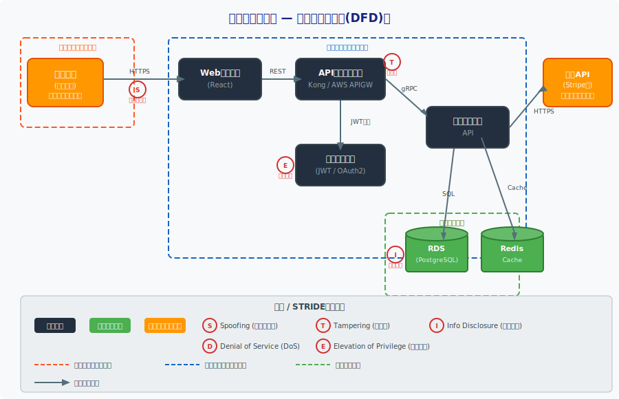


---

# DFDの描き方ルール

- <svg viewBox="0 0 800 400" style="max-height:70vh;max-width:100%;display:block;margin:0 auto;" xmlns="http://www.w3.org/2000/svg"><rect width="800" height="400" fill="#1a1a2e"/><text x="400" y="35" text-anchor="middle" fill="#f9a825" font-size="18" font-family="sans-serif" font-weight="bold">シフトレフト セキュリティ</text><line x1="60" y1="200" x2="740" y2="200" stroke="#444" stroke-width="2"/><polygon points="735,194 750,200 735,206" fill="#444"/><rect x="60" y="158" width="100" height="44" rx="6" fill="#16213e" stroke="#f9a825" stroke-width="1.5"/><text x="110" y="185" text-anchor="middle" fill="#ffffff" font-size="13" font-family="sans-serif">設計</text><rect x="183" y="158" width="100" height="44" rx="6" fill="#16213e" stroke="#f9a825" stroke-width="1.5"/><text x="233" y="185" text-anchor="middle" fill="#ffffff" font-size="11" font-family="sans-serif">コーディング</text><rect x="306" y="158" width="100" height="44" rx="6" fill="#16213e" stroke="#f9a825" stroke-width="1.5"/><text x="356" y="185" text-anchor="middle" fill="#ffffff" font-size="13" font-family="sans-serif">ビルド</text><rect x="429" y="158" width="100" height="44" rx="6" fill="#16213e" stroke="#555" stroke-width="1.5"/><text x="479" y="185" text-anchor="middle" fill="#ffffff" font-size="13" font-family="sans-serif">テスト</text><rect x="552" y="158" width="100" height="44" rx="6" fill="#16213e" stroke="#e91e63" stroke-width="1.5"/><text x="602" y="185" text-anchor="middle" fill="#ffffff" font-size="13" font-family="sans-serif">本番</text><text x="110" y="228" text-anchor="middle" fill="#f9a825" font-size="10" font-family="sans-serif">脅威モデリング</text><text x="233" y="228" text-anchor="middle" fill="#f9a825" font-size="10" font-family="sans-serif">SAST/シークレット</text><text x="356" y="228" text-anchor="middle" fill="#f9a825" font-size="10" font-family="sans-serif">SCA/SBOM</text><text x="479" y="228" text-anchor="middle" fill="#ffffff" font-size="10" font-family="sans-serif">DAST</text><text x="602" y="228" text-anchor="middle" fill="#e91e63" font-size="10" font-family="sans-serif">CSPM</text><rect x="60" y="255" width="360" height="28" rx="4" fill="#1565c0" opacity="0.7"/><text x="240" y="274" text-anchor="middle" fill="#ffffff" font-size="11" font-family="sans-serif">シフトレフト領域 — 修正コスト: 低</text><rect x="440" y="255" width="212" height="28" rx="4" fill="#e91e63" opacity="0.6"/><text x="546" y="274" text-anchor="middle" fill="#ffffff" font-size="11" font-family="sans-serif">遅延発見 — コスト: 高</text><text x="400" y="355" text-anchor="middle" fill="#888" font-size="11" font-family="sans-serif">早期発見により修正コストを最大1/100に削減</text></svg>
- **4つの要素:**
- □ **プロセス**: データを処理するコンポーネント（円または角丸四角）
- → **データフロー**: データの流れ（矢印） / = **データストア**: データの保存先（平行線）
- [ **外部エンティティ**: システム境界外の存在（四角）
- **トラストバウンダリー**: 信頼レベルが変わる境界を点線で囲む
- **各フローにSTRIDEを適用して脅威をリストアップ**


---

# 攻撃ツリー分析

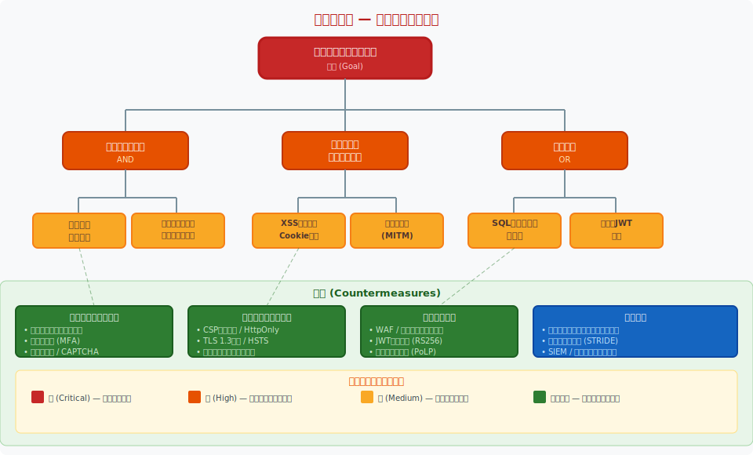


---

# DREADスコアリング

| 要素 | 意味 | スコア（1-3）|
|------|------|------------|
| **D**amage | 被害の大きさ | 軽微→重大 |
| **R**eproducibility | 再現性の高さ | 困難→容易 |
| **E**xploitability | 悪用の容易さ | 専門知識→スクリプト |
| **A**ffected users | 影響ユーザー数 | 少数→全員 |
| **D**iscoverability | 発見されやすさ | 困難→公開情報 |


---

# Microsoft Threat Modeling Tool

- <svg viewBox="0 0 800 400" style="max-height:70vh;max-width:100%;display:block;margin:0 auto;" xmlns="http://www.w3.org/2000/svg"><rect width="800" height="400" fill="#1a1a2e"/><text x="400" y="35" text-anchor="middle" fill="#f9a825" font-size="18" font-family="sans-serif" font-weight="bold">CI/CD セキュリティパイプライン</text><rect x="20" y="162" width="85" height="46" rx="6" fill="#16213e" stroke="#42a5f5" stroke-width="1.5"/><text x="62.5" y="190" text-anchor="middle" fill="#ffffff" font-size="13" font-family="sans-serif">コード</text>
<line x1="105" y1="185" x2="123" y2="185" stroke="#f9a825" stroke-width="2"/><polygon points="118,179 133,185 118,191" fill="#f9a825"/>
<rect x="133" y="162" width="85" height="46" rx="6" fill="#1565c0" stroke="#42a5f5" stroke-width="1.5"/><text x="175.5" y="190" text-anchor="middle" fill="#ffffff" font-size="13" font-family="sans-serif">SAST</text>
<line x1="218" y1="185" x2="236" y2="185" stroke="#f9a825" stroke-width="2"/><polygon points="231,179 246,185 231,191" fill="#f9a825"/>
<rect x="246" y="162" width="85" height="46" rx="6" fill="#1565c0" stroke="#42a5f5" stroke-width="1.5"/><text x="288.5" y="190" text-anchor="middle" fill="#ffffff" font-size="13" font-family="sans-serif">SCA</text>
<line x1="331" y1="185" x2="349" y2="185" stroke="#f9a825" stroke-width="2"/><polygon points="344,179 359,185 344,191" fill="#f9a825"/>
<rect x="359" y="162" width="85" height="46" rx="6" fill="#1b5e20" stroke="#66bb6a" stroke-width="1.5"/><text x="401.5" y="190" text-anchor="middle" fill="#ffffff" font-size="13" font-family="sans-serif">ビルド</text>
<line x1="444" y1="185" x2="462" y2="185" stroke="#f9a825" stroke-width="2"/><polygon points="457,179 472,185 457,191" fill="#f9a825"/>
<rect x="472" y="162" width="85" height="46" rx="6" fill="#1565c0" stroke="#42a5f5" stroke-width="1.5"/><text x="514.5" y="190" text-anchor="middle" fill="#ffffff" font-size="13" font-family="sans-serif">DAST</text>
<line x1="557" y1="185" x2="575" y2="185" stroke="#f9a825" stroke-width="2"/><polygon points="570,179 585,185 570,191" fill="#f9a825"/>
<rect x="585" y="162" width="85" height="46" rx="6" fill="#4a148c" stroke="#ce93d8" stroke-width="1.5"/><text x="627.5" y="190" text-anchor="middle" fill="#ffffff" font-size="13" font-family="sans-serif">Scan</text>
<line x1="670" y1="185" x2="688" y2="185" stroke="#66bb6a" stroke-width="2"/><polygon points="683,179 698,185 683,191" fill="#66bb6a"/>
<rect x="698" y="162" width="82" height="46" rx="6" fill="#1b5e20" stroke="#66bb6a" stroke-width="1.5"/><text x="739" y="190" text-anchor="middle" fill="#ffffff" font-size="13" font-family="sans-serif">Deploy</text>
<rect x="133" y="233" width="537" height="28" rx="4" fill="#16213e" stroke="#f9a825" stroke-width="1.5"/>
<text x="401" y="252" text-anchor="middle" fill="#f9a825" font-size="12" font-family="sans-serif">セキュリティゲート: 失敗時はパイプライン自動停止</text>
<text x="400" y="360" text-anchor="middle" fill="#888" font-size="11" font-family="sans-serif">毎コミットで自動スキャン — 問題を早期に検出・ブロック</text></svg>
- **Microsoft Threat Modeling Tool 2016 (無料)**
- DFDを描くと自動でSTRIDE脅威を列挙
- 各脅威にステータス管理・レポート出力
- **代替ツール:**
- OWASP Threat Dragon（Web版・OSS）
- IriusRisk（エンタープライズ・有償）/ Threagile（YAML定義・K8s向け・OSS）


---

# 継続的脅威モデリング（Agile TM）

- <svg viewBox="0 0 800 400" style="max-height:70vh;max-width:100%;display:block;margin:0 auto;" xmlns="http://www.w3.org/2000/svg"><rect width="800" height="400" fill="#1a1a2e"/><text x="400" y="35" text-anchor="middle" fill="#f9a825" font-size="18" font-family="sans-serif" font-weight="bold">STRIDE 脅威モデリング</text>
<rect x="20" y="60" width="230" height="52" rx="6" fill="#16213e" stroke="#e91e63" stroke-width="1.5"/><text x="135" y="91" text-anchor="middle" fill="#ffffff" font-size="12" font-family="sans-serif">S — Spoofing (なりすまし)</text>
<text x="135" y="127" text-anchor="middle" fill="#888" font-size="10" font-family="sans-serif">対策: 多要素認証・証明書検証</text>
<rect x="285" y="60" width="230" height="52" rx="6" fill="#16213e" stroke="#e91e63" stroke-width="1.5"/><text x="400" y="91" text-anchor="middle" fill="#ffffff" font-size="12" font-family="sans-serif">T — Tampering (改ざん)</text>
<text x="400" y="127" text-anchor="middle" fill="#888" font-size="10" font-family="sans-serif">対策: デジタル署名・整合性チェック</text>
<rect x="550" y="60" width="230" height="52" rx="6" fill="#16213e" stroke="#e91e63" stroke-width="1.5"/><text x="665" y="91" text-anchor="middle" fill="#ffffff" font-size="12" font-family="sans-serif">R — Repudiation (否認)</text>
<text x="665" y="127" text-anchor="middle" fill="#888" font-size="10" font-family="sans-serif">対策: 監査ログ・タイムスタンプ</text>
<rect x="20" y="150" width="230" height="52" rx="6" fill="#16213e" stroke="#f9a825" stroke-width="1.5"/><text x="135" y="181" text-anchor="middle" fill="#ffffff" font-size="12" font-family="sans-serif">I — Info Disclosure (漏洩)</text>
<text x="135" y="217" text-anchor="middle" fill="#888" font-size="10" font-family="sans-serif">対策: 暗号化・アクセス制御</text>
<rect x="285" y="150" width="230" height="52" rx="6" fill="#16213e" stroke="#f9a825" stroke-width="1.5"/><text x="400" y="181" text-anchor="middle" fill="#ffffff" font-size="12" font-family="sans-serif">D — Denial of Service</text>
<text x="400" y="217" text-anchor="middle" fill="#888" font-size="10" font-family="sans-serif">対策: レート制限・スケーリング</text>
<rect x="550" y="150" width="230" height="52" rx="6" fill="#16213e" stroke="#f9a825" stroke-width="1.5"/><text x="665" y="181" text-anchor="middle" fill="#ffffff" font-size="11" font-family="sans-serif">E — Elevation of Priv (昇格)</text>
<text x="665" y="217" text-anchor="middle" fill="#888" font-size="10" font-family="sans-serif">対策: 最小権限・サンドボックス</text>
<rect x="180" y="250" width="440" height="55" rx="8" fill="#4a148c" stroke="#ce93d8" stroke-width="1.5"/>
<text x="400" y="274" text-anchor="middle" fill="#ffffff" font-size="13" font-family="sans-serif" font-weight="bold">脅威モデリングプロセス</text>
<text x="400" y="295" text-anchor="middle" fill="#ce93d8" font-size="11" font-family="sans-serif">資産特定 → 脅威列挙 → リスク評価 → 対策設計</text>
<text x="400" y="360" text-anchor="middle" fill="#888" font-size="11" font-family="sans-serif">設計フェーズで実施することで手戻りを最小化</text></svg>
- **従来**: 大規模な脅威モデリングセッションを年に1回
- **Agile TM**: スプリントごとに小さな脅威モデリングを繰り返す
- **実践方法:**
- 新機能のDFDをPRに添付する文化を作る
- 脅威チェックリストをPRテンプレートに組み込む
- セキュリティチャンピオンがレビュー担当 / 発見された脅威はバックログに追加して管理


---

# APIへの脅威モデリング実践例

- <svg viewBox="0 0 800 400" style="max-height:70vh;max-width:100%;display:block;margin:0 auto;" xmlns="http://www.w3.org/2000/svg"><rect width="800" height="400" fill="#1a1a2e"/><text x="400" y="35" text-anchor="middle" fill="#f9a825" font-size="18" font-family="sans-serif" font-weight="bold">セキュリティゲート 判断フロー</text>
<rect x="305" y="60" width="190" height="48" rx="6" fill="#1565c0" stroke="#42a5f5" stroke-width="1.5"/><text x="400" y="89" text-anchor="middle" fill="#ffffff" font-size="13" font-family="sans-serif">コードプッシュ</text>
<line x1="400" y1="108" x2="400" y2="126" stroke="#f9a825" stroke-width="2"/><polygon points="394,121 400,136 406,121" fill="#f9a825"/>
<rect x="305" y="136" width="190" height="48" rx="6" fill="#16213e" stroke="#f9a825" stroke-width="1.5"/><text x="400" y="165" text-anchor="middle" fill="#ffffff" font-size="13" font-family="sans-serif">自動スキャン実行</text>
<line x1="400" y1="184" x2="400" y2="202" stroke="#f9a825" stroke-width="2"/><polygon points="394,197 400,212 406,197" fill="#f9a825"/>
<polygon points="400,212 490,248 400,284 310,248" fill="#16213e" stroke="#f9a825" stroke-width="1.5"/>
<text x="400" y="244" text-anchor="middle" fill="#f9a825" font-size="12" font-family="sans-serif">重大な脆弱性</text>
<text x="400" y="262" text-anchor="middle" fill="#f9a825" font-size="12" font-family="sans-serif">あり?</text>
<line x1="490" y1="248" x2="560" y2="248" stroke="#e91e63" stroke-width="2"/><polygon points="555,242 570,248 555,254" fill="#e91e63"/>
<text x="525" y="240" fill="#e91e63" font-size="11" font-family="sans-serif">YES</text>
<rect x="570" y="224" width="180" height="48" rx="6" fill="#b71c1c" stroke="#e91e63" stroke-width="1.5"/><text x="660" y="253" text-anchor="middle" fill="#ffffff" font-size="13" font-family="sans-serif">パイプライン停止</text>
<line x1="400" y1="284" x2="400" y2="312" stroke="#66bb6a" stroke-width="2"/><polygon points="394,307 400,322 406,307" fill="#66bb6a"/>
<text x="415" y="302" fill="#66bb6a" font-size="11" font-family="sans-serif">NO</text>
<rect x="305" y="322" width="190" height="48" rx="6" fill="#1b5e20" stroke="#66bb6a" stroke-width="1.5"/><text x="400" y="351" text-anchor="middle" fill="#ffffff" font-size="13" font-family="sans-serif">次ステージへ進む</text>
<text x="400" y="390" text-anchor="middle" fill="#888" font-size="11" font-family="sans-serif">Critical/High は即時ブロック — Low は許容ポリシー設定可</text></svg>
- **対象**: RESTful API + JWT認証 + RDS
- **識別した主要脅威:**
- S: JWTトークン窃取によるなりすまし → 対策: 短い有効期限 + Refresh Token Rotation
- T: SQLインジェクションによるDB改ざん → 対策: ORM + パラメータバインディング
- I: エラーレスポンスでのDB情報漏洩 → 対策: 汎用エラーメッセージ
- E: IDOR（水平権限昇格）→ 対策: リソース所有者チェック


---

# マイクロサービスへの脅威モデリング適用

- <svg viewBox="0 0 800 400" style="max-height:70vh;max-width:100%;display:block;margin:0 auto;" xmlns="http://www.w3.org/2000/svg"><rect width="800" height="400" fill="#1a1a2e"/><text x="400" y="35" text-anchor="middle" fill="#f9a825" font-size="18" font-family="sans-serif" font-weight="bold">コンテナイメージ スキャンパイプライン</text>
<rect x="20" y="155" width="110" height="50" rx="6" fill="#16213e" stroke="#42a5f5" stroke-width="1.5"/><text x="75" y="185" text-anchor="middle" fill="#ffffff" font-size="13" font-family="sans-serif">Dockerfile</text>
<line x1="130" y1="180" x2="148" y2="180" stroke="#f9a825" stroke-width="2"/><polygon points="143,174 158,180 143,186" fill="#f9a825"/>
<rect x="158" y="155" width="110" height="50" rx="6" fill="#16213e" stroke="#f9a825" stroke-width="1.5"/><text x="213" y="185" text-anchor="middle" fill="#ffffff" font-size="11" font-family="sans-serif">イメージビルド</text>
<line x1="268" y1="180" x2="286" y2="180" stroke="#f9a825" stroke-width="2"/><polygon points="281,174 296,180 281,186" fill="#f9a825"/>
<rect x="296" y="155" width="110" height="50" rx="6" fill="#1565c0" stroke="#42a5f5" stroke-width="1.5"/><text x="351" y="185" text-anchor="middle" fill="#ffffff" font-size="11" font-family="sans-serif">脆弱性スキャン</text>
<line x1="406" y1="180" x2="424" y2="180" stroke="#f9a825" stroke-width="2"/><polygon points="419,174 434,180 419,186" fill="#f9a825"/>
<polygon points="460,155 505,180 460,205" fill="#16213e" stroke="#f9a825" stroke-width="1.5"/>
<text x="462" y="177" text-anchor="middle" fill="#f9a825" font-size="10" font-family="sans-serif">合格?</text>
<text x="462" y="193" text-anchor="middle" fill="#f9a825" font-size="10" font-family="sans-serif">PASS?</text>
<line x1="505" y1="180" x2="540" y2="180" stroke="#66bb6a" stroke-width="2"/><polygon points="535,174 550,180 535,186" fill="#66bb6a"/>
<text x="522" y="170" fill="#66bb6a" font-size="10" font-family="sans-serif">YES</text>
<rect x="550" y="155" width="110" height="50" rx="6" fill="#1b5e20" stroke="#66bb6a" stroke-width="1.5"/><text x="605" y="185" text-anchor="middle" fill="#ffffff" font-size="11" font-family="sans-serif">レジストリPUSH</text>
<line x1="660" y1="180" x2="698" y2="180" stroke="#66bb6a" stroke-width="2"/><polygon points="693,174 708,180 693,186" fill="#66bb6a"/>
<rect x="708" y="155" width="72" height="50" rx="6" fill="#1b5e20" stroke="#66bb6a" stroke-width="1.5"/><text x="744" y="185" text-anchor="middle" fill="#ffffff" font-size="11" font-family="sans-serif">デプロイ</text>
<line x1="462" y1="205" x2="462" y2="265" stroke="#e91e63" stroke-width="2"/><polygon points="456,260 462,275 468,260" fill="#e91e63"/>
<text x="477" y="240" fill="#e91e63" font-size="10" font-family="sans-serif">NO</text>
<rect x="362" y="275" width="200" height="48" rx="6" fill="#b71c1c" stroke="#e91e63" stroke-width="1.5"/><text x="462" y="304" text-anchor="middle" fill="#ffffff" font-size="13" font-family="sans-serif">ビルド失敗 / 通知</text>
<text x="400" y="360" text-anchor="middle" fill="#888" font-size="11" font-family="sans-serif">Trivy / Snyk / ECR Scan — Critical CVE はブロック</text></svg>
- **追加で考慮すべき脅威面:**
- サービス間認証: mTLSなし→なりすまし（S）
- サービスメッシュ未導入→横断的な盗聴（I）
- 過剰なサービス権限→侵害時の横移動被害拡大（E）
- **対策パターン:**
- SPIFFE/SPIREによるワークロードID / Istio/Linkerdでmtls強制 / ゼロトラスト: 同一クラスタ内でも認証・認可


---

<!-- _class: lead -->
# Chapter 5: クラウドネイティブセキュリティ

- 4C's・コンテナ・Kubernetes・OPA・CSPM・eBPF


---

# 4C's of Cloud Native Security

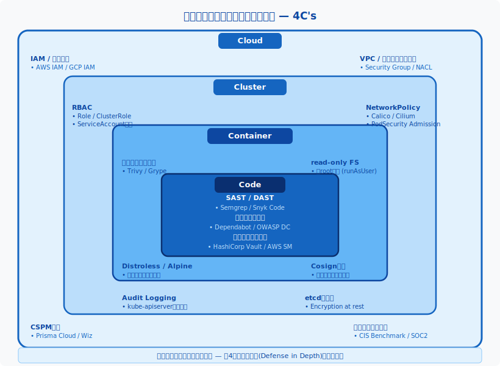


---

# コンテナセキュリティの全体像

- <svg viewBox="0 0 800 400" style="max-height:70vh;max-width:100%;display:block;margin:0 auto;" xmlns="http://www.w3.org/2000/svg"><rect width="800" height="400" fill="#1a1a2e"/><text x="400" y="35" text-anchor="middle" fill="#f9a825" font-size="18" font-family="sans-serif" font-weight="bold">IaC セキュリティチェックフロー</text>
<rect x="20" y="162" width="120" height="46" rx="6" fill="#16213e" stroke="#42a5f5" stroke-width="1.5"/><text x="80" y="190" text-anchor="middle" fill="#ffffff" font-size="13" font-family="sans-serif">Terraform/CF</text>
<line x1="140" y1="185" x2="158" y2="185" stroke="#f9a825" stroke-width="2"/><polygon points="153,179 168,185 153,191" fill="#f9a825"/>
<rect x="168" y="162" width="120" height="46" rx="6" fill="#1565c0" stroke="#42a5f5" stroke-width="1.5"/><text x="228" y="190" text-anchor="middle" fill="#ffffff" font-size="13" font-family="sans-serif">静的解析</text>
<text x="228" y="222" text-anchor="middle" fill="#42a5f5" font-size="10" font-family="sans-serif">tfsec / Checkov</text>
<line x1="288" y1="185" x2="306" y2="185" stroke="#f9a825" stroke-width="2"/><polygon points="301,179 316,185 301,191" fill="#f9a825"/>
<rect x="316" y="162" width="120" height="46" rx="6" fill="#4a148c" stroke="#ce93d8" stroke-width="1.5"/><text x="376" y="190" text-anchor="middle" fill="#ffffff" font-size="11" font-family="sans-serif">ポリシーチェック</text>
<text x="376" y="222" text-anchor="middle" fill="#ce93d8" font-size="10" font-family="sans-serif">OPA / Sentinel</text>
<line x1="436" y1="185" x2="454" y2="185" stroke="#f9a825" stroke-width="2"/><polygon points="449,179 464,185 449,191" fill="#f9a825"/>
<rect x="464" y="162" width="120" height="46" rx="6" fill="#16213e" stroke="#f9a825" stroke-width="1.5"/><text x="524" y="190" text-anchor="middle" fill="#ffffff" font-size="13" font-family="sans-serif">コストチェック</text>
<text x="524" y="222" text-anchor="middle" fill="#f9a825" font-size="10" font-family="sans-serif">Infracost</text>
<line x1="584" y1="185" x2="602" y2="185" stroke="#66bb6a" stroke-width="2"/><polygon points="597,179 612,185 597,191" fill="#66bb6a"/>
<rect x="612" y="162" width="120" height="46" rx="6" fill="#1b5e20" stroke="#66bb6a" stroke-width="1.5"/><text x="672" y="190" text-anchor="middle" fill="#ffffff" font-size="11" font-family="sans-serif">ドリフト検出</text>
<line x1="732" y1="185" x2="750" y2="185" stroke="#66bb6a" stroke-width="2"/><polygon points="745,179 760,185 745,191" fill="#66bb6a"/>
<rect x="762" y="162" width="18" height="46" rx="6" fill="#1b5e20" stroke="#66bb6a" stroke-width="1.5"/><text x="771" y="190" text-anchor="middle" fill="#ffffff" font-size="13" font-family="sans-serif"></text>
<rect x="168" y="270" width="464" height="48" rx="6" fill="#16213e" stroke="#f9a825" stroke-width="1.5"/>
<text x="400" y="292" text-anchor="middle" fill="#ffffff" font-size="12" font-family="sans-serif" font-weight="bold">検出される設定ミス例</text>
<text x="400" y="312" text-anchor="middle" fill="#f9a825" font-size="11" font-family="sans-serif">S3パブリック公開 / SG 0.0.0.0/0 / 暗号化なし / IAM *</text>
<text x="400" y="360" text-anchor="middle" fill="#888" font-size="11" font-family="sans-serif">インフラコードもアプリコードと同様にスキャン必須</text></svg>
- **4つのレイヤー:**
- ① イメージセキュリティ: 脆弱なベースイメージの検出・署名
- ② ランタイムセキュリティ: 異常な振る舞いの検出・遮断
- ③ レジストリセキュリティ: アクセス制御・スキャン
- ④ オーケストレーション: K8s設定の強化・ポリシー強制
- **原則**: イミュータブルインフラ + 最小イメージ（Distroless）


---

# Dockerイメージスキャン

- <svg viewBox="0 0 800 400" style="max-height:70vh;max-width:100%;display:block;margin:0 auto;" xmlns="http://www.w3.org/2000/svg"><rect width="800" height="400" fill="#1a1a2e"/><text x="400" y="35" text-anchor="middle" fill="#f9a825" font-size="18" font-family="sans-serif" font-weight="bold">Compliance as Code ワークフロー</text>
<rect x="20" y="75" width="155" height="48" rx="6" fill="#16213e" stroke="#e91e63" stroke-width="1.5"/><text x="97.5" y="104" text-anchor="middle" fill="#ffffff" font-size="13" font-family="sans-serif">規制要件</text>
<text x="97" y="140" text-anchor="middle" fill="#888" font-size="10" font-family="sans-serif">PCI-DSS / SOC2 / ISO27001</text>
<rect x="20" y="215" width="155" height="48" rx="6" fill="#16213e" stroke="#e91e63" stroke-width="1.5"/><text x="97.5" y="244" text-anchor="middle" fill="#ffffff" font-size="13" font-family="sans-serif">ベースライン</text>
<text x="97" y="280" text-anchor="middle" fill="#888" font-size="10" font-family="sans-serif">CIS Benchmark / NIST</text>
<line x1="175" y1="99" x2="230" y2="150" stroke="#f9a825" stroke-width="2"/>
<polygon points="222,143 234,155 221,142" fill="#f9a825"/>
<line x1="175" y1="239" x2="230" y2="200" stroke="#f9a825" stroke-width="2"/>
<polygon points="225,196 236,207 223,195" fill="#f9a825"/>
<rect x="240" y="148" width="155" height="48" rx="6" fill="#4a148c" stroke="#ce93d8" stroke-width="1.5"/><text x="317.5" y="177" text-anchor="middle" fill="#ffffff" font-size="11" font-family="sans-serif">ポリシーコード化</text>
<text x="317" y="213" text-anchor="middle" fill="#ce93d8" font-size="10" font-family="sans-serif">OPA Rego / Config Rules</text>
<line x1="395" y1="172" x2="428" y2="172" stroke="#f9a825" stroke-width="2"/><polygon points="423,166 438,172 423,178" fill="#f9a825"/>
<rect x="438" y="148" width="155" height="48" rx="6" fill="#1565c0" stroke="#42a5f5" stroke-width="1.5"/><text x="515.5" y="177" text-anchor="middle" fill="#ffffff" font-size="12" font-family="sans-serif">継続的監査</text>
<text x="515" y="213" text-anchor="middle" fill="#42a5f5" font-size="10" font-family="sans-serif">自動評価・レポート</text>
<line x1="593" y1="172" x2="626" y2="172" stroke="#66bb6a" stroke-width="2"/><polygon points="621,166 636,172 621,178" fill="#66bb6a"/>
<rect x="636" y="148" width="144" height="48" rx="6" fill="#1b5e20" stroke="#66bb6a" stroke-width="1.5"/><text x="708" y="177" text-anchor="middle" fill="#ffffff" font-size="11" font-family="sans-serif">合格 / 修正指示</text>
<rect x="240" y="290" width="400" height="45" rx="6" fill="#16213e" stroke="#f9a825" stroke-width="1.5"/>
<text x="440" y="310" text-anchor="middle" fill="#ffffff" font-size="12" font-family="sans-serif" font-weight="bold">コンプライアンス状態をダッシュボードで可視化</text>
<text x="440" y="328" text-anchor="middle" fill="#f9a825" font-size="11" font-family="sans-serif">Security Hub / AWS Config / Prowler</text>
<text x="400" y="370" text-anchor="middle" fill="#888" font-size="11" font-family="sans-serif">手作業監査を自動化 — 常時準拠状態を維持</text></svg>
- **Trivy（推奨）**: 高速・精度高・SBOM生成対応
- **Snyk Container**: 開発者向けUIが優秀・修正提案あり
- **Grype**: SBOMからの脆弱性照合に特化
- **スキャン対象**: CVE・設定ミス・シークレット・ライセンス
- **CI/CDへの統合**: レジストリプッシュ前に自動スキャン+CRITICAL拒否


---

# Trivy実践 — イメージスキャン

- <svg viewBox="0 0 800 400" style="max-height:70vh;max-width:100%;display:block;margin:0 auto;" xmlns="http://www.w3.org/2000/svg"><rect width="800" height="400" fill="#1a1a2e"/><text x="400" y="35" text-anchor="middle" fill="#f9a825" font-size="18" font-family="sans-serif" font-weight="bold">ゼロトラスト アーキテクチャ</text>
<rect x="295" y="150" width="210" height="115" rx="8" fill="#16213e" stroke="#f9a825" stroke-width="2"/>
<text x="400" y="190" text-anchor="middle" fill="#f9a825" font-size="13" font-family="sans-serif" font-weight="bold">ポリシーエンジン</text>
<text x="400" y="210" text-anchor="middle" fill="#ffffff" font-size="11" font-family="sans-serif">Never Trust, Always Verify</text>
<text x="400" y="230" text-anchor="middle" fill="#888" font-size="10" font-family="sans-serif">IAM / MFA / デバイス証明書</text>
<text x="400" y="250" text-anchor="middle" fill="#888" font-size="10" font-family="sans-serif">継続的認証・認可</text>
<rect x="20" y="80" width="140" height="46" rx="6" fill="#16213e" stroke="#42a5f5" stroke-width="1.5"/><text x="90" y="108" text-anchor="middle" fill="#ffffff" font-size="13" font-family="sans-serif">ユーザー</text>
<rect x="20" y="178" width="140" height="46" rx="6" fill="#16213e" stroke="#42a5f5" stroke-width="1.5"/><text x="90" y="206" text-anchor="middle" fill="#ffffff" font-size="13" font-family="sans-serif">デバイス</text>
<rect x="20" y="278" width="140" height="46" rx="6" fill="#16213e" stroke="#42a5f5" stroke-width="1.5"/><text x="90" y="306" text-anchor="middle" fill="#ffffff" font-size="13" font-family="sans-serif">ワークロード</text>
<rect x="640" y="80" width="140" height="46" rx="6" fill="#16213e" stroke="#66bb6a" stroke-width="1.5"/><text x="710" y="108" text-anchor="middle" fill="#ffffff" font-size="13" font-family="sans-serif">アプリ A</text>
<rect x="640" y="178" width="140" height="46" rx="6" fill="#16213e" stroke="#66bb6a" stroke-width="1.5"/><text x="710" y="206" text-anchor="middle" fill="#ffffff" font-size="13" font-family="sans-serif">アプリ B</text>
<rect x="640" y="278" width="140" height="46" rx="6" fill="#16213e" stroke="#66bb6a" stroke-width="1.5"/><text x="710" y="306" text-anchor="middle" fill="#ffffff" font-size="13" font-family="sans-serif">データストア</text>
<line x1="160" y1="103" x2="295" y2="175" stroke="#f9a825" stroke-width="1.5"/><polygon points="287,169 299,180 287,167" fill="#f9a825"/>
<line x1="160" y1="201" x2="295" y2="205" stroke="#f9a825" stroke-width="1.5"/><polygon points="289,199 304,205 289,211" fill="#f9a825"/>
<line x1="160" y1="301" x2="295" y2="245" stroke="#f9a825" stroke-width="1.5"/><polygon points="288,240 300,249 288,238" fill="#f9a825"/>
<line x1="505" y1="175" x2="640" y2="103" stroke="#66bb6a" stroke-width="1.5"/><polygon points="632,98 644,107 633,96" fill="#66bb6a"/>
<line x1="505" y1="205" x2="640" y2="201" stroke="#66bb6a" stroke-width="1.5"/><polygon points="634,195 649,201 634,207" fill="#66bb6a"/>
<line x1="505" y1="245" x2="640" y2="301" stroke="#66bb6a" stroke-width="1.5"/><polygon points="633,295 645,304 633,293" fill="#66bb6a"/>
<text x="400" y="375" text-anchor="middle" fill="#888" font-size="11" font-family="sans-serif">ネットワーク境界ではなくID・コンテキストで判断</text></svg>
- `--exit-code 1` でCI/CDゲートとして機能


---

# Trivy実践 — イメージスキャン（コード例）

```bash
# イメージスキャン（Critical/Highのみ表示）
trivy image --severity CRITICAL,HIGH \
  --format table \
  myapp:latest

# CriticalCVEがあれば終了コード1でCIをブロック
trivy image --exit-code 1 \
  --severity CRITICAL \
  myapp:latest

# SBOM付きスキャン
trivy image --format cyclonedx \
  --output sbom.json myapp:latest
```


---

# Dockerfileベストプラクティス

- <svg viewBox="0 0 800 400" style="max-height:70vh;max-width:100%;display:block;margin:0 auto;" xmlns="http://www.w3.org/2000/svg"><rect width="800" height="400" fill="#1a1a2e"/><text x="400" y="35" text-anchor="middle" fill="#f9a825" font-size="18" font-family="sans-serif" font-weight="bold">シークレット管理 ベストプラクティス</text>
<rect x="295" y="65" width="210" height="50" rx="6" fill="#4a148c" stroke="#ce93d8" stroke-width="1.5"/><text x="400" y="95" text-anchor="middle" fill="#ffffff" font-size="13" font-family="sans-serif">シークレットストア</text>
<text x="400" y="133" text-anchor="middle" fill="#ce93d8" font-size="10" font-family="sans-serif">AWS Secrets Manager / HashiCorp Vault</text>
<line x1="400" y1="115" x2="400" y2="148" stroke="#f9a825" stroke-width="2"/><polygon points="394,143 400,158 406,143" fill="#f9a825"/>
<rect x="295" y="158" width="210" height="50" rx="6" fill="#1565c0" stroke="#42a5f5" stroke-width="1.5"/><text x="400" y="188" text-anchor="middle" fill="#ffffff" font-size="12" font-family="sans-serif">動的クレデンシャル</text>
<text x="400" y="226" text-anchor="middle" fill="#42a5f5" font-size="10" font-family="sans-serif">短期有効期限・自動ローテーション</text>
<line x1="295" y1="183" x2="220" y2="183" stroke="#f9a825" stroke-width="2"/><polygon points="225,177 210,183 225,189" fill="#f9a825"/>
<rect x="30" y="158" width="170" height="50" rx="6" fill="#16213e" stroke="#66bb6a" stroke-width="1.5"/><text x="115" y="188" text-anchor="middle" fill="#ffffff" font-size="12" font-family="sans-serif">アプリケーション</text>
<text x="115" y="226" text-anchor="middle" fill="#888" font-size="10" font-family="sans-serif">APIで取得 / 環境変数に依存しない</text>
<line x1="505" y1="183" x2="570" y2="183" stroke="#f9a825" stroke-width="2"/><polygon points="565,177 580,183 565,189" fill="#f9a825"/>
<rect x="580" y="158" width="190" height="50" rx="6" fill="#16213e" stroke="#66bb6a" stroke-width="1.5"/><text x="675" y="188" text-anchor="middle" fill="#ffffff" font-size="11" font-family="sans-serif">CI/CDパイプライン</text>
<text x="675" y="226" text-anchor="middle" fill="#888" font-size="10" font-family="sans-serif">Gitにシークレットを保存しない</text>
<rect x="130" y="280" width="540" height="55" rx="8" fill="#16213e" stroke="#e91e63" stroke-width="2"/>
<text x="400" y="303" text-anchor="middle" fill="#e91e63" font-size="13" font-family="sans-serif" font-weight="bold">禁止事項</text>
<text x="400" y="323" text-anchor="middle" fill="#ffffff" font-size="11" font-family="sans-serif">ハードコード / .env をGitコミット / ログへの出力 / 長期キー</text>
<text x="400" y="370" text-anchor="middle" fill="#888" font-size="11" font-family="sans-serif">git-secrets / truffleHog で事前検出</text></svg>
- Distroless: シェル・パッケージマネージャーなし → 攻撃面を最小化


---

# Dockerfileベストプラクティス（コード例）

```dockerfile
# ❌ 危険な例
FROM ubuntu:latest
RUN apt-get install -y curl wget
COPY . /app
RUN npm install
CMD ["node", "server.js"]

# ✅ 安全な例
FROM node:20-alpine AS builder
WORKDIR /app
COPY package*.json ./
RUN npm ci --only=production

FROM gcr.io/distroless/nodejs20
COPY --from=builder /app /app
USER nonroot
CMD ["/app/server.js"]
```


---

# コンテナランタイムセキュリティ — Falco

- <svg viewBox="0 0 800 400" style="max-height:70vh;max-width:100%;display:block;margin:0 auto;" xmlns="http://www.w3.org/2000/svg"><rect width="800" height="400" fill="#1a1a2e"/><text x="400" y="35" text-anchor="middle" fill="#f9a825" font-size="18" font-family="sans-serif" font-weight="bold">DevSecOps サイクル</text><rect x="80" y="160" width="130" height="55" rx="6" fill="#1565c0" stroke="#f9a825" stroke-width="1.5"/><text x="145" y="192.5" text-anchor="middle" fill="#ffffff" font-size="17" font-family="sans-serif">Dev</text><rect x="335" y="65" width="130" height="55" rx="6" fill="#b71c1c" stroke="#e91e63" stroke-width="1.5"/><text x="400" y="97.5" text-anchor="middle" fill="#ffffff" font-size="17" font-family="sans-serif">Sec</text><rect x="590" y="160" width="130" height="55" rx="6" fill="#1b5e20" stroke="#66bb6a" stroke-width="1.5"/><text x="655" y="192.5" text-anchor="middle" fill="#ffffff" font-size="17" font-family="sans-serif">Ops</text><path d="M210,187 Q335,140 335,120" stroke="#f9a825" stroke-width="2" fill="none"/><polygon points="333,108 341,124 325,124" fill="#f9a825"/><path d="M465,92 Q530,130 590,175" stroke="#f9a825" stroke-width="2" fill="none"/><polygon points="582,169 594,181 579,180" fill="#f9a825"/><path d="M590,215 Q400,320 210,215" stroke="#f9a825" stroke-width="2" fill="none"/><polygon points="212,207 204,220 219,221" fill="#f9a825"/><text x="260" y="130" text-anchor="middle" fill="#ffffff" font-size="11" font-family="sans-serif">設計・実装</text><text x="550" y="135" text-anchor="middle" fill="#ffffff" font-size="11" font-family="sans-serif">テスト・スキャン</text><text x="400" y="310" text-anchor="middle" fill="#ffffff" font-size="11" font-family="sans-serif">監視・フィードバック</text><rect x="315" y="170" width="170" height="45" rx="6" fill="#4a148c" stroke="#ce93d8" stroke-width="1.5"/><text x="400" y="197.5" text-anchor="middle" fill="#ffffff" font-size="11" font-family="sans-serif">継続的セキュリティ</text><text x="400" y="375" text-anchor="middle" fill="#888" font-size="11" font-family="sans-serif">セキュリティを全フェーズに統合</text></svg>
- **Falco（CNCF Graduated）**: カーネルシステムコールを監視し異常を検出
- **検出例:**
- コンテナ内でのシェル実行（/bin/bash）
- 機密ファイルへのアクセス（/etc/passwd）
- 予期しないネットワーク接続 / 特権昇格の試み
- **対応**: Slack/PagerDuty通知 + 自動Pod隔離


---

# Falcoルール作成例

- <svg viewBox="0 0 800 400" style="max-height:70vh;max-width:100%;display:block;margin:0 auto;" xmlns="http://www.w3.org/2000/svg"><rect width="800" height="400" fill="#1a1a2e"/><text x="400" y="35" text-anchor="middle" fill="#f9a825" font-size="18" font-family="sans-serif" font-weight="bold">シフトレフト セキュリティ</text><line x1="60" y1="200" x2="740" y2="200" stroke="#444" stroke-width="2"/><polygon points="735,194 750,200 735,206" fill="#444"/><rect x="60" y="158" width="100" height="44" rx="6" fill="#16213e" stroke="#f9a825" stroke-width="1.5"/><text x="110" y="185" text-anchor="middle" fill="#ffffff" font-size="13" font-family="sans-serif">設計</text><rect x="183" y="158" width="100" height="44" rx="6" fill="#16213e" stroke="#f9a825" stroke-width="1.5"/><text x="233" y="185" text-anchor="middle" fill="#ffffff" font-size="11" font-family="sans-serif">コーディング</text><rect x="306" y="158" width="100" height="44" rx="6" fill="#16213e" stroke="#f9a825" stroke-width="1.5"/><text x="356" y="185" text-anchor="middle" fill="#ffffff" font-size="13" font-family="sans-serif">ビルド</text><rect x="429" y="158" width="100" height="44" rx="6" fill="#16213e" stroke="#555" stroke-width="1.5"/><text x="479" y="185" text-anchor="middle" fill="#ffffff" font-size="13" font-family="sans-serif">テスト</text><rect x="552" y="158" width="100" height="44" rx="6" fill="#16213e" stroke="#e91e63" stroke-width="1.5"/><text x="602" y="185" text-anchor="middle" fill="#ffffff" font-size="13" font-family="sans-serif">本番</text><text x="110" y="228" text-anchor="middle" fill="#f9a825" font-size="10" font-family="sans-serif">脅威モデリング</text><text x="233" y="228" text-anchor="middle" fill="#f9a825" font-size="10" font-family="sans-serif">SAST/シークレット</text><text x="356" y="228" text-anchor="middle" fill="#f9a825" font-size="10" font-family="sans-serif">SCA/SBOM</text><text x="479" y="228" text-anchor="middle" fill="#ffffff" font-size="10" font-family="sans-serif">DAST</text><text x="602" y="228" text-anchor="middle" fill="#e91e63" font-size="10" font-family="sans-serif">CSPM</text><rect x="60" y="255" width="360" height="28" rx="4" fill="#1565c0" opacity="0.7"/><text x="240" y="274" text-anchor="middle" fill="#ffffff" font-size="11" font-family="sans-serif">シフトレフト領域 — 修正コスト: 低</text><rect x="440" y="255" width="212" height="28" rx="4" fill="#e91e63" opacity="0.6"/><text x="546" y="274" text-anchor="middle" fill="#ffffff" font-size="11" font-family="sans-serif">遅延発見 — コスト: 高</text><text x="400" y="355" text-anchor="middle" fill="#888" font-size="11" font-family="sans-serif">早期発見により修正コストを最大1/100に削減</text></svg>
- MITREタグ付きで攻撃フェーズを分類


---

# Falcoルール作成例（コード例）

```yaml
# /etc/falco/rules.d/custom.yaml
- rule: Shell in container
  desc: コンテナ内でシェルを実行
  condition: >
    spawned_process and container
    and proc.name in (shell_binaries)
  output: >
    シェル実行検出 (user=%user.name
    container=%container.name
    cmd=%proc.cmdline)
  priority: WARNING
  tags: [container, shell, mitre_execution]
```


---

# Kubernetesセキュリティ全体像

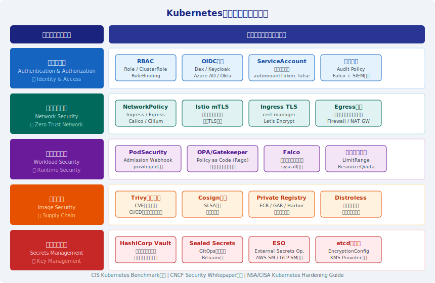


---

# PodSecurityAdmission（PSA）設定

- <svg viewBox="0 0 800 400" style="max-height:70vh;max-width:100%;display:block;margin:0 auto;" xmlns="http://www.w3.org/2000/svg"><rect width="800" height="400" fill="#1a1a2e"/><text x="400" y="35" text-anchor="middle" fill="#f9a825" font-size="18" font-family="sans-serif" font-weight="bold">CI/CD セキュリティパイプライン</text><rect x="20" y="162" width="85" height="46" rx="6" fill="#16213e" stroke="#42a5f5" stroke-width="1.5"/><text x="62.5" y="190" text-anchor="middle" fill="#ffffff" font-size="13" font-family="sans-serif">コード</text>
<line x1="105" y1="185" x2="123" y2="185" stroke="#f9a825" stroke-width="2"/><polygon points="118,179 133,185 118,191" fill="#f9a825"/>
<rect x="133" y="162" width="85" height="46" rx="6" fill="#1565c0" stroke="#42a5f5" stroke-width="1.5"/><text x="175.5" y="190" text-anchor="middle" fill="#ffffff" font-size="13" font-family="sans-serif">SAST</text>
<line x1="218" y1="185" x2="236" y2="185" stroke="#f9a825" stroke-width="2"/><polygon points="231,179 246,185 231,191" fill="#f9a825"/>
<rect x="246" y="162" width="85" height="46" rx="6" fill="#1565c0" stroke="#42a5f5" stroke-width="1.5"/><text x="288.5" y="190" text-anchor="middle" fill="#ffffff" font-size="13" font-family="sans-serif">SCA</text>
<line x1="331" y1="185" x2="349" y2="185" stroke="#f9a825" stroke-width="2"/><polygon points="344,179 359,185 344,191" fill="#f9a825"/>
<rect x="359" y="162" width="85" height="46" rx="6" fill="#1b5e20" stroke="#66bb6a" stroke-width="1.5"/><text x="401.5" y="190" text-anchor="middle" fill="#ffffff" font-size="13" font-family="sans-serif">ビルド</text>
<line x1="444" y1="185" x2="462" y2="185" stroke="#f9a825" stroke-width="2"/><polygon points="457,179 472,185 457,191" fill="#f9a825"/>
<rect x="472" y="162" width="85" height="46" rx="6" fill="#1565c0" stroke="#42a5f5" stroke-width="1.5"/><text x="514.5" y="190" text-anchor="middle" fill="#ffffff" font-size="13" font-family="sans-serif">DAST</text>
<line x1="557" y1="185" x2="575" y2="185" stroke="#f9a825" stroke-width="2"/><polygon points="570,179 585,185 570,191" fill="#f9a825"/>
<rect x="585" y="162" width="85" height="46" rx="6" fill="#4a148c" stroke="#ce93d8" stroke-width="1.5"/><text x="627.5" y="190" text-anchor="middle" fill="#ffffff" font-size="13" font-family="sans-serif">Scan</text>
<line x1="670" y1="185" x2="688" y2="185" stroke="#66bb6a" stroke-width="2"/><polygon points="683,179 698,185 683,191" fill="#66bb6a"/>
<rect x="698" y="162" width="82" height="46" rx="6" fill="#1b5e20" stroke="#66bb6a" stroke-width="1.5"/><text x="739" y="190" text-anchor="middle" fill="#ffffff" font-size="13" font-family="sans-serif">Deploy</text>
<rect x="133" y="233" width="537" height="28" rx="4" fill="#16213e" stroke="#f9a825" stroke-width="1.5"/>
<text x="401" y="252" text-anchor="middle" fill="#f9a825" font-size="12" font-family="sans-serif">セキュリティゲート: 失敗時はパイプライン自動停止</text>
<text x="400" y="360" text-anchor="middle" fill="#888" font-size="11" font-family="sans-serif">毎コミットで自動スキャン — 問題を早期に検出・ブロック</text></svg>
- **3段階**: privileged → baseline → restricted


---

# PodSecurityAdmission（PSA）設定（コード例）

```yaml
# Namespaceラベルでポリシーを適用
apiVersion: v1
kind: Namespace
metadata:
  name: production
  labels:
    pod-security.kubernetes.io/enforce: restricted
    pod-security.kubernetes.io/audit: restricted
    pod-security.kubernetes.io/warn: restricted
---
# restrictedポリシー: root禁止・seccomp必須・capabilities DROP ALL
```


---

# NetworkPolicy — ゼロトラスト通信

- <svg viewBox="0 0 800 400" style="max-height:70vh;max-width:100%;display:block;margin:0 auto;" xmlns="http://www.w3.org/2000/svg"><rect width="800" height="400" fill="#1a1a2e"/><text x="400" y="35" text-anchor="middle" fill="#f9a825" font-size="18" font-family="sans-serif" font-weight="bold">STRIDE 脅威モデリング</text>
<rect x="20" y="60" width="230" height="52" rx="6" fill="#16213e" stroke="#e91e63" stroke-width="1.5"/><text x="135" y="91" text-anchor="middle" fill="#ffffff" font-size="12" font-family="sans-serif">S — Spoofing (なりすまし)</text>
<text x="135" y="127" text-anchor="middle" fill="#888" font-size="10" font-family="sans-serif">対策: 多要素認証・証明書検証</text>
<rect x="285" y="60" width="230" height="52" rx="6" fill="#16213e" stroke="#e91e63" stroke-width="1.5"/><text x="400" y="91" text-anchor="middle" fill="#ffffff" font-size="12" font-family="sans-serif">T — Tampering (改ざん)</text>
<text x="400" y="127" text-anchor="middle" fill="#888" font-size="10" font-family="sans-serif">対策: デジタル署名・整合性チェック</text>
<rect x="550" y="60" width="230" height="52" rx="6" fill="#16213e" stroke="#e91e63" stroke-width="1.5"/><text x="665" y="91" text-anchor="middle" fill="#ffffff" font-size="12" font-family="sans-serif">R — Repudiation (否認)</text>
<text x="665" y="127" text-anchor="middle" fill="#888" font-size="10" font-family="sans-serif">対策: 監査ログ・タイムスタンプ</text>
<rect x="20" y="150" width="230" height="52" rx="6" fill="#16213e" stroke="#f9a825" stroke-width="1.5"/><text x="135" y="181" text-anchor="middle" fill="#ffffff" font-size="12" font-family="sans-serif">I — Info Disclosure (漏洩)</text>
<text x="135" y="217" text-anchor="middle" fill="#888" font-size="10" font-family="sans-serif">対策: 暗号化・アクセス制御</text>
<rect x="285" y="150" width="230" height="52" rx="6" fill="#16213e" stroke="#f9a825" stroke-width="1.5"/><text x="400" y="181" text-anchor="middle" fill="#ffffff" font-size="12" font-family="sans-serif">D — Denial of Service</text>
<text x="400" y="217" text-anchor="middle" fill="#888" font-size="10" font-family="sans-serif">対策: レート制限・スケーリング</text>
<rect x="550" y="150" width="230" height="52" rx="6" fill="#16213e" stroke="#f9a825" stroke-width="1.5"/><text x="665" y="181" text-anchor="middle" fill="#ffffff" font-size="11" font-family="sans-serif">E — Elevation of Priv (昇格)</text>
<text x="665" y="217" text-anchor="middle" fill="#888" font-size="10" font-family="sans-serif">対策: 最小権限・サンドボックス</text>
<rect x="180" y="250" width="440" height="55" rx="8" fill="#4a148c" stroke="#ce93d8" stroke-width="1.5"/>
<text x="400" y="274" text-anchor="middle" fill="#ffffff" font-size="13" font-family="sans-serif" font-weight="bold">脅威モデリングプロセス</text>
<text x="400" y="295" text-anchor="middle" fill="#ce93d8" font-size="11" font-family="sans-serif">資産特定 → 脅威列挙 → リスク評価 → 対策設計</text>
<text x="400" y="360" text-anchor="middle" fill="#888" font-size="11" font-family="sans-serif">設計フェーズで実施することで手戻りを最小化</text></svg>
- 明示的許可リストで最小通信に制限


---

# NetworkPolicy — ゼロトラスト通信（コード例）

```yaml
# デフォルト全拒否
apiVersion: networking.k8s.io/v1
kind: NetworkPolicy
metadata:
  name: default-deny-all
spec:
  podSelector: {}
  policyTypes: [Ingress, Egress]
---
# バックエンドからDBへの許可のみ
spec:
  podSelector:
    matchLabels: {role: db}
  ingress:
    - from:
      - podSelector:
          matchLabels: {role: backend}
      ports: [{port: 5432}]
```


---

# RBAC最小権限設計

- <svg viewBox="0 0 800 400" style="max-height:70vh;max-width:100%;display:block;margin:0 auto;" xmlns="http://www.w3.org/2000/svg"><rect width="800" height="400" fill="#1a1a2e"/><text x="400" y="35" text-anchor="middle" fill="#f9a825" font-size="18" font-family="sans-serif" font-weight="bold">DevSecOps 成熟度ロードマップ</text><rect x="30" y="70" width="160" height="55" rx="6" fill="#16213e" stroke="#42a5f5" stroke-width="1.5"/><text x="110" y="102" text-anchor="middle" fill="#ffffff" font-size="13" font-family="sans-serif">Level 1</text><text x="110" y="145" text-anchor="middle" fill="#888" font-size="10" font-family="sans-serif">アドホック・手動</text><line x1="190" y1="97" x2="220" y2="97" stroke="#f9a825" stroke-width="2"/><polygon points="215,91 230,97 215,103" fill="#f9a825"/><rect x="230" y="70" width="160" height="55" rx="6" fill="#16213e" stroke="#f9a825" stroke-width="1.5"/><text x="310" y="102" text-anchor="middle" fill="#ffffff" font-size="13" font-family="sans-serif">Level 2</text><text x="310" y="145" text-anchor="middle" fill="#888" font-size="10" font-family="sans-serif">SAST/SCA導入</text><line x1="390" y1="97" x2="420" y2="97" stroke="#f9a825" stroke-width="2"/><polygon points="415,91 430,97 415,103" fill="#f9a825"/><rect x="430" y="70" width="160" height="55" rx="6" fill="#16213e" stroke="#f9a825" stroke-width="1.5"/><text x="510" y="102" text-anchor="middle" fill="#ffffff" font-size="13" font-family="sans-serif">Level 3</text><text x="510" y="145" text-anchor="middle" fill="#888" font-size="10" font-family="sans-serif">CI/CD統合完了</text><line x1="590" y1="97" x2="620" y2="97" stroke="#f9a825" stroke-width="2"/><polygon points="615,91 630,97 615,103" fill="#f9a825"/><rect x="630" y="70" width="160" height="55" rx="6" fill="#1b5e20" stroke="#66bb6a" stroke-width="1.5"/><text x="710" y="102" text-anchor="middle" fill="#ffffff" font-size="13" font-family="sans-serif">Level 4</text><text x="710" y="145" text-anchor="middle" fill="#66bb6a" font-size="10" font-family="sans-serif">自動化+継続改善</text><rect x="200" y="175" width="400" height="60" rx="8" fill="#16213e" stroke="#f9a825" stroke-width="1.5"/><text x="400" y="200" text-anchor="middle" fill="#ffffff" font-size="12" font-family="sans-serif" font-weight="bold">成熟度向上のポイント</text><text x="400" y="222" text-anchor="middle" fill="#f9a825" font-size="11" font-family="sans-serif">ツール → プロセス → 文化の順に整備</text><text x="400" y="375" text-anchor="middle" fill="#888" font-size="11" font-family="sans-serif">OWASP DSOMM / BSIMM で現状評価を実施</text></svg>
- ツール: `kubectl-who-can`・`rakkess`でRBACを可視化


---

# RBAC最小権限設計（コード例）

```yaml
# ❌ 過剰な権限（よくある間違い）
rules:
- apiGroups: ["*"]
  resources: ["*"]
  verbs: ["*"]

# ✅ 最小権限の例
rules:
- apiGroups: [""] # core
  resources: ["pods"]
  verbs: ["get", "list", "watch"]
- apiGroups: ["apps"]
  resources: ["deployments"]
  verbs: ["get", "list"]
```


---

# OPA / Gatekeeper

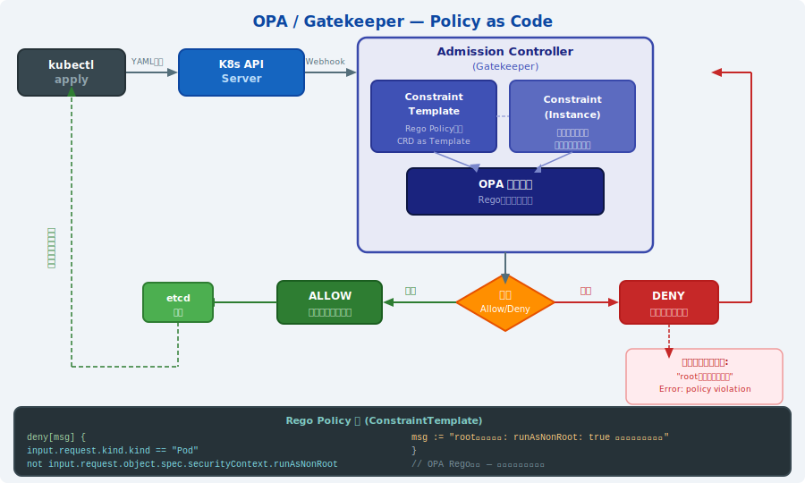


---

# Regoポリシー記述例

- <svg viewBox="0 0 800 400" style="max-height:70vh;max-width:100%;display:block;margin:0 auto;" xmlns="http://www.w3.org/2000/svg"><rect width="800" height="400" fill="#1a1a2e"/><text x="400" y="35" text-anchor="middle" fill="#f9a825" font-size="18" font-family="sans-serif" font-weight="bold">DevSecOps 成熟度ロードマップ</text><rect x="30" y="70" width="160" height="55" rx="6" fill="#16213e" stroke="#42a5f5" stroke-width="1.5"/><text x="110" y="102" text-anchor="middle" fill="#ffffff" font-size="13" font-family="sans-serif">Level 1</text><text x="110" y="145" text-anchor="middle" fill="#888" font-size="10" font-family="sans-serif">アドホック・手動</text><line x1="190" y1="97" x2="220" y2="97" stroke="#f9a825" stroke-width="2"/><polygon points="215,91 230,97 215,103" fill="#f9a825"/><rect x="230" y="70" width="160" height="55" rx="6" fill="#16213e" stroke="#f9a825" stroke-width="1.5"/><text x="310" y="102" text-anchor="middle" fill="#ffffff" font-size="13" font-family="sans-serif">Level 2</text><text x="310" y="145" text-anchor="middle" fill="#888" font-size="10" font-family="sans-serif">SAST/SCA導入</text><line x1="390" y1="97" x2="420" y2="97" stroke="#f9a825" stroke-width="2"/><polygon points="415,91 430,97 415,103" fill="#f9a825"/><rect x="430" y="70" width="160" height="55" rx="6" fill="#16213e" stroke="#f9a825" stroke-width="1.5"/><text x="510" y="102" text-anchor="middle" fill="#ffffff" font-size="13" font-family="sans-serif">Level 3</text><text x="510" y="145" text-anchor="middle" fill="#888" font-size="10" font-family="sans-serif">CI/CD統合完了</text><line x1="590" y1="97" x2="620" y2="97" stroke="#f9a825" stroke-width="2"/><polygon points="615,91 630,97 615,103" fill="#f9a825"/><rect x="630" y="70" width="160" height="55" rx="6" fill="#1b5e20" stroke="#66bb6a" stroke-width="1.5"/><text x="710" y="102" text-anchor="middle" fill="#ffffff" font-size="13" font-family="sans-serif">Level 4</text><text x="710" y="145" text-anchor="middle" fill="#66bb6a" font-size="10" font-family="sans-serif">自動化+継続改善</text><rect x="200" y="175" width="400" height="60" rx="8" fill="#16213e" stroke="#f9a825" stroke-width="1.5"/><text x="400" y="200" text-anchor="middle" fill="#ffffff" font-size="12" font-family="sans-serif" font-weight="bold">成熟度向上のポイント</text><text x="400" y="222" text-anchor="middle" fill="#f9a825" font-size="11" font-family="sans-serif">ツール → プロセス → 文化の順に整備</text><text x="400" y="375" text-anchor="middle" fill="#888" font-size="11" font-family="sans-serif">OWASP DSOMM / BSIMM で現状評価を実施</text></svg>
- **Constraint**: `labels: ["team", "env", "owner"]` のように指定


---

# Regoポリシー記述例（コード例）

```rego
# ConstraintTemplate: 必須ラベルチェック
package requiredlabels

violation[{"msg": msg}] {
  provided := {label | input.review.object.metadata.labels[label]}
  required := {label | label := input.parameters.labels[_]}
  missing := required - provided
  count(missing) > 0
  msg := sprintf("必須ラベルがありません: %v", [missing])
}
```


---

# Kyverno — K8sネイティブポリシーエンジン

- <svg viewBox="0 0 800 400" style="max-height:70vh;max-width:100%;display:block;margin:0 auto;" xmlns="http://www.w3.org/2000/svg"><rect width="800" height="400" fill="#1a1a2e"/><text x="400" y="35" text-anchor="middle" fill="#f9a825" font-size="18" font-family="sans-serif" font-weight="bold">DevSecOps 成熟度ロードマップ</text><rect x="30" y="70" width="155" height="55" rx="6" fill="#16213e" stroke="#42a5f5" stroke-width="1.5"/><text x="107" y="102" text-anchor="middle" fill="#ffffff" font-size="13" font-family="sans-serif">レベル1</text><line x1="185" y1="97" x2="215" y2="97" stroke="#f9a825" stroke-width="2"/><polygon points="210,91 225,97 210,103" fill="#f9a825"/><rect x="225" y="70" width="155" height="55" rx="6" fill="#16213e" stroke="#f9a825" stroke-width="1.5"/><text x="302" y="102" text-anchor="middle" fill="#ffffff" font-size="13" font-family="sans-serif">レベル2</text><line x1="380" y1="97" x2="410" y2="97" stroke="#f9a825" stroke-width="2"/><polygon points="405,91 420,97 405,103" fill="#f9a825"/><rect x="420" y="70" width="155" height="55" rx="6" fill="#16213e" stroke="#f9a825" stroke-width="1.5"/><text x="497" y="102" text-anchor="middle" fill="#ffffff" font-size="13" font-family="sans-serif">レベル3</text><line x1="575" y1="97" x2="605" y2="97" stroke="#f9a825" stroke-width="2"/><polygon points="600,91 615,97 600,103" fill="#f9a825"/><rect x="615" y="70" width="155" height="55" rx="6" fill="#1b5e20" stroke="#66bb6a" stroke-width="1.5"/><text x="692" y="102" text-anchor="middle" fill="#ffffff" font-size="13" font-family="sans-serif">レベル4</text><rect x="250" y="175" width="300" height="60" rx="6" fill="#16213e" stroke="#f9a825" stroke-width="1.5"/><text x="400" y="210" text-anchor="middle" fill="#ffffff" font-size="12" font-family="sans-serif">改善ポイント</text><text x="400" y="210" text-anchor="middle" fill="#ffffff" font-size="11" font-family="sans-serif">ツール→プロセス→文化の順に整備</text><text x="400" y="375" text-anchor="middle" fill="#888" font-size="11" font-family="sans-serif">OWASP DSOMM / BSIMM で現状評価</text></svg>
- OPA/Gatekeeper比: Rego不要・YAML記述・Mutate/Generateも対応


---

# Kyverno — K8sネイティブポリシーエンジン（コード例）

```yaml
# Kyverno: root実行禁止ポリシー
apiVersion: kyverno.io/v1
kind: ClusterPolicy
metadata:
  name: disallow-root-user
spec:
  rules:
    - name: check-runAsNonRoot
      match:
        resources:
          kinds: [Pod]
      validate:
        message: "root実行は禁止"
        pattern:
          spec:
            securityContext:
              runAsNonRoot: true
```


---

# CSPMとは

- <svg viewBox="0 0 800 400" style="max-height:70vh;max-width:100%;display:block;margin:0 auto;" xmlns="http://www.w3.org/2000/svg"><rect width="800" height="400" fill="#1a1a2e"/><text x="400" y="35" text-anchor="middle" fill="#f9a825" font-size="18" font-family="sans-serif" font-weight="bold">SBOM サプライチェーン</text><rect x="30" y="80" width="160" height="55" rx="6" fill="#16213e" stroke="#42a5f5" stroke-width="1.5"/><text x="110" y="112" text-anchor="middle" fill="#ffffff" font-size="13" font-family="sans-serif">ソースコード</text><line x1="190" y1="107" x2="220" y2="107" stroke="#f9a825" stroke-width="2"/><polygon points="215,101 230,107 215,113" fill="#f9a825"/><rect x="230" y="80" width="160" height="55" rx="6" fill="#16213e" stroke="#f9a825" stroke-width="1.5"/><text x="310" y="112" text-anchor="middle" fill="#ffffff" font-size="13" font-family="sans-serif">依存性解析</text><line x1="390" y1="107" x2="420" y2="107" stroke="#f9a825" stroke-width="2"/><polygon points="415,101 430,107 415,113" fill="#f9a825"/><rect x="430" y="80" width="160" height="55" rx="6" fill="#16213e" stroke="#f9a825" stroke-width="1.5"/><text x="510" y="112" text-anchor="middle" fill="#ffffff" font-size="13" font-family="sans-serif">SBOM生成</text><line x1="590" y1="107" x2="620" y2="107" stroke="#f9a825" stroke-width="2"/><polygon points="615,101 630,107 615,113" fill="#f9a825"/><rect x="630" y="80" width="140" height="55" rx="6" fill="#1b5e20" stroke="#66bb6a" stroke-width="1.5"/><text x="700" y="112" text-anchor="middle" fill="#ffffff" font-size="13" font-family="sans-serif">署名・公開</text><rect x="230" y="190" width="300" height="55" rx="6" fill="#4a148c" stroke="#ce93d8" stroke-width="1.5"/><text x="380" y="222" text-anchor="middle" fill="#ffffff" font-size="13" font-family="sans-serif">脆弱性追跡</text><text x="380" y="225" text-anchor="middle" fill="#ce93d8" font-size="11" font-family="sans-serif">CVE発見→影響範囲特定→パッチ</text><text x="400" y="375" text-anchor="middle" fill="#888" font-size="11" font-family="sans-serif">SPDX / CycloneDX 形式 — Dependency-Track で管理</text></svg>
- **CSPM（Cloud Security Posture Management）**
- クラウド環境の設定ミスを継続的にスキャンし修正提案
- **検出する問題例:**
- S3バケットのパブリックアクセス許可
- セキュリティグループの0.0.0.0/0開放 / MFA未設定のIAMユーザー
- 暗号化されていないEBSボリューム / **ROI**: クラウド侵害の **99%** が設定ミスに起因（Gartner）


---

# CSPMツール比較

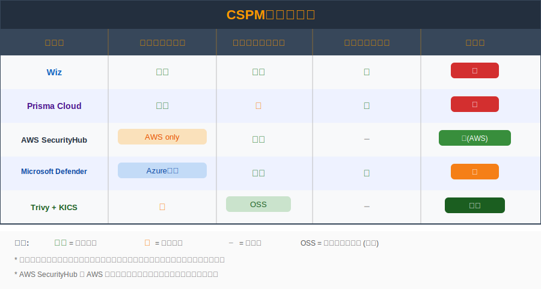


---

# AWS SecurityHub × Organizations

- <svg viewBox="0 0 800 400" style="max-height:70vh;max-width:100%;display:block;margin:0 auto;" xmlns="http://www.w3.org/2000/svg"><rect width="800" height="400" fill="#1a1a2e"/><text x="400" y="35" text-anchor="middle" fill="#f9a825" font-size="18" font-family="sans-serif" font-weight="bold">シークレットスキャン フロー</text><rect x="30" y="80" width="160" height="55" rx="6" fill="#16213e" stroke="#42a5f5" stroke-width="1.5"/><text x="110" y="112" text-anchor="middle" fill="#ffffff" font-size="13" font-family="sans-serif">コードコミット</text><line x1="190" y1="107" x2="220" y2="107" stroke="#f9a825" stroke-width="2"/><polygon points="215,101 230,107 215,113" fill="#f9a825"/><rect x="230" y="80" width="160" height="55" rx="6" fill="#16213e" stroke="#f9a825" stroke-width="1.5"/><text x="310" y="112" text-anchor="middle" fill="#ffffff" font-size="13" font-family="sans-serif">Pre-commit Hook</text><line x1="390" y1="107" x2="420" y2="107" stroke="#f9a825" stroke-width="2"/><polygon points="415,101 430,107 415,113" fill="#f9a825"/><rect x="430" y="80" width="160" height="55" rx="6" fill="#1565c0" stroke="#42a5f5" stroke-width="1.5"/><text x="510" y="112" text-anchor="middle" fill="#ffffff" font-size="13" font-family="sans-serif">CI/CDスキャン</text><line x1="590" y1="107" x2="620" y2="107" stroke="#66bb6a" stroke-width="2"/><polygon points="615,101 630,107 615,113" fill="#66bb6a"/><rect x="630" y="80" width="140" height="55" rx="6" fill="#1b5e20" stroke="#66bb6a" stroke-width="1.5"/><text x="700" y="112" text-anchor="middle" fill="#ffffff" font-size="13" font-family="sans-serif">クリーン検出</text><rect x="230" y="195" width="300" height="55" rx="6" fill="#b71c1c" stroke="#e91e63" stroke-width="1.5"/><text x="380" y="227" text-anchor="middle" fill="#ffffff" font-size="13" font-family="sans-serif">検出時</text><text x="380" y="230" text-anchor="middle" fill="#ffffff" font-size="11" font-family="sans-serif">コミット拒否→秘密情報のローテーション</text><text x="400" y="375" text-anchor="middle" fill="#888" font-size="11" font-family="sans-serif">git-secrets / truffleHog / Gitleaks で検出</text></svg>
- **AWS SecurityHub**: AWSネイティブCSPM（追加費用最小）
- Organizations連携: 全アカウントのセキュリティを一元管理
- **統合されるサービス:**
- GuardDuty（脅威検知）/ Inspector（脆弱性スキャン）
- Macie（機密データ検出）/ Config（設定コンプライアンス）
- **ASFF（セキュリティ統一フォーマット）**で全知見を集約


---

# eBPFランタイムセキュリティ

- <svg viewBox="0 0 800 400" style="max-height:70vh;max-width:100%;display:block;margin:0 auto;" xmlns="http://www.w3.org/2000/svg"><rect width="800" height="400" fill="#1a1a2e"/><text x="400" y="35" text-anchor="middle" fill="#f9a825" font-size="18" font-family="sans-serif" font-weight="bold">クラウドネイティブ 4Cセキュリティ</text><rect x="40" y="55" width="720" height="300" rx="10" fill="#0d1117" stroke="#f9a825" stroke-width="2"/><text x="400" y="78" text-anchor="middle" fill="#f9a825" font-size="12" font-family="sans-serif">Cloud</text><rect x="70" y="90" width="660" height="245" rx="8" fill="#1a237e" stroke="#42a5f5" stroke-width="1.5"/><text x="400" y="113" text-anchor="middle" fill="#42a5f5" font-size="12" font-family="sans-serif">Cluster: RBAC, NetworkPolicy, PodSecurity</text><rect x="100" y="125" width="600" height="190" rx="8" fill="#1b5e20" stroke="#66bb6a" stroke-width="1.5"/><text x="400" y="148" text-anchor="middle" fill="#66bb6a" font-size="12" font-family="sans-serif">Container: 非root, capabilities drop, seccomp</text><rect x="130" y="160" width="540" height="140" rx="8" fill="#4a148c" stroke="#ce93d8" stroke-width="1.5"/><text x="400" y="183" text-anchor="middle" fill="#ce93d8" font-size="12" font-family="sans-serif">Code: SAST, SCA, シークレットスキャン</text><rect x="230" y="200" width="300" height="75" rx="6" fill="#12005e" stroke="#ce93d8" stroke-width="1.5"/><text x="380" y="242" text-anchor="middle" fill="#ffffff" font-size="12" font-family="sans-serif">アプリコード</text><text x="400" y="375" text-anchor="middle" fill="#888" font-size="11" font-family="sans-serif">外側レイヤーの脆弱性は内側にも影響する</text></svg>
- **eBPF**: カーネルを改変せずにLinux内部を観測する革命的技術
- **セキュリティ活用:**
- すべてのシステムコールをゼロオーバーヘッドで観測
- カーネルレベルの不正なメモリアクセスを検出
- ネットワークパケットをカーネルでフィルタリング
- **主要ツール**: Falco（eBPFモード）・Tetragon・Cilium


---

# Tetragon設定例

- <svg viewBox="0 0 800 400" style="max-height:70vh;max-width:100%;display:block;margin:0 auto;" xmlns="http://www.w3.org/2000/svg"><rect width="800" height="400" fill="#1a1a2e"/><text x="400" y="35" text-anchor="middle" fill="#f9a825" font-size="18" font-family="sans-serif" font-weight="bold">OPA ポリシー制御フロー</text><rect x="30" y="80" width="150" height="55" rx="6" fill="#16213e" stroke="#42a5f5" stroke-width="1.5"/><text x="105" y="112" text-anchor="middle" fill="#ffffff" font-size="13" font-family="sans-serif">APIリクエスト</text><line x1="180" y1="107" x2="210" y2="107" stroke="#f9a825" stroke-width="2"/><polygon points="205,101 220,107 205,113" fill="#f9a825"/><rect x="220" y="80" width="160" height="55" rx="6" fill="#16213e" stroke="#f9a825" stroke-width="1.5"/><text x="300" y="112" text-anchor="middle" fill="#ffffff" font-size="13" font-family="sans-serif">Admission Webhook</text><line x1="380" y1="107" x2="410" y2="107" stroke="#f9a825" stroke-width="2"/><polygon points="405,101 420,107 405,113" fill="#f9a825"/><rect x="420" y="80" width="160" height="55" rx="6" fill="#4a148c" stroke="#ce93d8" stroke-width="1.5"/><text x="500" y="112" text-anchor="middle" fill="#ffffff" font-size="13" font-family="sans-serif">OPA / Gatekeeper</text><line x1="580" y1="107" x2="610" y2="107" stroke="#66bb6a" stroke-width="2"/><polygon points="605,101 620,107 605,113" fill="#66bb6a"/><rect x="620" y="80" width="150" height="55" rx="6" fill="#1b5e20" stroke="#66bb6a" stroke-width="1.5"/><text x="695" y="112" text-anchor="middle" fill="#ffffff" font-size="13" font-family="sans-serif">許可/拒否</text><rect x="200" y="195" width="400" height="55" rx="6" fill="#1565c0" stroke="#42a5f5" stroke-width="1.5"/><text x="400" y="227" text-anchor="middle" fill="#ffffff" font-size="13" font-family="sans-serif">Regoポリシー例</text><text x="400" y="230" text-anchor="middle" fill="#42a5f5" font-size="10" font-family="sans-serif">deny if container.image not contains registry-domain</text><text x="400" y="375" text-anchor="middle" fill="#888" font-size="11" font-family="sans-serif">ポリシー違反を検出・強制</text></svg>
- Cilium/Hubbleと連携して観測性を向上


---

# Tetragon設定例（コード例）

```yaml
# Tetragon: /etc/passwdアクセスを監視
apiVersion: cilium.io/v1alpha1
kind: TracingPolicy
metadata:
  name: monitor-passwd
spec:
  kprobes:
    - call: "security_file_permission"
      syscall: false
      args:
        - index: 0
          type: "file"
      selectors:
        - matchArgs:
            - index: 0
              operator: "Prefix"
              values: ["/etc/passwd"]
```


---

# サービスメッシュ — Istio mTLS

- **Istio mTLS**: サービス間通信をすべて相互TLSで暗号化
| モード | 説明 | 推奨 |
|--------|------|------|
| DISABLE | TLSなし | ❌ |
| PERMISSIVE | TLS/平文両対応 | 移行期のみ |
| STRICT | mTLSのみ | ✅ 本番 |
- **証明書管理**: Istio CAが自動でSVID証明書をローテーション


---

<!-- _class: lead -->
# Chapter 6: ゼロトラスト・ID管理

- NIST SP 800-207 / SPIFFE・SPIRE / Vault / IAM最小権限


---

# ゼロトラストアーキテクチャ

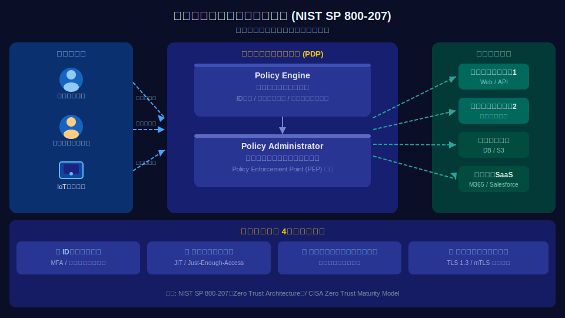


---

# ゼロトラストの7原則（NIST SP 800-207）

- <svg viewBox="0 0 800 400" style="max-height:70vh;max-width:100%;display:block;margin:0 auto;" xmlns="http://www.w3.org/2000/svg"><rect width="800" height="400" fill="#1a1a2e"/><text x="400" y="35" text-anchor="middle" fill="#f9a825" font-size="18" font-family="sans-serif" font-weight="bold">DAST 動的テストフロー</text><rect x="30" y="80" width="150" height="55" rx="6" fill="#16213e" stroke="#42a5f5" stroke-width="1.5"/><text x="105" y="112" text-anchor="middle" fill="#ffffff" font-size="13" font-family="sans-serif">デプロイ(Staging)</text><line x1="180" y1="107" x2="210" y2="107" stroke="#f9a825" stroke-width="2"/><polygon points="205,101 220,107 205,113" fill="#f9a825"/><rect x="220" y="80" width="160" height="55" rx="6" fill="#1565c0" stroke="#42a5f5" stroke-width="1.5"/><text x="300" y="112" text-anchor="middle" fill="#ffffff" font-size="13" font-family="sans-serif">DASTスキャン</text><line x1="380" y1="107" x2="410" y2="107" stroke="#f9a825" stroke-width="2"/><polygon points="405,101 420,107 405,113" fill="#f9a825"/><rect x="420" y="80" width="160" height="55" rx="6" fill="#16213e" stroke="#f9a825" stroke-width="1.5"/><text x="500" y="112" text-anchor="middle" fill="#ffffff" font-size="13" font-family="sans-serif">脆弱性レポート</text><line x1="580" y1="107" x2="610" y2="107" stroke="#66bb6a" stroke-width="2"/><polygon points="605,101 620,107 605,113" fill="#66bb6a"/><rect x="620" y="80" width="150" height="55" rx="6" fill="#1b5e20" stroke="#66bb6a" stroke-width="1.5"/><text x="695" y="112" text-anchor="middle" fill="#ffffff" font-size="13" font-family="sans-serif">本番デプロイ</text><rect x="220" y="195" width="360" height="55" rx="6" fill="#b71c1c" stroke="#e91e63" stroke-width="1.5"/><text x="400" y="227" text-anchor="middle" fill="#ffffff" font-size="13" font-family="sans-serif">検出項目</text><text x="400" y="230" text-anchor="middle" fill="#ffffff" font-size="11" font-family="sans-serif">SQLインジェクション / XSS / 認証バイパス</text><text x="400" y="375" text-anchor="middle" fill="#888" font-size="11" font-family="sans-serif">OWASP ZAP / Burp Suite — 本番前に実施</text></svg>
- ① 全てのデータソース・コンピューティングをリソースとみなす
- ② ネットワーク上の場所に関わらず全通信を保護する
- ③ 個別リソースへのアクセスはセッション単位で付与する
- ④ アクセスポリシーは動的に決定し常に再評価する
- ⑤ 全資産の整合性・セキュリティ状態を監視・測定する
- ⑥ 全ての認証・認可は動的に実施し厳格に強制する


---

# SPIFFE / SPIRE — ワークロードID

- <svg viewBox="0 0 800 400" style="max-height:70vh;max-width:100%;display:block;margin:0 auto;" xmlns="http://www.w3.org/2000/svg"><rect width="800" height="400" fill="#1a1a2e"/><text x="400" y="35" text-anchor="middle" fill="#f9a825" font-size="18" font-family="sans-serif" font-weight="bold">ゼロトラスト ID管理</text><rect x="30" y="80" width="160" height="55" rx="6" fill="#1565c0" stroke="#42a5f5" stroke-width="1.5"/><text x="110" y="112" text-anchor="middle" fill="#ffffff" font-size="13" font-family="sans-serif">ユーザーID</text><rect x="220" y="80" width="160" height="55" rx="6" fill="#16213e" stroke="#f9a825" stroke-width="1.5"/><text x="300" y="112" text-anchor="middle" fill="#ffffff" font-size="13" font-family="sans-serif">デバイス証明書</text><rect x="410" y="80" width="160" height="55" rx="6" fill="#4a148c" stroke="#ce93d8" stroke-width="1.5"/><text x="490" y="112" text-anchor="middle" fill="#ffffff" font-size="13" font-family="sans-serif">コンテキスト判定</text><line x1="190" y1="107" x2="220" y2="107" stroke="#f9a825" stroke-width="2"/><polygon points="215,101 230,107 215,113" fill="#f9a825"/><line x1="380" y1="107" x2="410" y2="107" stroke="#f9a825" stroke-width="2"/><polygon points="405,101 420,107 405,113" fill="#f9a825"/><line x1="570" y1="107" x2="610" y2="107" stroke="#f9a825" stroke-width="2"/><polygon points="605,101 620,107 605,113" fill="#f9a825"/><rect x="620" y="80" width="150" height="55" rx="6" fill="#1b5e20" stroke="#66bb6a" stroke-width="1.5"/><text x="695" y="112" text-anchor="middle" fill="#ffffff" font-size="13" font-family="sans-serif">アクセス判定</text><rect x="200" y="195" width="400" height="55" rx="6" fill="#16213e" stroke="#f9a825" stroke-width="1.5"/><text x="400" y="227" text-anchor="middle" fill="#ffffff" font-size="13" font-family="sans-serif">MFA + 条件付きアクセス</text><text x="400" y="230" text-anchor="middle" fill="#f9a825" font-size="11" font-family="sans-serif">場所・時間・リスクスコアで動的判定</text><text x="400" y="375" text-anchor="middle" fill="#888" font-size="11" font-family="sans-serif">継続的な認証・最小権限・常時検証</text></svg>
- **SPIFFE（Secure Production Identity Framework For Everyone）**
- マイクロサービス・コンテナに暗号的に証明されたIDを付与
- **SVID（SPIFFE Verifiable Identity Document）**: X.509証明書またはJWT形式
- 有効期限付き（ローテーション自動）
- **SPIRE**: SPIFFEの参照実装（CNCF Graduated）
- **用途**: Vault認証・Istio証明書・サービス間認証


---

# SPIRE設定例

- <svg viewBox="0 0 800 400" style="max-height:70vh;max-width:100%;display:block;margin:0 auto;" xmlns="http://www.w3.org/2000/svg"><rect width="800" height="400" fill="#1a1a2e"/><text x="400" y="35" text-anchor="middle" fill="#f9a825" font-size="18" font-family="sans-serif" font-weight="bold">Falco ランタイム監視</text><rect x="30" y="80" width="170" height="55" rx="6" fill="#1565c0" stroke="#42a5f5" stroke-width="1.5"/><text x="115" y="112" text-anchor="middle" fill="#ffffff" font-size="13" font-family="sans-serif">Kernel syscall</text><line x1="200" y1="107" x2="230" y2="107" stroke="#f9a825" stroke-width="2"/><polygon points="225,101 240,107 225,113" fill="#f9a825"/><rect x="240" y="80" width="160" height="55" rx="6" fill="#4a148c" stroke="#ce93d8" stroke-width="1.5"/><text x="320" y="112" text-anchor="middle" fill="#ffffff" font-size="13" font-family="sans-serif">Falco Probe</text><line x1="400" y1="107" x2="430" y2="107" stroke="#f9a825" stroke-width="2"/><polygon points="425,101 440,107 425,113" fill="#f9a825"/><rect x="440" y="80" width="160" height="55" rx="6" fill="#16213e" stroke="#f9a825" stroke-width="1.5"/><text x="520" y="112" text-anchor="middle" fill="#ffffff" font-size="13" font-family="sans-serif">ルールエンジン</text><line x1="600" y1="107" x2="630" y2="107" stroke="#66bb6a" stroke-width="2"/><polygon points="625,101 640,107 625,113" fill="#66bb6a"/><rect x="640" y="80" width="140" height="55" rx="6" fill="#b71c1c" stroke="#e91e63" stroke-width="1.5"/><text x="710" y="112" text-anchor="middle" fill="#ffffff" font-size="13" font-family="sans-serif">アラート</text><rect x="200" y="195" width="400" height="55" rx="6" fill="#b71c1c" stroke="#e91e63" stroke-width="1.5"/><text x="400" y="227" text-anchor="middle" fill="#ffffff" font-size="13" font-family="sans-serif">検出例</text><text x="400" y="230" text-anchor="middle" fill="#ffffff" font-size="11" font-family="sans-serif">シェル起動 / /etc/shadow読み取り / 外部接続</text><text x="400" y="375" text-anchor="middle" fill="#888" font-size="11" font-family="sans-serif">CNCF Falco — eBPF/カーネルモジュールで低オーバーヘッド</text></svg>
- K8sのNamespace+ServiceAccountでIDを自動付与


---

# SPIRE設定例（コード例）

```yaml
# SPIRE Server設定
server:
  bind_address: 0.0.0.0
  bind_port: 8081
  trust_domain: example.org
  data_dir: /opt/spire/data/server
  log_level: INFO
  ca_ttl: 12h
  default_svid_ttl: 1h

# WorkloadRegistrationEntry
spire-server entry create \
  -spiffeID spiffe://example.org/backend \
  -parentID spiffe://example.org/spire-agent \
  -selector k8s:ns:production \
  -selector k8s:sa:backend-sa
```


---

# HashiCorp Vault — シークレット管理

- <svg viewBox="0 0 800 400" style="max-height:70vh;max-width:100%;display:block;margin:0 auto;" xmlns="http://www.w3.org/2000/svg"><rect width="800" height="400" fill="#1a1a2e"/><text x="400" y="35" text-anchor="middle" fill="#f9a825" font-size="18" font-family="sans-serif" font-weight="bold">CSPM クラウドセキュリティ管理</text><rect x="30" y="80" width="180" height="55" rx="6" fill="#16213e" stroke="#42a5f5" stroke-width="1.5"/><text x="120" y="112" text-anchor="middle" fill="#ffffff" font-size="13" font-family="sans-serif">AWSリソース設定</text><line x1="210" y1="107" x2="240" y2="107" stroke="#f9a825" stroke-width="2"/><polygon points="235,101 250,107 235,113" fill="#f9a825"/><rect x="250" y="80" width="160" height="55" rx="6" fill="#16213e" stroke="#f9a825" stroke-width="1.5"/><text x="330" y="112" text-anchor="middle" fill="#ffffff" font-size="13" font-family="sans-serif">AWS Security Hub</text><line x1="410" y1="107" x2="440" y2="107" stroke="#f9a825" stroke-width="2"/><polygon points="435,101 450,107 435,113" fill="#f9a825"/><rect x="450" y="80" width="160" height="55" rx="6" fill="#1565c0" stroke="#42a5f5" stroke-width="1.5"/><text x="530" y="112" text-anchor="middle" fill="#ffffff" font-size="13" font-family="sans-serif">自動評価・スコア</text><line x1="610" y1="107" x2="640" y2="107" stroke="#f9a825" stroke-width="2"/><polygon points="635,101 650,107 635,113" fill="#f9a825"/><rect x="650" y="80" width="120" height="55" rx="6" fill="#1b5e20" stroke="#66bb6a" stroke-width="1.5"/><text x="710" y="112" text-anchor="middle" fill="#ffffff" font-size="13" font-family="sans-serif">修正指示</text><rect x="200" y="195" width="400" height="55" rx="6" fill="#16213e" stroke="#f9a825" stroke-width="1.5"/><text x="400" y="227" text-anchor="middle" fill="#ffffff" font-size="13" font-family="sans-serif">検出するリスク</text><text x="400" y="230" text-anchor="middle" fill="#f9a825" font-size="11" font-family="sans-serif">S3公開 / SG 0.0.0.0/0 / MFA無効 / 暗号化なし</text><text x="400" y="375" text-anchor="middle" fill="#888" font-size="11" font-family="sans-serif">Prowler / AWS Config Rules でCIS基準を継続評価</text></svg>
- **Vault**: 動的シークレット・暗号化・PKIの統合管理プラットフォーム
- **主要機能:**
- 動的シークレット: DBパスワードを都度生成（有効期限付き）
- 暗号化as a Service: データの暗号化/復号をAPIで提供
- PKI: 証明書の自動発行・ローテーション
- Kubernetes統合: `vault-agent`でサイドカーとして自動注入


---

# Vault Dynamic Secrets

- <svg viewBox="0 0 800 400" style="max-height:70vh;max-width:100%;display:block;margin:0 auto;" xmlns="http://www.w3.org/2000/svg"><rect width="800" height="400" fill="#1a1a2e"/><text x="400" y="35" text-anchor="middle" fill="#f9a825" font-size="18" font-family="sans-serif" font-weight="bold">インシデント対応フロー</text><rect x="30" y="80" width="130" height="55" rx="6" fill="#16213e" stroke="#42a5f5" stroke-width="1.5"/><text x="95" y="112" text-anchor="middle" fill="#ffffff" font-size="13" font-family="sans-serif">検出</text><line x1="160" y1="107" x2="190" y2="107" stroke="#f9a825" stroke-width="2"/><polygon points="185,101 200,107 185,113" fill="#f9a825"/><rect x="200" y="80" width="120" height="55" rx="6" fill="#16213e" stroke="#f9a825" stroke-width="1.5"/><text x="260" y="112" text-anchor="middle" fill="#ffffff" font-size="13" font-family="sans-serif">トリアージ</text><line x1="320" y1="107" x2="350" y2="107" stroke="#f9a825" stroke-width="2"/><polygon points="345,101 360,107 345,113" fill="#f9a825"/><rect x="360" y="80" width="120" height="55" rx="6" fill="#b71c1c" stroke="#e91e63" stroke-width="1.5"/><text x="420" y="112" text-anchor="middle" fill="#ffffff" font-size="13" font-family="sans-serif">封じ込め</text><line x1="480" y1="107" x2="510" y2="107" stroke="#f9a825" stroke-width="2"/><polygon points="505,101 520,107 505,113" fill="#f9a825"/><rect x="520" y="80" width="120" height="55" rx="6" fill="#16213e" stroke="#f9a825" stroke-width="1.5"/><text x="580" y="112" text-anchor="middle" fill="#ffffff" font-size="13" font-family="sans-serif">根本原因分析</text><line x1="640" y1="107" x2="670" y2="107" stroke="#66bb6a" stroke-width="2"/><polygon points="665,101 680,107 665,113" fill="#66bb6a"/><rect x="680" y="80" width="100" height="55" rx="6" fill="#1b5e20" stroke="#66bb6a" stroke-width="1.5"/><text x="730" y="112" text-anchor="middle" fill="#ffffff" font-size="13" font-family="sans-serif">改善</text><rect x="200" y="195" width="400" height="55" rx="6" fill="#16213e" stroke="#f9a825" stroke-width="1.5"/><text x="400" y="227" text-anchor="middle" fill="#ffffff" font-size="13" font-family="sans-serif">SRE連携・ポストモーテム</text><text x="400" y="230" text-anchor="middle" fill="#f9a825" font-size="11" font-family="sans-serif">MTTR (平均復旧時間) を KPI として管理</text><text x="400" y="375" text-anchor="middle" fill="#888" font-size="11" font-family="sans-serif">Playbook事前整備 — 定期的にドリルを実施</text></svg>
- 1時間で失効するDBユーザーを都度生成


---

# Vault Dynamic Secrets（コード例）

```bash
# PostgreSQL動的シークレット設定
vault secrets enable database
vault write database/config/my-postgresql \
  plugin_name=postgresql-database-plugin \
  connection_url="postgresql://{{username}}:{{password}}@db:5432/mydb" \
  allowed_roles="readonly"

vault write database/roles/readonly \
  db_name=my-postgresql \
  default_ttl="1h" max_ttl="24h" \
  creation_statements="CREATE USER '{{name}}' WITH PASSWORD '{{password}}'"

# 動的シークレット取得
vault read database/creds/readonly
```


---

# AWS IAM最小権限設計

- <svg viewBox="0 0 800 400" style="max-height:70vh;max-width:100%;display:block;margin:0 auto;" xmlns="http://www.w3.org/2000/svg"><rect width="800" height="400" fill="#1a1a2e"/><text x="400" y="35" text-anchor="middle" fill="#f9a825" font-size="18" font-family="sans-serif" font-weight="bold">AWS Security Hub 統合</text><rect x="30" y="80" width="150" height="55" rx="6" fill="#16213e" stroke="#42a5f5" stroke-width="1.5"/><text x="105" y="112" text-anchor="middle" fill="#ffffff" font-size="13" font-family="sans-serif">GuardDuty</text><rect x="30" y="165" width="150" height="55" rx="6" fill="#16213e" stroke="#42a5f5" stroke-width="1.5"/><text x="105" y="197" text-anchor="middle" fill="#ffffff" font-size="13" font-family="sans-serif">Config Rules</text><rect x="30" y="250" width="150" height="55" rx="6" fill="#16213e" stroke="#42a5f5" stroke-width="1.5"/><text x="105" y="282" text-anchor="middle" fill="#ffffff" font-size="13" font-family="sans-serif">Inspector v2</text><line x1="180" y1="107" x2="235" y2="145" stroke="#f9a825" stroke-width="1.5"/><polygon points="228,139 240,149 228,137" fill="#f9a825"/><line x1="180" y1="192" x2="235" y2="192" stroke="#f9a825" stroke-width="1.5"/><polygon points="230,186 245,192 230,198" fill="#f9a825"/><line x1="180" y1="277" x2="235" y2="238" stroke="#f9a825" stroke-width="1.5"/><polygon points="228,232 240,242 228,230" fill="#f9a825"/><rect x="245" y="148" width="170" height="88" rx="6" fill="#16213e" stroke="#f9a825" stroke-width="1.5"/><text x="330" y="197" text-anchor="middle" fill="#ffffff" font-size="13" font-family="sans-serif">Security Hub</text><text x="330" y="198" text-anchor="middle" fill="#f9a825" font-size="11" font-family="sans-serif">統合スコア</text><line x1="415" y1="192" x2="450" y2="192" stroke="#66bb6a" stroke-width="2"/><polygon points="445,186 460,192 445,198" fill="#66bb6a"/><rect x="460" y="165" width="160" height="55" rx="6" fill="#1b5e20" stroke="#66bb6a" stroke-width="1.5"/><text x="540" y="197" text-anchor="middle" fill="#ffffff" font-size="13" font-family="sans-serif">自動修復</text><line x1="620" y1="192" x2="655" y2="192" stroke="#66bb6a" stroke-width="2"/><polygon points="650,186 665,192 650,198" fill="#66bb6a"/><rect x="665" y="165" width="115" height="55" rx="6" fill="#1b5e20" stroke="#66bb6a" stroke-width="1.5"/><text x="722" y="197" text-anchor="middle" fill="#ffffff" font-size="11" font-family="sans-serif">EventBridge</text><text x="400" y="375" text-anchor="middle" fill="#888" font-size="11" font-family="sans-serif">ASFF形式で全サービスの検出結果を一元管理</text></svg>
- **原則**: デフォルト拒否 + 必要なアクション・リソースのみ明示的許可
- **ツール活用:**
- IAM Access Analyzer: 過剰権限のポリシーを自動検出
- CloudTrail → Athena: 実際に使ったAPIを分析し最小化
- AWS Policy Generator: ビジュアルでポリシー作成
- **SCP（Service Control Policy）**: 組織レベルで強制制限


---

# IAM Access Analyzer活用

- <svg viewBox="0 0 800 400" style="max-height:70vh;max-width:100%;display:block;margin:0 auto;" xmlns="http://www.w3.org/2000/svg"><rect width="800" height="400" fill="#1a1a2e"/><text x="400" y="35" text-anchor="middle" fill="#f9a825" font-size="18" font-family="sans-serif" font-weight="bold">セキュリティテスト ピラミッド</text><polygon points="400,60 700,320 100,320" fill="#0d1117" stroke="#f9a825" stroke-width="2"/><line x1="220" y1="200" x2="580" y2="200" stroke="#16213e" stroke-width="2"/><line x1="310" y1="140" x2="490" y2="140" stroke="#16213e" stroke-width="2"/><text x="400" y="95" text-anchor="middle" fill="#e91e63" font-size="12" font-family="sans-serif">ペンテスト</text><text x="400" y="175" text-anchor="middle" fill="#f9a825" font-size="12" font-family="sans-serif">DAST / IAST</text><text x="400" y="270" text-anchor="middle" fill="#42a5f5" font-size="13" font-family="sans-serif">SAST / SCA / Unit Test</text><text x="130" y="165" fill="#e91e63" font-size="10" font-family="sans-serif">遅い・高コスト</text><text x="620" y="165" fill="#e91e63" font-size="10" font-family="sans-serif">少ない</text><text x="60" y="295" fill="#42a5f5" font-size="10" font-family="sans-serif">速い・低コスト</text><text x="680" y="295" fill="#42a5f5" font-size="10" font-family="sans-serif">多い</text><text x="400" y="375" text-anchor="middle" fill="#888" font-size="11" font-family="sans-serif">下層に投資するほどコスト対効果が高い</text></svg>
- 年次ではなく継続的（月次）でIAM棚卸しを実施


---

# IAM Access Analyzer活用（コード例）

```bash
# 外部アクセス可能なリソースを検出
aws accessanalyzer list-findings \
  --analyzer-arn arn:aws:access-analyzer:ap-northeast-1:123:analyzer/MyAnalyzer \
  --filter '{"resourceType": {"eq": ["AWS::S3::Bucket"]}}'

# 未使用IAMロールの検出（最終使用日）
aws iam generate-service-last-accessed-details \
  --arn arn:aws:iam::123456789:role/MyRole

# Pythonで一括棚卸し: boto3でフィルタリング
```


---

# SSO / MFA / OIDC設計

- <svg viewBox="0 0 800 400" style="max-height:70vh;max-width:100%;display:block;margin:0 auto;" xmlns="http://www.w3.org/2000/svg"><rect width="800" height="400" fill="#1a1a2e"/><text x="400" y="35" text-anchor="middle" fill="#f9a825" font-size="18" font-family="sans-serif" font-weight="bold">SLSA サプライチェーンレベル</text><rect x="30" y="70" width="155" height="55" rx="6" fill="#16213e" stroke="#42a5f5" stroke-width="1.5"/><text x="107" y="102" text-anchor="middle" fill="#ffffff" font-size="13" font-family="sans-serif">SLSA Level 1</text><text x="107" y="143" text-anchor="middle" fill="#888" font-size="10" font-family="sans-serif">ビルドスクリプト記録</text><rect x="215" y="70" width="155" height="55" rx="6" fill="#16213e" stroke="#f9a825" stroke-width="1.5"/><text x="292" y="102" text-anchor="middle" fill="#ffffff" font-size="13" font-family="sans-serif">SLSA Level 2</text><text x="292" y="143" text-anchor="middle" fill="#888" font-size="10" font-family="sans-serif">バージョン管理+CI</text><rect x="400" y="70" width="155" height="55" rx="6" fill="#1565c0" stroke="#42a5f5" stroke-width="1.5"/><text x="477" y="102" text-anchor="middle" fill="#ffffff" font-size="13" font-family="sans-serif">SLSA Level 3</text><text x="477" y="143" text-anchor="middle" fill="#888" font-size="10" font-family="sans-serif">強制されたビルド</text><rect x="585" y="70" width="185" height="55" rx="6" fill="#1b5e20" stroke="#66bb6a" stroke-width="1.5"/><text x="677" y="102" text-anchor="middle" fill="#ffffff" font-size="13" font-family="sans-serif">SLSA Level 4</text><text x="677" y="143" text-anchor="middle" fill="#66bb6a" font-size="10" font-family="sans-serif">2者レビュー必須</text><line x1="185" y1="97" x2="215" y2="97" stroke="#f9a825" stroke-width="2"/><polygon points="210,91 225,97 210,103" fill="#f9a825"/><line x1="370" y1="97" x2="400" y2="97" stroke="#f9a825" stroke-width="2"/><polygon points="395,91 410,97 395,103" fill="#f9a825"/><line x1="555" y1="97" x2="585" y2="97" stroke="#f9a825" stroke-width="2"/><polygon points="580,91 595,97 580,103" fill="#f9a825"/><rect x="200" y="175" width="400" height="55" rx="6" fill="#16213e" stroke="#f9a825" stroke-width="1.5"/><text x="400" y="207" text-anchor="middle" fill="#ffffff" font-size="13" font-family="sans-serif">達成のメリット</text><text x="400" y="210" text-anchor="middle" fill="#f9a825" font-size="11" font-family="sans-serif">サプライチェーン攻撃リスクを段階的に低減</text><text x="400" y="375" text-anchor="middle" fill="#888" font-size="11" font-family="sans-serif">Google SLSA Framework — 段階的に導入可能</text></svg>
- **MFA戦略（リスクベース）:**
- FIDO2 / パスキー（最強・フィッシング耐性）: 全管理者に必須
- TOTP（Authenticator App）: 全開発者に必須
- SMS OTP（非推奨）: SIMスワップ攻撃に脆弱
- **OIDC / OAuth 2.0 ベストプラクティス:**
- PKCE必須（Authorization Code Flow）/ Implicit Flow廃止（RFC 9700）


---

<!-- _class: lead -->
# Chapter 7: 実践ロードマップ・まとめ

- 導入ロードマップ・失敗パターン・KPI・ツール全景


---

# DevSecOps導入ロードマップ

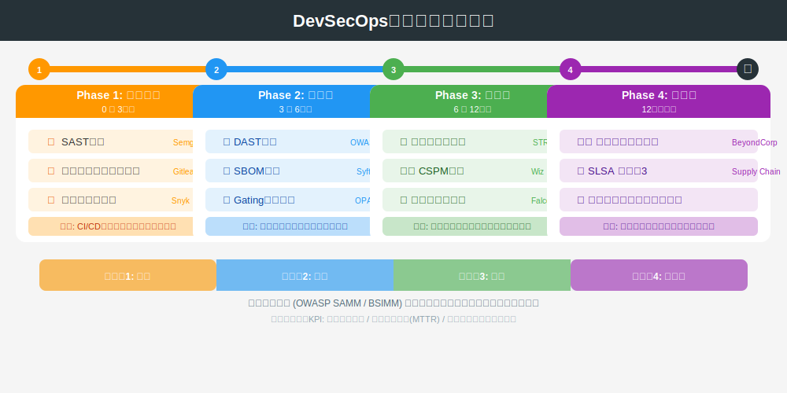


---

# よくある失敗パターンと対策

| 失敗パターン | 原因 | 対策 |
|------------|------|------|
| セキュリティが開発の障壁に | False Positive過多 | チューニング + 段階的導入 |
| ツールだらけで運用不能 | 技術先行 | プロセス設計先行 |
| セキュリティサイロ | 組織分断 | セキュリティチャンピオン制度 |
| SBOMを生成するだけ | 活用フロー未設計 | DependencyTrack連携 |


---

# セキュリティチャンピオン制度

- <svg viewBox="0 0 800 400" style="max-height:70vh;max-width:100%;display:block;margin:0 auto;" xmlns="http://www.w3.org/2000/svg"><rect width="800" height="400" fill="#1a1a2e"/><text x="400" y="35" text-anchor="middle" fill="#f9a825" font-size="18" font-family="sans-serif" font-weight="bold">DevSecOps ツールエコシステム</text><rect x="30" y="60" width="170" height="50" rx="6" fill="#16213e" stroke="#42a5f5" stroke-width="1.5"/><text x="115" y="90" text-anchor="middle" fill="#ffffff" font-size="12" font-family="sans-serif">SAST</text><text x="115" y="127" text-anchor="middle" fill="#888" font-size="10" font-family="sans-serif">Semgrep/CodeQL</text><rect x="220" y="60" width="170" height="50" rx="6" fill="#16213e" stroke="#f9a825" stroke-width="1.5"/><text x="305" y="90" text-anchor="middle" fill="#ffffff" font-size="12" font-family="sans-serif">SCA</text><text x="305" y="127" text-anchor="middle" fill="#888" font-size="10" font-family="sans-serif">Dependabot/Snyk</text><rect x="410" y="60" width="170" height="50" rx="6" fill="#16213e" stroke="#42a5f5" stroke-width="1.5"/><text x="495" y="90" text-anchor="middle" fill="#ffffff" font-size="12" font-family="sans-serif">DAST</text><text x="495" y="127" text-anchor="middle" fill="#888" font-size="10" font-family="sans-serif">OWASP ZAP/Burp</text><rect x="600" y="60" width="170" height="50" rx="6" fill="#16213e" stroke="#f9a825" stroke-width="1.5"/><text x="685" y="90" text-anchor="middle" fill="#ffffff" font-size="12" font-family="sans-serif">Container</text><text x="685" y="127" text-anchor="middle" fill="#888" font-size="10" font-family="sans-serif">Trivy/Falco</text><rect x="30" y="170" width="170" height="50" rx="6" fill="#16213e" stroke="#4a148c" stroke-width="1.5"/><text x="115" y="200" text-anchor="middle" fill="#ffffff" font-size="12" font-family="sans-serif">IaC</text><text x="115" y="237" text-anchor="middle" fill="#888" font-size="10" font-family="sans-serif">Checkov/tfsec</text><rect x="220" y="170" width="170" height="50" rx="6" fill="#16213e" stroke="#4a148c" stroke-width="1.5"/><text x="305" y="200" text-anchor="middle" fill="#ffffff" font-size="12" font-family="sans-serif">CSPM</text><text x="305" y="237" text-anchor="middle" fill="#888" font-size="10" font-family="sans-serif">Prowler/ScoutSuite</text><rect x="410" y="170" width="170" height="50" rx="6" fill="#16213e" stroke="#b71c1c" stroke-width="1.5"/><text x="495" y="200" text-anchor="middle" fill="#ffffff" font-size="12" font-family="sans-serif">Secrets</text><text x="495" y="237" text-anchor="middle" fill="#888" font-size="10" font-family="sans-serif">git-secrets/Gitleaks</text><rect x="600" y="170" width="170" height="50" rx="6" fill="#16213e" stroke="#1b5e20" stroke-width="1.5"/><text x="685" y="200" text-anchor="middle" fill="#ffffff" font-size="12" font-family="sans-serif">SBOM</text><text x="685" y="237" text-anchor="middle" fill="#888" font-size="10" font-family="sans-serif">Syft/SPDX</text><text x="400" y="375" text-anchor="middle" fill="#888" font-size="11" font-family="sans-serif">ツールを組み合わせて多層防御を実現</text></svg>
- **セキュリティチャンピオン**: 各開発チームに1人、セキュリティ推進役を配置
- **役割:**
- チーム内でのセキュリティレビュー実施
- 脅威モデリングのファシリテーター
- セキュリティツールの導入・運用サポート
- **育成:** 月次トレーニング + CTF参加 + 報奨金制度


---

# ツールエコシステム全体図

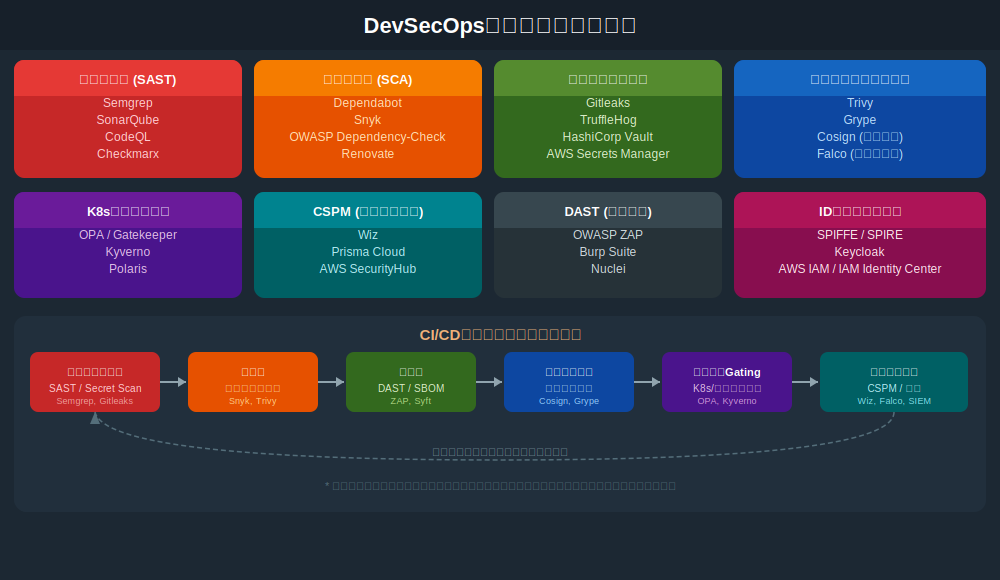


---

# 参考リソース

- <svg viewBox="0 0 800 400" style="max-height:70vh;max-width:100%;display:block;margin:0 auto;" xmlns="http://www.w3.org/2000/svg"><rect width="800" height="400" fill="#1a1a2e"/><text x="400" y="35" text-anchor="middle" fill="#f9a825" font-size="18" font-family="sans-serif" font-weight="bold">セキュリティチャンピオン制度</text><rect x="30" y="80" width="180" height="60" rx="6" fill="#16213e" stroke="#42a5f5" stroke-width="1.5"/><text x="120" y="115" text-anchor="middle" fill="#ffffff" font-size="13" font-family="sans-serif">開発チーム</text><text x="120" y="160" text-anchor="middle" fill="#888" font-size="10" font-family="sans-serif">各チームに1名</text><rect x="310" y="80" width="180" height="60" rx="6" fill="#16213e" stroke="#f9a825" stroke-width="1.5"/><text x="400" y="115" text-anchor="middle" fill="#ffffff" font-size="13" font-family="sans-serif">セキュリティチャンピオン</text><text x="400" y="160" text-anchor="middle" fill="#f9a825" font-size="10" font-family="sans-serif">トレーニング受講済み</text><rect x="590" y="80" width="180" height="60" rx="6" fill="#16213e" stroke="#4a148c" stroke-width="1.5"/><text x="680" y="115" text-anchor="middle" fill="#ffffff" font-size="13" font-family="sans-serif">セキュリティチーム</text><text x="680" y="160" text-anchor="middle" fill="#888" font-size="10" font-family="sans-serif">専門チーム</text><line x1="210" y1="110" x2="310" y2="110" stroke="#f9a825" stroke-width="2"/><polygon points="305,104 320,110 305,116" fill="#f9a825"/><line x1="490" y1="110" x2="590" y2="110" stroke="#f9a825" stroke-width="2"/><polygon points="585,104 600,110 585,116" fill="#f9a825"/><rect x="250" y="195" width="300" height="55" rx="6" fill="#16213e" stroke="#f9a825" stroke-width="1.5"/><text x="400" y="227" text-anchor="middle" fill="#ffffff" font-size="13" font-family="sans-serif">役割</text><text x="400" y="230" text-anchor="middle" fill="#f9a825" font-size="11" font-family="sans-serif">セキュリティ知識の橋渡し・PR レビュー</text><text x="400" y="375" text-anchor="middle" fill="#888" font-size="11" font-family="sans-serif">セキュリティ文化の醸成と開発速度の両立</text></svg>
- **公式ドキュメント・標準:**
- [OWASP DevSecOps Guideline](https://owasp.org/www-project-devsecops-guideline/)
- [NIST SP 800-207 Zero Trust](https://csrc.nist.gov/publications/detail/sp/800-207/final)
- [SLSA Framework](https://slsa.dev/) / [Sigstore Documentation](https://docs.sigstore.dev/)
- **学習リソース:**
- [OWASP Top 10](https://owasp.org/www-project-top-ten/) / [CNCF Security Whitepaper](https://github.com/cncf/tag-security) / [Falco Rules Reference](https://falco.org/docs/rules/) / [HashiCorp Vault Tutorials](https://developer.hashicorp.com/vault/tutorials)


---

# DevSecOps 黄金律

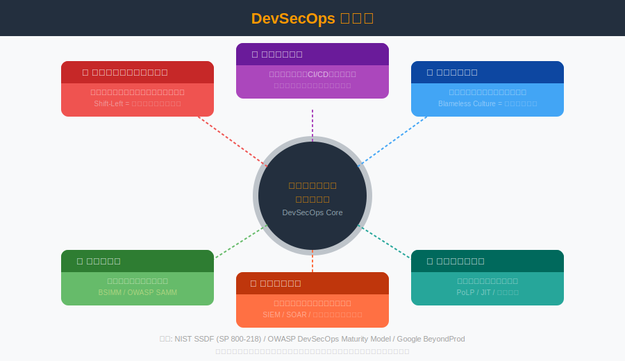

