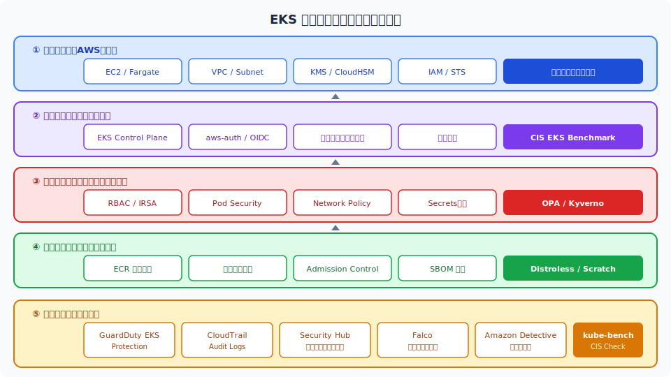
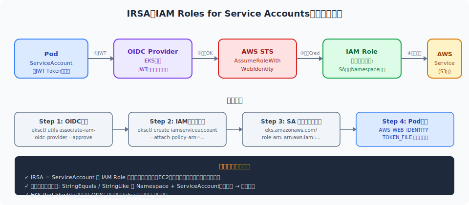
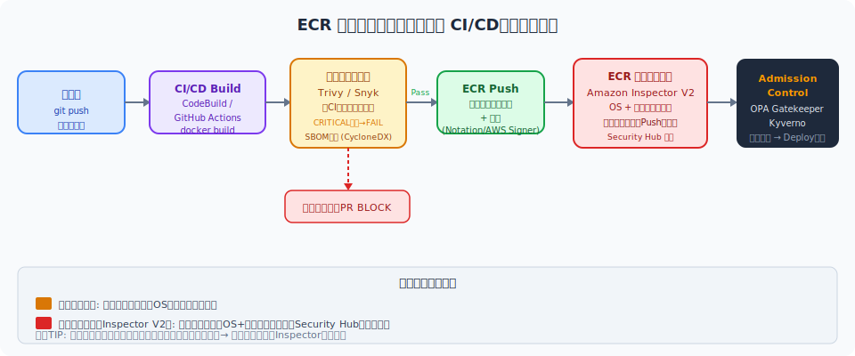
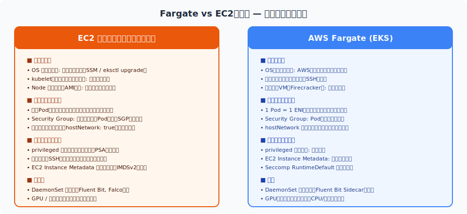
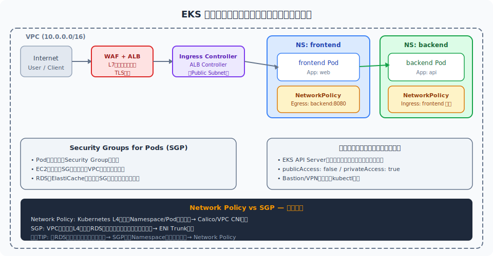
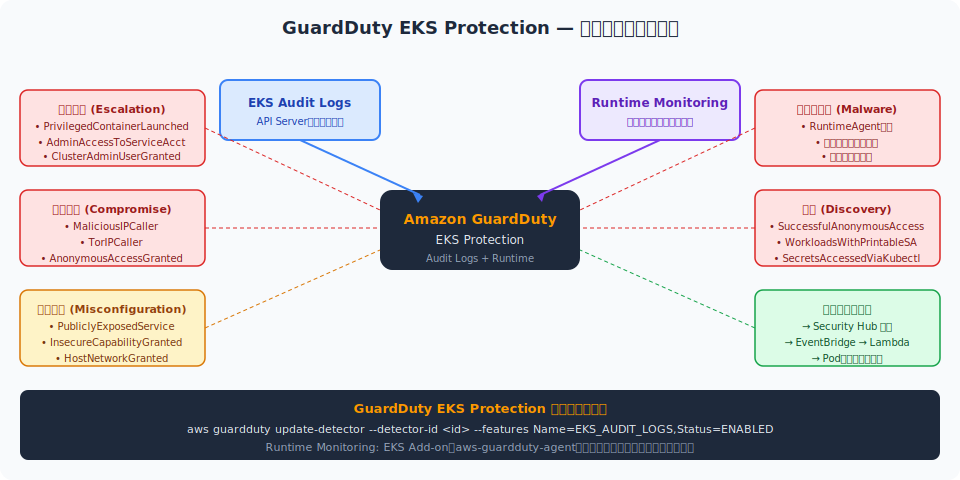
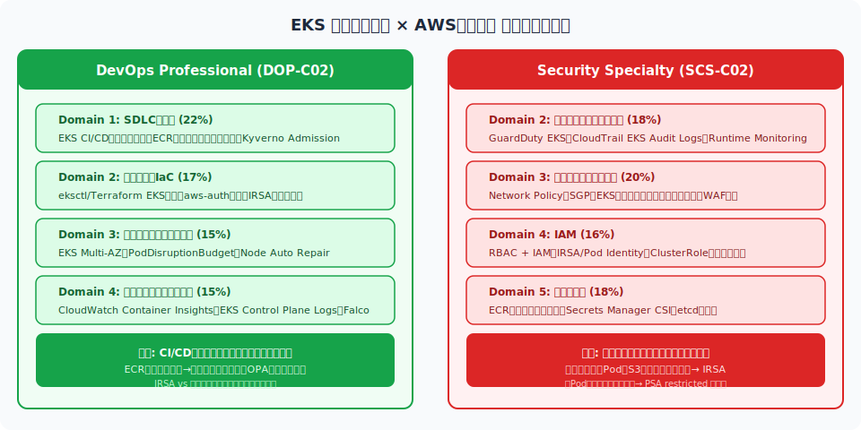

<!-- _class: lead -->
# EKS / コンテナセキュリティ完全ガイド

- AWS認定試験対応 — DevOps Professional / Security Specialty
- RBAC・イメージスキャン・Fargate・ランタイム監視
- ultrathink: 実践的コマンド例・設定例・試験頻出ポイントを網羅
- 120スライド構成 / 2026年版 SCS-C02 / DOP-C02 対応


---

# アジェンダ (1/2) — 章構成

> *RBAC・イメージ・Fargate・ネットワーク・ランタイム監視を9章120枚で完全網羅*

- <svg viewBox="0 0 800 400" style="max-height:70vh;max-width:100%;display:block;margin:0 auto;" xmlns="http://www.w3.org/2000/svg"><rect width="800" height="400" fill="#1a1a2e"/>
<text x="400" y="35" text-anchor="middle" fill="#f9a825" font-size="18" font-family="sans-serif" font-weight="bold">Kubernetes セキュリティレイヤー</text>
<rect x="30" y="55" width="740" height="320" rx="10" fill="#0d1117" stroke="#f9a825" stroke-width="2"/>
<text x="400" y="78" text-anchor="middle" fill="#f9a825" font-size="12" font-family="sans-serif">クラスターレイヤー: RBAC, NetworkPolicy, API認証</text>
<rect x="60" y="90" width="680" height="260" rx="8" fill="#1a237e" stroke="#42a5f5" stroke-width="1.5"/>
<text x="400" y="112" text-anchor="middle" fill="#42a5f5" font-size="12" font-family="sans-serif">ノードレイヤー: OS強化, CIS Benchmark, IAM Role</text>
<rect x="90" y="125" width="620" height="205" rx="8" fill="#1b5e20" stroke="#66bb6a" stroke-width="1.5"/>
<text x="400" y="147" text-anchor="middle" fill="#66bb6a" font-size="12" font-family="sans-serif">Podレイヤー: PodSecurity, securityContext, NetworkPolicy</text>
<rect x="120" y="160" width="560" height="155" rx="8" fill="#4a148c" stroke="#ce93d8" stroke-width="1.5"/>
<text x="400" y="182" text-anchor="middle" fill="#ce93d8" font-size="12" font-family="sans-serif">コンテナレイヤー: 非rootユーザー, capabilities drop, seccomp</text>
<rect x="160" y="198" width="200" height="90" rx="6" fill="#12005e" stroke="#ce93d8" stroke-width="1.5"/><text x="260" y="248" text-anchor="middle" fill="#ffffff" font-size="12" font-family="sans-serif">アプリコンテナ</text>
<text x="260" y="248" text-anchor="middle" fill="#888" font-size="10" font-family="sans-serif">最小権限イメージ</text>
<rect x="440" y="198" width="200" height="90" rx="6" fill="#12005e" stroke="#ce93d8" stroke-width="1.5"/><text x="540" y="248" text-anchor="middle" fill="#ffffff" font-size="11" font-family="sans-serif">サイドカーコンテナ</text>
<text x="540" y="248" text-anchor="middle" fill="#888" font-size="10" font-family="sans-serif">Envoy / Falco agent</text></svg>
- **Ch.1** はじめに・EKSセキュリティ全体像 (8枚)
- **Ch.2** EKSアーキテクチャとセキュリティ基盤 (10枚)
- **Ch.3** RBAC・認証・認可 (22枚)
- **Ch.4** イメージセキュリティ・ECR (18枚)
- **Ch.5** Fargateセキュリティ (14枚)


---

# アジェンダ (2/2) — 章構成

> *全9章120枚でDevOps Pro + Security Specialty両試験の約36%のEKS問題に対応*

- <svg viewBox="0 0 800 400" style="max-height:70vh;max-width:100%;display:block;margin:0 auto;" xmlns="http://www.w3.org/2000/svg"><rect width="800" height="400" fill="#1a1a2e"/>
<text x="400" y="35" text-anchor="middle" fill="#f9a825" font-size="18" font-family="sans-serif" font-weight="bold">RBAC 権限階層</text>
<rect x="295" y="60" width="210" height="48" rx="6" fill="#1565c0" stroke="#42a5f5" stroke-width="1.5"/><text x="400" y="89" text-anchor="middle" fill="#ffffff" font-size="13" font-family="sans-serif">ClusterRole</text>
<rect x="50" y="60" width="180" height="48" rx="6" fill="#16213e" stroke="#42a5f5" stroke-width="1.5"/><text x="140" y="89" text-anchor="middle" fill="#ffffff" font-size="11" font-family="sans-serif">Role (Namespace)</text>
<rect x="570" y="60" width="180" height="48" rx="6" fill="#16213e" stroke="#42a5f5" stroke-width="1.5"/><text x="660" y="89" text-anchor="middle" fill="#ffffff" font-size="11" font-family="sans-serif">ClusterRole (全NS)</text>
<line x1="175" y1="108" x2="295" y2="85" stroke="#f9a825" stroke-width="1.5"/><polygon points="288,80 300,89 288,78" fill="#f9a825"/>
<line x1="750" y1="85" x2="680" y2="85" stroke="#f9a825" stroke-width="1.5"/><polygon points="685,79 670,85 685,91" fill="#f9a825"/>
<rect x="295" y="160" width="210" height="48" rx="6" fill="#4a148c" stroke="#ce93d8" stroke-width="1.5"/><text x="400" y="189" text-anchor="middle" fill="#ffffff" font-size="13" font-family="sans-serif">ClusterRoleBinding</text>
<rect x="50" y="160" width="180" height="48" rx="6" fill="#16213e" stroke="#ce93d8" stroke-width="1.5"/><text x="140" y="189" text-anchor="middle" fill="#ffffff" font-size="12" font-family="sans-serif">RoleBinding</text>
<line x1="400" y1="108" x2="400" y2="160" stroke="#f9a825" stroke-width="1.5"/><polygon points="394,155 400,170 406,155" fill="#f9a825"/>
<line x1="140" y1="108" x2="140" y2="160" stroke="#f9a825" stroke-width="1.5"/><polygon points="134,155 140,170 146,155" fill="#f9a825"/>
<rect x="80" y="260" width="140" height="48" rx="6" fill="#1b5e20" stroke="#66bb6a" stroke-width="1.5"/><text x="150" y="289" text-anchor="middle" fill="#ffffff" font-size="11" font-family="sans-serif">ServiceAccount</text>
<rect x="250" y="260" width="140" height="48" rx="6" fill="#1b5e20" stroke="#66bb6a" stroke-width="1.5"/><text x="320" y="289" text-anchor="middle" fill="#ffffff" font-size="11" font-family="sans-serif">User / Group</text>
<rect x="430" y="260" width="140" height="48" rx="6" fill="#1b5e20" stroke="#66bb6a" stroke-width="1.5"/><text x="500" y="289" text-anchor="middle" fill="#ffffff" font-size="11" font-family="sans-serif">ServiceAccount</text>
<rect x="600" y="260" width="140" height="48" rx="6" fill="#1b5e20" stroke="#66bb6a" stroke-width="1.5"/><text x="670" y="289" text-anchor="middle" fill="#ffffff" font-size="11" font-family="sans-serif">User / Group</text>
<line x1="140" y1="208" x2="150" y2="260" stroke="#66bb6a" stroke-width="1.5"/><polygon points="145,255 152,268 140,257" fill="#66bb6a"/>
<line x1="140" y1="208" x2="320" y2="260" stroke="#66bb6a" stroke-width="1.5"/><polygon points="313,255 325,265 312,254" fill="#66bb6a"/>
<line x1="400" y1="208" x2="500" y2="260" stroke="#66bb6a" stroke-width="1.5"/><polygon points="493,255 505,265 492,254" fill="#66bb6a"/>
<line x1="400" y1="208" x2="670" y2="260" stroke="#66bb6a" stroke-width="1.5"/><polygon points="663,255 675,265 662,254" fill="#66bb6a"/>
<text x="400" y="375" text-anchor="middle" fill="#888" font-size="11" font-family="sans-serif">最小権限の原則: 必要なリソースと動詞のみ許可</text></svg>
- **Ch.6** ネットワークセキュリティ (16枚)
- **Ch.7** Pod・ワークロードセキュリティ (12枚)
- **Ch.8** ランタイム監視・監査 (12枚)
- **Ch.9** 試験対策・頻出パターン・まとめ (8枚)
- → 合計 **120枚** / DevOps Pro + Security Specialty 対応


---

# なぜコンテナセキュリティが重要か

> *設定ミスと共有カーネルリスクがEKS侵害の主因—SCS-C02の36%がコンテナ関連*

- <svg viewBox="0 0 800 400" style="max-height:70vh;max-width:100%;display:block;margin:0 auto;" xmlns="http://www.w3.org/2000/svg"><rect width="800" height="400" fill="#1a1a2e"/>
<text x="400" y="35" text-anchor="middle" fill="#f9a825" font-size="18" font-family="sans-serif" font-weight="bold">NetworkPolicy 分離アーキテクチャ</text>
<rect x="30" y="60" width="340" height="130" rx="8" fill="#0d1117" stroke="#42a5f5" stroke-width="1.5"/>
<text x="200" y="82" text-anchor="middle" fill="#42a5f5" font-size="12" font-family="sans-serif">Namespace: frontend</text>
<rect x="60" y="93" width="120" height="45" rx="6" fill="#1565c0" stroke="#42a5f5" stroke-width="1.5"/><text x="120" y="120.5" text-anchor="middle" fill="#ffffff" font-size="11" font-family="sans-serif">Pod: web-app</text>
<rect x="220" y="93" width="120" height="45" rx="6" fill="#1565c0" stroke="#42a5f5" stroke-width="1.5"/><text x="280" y="120.5" text-anchor="middle" fill="#ffffff" font-size="11" font-family="sans-serif">Pod: nginx</text>
<text x="200" y="160" text-anchor="middle" fill="#888" font-size="10" font-family="sans-serif">egress: backend:8080 のみ許可</text>
<rect x="430" y="60" width="340" height="130" rx="8" fill="#0d1117" stroke="#66bb6a" stroke-width="1.5"/>
<text x="600" y="82" text-anchor="middle" fill="#66bb6a" font-size="12" font-family="sans-serif">Namespace: backend</text>
<rect x="460" y="93" width="120" height="45" rx="6" fill="#1b5e20" stroke="#66bb6a" stroke-width="1.5"/><text x="520" y="120.5" text-anchor="middle" fill="#ffffff" font-size="12" font-family="sans-serif">Pod: api</text>
<rect x="620" y="93" width="120" height="45" rx="6" fill="#1b5e20" stroke="#66bb6a" stroke-width="1.5"/><text x="680" y="120.5" text-anchor="middle" fill="#ffffff" font-size="12" font-family="sans-serif">Pod: worker</text>
<text x="600" y="160" text-anchor="middle" fill="#888" font-size="10" font-family="sans-serif">ingress: frontend NS のみ許可</text>
<line x1="370" y1="115" x2="430" y2="115" stroke="#f9a825" stroke-width="2"/><polygon points="425,109 440,115 425,121" fill="#f9a825"/>
<text x="400" y="107" text-anchor="middle" fill="#f9a825" font-size="10" font-family="sans-serif">許可</text>
<rect x="250" y="230" width="300" height="48" rx="8" fill="#b71c1c" stroke="#e91e63" stroke-width="2"/>
<text x="400" y="251" text-anchor="middle" fill="#e91e63" font-size="12" font-family="sans-serif" font-weight="bold">default-deny ポリシー</text>
<text x="400" y="271" text-anchor="middle" fill="#ffffff" font-size="11" font-family="sans-serif">明示的に許可されていない通信はすべてDROP</text>
<line x1="200" y1="190" x2="300" y2="230" stroke="#e91e63" stroke-width="1.5" stroke-dasharray="5,3"/>
<line x1="600" y1="190" x2="500" y2="230" stroke="#e91e63" stroke-width="1.5" stroke-dasharray="5,3"/>
<text x="400" y="375" text-anchor="middle" fill="#888" font-size="11" font-family="sans-serif">Calico / Cilium で NetworkPolicy を実施</text></svg>
- **攻撃面の拡大**: コンテナイメージ・オーケストレーター・ネットワークが新たな攻撃ベクター
- **速度 vs セキュリティ**: CI/CDの高速化で脆弱なイメージが本番に到達するリスク
- **共有カーネル**: コンテナはVM と異なりホストカーネルを共有 → エスケープリスク
- **設定ミスが主因**: RBAC過剰権限・PublicイメージのLatestタグが侵害の入口
- **試験出題率**: SCS-C02 Domain3(20%) + Domain4(16%) = 約36% がコンテナ関連


---

# 試験ドメインとEKSセキュリティのカバレッジ

> *SCS-C02 54%・DOP-C02 37%がEKS関連—本資料は両試験に横断的に対応する*

- <svg viewBox="0 0 800 400" style="max-height:70vh;max-width:100%;display:block;margin:0 auto;" xmlns="http://www.w3.org/2000/svg"><rect width="800" height="400" fill="#1a1a2e"/>
<text x="400" y="35" text-anchor="middle" fill="#f9a825" font-size="18" font-family="sans-serif" font-weight="bold">Pod Security Standards レベル</text>
<rect x="30" y="70" width="220" height="240" rx="6" fill="#b71c1c" stroke="#e91e63" stroke-width="1.5"/><text x="140" y="195" text-anchor="middle" fill="#ffffff" font-size="13" font-family="sans-serif">Privileged</text>
<text x="140" y="120" text-anchor="middle" fill="#e91e63" font-size="13" font-family="sans-serif" font-weight="bold">PRIVILEGED</text>
<text x="140" y="145" text-anchor="middle" fill="#ffffff" font-size="11" font-family="sans-serif">制限なし</text>
<text x="140" y="165" text-anchor="middle" fill="#888" font-size="10" font-family="sans-serif">ホスト: PID/Net/IPC 可</text>
<text x="140" y="183" text-anchor="middle" fill="#888" font-size="10" font-family="sans-serif">特権コンテナ可</text>
<text x="140" y="201" text-anchor="middle" fill="#888" font-size="10" font-family="sans-serif">HostPath mount 可</text>
<text x="140" y="225" text-anchor="middle" fill="#e91e63" font-size="11" font-family="sans-serif">システムワークロード専用</text>
<rect x="290" y="70" width="220" height="240" rx="6" fill="#1565c0" stroke="#42a5f5" stroke-width="1.5"/><text x="400" y="195" text-anchor="middle" fill="#ffffff" font-size="13" font-family="sans-serif">Baseline</text>
<text x="400" y="120" text-anchor="middle" fill="#42a5f5" font-size="13" font-family="sans-serif" font-weight="bold">BASELINE</text>
<text x="400" y="145" text-anchor="middle" fill="#ffffff" font-size="11" font-family="sans-serif">最小限の制限</text>
<text x="400" y="165" text-anchor="middle" fill="#888" font-size="10" font-family="sans-serif">特権コンテナ: 禁止</text>
<text x="400" y="183" text-anchor="middle" fill="#888" font-size="10" font-family="sans-serif">HostPath: 禁止</text>
<text x="400" y="201" text-anchor="middle" fill="#888" font-size="10" font-family="sans-serif">capabilities: allowlist</text>
<text x="400" y="225" text-anchor="middle" fill="#42a5f5" font-size="11" font-family="sans-serif">一般アプリに推奨</text>
<rect x="550" y="70" width="220" height="240" rx="6" fill="#1b5e20" stroke="#66bb6a" stroke-width="1.5"/><text x="660" y="195" text-anchor="middle" fill="#ffffff" font-size="13" font-family="sans-serif">Restricted</text>
<text x="660" y="120" text-anchor="middle" fill="#66bb6a" font-size="13" font-family="sans-serif" font-weight="bold">RESTRICTED</text>
<text x="660" y="145" text-anchor="middle" fill="#ffffff" font-size="11" font-family="sans-serif">最高レベルの制限</text>
<text x="660" y="165" text-anchor="middle" fill="#888" font-size="10" font-family="sans-serif">runAsNonRoot: 必須</text>
<text x="660" y="183" text-anchor="middle" fill="#888" font-size="10" font-family="sans-serif">seccomp: RuntimeDefault</text>
<text x="660" y="201" text-anchor="middle" fill="#888" font-size="10" font-family="sans-serif">capabilities: drop ALL</text>
<text x="660" y="225" text-anchor="middle" fill="#66bb6a" font-size="11" font-family="sans-serif">セキュリティ重視に推奨</text>
<text x="400" y="375" text-anchor="middle" fill="#888" font-size="11" font-family="sans-serif">PSA (Pod Security Admission) でNamespace単位に適用 — Kubernetes 1.25+</text></svg>
- **SCS-C02**: Domain3 インフラセキュリティ(20%) ← EKS Network, Fargate, WAF
- **SCS-C02**: Domain4 IAM(16%) ← RBAC, IRSA, Pod Identity, aws-auth
- **SCS-C02**: Domain2 ログ・監視(18%) ← GuardDuty EKS, CloudTrail, Falco
- **DOP-C02**: Domain1 SDLC自動化(22%) ← ECRスキャン, OPA, CI/CDパイプライン
- **DOP-C02**: Domain4 モニタリング(15%) ← Container Insights, EKS Audit Logs
- → 本資料は両試験に横断的に対応


---

# EKS 責任共有モデル

> *コントロールプレーンはAWS管理・RBAC/Pod Security/イメージセキュリティはユーザー責任*

- <svg viewBox="0 0 800 400" style="max-height:70vh;max-width:100%;display:block;margin:0 auto;" xmlns="http://www.w3.org/2000/svg"><rect width="800" height="400" fill="#1a1a2e"/>
<text x="400" y="35" text-anchor="middle" fill="#f9a825" font-size="18" font-family="sans-serif" font-weight="bold">イメージプルポリシーとレジストリフロー</text>
<rect x="30" y="155" width="120" height="50" rx="6" fill="#16213e" stroke="#42a5f5" stroke-width="1.5"/><text x="90" y="185" text-anchor="middle" fill="#ffffff" font-size="13" font-family="sans-serif">開発者</text>
<line x1="150" y1="180" x2="180" y2="180" stroke="#f9a825" stroke-width="2"/><polygon points="175,174 190,180 175,186" fill="#f9a825"/>
<rect x="190" y="155" width="130" height="50" rx="6" fill="#16213e" stroke="#f9a825" stroke-width="1.5"/><text x="255" y="185" text-anchor="middle" fill="#ffffff" font-size="11" font-family="sans-serif">CI/CDビルド</text>
<line x1="320" y1="180" x2="350" y2="180" stroke="#f9a825" stroke-width="2"/><polygon points="345,174 360,180 345,186" fill="#f9a825"/>
<rect x="360" y="130" width="130" height="50" rx="6" fill="#1565c0" stroke="#42a5f5" stroke-width="1.5"/><text x="425" y="160" text-anchor="middle" fill="#ffffff" font-size="11" font-family="sans-serif">脆弱性スキャン</text>
<rect x="360" y="200" width="130" height="50" rx="6" fill="#4a148c" stroke="#ce93d8" stroke-width="1.5"/><text x="425" y="230" text-anchor="middle" fill="#ffffff" font-size="11" font-family="sans-serif">署名/SBOM</text>
<line x1="490" y1="155" x2="520" y2="155" stroke="#66bb6a" stroke-width="2"/><polygon points="515,149 530,155 515,161" fill="#66bb6a"/>
<line x1="490" y1="225" x2="520" y2="225" stroke="#66bb6a" stroke-width="2"/><polygon points="515,219 530,225 515,231" fill="#66bb6a"/>
<rect x="530" y="155" width="110" height="120" rx="6" fill="#1b5e20" stroke="#66bb6a" stroke-width="1.5"/><text x="585" y="220" text-anchor="middle" fill="#ffffff" font-size="10" font-family="sans-serif">ECR / Private Registry</text>
<line x1="640" y1="215" x2="680" y2="215" stroke="#f9a825" stroke-width="2"/><polygon points="675,209 690,215 675,221" fill="#f9a825"/>
<polygon points="710,195 755,215 710,235" fill="#16213e" stroke="#f9a825" stroke-width="1.5"/>
<text x="711" y="212" text-anchor="middle" fill="#f9a825" font-size="9" font-family="sans-serif">署名</text>
<text x="711" y="226" text-anchor="middle" fill="#f9a825" font-size="9" font-family="sans-serif">検証?</text>
<line x1="755" y1="215" x2="785" y2="215" stroke="#66bb6a" stroke-width="1.5"/><polygon points="780,209 795,215 780,221" fill="#66bb6a"/>
<text x="400" y="310" text-anchor="middle" fill="#ffffff" font-size="12" font-family="sans-serif" font-weight="bold">ImagePullPolicy 設定</text>
<text x="200" y="335" text-anchor="middle" fill="#f9a825" font-size="11" font-family="sans-serif">Always: 本番に推奨</text>
<text x="400" y="335" text-anchor="middle" fill="#ffffff" font-size="11" font-family="sans-serif">IfNotPresent: 開発環境</text>
<text x="600" y="335" text-anchor="middle" fill="#e91e63" font-size="11" font-family="sans-serif">Never: エアギャップ環境</text>
<text x="400" y="375" text-anchor="middle" fill="#888" font-size="11" font-family="sans-serif">latest タグ禁止 — 常にダイジェスト(SHA256)固定を推奨</text></svg>
- **AWSが管理**: EKSコントロールプレーン（etcd, API Server, スケジューラー）
- **AWSが管理**: Fargateマイクロvm・ノードのOSパッチ（Fargateの場合のみ）
- **ユーザー責任**: EKS Data Plane（EC2ノードのOS, kubelet, ランタイム）
- **ユーザー責任**: RBAC設定・Pod Security・NetworkPolicy・Secrets管理
- **ユーザー責任**: コンテナイメージのセキュリティ・脆弱性管理
- **試験TIP**: 「誰が何を管理するか」で回答が決まる設問が頻出


---

# EKS セキュリティレイヤー全体図




---

# 前提知識・本資料の読み方

> *K8s基礎・AWS基礎の前提知識で全章末の試験頻出ポイントを最大活用できる*

- <svg viewBox="0 0 800 400" style="max-height:70vh;max-width:100%;display:block;margin:0 auto;" xmlns="http://www.w3.org/2000/svg"><rect width="800" height="400" fill="#1a1a2e"/>
<text x="400" y="35" text-anchor="middle" fill="#f9a825" font-size="18" font-family="sans-serif" font-weight="bold">シークレット管理フロー (CSI Driver)</text>
<rect x="30" y="155" width="165" height="55" rx="6" fill="#4a148c" stroke="#ce93d8" stroke-width="1.5"/><text x="112.5" y="187.5" text-anchor="middle" fill="#ffffff" font-size="11" font-family="sans-serif">AWS Secrets Manager</text>
<text x="112" y="228" text-anchor="middle" fill="#888" font-size="10" font-family="sans-serif">自動ローテーション</text>
<line x1="195" y1="182" x2="240" y2="182" stroke="#f9a825" stroke-width="2"/><polygon points="235,176 250,182 235,188" fill="#f9a825"/>
<rect x="250" y="155" width="165" height="55" rx="6" fill="#1565c0" stroke="#42a5f5" stroke-width="1.5"/><text x="332.5" y="187.5" text-anchor="middle" fill="#ffffff" font-size="11" font-family="sans-serif">Secrets Store CSI</text>
<text x="332" y="228" text-anchor="middle" fill="#42a5f5" font-size="10" font-family="sans-serif">secrets-store-csi-driver</text>
<line x1="415" y1="182" x2="460" y2="182" stroke="#f9a825" stroke-width="2"/><polygon points="455,176 470,182 455,188" fill="#f9a825"/>
<rect x="470" y="155" width="165" height="55" rx="6" fill="#16213e" stroke="#f9a825" stroke-width="1.5"/><text x="552.5" y="187.5" text-anchor="middle" fill="#ffffff" font-size="11" font-family="sans-serif">SecretProviderClass</text>
<text x="552" y="228" text-anchor="middle" fill="#f9a825" font-size="10" font-family="sans-serif">マウント設定</text>
<line x1="635" y1="182" x2="680" y2="182" stroke="#66bb6a" stroke-width="2"/><polygon points="675,176 690,182 675,188" fill="#66bb6a"/>
<rect x="690" y="140" width="100" height="85" rx="6" fill="#1b5e20" stroke="#66bb6a" stroke-width="1.5"/><text x="740" y="187.5" text-anchor="middle" fill="#ffffff" font-size="14" font-family="sans-serif">Pod</text>
<text x="740" y="238" text-anchor="middle" fill="#888" font-size="10" font-family="sans-serif">/mnt/secrets/</text>
<rect x="100" y="275" width="600" height="65" rx="8" fill="#16213e" stroke="#f9a825" stroke-width="1.5"/>
<text x="400" y="298" text-anchor="middle" fill="#ffffff" font-size="12" font-family="sans-serif" font-weight="bold">IRSA (IAM Roles for Service Accounts)</text>
<text x="400" y="318" text-anchor="middle" fill="#f9a825" font-size="11" font-family="sans-serif">ServiceAccount → IAM Role → Secrets Manager アクセス権限</text>
<text x="400" y="335" text-anchor="middle" fill="#888" font-size="10" font-family="sans-serif">最小権限IAMポリシー + OIDC プロバイダー連携</text>
<text x="400" y="375" text-anchor="middle" fill="#888" font-size="11" font-family="sans-serif">Kubernetes Secrets は etcd 暗号化 (KMS) を必ず有効化</text></svg>
- **前提知識**: Kubernetes基礎（Pod, Deployment, Service, Namespace）
- **前提知識**: AWS基礎（IAM, VPC, S3, EC2, ECS）
- **本資料の読み方**: 各章末に試験頻出ポイントを集約
- **コードブロック**: コピーして実際に動かすことを推奨
- **SVG図解**: 各レイヤーの関係性を視覚的に把握
- → `kubectl`, `eksctl`, `aws cli v2` のインストールを事前に推奨


---

<!-- _class: lead -->
# Chapter 2: EKSアーキテクチャとセキュリティ基盤

- EKSの構造を理解することがセキュリティ設計の基本
- コントロールプレーン・データプレーン・ネットワークの関係性を把握する


---

# EKS コントロールプレーンとデータプレーン

> *etcdはAES-256自動暗号化済みだが機密情報はKMS Envelope暗号化の追加を推奨*

- <svg viewBox="0 0 800 400" style="max-height:70vh;max-width:100%;display:block;margin:0 auto;" xmlns="http://www.w3.org/2000/svg"><rect width="800" height="400" fill="#1a1a2e"/>
<text x="400" y="35" text-anchor="middle" fill="#f9a825" font-size="18" font-family="sans-serif" font-weight="bold">ランタイムセキュリティ監視フロー</text>
<rect x="30" y="60" width="200" height="48" rx="6" fill="#16213e" stroke="#42a5f5" stroke-width="1.5"/><text x="130" y="89" text-anchor="middle" fill="#ffffff" font-size="13" font-family="sans-serif">EKS Cluster</text>
<rect x="30" y="138" width="200" height="48" rx="6" fill="#16213e" stroke="#42a5f5" stroke-width="1.5"/><text x="130" y="167" text-anchor="middle" fill="#ffffff" font-size="13" font-family="sans-serif">ノード / コンテナ</text>
<line x1="230" y1="84" x2="275" y2="115" stroke="#f9a825" stroke-width="1.5"/>
<line x1="230" y1="162" x2="275" y2="140" stroke="#f9a825" stroke-width="1.5"/>
<rect x="285" y="110" width="160" height="55" rx="6" fill="#1565c0" stroke="#42a5f5" stroke-width="1.5"/><text x="365" y="142.5" text-anchor="middle" fill="#ffffff" font-size="11" font-family="sans-serif">Falco / GuardDuty</text>
<text x="365" y="183" text-anchor="middle" fill="#888" font-size="10" font-family="sans-serif">syscall eBPF 監視</text>
<line x1="445" y1="137" x2="490" y2="137" stroke="#f9a825" stroke-width="2"/><polygon points="485,131 500,137 485,143" fill="#f9a825"/>
<rect x="500" y="110" width="160" height="55" rx="6" fill="#4a148c" stroke="#ce93d8" stroke-width="1.5"/><text x="580" y="142.5" text-anchor="middle" fill="#ffffff" font-size="12" font-family="sans-serif">アラート生成</text>
<line x1="660" y1="137" x2="695" y2="137" stroke="#f9a825" stroke-width="2"/><polygon points="690,131 705,137 690,143" fill="#f9a825"/>
<rect x="705" y="110" width="75" height="55" rx="6" fill="#b71c1c" stroke="#e91e63" stroke-width="1.5"/><text x="742.5" y="142.5" text-anchor="middle" fill="#ffffff" font-size="12" font-family="sans-serif">SIEM</text>
<text x="400" y="240" text-anchor="middle" fill="#ffffff" font-size="12" font-family="sans-serif" font-weight="bold">検出される異常行動の例</text>
<rect x="30" y="258" width="220" height="40" rx="6" fill="#b71c1c" stroke="#e91e63" stroke-width="1.5"/><text x="140" y="283" text-anchor="middle" fill="#ffffff" font-size="10" font-family="sans-serif">シェル起動 (exec /bin/bash)</text>
<rect x="270" y="258" width="220" height="40" rx="6" fill="#b71c1c" stroke="#e91e63" stroke-width="1.5"/><text x="380" y="283" text-anchor="middle" fill="#ffffff" font-size="10" font-family="sans-serif">ネットワーク外部接続</text>
<rect x="510" y="258" width="260" height="40" rx="6" fill="#b71c1c" stroke="#e91e63" stroke-width="1.5"/><text x="640" y="283" text-anchor="middle" fill="#ffffff" font-size="10" font-family="sans-serif">/etc/passwd 読み取り</text>
<rect x="100" y="320" width="600" height="40" rx="6" fill="#16213e" stroke="#66bb6a" stroke-width="1.5"/>
<text x="400" y="337" text-anchor="middle" fill="#66bb6a" font-size="11" font-family="sans-serif" font-weight="bold">EKS GuardDuty: コントロールプレーン監査ログ自動分析</text>
<text x="400" y="355" text-anchor="middle" fill="#888" font-size="10" font-family="sans-serif">異常APIコール・クレデンシャル漏洩・マルウェアを検出</text>
<text x="400" y="390" text-anchor="middle" fill="#888" font-size="11" font-family="sans-serif">検出 → CloudWatch Events → Lambda 自動対応</text></svg>
- **コントロールプレーン（AWS管理）**: API Server, etcd, Scheduler, Controller Manager
- **データプレーン（ユーザー管理）**: EC2ノード or Fargate Pod
- **通信経路**: kubectl → EKS API Endpoint → Kubernetes API → ノード上のkubelet
- **etcd暗号化**: EKS etcdはAES-256で自動暗号化（KMS使用）
- **Kubernetes Secrets**: etcd暗号化はされているが、KMS Envelope暗号化を追加推奨
- → `aws eks describe-cluster --name <cluster>` で暗号化設定確認


---

# VPC設計とEKS統合

> *EKS VPCは/16でプライベートSubnetにNode/Podを配置しCIDR不足に注意する*

- <svg viewBox="0 0 800 400" style="max-height:70vh;max-width:100%;display:block;margin:0 auto;" xmlns="http://www.w3.org/2000/svg"><rect width="800" height="400" fill="#1a1a2e"/>
<text x="400" y="35" text-anchor="middle" fill="#f9a825" font-size="18" font-family="sans-serif" font-weight="bold">マルチテナンシー 分離アーキテクチャ</text>
<rect x="30" y="55" width="740" height="280" rx="10" fill="#0d1117" stroke="#f9a825" stroke-width="2"/>
<text x="400" y="78" text-anchor="middle" fill="#f9a825" font-size="12" font-family="sans-serif">EKS クラスター</text>
<rect x="50" y="90" width="210" height="220" rx="8" fill="#1a237e" stroke="#42a5f5" stroke-width="1.5"/>
<text x="155" y="112" text-anchor="middle" fill="#42a5f5" font-size="12" font-family="sans-serif">NS: team-a</text>
<rect x="65" y="125" width="175" height="40" rx="6" fill="#1565c0" stroke="#42a5f5" stroke-width="1.5"/><text x="152.5" y="150" text-anchor="middle" fill="#ffffff" font-size="11" font-family="sans-serif">Deployment A</text>
<rect x="65" y="180" width="175" height="40" rx="6" fill="#1565c0" stroke="#42a5f5" stroke-width="1.5"/><text x="152.5" y="205" text-anchor="middle" fill="#ffffff" font-size="11" font-family="sans-serif">Service A</text>
<text x="155" y="250" text-anchor="middle" fill="#888" font-size="10" font-family="sans-serif">ResourceQuota / LimitRange</text>
<rect x="295" y="90" width="210" height="220" rx="8" fill="#1b5e20" stroke="#66bb6a" stroke-width="1.5"/>
<text x="400" y="112" text-anchor="middle" fill="#66bb6a" font-size="12" font-family="sans-serif">NS: team-b</text>
<rect x="310" y="125" width="175" height="40" rx="6" fill="#1b5e20" stroke="#66bb6a" stroke-width="1.5"/><text x="397.5" y="150" text-anchor="middle" fill="#ffffff" font-size="11" font-family="sans-serif">Deployment B</text>
<rect x="310" y="180" width="175" height="40" rx="6" fill="#1b5e20" stroke="#66bb6a" stroke-width="1.5"/><text x="397.5" y="205" text-anchor="middle" fill="#ffffff" font-size="11" font-family="sans-serif">Service B</text>
<text x="400" y="250" text-anchor="middle" fill="#888" font-size="10" font-family="sans-serif">NetworkPolicy: 他NSからの疎通遮断</text>
<rect x="540" y="90" width="210" height="220" rx="8" fill="#4a148c" stroke="#ce93d8" stroke-width="1.5"/>
<text x="645" y="112" text-anchor="middle" fill="#ce93d8" font-size="12" font-family="sans-serif">NS: team-c</text>
<rect x="555" y="125" width="175" height="40" rx="6" fill="#4a148c" stroke="#ce93d8" stroke-width="1.5"/><text x="642.5" y="150" text-anchor="middle" fill="#ffffff" font-size="11" font-family="sans-serif">Deployment C</text>
<rect x="555" y="180" width="175" height="40" rx="6" fill="#4a148c" stroke="#ce93d8" stroke-width="1.5"/><text x="642.5" y="205" text-anchor="middle" fill="#ffffff" font-size="11" font-family="sans-serif">Service C</text>
<text x="645" y="250" text-anchor="middle" fill="#888" font-size="10" font-family="sans-serif">個別 ServiceAccount / IRSA</text>
<text x="400" y="375" text-anchor="middle" fill="#888" font-size="11" font-family="sans-serif">強度な分離が必要な場合: 別クラスター or Fargate (専用カーネル)</text></svg>
- **推奨VPC構成**: パブリックSubnet（NAT GW, ALB）+ プライベートSubnet（Node, Pod）
- **EKS用Subnet タグ**: `kubernetes.io/cluster/<name>=owned` が必須
- **最低限**: 各AZに1つのSubnet（高可用性のため2-3 AZ推奨）
- **VPC CNI制約**: Podにはノード同サブネットのIPが割り当てられる → 十分なIP空間が必要
- **CIDR設計**: `/16` VPC + `/24` Subnetで最大251 Pod/Subnet
- → 大規模クラスターでは `/19` 以上のSubnetを推奨


---

# EKS APIエンドポイントのアクセス制御

> *プライベートエンドポイント推奨—公開アクセスはCIDR制限しブラストラジウスを最小化*

- <svg viewBox="0 0 800 400" style="max-height:70vh;max-width:100%;display:block;margin:0 auto;" xmlns="http://www.w3.org/2000/svg"><rect width="800" height="400" fill="#1a1a2e"/>
<text x="400" y="35" text-anchor="middle" fill="#f9a825" font-size="18" font-family="sans-serif" font-weight="bold">EKS VPC セキュリティ設計</text>
<rect x="30" y="55" width="740" height="300" rx="10" fill="#0d1117" stroke="#42a5f5" stroke-width="2"/>
<text x="400" y="77" text-anchor="middle" fill="#42a5f5" font-size="12" font-family="sans-serif">VPC</text>
<rect x="50" y="88" width="320" height="120" rx="8" fill="#1a237e" stroke="#42a5f5" stroke-width="1.5"/>
<text x="210" y="108" text-anchor="middle" fill="#42a5f5" font-size="11" font-family="sans-serif">パブリックサブネット</text>
<rect x="65" y="118" width="130" height="40" rx="6" fill="#16213e" stroke="#42a5f5" stroke-width="1.5"/><text x="130" y="143" text-anchor="middle" fill="#ffffff" font-size="11" font-family="sans-serif">ALB / NLB</text>
<rect x="225" y="118" width="130" height="40" rx="6" fill="#16213e" stroke="#42a5f5" stroke-width="1.5"/><text x="290" y="143" text-anchor="middle" fill="#ffffff" font-size="11" font-family="sans-serif">NAT Gateway</text>
<text x="210" y="188" text-anchor="middle" fill="#888" font-size="10" font-family="sans-serif">IGW 経由でインターネットアクセス</text>
<rect x="430" y="88" width="320" height="120" rx="8" fill="#1b5e20" stroke="#66bb6a" stroke-width="1.5"/>
<text x="590" y="108" text-anchor="middle" fill="#66bb6a" font-size="11" font-family="sans-serif">プライベートサブネット</text>
<rect x="445" y="118" width="130" height="40" rx="6" fill="#1b5e20" stroke="#66bb6a" stroke-width="1.5"/><text x="510" y="143" text-anchor="middle" fill="#ffffff" font-size="11" font-family="sans-serif">EKS Nodes</text>
<rect x="605" y="118" width="130" height="40" rx="6" fill="#1b5e20" stroke="#66bb6a" stroke-width="1.5"/><text x="670" y="143" text-anchor="middle" fill="#ffffff" font-size="10" font-family="sans-serif">RDS / ElastiCache</text>
<text x="590" y="188" text-anchor="middle" fill="#888" font-size="10" font-family="sans-serif">NATのみ外部接続 / APIエンドポイント Private</text>
<line x1="210" y1="208" x2="280" y2="248" stroke="#f9a825" stroke-width="1.5"/>
<line x1="590" y1="208" x2="500" y2="248" stroke="#f9a825" stroke-width="1.5"/>
<rect x="250" y="248" width="300" height="70" rx="8" fill="#16213e" stroke="#f9a825" stroke-width="1.5"/>
<text x="400" y="272" text-anchor="middle" fill="#f9a825" font-size="12" font-family="sans-serif" font-weight="bold">セキュリティグループ設計</text>
<text x="400" y="293" text-anchor="middle" fill="#ffffff" font-size="11" font-family="sans-serif">最小限のポート / ノード間通信のみ許可</text>
<text x="400" y="375" text-anchor="middle" fill="#888" font-size="11" font-family="sans-serif">APIエンドポイントを Private に設定し公開露出を排除</text></svg>
- **publicAccess + privateAccess（デフォルト）**: 外部からkubectl可能（CIDR制限推奨）
- **privateAccess のみ（推奨）**: VPC内のみ接続可能 → Bastion / VPN 経由
- **publicAccessCidrs**: 特定IPのみ許可（例: `["203.0.113.0/24"]`）
- **試験TIP**: プライベートエンドポイントのみ設定 → kubectl実行にはVPC内踏み台が必要
- → 侵害時のブラストラジウスを最小化するためプライベートエンドポイント推奨


---

# EKS APIエンドポイントのアクセス制御（コード例）

```bash
# エンドポイントをプライベートのみに変更
aws eks update-cluster-config \
  --name my-cluster \
  --resources-vpc-config \
    endpointPublicAccess=false,\
    endpointPrivateAccess=true
```


---

# マネージドノードグループ vs Fargate

> *Fargateはサーバーレス・OSパッチ不要・マイクロVM分離でステートレスに最適*

- <svg viewBox="0 0 800 400" style="max-height:70vh;max-width:100%;display:block;margin:0 auto;" xmlns="http://www.w3.org/2000/svg"><rect width="800" height="400" fill="#1a1a2e"/>
<text x="400" y="35" text-anchor="middle" fill="#f9a825" font-size="18" font-family="sans-serif" font-weight="bold">IRSA / EKS Pod Identity フロー</text>
<rect x="30" y="155" width="140" height="55" rx="6" fill="#1b5e20" stroke="#66bb6a" stroke-width="1.5"/><text x="100" y="187.5" text-anchor="middle" fill="#ffffff" font-size="13" font-family="sans-serif">Pod</text>
<text x="100" y="228" text-anchor="middle" fill="#888" font-size="10" font-family="sans-serif">ServiceAccount付与</text>
<line x1="170" y1="182" x2="210" y2="182" stroke="#f9a825" stroke-width="2"/><polygon points="205,176 220,182 205,188" fill="#f9a825"/>
<rect x="220" y="155" width="150" height="55" rx="6" fill="#4a148c" stroke="#ce93d8" stroke-width="1.5"/><text x="295" y="187.5" text-anchor="middle" fill="#ffffff" font-size="11" font-family="sans-serif">OIDC Provider</text>
<text x="295" y="228" text-anchor="middle" fill="#888" font-size="10" font-family="sans-serif">EKS OIDC エンドポイント</text>
<line x1="370" y1="182" x2="410" y2="182" stroke="#f9a825" stroke-width="2"/><polygon points="405,176 420,182 405,188" fill="#f9a825"/>
<rect x="420" y="155" width="150" height="55" rx="6" fill="#1565c0" stroke="#42a5f5" stroke-width="1.5"/><text x="495" y="187.5" text-anchor="middle" fill="#ffffff" font-size="11" font-family="sans-serif">IAM AssumeRole</text>
<text x="495" y="228" text-anchor="middle" fill="#888" font-size="10" font-family="sans-serif">sts:AssumeRoleWithWebIdentity</text>
<line x1="570" y1="182" x2="610" y2="182" stroke="#66bb6a" stroke-width="2"/><polygon points="605,176 620,182 605,188" fill="#66bb6a"/>
<rect x="620" y="155" width="150" height="55" rx="6" fill="#1b5e20" stroke="#66bb6a" stroke-width="1.5"/><text x="695" y="187.5" text-anchor="middle" fill="#ffffff" font-size="11" font-family="sans-serif">一時クレデンシャル</text>
<text x="695" y="228" text-anchor="middle" fill="#888" font-size="10" font-family="sans-serif">15分〜1時間の短期証明書</text>
<rect x="100" y="268" width="600" height="75" rx="8" fill="#16213e" stroke="#f9a825" stroke-width="1.5"/>
<text x="400" y="292" text-anchor="middle" fill="#ffffff" font-size="12" font-family="sans-serif" font-weight="bold">IRSA vs Pod Identity の比較</text>
<text x="280" y="315" text-anchor="middle" fill="#f9a825" font-size="11" font-family="sans-serif">IRSA: OIDC Webフェデレーション</text>
<text x="520" y="315" text-anchor="middle" fill="#42a5f5" font-size="11" font-family="sans-serif">Pod Identity: EKS Agent経由 (新方式)</text>
<text x="280" y="333" text-anchor="middle" fill="#888" font-size="10" font-family="sans-serif">全リージョン対応・既存環境向け</text>
<text x="520" y="333" text-anchor="middle" fill="#888" font-size="10" font-family="sans-serif">設定簡略・Session Tagging対応</text>
<text x="400" y="375" text-anchor="middle" fill="#888" font-size="11" font-family="sans-serif">ノードの EC2 インスタンスプロファイルに依存しない設計が重要</text></svg>
- **マネージドノードグループ**: EC2インスタンス、DaemonSet対応、GPU対応、OS管理必要
- **Fargate**: サーバーレス、OSパッチ不要、1Pod=1マイクロVM、DaemonSet不可
- **Fargateの制約**: privileged不可、hostNetwork不可、hostPID不可
- **使い分け**: ステートレスWebアプリ→Fargate、DaemonSet必要→マネージドノード
- **試験TIP**: 「ノード管理を排除」「OSパッチ自動化」→ Fargateが正解


---

# クラスター作成のセキュリティ設定

- <svg viewBox="0 0 800 400" style="max-height:70vh;max-width:100%;display:block;margin:0 auto;" xmlns="http://www.w3.org/2000/svg"><rect width="800" height="400" fill="#1a1a2e"/>
<text x="400" y="35" text-anchor="middle" fill="#f9a825" font-size="18" font-family="sans-serif" font-weight="bold">Kubernetes セキュリティレイヤー</text>
<rect x="30" y="55" width="740" height="320" rx="10" fill="#0d1117" stroke="#f9a825" stroke-width="2"/>
<text x="400" y="78" text-anchor="middle" fill="#f9a825" font-size="12" font-family="sans-serif">クラスターレイヤー: RBAC, NetworkPolicy, API認証</text>
<rect x="60" y="90" width="680" height="260" rx="8" fill="#1a237e" stroke="#42a5f5" stroke-width="1.5"/>
<text x="400" y="112" text-anchor="middle" fill="#42a5f5" font-size="12" font-family="sans-serif">ノードレイヤー: OS強化, CIS Benchmark, IAM Role</text>
<rect x="90" y="125" width="620" height="205" rx="8" fill="#1b5e20" stroke="#66bb6a" stroke-width="1.5"/>
<text x="400" y="147" text-anchor="middle" fill="#66bb6a" font-size="12" font-family="sans-serif">Podレイヤー: PodSecurity, securityContext, NetworkPolicy</text>
<rect x="120" y="160" width="560" height="155" rx="8" fill="#4a148c" stroke="#ce93d8" stroke-width="1.5"/>
<text x="400" y="182" text-anchor="middle" fill="#ce93d8" font-size="12" font-family="sans-serif">コンテナレイヤー: 非rootユーザー, capabilities drop, seccomp</text>
<rect x="160" y="198" width="200" height="90" rx="6" fill="#12005e" stroke="#ce93d8" stroke-width="1.5"/><text x="260" y="248" text-anchor="middle" fill="#ffffff" font-size="12" font-family="sans-serif">アプリコンテナ</text>
<text x="260" y="248" text-anchor="middle" fill="#888" font-size="10" font-family="sans-serif">最小権限イメージ</text>
<rect x="440" y="198" width="200" height="90" rx="6" fill="#12005e" stroke="#ce93d8" stroke-width="1.5"/><text x="540" y="248" text-anchor="middle" fill="#ffffff" font-size="11" font-family="sans-serif">サイドカーコンテナ</text>
<text x="540" y="248" text-anchor="middle" fill="#888" font-size="10" font-family="sans-serif">Envoy / Falco agent</text></svg>
- eksctlを使った最小権限・セキュアなクラスター作成の例


---

# クラスター作成のセキュリティ設定（コード例）

```yaml
# eksctl cluster config (secure)
apiVersion: eksctl.io/v1alpha5
kind: ClusterConfig
metadata:
  name: secure-cluster
  region: ap-northeast-1
vpc:
  clusterEndpoints:
    privateAccess: true
    publicAccess: false
secretsEncryption:
  keyARN: arn:aws:kms:...
managedNodeGroups:
  - name: ng-1
    instanceType: m5.large
    privateNetworking: true
```


---

# EKS バージョン管理とパッチ戦略

> *EKSサポートは14ヶ月—コントロールプレーン→ノード→Add-onsの順でアップグレード*

- <svg viewBox="0 0 800 400" style="max-height:70vh;max-width:100%;display:block;margin:0 auto;" xmlns="http://www.w3.org/2000/svg"><rect width="800" height="400" fill="#1a1a2e"/>
<text x="400" y="35" text-anchor="middle" fill="#f9a825" font-size="18" font-family="sans-serif" font-weight="bold">RBAC 権限階層</text>
<rect x="295" y="60" width="210" height="48" rx="6" fill="#1565c0" stroke="#42a5f5" stroke-width="1.5"/><text x="400" y="89" text-anchor="middle" fill="#ffffff" font-size="13" font-family="sans-serif">ClusterRole</text>
<rect x="50" y="60" width="180" height="48" rx="6" fill="#16213e" stroke="#42a5f5" stroke-width="1.5"/><text x="140" y="89" text-anchor="middle" fill="#ffffff" font-size="11" font-family="sans-serif">Role (Namespace)</text>
<rect x="570" y="60" width="180" height="48" rx="6" fill="#16213e" stroke="#42a5f5" stroke-width="1.5"/><text x="660" y="89" text-anchor="middle" fill="#ffffff" font-size="11" font-family="sans-serif">ClusterRole (全NS)</text>
<line x1="175" y1="108" x2="295" y2="85" stroke="#f9a825" stroke-width="1.5"/><polygon points="288,80 300,89 288,78" fill="#f9a825"/>
<line x1="750" y1="85" x2="680" y2="85" stroke="#f9a825" stroke-width="1.5"/><polygon points="685,79 670,85 685,91" fill="#f9a825"/>
<rect x="295" y="160" width="210" height="48" rx="6" fill="#4a148c" stroke="#ce93d8" stroke-width="1.5"/><text x="400" y="189" text-anchor="middle" fill="#ffffff" font-size="13" font-family="sans-serif">ClusterRoleBinding</text>
<rect x="50" y="160" width="180" height="48" rx="6" fill="#16213e" stroke="#ce93d8" stroke-width="1.5"/><text x="140" y="189" text-anchor="middle" fill="#ffffff" font-size="12" font-family="sans-serif">RoleBinding</text>
<line x1="400" y1="108" x2="400" y2="160" stroke="#f9a825" stroke-width="1.5"/><polygon points="394,155 400,170 406,155" fill="#f9a825"/>
<line x1="140" y1="108" x2="140" y2="160" stroke="#f9a825" stroke-width="1.5"/><polygon points="134,155 140,170 146,155" fill="#f9a825"/>
<rect x="80" y="260" width="140" height="48" rx="6" fill="#1b5e20" stroke="#66bb6a" stroke-width="1.5"/><text x="150" y="289" text-anchor="middle" fill="#ffffff" font-size="11" font-family="sans-serif">ServiceAccount</text>
<rect x="250" y="260" width="140" height="48" rx="6" fill="#1b5e20" stroke="#66bb6a" stroke-width="1.5"/><text x="320" y="289" text-anchor="middle" fill="#ffffff" font-size="11" font-family="sans-serif">User / Group</text>
<rect x="430" y="260" width="140" height="48" rx="6" fill="#1b5e20" stroke="#66bb6a" stroke-width="1.5"/><text x="500" y="289" text-anchor="middle" fill="#ffffff" font-size="11" font-family="sans-serif">ServiceAccount</text>
<rect x="600" y="260" width="140" height="48" rx="6" fill="#1b5e20" stroke="#66bb6a" stroke-width="1.5"/><text x="670" y="289" text-anchor="middle" fill="#ffffff" font-size="11" font-family="sans-serif">User / Group</text>
<line x1="140" y1="208" x2="150" y2="260" stroke="#66bb6a" stroke-width="1.5"/><polygon points="145,255 152,268 140,257" fill="#66bb6a"/>
<line x1="140" y1="208" x2="320" y2="260" stroke="#66bb6a" stroke-width="1.5"/><polygon points="313,255 325,265 312,254" fill="#66bb6a"/>
<line x1="400" y1="208" x2="500" y2="260" stroke="#66bb6a" stroke-width="1.5"/><polygon points="493,255 505,265 492,254" fill="#66bb6a"/>
<line x1="400" y1="208" x2="670" y2="260" stroke="#66bb6a" stroke-width="1.5"/><polygon points="663,255 675,265 662,254" fill="#66bb6a"/>
<text x="400" y="375" text-anchor="middle" fill="#888" font-size="11" font-family="sans-serif">最小権限の原則: 必要なリソースと動詞のみ許可</text></svg>
- **EKSサポートサイクル**: 各バージョンのサポート期間は約14ヶ月
- **Extended Support**: サポート終了後さらに12ヶ月（有料）
- **アップグレード手順**: コントロールプレーン → マネージドノードグループ → Add-ons
- **試験TIP**: EKSバージョンは最大2バージョンまでアップグレード可能（スキップ不可）
- → `aws eks update-cluster-version --name <cluster> --kubernetes-version 1.29`


---

# CIS EKS Benchmark 入門

> *kube-benchでCIS EKS Benchmarkの自動評価を実施しPASS/WARN/FAILをスコアリング*

- <svg viewBox="0 0 800 400" style="max-height:70vh;max-width:100%;display:block;margin:0 auto;" xmlns="http://www.w3.org/2000/svg"><rect width="800" height="400" fill="#1a1a2e"/>
<text x="400" y="35" text-anchor="middle" fill="#f9a825" font-size="18" font-family="sans-serif" font-weight="bold">NetworkPolicy 分離アーキテクチャ</text>
<rect x="30" y="60" width="340" height="130" rx="8" fill="#0d1117" stroke="#42a5f5" stroke-width="1.5"/>
<text x="200" y="82" text-anchor="middle" fill="#42a5f5" font-size="12" font-family="sans-serif">Namespace: frontend</text>
<rect x="60" y="93" width="120" height="45" rx="6" fill="#1565c0" stroke="#42a5f5" stroke-width="1.5"/><text x="120" y="120.5" text-anchor="middle" fill="#ffffff" font-size="11" font-family="sans-serif">Pod: web-app</text>
<rect x="220" y="93" width="120" height="45" rx="6" fill="#1565c0" stroke="#42a5f5" stroke-width="1.5"/><text x="280" y="120.5" text-anchor="middle" fill="#ffffff" font-size="11" font-family="sans-serif">Pod: nginx</text>
<text x="200" y="160" text-anchor="middle" fill="#888" font-size="10" font-family="sans-serif">egress: backend:8080 のみ許可</text>
<rect x="430" y="60" width="340" height="130" rx="8" fill="#0d1117" stroke="#66bb6a" stroke-width="1.5"/>
<text x="600" y="82" text-anchor="middle" fill="#66bb6a" font-size="12" font-family="sans-serif">Namespace: backend</text>
<rect x="460" y="93" width="120" height="45" rx="6" fill="#1b5e20" stroke="#66bb6a" stroke-width="1.5"/><text x="520" y="120.5" text-anchor="middle" fill="#ffffff" font-size="12" font-family="sans-serif">Pod: api</text>
<rect x="620" y="93" width="120" height="45" rx="6" fill="#1b5e20" stroke="#66bb6a" stroke-width="1.5"/><text x="680" y="120.5" text-anchor="middle" fill="#ffffff" font-size="12" font-family="sans-serif">Pod: worker</text>
<text x="600" y="160" text-anchor="middle" fill="#888" font-size="10" font-family="sans-serif">ingress: frontend NS のみ許可</text>
<line x1="370" y1="115" x2="430" y2="115" stroke="#f9a825" stroke-width="2"/><polygon points="425,109 440,115 425,121" fill="#f9a825"/>
<text x="400" y="107" text-anchor="middle" fill="#f9a825" font-size="10" font-family="sans-serif">許可</text>
<rect x="250" y="230" width="300" height="48" rx="8" fill="#b71c1c" stroke="#e91e63" stroke-width="2"/>
<text x="400" y="251" text-anchor="middle" fill="#e91e63" font-size="12" font-family="sans-serif" font-weight="bold">default-deny ポリシー</text>
<text x="400" y="271" text-anchor="middle" fill="#ffffff" font-size="11" font-family="sans-serif">明示的に許可されていない通信はすべてDROP</text>
<line x1="200" y1="190" x2="300" y2="230" stroke="#e91e63" stroke-width="1.5" stroke-dasharray="5,3"/>
<line x1="600" y1="190" x2="500" y2="230" stroke="#e91e63" stroke-width="1.5" stroke-dasharray="5,3"/>
<text x="400" y="375" text-anchor="middle" fill="#888" font-size="11" font-family="sans-serif">Calico / Cilium で NetworkPolicy を実施</text></svg>
- **CIS EKS Benchmark**: Center for Internet Securityによるセキュリティ基準
- **カテゴリ**: 設定ファイル・認証・ポリシー・ログ・ネットワークを網羅
- **自動チェックツール**: `kube-bench`（CIS Benchmarkの自動評価）
- **PASS/WARN/FAIL**: 各チェック項目に対してスコアリング
- **AWS準拠**: EKSはデフォルトでCIS Level 1の多くに準拠している
- → `kubectl apply -f job.yaml` でkube-benchをPodとして実行


---

# セキュリティグループの設計原則

> *クラスターSGとノードSGを分離し443(API Server)・10250(kubelet)を最小権限で設定*

- <svg viewBox="0 0 800 400" style="max-height:70vh;max-width:100%;display:block;margin:0 auto;" xmlns="http://www.w3.org/2000/svg"><rect width="800" height="400" fill="#1a1a2e"/>
<text x="400" y="35" text-anchor="middle" fill="#f9a825" font-size="18" font-family="sans-serif" font-weight="bold">Pod Security Standards レベル</text>
<rect x="30" y="70" width="220" height="240" rx="6" fill="#b71c1c" stroke="#e91e63" stroke-width="1.5"/><text x="140" y="195" text-anchor="middle" fill="#ffffff" font-size="13" font-family="sans-serif">Privileged</text>
<text x="140" y="120" text-anchor="middle" fill="#e91e63" font-size="13" font-family="sans-serif" font-weight="bold">PRIVILEGED</text>
<text x="140" y="145" text-anchor="middle" fill="#ffffff" font-size="11" font-family="sans-serif">制限なし</text>
<text x="140" y="165" text-anchor="middle" fill="#888" font-size="10" font-family="sans-serif">ホスト: PID/Net/IPC 可</text>
<text x="140" y="183" text-anchor="middle" fill="#888" font-size="10" font-family="sans-serif">特権コンテナ可</text>
<text x="140" y="201" text-anchor="middle" fill="#888" font-size="10" font-family="sans-serif">HostPath mount 可</text>
<text x="140" y="225" text-anchor="middle" fill="#e91e63" font-size="11" font-family="sans-serif">システムワークロード専用</text>
<rect x="290" y="70" width="220" height="240" rx="6" fill="#1565c0" stroke="#42a5f5" stroke-width="1.5"/><text x="400" y="195" text-anchor="middle" fill="#ffffff" font-size="13" font-family="sans-serif">Baseline</text>
<text x="400" y="120" text-anchor="middle" fill="#42a5f5" font-size="13" font-family="sans-serif" font-weight="bold">BASELINE</text>
<text x="400" y="145" text-anchor="middle" fill="#ffffff" font-size="11" font-family="sans-serif">最小限の制限</text>
<text x="400" y="165" text-anchor="middle" fill="#888" font-size="10" font-family="sans-serif">特権コンテナ: 禁止</text>
<text x="400" y="183" text-anchor="middle" fill="#888" font-size="10" font-family="sans-serif">HostPath: 禁止</text>
<text x="400" y="201" text-anchor="middle" fill="#888" font-size="10" font-family="sans-serif">capabilities: allowlist</text>
<text x="400" y="225" text-anchor="middle" fill="#42a5f5" font-size="11" font-family="sans-serif">一般アプリに推奨</text>
<rect x="550" y="70" width="220" height="240" rx="6" fill="#1b5e20" stroke="#66bb6a" stroke-width="1.5"/><text x="660" y="195" text-anchor="middle" fill="#ffffff" font-size="13" font-family="sans-serif">Restricted</text>
<text x="660" y="120" text-anchor="middle" fill="#66bb6a" font-size="13" font-family="sans-serif" font-weight="bold">RESTRICTED</text>
<text x="660" y="145" text-anchor="middle" fill="#ffffff" font-size="11" font-family="sans-serif">最高レベルの制限</text>
<text x="660" y="165" text-anchor="middle" fill="#888" font-size="10" font-family="sans-serif">runAsNonRoot: 必須</text>
<text x="660" y="183" text-anchor="middle" fill="#888" font-size="10" font-family="sans-serif">seccomp: RuntimeDefault</text>
<text x="660" y="201" text-anchor="middle" fill="#888" font-size="10" font-family="sans-serif">capabilities: drop ALL</text>
<text x="660" y="225" text-anchor="middle" fill="#66bb6a" font-size="11" font-family="sans-serif">セキュリティ重視に推奨</text>
<text x="400" y="375" text-anchor="middle" fill="#888" font-size="11" font-family="sans-serif">PSA (Pod Security Admission) でNamespace単位に適用 — Kubernetes 1.25+</text></svg>
- **クラスターSG**: コントロールプレーン↔ノード間通信用（EKSが自動作成）
- **ノードSG**: ノード間Pod通信・ノードポート用
- **追加ルールの原則**: 最小権限（deny all + 必要なポートのみ許可）
- **443ポート**: ノード → API Server（絶対に必要）
- **10250ポート**: API Server → kubelet（ログ取得・exec用）
- **試験TIP**: EKSはクラスターSGを自動管理 → 手動で削除するとクラスター破損


---

# EKS Add-ons セキュリティ設定

> *VPC CNI/CoreDNS/EBS CSIのAdd-onにIRSAで最小権限を付与して設定ミスを防ぐ*

- <svg viewBox="0 0 800 400" style="max-height:70vh;max-width:100%;display:block;margin:0 auto;" xmlns="http://www.w3.org/2000/svg"><rect width="800" height="400" fill="#1a1a2e"/>
<text x="400" y="35" text-anchor="middle" fill="#f9a825" font-size="18" font-family="sans-serif" font-weight="bold">イメージプルポリシーとレジストリフロー</text>
<rect x="30" y="155" width="120" height="50" rx="6" fill="#16213e" stroke="#42a5f5" stroke-width="1.5"/><text x="90" y="185" text-anchor="middle" fill="#ffffff" font-size="13" font-family="sans-serif">開発者</text>
<line x1="150" y1="180" x2="180" y2="180" stroke="#f9a825" stroke-width="2"/><polygon points="175,174 190,180 175,186" fill="#f9a825"/>
<rect x="190" y="155" width="130" height="50" rx="6" fill="#16213e" stroke="#f9a825" stroke-width="1.5"/><text x="255" y="185" text-anchor="middle" fill="#ffffff" font-size="11" font-family="sans-serif">CI/CDビルド</text>
<line x1="320" y1="180" x2="350" y2="180" stroke="#f9a825" stroke-width="2"/><polygon points="345,174 360,180 345,186" fill="#f9a825"/>
<rect x="360" y="130" width="130" height="50" rx="6" fill="#1565c0" stroke="#42a5f5" stroke-width="1.5"/><text x="425" y="160" text-anchor="middle" fill="#ffffff" font-size="11" font-family="sans-serif">脆弱性スキャン</text>
<rect x="360" y="200" width="130" height="50" rx="6" fill="#4a148c" stroke="#ce93d8" stroke-width="1.5"/><text x="425" y="230" text-anchor="middle" fill="#ffffff" font-size="11" font-family="sans-serif">署名/SBOM</text>
<line x1="490" y1="155" x2="520" y2="155" stroke="#66bb6a" stroke-width="2"/><polygon points="515,149 530,155 515,161" fill="#66bb6a"/>
<line x1="490" y1="225" x2="520" y2="225" stroke="#66bb6a" stroke-width="2"/><polygon points="515,219 530,225 515,231" fill="#66bb6a"/>
<rect x="530" y="155" width="110" height="120" rx="6" fill="#1b5e20" stroke="#66bb6a" stroke-width="1.5"/><text x="585" y="220" text-anchor="middle" fill="#ffffff" font-size="10" font-family="sans-serif">ECR / Private Registry</text>
<line x1="640" y1="215" x2="680" y2="215" stroke="#f9a825" stroke-width="2"/><polygon points="675,209 690,215 675,221" fill="#f9a825"/>
<polygon points="710,195 755,215 710,235" fill="#16213e" stroke="#f9a825" stroke-width="1.5"/>
<text x="711" y="212" text-anchor="middle" fill="#f9a825" font-size="9" font-family="sans-serif">署名</text>
<text x="711" y="226" text-anchor="middle" fill="#f9a825" font-size="9" font-family="sans-serif">検証?</text>
<line x1="755" y1="215" x2="785" y2="215" stroke="#66bb6a" stroke-width="1.5"/><polygon points="780,209 795,215 780,221" fill="#66bb6a"/>
<text x="400" y="310" text-anchor="middle" fill="#ffffff" font-size="12" font-family="sans-serif" font-weight="bold">ImagePullPolicy 設定</text>
<text x="200" y="335" text-anchor="middle" fill="#f9a825" font-size="11" font-family="sans-serif">Always: 本番に推奨</text>
<text x="400" y="335" text-anchor="middle" fill="#ffffff" font-size="11" font-family="sans-serif">IfNotPresent: 開発環境</text>
<text x="600" y="335" text-anchor="middle" fill="#e91e63" font-size="11" font-family="sans-serif">Never: エアギャップ環境</text>
<text x="400" y="375" text-anchor="middle" fill="#888" font-size="11" font-family="sans-serif">latest タグ禁止 — 常にダイジェスト(SHA256)固定を推奨</text></svg>
- **VPC CNI (aws-node)**: PodへのVPC IPアドレス割り当て。IRSA設定が必要
- **CoreDNS**: クラスター内DNS。外部フォワード先を制限推奨
- **kube-proxy**: ノード上でのネットワークルール管理
- **EBS CSI Driver**: PersistentVolumeのEBS接続（IRSA権限設定必須）
- **Add-onのIRSA**: 各Add-onに適切なIAMロールを付与して最小権限を実現
- → `aws eks update-addon --service-account-role-arn <arn>` で後から設定可能


---

<!-- _class: lead -->
# Chapter 3: RBAC・認証・認可

- EKSにおける認証（誰か？）と認可（何ができるか？）の完全解説
- IAMとKubernetes RBACを組み合わせた最小権限設計


---

# Kubernetes 認証フロー（EKS版）

> *IAM認証→aws-authマッピング→RBACの3層でEKSへのアクセスを制御する*

- <svg viewBox="0 0 800 400" style="max-height:70vh;max-width:100%;display:block;margin:0 auto;" xmlns="http://www.w3.org/2000/svg"><rect width="800" height="400" fill="#1a1a2e"/>
<text x="400" y="35" text-anchor="middle" fill="#f9a825" font-size="18" font-family="sans-serif" font-weight="bold">シークレット管理フロー (CSI Driver)</text>
<rect x="30" y="155" width="165" height="55" rx="6" fill="#4a148c" stroke="#ce93d8" stroke-width="1.5"/><text x="112.5" y="187.5" text-anchor="middle" fill="#ffffff" font-size="11" font-family="sans-serif">AWS Secrets Manager</text>
<text x="112" y="228" text-anchor="middle" fill="#888" font-size="10" font-family="sans-serif">自動ローテーション</text>
<line x1="195" y1="182" x2="240" y2="182" stroke="#f9a825" stroke-width="2"/><polygon points="235,176 250,182 235,188" fill="#f9a825"/>
<rect x="250" y="155" width="165" height="55" rx="6" fill="#1565c0" stroke="#42a5f5" stroke-width="1.5"/><text x="332.5" y="187.5" text-anchor="middle" fill="#ffffff" font-size="11" font-family="sans-serif">Secrets Store CSI</text>
<text x="332" y="228" text-anchor="middle" fill="#42a5f5" font-size="10" font-family="sans-serif">secrets-store-csi-driver</text>
<line x1="415" y1="182" x2="460" y2="182" stroke="#f9a825" stroke-width="2"/><polygon points="455,176 470,182 455,188" fill="#f9a825"/>
<rect x="470" y="155" width="165" height="55" rx="6" fill="#16213e" stroke="#f9a825" stroke-width="1.5"/><text x="552.5" y="187.5" text-anchor="middle" fill="#ffffff" font-size="11" font-family="sans-serif">SecretProviderClass</text>
<text x="552" y="228" text-anchor="middle" fill="#f9a825" font-size="10" font-family="sans-serif">マウント設定</text>
<line x1="635" y1="182" x2="680" y2="182" stroke="#66bb6a" stroke-width="2"/><polygon points="675,176 690,182 675,188" fill="#66bb6a"/>
<rect x="690" y="140" width="100" height="85" rx="6" fill="#1b5e20" stroke="#66bb6a" stroke-width="1.5"/><text x="740" y="187.5" text-anchor="middle" fill="#ffffff" font-size="14" font-family="sans-serif">Pod</text>
<text x="740" y="238" text-anchor="middle" fill="#888" font-size="10" font-family="sans-serif">/mnt/secrets/</text>
<rect x="100" y="275" width="600" height="65" rx="8" fill="#16213e" stroke="#f9a825" stroke-width="1.5"/>
<text x="400" y="298" text-anchor="middle" fill="#ffffff" font-size="12" font-family="sans-serif" font-weight="bold">IRSA (IAM Roles for Service Accounts)</text>
<text x="400" y="318" text-anchor="middle" fill="#f9a825" font-size="11" font-family="sans-serif">ServiceAccount → IAM Role → Secrets Manager アクセス権限</text>
<text x="400" y="335" text-anchor="middle" fill="#888" font-size="10" font-family="sans-serif">最小権限IAMポリシー + OIDC プロバイダー連携</text>
<text x="400" y="375" text-anchor="middle" fill="#888" font-size="11" font-family="sans-serif">Kubernetes Secrets は etcd 暗号化 (KMS) を必ず有効化</text></svg>
- **Step 1**: kubectl実行 → AWS CLI で IAM認証情報を取得
- **Step 2**: `aws eks get-token` で短期Bearer Token生成（15分有効）
- **Step 3**: API Serverがトークンを検証（AWS IAM Authenticator）
- **Step 4**: aws-auth ConfigMapでIAMプリンシパル → K8s ユーザー/グループに変換
- **Step 5**: RBAC（Role/ClusterRole）で操作を認可
- → IAM認証 ≠ Kubernetes認可（二段階で独立している）


---

# aws-auth ConfigMap の仕組み

> *aws-authはIAMロール/ユーザーをK8sグループにマッピングしクラスター管理を統制する*

- <svg viewBox="0 0 800 400" style="max-height:70vh;max-width:100%;display:block;margin:0 auto;" xmlns="http://www.w3.org/2000/svg"><rect width="800" height="400" fill="#1a1a2e"/>
<text x="400" y="35" text-anchor="middle" fill="#f9a825" font-size="18" font-family="sans-serif" font-weight="bold">ランタイムセキュリティ監視フロー</text>
<rect x="30" y="60" width="200" height="48" rx="6" fill="#16213e" stroke="#42a5f5" stroke-width="1.5"/><text x="130" y="89" text-anchor="middle" fill="#ffffff" font-size="13" font-family="sans-serif">EKS Cluster</text>
<rect x="30" y="138" width="200" height="48" rx="6" fill="#16213e" stroke="#42a5f5" stroke-width="1.5"/><text x="130" y="167" text-anchor="middle" fill="#ffffff" font-size="13" font-family="sans-serif">ノード / コンテナ</text>
<line x1="230" y1="84" x2="275" y2="115" stroke="#f9a825" stroke-width="1.5"/>
<line x1="230" y1="162" x2="275" y2="140" stroke="#f9a825" stroke-width="1.5"/>
<rect x="285" y="110" width="160" height="55" rx="6" fill="#1565c0" stroke="#42a5f5" stroke-width="1.5"/><text x="365" y="142.5" text-anchor="middle" fill="#ffffff" font-size="11" font-family="sans-serif">Falco / GuardDuty</text>
<text x="365" y="183" text-anchor="middle" fill="#888" font-size="10" font-family="sans-serif">syscall eBPF 監視</text>
<line x1="445" y1="137" x2="490" y2="137" stroke="#f9a825" stroke-width="2"/><polygon points="485,131 500,137 485,143" fill="#f9a825"/>
<rect x="500" y="110" width="160" height="55" rx="6" fill="#4a148c" stroke="#ce93d8" stroke-width="1.5"/><text x="580" y="142.5" text-anchor="middle" fill="#ffffff" font-size="12" font-family="sans-serif">アラート生成</text>
<line x1="660" y1="137" x2="695" y2="137" stroke="#f9a825" stroke-width="2"/><polygon points="690,131 705,137 690,143" fill="#f9a825"/>
<rect x="705" y="110" width="75" height="55" rx="6" fill="#b71c1c" stroke="#e91e63" stroke-width="1.5"/><text x="742.5" y="142.5" text-anchor="middle" fill="#ffffff" font-size="12" font-family="sans-serif">SIEM</text>
<text x="400" y="240" text-anchor="middle" fill="#ffffff" font-size="12" font-family="sans-serif" font-weight="bold">検出される異常行動の例</text>
<rect x="30" y="258" width="220" height="40" rx="6" fill="#b71c1c" stroke="#e91e63" stroke-width="1.5"/><text x="140" y="283" text-anchor="middle" fill="#ffffff" font-size="10" font-family="sans-serif">シェル起動 (exec /bin/bash)</text>
<rect x="270" y="258" width="220" height="40" rx="6" fill="#b71c1c" stroke="#e91e63" stroke-width="1.5"/><text x="380" y="283" text-anchor="middle" fill="#ffffff" font-size="10" font-family="sans-serif">ネットワーク外部接続</text>
<rect x="510" y="258" width="260" height="40" rx="6" fill="#b71c1c" stroke="#e91e63" stroke-width="1.5"/><text x="640" y="283" text-anchor="middle" fill="#ffffff" font-size="10" font-family="sans-serif">/etc/passwd 読み取り</text>
<rect x="100" y="320" width="600" height="40" rx="6" fill="#16213e" stroke="#66bb6a" stroke-width="1.5"/>
<text x="400" y="337" text-anchor="middle" fill="#66bb6a" font-size="11" font-family="sans-serif" font-weight="bold">EKS GuardDuty: コントロールプレーン監査ログ自動分析</text>
<text x="400" y="355" text-anchor="middle" fill="#888" font-size="10" font-family="sans-serif">異常APIコール・クレデンシャル漏洩・マルウェアを検出</text>
<text x="400" y="390" text-anchor="middle" fill="#888" font-size="11" font-family="sans-serif">検出 → CloudWatch Events → Lambda 自動対応</text></svg>
- **役割**: IAMプリンシパル（ユーザー/ロール）をK8sユーザー/グループにマッピング
- **格納場所**: `kube-system` Namespace の ConfigMap
- **mapRoles**: IAMロール → K8s グループ（ノード・CI/CD等）
- **mapUsers**: IAMユーザー → K8s ユーザー（個人開発者等）
- **デフォルト**: クラスター作成者のIAMエンティティは自動でcluster-admin
- **試験TIP**: aws-auth ConfigMapを間違えると全員がアクセス不可になる危険あり


---

# aws-auth ConfigMap 設定例

- <svg viewBox="0 0 800 400" style="max-height:70vh;max-width:100%;display:block;margin:0 auto;" xmlns="http://www.w3.org/2000/svg"><rect width="800" height="400" fill="#1a1a2e"/>
<text x="400" y="35" text-anchor="middle" fill="#f9a825" font-size="18" font-family="sans-serif" font-weight="bold">マルチテナンシー 分離アーキテクチャ</text>
<rect x="30" y="55" width="740" height="280" rx="10" fill="#0d1117" stroke="#f9a825" stroke-width="2"/>
<text x="400" y="78" text-anchor="middle" fill="#f9a825" font-size="12" font-family="sans-serif">EKS クラスター</text>
<rect x="50" y="90" width="210" height="220" rx="8" fill="#1a237e" stroke="#42a5f5" stroke-width="1.5"/>
<text x="155" y="112" text-anchor="middle" fill="#42a5f5" font-size="12" font-family="sans-serif">NS: team-a</text>
<rect x="65" y="125" width="175" height="40" rx="6" fill="#1565c0" stroke="#42a5f5" stroke-width="1.5"/><text x="152.5" y="150" text-anchor="middle" fill="#ffffff" font-size="11" font-family="sans-serif">Deployment A</text>
<rect x="65" y="180" width="175" height="40" rx="6" fill="#1565c0" stroke="#42a5f5" stroke-width="1.5"/><text x="152.5" y="205" text-anchor="middle" fill="#ffffff" font-size="11" font-family="sans-serif">Service A</text>
<text x="155" y="250" text-anchor="middle" fill="#888" font-size="10" font-family="sans-serif">ResourceQuota / LimitRange</text>
<rect x="295" y="90" width="210" height="220" rx="8" fill="#1b5e20" stroke="#66bb6a" stroke-width="1.5"/>
<text x="400" y="112" text-anchor="middle" fill="#66bb6a" font-size="12" font-family="sans-serif">NS: team-b</text>
<rect x="310" y="125" width="175" height="40" rx="6" fill="#1b5e20" stroke="#66bb6a" stroke-width="1.5"/><text x="397.5" y="150" text-anchor="middle" fill="#ffffff" font-size="11" font-family="sans-serif">Deployment B</text>
<rect x="310" y="180" width="175" height="40" rx="6" fill="#1b5e20" stroke="#66bb6a" stroke-width="1.5"/><text x="397.5" y="205" text-anchor="middle" fill="#ffffff" font-size="11" font-family="sans-serif">Service B</text>
<text x="400" y="250" text-anchor="middle" fill="#888" font-size="10" font-family="sans-serif">NetworkPolicy: 他NSからの疎通遮断</text>
<rect x="540" y="90" width="210" height="220" rx="8" fill="#4a148c" stroke="#ce93d8" stroke-width="1.5"/>
<text x="645" y="112" text-anchor="middle" fill="#ce93d8" font-size="12" font-family="sans-serif">NS: team-c</text>
<rect x="555" y="125" width="175" height="40" rx="6" fill="#4a148c" stroke="#ce93d8" stroke-width="1.5"/><text x="642.5" y="150" text-anchor="middle" fill="#ffffff" font-size="11" font-family="sans-serif">Deployment C</text>
<rect x="555" y="180" width="175" height="40" rx="6" fill="#4a148c" stroke="#ce93d8" stroke-width="1.5"/><text x="642.5" y="205" text-anchor="middle" fill="#ffffff" font-size="11" font-family="sans-serif">Service C</text>
<text x="645" y="250" text-anchor="middle" fill="#888" font-size="10" font-family="sans-serif">個別 ServiceAccount / IRSA</text>
<text x="400" y="375" text-anchor="middle" fill="#888" font-size="11" font-family="sans-serif">強度な分離が必要な場合: 別クラスター or Fargate (専用カーネル)</text></svg>
- IAMロールをK8s グループにマッピングする設定


---

# aws-auth ConfigMap 設定例（コード例）

```yaml
# kubectl edit configmap aws-auth -n kube-system
apiVersion: v1
kind: ConfigMap
metadata:
  name: aws-auth
  namespace: kube-system
data:
  mapRoles: |
    - rolearn: arn:aws:iam::123:role/EKSNodeRole
      username: system:node:{{EC2PrivateDNSName}}
      groups:
        - system:bootstrappers
        - system:nodes
    - rolearn: arn:aws:iam::123:role/DevOpsRole
      username: devops-user
      groups:
        - developers
```


---

# Kubernetes RBAC 概要

> *Role/ClusterRole/RoleBinding/ClusterRoleBindingの4リソースでK8s認可を制御する*

- <svg viewBox="0 0 800 400" style="max-height:70vh;max-width:100%;display:block;margin:0 auto;" xmlns="http://www.w3.org/2000/svg"><rect width="800" height="400" fill="#1a1a2e"/>
<text x="400" y="35" text-anchor="middle" fill="#f9a825" font-size="18" font-family="sans-serif" font-weight="bold">EKS VPC セキュリティ設計</text>
<rect x="30" y="55" width="740" height="300" rx="10" fill="#0d1117" stroke="#42a5f5" stroke-width="2"/>
<text x="400" y="77" text-anchor="middle" fill="#42a5f5" font-size="12" font-family="sans-serif">VPC</text>
<rect x="50" y="88" width="320" height="120" rx="8" fill="#1a237e" stroke="#42a5f5" stroke-width="1.5"/>
<text x="210" y="108" text-anchor="middle" fill="#42a5f5" font-size="11" font-family="sans-serif">パブリックサブネット</text>
<rect x="65" y="118" width="130" height="40" rx="6" fill="#16213e" stroke="#42a5f5" stroke-width="1.5"/><text x="130" y="143" text-anchor="middle" fill="#ffffff" font-size="11" font-family="sans-serif">ALB / NLB</text>
<rect x="225" y="118" width="130" height="40" rx="6" fill="#16213e" stroke="#42a5f5" stroke-width="1.5"/><text x="290" y="143" text-anchor="middle" fill="#ffffff" font-size="11" font-family="sans-serif">NAT Gateway</text>
<text x="210" y="188" text-anchor="middle" fill="#888" font-size="10" font-family="sans-serif">IGW 経由でインターネットアクセス</text>
<rect x="430" y="88" width="320" height="120" rx="8" fill="#1b5e20" stroke="#66bb6a" stroke-width="1.5"/>
<text x="590" y="108" text-anchor="middle" fill="#66bb6a" font-size="11" font-family="sans-serif">プライベートサブネット</text>
<rect x="445" y="118" width="130" height="40" rx="6" fill="#1b5e20" stroke="#66bb6a" stroke-width="1.5"/><text x="510" y="143" text-anchor="middle" fill="#ffffff" font-size="11" font-family="sans-serif">EKS Nodes</text>
<rect x="605" y="118" width="130" height="40" rx="6" fill="#1b5e20" stroke="#66bb6a" stroke-width="1.5"/><text x="670" y="143" text-anchor="middle" fill="#ffffff" font-size="10" font-family="sans-serif">RDS / ElastiCache</text>
<text x="590" y="188" text-anchor="middle" fill="#888" font-size="10" font-family="sans-serif">NATのみ外部接続 / APIエンドポイント Private</text>
<line x1="210" y1="208" x2="280" y2="248" stroke="#f9a825" stroke-width="1.5"/>
<line x1="590" y1="208" x2="500" y2="248" stroke="#f9a825" stroke-width="1.5"/>
<rect x="250" y="248" width="300" height="70" rx="8" fill="#16213e" stroke="#f9a825" stroke-width="1.5"/>
<text x="400" y="272" text-anchor="middle" fill="#f9a825" font-size="12" font-family="sans-serif" font-weight="bold">セキュリティグループ設計</text>
<text x="400" y="293" text-anchor="middle" fill="#ffffff" font-size="11" font-family="sans-serif">最小限のポート / ノード間通信のみ許可</text>
<text x="400" y="375" text-anchor="middle" fill="#888" font-size="11" font-family="sans-serif">APIエンドポイントを Private に設定し公開露出を排除</text></svg>
- **RBAC**: Role-Based Access Control — 役割ベースの認可制御
- **Role**: 特定Namespace内のリソース操作を定義
- **ClusterRole**: クラスター全体（全Namespace + クラスターリソース）の操作を定義
- **RoleBinding**: Role/ClusterRoleをユーザー/グループ/SAに紐付け（Namespace内）
- **ClusterRoleBinding**: ClusterRoleをクラスター全体で紐付け
- **verbs**: get, list, watch, create, update, patch, delete, exec（要注意）


---

# Role・ClusterRole 設定例

- <svg viewBox="0 0 800 400" style="max-height:70vh;max-width:100%;display:block;margin:0 auto;" xmlns="http://www.w3.org/2000/svg"><rect width="800" height="400" fill="#1a1a2e"/>
<text x="400" y="35" text-anchor="middle" fill="#f9a825" font-size="18" font-family="sans-serif" font-weight="bold">IRSA / EKS Pod Identity フロー</text>
<rect x="30" y="155" width="140" height="55" rx="6" fill="#1b5e20" stroke="#66bb6a" stroke-width="1.5"/><text x="100" y="187.5" text-anchor="middle" fill="#ffffff" font-size="13" font-family="sans-serif">Pod</text>
<text x="100" y="228" text-anchor="middle" fill="#888" font-size="10" font-family="sans-serif">ServiceAccount付与</text>
<line x1="170" y1="182" x2="210" y2="182" stroke="#f9a825" stroke-width="2"/><polygon points="205,176 220,182 205,188" fill="#f9a825"/>
<rect x="220" y="155" width="150" height="55" rx="6" fill="#4a148c" stroke="#ce93d8" stroke-width="1.5"/><text x="295" y="187.5" text-anchor="middle" fill="#ffffff" font-size="11" font-family="sans-serif">OIDC Provider</text>
<text x="295" y="228" text-anchor="middle" fill="#888" font-size="10" font-family="sans-serif">EKS OIDC エンドポイント</text>
<line x1="370" y1="182" x2="410" y2="182" stroke="#f9a825" stroke-width="2"/><polygon points="405,176 420,182 405,188" fill="#f9a825"/>
<rect x="420" y="155" width="150" height="55" rx="6" fill="#1565c0" stroke="#42a5f5" stroke-width="1.5"/><text x="495" y="187.5" text-anchor="middle" fill="#ffffff" font-size="11" font-family="sans-serif">IAM AssumeRole</text>
<text x="495" y="228" text-anchor="middle" fill="#888" font-size="10" font-family="sans-serif">sts:AssumeRoleWithWebIdentity</text>
<line x1="570" y1="182" x2="610" y2="182" stroke="#66bb6a" stroke-width="2"/><polygon points="605,176 620,182 605,188" fill="#66bb6a"/>
<rect x="620" y="155" width="150" height="55" rx="6" fill="#1b5e20" stroke="#66bb6a" stroke-width="1.5"/><text x="695" y="187.5" text-anchor="middle" fill="#ffffff" font-size="11" font-family="sans-serif">一時クレデンシャル</text>
<text x="695" y="228" text-anchor="middle" fill="#888" font-size="10" font-family="sans-serif">15分〜1時間の短期証明書</text>
<rect x="100" y="268" width="600" height="75" rx="8" fill="#16213e" stroke="#f9a825" stroke-width="1.5"/>
<text x="400" y="292" text-anchor="middle" fill="#ffffff" font-size="12" font-family="sans-serif" font-weight="bold">IRSA vs Pod Identity の比較</text>
<text x="280" y="315" text-anchor="middle" fill="#f9a825" font-size="11" font-family="sans-serif">IRSA: OIDC Webフェデレーション</text>
<text x="520" y="315" text-anchor="middle" fill="#42a5f5" font-size="11" font-family="sans-serif">Pod Identity: EKS Agent経由 (新方式)</text>
<text x="280" y="333" text-anchor="middle" fill="#888" font-size="10" font-family="sans-serif">全リージョン対応・既存環境向け</text>
<text x="520" y="333" text-anchor="middle" fill="#888" font-size="10" font-family="sans-serif">設定簡略・Session Tagging対応</text>
<text x="400" y="375" text-anchor="middle" fill="#888" font-size="11" font-family="sans-serif">ノードの EC2 インスタンスプロファイルに依存しない設計が重要</text></svg>
- Podの読み取り専用ロールとClusterRoleの例


---

# Role・ClusterRole 設定例（コード例）

```yaml
# Namespace限定のRole
apiVersion: rbac.authorization.k8s.io/v1
kind: Role
metadata:
  name: pod-reader
  namespace: production
rules:
- apiGroups: [""]
  resources: ["pods", "pods/log"]
  verbs: ["get", "list", "watch"]
---
# クラスター全体のClusterRole
apiVersion: rbac.authorization.k8s.io/v1
kind: ClusterRole
metadata:
  name: node-reader
rules:
- apiGroups: [""]
  resources: ["nodes"]
  verbs: ["get", "list", "watch"]
```


---

# RoleBinding・ClusterRoleBinding

- <svg viewBox="0 0 800 400" style="max-height:70vh;max-width:100%;display:block;margin:0 auto;" xmlns="http://www.w3.org/2000/svg"><rect width="800" height="400" fill="#1a1a2e"/>
<text x="400" y="35" text-anchor="middle" fill="#f9a825" font-size="18" font-family="sans-serif" font-weight="bold">Kubernetes セキュリティレイヤー</text>
<rect x="30" y="55" width="740" height="320" rx="10" fill="#0d1117" stroke="#f9a825" stroke-width="2"/>
<text x="400" y="78" text-anchor="middle" fill="#f9a825" font-size="12" font-family="sans-serif">クラスターレイヤー: RBAC, NetworkPolicy, API認証</text>
<rect x="60" y="90" width="680" height="260" rx="8" fill="#1a237e" stroke="#42a5f5" stroke-width="1.5"/>
<text x="400" y="112" text-anchor="middle" fill="#42a5f5" font-size="12" font-family="sans-serif">ノードレイヤー: OS強化, CIS Benchmark, IAM Role</text>
<rect x="90" y="125" width="620" height="205" rx="8" fill="#1b5e20" stroke="#66bb6a" stroke-width="1.5"/>
<text x="400" y="147" text-anchor="middle" fill="#66bb6a" font-size="12" font-family="sans-serif">Podレイヤー: PodSecurity, securityContext, NetworkPolicy</text>
<rect x="120" y="160" width="560" height="155" rx="8" fill="#4a148c" stroke="#ce93d8" stroke-width="1.5"/>
<text x="400" y="182" text-anchor="middle" fill="#ce93d8" font-size="12" font-family="sans-serif">コンテナレイヤー: 非rootユーザー, capabilities drop, seccomp</text>
<rect x="160" y="198" width="200" height="90" rx="6" fill="#12005e" stroke="#ce93d8" stroke-width="1.5"/><text x="260" y="248" text-anchor="middle" fill="#ffffff" font-size="12" font-family="sans-serif">アプリコンテナ</text>
<text x="260" y="248" text-anchor="middle" fill="#888" font-size="10" font-family="sans-serif">最小権限イメージ</text>
<rect x="440" y="198" width="200" height="90" rx="6" fill="#12005e" stroke="#ce93d8" stroke-width="1.5"/><text x="540" y="248" text-anchor="middle" fill="#ffffff" font-size="11" font-family="sans-serif">サイドカーコンテナ</text>
<text x="540" y="248" text-anchor="middle" fill="#888" font-size="10" font-family="sans-serif">Envoy / Falco agent</text></svg>
- ユーザー・グループ・ServiceAccountへのロール紐付け


---

# RoleBinding・ClusterRoleBinding（コード例）

```yaml
# RoleBinding: Namespace内でRoleを紐付け
apiVersion: rbac.authorization.k8s.io/v1
kind: RoleBinding
metadata:
  name: pod-reader-binding
  namespace: production
subjects:
- kind: User
  name: alice          # aws-authのusernameに対応
  apiGroup: rbac.authorization.k8s.io
- kind: Group
  name: developers     # aws-authのgroupsに対応
  apiGroup: rbac.authorization.k8s.io
roleRef:
  kind: Role
  name: pod-reader
  apiGroup: rbac.authorization.k8s.io
```


---

# RBAC 設計パターン — 最小権限の原則

> *cluster-admin禁止・Secrets最小権限・CI/CDロール分離でEKS最小権限設計を実現*

- <svg viewBox="0 0 800 400" style="max-height:70vh;max-width:100%;display:block;margin:0 auto;" xmlns="http://www.w3.org/2000/svg"><rect width="800" height="400" fill="#1a1a2e"/>
<text x="400" y="35" text-anchor="middle" fill="#f9a825" font-size="18" font-family="sans-serif" font-weight="bold">RBAC 権限階層</text>
<rect x="295" y="60" width="210" height="48" rx="6" fill="#1565c0" stroke="#42a5f5" stroke-width="1.5"/><text x="400" y="89" text-anchor="middle" fill="#ffffff" font-size="13" font-family="sans-serif">ClusterRole</text>
<rect x="50" y="60" width="180" height="48" rx="6" fill="#16213e" stroke="#42a5f5" stroke-width="1.5"/><text x="140" y="89" text-anchor="middle" fill="#ffffff" font-size="11" font-family="sans-serif">Role (Namespace)</text>
<rect x="570" y="60" width="180" height="48" rx="6" fill="#16213e" stroke="#42a5f5" stroke-width="1.5"/><text x="660" y="89" text-anchor="middle" fill="#ffffff" font-size="11" font-family="sans-serif">ClusterRole (全NS)</text>
<line x1="175" y1="108" x2="295" y2="85" stroke="#f9a825" stroke-width="1.5"/><polygon points="288,80 300,89 288,78" fill="#f9a825"/>
<line x1="750" y1="85" x2="680" y2="85" stroke="#f9a825" stroke-width="1.5"/><polygon points="685,79 670,85 685,91" fill="#f9a825"/>
<rect x="295" y="160" width="210" height="48" rx="6" fill="#4a148c" stroke="#ce93d8" stroke-width="1.5"/><text x="400" y="189" text-anchor="middle" fill="#ffffff" font-size="13" font-family="sans-serif">ClusterRoleBinding</text>
<rect x="50" y="160" width="180" height="48" rx="6" fill="#16213e" stroke="#ce93d8" stroke-width="1.5"/><text x="140" y="189" text-anchor="middle" fill="#ffffff" font-size="12" font-family="sans-serif">RoleBinding</text>
<line x1="400" y1="108" x2="400" y2="160" stroke="#f9a825" stroke-width="1.5"/><polygon points="394,155 400,170 406,155" fill="#f9a825"/>
<line x1="140" y1="108" x2="140" y2="160" stroke="#f9a825" stroke-width="1.5"/><polygon points="134,155 140,170 146,155" fill="#f9a825"/>
<rect x="80" y="260" width="140" height="48" rx="6" fill="#1b5e20" stroke="#66bb6a" stroke-width="1.5"/><text x="150" y="289" text-anchor="middle" fill="#ffffff" font-size="11" font-family="sans-serif">ServiceAccount</text>
<rect x="250" y="260" width="140" height="48" rx="6" fill="#1b5e20" stroke="#66bb6a" stroke-width="1.5"/><text x="320" y="289" text-anchor="middle" fill="#ffffff" font-size="11" font-family="sans-serif">User / Group</text>
<rect x="430" y="260" width="140" height="48" rx="6" fill="#1b5e20" stroke="#66bb6a" stroke-width="1.5"/><text x="500" y="289" text-anchor="middle" fill="#ffffff" font-size="11" font-family="sans-serif">ServiceAccount</text>
<rect x="600" y="260" width="140" height="48" rx="6" fill="#1b5e20" stroke="#66bb6a" stroke-width="1.5"/><text x="670" y="289" text-anchor="middle" fill="#ffffff" font-size="11" font-family="sans-serif">User / Group</text>
<line x1="140" y1="208" x2="150" y2="260" stroke="#66bb6a" stroke-width="1.5"/><polygon points="145,255 152,268 140,257" fill="#66bb6a"/>
<line x1="140" y1="208" x2="320" y2="260" stroke="#66bb6a" stroke-width="1.5"/><polygon points="313,255 325,265 312,254" fill="#66bb6a"/>
<line x1="400" y1="208" x2="500" y2="260" stroke="#66bb6a" stroke-width="1.5"/><polygon points="493,255 505,265 492,254" fill="#66bb6a"/>
<line x1="400" y1="208" x2="670" y2="260" stroke="#66bb6a" stroke-width="1.5"/><polygon points="663,255 675,265 662,254" fill="#66bb6a"/>
<text x="400" y="375" text-anchor="middle" fill="#888" font-size="11" font-family="sans-serif">最小権限の原則: 必要なリソースと動詞のみ許可</text></svg>
- **開発者ロール**: 自分のNS内 Pod/Deployment読み書き、Secrets読み取り不可
- **CI/CDロール**: Deployment更新・Imageタグ変更のみ（広いClusterRole は付与しない）
- **SREロール**: 全NS読み取り + Pod exec + ログ取得（書き込みは制限）
- **cluster-admin禁止**: 本番環境で常用するロールにcluster-adminを付与しない
- **Secrets管理**: secretsリソースへの `get` verb は最小限に（認証情報漏洩リスク）
- → `kubectl auth can-i --list --as <user>` で付与済み権限を確認


---

# RBAC Audit — 権限の確認と検証

- <svg viewBox="0 0 800 400" style="max-height:70vh;max-width:100%;display:block;margin:0 auto;" xmlns="http://www.w3.org/2000/svg"><rect width="800" height="400" fill="#1a1a2e"/>
<text x="400" y="35" text-anchor="middle" fill="#f9a825" font-size="18" font-family="sans-serif" font-weight="bold">NetworkPolicy 分離アーキテクチャ</text>
<rect x="30" y="60" width="340" height="130" rx="8" fill="#0d1117" stroke="#42a5f5" stroke-width="1.5"/>
<text x="200" y="82" text-anchor="middle" fill="#42a5f5" font-size="12" font-family="sans-serif">Namespace: frontend</text>
<rect x="60" y="93" width="120" height="45" rx="6" fill="#1565c0" stroke="#42a5f5" stroke-width="1.5"/><text x="120" y="120.5" text-anchor="middle" fill="#ffffff" font-size="11" font-family="sans-serif">Pod: web-app</text>
<rect x="220" y="93" width="120" height="45" rx="6" fill="#1565c0" stroke="#42a5f5" stroke-width="1.5"/><text x="280" y="120.5" text-anchor="middle" fill="#ffffff" font-size="11" font-family="sans-serif">Pod: nginx</text>
<text x="200" y="160" text-anchor="middle" fill="#888" font-size="10" font-family="sans-serif">egress: backend:8080 のみ許可</text>
<rect x="430" y="60" width="340" height="130" rx="8" fill="#0d1117" stroke="#66bb6a" stroke-width="1.5"/>
<text x="600" y="82" text-anchor="middle" fill="#66bb6a" font-size="12" font-family="sans-serif">Namespace: backend</text>
<rect x="460" y="93" width="120" height="45" rx="6" fill="#1b5e20" stroke="#66bb6a" stroke-width="1.5"/><text x="520" y="120.5" text-anchor="middle" fill="#ffffff" font-size="12" font-family="sans-serif">Pod: api</text>
<rect x="620" y="93" width="120" height="45" rx="6" fill="#1b5e20" stroke="#66bb6a" stroke-width="1.5"/><text x="680" y="120.5" text-anchor="middle" fill="#ffffff" font-size="12" font-family="sans-serif">Pod: worker</text>
<text x="600" y="160" text-anchor="middle" fill="#888" font-size="10" font-family="sans-serif">ingress: frontend NS のみ許可</text>
<line x1="370" y1="115" x2="430" y2="115" stroke="#f9a825" stroke-width="2"/><polygon points="425,109 440,115 425,121" fill="#f9a825"/>
<text x="400" y="107" text-anchor="middle" fill="#f9a825" font-size="10" font-family="sans-serif">許可</text>
<rect x="250" y="230" width="300" height="48" rx="8" fill="#b71c1c" stroke="#e91e63" stroke-width="2"/>
<text x="400" y="251" text-anchor="middle" fill="#e91e63" font-size="12" font-family="sans-serif" font-weight="bold">default-deny ポリシー</text>
<text x="400" y="271" text-anchor="middle" fill="#ffffff" font-size="11" font-family="sans-serif">明示的に許可されていない通信はすべてDROP</text>
<line x1="200" y1="190" x2="300" y2="230" stroke="#e91e63" stroke-width="1.5" stroke-dasharray="5,3"/>
<line x1="600" y1="190" x2="500" y2="230" stroke="#e91e63" stroke-width="1.5" stroke-dasharray="5,3"/>
<text x="400" y="375" text-anchor="middle" fill="#888" font-size="11" font-family="sans-serif">Calico / Cilium で NetworkPolicy を実施</text></svg>
- 現在のユーザーが実行できる操作を確認する方法


---

# RBAC Audit — 権限の確認と検証（コード例）

```bash
# 現在のユーザーの権限を一覧表示
kubectl auth can-i --list

# 特定ユーザーとして権限確認 (管理者が実行)
kubectl auth can-i get pods \
  --as=alice --namespace=production

# グループとしての権限確認
kubectl auth can-i create deployments \
  --as-group=developers --namespace=staging

# RBAC設定の全体確認
kubectl get clusterrolebindings \
  -o wide | grep cluster-admin
```


---

# IRSA（IAM Roles for Service Accounts）の仕組み

> *IRSAはOIDC+STSでPod単位のIAM権限を付与しインスタンスプロファイルの共有を解消*

- <svg viewBox="0 0 800 400" style="max-height:70vh;max-width:100%;display:block;margin:0 auto;" xmlns="http://www.w3.org/2000/svg"><rect width="800" height="400" fill="#1a1a2e"/>
<text x="400" y="35" text-anchor="middle" fill="#f9a825" font-size="18" font-family="sans-serif" font-weight="bold">Pod Security Standards レベル</text>
<rect x="30" y="70" width="220" height="240" rx="6" fill="#b71c1c" stroke="#e91e63" stroke-width="1.5"/><text x="140" y="195" text-anchor="middle" fill="#ffffff" font-size="13" font-family="sans-serif">Privileged</text>
<text x="140" y="120" text-anchor="middle" fill="#e91e63" font-size="13" font-family="sans-serif" font-weight="bold">PRIVILEGED</text>
<text x="140" y="145" text-anchor="middle" fill="#ffffff" font-size="11" font-family="sans-serif">制限なし</text>
<text x="140" y="165" text-anchor="middle" fill="#888" font-size="10" font-family="sans-serif">ホスト: PID/Net/IPC 可</text>
<text x="140" y="183" text-anchor="middle" fill="#888" font-size="10" font-family="sans-serif">特権コンテナ可</text>
<text x="140" y="201" text-anchor="middle" fill="#888" font-size="10" font-family="sans-serif">HostPath mount 可</text>
<text x="140" y="225" text-anchor="middle" fill="#e91e63" font-size="11" font-family="sans-serif">システムワークロード専用</text>
<rect x="290" y="70" width="220" height="240" rx="6" fill="#1565c0" stroke="#42a5f5" stroke-width="1.5"/><text x="400" y="195" text-anchor="middle" fill="#ffffff" font-size="13" font-family="sans-serif">Baseline</text>
<text x="400" y="120" text-anchor="middle" fill="#42a5f5" font-size="13" font-family="sans-serif" font-weight="bold">BASELINE</text>
<text x="400" y="145" text-anchor="middle" fill="#ffffff" font-size="11" font-family="sans-serif">最小限の制限</text>
<text x="400" y="165" text-anchor="middle" fill="#888" font-size="10" font-family="sans-serif">特権コンテナ: 禁止</text>
<text x="400" y="183" text-anchor="middle" fill="#888" font-size="10" font-family="sans-serif">HostPath: 禁止</text>
<text x="400" y="201" text-anchor="middle" fill="#888" font-size="10" font-family="sans-serif">capabilities: allowlist</text>
<text x="400" y="225" text-anchor="middle" fill="#42a5f5" font-size="11" font-family="sans-serif">一般アプリに推奨</text>
<rect x="550" y="70" width="220" height="240" rx="6" fill="#1b5e20" stroke="#66bb6a" stroke-width="1.5"/><text x="660" y="195" text-anchor="middle" fill="#ffffff" font-size="13" font-family="sans-serif">Restricted</text>
<text x="660" y="120" text-anchor="middle" fill="#66bb6a" font-size="13" font-family="sans-serif" font-weight="bold">RESTRICTED</text>
<text x="660" y="145" text-anchor="middle" fill="#ffffff" font-size="11" font-family="sans-serif">最高レベルの制限</text>
<text x="660" y="165" text-anchor="middle" fill="#888" font-size="10" font-family="sans-serif">runAsNonRoot: 必須</text>
<text x="660" y="183" text-anchor="middle" fill="#888" font-size="10" font-family="sans-serif">seccomp: RuntimeDefault</text>
<text x="660" y="201" text-anchor="middle" fill="#888" font-size="10" font-family="sans-serif">capabilities: drop ALL</text>
<text x="660" y="225" text-anchor="middle" fill="#66bb6a" font-size="11" font-family="sans-serif">セキュリティ重視に推奨</text>
<text x="400" y="375" text-anchor="middle" fill="#888" font-size="11" font-family="sans-serif">PSA (Pod Security Admission) でNamespace単位に適用 — Kubernetes 1.25+</text></svg>
- **課題**: PodからAWSリソース（S3, DynamoDB等）にアクセスする安全な方法
- **従来の問題**: EC2インスタンスプロファイル → ノード上の全Podが同じ権限を持つ
- **IRSA解決策**: Pod単位にIAMロールを付与（ServiceAccount経由）
- **仕組み**: OIDCプロバイダー → JWTトークン → STS AssumeRoleWithWebIdentity
- **利点**: Pod単位の最小権限、IAMレベルでの監査ログ（CloudTrail）
- → 前提: EKSクラスターにOIDCプロバイダーの関連付けが必要


---

# IRSA 認証フロー




---

# IRSA セットアップ手順

- <svg viewBox="0 0 800 400" style="max-height:70vh;max-width:100%;display:block;margin:0 auto;" xmlns="http://www.w3.org/2000/svg"><rect width="800" height="400" fill="#1a1a2e"/>
<text x="400" y="35" text-anchor="middle" fill="#f9a825" font-size="18" font-family="sans-serif" font-weight="bold">イメージプルポリシーとレジストリフロー</text>
<rect x="30" y="155" width="120" height="50" rx="6" fill="#16213e" stroke="#42a5f5" stroke-width="1.5"/><text x="90" y="185" text-anchor="middle" fill="#ffffff" font-size="13" font-family="sans-serif">開発者</text>
<line x1="150" y1="180" x2="180" y2="180" stroke="#f9a825" stroke-width="2"/><polygon points="175,174 190,180 175,186" fill="#f9a825"/>
<rect x="190" y="155" width="130" height="50" rx="6" fill="#16213e" stroke="#f9a825" stroke-width="1.5"/><text x="255" y="185" text-anchor="middle" fill="#ffffff" font-size="11" font-family="sans-serif">CI/CDビルド</text>
<line x1="320" y1="180" x2="350" y2="180" stroke="#f9a825" stroke-width="2"/><polygon points="345,174 360,180 345,186" fill="#f9a825"/>
<rect x="360" y="130" width="130" height="50" rx="6" fill="#1565c0" stroke="#42a5f5" stroke-width="1.5"/><text x="425" y="160" text-anchor="middle" fill="#ffffff" font-size="11" font-family="sans-serif">脆弱性スキャン</text>
<rect x="360" y="200" width="130" height="50" rx="6" fill="#4a148c" stroke="#ce93d8" stroke-width="1.5"/><text x="425" y="230" text-anchor="middle" fill="#ffffff" font-size="11" font-family="sans-serif">署名/SBOM</text>
<line x1="490" y1="155" x2="520" y2="155" stroke="#66bb6a" stroke-width="2"/><polygon points="515,149 530,155 515,161" fill="#66bb6a"/>
<line x1="490" y1="225" x2="520" y2="225" stroke="#66bb6a" stroke-width="2"/><polygon points="515,219 530,225 515,231" fill="#66bb6a"/>
<rect x="530" y="155" width="110" height="120" rx="6" fill="#1b5e20" stroke="#66bb6a" stroke-width="1.5"/><text x="585" y="220" text-anchor="middle" fill="#ffffff" font-size="10" font-family="sans-serif">ECR / Private Registry</text>
<line x1="640" y1="215" x2="680" y2="215" stroke="#f9a825" stroke-width="2"/><polygon points="675,209 690,215 675,221" fill="#f9a825"/>
<polygon points="710,195 755,215 710,235" fill="#16213e" stroke="#f9a825" stroke-width="1.5"/>
<text x="711" y="212" text-anchor="middle" fill="#f9a825" font-size="9" font-family="sans-serif">署名</text>
<text x="711" y="226" text-anchor="middle" fill="#f9a825" font-size="9" font-family="sans-serif">検証?</text>
<line x1="755" y1="215" x2="785" y2="215" stroke="#66bb6a" stroke-width="1.5"/><polygon points="780,209 795,215 780,221" fill="#66bb6a"/>
<text x="400" y="310" text-anchor="middle" fill="#ffffff" font-size="12" font-family="sans-serif" font-weight="bold">ImagePullPolicy 設定</text>
<text x="200" y="335" text-anchor="middle" fill="#f9a825" font-size="11" font-family="sans-serif">Always: 本番に推奨</text>
<text x="400" y="335" text-anchor="middle" fill="#ffffff" font-size="11" font-family="sans-serif">IfNotPresent: 開発環境</text>
<text x="600" y="335" text-anchor="middle" fill="#e91e63" font-size="11" font-family="sans-serif">Never: エアギャップ環境</text>
<text x="400" y="375" text-anchor="middle" fill="#888" font-size="11" font-family="sans-serif">latest タグ禁止 — 常にダイジェスト(SHA256)固定を推奨</text></svg>
- OIDCプロバイダー設定からServiceAccountアノテーションまでの完全手順


---

# IRSA セットアップ手順（コード例）

```bash
# Step1: OIDCプロバイダーを関連付け
eksctl utils associate-iam-oidc-provider \
  --cluster my-cluster --approve

# Step2: IAMサービスアカウントを作成
eksctl create iamserviceaccount \
  --name s3-reader \
  --namespace production \
  --cluster my-cluster \
  --attach-policy-arn \
    arn:aws:iam::aws:policy/AmazonS3ReadOnlyAccess \
  --approve
```


---

# IRSA 設定例 — ServiceAccountのアノテーション

- <svg viewBox="0 0 800 400" style="max-height:70vh;max-width:100%;display:block;margin:0 auto;" xmlns="http://www.w3.org/2000/svg"><rect width="800" height="400" fill="#1a1a2e"/>
<text x="400" y="35" text-anchor="middle" fill="#f9a825" font-size="18" font-family="sans-serif" font-weight="bold">シークレット管理フロー (CSI Driver)</text>
<rect x="30" y="155" width="165" height="55" rx="6" fill="#4a148c" stroke="#ce93d8" stroke-width="1.5"/><text x="112.5" y="187.5" text-anchor="middle" fill="#ffffff" font-size="11" font-family="sans-serif">AWS Secrets Manager</text>
<text x="112" y="228" text-anchor="middle" fill="#888" font-size="10" font-family="sans-serif">自動ローテーション</text>
<line x1="195" y1="182" x2="240" y2="182" stroke="#f9a825" stroke-width="2"/><polygon points="235,176 250,182 235,188" fill="#f9a825"/>
<rect x="250" y="155" width="165" height="55" rx="6" fill="#1565c0" stroke="#42a5f5" stroke-width="1.5"/><text x="332.5" y="187.5" text-anchor="middle" fill="#ffffff" font-size="11" font-family="sans-serif">Secrets Store CSI</text>
<text x="332" y="228" text-anchor="middle" fill="#42a5f5" font-size="10" font-family="sans-serif">secrets-store-csi-driver</text>
<line x1="415" y1="182" x2="460" y2="182" stroke="#f9a825" stroke-width="2"/><polygon points="455,176 470,182 455,188" fill="#f9a825"/>
<rect x="470" y="155" width="165" height="55" rx="6" fill="#16213e" stroke="#f9a825" stroke-width="1.5"/><text x="552.5" y="187.5" text-anchor="middle" fill="#ffffff" font-size="11" font-family="sans-serif">SecretProviderClass</text>
<text x="552" y="228" text-anchor="middle" fill="#f9a825" font-size="10" font-family="sans-serif">マウント設定</text>
<line x1="635" y1="182" x2="680" y2="182" stroke="#66bb6a" stroke-width="2"/><polygon points="675,176 690,182 675,188" fill="#66bb6a"/>
<rect x="690" y="140" width="100" height="85" rx="6" fill="#1b5e20" stroke="#66bb6a" stroke-width="1.5"/><text x="740" y="187.5" text-anchor="middle" fill="#ffffff" font-size="14" font-family="sans-serif">Pod</text>
<text x="740" y="238" text-anchor="middle" fill="#888" font-size="10" font-family="sans-serif">/mnt/secrets/</text>
<rect x="100" y="275" width="600" height="65" rx="8" fill="#16213e" stroke="#f9a825" stroke-width="1.5"/>
<text x="400" y="298" text-anchor="middle" fill="#ffffff" font-size="12" font-family="sans-serif" font-weight="bold">IRSA (IAM Roles for Service Accounts)</text>
<text x="400" y="318" text-anchor="middle" fill="#f9a825" font-size="11" font-family="sans-serif">ServiceAccount → IAM Role → Secrets Manager アクセス権限</text>
<text x="400" y="335" text-anchor="middle" fill="#888" font-size="10" font-family="sans-serif">最小権限IAMポリシー + OIDC プロバイダー連携</text>
<text x="400" y="375" text-anchor="middle" fill="#888" font-size="11" font-family="sans-serif">Kubernetes Secrets は etcd 暗号化 (KMS) を必ず有効化</text></svg>
- IRSAで自動作成されるServiceAccountとPodでの使い方


---

# IRSA 設定例 — ServiceAccountのアノテーション（コード例）

```yaml
# 自動作成されるServiceAccount
apiVersion: v1
kind: ServiceAccount
metadata:
  name: s3-reader
  namespace: production
  annotations:
    eks.amazonaws.com/role-arn: |
      arn:aws:iam::123456:role/s3-reader
---
# PodでServiceAccountを指定
spec:
  serviceAccountName: s3-reader
  containers:
  - name: app
    image: myapp:latest
    # AWS_WEB_IDENTITY_TOKEN_FILE が自動設定
    # AWS_ROLE_ARN が自動設定
```


---

# EKS Pod Identity（新機能）

> *Pod IdentityはOIDC設定不要でIRSAより簡単にPod単位IAM権限を付与できる新機能*

- <svg viewBox="0 0 800 400" style="max-height:70vh;max-width:100%;display:block;margin:0 auto;" xmlns="http://www.w3.org/2000/svg"><rect width="800" height="400" fill="#1a1a2e"/>
<text x="400" y="35" text-anchor="middle" fill="#f9a825" font-size="18" font-family="sans-serif" font-weight="bold">ランタイムセキュリティ監視フロー</text>
<rect x="30" y="60" width="200" height="48" rx="6" fill="#16213e" stroke="#42a5f5" stroke-width="1.5"/><text x="130" y="89" text-anchor="middle" fill="#ffffff" font-size="13" font-family="sans-serif">EKS Cluster</text>
<rect x="30" y="138" width="200" height="48" rx="6" fill="#16213e" stroke="#42a5f5" stroke-width="1.5"/><text x="130" y="167" text-anchor="middle" fill="#ffffff" font-size="13" font-family="sans-serif">ノード / コンテナ</text>
<line x1="230" y1="84" x2="275" y2="115" stroke="#f9a825" stroke-width="1.5"/>
<line x1="230" y1="162" x2="275" y2="140" stroke="#f9a825" stroke-width="1.5"/>
<rect x="285" y="110" width="160" height="55" rx="6" fill="#1565c0" stroke="#42a5f5" stroke-width="1.5"/><text x="365" y="142.5" text-anchor="middle" fill="#ffffff" font-size="11" font-family="sans-serif">Falco / GuardDuty</text>
<text x="365" y="183" text-anchor="middle" fill="#888" font-size="10" font-family="sans-serif">syscall eBPF 監視</text>
<line x1="445" y1="137" x2="490" y2="137" stroke="#f9a825" stroke-width="2"/><polygon points="485,131 500,137 485,143" fill="#f9a825"/>
<rect x="500" y="110" width="160" height="55" rx="6" fill="#4a148c" stroke="#ce93d8" stroke-width="1.5"/><text x="580" y="142.5" text-anchor="middle" fill="#ffffff" font-size="12" font-family="sans-serif">アラート生成</text>
<line x1="660" y1="137" x2="695" y2="137" stroke="#f9a825" stroke-width="2"/><polygon points="690,131 705,137 690,143" fill="#f9a825"/>
<rect x="705" y="110" width="75" height="55" rx="6" fill="#b71c1c" stroke="#e91e63" stroke-width="1.5"/><text x="742.5" y="142.5" text-anchor="middle" fill="#ffffff" font-size="12" font-family="sans-serif">SIEM</text>
<text x="400" y="240" text-anchor="middle" fill="#ffffff" font-size="12" font-family="sans-serif" font-weight="bold">検出される異常行動の例</text>
<rect x="30" y="258" width="220" height="40" rx="6" fill="#b71c1c" stroke="#e91e63" stroke-width="1.5"/><text x="140" y="283" text-anchor="middle" fill="#ffffff" font-size="10" font-family="sans-serif">シェル起動 (exec /bin/bash)</text>
<rect x="270" y="258" width="220" height="40" rx="6" fill="#b71c1c" stroke="#e91e63" stroke-width="1.5"/><text x="380" y="283" text-anchor="middle" fill="#ffffff" font-size="10" font-family="sans-serif">ネットワーク外部接続</text>
<rect x="510" y="258" width="260" height="40" rx="6" fill="#b71c1c" stroke="#e91e63" stroke-width="1.5"/><text x="640" y="283" text-anchor="middle" fill="#ffffff" font-size="10" font-family="sans-serif">/etc/passwd 読み取り</text>
<rect x="100" y="320" width="600" height="40" rx="6" fill="#16213e" stroke="#66bb6a" stroke-width="1.5"/>
<text x="400" y="337" text-anchor="middle" fill="#66bb6a" font-size="11" font-family="sans-serif" font-weight="bold">EKS GuardDuty: コントロールプレーン監査ログ自動分析</text>
<text x="400" y="355" text-anchor="middle" fill="#888" font-size="10" font-family="sans-serif">異常APIコール・クレデンシャル漏洩・マルウェアを検出</text>
<text x="400" y="390" text-anchor="middle" fill="#888" font-size="11" font-family="sans-serif">検出 → CloudWatch Events → Lambda 自動対応</text></svg>
- **Pod Identity**: IRSA の次世代版（2023年11月GA）
- **OIDCプロバイダー設定不要**: クラスターごとのOIDC設定が不要でシンプル
- **eksctl不要**: AWS Console/CLI/CDKから直接設定可能
- **Cross-account対応**: 別アカウントのIAMロールへのAssumeRoleが容易
- **条件変数**: `aws:SourceCluster` でクラスター単位のポリシー制御
- → 新規EKSクラスターではPod Identityの採用を推奨


---

# Pod Identity 設定例

- <svg viewBox="0 0 800 400" style="max-height:70vh;max-width:100%;display:block;margin:0 auto;" xmlns="http://www.w3.org/2000/svg"><rect width="800" height="400" fill="#1a1a2e"/>
<text x="400" y="35" text-anchor="middle" fill="#f9a825" font-size="18" font-family="sans-serif" font-weight="bold">マルチテナンシー 分離アーキテクチャ</text>
<rect x="30" y="55" width="740" height="280" rx="10" fill="#0d1117" stroke="#f9a825" stroke-width="2"/>
<text x="400" y="78" text-anchor="middle" fill="#f9a825" font-size="12" font-family="sans-serif">EKS クラスター</text>
<rect x="50" y="90" width="210" height="220" rx="8" fill="#1a237e" stroke="#42a5f5" stroke-width="1.5"/>
<text x="155" y="112" text-anchor="middle" fill="#42a5f5" font-size="12" font-family="sans-serif">NS: team-a</text>
<rect x="65" y="125" width="175" height="40" rx="6" fill="#1565c0" stroke="#42a5f5" stroke-width="1.5"/><text x="152.5" y="150" text-anchor="middle" fill="#ffffff" font-size="11" font-family="sans-serif">Deployment A</text>
<rect x="65" y="180" width="175" height="40" rx="6" fill="#1565c0" stroke="#42a5f5" stroke-width="1.5"/><text x="152.5" y="205" text-anchor="middle" fill="#ffffff" font-size="11" font-family="sans-serif">Service A</text>
<text x="155" y="250" text-anchor="middle" fill="#888" font-size="10" font-family="sans-serif">ResourceQuota / LimitRange</text>
<rect x="295" y="90" width="210" height="220" rx="8" fill="#1b5e20" stroke="#66bb6a" stroke-width="1.5"/>
<text x="400" y="112" text-anchor="middle" fill="#66bb6a" font-size="12" font-family="sans-serif">NS: team-b</text>
<rect x="310" y="125" width="175" height="40" rx="6" fill="#1b5e20" stroke="#66bb6a" stroke-width="1.5"/><text x="397.5" y="150" text-anchor="middle" fill="#ffffff" font-size="11" font-family="sans-serif">Deployment B</text>
<rect x="310" y="180" width="175" height="40" rx="6" fill="#1b5e20" stroke="#66bb6a" stroke-width="1.5"/><text x="397.5" y="205" text-anchor="middle" fill="#ffffff" font-size="11" font-family="sans-serif">Service B</text>
<text x="400" y="250" text-anchor="middle" fill="#888" font-size="10" font-family="sans-serif">NetworkPolicy: 他NSからの疎通遮断</text>
<rect x="540" y="90" width="210" height="220" rx="8" fill="#4a148c" stroke="#ce93d8" stroke-width="1.5"/>
<text x="645" y="112" text-anchor="middle" fill="#ce93d8" font-size="12" font-family="sans-serif">NS: team-c</text>
<rect x="555" y="125" width="175" height="40" rx="6" fill="#4a148c" stroke="#ce93d8" stroke-width="1.5"/><text x="642.5" y="150" text-anchor="middle" fill="#ffffff" font-size="11" font-family="sans-serif">Deployment C</text>
<rect x="555" y="180" width="175" height="40" rx="6" fill="#4a148c" stroke="#ce93d8" stroke-width="1.5"/><text x="642.5" y="205" text-anchor="middle" fill="#ffffff" font-size="11" font-family="sans-serif">Service C</text>
<text x="645" y="250" text-anchor="middle" fill="#888" font-size="10" font-family="sans-serif">個別 ServiceAccount / IRSA</text>
<text x="400" y="375" text-anchor="middle" fill="#888" font-size="11" font-family="sans-serif">強度な分離が必要な場合: 別クラスター or Fargate (専用カーネル)</text></svg>
- Pod Identity Associationの作成（OIDCプロバイダー設定不要）


---

# Pod Identity 設定例（コード例）

```bash
# Pod Identity Add-onを有効化
aws eks create-addon \
  --cluster-name my-cluster \
  --addon-name eks-pod-identity-agent

# Pod Identity Associationを作成
aws eks create-pod-identity-association \
  --cluster-name my-cluster \
  --namespace production \
  --service-account s3-reader \
  --role-arn arn:aws:iam::123:role/s3-reader

# IAMロール信頼ポリシー
# Principal: {"Service": "pods.eks.amazonaws.com"}
```


---

# Pod Identity vs IRSA 比較

> *Pod Identity(OIDC不要・シンプル)とIRSA(既存資産継続)の使い分けで迷わない*

| 項目 | IRSA | Pod Identity |
| OIDC設定 | 必要（per cluster） | **不要** |
| eksctl依存 | 高い | **低い** |
| cross-account | 複雑 | **シンプル** |
| 既存クラスター対応 | ✅ | ✅ |
| 試験TIP | IRSA = OIDCベース | Pod Identity = 新方式 |
- → 新規は Pod Identity、既存は IRSA で問題なし（移行は任意）


---

# OIDC IdP 設定と確認

- <svg viewBox="0 0 800 400" style="max-height:70vh;max-width:100%;display:block;margin:0 auto;" xmlns="http://www.w3.org/2000/svg"><rect width="800" height="400" fill="#1a1a2e"/>
<text x="400" y="35" text-anchor="middle" fill="#f9a825" font-size="18" font-family="sans-serif" font-weight="bold">EKS VPC セキュリティ設計</text>
<rect x="30" y="55" width="740" height="300" rx="10" fill="#0d1117" stroke="#42a5f5" stroke-width="2"/>
<text x="400" y="77" text-anchor="middle" fill="#42a5f5" font-size="12" font-family="sans-serif">VPC</text>
<rect x="50" y="88" width="320" height="120" rx="8" fill="#1a237e" stroke="#42a5f5" stroke-width="1.5"/>
<text x="210" y="108" text-anchor="middle" fill="#42a5f5" font-size="11" font-family="sans-serif">パブリックサブネット</text>
<rect x="65" y="118" width="130" height="40" rx="6" fill="#16213e" stroke="#42a5f5" stroke-width="1.5"/><text x="130" y="143" text-anchor="middle" fill="#ffffff" font-size="11" font-family="sans-serif">ALB / NLB</text>
<rect x="225" y="118" width="130" height="40" rx="6" fill="#16213e" stroke="#42a5f5" stroke-width="1.5"/><text x="290" y="143" text-anchor="middle" fill="#ffffff" font-size="11" font-family="sans-serif">NAT Gateway</text>
<text x="210" y="188" text-anchor="middle" fill="#888" font-size="10" font-family="sans-serif">IGW 経由でインターネットアクセス</text>
<rect x="430" y="88" width="320" height="120" rx="8" fill="#1b5e20" stroke="#66bb6a" stroke-width="1.5"/>
<text x="590" y="108" text-anchor="middle" fill="#66bb6a" font-size="11" font-family="sans-serif">プライベートサブネット</text>
<rect x="445" y="118" width="130" height="40" rx="6" fill="#1b5e20" stroke="#66bb6a" stroke-width="1.5"/><text x="510" y="143" text-anchor="middle" fill="#ffffff" font-size="11" font-family="sans-serif">EKS Nodes</text>
<rect x="605" y="118" width="130" height="40" rx="6" fill="#1b5e20" stroke="#66bb6a" stroke-width="1.5"/><text x="670" y="143" text-anchor="middle" fill="#ffffff" font-size="10" font-family="sans-serif">RDS / ElastiCache</text>
<text x="590" y="188" text-anchor="middle" fill="#888" font-size="10" font-family="sans-serif">NATのみ外部接続 / APIエンドポイント Private</text>
<line x1="210" y1="208" x2="280" y2="248" stroke="#f9a825" stroke-width="1.5"/>
<line x1="590" y1="208" x2="500" y2="248" stroke="#f9a825" stroke-width="1.5"/>
<rect x="250" y="248" width="300" height="70" rx="8" fill="#16213e" stroke="#f9a825" stroke-width="1.5"/>
<text x="400" y="272" text-anchor="middle" fill="#f9a825" font-size="12" font-family="sans-serif" font-weight="bold">セキュリティグループ設計</text>
<text x="400" y="293" text-anchor="middle" fill="#ffffff" font-size="11" font-family="sans-serif">最小限のポート / ノード間通信のみ許可</text>
<text x="400" y="375" text-anchor="middle" fill="#888" font-size="11" font-family="sans-serif">APIエンドポイントを Private に設定し公開露出を排除</text></svg>
- OIDCプロバイダーの設定確認とIAMロール信頼ポリシーの構造


---

# OIDC IdP 設定と確認（コード例）

```bash
# OIDCプロバイダーのURLを確認
aws eks describe-cluster \
  --name my-cluster \
  --query 'cluster.identity.oidc.issuer'

# IAMロール信頼ポリシー（IRSA用）
# "Condition": {
#   "StringEquals": {
#     "<OIDC_URL>:sub":
#       "system:serviceaccount:prod:s3-reader",
#     "<OIDC_URL>:aud": "sts.amazonaws.com"
#   }
# }
```


---

# AWS SSO と EKS 統合

> *IAM Identity Center+aws-auth+ClusterRoleで複数EKSアカウントへの一元認証を実現*

- <svg viewBox="0 0 800 400" style="max-height:70vh;max-width:100%;display:block;margin:0 auto;" xmlns="http://www.w3.org/2000/svg"><rect width="800" height="400" fill="#1a1a2e"/>
<text x="400" y="35" text-anchor="middle" fill="#f9a825" font-size="18" font-family="sans-serif" font-weight="bold">IRSA / EKS Pod Identity フロー</text>
<rect x="30" y="155" width="140" height="55" rx="6" fill="#1b5e20" stroke="#66bb6a" stroke-width="1.5"/><text x="100" y="187.5" text-anchor="middle" fill="#ffffff" font-size="13" font-family="sans-serif">Pod</text>
<text x="100" y="228" text-anchor="middle" fill="#888" font-size="10" font-family="sans-serif">ServiceAccount付与</text>
<line x1="170" y1="182" x2="210" y2="182" stroke="#f9a825" stroke-width="2"/><polygon points="205,176 220,182 205,188" fill="#f9a825"/>
<rect x="220" y="155" width="150" height="55" rx="6" fill="#4a148c" stroke="#ce93d8" stroke-width="1.5"/><text x="295" y="187.5" text-anchor="middle" fill="#ffffff" font-size="11" font-family="sans-serif">OIDC Provider</text>
<text x="295" y="228" text-anchor="middle" fill="#888" font-size="10" font-family="sans-serif">EKS OIDC エンドポイント</text>
<line x1="370" y1="182" x2="410" y2="182" stroke="#f9a825" stroke-width="2"/><polygon points="405,176 420,182 405,188" fill="#f9a825"/>
<rect x="420" y="155" width="150" height="55" rx="6" fill="#1565c0" stroke="#42a5f5" stroke-width="1.5"/><text x="495" y="187.5" text-anchor="middle" fill="#ffffff" font-size="11" font-family="sans-serif">IAM AssumeRole</text>
<text x="495" y="228" text-anchor="middle" fill="#888" font-size="10" font-family="sans-serif">sts:AssumeRoleWithWebIdentity</text>
<line x1="570" y1="182" x2="610" y2="182" stroke="#66bb6a" stroke-width="2"/><polygon points="605,176 620,182 605,188" fill="#66bb6a"/>
<rect x="620" y="155" width="150" height="55" rx="6" fill="#1b5e20" stroke="#66bb6a" stroke-width="1.5"/><text x="695" y="187.5" text-anchor="middle" fill="#ffffff" font-size="11" font-family="sans-serif">一時クレデンシャル</text>
<text x="695" y="228" text-anchor="middle" fill="#888" font-size="10" font-family="sans-serif">15分〜1時間の短期証明書</text>
<rect x="100" y="268" width="600" height="75" rx="8" fill="#16213e" stroke="#f9a825" stroke-width="1.5"/>
<text x="400" y="292" text-anchor="middle" fill="#ffffff" font-size="12" font-family="sans-serif" font-weight="bold">IRSA vs Pod Identity の比較</text>
<text x="280" y="315" text-anchor="middle" fill="#f9a825" font-size="11" font-family="sans-serif">IRSA: OIDC Webフェデレーション</text>
<text x="520" y="315" text-anchor="middle" fill="#42a5f5" font-size="11" font-family="sans-serif">Pod Identity: EKS Agent経由 (新方式)</text>
<text x="280" y="333" text-anchor="middle" fill="#888" font-size="10" font-family="sans-serif">全リージョン対応・既存環境向け</text>
<text x="520" y="333" text-anchor="middle" fill="#888" font-size="10" font-family="sans-serif">設定簡略・Session Tagging対応</text>
<text x="400" y="375" text-anchor="middle" fill="#888" font-size="11" font-family="sans-serif">ノードの EC2 インスタンスプロファイルに依存しない設計が重要</text></svg>
- **AWS SSO (IAM Identity Center)**: 複数AWSアカウントへの統合認証
- **EKS連携**: SSOのPermission SetからIAMロールを生成 → aws-authに登録
- **メリット**: 個人IAMユーザー不要・アクセス期限管理・MFA強制
- **手順**: SSO Login → `aws sso login` → `aws eks update-kubeconfig`
- **試験TIP**: 「複数アカウントのEKSに一元認証」→ SSO + aws-auth + ClusterRoleが正解
- → SSO中断後はトークン期限切れでkubectlが失敗（再ログイン必要）


---

# Multi-tenancy RBAC パターン

> *Namespace分離・LimitRange・NetworkPolicyを組み合わせてマルチテナントRBACを構築*

- <svg viewBox="0 0 800 400" style="max-height:70vh;max-width:100%;display:block;margin:0 auto;" xmlns="http://www.w3.org/2000/svg"><rect width="800" height="400" fill="#1a1a2e"/>
<text x="400" y="35" text-anchor="middle" fill="#f9a825" font-size="18" font-family="sans-serif" font-weight="bold">Kubernetes セキュリティレイヤー</text>
<rect x="30" y="55" width="740" height="320" rx="10" fill="#0d1117" stroke="#f9a825" stroke-width="2"/>
<text x="400" y="78" text-anchor="middle" fill="#f9a825" font-size="12" font-family="sans-serif">クラスターレイヤー: RBAC, NetworkPolicy, API認証</text>
<rect x="60" y="90" width="680" height="260" rx="8" fill="#1a237e" stroke="#42a5f5" stroke-width="1.5"/>
<text x="400" y="112" text-anchor="middle" fill="#42a5f5" font-size="12" font-family="sans-serif">ノードレイヤー: OS強化, CIS Benchmark, IAM Role</text>
<rect x="90" y="125" width="620" height="205" rx="8" fill="#1b5e20" stroke="#66bb6a" stroke-width="1.5"/>
<text x="400" y="147" text-anchor="middle" fill="#66bb6a" font-size="12" font-family="sans-serif">Podレイヤー: PodSecurity, securityContext, NetworkPolicy</text>
<rect x="120" y="160" width="560" height="155" rx="8" fill="#4a148c" stroke="#ce93d8" stroke-width="1.5"/>
<text x="400" y="182" text-anchor="middle" fill="#ce93d8" font-size="12" font-family="sans-serif">コンテナレイヤー: 非rootユーザー, capabilities drop, seccomp</text>
<rect x="160" y="198" width="200" height="90" rx="6" fill="#12005e" stroke="#ce93d8" stroke-width="1.5"/><text x="260" y="248" text-anchor="middle" fill="#ffffff" font-size="12" font-family="sans-serif">アプリコンテナ</text>
<text x="260" y="248" text-anchor="middle" fill="#888" font-size="10" font-family="sans-serif">最小権限イメージ</text>
<rect x="440" y="198" width="200" height="90" rx="6" fill="#12005e" stroke="#ce93d8" stroke-width="1.5"/><text x="540" y="248" text-anchor="middle" fill="#ffffff" font-size="11" font-family="sans-serif">サイドカーコンテナ</text>
<text x="540" y="248" text-anchor="middle" fill="#888" font-size="10" font-family="sans-serif">Envoy / Falco agent</text></svg>
- **Namespace分離**: チームごとにNamespaceを作成しRoleBindingでアクセス制御
- **LimitRange + ResourceQuota**: Namespace単位でリソース上限を設定
- **NamespaceAdminロール**: 自分のNS内のDeployment/Podを全操作、他NSは不可
- **NetworkPolicyで補完**: RBACは APIレベル制御 → ネットワークはNetworkPolicyで
- **危険なverb**: `exec`, `portforward`, `proxy` は必要最小限に制限
- → `kubectl create namespace <team>` + `RoleBinding` でシンプルに実現


---

# Cluster Admin 権限の安全な管理

> *cluster-admin権限はBreak Glass管理・CloudTrailアラート・定期棚卸しで安全に統制する*

- <svg viewBox="0 0 800 400" style="max-height:70vh;max-width:100%;display:block;margin:0 auto;" xmlns="http://www.w3.org/2000/svg"><rect width="800" height="400" fill="#1a1a2e"/>
<text x="400" y="35" text-anchor="middle" fill="#f9a825" font-size="18" font-family="sans-serif" font-weight="bold">RBAC 権限階層</text>
<rect x="295" y="60" width="210" height="48" rx="6" fill="#1565c0" stroke="#42a5f5" stroke-width="1.5"/><text x="400" y="89" text-anchor="middle" fill="#ffffff" font-size="13" font-family="sans-serif">ClusterRole</text>
<rect x="50" y="60" width="180" height="48" rx="6" fill="#16213e" stroke="#42a5f5" stroke-width="1.5"/><text x="140" y="89" text-anchor="middle" fill="#ffffff" font-size="11" font-family="sans-serif">Role (Namespace)</text>
<rect x="570" y="60" width="180" height="48" rx="6" fill="#16213e" stroke="#42a5f5" stroke-width="1.5"/><text x="660" y="89" text-anchor="middle" fill="#ffffff" font-size="11" font-family="sans-serif">ClusterRole (全NS)</text>
<line x1="175" y1="108" x2="295" y2="85" stroke="#f9a825" stroke-width="1.5"/><polygon points="288,80 300,89 288,78" fill="#f9a825"/>
<line x1="750" y1="85" x2="680" y2="85" stroke="#f9a825" stroke-width="1.5"/><polygon points="685,79 670,85 685,91" fill="#f9a825"/>
<rect x="295" y="160" width="210" height="48" rx="6" fill="#4a148c" stroke="#ce93d8" stroke-width="1.5"/><text x="400" y="189" text-anchor="middle" fill="#ffffff" font-size="13" font-family="sans-serif">ClusterRoleBinding</text>
<rect x="50" y="160" width="180" height="48" rx="6" fill="#16213e" stroke="#ce93d8" stroke-width="1.5"/><text x="140" y="189" text-anchor="middle" fill="#ffffff" font-size="12" font-family="sans-serif">RoleBinding</text>
<line x1="400" y1="108" x2="400" y2="160" stroke="#f9a825" stroke-width="1.5"/><polygon points="394,155 400,170 406,155" fill="#f9a825"/>
<line x1="140" y1="108" x2="140" y2="160" stroke="#f9a825" stroke-width="1.5"/><polygon points="134,155 140,170 146,155" fill="#f9a825"/>
<rect x="80" y="260" width="140" height="48" rx="6" fill="#1b5e20" stroke="#66bb6a" stroke-width="1.5"/><text x="150" y="289" text-anchor="middle" fill="#ffffff" font-size="11" font-family="sans-serif">ServiceAccount</text>
<rect x="250" y="260" width="140" height="48" rx="6" fill="#1b5e20" stroke="#66bb6a" stroke-width="1.5"/><text x="320" y="289" text-anchor="middle" fill="#ffffff" font-size="11" font-family="sans-serif">User / Group</text>
<rect x="430" y="260" width="140" height="48" rx="6" fill="#1b5e20" stroke="#66bb6a" stroke-width="1.5"/><text x="500" y="289" text-anchor="middle" fill="#ffffff" font-size="11" font-family="sans-serif">ServiceAccount</text>
<rect x="600" y="260" width="140" height="48" rx="6" fill="#1b5e20" stroke="#66bb6a" stroke-width="1.5"/><text x="670" y="289" text-anchor="middle" fill="#ffffff" font-size="11" font-family="sans-serif">User / Group</text>
<line x1="140" y1="208" x2="150" y2="260" stroke="#66bb6a" stroke-width="1.5"/><polygon points="145,255 152,268 140,257" fill="#66bb6a"/>
<line x1="140" y1="208" x2="320" y2="260" stroke="#66bb6a" stroke-width="1.5"/><polygon points="313,255 325,265 312,254" fill="#66bb6a"/>
<line x1="400" y1="208" x2="500" y2="260" stroke="#66bb6a" stroke-width="1.5"/><polygon points="493,255 505,265 492,254" fill="#66bb6a"/>
<line x1="400" y1="208" x2="670" y2="260" stroke="#66bb6a" stroke-width="1.5"/><polygon points="663,255 675,265 662,254" fill="#66bb6a"/>
<text x="400" y="375" text-anchor="middle" fill="#888" font-size="11" font-family="sans-serif">最小権限の原則: 必要なリソースと動詞のみ許可</text></svg>
- **cluster-adminリスク**: 全リソースの全操作が可能 → 最高権限
- **Break Glass手順**: cluster-admin権限を持つ緊急アカウントを別途管理
- **監査**: CloudTrailでcluster-admin使用ログを監視・アラート設定
- **定期レビュー**: ClusterRoleBindingのsubjectsを定期的に棚卸し
- **サービスアカウントへの付与禁止**: `default` SAへのcluster-admin付与は厳禁
- → `kubectl get clusterrolebindings | grep cluster-admin` で確認


---

# Service Account と RBAC

> *default SAへのトークン自動マウントを無効化しワークロード専用SAとIRSAで最小権限を*

- <svg viewBox="0 0 800 400" style="max-height:70vh;max-width:100%;display:block;margin:0 auto;" xmlns="http://www.w3.org/2000/svg"><rect width="800" height="400" fill="#1a1a2e"/>
<text x="400" y="35" text-anchor="middle" fill="#f9a825" font-size="18" font-family="sans-serif" font-weight="bold">NetworkPolicy 分離アーキテクチャ</text>
<rect x="30" y="60" width="340" height="130" rx="8" fill="#0d1117" stroke="#42a5f5" stroke-width="1.5"/>
<text x="200" y="82" text-anchor="middle" fill="#42a5f5" font-size="12" font-family="sans-serif">Namespace: frontend</text>
<rect x="60" y="93" width="120" height="45" rx="6" fill="#1565c0" stroke="#42a5f5" stroke-width="1.5"/><text x="120" y="120.5" text-anchor="middle" fill="#ffffff" font-size="11" font-family="sans-serif">Pod: web-app</text>
<rect x="220" y="93" width="120" height="45" rx="6" fill="#1565c0" stroke="#42a5f5" stroke-width="1.5"/><text x="280" y="120.5" text-anchor="middle" fill="#ffffff" font-size="11" font-family="sans-serif">Pod: nginx</text>
<text x="200" y="160" text-anchor="middle" fill="#888" font-size="10" font-family="sans-serif">egress: backend:8080 のみ許可</text>
<rect x="430" y="60" width="340" height="130" rx="8" fill="#0d1117" stroke="#66bb6a" stroke-width="1.5"/>
<text x="600" y="82" text-anchor="middle" fill="#66bb6a" font-size="12" font-family="sans-serif">Namespace: backend</text>
<rect x="460" y="93" width="120" height="45" rx="6" fill="#1b5e20" stroke="#66bb6a" stroke-width="1.5"/><text x="520" y="120.5" text-anchor="middle" fill="#ffffff" font-size="12" font-family="sans-serif">Pod: api</text>
<rect x="620" y="93" width="120" height="45" rx="6" fill="#1b5e20" stroke="#66bb6a" stroke-width="1.5"/><text x="680" y="120.5" text-anchor="middle" fill="#ffffff" font-size="12" font-family="sans-serif">Pod: worker</text>
<text x="600" y="160" text-anchor="middle" fill="#888" font-size="10" font-family="sans-serif">ingress: frontend NS のみ許可</text>
<line x1="370" y1="115" x2="430" y2="115" stroke="#f9a825" stroke-width="2"/><polygon points="425,109 440,115 425,121" fill="#f9a825"/>
<text x="400" y="107" text-anchor="middle" fill="#f9a825" font-size="10" font-family="sans-serif">許可</text>
<rect x="250" y="230" width="300" height="48" rx="8" fill="#b71c1c" stroke="#e91e63" stroke-width="2"/>
<text x="400" y="251" text-anchor="middle" fill="#e91e63" font-size="12" font-family="sans-serif" font-weight="bold">default-deny ポリシー</text>
<text x="400" y="271" text-anchor="middle" fill="#ffffff" font-size="11" font-family="sans-serif">明示的に許可されていない通信はすべてDROP</text>
<line x1="200" y1="190" x2="300" y2="230" stroke="#e91e63" stroke-width="1.5" stroke-dasharray="5,3"/>
<line x1="600" y1="190" x2="500" y2="230" stroke="#e91e63" stroke-width="1.5" stroke-dasharray="5,3"/>
<text x="400" y="375" text-anchor="middle" fill="#888" font-size="11" font-family="sans-serif">Calico / Cilium で NetworkPolicy を実施</text></svg>
- **ServiceAccount (SA)**: Pod実行時のK8sアイデンティティ（人間ではなくワークロード）
- **default SA問題**: Namespaceのdefault SAはRoleなしでも存在する
- **自動マウント無効化**: `automountServiceAccountToken: false` を設定推奨
- **専用SA作成**: ワークロードごとに専用SAを作成して最小権限を付与
- **試験TIP**: 「PodにS3アクセスさせたい」→ IRSAを使った専用SA + IAMロール
- → default SAへの過剰なRoleBinding は重大なセキュリティリスク


---

# RBAC 試験頻出ポイント 10選（1/2）

> *RBAC頻出前半5選でClusterRole/Role/Binding/ClusterAdmin権限の違いを習得*

- <svg viewBox="0 0 800 400" style="max-height:70vh;max-width:100%;display:block;margin:0 auto;" xmlns="http://www.w3.org/2000/svg"><rect width="800" height="400" fill="#1a1a2e"/>
<text x="400" y="35" text-anchor="middle" fill="#f9a825" font-size="18" font-family="sans-serif" font-weight="bold">Pod Security Standards レベル</text>
<rect x="30" y="70" width="220" height="240" rx="6" fill="#b71c1c" stroke="#e91e63" stroke-width="1.5"/><text x="140" y="195" text-anchor="middle" fill="#ffffff" font-size="13" font-family="sans-serif">Privileged</text>
<text x="140" y="120" text-anchor="middle" fill="#e91e63" font-size="13" font-family="sans-serif" font-weight="bold">PRIVILEGED</text>
<text x="140" y="145" text-anchor="middle" fill="#ffffff" font-size="11" font-family="sans-serif">制限なし</text>
<text x="140" y="165" text-anchor="middle" fill="#888" font-size="10" font-family="sans-serif">ホスト: PID/Net/IPC 可</text>
<text x="140" y="183" text-anchor="middle" fill="#888" font-size="10" font-family="sans-serif">特権コンテナ可</text>
<text x="140" y="201" text-anchor="middle" fill="#888" font-size="10" font-family="sans-serif">HostPath mount 可</text>
<text x="140" y="225" text-anchor="middle" fill="#e91e63" font-size="11" font-family="sans-serif">システムワークロード専用</text>
<rect x="290" y="70" width="220" height="240" rx="6" fill="#1565c0" stroke="#42a5f5" stroke-width="1.5"/><text x="400" y="195" text-anchor="middle" fill="#ffffff" font-size="13" font-family="sans-serif">Baseline</text>
<text x="400" y="120" text-anchor="middle" fill="#42a5f5" font-size="13" font-family="sans-serif" font-weight="bold">BASELINE</text>
<text x="400" y="145" text-anchor="middle" fill="#ffffff" font-size="11" font-family="sans-serif">最小限の制限</text>
<text x="400" y="165" text-anchor="middle" fill="#888" font-size="10" font-family="sans-serif">特権コンテナ: 禁止</text>
<text x="400" y="183" text-anchor="middle" fill="#888" font-size="10" font-family="sans-serif">HostPath: 禁止</text>
<text x="400" y="201" text-anchor="middle" fill="#888" font-size="10" font-family="sans-serif">capabilities: allowlist</text>
<text x="400" y="225" text-anchor="middle" fill="#42a5f5" font-size="11" font-family="sans-serif">一般アプリに推奨</text>
<rect x="550" y="70" width="220" height="240" rx="6" fill="#1b5e20" stroke="#66bb6a" stroke-width="1.5"/><text x="660" y="195" text-anchor="middle" fill="#ffffff" font-size="13" font-family="sans-serif">Restricted</text>
<text x="660" y="120" text-anchor="middle" fill="#66bb6a" font-size="13" font-family="sans-serif" font-weight="bold">RESTRICTED</text>
<text x="660" y="145" text-anchor="middle" fill="#ffffff" font-size="11" font-family="sans-serif">最高レベルの制限</text>
<text x="660" y="165" text-anchor="middle" fill="#888" font-size="10" font-family="sans-serif">runAsNonRoot: 必須</text>
<text x="660" y="183" text-anchor="middle" fill="#888" font-size="10" font-family="sans-serif">seccomp: RuntimeDefault</text>
<text x="660" y="201" text-anchor="middle" fill="#888" font-size="10" font-family="sans-serif">capabilities: drop ALL</text>
<text x="660" y="225" text-anchor="middle" fill="#66bb6a" font-size="11" font-family="sans-serif">セキュリティ重視に推奨</text>
<text x="400" y="375" text-anchor="middle" fill="#888" font-size="11" font-family="sans-serif">PSA (Pod Security Admission) でNamespace単位に適用 — Kubernetes 1.25+</text></svg>
- ① ClusterRole + RoleBinding = 特定Namespace内でClusterRoleを使用
- ② `exec` verb はPodへのシェル接続権限 → 最小化必須
- ③ aws-authのmapRoles groupsが K8s RBACのGroupに対応


---

# RBAC 試験頻出ポイント 10選（2/2）

> *IRSA=OIDC+STS・Pod Identity=IRSA後継・system:mastersはaws-auth追加厳禁*

- ④ IRSA = OIDC + STS → Pod単位のIAM権限
- ⑤ Pod Identity = IRSA の後継（OIDC設定不要）
- ⑥ `system:masters` グループ = cluster-admin相当（aws-authに追加厳禁）
- ⑦ `kubectl auth can-i` = 権限確認コマンド


---

<!-- _class: lead -->
# Chapter 4: イメージセキュリティ・ECR

- コンテナイメージはサプライチェーン攻撃の主な入口
- ECRスキャン・署名・Admission Controlで多層防御を実現する


---

# コンテナイメージの脅威モデル

> *既知CVE・マルウェア埋め込み・Secretの混入・Latestタグが5大イメージ脅威*

- <svg viewBox="0 0 800 400" style="max-height:70vh;max-width:100%;display:block;margin:0 auto;" xmlns="http://www.w3.org/2000/svg"><rect width="800" height="400" fill="#1a1a2e"/>
<text x="400" y="35" text-anchor="middle" fill="#f9a825" font-size="18" font-family="sans-serif" font-weight="bold">イメージプルポリシーとレジストリフロー</text>
<rect x="30" y="155" width="120" height="50" rx="6" fill="#16213e" stroke="#42a5f5" stroke-width="1.5"/><text x="90" y="185" text-anchor="middle" fill="#ffffff" font-size="13" font-family="sans-serif">開発者</text>
<line x1="150" y1="180" x2="180" y2="180" stroke="#f9a825" stroke-width="2"/><polygon points="175,174 190,180 175,186" fill="#f9a825"/>
<rect x="190" y="155" width="130" height="50" rx="6" fill="#16213e" stroke="#f9a825" stroke-width="1.5"/><text x="255" y="185" text-anchor="middle" fill="#ffffff" font-size="11" font-family="sans-serif">CI/CDビルド</text>
<line x1="320" y1="180" x2="350" y2="180" stroke="#f9a825" stroke-width="2"/><polygon points="345,174 360,180 345,186" fill="#f9a825"/>
<rect x="360" y="130" width="130" height="50" rx="6" fill="#1565c0" stroke="#42a5f5" stroke-width="1.5"/><text x="425" y="160" text-anchor="middle" fill="#ffffff" font-size="11" font-family="sans-serif">脆弱性スキャン</text>
<rect x="360" y="200" width="130" height="50" rx="6" fill="#4a148c" stroke="#ce93d8" stroke-width="1.5"/><text x="425" y="230" text-anchor="middle" fill="#ffffff" font-size="11" font-family="sans-serif">署名/SBOM</text>
<line x1="490" y1="155" x2="520" y2="155" stroke="#66bb6a" stroke-width="2"/><polygon points="515,149 530,155 515,161" fill="#66bb6a"/>
<line x1="490" y1="225" x2="520" y2="225" stroke="#66bb6a" stroke-width="2"/><polygon points="515,219 530,225 515,231" fill="#66bb6a"/>
<rect x="530" y="155" width="110" height="120" rx="6" fill="#1b5e20" stroke="#66bb6a" stroke-width="1.5"/><text x="585" y="220" text-anchor="middle" fill="#ffffff" font-size="10" font-family="sans-serif">ECR / Private Registry</text>
<line x1="640" y1="215" x2="680" y2="215" stroke="#f9a825" stroke-width="2"/><polygon points="675,209 690,215 675,221" fill="#f9a825"/>
<polygon points="710,195 755,215 710,235" fill="#16213e" stroke="#f9a825" stroke-width="1.5"/>
<text x="711" y="212" text-anchor="middle" fill="#f9a825" font-size="9" font-family="sans-serif">署名</text>
<text x="711" y="226" text-anchor="middle" fill="#f9a825" font-size="9" font-family="sans-serif">検証?</text>
<line x1="755" y1="215" x2="785" y2="215" stroke="#66bb6a" stroke-width="1.5"/><polygon points="780,209 795,215 780,221" fill="#66bb6a"/>
<text x="400" y="310" text-anchor="middle" fill="#ffffff" font-size="12" font-family="sans-serif" font-weight="bold">ImagePullPolicy 設定</text>
<text x="200" y="335" text-anchor="middle" fill="#f9a825" font-size="11" font-family="sans-serif">Always: 本番に推奨</text>
<text x="400" y="335" text-anchor="middle" fill="#ffffff" font-size="11" font-family="sans-serif">IfNotPresent: 開発環境</text>
<text x="600" y="335" text-anchor="middle" fill="#e91e63" font-size="11" font-family="sans-serif">Never: エアギャップ環境</text>
<text x="400" y="375" text-anchor="middle" fill="#888" font-size="11" font-family="sans-serif">latest タグ禁止 — 常にダイジェスト(SHA256)固定を推奨</text></svg>
- **既知脆弱性**: パッチ未適用のOSパッケージ・言語ライブラリの脆弱性（CVE）
- **マルウェア埋め込み**: 悪意あるベースイメージ・サプライチェーン汚染
- **秘密情報の混入**: ビルド時にSecretをLAYERに含めてしまうミス
- **過剰なツール**: デバッグツール（curl, wget, netcat）が攻撃者に悪用される
- **Latestタグ**: バージョン固定なし → 意図しないイメージ更新リスク
- → 対策: 最小イメージ・スキャン・署名・Admission Controlの多層防御


---

# イメージレイヤーとセキュリティリスク

> *BuildKitの--secretフラグ・Distrolessイメージ・ダイジェスト固定でレイヤーリスクを排除*

- <svg viewBox="0 0 800 400" style="max-height:70vh;max-width:100%;display:block;margin:0 auto;" xmlns="http://www.w3.org/2000/svg"><rect width="800" height="400" fill="#1a1a2e"/>
<text x="400" y="35" text-anchor="middle" fill="#f9a825" font-size="18" font-family="sans-serif" font-weight="bold">シークレット管理フロー (CSI Driver)</text>
<rect x="30" y="155" width="165" height="55" rx="6" fill="#4a148c" stroke="#ce93d8" stroke-width="1.5"/><text x="112.5" y="187.5" text-anchor="middle" fill="#ffffff" font-size="11" font-family="sans-serif">AWS Secrets Manager</text>
<text x="112" y="228" text-anchor="middle" fill="#888" font-size="10" font-family="sans-serif">自動ローテーション</text>
<line x1="195" y1="182" x2="240" y2="182" stroke="#f9a825" stroke-width="2"/><polygon points="235,176 250,182 235,188" fill="#f9a825"/>
<rect x="250" y="155" width="165" height="55" rx="6" fill="#1565c0" stroke="#42a5f5" stroke-width="1.5"/><text x="332.5" y="187.5" text-anchor="middle" fill="#ffffff" font-size="11" font-family="sans-serif">Secrets Store CSI</text>
<text x="332" y="228" text-anchor="middle" fill="#42a5f5" font-size="10" font-family="sans-serif">secrets-store-csi-driver</text>
<line x1="415" y1="182" x2="460" y2="182" stroke="#f9a825" stroke-width="2"/><polygon points="455,176 470,182 455,188" fill="#f9a825"/>
<rect x="470" y="155" width="165" height="55" rx="6" fill="#16213e" stroke="#f9a825" stroke-width="1.5"/><text x="552.5" y="187.5" text-anchor="middle" fill="#ffffff" font-size="11" font-family="sans-serif">SecretProviderClass</text>
<text x="552" y="228" text-anchor="middle" fill="#f9a825" font-size="10" font-family="sans-serif">マウント設定</text>
<line x1="635" y1="182" x2="680" y2="182" stroke="#66bb6a" stroke-width="2"/><polygon points="675,176 690,182 675,188" fill="#66bb6a"/>
<rect x="690" y="140" width="100" height="85" rx="6" fill="#1b5e20" stroke="#66bb6a" stroke-width="1.5"/><text x="740" y="187.5" text-anchor="middle" fill="#ffffff" font-size="14" font-family="sans-serif">Pod</text>
<text x="740" y="238" text-anchor="middle" fill="#888" font-size="10" font-family="sans-serif">/mnt/secrets/</text>
<rect x="100" y="275" width="600" height="65" rx="8" fill="#16213e" stroke="#f9a825" stroke-width="1.5"/>
<text x="400" y="298" text-anchor="middle" fill="#ffffff" font-size="12" font-family="sans-serif" font-weight="bold">IRSA (IAM Roles for Service Accounts)</text>
<text x="400" y="318" text-anchor="middle" fill="#f9a825" font-size="11" font-family="sans-serif">ServiceAccount → IAM Role → Secrets Manager アクセス権限</text>
<text x="400" y="335" text-anchor="middle" fill="#888" font-size="10" font-family="sans-serif">最小権限IAMポリシー + OIDC プロバイダー連携</text>
<text x="400" y="375" text-anchor="middle" fill="#888" font-size="11" font-family="sans-serif">Kubernetes Secrets は etcd 暗号化 (KMS) を必ず有効化</text></svg>
- **レイヤー構造**: Dockerfileの各命令がレイヤーを生成（変更不可）
- **秘密情報漏洩**: RUN文でSecretを使うと履歴レイヤーに残る
- **対策**: BuildKitの `--secret` フラグでビルド時シークレットを安全に渡す
- **ダイジェスト固定**: `image: nginx@sha256:abc...` でイメージを固定
- **Scratch/Distroless**: シェル・パッケージマネージャーなし → 攻撃面最小化
- → `docker history <image>` でレイヤー内容を確認可能


---

# ECR の基本設定

> *ECRはKMSカスタム鍵暗号化・IAMプッシュ/プル権限分離・ECR Publicを組み合わせる*

- <svg viewBox="0 0 800 400" style="max-height:70vh;max-width:100%;display:block;margin:0 auto;" xmlns="http://www.w3.org/2000/svg"><rect width="800" height="400" fill="#1a1a2e"/>
<text x="400" y="35" text-anchor="middle" fill="#f9a825" font-size="18" font-family="sans-serif" font-weight="bold">ランタイムセキュリティ監視フロー</text>
<rect x="30" y="60" width="200" height="48" rx="6" fill="#16213e" stroke="#42a5f5" stroke-width="1.5"/><text x="130" y="89" text-anchor="middle" fill="#ffffff" font-size="13" font-family="sans-serif">EKS Cluster</text>
<rect x="30" y="138" width="200" height="48" rx="6" fill="#16213e" stroke="#42a5f5" stroke-width="1.5"/><text x="130" y="167" text-anchor="middle" fill="#ffffff" font-size="13" font-family="sans-serif">ノード / コンテナ</text>
<line x1="230" y1="84" x2="275" y2="115" stroke="#f9a825" stroke-width="1.5"/>
<line x1="230" y1="162" x2="275" y2="140" stroke="#f9a825" stroke-width="1.5"/>
<rect x="285" y="110" width="160" height="55" rx="6" fill="#1565c0" stroke="#42a5f5" stroke-width="1.5"/><text x="365" y="142.5" text-anchor="middle" fill="#ffffff" font-size="11" font-family="sans-serif">Falco / GuardDuty</text>
<text x="365" y="183" text-anchor="middle" fill="#888" font-size="10" font-family="sans-serif">syscall eBPF 監視</text>
<line x1="445" y1="137" x2="490" y2="137" stroke="#f9a825" stroke-width="2"/><polygon points="485,131 500,137 485,143" fill="#f9a825"/>
<rect x="500" y="110" width="160" height="55" rx="6" fill="#4a148c" stroke="#ce93d8" stroke-width="1.5"/><text x="580" y="142.5" text-anchor="middle" fill="#ffffff" font-size="12" font-family="sans-serif">アラート生成</text>
<line x1="660" y1="137" x2="695" y2="137" stroke="#f9a825" stroke-width="2"/><polygon points="690,131 705,137 690,143" fill="#f9a825"/>
<rect x="705" y="110" width="75" height="55" rx="6" fill="#b71c1c" stroke="#e91e63" stroke-width="1.5"/><text x="742.5" y="142.5" text-anchor="middle" fill="#ffffff" font-size="12" font-family="sans-serif">SIEM</text>
<text x="400" y="240" text-anchor="middle" fill="#ffffff" font-size="12" font-family="sans-serif" font-weight="bold">検出される異常行動の例</text>
<rect x="30" y="258" width="220" height="40" rx="6" fill="#b71c1c" stroke="#e91e63" stroke-width="1.5"/><text x="140" y="283" text-anchor="middle" fill="#ffffff" font-size="10" font-family="sans-serif">シェル起動 (exec /bin/bash)</text>
<rect x="270" y="258" width="220" height="40" rx="6" fill="#b71c1c" stroke="#e91e63" stroke-width="1.5"/><text x="380" y="283" text-anchor="middle" fill="#ffffff" font-size="10" font-family="sans-serif">ネットワーク外部接続</text>
<rect x="510" y="258" width="260" height="40" rx="6" fill="#b71c1c" stroke="#e91e63" stroke-width="1.5"/><text x="640" y="283" text-anchor="middle" fill="#ffffff" font-size="10" font-family="sans-serif">/etc/passwd 読み取り</text>
<rect x="100" y="320" width="600" height="40" rx="6" fill="#16213e" stroke="#66bb6a" stroke-width="1.5"/>
<text x="400" y="337" text-anchor="middle" fill="#66bb6a" font-size="11" font-family="sans-serif" font-weight="bold">EKS GuardDuty: コントロールプレーン監査ログ自動分析</text>
<text x="400" y="355" text-anchor="middle" fill="#888" font-size="10" font-family="sans-serif">異常APIコール・クレデンシャル漏洩・マルウェアを検出</text>
<text x="400" y="390" text-anchor="middle" fill="#888" font-size="11" font-family="sans-serif">検出 → CloudWatch Events → Lambda 自動対応</text></svg>
- **プライベートレジストリ**: AWSアカウント単位のフルマネージドコンテナレジストリ
- **パブリックレジストリ**: ECR Public（Docker Hubの代替）
- **暗号化**: デフォルトでAES-256暗号化（KMSカスタム鍵も選択可）
- **プッシュ権限**: IAMポリシー（`ecr:PutImage`, `ecr:InitiateLayerUpload`等）
- **プル権限**: ECSタスク/EKS Pod実行ロールに `ecr:GetDownloadUrlForLayer` 等
- → `aws ecr get-login-password | docker login --username AWS --password-stdin <registry>`


---

# ECR ライフサイクルポリシー

- <svg viewBox="0 0 800 400" style="max-height:70vh;max-width:100%;display:block;margin:0 auto;" xmlns="http://www.w3.org/2000/svg"><rect width="800" height="400" fill="#1a1a2e"/>
<text x="400" y="35" text-anchor="middle" fill="#f9a825" font-size="18" font-family="sans-serif" font-weight="bold">マルチテナンシー 分離アーキテクチャ</text>
<rect x="30" y="55" width="740" height="280" rx="10" fill="#0d1117" stroke="#f9a825" stroke-width="2"/>
<text x="400" y="78" text-anchor="middle" fill="#f9a825" font-size="12" font-family="sans-serif">EKS クラスター</text>
<rect x="50" y="90" width="210" height="220" rx="8" fill="#1a237e" stroke="#42a5f5" stroke-width="1.5"/>
<text x="155" y="112" text-anchor="middle" fill="#42a5f5" font-size="12" font-family="sans-serif">NS: team-a</text>
<rect x="65" y="125" width="175" height="40" rx="6" fill="#1565c0" stroke="#42a5f5" stroke-width="1.5"/><text x="152.5" y="150" text-anchor="middle" fill="#ffffff" font-size="11" font-family="sans-serif">Deployment A</text>
<rect x="65" y="180" width="175" height="40" rx="6" fill="#1565c0" stroke="#42a5f5" stroke-width="1.5"/><text x="152.5" y="205" text-anchor="middle" fill="#ffffff" font-size="11" font-family="sans-serif">Service A</text>
<text x="155" y="250" text-anchor="middle" fill="#888" font-size="10" font-family="sans-serif">ResourceQuota / LimitRange</text>
<rect x="295" y="90" width="210" height="220" rx="8" fill="#1b5e20" stroke="#66bb6a" stroke-width="1.5"/>
<text x="400" y="112" text-anchor="middle" fill="#66bb6a" font-size="12" font-family="sans-serif">NS: team-b</text>
<rect x="310" y="125" width="175" height="40" rx="6" fill="#1b5e20" stroke="#66bb6a" stroke-width="1.5"/><text x="397.5" y="150" text-anchor="middle" fill="#ffffff" font-size="11" font-family="sans-serif">Deployment B</text>
<rect x="310" y="180" width="175" height="40" rx="6" fill="#1b5e20" stroke="#66bb6a" stroke-width="1.5"/><text x="397.5" y="205" text-anchor="middle" fill="#ffffff" font-size="11" font-family="sans-serif">Service B</text>
<text x="400" y="250" text-anchor="middle" fill="#888" font-size="10" font-family="sans-serif">NetworkPolicy: 他NSからの疎通遮断</text>
<rect x="540" y="90" width="210" height="220" rx="8" fill="#4a148c" stroke="#ce93d8" stroke-width="1.5"/>
<text x="645" y="112" text-anchor="middle" fill="#ce93d8" font-size="12" font-family="sans-serif">NS: team-c</text>
<rect x="555" y="125" width="175" height="40" rx="6" fill="#4a148c" stroke="#ce93d8" stroke-width="1.5"/><text x="642.5" y="150" text-anchor="middle" fill="#ffffff" font-size="11" font-family="sans-serif">Deployment C</text>
<rect x="555" y="180" width="175" height="40" rx="6" fill="#4a148c" stroke="#ce93d8" stroke-width="1.5"/><text x="642.5" y="205" text-anchor="middle" fill="#ffffff" font-size="11" font-family="sans-serif">Service C</text>
<text x="645" y="250" text-anchor="middle" fill="#888" font-size="10" font-family="sans-serif">個別 ServiceAccount / IRSA</text>
<text x="400" y="375" text-anchor="middle" fill="#888" font-size="11" font-family="sans-serif">強度な分離が必要な場合: 別クラスター or Fargate (専用カーネル)</text></svg>
- 古いイメージを自動削除してリポジトリを管理するポリシー設定


---

# ECR ライフサイクルポリシー（コード例）

```json
# ECRライフサイクルポリシー例
{
  "rules": [
    {
      "rulePriority": 1,
      "description": "最新10イメージのみ保持",
      "selection": {
        "tagStatus": "tagged",
        "tagPrefixList": ["prod-"],
        "countType": "imageCountMoreThan",
        "countNumber": 10
      },
      "action": {"type": "expire"}
    }
  ]
}
```


---

# ECR 基本スキャン vs 拡張スキャン

> *ECR拡張スキャン(Inspector v2統合)で基本スキャンより詳細なCVSS評価が可能*

| 項目 | 基本スキャン | 拡張スキャン（Inspector V2） |
| タイミング | Pushのみ | **継続的**（CVE更新でも再スキャン） |
| スコープ | OSパッケージのみ | OS + **言語パッケージ**（pip, npm等） |
| 費用 | **無料** | 有料（Inspector V2料金） |
| 通知 | EventBridge | EventBridge + **Security Hub** |
| 推奨 | 小規模・開発環境 | **本番環境** |
- → 試験TIP: 「Pythonライブラリの脆弱性を継続監視」→ 拡張スキャン


---

# ECR 拡張スキャン（Inspector V2）設定

- <svg viewBox="0 0 800 400" style="max-height:70vh;max-width:100%;display:block;margin:0 auto;" xmlns="http://www.w3.org/2000/svg"><rect width="800" height="400" fill="#1a1a2e"/>
<text x="400" y="35" text-anchor="middle" fill="#f9a825" font-size="18" font-family="sans-serif" font-weight="bold">EKS VPC セキュリティ設計</text>
<rect x="30" y="55" width="740" height="300" rx="10" fill="#0d1117" stroke="#42a5f5" stroke-width="2"/>
<text x="400" y="77" text-anchor="middle" fill="#42a5f5" font-size="12" font-family="sans-serif">VPC</text>
<rect x="50" y="88" width="320" height="120" rx="8" fill="#1a237e" stroke="#42a5f5" stroke-width="1.5"/>
<text x="210" y="108" text-anchor="middle" fill="#42a5f5" font-size="11" font-family="sans-serif">パブリックサブネット</text>
<rect x="65" y="118" width="130" height="40" rx="6" fill="#16213e" stroke="#42a5f5" stroke-width="1.5"/><text x="130" y="143" text-anchor="middle" fill="#ffffff" font-size="11" font-family="sans-serif">ALB / NLB</text>
<rect x="225" y="118" width="130" height="40" rx="6" fill="#16213e" stroke="#42a5f5" stroke-width="1.5"/><text x="290" y="143" text-anchor="middle" fill="#ffffff" font-size="11" font-family="sans-serif">NAT Gateway</text>
<text x="210" y="188" text-anchor="middle" fill="#888" font-size="10" font-family="sans-serif">IGW 経由でインターネットアクセス</text>
<rect x="430" y="88" width="320" height="120" rx="8" fill="#1b5e20" stroke="#66bb6a" stroke-width="1.5"/>
<text x="590" y="108" text-anchor="middle" fill="#66bb6a" font-size="11" font-family="sans-serif">プライベートサブネット</text>
<rect x="445" y="118" width="130" height="40" rx="6" fill="#1b5e20" stroke="#66bb6a" stroke-width="1.5"/><text x="510" y="143" text-anchor="middle" fill="#ffffff" font-size="11" font-family="sans-serif">EKS Nodes</text>
<rect x="605" y="118" width="130" height="40" rx="6" fill="#1b5e20" stroke="#66bb6a" stroke-width="1.5"/><text x="670" y="143" text-anchor="middle" fill="#ffffff" font-size="10" font-family="sans-serif">RDS / ElastiCache</text>
<text x="590" y="188" text-anchor="middle" fill="#888" font-size="10" font-family="sans-serif">NATのみ外部接続 / APIエンドポイント Private</text>
<line x1="210" y1="208" x2="280" y2="248" stroke="#f9a825" stroke-width="1.5"/>
<line x1="590" y1="208" x2="500" y2="248" stroke="#f9a825" stroke-width="1.5"/>
<rect x="250" y="248" width="300" height="70" rx="8" fill="#16213e" stroke="#f9a825" stroke-width="1.5"/>
<text x="400" y="272" text-anchor="middle" fill="#f9a825" font-size="12" font-family="sans-serif" font-weight="bold">セキュリティグループ設計</text>
<text x="400" y="293" text-anchor="middle" fill="#ffffff" font-size="11" font-family="sans-serif">最小限のポート / ノード間通信のみ許可</text>
<text x="400" y="375" text-anchor="middle" fill="#888" font-size="11" font-family="sans-serif">APIエンドポイントを Private に設定し公開露出を排除</text></svg>
- Inspector V2を有効化してECR継続スキャンを設定する


---

# ECR 拡張スキャン（Inspector V2）設定（コード例）

```bash
# Inspector V2を有効化（ECR拡張スキャン）
aws inspector2 enable \
  --resource-types ECR \
  --region ap-northeast-1

# ECRリポジトリのスキャン設定を確認
aws ecr describe-repositories \
  --query 'repositories[*].imageScanningConfiguration'

# スキャン結果の取得
aws ecr describe-image-scan-findings \
  --repository-name my-app \
  --image-id imageTag=latest
```


---

# スキャン結果の解釈と優先度付け

> *CRITICAL+KEV悪用実績ありを最優先にCVSSスコアと実際の悪用状況で対応を優先付け*

- <svg viewBox="0 0 800 400" style="max-height:70vh;max-width:100%;display:block;margin:0 auto;" xmlns="http://www.w3.org/2000/svg"><rect width="800" height="400" fill="#1a1a2e"/>
<text x="400" y="35" text-anchor="middle" fill="#f9a825" font-size="18" font-family="sans-serif" font-weight="bold">IRSA / EKS Pod Identity フロー</text>
<rect x="30" y="155" width="140" height="55" rx="6" fill="#1b5e20" stroke="#66bb6a" stroke-width="1.5"/><text x="100" y="187.5" text-anchor="middle" fill="#ffffff" font-size="13" font-family="sans-serif">Pod</text>
<text x="100" y="228" text-anchor="middle" fill="#888" font-size="10" font-family="sans-serif">ServiceAccount付与</text>
<line x1="170" y1="182" x2="210" y2="182" stroke="#f9a825" stroke-width="2"/><polygon points="205,176 220,182 205,188" fill="#f9a825"/>
<rect x="220" y="155" width="150" height="55" rx="6" fill="#4a148c" stroke="#ce93d8" stroke-width="1.5"/><text x="295" y="187.5" text-anchor="middle" fill="#ffffff" font-size="11" font-family="sans-serif">OIDC Provider</text>
<text x="295" y="228" text-anchor="middle" fill="#888" font-size="10" font-family="sans-serif">EKS OIDC エンドポイント</text>
<line x1="370" y1="182" x2="410" y2="182" stroke="#f9a825" stroke-width="2"/><polygon points="405,176 420,182 405,188" fill="#f9a825"/>
<rect x="420" y="155" width="150" height="55" rx="6" fill="#1565c0" stroke="#42a5f5" stroke-width="1.5"/><text x="495" y="187.5" text-anchor="middle" fill="#ffffff" font-size="11" font-family="sans-serif">IAM AssumeRole</text>
<text x="495" y="228" text-anchor="middle" fill="#888" font-size="10" font-family="sans-serif">sts:AssumeRoleWithWebIdentity</text>
<line x1="570" y1="182" x2="610" y2="182" stroke="#66bb6a" stroke-width="2"/><polygon points="605,176 620,182 605,188" fill="#66bb6a"/>
<rect x="620" y="155" width="150" height="55" rx="6" fill="#1b5e20" stroke="#66bb6a" stroke-width="1.5"/><text x="695" y="187.5" text-anchor="middle" fill="#ffffff" font-size="11" font-family="sans-serif">一時クレデンシャル</text>
<text x="695" y="228" text-anchor="middle" fill="#888" font-size="10" font-family="sans-serif">15分〜1時間の短期証明書</text>
<rect x="100" y="268" width="600" height="75" rx="8" fill="#16213e" stroke="#f9a825" stroke-width="1.5"/>
<text x="400" y="292" text-anchor="middle" fill="#ffffff" font-size="12" font-family="sans-serif" font-weight="bold">IRSA vs Pod Identity の比較</text>
<text x="280" y="315" text-anchor="middle" fill="#f9a825" font-size="11" font-family="sans-serif">IRSA: OIDC Webフェデレーション</text>
<text x="520" y="315" text-anchor="middle" fill="#42a5f5" font-size="11" font-family="sans-serif">Pod Identity: EKS Agent経由 (新方式)</text>
<text x="280" y="333" text-anchor="middle" fill="#888" font-size="10" font-family="sans-serif">全リージョン対応・既存環境向け</text>
<text x="520" y="333" text-anchor="middle" fill="#888" font-size="10" font-family="sans-serif">設定簡略・Session Tagging対応</text>
<text x="400" y="375" text-anchor="middle" fill="#888" font-size="11" font-family="sans-serif">ノードの EC2 インスタンスプロファイルに依存しない設計が重要</text></svg>
- **CRITICAL**: 即時対応が必要（CVSS 9.0以上）
- **HIGH**: 早急に対応（CVSS 7.0-8.9）
- **MEDIUM/LOW**: 計画的に対応（CVSS 4.0-6.9 / 0.1-3.9）
- **Exploitability**: 実際に悪用されているCVEを優先（KEV: Known Exploited Vulnerabilities）
- **対策優先度**: CRITICAL + 悪用実績あり > CRITICAL > HIGH の順
- → Inspector V2の「Fix available」フィルターで対処可能な脆弱性を絞り込む


---

# イメージ署名（Notation / AWS Signer）

> *NotationとAWS Signerで署名→Kyverno/OPAで検証し未署名イメージのデプロイを拒否*

- <svg viewBox="0 0 800 400" style="max-height:70vh;max-width:100%;display:block;margin:0 auto;" xmlns="http://www.w3.org/2000/svg"><rect width="800" height="400" fill="#1a1a2e"/>
<text x="400" y="35" text-anchor="middle" fill="#f9a825" font-size="18" font-family="sans-serif" font-weight="bold">Kubernetes セキュリティレイヤー</text>
<rect x="30" y="55" width="740" height="320" rx="10" fill="#0d1117" stroke="#f9a825" stroke-width="2"/>
<text x="400" y="78" text-anchor="middle" fill="#f9a825" font-size="12" font-family="sans-serif">クラスターレイヤー: RBAC, NetworkPolicy, API認証</text>
<rect x="60" y="90" width="680" height="260" rx="8" fill="#1a237e" stroke="#42a5f5" stroke-width="1.5"/>
<text x="400" y="112" text-anchor="middle" fill="#42a5f5" font-size="12" font-family="sans-serif">ノードレイヤー: OS強化, CIS Benchmark, IAM Role</text>
<rect x="90" y="125" width="620" height="205" rx="8" fill="#1b5e20" stroke="#66bb6a" stroke-width="1.5"/>
<text x="400" y="147" text-anchor="middle" fill="#66bb6a" font-size="12" font-family="sans-serif">Podレイヤー: PodSecurity, securityContext, NetworkPolicy</text>
<rect x="120" y="160" width="560" height="155" rx="8" fill="#4a148c" stroke="#ce93d8" stroke-width="1.5"/>
<text x="400" y="182" text-anchor="middle" fill="#ce93d8" font-size="12" font-family="sans-serif">コンテナレイヤー: 非rootユーザー, capabilities drop, seccomp</text>
<rect x="160" y="198" width="200" height="90" rx="6" fill="#12005e" stroke="#ce93d8" stroke-width="1.5"/><text x="260" y="248" text-anchor="middle" fill="#ffffff" font-size="12" font-family="sans-serif">アプリコンテナ</text>
<text x="260" y="248" text-anchor="middle" fill="#888" font-size="10" font-family="sans-serif">最小権限イメージ</text>
<rect x="440" y="198" width="200" height="90" rx="6" fill="#12005e" stroke="#ce93d8" stroke-width="1.5"/><text x="540" y="248" text-anchor="middle" fill="#ffffff" font-size="11" font-family="sans-serif">サイドカーコンテナ</text>
<text x="540" y="248" text-anchor="middle" fill="#888" font-size="10" font-family="sans-serif">Envoy / Falco agent</text></svg>
- **目的**: イメージが信頼された発行元のものであることを証明（改ざん検知）
- **Notation（OCI標準）**: CNCF Notaryプロジェクト。AWS Signerと統合
- **AWS Signer**: KMS管理の鍵でDockerイメージに署名
- **検証**: Admission Controller（Kyverno/OPA）で署名検証 → 未署名はデプロイ拒否
- **サプライチェーン保護**: ビルド → 署名 → 検証の一貫したパイプラインを構築
- → `notation sign --key <key-id> <registry>/<repo>@<digest>` で署名


---

# SBOM（Software Bill of Materials）

> *ECR Inspector V2がSBOMを自動生成しCycloneDX/SPDX形式で新CVEの影響を即特定*

- <svg viewBox="0 0 800 400" style="max-height:70vh;max-width:100%;display:block;margin:0 auto;" xmlns="http://www.w3.org/2000/svg"><rect width="800" height="400" fill="#1a1a2e"/>
<text x="400" y="35" text-anchor="middle" fill="#f9a825" font-size="18" font-family="sans-serif" font-weight="bold">RBAC 権限階層</text>
<rect x="295" y="60" width="210" height="48" rx="6" fill="#1565c0" stroke="#42a5f5" stroke-width="1.5"/><text x="400" y="89" text-anchor="middle" fill="#ffffff" font-size="13" font-family="sans-serif">ClusterRole</text>
<rect x="50" y="60" width="180" height="48" rx="6" fill="#16213e" stroke="#42a5f5" stroke-width="1.5"/><text x="140" y="89" text-anchor="middle" fill="#ffffff" font-size="11" font-family="sans-serif">Role (Namespace)</text>
<rect x="570" y="60" width="180" height="48" rx="6" fill="#16213e" stroke="#42a5f5" stroke-width="1.5"/><text x="660" y="89" text-anchor="middle" fill="#ffffff" font-size="11" font-family="sans-serif">ClusterRole (全NS)</text>
<line x1="175" y1="108" x2="295" y2="85" stroke="#f9a825" stroke-width="1.5"/><polygon points="288,80 300,89 288,78" fill="#f9a825"/>
<line x1="750" y1="85" x2="680" y2="85" stroke="#f9a825" stroke-width="1.5"/><polygon points="685,79 670,85 685,91" fill="#f9a825"/>
<rect x="295" y="160" width="210" height="48" rx="6" fill="#4a148c" stroke="#ce93d8" stroke-width="1.5"/><text x="400" y="189" text-anchor="middle" fill="#ffffff" font-size="13" font-family="sans-serif">ClusterRoleBinding</text>
<rect x="50" y="160" width="180" height="48" rx="6" fill="#16213e" stroke="#ce93d8" stroke-width="1.5"/><text x="140" y="189" text-anchor="middle" fill="#ffffff" font-size="12" font-family="sans-serif">RoleBinding</text>
<line x1="400" y1="108" x2="400" y2="160" stroke="#f9a825" stroke-width="1.5"/><polygon points="394,155 400,170 406,155" fill="#f9a825"/>
<line x1="140" y1="108" x2="140" y2="160" stroke="#f9a825" stroke-width="1.5"/><polygon points="134,155 140,170 146,155" fill="#f9a825"/>
<rect x="80" y="260" width="140" height="48" rx="6" fill="#1b5e20" stroke="#66bb6a" stroke-width="1.5"/><text x="150" y="289" text-anchor="middle" fill="#ffffff" font-size="11" font-family="sans-serif">ServiceAccount</text>
<rect x="250" y="260" width="140" height="48" rx="6" fill="#1b5e20" stroke="#66bb6a" stroke-width="1.5"/><text x="320" y="289" text-anchor="middle" fill="#ffffff" font-size="11" font-family="sans-serif">User / Group</text>
<rect x="430" y="260" width="140" height="48" rx="6" fill="#1b5e20" stroke="#66bb6a" stroke-width="1.5"/><text x="500" y="289" text-anchor="middle" fill="#ffffff" font-size="11" font-family="sans-serif">ServiceAccount</text>
<rect x="600" y="260" width="140" height="48" rx="6" fill="#1b5e20" stroke="#66bb6a" stroke-width="1.5"/><text x="670" y="289" text-anchor="middle" fill="#ffffff" font-size="11" font-family="sans-serif">User / Group</text>
<line x1="140" y1="208" x2="150" y2="260" stroke="#66bb6a" stroke-width="1.5"/><polygon points="145,255 152,268 140,257" fill="#66bb6a"/>
<line x1="140" y1="208" x2="320" y2="260" stroke="#66bb6a" stroke-width="1.5"/><polygon points="313,255 325,265 312,254" fill="#66bb6a"/>
<line x1="400" y1="208" x2="500" y2="260" stroke="#66bb6a" stroke-width="1.5"/><polygon points="493,255 505,265 492,254" fill="#66bb6a"/>
<line x1="400" y1="208" x2="670" y2="260" stroke="#66bb6a" stroke-width="1.5"/><polygon points="663,255 675,265 662,254" fill="#66bb6a"/>
<text x="400" y="375" text-anchor="middle" fill="#888" font-size="11" font-family="sans-serif">最小権限の原則: 必要なリソースと動詞のみ許可</text></svg>
- **SBOM**: ソフトウェアの材料表 — 使用しているパッケージ・バージョンの一覧
- **形式**: CycloneDX（推奨）, SPDX（Linux Foundation標準）
- **ECR**: Inspector V2がSBOMを自動生成・管理
- **用途**: 新しいCVE発生時に影響するコンテナを即座に特定
- **生成ツール**: Syft（Anchore）, Trivy（`--format cyclonedx`）
- → 「Log4Shell」のような大規模CVE発生時にSBOMで影響範囲を即日特定できた事例


---

# OPA Gatekeeper 入門

> *OPAはRego言語でK8s Admission WebhookとなりデプロイポリシーをAudit機能で検証*

- <svg viewBox="0 0 800 400" style="max-height:70vh;max-width:100%;display:block;margin:0 auto;" xmlns="http://www.w3.org/2000/svg"><rect width="800" height="400" fill="#1a1a2e"/>
<text x="400" y="35" text-anchor="middle" fill="#f9a825" font-size="18" font-family="sans-serif" font-weight="bold">NetworkPolicy 分離アーキテクチャ</text>
<rect x="30" y="60" width="340" height="130" rx="8" fill="#0d1117" stroke="#42a5f5" stroke-width="1.5"/>
<text x="200" y="82" text-anchor="middle" fill="#42a5f5" font-size="12" font-family="sans-serif">Namespace: frontend</text>
<rect x="60" y="93" width="120" height="45" rx="6" fill="#1565c0" stroke="#42a5f5" stroke-width="1.5"/><text x="120" y="120.5" text-anchor="middle" fill="#ffffff" font-size="11" font-family="sans-serif">Pod: web-app</text>
<rect x="220" y="93" width="120" height="45" rx="6" fill="#1565c0" stroke="#42a5f5" stroke-width="1.5"/><text x="280" y="120.5" text-anchor="middle" fill="#ffffff" font-size="11" font-family="sans-serif">Pod: nginx</text>
<text x="200" y="160" text-anchor="middle" fill="#888" font-size="10" font-family="sans-serif">egress: backend:8080 のみ許可</text>
<rect x="430" y="60" width="340" height="130" rx="8" fill="#0d1117" stroke="#66bb6a" stroke-width="1.5"/>
<text x="600" y="82" text-anchor="middle" fill="#66bb6a" font-size="12" font-family="sans-serif">Namespace: backend</text>
<rect x="460" y="93" width="120" height="45" rx="6" fill="#1b5e20" stroke="#66bb6a" stroke-width="1.5"/><text x="520" y="120.5" text-anchor="middle" fill="#ffffff" font-size="12" font-family="sans-serif">Pod: api</text>
<rect x="620" y="93" width="120" height="45" rx="6" fill="#1b5e20" stroke="#66bb6a" stroke-width="1.5"/><text x="680" y="120.5" text-anchor="middle" fill="#ffffff" font-size="12" font-family="sans-serif">Pod: worker</text>
<text x="600" y="160" text-anchor="middle" fill="#888" font-size="10" font-family="sans-serif">ingress: frontend NS のみ許可</text>
<line x1="370" y1="115" x2="430" y2="115" stroke="#f9a825" stroke-width="2"/><polygon points="425,109 440,115 425,121" fill="#f9a825"/>
<text x="400" y="107" text-anchor="middle" fill="#f9a825" font-size="10" font-family="sans-serif">許可</text>
<rect x="250" y="230" width="300" height="48" rx="8" fill="#b71c1c" stroke="#e91e63" stroke-width="2"/>
<text x="400" y="251" text-anchor="middle" fill="#e91e63" font-size="12" font-family="sans-serif" font-weight="bold">default-deny ポリシー</text>
<text x="400" y="271" text-anchor="middle" fill="#ffffff" font-size="11" font-family="sans-serif">明示的に許可されていない通信はすべてDROP</text>
<line x1="200" y1="190" x2="300" y2="230" stroke="#e91e63" stroke-width="1.5" stroke-dasharray="5,3"/>
<line x1="600" y1="190" x2="500" y2="230" stroke="#e91e63" stroke-width="1.5" stroke-dasharray="5,3"/>
<text x="400" y="375" text-anchor="middle" fill="#888" font-size="11" font-family="sans-serif">Calico / Cilium で NetworkPolicy を実施</text></svg>
- **OPA（Open Policy Agent）**: Rego言語でポリシーを定義するポリシーエンジン
- **Gatekeeper**: OPAをKubernetes Admission WebhookとしてデプロイするCRD
- **ConstraintTemplate**: ポリシーのテンプレート（Regoコードを含む）
- **Constraint**: ConstraintTemplateのインスタンス（パラメーターを指定）
- **Audit機能**: 既存リソースへのポリシー適用確認（デプロイ前に違反を検出）
- → `gatekeeper-system` Namespaceにインストール


---

# Kyverno Policy 設定例

- <svg viewBox="0 0 800 400" style="max-height:70vh;max-width:100%;display:block;margin:0 auto;" xmlns="http://www.w3.org/2000/svg"><rect width="800" height="400" fill="#1a1a2e"/>
<text x="400" y="35" text-anchor="middle" fill="#f9a825" font-size="18" font-family="sans-serif" font-weight="bold">Pod Security Standards レベル</text>
<rect x="30" y="70" width="220" height="240" rx="6" fill="#b71c1c" stroke="#e91e63" stroke-width="1.5"/><text x="140" y="195" text-anchor="middle" fill="#ffffff" font-size="13" font-family="sans-serif">Privileged</text>
<text x="140" y="120" text-anchor="middle" fill="#e91e63" font-size="13" font-family="sans-serif" font-weight="bold">PRIVILEGED</text>
<text x="140" y="145" text-anchor="middle" fill="#ffffff" font-size="11" font-family="sans-serif">制限なし</text>
<text x="140" y="165" text-anchor="middle" fill="#888" font-size="10" font-family="sans-serif">ホスト: PID/Net/IPC 可</text>
<text x="140" y="183" text-anchor="middle" fill="#888" font-size="10" font-family="sans-serif">特権コンテナ可</text>
<text x="140" y="201" text-anchor="middle" fill="#888" font-size="10" font-family="sans-serif">HostPath mount 可</text>
<text x="140" y="225" text-anchor="middle" fill="#e91e63" font-size="11" font-family="sans-serif">システムワークロード専用</text>
<rect x="290" y="70" width="220" height="240" rx="6" fill="#1565c0" stroke="#42a5f5" stroke-width="1.5"/><text x="400" y="195" text-anchor="middle" fill="#ffffff" font-size="13" font-family="sans-serif">Baseline</text>
<text x="400" y="120" text-anchor="middle" fill="#42a5f5" font-size="13" font-family="sans-serif" font-weight="bold">BASELINE</text>
<text x="400" y="145" text-anchor="middle" fill="#ffffff" font-size="11" font-family="sans-serif">最小限の制限</text>
<text x="400" y="165" text-anchor="middle" fill="#888" font-size="10" font-family="sans-serif">特権コンテナ: 禁止</text>
<text x="400" y="183" text-anchor="middle" fill="#888" font-size="10" font-family="sans-serif">HostPath: 禁止</text>
<text x="400" y="201" text-anchor="middle" fill="#888" font-size="10" font-family="sans-serif">capabilities: allowlist</text>
<text x="400" y="225" text-anchor="middle" fill="#42a5f5" font-size="11" font-family="sans-serif">一般アプリに推奨</text>
<rect x="550" y="70" width="220" height="240" rx="6" fill="#1b5e20" stroke="#66bb6a" stroke-width="1.5"/><text x="660" y="195" text-anchor="middle" fill="#ffffff" font-size="13" font-family="sans-serif">Restricted</text>
<text x="660" y="120" text-anchor="middle" fill="#66bb6a" font-size="13" font-family="sans-serif" font-weight="bold">RESTRICTED</text>
<text x="660" y="145" text-anchor="middle" fill="#ffffff" font-size="11" font-family="sans-serif">最高レベルの制限</text>
<text x="660" y="165" text-anchor="middle" fill="#888" font-size="10" font-family="sans-serif">runAsNonRoot: 必須</text>
<text x="660" y="183" text-anchor="middle" fill="#888" font-size="10" font-family="sans-serif">seccomp: RuntimeDefault</text>
<text x="660" y="201" text-anchor="middle" fill="#888" font-size="10" font-family="sans-serif">capabilities: drop ALL</text>
<text x="660" y="225" text-anchor="middle" fill="#66bb6a" font-size="11" font-family="sans-serif">セキュリティ重視に推奨</text>
<text x="400" y="375" text-anchor="middle" fill="#888" font-size="11" font-family="sans-serif">PSA (Pod Security Admission) でNamespace単位に適用 — Kubernetes 1.25+</text></svg>
- 署名済みイメージのみデプロイを許可するKyvernoポリシー


---

# Kyverno Policy 設定例（コード例）

```yaml
# 署名されたECRイメージのみ許可
apiVersion: kyverno.io/v1
kind: ClusterPolicy
metadata:
  name: verify-image-signature
spec:
  validationFailureAction: Enforce
  rules:
  - name: verify-signature
    match:
      resources:
        kinds: [Pod]
    verifyImages:
    - imageReferences:
      - "123456.dkr.ecr.ap-northeast-1.amazonaws.com/*"
      attestors:
      - entries:
        - keys:
            kms: awskms:///arn:aws:kms:...
```


---

# ベースイメージのセキュリティ戦略

> *Alpine/Distroless/Scratchでシェルとパッケージマネージャーを排除し攻撃面を最小化*

- <svg viewBox="0 0 800 400" style="max-height:70vh;max-width:100%;display:block;margin:0 auto;" xmlns="http://www.w3.org/2000/svg"><rect width="800" height="400" fill="#1a1a2e"/>
<text x="400" y="35" text-anchor="middle" fill="#f9a825" font-size="18" font-family="sans-serif" font-weight="bold">イメージプルポリシーとレジストリフロー</text>
<rect x="30" y="155" width="120" height="50" rx="6" fill="#16213e" stroke="#42a5f5" stroke-width="1.5"/><text x="90" y="185" text-anchor="middle" fill="#ffffff" font-size="13" font-family="sans-serif">開発者</text>
<line x1="150" y1="180" x2="180" y2="180" stroke="#f9a825" stroke-width="2"/><polygon points="175,174 190,180 175,186" fill="#f9a825"/>
<rect x="190" y="155" width="130" height="50" rx="6" fill="#16213e" stroke="#f9a825" stroke-width="1.5"/><text x="255" y="185" text-anchor="middle" fill="#ffffff" font-size="11" font-family="sans-serif">CI/CDビルド</text>
<line x1="320" y1="180" x2="350" y2="180" stroke="#f9a825" stroke-width="2"/><polygon points="345,174 360,180 345,186" fill="#f9a825"/>
<rect x="360" y="130" width="130" height="50" rx="6" fill="#1565c0" stroke="#42a5f5" stroke-width="1.5"/><text x="425" y="160" text-anchor="middle" fill="#ffffff" font-size="11" font-family="sans-serif">脆弱性スキャン</text>
<rect x="360" y="200" width="130" height="50" rx="6" fill="#4a148c" stroke="#ce93d8" stroke-width="1.5"/><text x="425" y="230" text-anchor="middle" fill="#ffffff" font-size="11" font-family="sans-serif">署名/SBOM</text>
<line x1="490" y1="155" x2="520" y2="155" stroke="#66bb6a" stroke-width="2"/><polygon points="515,149 530,155 515,161" fill="#66bb6a"/>
<line x1="490" y1="225" x2="520" y2="225" stroke="#66bb6a" stroke-width="2"/><polygon points="515,219 530,225 515,231" fill="#66bb6a"/>
<rect x="530" y="155" width="110" height="120" rx="6" fill="#1b5e20" stroke="#66bb6a" stroke-width="1.5"/><text x="585" y="220" text-anchor="middle" fill="#ffffff" font-size="10" font-family="sans-serif">ECR / Private Registry</text>
<line x1="640" y1="215" x2="680" y2="215" stroke="#f9a825" stroke-width="2"/><polygon points="675,209 690,215 675,221" fill="#f9a825"/>
<polygon points="710,195 755,215 710,235" fill="#16213e" stroke="#f9a825" stroke-width="1.5"/>
<text x="711" y="212" text-anchor="middle" fill="#f9a825" font-size="9" font-family="sans-serif">署名</text>
<text x="711" y="226" text-anchor="middle" fill="#f9a825" font-size="9" font-family="sans-serif">検証?</text>
<line x1="755" y1="215" x2="785" y2="215" stroke="#66bb6a" stroke-width="1.5"/><polygon points="780,209 795,215 780,221" fill="#66bb6a"/>
<text x="400" y="310" text-anchor="middle" fill="#ffffff" font-size="12" font-family="sans-serif" font-weight="bold">ImagePullPolicy 設定</text>
<text x="200" y="335" text-anchor="middle" fill="#f9a825" font-size="11" font-family="sans-serif">Always: 本番に推奨</text>
<text x="400" y="335" text-anchor="middle" fill="#ffffff" font-size="11" font-family="sans-serif">IfNotPresent: 開発環境</text>
<text x="600" y="335" text-anchor="middle" fill="#e91e63" font-size="11" font-family="sans-serif">Never: エアギャップ環境</text>
<text x="400" y="375" text-anchor="middle" fill="#888" font-size="11" font-family="sans-serif">latest タグ禁止 — 常にダイジェスト(SHA256)固定を推奨</text></svg>
- **Alpine Linux**: 軽量（~5MB）、musl libc使用、最小パッケージ
- **Distroless（Google）**: シェルなし、パッケージマネージャーなし、言語ランタイムのみ
- **Scratch**: 完全空イメージ（静的バイナリのみ）
- **UBI（Red Hat）**: エンタープライズサポート付き最小イメージ
- **Docker Hub Officialイメージ**: 信頼性高い → ただしバージョン固定必須
- → 試験TIP: 「シェルを排除してセキュリティを高める」→ Distrolessが正解


---

# マルチステージビルドのベストプラクティス

- <svg viewBox="0 0 800 400" style="max-height:70vh;max-width:100%;display:block;margin:0 auto;" xmlns="http://www.w3.org/2000/svg"><rect width="800" height="400" fill="#1a1a2e"/>
<text x="400" y="35" text-anchor="middle" fill="#f9a825" font-size="18" font-family="sans-serif" font-weight="bold">シークレット管理フロー (CSI Driver)</text>
<rect x="30" y="155" width="165" height="55" rx="6" fill="#4a148c" stroke="#ce93d8" stroke-width="1.5"/><text x="112.5" y="187.5" text-anchor="middle" fill="#ffffff" font-size="11" font-family="sans-serif">AWS Secrets Manager</text>
<text x="112" y="228" text-anchor="middle" fill="#888" font-size="10" font-family="sans-serif">自動ローテーション</text>
<line x1="195" y1="182" x2="240" y2="182" stroke="#f9a825" stroke-width="2"/><polygon points="235,176 250,182 235,188" fill="#f9a825"/>
<rect x="250" y="155" width="165" height="55" rx="6" fill="#1565c0" stroke="#42a5f5" stroke-width="1.5"/><text x="332.5" y="187.5" text-anchor="middle" fill="#ffffff" font-size="11" font-family="sans-serif">Secrets Store CSI</text>
<text x="332" y="228" text-anchor="middle" fill="#42a5f5" font-size="10" font-family="sans-serif">secrets-store-csi-driver</text>
<line x1="415" y1="182" x2="460" y2="182" stroke="#f9a825" stroke-width="2"/><polygon points="455,176 470,182 455,188" fill="#f9a825"/>
<rect x="470" y="155" width="165" height="55" rx="6" fill="#16213e" stroke="#f9a825" stroke-width="1.5"/><text x="552.5" y="187.5" text-anchor="middle" fill="#ffffff" font-size="11" font-family="sans-serif">SecretProviderClass</text>
<text x="552" y="228" text-anchor="middle" fill="#f9a825" font-size="10" font-family="sans-serif">マウント設定</text>
<line x1="635" y1="182" x2="680" y2="182" stroke="#66bb6a" stroke-width="2"/><polygon points="675,176 690,182 675,188" fill="#66bb6a"/>
<rect x="690" y="140" width="100" height="85" rx="6" fill="#1b5e20" stroke="#66bb6a" stroke-width="1.5"/><text x="740" y="187.5" text-anchor="middle" fill="#ffffff" font-size="14" font-family="sans-serif">Pod</text>
<text x="740" y="238" text-anchor="middle" fill="#888" font-size="10" font-family="sans-serif">/mnt/secrets/</text>
<rect x="100" y="275" width="600" height="65" rx="8" fill="#16213e" stroke="#f9a825" stroke-width="1.5"/>
<text x="400" y="298" text-anchor="middle" fill="#ffffff" font-size="12" font-family="sans-serif" font-weight="bold">IRSA (IAM Roles for Service Accounts)</text>
<text x="400" y="318" text-anchor="middle" fill="#f9a825" font-size="11" font-family="sans-serif">ServiceAccount → IAM Role → Secrets Manager アクセス権限</text>
<text x="400" y="335" text-anchor="middle" fill="#888" font-size="10" font-family="sans-serif">最小権限IAMポリシー + OIDC プロバイダー連携</text>
<text x="400" y="375" text-anchor="middle" fill="#888" font-size="11" font-family="sans-serif">Kubernetes Secrets は etcd 暗号化 (KMS) を必ず有効化</text></svg>
- ビルド環境と実行環境を分離して最小イメージを作成する例


---

# マルチステージビルドのベストプラクティス（コード例）

```dockerfile
# マルチステージビルド例（Go）
FROM golang:1.22 AS builder
WORKDIR /app
COPY . .
# ビルド: CGO無効、静的バイナリ生成
RUN CGO_ENABLED=0 go build -o server .

# 実行ステージ: Distrolessを使用
FROM gcr.io/distroless/static:nonroot
WORKDIR /app
COPY --from=builder /app/server .
# rootで実行しない
USER nonroot:nonroot
CMD ["/app/server"]
```


---

# CI/CDパイプラインへのスキャン統合




---

# ECR クロスアカウントアクセス

- <svg viewBox="0 0 800 400" style="max-height:70vh;max-width:100%;display:block;margin:0 auto;" xmlns="http://www.w3.org/2000/svg"><rect width="800" height="400" fill="#1a1a2e"/>
<text x="400" y="35" text-anchor="middle" fill="#f9a825" font-size="18" font-family="sans-serif" font-weight="bold">ランタイムセキュリティ監視フロー</text>
<rect x="30" y="60" width="200" height="48" rx="6" fill="#16213e" stroke="#42a5f5" stroke-width="1.5"/><text x="130" y="89" text-anchor="middle" fill="#ffffff" font-size="13" font-family="sans-serif">EKS Cluster</text>
<rect x="30" y="138" width="200" height="48" rx="6" fill="#16213e" stroke="#42a5f5" stroke-width="1.5"/><text x="130" y="167" text-anchor="middle" fill="#ffffff" font-size="13" font-family="sans-serif">ノード / コンテナ</text>
<line x1="230" y1="84" x2="275" y2="115" stroke="#f9a825" stroke-width="1.5"/>
<line x1="230" y1="162" x2="275" y2="140" stroke="#f9a825" stroke-width="1.5"/>
<rect x="285" y="110" width="160" height="55" rx="6" fill="#1565c0" stroke="#42a5f5" stroke-width="1.5"/><text x="365" y="142.5" text-anchor="middle" fill="#ffffff" font-size="11" font-family="sans-serif">Falco / GuardDuty</text>
<text x="365" y="183" text-anchor="middle" fill="#888" font-size="10" font-family="sans-serif">syscall eBPF 監視</text>
<line x1="445" y1="137" x2="490" y2="137" stroke="#f9a825" stroke-width="2"/><polygon points="485,131 500,137 485,143" fill="#f9a825"/>
<rect x="500" y="110" width="160" height="55" rx="6" fill="#4a148c" stroke="#ce93d8" stroke-width="1.5"/><text x="580" y="142.5" text-anchor="middle" fill="#ffffff" font-size="12" font-family="sans-serif">アラート生成</text>
<line x1="660" y1="137" x2="695" y2="137" stroke="#f9a825" stroke-width="2"/><polygon points="690,131 705,137 690,143" fill="#f9a825"/>
<rect x="705" y="110" width="75" height="55" rx="6" fill="#b71c1c" stroke="#e91e63" stroke-width="1.5"/><text x="742.5" y="142.5" text-anchor="middle" fill="#ffffff" font-size="12" font-family="sans-serif">SIEM</text>
<text x="400" y="240" text-anchor="middle" fill="#ffffff" font-size="12" font-family="sans-serif" font-weight="bold">検出される異常行動の例</text>
<rect x="30" y="258" width="220" height="40" rx="6" fill="#b71c1c" stroke="#e91e63" stroke-width="1.5"/><text x="140" y="283" text-anchor="middle" fill="#ffffff" font-size="10" font-family="sans-serif">シェル起動 (exec /bin/bash)</text>
<rect x="270" y="258" width="220" height="40" rx="6" fill="#b71c1c" stroke="#e91e63" stroke-width="1.5"/><text x="380" y="283" text-anchor="middle" fill="#ffffff" font-size="10" font-family="sans-serif">ネットワーク外部接続</text>
<rect x="510" y="258" width="260" height="40" rx="6" fill="#b71c1c" stroke="#e91e63" stroke-width="1.5"/><text x="640" y="283" text-anchor="middle" fill="#ffffff" font-size="10" font-family="sans-serif">/etc/passwd 読み取り</text>
<rect x="100" y="320" width="600" height="40" rx="6" fill="#16213e" stroke="#66bb6a" stroke-width="1.5"/>
<text x="400" y="337" text-anchor="middle" fill="#66bb6a" font-size="11" font-family="sans-serif" font-weight="bold">EKS GuardDuty: コントロールプレーン監査ログ自動分析</text>
<text x="400" y="355" text-anchor="middle" fill="#888" font-size="10" font-family="sans-serif">異常APIコール・クレデンシャル漏洩・マルウェアを検出</text>
<text x="400" y="390" text-anchor="middle" fill="#888" font-size="11" font-family="sans-serif">検出 → CloudWatch Events → Lambda 自動対応</text></svg>
- 別AWSアカウントからECRのイメージをプルする設定


---

# ECR クロスアカウントアクセス（コード例）

```json
# ECRリポジトリポリシー（アカウントB からのプルを許可）
{
  "Version": "2012-10-17",
  "Statement": [
    {
      "Effect": "Allow",
      "Principal": {
        "AWS": "arn:aws:iam::ACCOUNT_B_ID:root"
      },
      "Action": [
        "ecr:GetDownloadUrlForLayer",
        "ecr:BatchGetImage",
        "ecr:BatchCheckLayerAvailability"
      ]
    }
  ]
}
```


---

# イメージセキュリティ 試験頻出ポイント

> *継続CVE検知と言語pkgスキャンはInspector V2・Distrolessはkubectl exec不可が頻出*

- <svg viewBox="0 0 800 400" style="max-height:70vh;max-width:100%;display:block;margin:0 auto;" xmlns="http://www.w3.org/2000/svg"><rect width="800" height="400" fill="#1a1a2e"/>
<text x="400" y="35" text-anchor="middle" fill="#f9a825" font-size="18" font-family="sans-serif" font-weight="bold">マルチテナンシー 分離アーキテクチャ</text>
<rect x="30" y="55" width="740" height="280" rx="10" fill="#0d1117" stroke="#f9a825" stroke-width="2"/>
<text x="400" y="78" text-anchor="middle" fill="#f9a825" font-size="12" font-family="sans-serif">EKS クラスター</text>
<rect x="50" y="90" width="210" height="220" rx="8" fill="#1a237e" stroke="#42a5f5" stroke-width="1.5"/>
<text x="155" y="112" text-anchor="middle" fill="#42a5f5" font-size="12" font-family="sans-serif">NS: team-a</text>
<rect x="65" y="125" width="175" height="40" rx="6" fill="#1565c0" stroke="#42a5f5" stroke-width="1.5"/><text x="152.5" y="150" text-anchor="middle" fill="#ffffff" font-size="11" font-family="sans-serif">Deployment A</text>
<rect x="65" y="180" width="175" height="40" rx="6" fill="#1565c0" stroke="#42a5f5" stroke-width="1.5"/><text x="152.5" y="205" text-anchor="middle" fill="#ffffff" font-size="11" font-family="sans-serif">Service A</text>
<text x="155" y="250" text-anchor="middle" fill="#888" font-size="10" font-family="sans-serif">ResourceQuota / LimitRange</text>
<rect x="295" y="90" width="210" height="220" rx="8" fill="#1b5e20" stroke="#66bb6a" stroke-width="1.5"/>
<text x="400" y="112" text-anchor="middle" fill="#66bb6a" font-size="12" font-family="sans-serif">NS: team-b</text>
<rect x="310" y="125" width="175" height="40" rx="6" fill="#1b5e20" stroke="#66bb6a" stroke-width="1.5"/><text x="397.5" y="150" text-anchor="middle" fill="#ffffff" font-size="11" font-family="sans-serif">Deployment B</text>
<rect x="310" y="180" width="175" height="40" rx="6" fill="#1b5e20" stroke="#66bb6a" stroke-width="1.5"/><text x="397.5" y="205" text-anchor="middle" fill="#ffffff" font-size="11" font-family="sans-serif">Service B</text>
<text x="400" y="250" text-anchor="middle" fill="#888" font-size="10" font-family="sans-serif">NetworkPolicy: 他NSからの疎通遮断</text>
<rect x="540" y="90" width="210" height="220" rx="8" fill="#4a148c" stroke="#ce93d8" stroke-width="1.5"/>
<text x="645" y="112" text-anchor="middle" fill="#ce93d8" font-size="12" font-family="sans-serif">NS: team-c</text>
<rect x="555" y="125" width="175" height="40" rx="6" fill="#4a148c" stroke="#ce93d8" stroke-width="1.5"/><text x="642.5" y="150" text-anchor="middle" fill="#ffffff" font-size="11" font-family="sans-serif">Deployment C</text>
<rect x="555" y="180" width="175" height="40" rx="6" fill="#4a148c" stroke="#ce93d8" stroke-width="1.5"/><text x="642.5" y="205" text-anchor="middle" fill="#ffffff" font-size="11" font-family="sans-serif">Service C</text>
<text x="645" y="250" text-anchor="middle" fill="#888" font-size="10" font-family="sans-serif">個別 ServiceAccount / IRSA</text>
<text x="400" y="375" text-anchor="middle" fill="#888" font-size="11" font-family="sans-serif">強度な分離が必要な場合: 別クラスター or Fargate (専用カーネル)</text></svg>
- ① 基本スキャン=無料・Pushのみ、拡張スキャン=有料・継続・言語pkg対応
- ② 「継続的なCVE検知」「言語ライブラリスキャン」→ Inspector V2（拡張スキャン）
- ③ SBOM = ソフトウェア成分表 → CVE影響範囲の高速特定に使う
- ④ Kyverno/OPA Gatekeeperは Admission Webhook → デプロイ前にポリシー適用
- ⑤ Distrolessイメージ = シェルなし → `kubectl exec` が使えない（セキュリティ強化）
- ⑥ イメージタグ `latest` の使用禁止 → ダイジェスト(`@sha256:...`)固定推奨


---

<!-- _class: lead -->
# Chapter 5: Fargateセキュリティ

- FargateはAWSが基盤を管理するサーバーレスコンテナ実行環境
- ノード管理不要だが、セキュリティ設定はユーザー責任が残る


---

# Fargate アーキテクチャ（マイクロVM分離）

> *FirecrackerマイクロVMが1Pod=1カーネルを保証しコンテナ脱出時もホスト到達不可*

- <svg viewBox="0 0 800 400" style="max-height:70vh;max-width:100%;display:block;margin:0 auto;" xmlns="http://www.w3.org/2000/svg"><rect width="800" height="400" fill="#1a1a2e"/>
<text x="400" y="35" text-anchor="middle" fill="#f9a825" font-size="18" font-family="sans-serif" font-weight="bold">EKS VPC セキュリティ設計</text>
<rect x="30" y="55" width="740" height="300" rx="10" fill="#0d1117" stroke="#42a5f5" stroke-width="2"/>
<text x="400" y="77" text-anchor="middle" fill="#42a5f5" font-size="12" font-family="sans-serif">VPC</text>
<rect x="50" y="88" width="320" height="120" rx="8" fill="#1a237e" stroke="#42a5f5" stroke-width="1.5"/>
<text x="210" y="108" text-anchor="middle" fill="#42a5f5" font-size="11" font-family="sans-serif">パブリックサブネット</text>
<rect x="65" y="118" width="130" height="40" rx="6" fill="#16213e" stroke="#42a5f5" stroke-width="1.5"/><text x="130" y="143" text-anchor="middle" fill="#ffffff" font-size="11" font-family="sans-serif">ALB / NLB</text>
<rect x="225" y="118" width="130" height="40" rx="6" fill="#16213e" stroke="#42a5f5" stroke-width="1.5"/><text x="290" y="143" text-anchor="middle" fill="#ffffff" font-size="11" font-family="sans-serif">NAT Gateway</text>
<text x="210" y="188" text-anchor="middle" fill="#888" font-size="10" font-family="sans-serif">IGW 経由でインターネットアクセス</text>
<rect x="430" y="88" width="320" height="120" rx="8" fill="#1b5e20" stroke="#66bb6a" stroke-width="1.5"/>
<text x="590" y="108" text-anchor="middle" fill="#66bb6a" font-size="11" font-family="sans-serif">プライベートサブネット</text>
<rect x="445" y="118" width="130" height="40" rx="6" fill="#1b5e20" stroke="#66bb6a" stroke-width="1.5"/><text x="510" y="143" text-anchor="middle" fill="#ffffff" font-size="11" font-family="sans-serif">EKS Nodes</text>
<rect x="605" y="118" width="130" height="40" rx="6" fill="#1b5e20" stroke="#66bb6a" stroke-width="1.5"/><text x="670" y="143" text-anchor="middle" fill="#ffffff" font-size="10" font-family="sans-serif">RDS / ElastiCache</text>
<text x="590" y="188" text-anchor="middle" fill="#888" font-size="10" font-family="sans-serif">NATのみ外部接続 / APIエンドポイント Private</text>
<line x1="210" y1="208" x2="280" y2="248" stroke="#f9a825" stroke-width="1.5"/>
<line x1="590" y1="208" x2="500" y2="248" stroke="#f9a825" stroke-width="1.5"/>
<rect x="250" y="248" width="300" height="70" rx="8" fill="#16213e" stroke="#f9a825" stroke-width="1.5"/>
<text x="400" y="272" text-anchor="middle" fill="#f9a825" font-size="12" font-family="sans-serif" font-weight="bold">セキュリティグループ設計</text>
<text x="400" y="293" text-anchor="middle" fill="#ffffff" font-size="11" font-family="sans-serif">最小限のポート / ノード間通信のみ許可</text>
<text x="400" y="375" text-anchor="middle" fill="#888" font-size="11" font-family="sans-serif">APIエンドポイントを Private に設定し公開露出を排除</text></svg>
- **Firecracker**: AWS開発のマイクロVMM（KVMベース）
- **1 Pod = 1 マイクロVM**: コンテナ脱出してもホストに到達不可
- **カーネル分離**: 各PodがそれぞれのLinuxカーネルで動作
- **ハイパーバイザー分離**: VMwareやXenと同等の強力なワークロード分離
- **試験TIP**: 「強力な分離が必要なマルチテナント環境」→ Fargateが正解
- → EC2ノードと異なりホストOSへのアクセスは完全にブロック


---

# Fargate vs EC2ノード セキュリティ比較




---

# Fargate プロファイル設定

- <svg viewBox="0 0 800 400" style="max-height:70vh;max-width:100%;display:block;margin:0 auto;" xmlns="http://www.w3.org/2000/svg"><rect width="800" height="400" fill="#1a1a2e"/>
<text x="400" y="35" text-anchor="middle" fill="#f9a825" font-size="18" font-family="sans-serif" font-weight="bold">IRSA / EKS Pod Identity フロー</text>
<rect x="30" y="155" width="140" height="55" rx="6" fill="#1b5e20" stroke="#66bb6a" stroke-width="1.5"/><text x="100" y="187.5" text-anchor="middle" fill="#ffffff" font-size="13" font-family="sans-serif">Pod</text>
<text x="100" y="228" text-anchor="middle" fill="#888" font-size="10" font-family="sans-serif">ServiceAccount付与</text>
<line x1="170" y1="182" x2="210" y2="182" stroke="#f9a825" stroke-width="2"/><polygon points="205,176 220,182 205,188" fill="#f9a825"/>
<rect x="220" y="155" width="150" height="55" rx="6" fill="#4a148c" stroke="#ce93d8" stroke-width="1.5"/><text x="295" y="187.5" text-anchor="middle" fill="#ffffff" font-size="11" font-family="sans-serif">OIDC Provider</text>
<text x="295" y="228" text-anchor="middle" fill="#888" font-size="10" font-family="sans-serif">EKS OIDC エンドポイント</text>
<line x1="370" y1="182" x2="410" y2="182" stroke="#f9a825" stroke-width="2"/><polygon points="405,176 420,182 405,188" fill="#f9a825"/>
<rect x="420" y="155" width="150" height="55" rx="6" fill="#1565c0" stroke="#42a5f5" stroke-width="1.5"/><text x="495" y="187.5" text-anchor="middle" fill="#ffffff" font-size="11" font-family="sans-serif">IAM AssumeRole</text>
<text x="495" y="228" text-anchor="middle" fill="#888" font-size="10" font-family="sans-serif">sts:AssumeRoleWithWebIdentity</text>
<line x1="570" y1="182" x2="610" y2="182" stroke="#66bb6a" stroke-width="2"/><polygon points="605,176 620,182 605,188" fill="#66bb6a"/>
<rect x="620" y="155" width="150" height="55" rx="6" fill="#1b5e20" stroke="#66bb6a" stroke-width="1.5"/><text x="695" y="187.5" text-anchor="middle" fill="#ffffff" font-size="11" font-family="sans-serif">一時クレデンシャル</text>
<text x="695" y="228" text-anchor="middle" fill="#888" font-size="10" font-family="sans-serif">15分〜1時間の短期証明書</text>
<rect x="100" y="268" width="600" height="75" rx="8" fill="#16213e" stroke="#f9a825" stroke-width="1.5"/>
<text x="400" y="292" text-anchor="middle" fill="#ffffff" font-size="12" font-family="sans-serif" font-weight="bold">IRSA vs Pod Identity の比較</text>
<text x="280" y="315" text-anchor="middle" fill="#f9a825" font-size="11" font-family="sans-serif">IRSA: OIDC Webフェデレーション</text>
<text x="520" y="315" text-anchor="middle" fill="#42a5f5" font-size="11" font-family="sans-serif">Pod Identity: EKS Agent経由 (新方式)</text>
<text x="280" y="333" text-anchor="middle" fill="#888" font-size="10" font-family="sans-serif">全リージョン対応・既存環境向け</text>
<text x="520" y="333" text-anchor="middle" fill="#888" font-size="10" font-family="sans-serif">設定簡略・Session Tagging対応</text>
<text x="400" y="375" text-anchor="middle" fill="#888" font-size="11" font-family="sans-serif">ノードの EC2 インスタンスプロファイルに依存しない設計が重要</text></svg>
- どのPodをFargateで実行するかを定義するFargateプロファイルの設定


---

# Fargate プロファイル設定（コード例）

```bash
# eksctlでFargateプロファイルを作成
exsctl create fargateprofile \
  --cluster my-cluster \
  --name fp-production \
  --namespace production \
  --labels env=prod

# FargateプロファイルYAML定義
apiVersion: eksctl.io/v1alpha5
fargateProfiles:
  - name: fp-production
    selectors:
      - namespace: production
        labels:
          workload: serverless
    subnets:
      - subnet-private-1a
      - subnet-private-1c
```


---

# Pod実行ロール（Fargate Pod Execution Role）

> *Pod Execution RoleはECRプル+ログ送信専用—アプリのAWSアクセスはIRSAで別管理*

- <svg viewBox="0 0 800 400" style="max-height:70vh;max-width:100%;display:block;margin:0 auto;" xmlns="http://www.w3.org/2000/svg"><rect width="800" height="400" fill="#1a1a2e"/>
<text x="400" y="35" text-anchor="middle" fill="#f9a825" font-size="18" font-family="sans-serif" font-weight="bold">Kubernetes セキュリティレイヤー</text>
<rect x="30" y="55" width="740" height="320" rx="10" fill="#0d1117" stroke="#f9a825" stroke-width="2"/>
<text x="400" y="78" text-anchor="middle" fill="#f9a825" font-size="12" font-family="sans-serif">クラスターレイヤー: RBAC, NetworkPolicy, API認証</text>
<rect x="60" y="90" width="680" height="260" rx="8" fill="#1a237e" stroke="#42a5f5" stroke-width="1.5"/>
<text x="400" y="112" text-anchor="middle" fill="#42a5f5" font-size="12" font-family="sans-serif">ノードレイヤー: OS強化, CIS Benchmark, IAM Role</text>
<rect x="90" y="125" width="620" height="205" rx="8" fill="#1b5e20" stroke="#66bb6a" stroke-width="1.5"/>
<text x="400" y="147" text-anchor="middle" fill="#66bb6a" font-size="12" font-family="sans-serif">Podレイヤー: PodSecurity, securityContext, NetworkPolicy</text>
<rect x="120" y="160" width="560" height="155" rx="8" fill="#4a148c" stroke="#ce93d8" stroke-width="1.5"/>
<text x="400" y="182" text-anchor="middle" fill="#ce93d8" font-size="12" font-family="sans-serif">コンテナレイヤー: 非rootユーザー, capabilities drop, seccomp</text>
<rect x="160" y="198" width="200" height="90" rx="6" fill="#12005e" stroke="#ce93d8" stroke-width="1.5"/><text x="260" y="248" text-anchor="middle" fill="#ffffff" font-size="12" font-family="sans-serif">アプリコンテナ</text>
<text x="260" y="248" text-anchor="middle" fill="#888" font-size="10" font-family="sans-serif">最小権限イメージ</text>
<rect x="440" y="198" width="200" height="90" rx="6" fill="#12005e" stroke="#ce93d8" stroke-width="1.5"/><text x="540" y="248" text-anchor="middle" fill="#ffffff" font-size="11" font-family="sans-serif">サイドカーコンテナ</text>
<text x="540" y="248" text-anchor="middle" fill="#888" font-size="10" font-family="sans-serif">Envoy / Falco agent</text></svg>
- **役割**: FargateがPodを起動・実行するために使うIAMロール
- **最低限必要な権限**: ECRからイメージをプル、CloudWatch Logsにログ送信
- **ユーザーのアプリ権限**: IRSAまたはPod IdentityでServiceAccountに別途付与
- **試験注意点**: Pod Execution Role ≠ アプリのIAM権限（混同しやすい）
- → Pod Execution Role はFargate基盤用、アプリはIRSAで別管理


---

# Pod実行ロール（Fargate Pod Execution Role）（コード例）

```bash
# 最小のPod Execution Roleポリシー
# AmazonEKSFargatePodExecutionRolePolicy が必要
# 含まれる権限:
# ecr:GetAuthorizationToken
# ecr:BatchCheckLayerAvailability
# ecr:GetDownloadUrlForLayer
# ecr:BatchGetImage
# logs:CreateLogStream
# logs:CreateLogGroup
# logs:PutLogEvents
```


---

# Fargate ENI 分離（1 Pod = 1 ENI）

> *Fargate 1Pod=1ENIでVPCレベル分離しSGをPod専用に割り当てネットワークを制御する*

- <svg viewBox="0 0 800 400" style="max-height:70vh;max-width:100%;display:block;margin:0 auto;" xmlns="http://www.w3.org/2000/svg"><rect width="800" height="400" fill="#1a1a2e"/>
<text x="400" y="35" text-anchor="middle" fill="#f9a825" font-size="18" font-family="sans-serif" font-weight="bold">RBAC 権限階層</text>
<rect x="295" y="60" width="210" height="48" rx="6" fill="#1565c0" stroke="#42a5f5" stroke-width="1.5"/><text x="400" y="89" text-anchor="middle" fill="#ffffff" font-size="13" font-family="sans-serif">ClusterRole</text>
<rect x="50" y="60" width="180" height="48" rx="6" fill="#16213e" stroke="#42a5f5" stroke-width="1.5"/><text x="140" y="89" text-anchor="middle" fill="#ffffff" font-size="11" font-family="sans-serif">Role (Namespace)</text>
<rect x="570" y="60" width="180" height="48" rx="6" fill="#16213e" stroke="#42a5f5" stroke-width="1.5"/><text x="660" y="89" text-anchor="middle" fill="#ffffff" font-size="11" font-family="sans-serif">ClusterRole (全NS)</text>
<line x1="175" y1="108" x2="295" y2="85" stroke="#f9a825" stroke-width="1.5"/><polygon points="288,80 300,89 288,78" fill="#f9a825"/>
<line x1="750" y1="85" x2="680" y2="85" stroke="#f9a825" stroke-width="1.5"/><polygon points="685,79 670,85 685,91" fill="#f9a825"/>
<rect x="295" y="160" width="210" height="48" rx="6" fill="#4a148c" stroke="#ce93d8" stroke-width="1.5"/><text x="400" y="189" text-anchor="middle" fill="#ffffff" font-size="13" font-family="sans-serif">ClusterRoleBinding</text>
<rect x="50" y="160" width="180" height="48" rx="6" fill="#16213e" stroke="#ce93d8" stroke-width="1.5"/><text x="140" y="189" text-anchor="middle" fill="#ffffff" font-size="12" font-family="sans-serif">RoleBinding</text>
<line x1="400" y1="108" x2="400" y2="160" stroke="#f9a825" stroke-width="1.5"/><polygon points="394,155 400,170 406,155" fill="#f9a825"/>
<line x1="140" y1="108" x2="140" y2="160" stroke="#f9a825" stroke-width="1.5"/><polygon points="134,155 140,170 146,155" fill="#f9a825"/>
<rect x="80" y="260" width="140" height="48" rx="6" fill="#1b5e20" stroke="#66bb6a" stroke-width="1.5"/><text x="150" y="289" text-anchor="middle" fill="#ffffff" font-size="11" font-family="sans-serif">ServiceAccount</text>
<rect x="250" y="260" width="140" height="48" rx="6" fill="#1b5e20" stroke="#66bb6a" stroke-width="1.5"/><text x="320" y="289" text-anchor="middle" fill="#ffffff" font-size="11" font-family="sans-serif">User / Group</text>
<rect x="430" y="260" width="140" height="48" rx="6" fill="#1b5e20" stroke="#66bb6a" stroke-width="1.5"/><text x="500" y="289" text-anchor="middle" fill="#ffffff" font-size="11" font-family="sans-serif">ServiceAccount</text>
<rect x="600" y="260" width="140" height="48" rx="6" fill="#1b5e20" stroke="#66bb6a" stroke-width="1.5"/><text x="670" y="289" text-anchor="middle" fill="#ffffff" font-size="11" font-family="sans-serif">User / Group</text>
<line x1="140" y1="208" x2="150" y2="260" stroke="#66bb6a" stroke-width="1.5"/><polygon points="145,255 152,268 140,257" fill="#66bb6a"/>
<line x1="140" y1="208" x2="320" y2="260" stroke="#66bb6a" stroke-width="1.5"/><polygon points="313,255 325,265 312,254" fill="#66bb6a"/>
<line x1="400" y1="208" x2="500" y2="260" stroke="#66bb6a" stroke-width="1.5"/><polygon points="493,255 505,265 492,254" fill="#66bb6a"/>
<line x1="400" y1="208" x2="670" y2="260" stroke="#66bb6a" stroke-width="1.5"/><polygon points="663,255 675,265 662,254" fill="#66bb6a"/>
<text x="400" y="375" text-anchor="middle" fill="#888" font-size="11" font-family="sans-serif">最小権限の原則: 必要なリソースと動詞のみ許可</text></svg>
- **1 Pod = 1 ENI**: 各FargatePodが専用のElastic Network Interfaceを持つ
- **VPCレベル分離**: Pod間通信はVPCルーティング → ネットワークSGで直接制御
- **Security Group**: Pod専用のSGをFargateプロファイルに付与
- **プライベートSubnet必須**: FargateはPrivate Subnetで実行推奨（インターネット直接接触なし）
- **試験TIP**: EC2ノードでSGPが必要な理由 → Fargate ではデフォルトでENI分離済み
- → Fargateでは追加設定なしでPod単位のSG制御が可能


---

# Fargate ネットワーク設計

> *Private Subnet+VPC EndpointでFargateをVPCに閉じ込めNAT GWより低コストで運用*

- <svg viewBox="0 0 800 400" style="max-height:70vh;max-width:100%;display:block;margin:0 auto;" xmlns="http://www.w3.org/2000/svg"><rect width="800" height="400" fill="#1a1a2e"/>
<text x="400" y="35" text-anchor="middle" fill="#f9a825" font-size="18" font-family="sans-serif" font-weight="bold">NetworkPolicy 分離アーキテクチャ</text>
<rect x="30" y="60" width="340" height="130" rx="8" fill="#0d1117" stroke="#42a5f5" stroke-width="1.5"/>
<text x="200" y="82" text-anchor="middle" fill="#42a5f5" font-size="12" font-family="sans-serif">Namespace: frontend</text>
<rect x="60" y="93" width="120" height="45" rx="6" fill="#1565c0" stroke="#42a5f5" stroke-width="1.5"/><text x="120" y="120.5" text-anchor="middle" fill="#ffffff" font-size="11" font-family="sans-serif">Pod: web-app</text>
<rect x="220" y="93" width="120" height="45" rx="6" fill="#1565c0" stroke="#42a5f5" stroke-width="1.5"/><text x="280" y="120.5" text-anchor="middle" fill="#ffffff" font-size="11" font-family="sans-serif">Pod: nginx</text>
<text x="200" y="160" text-anchor="middle" fill="#888" font-size="10" font-family="sans-serif">egress: backend:8080 のみ許可</text>
<rect x="430" y="60" width="340" height="130" rx="8" fill="#0d1117" stroke="#66bb6a" stroke-width="1.5"/>
<text x="600" y="82" text-anchor="middle" fill="#66bb6a" font-size="12" font-family="sans-serif">Namespace: backend</text>
<rect x="460" y="93" width="120" height="45" rx="6" fill="#1b5e20" stroke="#66bb6a" stroke-width="1.5"/><text x="520" y="120.5" text-anchor="middle" fill="#ffffff" font-size="12" font-family="sans-serif">Pod: api</text>
<rect x="620" y="93" width="120" height="45" rx="6" fill="#1b5e20" stroke="#66bb6a" stroke-width="1.5"/><text x="680" y="120.5" text-anchor="middle" fill="#ffffff" font-size="12" font-family="sans-serif">Pod: worker</text>
<text x="600" y="160" text-anchor="middle" fill="#888" font-size="10" font-family="sans-serif">ingress: frontend NS のみ許可</text>
<line x1="370" y1="115" x2="430" y2="115" stroke="#f9a825" stroke-width="2"/><polygon points="425,109 440,115 425,121" fill="#f9a825"/>
<text x="400" y="107" text-anchor="middle" fill="#f9a825" font-size="10" font-family="sans-serif">許可</text>
<rect x="250" y="230" width="300" height="48" rx="8" fill="#b71c1c" stroke="#e91e63" stroke-width="2"/>
<text x="400" y="251" text-anchor="middle" fill="#e91e63" font-size="12" font-family="sans-serif" font-weight="bold">default-deny ポリシー</text>
<text x="400" y="271" text-anchor="middle" fill="#ffffff" font-size="11" font-family="sans-serif">明示的に許可されていない通信はすべてDROP</text>
<line x1="200" y1="190" x2="300" y2="230" stroke="#e91e63" stroke-width="1.5" stroke-dasharray="5,3"/>
<line x1="600" y1="190" x2="500" y2="230" stroke="#e91e63" stroke-width="1.5" stroke-dasharray="5,3"/>
<text x="400" y="375" text-anchor="middle" fill="#888" font-size="11" font-family="sans-serif">Calico / Cilium で NetworkPolicy を実施</text></svg>
- **Private Subnetで実行**: インターネットへの直接露出を防ぐ
- **NAT Gateway**: FargatePodからインターネットへのEgress（ECRプル含む）
- **VPC Endpoints**: ECR, CloudWatch Logs等へのプライベートアクセス（NAT GW不要）
- **コスト最適化**: VPC EndpointはNAT GWより通信料が安い（大量トラフィック時）
- → 推奨: ECR/CloudWatch/STS VPC Endpointを設定してFargateをVPCに閉じ込める


---

# Seccomp プロファイル（Fargate）

- <svg viewBox="0 0 800 400" style="max-height:70vh;max-width:100%;display:block;margin:0 auto;" xmlns="http://www.w3.org/2000/svg"><rect width="800" height="400" fill="#1a1a2e"/>
<text x="400" y="35" text-anchor="middle" fill="#f9a825" font-size="18" font-family="sans-serif" font-weight="bold">Pod Security Standards レベル</text>
<rect x="30" y="70" width="220" height="240" rx="6" fill="#b71c1c" stroke="#e91e63" stroke-width="1.5"/><text x="140" y="195" text-anchor="middle" fill="#ffffff" font-size="13" font-family="sans-serif">Privileged</text>
<text x="140" y="120" text-anchor="middle" fill="#e91e63" font-size="13" font-family="sans-serif" font-weight="bold">PRIVILEGED</text>
<text x="140" y="145" text-anchor="middle" fill="#ffffff" font-size="11" font-family="sans-serif">制限なし</text>
<text x="140" y="165" text-anchor="middle" fill="#888" font-size="10" font-family="sans-serif">ホスト: PID/Net/IPC 可</text>
<text x="140" y="183" text-anchor="middle" fill="#888" font-size="10" font-family="sans-serif">特権コンテナ可</text>
<text x="140" y="201" text-anchor="middle" fill="#888" font-size="10" font-family="sans-serif">HostPath mount 可</text>
<text x="140" y="225" text-anchor="middle" fill="#e91e63" font-size="11" font-family="sans-serif">システムワークロード専用</text>
<rect x="290" y="70" width="220" height="240" rx="6" fill="#1565c0" stroke="#42a5f5" stroke-width="1.5"/><text x="400" y="195" text-anchor="middle" fill="#ffffff" font-size="13" font-family="sans-serif">Baseline</text>
<text x="400" y="120" text-anchor="middle" fill="#42a5f5" font-size="13" font-family="sans-serif" font-weight="bold">BASELINE</text>
<text x="400" y="145" text-anchor="middle" fill="#ffffff" font-size="11" font-family="sans-serif">最小限の制限</text>
<text x="400" y="165" text-anchor="middle" fill="#888" font-size="10" font-family="sans-serif">特権コンテナ: 禁止</text>
<text x="400" y="183" text-anchor="middle" fill="#888" font-size="10" font-family="sans-serif">HostPath: 禁止</text>
<text x="400" y="201" text-anchor="middle" fill="#888" font-size="10" font-family="sans-serif">capabilities: allowlist</text>
<text x="400" y="225" text-anchor="middle" fill="#42a5f5" font-size="11" font-family="sans-serif">一般アプリに推奨</text>
<rect x="550" y="70" width="220" height="240" rx="6" fill="#1b5e20" stroke="#66bb6a" stroke-width="1.5"/><text x="660" y="195" text-anchor="middle" fill="#ffffff" font-size="13" font-family="sans-serif">Restricted</text>
<text x="660" y="120" text-anchor="middle" fill="#66bb6a" font-size="13" font-family="sans-serif" font-weight="bold">RESTRICTED</text>
<text x="660" y="145" text-anchor="middle" fill="#ffffff" font-size="11" font-family="sans-serif">最高レベルの制限</text>
<text x="660" y="165" text-anchor="middle" fill="#888" font-size="10" font-family="sans-serif">runAsNonRoot: 必須</text>
<text x="660" y="183" text-anchor="middle" fill="#888" font-size="10" font-family="sans-serif">seccomp: RuntimeDefault</text>
<text x="660" y="201" text-anchor="middle" fill="#888" font-size="10" font-family="sans-serif">capabilities: drop ALL</text>
<text x="660" y="225" text-anchor="middle" fill="#66bb6a" font-size="11" font-family="sans-serif">セキュリティ重視に推奨</text>
<text x="400" y="375" text-anchor="middle" fill="#888" font-size="11" font-family="sans-serif">PSA (Pod Security Admission) でNamespace単位に適用 — Kubernetes 1.25+</text></svg>
- FargateのPodにSeccompプロファイルを適用してシステムコールを制限する


---

# Seccomp プロファイル（Fargate）（コード例）

```yaml
# FargateでSeccompを設定（RuntimeDefault推奨）
apiVersion: v1
kind: Pod
metadata:
  name: secure-pod
spec:
  securityContext:
    seccompProfile:
      type: RuntimeDefault  # Fargate推奨
  containers:
  - name: app
    image: myapp:1.0.0
    securityContext:
      runAsNonRoot: true
      runAsUser: 1000
      allowPrivilegeEscalation: false
      readOnlyRootFilesystem: true
```


---

# Fargate のリソース制限

> *FargatePodはCPU/メモリの固定組み合わせで課金—requestsベースでGPU非対応に注意*

- <svg viewBox="0 0 800 400" style="max-height:70vh;max-width:100%;display:block;margin:0 auto;" xmlns="http://www.w3.org/2000/svg"><rect width="800" height="400" fill="#1a1a2e"/>
<text x="400" y="35" text-anchor="middle" fill="#f9a825" font-size="18" font-family="sans-serif" font-weight="bold">イメージプルポリシーとレジストリフロー</text>
<rect x="30" y="155" width="120" height="50" rx="6" fill="#16213e" stroke="#42a5f5" stroke-width="1.5"/><text x="90" y="185" text-anchor="middle" fill="#ffffff" font-size="13" font-family="sans-serif">開発者</text>
<line x1="150" y1="180" x2="180" y2="180" stroke="#f9a825" stroke-width="2"/><polygon points="175,174 190,180 175,186" fill="#f9a825"/>
<rect x="190" y="155" width="130" height="50" rx="6" fill="#16213e" stroke="#f9a825" stroke-width="1.5"/><text x="255" y="185" text-anchor="middle" fill="#ffffff" font-size="11" font-family="sans-serif">CI/CDビルド</text>
<line x1="320" y1="180" x2="350" y2="180" stroke="#f9a825" stroke-width="2"/><polygon points="345,174 360,180 345,186" fill="#f9a825"/>
<rect x="360" y="130" width="130" height="50" rx="6" fill="#1565c0" stroke="#42a5f5" stroke-width="1.5"/><text x="425" y="160" text-anchor="middle" fill="#ffffff" font-size="11" font-family="sans-serif">脆弱性スキャン</text>
<rect x="360" y="200" width="130" height="50" rx="6" fill="#4a148c" stroke="#ce93d8" stroke-width="1.5"/><text x="425" y="230" text-anchor="middle" fill="#ffffff" font-size="11" font-family="sans-serif">署名/SBOM</text>
<line x1="490" y1="155" x2="520" y2="155" stroke="#66bb6a" stroke-width="2"/><polygon points="515,149 530,155 515,161" fill="#66bb6a"/>
<line x1="490" y1="225" x2="520" y2="225" stroke="#66bb6a" stroke-width="2"/><polygon points="515,219 530,225 515,231" fill="#66bb6a"/>
<rect x="530" y="155" width="110" height="120" rx="6" fill="#1b5e20" stroke="#66bb6a" stroke-width="1.5"/><text x="585" y="220" text-anchor="middle" fill="#ffffff" font-size="10" font-family="sans-serif">ECR / Private Registry</text>
<line x1="640" y1="215" x2="680" y2="215" stroke="#f9a825" stroke-width="2"/><polygon points="675,209 690,215 675,221" fill="#f9a825"/>
<polygon points="710,195 755,215 710,235" fill="#16213e" stroke="#f9a825" stroke-width="1.5"/>
<text x="711" y="212" text-anchor="middle" fill="#f9a825" font-size="9" font-family="sans-serif">署名</text>
<text x="711" y="226" text-anchor="middle" fill="#f9a825" font-size="9" font-family="sans-serif">検証?</text>
<line x1="755" y1="215" x2="785" y2="215" stroke="#66bb6a" stroke-width="1.5"/><polygon points="780,209 795,215 780,221" fill="#66bb6a"/>
<text x="400" y="310" text-anchor="middle" fill="#ffffff" font-size="12" font-family="sans-serif" font-weight="bold">ImagePullPolicy 設定</text>
<text x="200" y="335" text-anchor="middle" fill="#f9a825" font-size="11" font-family="sans-serif">Always: 本番に推奨</text>
<text x="400" y="335" text-anchor="middle" fill="#ffffff" font-size="11" font-family="sans-serif">IfNotPresent: 開発環境</text>
<text x="600" y="335" text-anchor="middle" fill="#e91e63" font-size="11" font-family="sans-serif">Never: エアギャップ環境</text>
<text x="400" y="375" text-anchor="middle" fill="#888" font-size="11" font-family="sans-serif">latest タグ禁止 — 常にダイジェスト(SHA256)固定を推奨</text></svg>
- **サポートするCPU**: 0.25, 0.5, 1, 2, 4, 8, 16 vCPU
- **サポートするメモリ**: CPUに対応した固定の組み合わせ
- **制限の重要性**: リソース上限なし → 他Podへの影響（Fargateは1Pod分離だが費用に影響）
- **requests ≠ limits問題**: Fargateはrequestsをベースにリソースを確保
- **GPU**: サポートなし（GPUワークロードはEC2ノードが必要）
- → `resources.requests` を必ず設定 → Fargateのコスト計算に使われる


---

# Fargate Spot とセキュリティ考慮事項

> *Fargate Spotは最大70%削減—PDBと組み合わせ2分前通知でステートレスに活用する*

- <svg viewBox="0 0 800 400" style="max-height:70vh;max-width:100%;display:block;margin:0 auto;" xmlns="http://www.w3.org/2000/svg"><rect width="800" height="400" fill="#1a1a2e"/>
<text x="400" y="35" text-anchor="middle" fill="#f9a825" font-size="18" font-family="sans-serif" font-weight="bold">シークレット管理フロー (CSI Driver)</text>
<rect x="30" y="155" width="165" height="55" rx="6" fill="#4a148c" stroke="#ce93d8" stroke-width="1.5"/><text x="112.5" y="187.5" text-anchor="middle" fill="#ffffff" font-size="11" font-family="sans-serif">AWS Secrets Manager</text>
<text x="112" y="228" text-anchor="middle" fill="#888" font-size="10" font-family="sans-serif">自動ローテーション</text>
<line x1="195" y1="182" x2="240" y2="182" stroke="#f9a825" stroke-width="2"/><polygon points="235,176 250,182 235,188" fill="#f9a825"/>
<rect x="250" y="155" width="165" height="55" rx="6" fill="#1565c0" stroke="#42a5f5" stroke-width="1.5"/><text x="332.5" y="187.5" text-anchor="middle" fill="#ffffff" font-size="11" font-family="sans-serif">Secrets Store CSI</text>
<text x="332" y="228" text-anchor="middle" fill="#42a5f5" font-size="10" font-family="sans-serif">secrets-store-csi-driver</text>
<line x1="415" y1="182" x2="460" y2="182" stroke="#f9a825" stroke-width="2"/><polygon points="455,176 470,182 455,188" fill="#f9a825"/>
<rect x="470" y="155" width="165" height="55" rx="6" fill="#16213e" stroke="#f9a825" stroke-width="1.5"/><text x="552.5" y="187.5" text-anchor="middle" fill="#ffffff" font-size="11" font-family="sans-serif">SecretProviderClass</text>
<text x="552" y="228" text-anchor="middle" fill="#f9a825" font-size="10" font-family="sans-serif">マウント設定</text>
<line x1="635" y1="182" x2="680" y2="182" stroke="#66bb6a" stroke-width="2"/><polygon points="675,176 690,182 675,188" fill="#66bb6a"/>
<rect x="690" y="140" width="100" height="85" rx="6" fill="#1b5e20" stroke="#66bb6a" stroke-width="1.5"/><text x="740" y="187.5" text-anchor="middle" fill="#ffffff" font-size="14" font-family="sans-serif">Pod</text>
<text x="740" y="238" text-anchor="middle" fill="#888" font-size="10" font-family="sans-serif">/mnt/secrets/</text>
<rect x="100" y="275" width="600" height="65" rx="8" fill="#16213e" stroke="#f9a825" stroke-width="1.5"/>
<text x="400" y="298" text-anchor="middle" fill="#ffffff" font-size="12" font-family="sans-serif" font-weight="bold">IRSA (IAM Roles for Service Accounts)</text>
<text x="400" y="318" text-anchor="middle" fill="#f9a825" font-size="11" font-family="sans-serif">ServiceAccount → IAM Role → Secrets Manager アクセス権限</text>
<text x="400" y="335" text-anchor="middle" fill="#888" font-size="10" font-family="sans-serif">最小権限IAMポリシー + OIDC プロバイダー連携</text>
<text x="400" y="375" text-anchor="middle" fill="#888" font-size="11" font-family="sans-serif">Kubernetes Secrets は etcd 暗号化 (KMS) を必ず有効化</text></svg>
- **Fargate Spot**: 中断される可能性があるが最大70%コスト削減
- **中断通知**: ECS Fargate Spotは2分前に通知（EKSも同様）
- **セキュリティへの影響**: 中断時にデータ保護を考慮（PersistentVolumeの扱い）
- **本番利用**: PodDisruptionBudgetと組み合わせて可用性を確保
- **ステートレス推奨**: FargateSpotはステートレスワークロードに最適
- → 試験TIP: 「コスト削減しつつセキュアに」→ Fargate Spot + PDB + PVC設計


---

# Fargate ログ設定（FireLens）

- <svg viewBox="0 0 800 400" style="max-height:70vh;max-width:100%;display:block;margin:0 auto;" xmlns="http://www.w3.org/2000/svg"><rect width="800" height="400" fill="#1a1a2e"/>
<text x="400" y="35" text-anchor="middle" fill="#f9a825" font-size="18" font-family="sans-serif" font-weight="bold">ランタイムセキュリティ監視フロー</text>
<rect x="30" y="60" width="200" height="48" rx="6" fill="#16213e" stroke="#42a5f5" stroke-width="1.5"/><text x="130" y="89" text-anchor="middle" fill="#ffffff" font-size="13" font-family="sans-serif">EKS Cluster</text>
<rect x="30" y="138" width="200" height="48" rx="6" fill="#16213e" stroke="#42a5f5" stroke-width="1.5"/><text x="130" y="167" text-anchor="middle" fill="#ffffff" font-size="13" font-family="sans-serif">ノード / コンテナ</text>
<line x1="230" y1="84" x2="275" y2="115" stroke="#f9a825" stroke-width="1.5"/>
<line x1="230" y1="162" x2="275" y2="140" stroke="#f9a825" stroke-width="1.5"/>
<rect x="285" y="110" width="160" height="55" rx="6" fill="#1565c0" stroke="#42a5f5" stroke-width="1.5"/><text x="365" y="142.5" text-anchor="middle" fill="#ffffff" font-size="11" font-family="sans-serif">Falco / GuardDuty</text>
<text x="365" y="183" text-anchor="middle" fill="#888" font-size="10" font-family="sans-serif">syscall eBPF 監視</text>
<line x1="445" y1="137" x2="490" y2="137" stroke="#f9a825" stroke-width="2"/><polygon points="485,131 500,137 485,143" fill="#f9a825"/>
<rect x="500" y="110" width="160" height="55" rx="6" fill="#4a148c" stroke="#ce93d8" stroke-width="1.5"/><text x="580" y="142.5" text-anchor="middle" fill="#ffffff" font-size="12" font-family="sans-serif">アラート生成</text>
<line x1="660" y1="137" x2="695" y2="137" stroke="#f9a825" stroke-width="2"/><polygon points="690,131 705,137 690,143" fill="#f9a825"/>
<rect x="705" y="110" width="75" height="55" rx="6" fill="#b71c1c" stroke="#e91e63" stroke-width="1.5"/><text x="742.5" y="142.5" text-anchor="middle" fill="#ffffff" font-size="12" font-family="sans-serif">SIEM</text>
<text x="400" y="240" text-anchor="middle" fill="#ffffff" font-size="12" font-family="sans-serif" font-weight="bold">検出される異常行動の例</text>
<rect x="30" y="258" width="220" height="40" rx="6" fill="#b71c1c" stroke="#e91e63" stroke-width="1.5"/><text x="140" y="283" text-anchor="middle" fill="#ffffff" font-size="10" font-family="sans-serif">シェル起動 (exec /bin/bash)</text>
<rect x="270" y="258" width="220" height="40" rx="6" fill="#b71c1c" stroke="#e91e63" stroke-width="1.5"/><text x="380" y="283" text-anchor="middle" fill="#ffffff" font-size="10" font-family="sans-serif">ネットワーク外部接続</text>
<rect x="510" y="258" width="260" height="40" rx="6" fill="#b71c1c" stroke="#e91e63" stroke-width="1.5"/><text x="640" y="283" text-anchor="middle" fill="#ffffff" font-size="10" font-family="sans-serif">/etc/passwd 読み取り</text>
<rect x="100" y="320" width="600" height="40" rx="6" fill="#16213e" stroke="#66bb6a" stroke-width="1.5"/>
<text x="400" y="337" text-anchor="middle" fill="#66bb6a" font-size="11" font-family="sans-serif" font-weight="bold">EKS GuardDuty: コントロールプレーン監査ログ自動分析</text>
<text x="400" y="355" text-anchor="middle" fill="#888" font-size="10" font-family="sans-serif">異常APIコール・クレデンシャル漏洩・マルウェアを検出</text>
<text x="400" y="390" text-anchor="middle" fill="#888" font-size="11" font-family="sans-serif">検出 → CloudWatch Events → Lambda 自動対応</text></svg>
- FireLensサイドカーでFargateのコンテナログをCloudWatch/S3/Firehoseに転送


---

# Fargate ログ設定（FireLens）（コード例）

```yaml
# FargateでFireLensを使ったログ設定
spec:
  containers:
  - name: app
    image: myapp:1.0.0
    logConfiguration:
      logDriver: awsfirelens
      options:
        Name: cloudwatch_logs
        region: ap-northeast-1
        log_group_name: /eks/fargate/app
  - name: log-router
    image: public.ecr.aws/aws-observability/aws-for-fluent-bit:latest
    firelensConfiguration:
      type: fluentbit
```


---

# Fargate 試験頻出ポイント

> *DaemonSet不可はFireLensサイドカーで解決・OSパッチはAWS管理が試験頻出*

- <svg viewBox="0 0 800 400" style="max-height:70vh;max-width:100%;display:block;margin:0 auto;" xmlns="http://www.w3.org/2000/svg"><rect width="800" height="400" fill="#1a1a2e"/>
<text x="400" y="35" text-anchor="middle" fill="#f9a825" font-size="18" font-family="sans-serif" font-weight="bold">マルチテナンシー 分離アーキテクチャ</text>
<rect x="30" y="55" width="740" height="280" rx="10" fill="#0d1117" stroke="#f9a825" stroke-width="2"/>
<text x="400" y="78" text-anchor="middle" fill="#f9a825" font-size="12" font-family="sans-serif">EKS クラスター</text>
<rect x="50" y="90" width="210" height="220" rx="8" fill="#1a237e" stroke="#42a5f5" stroke-width="1.5"/>
<text x="155" y="112" text-anchor="middle" fill="#42a5f5" font-size="12" font-family="sans-serif">NS: team-a</text>
<rect x="65" y="125" width="175" height="40" rx="6" fill="#1565c0" stroke="#42a5f5" stroke-width="1.5"/><text x="152.5" y="150" text-anchor="middle" fill="#ffffff" font-size="11" font-family="sans-serif">Deployment A</text>
<rect x="65" y="180" width="175" height="40" rx="6" fill="#1565c0" stroke="#42a5f5" stroke-width="1.5"/><text x="152.5" y="205" text-anchor="middle" fill="#ffffff" font-size="11" font-family="sans-serif">Service A</text>
<text x="155" y="250" text-anchor="middle" fill="#888" font-size="10" font-family="sans-serif">ResourceQuota / LimitRange</text>
<rect x="295" y="90" width="210" height="220" rx="8" fill="#1b5e20" stroke="#66bb6a" stroke-width="1.5"/>
<text x="400" y="112" text-anchor="middle" fill="#66bb6a" font-size="12" font-family="sans-serif">NS: team-b</text>
<rect x="310" y="125" width="175" height="40" rx="6" fill="#1b5e20" stroke="#66bb6a" stroke-width="1.5"/><text x="397.5" y="150" text-anchor="middle" fill="#ffffff" font-size="11" font-family="sans-serif">Deployment B</text>
<rect x="310" y="180" width="175" height="40" rx="6" fill="#1b5e20" stroke="#66bb6a" stroke-width="1.5"/><text x="397.5" y="205" text-anchor="middle" fill="#ffffff" font-size="11" font-family="sans-serif">Service B</text>
<text x="400" y="250" text-anchor="middle" fill="#888" font-size="10" font-family="sans-serif">NetworkPolicy: 他NSからの疎通遮断</text>
<rect x="540" y="90" width="210" height="220" rx="8" fill="#4a148c" stroke="#ce93d8" stroke-width="1.5"/>
<text x="645" y="112" text-anchor="middle" fill="#ce93d8" font-size="12" font-family="sans-serif">NS: team-c</text>
<rect x="555" y="125" width="175" height="40" rx="6" fill="#4a148c" stroke="#ce93d8" stroke-width="1.5"/><text x="642.5" y="150" text-anchor="middle" fill="#ffffff" font-size="11" font-family="sans-serif">Deployment C</text>
<rect x="555" y="180" width="175" height="40" rx="6" fill="#4a148c" stroke="#ce93d8" stroke-width="1.5"/><text x="642.5" y="205" text-anchor="middle" fill="#ffffff" font-size="11" font-family="sans-serif">Service C</text>
<text x="645" y="250" text-anchor="middle" fill="#888" font-size="10" font-family="sans-serif">個別 ServiceAccount / IRSA</text>
<text x="400" y="375" text-anchor="middle" fill="#888" font-size="11" font-family="sans-serif">強度な分離が必要な場合: 別クラスター or Fargate (専用カーネル)</text></svg>
- ① FargateはDaemonSetが使えない → Fluent Bit はサイドカー（FireLens）で対応
- ② 1 Pod = 1 マイクロVM = 1 ENI → 強力な分離（EC2ノードより分離度が高い）
- ③ privileged, hostNetwork, hostPID は使用不可
- ④ Pod Execution Role はECRプル・ログ送信用（アプリのIAM権限ではない）
- ⑤ OSパッチ・カーネル管理はAWS責任（ユーザーはアプリ・設定のみ）
- ⑥ GPU非対応 → GPUワークロードはEC2マネージドノードグループが必要


---

# ECS Fargate vs EKS Fargate 比較

> *ECS Fargate(シンプル管理)とEKS Fargate(K8s機能フル活用)の選択はオーケストレーション要件*

| 項目 | ECS Fargate | EKS Fargate |
| オーケストレーター | ECS | Kubernetes |
| 設定単位 | Task Definition | Pod Spec |
| IAM権限 | Task Role (IRSA相当) | IRSA / Pod Identity |
| ネットワーク | awsvpc モード | VPC CNI |
| ログ | awslogs / FireLens | FireLens / Fluent Bit |
- → 試験TIP: 「KubernetesをマネージドでサーバーレスにしたEKSで実行」→ EKS Fargate


---

# Fargate セキュリティチェックリスト

> *Namespace最小化・最小権限Pod Execution Role・IRSA・VPC Endpoint・SecurityContextを設定*

- <svg viewBox="0 0 800 400" style="max-height:70vh;max-width:100%;display:block;margin:0 auto;" xmlns="http://www.w3.org/2000/svg"><rect width="800" height="400" fill="#1a1a2e"/>
<text x="400" y="35" text-anchor="middle" fill="#f9a825" font-size="18" font-family="sans-serif" font-weight="bold">EKS VPC セキュリティ設計</text>
<rect x="30" y="55" width="740" height="300" rx="10" fill="#0d1117" stroke="#42a5f5" stroke-width="2"/>
<text x="400" y="77" text-anchor="middle" fill="#42a5f5" font-size="12" font-family="sans-serif">VPC</text>
<rect x="50" y="88" width="320" height="120" rx="8" fill="#1a237e" stroke="#42a5f5" stroke-width="1.5"/>
<text x="210" y="108" text-anchor="middle" fill="#42a5f5" font-size="11" font-family="sans-serif">パブリックサブネット</text>
<rect x="65" y="118" width="130" height="40" rx="6" fill="#16213e" stroke="#42a5f5" stroke-width="1.5"/><text x="130" y="143" text-anchor="middle" fill="#ffffff" font-size="11" font-family="sans-serif">ALB / NLB</text>
<rect x="225" y="118" width="130" height="40" rx="6" fill="#16213e" stroke="#42a5f5" stroke-width="1.5"/><text x="290" y="143" text-anchor="middle" fill="#ffffff" font-size="11" font-family="sans-serif">NAT Gateway</text>
<text x="210" y="188" text-anchor="middle" fill="#888" font-size="10" font-family="sans-serif">IGW 経由でインターネットアクセス</text>
<rect x="430" y="88" width="320" height="120" rx="8" fill="#1b5e20" stroke="#66bb6a" stroke-width="1.5"/>
<text x="590" y="108" text-anchor="middle" fill="#66bb6a" font-size="11" font-family="sans-serif">プライベートサブネット</text>
<rect x="445" y="118" width="130" height="40" rx="6" fill="#1b5e20" stroke="#66bb6a" stroke-width="1.5"/><text x="510" y="143" text-anchor="middle" fill="#ffffff" font-size="11" font-family="sans-serif">EKS Nodes</text>
<rect x="605" y="118" width="130" height="40" rx="6" fill="#1b5e20" stroke="#66bb6a" stroke-width="1.5"/><text x="670" y="143" text-anchor="middle" fill="#ffffff" font-size="10" font-family="sans-serif">RDS / ElastiCache</text>
<text x="590" y="188" text-anchor="middle" fill="#888" font-size="10" font-family="sans-serif">NATのみ外部接続 / APIエンドポイント Private</text>
<line x1="210" y1="208" x2="280" y2="248" stroke="#f9a825" stroke-width="1.5"/>
<line x1="590" y1="208" x2="500" y2="248" stroke="#f9a825" stroke-width="1.5"/>
<rect x="250" y="248" width="300" height="70" rx="8" fill="#16213e" stroke="#f9a825" stroke-width="1.5"/>
<text x="400" y="272" text-anchor="middle" fill="#f9a825" font-size="12" font-family="sans-serif" font-weight="bold">セキュリティグループ設計</text>
<text x="400" y="293" text-anchor="middle" fill="#ffffff" font-size="11" font-family="sans-serif">最小限のポート / ノード間通信のみ許可</text>
<text x="400" y="375" text-anchor="middle" fill="#888" font-size="11" font-family="sans-serif">APIエンドポイントを Private に設定し公開露出を排除</text></svg>
- ✅ Fargateプロファイルで対象Namespace/Labelを最小化
- ✅ Pod Execution Roleは最小権限（ECRプル + ログ送信のみ）
- ✅ アプリのAWSアクセスはIRSA/Pod Identityで実装
- ✅ Private Subnetで実行 + VPC Endpoint設定
- ✅ SecurityContext: runAsNonRoot, readOnlyRootFilesystem, allowPrivilegeEscalation: false
- ✅ ResourcesのRequests/Limitsを明示的に設定


---

<!-- _class: lead -->
# Chapter 6: ネットワークセキュリティ

- EKSネットワークは多層防御で構成される
- L7(WAF) → L4(SG/NetworkPolicy) → L3(VPC/Subnet) の積み上げ設計


---

# VPC CNI プラグイン（aws-node）

> *VPC CNI v1.14以降はCalico不要でNetworkPolicy対応—ENI Warm Poolで起動を高速化*

- <svg viewBox="0 0 800 400" style="max-height:70vh;max-width:100%;display:block;margin:0 auto;" xmlns="http://www.w3.org/2000/svg"><rect width="800" height="400" fill="#1a1a2e"/>
<text x="400" y="35" text-anchor="middle" fill="#f9a825" font-size="18" font-family="sans-serif" font-weight="bold">IRSA / EKS Pod Identity フロー</text>
<rect x="30" y="155" width="140" height="55" rx="6" fill="#1b5e20" stroke="#66bb6a" stroke-width="1.5"/><text x="100" y="187.5" text-anchor="middle" fill="#ffffff" font-size="13" font-family="sans-serif">Pod</text>
<text x="100" y="228" text-anchor="middle" fill="#888" font-size="10" font-family="sans-serif">ServiceAccount付与</text>
<line x1="170" y1="182" x2="210" y2="182" stroke="#f9a825" stroke-width="2"/><polygon points="205,176 220,182 205,188" fill="#f9a825"/>
<rect x="220" y="155" width="150" height="55" rx="6" fill="#4a148c" stroke="#ce93d8" stroke-width="1.5"/><text x="295" y="187.5" text-anchor="middle" fill="#ffffff" font-size="11" font-family="sans-serif">OIDC Provider</text>
<text x="295" y="228" text-anchor="middle" fill="#888" font-size="10" font-family="sans-serif">EKS OIDC エンドポイント</text>
<line x1="370" y1="182" x2="410" y2="182" stroke="#f9a825" stroke-width="2"/><polygon points="405,176 420,182 405,188" fill="#f9a825"/>
<rect x="420" y="155" width="150" height="55" rx="6" fill="#1565c0" stroke="#42a5f5" stroke-width="1.5"/><text x="495" y="187.5" text-anchor="middle" fill="#ffffff" font-size="11" font-family="sans-serif">IAM AssumeRole</text>
<text x="495" y="228" text-anchor="middle" fill="#888" font-size="10" font-family="sans-serif">sts:AssumeRoleWithWebIdentity</text>
<line x1="570" y1="182" x2="610" y2="182" stroke="#66bb6a" stroke-width="2"/><polygon points="605,176 620,182 605,188" fill="#66bb6a"/>
<rect x="620" y="155" width="150" height="55" rx="6" fill="#1b5e20" stroke="#66bb6a" stroke-width="1.5"/><text x="695" y="187.5" text-anchor="middle" fill="#ffffff" font-size="11" font-family="sans-serif">一時クレデンシャル</text>
<text x="695" y="228" text-anchor="middle" fill="#888" font-size="10" font-family="sans-serif">15分〜1時間の短期証明書</text>
<rect x="100" y="268" width="600" height="75" rx="8" fill="#16213e" stroke="#f9a825" stroke-width="1.5"/>
<text x="400" y="292" text-anchor="middle" fill="#ffffff" font-size="12" font-family="sans-serif" font-weight="bold">IRSA vs Pod Identity の比較</text>
<text x="280" y="315" text-anchor="middle" fill="#f9a825" font-size="11" font-family="sans-serif">IRSA: OIDC Webフェデレーション</text>
<text x="520" y="315" text-anchor="middle" fill="#42a5f5" font-size="11" font-family="sans-serif">Pod Identity: EKS Agent経由 (新方式)</text>
<text x="280" y="333" text-anchor="middle" fill="#888" font-size="10" font-family="sans-serif">全リージョン対応・既存環境向け</text>
<text x="520" y="333" text-anchor="middle" fill="#888" font-size="10" font-family="sans-serif">設定簡略・Session Tagging対応</text>
<text x="400" y="375" text-anchor="middle" fill="#888" font-size="11" font-family="sans-serif">ノードの EC2 インスタンスプロファイルに依存しない設計が重要</text></svg>
- **VPC CNI**: AWSが提供するEKS用ネットワークプラグイン（デフォルト）
- **動作**: 各PodにVPCのIPアドレスを割り当て（サブネットIPを消費）
- **ENI Warm Pool**: ノード上でENIを事前にアタッチ → Pod起動高速化
- **Network Policy**: VPC CNI v1.14以降でNetworkPolicy対応（Calico不要）
- **IRSA必要**: aws-nodeのIAMサービスアカウントに適切な権限を付与
- → `kubectl describe daemonset aws-node -n kube-system` で状態確認


---

# Network Policy 概要（Calico）

> *NetworkPolicyのデフォルトは全通信許可—Ingress/Egressで明示的に通信を制限する*

- <svg viewBox="0 0 800 400" style="max-height:70vh;max-width:100%;display:block;margin:0 auto;" xmlns="http://www.w3.org/2000/svg"><rect width="800" height="400" fill="#1a1a2e"/>
<text x="400" y="35" text-anchor="middle" fill="#f9a825" font-size="18" font-family="sans-serif" font-weight="bold">Kubernetes セキュリティレイヤー</text>
<rect x="30" y="55" width="740" height="320" rx="10" fill="#0d1117" stroke="#f9a825" stroke-width="2"/>
<text x="400" y="78" text-anchor="middle" fill="#f9a825" font-size="12" font-family="sans-serif">クラスターレイヤー: RBAC, NetworkPolicy, API認証</text>
<rect x="60" y="90" width="680" height="260" rx="8" fill="#1a237e" stroke="#42a5f5" stroke-width="1.5"/>
<text x="400" y="112" text-anchor="middle" fill="#42a5f5" font-size="12" font-family="sans-serif">ノードレイヤー: OS強化, CIS Benchmark, IAM Role</text>
<rect x="90" y="125" width="620" height="205" rx="8" fill="#1b5e20" stroke="#66bb6a" stroke-width="1.5"/>
<text x="400" y="147" text-anchor="middle" fill="#66bb6a" font-size="12" font-family="sans-serif">Podレイヤー: PodSecurity, securityContext, NetworkPolicy</text>
<rect x="120" y="160" width="560" height="155" rx="8" fill="#4a148c" stroke="#ce93d8" stroke-width="1.5"/>
<text x="400" y="182" text-anchor="middle" fill="#ce93d8" font-size="12" font-family="sans-serif">コンテナレイヤー: 非rootユーザー, capabilities drop, seccomp</text>
<rect x="160" y="198" width="200" height="90" rx="6" fill="#12005e" stroke="#ce93d8" stroke-width="1.5"/><text x="260" y="248" text-anchor="middle" fill="#ffffff" font-size="12" font-family="sans-serif">アプリコンテナ</text>
<text x="260" y="248" text-anchor="middle" fill="#888" font-size="10" font-family="sans-serif">最小権限イメージ</text>
<rect x="440" y="198" width="200" height="90" rx="6" fill="#12005e" stroke="#ce93d8" stroke-width="1.5"/><text x="540" y="248" text-anchor="middle" fill="#ffffff" font-size="11" font-family="sans-serif">サイドカーコンテナ</text>
<text x="540" y="248" text-anchor="middle" fill="#888" font-size="10" font-family="sans-serif">Envoy / Falco agent</text></svg>
- **NetworkPolicy**: Kubernetes標準のL4トラフィック制御API
- **デフォルト**: NetworkPolicyなし = 全Pod間通信が許可
- **Ingress**: 受信トラフィックの制御（どこから来るか）
- **Egress**: 送信トラフィックの制御（どこへ行くか）
- **ポリシー対象**: podSelector + namespaceSelector で対象を指定
- **デフォルト拒否**: 空のNetworkPolicyで全通信拒否（then 必要なものだけ許可）


---

# Network Policy 設定例

- <svg viewBox="0 0 800 400" style="max-height:70vh;max-width:100%;display:block;margin:0 auto;" xmlns="http://www.w3.org/2000/svg"><rect width="800" height="400" fill="#1a1a2e"/>
<text x="400" y="35" text-anchor="middle" fill="#f9a825" font-size="18" font-family="sans-serif" font-weight="bold">RBAC 権限階層</text>
<rect x="295" y="60" width="210" height="48" rx="6" fill="#1565c0" stroke="#42a5f5" stroke-width="1.5"/><text x="400" y="89" text-anchor="middle" fill="#ffffff" font-size="13" font-family="sans-serif">ClusterRole</text>
<rect x="50" y="60" width="180" height="48" rx="6" fill="#16213e" stroke="#42a5f5" stroke-width="1.5"/><text x="140" y="89" text-anchor="middle" fill="#ffffff" font-size="11" font-family="sans-serif">Role (Namespace)</text>
<rect x="570" y="60" width="180" height="48" rx="6" fill="#16213e" stroke="#42a5f5" stroke-width="1.5"/><text x="660" y="89" text-anchor="middle" fill="#ffffff" font-size="11" font-family="sans-serif">ClusterRole (全NS)</text>
<line x1="175" y1="108" x2="295" y2="85" stroke="#f9a825" stroke-width="1.5"/><polygon points="288,80 300,89 288,78" fill="#f9a825"/>
<line x1="750" y1="85" x2="680" y2="85" stroke="#f9a825" stroke-width="1.5"/><polygon points="685,79 670,85 685,91" fill="#f9a825"/>
<rect x="295" y="160" width="210" height="48" rx="6" fill="#4a148c" stroke="#ce93d8" stroke-width="1.5"/><text x="400" y="189" text-anchor="middle" fill="#ffffff" font-size="13" font-family="sans-serif">ClusterRoleBinding</text>
<rect x="50" y="160" width="180" height="48" rx="6" fill="#16213e" stroke="#ce93d8" stroke-width="1.5"/><text x="140" y="189" text-anchor="middle" fill="#ffffff" font-size="12" font-family="sans-serif">RoleBinding</text>
<line x1="400" y1="108" x2="400" y2="160" stroke="#f9a825" stroke-width="1.5"/><polygon points="394,155 400,170 406,155" fill="#f9a825"/>
<line x1="140" y1="108" x2="140" y2="160" stroke="#f9a825" stroke-width="1.5"/><polygon points="134,155 140,170 146,155" fill="#f9a825"/>
<rect x="80" y="260" width="140" height="48" rx="6" fill="#1b5e20" stroke="#66bb6a" stroke-width="1.5"/><text x="150" y="289" text-anchor="middle" fill="#ffffff" font-size="11" font-family="sans-serif">ServiceAccount</text>
<rect x="250" y="260" width="140" height="48" rx="6" fill="#1b5e20" stroke="#66bb6a" stroke-width="1.5"/><text x="320" y="289" text-anchor="middle" fill="#ffffff" font-size="11" font-family="sans-serif">User / Group</text>
<rect x="430" y="260" width="140" height="48" rx="6" fill="#1b5e20" stroke="#66bb6a" stroke-width="1.5"/><text x="500" y="289" text-anchor="middle" fill="#ffffff" font-size="11" font-family="sans-serif">ServiceAccount</text>
<rect x="600" y="260" width="140" height="48" rx="6" fill="#1b5e20" stroke="#66bb6a" stroke-width="1.5"/><text x="670" y="289" text-anchor="middle" fill="#ffffff" font-size="11" font-family="sans-serif">User / Group</text>
<line x1="140" y1="208" x2="150" y2="260" stroke="#66bb6a" stroke-width="1.5"/><polygon points="145,255 152,268 140,257" fill="#66bb6a"/>
<line x1="140" y1="208" x2="320" y2="260" stroke="#66bb6a" stroke-width="1.5"/><polygon points="313,255 325,265 312,254" fill="#66bb6a"/>
<line x1="400" y1="208" x2="500" y2="260" stroke="#66bb6a" stroke-width="1.5"/><polygon points="493,255 505,265 492,254" fill="#66bb6a"/>
<line x1="400" y1="208" x2="670" y2="260" stroke="#66bb6a" stroke-width="1.5"/><polygon points="663,255 675,265 662,254" fill="#66bb6a"/>
<text x="400" y="375" text-anchor="middle" fill="#888" font-size="11" font-family="sans-serif">最小権限の原則: 必要なリソースと動詞のみ許可</text></svg>
- バックエンドAPIへのアクセスをフロントエンドNamespaceのみに制限する例


---

# Network Policy 設定例（コード例）

```yaml
# backend NSへのIngress制限
apiVersion: networking.k8s.io/v1
kind: NetworkPolicy
metadata:
  name: allow-frontend-only
  namespace: backend
spec:
  podSelector:
    matchLabels:
      app: api
  policyTypes:
  - Ingress
  - Egress
  ingress:
  - from:
    - namespaceSelector:
        matchLabels:
          name: frontend
  egress:
  - to:
    - ipBlock:
        cidr: 10.0.1.0/24  # DBサブネットのみ
```


---

# Security Groups for Pods（SGP）

> *SGPはTrunk ENIでPodに直接SGを付与しRDS/ElastiCacheへのアクセスをVPCレベルで制御*

- <svg viewBox="0 0 800 400" style="max-height:70vh;max-width:100%;display:block;margin:0 auto;" xmlns="http://www.w3.org/2000/svg"><rect width="800" height="400" fill="#1a1a2e"/>
<text x="400" y="35" text-anchor="middle" fill="#f9a825" font-size="18" font-family="sans-serif" font-weight="bold">NetworkPolicy 分離アーキテクチャ</text>
<rect x="30" y="60" width="340" height="130" rx="8" fill="#0d1117" stroke="#42a5f5" stroke-width="1.5"/>
<text x="200" y="82" text-anchor="middle" fill="#42a5f5" font-size="12" font-family="sans-serif">Namespace: frontend</text>
<rect x="60" y="93" width="120" height="45" rx="6" fill="#1565c0" stroke="#42a5f5" stroke-width="1.5"/><text x="120" y="120.5" text-anchor="middle" fill="#ffffff" font-size="11" font-family="sans-serif">Pod: web-app</text>
<rect x="220" y="93" width="120" height="45" rx="6" fill="#1565c0" stroke="#42a5f5" stroke-width="1.5"/><text x="280" y="120.5" text-anchor="middle" fill="#ffffff" font-size="11" font-family="sans-serif">Pod: nginx</text>
<text x="200" y="160" text-anchor="middle" fill="#888" font-size="10" font-family="sans-serif">egress: backend:8080 のみ許可</text>
<rect x="430" y="60" width="340" height="130" rx="8" fill="#0d1117" stroke="#66bb6a" stroke-width="1.5"/>
<text x="600" y="82" text-anchor="middle" fill="#66bb6a" font-size="12" font-family="sans-serif">Namespace: backend</text>
<rect x="460" y="93" width="120" height="45" rx="6" fill="#1b5e20" stroke="#66bb6a" stroke-width="1.5"/><text x="520" y="120.5" text-anchor="middle" fill="#ffffff" font-size="12" font-family="sans-serif">Pod: api</text>
<rect x="620" y="93" width="120" height="45" rx="6" fill="#1b5e20" stroke="#66bb6a" stroke-width="1.5"/><text x="680" y="120.5" text-anchor="middle" fill="#ffffff" font-size="12" font-family="sans-serif">Pod: worker</text>
<text x="600" y="160" text-anchor="middle" fill="#888" font-size="10" font-family="sans-serif">ingress: frontend NS のみ許可</text>
<line x1="370" y1="115" x2="430" y2="115" stroke="#f9a825" stroke-width="2"/><polygon points="425,109 440,115 425,121" fill="#f9a825"/>
<text x="400" y="107" text-anchor="middle" fill="#f9a825" font-size="10" font-family="sans-serif">許可</text>
<rect x="250" y="230" width="300" height="48" rx="8" fill="#b71c1c" stroke="#e91e63" stroke-width="2"/>
<text x="400" y="251" text-anchor="middle" fill="#e91e63" font-size="12" font-family="sans-serif" font-weight="bold">default-deny ポリシー</text>
<text x="400" y="271" text-anchor="middle" fill="#ffffff" font-size="11" font-family="sans-serif">明示的に許可されていない通信はすべてDROP</text>
<line x1="200" y1="190" x2="300" y2="230" stroke="#e91e63" stroke-width="1.5" stroke-dasharray="5,3"/>
<line x1="600" y1="190" x2="500" y2="230" stroke="#e91e63" stroke-width="1.5" stroke-dasharray="5,3"/>
<text x="400" y="375" text-anchor="middle" fill="#888" font-size="11" font-family="sans-serif">Calico / Cilium で NetworkPolicy を実施</text></svg>
- **SGP**: KubernetesネイティブのNetworkPolicyではなく、VPCのSGをPodに直接付与
- **用途**: RDS, ElastiCache等のAWSリソースへのアクセスをSGで制御
- **動作原理**: Trunk ENI（Branch ENI）を使ってPod単位のSGを実現
- **前提条件**: ノードに `AmazonVPCNetworkingPlugin` 権限、EC2インスタンスのENI Trunk対応
- **制限**: Fargateでは不要（デフォルトで1Pod=1ENI）。EC2ノード専用の機能
- → 試験TIP: 「PodからRDSへのアクセスをSGで制御」→ SGP が正解


---

# SGP 設定例

- <svg viewBox="0 0 800 400" style="max-height:70vh;max-width:100%;display:block;margin:0 auto;" xmlns="http://www.w3.org/2000/svg"><rect width="800" height="400" fill="#1a1a2e"/>
<text x="400" y="35" text-anchor="middle" fill="#f9a825" font-size="18" font-family="sans-serif" font-weight="bold">Pod Security Standards レベル</text>
<rect x="30" y="70" width="220" height="240" rx="6" fill="#b71c1c" stroke="#e91e63" stroke-width="1.5"/><text x="140" y="195" text-anchor="middle" fill="#ffffff" font-size="13" font-family="sans-serif">Privileged</text>
<text x="140" y="120" text-anchor="middle" fill="#e91e63" font-size="13" font-family="sans-serif" font-weight="bold">PRIVILEGED</text>
<text x="140" y="145" text-anchor="middle" fill="#ffffff" font-size="11" font-family="sans-serif">制限なし</text>
<text x="140" y="165" text-anchor="middle" fill="#888" font-size="10" font-family="sans-serif">ホスト: PID/Net/IPC 可</text>
<text x="140" y="183" text-anchor="middle" fill="#888" font-size="10" font-family="sans-serif">特権コンテナ可</text>
<text x="140" y="201" text-anchor="middle" fill="#888" font-size="10" font-family="sans-serif">HostPath mount 可</text>
<text x="140" y="225" text-anchor="middle" fill="#e91e63" font-size="11" font-family="sans-serif">システムワークロード専用</text>
<rect x="290" y="70" width="220" height="240" rx="6" fill="#1565c0" stroke="#42a5f5" stroke-width="1.5"/><text x="400" y="195" text-anchor="middle" fill="#ffffff" font-size="13" font-family="sans-serif">Baseline</text>
<text x="400" y="120" text-anchor="middle" fill="#42a5f5" font-size="13" font-family="sans-serif" font-weight="bold">BASELINE</text>
<text x="400" y="145" text-anchor="middle" fill="#ffffff" font-size="11" font-family="sans-serif">最小限の制限</text>
<text x="400" y="165" text-anchor="middle" fill="#888" font-size="10" font-family="sans-serif">特権コンテナ: 禁止</text>
<text x="400" y="183" text-anchor="middle" fill="#888" font-size="10" font-family="sans-serif">HostPath: 禁止</text>
<text x="400" y="201" text-anchor="middle" fill="#888" font-size="10" font-family="sans-serif">capabilities: allowlist</text>
<text x="400" y="225" text-anchor="middle" fill="#42a5f5" font-size="11" font-family="sans-serif">一般アプリに推奨</text>
<rect x="550" y="70" width="220" height="240" rx="6" fill="#1b5e20" stroke="#66bb6a" stroke-width="1.5"/><text x="660" y="195" text-anchor="middle" fill="#ffffff" font-size="13" font-family="sans-serif">Restricted</text>
<text x="660" y="120" text-anchor="middle" fill="#66bb6a" font-size="13" font-family="sans-serif" font-weight="bold">RESTRICTED</text>
<text x="660" y="145" text-anchor="middle" fill="#ffffff" font-size="11" font-family="sans-serif">最高レベルの制限</text>
<text x="660" y="165" text-anchor="middle" fill="#888" font-size="10" font-family="sans-serif">runAsNonRoot: 必須</text>
<text x="660" y="183" text-anchor="middle" fill="#888" font-size="10" font-family="sans-serif">seccomp: RuntimeDefault</text>
<text x="660" y="201" text-anchor="middle" fill="#888" font-size="10" font-family="sans-serif">capabilities: drop ALL</text>
<text x="660" y="225" text-anchor="middle" fill="#66bb6a" font-size="11" font-family="sans-serif">セキュリティ重視に推奨</text>
<text x="400" y="375" text-anchor="middle" fill="#888" font-size="11" font-family="sans-serif">PSA (Pod Security Admission) でNamespace単位に適用 — Kubernetes 1.25+</text></svg>
- PodにSecurity Groupを付与してRDSへのアクセスを制御する設定


---

# SGP 設定例（コード例）

```yaml
# ENI Config (per AZ)
apiVersion: crd.k8s.amazonaws.com/v1alpha1
kind: ENIConfig
metadata:
  name: ap-northeast-1a
spec:
  securityGroups:
    - sg-pod-sg-id  # Pod専用のSG
  subnet: subnet-private-1a
---
# Podのアノテーションでマニフェスト指定
metadata:
  annotations:
    vpc.amazonaws.com/pod-eni: "true"
spec:
  securityGroupPolicy:
    groupIds:
      - sg-pod-sg-id
```


---

# SGP vs Network Policy — 使い分け

> *SGP(L4ステートフル・AWS統合)とNetwork Policy(K8sネイティブ)を組み合わせる*

| 比較項目 | Network Policy | SGP |
| 制御レイヤー | K8s L4 | VPC L4 |
| 主な用途 | Pod/NS間通信 | AWSリソースへの接続 |
| RDS制御 | 間接的（CIDR） | **直接（SGルール）** |
| DaemonSet必要 | Calico等 | **不要（VPCネイティブ）** |
| Fargate対応 | ✅ | ❌（不要、デフォルトENI分離） |
- → 試験TIP: 「Pod→RDS間のSG制御」→ SGP、「NS間通信制御」→ Network Policy


---

# EKS プライベートエンドポイント設定

- <svg viewBox="0 0 800 400" style="max-height:70vh;max-width:100%;display:block;margin:0 auto;" xmlns="http://www.w3.org/2000/svg"><rect width="800" height="400" fill="#1a1a2e"/>
<text x="400" y="35" text-anchor="middle" fill="#f9a825" font-size="18" font-family="sans-serif" font-weight="bold">イメージプルポリシーとレジストリフロー</text>
<rect x="30" y="155" width="120" height="50" rx="6" fill="#16213e" stroke="#42a5f5" stroke-width="1.5"/><text x="90" y="185" text-anchor="middle" fill="#ffffff" font-size="13" font-family="sans-serif">開発者</text>
<line x1="150" y1="180" x2="180" y2="180" stroke="#f9a825" stroke-width="2"/><polygon points="175,174 190,180 175,186" fill="#f9a825"/>
<rect x="190" y="155" width="130" height="50" rx="6" fill="#16213e" stroke="#f9a825" stroke-width="1.5"/><text x="255" y="185" text-anchor="middle" fill="#ffffff" font-size="11" font-family="sans-serif">CI/CDビルド</text>
<line x1="320" y1="180" x2="350" y2="180" stroke="#f9a825" stroke-width="2"/><polygon points="345,174 360,180 345,186" fill="#f9a825"/>
<rect x="360" y="130" width="130" height="50" rx="6" fill="#1565c0" stroke="#42a5f5" stroke-width="1.5"/><text x="425" y="160" text-anchor="middle" fill="#ffffff" font-size="11" font-family="sans-serif">脆弱性スキャン</text>
<rect x="360" y="200" width="130" height="50" rx="6" fill="#4a148c" stroke="#ce93d8" stroke-width="1.5"/><text x="425" y="230" text-anchor="middle" fill="#ffffff" font-size="11" font-family="sans-serif">署名/SBOM</text>
<line x1="490" y1="155" x2="520" y2="155" stroke="#66bb6a" stroke-width="2"/><polygon points="515,149 530,155 515,161" fill="#66bb6a"/>
<line x1="490" y1="225" x2="520" y2="225" stroke="#66bb6a" stroke-width="2"/><polygon points="515,219 530,225 515,231" fill="#66bb6a"/>
<rect x="530" y="155" width="110" height="120" rx="6" fill="#1b5e20" stroke="#66bb6a" stroke-width="1.5"/><text x="585" y="220" text-anchor="middle" fill="#ffffff" font-size="10" font-family="sans-serif">ECR / Private Registry</text>
<line x1="640" y1="215" x2="680" y2="215" stroke="#f9a825" stroke-width="2"/><polygon points="675,209 690,215 675,221" fill="#f9a825"/>
<polygon points="710,195 755,215 710,235" fill="#16213e" stroke="#f9a825" stroke-width="1.5"/>
<text x="711" y="212" text-anchor="middle" fill="#f9a825" font-size="9" font-family="sans-serif">署名</text>
<text x="711" y="226" text-anchor="middle" fill="#f9a825" font-size="9" font-family="sans-serif">検証?</text>
<line x1="755" y1="215" x2="785" y2="215" stroke="#66bb6a" stroke-width="1.5"/><polygon points="780,209 795,215 780,221" fill="#66bb6a"/>
<text x="400" y="310" text-anchor="middle" fill="#ffffff" font-size="12" font-family="sans-serif" font-weight="bold">ImagePullPolicy 設定</text>
<text x="200" y="335" text-anchor="middle" fill="#f9a825" font-size="11" font-family="sans-serif">Always: 本番に推奨</text>
<text x="400" y="335" text-anchor="middle" fill="#ffffff" font-size="11" font-family="sans-serif">IfNotPresent: 開発環境</text>
<text x="600" y="335" text-anchor="middle" fill="#e91e63" font-size="11" font-family="sans-serif">Never: エアギャップ環境</text>
<text x="400" y="375" text-anchor="middle" fill="#888" font-size="11" font-family="sans-serif">latest タグ禁止 — 常にダイジェスト(SHA256)固定を推奨</text></svg>
- EKS APIServerをプライベートのみにして外部からのアクセスを遮断する


---

# EKS プライベートエンドポイント設定（コード例）

```bash
# プライベートエンドポイントのみに変更
aws eks update-cluster-config \
  --name my-cluster \
  --resources-vpc-config \
    endpointPublicAccess=false,\
    endpointPrivateAccess=true

# VPN/Bastion経由でkubectl実行
aws eks update-kubeconfig \
  --name my-cluster \
  --region ap-northeast-1

# プライベートエンドポイントのDNS確認
nslookup <cluster-id>.gr7.ap-northeast-1.eks.amazonaws.com
```


---

# AWS PrivateLink と EKS

> *VPC Endpoint経由でFargateのECRプル・ログ送信がインターネット不要になりコスト削減*

- <svg viewBox="0 0 800 400" style="max-height:70vh;max-width:100%;display:block;margin:0 auto;" xmlns="http://www.w3.org/2000/svg"><rect width="800" height="400" fill="#1a1a2e"/>
<text x="400" y="35" text-anchor="middle" fill="#f9a825" font-size="18" font-family="sans-serif" font-weight="bold">シークレット管理フロー (CSI Driver)</text>
<rect x="30" y="155" width="165" height="55" rx="6" fill="#4a148c" stroke="#ce93d8" stroke-width="1.5"/><text x="112.5" y="187.5" text-anchor="middle" fill="#ffffff" font-size="11" font-family="sans-serif">AWS Secrets Manager</text>
<text x="112" y="228" text-anchor="middle" fill="#888" font-size="10" font-family="sans-serif">自動ローテーション</text>
<line x1="195" y1="182" x2="240" y2="182" stroke="#f9a825" stroke-width="2"/><polygon points="235,176 250,182 235,188" fill="#f9a825"/>
<rect x="250" y="155" width="165" height="55" rx="6" fill="#1565c0" stroke="#42a5f5" stroke-width="1.5"/><text x="332.5" y="187.5" text-anchor="middle" fill="#ffffff" font-size="11" font-family="sans-serif">Secrets Store CSI</text>
<text x="332" y="228" text-anchor="middle" fill="#42a5f5" font-size="10" font-family="sans-serif">secrets-store-csi-driver</text>
<line x1="415" y1="182" x2="460" y2="182" stroke="#f9a825" stroke-width="2"/><polygon points="455,176 470,182 455,188" fill="#f9a825"/>
<rect x="470" y="155" width="165" height="55" rx="6" fill="#16213e" stroke="#f9a825" stroke-width="1.5"/><text x="552.5" y="187.5" text-anchor="middle" fill="#ffffff" font-size="11" font-family="sans-serif">SecretProviderClass</text>
<text x="552" y="228" text-anchor="middle" fill="#f9a825" font-size="10" font-family="sans-serif">マウント設定</text>
<line x1="635" y1="182" x2="680" y2="182" stroke="#66bb6a" stroke-width="2"/><polygon points="675,176 690,182 675,188" fill="#66bb6a"/>
<rect x="690" y="140" width="100" height="85" rx="6" fill="#1b5e20" stroke="#66bb6a" stroke-width="1.5"/><text x="740" y="187.5" text-anchor="middle" fill="#ffffff" font-size="14" font-family="sans-serif">Pod</text>
<text x="740" y="238" text-anchor="middle" fill="#888" font-size="10" font-family="sans-serif">/mnt/secrets/</text>
<rect x="100" y="275" width="600" height="65" rx="8" fill="#16213e" stroke="#f9a825" stroke-width="1.5"/>
<text x="400" y="298" text-anchor="middle" fill="#ffffff" font-size="12" font-family="sans-serif" font-weight="bold">IRSA (IAM Roles for Service Accounts)</text>
<text x="400" y="318" text-anchor="middle" fill="#f9a825" font-size="11" font-family="sans-serif">ServiceAccount → IAM Role → Secrets Manager アクセス権限</text>
<text x="400" y="335" text-anchor="middle" fill="#888" font-size="10" font-family="sans-serif">最小権限IAMポリシー + OIDC プロバイダー連携</text>
<text x="400" y="375" text-anchor="middle" fill="#888" font-size="11" font-family="sans-serif">Kubernetes Secrets は etcd 暗号化 (KMS) を必ず有効化</text></svg>
- **PrivateLink**: VPCエンドポイント経由でAWSサービスにプライベートアクセス
- **EKS関連の推奨VPC Endpoint**: `ecr.api`, `ecr.dkr`, `s3`, `logs`, `sts`
- **効果**: Fargateのイメージプル・ログ送信がインターネット不要になる
- **コスト**: NAT Gatewayより通信料が安い（大量通信時）
- → `aws ec2 create-vpc-endpoint --vpc-id <id> --service-name com.amazonaws.ap-northeast-1.ecr.api`


---

# ALB Ingress Controller + WAF 設定

- <svg viewBox="0 0 800 400" style="max-height:70vh;max-width:100%;display:block;margin:0 auto;" xmlns="http://www.w3.org/2000/svg"><rect width="800" height="400" fill="#1a1a2e"/>
<text x="400" y="35" text-anchor="middle" fill="#f9a825" font-size="18" font-family="sans-serif" font-weight="bold">ランタイムセキュリティ監視フロー</text>
<rect x="30" y="60" width="200" height="48" rx="6" fill="#16213e" stroke="#42a5f5" stroke-width="1.5"/><text x="130" y="89" text-anchor="middle" fill="#ffffff" font-size="13" font-family="sans-serif">EKS Cluster</text>
<rect x="30" y="138" width="200" height="48" rx="6" fill="#16213e" stroke="#42a5f5" stroke-width="1.5"/><text x="130" y="167" text-anchor="middle" fill="#ffffff" font-size="13" font-family="sans-serif">ノード / コンテナ</text>
<line x1="230" y1="84" x2="275" y2="115" stroke="#f9a825" stroke-width="1.5"/>
<line x1="230" y1="162" x2="275" y2="140" stroke="#f9a825" stroke-width="1.5"/>
<rect x="285" y="110" width="160" height="55" rx="6" fill="#1565c0" stroke="#42a5f5" stroke-width="1.5"/><text x="365" y="142.5" text-anchor="middle" fill="#ffffff" font-size="11" font-family="sans-serif">Falco / GuardDuty</text>
<text x="365" y="183" text-anchor="middle" fill="#888" font-size="10" font-family="sans-serif">syscall eBPF 監視</text>
<line x1="445" y1="137" x2="490" y2="137" stroke="#f9a825" stroke-width="2"/><polygon points="485,131 500,137 485,143" fill="#f9a825"/>
<rect x="500" y="110" width="160" height="55" rx="6" fill="#4a148c" stroke="#ce93d8" stroke-width="1.5"/><text x="580" y="142.5" text-anchor="middle" fill="#ffffff" font-size="12" font-family="sans-serif">アラート生成</text>
<line x1="660" y1="137" x2="695" y2="137" stroke="#f9a825" stroke-width="2"/><polygon points="690,131 705,137 690,143" fill="#f9a825"/>
<rect x="705" y="110" width="75" height="55" rx="6" fill="#b71c1c" stroke="#e91e63" stroke-width="1.5"/><text x="742.5" y="142.5" text-anchor="middle" fill="#ffffff" font-size="12" font-family="sans-serif">SIEM</text>
<text x="400" y="240" text-anchor="middle" fill="#ffffff" font-size="12" font-family="sans-serif" font-weight="bold">検出される異常行動の例</text>
<rect x="30" y="258" width="220" height="40" rx="6" fill="#b71c1c" stroke="#e91e63" stroke-width="1.5"/><text x="140" y="283" text-anchor="middle" fill="#ffffff" font-size="10" font-family="sans-serif">シェル起動 (exec /bin/bash)</text>
<rect x="270" y="258" width="220" height="40" rx="6" fill="#b71c1c" stroke="#e91e63" stroke-width="1.5"/><text x="380" y="283" text-anchor="middle" fill="#ffffff" font-size="10" font-family="sans-serif">ネットワーク外部接続</text>
<rect x="510" y="258" width="260" height="40" rx="6" fill="#b71c1c" stroke="#e91e63" stroke-width="1.5"/><text x="640" y="283" text-anchor="middle" fill="#ffffff" font-size="10" font-family="sans-serif">/etc/passwd 読み取り</text>
<rect x="100" y="320" width="600" height="40" rx="6" fill="#16213e" stroke="#66bb6a" stroke-width="1.5"/>
<text x="400" y="337" text-anchor="middle" fill="#66bb6a" font-size="11" font-family="sans-serif" font-weight="bold">EKS GuardDuty: コントロールプレーン監査ログ自動分析</text>
<text x="400" y="355" text-anchor="middle" fill="#888" font-size="10" font-family="sans-serif">異常APIコール・クレデンシャル漏洩・マルウェアを検出</text>
<text x="400" y="390" text-anchor="middle" fill="#888" font-size="11" font-family="sans-serif">検出 → CloudWatch Events → Lambda 自動対応</text></svg>
- EKSのIngressにALBとWAFを統合して外部トラフィックを保護する設定


---

# ALB Ingress Controller + WAF 設定（コード例）

```yaml
# WAF統合のIngress設定
apiVersion: networking.k8s.io/v1
kind: Ingress
metadata:
  name: my-app-ingress
  annotations:
    kubernetes.io/ingress.class: alb
    alb.ingress.kubernetes.io/scheme: internet-facing
    alb.ingress.kubernetes.io/target-type: ip
    alb.ingress.kubernetes.io/wafv2-acl-arn: |
      arn:aws:wafv2:ap-northeast-1:123:...
    alb.ingress.kubernetes.io/ssl-redirect: '443'
    alb.ingress.kubernetes.io/listen-ports: |
      '[{"HTTPS":443}]'
```


---

# NLB 設定とセキュリティ

> *NLBはL4固定IP・送信元IP保持・TLS終端でgRPC/ゲームサーバーに最適なLB*

- <svg viewBox="0 0 800 400" style="max-height:70vh;max-width:100%;display:block;margin:0 auto;" xmlns="http://www.w3.org/2000/svg"><rect width="800" height="400" fill="#1a1a2e"/>
<text x="400" y="35" text-anchor="middle" fill="#f9a825" font-size="18" font-family="sans-serif" font-weight="bold">マルチテナンシー 分離アーキテクチャ</text>
<rect x="30" y="55" width="740" height="280" rx="10" fill="#0d1117" stroke="#f9a825" stroke-width="2"/>
<text x="400" y="78" text-anchor="middle" fill="#f9a825" font-size="12" font-family="sans-serif">EKS クラスター</text>
<rect x="50" y="90" width="210" height="220" rx="8" fill="#1a237e" stroke="#42a5f5" stroke-width="1.5"/>
<text x="155" y="112" text-anchor="middle" fill="#42a5f5" font-size="12" font-family="sans-serif">NS: team-a</text>
<rect x="65" y="125" width="175" height="40" rx="6" fill="#1565c0" stroke="#42a5f5" stroke-width="1.5"/><text x="152.5" y="150" text-anchor="middle" fill="#ffffff" font-size="11" font-family="sans-serif">Deployment A</text>
<rect x="65" y="180" width="175" height="40" rx="6" fill="#1565c0" stroke="#42a5f5" stroke-width="1.5"/><text x="152.5" y="205" text-anchor="middle" fill="#ffffff" font-size="11" font-family="sans-serif">Service A</text>
<text x="155" y="250" text-anchor="middle" fill="#888" font-size="10" font-family="sans-serif">ResourceQuota / LimitRange</text>
<rect x="295" y="90" width="210" height="220" rx="8" fill="#1b5e20" stroke="#66bb6a" stroke-width="1.5"/>
<text x="400" y="112" text-anchor="middle" fill="#66bb6a" font-size="12" font-family="sans-serif">NS: team-b</text>
<rect x="310" y="125" width="175" height="40" rx="6" fill="#1b5e20" stroke="#66bb6a" stroke-width="1.5"/><text x="397.5" y="150" text-anchor="middle" fill="#ffffff" font-size="11" font-family="sans-serif">Deployment B</text>
<rect x="310" y="180" width="175" height="40" rx="6" fill="#1b5e20" stroke="#66bb6a" stroke-width="1.5"/><text x="397.5" y="205" text-anchor="middle" fill="#ffffff" font-size="11" font-family="sans-serif">Service B</text>
<text x="400" y="250" text-anchor="middle" fill="#888" font-size="10" font-family="sans-serif">NetworkPolicy: 他NSからの疎通遮断</text>
<rect x="540" y="90" width="210" height="220" rx="8" fill="#4a148c" stroke="#ce93d8" stroke-width="1.5"/>
<text x="645" y="112" text-anchor="middle" fill="#ce93d8" font-size="12" font-family="sans-serif">NS: team-c</text>
<rect x="555" y="125" width="175" height="40" rx="6" fill="#4a148c" stroke="#ce93d8" stroke-width="1.5"/><text x="642.5" y="150" text-anchor="middle" fill="#ffffff" font-size="11" font-family="sans-serif">Deployment C</text>
<rect x="555" y="180" width="175" height="40" rx="6" fill="#4a148c" stroke="#ce93d8" stroke-width="1.5"/><text x="642.5" y="205" text-anchor="middle" fill="#ffffff" font-size="11" font-family="sans-serif">Service C</text>
<text x="645" y="250" text-anchor="middle" fill="#888" font-size="10" font-family="sans-serif">個別 ServiceAccount / IRSA</text>
<text x="400" y="375" text-anchor="middle" fill="#888" font-size="11" font-family="sans-serif">強度な分離が必要な場合: 別クラスター or Fargate (専用カーネル)</text></svg>
- **NLB（Network Load Balancer）**: L4ロードバランサー、固定IPアドレス対応
- **使用場面**: TCPサービス、ゲームサーバー、gRPC、固定IPが必要な場合
- **TLS終端**: NLBでTLSを終端（ACM証明書）または Pod まで通過（TLS Passthrough）
- **Source IP保持**: NLBは送信元IPを保持 → SecurityGroupでクライアントIPを制御可能
- → `alb.ingress.kubernetes.io/load-balancer-attributes: access_logs.s3.enabled=true` でアクセスログ有効化


---

# Service Mesh mTLS（App Mesh / Istio）

> *App Mesh/IstioのmTLSでPod間通信を相互証明書で暗号化し横断的盗聴を防止する*

- <svg viewBox="0 0 800 400" style="max-height:70vh;max-width:100%;display:block;margin:0 auto;" xmlns="http://www.w3.org/2000/svg"><rect width="800" height="400" fill="#1a1a2e"/>
<text x="400" y="35" text-anchor="middle" fill="#f9a825" font-size="18" font-family="sans-serif" font-weight="bold">EKS VPC セキュリティ設計</text>
<rect x="30" y="55" width="740" height="300" rx="10" fill="#0d1117" stroke="#42a5f5" stroke-width="2"/>
<text x="400" y="77" text-anchor="middle" fill="#42a5f5" font-size="12" font-family="sans-serif">VPC</text>
<rect x="50" y="88" width="320" height="120" rx="8" fill="#1a237e" stroke="#42a5f5" stroke-width="1.5"/>
<text x="210" y="108" text-anchor="middle" fill="#42a5f5" font-size="11" font-family="sans-serif">パブリックサブネット</text>
<rect x="65" y="118" width="130" height="40" rx="6" fill="#16213e" stroke="#42a5f5" stroke-width="1.5"/><text x="130" y="143" text-anchor="middle" fill="#ffffff" font-size="11" font-family="sans-serif">ALB / NLB</text>
<rect x="225" y="118" width="130" height="40" rx="6" fill="#16213e" stroke="#42a5f5" stroke-width="1.5"/><text x="290" y="143" text-anchor="middle" fill="#ffffff" font-size="11" font-family="sans-serif">NAT Gateway</text>
<text x="210" y="188" text-anchor="middle" fill="#888" font-size="10" font-family="sans-serif">IGW 経由でインターネットアクセス</text>
<rect x="430" y="88" width="320" height="120" rx="8" fill="#1b5e20" stroke="#66bb6a" stroke-width="1.5"/>
<text x="590" y="108" text-anchor="middle" fill="#66bb6a" font-size="11" font-family="sans-serif">プライベートサブネット</text>
<rect x="445" y="118" width="130" height="40" rx="6" fill="#1b5e20" stroke="#66bb6a" stroke-width="1.5"/><text x="510" y="143" text-anchor="middle" fill="#ffffff" font-size="11" font-family="sans-serif">EKS Nodes</text>
<rect x="605" y="118" width="130" height="40" rx="6" fill="#1b5e20" stroke="#66bb6a" stroke-width="1.5"/><text x="670" y="143" text-anchor="middle" fill="#ffffff" font-size="10" font-family="sans-serif">RDS / ElastiCache</text>
<text x="590" y="188" text-anchor="middle" fill="#888" font-size="10" font-family="sans-serif">NATのみ外部接続 / APIエンドポイント Private</text>
<line x1="210" y1="208" x2="280" y2="248" stroke="#f9a825" stroke-width="1.5"/>
<line x1="590" y1="208" x2="500" y2="248" stroke="#f9a825" stroke-width="1.5"/>
<rect x="250" y="248" width="300" height="70" rx="8" fill="#16213e" stroke="#f9a825" stroke-width="1.5"/>
<text x="400" y="272" text-anchor="middle" fill="#f9a825" font-size="12" font-family="sans-serif" font-weight="bold">セキュリティグループ設計</text>
<text x="400" y="293" text-anchor="middle" fill="#ffffff" font-size="11" font-family="sans-serif">最小限のポート / ノード間通信のみ許可</text>
<text x="400" y="375" text-anchor="middle" fill="#888" font-size="11" font-family="sans-serif">APIエンドポイントを Private に設定し公開露出を排除</text></svg>
- **mTLS（Mutual TLS）**: Pod間通信を相互に証明書で認証・暗号化
- **AWS App Mesh**: AWSマネージドなEnvoyベースのサービスメッシュ
- **Istio**: CNCF標準。より高機能だが複雑
- **メリット**: NetworkPolicyを超えた通信の暗号化・可視性・サーキットブレーカー
- **試験TIP**: 「Pod間の通信を暗号化したい」→ mTLS（App Mesh or Istio）が正解
- → EKS ではIstioよりApp MeshがAWS統合の観点で出題されやすい


---

# DNS セキュリティ（CoreDNS設定）

> *CoreDNSの外部フォワーダー制限とdnsPolicy設定でDNS経由データ流出を防止する*

- <svg viewBox="0 0 800 400" style="max-height:70vh;max-width:100%;display:block;margin:0 auto;" xmlns="http://www.w3.org/2000/svg"><rect width="800" height="400" fill="#1a1a2e"/>
<text x="400" y="35" text-anchor="middle" fill="#f9a825" font-size="18" font-family="sans-serif" font-weight="bold">IRSA / EKS Pod Identity フロー</text>
<rect x="30" y="155" width="140" height="55" rx="6" fill="#1b5e20" stroke="#66bb6a" stroke-width="1.5"/><text x="100" y="187.5" text-anchor="middle" fill="#ffffff" font-size="13" font-family="sans-serif">Pod</text>
<text x="100" y="228" text-anchor="middle" fill="#888" font-size="10" font-family="sans-serif">ServiceAccount付与</text>
<line x1="170" y1="182" x2="210" y2="182" stroke="#f9a825" stroke-width="2"/><polygon points="205,176 220,182 205,188" fill="#f9a825"/>
<rect x="220" y="155" width="150" height="55" rx="6" fill="#4a148c" stroke="#ce93d8" stroke-width="1.5"/><text x="295" y="187.5" text-anchor="middle" fill="#ffffff" font-size="11" font-family="sans-serif">OIDC Provider</text>
<text x="295" y="228" text-anchor="middle" fill="#888" font-size="10" font-family="sans-serif">EKS OIDC エンドポイント</text>
<line x1="370" y1="182" x2="410" y2="182" stroke="#f9a825" stroke-width="2"/><polygon points="405,176 420,182 405,188" fill="#f9a825"/>
<rect x="420" y="155" width="150" height="55" rx="6" fill="#1565c0" stroke="#42a5f5" stroke-width="1.5"/><text x="495" y="187.5" text-anchor="middle" fill="#ffffff" font-size="11" font-family="sans-serif">IAM AssumeRole</text>
<text x="495" y="228" text-anchor="middle" fill="#888" font-size="10" font-family="sans-serif">sts:AssumeRoleWithWebIdentity</text>
<line x1="570" y1="182" x2="610" y2="182" stroke="#66bb6a" stroke-width="2"/><polygon points="605,176 620,182 605,188" fill="#66bb6a"/>
<rect x="620" y="155" width="150" height="55" rx="6" fill="#1b5e20" stroke="#66bb6a" stroke-width="1.5"/><text x="695" y="187.5" text-anchor="middle" fill="#ffffff" font-size="11" font-family="sans-serif">一時クレデンシャル</text>
<text x="695" y="228" text-anchor="middle" fill="#888" font-size="10" font-family="sans-serif">15分〜1時間の短期証明書</text>
<rect x="100" y="268" width="600" height="75" rx="8" fill="#16213e" stroke="#f9a825" stroke-width="1.5"/>
<text x="400" y="292" text-anchor="middle" fill="#ffffff" font-size="12" font-family="sans-serif" font-weight="bold">IRSA vs Pod Identity の比較</text>
<text x="280" y="315" text-anchor="middle" fill="#f9a825" font-size="11" font-family="sans-serif">IRSA: OIDC Webフェデレーション</text>
<text x="520" y="315" text-anchor="middle" fill="#42a5f5" font-size="11" font-family="sans-serif">Pod Identity: EKS Agent経由 (新方式)</text>
<text x="280" y="333" text-anchor="middle" fill="#888" font-size="10" font-family="sans-serif">全リージョン対応・既存環境向け</text>
<text x="520" y="333" text-anchor="middle" fill="#888" font-size="10" font-family="sans-serif">設定簡略・Session Tagging対応</text>
<text x="400" y="375" text-anchor="middle" fill="#888" font-size="11" font-family="sans-serif">ノードの EC2 インスタンスプロファイルに依存しない設計が重要</text></svg>
- **CoreDNS**: EKSのクラスター内DNS解決を担うコンポーネント
- **外部DNS露出**: CoreDNSのClusterIPはVPC内からのみアクセス可能
- **DNSポリシー**: `dnsPolicy: None` + `dnsConfig` で特定DNSサーバーを指定
- **DNS exfiltration**: DNSクエリを使ったデータ流出（DNS over HTTPS等）に注意
- **CoreDNS設定変更**: ConfigMapで外部フォワーダーを制限
- → GuardDutyのDNS検知機能でDNS異常通信を監視


---

# Egress 制御

> *NetworkPolicy Egress・NAT GW集約・Firewall Manager・CoreDNS制限で侵害後の流出を防ぐ*

- <svg viewBox="0 0 800 400" style="max-height:70vh;max-width:100%;display:block;margin:0 auto;" xmlns="http://www.w3.org/2000/svg"><rect width="800" height="400" fill="#1a1a2e"/><text x="400" y="35" text-anchor="middle" fill="#f9a825" font-size="18" font-family="sans-serif" font-weight="bold">EKS セキュリティ強化ロードマップ</text><rect x="30" y="70" width="160" height="55" rx="6" fill="#16213e" stroke="#42a5f5" stroke-width="1.5"/><text x="110" y="102" text-anchor="middle" fill="#ffffff" font-size="13" font-family="sans-serif">基盤設定</text><text x="110" y="145" text-anchor="middle" fill="#888" font-size="10" font-family="sans-serif">RBAC / NetworkPolicy</text><line x1="190" y1="97" x2="220" y2="97" stroke="#f9a825" stroke-width="2"/><polygon points="215,91 230,97 215,103" fill="#f9a825"/><rect x="230" y="70" width="160" height="55" rx="6" fill="#16213e" stroke="#f9a825" stroke-width="1.5"/><text x="310" y="102" text-anchor="middle" fill="#ffffff" font-size="12" font-family="sans-serif">イメージ強化</text><text x="310" y="145" text-anchor="middle" fill="#888" font-size="10" font-family="sans-serif">スキャン / ECR署名</text><line x1="390" y1="97" x2="420" y2="97" stroke="#f9a825" stroke-width="2"/><polygon points="415,91 430,97 415,103" fill="#f9a825"/><rect x="430" y="70" width="160" height="55" rx="6" fill="#1565c0" stroke="#42a5f5" stroke-width="1.5"/><text x="510" y="102" text-anchor="middle" fill="#ffffff" font-size="12" font-family="sans-serif">ランタイム監視</text><text x="510" y="145" text-anchor="middle" fill="#888" font-size="10" font-family="sans-serif">Falco / GuardDuty</text><line x1="590" y1="97" x2="620" y2="97" stroke="#f9a825" stroke-width="2"/><polygon points="615,91 630,97 615,103" fill="#f9a825"/><rect x="630" y="70" width="160" height="55" rx="6" fill="#1b5e20" stroke="#66bb6a" stroke-width="1.5"/><text x="710" y="102" text-anchor="middle" fill="#ffffff" font-size="12" font-family="sans-serif">継続的準拠</text><text x="710" y="145" text-anchor="middle" fill="#66bb6a" font-size="10" font-family="sans-serif">CSPM / CIS Check</text><rect x="200" y="175" width="400" height="60" rx="8" fill="#16213e" stroke="#f9a825" stroke-width="1.5"/><text x="400" y="200" text-anchor="middle" fill="#ffffff" font-size="12" font-family="sans-serif" font-weight="bold">試験対策ポイント</text><text x="400" y="222" text-anchor="middle" fill="#f9a825" font-size="11" font-family="sans-serif">SCS-C02: 設定の根拠を問う問題が多い</text><text x="400" y="375" text-anchor="middle" fill="#888" font-size="11" font-family="sans-serif">AWS EKS Best Practices Guide を参照</text></svg>
- **Egress制御の重要性**: 侵害されたPodがデータを外部に送信するのを防ぐ
- **NetworkPolicy Egress**: 特定CIDR/Namespaceへの送信のみ許可
- **NAT Gateway + セキュリティグループ**: Egress通信をNAT GW経由に集約してフィルタリング
- **Firewall Manager**: 組織全体のVPCレベルでEgress制御（Network Firewall連携）
- **DNS制御**: CoreDNSで名前解決を制限 → 不明ドメインへの通信を防止
- → 試験TIP: 「侵害されたPodのデータ流出を防ぐ」→ NetworkPolicy Egress + NAT GW制御


---

# ネットワークアーキテクチャ図




---

# ネットワークセキュリティ 試験頻出ポイント

> *NetworkPolicy/SGP/ALB+WAF/プライベートエンドポイント/VPC Endpointが試験頻出*

- <svg viewBox="0 0 800 400" style="max-height:70vh;max-width:100%;display:block;margin:0 auto;" xmlns="http://www.w3.org/2000/svg"><rect width="800" height="400" fill="#1a1a2e"/><text x="400" y="35" text-anchor="middle" fill="#f9a825" font-size="18" font-family="sans-serif" font-weight="bold">EKS セキュリティ強化ロードマップ</text><rect x="30" y="70" width="160" height="55" rx="6" fill="#16213e" stroke="#42a5f5" stroke-width="1.5"/><text x="110" y="102" text-anchor="middle" fill="#ffffff" font-size="13" font-family="sans-serif">基盤設定</text><text x="110" y="145" text-anchor="middle" fill="#888" font-size="10" font-family="sans-serif">RBAC / NetworkPolicy</text><line x1="190" y1="97" x2="220" y2="97" stroke="#f9a825" stroke-width="2"/><polygon points="215,91 230,97 215,103" fill="#f9a825"/><rect x="230" y="70" width="160" height="55" rx="6" fill="#16213e" stroke="#f9a825" stroke-width="1.5"/><text x="310" y="102" text-anchor="middle" fill="#ffffff" font-size="12" font-family="sans-serif">イメージ強化</text><text x="310" y="145" text-anchor="middle" fill="#888" font-size="10" font-family="sans-serif">スキャン / ECR署名</text><line x1="390" y1="97" x2="420" y2="97" stroke="#f9a825" stroke-width="2"/><polygon points="415,91 430,97 415,103" fill="#f9a825"/><rect x="430" y="70" width="160" height="55" rx="6" fill="#1565c0" stroke="#42a5f5" stroke-width="1.5"/><text x="510" y="102" text-anchor="middle" fill="#ffffff" font-size="12" font-family="sans-serif">ランタイム監視</text><text x="510" y="145" text-anchor="middle" fill="#888" font-size="10" font-family="sans-serif">Falco / GuardDuty</text><line x1="590" y1="97" x2="620" y2="97" stroke="#f9a825" stroke-width="2"/><polygon points="615,91 630,97 615,103" fill="#f9a825"/><rect x="630" y="70" width="160" height="55" rx="6" fill="#1b5e20" stroke="#66bb6a" stroke-width="1.5"/><text x="710" y="102" text-anchor="middle" fill="#ffffff" font-size="12" font-family="sans-serif">継続的準拠</text><text x="710" y="145" text-anchor="middle" fill="#66bb6a" font-size="10" font-family="sans-serif">CSPM / CIS Check</text><rect x="200" y="175" width="400" height="60" rx="8" fill="#16213e" stroke="#f9a825" stroke-width="1.5"/><text x="400" y="200" text-anchor="middle" fill="#ffffff" font-size="12" font-family="sans-serif" font-weight="bold">試験対策ポイント</text><text x="400" y="222" text-anchor="middle" fill="#f9a825" font-size="11" font-family="sans-serif">SCS-C02: 設定の根拠を問う問題が多い</text><text x="400" y="375" text-anchor="middle" fill="#888" font-size="11" font-family="sans-serif">AWS EKS Best Practices Guide を参照</text></svg>
- ① NetworkPolicy: Namespace/Pod間のL4制御。Calicoまたは VPC CNI v1.14+が必要
- ② SGP: PodにVPC SGを直接付与。EC2ノードでRDS/ElastiCache接続制御に最適
- ③ ALB + WAF: L7フィルタリング、SQLi/XSS防御。IngressのAnnotationで設定
- ④ EKS private endpoint: Bastionまたは VPN経由のkubectl接続が必要
- ⑤ VPC Endpoint: インターネット経由せずECR/S3/CloudWatchにアクセス
- ⑥ mTLS: Pod間通信を暗号化。App Mesh または Istioで実現


---

<!-- _class: lead -->
# Chapter 7: Pod・ワークロードセキュリティ

- Pod自体のセキュリティ設定・Secretsの安全な管理
- OPA/KyvernoによるPolicy as Codeでセキュリティを自動化する


---

# Pod Security Standards（PSS）

> *PSS Restrictedはroot実行不可+読み取り専用FS推奨—Namespace labelsで適用する*

- <svg viewBox="0 0 800 400" style="max-height:70vh;max-width:100%;display:block;margin:0 auto;" xmlns="http://www.w3.org/2000/svg"><rect width="800" height="400" fill="#1a1a2e"/><text x="400" y="35" text-anchor="middle" fill="#f9a825" font-size="18" font-family="sans-serif" font-weight="bold">EKS セキュリティ強化ロードマップ</text><rect x="30" y="70" width="160" height="55" rx="6" fill="#16213e" stroke="#42a5f5" stroke-width="1.5"/><text x="110" y="102" text-anchor="middle" fill="#ffffff" font-size="13" font-family="sans-serif">基盤設定</text><text x="110" y="145" text-anchor="middle" fill="#888" font-size="10" font-family="sans-serif">RBAC / NetworkPolicy</text><line x1="190" y1="97" x2="220" y2="97" stroke="#f9a825" stroke-width="2"/><polygon points="215,91 230,97 215,103" fill="#f9a825"/><rect x="230" y="70" width="160" height="55" rx="6" fill="#16213e" stroke="#f9a825" stroke-width="1.5"/><text x="310" y="102" text-anchor="middle" fill="#ffffff" font-size="12" font-family="sans-serif">イメージ強化</text><text x="310" y="145" text-anchor="middle" fill="#888" font-size="10" font-family="sans-serif">スキャン / ECR署名</text><line x1="390" y1="97" x2="420" y2="97" stroke="#f9a825" stroke-width="2"/><polygon points="415,91 430,97 415,103" fill="#f9a825"/><rect x="430" y="70" width="160" height="55" rx="6" fill="#1565c0" stroke="#42a5f5" stroke-width="1.5"/><text x="510" y="102" text-anchor="middle" fill="#ffffff" font-size="12" font-family="sans-serif">ランタイム監視</text><text x="510" y="145" text-anchor="middle" fill="#888" font-size="10" font-family="sans-serif">Falco / GuardDuty</text><line x1="590" y1="97" x2="620" y2="97" stroke="#f9a825" stroke-width="2"/><polygon points="615,91 630,97 615,103" fill="#f9a825"/><rect x="630" y="70" width="160" height="55" rx="6" fill="#1b5e20" stroke="#66bb6a" stroke-width="1.5"/><text x="710" y="102" text-anchor="middle" fill="#ffffff" font-size="12" font-family="sans-serif">継続的準拠</text><text x="710" y="145" text-anchor="middle" fill="#66bb6a" font-size="10" font-family="sans-serif">CSPM / CIS Check</text><rect x="200" y="175" width="400" height="60" rx="8" fill="#16213e" stroke="#f9a825" stroke-width="1.5"/><text x="400" y="200" text-anchor="middle" fill="#ffffff" font-size="12" font-family="sans-serif" font-weight="bold">試験対策ポイント</text><text x="400" y="222" text-anchor="middle" fill="#f9a825" font-size="11" font-family="sans-serif">SCS-C02: 設定の根拠を問う問題が多い</text><text x="400" y="375" text-anchor="middle" fill="#888" font-size="11" font-family="sans-serif">AWS EKS Best Practices Guide を参照</text></svg>
- **PSS**: Kubernetes 1.25以降のPodセキュリティ標準（PodSecurityPolicy廃止の後継）
- **Privileged**: 制限なし（特権Pod可）
- **Baseline**: 既知の権限昇格を防ぐ最小制限
- **Restricted**: Baselineに加え、rootでの実行不可・読み取り専用FS推奨
- **適用方法**: Namespaceのラベルで設定 → Pod Security Admission（PSA）が強制
- → 試験TIP: 「PodSecurityPolicyの後継」→ PSS/PSA が正解（1.25でPSP廃止）


---

# Pod Security Admission（PSA）設定

- <svg viewBox="0 0 800 400" style="max-height:70vh;max-width:100%;display:block;margin:0 auto;" xmlns="http://www.w3.org/2000/svg"><rect width="800" height="400" fill="#1a1a2e"/><text x="400" y="35" text-anchor="middle" fill="#f9a825" font-size="18" font-family="sans-serif" font-weight="bold">EKS セキュリティ成熟度</text><rect x="30" y="70" width="155" height="55" rx="6" fill="#16213e" stroke="#42a5f5" stroke-width="1.5"/><text x="107" y="102" text-anchor="middle" fill="#ffffff" font-size="13" font-family="sans-serif">基盤</text><line x1="185" y1="97" x2="215" y2="97" stroke="#f9a825" stroke-width="2"/><polygon points="210,91 225,97 210,103" fill="#f9a825"/><rect x="225" y="70" width="155" height="55" rx="6" fill="#16213e" stroke="#f9a825" stroke-width="1.5"/><text x="302" y="102" text-anchor="middle" fill="#ffffff" font-size="13" font-family="sans-serif">イメージ強化</text><line x1="380" y1="97" x2="410" y2="97" stroke="#f9a825" stroke-width="2"/><polygon points="405,91 420,97 405,103" fill="#f9a825"/><rect x="420" y="70" width="155" height="55" rx="6" fill="#1565c0" stroke="#42a5f5" stroke-width="1.5"/><text x="497" y="102" text-anchor="middle" fill="#ffffff" font-size="13" font-family="sans-serif">ランタイム監視</text><line x1="575" y1="97" x2="605" y2="97" stroke="#f9a825" stroke-width="2"/><polygon points="600,91 615,97 600,103" fill="#f9a825"/><rect x="615" y="70" width="155" height="55" rx="6" fill="#1b5e20" stroke="#66bb6a" stroke-width="1.5"/><text x="692" y="102" text-anchor="middle" fill="#ffffff" font-size="13" font-family="sans-serif">継続的準拠</text><rect x="250" y="175" width="300" height="60" rx="6" fill="#16213e" stroke="#f9a825" stroke-width="1.5"/><text x="400" y="210" text-anchor="middle" fill="#ffffff" font-size="13" font-family="sans-serif">試験対策</text><text x="400" y="210" text-anchor="middle" fill="#f9a825" font-size="11" font-family="sans-serif">SCS-C02: 設定根拠を問う問題が多い</text><text x="400" y="375" text-anchor="middle" fill="#888" font-size="11" font-family="sans-serif">AWS EKS Best Practices Guide を参照</text></svg>
- Namespaceのラベルで強制・警告・監査の各モードを設定する


---

# Pod Security Admission（PSA）設定（コード例）

```yaml
# Namespaceにrestrictedモードを適用
apiVersion: v1
kind: Namespace
metadata:
  name: production
  labels:
    # enforce: ポリシー違反のPodを拒否
    pod-security.kubernetes.io/enforce: restricted
    pod-security.kubernetes.io/enforce-version: latest
    # warn: ポリシー違反を警告（作成は可能）
    pod-security.kubernetes.io/warn: restricted
    # audit: 監査ログに記録
    pod-security.kubernetes.io/audit: restricted
```


---

# SecurityContext 設定

- <svg viewBox="0 0 800 400" style="max-height:70vh;max-width:100%;display:block;margin:0 auto;" xmlns="http://www.w3.org/2000/svg"><rect width="800" height="400" fill="#1a1a2e"/><text x="400" y="35" text-anchor="middle" fill="#f9a825" font-size="18" font-family="sans-serif" font-weight="bold">EKS ノードグループ セキュリティ</text><rect x="30" y="80" width="200" height="55" rx="6" fill="#1565c0" stroke="#42a5f5" stroke-width="1.5"/><text x="130" y="112" text-anchor="middle" fill="#ffffff" font-size="11" font-family="sans-serif">マネージドノードグループ</text><text x="130" y="153" text-anchor="middle" fill="#888" font-size="10" font-family="sans-serif">AMI自動更新 / スケールアウト</text><rect x="295" y="80" width="200" height="55" rx="6" fill="#16213e" stroke="#f9a825" stroke-width="1.5"/><text x="395" y="112" text-anchor="middle" fill="#ffffff" font-size="11" font-family="sans-serif">セルフマネージドノード</text><text x="395" y="153" text-anchor="middle" fill="#888" font-size="10" font-family="sans-serif">カスタム設定 / 詳細制御</text><rect x="560" y="80" width="210" height="55" rx="6" fill="#1b5e20" stroke="#66bb6a" stroke-width="1.5"/><text x="665" y="112" text-anchor="middle" fill="#ffffff" font-size="12" font-family="sans-serif">Fargate</text><text x="665" y="153" text-anchor="middle" fill="#66bb6a" font-size="10" font-family="sans-serif">サーバーレス / ノード管理不要</text><rect x="200" y="185" width="400" height="55" rx="6" fill="#16213e" stroke="#f9a825" stroke-width="1.5"/><text x="400" y="217" text-anchor="middle" fill="#ffffff" font-size="13" font-family="sans-serif">CIS EKS Benchmark</text><text x="400" y="220" text-anchor="middle" fill="#f9a825" font-size="11" font-family="sans-serif">kube-bench で自動評価 — Level 1/2対応</text><text x="400" y="375" text-anchor="middle" fill="#888" font-size="11" font-family="sans-serif">本番: マネージド + Fargate の組み合わせが推奨</text></svg>
- コンテナセキュリティを高める SecurityContext の必須設定例


---

# SecurityContext 設定（コード例）

```yaml
apiVersion: v1
kind: Pod
spec:
  securityContext:
    runAsNonRoot: true      # root以外で実行
    runAsUser: 1000
    fsGroup: 2000
    seccompProfile:
      type: RuntimeDefault  # システムコール制限
  containers:
  - name: app
    image: myapp:1.0.0
    securityContext:
      allowPrivilegeEscalation: false  # 昇格禁止
      readOnlyRootFilesystem: true     # FS読み取り専用
      capabilities:
        drop: ["ALL"]      # 全Capabilityを削除
```


---

# Linux Capabilities 管理

- <svg viewBox="0 0 800 400" style="max-height:70vh;max-width:100%;display:block;margin:0 auto;" xmlns="http://www.w3.org/2000/svg"><rect width="800" height="400" fill="#1a1a2e"/><text x="400" y="35" text-anchor="middle" fill="#f9a825" font-size="18" font-family="sans-serif" font-weight="bold">EKS ログ監査アーキテクチャ</text><rect x="30" y="80" width="160" height="55" rx="6" fill="#16213e" stroke="#42a5f5" stroke-width="1.5"/><text x="110" y="112" text-anchor="middle" fill="#ffffff" font-size="13" font-family="sans-serif">EKS Audit Log</text><line x1="190" y1="107" x2="220" y2="107" stroke="#f9a825" stroke-width="2"/><polygon points="215,101 230,107 215,113" fill="#f9a825"/><rect x="230" y="80" width="160" height="55" rx="6" fill="#16213e" stroke="#f9a825" stroke-width="1.5"/><text x="310" y="112" text-anchor="middle" fill="#ffffff" font-size="13" font-family="sans-serif">CloudWatch Logs</text><line x1="390" y1="107" x2="420" y2="107" stroke="#f9a825" stroke-width="2"/><polygon points="415,101 430,107 415,113" fill="#f9a825"/><rect x="430" y="80" width="160" height="55" rx="6" fill="#4a148c" stroke="#ce93d8" stroke-width="1.5"/><text x="510" y="112" text-anchor="middle" fill="#ffffff" font-size="13" font-family="sans-serif">CloudTrail</text><line x1="590" y1="107" x2="620" y2="107" stroke="#66bb6a" stroke-width="2"/><polygon points="615,101 630,107 615,113" fill="#66bb6a"/><rect x="630" y="80" width="140" height="55" rx="6" fill="#1b5e20" stroke="#66bb6a" stroke-width="1.5"/><text x="700" y="112" text-anchor="middle" fill="#ffffff" font-size="13" font-family="sans-serif">SIEM/S3</text><rect x="200" y="195" width="400" height="55" rx="6" fill="#16213e" stroke="#f9a825" stroke-width="1.5"/><text x="400" y="227" text-anchor="middle" fill="#ffffff" font-size="13" font-family="sans-serif">有効化すべきログ種別</text><text x="400" y="230" text-anchor="middle" fill="#f9a825" font-size="11" font-family="sans-serif">api / audit / authenticator / controllerManager / scheduler</text><text x="400" y="375" text-anchor="middle" fill="#888" font-size="11" font-family="sans-serif">コントロールプレーンログは必ずS3にアーカイブ</text></svg>
- デフォルトCapabilityを全削除し、必要なものだけ追加する例


---

# Linux Capabilities 管理（コード例）

```yaml
# 全Capabilityを削除し必要なものだけ追加
securityContext:
  capabilities:
    drop:
      - ALL          # 全て削除
    add:
      - NET_BIND_SERVICE  # 1024以下ポートバインド

# 危険なCapabilities（絶対に付与しない）:
# SYS_ADMIN  - システム管理（コンテナ脱出可能）
# NET_ADMIN  - ネットワーク設定変更
# SYS_PTRACE - プロセストレース
# DAC_OVERRIDE - ファイル権限バイパス
```


---

# Secrets 管理（AWS Secrets Manager 統合）

> *K8s Secretはbase64のみ—Secrets Manager CSI/ESO統合で暗号化・自動ローテーションを実現*

- <svg viewBox="0 0 800 400" style="max-height:70vh;max-width:100%;display:block;margin:0 auto;" xmlns="http://www.w3.org/2000/svg"><rect width="800" height="400" fill="#1a1a2e"/><text x="400" y="35" text-anchor="middle" fill="#f9a825" font-size="18" font-family="sans-serif" font-weight="bold">OPA Gatekeeper ポリシー強制</text><rect x="30" y="80" width="160" height="55" rx="6" fill="#1565c0" stroke="#42a5f5" stroke-width="1.5"/><text x="110" y="112" text-anchor="middle" fill="#ffffff" font-size="13" font-family="sans-serif">kubectl apply</text><line x1="190" y1="107" x2="220" y2="107" stroke="#f9a825" stroke-width="2"/><polygon points="215,101 230,107 215,113" fill="#f9a825"/><rect x="230" y="80" width="170" height="55" rx="6" fill="#16213e" stroke="#f9a825" stroke-width="1.5"/><text x="315" y="112" text-anchor="middle" fill="#ffffff" font-size="11" font-family="sans-serif">Admission Controller</text><line x1="400" y1="107" x2="430" y2="107" stroke="#f9a825" stroke-width="2"/><polygon points="425,101 440,107 425,113" fill="#f9a825"/><rect x="440" y="80" width="170" height="55" rx="6" fill="#4a148c" stroke="#ce93d8" stroke-width="1.5"/><text x="525" y="112" text-anchor="middle" fill="#ffffff" font-size="13" font-family="sans-serif">OPA Gatekeeper</text><line x1="610" y1="107" x2="640" y2="107" stroke="#66bb6a" stroke-width="2"/><polygon points="635,101 650,107 635,113" fill="#66bb6a"/><rect x="650" y="80" width="120" height="55" rx="6" fill="#1b5e20" stroke="#66bb6a" stroke-width="1.5"/><text x="710" y="112" text-anchor="middle" fill="#ffffff" font-size="13" font-family="sans-serif">Allow/Deny</text><rect x="200" y="195" width="400" height="55" rx="6" fill="#16213e" stroke="#f9a825" stroke-width="1.5"/><text x="400" y="227" text-anchor="middle" fill="#ffffff" font-size="13" font-family="sans-serif">強制するポリシー例</text><text x="400" y="230" text-anchor="middle" fill="#f9a825" font-size="11" font-family="sans-serif">latestタグ禁止 / privileged禁止 / resource limit必須</text><text x="400" y="375" text-anchor="middle" fill="#888" font-size="11" font-family="sans-serif">ConstraintTemplate + Constraint で宣言的に定義</text></svg>
- **K8s Secrets の問題点**: Base64エンコードのみ（暗号化ではない）。etcd暗号化が必要
- **AWS Secrets Manager**: 完全暗号化・自動ローテーション・バージョン管理・監査ログ
- **統合方法①**: CSI Secrets Store Driver（ファイルとしてPodに注入）
- **統合方法②**: External Secrets Operator（K8s Secretsに同期）
- **ローテーション**: Secrets Managerの自動ローテーションがトリガー → Podの再起動不要（CSI）
- → 試験TIP: 「データベースパスワードをPodに安全に渡す」→ Secrets Manager + CSI


---

# External Secrets Operator 設定

- <svg viewBox="0 0 800 400" style="max-height:70vh;max-width:100%;display:block;margin:0 auto;" xmlns="http://www.w3.org/2000/svg"><rect width="800" height="400" fill="#1a1a2e"/><text x="400" y="35" text-anchor="middle" fill="#f9a825" font-size="18" font-family="sans-serif" font-weight="bold">EKS Fargate セキュリティモデル</text><rect x="30" y="80" width="200" height="55" rx="6" fill="#16213e" stroke="#f9a825" stroke-width="1.5"/><text x="130" y="112" text-anchor="middle" fill="#ffffff" font-size="11" font-family="sans-serif">Fargateタスク A</text><rect x="250" y="80" width="200" height="55" rx="6" fill="#1565c0" stroke="#42a5f5" stroke-width="1.5"/><text x="350" y="112" text-anchor="middle" fill="#ffffff" font-size="11" font-family="sans-serif">Fargateタスク B</text><rect x="480" y="80" width="200" height="55" rx="6" fill="#4a148c" stroke="#ce93d8" stroke-width="1.5"/><text x="580" y="112" text-anchor="middle" fill="#ffffff" font-size="11" font-family="sans-serif">Fargateタスク C</text><rect x="30" y="155" width="650" height="55" rx="6" fill="#0d1117" stroke="#66bb6a" stroke-width="1.5"/><text x="355" y="178" text-anchor="middle" fill="#66bb6a" font-size="12" font-family="sans-serif">専用マイクロVM (Firecracker) — 専有カーネル</text><text x="355" y="198" text-anchor="middle" fill="#888" font-size="10" font-family="sans-serif">ホストOS共有なし → コンテナエスケープのリスク大幅低減</text><rect x="200" y="240" width="360" height="55" rx="6" fill="#16213e" stroke="#f9a825" stroke-width="1.5"/><text x="380" y="272" text-anchor="middle" fill="#ffffff" font-size="13" font-family="sans-serif">Fargate セキュリティ制約</text><text x="380" y="275" text-anchor="middle" fill="#f9a825" font-size="11" font-family="sans-serif">privileged: false / HostPath: 不可 / daemonSet: 不可</text><text x="400" y="375" text-anchor="middle" fill="#888" font-size="11" font-family="sans-serif">試験ポイント: Fargate は DaemonSet を使用できない</text></svg>
- Secrets ManagerのシークレットをK8s Secretとして自動同期する設定


---

# External Secrets Operator 設定（コード例）

```yaml
# ExternalSecretでSecrets ManagerをK8s Secretに同期
apiVersion: external-secrets.io/v1beta1
kind: ExternalSecret
metadata:
  name: db-credentials
  namespace: production
spec:
  refreshInterval: 1h  # 1時間ごとに同期
  secretStoreRef:
    name: aws-secrets-manager
    kind: ClusterSecretStore
  target:
    name: db-secret  # 生成するK8s Secret名
  data:
  - secretKey: password
    remoteRef:
      key: prod/db/password
```


---

# CSI Secrets Store Driver 設定

- <svg viewBox="0 0 800 400" style="max-height:70vh;max-width:100%;display:block;margin:0 auto;" xmlns="http://www.w3.org/2000/svg"><rect width="800" height="400" fill="#1a1a2e"/><text x="400" y="35" text-anchor="middle" fill="#f9a825" font-size="18" font-family="sans-serif" font-weight="bold">ECR イメージライフサイクル管理</text><rect x="30" y="80" width="160" height="55" rx="6" fill="#16213e" stroke="#42a5f5" stroke-width="1.5"/><text x="110" y="112" text-anchor="middle" fill="#ffffff" font-size="13" font-family="sans-serif">イメージPUSH</text><line x1="190" y1="107" x2="220" y2="107" stroke="#f9a825" stroke-width="2"/><polygon points="215,101 230,107 215,113" fill="#f9a825"/><rect x="230" y="80" width="160" height="55" rx="6" fill="#16213e" stroke="#f9a825" stroke-width="1.5"/><text x="310" y="112" text-anchor="middle" fill="#ffffff" font-size="13" font-family="sans-serif">ECR自動スキャン</text><line x1="390" y1="107" x2="420" y2="107" stroke="#f9a825" stroke-width="2"/><polygon points="415,101 430,107 415,113" fill="#f9a825"/><rect x="420" y="80" width="160" height="55" rx="6" fill="#1565c0" stroke="#42a5f5" stroke-width="1.5"/><text x="500" y="112" text-anchor="middle" fill="#ffffff" font-size="13" font-family="sans-serif">脆弱性通知</text><line x1="580" y1="107" x2="610" y2="107" stroke="#66bb6a" stroke-width="2"/><polygon points="605,101 620,107 605,113" fill="#66bb6a"/><rect x="620" y="80" width="150" height="55" rx="6" fill="#1b5e20" stroke="#66bb6a" stroke-width="1.5"/><text x="695" y="112" text-anchor="middle" fill="#ffffff" font-size="11" font-family="sans-serif">ライフサイクルルール</text><rect x="200" y="195" width="400" height="55" rx="6" fill="#16213e" stroke="#f9a825" stroke-width="1.5"/><text x="400" y="227" text-anchor="middle" fill="#ffffff" font-size="13" font-family="sans-serif">ライフサイクルポリシー</text><text x="400" y="230" text-anchor="middle" fill="#f9a825" font-size="11" font-family="sans-serif">古いイメージの自動削除 / untaggedは7日で削除</text><text x="400" y="375" text-anchor="middle" fill="#888" font-size="11" font-family="sans-serif">ECR拡張スキャン (Inspector v2) でOS+言語パッケージを精査</text></svg>
- Secrets ManagerをCSI経由でPodにファイルとしてマウントする設定


---

# CSI Secrets Store Driver 設定（コード例）

```yaml
# SecretProviderClass設定
apiVersion: secrets-store.csi.x-k8s.io/v1
kind: SecretProviderClass
metadata:
  name: aws-secrets
spec:
  provider: aws
  parameters:
    objects: |
      - objectName: "prod/db/password"
        objectType: "secretsmanager"
---
# PodでCSIボリュームとしてマウント
volumes:
- name: secrets
  csi:
    driver: secrets-store.csi.k8s.io
    readOnly: true
    volumeAttributes:
      secretProviderClass: aws-secrets
```


---

# OPA Gatekeeper ConstraintTemplate 例

- <svg viewBox="0 0 800 400" style="max-height:70vh;max-width:100%;display:block;margin:0 auto;" xmlns="http://www.w3.org/2000/svg"><rect width="800" height="400" fill="#1a1a2e"/><text x="400" y="35" text-anchor="middle" fill="#f9a825" font-size="18" font-family="sans-serif" font-weight="bold">EKS アップグレード戦略</text><rect x="30" y="80" width="160" height="55" rx="6" fill="#16213e" stroke="#42a5f5" stroke-width="1.5"/><text x="110" y="112" text-anchor="middle" fill="#ffffff" font-size="13" font-family="sans-serif">EKSバージョン確認</text><line x1="190" y1="107" x2="220" y2="107" stroke="#f9a825" stroke-width="2"/><polygon points="215,101 230,107 215,113" fill="#f9a825"/><rect x="230" y="80" width="155" height="55" rx="6" fill="#16213e" stroke="#f9a825" stroke-width="1.5"/><text x="307" y="112" text-anchor="middle" fill="#ffffff" font-size="13" font-family="sans-serif">テスト環境で先行</text><line x1="385" y1="107" x2="415" y2="107" stroke="#f9a825" stroke-width="2"/><polygon points="410,101 425,107 410,113" fill="#f9a825"/><rect x="425" y="80" width="155" height="55" rx="6" fill="#1565c0" stroke="#42a5f5" stroke-width="1.5"/><text x="502" y="112" text-anchor="middle" fill="#ffffff" font-size="11" font-family="sans-serif">コントロールプレーン</text><line x1="580" y1="107" x2="610" y2="107" stroke="#66bb6a" stroke-width="2"/><polygon points="605,101 620,107 605,113" fill="#66bb6a"/><rect x="620" y="80" width="150" height="55" rx="6" fill="#1b5e20" stroke="#66bb6a" stroke-width="1.5"/><text x="695" y="112" text-anchor="middle" fill="#ffffff" font-size="11" font-family="sans-serif">ノードグループ</text><rect x="200" y="195" width="400" height="55" rx="6" fill="#16213e" stroke="#f9a825" stroke-width="1.5"/><text x="400" y="227" text-anchor="middle" fill="#ffffff" font-size="13" font-family="sans-serif">サポートポリシー</text><text x="400" y="230" text-anchor="middle" fill="#f9a825" font-size="11" font-family="sans-serif">EKS: 14か月サポート / 標準→延長サポートで追加費用</text><text x="400" y="375" text-anchor="middle" fill="#888" font-size="11" font-family="sans-serif">EOLバージョンはCVEパッチが適用されない</text></svg>
- Latestタグのイメージ使用を禁止するConstraintTemplateとConstraintの例


---

# OPA Gatekeeper ConstraintTemplate 例（コード例）

```yaml
apiVersion: templates.gatekeeper.sh/v1
kind: ConstraintTemplate
metadata:
  name: k8sdeniedtags
spec:
  crd:
    spec:
      names:
        kind: K8sDeniedTags
      validation:
        properties:
          tags:
            type: array
            items: {type: string}
  targets:
  - target: admission.k8s.gatekeeper.sh
    rego: |
      package k8sdeniedtags
      violation[{"msg": msg}] {
        img := input.review.object.spec.containers[_].image
        endswith(img, ":latest")
        msg := "latest tag is not allowed"
      }
```


---

# ResourceQuota / LimitRange

- NamespaceレベルとPodレベルのリソース制限を設定する例


---

# ResourceQuota / LimitRange（コード例）

```yaml
# Namespace全体のResourceQuota
apiVersion: v1
kind: ResourceQuota
metadata:
  name: production-quota
  namespace: production
spec:
  hard:
    requests.cpu: "10"
    requests.memory: 20Gi
    limits.cpu: "20"
    limits.memory: 40Gi
    pods: "50"
---
# PodのデフォルトリソースLimitRange
apiVersion: v1
kind: LimitRange
metadata:
  name: default-limits
spec:
  limits:
  - type: Container
    default:
      cpu: 500m
      memory: 512Mi
    defaultRequest:
      cpu: 100m
      memory: 128Mi
```


---

# Pod・ワークロードセキュリティ チェックリスト

> *PSA restricted・runAsNonRoot・read-onlyFS・capabilities drop ALL・Secrets Managerを設定*

- ✅ PSA: Namespace に `restricted` または `baseline` ラベルを設定
- ✅ runAsNonRoot: true / runAsUser: 非0 / fsGroup 設定
- ✅ allowPrivilegeEscalation: false / readOnlyRootFilesystem: true
- ✅ capabilities: drop ALL → 必要なもののみ add
- ✅ Secrets: K8s Secret の直接利用より Secrets Manager CSI/ESO を優先
- ✅ ResourceQuota + LimitRange でリソース枯渇攻撃を防止


---

# Pod・ワークロードセキュリティ 試験頻出ポイント

> *PSP廃止→PSS+PSA・K8s SecretはBase64のみ・OPA GatekeeperとKyvernoの併用は非推奨*

- ① PSP（PodSecurityPolicy）は廃止（K8s 1.25）→ PSS + PSA が後継
- ② `readOnlyRootFilesystem: true` → 実行ファイル改ざん防止（エフェメラルVolumeは別途）
- ③ `runAsNonRoot: true` だけでは不足 → `runAsUser` も明示的に指定する
- ④ K8s SecretはBase64エンコードのみ → 保護にはetcd暗号化 + Secrets Manager
- ⑤ OPA Gatekeeper と Kyverno はどちらも Admission Webhook（併用は非推奨）
- ⑥ `automountServiceAccountToken: false` → 不要なPodのK8s API権限を排除


---

<!-- _class: lead -->
# Chapter 8: ランタイム監視・監査

- デプロイ後の継続的な監視・異常検知・インシデント対応が重要
- GuardDuty・Falco・CloudTrailで多層的な検知を実現する


---

# EKS Control Plane ログ（CloudWatch）

- EKS Control PlaneのログをCloudWatch Logsに送信する設定


---

# EKS Control Plane ログ（CloudWatch）（コード例）

```bash
# EKS Control Plane ログを有効化
aws eks update-cluster-config \
  --name my-cluster \
  --logging \
    '{
      "clusterLogging": [
        {
          "types": [
            "api",        # API Serverリクエスト
            "audit",      # 全APIコールの監査ログ
            "authenticator",# IAM認証ログ
            "controllerManager",
            "scheduler"
          ],
          "enabled": true
        }
      ]
    }'
```


---

# GuardDuty EKS Protection 概要

> *GuardDutyはAudit Log MonitoringとRuntime Monitoringの2層でEKSクラスターの脅威を検知*

- **EKS Audit Log Monitoring**: EKS APIサーバーの監査ログを分析して脅威を検知
- **Runtime Monitoring**: コンテナ内の実際のプロセス・ファイル・ネットワーク活動を監視
- **エージェント**: Runtime MonitoringはEKS Add-on（aws-guardduty-agent）が必要
- **脅威インテリジェンス**: AWSの脅威インテリジェンスと機械学習で分析
- **コスト**: Audit Log Monitoringは処理量ベース。Runtime Monitoringはノード/FargateVCPUベース
- → 有効化後は追加設定不要でEKS監査ログが自動収集・分析される


---

# GuardDuty EKS 検知カテゴリマップ




---

# Amazon Detective（EKS調査）

> *Amazon DetectiveはGuardDuty検知後にVPC/CloudTrail/EKS Audit Logsを相関分析で深掘り*

- **Amazon Detective**: GuardDuty検知後の詳細調査・原因分析を支援
- **EKS統合**: GuardDutyのEKS検知をDetectiveでグラフ分析
- **調査フロー**: GuardDuty Finding → Detective → 関連リソース・タイムライン可視化
- **自動収集**: VPC Flow Logs, CloudTrail, EKS Audit Logsを自動収集・相関分析
- **試験TIP**: 「GuardDutyの検知を深く調査したい」→ Amazon Detectiveが正解
- → GuardDuty + Detective + Security Hub の組み合わせを試験で選択


---

# Falco（ランタイム脅威検知）

> *FalcoはeBPFでkubectl exec・/etc/passwd読み取り・シェル起動をリアルタイム検出する*

- **Falco**: CNCF標準のOSSランタイムセキュリティツール（eBPF/カーネルモジュール）
- **検知対象**: システムコール・Kubernetes Auditイベントをリアルタイム分析
- **デプロイ**: DaemonSetとして全ノードにデプロイ（Fargateでは制限あり）
- **検知例**: `kubectl exec` の実行、`/etc/passwd` の読み取り、シェル起動、outbound接続
- **出力先**: stdout, syslog, gRPC, SNS, Slack等にアラートを送信
- → GuardDuty Runtime Monitoring と Falco は補完関係（Falcoの方が細かいルール設定が可能）


---

# Falco ルール設定例

- コンテナ内でのシェル起動とパスワードファイルアクセスを検知するFalcoルール


---

# Falco ルール設定例（コード例）

```yaml
# Falco カスタムルール例
- rule: Shell spawned in container
  desc: コンテナ内でシェルが起動された
  condition: >
    spawned_process
    and container
    and not container.image.repository in (trusted_images)
    and proc.name in (shell_binaries)
  output: >
    Shell spawned (user=%user.name container=%container.name
    image=%container.image.repository)
  priority: WARNING
  tags: [container, shell, mitre_execution]

- rule: Read sensitive file in container
  condition: open_read and container
    and fd.name in (sensitive_files)
  output: "Sensitive file read: %fd.name"
  priority: ERROR
```


---

# kube-bench（CIS Benchmark 自動チェック）

- kube-benchをJobとして実行してEKSのCIS Benchmark準拠を確認する


---

# kube-bench（CIS Benchmark 自動チェック）（コード例）

```yaml
# kube-benchをJobとして実行
apiVersion: batch/v1
kind: Job
metadata:
  name: kube-bench
spec:
  template:
    spec:
      hostPID: true
      containers:
      - name: kube-bench
        image: aquasec/kube-bench:latest
        command: ["kube-bench", "--benchmark", "eks-1.4.0"]
        volumeMounts:
        - name: var-lib-kubelet
          mountPath: /var/lib/kubelet
          readOnly: true
      restartPolicy: Never
```


---

# SIEM 統合（Security Hub 連携）

> *Security HubがGuardDuty/Inspector/Macieを統合しFirehose経由でSIEMへ転送できる*

- **Security Hub**: AWSサービスからのセキュリティ検知を一元管理するダッシュボード
- **統合サービス**: GuardDuty, Inspector, Macie, Audit Manager, Firewall Manager
- **EKS関連**: GuardDuty EKS検知 → Security Hub → EventBridge → Lambda/SNS
- **SIEM転送**: Security Hub → EventBridge → Kinesis Firehose → S3 → Splunk/Datadog
- **コンプライアンス**: AWS Foundational Security Best Practices (FSBP) スコアを可視化
- → 試験TIP: 「複数AWSアカウントのセキュリティを一元管理」→ Security Hub + Organizations


---

# コンテナインシデント対応フロー

> *侵害Podをネットワーク分離→フォレンジック→即時削除→ノード隔離の4ステップで対応*

- **検知**: GuardDuty/Falco が異常を検知 → EventBridge でアラート
- **封じ込め**: 侵害Podをネットワーク分離（NetworkPolicyで通信遮断）
- **フォレンジック**: `kubectl exec` で侵害Pod内を調査（または `/proc` ダンプ）
- **Pod強制終了**: `kubectl delete pod <name> --grace-period=0` で即時削除
- **ノード隔離**: 侵害ノードを `kubectl cordon` でスケジュール停止 → 新Podを投入しない
- → 事後: EKS Audit Logsと GuardDuty Findingsで根本原因を分析


---

# 監視・監査 チェックリスト

> *EKS Audit Log/GuardDuty/CloudTrail/Security Hubを全リージョンで有効化するチェックリスト*

- ✅ EKS Control Plane ログ: api, audit, authenticator を最低限有効化
- ✅ GuardDuty EKS Audit Log Monitoring を全リージョンで有効化
- ✅ GuardDuty Runtime Monitoring: eks-pod-identity-agentをAdd-onで追加
- ✅ CloudTrail: 全リージョンで有効化（EKS API Callを記録）
- ✅ Security Hub: GuardDuty統合を有効化・コンプライアンス基準を選択
- ✅ kube-bench を定期Job として実行してCIS Benchmark準拠を確認


---

# ランタイムセキュリティ 試験頻出ポイント

> *GuardDuty EKS Audit=APIコール異常・Runtime=コンテナ内活動・Detective=詳細調査が頻出*

- ① 「EKSクラスターの異常なAPIコールを検知」→ GuardDuty EKS Audit Log Monitoring
- ② 「コンテナ内のプロセス活動を検知」→ GuardDuty Runtime Monitoring または Falco
- ③ 「GuardDuty検知の詳細調査」→ Amazon Detective
- ④ 「複数AWSサービスのセキュリティを一元管理」→ Security Hub
- ⑤ 「CIS Benchmark準拠を自動チェック」→ kube-bench
- ⑥ DaemonSet（Falco）はFargateで動作しない → EC2ノードまたはサイドカー方式


---

<!-- _class: lead -->
# Chapter 9: 試験対策・頻出パターン・まとめ

- SCS-C02 / DOP-C02 の頻出パターンと試験攻略のポイントを集約
- 実際の試験問題パターンから正解を導くフレームワーク


---

# 試験ドメイン対応マップ




---

# DevOps Pro 頻出問題パターン Top 5

> *CI/CDパイプラインのECRスキャン・プライベートエンドポイント・GitOpsセキュリティが頻出*

- **P1**: CI/CDパイプラインでのECRスキャン → 「CRITICAL検出でデプロイブロック」
- **P2**: IaCでのEKSセキュリティ設定 → eksctl/Terraform でプライベートエンドポイント
- **P3**: EKSアップグレード自動化 → CodePipeline + eksctl でコントロールプレーン→ノード順
- **P4**: コンテナログの収集 → CloudWatch Container Insights + Fluent Bit DaemonSet
- **P5**: GitOpsによるセキュリティポリシー管理 → OPA/KyvernoポリシーをGitで管理


---

# SCS-C02 頻出問題パターン Top 5

> *IRSA/Pod IdentityでS3・SGPでRDS・GuardDuty RuntimeでコンテナIoC・FargateでPod分離*

- **P1**: Podに最小権限でS3アクセス → IRSAまたはPod Identity（インスタンスプロファイルは不正解）
- **P2**: 「PodからRDSへのアクセスをSGで制御」→ SGP（Network Policyは不正解）
- **P3**: 「コンテナの実行時異常を検知」→ GuardDuty Runtime MonitoringまたはFalco
- **P4**: 「最強のPod分離が必要」→ Fargate（マイクロVM分離）
- **P5**: 「Podがルートで実行されないようにする」→ PSA restricted + runAsNonRoot: true


---

# よくある落とし穴（ひっかけ問題）

> *K8s SecretはBase64のみ・FargateはDaemonSet不可・IRSAはOIDC必須が定番ひっかけ*

- ❌ 「KubernetesのSecretは暗号化されている」→ ✅ Base64エンコードのみ（etcd暗号化必要）
- ❌ 「FargateでDaemonSetが使える」→ ✅ 使えない（Fluent Bitはサイドカー）
- ❌ 「IRSA設定にOIDCプロバイダー不要」→ ✅ IRSAはOIDC設定必須（Pod Identityは不要）
- ❌ 「cluster-admin RoleをDevelopersに付与」→ ✅ 最小権限のRole/ClusterRoleを作成
- ❌ 「ECR基本スキャンで言語パッケージも検査できる」→ ✅ 言語pkgはInspector V2（拡張）


---

# RBAC vs IAM — どちらを使うか

> *K8sリソース操作はRBAC・AWSリソースはIAM（IRSA）・kubectl接続はIAM+aws-auth+RBACの組合せ*

- **Kubernetes リソース操作**（Pod, Deployment等）→ **RBAC** を使う
- **AWS リソースアクセス**（S3, DynamoDB等）→ **IAM（IRSA/Pod Identity）** を使う
- **EKSクラスターへのkubectl接続**→ **IAM認証 + aws-auth + RBAC** の組み合わせ
- **ノードの起動権限**→ **EC2インスタンスプロファイル**（IAM）
- **試験TIP**: 「誰が何にアクセスするか」で RBAC（K8s内） vs IAM（AWS）を判断
- → RBAC と IAM は独立 → 両方正しく設定しないと意図した動作にならない


---

# セキュリティサービス選択フロー

> *GuardDuty+Detective→Inspector V2→OPA/Kyverno→Secrets Manager→WAF+SGP+NetworkPolicyの選択フロー*

- **脅威検知**: GuardDuty（EKS Audit + Runtime）→ Detective（深掘り調査）
- **イメージ脆弱性**: ECR拡張スキャン（Inspector V2）→ 継続スキャン
- **ポリシー強制**: OPA Gatekeeper または Kyverno → Admission Control
- **Secrets管理**: Secrets Manager + CSI または External Secrets Operator
- **ネットワーク制御**: WAF（L7）→ SGP（L4 AWS）→ NetworkPolicy（L4 K8s）
- **監査・コンプライアンス**: CloudTrail + Config + kube-bench + Security Hub


---

# 参考リソース・公式ドキュメント

> *EKS Best Practices Guide・CIS EKS Benchmark・Falco・SCS-C02試験ガイドを学習の基点に*

- **AWS公式**: [EKS Best Practices Guide](https://aws.github.io/aws-eks-best-practices/security/docs/)
- **AWS公式**: [EKS User Guide](https://docs.aws.amazon.com/eks/latest/userguide/)
- **CIS Benchmark**: [CIS Amazon EKS Benchmark](https://www.cisecurity.org/benchmark/kubernetes)
- **CNCF**: [Falco Project](https://falco.org/), [OPA Gatekeeper](https://open-policy-agent.github.io/gatekeeper/)
- **試験ガイド**: [SCS-C02 Exam Guide](https://aws.amazon.com/certification/certified-security-specialty/)
- **試験ガイド**: [DOP-C02 Exam Guide](https://aws.amazon.com/certification/certified-devops-engineer-professional/)


---

<!-- _class: lead -->
# まとめ — EKS セキュリティ 完全マスター

- ✅ **RBAC + IRSA/Pod Identity** で認証・認可の最小権限を実現
- ✅ **ECR拡張スキャン + OPA/Kyverno** でイメージサプライチェーンを保護
- ✅ **Fargate** でインフラ管理を排除・強力なPod分離を実現
- ✅ **NetworkPolicy + SGP + WAF** でネットワーク多層防御を構築
- ✅ **GuardDuty EKS + Falco + Security Hub** で継続的な脅威監視
- → 「セキュリティは後付けではなく設計から」— DevSecOps の実践

