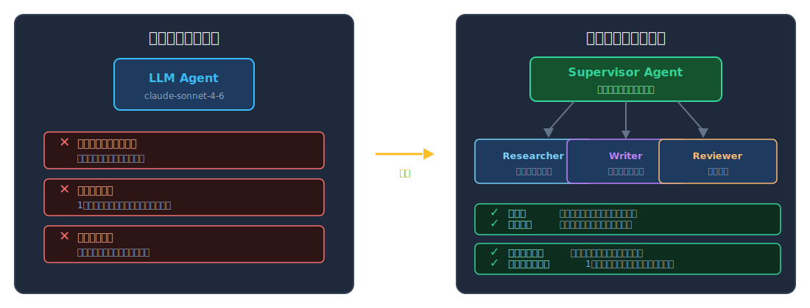
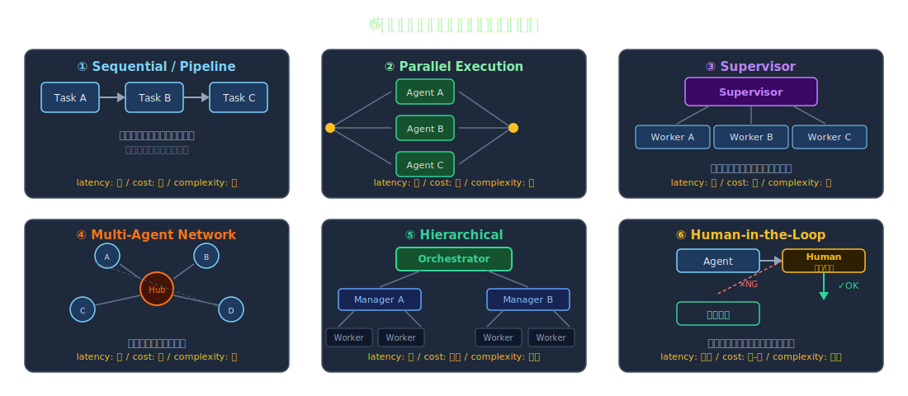
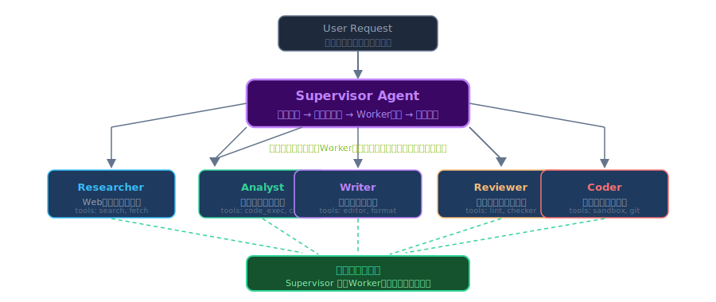
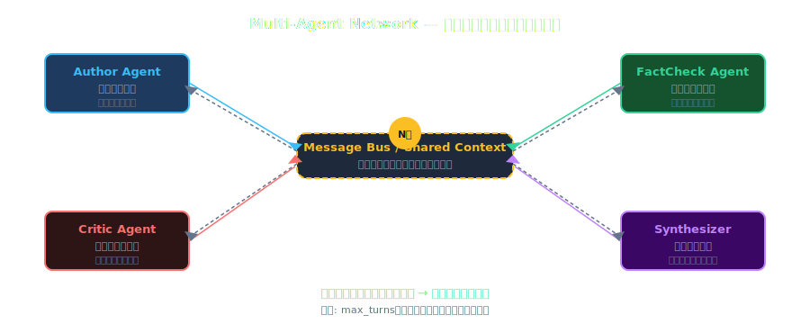
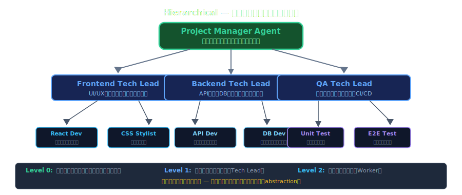
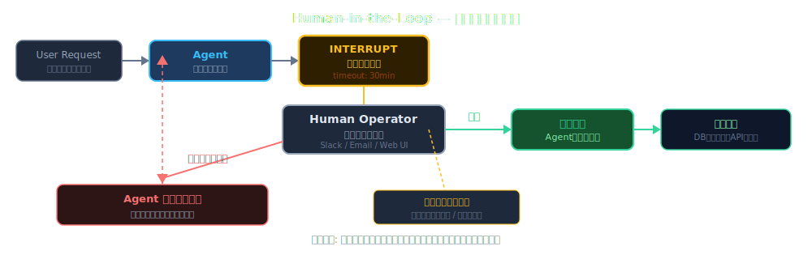
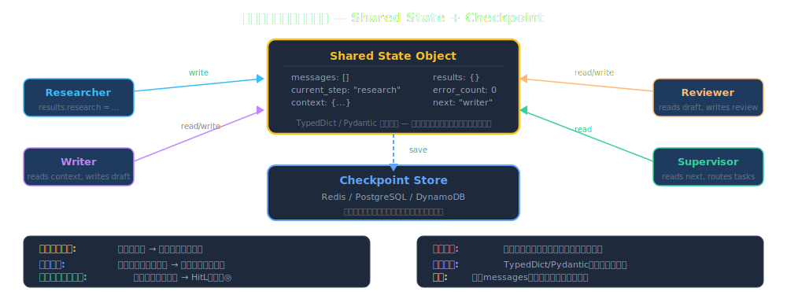
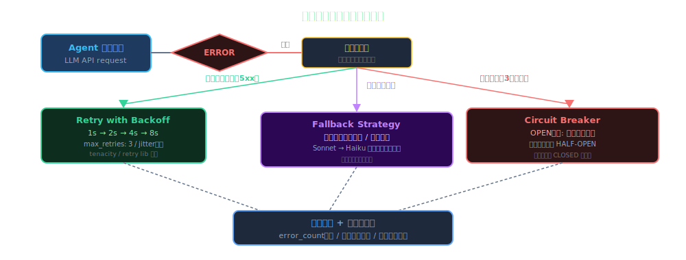
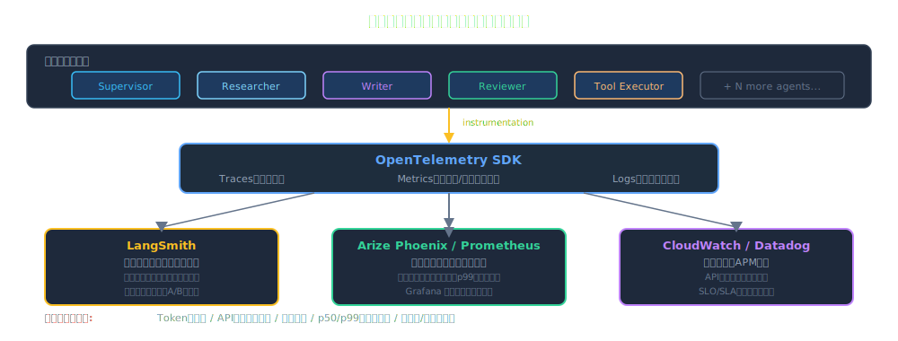
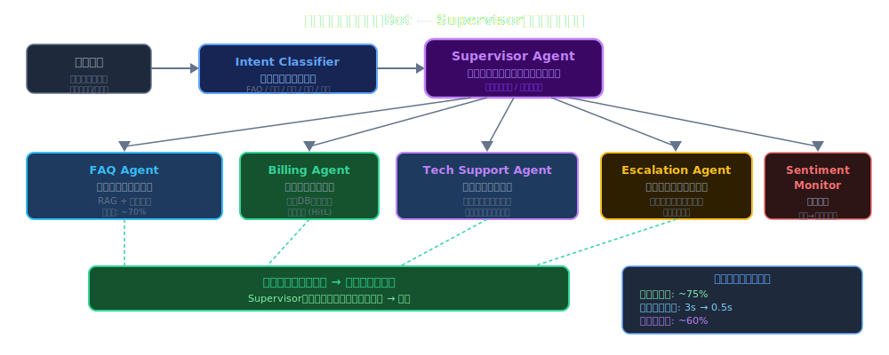

<!-- _class: lead -->
# AIエージェント・オーケストレーション 実践ワークショップ

- エンジニアリングマネージャー・テックリード向け
- 複数AIエージェントの協調設計から本番運用まで
- 2026年2月 | 60分


---

# アジェンダ (1/2)

- **1. イントロダクション** — なぜ今オーケストレーションか（5分）
- **2. オーケストレーションパターン** — Sequential / Parallel / Supervisor / Hierarchical / HitL（15分）
- **3. フレームワーク比較** — LangGraph / AutoGen / CrewAI / Claude SDK（15分）


---

# アジェンダ (2/2)

- **4. 実践的設計パターン** — 状態管理・エラーハンドリング・コスト（10分）
- **5. 本番運用** — モニタリング・セキュリティ・スケーリング（5分）
- **6. ワークショップ演習** — グループワーク・アーキテクチャ設計（10分）


---

# なぜ今、マルチエージェントオーケストレーションか

- 単体LLM呼び出しの限界：コンテキスト長・専門性・直列処理
- **2025年の転換点**: プロダクションレベルのエージェントフレームワークが成熟
- 実証済みユースケース：コード生成・カスタマーサポート・データ分析パイプライン
- テックリードへの影響：アーキテクチャ設計の新しい判断軸が必要


---

# 単体エージェント vs マルチエージェント

- 単体LLMの限界を超える：専門化・並列化・協調



---

<!-- _class: lead -->
# オーケストレーションパターン

- 複数エージェントの協調設計
- パターンを知ることで設計判断が速くなる


---

# 6つのオーケストレーションパターン

- タスク特性と要件に応じたパターン選択が設計の核心



---

# パターン1: Sequential / Pipeline

- **概要**: タスクをA→B→Cと順次処理するチェーン構造
- **典型例**: 文書生成 → 品質チェック → 翻訳 → 要約
- **選ぶとき**: 各ステップの出力が次の入力になる場合
- **注意点**: ボトルネック発生・全体レイテンシ = 各ステップの合計
- **まずここから**: シンプルさと制御性が最も高いパターン


---

# パターン2: Parallel Execution

- **概要**: 互いに依存しないサブタスクを並列処理
- **典型例**: 複数ドキュメントの同時解析・マルチソース情報収集
- **選ぶとき**: タスク間に依存関係がなく、速度優先の場合
- **実装ポイント**: `asyncio.gather()` または `Promise.all()` パターン
- **注意点**: 結果の集約（aggregation）ロジックの設計が重要


---

# パターン3: Supervisor / Orchestrator

- **最も汎用的なパターン** — まず検討すべき構成
- Supervisorが意図を理解し適切なWorkerに委譲・結果を統合
- 動的ルーティング：タスク内容に応じてWorker選択が変わる



---

# パターン4: Multi-Agent Network

- **概要**: 複数エージェントが相互通信・協調する分散型
- 複数の専門エージェントが議論・レビュー・検証し合う
- 集合知による高品質な出力（ピアレビュー・ディベート型）



---

# パターン5: Hierarchical（入れ子型）

- **概要**: エージェントが別のエージェントチームをサブエージェントとして持つ
- 大規模タスクを担当ManagerとWorkerチームに分割して処理
- 例：ソフトウェア開発エージェント（PM → Tech Lead → Dev Team）



---

# パターン6: Human-in-the-Loop

- **概要**: 重要判断ポイントで人間が介入・承認するハイブリッド設計
- 高リスク操作・コンプライアンス・曖昧なケースをカバー
- 実装：interrupt点の設計 + 非同期待機 + タイムアウト処理



---

# パターン選択ガイド

- **Sequential**: ステップが明確 & シンプルさ優先 → まずここから
- **Parallel**: タスクが独立 & レイテンシ削減が重要 → スループット最大化
- **Supervisor**: 動的ルーティングが必要 & 汎用性重視 → 最も実用的
- **Multi-agent**: 品質重視 & コスト許容 → ピアレビュー型
- **Hierarchical**: 大規模複合タスク & チーム構造を反映したい
- **HitL**: 高リスク判断 & コンプライアンス要件あり → 必須パターン


---

# Tool Use & Function Calling

- エージェントが外部システムを呼び出す核心メカニズム
- **ツールの種類**: 検索・コード実行・DB操作・API呼び出し・ファイル操作
- **設計原則**: 単一責任・冪等性・タイムアウト設定・明確なエラーメッセージ
- **セキュリティ**: 実行権限の最小化・入力バリデーション・サンドボックス実行


---

# 状態管理の重要性

- **なぜ難しいか**: LLMはステートレス・コンテキスト有限・エラー回復が必要
- **設計判断**: インメモリ（高速・揮発）vs 永続化DB（耐障害性・再開可能）
- **チェックポイント**: 長時間タスクは途中状態を保存して中断・再開を可能に
- **共有状態**: 複数エージェントがアクセスする状態には排他制御を設計
- **状態スキーマ**: TypedDictやPydanticで状態の形式を厳密定義する


---

# エラーハンドリング戦略

- **Retry with backoff**: 一時的エラーには指数バックオフでリトライ
- **Fallback agent**: プライマリエージェント失敗時のフォールバック戦略
- **Graceful degradation**: 部分失敗時も可能な範囲で結果を返す
- **エラー伝播の制御**: 下位エラーを上位に伝播させるか吸収するか
- **Circuit breaker**: 連続失敗時にエージェント呼び出しを一時停止


---

<!-- _class: lead -->
# フレームワーク比較

- LangGraph / AutoGen / CrewAI / Claude Agent SDK
- 選択基準と実装の違いを理解する


---

# フレームワーク選択の判断軸

- **制御性**: グラフ定義 vs 会話型 vs ロールベース
- **可観測性**: トレーシング・ログ・デバッグのしやすさ
- **エコシステム**: LangChain統合・ベクトルDB・ツールライブラリ
- **スケーラビリティ**: 非同期・並列実行・マルチモデル対応
- **学習コスト**: チームの習熟曲線・ドキュメント品質


---

# LangGraph — 概要と特徴

- **設計思想**: 状態機械（State Machine）ベースの明示的グラフ定義
- **強み**: 複雑なワークフロー・循環処理・条件分岐の厳密な制御
- **統合**: LangChain / LangSmith エコシステムとのシームレスな連携
- **採用シーン**: 状態遷移が明確・チェックポイントが必要・HitLフロー
- **注意点**: 学習曲線がやや高い・小規模ならover-engineering


---

# LangGraph — コード例

- 状態グラフの定義とノード登録
- 条件付きエッジで動的ルーティングを実現


---

# LangGraph — コード例（コード例）

```python
from langgraph.graph import StateGraph, END
from typing import TypedDict

class AgentState(TypedDict):
    messages: list[dict]; next: str

graph = StateGraph(AgentState)
graph.add_node("researcher", research_agent)
graph.add_node("writer", writer_agent)
graph.add_conditional_edges("supervisor", route_next,
    {"researcher": "researcher", "writer": "writer", END: END})
app = graph.compile(checkpointer=MemorySaver())
```


---

# AutoGen — 概要と特徴

- **設計思想**: エージェント間の会話（Conversation）を中心とした設計
- **強み**: マルチエージェントの会話・Human Proxy・コード自動実行
- **AutoGen v0.4+**: Actor Modelベースに刷新・非同期ファーストアーキテクチャ
- **採用シーン**: ペアプロ型・コードレビュー・インタラクティブな問題解決
- **注意点**: 会話が長くなるとコスト増大・制御フローが不明瞭になりやすい


---

# AutoGen — コード例

- AssistantAgentとUserProxyAgentの会話フロー
- コード実行エージェントの登録と起動


---

# AutoGen — コード例（コード例）

```python
import autogen

config = [{"model": "claude-sonnet-4-6", "api_key": "..."}]
assistant = autogen.AssistantAgent(
    name="assistant", llm_config={"config_list": config})
user_proxy = autogen.UserProxyAgent(
    name="user_proxy",
    human_input_mode="NEVER",
    code_execution_config={"work_dir": "coding"})
user_proxy.initiate_chat(
    assistant, message="Write a Python web scraper")
```


---

# CrewAI — 概要と特徴

- **設計思想**: 役割（Role）・目標（Goal）・背景（Backstory）でエージェントを定義
- **強み**: 直感的なロールベース設計・タスク定義がシンプル・高い可読性
- **Crew構成**: Agent + Task + Crew + Process（sequential/hierarchical）
- **採用シーン**: プロトタイプ・小中規模チーム型タスク・非技術者との協働
- **注意点**: 複雑な状態管理・条件分岐には不向き


---

# CrewAI — コード例

- Role/Goal/Backstoryでエージェントを宣言的に定義
- Processで実行順序を制御


---

# CrewAI — コード例（コード例）

```python
from crewai import Agent, Task, Crew, Process

researcher = Agent(role="Tech Researcher",
    goal="Research AI frameworks", tools=[search_tool])
writer = Agent(role="Tech Writer",
    goal="Write clear documentation")
task1 = Task(description="Compare LangGraph vs AutoGen",
    agent=researcher, expected_output="Comparison report")
task2 = Task(description="Write blog post from research",
    agent=writer, expected_output="Blog post in Markdown")
crew = Crew([researcher, writer], [task1, task2],
    process=Process.sequential)
crew.kickoff()
```


---

# Claude Agent SDK — 概要と特徴

- **設計思想**: Anthropicが提供する公式エージェント構築SDK
- **強み**: Claude統合・シンプルなAPI・ツール定義の明確さ
- **特徴**: Computer Use・Prompt Caching・Batches API との統合
- **採用シーン**: Claude最大活用・シンプルなツール使用エージェント・PoC
- **注意点**: マルチモデル対応なし・エコシステムはまだ成長途上


---

# Claude Agent SDK — コード例

- ツール定義とエージェントループの実装
- tool_useコンテンツブロックを処理するシンプルなパターン


---

# Claude Agent SDK — コード例（コード例）

```python
import anthropic
client = anthropic.Anthropic()
tools = [{"name": "web_search", "description": "Search the web",
    "input_schema": {"type": "object",
        "properties": {"query": {"type": "string"}},
        "required": ["query"]}}]
messages = [{"role": "user", "content": "Research AI trends 2026"}]
while True:
    resp = client.messages.create(model="claude-sonnet-4-6",
        max_tokens=4096, tools=tools, messages=messages)
    if resp.stop_reason != "tool_use":
        print(resp.content[0].text); break
    messages = process_tool_calls(resp, messages)
```


---

# フレームワーク比較表

- **LangGraph**: 制御性◎ / 複雑フロー○ / 学習コスト高 / LangChain統合
- **AutoGen**: 会話型○ / コード実行◎ / 柔軟性○ / Microsoft製
- **CrewAI**: 直感性◎ / ロールベース○ / 小中規模向け / 学習コスト低
- **Claude SDK**: シンプル◎ / Claude特化 / PoC向け / 公式サポート
- **選択のポイント**: チームスキル × ユースケース複雑度 × 運用コスト


---

# ユースケース別フレームワーク選択

- **コード生成・レビュー** → AutoGen（HumanProxy + コード自動実行）
- **データ分析パイプライン** → LangGraph（明確な状態遷移・チェックポイント）
- **コンテンツ生成チーム** → CrewAI（ロールベース・可読性高）
- **カスタマーサポートBot** → Supervisor + Claude SDK（シンプル・統合容易）
- **研究・調査エージェント** → LangGraph（条件分岐・ループ制御）


---

# コスト・スケーラビリティ比較

- **最大のコストドライバー**: エージェント間のコンテキスト引き回しとトークン数
- **Parallel実行**: トークンコストは増えるが wall-clock time を削減できる
- **プロンプトキャッシュ活用**: 共通system promptのキャッシュで最大60%削減
- **モデル分担戦略**: 軽タスクはHaiku・重タスクはSonnet/Opusで使い分け
- **コスト管理**: トークン使用量のメトリクス収集とアラート設定が必須


---

<!-- _class: lead -->
# 実践的設計パターン・本番運用

- 設計原則からモニタリング・セキュリティまで
- 本番環境で生き残るアーキテクチャの作り方


---

# 設計原則1: Single Responsibility

- **1エージェント = 1つの明確な責務**
- 悪い例：「なんでもできるエージェント」はデバッグ不能になる
- 良い例：Researcher / Analyzer / Writer / Reviewer を分離
- **インターフェース設計**: 入出力スキーマをZod/Pydanticで厳密定義
- **テスタビリティ**: 各エージェントを独立してユニットテスト可能に


---

# 設計原則2: Observability First

- **「見えないシステムは直せない」** — エージェントでは特に顕著
- 各LLM呼び出しにトレースID・ラベル・入出力ログを付与
- **トレーシング**: LangSmith / Arize Phoenix / OpenTelemetry
- **構造化ログ**: JSON形式でスパン・エージェント名・コスト・レイテンシを記録
- PoC段階からObservabilityを組み込む（後付けは困難）


---

# 状態管理アーキテクチャ

- エージェント間の状態共有とチェックポイント設計



---

# 非同期・並列実行の設計

- **Fan-out/Fan-in パターン**: 親タスクを並列に展開し結果を集約
- **非同期キュー活用**: 長時間タスクはメッセージキュー経由で処理
- **競合制御**: 同一リソースへの並列アクセスにはロックまたはSemaphore
- **タイムアウト設計**: 各エージェント呼び出しに最大待機時間を設定
- **結果の整合性**: 並列処理後の集約ロジックで重複・矛盾を検出


---

# ツール設計のベストプラクティス

- **冪等性**: 同じ入力で同じ結果・リトライ安全な設計
- **明確なエラーメッセージ**: エラー時にエージェントが次の行動を取れる情報を含める
- **入力バリデーション**: JSON Schemaで型・範囲・必須項目を厳密定義
- **タイムアウト**: 全外部呼び出しにタイムアウト設定（5-30秒が目安）
- **ドライランモード**: 本番操作前にwhat-ifシミュレーションを挟む設計


---

# エラーリカバリーパターン

- 障害発生時の回復戦略と自動修正フロー



---

# コスト最適化戦略

- **プロンプトキャッシュ**: system promptをキャッシュして最大60%コスト削減
- **モデル階層化**: ルーティングでHaiku→Sonnet→Opusの段階利用
- **バッチ処理**: 緊急性の低いタスクはBatches API（50%コスト削減・24h SLA）
- **コンテキスト圧縮**: 長い会話履歴を要約して渡すトークン数削減
- **コスト予算アラート**: Anthropic APIの使用量をCloudWatchで監視


---

# モニタリング・可観測性

- 本番エージェントシステムの計測設計



---

# デバッグ手法

- **ローカル再現**: 問題のあるトレースIDからリクエストを完全再現
- **ステップ実行**: エージェントを1ステップずつ実行して状態を確認
- **プロンプトインスペクション**: 実際のプロンプトとレスポンスをログ出力
- **LangSmith/Arize**: 失敗トレースのフィルタリングとビジュアル分析
- **Mock Tools**: 外部依存をモック化してエージェントロジックだけをテスト


---

# セキュリティ考慮事項

- **Prompt Injection対策**: 外部入力のサニタイズ・ロールの明確分離
- **最小権限原則**: エージェントのツール実行権限は必要最小限に
- **サンドボックス実行**: コード実行エージェントはコンテナ・VM隔離必須
- **秘匿情報管理**: APIキー・認証情報はシークレットマネージャーで管理
- **出力検証**: エージェント出力を本番システムに渡す前にバリデーション


---

# スケーリング戦略

- **水平スケーリング**: ステートレスなエージェントワーカーをコンテナで水平展開
- **キュー + ワーカープール**: 非同期キューでリクエスト平準化
- **レートリミット管理**: Anthropic APIの TPM/RPM 制限をキューで吸収
- **キャッシュ戦略**: 同一クエリのエージェント実行結果をRedisでキャッシュ
- **コールドスタート対策**: ウォームアッププールでレイテンシスパイクを抑制


---

# 実際のアーキテクチャ例: カスタマーサポートBot

- Supervisor + 専門エージェント群による問い合わせ対応システム



---

# 実際のアーキテクチャ例: コード生成パイプライン

- **要件分析 → 設計 → 実装 → テスト → レビュー の自動化パイプライン**
- Planner Agent: タスク分解・依存関係解析
- Implementer Agents: 並列コード生成（ファイル単位）
- Test Agent: ユニットテスト自動生成・実行
- Review Agent: コードレビュー・セキュリティチェック
- Integrator Agent: PR作成・CI/CDトリガー


---

# アンチパターン集

- ❌ **God Agent**: 1つのエージェントに全機能を詰め込む → 単一責任で分割
- ❌ **無限ループ**: エージェント間の循環参照 → max_turns設定と終了条件の明確化
- ❌ **コンテキスト汚染**: 長い会話履歴をそのまま渡し続ける → 定期的な要約・リセット
- ❌ **ブラックボックス運用**: ログなしで本番運用 → Observability Firstを徹底
- ❌ **過剰エンジニアリング**: 単純タスクにHierarchical構成 → まずSequentialから


---

<!-- _class: lead -->
# ワークショップ演習

- グループで考える・議論する・設計する
- 3つの演習（各3-4分）


---

# 演習1: パターン選択

- **シナリオ**: Eコマースの商品説明文を自動生成するシステムを設計する
- 入力: 商品スペック・カテゴリ・ターゲット顧客
- 処理: 調査 → 競合分析 → 下書き → 校正 → SEO最適化
- **グループで議論**: どのオーケストレーションパターンを使うか？その理由は？
- ヒント: ステップの依存関係と並列化できる箇所を特定してみましょう


---

# 演習2: フレームワーク選択

- **シナリオ**: 社内ナレッジベースQAシステムを3ヶ月で開発・運用開始する
- チーム: Python経験者3名、LLMは初めて、運用チームなし
- 要件: 社内文書検索・回答生成・引用元明示・HitL承認フロー
- **グループで議論**: どのフレームワークを選ぶか？チームの習熟曲線は？
- ヒント: 開発速度 vs 長期保守性 のトレードオフを考えてみましょう


---

# 演習3: アーキテクチャ設計

- **シナリオ**: 月次財務レポートを自動生成するエージェントシステムを設計
- 入力: 複数DB・スプレッドシート・前月レポート
- 出力: CFO向けサマリー + 部門別詳細レポート + アラート
- **グループで設計**: エージェント構成図をホワイトボードに書いてみましょう
- 考慮点: 精度・コスト・HitLポイント・エラーハンドリング


---

# 演習まとめ・ディスカッション

- 各グループの設計を共有・フィードバック
- **共通の落とし穴**: シンプルすぎる vs 複雑すぎる設計のバランス
- **実際のプロジェクトでは**: まずSequentialで動かし、ボトルネックを計測してから並列化
- **次のステップ**: PoC → 小規模本番 → 段階的スケールアップ


---

<!-- _class: lead -->
# 本日のまとめ

- **パターン理解が設計判断を加速する** — 6パターンを状況に応じて選択・組み合わせ
- **Supervisor構成が最も汎用的** — まずここから始め、必要に応じて拡張
- **Observability Firstで本番を生き残る** — 見えないシステムは直せない
- **コスト管理を最初から設計に組み込む** — プロンプトキャッシュ・モデル階層化
- **まずシンプルに動かす** — 過剰エンジニアリングは敵


---

# 参考資料・さらに学ぶために

- **公式ドキュメント**
- [LangGraph Documentation](https://langchain-ai.github.io/langgraph/)
- [Microsoft AutoGen v0.4](https://microsoft.github.io/autogen/)
- [CrewAI Documentation](https://docs.crewai.com/)
- [Anthropic Claude SDK & Agents](https://docs.anthropic.com/en/docs/agents)
- **推薦論文**: ReAct (Yao et al. 2022) / AgentBench (Liu et al. 2023)

