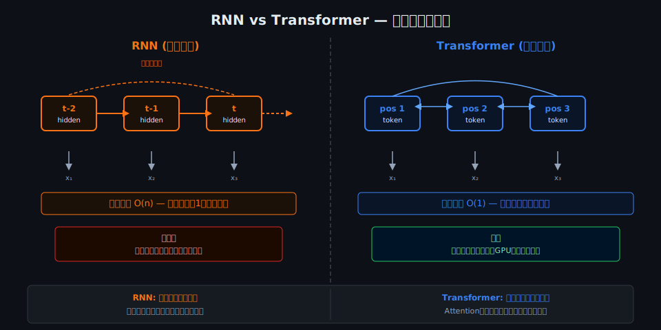
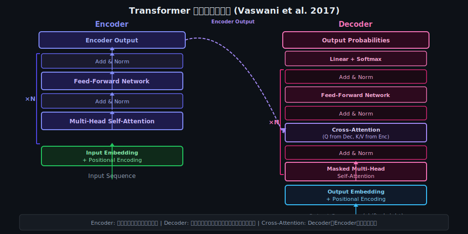
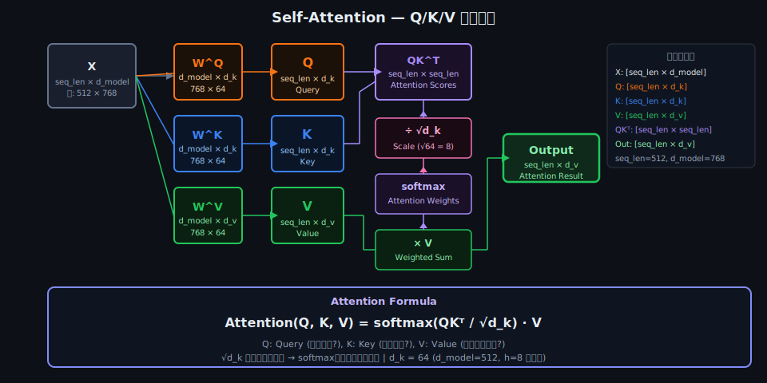
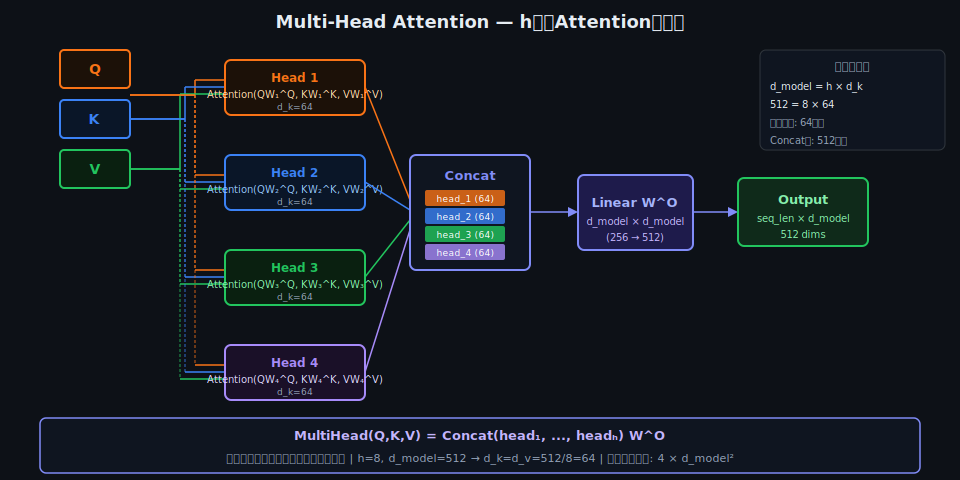
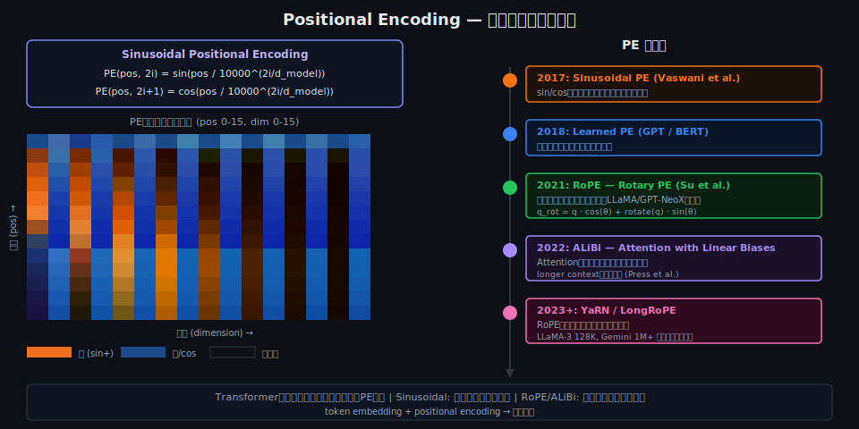
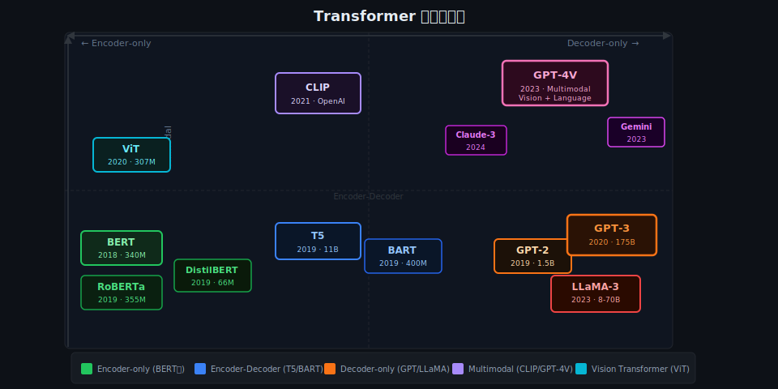
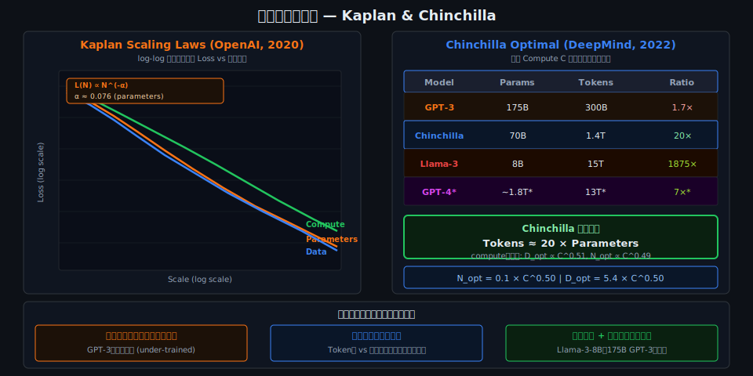
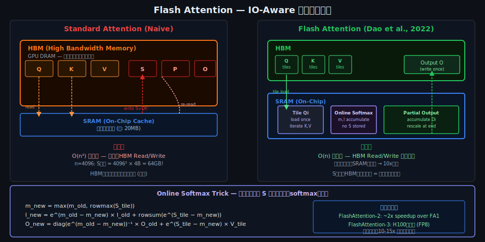
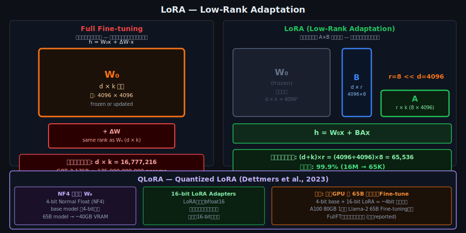

<!-- _class: lead -->
# AI Transformer 完全ガイド 2026

- アーキテクチャから最新研究まで
- 
- **対象**: テックリード・アーキテクト
- **レベル**: 数式・実装・応用を網羅
- 
- *Vaswani et al. 2017 「Attention Is All You Need」から現在まで*


---

# このプレゼンテーションについて

- **目標**: Transformerを「なぜそうなっているか」まで理解する
- **前提知識**: 行列演算・微分の基礎、深層学習の概念
- 
- **カバー範囲**:
- - アーキテクチャの数学的基盤（Q/K/V、Attention、LayerNorm）
- - 主要変種（GPT / BERT / T5 / ViT / MoE）の設計思想
- - スケーリング則と効率化技術（Flash Attention / LoRA / QLoRA）
- - Fine-tuning・Alignmentパイプライン（RLHF / DPO）
- - 最新研究動向（Mamba / o1 / Multimodal）


---

# アジェンダ

- 1. **Transformer以前の世界** — RNN/LSTMの限界
- 2. **アーキテクチャ全体像** — Encoder-Decoder構造
- 3. **Self-Attention深掘り** — Q/K/V・数式・O(n²)
- 4. **Positional Encoding** — Sinusoidal・RoPE・ALiBi
- 5. **FFN・正規化・残差接続** — 数式詳解
- 6. **主要変種** — GPT/BERT/T5/ViT/MoE系譜
- 7. **スケーリング則** — Kaplan・Chinchilla法則
- 8. **効率化技術** — Flash Attention・KV Cache・LoRA
- 9. **Fine-tuning & Alignment** — RLHF・DPO
- 10. **実装・デプロイ** — HuggingFace・vLLM
- 11. **最新研究動向** — Mamba・Reasoning・Multimodal
- 12. **まとめ & 参考文献**


---

<!-- _class: lead -->
# Chapter 2: Transformer以前の世界

- RNN / LSTM / Seq2Seq の限界と
- 「Attention Is All You Need」誕生の背景


---

# RNN — 逐次処理モデルの仕組み

- **基本式**: `h_t = tanh(W_h × h_{t-1} + W_x × x_t + b)`
- 
- - 隠れ状態 h_t が「記憶」を担う
- - 時刻 t の出力は t-1 の状態に依存（逐次依存）
- - **LSTM**: ゲート機構（input/forget/output gate）で長期記憶を改善
-   - `f_t = σ(W_f [h_{t-1}, x_t] + b_f)` (forget gate)
-   - `c_t = f_t × c_{t-1} + i_t × g_t` (cell state)
- - **GRU**: LSTMの簡略版（reset/update gate）


---

# Seq2Seq + Bahdanau Attention (2015)

- **Seq2Seq**: Encoder RNN → context vector → Decoder RNN
- 
- **問題**: ボトルネック — 全情報を1つのベクトルに圧縮
- 
- **Bahdanau Attention（2015年）の革新**:
- - Decoderの各ステップでEncoderの全隠れ状態を参照
- - アライメントスコア: `e_{ij} = a(s_{i-1}, h_j)`
- - Attention重み: `α_{ij} = exp(e_{ij}) / Σ exp(e_{ik})`
- - Context vector: `c_i = Σ α_{ij} × h_j`
- - これが「Attention」の起源 — Transformerに結実


---

# RNNの3つの根本的限界

- **① 逐次処理 → GPUの並列化を活かせない**
- - 時刻 t は t-1 が終わらないと計算できない
- - 系列長N で O(N) の直列ステップ
- 
- **② 長距離依存の困難**
- - 離れた位置の情報が隠れ状態を「伝搬」する間に希薄化
- - LSTMで緩和されるが根本解決にはならない
- 
- **③ 勾配消失 / 爆発**
- - Back-Propagation Through Time (BPTT) で:
- - `∂L/∂h_1 = ∏_{t=1}^{T} ∂h_t/∂h_{t-1}`
- - `|λ| < 1` → 指数的消失 / `|λ| > 1` → 指数的爆発


---

# 勾配消失の数学的詳細

- **BPTT における勾配の積**:
- ```
- ∂L/∂W = Σ_t ∂L_t/∂W
- ∂L_t/∂h_1 = (∂h_t/∂h_{t-1}) × ... × (∂h_2/∂h_1)
-            = ∏_{k=2}^{t} diag(σ'(W_h h_{k-1} + ...)) × W_h
- ```
- **問題**: `W_h` の最大固有値 `|λ_max|`
- - `|λ_max| < 1`: 勾配 → 0（長期依存が学習できない）
- - `|λ_max| > 1`: 勾配 → ∞（学習が発散）
- 
- **LSTM の部分的解決**:
- - Cell state `c_t` に加算ベースの更新（乗算でなく）
- - `c_t = f_t ⊙ c_{t-1} + i_t ⊙ g_t` → 勾配ハイウェイ
- - **それでも** 長い系列では勾配が薄れる


---

# "Attention Is All You Need" (2017) の衝撃

- **Vaswani et al., Google Brain / Google Research (2017)**
- 
- **革命的提案**: RNNを完全に排除し、Attentionのみで構成
- 
- **解決した問題**:
- - 全トークン間の直接接続 → 長距離依存をO(1)で学習
- - 完全並列計算 → 学習時間の劇的短縮
- - 訓練可能なAttention重み → 柔軟な「参照」パターン
- 
- **インパクト**:
- - 2018: BERT（Google） / GPT（OpenAI）
- - 2019: T5 / GPT-2 / RoBERTa
- - 2020: GPT-3（175B）/ ViT
- - 2022〜: ChatGPT / GPT-4 / LLaMA / Claude


---

# RNN vs Transformer — 並列処理の本質的違い




---

<!-- _class: lead -->
# Chapter 3: Transformerアーキテクチャ全体像

- Encoder-Decoder構造・Tokenization・Embedding・
- 行列次元の追跡


---

# Transformerアーキテクチャ全体図




---

# Tokenization — テキストを数値列に変換

- **Tokenizationの種類**:
- - **Word-level**: 単語単位（OOV問題あり）
- - **Character-level**: 文字単位（系列が長くなりすぎる）
- - **BPE (Byte-Pair Encoding)**: GPT系が採用
-   - 頻出ペアを繰り返しマージして語彙を構築
- - **WordPiece**: BERT系が採用（BPEの変種）
- - **SentencePiece**: 言語非依存（LLaMA等）
- 
- **語彙サイズ (|V|)**:
- - GPT-2/3: 50,257 / GPT-4: ~100K / LLaMA: 32K
- - Token ID → 整数インデックスでEmbedding lookupに利用


---

# Input Embedding — トークンをベクトル空間へ

- **Embedding行列**: `E ∈ ℝ^{|V| × d_model}`
- 
- - Token ID `i` → `E[i, :] ∈ ℝ^{d_model}` (d_model次元ベクトル)
- - 典型的な値: `d_model = 512` (原論文) / `768` (BERT-base) / `4096` (LLaMA-7B)
- 
- **スケーリング**:
- - 原論文: `Embedding × √d_model` でスケール
- - 理由: Positional EncodingとEmbeddingのスケールを揃える
- 
- **行列次元追跡 (sequence length = n, batch = B)**:
- - Input: `[B, n]` (token IDs)
- - After Embedding: `[B, n, d_model]`
- - After PE addition: `[B, n, d_model]`


---

# Encoderブロックの詳細

- **Encoderブロック（×N層）の構造**:
- 
- ```
- Input x ∈ ℝ^{n × d_model}
-   ↓
- x' = LayerNorm(x)            # Pre-Norm (modern)
-   ↓
- attn = MultiHeadAttention(x', x', x')  # self-attention
-   ↓
- x = x + attn                 # Residual connection
-   ↓
- x' = LayerNorm(x)            # Pre-Norm
-   ↓
- ffn = FFN(x')                # Feed-Forward
-   ↓
- x = x + ffn                  # Residual connection
- ```
- 
- 原論文(Post-Norm): LayerNormが残差加算の後


---

# Decoderブロックの詳細

- **Decoderブロック（×N層）の追加機構**:
- 
- - **Masked Self-Attention**: 未来のトークンを参照禁止
-   - Attention maskで上三角を `-∞` に設定
-   - `softmax` 後に 0 になり影響ゼロ
- 
- - **Cross-Attention (Encoder-Decoder Attention)**:
-   - `Q`: Decoderの前層出力
-   - `K, V`: **Encoderの最終出力**（固定）
-   - DecoderがEncoderの情報を参照するゲートウェイ
- 
- - **Causal Language Modeling (GPT)**:
-   - Decoder-onlyではCross-Attentionを省略
-   - Masked Self-Attentionのみで自回帰生成


---

# 行列次元の完全追跡 (d_model=512, h=8, n=10)

- **入力から出力まで次元を追う**:
- ```
- Input tokens:        [B, n=10]
- After Embedding:     [B, 10, d_model=512]
- After PE:            [B, 10, 512]
- 
- # Multi-Head Attention (h=8, d_k = d_v = d_model/h = 64)
- WQ, WK, WV:          [512, 64] × 8 heads
- Q, K, V per head:    [B, 10, 64]
- Attention scores:    [B, 10, 10]  ← n×n matrix
- Attention output:    [B, 10, 64] × 8 heads
- After Concat:        [B, 10, 512]
- After W^O:           [B, 10, 512]
- 
- # Feed-Forward (d_ff = 2048 = 4 × d_model)
- After FFN:           [B, 10, 512]
- ```


---

<!-- _class: lead -->
# Chapter 4: Self-Attention 深掘り

- Q/K/V 行列演算 · Scaled Dot-Product · Multi-Head ·
- √d_k スケーリング · Attention Entropy · O(n²)問題


---

# Attentionの直感 — 「どこに注目するか」

- **日本語の例**: 「銀行に行った。そこで手続きした。」
- - 「そこ」を処理するとき → 「銀行」に高いAttention
- 
- **Transformerでの実現**:
- - 各トークンが「何を探しているか」= **Query (Q)**
- - 各トークンが「何を持っているか」= **Key (K)**
- - 各トークンが「実際の情報」= **Value (V)**
- 
- **例えると**:
- - Query = 「図書館で科学書を探している」
- - Key = 書籍の背表紙タイトル
- - Value = 書籍の実際の内容
- - マッチ度（Q·K）が高い本の内容（V）を多く取り込む


---

# Q/K/V 行列演算の可視化




---

# Q/K/V 投影 — 線形変換の数式

- **入力 X ∈ ℝ^{n × d_model} から Q, K, V を生成**:
- 
- `Q = X W^Q`  ← `W^Q ∈ ℝ^{d_model × d_k}`
- `K = X W^K`  ← `W^K ∈ ℝ^{d_model × d_k}`
- `V = X W^V`  ← `W^V ∈ ℝ^{d_model × d_v}`
- 
- **結果の次元**:
- - `Q, K ∈ ℝ^{n × d_k}`
- - `V ∈ ℝ^{n × d_v}`
- - 通常: `d_k = d_v = d_model / h` (h = head数)
- 
- **重要**: Q/K/Vは「同じ入力Xから異なる投影」
- → Self-Attentionと呼ばれる所以（自分自身への注意）


---

# Scaled Dot-Product Attention — 完全な数式

- **定義** (Vaswani et al. 2017, Eq. 1):
- 
- ## `Attention(Q, K, V) = softmax(QK^T / √d_k) V`
- 
- **各ステップの意味**:
- 1. `QK^T ∈ ℝ^{n × n}`: 全トークン対のスコア（類似度行列）
- 2. `/ √d_k`: スケーリング（後述）
- 3. `softmax(...)`: 各行を確率分布に正規化
-    - `softmax(x_i) = exp(x_i) / Σ_j exp(x_j)`
- 4. `× V`: 価値ベクトルの加重平均
- 
- **出力**: `∈ ℝ^{n × d_v}` — 各位置の「文脈を考慮した表現」


---

# √d_k スケーリングの数学的根拠

- **なぜ √d_k で割るのか？**
- 
- **仮定**: `q, k` の各要素が平均0、分散1の独立な確率変数
- 
- **内積 q·k の分散**:
- - `Var(q·k) = Var(Σ_{i=1}^{d_k} q_i k_i) = d_k`
- - → 標準偏差 = **√d_k**
- 
- **問題**: `d_k` が大きいほどdot productの値が大きくなる
- → `softmax` に大きな値が入ると勾配が消失
- 
- **softmax飽和**: `softmax([10, -10, ...]) ≈ [1, 0, ...]`
- → 勾配がほぼゼロ → 学習が止まる
- 
- **解決**: `/ √d_k` で分散を1に正規化 → 安定した勾配


---

# Softmax温度と注意分布

- **Softmax温度パラメータ τ の影響**:
- 
- `softmax(QK^T / τ)` — τ = √d_k が標準
- 
- - **τ → 0** (温度低): 分布がシャープ → 少数のトークンに集中
-   - `softmax([10, 9, 8] / 0.1) ≈ [0.997, 0.003, 0.000]`
- 
- - **τ → ∞** (温度高): 分布が均一 → 全トークンに等分
-   - `softmax([10, 9, 8] / 100) ≈ [0.34, 0.33, 0.33]`
- 
- **Attention Entropy**:
- - `H = -Σ_i α_i log(α_i)`
- - 高エントロピー: 広い文脈参照（一般的な単語）
- - 低エントロピー: 特定の単語に集中（固有名詞・代名詞解決）
- - ヘッドによって異なるパターン → Multi-Headの意義


---

# Multi-Head Attention の可視化




---

# Multi-Head Attention — 数式と設計思想

- **定義**:
- `MultiHead(Q,K,V) = Concat(head_1, ..., head_h) W^O`
- 
- `head_i = Attention(Q W_i^Q, K W_i^K, V W_i^V)`
- 
- **パラメータ数 (d_model=512, h=8)**:
- - 各ヘッド: `W_i^Q, W_i^K, W_i^V ∈ ℝ^{512×64}`
- - `W^O ∈ ℝ^{512×512}` (Concat後の投影)
- - 計算コスト: Single-head と同等（実装上の工夫）
- 
- **なぜ複数ヘッドか？**
- - 各ヘッドが異なる「注目パターン」を学習
-   - Head 1: 構文依存関係 / Head 2: 照応解決
-   - Head 3: 近傍文脈 / Head 8: 意味的類似性
- - 単一ヘッドでは表現力が限られる


---

# Masked Self-Attention — 因果マスク

- **Decoder（GPT系）での必須制約**: 未来は見えない
- 
- ```python
- # Causal mask: n×n の上三角を -inf に
- def causal_mask(n):
-     mask = torch.triu(torch.ones(n, n), diagonal=1)
-     return mask.masked_fill(mask == 1, float('-inf'))
- 
- # Attention score に加算
- scores = (Q @ K.transpose(-2,-1)) / math.sqrt(d_k)
- scores = scores + causal_mask(n)  # 上三角が -inf
- attn = F.softmax(scores, dim=-1)  # -inf → 0
- ```
- 
- **直感**: トークン `t` は `t'≤t` のトークンのみ参照可能
- → 自回帰生成（1トークンずつ順番に生成）が成立


---

# O(n²) の問題 — コンテキスト長の壁

- **Self-Attentionの計算量・メモリ量**:
- 
- - **計算量**: `O(n² × d_model)` — QK^T は n×n 行列
- - **メモリ**: `O(n²)` — Attention行列の保存
- 
- **具体的な限界**:
- - n=1K: Attention行列 = 1M要素 → 問題なし
- - n=8K: 64M要素 → GPU VRAMがボトルネック
- - n=128K: 16B要素 → A100 (80GB) でも直接計算不可
- 
- **2024-2025年の主な解決策**:
- - **Flash Attention**: IO-Aware算法でメモリO(n)に
- - **Sliding Window (Mistral)**: 局所窓で O(n×w)
- - **Sparse Attention**: 選択的注意でO(n√n)
- - **Mamba/SSM**: O(n)の代替アーキテクチャ


---

<!-- _class: lead -->
# Chapter 5: Positional Encoding 詳解

- Sinusoidal PE · Learned PE · RoPE · ALiBi ·
- 位置情報の数学的表現


---

# なぜ Positional Encoding が必要か

- **Self-Attentionは位置不変 (Permutation Invariant)**
- 
- 入力系列をシャッフルしても Attention値は変わらない:
- `softmax(QK^T / √d_k)V` に順序情報なし
- 
- **問題**: 「猫が犬を追いかけた」と「犬が猫を追いかけた」が同じ表現になる
- 
- **解決策**: 位置情報を埋め込む
- - `x_pos = x_embed + PE(pos)`
- - `PE(pos) ∈ ℝ^{d_model}` — 位置固有のベクトル
- 
- **要件**:
- - 各位置が一意に表現される
- - 相対距離が計算可能
- - 学習データにない長さの系列にも汎化


---

# Sinusoidal PE — 原論文の定式化

- **Vaswani et al. (2017) の定義**:
- 
- `PE(pos, 2i) = sin(pos / 10000^{2i/d_model})`
- `PE(pos, 2i+1) = cos(pos / 10000^{2i/d_model})`
- 
- - `pos`: トークンの位置 (0, 1, 2, ...)
- - `i`: 次元のインデックス (0 ≤ i < d_model/2)
- 
- **設計の意図**:
- - 異なる周波数の sin/cos → 各次元で異なるスケールの位置情報
- - 低インデックス次元: 高周波（細かい位置変化）
- - 高インデックス次元: 低周波（大域的な位置構造）
- 
- **相対位置の表現**:
- `PE(pos+k)` は `PE(pos)` の線形変換 → 相対距離が内積で計算可能


---

# Positional Encoding の可視化




---

# Learned PE と RoPE

- **Learned Positional Embedding (GPT/BERT)**:
- - Sinusoidalの代わりに学習可能な行列 `E_pos ∈ ℝ^{max_len × d_model}`
- - 学習データの位置分布に適応できる
- - 欠点: 学習時より長い系列に汎化しにくい
- 
- **RoPE — Rotary Position Embedding (Su et al. 2021)**:
- - LLaMA / GPT-NeoX / Falcon などが採用
- - 位置情報を**回転行列**として埋め込む
- - `f_q(x_m, m) = R_Θ,m^d W_q x_m`
-   - `R_Θ,m` は位置 m に応じた 2D回転行列のブロック対角
- - **内積が相対位置のみに依存**: `q_m^T k_n ∝ g(x_m, x_n, m-n)`
- - 長い系列への外挿性が良い（YaRN等でさらに改善）


---

# ALiBi と相対位置エンコーディング

- **ALiBi — Attention with Linear Biases (Press et al. 2022)**:
- - Attentionスコアに線形バイアスを加算（PE不要）
- - `softmax(QK^T / √d_k + m × M)`
-   - `M_{ij} = -|i - j|` （相対距離）
-   - `m`: ヘッドごとの異なる傾き（固定超パラメータ）
- - **長文脈への強力な外挿性**: 学習長を超えた推論でも性能維持
- 
- **比較まとめ**:
| 手法 | 学習パラメータ | 外挿性 | 採用例 |
|------|------------|--------|-------|
| Sinusoidal | なし | 中 | 原Transformer |
| Learned PE | あり | 低 | BERT, GPT-2 |
| RoPE | なし | 高 | LLaMA, GPT-NeoX |
| ALiBi | なし | 最高 | BLOOM, MPT |


---

<!-- _class: lead -->
# Chapter 6: FFN・正規化・残差接続

- Feed-Forward Network · GELU/SiLU · LayerNorm ·
- Residual Connection · Pre-Norm vs Post-Norm


---

# Feed-Forward Network — 数式と役割

- **FFNの数式** (2層の全結合層):
- 
- `FFN(x) = max(0, xW_1 + b_1) W_2 + b_2`  (原論文: ReLU)
- 
- **現代の変種**:
- - GELU版: `FFN(x) = GELU(xW_1 + b_1) W_2 + b_2`
- - SwiGLU版: `FFN(x) = (xW_1 ⊙ σ(xW_3)) W_2` (LLaMA採用)
- 
- **次元**: `d_ff = 4 × d_model` (典型的)
- - d_model=512 → d_ff=2048 / d_model=4096 → d_ff=11008 (LLaMA)
- 
- **役割**: 各トークンの表現を非線形に変換
- - Self-Attentionが「どの情報を集めるか」
- - FFNが「集めた情報をどう処理するか」
- - FFNがモデルの「知識」を格納する場所とも言われる


---

# GELU / SiLU 活性化関数

- **GELU (Gaussian Error Linear Unit)**:
- `GELU(x) = x × Φ(x)` — Φ は標準正規分布のCDF
- 近似: `GELU(x) ≈ 0.5x(1 + tanh[√(2/π)(x + 0.044715x³)])`
- - ReLUと異なり x<0 でも小さい勾配が流れる
- - BERT, GPT-2 などが採用
- 
- **SiLU / Swish**:
- `SiLU(x) = x × σ(x)` — σ はシグモイド関数
- - 自己ゲートつき活性化（gating mechanism）
- 
- **SwiGLU (Shazeer 2020)**:
- `SwiGLU(x, W, V) = SiLU(xW) ⊙ (xV)`
- - ゲート付きFFN — PaLM, LLaMA, GPT-4 (推定) が採用
- - ReLU/GELUより一貫して高い性能


---

# Layer Normalization — 安定学習の鍵

- **定義**:
- `LayerNorm(x) = γ × (x - μ) / (σ + ε) + β`
- 
- - `μ = (1/d) Σ_i x_i` — 特徴次元の平均
- - `σ² = (1/d) Σ_i (x_i - μ)²` — 分散
- - `γ, β ∈ ℝ^d` — 学習可能なスケール/シフト
- - `ε`: 数値安定のための小定数（典型: 1e-5）
- 
- **BatchNorm との違い**:
- - BatchNorm: バッチ方向で正規化 → バッチサイズ依存
- - LayerNorm: 特徴次元で正規化 → バッチサイズ非依存
- - 可変長系列・小バッチ → **LayerNormが優れる**
- 
- **RMSNorm (Llama採用)**:
- `RMSNorm(x) = x / RMS(x) × γ`
- `RMS(x) = √(1/d Σ x_i²)` — μ計算を省略、高速


---

# Residual Connection と Pre/Post-Norm

- **Residual Connection (He et al. 2016)**:
- `output = x + SubLayer(x)`
- - 勾配が「飛び越え」て伝播 → 深いネットワークで安定学習
- 
- **Post-Norm (原論文)**:
- `output = LayerNorm(x + SubLayer(x))`
- - 各サブレイヤーの後に正規化
- - 深いモデルでは学習が不安定になりやすい
- 
- **Pre-Norm (現代の標準)**:
- `output = x + SubLayer(LayerNorm(x))`
- - サブレイヤーへの入力を正規化
- - 安定した勾配流 → 大規模モデルで主流
- - GPT-3, LLaMA, PaLM など大規模LLMが採用


---

# Dropout と正則化

- **Dropout** (Srivastava et al. 2014):
- - 訓練時にニューロンをランダムに無効化（確率 p）
- - `Dropout(x)_i = x_i / (1-p)` (活性時のスケール補正)
- - 過学習防止・アンサンブル効果
- 
- **Transformer でのDropout適用箇所**:
- - Attention重み後: `Dropout(softmax(...))`
- - 各サブレイヤーの出力後
- - Embedding後
- 
- **大規模LLMでの傾向**:
- - データが大量にある場合、Dropout不要か効果小
- - GPT-3: `p=0.1` / LLaMA: Dropout なし
- 
- **Weight Decay** (L2正則化) は引き続き有効:
- `L_reg = L + λ Σ ||W||²_F`


---

<!-- _class: lead -->
# Chapter 7: Transformerの主要変種

- GPT / BERT / T5 / ViT / CLIP / MoE —
- 設計思想と使い分け


---

# Decoder-only: GPT系アーキテクチャ

- **GPT (Generative Pre-trained Transformer, OpenAI 2018)**
- 
- **アーキテクチャ**: Decoder-only (Encoder/Cross-Attentionなし)
- **学習目標**: 因果言語モデリング (CLM)
- `L_CLM = -Σ_t log P(x_t | x_{<t}; θ)`
- 
- **訓練**: 次のトークンを予測し続けるだけ
- - BPEトークン化 → Masked Self-Attention × N層
- 
- **スケール進化**:
| モデル | パラメータ | 訓練データ | 年 |
|-------|-----------|-----------|---|
| GPT-1 | 117M | BooksCorpus (4.5GB) | 2018 |
| GPT-2 | 1.5B | WebText (40GB) | 2019 |
| GPT-3 | 175B | 570GB | 2020 |
| GPT-4 | 不明 (推定 ~1T) | 不明 | 2023 |


---

# GPTの学習: 因果言語モデリングとテキスト生成

- **Pre-training**: 次トークン予測
- ```python
- # GPT-2 style inference (HuggingFace)
- from transformers import GPT2LMHeadModel, GPT2Tokenizer
- model = GPT2LMHeadModel.from_pretrained('gpt2')
- tokenizer = GPT2Tokenizer.from_pretrained('gpt2')
- inputs = tokenizer('Attention is all you need', return_tensors='pt')
- output = model.generate(**inputs, max_new_tokens=50,
-                         do_sample=True, temperature=0.8)
- print(tokenizer.decode(output[0]))
- ```
- 
- **Sampling 戦略**:
- - Greedy: `argmax P(x_t | x_{<t})` — 決定論的だが単調
- - Temperature: `P_τ ∝ P^{1/τ}` — 多様性を調整
- - Top-k / Top-p (Nucleus) sampling: 確率上位のみからサンプル
- - Beam Search: 複数候補を同時追跡


---

# Encoder-only: BERT / マスク言語モデリング

- **BERT (Bidirectional Encoder Representations, Google 2018)**
- 
- **設計**: Encoder-only — 両方向のContextを利用
- **学習目標 1 — MLM (Masked Language Model)**:
- - 入力の15%をランダムにマスク: `[MASK]`
- - `L_MLM = -Σ_{i∈masked} log P(x_i | x_{\i}; θ)`
- 
- **学習目標 2 — NSP (Next Sentence Prediction)**:
- - 2文が隣接するか否かを分類 (後に批判・廃止傾向)
- 
- **GPTとの根本的違い**:
| | BERT | GPT |
|---|------|-----|
| 方向性 | 双方向 | 単方向 |
| 用途 | 分類・抽出 | 生成 |
| Attention | Full (Mask不要) | Causal Mask |
| 代表 | RoBERTa, ELECTRA | GPT-4, LLaMA |


---

# Encoder-Decoder: T5 / BART の設計

- **T5 (Text-to-Text Transfer Transformer, Google 2019)**
- 
- **統一フォーマット**: あらゆるNLPタスクをtext→textに変換
- - 翻訳: `"translate English to French: I love you"` → `"Je t'aime"`
- - 要約: `"summarize: [長文]"` → `"[要約]"`
- - 質問応答: `"question: What is? context: ..."` → `"answer"`
- 
- **BART (Facebook 2019)**:
- - Denoising Autoencoder: 破損テキスト → 元テキスト
- - Token masking, deletion, infilling, permutation
- 
- **使い分けガイドライン**:
- - 分類・固有表現認識: BERT/RoBERTa (Encoder-only)
- - テキスト生成: GPT/LLaMA (Decoder-only)
- - 翻訳・要約・QA: T5/BART (Encoder-Decoder)


---

# Vision Transformer (ViT) — 画像へのTransformer適用

- **ViT (Dosovitskiy et al. 2020, Google Brain)**
- 
- **アイデア**: 画像をパッチ列として扱いTransformerに入力
- 
- **処理ステップ**:
- 1. 画像を P×P のパッチに分割 (例: 16×16)
- 2. 各パッチを線形投影でd_model次元に変換
- 3. [CLS]トークンをシーケンス先頭に追加
- 4. Learned PE を加算
- 5. 標準的なTransformer Encoderに入力
- 6. [CLS]トークンの出力で分類
- 
- **スケーリング効果**:
- - CNNより大規模データで優れる (ImageNet-21K以上)
- - ViT-G/14: 190億パラメータ, ImageNet精度90.45%
- 
- **発展**: DeiT, Swin Transformer, DINOv2


---

# CLIP — 対照学習とマルチモーダル

- **CLIP (Contrastive Language-Image Pre-training, OpenAI 2021)**
- 
- **訓練目標**: (画像, テキスト)ペアの対照学習
- - 対応するペアの類似度を最大化
- - 非対応ペアの類似度を最小化
- - **InfoNCE Loss**: `L = -log exp(s_ii/τ) / Σ_j exp(s_ij/τ)`
- 
- **2つのエンコーダ**:
- - Image Encoder: ViT または ResNet
- - Text Encoder: Transformer
- - 両者を共通埋め込み空間に写像
- 
- **ゼロショット能力**:
- - 「犬の写真」→ テキスト埋め込みに最も近い画像を取得
- - 学習していないクラスでも分類可能
- 
- **応用**: DALL·E 2, Stable Diffusion, GPT-4V


---

# Mixture of Experts (MoE)

- **MoE — 条件付きスパース活性化**
- 
- **アイデア**: FFN層を複数の「Expert」に置き換え
- 各トークンは少数のExpertのみ経由する
- 
- **Router / Gating Network**:
- `G(x) = softmax(Top-k(xW_g))`
- - 各トークンの入力 x → Router → Top-k Expert選択
- - 典型: k=2, Expert数=8〜64
- 
- **メリット**:
- - 総パラメータ数 ↑ → 表現力 ↑
- - 活性化パラメータは同程度 → 計算コスト維持
- 
- **採用例**:
- - Switch Transformer (Google, 2021): 1.6T params
- - Mixtral 8×7B (Mistral, 2023): 8 experts, 2 active
- - GPT-4 (推定): MoE構成と噂
- - Gemini 1.5 / DeepSeek-V2


---

# Transformer変種の系譜マップ




---

# 主要モデル比較表 (2024-2025)

| モデル | 種類 | パラメータ | Context | 特徴 |
|-------|------|-----------|---------|------|
| LLaMA-3 8B | Dec-only | 8B | 128K | Meta OSS |
| LLaMA-3 70B | Dec-only | 70B | 128K | 高性能OSS |
| Mistral 7B | Dec-only | 7B | 32K | Sliding Window |
| Mixtral 8×7B | MoE | 45B (12B active) | 32K | MoE効率 |
| Gemma 2 9B | Dec-only | 9B | 8K | Google軽量 |
| DeepSeek-V3 | MoE | 671B | 128K | 高コスパ |
| Claude 3.5 Sonnet | 不明 | 不明 | 200K | Anthropic |
| GPT-4o | 不明 | 不明 | 128K | マルチモーダル |
| Qwen2.5 72B | Dec-only | 72B | 128K | Alibaba |


---

<!-- _class: lead -->
# Chapter 8: スケーリング則

- Kaplan Scaling Laws · Chinchilla最適化 ·
- Emergent Abilities · データとパラメータの最適比率


---

# スケーリング則の可視化




---

# Kaplan Scaling Laws (2020) — 冪乗則

- **Kaplan et al., OpenAI (2020)** — Neural Language Scaling Laws
- 
- **Loss は N, D, C の冪乗則に従う**:
- - `L(N) ≈ (N_c / N)^{α_N}`, `α_N ≈ 0.076`
- - `L(D) ≈ (D_c / D)^{α_D}`, `α_D ≈ 0.095`
- - `L(C) ≈ (C_c / C)^{α_C}`, `α_C ≈ 0.050`
- 
- **N**: パラメータ数 / **D**: 訓練データ量 (tokens)
- **C**: 総計算量 (FLOPs) ≈ 6ND
- 
- **重要な示唆**:
- - 計算量を10倍にするとLossは**冪乗的**に改善
- - データが固定ならパラメータを増やすより計算増が効果的
- → 「大きなモデルを少ないデータで訓練」という当時の戦略


---

# Chinchilla最適化 (2022) — データとパラメータの黄金比

- **Hoffmann et al., DeepMind (2022)** — Training Compute-Optimal LLMs
- 
- **Kaplan則の修正**:
- - Kaplan: 同じ計算量でパラメータ数を最大化すべき
- - Chinchilla: **パラメータとデータを同程度増やすべき**
- 
- **Chinchilla最適則**:
- `N_opt ∝ C^{0.49}`, `D_opt ∝ C^{0.51}`
- → **N : D ≈ 1 : 20** が最適 (tokens)
- 
- **実証**: Chinchilla (70B, 1.4T tokens) が
- Gopher (280B, 300B tokens) を大幅に上回る
- 
- **業界への影響**:
- - LLaMA-1 (2023): 7B model × 1T tokens
- - LLaMA-3 (2024): 8B model × 15T tokens (Chinchilla超過)
- → 推論コストを下げるため**過学習気味に訓練**するのが現在の標準


---

# Emergent Abilities — 量的変化が質的変化を生む

- **Wei et al. (2022)** — Emergent Abilities of Large Language Models
- 
- **定義**: 小さいモデルでは見られず、大きいモデルで突然出現する能力
- 閾値的な非線形性（冪乗則とは異なる）
- 
- **観察された創発例**:
- - Few-shot learning (GPT-3, ~13B以上で顕在化)
- - Chain-of-Thought Reasoning (PaLM, ~62B以上)
- - 多桁算術 (~100B以上)
- - 外国語翻訳（データがほぼない言語でも）
- 
- **論争点**:
- - 評価指標の閾値性による人工的アーティファクトか？
- - (Schaeffer et al. 2023): 連続指標では創発は見えにくい
- 
- **実践上の示唆**: スケールアップは予測困難な能力向上をもたらす


---

# パラメータ効率化の重要性

- **なぜパラメータ効率化が必要か**:
- 
- - GPT-3 175B: 学習コスト ~$4.6M (2020年時点)
- - GPT-4 (推定1T): 学習コスト ~$100M以上
- - 推論: A100 1枚でGPT-3推論は約$0.006/1K tokens
- 
- **効率化の2軸**:
- 1. **学習効率化**: LoRA, QLoRA, Adapter, Prefix Tuning
-    → 全パラメータの0.1-1%のみ更新
- 2. **推論効率化**: Quantization, Flash Attention, vLLM
-    → スループット10x, コスト1/10
- 
- **モデルサイズと実用コストのトレードオフ**:
- - 7B量子化 (INT4): 一般GPU (RTX 3090, 24GB) で動作
- - 70B量子化 (INT4): A100 80GB 1枚で動作
- - 700B+: マルチGPU / 分散推論が必要


---

# モデル規模の進化タイムライン

- **パラメータ数の指数的増加** (2017〜2025):
- 
- - 2017: Transformer (原論文) — 65M
- - 2018: BERT-Large — 340M / GPT-1 — 117M
- - 2019: GPT-2 — 1.5B / XLNet — 340M
- - 2020: GPT-3 — **175B** / T5-11B — 11B
- - 2021: Switch-C — 1.6T (MoE) / PaLM — 540B
- - 2022: Chinchilla — 70B / BLOOM — 176B
- - 2023: LLaMA-1 — 65B / GPT-4 — 不明 / LLaMA-2 — 70B
- - 2024: LLaMA-3 — 405B / Gemini 1.5 Ultra / DeepSeek-V3 — 671B
- - 2025: Gemini 2.0 Ultra / Claude 3.5 / GPT-5 (予定)
- 
- **18ヶ月で約10倍** (Moore's Law超え)
- **ただし**: Chinchilla以降は「小モデル × 大データ」がトレンド


---

<!-- _class: lead -->
# Chapter 9: 効率化技術

- Flash Attention · KV Cache · Quantization ·
- LoRA / QLoRA · Speculative Decoding · vLLM


---

# Flash Attention — IO-Awareアルゴリズム




---

# Flash Attention の数式 — Online Softmax

- **問題**: 標準的Attentionは O(n²) メモリが必要
- → n=4096で 16GB VRAM (FP16)
- 
- **Flash Attention (Dao et al. 2022) の鍵**: タイル処理 + Online Softmax
- 
- **Online Softmax (数値安定版)**:
- ```
- # ブロックiの処理:
- m_new = max(m_old, rowmax(S_i))   # 最大値更新
- l_new = e^(m_old-m_new) * l_old + rowsum(e^(S_i - m_new))
- O_new = (l_old * e^(m_old-m_new) * O_old + e^(S_i-m_new) * V_i) / l_new
- ```
- 
- **効果**:
- - HBMアクセス: O(n²) → O(n) (タイル処理で中間結果をSRAMに保持)
- - メモリ: O(n²) → O(n)
- - 速度: A100で約3倍高速
- - Flash Attention 2 (2023): さらに2倍 / FA3 (2024): Hopper最適化


---

# KV Cache — 推論高速化の基本

- **問題**: 自回帰生成で毎トークン全過去KVを再計算
- 
- **KV Cache**: K, V を計算済みトークン分キャッシュ
- ```python
- # 疑似コード: KV Cache付き推論
- past_key_values = None
- for step in range(max_new_tokens):
-     outputs = model(input_ids=new_token,
-                     past_key_values=past_key_values,
-                     use_cache=True)
-     new_token = outputs.logits.argmax(-1)
-     past_key_values = outputs.past_key_values
- ```
- 
- **メモリコスト**: K, V それぞれ `[B, h, n, d_k]`
- - LLaMA-7B (32層, h=32, d_k=128): 長さ2K で ~512MB
- - **Grouped Query Attention (GQA)**: KVヘッド数を削減 (LLaMA-3採用)
-   - Multi-Head: h KV ヘッド / GQA: h/g KV ヘッド


---

# Quantization — モデルを小さく・速く

- **量子化**: 浮動小数点数を低精度整数に変換
- 
- **精度と表現範囲**:
| 形式 | ビット数 | メモリ (7B) | VRAM必要量 |
|------|---------|-----------|----------|
| FP32 | 32 bit | 28 GB | 56GB+ |
| BF16/FP16 | 16 bit | 14 GB | 28GB+ |
| INT8 | 8 bit | 7 GB | 14GB+ |
| INT4/NF4 | 4 bit | 3.5 GB | 8GB+ |
- 
- **均一量子化の数式**:
- `x_q = round(x / s) + z`
- `x_dequant = (x_q - z) × s`
- - `s` (scale): `(x_max - x_min) / (2^b - 1)`
- - `z` (zero-point): オフセット
- 
- **精度損失**: INT4は概ねBF16の性能の90-95%程度を維持


---

# GPTQ / AWQ / GGUF — 量子化の実践

- **GPTQ (2022)** — Post-Training Quantization
- - Hessian行列を使った最適な量子化ポイント探索
- - 重みを層ごとに逐次量子化 (1ショット)
- - `W_q = argmin ||WX - W_q X||²_F`
- 
- **AWQ (2023)** — Activation-aware Weight Quantization
- - 重要な重み (活性化値の大きいチャンネル) を保護
- - スムージング変換: `W' = W / s`, `X' = X × s`
- - GPTQより精度が高いケースが多い
- 
- **GGUF / llama.cpp** — CPU推論向け
- - Q2_K, Q4_K_M, Q5_K_M など多彩な量子化レベル
- - Apple Silicon (Metal), CUDA, Vulkanに対応
- - Ollama / LM Studio が内部で使用
- 
- **実用選択**: 品質優先→AWQ / CPU推論→GGUF / GPU推論→GPTQ


---

# LoRA アーキテクチャ




---

# LoRA — 低ランク近似の数学

- **LoRA (Hu et al. 2021)** — Low-Rank Adaptation
- 
- **直感**: 事前訓練モデルの重み変化 ΔW は低ランク行列
- → `ΔW ≈ BA` (B: d×r, A: r×k, rank r << min(d,k))
- 
- **順伝播**:
- `h = W₀x + ΔWx = W₀x + BAx`
- - `W₀`: 凍結 (gradient不要)
- - `B, A`: 学習対象 (ランダム初期化: A~N(0,σ²), B=0)
- 
- **スケーリング**: `ΔW = (α/r) × BA`
- - `α`: ハイパーパラメータ (典型: α=r または α=2r)
- 
- **パラメータ削減比** (d=k=4096, r=8):
- - Full FT: 4096 × 4096 = 16.7M
- - LoRA: (4096+4096) × 8 = 65K → **99.6%削減**


---

# QLoRA — 4-bit量子化 + LoRA

- **QLoRA (Dettmers et al. 2023)** — Efficient Fine-tuning
- 
- **3つの革新**:
- 1. **NF4 (NormalFloat4) 量子化**:
-    - 正規分布に最適化された4-bit量子化
-    - `NF4 = {-1, -0.69, ..., 0, ..., 0.69, 1}` (16値)
- 2. **Double Quantization (DQ)**:
-    - 量子化定数自体をさらに量子化 → 0.37bit/param節約
- 3. **Paged Optimizers**:
-    - CUDA Unified Memory でGPUからCPUへオフロード
- 
- **実用例**:
- ```bash
- # QLoRA で LLaMA-3 8B をファインチューニング
- # 必要VRAM: ~8GB (RTX 3080 / RTX 4070で動作)
- python train.py --model meta-llama/Meta-Llama-3-8B \
-   --load_in_4bit True --use_lora True \
-   --lora_r 16 --lora_alpha 32
- ```


---

# Speculative Decoding — 投機的デコーディング

- **問題**: LLMの自回帰生成はメモリバウンド (1トークン/フォワードパス)
- 
- **Speculative Decoding (Leviathan et al. 2022)**:
- - 小さいドラフトモデル (target の1/10程度) で先読み
- - 大きいモデルで並列検証・修正
- 
- **アルゴリズム**:
- 1. ドラフトモデルで `γ` 個のトークンを高速生成
- 2. ターゲットモデルで `γ` トークンを**一括**フォワードパス
- 3. 各トークンを確率比で受容/拒絶
-    - `accept if q(x)/p(x) ≥ U(0,1)` — 分布は同一を保証
- 4. 受容された分だけ進み繰り返し
- 
- **効果**:
- - 出力分布は元モデルと同一 (理論保証)
- - 2〜3倍のスループット向上
- - Gemini, Claude, GPT-4 で採用 (推定)


---

# Continuous Batching と PagedAttention

- **Continuous Batching (Yu et al. 2022)**:
- - 従来: リクエストを固定バッチで処理 → 早く終わったリクエストがGPUを無駄使い
- - Continuous: 完了したリクエストをすぐ新リクエストで置換
- - スループット: 最大8〜16倍向上
- 
- **PagedAttention (vLLM, Kwon et al. 2023)**:
- - KV Cacheをページ (小固定ブロック) に分割
- - OSのページングメモリ管理と同じ概念
- - 非連続なGPUメモリを効率利用
- - メモリ断片化を1%未満に
- 
- **vLLM の効果**:
- - HuggingFace単純実装比: スループット **3〜24倍**
- - 企業向けLLM推論サービングのデファクトスタンダード


---

# 効率化技術 サマリーマップ

| 技術 | 適用フェーズ | 効果 | コスト削減 |
|------|------------|------|----------|
| Flash Attention | 訓練+推論 | 速度3倍 | メモリO(n²)→O(n) |
| KV Cache | 推論 | レイテンシ大幅減 | 計算量O(n)→O(1)/step |
| GQA | 訓練+推論 | KVメモリ1/4 | スループット向上 |
| INT4 Quant | 推論 | VRAM 1/4 | コスト75%削減 |
| LoRA | 訓練 | 学習パラメータ99%減 | 訓練コスト10x削減 |
| QLoRA | 訓練 | VRAM 1/4 + LoRA | 個人GPUでFT可能 |
| Speculative | 推論 | スループット2-3倍 | レイテンシ改善 |
| PagedAttention | 推論 | スループット24x | サーバー台数削減 |
- 
- **組み合わせ例 (推論)**:
- INT4 + Flash Attention 2 + PagedAttention = vLLM本番環境


---

<!-- _class: lead -->
# Chapter 10: Fine-tuning & Alignment

- Instruction Tuning · RLHF · DPO ·
- LoRA実践 · アライメント技術の比較


---

# Pre-training → Fine-tuning → RLHF の流れ

- **Stage 1: Pre-training**
- - 数兆トークンの生テキストで次トークン予測
- - 世界知識・言語パターン・推論能力を獲得
- - コスト: $数百万〜数千万
- 
- **Stage 2: Supervised Fine-Tuning (SFT)**
- - 指示-応答ペアで微調整 (数十万〜数百万サンプル)
- - `L_SFT = -Σ_t log P(y_t | x, y_{<t})`
- - コスト: $数千〜数万
- 
- **Stage 3: RLHF (任意)**
- - 人間のフィードバックで Helpful/Harmless/Honest に
- - コスト: $数万〜数百万 (人間アノテーション高い)
- 
- **現実的な使い方 (LoRA)**:
- - SFTをLoRAで実行 → コスト100x削減 → 実験迅速化


---

# Instruction Tuning — 指示に従うモデルへ

- **Instruction Tuning**: タスク指示に従う能力を獲得
- 
- **データ形式例**:
- ```
- {
-   "instruction": "以下の文章を英語に翻訳してください",
-   "input": "今日は晴れです",
-   "output": "It is sunny today"
- }
- ```
- 
- **主要データセット**:
- - FLAN (Google, 2021): 62タスク, 1.8K templates
- - Alpaca (Stanford, 2023): GPT-3.5で生成した52K指示ペア
- - OpenOrca (2023): ChatGPT/GPT-4で生成した100万+
- 
- **Self-Instruct (Wang et al. 2022)**:
- - LLM自身で指示データを生成 → コスト大幅削減
- - 品質は人手データより低いが量で補う


---

# RLHF と DPO の比較


---

# RLHF — 数式と課題

- **RLHF (Christiano et al. 2017, OpenAI InstructGPT 2022)**
- 
- **Step 1 - Reward Model訓練**:
- `L_RM = -E[(r_θ(x, y_w) - r_θ(x, y_l))]`
- = Bradley-Terry model (y_w: 好まれる, y_l: 好まれない)
- 
- **Step 2 - PPO (Proximal Policy Optimization)**:
- `L_PPO = E[r_θ(x,y)] - β × KL(π_θ || π_ref)`
- - KL項: 元モデルから離れすぎないよう制約
- - β: KLペナルティの強さ
- 
- **RLHFの課題**:
- - 報酬モデルのオーバーフィッティング (reward hacking)
- - PPOの不安定性・ハイパーパラメータ敏感性
- - 3段階のパイプラインが複雑


---

# DPO — 直接選好最適化の数式

- **DPO (Rafailov et al. 2023)** — Direct Preference Optimization
- 
- **鍵となる洞察**: RLHFの最適解は閉形式で書ける:
- `π* = π_ref × exp(r(x,y)/β) / Z(x)`
- 
- → 報酬関数を方策で表現:
- `r*(x,y) = β log(π*(y|x)/π_ref(y|x)) + β log Z(x)`
- 
- **DPO損失関数**:
- `L_DPO = -E[log σ(β log(π_θ(y_w|x)/π_ref(y_w|x)) - β log(π_θ(y_l|x)/π_ref(y_l|x)))]`
- 
- **利点**:
- - 報酬モデル不要 → 2段階 (SFT + DPO)
- - PPOより安定 / 実装シンプル
- - 速度: PPO比 5〜10倍高速
- 
- **採用**: Zephyr, Llama-3-Instruct, Mistral-Instruct


---

# LoRA Fine-tuning 実践コード

- ```python
- from transformers import AutoModelForCausalLM, BitsAndBytesConfig
- from peft import LoraConfig, get_peft_model
- 
- # 4-bit量子化でモデルをロード
- bnb_config = BitsAndBytesConfig(load_in_4bit=True,
-     bnb_4bit_quant_type='nf4', bnb_4bit_compute_dtype=torch.bfloat16)
- model = AutoModelForCausalLM.from_pretrained(
-     'meta-llama/Meta-Llama-3-8B', quantization_config=bnb_config)
- 
- # LoRA設定
- lora_config = LoraConfig(r=16, lora_alpha=32,
-     target_modules=['q_proj','v_proj'],  # 注意層のQ/Vのみ
-     lora_dropout=0.05, bias='none', task_type='CAUSAL_LM')
- model = get_peft_model(model, lora_config)
- model.print_trainable_parameters()
- # trainable params: 3,407,872 || total: 8,033,669,120 (0.042%)
- ```


---

# データ品質 vs データ量

- **LIMA (Zhou et al. 2023)**: "Less Is More for Alignment"
- - 1,000件の高品質指示データのみでSFT
- - ChatGPT / DaVinci-003 と競争的な性能
- → **「データ品質 > データ量」** という示唆
- 
- **ファインチューニングのデータガイドライン**:
| タスク | 最低データ量 | 推奨 | 注意 |
|-------|------------|------|------|
| 分類 | 100 / クラス | 1K+ | バランスを保つ |
| 指示チューニング | 1,000 | 10K-100K | 多様性が重要 |
| コード生成 | 5,000 | 50K+ | エラーなしが必須 |
| RLHF/DPO | 10,000ペア | 100K+ | 比較の一貫性 |
- 
- **データクリーニングの重要性**:
- - 重複除去 (MinHash等) で訓練の無駄を削減
- - 有害コンテンツのフィルタリング
- - フォーマット統一 (指示/応答テンプレート)


---

# SFT / RLHF / DPO 比較サマリー

| | SFT | RLHF | DPO |
|---|-----|------|-----|
| 学習ステージ | 1段階 | 3段階 | 2段階 |
| 必要データ | 指示-応答ペア | ランキングペア | 選好ペア (y_w, y_l) |
| 報酬モデル | 不要 | 必要 | 不要 |
| 安定性 | 高 | 低 (PPO) | 高 |
| 計算コスト | 低 | 高 | 中 |
| アライメント強度 | 低 | 高 | 中〜高 |
| 採用例 | LLaMA-1 | InstructGPT | Llama-3-Instruct |
- 
- **実践的な推奨**:
- - ドメイン適応: SFT + LoRA
- - 安全性・有用性向上: DPO (RLHFの実用的代替)
- - 最高性能: RLHF (コストを許容できる場合)


---

<!-- _class: lead -->
# Chapter 11: 実装・デプロイ実践

- HuggingFace Ecosystem · vLLM · GPU選定 ·
- コスト最適化 · Serving Architecture


---

# HuggingFace エコシステム

- **HuggingFace** — LLMエコシステムの中心
- 
- **主要ライブラリ**:
- - `transformers`: モデルロード・推論・Fine-tuning
- - `peft`: LoRA/Adapter等のPEFT手法
- - `accelerate`: マルチGPU / 分散訓練の抽象化
- - `datasets`: データセットの効率的ロード
- - `trl`: RLHF / DPO訓練フレームワーク
- - `optimum`: ONNX / TensorRT最適化
- 
- **Hub**: 500,000+のモデル / 80,000+のデータセット
- 
- **基本的なPipeline API**:
- ```python
- from transformers import pipeline
- generator = pipeline('text-generation',
-     model='meta-llama/Meta-Llama-3-8B-Instruct',
-     device_map='auto', torch_dtype=torch.bfloat16)
- result = generator('日本の首都は？', max_new_tokens=100)
- ```


---

# vLLM — 本番推論サービング

- **vLLM** (UC Berkeley, 2023) — LLM Serving最速フレームワーク
- 
- ```python
- from vllm import LLM, SamplingParams
- 
- # モデルロード (自動的にPagedAttention適用)
- llm = LLM(model='meta-llama/Meta-Llama-3-8B-Instruct',
-           tensor_parallel_size=1,   # GPU数
-           gpu_memory_utilization=0.90)
- 
- params = SamplingParams(temperature=0.8, top_p=0.95,
-                         max_tokens=512)
- prompts = ['Transformerとは何ですか？', '量子化の利点は？']
- 
- # バッチ推論 (Continuous Batchingが自動適用)
- outputs = llm.generate(prompts, params)
- for output in outputs:
-     print(output.outputs[0].text)
- ```
- 
- **OpenAI互換API**: `python -m vllm.entrypoints.openai.api_server`


---

# GPU / Hardware 選定ガイド

| GPU | VRAM | 実行可能モデル | 用途 |
|-----|------|-------------|------|
| RTX 4090 | 24GB | 7B (BF16) / 30B (INT4) | 個人・研究 |
| A100 40GB | 40GB | 30B (BF16) / 70B (INT4) | 中規模推論 |
| A100 80GB | 80GB | 70B (BF16) / 180B (INT4) | 本番推論 |
| H100 80GB | 80GB (HBM3) | 70B (BF16) 高速 | 訓練・本番 |
| H200 141GB | 141GB | 405B (BF16) 単体 | 大規模推論 |
- 
- **テンソル並列化** (Tensor Parallelism):
- - Attention headをGPU間で分割
- - 4×A100でLLaMA-3 70Bをリアルタイム推論
- 
- **クラウドコスト概算 (2025年)**:
- - A100 80GB: $2-3/時 (スポット ~$1)
- - H100: $5-8/時
- - 個人: RunPod, Lambda Labs, Vast.aiが安価


---

# コスト最適化戦略

- **推論コストの計算式**:
- コスト ≈ (GPU時間) × (GPU単価) / (スループット)
- 
- **最適化の優先順位**:
- 1. **量子化** (INT4): VRAM 1/4 → 同一GPUで4倍のバッチ
- 2. **Flash Attention 2**: スループット +50-100%
- 3. **Continuous Batching**: GPUアイドル削減
- 4. **Speculative Decoding**: レイテンシ改善
- 5. **KV Cache Reuse (Prefix Caching)**: 同一プレフィックス再利用
- 
- **API vs セルフホスト損益分岐点**:
- - GPT-4o: $5/1M input, $15/1M output tokens
- - LLaMA-3 70B (A100): ~$0.5/1M tokens
- → 月10M tokens以上でセルフホストが有利
- 
- **ハイブリッド戦略**: 複雑タスク→GPT-4o / 単純タスク→7B OSS


---

# Serving Architecture — 本番設計

- **本番LLMサービングの標準構成**:
- ```
- Client → Load Balancer
-        → Rate Limiter (Upstash Redis)
-        → Prompt Guardrails (入力検証)
-        → [vLLM Cluster]
-             GPU Pod 1: LLaMA-3 70B (INT4)
-             GPU Pod 2: LLaMA-3 70B (INT4)
-        → Response Caching (Semantic Cache)
-        → Output Filter (安全性フィルタ)
-        → Client
- ```
- 
- **キーポイント**:
- - Streaming (SSE) でTTFTを最小化
- - Prefix Caching でシステムプロンプトを再利用
- - Model Routing: タスクに応じてモデル切り替え
- - Autoscaling: GPU Pod数を需要に応じてスケール


---

<!-- _class: lead -->
# Chapter 12: 最新研究動向

- Long Context · Mamba/SSM · Reasoning ·
- Multimodal · Hallucination · Safety


---

# Long Context — 100K+ トークンへの挑戦

- **現状 (2025年)**:
- - GPT-4 Turbo: 128K / Claude 3: 200K / Gemini 1.5: **1M**
- 
- **技術的アプローチ**:
- - **RoPE外挿**: YaRN, LongRoPE (学習なしで8Kモデルを128Kへ)
- - **Sliding Window Attention**: ウィンドウ外は参照しない (Mistral)
- - **Flash Attention 2/3**: O(n²)を実用的な範囲で
- - **Ring Attention**: 超長系列をGPU間で分散 (1Mトークン+)
- 
- **Long Context の「迷子問題」**:
- - Needle-in-a-Haystack Test: 長い文書中の事実を正確に引ける?
- - 中間部の情報は先頭・末尾より想起されにくい傾向
- - 実用的には: RAGと組み合わせるのが現実的


---

# Mamba / SSM — O(n)の代替アーキテクチャ

- **State Space Models (SSM)** — Transformerの O(n²) を克服
- 
- **線形状態空間の数式**:
- `h'(t) = Ah(t) + Bx(t)` (連続時間)
- `y(t) = Ch(t) + Dx(t)`
- 
- **S4 (2021)**: 長い系列依存を O(n log n) で
- 
- **Mamba (Gu & Dao, 2023)**:
- - 「選択的」SSM: A, B, C が入力に依存
- - `Δ, B, C = Linear(x)` — 入力に応じてゲーティング
- - 計算量: **O(n)** — Transformerのスケーリング則も維持
- - 推論: 状態を保持して定数時間でステップ実行
- 
- **Mamba-2 / Jamba**: MambaとTransformerのハイブリッド
- 
- **現状**: 長系列では競争的だが一般タスクでは差あり


---

# RWKV — RNNとTransformerの融合

- **RWKV (Peng et al. 2023)** — Receptance Weighted Key Value
- 
- **特徴**:
- - 訓練時: Transformer的に並列計算
- - 推論時: RNN的に O(1) 状態更新
- 
- **Time-mixing層の数式**:
- `wkv_t = (Σ_{i≤t} e^{-(t-i)w+k_i} v_i) / (Σ_{i≤t} e^{-(t-i)w+k_i})`
- - `w`: 減衰率 (位置依存)
- - `k, v`: Key/Value
- 
- **利点**:
- - 推論メモリ: 定数 (系列長によらず)
- - 無限コンテキスト (理論上)
- 
- **RWKV-6 (2024)**: 14Bパラメータ / LLaMA相当の性能
- 
- **位置付け**: エッジ推論・超長系列アプリケーションに有望


---

# Chain-of-Thought と Reasoning強化

- **Chain-of-Thought (Wei et al. 2022)**:
- - 「ステップバイステップで考えてください」
- - 数学・推論タスクで性能が劇的向上
- - 100B以上のモデルで効果 (小モデルでは逆効果も)
- 
- **Self-Consistency (Wang et al. 2022)**:
- - 複数の推論パスを生成 → 多数決で最終答
- - CoTより安定した性能向上
- 
- **OpenAI o1 / o3 — Test-Time Compute**:
- - 推論時により多くの計算を使う
- - 内部的なCoTチェーンを学習 (RLHF的手法)
- - 数学オリンピック・コーディング競技で人間超え
- 
- **Scale of Thought**: より長い推論チェーンほど精度向上
- → トークン数 ∝ 推論能力 という新しいスケーリング軸


---

# Multimodal進化 — テキスト越えるLLM

- **GPT-4V / GPT-4o (2023-2024)**:
- - 画像→テキスト生成 / 音声リアルタイム対話
- - Video理解 (GPT-4o) / DALL·E 3統合
- 
- **Gemini 1.5 Pro (Google, 2024)**:
- - 1Mトークンコンテキスト + 動画・音声・画像
- - 1時間の動画を直接処理
- 
- **マルチモーダルアーキテクチャのパターン**:
- 1. **Early Fusion**: 各モダリティをトークンに変換してConcatし統一LLMへ
-    - LLaVA: ViT画像 → LLM
- 2. **Cross-Modal Attention**: テキストが画像に注意
-    - Flamingo: Gated Cross-Attention
- 3. **任意モダリティのトークン化**:
-    - 音声: Whisper Encoder / 動画: Frame Sampling
- 
- **方向性**: テキスト・画像・音声・動画を統一空間で扱う


---

# Hallucination — 幻覚問題と対策

- **Hallucination**: モデルが事実でない情報を自信を持って生成
- 
- **原因の分類**:
- - **知識の欠如**: 訓練データに情報がない
- - **知識の古さ**: カットオフ以降の情報
- - **注意の誤り**: コンテキストを誤って参照
- - **学習バイアス**: 尤もらしいが誤りのパターンを過学習
- 
- **検出手法**:
- - SelfCheckGPT: 同プロンプトで複数回生成 → 不整合を検出
- - Factual ROUGE: 参照文書との一致度
- 
- **軽減手法**:
- - **RAG**: 最新・確実な情報をコンテキストとして注入
- - **Citation Generation**: 根拠となる文書を引用させる
- - **RLHF with Factuality**: 事実性を報酬に組み込む
- - **Uncertainty Estimation**: 不確かなときは「わからない」と言わせる


---

# Constitutional AI / Safety

- **Constitutional AI (Anthropic, 2022)**:
- - 「憲法」(原則リスト) に基づく自己批評 + 改善
- - Critique: 「この応答は有害か？」→ LLM自身が評価
- - Revision: 批評に基づき応答を改善
- - RL-CAI: AI生成フィードバックでRLHF (RLAIF)
- 
- **安全性確保の層**:
- 1. **Pre-training**: 有害データのフィルタリング
- 2. **SFT**: 有害応答のデモンストレーションを排除
- 3. **RLHF/CAI**: 有害性を報酬で明示的にペナルティ
- 4. **Runtime Guardrails**: Llama Guard等のクラシファイア
- 
- **主要な安全性課題**:
- - **Jailbreak**: 制約を回避する悪意ある入力
- - **Prompt Injection**: 外部テキストで指示を上書き
- - **Misuse Prevention**: 武器・詐欺等への悪用
- - **Alignment Tax**: 安全制約が性能を若干低下させる


---

<!-- _class: lead -->
# Chapter 13: まとめ

- Key Takeaways · 今後の方向性 · 参考文献


---

# Key Takeaways — 15のエッセンス

- **アーキテクチャ**:
- - Self-Attention は O(n²) だが全位置を直接接続 → 表現力と並列性
- - √d_k スケーリングは softmax飽和を防ぐ数学的必然
- - Pre-Norm + RoPE + SwiGLU が現代LLMの標準構成
- 
- **スケーリング**:
- - Chinchilla: 最適は N:D ≈ 1:20 (tokens)
- - 創発能力は予測が難しい — スケールアップは驚きをもたらす
- 
- **効率化**:
- - Flash Attention + PagedAttention は本番で必須
- - QLoRA: 個人GPUで70B規模のFTが可能
- 
- **アライメント**:
- - DPO は RLHF の実用的代替 — よりシンプルで安定
- - データ品質 > データ量 (LIMA)
- 
- **次の波**:
- - Test-Time Compute (o1/o3) が新しいスケーリング軸
- - Mamba/RWKV が O(n²) の壁を解消しつつある


---

# 参考論文・リソース (1/2)

- **基礎論文**:
- - [Attention Is All You Need (2017)](https://arxiv.org/abs/1706.03762) — Vaswani et al.
- - [BERT (2018)](https://arxiv.org/abs/1810.04805) — Devlin et al.
- - [GPT-3 (2020)](https://arxiv.org/abs/2005.14165) — Brown et al.
- - [ViT (2020)](https://arxiv.org/abs/2010.11929) — Dosovitskiy et al.
- - [T5 (2019)](https://arxiv.org/abs/1910.10683) — Raffel et al.
- 
- **効率化**:
- - [Flash Attention (2022)](https://arxiv.org/abs/2205.14135) — Dao et al.
- - [Flash Attention 2 (2023)](https://arxiv.org/abs/2307.08691) — Dao
- - [LoRA (2021)](https://arxiv.org/abs/2106.09685) — Hu et al.
- - [QLoRA (2023)](https://arxiv.org/abs/2305.14314) — Dettmers et al.
- - [vLLM PagedAttention (2023)](https://arxiv.org/abs/2309.06180) — Kwon et al.


---

# 参考論文・リソース (2/2)

- **スケーリング & アライメント**:
- - [Scaling Laws (2020)](https://arxiv.org/abs/2001.08361) — Kaplan et al.
- - [Chinchilla (2022)](https://arxiv.org/abs/2203.15556) — Hoffmann et al.
- - [Emergent Abilities (2022)](https://arxiv.org/abs/2206.07682) — Wei et al.
- - [InstructGPT/RLHF (2022)](https://arxiv.org/abs/2203.02155) — OpenAI
- - [DPO (2023)](https://arxiv.org/abs/2305.18290) — Rafailov et al.
- 
- **最新アーキテクチャ**:
- - [Mamba (2023)](https://arxiv.org/abs/2312.00752) — Gu & Dao
- - [RoPE (2021)](https://arxiv.org/abs/2104.09864) — Su et al.
- - [ALiBi (2022)](https://arxiv.org/abs/2108.12409) — Press et al.
- 
- **学習リソース**:
- - [HuggingFace Course](https://huggingface.co/learn)
- - [Andrej Karpathy - Let's build GPT](https://www.youtube.com/watch?v=kCc8FmEb1nY)
- - [Lilian Weng's Blog](https://lilianweng.github.io)

