<!-- _class: lead -->
# クラウド認証・認可 完全設計ガイド

- アーキテクト向け 実践パターン集
- OAuth2 / OIDC / SAML / JWT / AWS IAM / Zero Trust
- 2026年2月 | 内部資料


---

# アジェンダ (1/2)

- **1. 認証 vs 認可** — 基礎概念・3要素・変遷
- **2. 認証プロトコル** — OAuth2 / OIDC / SAML / JWT
- **3. 認可モデル** — RBAC / ABAC / ReBAC / PBAC
- **4. AWS IAM 設計** — Roles / Policies / SCP / Boundaries / IRSA


---

# アジェンダ (2/2)

- **5. Cognito & Federation** — User Pools / Identity Pools / 外部IdP
- **6. API 認証認可** — API GW / Lambda Authorizer / JWT検証
- **7. Zero Trust** — 原則 / AWS実装 / mTLS / サービスメッシュ
- **8. アンチパターン** — よくある失敗と対策
- **9. まとめ** — チェックリスト / 参考資料


---

# 認証 vs 認可 — 定義と区別

- <svg viewBox="0 0 800 400" style="max-height:70vh;max-width:100%;display:block;margin:0 auto;" xmlns="http://www.w3.org/2000/svg">
<rect width="800" height="400" fill="#1a1a2e"/>
<text x="400" y="28" text-anchor="middle" fill="#ffffff" font-size="17" font-weight="bold" font-family="sans-serif">認証 vs 認可 — 定義と区別</text>
<rect x="30" y="55" width="345" height="295" rx="12" fill="#16213e" stroke="#f9a825" stroke-width="2.5"/>
<rect x="425" y="55" width="345" height="295" rx="12" fill="#16213e" stroke="#e91e63" stroke-width="2.5"/>
<text x="202" y="88" text-anchor="middle" fill="#f9a825" font-size="20" font-weight="bold" font-family="sans-serif">認証 (AuthN)</text>
<text x="597" y="88" text-anchor="middle" fill="#e91e63" font-size="20" font-weight="bold" font-family="sans-serif">認可 (AuthZ)</text>
<text x="202" y="120" text-anchor="middle" fill="#ffffff" font-size="14" font-family="sans-serif">「あなたは誰ですか？」</text>
<text x="597" y="120" text-anchor="middle" fill="#ffffff" font-size="14" font-family="sans-serif">「何ができますか？」</text>
<text x="202" y="160" text-anchor="middle" fill="#ffffff" font-size="13" font-family="sans-serif">本人確認・アイデンティティ証明</text>
<text x="597" y="160" text-anchor="middle" fill="#ffffff" font-size="13" font-family="sans-serif">アクセス権限の決定</text>
<text x="202" y="200" text-anchor="middle" fill="#ffffff" font-size="13" font-family="sans-serif">例: パスワード / MFA / 生体</text>
<text x="597" y="200" text-anchor="middle" fill="#ffffff" font-size="13" font-family="sans-serif">例: RBAC / ABAC / ポリシー</text>
<text x="202" y="240" text-anchor="middle" fill="#ffffff" font-size="13" font-family="sans-serif">プロトコル: SAML / OIDC</text>
<text x="597" y="240" text-anchor="middle" fill="#ffffff" font-size="13" font-family="sans-serif">プロトコル: OAuth2 / OPA</text>
<text x="202" y="285" text-anchor="middle" fill="#f9a825" font-size="13" font-family="sans-serif">先に実行される</text>
<text x="597" y="285" text-anchor="middle" fill="#e91e63" font-size="13" font-family="sans-serif">認証後に実行される</text>
<text x="400" y="320" text-anchor="middle" fill="#ffffff" font-size="20" font-family="sans-serif">AuthN → AuthZ</text>
</svg>
- **認証 (Authentication / AuthN)** — 「あなたは誰か？」を確認する
- **認可 (Authorization / AuthZ)** — 「何をしてよいか？」を決定する
- **よくある誤解**: 認証が通れば何でもできる → ❌ 認可で細粒度制御が必要
- **順序**: 認証 → 認可 の順で処理。認可だけでは不十分
- **実装上の分離**: IdP (認証) と Authorization Server (認可) を分けて設計
- **責務**: 認証=アイデンティティの確認 / 認可=リソースへのアクセス権限の決定


---

# 認証の3要素

- **知識要素 (Something You Know)** — パスワード、PIN、秘密の質問
- **所持要素 (Something You Have)** — ハードウェアトークン、スマートフォン、FIDO2キー
- **生体要素 (Something You Are)** — 指紋、顔認識、虹彩スキャン
- **多要素認証 (MFA)** — 2種類以上の要素を組み合わせる。単一要素の弱点を補う
- **リスクベース認証** — コンテキスト（場所・時刻・デバイス）に応じて追加認証要求
- **推奨**: パスワード単独は廃止方向。FIDO2/パスキー (WebAuthn) へ移行


---

# 認可モデル概観

- <svg viewBox="0 0 800 400" style="max-height:70vh;max-width:100%;display:block;margin:0 auto;" xmlns="http://www.w3.org/2000/svg">
<rect width="800" height="400" fill="#1a1a2e"/>
<text x="400" y="28" text-anchor="middle" fill="#ffffff" font-size="16" font-weight="bold" font-family="sans-serif">認可モデル概観</text>
<rect x="20" y="55" width="175" height="145" rx="10" fill="#16213e" stroke="#f9a825" stroke-width="2"/>
<rect x="215" y="55" width="175" height="145" rx="10" fill="#16213e" stroke="#e91e63" stroke-width="2"/>
<rect x="410" y="55" width="175" height="145" rx="10" fill="#16213e" stroke="#2196f3" stroke-width="2"/>
<rect x="605" y="55" width="175" height="145" rx="10" fill="#16213e" stroke="#4caf50" stroke-width="2"/>
<text x="107" y="82" text-anchor="middle" fill="#f9a825" font-size="13" font-weight="bold" font-family="sans-serif">RBAC</text>
<text x="302" y="82" text-anchor="middle" fill="#e91e63" font-size="13" font-weight="bold" font-family="sans-serif">ABAC</text>
<text x="497" y="82" text-anchor="middle" fill="#2196f3" font-size="13" font-weight="bold" font-family="sans-serif">ReBAC</text>
<text x="692" y="82" text-anchor="middle" fill="#4caf50" font-size="13" font-weight="bold" font-family="sans-serif">PBAC</text>
<text x="107" y="108" text-anchor="middle" fill="#ffffff" font-size="12" font-family="sans-serif">ロール基準</text>
<text x="302" y="108" text-anchor="middle" fill="#ffffff" font-size="12" font-family="sans-serif">属性基準</text>
<text x="497" y="108" text-anchor="middle" fill="#ffffff" font-size="12" font-family="sans-serif">関係基準</text>
<text x="692" y="108" text-anchor="middle" fill="#ffffff" font-size="12" font-family="sans-serif">ポリシー基準</text>
<text x="107" y="136" text-anchor="middle" fill="#ffffff" font-size="11" font-family="sans-serif">admin/user/guest</text>
<text x="302" y="136" text-anchor="middle" fill="#ffffff" font-size="11" font-family="sans-serif">部署/場所/時間</text>
<text x="497" y="136" text-anchor="middle" fill="#ffffff" font-size="11" font-family="sans-serif">オーナー/チーム</text>
<text x="692" y="136" text-anchor="middle" fill="#ffffff" font-size="11" font-family="sans-serif">OPA / Rego</text>
<text x="107" y="165" text-anchor="middle" fill="#f9a825" font-size="11" font-family="sans-serif">シンプル</text>
<text x="302" y="165" text-anchor="middle" fill="#e91e63" font-size="11" font-family="sans-serif">柔軟・複雑</text>
<text x="497" y="165" text-anchor="middle" fill="#2196f3" font-size="11" font-family="sans-serif">Google Zanzibar型</text>
<text x="692" y="165" text-anchor="middle" fill="#4caf50" font-size="11" font-family="sans-serif">宣言型・高度</text>
<text x="400" y="250" text-anchor="middle" fill="#ffffff" font-size="14" font-weight="bold" font-family="sans-serif">選択基準</text>
<rect x="20" y="265" width="760" height="110" rx="10" fill="#16213e" stroke="#ffffff" stroke-width="1"/>
<text x="45" y="293" fill="#f9a825" font-size="13" font-family="sans-serif">RBAC:</text>
<text x="115" y="293" fill="#ffffff" font-size="12" font-family="sans-serif">組織の役割が明確な場合 / 小〜中規模サービス</text>
<text x="45" y="318" fill="#e91e63" font-size="13" font-family="sans-serif">ABAC:</text>
<text x="115" y="318" fill="#ffffff" font-size="12" font-family="sans-serif">コンテキスト依存アクセス / 細粒度制御が必要</text>
<text x="45" y="343" fill="#4caf50" font-size="13" font-family="sans-serif">PBAC:</text>
<text x="115" y="343" fill="#ffffff" font-size="12" font-family="sans-serif">マイクロサービス / 複雑なポリシー / AWS IAM</text>
<text x="45" y="368" fill="#2196f3" font-size="13" font-family="sans-serif">ReBAC:</text>
<text x="115" y="368" fill="#ffffff" font-size="12" font-family="sans-serif">ソーシャル/共有 / Google Docs型アクセス制御</text>
</svg>
- **RBAC** (Role-Based) — ロール単位でアクセス制御。シンプルだが硬直的
- **ABAC** (Attribute-Based) — 属性条件で動的制御。柔軟だが複雑
- **ReBAC** (Relationship-Based) — オブジェクト間の関係で制御。Google Zanzibar
- **PBAC** (Policy-Based) — ポリシー言語で記述。OPA/Rego, AWS Cedar
- **選択指針**: 小規模→RBAC / 動的条件多→ABAC / 階層オブジェクト→ReBAC / 複雑ロジック→PBAC


---

# セッション管理の変遷

- **Cookie セッション時代** — サーバー側でセッションを保持。スケールが課題
- **Tokenベース認証の登場** — ステートレスなトークンをクライアント側で保持
- **JWT の普及** — 自己完結型トークン。署名で改ざん検知。サービス間で検証可能
- **課題の変化**: セッション固定攻撃 → トークン漏洩・有効期限管理
- **現在のトレンド**: 短命アクセストークン + リフレッシュトークンローテーション
- **次世代**: Passkey / WebAuthn による passwordless 化の加速


---

# トークンベース認証の利点と課題

- **利点 — Stateless**: サーバー側でセッション保持不要。水平スケール容易
- **利点 — マイクロサービス**: サービス間でトークンを受け渡し可能
- **利点 — モバイル/SPA対応**: Cookie制約なしにAPIアクセスできる
- **課題 — 失効**: JWTはデフォルトで失効不可。短い有効期限が必須
- **課題 — サイズ**: Cookieよりリクエストが大きくなる (ヘッダーサイズ制限に注意)
- **課題 — 保管**: localStorage/sessionStorage/cookie 各々にセキュリティトレードオフ


---

# クレームベースアイデンティティ

- **クレーム (Claim)** — アイデンティティに関する宣言（例: `email: user@example.com`）
- **Principal** — アクセスを行うエンティティ（ユーザー、サービス、デバイス）
- **Subject (sub)** — Principalの一意識別子。変わらないIDとして使用
- **Issuer (iss)** — クレームを発行したIdP。信頼チェーンの起点
- **標準クレーム (OIDC)**: sub, email, name, picture, phone_number, address
- **カスタムクレーム**: `custom:role` のようにアプリ固有クレームを追加可能


---

<!-- _class: lead -->
# 認証プロトコル

- OAuth 2.0 / OpenID Connect / SAML 2.0 / JWT
- フロー・構造・選択基準を体系化


---

# OAuth 2.0 全体像

- <svg viewBox="0 0 800 400" style="max-height:70vh;max-width:100%;display:block;margin:0 auto;" xmlns="http://www.w3.org/2000/svg">
<rect width="800" height="400" fill="#1a1a2e"/>
<text x="400" y="28" text-anchor="middle" fill="#ffffff" font-size="16" font-weight="bold" font-family="sans-serif">OAuth 2.0 全体像</text>
<rect x="20" y="50" width="160" height="70" rx="10" fill="#16213e" stroke="#4caf50" stroke-width="2"/>
<text x="100" y="80" text-anchor="middle" fill="#4caf50" font-size="13" font-weight="bold" font-family="sans-serif">Resource Owner</text>
<text x="100" y="102" text-anchor="middle" fill="#ffffff" font-size="11" font-family="sans-serif">ユーザー</text>
<rect x="310" y="50" width="160" height="70" rx="10" fill="#16213e" stroke="#e91e63" stroke-width="2"/>
<text x="390" y="80" text-anchor="middle" fill="#e91e63" font-size="13" font-weight="bold" font-family="sans-serif">Client</text>
<text x="390" y="102" text-anchor="middle" fill="#ffffff" font-size="11" font-family="sans-serif">アプリケーション</text>
<rect x="20" y="250" width="160" height="70" rx="10" fill="#16213e" stroke="#f9a825" stroke-width="2"/>
<text x="100" y="280" text-anchor="middle" fill="#f9a825" font-size="13" font-weight="bold" font-family="sans-serif">Auth Server</text>
<text x="100" y="302" text-anchor="middle" fill="#ffffff" font-size="11" font-family="sans-serif">認可サーバー</text>
<rect x="580" y="250" width="180" height="70" rx="10" fill="#16213e" stroke="#2196f3" stroke-width="2"/>
<text x="670" y="280" text-anchor="middle" fill="#2196f3" font-size="13" font-weight="bold" font-family="sans-serif">Resource Server</text>
<text x="670" y="302" text-anchor="middle" fill="#ffffff" font-size="11" font-family="sans-serif">保護されたAPI</text>
<line x1="180" y1="85" x2="310" y2="85" stroke="#4caf50" stroke-width="2"/>
<polygon points="310,85 298,79 298,91" fill="#4caf50"/>
<text x="245" y="77" text-anchor="middle" fill="#ffffff" font-size="10" font-family="sans-serif">① 認可依頼</text>
<line x1="310" y1="100" x2="180" y2="100" stroke="#e91e63" stroke-width="2"/>
<polygon points="180,100 192,94 192,106" fill="#e91e63"/>
<text x="245" y="115" text-anchor="middle" fill="#ffffff" font-size="10" font-family="sans-serif">② 認可グラント</text>
<line x1="390" y1="120" x2="100" y2="250" stroke="#e91e63" stroke-width="2"/>
<polygon points="100,250 108,237 116,250" fill="#e91e63"/>
<text x="200" y="195" text-anchor="middle" fill="#ffffff" font-size="10" font-family="sans-serif">③ グラント提示</text>
<line x1="100" y1="250" x2="390" y2="120" stroke="#f9a825" stroke-width="2" stroke-dasharray="4,3"/>
<polygon points="390,120 385,133 398,134" fill="#f9a825"/>
<text x="230" y="160" text-anchor="middle" fill="#f9a825" font-size="10" font-family="sans-serif">④ Access Token</text>
<line x1="470" y1="85" x2="580" y2="270" stroke="#e91e63" stroke-width="2"/>
<polygon points="580,270 572,257 584,256" fill="#e91e63"/>
<text x="545" y="165" text-anchor="middle" fill="#ffffff" font-size="10" font-family="sans-serif">⑤ Token + API呼出</text>
<line x1="580" y1="285" x2="470" y2="90" stroke="#2196f3" stroke-width="2" stroke-dasharray="4,3"/>
<polygon points="470,90 468,103 480,99" fill="#2196f3"/>
<text x="595" y="205" text-anchor="middle" fill="#2196f3" font-size="10" font-family="sans-serif">⑥ 保護リソース</text>
</svg>
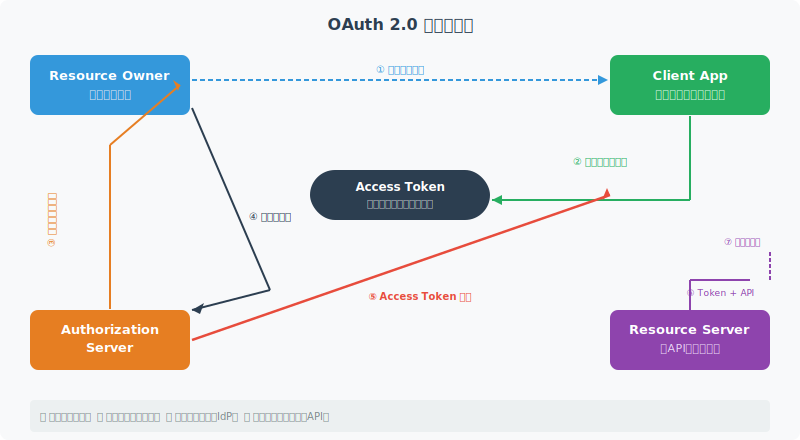

<!--
OAuth 2.0は認可フレームワーク。4つのロール: Resource Owner, Client, Authorization Server, Resource Server
-->

---

# OAuth 2.0 グラントタイプ

- <svg viewBox="0 0 800 400" style="max-height:70vh;max-width:100%;display:block;margin:0 auto;" xmlns="http://www.w3.org/2000/svg">
<rect width="800" height="400" fill="#1a1a2e"/>
<text x="400" y="28" text-anchor="middle" fill="#ffffff" font-size="16" font-weight="bold" font-family="sans-serif">OAuth 2.0 グラントタイプ</text>
<rect x="20" y="50" width="175" height="160" rx="10" fill="#16213e" stroke="#f9a825" stroke-width="2"/>
<rect x="215" y="50" width="175" height="160" rx="10" fill="#16213e" stroke="#e91e63" stroke-width="2"/>
<rect x="410" y="50" width="175" height="160" rx="10" fill="#16213e" stroke="#2196f3" stroke-width="2"/>
<rect x="605" y="50" width="175" height="160" rx="10" fill="#16213e" stroke="#4caf50" stroke-width="2"/>
<text x="107" y="78" text-anchor="middle" fill="#f9a825" font-size="13" font-weight="bold" font-family="sans-serif">Authorization Code</text>
<text x="302" y="78" text-anchor="middle" fill="#e91e63" font-size="13" font-weight="bold" font-family="sans-serif">Client Credentials</text>
<text x="497" y="78" text-anchor="middle" fill="#2196f3" font-size="13" font-weight="bold" font-family="sans-serif">Device Authorization</text>
<text x="692" y="78" text-anchor="middle" fill="#4caf50" font-size="13" font-weight="bold" font-family="sans-serif">Refresh Token</text>
<text x="107" y="106" text-anchor="middle" fill="#ffffff" font-size="11" font-family="sans-serif">最も安全なフロー</text>
<text x="302" y="106" text-anchor="middle" fill="#ffffff" font-size="11" font-family="sans-serif">M2M / サービス間</text>
<text x="497" y="106" text-anchor="middle" fill="#ffffff" font-size="11" font-family="sans-serif">TV / CLI / IoT</text>
<text x="692" y="106" text-anchor="middle" fill="#ffffff" font-size="11" font-family="sans-serif">セッション延長</text>
<text x="107" y="132" text-anchor="middle" fill="#ffffff" font-size="11" font-family="sans-serif">Web / モバイル</text>
<text x="302" y="132" text-anchor="middle" fill="#ffffff" font-size="11" font-family="sans-serif">ユーザーなし</text>
<text x="497" y="132" text-anchor="middle" fill="#ffffff" font-size="11" font-family="sans-serif">ブラウザなし端末</text>
<text x="692" y="132" text-anchor="middle" fill="#ffffff" font-size="11" font-family="sans-serif">再認証不要</text>
<text x="107" y="160" text-anchor="middle" fill="#f9a825" font-size="11" font-family="sans-serif">PKCE必須(SPA)</text>
<text x="302" y="160" text-anchor="middle" fill="#e91e63" font-size="11" font-family="sans-serif">client_secret必須</text>
<text x="497" y="160" text-anchor="middle" fill="#2196f3" font-size="11" font-family="sans-serif">polling方式</text>
<text x="692" y="160" text-anchor="middle" fill="#4caf50" font-size="11" font-family="sans-serif">rotation推奨</text>
<text x="107" y="192" text-anchor="middle" fill="#4caf50" font-size="11" font-family="sans-serif">標準推奨</text>
<text x="302" y="192" text-anchor="middle" fill="#4caf50" font-size="11" font-family="sans-serif">標準推奨</text>
<text x="497" y="192" text-anchor="middle" fill="#4caf50" font-size="11" font-family="sans-serif">RFC 8628</text>
<text x="692" y="192" text-anchor="middle" fill="#4caf50" font-size="11" font-family="sans-serif">推奨</text>
<rect x="20" y="245" width="760" height="55" rx="8" fill="#16213e" stroke="#e91e63" stroke-width="1.5"/>
<text x="400" y="268" text-anchor="middle" fill="#e91e63" font-size="13" font-weight="bold" font-family="sans-serif">廃止: Implicit / Resource Owner Password (ROPC)</text>
<text x="400" y="290" text-anchor="middle" fill="#ffffff" font-size="12" font-family="sans-serif">セキュリティリスクが高く OAuth 2.1 では削除予定</text>
<text x="400" y="360" text-anchor="middle" fill="#f9a825" font-size="12" font-family="sans-serif">新規実装は Authorization Code + PKCE を採用</text>
</svg>
- **Authorization Code (+ PKCE)** — ウェブ/SPAアプリ。最も安全。**推奨**
- **Client Credentials** — M2M通信（サービス間）。ユーザー不在のバックエンド処理
- **Device Authorization** — IoT・CLI。入力デバイス制限環境向け
- ~~Implicit~~ — 非推奨。Authorization Code + PKCEで代替すること
- ~~Resource Owner Password~~ — 非推奨。セキュリティリスク大。使用禁止
- **選択基準**: ユーザーあり→Auth Code+PKCE / M2M→Client Credentials / IoT→Device


---

# Authorization Code + PKCE フロー

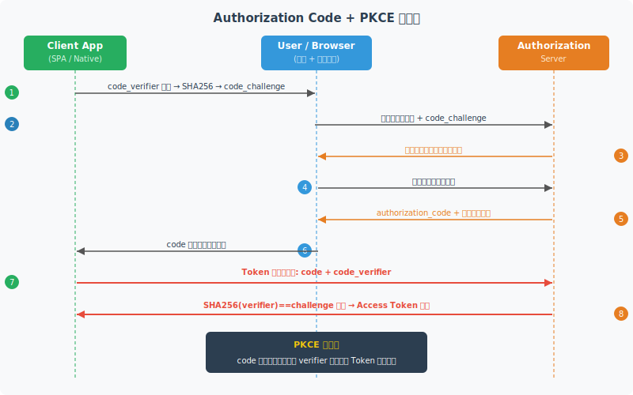

<!--
PKCE: Proof Key for Code Exchange。code_verifier(ランダム文字列)とcode_challenge(SHA256ハッシュ)でコード横取り攻撃を防ぐ
-->

---

# Client Credentials Flow

- **用途**: バックエンドサービス間通信（M2M）、バッチ処理、データパイプライン
- **フロー**: Client → AuthZ Server (client_id + client_secret) → Access Token → Resource Server
- **スコープ**: サービスに必要な最小スコープのみ要求。`read:data` 等で細粒度化
- **AWS実装**: Cognito App Client (client credentials) / IAM Role + SigV4 (推奨)
- **注意点**: client_secret は安全に管理。AWS Secrets Manager / Parameter Store 使用
- **代替**: AWS環境では IAM Role による署名付きリクエスト (SigV4) が推奨


---

# Device Authorization Flow

- **用途**: スマートTV、IoTデバイス、CLIツールなど入力デバイス制限環境
- **特徴**: ユーザーは別デバイス（スマホ等）で認証し、デバイスは定期ポーリング
- **フロー**: Device → AuthZ Server → device_code + user_code → ユーザーが別デバイスで入力 → Approval → Token
- **AWS実装**: Cognito は Device Flow をサポート。AWS CLI も同フロー使用
- **セキュリティ**: device_code の有効期限短縮 (5〜10分)。interval ポーリング制限を設定


---

# OpenID Connect (OIDC) 概要

- **OIDC = OAuth 2.0 + 認証レイヤー** — OAuth2は認可のみ。OIDCがアイデンティティを追加
- **IDトークン** — JWT形式。ユーザー情報（クレーム）を署名付きで提供
- **アクセストークン** — APIアクセス用。リソースサーバーへ提示
- **UserInfo Endpoint** — アクセストークンで追加ユーザー情報を取得
- **Discovery** — `/.well-known/openid-configuration` でメタデータ自動取得
- **主要IdP**: Cognito / Auth0 / Okta / Google / Azure AD / GitHub


---

# IDトークン構造と検証

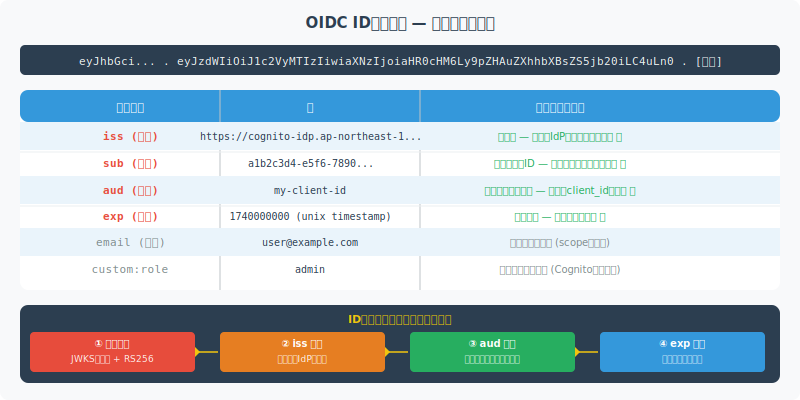

<!--
IDトークンの必須クレーム: iss, sub, aud, exp, iat。検証ステップ: 1)署名検証 2)iss確認 3)aud確認 4)exp確認
-->

---

# SAML 2.0 概要

- **SAML = Security Assertion Markup Language** — XML形式の認証・認可情報交換標準
- **3要素**: Identity Provider (IdP) / Service Provider (SP) / Principal (ユーザー)
- **Assertion タイプ**: Authentication / Attribute / Authorization Decision
- **Binding**: HTTP POST（主流）/ HTTP Redirect / Artifact
- **利点**: エンタープライズSSOでの実績・サポート幅が広い (AD FS, Okta, Shibboleth)
- **欠点**: XMLの複雑さ・モバイル/SPA非適合・実装難 → 新規開発ではOIDCへ移行推奨


---

# SAML vs OIDC — 比較と選択基準

- <svg viewBox="0 0 800 400" style="max-height:70vh;max-width:100%;display:block;margin:0 auto;" xmlns="http://www.w3.org/2000/svg">
<rect width="800" height="400" fill="#1a1a2e"/>
<text x="400" y="28" text-anchor="middle" fill="#ffffff" font-size="16" font-weight="bold" font-family="sans-serif">SAML vs OIDC — 比較と選択基準</text>
<rect x="20" y="50" width="370" height="305" rx="10" fill="#16213e" stroke="#f9a825" stroke-width="2"/>
<rect x="410" y="50" width="370" height="305" rx="10" fill="#16213e" stroke="#e91e63" stroke-width="2"/>
<text x="205" y="78" text-anchor="middle" fill="#f9a825" font-size="15" font-weight="bold" font-family="sans-serif">SAML 2.0</text>
<text x="595" y="78" text-anchor="middle" fill="#e91e63" font-size="15" font-weight="bold" font-family="sans-serif">OIDC</text>
<text x="40" y="112" fill="#ffffff" font-size="12" font-family="sans-serif">形式: XML Assertion</text>
<text x="430" y="112" fill="#ffffff" font-size="12" font-family="sans-serif">形式: JWT</text>
<text x="40" y="142" fill="#ffffff" font-size="12" font-family="sans-serif">設計: エンタープライズSSO</text>
<text x="430" y="142" fill="#ffffff" font-size="12" font-family="sans-serif">設計: Web/モバイル/API</text>
<text x="40" y="172" fill="#ffffff" font-size="12" font-family="sans-serif">モバイル: 対応困難</text>
<text x="430" y="172" fill="#ffffff" font-size="12" font-family="sans-serif">モバイル: ネイティブ対応</text>
<text x="40" y="202" fill="#ffffff" font-size="12" font-family="sans-serif">登場: 2005年</text>
<text x="430" y="202" fill="#ffffff" font-size="12" font-family="sans-serif">登場: 2014年</text>
<text x="40" y="232" fill="#ffffff" font-size="12" font-family="sans-serif">採用: 大企業・SaaS連携</text>
<text x="430" y="232" fill="#ffffff" font-size="12" font-family="sans-serif">採用: 新規WebサービスAPI</text>
<text x="40" y="265" fill="#f9a825" font-size="12" font-family="sans-serif">選択: 既存エンプラ統合</text>
<text x="430" y="265" fill="#e91e63" font-size="12" font-family="sans-serif">選択: 新規/モバイル/API</text>
<text x="40" y="300" fill="#ffffff" font-size="12" font-family="sans-serif">IdP: ADFS / Shibboleth</text>
<text x="430" y="300" fill="#ffffff" font-size="12" font-family="sans-serif">IdP: Okta / Azure AD / Auth0</text>
<text x="400" y="370" text-anchor="middle" fill="#ffffff" font-size="12" font-family="sans-serif">現代的IdP(Okta/Azure AD)は両方サポート</text>
</svg>
| 比較軸 | SAML 2.0 | OIDC |
|--------|----------|------|
| フォーマット | XML (重い) | JSON / JWT (軽量) |
| モバイル / SPA | 非適合 | 適合 ✅ |
| エンタープライズSSOレガシー | 強い実績 | 対応増加中 |
| セットアップ難易度 | 複雑 | 容易 |
| 新規開発推奨 | — | ✅ OIDC 推奨 |


---

# JWT 詳解 — 構造と仕組み

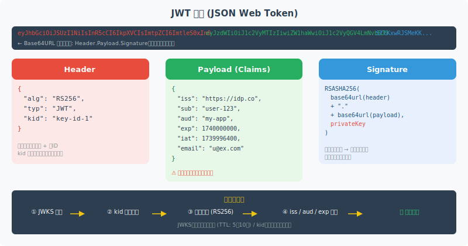

<!--
JWT = Header.Payload.Signature。Base64URL エンコード。Payload は機密情報を入れない（暗号化されていない）
-->

---

# JWT 署名アルゴリズム

- **RS256** (RSA + SHA256) — 非対称。公開鍵で検証可能。**推奨** (IdP → Client)
- **ES256** (ECDSA + SHA256) — 非対称。RS256より鍵が短い。高パフォーマンス
- **HS256** (HMAC + SHA256) — 対称。署名者と検証者が同じ秘密鍵を共有。**同一サービス内のみ**
- **alg:none 禁止** — 検証スキップの脆弱性。ライブラリで明示的に禁止設定必須
- **JWKS** — 公開鍵セット。`/jwks.json` で提供。kid でキーローテーション対応
- **推奨構成**: RS256 + JWKS キャッシュ + kid によるキーローテーション


---

# JWT ベストプラクティス

- **有効期限を短く** — アクセストークン: 15〜60分。IDトークン: 1時間以内
- **クレームを最小化** — Payload にセンシティブ情報を入れない（PII, パスワードなど）
- **jti (JWT ID)** — 使い捨てトークン検証。リプレイ攻撃対策
- **nbf (not before)** — 有効開始時刻。時刻ずれ対策に数秒のスラックを設定
- **aud 検証必須** — 自分のサービス向けトークンのみ受け入れる
- **失効設計** — ブラックリスト(Redis) / 短い TTL + ローテーション の2択


---

# トークンローテーション戦略

- **Access Token** — 短命 (15〜60min)。漏洩時の影響を最小化
- **Refresh Token** — 長命 (1〜30日)。新しいAccess Tokenを取得するために使用
- **Refresh Token Rotation** — 使用のたびに新しいRefresh Tokenを発行。古いTokenは無効化
- **Detect Reuse** — 同一Refresh Tokenの二重使用を検知したらセッション全体を失効
- **保管場所**: Refresh Token は HttpOnly Secure Cookie 推奨。localStorage は XSS注意
- **AWS Cognito**: `RefreshToken` のローテーションをデフォルト有効化


---

# PKCE 詳解 (Proof Key for Code Exchange)

- **目的**: Authorization Code の横取り攻撃 (Code Interception Attack) を防ぐ
- **code_verifier** — クライアントが生成するランダム文字列 (43〜128文字, Base64URL)
- **code_challenge** — `BASE64URL(SHA256(code_verifier))`。認可リクエストに含める
- **フロー**: ① challenge を AuthZ Serverへ送信 → ② code 取得 → ③ verifier でトークン交換
- **検証**: AuthZ Server が `SHA256(verifier) == challenge` を確認。横取りしたcodeは使えない
- **適用範囲**: パブリッククライアント(SPA, ネイティブアプリ)必須。コンフィデンシャルにも推奨


---

<!-- _class: lead -->
# 認可モデル

- RBAC / ABAC / ReBAC / PBAC
- 設計選択の基準とトレードオフを整理


---

# RBAC — Role-Based Access Control

- <svg viewBox="0 0 800 400" style="max-height:70vh;max-width:100%;display:block;margin:0 auto;" xmlns="http://www.w3.org/2000/svg">
<rect width="800" height="400" fill="#1a1a2e"/>
<text x="400" y="28" text-anchor="middle" fill="#ffffff" font-size="16" font-weight="bold" font-family="sans-serif">RBAC — Role-Based Access Control</text>
<rect x="310" y="45" width="180" height="50" rx="8" fill="#16213e" stroke="#f9a825" stroke-width="2"/>
<text x="400" y="76" text-anchor="middle" fill="#f9a825" font-size="14" font-weight="bold" font-family="sans-serif">Super Admin</text>
<line x1="400" y1="95" x2="200" y2="135" stroke="#f9a825" stroke-width="2"/>
<polygon points="200,135 196,122 210,125" fill="#f9a825"/>
<line x1="400" y1="95" x2="400" y2="135" stroke="#f9a825" stroke-width="2"/>
<polygon points="400,135 394,122 406,122" fill="#f9a825"/>
<line x1="400" y1="95" x2="600" y2="135" stroke="#f9a825" stroke-width="2"/>
<polygon points="600,135 592,123 605,124" fill="#f9a825"/>
<rect x="110" y="138" width="180" height="50" rx="8" fill="#16213e" stroke="#e91e63" stroke-width="2"/>
<text x="200" y="169" text-anchor="middle" fill="#e91e63" font-size="13" font-weight="bold" font-family="sans-serif">Editor</text>
<rect x="310" y="138" width="180" height="50" rx="8" fill="#16213e" stroke="#e91e63" stroke-width="2"/>
<text x="400" y="169" text-anchor="middle" fill="#e91e63" font-size="13" font-weight="bold" font-family="sans-serif">Manager</text>
<rect x="510" y="138" width="180" height="50" rx="8" fill="#16213e" stroke="#e91e63" stroke-width="2"/>
<text x="600" y="169" text-anchor="middle" fill="#e91e63" font-size="13" font-weight="bold" font-family="sans-serif">Viewer</text>
<rect x="40" y="240" width="140" height="45" rx="6" fill="#16213e" stroke="#4caf50" stroke-width="1.5"/>
<text x="110" y="267" text-anchor="middle" fill="#4caf50" font-size="12" font-family="sans-serif">User A</text>
<rect x="200" y="240" width="140" height="45" rx="6" fill="#16213e" stroke="#4caf50" stroke-width="1.5"/>
<text x="270" y="267" text-anchor="middle" fill="#4caf50" font-size="12" font-family="sans-serif">User B</text>
<rect x="330" y="240" width="140" height="45" rx="6" fill="#16213e" stroke="#4caf50" stroke-width="1.5"/>
<text x="400" y="267" text-anchor="middle" fill="#4caf50" font-size="12" font-family="sans-serif">User C</text>
<rect x="460" y="240" width="140" height="45" rx="6" fill="#16213e" stroke="#4caf50" stroke-width="1.5"/>
<text x="530" y="267" text-anchor="middle" fill="#4caf50" font-size="12" font-family="sans-serif">User D</text>
<rect x="620" y="240" width="140" height="45" rx="6" fill="#16213e" stroke="#4caf50" stroke-width="1.5"/>
<text x="690" y="267" text-anchor="middle" fill="#4caf50" font-size="12" font-family="sans-serif">User E</text>
<line x1="110" y1="240" x2="200" y2="188" stroke="#4caf50" stroke-width="1.5" stroke-dasharray="4,3"/>
<line x1="270" y1="240" x2="200" y2="188" stroke="#4caf50" stroke-width="1.5" stroke-dasharray="4,3"/>
<line x1="400" y1="240" x2="400" y2="188" stroke="#4caf50" stroke-width="1.5" stroke-dasharray="4,3"/>
<line x1="530" y1="240" x2="600" y2="188" stroke="#4caf50" stroke-width="1.5" stroke-dasharray="4,3"/>
<line x1="690" y1="240" x2="600" y2="188" stroke="#4caf50" stroke-width="1.5" stroke-dasharray="4,3"/>
<rect x="20" y="310" width="760" height="60" rx="8" fill="#16213e" stroke="#ffffff" stroke-width="1" opacity="0.5"/>
<text x="400" y="335" text-anchor="middle" fill="#f9a825" font-size="13" font-weight="bold" font-family="sans-serif">RBACのメリット</text>
<text x="400" y="358" text-anchor="middle" fill="#ffffff" font-size="12" font-family="sans-serif">役割変更時はロール付け替えのみ / 権限管理が直感的 / シンプルで監査しやすい</text>
</svg>
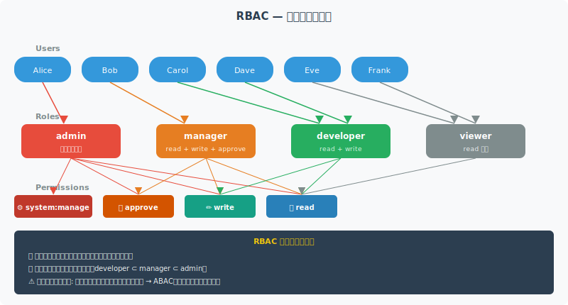

<!--
RBAC: ユーザーをロールに割り当て、ロールにパーミッションを付与。階層RBACは継承で管理コストを削減
-->

---

# ABAC — Attribute-Based Access Control

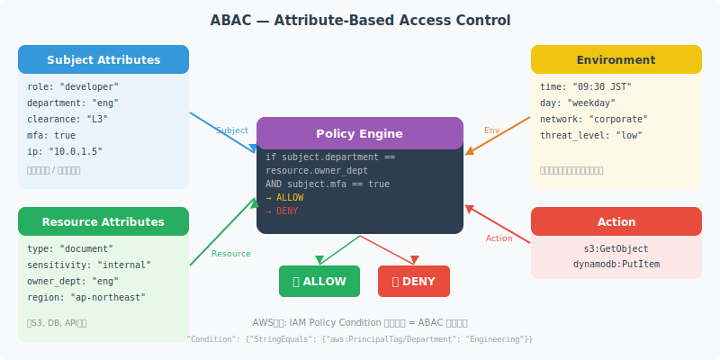

<!--
ABAC: Subject属性 + Resource属性 + Environment条件 → Policy Engine → 許可/拒否。AWS IAM ConditionブロックはABACの実装
-->

---

# ReBAC — Relationship-Based Access Control

- **概念**: オブジェクト間の「関係」に基づいてアクセス制御を決定
- **例**: `user:alice is viewer of document:report` → alice は report を閲覧できる
- **Google Zanzibar**: Google Drive / Docs / Calendar の認可エンジン。ReBAC の事実上の標準
- **OSS実装**: SpiceDB (Authzed) / OpenFGA (Auth0) / Ory Keto
- **ユースケース**: ファイル共有・組織階層・SNSフォロー関係など
- **特徴**: 動的な関係変更に強い。大規模グラフのトラバーサルが課題


---

# PBAC と OPA — Policy-Based Access Control

- **PBAC**: 認可ロジックをポリシーとして外部化・コード化する考え方
- **OPA (Open Policy Agent)** — CNCFプロジェクト。Rego言語でポリシー記述
- **Cedar (AWS)** — AWS Verified Permissions のポリシー言語。型安全
- **利点**: アプリコードからポリシーを分離。監査・テスト・更新が独立して可能
- **Kubernetes**: Admission Webhook で OPA Gatekeeper によるポリシー強制


---

# PBAC と OPA — Policy-Based Access Control（コード例）

```rego
# OPA Rego ポリシー例
package authz

default allow := false

allow if {
    input.user.role == "admin"
}

allow if {
    input.action == "read"
    input.resource.owner == input.user.id
}
```


---

# 認可モデル比較

- <svg viewBox="0 0 800 400" style="max-height:70vh;max-width:100%;display:block;margin:0 auto;" xmlns="http://www.w3.org/2000/svg">
<rect width="800" height="400" fill="#1a1a2e"/>
<text x="400" y="28" text-anchor="middle" fill="#ffffff" font-size="16" font-weight="bold" font-family="sans-serif">認可モデル比較</text>
<rect x="10" y="45" width="780" height="40" rx="6" fill="#f9a825" opacity="0.2"/>
<text x="110" y="70" text-anchor="middle" fill="#f9a825" font-size="13" font-weight="bold" font-family="sans-serif">モデル</text>
<text x="260" y="70" text-anchor="middle" fill="#f9a825" font-size="13" font-weight="bold" font-family="sans-serif">基準</text>
<text x="420" y="70" text-anchor="middle" fill="#f9a825" font-size="13" font-weight="bold" font-family="sans-serif">柔軟性</text>
<text x="560" y="70" text-anchor="middle" fill="#f9a825" font-size="13" font-weight="bold" font-family="sans-serif">複雑度</text>
<text x="700" y="70" text-anchor="middle" fill="#f9a825" font-size="13" font-weight="bold" font-family="sans-serif">ユースケース</text>
<text x="110" y="108" text-anchor="middle" fill="#ffffff" font-size="12" font-family="sans-serif">RBAC</text>
<text x="260" y="108" text-anchor="middle" fill="#ffffff" font-size="12" font-family="sans-serif">役割 (Role)</text>
<text x="420" y="108" text-anchor="middle" fill="#f9a825" font-size="12" font-family="sans-serif">低</text>
<text x="560" y="108" text-anchor="middle" fill="#4caf50" font-size="12" font-family="sans-serif">低</text>
<text x="700" y="108" text-anchor="middle" fill="#ffffff" font-size="12" font-family="sans-serif">組織・業務システム</text>
<text x="110" y="142" text-anchor="middle" fill="#ffffff" font-size="12" font-family="sans-serif">ABAC</text>
<text x="260" y="142" text-anchor="middle" fill="#ffffff" font-size="12" font-family="sans-serif">属性 (Attr)</text>
<text x="420" y="142" text-anchor="middle" fill="#4caf50" font-size="12" font-family="sans-serif">高</text>
<text x="560" y="142" text-anchor="middle" fill="#e91e63" font-size="12" font-family="sans-serif">高</text>
<text x="700" y="142" text-anchor="middle" fill="#ffffff" font-size="12" font-family="sans-serif">時間・場所条件</text>
<text x="110" y="176" text-anchor="middle" fill="#ffffff" font-size="12" font-family="sans-serif">ReBAC</text>
<text x="260" y="176" text-anchor="middle" fill="#ffffff" font-size="12" font-family="sans-serif">関係 (Relation)</text>
<text x="420" y="176" text-anchor="middle" fill="#4caf50" font-size="12" font-family="sans-serif">高</text>
<text x="560" y="176" text-anchor="middle" fill="#f9a825" font-size="12" font-family="sans-serif">中</text>
<text x="700" y="176" text-anchor="middle" fill="#ffffff" font-size="12" font-family="sans-serif">共有/コラボ系</text>
<text x="110" y="210" text-anchor="middle" fill="#ffffff" font-size="12" font-family="sans-serif">PBAC</text>
<text x="260" y="210" text-anchor="middle" fill="#ffffff" font-size="12" font-family="sans-serif">ポリシー (Policy)</text>
<text x="420" y="210" text-anchor="middle" fill="#4caf50" font-size="12" font-family="sans-serif">最高</text>
<text x="560" y="210" text-anchor="middle" fill="#e91e63" font-size="12" font-family="sans-serif">高</text>
<text x="700" y="210" text-anchor="middle" fill="#ffffff" font-size="12" font-family="sans-serif">マイクロサービス</text>
<text x="110" y="244" text-anchor="middle" fill="#ffffff" font-size="12" font-family="sans-serif">ACL</text>
<text x="260" y="244" text-anchor="middle" fill="#ffffff" font-size="12" font-family="sans-serif">リスト直接</text>
<text x="420" y="244" text-anchor="middle" fill="#e91e63" font-size="12" font-family="sans-serif">最低</text>
<text x="560" y="244" text-anchor="middle" fill="#4caf50" font-size="12" font-family="sans-serif">最低</text>
<text x="700" y="244" text-anchor="middle" fill="#ffffff" font-size="12" font-family="sans-serif">ファイルシステム</text>
<line x1="10" y1="88" x2="790" y2="88" stroke="#ffffff" stroke-width="0.5" opacity="0.4"/>
<line x1="10" y1="122" x2="790" y2="122" stroke="#ffffff" stroke-width="0.5" opacity="0.3"/>
<line x1="10" y1="156" x2="790" y2="156" stroke="#ffffff" stroke-width="0.5" opacity="0.3"/>
<line x1="10" y1="190" x2="790" y2="190" stroke="#ffffff" stroke-width="0.5" opacity="0.3"/>
<line x1="10" y1="224" x2="790" y2="224" stroke="#ffffff" stroke-width="0.5" opacity="0.3"/>
<line x1="170" y1="45" x2="170" y2="258" stroke="#ffffff" stroke-width="0.5" opacity="0.4"/>
<line x1="340" y1="45" x2="340" y2="258" stroke="#ffffff" stroke-width="0.5" opacity="0.4"/>
<line x1="490" y1="45" x2="490" y2="258" stroke="#ffffff" stroke-width="0.5" opacity="0.4"/>
<line x1="620" y1="45" x2="620" y2="258" stroke="#ffffff" stroke-width="0.5" opacity="0.4"/>
<text x="400" y="310" text-anchor="middle" fill="#f9a825" font-size="12" font-family="sans-serif">実務: RBAC + ABAC の組み合わせが最も多い</text>
</svg>
| モデル | スケール | 柔軟性 | 複雑度 | 主な用途 |
|--------|---------|-------|-------|---------|
| RBAC | 中〜大 | 低 | 低 | 社内システム・API権限 |
| ABAC | 大 | 高 | 中〜高 | マルチテナント・動的条件 |
| ReBAC | 大規模 | 高 | 高 | ファイル共有・SNS |
| PBAC | 大規模 | 高 | 高 | マイクロサービス横断 |
- **推奨**: 小規模→RBAC / 複雑条件→ABAC(IAM Condition) / 階層構造→ReBAC


---

# IAM ポリシー言語

- **Effect** — `Allow` / `Deny`。明示的 Deny は常に優先
- **Action** — AWS API アクション (`s3:GetObject`, `ec2:*`)
- **Resource** — ARN で対象リソースを特定 (`arn:aws:s3:::my-bucket/*`)
- **Condition** — 追加条件 (`aws:SourceIp`, `aws:RequestedRegion`, `s3:prefix`)


---

# IAM ポリシー言語（コード例）

```json
{
  "Version": "2012-10-17",
  "Statement": [{
    "Effect": "Allow",
    "Action": ["s3:GetObject", "s3:PutObject"],
    "Resource": "arn:aws:s3:::my-bucket/${aws:userid}/*",
    "Condition": {
      "StringEquals": {
        "aws:RequestedRegion": "ap-northeast-1"
      }
    }
  }]
}
```


---

# Least Privilege 原則の実装

- **原則**: 必要最小限の権限のみ付与。余剰権限は攻撃面の拡大
- **IAM Access Analyzer** — 使用されていない権限を検出。最小権限ポリシーを自動生成
- **CloudTrail + Athena** — 実際の API 使用ログから必要な Action を特定
- **SCPs でガードレール** — 組織全体で危険な操作を禁止 (例: `iam:CreateUser` 禁止)
- **Permission Boundaries** — デリゲーション時の上限設定。開発者が自力で権限昇格不可
- **定期レビュー**: 四半期ごとに未使用ロール・ポリシーを棚卸し


---

<!-- _class: lead -->
# AWS IAM 設計パターン

- Roles / Policies / SCP / Boundaries / IRSA
- 最小権限・デリゲーション・クロスアカウント設計


---

# IAM エンティティ全体図

- <svg viewBox="0 0 800 400" style="max-height:70vh;max-width:100%;display:block;margin:0 auto;" xmlns="http://www.w3.org/2000/svg">
<rect width="800" height="400" fill="#1a1a2e"/>
<text x="400" y="28" text-anchor="middle" fill="#ffffff" font-size="16" font-weight="bold" font-family="sans-serif">IAM エンティティ全体図</text>
<rect x="20" y="50" width="130" height="120" rx="8" fill="#16213e" stroke="#f9a825" stroke-width="2"/>
<text x="85" y="80" text-anchor="middle" fill="#f9a825" font-size="12" font-weight="bold" font-family="sans-serif">Users</text>
<text x="85" y="105" text-anchor="middle" fill="#ffffff" font-size="11" font-family="sans-serif">個別アカウント</text>
<text x="85" y="125" text-anchor="middle" fill="#ffffff" font-size="11" font-family="sans-serif">長期認証情報</text>
<text x="85" y="145" text-anchor="middle" fill="#ffffff" font-size="11" font-family="sans-serif">MFA推奨</text>
<rect x="170" y="50" width="130" height="120" rx="8" fill="#16213e" stroke="#f9a825" stroke-width="2"/>
<text x="235" y="80" text-anchor="middle" fill="#f9a825" font-size="12" font-weight="bold" font-family="sans-serif">Groups</text>
<text x="235" y="105" text-anchor="middle" fill="#ffffff" font-size="11" font-family="sans-serif">ユーザーの集合</text>
<text x="235" y="125" text-anchor="middle" fill="#ffffff" font-size="11" font-family="sans-serif">ポリシー一括付与</text>
<text x="235" y="145" text-anchor="middle" fill="#ffffff" font-size="11" font-family="sans-serif">管理効率化</text>
<rect x="320" y="50" width="130" height="120" rx="8" fill="#16213e" stroke="#e91e63" stroke-width="2"/>
<text x="385" y="80" text-anchor="middle" fill="#e91e63" font-size="12" font-weight="bold" font-family="sans-serif">Roles</text>
<text x="385" y="105" text-anchor="middle" fill="#ffffff" font-size="11" font-family="sans-serif">一時的認証情報</text>
<text x="385" y="125" text-anchor="middle" fill="#ffffff" font-size="11" font-family="sans-serif">サービス間委任</text>
<text x="385" y="145" text-anchor="middle" fill="#ffffff" font-size="11" font-family="sans-serif">AssumeRole</text>
<rect x="470" y="50" width="130" height="120" rx="8" fill="#16213e" stroke="#2196f3" stroke-width="2"/>
<text x="535" y="80" text-anchor="middle" fill="#2196f3" font-size="12" font-weight="bold" font-family="sans-serif">Policies</text>
<text x="535" y="105" text-anchor="middle" fill="#ffffff" font-size="11" font-family="sans-serif">JSON形式の権限</text>
<text x="535" y="125" text-anchor="middle" fill="#ffffff" font-size="11" font-family="sans-serif">Allow / Deny</text>
<text x="535" y="145" text-anchor="middle" fill="#ffffff" font-size="11" font-family="sans-serif">条件付き制御</text>
<rect x="620" y="50" width="150" height="120" rx="8" fill="#16213e" stroke="#4caf50" stroke-width="2"/>
<text x="695" y="80" text-anchor="middle" fill="#4caf50" font-size="12" font-weight="bold" font-family="sans-serif">Resources</text>
<text x="695" y="105" text-anchor="middle" fill="#ffffff" font-size="11" font-family="sans-serif">S3 / EC2 / RDS</text>
<text x="695" y="125" text-anchor="middle" fill="#ffffff" font-size="11" font-family="sans-serif">ARNで識別</text>
<text x="695" y="145" text-anchor="middle" fill="#ffffff" font-size="11" font-family="sans-serif">リソースポリシー</text>
<text x="400" y="220" text-anchor="middle" fill="#ffffff" font-size="14" font-weight="bold" font-family="sans-serif">評価フロー</text>
<rect x="20" y="240" width="130" height="45" rx="6" fill="#16213e" stroke="#f9a825" stroke-width="1.5"/>
<text x="85" y="267" text-anchor="middle" fill="#ffffff" font-size="11" font-family="sans-serif">Principal認証</text>
<rect x="180" y="240" width="130" height="45" rx="6" fill="#16213e" stroke="#e91e63" stroke-width="1.5"/>
<text x="245" y="267" text-anchor="middle" fill="#ffffff" font-size="11" font-family="sans-serif">ポリシー収集</text>
<rect x="340" y="240" width="130" height="45" rx="6" fill="#16213e" stroke="#2196f3" stroke-width="1.5"/>
<text x="405" y="267" text-anchor="middle" fill="#ffffff" font-size="11" font-family="sans-serif">Deny評価</text>
<rect x="500" y="240" width="130" height="45" rx="6" fill="#16213e" stroke="#4caf50" stroke-width="1.5"/>
<text x="565" y="267" text-anchor="middle" fill="#ffffff" font-size="11" font-family="sans-serif">Allow評価</text>
<rect x="660" y="240" width="120" height="45" rx="6" fill="#16213e" stroke="#f9a825" stroke-width="1.5"/>
<text x="720" y="267" text-anchor="middle" fill="#ffffff" font-size="11" font-family="sans-serif">アクセス決定</text>
<line x1="150" y1="262" x2="180" y2="262" stroke="#ffffff" stroke-width="1.5"/>
<polygon points="180,262 168,256 168,268" fill="#ffffff"/>
<line x1="310" y1="262" x2="340" y2="262" stroke="#ffffff" stroke-width="1.5"/>
<polygon points="340,262 328,256 328,268" fill="#ffffff"/>
<line x1="470" y1="262" x2="500" y2="262" stroke="#ffffff" stroke-width="1.5"/>
<polygon points="500,262 488,256 488,268" fill="#ffffff"/>
<line x1="630" y1="262" x2="660" y2="262" stroke="#ffffff" stroke-width="1.5"/>
<polygon points="660,262 648,256 648,268" fill="#ffffff"/>
</svg>
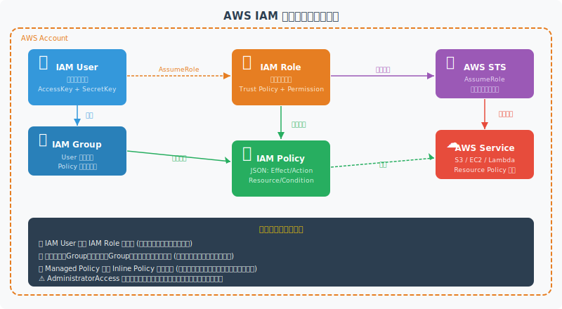

<!--
IAM User: 長期認証情報。Group: ユーザーの集合。Role: 一時認証情報。Policy: 権限の定義。ベストプラクティス: ユーザーより Role を使用
-->

---

# IAM ロール設計パターン

- **サービスロール** — AWS サービスが AWS APIs を呼び出すための Role (EC2, Lambda, ECS Task)
- **クロスアカウントロール** — 別AWSアカウントのリソースにアクセスするための Role
- **フェデレーションロール** — 外部IdP認証済みユーザーが AssumeRole するための Role
- **デプロイロール** — CI/CD パイプラインが使用するデプロイ専用 Role
- **ブレイクグラスロール** — 緊急時のみ使用する高権限 Role。MFA + CloudTrail 必須
- **原則**: 1 Role = 1 ユースケース。汎用ロールを作らない


---

# IAM ポリシー vs リソースポリシー

- **IAM ポリシー** — Principal (User/Role) にアタッチ。**誰が**何をできるかを定義
- **リソースポリシー** — リソース (S3, SQS, KMS) にアタッチ。**誰に**許可するかを定義
- **評価順序**: 明示的 Deny → SCP → リソースポリシー → IAM ポリシー → 暗黙 Deny
- **クロスアカウント**: 両方のポリシーで Allow が必要
- **同一アカウント**: リソースポリシーの Allow だけで OK なケースあり
- **ユースケース**: S3バケットポリシー / SQS / SNS / KMS キーポリシー


---

# SCP — Service Control Policies

- **SCP とは**: AWS Organizations でアカウント全体に適用するガードレールポリシー
- **特性**: Allow のみでは不十分。IAM ポリシーとの AND 評価。最大許可範囲を定義
- **ユースケース**: 特定リージョン以外へのデプロイ禁止 / 危険なIAM操作禁止 / ルートアカウント使用禁止
- **階層**: Root → OU → Account の順に継承・上書き可能


---

# SCP — Service Control Policies（コード例）

```json
{
  "Effect": "Deny",
  "Action": "*",
  "Resource": "*",
  "Condition": {
    "StringNotEquals": {
      "aws:RequestedRegion": [
        "ap-northeast-1",
        "us-east-1"
      ]
    }
  }
}
```


---

# Permission Boundaries

- **目的**: IAM エンティティの最大許可範囲を制限。デリゲーション時の権限昇格防止
- **動作**: Permission Boundary で許可 AND IAM ポリシーで許可 = 有効な権限
- **ユースケース**: 開発者に IAM 権限デリゲーション時、自分より強い権限ロール作成を防ぐ
- **設計パターン**: 管理者が境界ポリシーを作成 → 開発者は境界の範囲内でのみロール作成可能
- **注意**: SCP とは異なる。SCP は Organization レベル。Boundary は個別エンティティレベル
- **実装**: `iam:CreateRole` 等に `iam:PermissionsBoundary` 条件キーを使用


---

# IAM Access Analyzer

- **外部アクセス検出**: S3, IAM Role, KMS, SQS 等への組織外からのアクセスを検出
- **未使用アクセス分析**: 使用されていない権限・ロール・アクセスキーを特定
- **最小権限ポリシー生成**: CloudTrail ログから実際使用した Action のみのポリシーを自動生成
- **ポリシー検証**: `validate-policy` API でポリシーの文法・セキュリティチェック
- **CI/CD統合**: `aws accessanalyzer validate-policy` をデプロイパイプラインに組み込む
- **アラート**: Security Hub / EventBridge 経由で Slack/PagerDuty 通知


---

# クロスアカウントアクセス設計

- **基本パターン**: Account A の Principal が Account B の Role に AssumeRole
- **Trust Policy**: Account B のロールに Account A の Principal を信頼する設定
- **ExternalId**: 第三者(SaaS等)が代理アクセスする場合に推奨。混乱した副官攻撃を防止


---

# クロスアカウントアクセス設計（コード例）

```json
// Trust Policy (Account B側のRole)
{
  "Effect": "Allow",
  "Principal": {
    "AWS": "arn:aws:iam::ACCOUNT_A_ID:role/DeployRole"
  },
  "Action": "sts:AssumeRole",
  "Condition": {
    "StringEquals": {
      "sts:ExternalId": "unique-external-id"
    },
    "Bool": {
      "aws:MultiFactorAuthPresent": "true"
    }
  }
}
```


---

# EC2 Instance Profile / Lambda Execution Role

- **Instance Profile** — EC2 インスタンスに IAM Role を付与する仕組み
- **IMDSv2 必須** — v1 は SSRF 攻撃でメタデータ窃取リスク。v2(token必須)を強制
- **Lambda Execution Role** — Lambda が AWS サービスにアクセスするための Role
- **最小権限**: Lambda 関数ごとに専用 Role。共有 Role は使わない
- **VPC Lambda**: ENI 作成に `ec2:CreateNetworkInterface` 等が必要。マネージドポリシー活用
- **環境変数の秘密**: Secrets Manager / SSM Parameter Store から Lambda 起動時に取得


---

# EKS IRSA — IAM Roles for Service Accounts

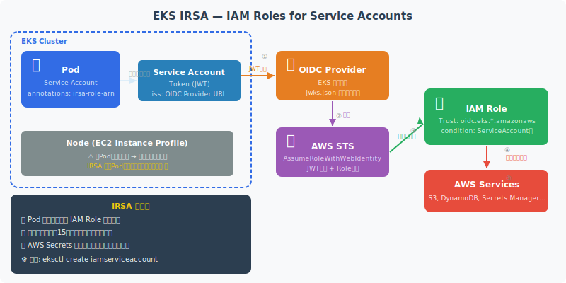

<!--
IRSA: Pod単位でIAM Roleを付与。Node単位の権限付与より細粒度。OIDC Providerを介してSTS AssumeRoleWithWebIdentity
-->

---

# STS AssumeRole — 一時認証情報の活用

- **一時認証情報**: AccessKeyId + SecretAccessKey + **SessionToken** のセット。TTL: 15分〜12時間
- **AssumeRole**: 別のロールになりきる。クロスアカウント・フェデレーションの基盤
- **AssumeRoleWithWebIdentity**: OIDC トークン (JWT) を使った AssumeRole。IRSA, Cognito
- **AssumeRoleWithSAML**: SAML アサーションを使った AssumeRole。エンタープライズ SSO
- **セッションポリシー**: AssumeRole 時に追加で絞り込みポリシーを付与可能
- **監査**: CloudTrail に AssumeRole イベントが記録される。SessionName で追跡


---

# IAM Identity Center (旧 AWS SSO)

- **目的**: 複数AWSアカウントへのシングルサインオン。一元的なID管理
- **ID ソース**: 内蔵ディレクトリ / Active Directory / 外部 OIDC IdP (Okta, Azure AD)
- **権限セット**: AWS マネージド or カスタムポリシー。アカウント×権限セットで割り当て
- **SCIM プロビジョニング**: IdP からユーザー/グループを自動同期
- **アクセスポータル**: ユーザーはポータルからアカウント一覧を確認。CLI は `aws sso login`
- **推奨**: 全アカウントで IAM User を廃止し Identity Center に一元化


---

<!-- _class: lead -->
# Cognito & Federation

- User Pools / Identity Pools / 外部IdP統合
- マネージドIdPとAWS認証の架け橋


---

# Cognito User Pools 設計

- **User Pool** — マネージドユーザーディレクトリ。サインアップ・サインイン・MFA を提供
- **JWT 発行**: ID Token / Access Token / Refresh Token を OIDC 準拠で発行
- **カスタムフロー** — Lambda Trigger で認証フローをカスタマイズ (Pre/Post Auth, Custom Challenge)
- **MFA**: TOTP (Google Authenticator等) / SMS / SES メール OTP
- **ユーザー属性**: 標準属性 (email, phone) + カスタム属性 (`custom:role`)
- **設計考慮**: User Pool は削除できない。複数環境(dev/stg/prod)は別 Pool を推奨


---

# Cognito Identity Pools (Federated Identities)

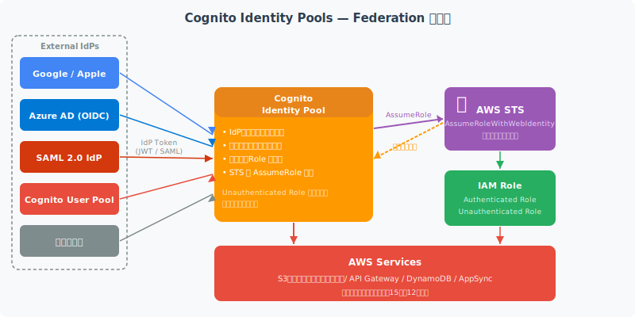

<!--
Identity Pools: 外部IdPの認証済みトークンをSTS一時認証情報に変換。Unauthenticated Roleも設定可能
-->

---

# 外部IdP統合パターン

- **パターン1: OIDC → Cognito User Pool** — Google/Apple ソーシャルログインをCognitoに統合
- **パターン2: SAML → Cognito User Pool** — Active Directory / Okta を SAML連携でCognito統合
- **パターン3: OIDC/SAML → Identity Center** — 企業IdP → AWSアカウントSSO (推奨)
- **パターン4: Cognito → Identity Pool → STS** — モバイルアプリ向けAWSリソース直接アクセス
- **選択基準**: ウェブ/モバイルアプリ→User Pool / AWS直接アクセス→Identity Pool / 企業SSO→Identity Center


---

<!-- _class: lead -->
# API 認証認可設計

- API Gateway / Lambda Authorizer / JWT検証
- APIレイヤーでの認証・認可の実装パターン


---

# API Gateway 認証方式比較

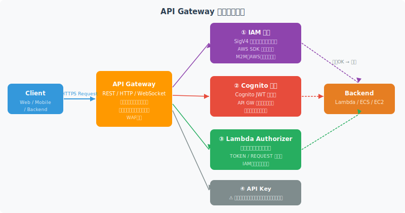

<!--
API GW 4つの認証方式: IAM認証(SigV4)、Cognito Authorizer、Lambda Authorizer(TOKEN/REQUEST)、API Key(制限的用途のみ)
-->

---

# Lambda Authorizer 設計

- **TOKEN タイプ** — Authorization ヘッダーのトークン (JWT) を検証
- **REQUEST タイプ** — ヘッダー・クエリ・パス・ステージ変数全てにアクセス可能。複合条件に
- **キャッシュ** — ARN ベースのポリシーキャッシュ (TTL: 0〜3600秒)。レイテンシ削減


---

# Lambda Authorizer 設計（コード例）

```javascript
exports.handler = async (event) => {
  const token = event.authorizationToken;
  const claims = await verifyJWT(token); // 署名検証必須
  return {
    principalId: claims.sub,
    policyDocument: {
      Version: '2012-10-17',
      Statement: [{
        Action: 'execute-api:Invoke',
        Effect: 'Allow',
        Resource: event.methodArn
      }]
    },
    context: { userId: claims.sub, role: claims['custom:role'] }
  };
};
```


---

# JWT 検証ミドルウェア設計

- **検証ステップ①**: JWKS エンドポイントから公開鍵取得 (`/.well-known/jwks.json`)
- **検証ステップ②**: JWT ヘッダーの `kid` で使用鍵を特定
- **検証ステップ③**: 署名検証 (`RS256` / `ES256`)
- **検証ステップ④**: クレーム検証 — `iss`, `aud`, `exp`, `nbf`
- **JWKS キャッシュ**: 公開鍵は TTL 付きでキャッシュ。キーローテーション時も自動対応
- **パフォーマンス**: ローカル検証 (0.1ms) vs Introspection Endpoint (1〜10ms)


---

<!-- _class: lead -->
# Zero Trust アーキテクチャ

- <svg viewBox="0 0 800 400" style="max-height:70vh;max-width:100%;display:block;margin:0 auto;" xmlns="http://www.w3.org/2000/svg">
<rect width="800" height="400" fill="#1a1a2e"/>
<text x="400" y="28" text-anchor="middle" fill="#ffffff" font-size="16" font-weight="bold" font-family="sans-serif">Zero Trust アーキテクチャ</text>
<rect x="30" y="50" width="740" height="95" rx="10" fill="#16213e" stroke="#e91e63" stroke-width="2"/>
<text x="400" y="78" text-anchor="middle" fill="#e91e63" font-size="16" font-weight="bold" font-family="sans-serif">Never Trust, Always Verify</text>
<text x="400" y="110" text-anchor="middle" fill="#ffffff" font-size="13" font-family="sans-serif">ネットワーク位置に依存せず、全アクセスを継続的に検証する</text>
<text x="400" y="135" text-anchor="middle" fill="#ffffff" font-size="12" font-family="sans-serif">「境界防御モデル」から「アイデンティティ中心モデル」へ</text>
<rect x="30" y="165" width="220" height="90" rx="8" fill="#16213e" stroke="#f9a825" stroke-width="1.5"/>
<text x="140" y="192" text-anchor="middle" fill="#f9a825" font-size="13" font-weight="bold" font-family="sans-serif">Identity Verification</text>
<text x="140" y="215" text-anchor="middle" fill="#ffffff" font-size="11" font-family="sans-serif">MFA / FIDO2</text>
<text x="140" y="237" text-anchor="middle" fill="#ffffff" font-size="11" font-family="sans-serif">継続的認証</text>
<rect x="290" y="165" width="220" height="90" rx="8" fill="#16213e" stroke="#e91e63" stroke-width="1.5"/>
<text x="400" y="192" text-anchor="middle" fill="#e91e63" font-size="13" font-weight="bold" font-family="sans-serif">Least Privilege</text>
<text x="400" y="215" text-anchor="middle" fill="#ffffff" font-size="11" font-family="sans-serif">最小権限アクセス</text>
<text x="400" y="237" text-anchor="middle" fill="#ffffff" font-size="11" font-family="sans-serif">動的ポリシー</text>
<rect x="550" y="165" width="220" height="90" rx="8" fill="#16213e" stroke="#2196f3" stroke-width="1.5"/>
<text x="660" y="192" text-anchor="middle" fill="#2196f3" font-size="13" font-weight="bold" font-family="sans-serif">Assume Breach</text>
<text x="660" y="215" text-anchor="middle" fill="#ffffff" font-size="11" font-family="sans-serif">侵害前提の設計</text>
<text x="660" y="237" text-anchor="middle" fill="#ffffff" font-size="11" font-family="sans-serif">侵害範囲の最小化</text>
<rect x="30" y="278" width="340" height="85" rx="8" fill="#16213e" stroke="#4caf50" stroke-width="1.5"/>
<text x="200" y="305" text-anchor="middle" fill="#4caf50" font-size="13" font-weight="bold" font-family="sans-serif">検証対象</text>
<text x="45" y="330" fill="#ffffff" font-size="11" font-family="sans-serif">• ユーザーアイデンティティ (MFA)</text>
<text x="45" y="353" fill="#ffffff" font-size="11" font-family="sans-serif">• デバイスの健全性 / コンプライアンス</text>
<rect x="430" y="278" width="340" height="85" rx="8" fill="#16213e" stroke="#f9a825" stroke-width="1.5"/>
<text x="600" y="305" text-anchor="middle" fill="#f9a825" font-size="13" font-weight="bold" font-family="sans-serif">AWS実装例</text>
<text x="445" y="330" fill="#ffffff" font-size="11" font-family="sans-serif">• IAM Identity Center + MFA</text>
<text x="445" y="353" fill="#ffffff" font-size="11" font-family="sans-serif">• VPC Lattice / Service Mesh</text>
</svg>
- Never Trust, Always Verify
- 境界型セキュリティからの脱却


---

# Zero Trust 原則

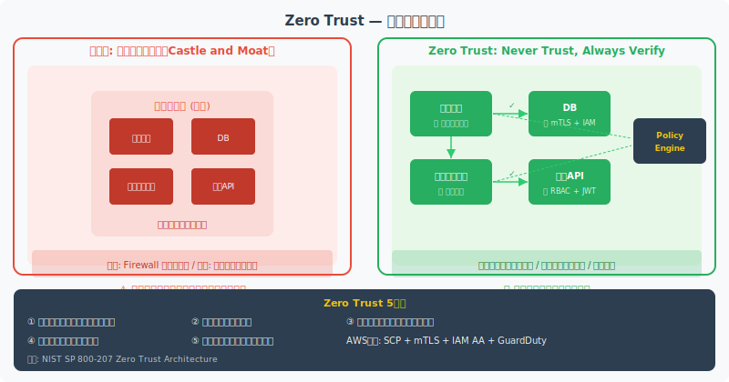

<!--
Zero Trust 5原則: 1)ネットワーク境界を信頼しない 2)最小権限 3)全通信を検査・記録 4)デバイス/ユーザーを継続検証 5)マイクロセグメンテーション
-->

---

# Zero Trust AWS 実装例

- **アイデンティティ検証**: IAM Identity Center + MFA 強制 / Cognito + リスクベース認証
- **デバイス検証**: AWS Verified Access — デバイス状態確認後にアクセス許可
- **ネットワーク分離**: VPC / Security Group / Network ACL / PrivateLink でミクロ分離
- **通信暗号化**: TLS 1.2+ 強制 / ACM 証明書 / mTLS (ACM PCA)
- **継続的監視**: CloudTrail + GuardDuty + Security Hub + Detective
- **ポリシー強制**: SCP + Permission Boundaries + AWS Config Rules


---

# マイクロサービス間認証 — mTLS

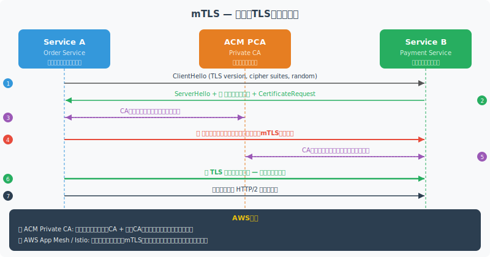

<!--
mTLS: 双方向TLS。サーバーとクライアント両方が証明書を提示。ACM PCAでプライベートCA、AWS App MeshやIstioでサービスメッシュ内の自動mTLS
-->

---

# サービスメッシュによる認可

- **サービスメッシュ**: サービス間通信をサイドカープロキシ(Envoy)で制御・観測
- **AWS App Mesh**: ECS/EKS 向けマネージドメッシュ。mTLS と L7 ルーティング
- **Istio on EKS**: 高機能。mTLS自動、認証ポリシー、AuthorizationPolicy


---

# サービスメッシュによる認可（コード例）

```yaml
apiVersion: security.istio.io/v1beta1
kind: AuthorizationPolicy
metadata:
  name: payment-service-policy
spec:
  selector:
    matchLabels:
      app: payment
  rules:
  - from:
    - source:
        principals:
          - cluster.local/ns/default/sa/order-service
    to:
    - operation:
        methods: ["POST"]
        paths: ["/payment/*"]
```


---

<!-- _class: lead -->
# アンチパターン

- <svg viewBox="0 0 800 400" style="max-height:70vh;max-width:100%;display:block;margin:0 auto;" xmlns="http://www.w3.org/2000/svg">
<rect width="800" height="400" fill="#1a1a2e"/>
<text x="400" y="28" text-anchor="middle" fill="#ffffff" font-size="16" font-weight="bold" font-family="sans-serif">アンチパターン — 認証・認可の失敗パターン</text>
<rect x="20" y="50" width="230" height="300" rx="10" fill="#16213e" stroke="#e91e63" stroke-width="2"/>
<rect x="285" y="50" width="230" height="300" rx="10" fill="#16213e" stroke="#e91e63" stroke-width="2"/>
<rect x="550" y="50" width="230" height="300" rx="10" fill="#16213e" stroke="#e91e63" stroke-width="2"/>
<text x="135" y="78" text-anchor="middle" fill="#e91e63" font-size="13" font-weight="bold" font-family="sans-serif">過剰権限</text>
<text x="400" y="78" text-anchor="middle" fill="#e91e63" font-size="13" font-weight="bold" font-family="sans-serif">シークレット漏洩</text>
<text x="665" y="78" text-anchor="middle" fill="#e91e63" font-size="13" font-weight="bold" font-family="sans-serif">検証省略</text>
<text x="35" y="112" fill="#ffffff" font-size="12" font-family="sans-serif">• AdministratorAccess</text>
<text x="35" y="138" fill="#ffffff" font-size="12" font-family="sans-serif">  全員に付与</text>
<text x="35" y="168" fill="#ffffff" font-size="12" font-family="sans-serif">• ワイルドカード *:*</text>
<text x="35" y="194" fill="#ffffff" font-size="12" font-family="sans-serif">  ポリシー乱用</text>
<text x="35" y="240" fill="#f9a825" font-size="12" font-family="sans-serif">対策:</text>
<text x="35" y="265" fill="#4caf50" font-size="12" font-family="sans-serif">Least Privilege</text>
<text x="35" y="290" fill="#4caf50" font-size="12" font-family="sans-serif">IAM Access Analyzer</text>
<text x="300" y="112" fill="#ffffff" font-size="12" font-family="sans-serif">• APIキーをソースに</text>
<text x="300" y="138" fill="#ffffff" font-size="12" font-family="sans-serif">  コミット</text>
<text x="300" y="168" fill="#ffffff" font-size="12" font-family="sans-serif">• 平文でDB保存</text>
<text x="300" y="194" fill="#ffffff" font-size="12" font-family="sans-serif">• 環境変数直接</text>
<text x="300" y="240" fill="#f9a825" font-size="12" font-family="sans-serif">対策:</text>
<text x="300" y="265" fill="#4caf50" font-size="12" font-family="sans-serif">Secrets Manager</text>
<text x="300" y="290" fill="#4caf50" font-size="12" font-family="sans-serif">IAM Role (EC2/Lambda)</text>
<text x="565" y="112" fill="#ffffff" font-size="12" font-family="sans-serif">• JWTの署名を</text>
<text x="565" y="138" fill="#ffffff" font-size="12" font-family="sans-serif">  検証せず信頼</text>
<text x="565" y="168" fill="#ffffff" font-size="12" font-family="sans-serif">• exp/aud未確認</text>
<text x="565" y="194" fill="#ffffff" font-size="12" font-family="sans-serif">• alg:none許可</text>
<text x="565" y="240" fill="#f9a825" font-size="12" font-family="sans-serif">対策:</text>
<text x="565" y="265" fill="#4caf50" font-size="12" font-family="sans-serif">JWKSで署名検証</text>
<text x="565" y="290" fill="#4caf50" font-size="12" font-family="sans-serif">全クレーム検証必須</text>
<text x="400" y="370" text-anchor="middle" fill="#e91e63" font-size="12" font-family="sans-serif">セキュリティ事故の多くはこれら3パターンのいずれか</text>
</svg>
- よくある失敗パターンと対策
- 設計段階で避けるべきリスク


---

# アンチパターン①: 過剰な権限付与

- ❌ **`"Action": "*"` / `"Resource": "*"`** — ワイルドカード多用。侵害時に全リソース危険
- ❌ **共有 IAM ユーザー** — チームで共有するアクセスキー。誰の操作か追跡不能
- ❌ **AdministratorAccess を開発者に付与** — 利便性優先でガードレールなし
- ✅ **対策**: IAM Access Analyzer で未使用権限検出 → 最小権限ポリシーに置換
- ✅ **対策**: SCPs でガードレール設定 + Permission Boundaries でデリゲーション制御
- ✅ **対策**: 定期的な CloudTrail 分析で実際に使われている API のみ許可


---

# アンチパターン②: シークレット管理の誤り

- ❌ **ハードコード** — コードや設定ファイルに API Key / DB パスワードを直書き
- ❌ **環境変数の平文保存** — Lambda / ECS の環境変数に機密情報。ロールでアクセス可能
- ❌ **長期 IAM Access Key** — ローテーション未設定。90日以上経過のキーは高リスク
- ✅ **AWS Secrets Manager** — 自動ローテーション + 監査ログ + クロスアカウント共有
- ✅ **SSM Parameter Store** — SecureString (KMS暗号化)。Secrets Managerより安価
- ✅ **IAM Role で代替** — アクセスキー不要に。EC2/Lambda/ECS は Role を優先


---

# アンチパターン③: トークン検証省略

- ❌ **署名検証なし** — Base64 デコードで claims を信頼。改ざんに気づかない
- ❌ **`alg: none` 受け入れ** — アルゴリズム置換攻撃。lib で `none` 禁止必須
- ❌ **`exp` / `aud` 未検証** — 期限切れトークンや他サービス向けトークンを受け入れ
- ❌ **Introspection 省略** — 失効したトークンを有効と判断
- ✅ **対策**: JWKS + `kid` ベースの署名検証を必須化
- ✅ **対策**: `iss`, `aud`, `exp`, `nbf` の検証を JWT ライブラリで強制設定


---

# アーキテクト向け 設計チェックリスト

- <svg viewBox="0 0 800 400" style="max-height:70vh;max-width:100%;display:block;margin:0 auto;" xmlns="http://www.w3.org/2000/svg">
<rect width="800" height="400" fill="#1a1a2e"/>
<text x="400" y="28" text-anchor="middle" fill="#ffffff" font-size="15" font-weight="bold" font-family="sans-serif">アーキテクト向け 設計チェックリスト</text>
<rect x="20" y="50" width="370" height="310" rx="10" fill="#16213e" stroke="#f9a825" stroke-width="2"/>
<rect x="410" y="50" width="370" height="310" rx="10" fill="#16213e" stroke="#e91e63" stroke-width="2"/>
<text x="205" y="76" text-anchor="middle" fill="#f9a825" font-size="14" font-weight="bold" font-family="sans-serif">認証 チェックリスト</text>
<text x="595" y="76" text-anchor="middle" fill="#e91e63" font-size="14" font-weight="bold" font-family="sans-serif">認可 チェックリスト</text>
<text x="35" y="108" fill="#4caf50" font-size="13" font-family="sans-serif">✓</text>
<text x="55" y="108" fill="#ffffff" font-size="12" font-family="sans-serif">MFA 全アカウントで強制</text>
<text x="35" y="136" fill="#4caf50" font-size="13" font-family="sans-serif">✓</text>
<text x="55" y="136" fill="#ffffff" font-size="12" font-family="sans-serif">PKCE + Authorization Code</text>
<text x="35" y="164" fill="#4caf50" font-size="13" font-family="sans-serif">✓</text>
<text x="55" y="164" fill="#ffffff" font-size="12" font-family="sans-serif">JWT署名検証 (RS256/ES256)</text>
<text x="35" y="192" fill="#4caf50" font-size="13" font-family="sans-serif">✓</text>
<text x="55" y="192" fill="#ffffff" font-size="12" font-family="sans-serif">Token有効期限の適切設定</text>
<text x="35" y="220" fill="#4caf50" font-size="13" font-family="sans-serif">✓</text>
<text x="55" y="220" fill="#ffffff" font-size="12" font-family="sans-serif">Refresh Token Rotation</text>
<text x="35" y="248" fill="#4caf50" font-size="13" font-family="sans-serif">✓</text>
<text x="55" y="248" fill="#ffffff" font-size="12" font-family="sans-serif">aud / iss / nonce 全検証</text>
<text x="35" y="276" fill="#4caf50" font-size="13" font-family="sans-serif">✓</text>
<text x="55" y="276" fill="#ffffff" font-size="12" font-family="sans-serif">HTTPS + HSTS 必須</text>
<text x="35" y="330" fill="#4caf50" font-size="13" font-family="sans-serif">✓</text>
<text x="55" y="330" fill="#ffffff" font-size="12" font-family="sans-serif">認証ログ監査設定</text>
<text x="425" y="108" fill="#4caf50" font-size="13" font-family="sans-serif">✓</text>
<text x="445" y="108" fill="#ffffff" font-size="12" font-family="sans-serif">Least Privilege 原則</text>
<text x="425" y="136" fill="#4caf50" font-size="13" font-family="sans-serif">✓</text>
<text x="445" y="136" fill="#ffffff" font-size="12" font-family="sans-serif">IAM Access Analyzer 有効</text>
<text x="425" y="164" fill="#4caf50" font-size="13" font-family="sans-serif">✓</text>
<text x="445" y="164" fill="#ffffff" font-size="12" font-family="sans-serif">ロール vs ポリシー適切選択</text>
<text x="425" y="192" fill="#4caf50" font-size="13" font-family="sans-serif">✓</text>
<text x="445" y="192" fill="#ffffff" font-size="12" font-family="sans-serif">Permission Boundary設定</text>
<text x="425" y="220" fill="#4caf50" font-size="13" font-family="sans-serif">✓</text>
<text x="445" y="220" fill="#ffffff" font-size="12" font-family="sans-serif">SCP で組織レベル制御</text>
<text x="425" y="248" fill="#4caf50" font-size="13" font-family="sans-serif">✓</text>
<text x="445" y="248" fill="#ffffff" font-size="12" font-family="sans-serif">クロスアカウント設計</text>
<text x="425" y="276" fill="#4caf50" font-size="13" font-family="sans-serif">✓</text>
<text x="445" y="276" fill="#ffffff" font-size="12" font-family="sans-serif">定期的な権限レビュー</text>
<text x="425" y="330" fill="#4caf50" font-size="13" font-family="sans-serif">✓</text>
<text x="445" y="330" fill="#ffffff" font-size="12" font-family="sans-serif">CloudTrail 全操作記録</text>
</svg>
- **認証**: [ ] MFA 強制 / [ ] パスワードポリシー / [ ] セッション有効期限 / [ ] FIDO2検討
- **トークン**: [ ] 短命アクセストークン / [ ] Refresh Rotation / [ ] JWKS + 署名検証
- **IAM**: [ ] 最小権限 / [ ] IAM Role優先 / [ ] SCP設定 / [ ] Access Analyzer有効化
- **シークレット**: [ ] Secrets Manager / [ ] 長期キー棚卸し / [ ] ハードコードゼロ
- **ネットワーク**: [ ] mTLS (マイクロサービス) / [ ] PrivateLink / [ ] VPC エンドポイント
- **監視**: [ ] CloudTrail ALL有効 / [ ] GuardDuty / [ ] Security Hub / [ ] 定期レビュー


---

# 参考資料 (1/2)（1/2）

- **RFC / 標準仕様**
- - [RFC 6749 — OAuth 2.0](https://tools.ietf.org/html/rfc6749)
- - [RFC 7519 — JWT](https://tools.ietf.org/html/rfc7519) | [RFC 7636 — PKCE](https://tools.ietf.org/html/rfc7636)
- - [OpenID Connect Core 1.0](https://openid.net/specs/openid-connect-core-1_0.html)


---

# 参考資料 (1/2)（2/2）

- - [SAML 2.0 Technical Overview](https://docs.oasis-open.org/security/saml/v2.0/)
- **セキュリティガイドライン**
- - [NIST SP 800-207 — Zero Trust Architecture](https://csrc.nist.gov/publications/detail/sp/800-207/final)
- - [OAuth 2.0 Security Best Current Practice (RFC 9700)](https://tools.ietf.org/html/rfc9700)


---

# 参考資料 (2/2)（1/2）

- **AWS ドキュメント**
- - [IAM Best Practices](https://docs.aws.amazon.com/IAM/latest/UserGuide/best-practices.html)
- - [Amazon Cognito Developer Guide](https://docs.aws.amazon.com/cognito/latest/developerguide/)
- - [Zero Trust Architecture on AWS](https://aws.amazon.com/security/zero-trust/)


---

# 参考資料 (2/2)（2/2）

- - [EKS IRSA Documentation](https://docs.aws.amazon.com/eks/latest/userguide/iam-roles-for-service-accounts.html)
- **その他**
- - [Google Zanzibar Paper (2019)](https://research.google/pubs/zanzibar-googles-consistent-global-authorization-system/)
- - [OpenFGA — ReBAC OSS](https://openfga.dev/) | [OPA — Policy Engine](https://www.openpolicyagent.org/)

