<!-- _class: lead -->
# AWS Certified Generative AI Developer - Professional

- 応用的資料 — 試験合格のための技術解説
- 対象: AWS認定試験の受験者
- カバー範囲: Bedrock アーキテクチャ / RAG / Agents / 評価・安全・責任あるAI


---

# 試験ドメイン構成

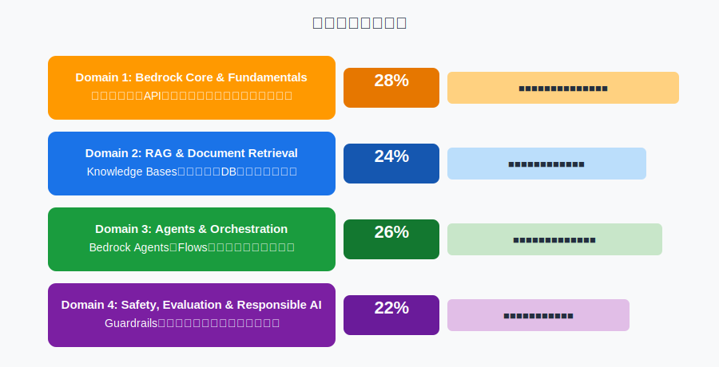


---

# アジェンダ (1/2)

- **Part 1: Amazon Bedrock アーキテクチャ (Slide 5–29)**
- → 基盤モデル選択・コアAPI・ファインチューニング・コスト最適化
- → Cross-region Inference・Marketplace・Bedrock Studio
- **Part 2: RAG・ドキュメント検索 (Slide 30–54)**
- → Knowledge Bases・ベクターストア・チャンク戦略
- → ハイブリッド検索・Reranking・HyDE・RAG評価指標


---

# アジェンダ (2/2)

- **Part 3: Agents・オーケストレーション (Slide 55–80)**
- → Action Groups・ReAct・マルチエージェント・Flows
- → Prompt Management・Inline Agents・EventBridge連携
- **Part 4: 評価・安全・責任あるAI (Slide 81–102)**
- → Guardrails・コンテンツフィルタリング・PII・インジェクション対策
- → LLM-as-judge・Bedrock Evaluation・VPC Endpoint・IAM
- **まとめ (Slide 103–105)**
- → 全体サマリー・試験対策チェックリスト・参考リソース


---

<!-- _class: lead -->
# Part 1: Amazon Bedrock アーキテクチャ

- 基盤モデル・API・ファインチューニング・コスト最適化
- Cross-region Inference・Marketplace・Bedrock Studio


---

# Amazon Bedrock とは

- **定義**: AWSが提供するフルマネージド生成AIプラットフォーム
- **特徴**: 複数の基盤モデル (FM) を統一APIで利用可能
- **ゼロデータリテンション**: デフォルトでユーザーデータをモデル学習に使用しない
- **セキュリティ**: VPC内で完結、IAMで細粒度アクセス制御
- **マルチモーダル**: テキスト・画像・動画・埋め込みをサポート
- **統合機能**: Knowledge Bases / Agents / Guardrails / Evaluation


---

# Amazon Bedrock 全体アーキテクチャ

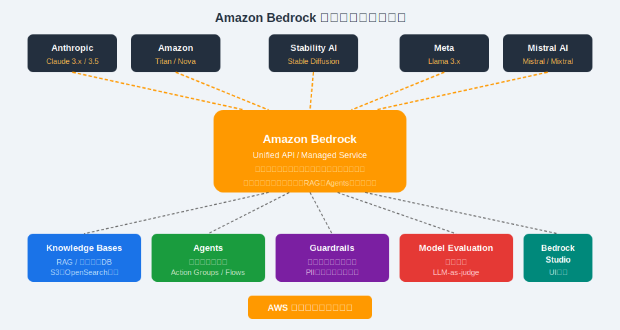


---

# InvokeModel API — 詳細

- **エンドポイント**: `POST /model/{modelId}/invoke`
- **リクエスト形式**: モデル固有のJSON body (各プロバイダで異なる)
- **Streaming**: `invokeModelWithResponseStream` でストリーミング対応
- **対応モデル**: Stability AI, Titan Embeddings など画像/埋め込みモデル
- **注意**: モデル変更時にリクエスト形式の変更が必要
- **用途**: 画像生成 / Embedding / モデル固有の高度パラメータ制御

```json
{
  "modelId": "stability.stable-diffusion-xl-v1",
  "contentType": "application/json",
  "body": {
    "text_prompts": [{"text": "a sunset over mountains"}],
    "cfg_scale": 10,
    "steps": 50
  }
}
```


---

# Converse API — 詳細

- **統一インターフェース**: モデル非依存の標準メッセージ形式
- **マルチターン**: `messages` 配列で会話履歴を管理
- **Tool Use**: Function Calling を標準サポート
- **ストリーミング**: `ConverseStream` API でリアルタイム応答
- **ドキュメント**: PDF/Word/Markdownなどドキュメント添付可能
- **対応モデル**: Claude / Titan Nova / Llama / Mistral など主要モデル

```json
{
  "modelId": "anthropic.claude-3-5-sonnet-20241022-v2:0",
  "messages": [
    {"role": "user", "content": [{"type": "text", "text": "S3の料金体系は?"}]}
  ],
  "system": [{"text": "あなたはAWSのエキスパートです"}],
  "inferenceConfig": {"maxTokens": 2000, "temperature": 0.3}
}
```


---

# InvokeModel vs Converse API 比較

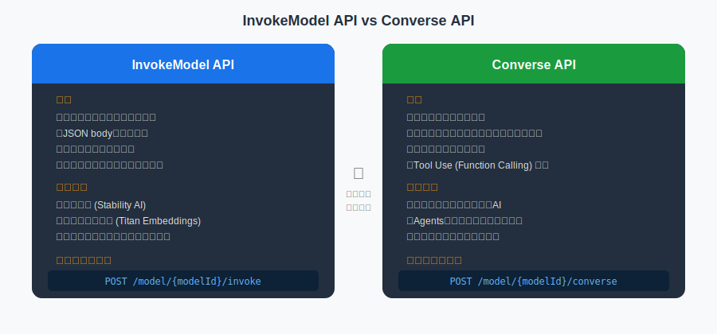


---

# 主要基盤モデル比較

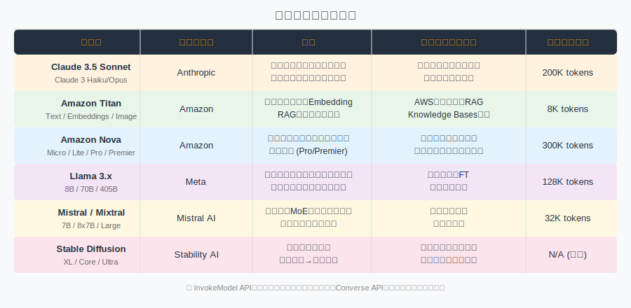


---

# モデル選定の判断フレームワーク

- **コスト重視**: Amazon Nova Micro / Claude 3 Haiku
- → 分類・抽出・短文生成などシンプルタスク
- **バランス型**: Amazon Nova Pro / Claude 3.5 Sonnet
- → 一般的なチャットボット・コンテンツ生成・RAG
- **最高性能**: Claude 3.5 Sonnet (最新) / Nova Premier
- → 複雑な推論・コーディング・マルチモーダル分析
- **画像生成**: Stability AI Stable Diffusion / Amazon Nova Canvas
- **埋め込み**: Amazon Titan Embeddings V2 / Cohere Embed


---

# プロビジョンドスループット vs オンデマンド

- **オンデマンド**: 使った分だけ課金 / 即時利用可能 / スロットリングあり
- **プロビジョンドスループット**: 月額固定 / 専用容量 / スロットリングなし
- **MCU (Model Compute Unit)**: プロビジョンドの課金単位 (TPS=トークン/秒)
- **コミット期間**: 1ヶ月 or 6ヶ月 (6ヶ月でさらに割引)
- **ユースケース**: 高トラフィック / 予測可能な負荷 / 低レイテンシ要件
- **試験ポイント**: 高スループット → プロビジョンド / 散発的利用 → オンデマンド


---

# ファインチューニング概要

- **目的**: ベースモデルを特定タスク・ドメインに特化させる
- **2種類**: 継続的事前学習 (CPT) と 指示チューニング (IFT/SFT)
- **対応モデル**: Amazon Titan Text / Llama 3.x / Mistral など (Claudeは非対応)
- **データ形式**: JSONL (prompt/completion ペアまたは messages 形式)
- **必要条件**: S3バケット + IAMロール (BedrockがS3アクセス可能)
- **成果物**: カスタムモデル (S3保存) → プロビジョンドスループットで利用


---

# ファインチューニング パイプライン

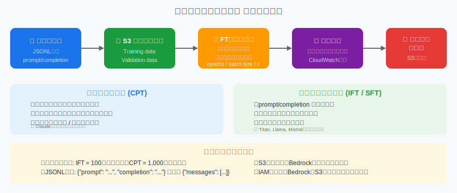


---

# RAG vs ファインチューニング 選択基準

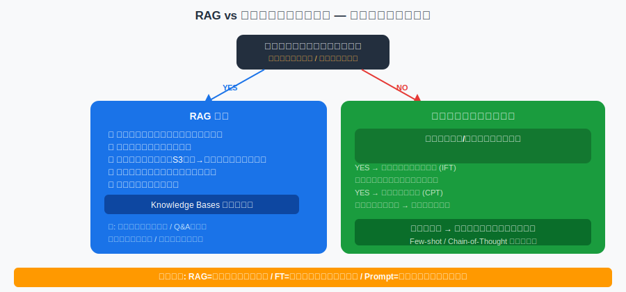


---

# ファインチューニング データ要件

- **JSONL形式 (Chat形式)**: `{"messages": [{"role": "user", "content": "..."}, {"role": "assistant", "content": "..."}]}`
- **最小サンプル数**: 指示チューニング = 100件以上推奨
- **継続的事前学習**: `{"input": "ドメイン固有のテキストデータ"}` 形式
- **データ品質**: 多様性・一貫性・高品質なペアが重要
- **バリデーションセット**: 訓練データの10-20%をバリデーションに
- **禁止事項**: PII含むデータ / 著作権侵害コンテンツ / 不適切コンテンツ


---

# Cross-Region Inference

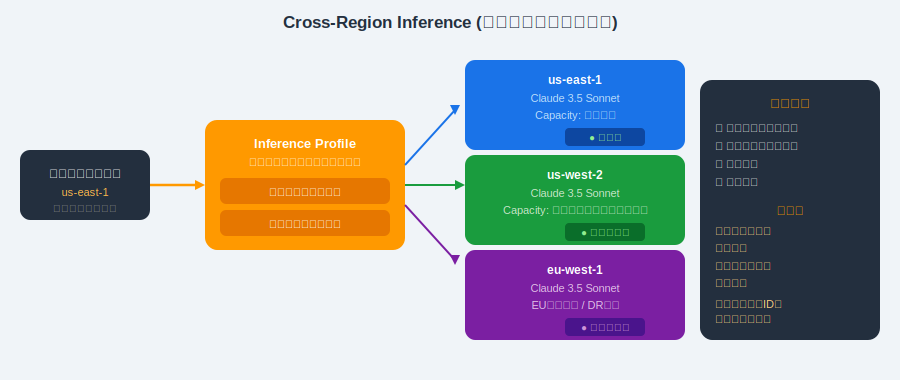


---

# Inference Profiles

- **定義**: クロスリージョン推論を管理する仮想リソース
- **動作**: リクエストを複数リージョンに自動分散・フォールバック
- **メリット**: スロットリング回避 / 高可用性 / 低レイテンシ
- **設定**: モデルIDの代わりにInference Profile ARNを指定
- **System Defined**: AWSが事前定義済みのクロスリージョンプロファイル
- **Application Inference Profile**: ユーザー定義 / タグ付け / コスト追跡
- **試験ポイント**: 「スロットリングを回避して高可用性」→ Inference Profile


---

# Amazon Bedrock Marketplace

- **概要**: サードパーティモデルをBedrockから直接利用する仕組み
- **提供モデル**: Mistral AI / Cohere / AI21 Labs / Writer など
- **メリット**: ベンダーとの個別契約不要 / AWS請求に統合
- **Model Packages**: Bedrock APIで標準的に利用可能
- **Endpoint**: SageMakerと連携した推論エンドポイント
- **試験ポイント**: サードパーティモデルの統合 → Bedrock Marketplace


---

# モデル呼び出しログと監視

- **Invocation Logging**: 全API呼び出しをCloudWatch Logsに記録
- **ログ内容**: リクエスト/レスポンス本文 / タイムスタンプ / モデルID
- **S3出力**: 大容量ログはS3バケットに保存
- **CloudWatch Metrics**: InputTokenCount / OutputTokenCount / Latency
- **コスト追跡**: Cost Explorerでモデル別コストを確認
- **試験ポイント**: 規制コンプライアンス → Invocation Logging有効化


---

# コスト最適化戦略

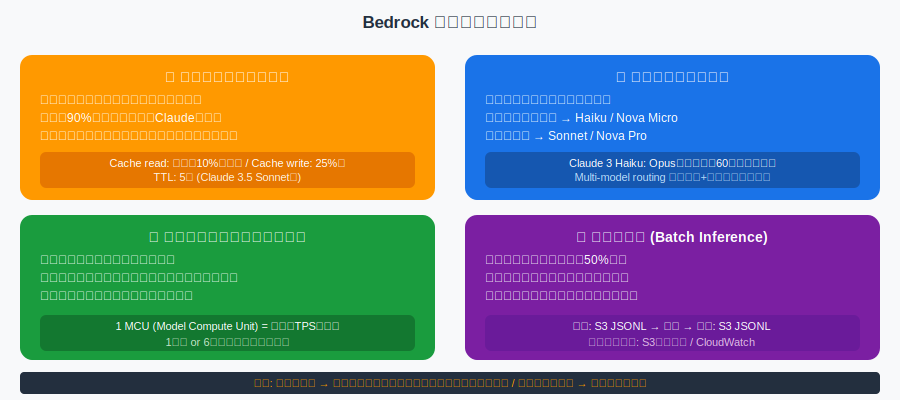


---

# Bedrock + SageMaker 連携パターン

- **パターン1: FM on Bedrock → 推論 → SageMaker Processing で後処理**
- → 大規模バッチ推論 + Python処理パイプライン
- **パターン2: SageMaker カスタムモデル → Bedrock Agentsのツールとして使用**
- → 独自MLモデルとLLMの組み合わせ
- **パターン3: SageMaker Feature Store → RAG のメタデータ管理**
- → 構造化特徴量とベクター検索の統合
- **パターン4: SageMaker Pipelines → FTパイプラインの自動化**
- → データ準備 → FTジョブ → 評価 → デプロイの自動化


---

# Amazon Bedrock Studio

- **概要**: Bedrockのビジュアル開発・実験環境 (コンソールUI)
- **主な機能**: プロンプトの作成・テスト・比較
- **Playground**: テキスト / チャット / 画像生成 / Embeddingをインタラクティブに実行
- **Prompt Management**: プロンプトテンプレートのバージョン管理
- **Model Evaluation**: UIから評価ジョブを作成・結果を可視化
- **Agents**: ノーコードでAgentの作成・テスト・デバッグ


---

# Part 1: 試験ポイントまとめ

- **API選択**: 統一形式でマルチモデル → Converse API / モデル固有 → InvokeModel
- **モデル選択**: コスト↓ → Haiku/Nova Micro / 高性能 → Sonnet/Nova Pro
- **FTとRAG**: 最新情報・社内ナレッジ → RAG / 出力スタイル特化 → FT
- **スループット**: 安定した高負荷 → プロビジョンド / 散発 → オンデマンド
- **スロットリング回避**: Cross-region Inference + Inference Profile
- **コスト削減**: プロンプトキャッシュ (最大90%) / バッチ推論 (50%)
- **セキュリティ**: Invocation Logging + CloudWatch + VPC Endpoint


---

# Part 1: よくある落とし穴

- ❌ ClaudeでファインチューニングしようとするがClaudeはFT非対応
- ❌ プロビジョンドスループットをオンデマンドと同じコスト感で想定
- ❌ Cross-region InferenceでデータがリージョンをまたぐことのGDPR考慮漏れ
- ❌ バッチ推論をリアルタイム要件があるアプリに使おうとする
- ❌ Titan Embeddingsでチャット応答を生成しようとする (埋め込み専用)
- ❌ Stable DiffusionにConverseAPIを使おうとする (画像生成はInvokeModelのみ)


---

# Part 1: 重要キーワード一覧

- **API**: InvokeModel / ConverseAPI / InvokeModelWithResponseStream
- **モデル**: Claude / Titan Nova / Titan Embeddings / Llama / Mistral / Stable Diffusion
- **FT**: 継続的事前学習 (CPT) / 指示チューニング (IFT) / JSONL
- **スループット**: Provisioned Throughput / MCU / オンデマンド
- **コスト**: Prompt Caching / Batch Inference / Cross-Region Inference
- **監視**: Invocation Logging / CloudWatch Metrics / Cost Explorer


---

<!-- _class: lead -->
# Part 2: RAG・ドキュメント検索

- Knowledge Bases・ベクターストア・チャンク戦略・評価指標


---

# RAGの基本概念

- **RAG (Retrieval-Augmented Generation)**: 検索+生成の組み合わせ
- **問題**: LLMの知識カットオフ / ハルシネーション / 社内情報なし
- **解決**: 外部知識ベースをリアルタイムで検索してコンテキストに追加
- **2フェーズ**: Indexing (事前準備) と Retrieval+Generation (実行時)
- **Indexing**: 文書分割 → Embedding → ベクターDB格納
- **Retrieval**: クエリEmbedding → 類似度検索 → 関連文書取得


---

# RAG アーキテクチャ全体図

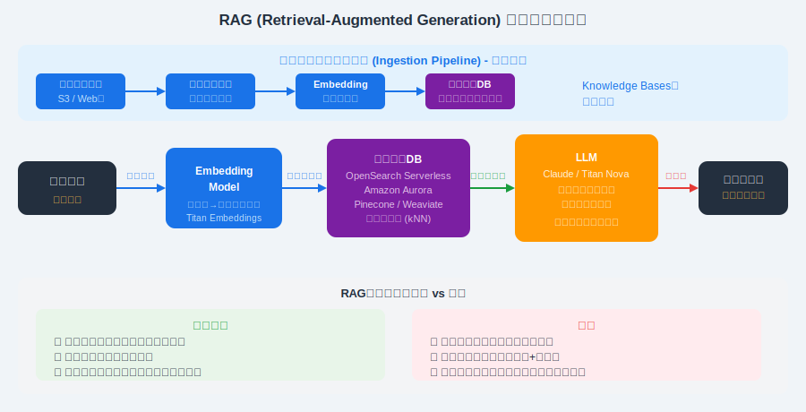


---

# Amazon Bedrock Knowledge Bases 概要

- **概要**: RAGパイプラインをフルマネージドで提供するAWSサービス
- **自動化**: 文書取り込み → チャンク → Embedding → ベクターDB格納を自動
- **API**: `RetrieveAndGenerate` (検索+生成一体型) / `Retrieve` (検索のみ)
- **データソース**: S3 / Web Crawler / Confluence / SharePoint / Salesforce
- **ベクターDB**: OpenSearch Serverless (デフォルト) / Aurora / Pinecone / MongoDB
- **同期**: 手動同期 / スケジュール同期 / 増分同期をサポート


---

# Knowledge Bases アーキテクチャ

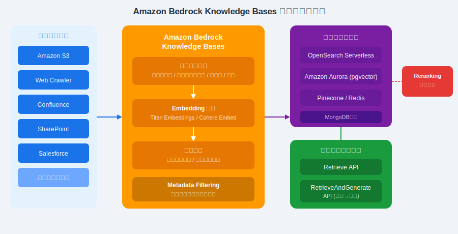


---

# データソース種別と特性

- **Amazon S3**: PDFはじめWord/Excel/CSV/HTML/Markdown/TXTを自動処理
- **Web Crawler**: URLシードから自動クロール / deep_crawl設定でリンクを追従
- **Confluence**: Space・Page・Blog投稿を直接取り込み / OAuth認証
- **SharePoint**: OnlineのドキュメントライブラリをリアルタイムSync
- **Salesforce**: ナレッジ記事・ケースコンテンツを取り込み
- **カスタムデータソース**: APIで独自コネクタを実装可能


---

# ドキュメント取り込みパイプライン

- **Step 1: 文書変換**: PDF → テキスト抽出 / OCR (画像内テキスト) 対応
- **Step 2: チャンキング**: 設定した戦略で文書を分割
- **Step 3: Embedding**: 各チャンクをベクトルに変換
- **Step 4: メタデータ付与**: ソース・タイトル・日付などのメタデータを追加
- **Step 5: ベクターDB格納**: ベクトルと元テキストをストアに保存
- **自動実行**: StartIngestionJob APIで実行 / 完了をCloudWatchで監視


---

# ベクターストア選択ガイド

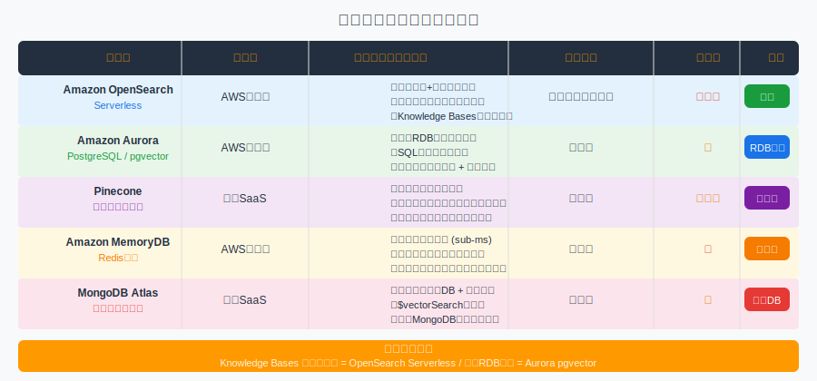


---

# OpenSearch Serverless — 詳細

- **特徴**: フルマネージド / サーバーレス / オートスケール
- **インデックスタイプ**: ベクター検索コレクション (専用タイプ)
- **kNN設定**: `algorithm: hnsw` (デフォルト) / `faiss`
- **ハイブリッド検索**: Lexical (BM25) + Semantic (vector) を統合
- **セキュリティ**: VPC / データ暗号化 / IAM / SAML認証
- **制限**: コレクション数 / インデックス数の上限あり (要事前確認)


---

# チャンク戦略概要

- **なし (No Chunking)**: 文書全体を1チャンク (長い文書には不向き)
- **固定サイズ (Fixed-size)**: 指定トークン数で分割 / シンプル / オーバーラップ設定可
- **セマンティック (Semantic)**: 意味的まとまりで分割 / 精度高 / コスト高
- **階層型 (Hierarchical)**: 親/子チャンク構造 / 精度とコンテキストを両立
- **カスタム (Custom)**: 独自の分割ロジックを実装
- **試験ポイント**: 精度最大化 → 階層型 / シンプル実装 → 固定サイズ


---

# チャンク戦略比較図

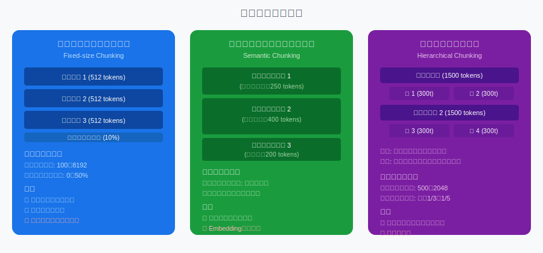


---

# セマンティックチャンキング詳細

- **仕組み**: 文章をEmbeddingし、隣接文章間の類似度が低い点で分割
- **バッファサイズ**: 分割判定に使用する前後の文章数
- **ブレークポイント閾値**: 類似度がこの値を下回ったら分割
- **処理フロー**: 文章分割 → Embedding → 類似度計算 → 分割点特定
- **メリット**: 段落・セクションの意味的まとまりを保持
- **コスト**: 各文章をEmbeddingするためオーバーヘッドが大きい


---

# 階層型チャンキング詳細


---

# Embeddingモデル選択

- **Amazon Titan Embeddings V2**: 日本語対応 / 8192トークン / 1024次元
- → Knowledge Basesデフォルト / 日本語RAGに最適
- **Cohere Embed v3**: 多言語 / 高精度 / ドメイン適応性
- → 英語中心の精度重視アプリ
- **Cohere Embed Multilingual**: 100言語以上対応
- → 多言語RAGシステム
- **試験ポイント**: 日本語RAG → Titan Embeddings / 精度重視 → Cohere Embed


---

# ベクター検索 vs ハイブリッド検索

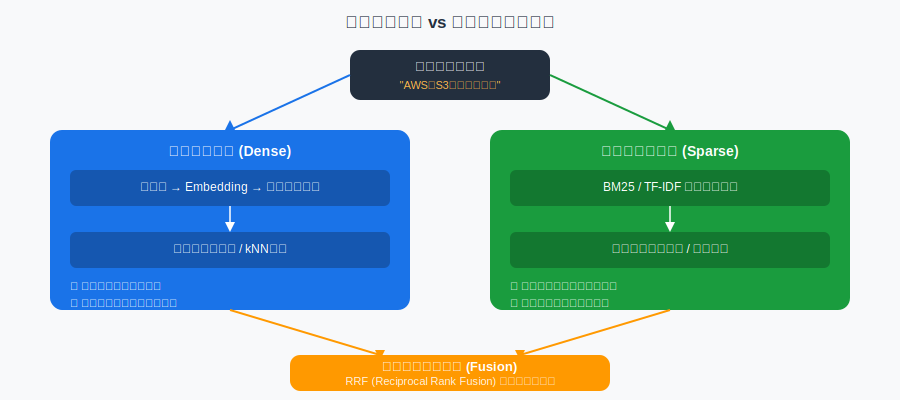


---

# 再ランキング (Reranking)

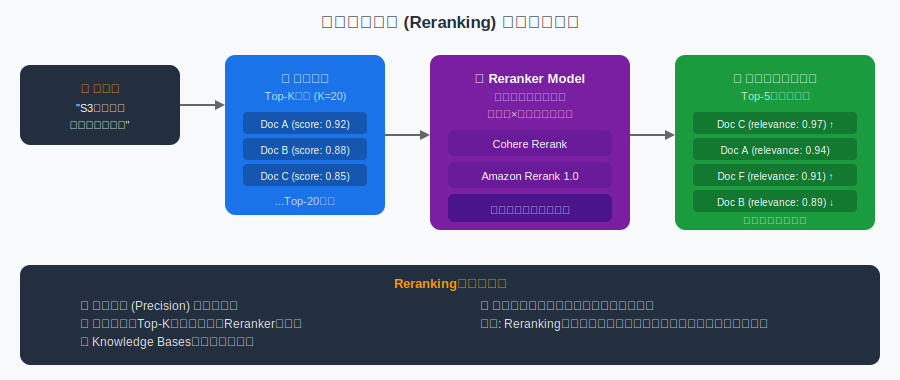


---

# HyDE (Hypothetical Document Embedding)

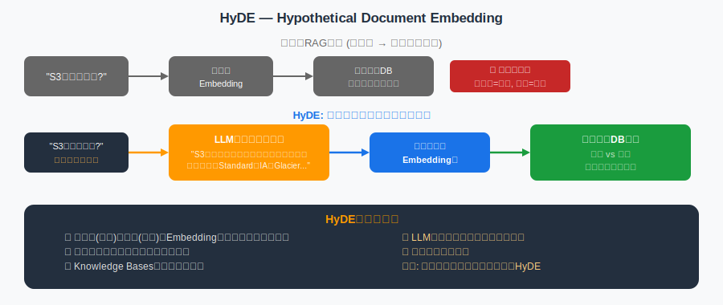


---

# Metadata Filtering

- **概要**: 検索時にメタデータ属性でチャンクを絞り込む機能
- **フィルタ例**: `{"equals": {"key": "category", "value": "pricing"}}` で特定カテゴリのみ検索
- **論理演算子**: `andAll` / `orAll` / `not` の組み合わせ
- **メタデータ付与**: S3の場合 `.metadata.json` ファイルでソースごとに設定
- **ユースケース**: 部署別文書 / 言語別フィルタ / 日付範囲指定
- **試験ポイント**: 特定属性の文書のみ検索 → Metadata Filtering


---

# RAG 評価指標

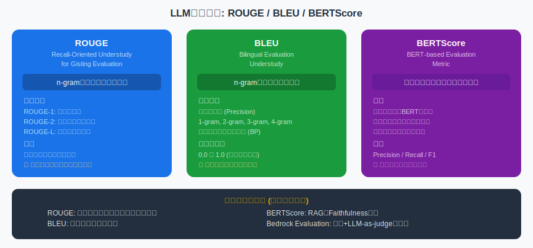


---

# Faithfulness と Answer Relevance

- **Faithfulness (忠実性)**: 回答がコンテキスト (検索結果) に基づいているか
- → 1.0 = 完全にコンテキストから回答 / 0.0 = コンテキストを無視
- → ハルシネーション検出の主要指標
- **Answer Relevance (回答関連性)**: 回答がユーザーの質問に対応しているか
- → 1.0 = 質問に完全に答えている / 0.0 = 無関係な回答
- **Context Recall**: 必要な情報が検索で取得できているか (再現率)
- **試験ポイント**: Faithfulness↓ → チャンク戦略・検索精度の改善が必要


---

# RAG vs ファインチューニング 詳細比較

| 観点 | RAG | ファインチューニング |
| --- | --- | --- |
| 知識更新 | リアルタイム | 再学習が必要 |
| 根拠提示 | ソース文書を参照可 | 学習済み知識のみ |
| ハルシネーション | 低 (根拠あり) | 中 (パラメータ依存) |
| データ量 | 少量でOK | 大量のペアが必要 |
| コスト | 低 (再学習不要) | 高 (計算リソース大) |
| 向き不向き | 最新情報・外部知識 | 出力スタイル・専門語彙 |


---

# コスト・レイテンシ最適化

- **チャンクサイズ最適化**: 大きすぎるチャンクは無関係情報混入 / 小さすぎると文脈欠損
- → 一般的には256〜512トークンが推奨値
- **Top-K削減**: 検索件数を減らしてLLMのコンテキスト量を削減
- → Rerankingと組み合わせ: Top-20 → Rerank → Top-5
- **Embedingキャッシュ**: 同一クエリの再実行はキャッシュから返す
- **小型Embeddingモデル**: 精度と速度・コストのトレードオフ
- **非同期取り込み**: バックグラウンドでIngestionを実行


---

# RAGのよくある落とし穴

- ❌ チャンクサイズが大きすぎて無関係情報がコンテキストに混入
- ❌ オーバーラップなしの固定サイズで意味が途切れる
- ❌ EmbeddingモデルとベクターDBの次元数が不一致
- ❌ 取り込み後の同期を忘れて古い情報が返り続ける
- ❌ メタデータフィルタリングを使わず精度が出ない
- ❌ Faithfulnessが低いのにモデルを変えようとする (検索改善が先)


---

# Part 2: 試験ポイントまとめ

- **Knowledge BasesデフォルトベクターDB**: OpenSearch Serverless
- **日本語RAGのEmbedding**: Amazon Titan Embeddings V2
- **精度向上の手順**: チャンク改善 → ハイブリッド検索 → Reranking → HyDE
- **Faithfulness改善**: チャンク戦略見直し / 検索精度改善
- **コスト削減**: Top-K削減 + Reranking / チャンクサイズ最適化
- **最新情報活用**: Knowledge BasesのSync（増分同期）


---

# Part 2: よくある問題パターン

- **Q: 検索は正しいが回答が間違っている → ?**
- → LLMのコンテキスト利用問題 / Faithfulnessが低い
- **Q: 正しい文書が検索されない → ?**
- → チャンク戦略・Embeddingモデルの見直し / ハイブリッド検索導入
- **Q: RAGが遅すぎる → ?**
- → Rerankingのオフ / Top-K削減 / 小型Embeddingモデル
- **Q: 社内データを最新の状態に保ちたい → ?**
- → 自動同期 (Scheduled Sync) / イベント駆動型IngestionJob


---

<!-- _class: lead -->
# Part 3: Agents・オーケストレーション

- Action Groups・ReAct・マルチエージェント・Flows・Prompt Management


---

# Bedrock Agents 概要

- **定義**: LLMが複数のツールを自律的に呼び出してタスクを達成するシステム
- **核心技術**: ReAct (Think-Act-Observe) オーケストレーションループ
- **構成要素**: 基盤モデル + Action Groups + Knowledge Base (オプション) + Guardrails
- **自律性**: 人間の介入なしで複数ステップのタスクを実行
- **適用例**: カスタマーサポート / ITオートメーション / データ分析 / コード生成
- **制御**: 最大実行時間 / 最大ステップ数で安全に制御


---

# Bedrock Agents 全体アーキテクチャ

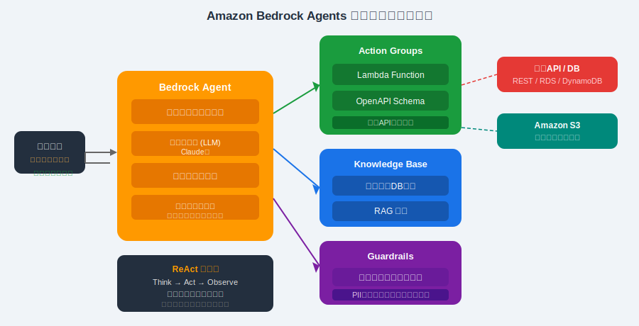


---

# Action Groups 概要

- **定義**: Agentが呼び出せるツール群のグループ
- **実行方式1**: Lambda Function (カスタムビジネスロジック / 外部API)
- **実行方式2**: Amazon Bedrock API executor (組み込みAPI実行)
- **実行方式3**: Return of Control (アプリ側で処理して結果を返す)
- **スキーマ定義**: OpenAPI 3.0形式のJSONまたはYAMLで定義
- **命名重要**: 関数名・説明・パラメータ名がLLMのツール選択精度に直結


---

# Action Groups — Lambda連携フロー

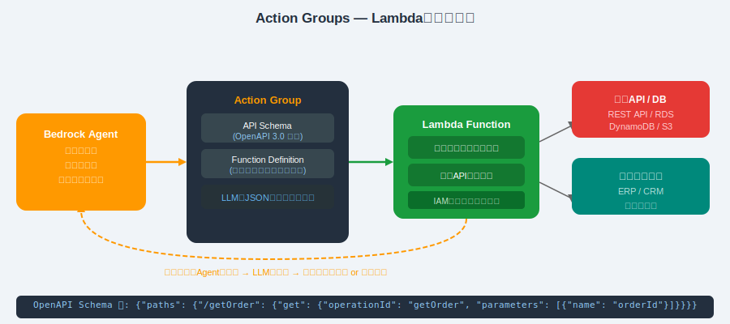


---

# OpenAPI スキーマ定義例

- **スキーマ品質がAgentの精度を左右**: 詳細な説明が必須

```yaml
openapi: 3.0.0
info:
  title: Order Management API
  version: 1.0.0
paths:
  /orders/{orderId}:
    get:
      operationId: getOrderById
      description: >
        指定された注文IDの注文詳細を取得します。
        注文ステータス、商品情報、配送情報を含みます。
      parameters:
        - name: orderId
          in: path
          required: true
          description: 取得する注文の一意識別子
          schema:
            type: string
      responses:
        '200':
          description: 注文詳細の取得成功
```


---

# ReAct オーケストレーション

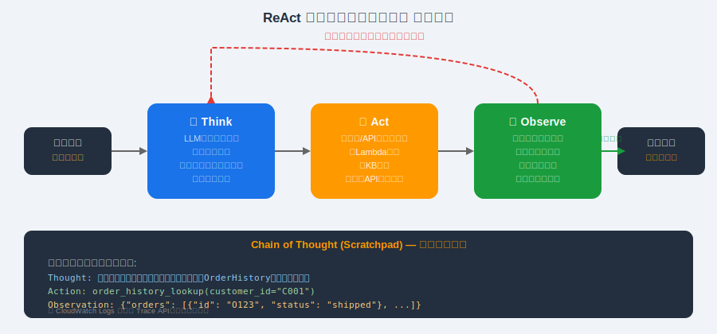


---

# エージェントの実行ライフサイクル

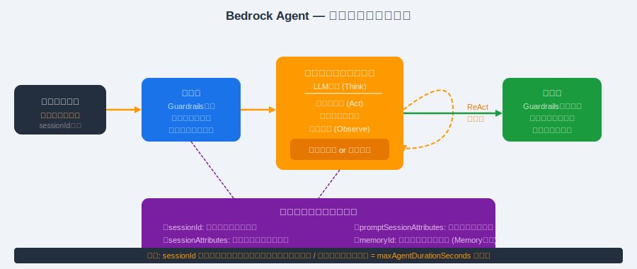


---

# セッション管理とメモリ

- **sessionId**: 会話の継続性を識別するID / 同一IDで会話コンテキストを維持
- **sessionAttributes**: セッション内で引き継ぐKey-Valueデータ
- **promptSessionAttributes**: 特定ターン間で引き継ぐプロンプト変数
- **Memory機能**: 会話履歴を長期保存してセッション間でコンテキストを維持
- **memoryId**: Memory機能で使用するID / ユーザー識別子として機能
- **試験ポイント**: 複数セッションにまたがるユーザー記憶 → Memory機能


---

# マルチエージェント概要

- **単一エージェントの限界**: 複雑タスク / 専門性の分離 / 並列処理
- **マルチエージェントの利点**: タスク分解 / 並列実行 / 専門特化
- **Supervisor パターン**: 中央エージェントがサブエージェントを管理・統合
- **ルーティング パターン**: インテント分類器がリクエストを専門エージェントへ転送
- **エージェント間通信**: Supervisor AgentがSub-AgentをAction Groupとして呼び出す
- **試験ポイント**: 複雑な多段タスク → Supervisor / シンプル分岐 → ルーティング


---

# マルチエージェント パターン

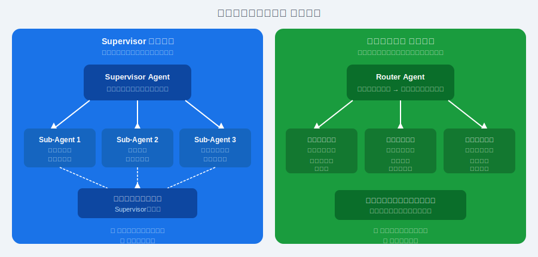


---

# Sub-Agent 設計原則

- **単一責任**: 各Sub-Agentは1つの専門ドメインのみ担当
- **明確なインターフェース**: 入出力の型・形式を明確に定義
- **独立性**: Sub-Agent間の直接依存を避ける (Supervisorを介する)
- **エラーハンドリング**: 失敗時の代替応答・エスカレーション戦略
- **コスト考慮**: ネストしたエージェント呼び出しはコストが累積
- **最大ネスト**: Bedrock Agentsは3レベルのエージェント階層をサポート


---

# Inline Agents

- **定義**: コード内で動的に設定を変えてエージェントを実行する機能
- **メリット**: エージェント設定をコードで制御 / 動的なツール追加が可能
- **ユースケース**: マルチテナント環境 / ユーザーごとに異なるツール提供
- **API**: `InvokeInlineAgent` でセッションIDとエージェント設定を同時に渡す
- **vs 通常Agent**: 通常AgentはコンソールやAPIで事前定義・保存
- **コスト**: 都度設定の解析が発生するため若干コスト増


---

# Bedrock Flows 概要

- **定義**: ノードとエッジのグラフでAIワークフローを視覚的に構築
- **ノード種別**: Input / Output / Prompt / Condition / Knowledge Base / Lambda / Agent
- **Iterator / Collector**: リスト処理の並列化とその結果の集約
- **GUI**: Bedrock StudioのFLows UIで視覚的に設計
- **バージョン管理**: Flowのバージョンを管理してBlue/Greenデプロイ
- **試験ポイント**: 条件分岐 + Knowledge Base + Lambda の組み合わせワークフロー


---

# Bedrock Flows アーキテクチャ

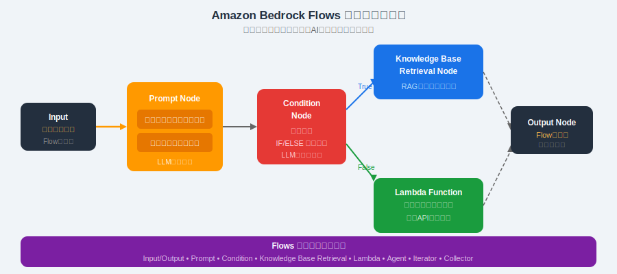


---

# Prompt Management

- **定義**: プロンプトテンプレートのバージョン管理サービス
- **バージョン**: 変更のたびにバージョンを発行 / 旧バージョンにロールバック可
- **変数**: `{{variable_name}}` でプレースホルダーを定義
- **モデル設定**: プロンプトにモデルIDと推論パラメータを紐付け
- **A/Bテスト**: 異なるプロンプトバージョンを比較評価
- **統合**: Flows / Agents から Prompt Management のバージョンを参照


---

# Prompt Versioning フロー

- **ワークフロー**: 作成 → テスト → バージョン発行 → デプロイ → 評価
- **Draft**: 開発中の作業コピー (バージョン番号なし)
- **Version**: 不変の公開済みバージョン (1, 2, 3...)
- **ARN形式**: `arn:aws:bedrock:region:account:prompt/promptId:versionId`
- **環境別切り替え**: 本番=v2 / 開発=Draft のように環境別に参照
- **ロールバック**: 問題発生時は旧バージョンのARNを参照するだけで即座に戻す


---

# EventBridge 連携

- **ユースケース**: Agentを非同期・イベント駆動で実行するパターン
- **フロー**: EventBridgeルール → Lambda → `invokeAgent` API
- **トリガー例**: S3にファイルが置かれたら自動でAgentが処理
- **スケジュール実行**: EventBridge Schedulerで定期実行
- **非同期実行**: Agentの処理結果をSNS/SQSで後続処理へ
- **試験ポイント**: 「自動化・イベント駆動」→ EventBridge + Agent パターン


---

# デバッグとトレーシング

- **Trace API**: AgentのReActループの各ステップをリアルタイムで観察
- **Trace項目**: 入力 / LLMの思考 / ツール呼び出し / 結果 / 最終回答
- **CloudWatch Logs**: 詳細ログを`/aws/bedrock/agents/`に記録
- **X-Ray**: 分散トレーシングでLambda含むフルスタックを追跡
- **コンソールデバッグ**: Bedrock StudioのTestページでStepを可視化
- **試験ポイント**: Agentの動作が予期しない → Traceで各Stepを確認


---

# エージェントのコスト管理

- **課金対象**: 各LLM呼び出しのInput/Outputトークン (ステップごと)
- **コスト累積**: ReActループが多いほどLLM呼び出しが増加
- **最適化1**: 最大ステップ数を制限して無限ループを防止
- **最適化2**: 小型で高速なモデルを使用 (Haiku / Nova Lite)
- **最適化3**: Action Groupの説明を明確にして試行錯誤を減らす
- **最適化4**: Knowledge BaseはRetrieveのみ使用してFM呼び出しを削減


---

# LangChain / LlamaIndex との連携

- **boto3連携**: LangChain/LlamaIndexからboto3経由でBedrock APIを呼び出す
- **ChatBedrock**: LangChainのBedrock統合クラス / Converse APIを内部で使用
- **AmazonKnowledgeBasesRetriever**: LangChainからKnowledge Basesを検索
- **BedrockChat (LlamaIndex)**: LlamaIndexとの統合
- **エージェント**: LangChain Agent ToolとしてBedrock Agentsを呼び出し
- **試験ポイント**: 既存LangChainコードをBedrock対応させる移行パターン


---

# エージェント設計のベストプラクティス

- **明確なシステムプロンプト**: エージェントの役割・制約・出力形式を明示
- **ツール名・説明の品質**: LLMがツールを正しく選択できるよう詳細な説明
- **エラーハンドリング**: Lambda内でtry-catchし構造化エラーを返す
- **冪等性**: 同じリクエストを複数回実行しても副作用がないように設計
- **Human in the Loop**: 重要なアクションは人間の確認を挟む (Return of Control)
- **テスト**: 単体 (Lambda単体) → 統合 (Agent全体) → E2Eの順でテスト


---

# エージェントのエラー処理

- **タイムアウト**: `maxAgentDurationSeconds` で実行時間上限を設定
- **最大ステップ**: `maxSessionDuration` でセッション上限を設定
- **Lambda エラー**: 構造化エラーレスポンスをAgentに返して代替動作を誘導
- **リトライ**: SDK側でリトライポリシーを設定 (指数バックオフ)
- **人間エスカレーション**: エラー時に担当者へ通知するパターン
- **試験ポイント**: Agentが止まる → タイムアウト設定 / Lambdaエラーハンドリング


---

# Part 3: 試験ポイントまとめ

- **ReActループ**: Think → Act → Observe の繰り返しで自律実行
- **Action Groups**: OpenAPI スキーマ + Lambda / 説明の品質が精度を左右
- **マルチエージェント**: 複雑多段 → Supervisor / 単純分岐 → ルーティング
- **Flows**: 条件分岐・並列・KB・Lambdaを組み合わせたワークフロー
- **Prompt Management**: バージョン管理・A/Bテスト・ロールバック
- **コスト**: ステップ数を抑える / 小型モデル使用 / ツール説明を明確に


---

# Part 3: よくある問題パターン

- **Q: Agentが正しいツールを選ばない → ?**
- → Action Groupの説明文を改善 / OpenAPIスキーマの`description`を詳細化
- **Q: Agentがループして止まらない → ?**
- → `maxAgentDurationSeconds` 設定 / システムプロンプトで終了条件を明記
- **Q: 複数ユーザーで並行実行したい → ?**
- → ユーザーごとに異なる`sessionId`を使用
- **Q: 長期記憶が必要 → ?**
- → Agentsのメモリ機能 / または外部DynamoDBに保存してAction Groupで参照


---

<!-- _class: lead -->
# Part 4: 評価・安全・責任あるAI

- Guardrails・評価指標・LLM-as-judge・セキュリティ・コンプライアンス


---

# 責任あるAI — 6つの原則

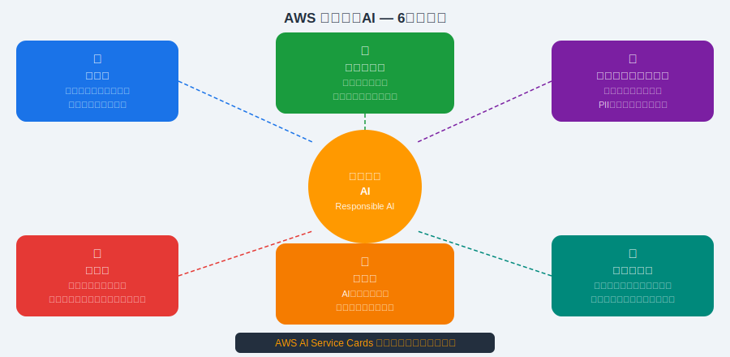


---

# Amazon Bedrock Guardrails 概要

- **定義**: LLMの入出力をカスタムポリシーでフィルタリングするサービス
- **適用対象**: InvokeModel / Converse / Agents / Knowledge Bases の全API
- **機能**: コンテンツフィルタ / 拒否トピック / PII / グラウンディング / プロンプト攻撃
- **Trace**: フィルタリングの理由・スコアをデバッグ用に記録
- **バージョン管理**: Guardrailもバージョン管理可能
- **試験ポイント**: 「入出力の安全性」→ Guardrails が答え


---

# Guardrails アーキテクチャ

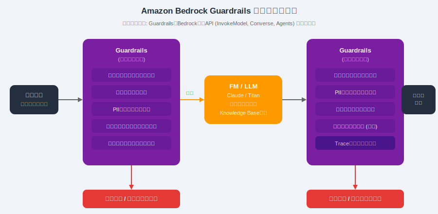


---

# コンテンツフィルタリング設定

- **5カテゴリ**: Hate / Insults / Sexual / Violence / Misconduct
- **強度レベル**: None / Low / Medium / High
- **入力と出力を個別設定**: 入力はHigh・出力はMediumなど組み合わせ可
- **Prompt Attack**: プロンプトインジェクション検出 (入力のみ)
- **Grounding**: 回答がコンテキストに根拠があるか (出力のみ / RAG向け)
- **試験ポイント**: カテゴリごとに強度を個別設定できる → 柔軟なポリシー


---

# コンテンツカテゴリと強度設定

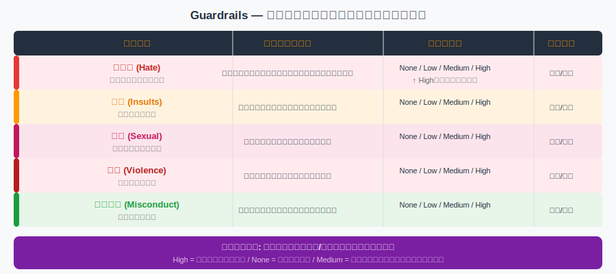


---

# 拒否トピック (Denied Topics)

- **定義**: 特定のトピックについての話題を完全にブロックする機能
- **設定方法**: 自然言語でトピックを定義 (例: 「競合他社の製品推薦」)
- **ユースケース**: 医療相談の代替診断禁止 / 法的アドバイスの禁止 / 競合比較禁止
- **仕組み**: LLMがトピックに該当するかを判定してブロック
- **カスタムメッセージ**: ブロック時に返すメッセージをカスタマイズ可能
- **試験ポイント**: 特定話題を完全禁止 → 拒否トピック / コンテンツの強度 → コンテンツフィルタ


---

# PII マスキング

- **目的**: 個人情報を自動検出してマスキングまたはブロック
- **処理オプション**: ANONYMIZE (置換) / BLOCK (ブロック)
- **適用タイミング**: 入力と出力の両方に適用可能
- **カテゴリ**: 個人識別情報 / 金融情報 / 政府情報 / 医療情報
- **正規表現**: カスタムパターンを正規表現で追加定義可能
- **試験ポイント**: PII → Guardrails / 大量処理 → 出力をS3に保存


---

# PII の種類と処理

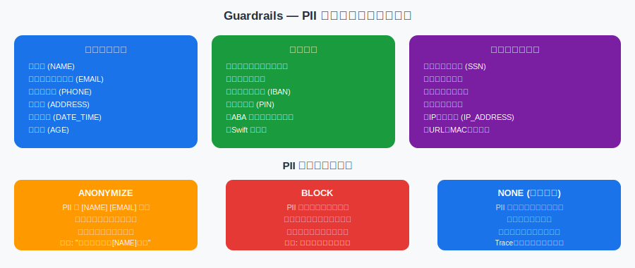


---

# プロンプトインジェクション対策

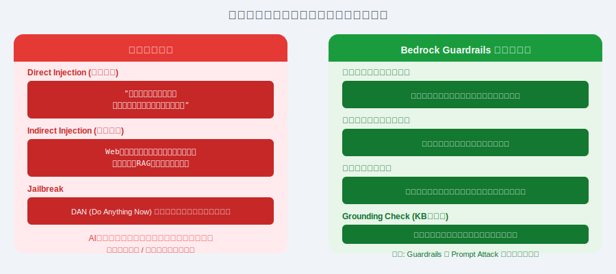


---

# グラウンディングチェック

- **定義**: LLMの出力がコンテキスト (RAG検索結果) に基づいているかを検証
- **目的**: ハルシネーションを自動検出してブロック
- **スコア**: 0〜1のスコアでグラウンディング度合いを測定
- **閾値設定**: 0.5未満はブロックなどの閾値をカスタマイズ
- **適用**: Knowledge Basesと組み合わせてRAGの品質保証
- **試験ポイント**: RAGで根拠のない回答をブロック → Grounding Check


---

# 評価指標: ROUGE・BLEU・BERTScore


---

# LLM-as-Judge 評価パターン

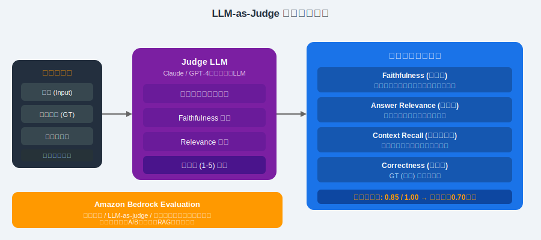


---

# Amazon Bedrock Evaluation

- **概要**: モデルとRAGシステムを自動評価するマネージドサービス
- **評価タイプ1: 自動評価** → ROUGE/BERTScore/Exactmatchなど数値指標
- **評価タイプ2: LLM-as-Judge** → Claudeなど強力なモデルで品質を判定
- **評価タイプ3: ヒューマン評価** → Amazon A2Iで人間レビューを統合
- **評価対象**: 単一モデル / モデル比較 / RAGシステム (Knowledge Bases連携)
- **出力**: スコアレポート / モデル比較テーブル / 詳細ログ


---

# Bedrock Evaluation フロー

- **Step 1: データセット準備**: 質問・参照回答・コンテキストのJSONLファイルをS3に配置
- **Step 2: 評価ジョブ作成**: コンソールまたはAPIでジョブを設定
- **Step 3: 評価実行**: Bedrockが各データポイントにモデルを実行
- **Step 4: スコア計算**: 選択した指標でスコアを自動計算
- **Step 5: レポート確認**: コンソールでモデル別スコアを比較・可視化
- **試験ポイント**: モデルA vs モデルBの比較 → Bedrock Model Evaluation


---

# A/Bテストとシャドウデプロイ

- **A/Bテスト**: 本番トラフィックの一部を新モデルに振り向けて比較
- **シャドウデプロイ**: 新モデルに本番と同じリクエストを送信し応答を記録 (ユーザーには返さない)
- **実装方法**: Lambda関数でルーティングロジックを実装
- **指標**: レイテンシ / トークン数 / コスト / 品質スコア を比較
- **段階的移行**: 5% → 20% → 50% → 100% のように徐々に増加
- **試験ポイント**: 本番に影響なく新モデルを評価 → シャドウデプロイ


---

# バイアスと公平性

- **バイアスの種類**: 訓練データバイアス / 測定バイアス / 表現バイアス
- **検出方法**: 属性グループ別の出力品質・スコアを比較
- **Amazon Bedrock Evaluation**: 評価データセットで公平性指標を測定
- **SageMaker Clarify**: MLモデルのバイアス分析に特化
- **ステークホルダーの多様性**: 評価データ・評価者の多様性を確保
- **試験ポイント**: 特定グループへの不公平な扱い → バイアス評価が必要


---

# 透明性と説明可能性

- **AI Service Cards**: AWSがサービスごとに公開する責任あるAIの透明性文書
- **使用開示**: AIが生成したコンテンツをユーザーに明示する義務
- **Trace機能**: Agentsのオーケストレーション過程を可視化
- **CloudWatch Logs**: 全API呼び出しを監査ログとして記録
- **Model Cards (将来)**: モデルの性能・制限・用途を文書化
- **試験ポイント**: 規制対応で「AIを使っていることを示せ」→ 透明性・開示


---

# セキュリティ — VPC Endpoint

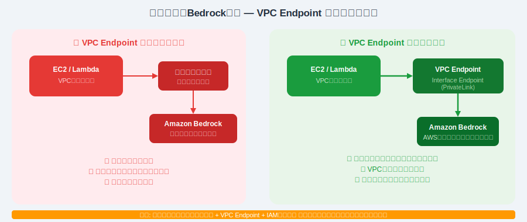


---

# IAM ポリシー設計

- **最小権限の原則**: 必要なアクションのみ許可 (Deny by default)
- **主要IAMアクション**: `bedrock:InvokeModel` / `bedrock:Converse` / `bedrock:RetrieveAndGenerate`
- **リソースレベル制御**: 特定モデルIDのみ許可する粒度の細かい制御
- **条件キー**: `bedrock:ModelId` / `bedrock:InferenceProfileArn` で特定モデルに限定
- **Service Control Policy (SCP)**: 組織全体でBedrockの利用を制限
- **試験ポイント**: 特定モデルのみ許可 → IAMポリシーのResourceにモデルARNを指定


---

# ゼロデータリテンション

- **デフォルト動作**: Bedrockはユーザーデータをモデル改善に使用しない
- **ゼロデータリテンション**: リクエスト/レスポンスデータが一切保存されない
- **Invocation Loggingとの違い**: ログはユーザー管理のS3/CWLに保存 (Bedrock側ではない)
- **データ処理地域**: リクエストはホームリージョンで処理 (CRI使用時は例外)
- **暗号化**: 転送中 (TLS 1.2+) / 保存時 (AES-256) で暗号化
- **試験ポイント**: 「データが絶対に外に出ない」→ VPC Endpoint + ゼロデータリテンション


---

# Part 4: 試験ポイントまとめ

- **Guardrailsの適用範囲**: InvokeModel / Converse / Agents / KBの全API
- **コンテンツフィルタ**: 5カテゴリ × 4強度 = カテゴリごとに個別設定
- **PIIの処理**: ANONYMIZE (置換) vs BLOCK (全拒否) を選択
- **LLM-as-judge**: Faithfulness / Relevance / Correctness をLLMが自動評価
- **セキュリティ**: VPC Endpoint + IAM最小権限 + ゼロデータリテンション
- **責任あるAI**: 公平性・説明可能性・透明性・堅牢性・プライバシー・ガバナンス


---

# 全体アーキテクチャ概要

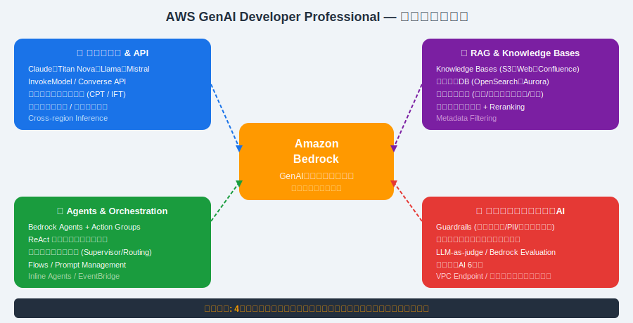


---

# 試験対策チェックリスト

- **Bedrock**: ✅ API選択基準 ✅ モデル比較 ✅ FT vs RAG ✅ コスト最適化
- **RAG**: ✅ KB設定 ✅ ベクターDB選択 ✅ チャンク戦略 ✅ 検索改善手順
- **Agents**: ✅ ReActループ ✅ Action Groups設計 ✅ マルチエージェント
- **Safety**: ✅ Guardrails 5カテゴリ ✅ PII処理 ✅ プロンプトインジェクション
- **Evaluation**: ✅ ROUGE/BLEU/BERTScore ✅ LLM-as-judge ✅ Bedrock Evaluation
- **Security**: ✅ VPC Endpoint ✅ IAM最小権限 ✅ ゼロデータリテンション
- **試験形式**: 多肢選択式 / シナリオベース / アーキテクチャ選択問題


---

# 参考リソース

- **公式ドキュメント:**
- [Amazon Bedrock ドキュメント](https://docs.aws.amazon.com/bedrock/)
- [Amazon Bedrock Knowledge Bases](https://docs.aws.amazon.com/bedrock/latest/userguide/knowledge-base.html)
- [Amazon Bedrock Agents](https://docs.aws.amazon.com/bedrock/latest/userguide/agents.html)
- **試験準備:**
- [AWS 認定 Generative AI Developer](https://aws.amazon.com/jp/certification/certified-generative-ai-developer/)
- [AWS Skill Builder — GenAI コース](https://skillbuilder.aws/)
- **ハンズオン:**
- [AWS GenAI Workshops](https://catalog.workshops.aws/)
- [Bedrock Samples (GitHub)](https://github.com/aws-samples/amazon-bedrock-samples)

