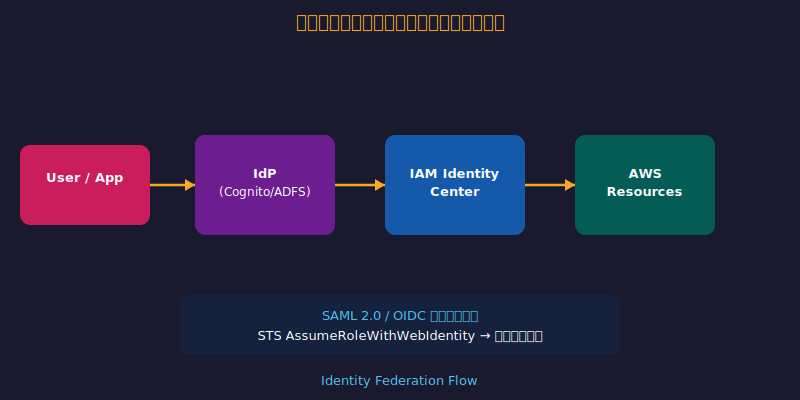
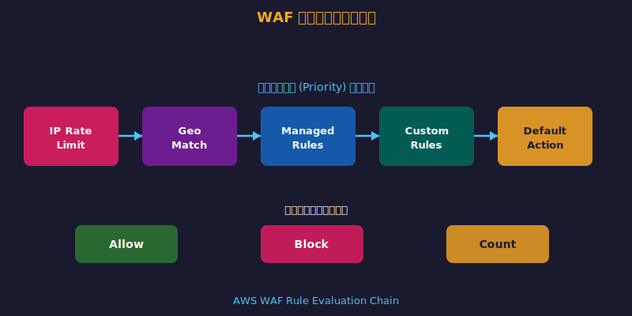
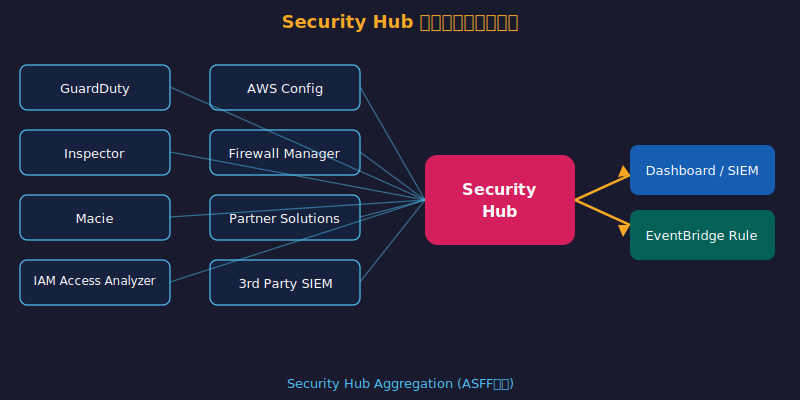

<!-- _class: lead -->
# AWS Certified Security - Specialty

- **SCS-C02 完全技術ガイド**
- 
- 対象: AWSセキュリティエンジニア
- 所要時間: 約120分
- スライド数: 92枚
- 
- 全6ドメイン完全網羅 | 実践的なベストプラクティス

<!--
AWS Certified Security - Specialty (SCS-C02) の試験対策スライド。6つのドメインを体系的に解説する。
-->

---

# 目次 (1/2)


- **Domain 1**: 脅威検知・インシデント対応 (14%) — 12スライド
- **Domain 2**: セキュリティログ・監視 (18%) — 15スライド
- **Domain 3**: インフラストラクチャセキュリティ (20%) — 17スライド
- 


---

# 目次 (2/2)


- **Domain 4**: IAM・アクセス管理 (16%) — 14スライド
- **Domain 5**: データ保護 (18%) — 16スライド
- **Domain 6**: 管理・ガバナンス (14%) — 11スライド
- 


---

# SCS-C02 試験概要

> *SCS-C02は6ドメイン・170問—対策の優先度を正確に把握せよ*


- **受験資格**: AWS Associate レベルまたは同等の実務経験
- **推奨経験**: 5年以上のITセキュリティ + 2年以上のAWS実務
- **出題形式**: 単一選択・複数選択（65問）
- **スコア**: 100-1000点（合格: 750点）

<!--
SCS-C02は2023年7月にリリース。前バージョン(SCS-C01)から大幅刷新。
-->

---

<!-- _class: lead -->
# Domain 1: 脅威検知・インシデント対応

- **出題比率: 14%**
- 
- Amazon GuardDuty による脅威検知
- AWS Security Hub による統合管理
- Amazon Detective による調査分析
- AWS Systems Manager Incident Manager
- インシデント対応ワークフロー

<!--
Domain 1は脅威検知と対応の自動化が中心。GuardDutyとSecurity Hubの連携が頻出。
-->

---

# Amazon GuardDuty（1/2）

> *GuardDutyが機械学習で未知の脅威を24時間検知する*


- **機械学習ベースの脅威検知サービス**
- データソース: CloudTrail, VPC Flow Logs, DNS Logs, S3 Logs
- **検知カテゴリ**:
- - Backdoor / CryptoCurrency マイニング


---

# Amazon GuardDuty（2/2）

> *GuardDutyが機械学習で未知の脅威を24時間検知する*


- - Recon（偵察）/ UnauthorizedAccess
- - Trojan / Stealth（ステルス攻撃）
- **有効化**: リージョンごと、マルチアカウント対応（Organizations）
- **重要**: エージェント不要、API呼び出しのみで動作


---

# GuardDuty: 主要な Finding タイプ（1/2）

> *GuardDutyが機械学習で未知の脅威を24時間検知する*


- **EC2 関連**:
- - `UnauthorizedAccess:EC2/SSHBruteForce` — SSH総当たり攻撃
- - `Backdoor:EC2/C&CActivity.B` — C2通信検知
- **IAM 関連**:


---

# GuardDuty: 主要な Finding タイプ（2/2）

> *GuardDutyが機械学習で未知の脅威を24時間検知する*


- - `UnauthorizedAccess:IAMUser/ConsoleLoginSuccess.B` — 不審なコンソールログイン
- - `PrivilegeEscalation:IAMUser/AnomalousBehavior` — 権限昇格
- **S3 関連**:
- - `Policy:S3/BucketBlockPublicAccessDisabled` — パブリックアクセス無効化


---

# GuardDuty: マルチアカウント管理（1/2）

> *GuardDutyが機械学習で未知の脅威を24時間検知する*


- **Organizations 統合**:
- - 管理アカウントで自動有効化 (Auto-enable)
- - 委任管理者アカウント (Delegated Administrator) を設定
- - 全メンバーアカウントの Finding を一元集約


---

# GuardDuty: マルチアカウント管理（2/2）

> *GuardDutyが機械学習で未知の脅威を24時間検知する*


- **Finding 対応の自動化**:
- - EventBridge → Lambda で自動隔離
- - SNS 通知 → セキュリティチーム連絡
- - S3 への Finding エクスポート → Athena で分析


---

# AWS Security Hub（1/2）

> *Security Hubが全サービスの脅威を単一画面で一元管理*


- **セキュリティアラートの統合ダッシュボード**
- **統合ソース**: GuardDuty, Inspector, Macie, IAM Analyzer, Firewall Manager
- **セキュリティ標準**:
- - AWS Foundational Security Best Practices (FSBP)


---

# AWS Security Hub（2/2）

> *Security Hubが全サービスの脅威を単一画面で一元管理*


- - CIS AWS Foundations Benchmark
- - PCI DSS, NIST SP 800-53
- **自動修復**: Security Hub + EventBridge + Lambda / Step Functions
- **重要**: Finding は ASFF (Amazon Security Finding Format) で標準化


---

# Amazon Detective（1/2）

> *DetectiveがGuardDuty/CloudTrailを統合し侵害調査を自動化する*


- **セキュリティインシデントの根本原因調査サービス**
- GuardDuty Finding から自動的にデータを収集・グラフ化
- **調査できること**:
- - IPアドレス・ユーザーの行動パターン分析


---

# Amazon Detective（2/2）

> *DetectiveがGuardDuty/CloudTrailを統合し侵害調査を自動化する*


- - リソース間の関係性の可視化
- - 過去のベースライン行動との比較
- **データ保持**: 最大12ヶ月
- **注意**: GuardDuty を先に有効化する必要あり


---

# インシデント対応ワークフロー (AWS)

> *初動72時間の対応品質が被害範囲と復旧コストを左右する*


- **1. 準備 (Prepare)**: IAM最小権限、GuardDuty有効化、Runbook整備
- **2. 検知 (Detect)**: GuardDuty Finding / Security Hub アラート
- **3. 分析 (Analyze)**: Detective / CloudTrail / VPC Flow Logs
- **4. 封じ込め (Contain)**: SG変更 / EC2隔離 / IAMキー無効化


---

# EC2 インシデント対応の自動化（1/2）

> *初動72時間の対応品質が被害範囲と復旧コストを左右する*


- **感染EC2の自動隔離パターン**:
- GuardDuty → EventBridge → Lambda (隔離SG適用)
- **隔離ステップ**:
- - 1. EC2 を隔離用 Security Group に変更


---

# EC2 インシデント対応の自動化（2/2）

> *初動72時間の対応品質が被害範囲と復旧コストを左右する*


- - 2. スナップショット取得（フォレンジック用）
- - 3. Systems Manager で調査コマンド実行
- - 4. Auto Scaling Group から切り離し
- **注意**: EC2 を終了せずスナップショットを先に取る


---

# IAM アクセスキー漏洩対応（1/2）

> *IAM設計の誤りが最多のAWSセキュリティ侵害原因*


- **発見**: GuardDuty `UnauthorizedAccess:IAMUser/InstanceCredentialExfiltration`
- **即時対応手順**:
- 1. 漏洩したアクセスキーを無効化 (`UpdateAccessKey --status Inactive`)
- 2. 侵害された IAM ユーザーにアクセス拒否ポリシーをアタッチ


---

# IAM アクセスキー漏洩対応（2/2）

> *IAM設計の誤りが最多のAWSセキュリティ侵害原因*


- 3. CloudTrail で不正操作の全体像を把握
- 4. 不正に作成されたリソースを特定・削除
- 5. 新しいアクセスキーを発行し Secrets Manager に保存
- **重要**: 削除より先に「無効化」してログを保全


---

# AWS Systems Manager Incident Manager

> *初動72時間の対応品質が被害範囲と復旧コストを左右する*


- **インシデント管理の自動化プラットフォーム**
- - **Runbook**: Systems Manager Automation でステップ自動化
- - **エスカレーション**: オンコールローテーション管理
- - **連絡計画**: SNS / PagerDuty / OpsGenie との統合


---

# Domain 1 まとめ: 重要ポイント

> *GuardDuty+Security Hub+Detective+EventBridge Lambdaの4ツール統合がDomain1の核心*


- **GuardDuty**: エージェント不要の機械学習脅威検知、Organizations対応
- **Security Hub**: 複数サービスの Finding を ASFF 形式で一元管理
- **Detective**: GuardDuty連携、12ヶ月データ保持、グラフ分析
- **自動対応**: EventBridge + Lambda で封じ込め自動化


---

<!-- _class: lead -->
# Domain 2: セキュリティログ・監視

- **出題比率: 18%**
- 
- AWS CloudTrail によるAPI監査
- Amazon CloudWatch Logs・Metrics・Alarms
- VPC Flow Logs によるネットワーク監視
- Amazon Athena によるログ分析
- AWS CloudTrail Lake


---

# AWS CloudTrail

> *CloudTrailなしにはインシデント調査の証跡が消滅する*


- **AWSアカウント内のすべてのAPI呼び出しを記録**
- **イベントタイプ**:
- - 管理イベント (Management Events): デフォルト有効
- - データイベント (Data Events): S3/Lambda/DDB 操作（追加料金）


---

# CloudTrail: マルチリージョン・組織証跡（1/2）

> *CloudTrailなしにはインシデント調査の証跡が消滅する*


- **組織証跡 (Organization Trail)**:
- - 管理アカウントで作成 → 全メンバーアカウントに自動適用
- - メンバーアカウントは変更・削除不可
- **マルチリージョン証跡**:


---

# CloudTrail: マルチリージョン・組織証跡（2/2）

> *CloudTrailなしにはインシデント調査の証跡が消滅する*


- - 全リージョンのイベントを単一S3バケットに集約
- - グローバルサービスイベント (IAM, STS, Route53) も含む
- **ベストプラクティス**:
- - CloudTrail ログ専用バケット + バケットポリシーで保護


---

# CloudTrail Insights（1/2）

> *CloudTrailなしにはインシデント調査の証跡が消滅する*


- **API呼び出しの異常検知（機械学習ベース）**
- **検知対象**:
- - 異常に多いAPI呼び出し（例: 通常の10倍のEC2起動）
- - エラー率の急激な変化


---

# CloudTrail Insights（2/2）

> *CloudTrailなしにはインシデント調査の証跡が消滅する*


- **対応できるインサイトタイプ**:
- - `ApiCallRateInsight`: 呼び出し頻度の異常
- - `ApiErrorRateInsight`: エラー頻度の異常
- **活用**: 過剰な IAM API コールによる内部不正の早期検知


---

# Amazon CloudWatch: セキュリティ監視（1/2）

> *メトリクスフィルターとアラームが異常を即座にトリガーする*


- **CloudWatch Logs Insights でログ分析**:
- - CloudTrail ログを CloudWatch Logs に送信
- - リアルタイムクエリで脅威パターン検索
- **メトリクスフィルター + アラームの活用例**:


---

# Amazon CloudWatch: セキュリティ監視（2/2）

> *メトリクスフィルターとアラームが異常を即座にトリガーする*


- - root アカウントログインの検知
- - MFA 未設定でのコンソールログイン
- - IAM ポリシー変更の検知
- - Security Group 変更の検知


---

# CloudWatch: 重要なメトリクスフィルターパターン（1/2）

> *パターンマッチングフィルターが重要イベントを見落とさない*


- **root アカウント使用検知**:
- `{ $.userIdentity.type = "Root" && $.userIdentity.invokedBy NOT EXISTS }`
- **MFA なしコンソールログイン**:
- `{ $.eventName = "ConsoleLogin" && $.additionalEventData.MFAUsed = "No" }`


---

# CloudWatch: 重要なメトリクスフィルターパターン（2/2）

> *パターンマッチングフィルターが重要イベントを見落とさない*


- **IAM ポリシー変更**:
- `{ $.eventName = "DeleteGroupPolicy" || $.eventName = "PutGroupPolicy" }`
- **Security Group 変更**:
- `{ $.eventName = "AuthorizeSecurityGroupIngress" }`


---

# VPC Flow Logs

> *VPC設計の初期誤りが後続の全修正コストを膨らませる*


- **VPC内のネットワークトラフィックを記録**
- **キャプチャ対象**: ネットワークインターフェース (ENI) レベル
- **レコードフィールド**: srcaddr, dstaddr, srcport, dstport, protocol, packets, bytes, action
- **action の値**: ACCEPT / REJECT


---

# VPC Flow Logs: 分析クエリ例（1/2）

> *VPC設計の初期誤りが後続の全修正コストを膨らませる*


- **Athena で VPC Flow Logs を分析**:
- 拒否されたトラフィックの送信元IPを特定:
- ```sql
- SELECT srcaddr, COUNT(*) as attempts


---

# VPC Flow Logs: 分析クエリ例（2/2）

> *VPC設計の初期誤りが後続の全修正コストを膨らませる*


-   AND dstport = 22
- GROUP BY srcaddr
- ORDER BY attempts DESC
- LIMIT 10;


---

# VPC Flow Logs: 分析クエリ例（コード例）


---

# VPC Flow Logs: 分析クエリ例（コード例）（コード例）

```sql
SELECT srcaddr, COUNT(*) as attempts
FROM vpc_flow_logs
WHERE action = 'REJECT'
  AND dstport = 22
GROUP BY srcaddr
ORDER BY attempts DESC
LIMIT 10;
```


---

# Amazon Athena によるログ分析（1/2）

> *SQLでCloudTrailを分析しインシデント調査コストを削減する*


- **S3上のログをSQLで直接分析**
- **対応ログ形式**: CloudTrail, VPC Flow Logs, ALB, CloudFront
- **パーティション**: 日付・リージョンで分割し、クエリコストを削減
- **CloudTrail Lake との比較**:


---

# Amazon Athena によるログ分析（2/2）

> *SQLでCloudTrailを分析しインシデント調査コストを削減する*


- - Athena: S3にログが必要、柔軟なSQL
- - CloudTrail Lake: 管理不要、SQL、最大7年保持
- **セキュリティユースケース**:
- - 特定IPからのAPI呼び出し一覧


---

# AWS CloudTrail Lake（1/2）

> *CloudTrailなしにはインシデント調査の証跡が消滅する*


- **マネージドなCloudTrailイベントデータストア**
- S3管理不要でCloudTrailイベントをSQLで直接クエリ
- **保持期間**: 7年（Governance-compliant モード）
- **統合**: CloudTrail Lake で AWS Organizations の全アカウントを統合分析


---

# AWS CloudTrail Lake（2/2）

> *CloudTrailなしにはインシデント調査の証跡が消滅する*


- **Athena との違い**:
- - S3バケット設定・管理が不要
- - イベントデータの自動インデックス化
- - クロスアカウント分析が容易


---

# Amazon EventBridge: セキュリティ自動化（1/2）

> *EventBridgeルールがセキュリティイベントへの自動応答を実現する*


- **イベント駆動型セキュリティ自動化の中核**
- **ソース → ルール → ターゲット**
- **主なセキュリティパターン**:
- - GuardDuty Finding → Lambda で EC2 隔離


---

# Amazon EventBridge: セキュリティ自動化（2/2）

> *EventBridgeルールがセキュリティイベントへの自動応答を実現する*


- - Security Hub Finding → Step Functions でワークフロー
- - IAM キー作成 → Lambda で Secrets Manager 保存
- **EventBridge Pipes**: フィルタリング・変換を組み込んだストリーム処理
- **クロスアカウント**: イベントバスでセキュリティアカウントに集約


---

# Amazon OpenSearch Service: ログ分析（1/2）

> *OpenSearchが大規模ログのリアルタイム検索と可視化を提供する*


- **大規模ログのリアルタイム検索・可視化**
- **Kibana / OpenSearch Dashboards** でセキュリティダッシュボード構築
- **取り込みパターン**:
- - CloudWatch Logs → Lambda (サブスクリプションフィルター) → OpenSearch


---

# Amazon OpenSearch Service: ログ分析（2/2）

> *OpenSearchが大規模ログのリアルタイム検索と可視化を提供する*


- - Kinesis Data Firehose → OpenSearch
- **VPC 内配置推奨**: パブリックアクセス禁止
- **暗号化**: ノード間通信 TLS + 保存データ KMS暗号化
- **アクセス制御**: きめ細かなアクセス制御 (FGAC) + SAML


---

# AWS Config: 設定変更の記録と評価（1/2）

> *AWS Configが設定ドリフトを即座に検知し準拠を維持する*


- **AWSリソースの設定変更を継続的に記録・評価**
- **Config Rules**:
- - マネージドルール: `s3-bucket-public-read-prohibited`など200以上
- - カスタムルール: Lambda で独自ロジック


---

# AWS Config: 設定変更の記録と評価（2/2）

> *AWS Configが設定ドリフトを即座に検知し準拠を維持する*


- **自動修復**: Config Rule + SSM Automation Runbook
- **例**: S3 パブリックバケット検出 → 自動でパブリックアクセスブロック
- **マルチアカウント**: Conformance Pack で組織全体に展開
- **重要**: Config はリアルタイムではなく変更検出 (eventual consistency)


---

# Domain 2 まとめ: 重要ポイント

> *CloudTrailの組織証跡+CloudWatchメトリクスフィルター+Athena分析がDomain2の重点3点*


- **CloudTrail**: 全API記録、ログファイル検証で改ざん防止、組織証跡で一元管理
- **CloudWatch**: メトリクスフィルター + アラーム で根アカウント使用等を検知
- **VPC Flow Logs**: ACCEPT/REJECT トラフィック記録、Athena で SQL分析
- **CloudTrail Lake**: S3不要、7年保持、クロスアカウント分析


---

<!-- _class: lead -->
# Domain 3: インフラストラクチャセキュリティ

- **出題比率: 20%**
- 
- VPC セキュリティ設計
- AWS WAF / AWS Shield / Network Firewall
- Amazon Inspector / EC2 セキュリティ
- AWS Systems Manager
- Container セキュリティ


---

# VPC セキュリティ設計: 基本原則（1/2）

> *VPC設計の初期誤りが後続の全修正コストを膨らませる*


- **多層防御 (Defense in Depth)**:
- Internet → IGW → NACL → SG → インスタンス
- **サブネット設計**:
- - Public: ALB, NAT Gateway（インターネット向け）


---

# VPC セキュリティ設計: 基本原則（2/2）

> *VPC設計の初期誤りが後続の全修正コストを膨らませる*


- - Private: アプリ層、DB層（インターネット非公開）
- - Isolated: DB層（NAT不要）
- **重要な違い**:
- - Security Group: ステートフル、インスタンスレベル、許可のみ


---

# Security Group vs NACL

> *SGはステートフル・NACLはステートレス—二層の役割を理解する*


| 項目 | Security Group | NACL |
|------|----------------|------|
| レベル | インスタンス | サブネット |
| ステート | ステートフル | ステートレス |


---

# VPC エンドポイント（1/2）

> *VPC設計の初期誤りが後続の全修正コストを膨らませる*


- **インターネットを経由せずにAWSサービスに接続**
- **Gateway エンドポイント** (無料):
- - S3, DynamoDB のみ対応
- - ルートテーブルにエントリ追加


---

# VPC エンドポイント（2/2）

> *VPC設計の初期誤りが後続の全修正コストを膨らませる*


- **Interface エンドポイント** (有料, PrivateLink):
- - EC2, KMS, SSM など多数のサービスに対応
- - ENI でプライベートIPを持つ
- **セキュリティ**: エンドポイントポリシーで通信先S3バケットを制限可能


---

# AWS WAF (Web Application Firewall)（1/2）

> *WAFマネージドルールがOWASP Top10を自動でブロック*


- **HTTP/HTTPS リクエストをフィルタリング**
- **アタッチ先**: ALB, API Gateway, CloudFront, AppSync
- **WAF ルール**:
- - IP セット: 特定IPのブロック/許可


---

# AWS WAF (Web Application Firewall)（2/2）

> *WAFマネージドルールがOWASP Top10を自動でブロック*


- - マネージドルール: AWS / サードパーティ製ルールグループ
- - レートベースルール: IPごとのリクエスト数制限（DDoS緩和）
- - 正規表現パターン: SQL インジェクション, XSS 検知
- **ログ**: Kinesis Data Firehose に送信 → S3/OpenSearch


---

# AWS Shield（1/2）

> *Shield AdvancedがL3-L7の全DDoS攻撃を自動緩和する*


- **DDoS 攻撃からの保護**
- **Shield Standard** (無料, 全顧客自動適用):
- - L3/L4 攻撃（SYN フラッド, UDP フラッド）を自動防御
- **Shield Advanced** (有料, $3,000/月):


---

# AWS Shield（2/2）

> *Shield AdvancedがL3-L7の全DDoS攻撃を自動緩和する*


- - L7 攻撃（HTTP フラッド）にも対応
- - DDoS 専門チーム (DSRT) への 24/7 アクセス
- - コスト保護（DDoS によるスケーリングコスト払い戻し）
- - Route53, CloudFront, ALB, EC2 EIP を保護


---

# AWS Network Firewall（1/2）

> *AWS Network FirewallがVPC境界でL3-L7の全検査を実施する*


- **VPC レベルの高度なネットワーク保護**
- ステートフル・ステートレスのパケットフィルタリング
- **機能**:
- - Suricata 互換のルールエンジン（IDS/IPS）


---

# AWS Network Firewall（2/2）

> *AWS Network FirewallがVPC境界でL3-L7の全検査を実施する*


- - ドメインリストフィルタリング（URL ベース）
- - TLS インスペクション（SNI ベース）
- **配置**: 専用サブネット (Firewall Subnet) に配置
- **トラフィックフロー**: IGW → Network Firewall → アプリ


---

# Amazon Inspector（1/2）

> *Inspectorの継続スキャンがパッチ未適用を即座に可視化*


- **EC2・Lambda・コンテナの脆弱性スキャン**
- **スキャン対象**:
- - EC2: OS パッケージの CVE 脆弱性
- - Lambda: コードと依存関係の脆弱性


---

# Amazon Inspector（2/2）

> *Inspectorの継続スキャンがパッチ未適用を即座に可視化*


- - ECR: コンテナイメージの脆弱性
- **SSM Agent 必須** (EC2 スキャンの場合)
- **自動**: プッシュ時に ECR イメージを自動スキャン
- **リスクスコア**: 環境の実際の設定を考慮した優先度付き


---

# AWS Systems Manager: セキュリティ活用（1/2）

> *SSMがSSH不要のセキュアなEC2アクセスと構成管理を実現する*


- **Session Manager**: SSH/RDP 不要の安全なインスタンスアクセス
- - SSHポート (22) を開けなくていい
- - セッションログを CloudWatch/S3 に記録
- **Patch Manager**: OS パッチの自動適用


---

# AWS Systems Manager: セキュリティ活用（2/2）

> *SSMがSSH不要のセキュアなEC2アクセスと構成管理を実現する*


- - パッチグループで本番/ステージング分離
- - メンテナンスウィンドウで計画適用
- **Parameter Store**: 設定値・シークレットの安全な保存
- **Inventory**: インストール済みソフトウェア一覧収集


---

# EC2 セキュリティハードニング（1/2）

> *CIS Benchmarkに基づくハードニングが既知攻撃の大半を遮断する*


- **IMDSv2 の強制** (Instance Metadata Service v2):
- - SSRF 攻撃によるメタデータ盗取を防止
- - `HttpTokens=required` に設定
- **EC2 Image Builder**: セキュアなゴールデン AMI の自動作成


---

# EC2 セキュリティハードニング（2/2）

> *CIS Benchmarkに基づくハードニングが既知攻撃の大半を遮断する*


- **インスタンスプロファイル**: EC2 用 IAM ロール（アクセスキー不要）
- **ユーザーデータ検証**: 起動スクリプトのコード審査
- **EBS 暗号化**: デフォルト暗号化設定を有効化
- **Nitro Enclaves**: 機密データの隔離処理


---

# コンテナセキュリティ (ECS/EKS)（1/2）

> *イメージスキャンとランタイム保護がコンテナ攻撃を二段で防ぐ*


- **イメージセキュリティ**:
- - ECR イメージスキャン (Inspector) で脆弱性検出
- - ECR プライベートリポジトリ + リポジトリポリシーで制限
- **実行時セキュリティ**:


---

# コンテナセキュリティ (ECS/EKS)（2/2）

> *イメージスキャンとランタイム保護がコンテナ攻撃を二段で防ぐ*


- - EKS: IRSA (IAM Roles for Service Accounts)
- - `privileged: false`、`readOnlyRootFilesystem: true`
- **ネットワーク**:
- - ECS: awsvpc モードで ENI + Security Group


---

# AWS Firewall Manager（1/2）

> *Firewall ManagerがOrganizations全体のWAF/SG設定を一元*


- **複数アカウントのファイアウォールポリシーを一元管理**
- Organizations と統合して全アカウントに自動適用
- **管理できるポリシー**:
- - AWS WAF ルールグループ


---

# AWS Firewall Manager（2/2）

> *Firewall ManagerがOrganizations全体のWAF/SG設定を一元*


- - Security Group (共通ルール強制)
- - Network Firewall ポリシー
- - Route 53 Resolver DNS Firewall
- **スコープ**: OU単位、タグ単位でポリシー適用先を制御


---

# Route 53 Resolver DNS Firewall（1/2）

> *DNS Firewallが悪意あるドメインへの通信を発信元で遮断する*


- **VPC内からの悪意あるドメインへのDNSクエリをブロック**
- **ドメインリスト**:
- - AWS マネージドリスト（マルウェア、ボットネット C2）
- - カスタムリスト（許可/ブロックリスト）


---

# Route 53 Resolver DNS Firewall（2/2）

> *DNS Firewallが悪意あるドメインへの通信を発信元で遮断する*


- **アクション**: BLOCK (NXDOMAIN応答) / ALLOW / ALERT
- **フェイルオープン vs フェイルクローズ**: DNS 解決失敗時の動作を設定
- **Network Firewall との違い**: DNS層 vs パケット層
- **ユースケース**: マルウェアのC2通信遮断、データ漏洩防止


---

# Domain 3 まとめ: 重要ポイント

> *SG(ステートフル/許可のみ)とNACL(ステートレス/許可+拒否)の違いがDomain3の最重要概念*


- **SG vs NACL**: ステートフル vs ステートレス、最重要概念
- **VPC エンドポイント**: Gateway (S3/DDB 無料) vs Interface (PrivateLink 有料)
- **WAF**: L7フィルタリング、CloudFront/ALB/API GWにアタッチ
- **Shield Advanced**: L7保護 + DSRT + コスト保護


---

<!-- _class: lead -->
# Domain 4: IAM・アクセス管理

- **出題比率: 16%**
- 
- IAM ポリシーの種類と評価ロジック
- Permission Boundary
- SCP (Service Control Policies)
- AWS IAM Identity Center (SSO)
- ABAC / RBAC


---

# IAM ポリシーの種類（1/2）

> *最小権限ポリシーが侵害時の爆発半径を最小化する*


- **アイデンティティベースポリシー**:
- - インラインポリシー: ユーザー/グループ/ロールに直接埋め込み
- - マネージドポリシー: 再利用可能（AWS管理/カスタマー管理）
- **リソースベースポリシー**:


---

# IAM ポリシーの種類（2/2）

> *最小権限ポリシーが侵害時の爆発半径を最小化する*


- - プリンシパルを明示的に指定
- **その他**:
- - Permission Boundary: IAMエンティティの最大権限
- - SCP: Organizations での最大権限


---

# IAM ポリシー評価ロジック（1/2）

> *最小権限ポリシーが侵害時の爆発半径を最小化する*


- **評価の優先順位**:
- 1. **Explicit Deny** → 即時拒否（最優先）
- 2. **SCP** → Organizations の境界チェック
- 3. **Resource-based Policy** (同アカウント) → 許可の場合通過


---

# IAM ポリシー評価ロジック（2/2）

> *最小権限ポリシーが侵害時の爆発半径を最小化する*


- 4. **Permission Boundary** → 境界チェック
- 5. **Session Policy** → AssumeRole 時の追加制限
- 6. **Identity-based Policy** → アクション許可チェック
- 7. **Implicit Deny** → デフォルト拒否


---

# Permission Boundary（1/2）

> *境界設定が開発者への権限委譲を安全なレンジ内に制限する*


- **IAMエンティティが持てる最大権限の上限を設定**
- Identity-based Policy AND Permission Boundary の両方に含まれる権限のみ有効
- **ユースケース**:
- - 開発者が自由にIAMロールを作成できるが、特定サービス以外は付与不可


---

# Permission Boundary（2/2）

> *境界設定が開発者への権限委譲を安全なレンジ内に制限する*


- - 管理者が意図しない特権ロールの作成を防止
- **重要な特性**:
- - Permission Boundary は許可を与えない（制限するのみ）
- - SCP と Permission Boundary は独立して評価される


---

# SCP (Service Control Policies)（1/2）

> *SCPがOU単位でAWSサービス利用を強制制限する最強のガードレール*


- **AWS Organizations のメンバーアカウントの最大権限を制限**
- **重要な特性**:
- - 管理アカウントには適用されない
- - 「許可を与える」ではなく「最大権限を制限する」


---

# SCP (Service Control Policies)（2/2）

> *SCPがOU単位でAWSサービス利用を強制制限する最強のガードレール*


- **よくある SCP パターン**:
- - 特定リージョンへのアクセス制限
- - GuardDuty / CloudTrail の無効化防止
- - root アカウントの操作制限


---

# SCP: 実践パターン（1/2）

> *SCPの実践パターンが組織全体の防御ベースラインを保証する*


- **GuardDuty 無効化防止の SCP 例**:
- ```json
- {
-   "Effect": "Deny",


---

# SCP: 実践パターン（2/2）

> *SCPの実践パターンが組織全体の防御ベースラインを保証する*


-     "guardduty:DisassociateFromMasterAccount"
-   ],
-   "Resource": "*"
- }


---

# SCP: 実践パターン（コード例）


---

# SCP: 実践パターン（コード例）（コード例）

```json
{
  "Effect": "Deny",
  "Action": [
    "guardduty:DeleteDetector",
    "guardduty:DisassociateFromMasterAccount"
  ],
  "Resource": "*"
}
```


---

# クロスアカウントアクセス（1/2）

> *AssumeRoleの信頼ポリシー設計がアカウント間の安全を決める*


- **ロールの引き受け (AssumeRole) による安全なクロスアカウントアクセス**
- **パターン**:
- - アカウントA のロール → アカウントB の IAM ロールを AssumeRole
- - 信頼ポリシー (Trust Policy) でアカウントAを信頼


---

# クロスアカウントアクセス（2/2）

> *AssumeRoleの信頼ポリシー設計がアカウント間の安全を決める*


- - SaaS/サードパーティからの AssumeRole 時に利用
- - Confused Deputy 攻撃を防止
- **条件キー**:
- - `aws:SourceAccount`, `aws:SourceArn`: リソースベースポリシーで安全に制限


---

# AWS IAM Identity Center (旧 SSO)（1/2）

> *IAM設計の誤りが最多のAWSセキュリティ侵害原因*


- **一元的なシングルサインオンと権限管理**
- **組み込みIDプロバイダー** または **外部IdP (Okta, Azure AD) と連携**
- **権限セット (Permission Set)**: IAM ポリシーの集合
- - アカウント × ユーザー/グループ に割り当て


---

# AWS IAM Identity Center (旧 SSO)（2/2）

> *IAM設計の誤りが最多のAWSセキュリティ侵害原因*

- **SCIM**: 外部IdPからユーザー・グループの自動プロビジョニング
- **MFA**: ユーザーへの MFA 強制が可能
- **メリット**:
- - 1つのIDで複数AWSアカウントにアクセス
- - 長期アクセスキー不要（一時的な認証情報）


---

# ABAC (属性ベースアクセス制御)（1/2）

> *タグベースABACが動的なリソース増減に対応した認可を実現する*

- **タグを使ったスケーラブルなアクセス制御**
- **仕組み**: IAM ポリシーでリソースタグと IAM タグの一致を条件に
- **例**: `Project=Alpha` タグのユーザーは `Project=Alpha` タグのEC2のみ操作可能
- **ABAC ポリシー例**:
- ```json


---

# ABAC (属性ベースアクセス制御)（2/2）

> *タグベースABACが動的なリソース増減に対応した認可を実現する*

- {"Condition": {"StringEquals": {
-   "aws:ResourceTag/Project": "${aws:PrincipalTag/Project}"
- }}}
- ```
- **メリット**: 新しいリソース追加時にポリシー変更不要
- **RBAC との違い**: RBAC = ロール単位、ABAC = タグ単位


---

# AWS IAM Access Analyzer（1/2）

> *IAM設計の誤りが最多のAWSセキュリティ侵害原因*

- **外部エンティティから到達可能なリソースを自動検出**
- **分析対象リソース**:
- - S3 バケット, KMS キー, IAM ロール, Lambda, SQS, Secrets Manager
- **Finding タイプ**:


---

# AWS IAM Access Analyzer（2/2）

> *IAM設計の誤りが最多のAWSセキュリティ侵害原因*

- - Public: インターネットからアクセス可能
- - Cross-account: 別アカウントからアクセス可能
- - Cross-organization: 組織外からアクセス可能
- **Policy Validation**: IAM ポリシーの構文・セキュリティチェック
- **Policy Generation**: CloudTrail ログから最小権限ポリシーを自動生成


---

# IAM ベストプラクティス

> *IAM設計の誤りが最多のAWSセキュリティ侵害原因*

- **最小権限の原則**: 必要最小限の権限のみ付与
- **root アカウント**: MFA 必須、アクセスキー作成禁止
- **MFA の強制**: `aws:MultiFactorAuthPresent` 条件キーで制御
- **アクセスキー**: ローテーション (90日)、未使用キーの無効化
- **IAM ロール優先**: EC2/Lambda にはロールを使用（アクセスキー不要）
- **Credential Report**: 全ユーザーの認証情報状態を定期確認
- **CloudTrail**: IAM 操作を全て記録し監査


---

# 混乱した代理人問題 (Confused Deputy)（1/2）

> *外部IDとconditionキーが混乱した代理人攻撃を防ぐ唯一の手段*

- **第三者サービスがあなたのアカウントの権限を不正利用する攻撃**
- **シナリオ**: AWSサービス（代理人）が攻撃者アカウントのために操作
- **防止策**:  `aws:SourceAccount` / `aws:SourceArn` 条件キー
- **例**: S3 バケットポリシーで CloudTrail からの書き込みを制限
- ```json


---

# 混乱した代理人問題 (Confused Deputy)（2/2）

> *外部IDとconditionキーが混乱した代理人攻撃を防ぐ唯一の手段*

- {"Condition": {"StringEquals": {
-   "aws:SourceAccount": "123456789012"
- }}}
- ```
- **External ID**: AssumeRole 時のサードパーティ認証にも活用


---

# Domain 4 まとめ: 重要ポイント

> *Domain4のSCP+Permission Boundaryの組み合わせ問題と評価ロジックが試験最頻出テーマ*

- **評価ロジック**: Explicit Deny → SCP → Resource-based → Boundary → Session → Identity
- **Permission Boundary**: 権限の上限（許可を与えない）
- **SCP**: 管理アカウントには不適用、OU階層で継承
- **IAM Identity Center**: 一元SSO、外部IdP連携、権限セット
- **ABAC**: タグベース、スケーラブル、新リソースにポリシー変更不要
- **Access Analyzer**: 外部アクセス可能リソースの検出、最小権限ポリシー生成
- **試験頻出**: SCP + Permission Boundary の組み合わせ問題


---

<!-- _class: lead -->
# Domain 5: データ保護（1/2）

- **出題比率: 18%**
- 
- AWS KMS (Key Management Service)
- S3 のデータ保護


---

<!-- _class: lead -->
# Domain 5: データ保護（2/2）

- AWS Certificate Manager (ACM)
- AWS Secrets Manager
- Amazon Macie
- CloudFront + TLS


---

# AWS KMS: 概要（1/2）

> *顧客管理CMKがデータ主権と監査証跡を両立させる*

- **暗号化キーの作成・管理・使用を一元管理**
- **キーの種類**:
- - AWS マネージドキー: 無料、`aws/s3` など自動作成
- - カスタマーマネージドキー (CMK): ポリシー・ローテーション制御可能


---

# AWS KMS: 概要（2/2）

> *顧客管理CMKがデータ主権と監査証跡を両立させる*

- - AWS所有キー: AWS内部使用、顧客は管理不可
- **CMK タイプ**:
- - 対称: AES-256、最も一般的
- - 非対称: RSA / ECC、デジタル署名・公開鍵暗号
- **FIPS 140-2 Level 3**: CloudHSM（KMS はLevel 2）


---

# KMS キーポリシー（1/2）

> *顧客管理CMKがデータ主権と監査証跡を両立させる*

- **KMS キーへのアクセスはキーポリシーで制御（必須）**
- **重要**: IAM ポリシーだけでは KMS を使用できない
- キーポリシー + IAM ポリシーの両方で許可が必要
- **デフォルトキーポリシー**:


---

# KMS キーポリシー（2/2）

> *顧客管理CMKがデータ主権と監査証跡を両立させる*

- - Root プリンシパル → IAM ポリシーでの制御を有効化
- **キーポリシーのみで制御する場合**:
- - IAM ポリシーを無視し、キーポリシーが唯一の制御
- **クロスアカウント**:
- - キーポリシーで他アカウントを許可 + IAM ポリシーで許可


---

# KMS: エンベロープ暗号化（1/2）

> *顧客管理CMKがデータ主権と監査証跡を両立させる*

- **大量データを効率的に暗号化する仕組み**
- **仕組み**:
- 1. KMS から データキー (DEK) を生成 (`GenerateDataKey`)
- 2. DEK でデータをローカル暗号化（高速）


---

# KMS: エンベロープ暗号化（2/2）

> *顧客管理CMKがデータ主権と監査証跡を両立させる*

- 3. KMS キー (CMK) で DEK を暗号化し、暗号化DEKと共に保存
- 4. 復号時: 暗号化DEK → KMS で復号 → DEK でデータ復号
- **メリット**: 大量データを KMS に送らずに暗号化
- **AWS SDK**: Encryption SDK がエンベロープ暗号化を自動処理


---

# KMS: キーローテーションと管理（1/2）

> *顧客管理CMKがデータ主権と監査証跡を両立させる*

- **自動キーローテーション**:
- - CMK: 年1回自動ローテーション（有効化必要）
- - AWS マネージドキー: 自動（1年）
- - ローテーション後も古いキーバージョンで復号可能


---

# KMS: キーローテーションと管理（2/2）

> *顧客管理CMKがデータ主権と監査証跡を両立させる*

- **キーの削除**:
- - 削除前に7〜30日の待機期間（デフォルト30日）
- - 削除後は暗号化データ永久に復号不可
- **キー無効化**: 一時的に使用停止（削除より安全）
- **マルチリージョンキー**: 複数リージョンで同一キーマテリアル使用


---

# S3 データ保護: 暗号化（1/2）

> *顧客管理CMKがデータ主権と監査証跡を両立させる*

- **サーバーサイド暗号化 (SSE)**:
- - SSE-S3: S3 管理キー (AES-256)、最も簡単
- - SSE-KMS: KMS CMK 使用、監査ログあり（CloudTrail）
- - SSE-C: 顧客提供キー、AWS はキーを保存しない


---

# S3 データ保護: 暗号化（2/2）

> *顧客管理CMKがデータ主権と監査証跡を両立させる*

- - DSSE-KMS: 二重暗号化（金融・医療向け）
- **クライアントサイド暗号化 (CSE)**:
- - アップロード前にクライアントで暗号化
- **デフォルト暗号化**: バケットレベルで SSE-S3 または SSE-KMS を強制
- **重要**: バケットポリシーで `aws:SecureTransport: false` を拒否しHTTPS強制


---

# S3 データ保護: アクセス制御（1/2）

> *S3パブリックブロックとバケットポリシーが漏洩の最終防壁*

- **パブリックアクセスブロック (4設定)**:
- - BlockPublicAcls, IgnorePublicAcls
- - BlockPublicPolicy, RestrictPublicBuckets
- **組織全体**: Organizations + S3 Block Public Access を一括適用
- **S3 Object Lock**:


---

# S3 データ保護: アクセス制御（2/2）

> *S3パブリックブロックとバケットポリシーが漏洩の最終防壁*

- - WORM (Write Once Read Many) モデル
- - Compliance モード: 管理者でも削除不可
- - Governance モード: 特定権限で変更可能
- **バージョニング**: 誤削除・上書き防止、MFA Delete と組み合わせ
- **S3 Inventory**: オブジェクトの暗号化状態・バージョン一覧


---

# AWS Certificate Manager (ACM)（1/2）

> *ACMが証明書のプロビジョニングと自動更新を完全に自動化する*

- **SSL/TLS 証明書の発行・管理・更新を自動化**
- **発行タイプ**:
- - ACM 発行: 無料、DNS/メール検証、自動更新
- - インポート: 外部CAの証明書をインポート（自動更新なし）


---

# AWS Certificate Manager (ACM)（2/2）

> *ACMが証明書のプロビジョニングと自動更新を完全に自動化する*

- **使用できるサービス**: ALB, CloudFront, API Gateway, Elastic Beanstalk
- **注意**: EC2 に直接インストール不可（ELB/CloudFront 経由）
- **リージョン制約**: CloudFront 用は us-east-1 で発行必須
- **Private CA**: ACM Private CA でプライベート証明書の発行


---

# AWS Secrets Manager（1/2）

> *Secrets Managerが認証情報の自動ローテーションとアクセス制御を提供*

- **シークレット（DBパスワード、APIキー）の安全な保存・自動ローテーション**
- **自動ローテーション**:
- - Lambda 関数でローテーション処理
- - RDS, Redshift, DocumentDB は組み込みローテーション対応


---

# AWS Secrets Manager（2/2）

> *Secrets Managerが認証情報の自動ローテーションとアクセス制御を提供*

- **クロスアカウント**: リソースポリシーで他アカウントからのアクセス許可
- **KMS 統合**: シークレットは CMK で暗号化
- **Parameter Store との比較**:
- - Secrets Manager: 自動ローテーション、クロスアカウント、高コスト
- - Parameter Store: 無料枠あり、階層的なパス、ローテーション手動


---

# Amazon Macie（1/2）

> *MacieがS3内の個人情報を機械学習で自動分類・アラート*

- **S3バケット内の機密データを機械学習で自動検出**
- **検出データタイプ**:
- - PII: 氏名、メール、クレジットカード番号、パスポート
- - 認証情報: AWS アクセスキー、秘密鍵


---

# Amazon Macie（2/2）

> *MacieがS3内の個人情報を機械学習で自動分類・アラート*

- - 医療情報: HIPAA 関連データ
- **検出ジョブ**: 定期実行またはオンデマンド
- **Finding**: Security Hub / EventBridge に送信
- **バケット評価**: パブリックアクセス設定・暗号化状態の確認
- **Organizations 対応**: 全アカウントの S3 を一元監視


---

# CloudFront セキュリティ（1/2）

> *CloudFront+WAFがオリジン保護とDDoS緩和を同時に実現する*

- **HTTPS 強制**: Viewer → CloudFront は HTTPS のみ許可
- **Origin Shield**: オリジンへのアクセスを CloudFront 経由に限定
- **OAC (Origin Access Control)**: S3 への直接アクセスを遮断
- - OAI (旧) から OAC (新) に移行推奨


---

# CloudFront セキュリティ（2/2）

> *CloudFront+WAFがオリジン保護とDDoS緩和を同時に実現する*

- **フィールドレベル暗号化**: センシティブフィールドをエッジで暗号化
- **WAF 統合**: CloudFront に WAF Web ACL をアタッチ
- **Geo Restriction**: 国単位でアクセス制限
- **Signed URL / Cookies**: コンテンツへのアクセスを認証済みユーザーに限定


---

# CloudHSM（1/2）

> *CloudHSMが専有ハードウェアで規制要件の最高水準を満たす*

- **専有ハードウェアセキュリティモジュール**
- **KMS との違い**:
- - CloudHSM: FIPS 140-2 Level 3、顧客専有、キーのフルコントロール
- - KMS: FIPS 140-2 Level 2 (一部 Level 3)、マルチテナント、AWS管理
- **ユースケース**:


---

# CloudHSM（2/2）

> *CloudHSMが専有ハードウェアで規制要件の最高水準を満たす*

- - コンプライアンス要件 (FIPS 140-2 L3) がある場合
- - SSL/TLS オフロード（Nginx, Apache）
- - Oracle TDE のキー管理
- **KMS カスタムキーストア**: CloudHSM と KMS を統合
- **注意**: HA のため最低2台のクラスタ構成が必要


---

# Domain 5 まとめ: 重要ポイント

> *KMS(エンベロープ暗号化/自動ローテーション)とS3(Object Lock/SSE種別)がDomain5の核心*

- **KMS**: キーポリシー必須、エンベロープ暗号化、自動ローテーション
- **S3**: SSE-KMS vs SSE-S3、Object Lock WORM、パブリックアクセスブロック
- **ACM**: CloudFront は us-east-1 必須、EC2 直接利用不可
- **Secrets Manager**: 自動ローテーション、RDS連携、KMS暗号化
- **Macie**: S3内のPII自動検出、Organizations対応
- **CloudFront**: OAC でS3直接アクセス遮断、WAF+Shield Advanced推奨
- **CloudHSM**: FIPS 140-2 L3、顧客専有、KMSより高いセキュリティ保証


---

<!-- _class: lead -->
# Domain 6: 管理・セキュリティガバナンス

- **出題比率: 14%**
- 
- AWS Organizations
- AWS Control Tower
- AWS Audit Manager
- AWS Security Hub (ガバナンス視点)
- Well-Architected セキュリティの柱


---

# AWS Organizations: セキュリティガバナンス（1/2）

> *OU設計とSCP/SCPの組み合わせがガバナンスの骨格を形成する*

- **マルチアカウント戦略の基盤**
- **推奨アカウント構造**:
- - Management: 組織管理のみ（ワークロード禁止）
- - Security: GuardDuty委任管理者、Security Hub委任管理者


---

# AWS Organizations: セキュリティガバナンス（2/2）

> *OU設計とSCP/SCPの組み合わせがガバナンスの骨格を形成する*

- - Log Archive: CloudTrail ログ、VPC Flow Logs の集約
- - Audit/Compliance: 監査用読み取り専用アクセス
- - Sandbox: 開発実験用（本番から分離）
- **委任管理者**: 各セキュリティサービスを Security アカウントから一元管理


---

# AWS Control Tower（1/2）

> *Control Towerがランディングゾーンのベストプラクティスを自動適用する*

- **マルチアカウント環境のセキュアなセットアップを自動化**
- **Landing Zone**: ベストプラクティスに基づくマルチアカウント環境
- **ガードレール (Guardrails)**:
- - 予防的 (Preventive): SCP で違反操作をブロック


---

# AWS Control Tower（2/2）

> *Control Towerがランディングゾーンのベストプラクティスを自動適用する*

- - 検知的 (Detective): Config Rule で非準拠を検知
- **Account Factory**: 新規アカウントの標準化されたプロビジョニング
- **Account Factory for Terraform (AFT)**: IaC でアカウント管理
- **ダッシュボード**: 全アカウントのコンプライアンス状態を可視化


---

# AWS Audit Manager（1/2）

> *Audit Managerが継続的な証拠収集でコンプライアンス準備を自動化する*

- **コンプライアンス監査の証拠収集を自動化**
- **対応フレームワーク**:
- - CIS AWS Foundations Benchmark
- - PCI DSS, HIPAA, SOC2, ISO 27001, GDPR


---

# AWS Audit Manager（2/2）

> *Audit Managerが継続的な証拠収集でコンプライアンス準備を自動化する*

- **証拠収集**: Config, CloudTrail, Security Hub から自動収集
- **評価 (Assessment)**: フレームワークに基づく継続的な評価
- **カスタムフレームワーク**: 独自のコントロールセットを作成
- **レポート**: 監査人向けのエビデンスレポートを自動生成
- **統合**: Security Hub との統合で一元的なコンプライアンス管理


---

# AWS Config: Conformance Pack（1/2）

> *AWS Configが設定ドリフトを即座に検知し準拠を維持する*

- **複数の Config Rules をパッケージ化して組織全体に展開**
- **マネージド Conformance Pack**:
- - AWS Operational Best Practices for PCI-DSS
- - CIS AWS Foundations Benchmark など


---

# AWS Config: Conformance Pack（2/2）

> *AWS Configが設定ドリフトを即座に検知し準拠を維持する*

- **カスタム Conformance Pack**: YAML で独自ルールセット定義
- **組織全体への展開**:
- - Organizations + Config で全アカウントに一括適用
- - 委任管理者アカウントから管理
- **自動修復**: SSM Automation と組み合わせて非準拠リソースを自動修正


---

# AWS Well-Architected: セキュリティの柱（1/2）

> *セキュリティの柱の7設計原則が設計の抜け漏れを系統的に防ぐ*

- **7つの設計原則**:
- 1. セキュリティの基盤を強固にする（Identity & Access）
- 2. 追跡可能性を実現する（CloudTrail, Config）
- 3. 全レイヤーにセキュリティを適用する（多層防御）


---

# AWS Well-Architected: セキュリティの柱（2/2）

> *セキュリティの柱の7設計原則が設計の抜け漏れを系統的に防ぐ*

- 4. セキュリティのベストプラクティスを自動化する
- 5. 転送中・保存中のデータを保護する（TLS, KMS）
- 6. データを遠ざける（最小限のアクセスに制限）
- 7. セキュリティイベントに備える（インシデント対応計画）


---

# Infrastructure as Code セキュリティ（1/2）

> *IaCのセキュリティチェック自動化がデプロイ前の脆弱性を排除する*

- **CloudFormation セキュリティ**:
- - Stack Policy: スタックリソースの保護
- - Change Sets: 変更の事前プレビュー・承認フロー
- - Drift Detection: テンプレートとの乖離を検知


---

# Infrastructure as Code セキュリティ（2/2）

> *IaCのセキュリティチェック自動化がデプロイ前の脆弱性を排除する*

- **CloudFormation Guard**: IaC テンプレートのポリシーチェック
- **Terraform/CDK**: `cdk-nag` / `checkov` / `tfsec` で静的解析
- **CloudFormation + Systems Manager Parameter Store**: 機密値の安全な参照
- **注意**: テンプレートにシークレットをハードコードしない


---

# コスト管理とセキュリティ（1/2）

> *コストアラームが予期しないリソース作成=侵害の早期指標になる*

- **AWS Budgets**: コスト・使用量の予算設定とアラート
- 異常なコスト増加 = セキュリティインシデントの可能性
- **Cost Anomaly Detection**: 機械学習でコスト異常を自動検知
- **セキュリティ関連コスト事例**:


---

# コスト管理とセキュリティ（2/2）

> *コストアラームが予期しないリソース作成=侵害の早期指標になる*

- - 暗号通貨マイニングによる EC2 コスト爆増
- - 情報流出による S3 データ転送コスト増加
- **GuardDuty**: CryptoCurrency Finding でマイニング検知
- **対応**: Budgets アラート → SNS → GuardDuty 確認


---

# サードパーティ統合とセキュリティ（1/2）

> *外部統合のスコープ最小化と監査がサプライチェーンリスクを制御する*

- **AWS Security Hub パートナー統合**:
- - Splunk, Sumo Logic, QRadar: SIEM へのFinding転送
- - Palo Alto Prisma Cloud: クラウドセキュリティ管理
- **マーケットプレイス**:


---

# サードパーティ統合とセキュリティ（2/2）

> *外部統合のスコープ最小化と監査がサプライチェーンリスクを制御する*

- - Aqua Security, Twistlock: コンテナセキュリティ
- - CrowdStrike, Trend Micro: EDR/ウイルス対策
- **SIEM 統合パターン**:
- Security Hub → EventBridge → Kinesis → Splunk
- **注意**: サードパーティへのアクセスは最小権限 + External ID


---

# Domain 6 まとめ: 重要ポイント

> *Organizations委任管理者+Control Towerガードレール+Conformance Pack展開がDomain6の重点*

- **Organizations**: 委任管理者でセキュリティサービスを一元化
- **Control Tower**: ガードレール（予防的=SCP、検知的=Config）
- **Audit Manager**: コンプライアンスフレームワーク対応の証拠収集自動化
- **Conformance Pack**: Config Rules を組織全体に一括展開
- **Well-Architected**: 7原則（ID管理、追跡可能性、多層防御等）
- **IaC セキュリティ**: Change Sets + Drift Detection + 静的解析ツール
- **試験頻出**: Control Tower のガードレール種別（予防的 vs 検知的）


---

# 試験対策: 頻出サービスの比較

| サービス | 目的 | 重要ポイント |
|---------|------|------------|
| GuardDuty | 脅威検知 | エージェント不要、ML、Organizations |
| Inspector | 脆弱性スキャン | EC2/Lambda/ECR、CVE |
| Macie | PII検出 | S3専門、機械学習 |
| Config | 設定評価 | ルール+自動修復、証跡 |
| Security Hub | 統合管理 | ASFF、複数ソース集約 |
| Detective | 調査分析 | GuardDuty連携、グラフ |


---

# 試験対策: 暗号化サービスの比較

> *顧客管理CMKがデータ主権と監査証跡を両立させる*

| サービス | 用途 | 特徴 |
|---------|------|------|
| KMS CMK | 汎用暗号化 | FIPS L2、マルチテナント |
| CloudHSM | 高保証暗号化 | FIPS L3、専有 |
| ACM | TLS証明書 | 自動更新、無料 |
| Secrets Manager | シークレット管理 | 自動ローテーション |
| Parameter Store | 設定・シークレット | 無料枠あり |
| S3 Object Lock | WORM | Compliance/Governance |


---

# 試験対策: ネットワークセキュリティの比較

| サービス | レイヤー | 対象 |
|---------|---------|------|
| Security Group | L3-L4（SG） | インスタンス単位 |
| NACL | L3-L4 | サブネット単位 |
| WAF | L7 (HTTP) | ALB/CloudFront/API GW |
| Shield Standard | L3-L4 | 自動、無料 |
| Shield Advanced | L3-L7 | $3000/月、DSRT |
| Network Firewall | L3-L7 | VPC全体、IDS/IPS |
| DNS Firewall | DNS | ドメインフィルタリング |


---

# SCS-C02 合格のための最終チェック（1/2）

> *IAMポリシー評価・GuardDuty自動対応・KMSエンベロープ暗号化が合格最優先の3テーマ*

- **絶対に覚える項目**:
- - IAM ポリシー評価ロジック（Explicit Deny 最優先）
- - GuardDuty + EventBridge + Lambda の自動対応パターン
- - KMS キーポリシーとエンベロープ暗号化


---

# SCS-C02 合格のための最終チェック（2/2）

> *VPCエンドポイント種別・Object Lock・CloudTrail検証・SCPの4つが追加の必須暗記項目*

- - VPC エンドポイントの種類（Gateway vs Interface）
- - S3 Object Lock の Compliance vs Governance モード
- - CloudTrail ログファイル検証（改ざん防止）
- - SCP は管理アカウントに適用されない


---

# おすすめ学習リソース（1/2）

> *AWS公式ドキュメントと試験ガイドがSCS-C02合格への最短ルートを示す*

- **公式ドキュメント**:
- - [AWS Security Best Practices](https://aws.amazon.com/security/)
- - [AWS Well-Architected Security Pillar](https://docs.aws.amazon.com/wellarchitected/latest/security-pillar/)
- **試験ガイド**:
- - [SCS-C02 試験ガイド (AWS)](https://aws.amazon.com/certification/certified-security-specialty/)


---

# おすすめ学習リソース（2/2）

> *ハンズオン演習と公式模擬試験でSCS-C02の実践力を完成させる*

- **ハンズオン**:
- - AWS Security Workshops (workshops.aws)
- - AWS Skill Builder Security Learning Plan
- **問題演習**:
- - AWS 公式模擬試験 (20問)
- - Tutorials Dojo, Whizlabs の模擬試験


---

<!-- _class: lead -->
# まとめ（1/2）

- **6ドメインの核心**:
- - D1: 自動検知(GuardDuty) + 自動対応(EventBridge+Lambda)
- - D2: 証跡(CloudTrail) + 分析(Athena/CloudTrail Lake)
- - D3: 多層防御(SG+NACL+WAF+Network Firewall) + 最小権限

<!--
全92スライドで6ドメインを完全網羅。試験合格のためにハンズオンも忘れずに。
-->

---

<!-- _class: lead -->
# まとめ（2/2）

- - D4: IAMポリシー評価 + SCP + Permission Boundary
- - D5: KMS + S3保護 + Secrets Manager + Macie
- - D6: Organizations + Control Tower + Audit Manager
- **合格を目指して頑張ってください！ Good Luck!**

<!--
全92スライドで6ドメインを完全網羅。試験合格のためにハンズオンも忘れずに。
-->
