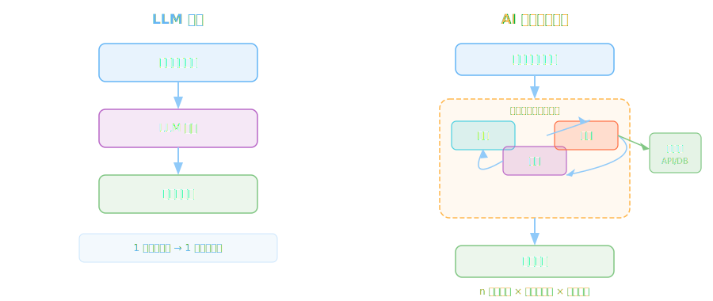
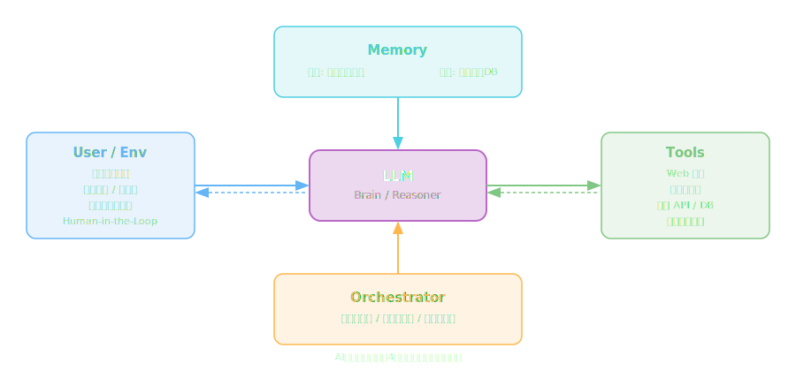
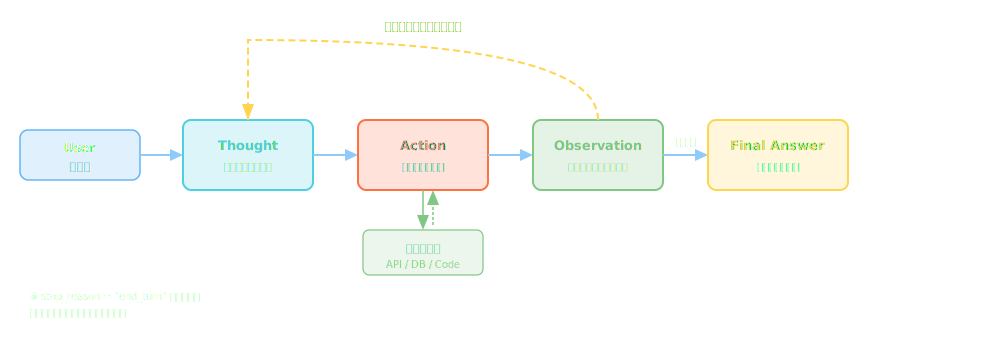
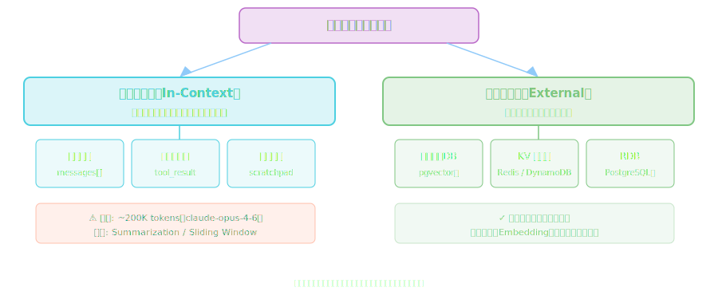
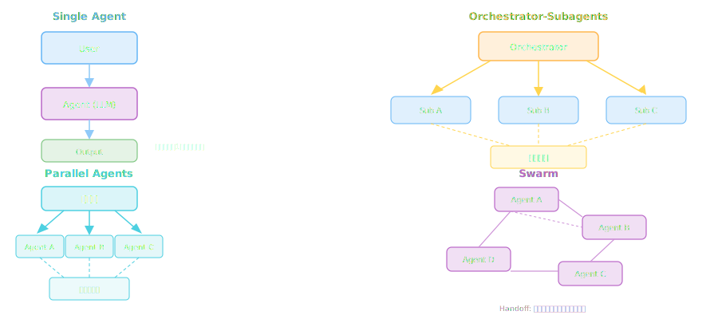
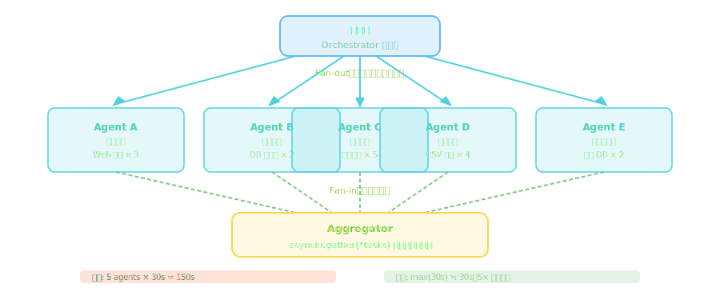
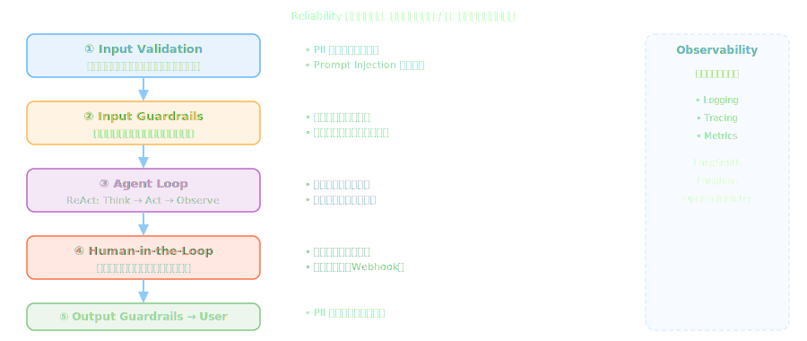
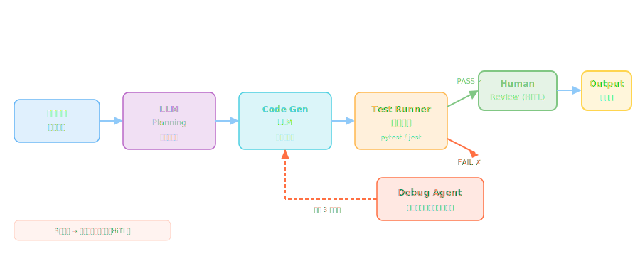
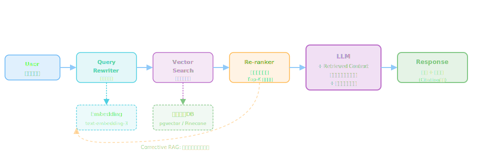

<!-- _class: lead -->
# AI エージェント設計パターン

- アーキテクト・テックリードのための実践ガイド
- ワークショップ | 2026.02.19


---

# アジェンダ (1/2)

- 1. **AI エージェントとは** — 定義・LLMとの違い・なぜパターンが必要か
- 2. **Core Patterns** — ReAct / Chain-of-Thought / Tool Use / Memory
- 3. **Orchestration Patterns** — Single / Multi-Agent / Parallel / Swarm
- 4. **Reliability Patterns** — HiTL / 検証ループ / エラー回復 / Guardrails


---

# アジェンダ (2/2)

- 5. **実アーキテクチャ事例** — コード生成 / リサーチ / RAG エージェント
- 6. **実装ベストプラクティス** — プロンプト設計 / コンテキスト管理 / 評価
- 7. **まとめ・Q&A**


---

<!-- _class: lead -->
# 1. AI エージェントとは

- 定義・LLMとの違い・なぜパターンが必要か


---

# AI エージェントの定義

- **目標志向**: 与えられた目標を達成するために自律的に行動する
- **環境との相互作用**: ツール・API・DB などの外部リソースを利用できる
- **ループ構造**: 観察 → 推論 → 行動のサイクルを繰り返す
- **永続的コンテキスト**: セッションを超えた状態管理が可能
- → "LLMを部品として組み合わせた自律型システム"


---

# LLM 単体 vs AI エージェント




---

# なぜ設計パターンが必要か

- **非決定性**: LLMの出力は確率的 → 予測不能な挙動が発生する
- **状態管理の複雑さ**: マルチステップ処理で状態が爆発的に増加
- **信頼性の確保**: エラー回復・リトライ・人間介入の設計が必須
- **スケーラビリティ**: 複数エージェントの協調制御が困難
- → パターンは「実証済みの解決策の語彙」を提供する


---

# エージェントの4つのコアコンポーネント




---

<!-- _class: lead -->
# 2. Core Patterns

- ReAct / Chain-of-Thought / Tool Use / Memory


---

# ReAct パターン概要

- **Reasoning + Acting** の組み合わせ（Yao et al., 2022）
- LLMに「思考」と「行動」を交互に出力させるアプローチ
- **Thought**: 次に何をすべきか推論する
- **Action**: ツールを呼び出す（Function Calling）
- **Observation**: ツールの結果を受け取り、次の思考へ
- → 複雑な多段タスクに対して最も広く使われる基本パターン


---

# ReAct: Thought-Action-Observation サイクル




---

# ReAct の実装（Claude API）

- tool_use / tool_result メッセージで制御ループを構成

```python
MAX_STEPS = 10

for step in range(MAX_STEPS):
    response = client.messages.create(
        model="claude-opus-4-6",
        tools=tools,
        messages=messages
    )
    if response.stop_reason == "end_turn":
        break  # 完了
    # Tool 呼び出しを処理
    tool_results = []
    for block in response.content:
        if block.type == "tool_use":
            result = execute_tool(block.name, block.input)
            tool_results.append({
                "type": "tool_result",
                "tool_use_id": block.id,
                "content": result
            })
    messages.append({"role": "user", "content": tool_results})
```


---

# Chain-of-Thought (CoT)

- **Zero-shot CoT**: プロンプトに "Let's think step by step" を追加するだけ
- **Few-shot CoT**: 推論例（reasoning chain）をプロンプトに提供する
- **Tree-of-Thought (ToT)**: 複数の推論経路を並列探索・評価する
- **Chain-of-Draft**: 簡潔なメモ書きで推論品質を保ちトークンを節約
- → 数学・論理・コーディングタスクの精度を大幅に向上させる


---

# Tool Use パターン

- LLMに外部ツール（関数・API）を呼び出す能力を付与するパターン
- **Function Calling**: 構造化された引数でツールを呼び出す
- **ツールの種類**: 検索・コード実行・DB操作・外部API・ファイルI/O
- **設計原則**: 単一責任・明確な入出力スキーマ・エラー処理


---

# ツール設計のベストプラクティス

- **名前**: 動詞+名詞で意図が明確に（例: `search_documents`, `execute_code`）
- **説明文**: LLMが「いつ・なぜ使うか」判断できるよう詳細に記述する
- **スキーマ**: JSON Schema で厳密に型定義し、description を必ず付ける
- **冪等性**: 同じ入力は同じ結果（副作用を持つツールは要注意）
- **エラー**: 失敗時も構造化レスポンスで返す（LLMが判断できるように）


---

# Function Calling の実装

- input_schema に JSON Schema 形式でツール定義を記述する

```python
tools = [
  {
    "name": "search_documents",
    "description": "社内ドキュメントを全文検索する。検索したい情報がある場合に使用",
    "input_schema": {
      "type": "object",
      "properties": {
        "query": {
          "type": "string",
          "description": "検索クエリ文字列"
        },
        "limit": {
          "type": "integer",
          "description": "最大取得件数",
          "default": 5
        }
      },
      "required": ["query"]
    }
  }
]
```


---

# Memory パターン概要




---

# 短期メモリ: コンテキストウィンドウ管理

- 問題: 長い会話でコンテキスト上限（200K tokens）に到達してしまう
- **Sliding Window**: 古いメッセージを一定数に制限して削除
- **Summarization**: 古い会話を定期的に要約して圧縮する
- **Selective Retention**: 重要なメッセージのみを選択的に保持
- → トレードオフ: 情報損失 vs コスト削減・レイテンシ改善


---

# 長期メモリ: ベクターストア活用

- ベクター検索で意味的に近い過去記録を動的に取得できる
- **RAG**: 外部知識ベースを Embedding でベクター化して保存
- **実装**: pgvector / Pinecone / OpenSearch Serverless
- **Episodic**: 過去のインタラクション記録を記憶として参照
- → エージェントに「長期記憶」を持たせる基本技術


---

# エージェントのステート管理

- **ステートの種類**: 会話履歴・タスク進捗・ユーザープロファイル
- **ステートマシン**: 明示的な状態遷移で制御フローを管理する
- **永続化**: DB保存でセッション跨ぎのレジューム（再開）が可能
- → 設計の早い段階でステートスキーマを確定させることが重要


---

# Core Patterns まとめ

- **ReAct**: Think → Act → Observe のループ。ほぼ全エージェントの基本
- **CoT**: 推論品質向上。`think` ツールや拡張思考（Extended Thinking）で実現
- **Tool Use**: 外部世界との接続。ツール設計の質が品質を直接左右する
- **Memory**: 短期＋長期の組み合わせで実用的なエージェントを実現できる


---

<!-- _class: lead -->
# 3. Orchestration Patterns

- Single / Multi-Agent / Orchestrator-Subagents / Parallel / Swarm


---

# Single Agent パターン

- 1つのLLMが全タスクを処理するシンプルな構成
- **メリット**: シンプル・デバッグ容易・コンテキスト共有が自然
- **デメリット**: 複雑タスクで精度低下・長いコンテキストでコスト増加
- **適用場面**: 比較的シンプルなタスク・PoC・プロトタイピング
- → まず Single Agent で動かし、必要になってから複雑化する


---

# Multi-Agent システム

- 複数のエージェントが協調して複雑なタスクを処理するアーキテクチャ
- **分割統治**: タスクを専門エージェントに委任・分担する
- **並列処理**: 独立したサブタスクを同時実行してレイテンシを削減
- **専門化**: 各エージェントが特定ドメイン・スキルに特化できる
- → 複雑な実世界タスクに対応するための必須アーキテクチャ


---

# 4つのOrchestration Patterns 比較




---

# Orchestrator の実装例

- Subagent を tool として定義し、Orchestrator が呼び出す構成

```python
# Subagentをtoolとして定義
subagent_tools = [
    {
        "name": "research_agent",
        "description": "Web検索・調査を担当するサブエージェント",
        "input_schema": {"type": "object",
                         "properties": {"task": {"type": "string"}},
                         "required": ["task"]}
    },
    {"name": "writer_agent",
     "description": "文章生成・編集を担当", ...},
    {"name": "reviewer_agent",
     "description": "品質レビューを担当", ...},
]

# Orchestrator が全体を指揮
response = client.messages.create(
    model="claude-opus-4-6",
    tools=subagent_tools,
    system="タスクを適切なエージェントに割り当てるオーケストレーターです",
    messages=[{"role": "user", "content": task}]
)
```


---

# Parallel Agents パターン




---

# Parallel Agents の実装

- asyncio.gather で並列実行し、全結果が揃ってから統合する

```python
import asyncio

async def run_agent(task: str) -> str:
    """単一エージェントの非同期実行"""
    response = await async_client.messages.create(
        model="claude-haiku-4-5-20251001",  # サブタスクは軽量モデル
        messages=[{"role": "user", "content": task}]
    )
    return response.content[0].text

async def parallel_research(subtasks: list[str]) -> list[str]:
    """全タスクを並列実行"""
    return await asyncio.gather(
        *[run_agent(task) for task in subtasks]
    )

# 実行
results = asyncio.run(parallel_research([
    "市場規模を調査", "競合他社を分析", "技術トレンドを調査"
]))
```


---

# Swarm パターン

- 中央集権的なOrchestrator なしに複数エージェントが協調するパターン
- **Handoff**: 専門エージェントへの動的な制御移譲（タスクの引き渡し）
- **特徴**: 各エージェントが自律的に判断して次のエージェントへ委任
- **適用**: カスタマーサポート・複数専門分野が絡む複合タスク
- 例: OpenAI Swarm / Anthropic multi-agent subagent pattern


---

# エージェント間通信パターン

- **直接呼び出し**: 同期的・シンプル・密結合（PoC向け）
- **メッセージキュー**: 非同期・疎結合・スケーラブル（SQS / Kafka）
- **共有ステート**: DB / ファイル経由で状態を共有（シンプルだが競合注意）
- → 本番環境では非同期メッセージキューが最も適している


---

# パターン選択ガイド

- タスクがシンプル → **Single Agent**（まずここから始める）
- タスクに明確な依存関係あり → **Orchestrator-Subagents**
- 独立したサブタスクがある → **Parallel Agents**（レイテンシ削減）
- 専門知識の動的切り替えが必要 → **Swarm**
- → 最初はシンプルに始め、ボトルネックが出てから複雑化する


---

<!-- _class: lead -->
# 4. Reliability Patterns

- Human-in-the-Loop / 検証ループ / エラー回復 / Guardrails


---

# なぜ Reliability が重要か

- **幻覚（Hallucination）**: LLMは事実でないことを自信を持って出力する
- **副作用**: ツール呼び出しがDB削除・メール送信などの不可逆操作を実行
- **非決定性**: 同じ入力でも出力が変わる → テストが難しい
- **Prompt Injection**: 外部コンテンツ経由で悪意ある指示が混入する
- → プロダクションでは「失敗を前提とした設計」が必須


---

# Reliability パターン全体像




---

# Human-in-the-Loop (HiTL)

- 人間が確認・承認するチェックポイントをパイプラインに設ける
- **適用場面**: 不可逆操作・高リスクアクション・曖昧な判断が必要な場合
- **同期HiTL**: アクション前に確認プロンプトを表示して待機
- **非同期HiTL**: Webhook でメール/Slackに通知し、非同期で承認を待つ
- → 自動化の効率と安全性のバランスを調整する重要なレバー


---

# HiTL の実装パターン

- 高リスクツールのリストを定義し、呼び出し前に人間の承認を要求する

```python
HIGH_RISK_TOOLS = {"delete_records", "send_email", "deploy_to_prod"}

def execute_with_hitl(tool_name: str, tool_input: dict) -> dict:
    if tool_name in HIGH_RISK_TOOLS:
        print(f"\n⚠️  高リスク操作の承認が必要")
        print(f"Tool  : {tool_name}")
        print(f"Input : {tool_input}")
        approval = input("実行しますか？ (yes/no): ").strip()
        if approval.lower() != "yes":
            return {"error": "ユーザーにより拒否されました",
                    "cancelled": True}
    return execute_tool(tool_name, tool_input)
```


---

# 検証ループパターン

- 生成結果を別のLLM / ロジックで検証し、品質を自動保証するパターン
- **Self-critique**: 同じLLMに自分の出力を批評させる（コスト効率が良い）
- **Separate Verifier**: 独立した検証エージェントが客観的にレビュー
- **Unit Test**: コード生成ならテストを自動実行して正確性を検証
- → 人間レビューなしに出力品質を一定水準以上に保つメカニズム


---

# エラー回復パターン

- **Retry with Backoff**: エラー時に指数バックオフで待機してリトライ
- **Fallback**: 代替ツール / モデルへの切り替え（Opus → Sonnet など）
- **Graceful Degradation**: 一部失敗でも部分的な結果を返す
- **Max Retries**: 無限ループを防ぐ上限設定（通常3回）
- → 外部への全呼び出しにエラーハンドリングを実装すること


---

# Guardrails パターン

- 入出力の安全性・品質を自動チェックする仕組み
- **Input Guardrails**: 入力の無害性・スコープ確認・Injection 検出
- **Output Guardrails**: PII 検出・有害コンテンツ除去・スキーマ検証
- **Schema Validation**: 構造化出力が期待するスキーマに適合するか確認
- 例: Guardrails AI / NeMo Guardrails / Amazon Bedrock Guardrails


---

# 構造化出力で信頼性を高める

- tool_choice で強制的にスキーマ準拠の出力を得る

```python
from pydantic import BaseModel, Field

class AnalysisResult(BaseModel):
    summary: str = Field(description="3文以内の要約")
    confidence: float = Field(ge=0.0, le=1.0, description="確信度")
    sources: list[str] = Field(description="根拠URL一覧")
    action_required: bool = Field(description="人間対応が必要か")

# tool_choice で構造化出力を強制
response = client.messages.create(
    model="claude-opus-4-6",
    tools=[{"name": "output",
            "input_schema": AnalysisResult.model_json_schema()}],
    tool_choice={"type": "tool", "name": "output"},
    messages=messages
)
```


---

# 観測可能性 (Observability)

- エージェントの挙動を可視化・追跡するインフラ。本番運用に必須
- **Logging**: 全ステップの input / output / ツール呼び出しを記録
- **Tracing**: リクエスト全体の処理フローを追跡（OpenTelemetry）
- **Metrics**: レイテンシ・トークン使用量・エラー率・ツール成功率
- 推奨ツール: LangSmith / Langfuse（OSS）/ Arize / W&B Weave


---

# Reliability Patterns まとめ

- **HiTL**: 高リスク操作には必ず人間の承認チェックポイントを設ける
- **検証ループ**: 出力品質を自動チェック → Self-critique が最もコスト効率が良い
- **エラー回復**: 失敗前提に設計、上限付きリトライ + Fallback
- **Guardrails**: 入出力の安全性を自動保証するレイヤーを必ず設ける
- **Observability**: 設計段階からログ・トレース・メトリクスを組み込む


---

<!-- _class: lead -->
# 5. 実アーキテクチャ事例

- コード生成 / リサーチ / RAG エージェント


---

# コード生成エージェントのアーキテクチャ




---

# コード生成エージェント: 設計ポイント

- **要件理解フェーズ**: 自然言語 → 仕様へ変換する前に曖昧さを排除
- **テスト駆動生成**: テストケースを先に生成し、それをパスするコードを生成
- **デバッグループ**: テスト失敗 → LLMがエラーを解析 → コード修正（最大3回）
- **モデル使い分け**: 計画に Opus、実装に Sonnet、レビューに Haiku
- **HiTL**: 最終的なマージは必ずエンジニアがレビューする


---

# リサーチエージェントの設計

- **目的**: 特定トピックについて自動で調査・レポート作成を行うエージェント
- **ツール**: Web検索・ドキュメント取得・PDF解析・データ分析
- **Memory**: 収集情報をベクターDBに蓄積して重複取得を防ぐ
- **Plan-then-Execute**: まず調査計画を立案し、その後並列で実行する
- → 情報収集フェーズと統合フェーズを明確に分離することが重要


---

# リサーチエージェント: Plan-then-Execute

- Planner → Parallel Researchers → Writer の3層構造

```python
# Step 1: 調査計画の立案
plan = planner_agent.run(
    f"'{topic}'について調査計画を立ててください",
    system="サブトピックに分解し、JSON配列で返してください"
)
subtopics: list[str] = json.loads(plan)

# Step 2: 並列リサーチ実行
async def research_parallel(subtopics: list[str]) -> list[str]:
    tasks = [research_agent.run(t) for t in subtopics]
    return await asyncio.gather(*tasks)

results = asyncio.run(research_parallel(subtopics))

# Step 3: 統合・レポート生成
report = writer_agent.run(
    f"以下の調査結果を統合してレポートを作成: {results}"
)
```


---

# RAG エージェントのパイプライン




---

# Advanced RAG パターン

- **HyDE**: 仮の回答を生成してそれをベクター検索に使用する
- **Self-Query**: LLMがメタデータフィルターを自動生成して絞り込む
- **Corrective RAG**: 取得品質が低い場合は自動的に再検索する
- **Adaptive RAG**: クエリの難易度に応じて検索戦略を動的に変更
- → シンプルな RAG から始め、精度不足の場合に段階的に改善する


---

# アーキテクチャ事例: パターン適用まとめ

- **コード生成**: ReAct + 検証ループ + HiTL + モデル使い分け
- **リサーチ**: Orchestrator-Subagents + Parallel + Long-term Memory
- **RAG**: Tool Use + Memory（ベクターDB）+ Self-critique + Citation
- → 実際のシステムは複数パターンの組み合わせ。単独では使わない


---

<!-- _class: lead -->
# 6. 実装ベストプラクティス

- プロンプト設計 / コンテキスト管理 / 評価・テスト / セキュリティ


---

# システムプロンプト設計

- **役割と責務**: エージェントの目的・権限・制約を冒頭で明確に定義する
- **制約の明示**: やってはいけないことを具体的に列挙する（否定形で明示）
- **出力フォーマット**: 期待する出力形式を例示する（Few-shot が効果的）
- **エラー処理指示**: 判断に迷った場合の行動を事前に指定しておく
- → プロンプトはコードと同様にバージョン管理する（Git管理推奨）


---

# コンテキスト管理戦略

- **Token Budget 管理**: 残りトークン数を監視してアクションを制限する
- **重要情報の優先配置**: システムプロンプトに核心情報を配置する
- **会話圧縮**: 定期的に会話履歴を要約して古いメッセージを圧縮する
- **Cache 活用**: Prompt Caching で繰り返し処理を高速化・コスト削減


---

# Prompt Caching の活用

- cache_control でシステムプロンプトをキャッシュし、コストを ~90% 削減

```python
response = client.messages.create(
    model="claude-opus-4-6",
    system=[
        {
            "type": "text",
            "text": long_system_prompt,  # 1024+ tokens が必要
            "cache_control": {"type": "ephemeral"}  # キャッシュ有効化
        }
    ],
    messages=messages
)

# usage を確認
print(response.usage)
# CacheCreationInputTokens: 初回はキャッシュ作成
# CacheReadInputTokens   : 2回目以降はキャッシュHit
# → キャッシュHit時 ~90% コスト削減・レイテンシ半減
```


---

# エージェントの評価・テスト戦略

- **Unit Test**: 個別ツールの入出力をモックして単体テスト
- **Integration Test**: エージェントの完全なフローをE2Eでテスト
- **Golden Set**: 期待する入出力ペアを蓄積し、自動で回帰テストに活用
- **LLM-as-Judge**: LLM自身に出力品質を評価させる自動評価手法
- → プロンプト変更が既存の動作に悪影響を与えないか必ず確認する


---

# エージェントセキュリティ

- **Prompt Injection**: 外部コンテンツ（Web・DB）経由での悪意ある指示注入
- **権限の最小化**: エージェントに必要最小限の権限・スコープのみ付与
- **入力サニタイズ**: ユーザー入力の検証・エスケープを必ず実施
- **Audit Log**: 全アクションの監査ログを記録・定期レビュー
- → AIエージェントはSQLインジェクションと同じカテゴリのリスクを持つ


---

# コスト管理と最適化

- **モデル選択**: 計画→Opus 4.6 / 実装→Sonnet 4.6 / 分類→Haiku 4.5
- **Batch API**: リアルタイム不要なタスクは非同期バッチ処理（50% 割引）
- **Prompt Caching**: 繰り返し使うシステムプロンプトをキャッシュする
- **Token 最適化**: 不要な会話履歴・冗長なプロンプトを定期的に削減
- → 本番移行前に典型的なフローのトークン使用量をプロファイリングする


---

# ベストプラクティス まとめ

- **シンプルに始める**: Over-engineering を避け、必要に応じて複雑化する
- **観測可能性を最初から**: ログ・トレース・メトリクスを設計段階で組み込む
- **失敗を前提に設計**: リトライ・Fallback・HiTL を必ず実装する
- **評価自動化**: Golden Set による回帰テストで品質を継続監視する
- **セキュリティ**: Prompt Injection を SQL Injection と同等に扱う


---

<!-- _class: lead -->
# 7. まとめ・Q&A

- Key Takeaways / 参考リソース / Q&A


---

# Key Takeaways

- **Core**: ReAct + Tool Use + Memory がほぼ全エージェントの基礎
- **Orchestration**: タスクの複雑さに応じてパターンを選択。まずシンプルに
- **Reliability**: 失敗前提の設計・HiTL・Guardrails・Observability で担保
- **実装**: シンプルから始め、観測可能性を確保しながら段階的に改善する
- → パターンは手段。ユーザー価値・ビジネス要件から逆算して選択すること


---

# 参考リソース (1/2)

- **Research Papers:**
- [ReAct: Synergizing Reasoning and Acting in LLMs (2022)](https://arxiv.org/abs/2210.03629)
- [Chain-of-Thought Prompting Elicits Reasoning (2022)](https://arxiv.org/abs/2201.11903)
- **Anthropic Docs:**
- [Building Effective Agents — Anthropic](https://www.anthropic.com/research/building-effective-agents)
- [Claude API Tool Use Guide](https://docs.anthropic.com/en/docs/build-with-claude/tool-use)


---

# 参考リソース (2/2)

- **Frameworks & Libraries:**
- [LangGraph — LangChain](https://github.com/langchain-ai/langgraph)
- [CrewAI — Multi-Agent Framework](https://github.com/crewAIInc/crewAI)
- **Observability & Evaluation:**
- [LangSmith — LangChain](https://smith.langchain.com/)
- [Langfuse — OSS LLM Observability](https://langfuse.com/)


---

<!-- _class: lead -->
# Q&A

- ご質問・ご意見はお気軽にどうぞ
- スライドは後ほど共有します

