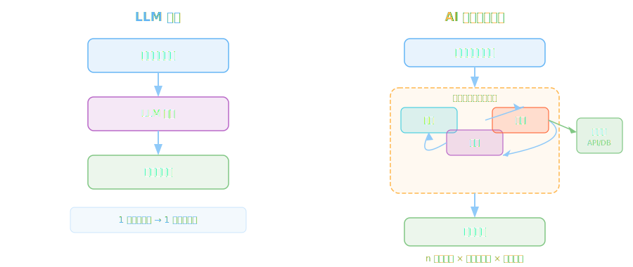
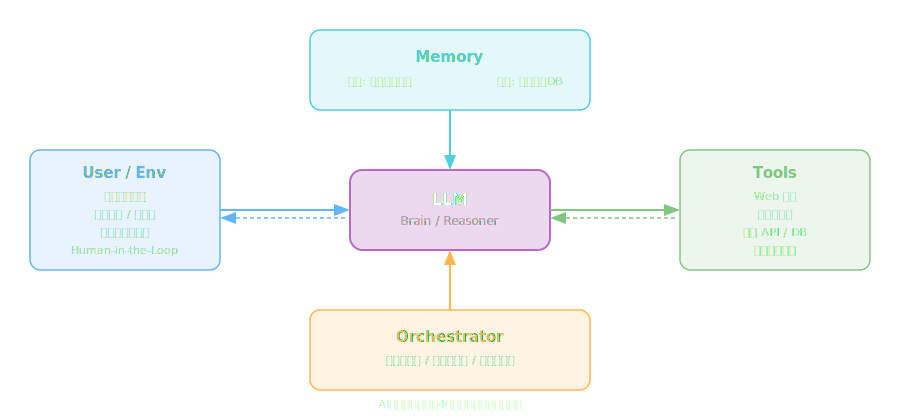
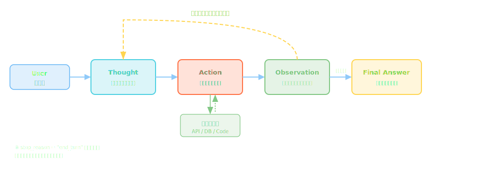
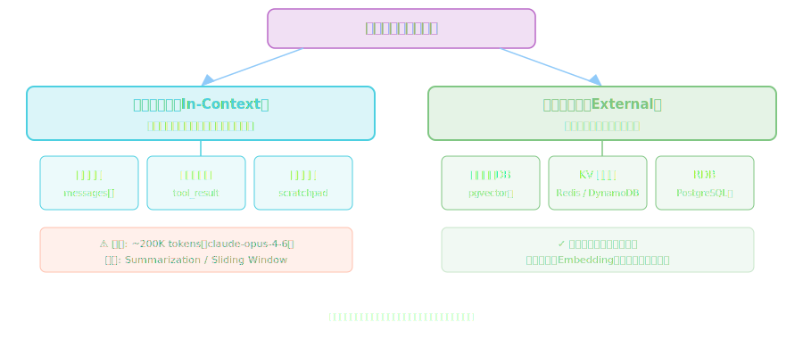
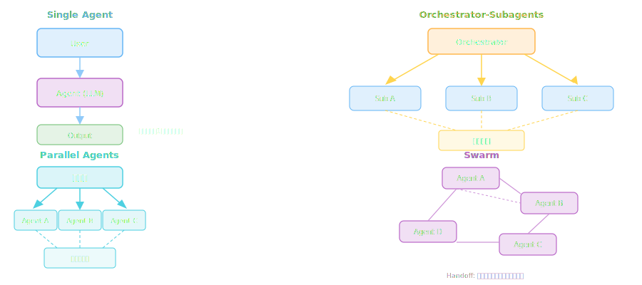
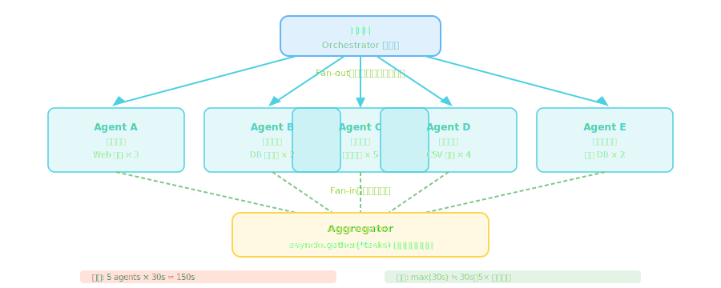
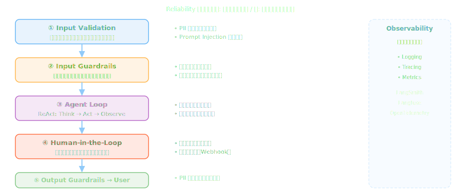
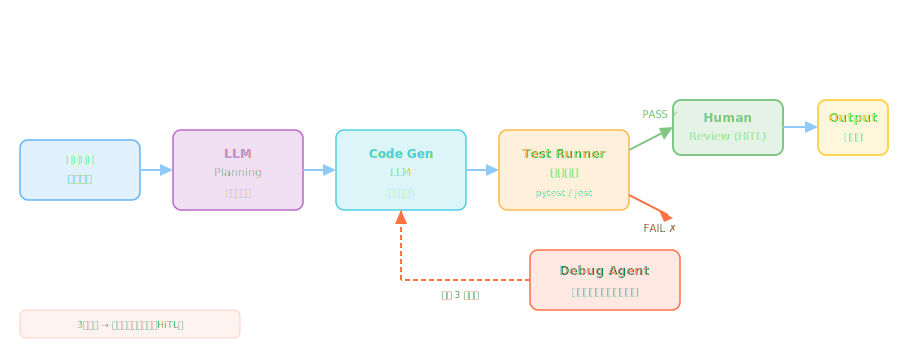
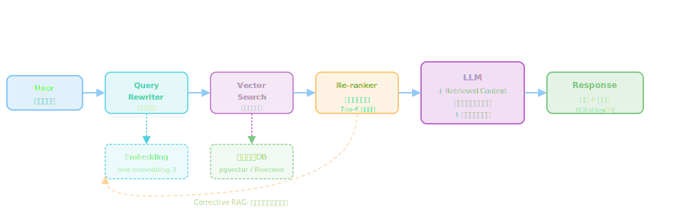

<!-- _class: lead -->
# AI エージェント設計パターン

- <svg viewBox="0 0 800 300" style="max-height:70vh;max-width:100%;display:block;margin:0 auto;">
  <rect width="800" height="300" fill="#1a1a2e"/>
  <circle cx="400" cy="150" r="60" fill="#16213e" stroke="#f9a825" stroke-width="3"/>
  <text x="400" y="145" text-anchor="middle" fill="#f9a825" font-size="13" font-family="sans-serif">AI Agent</text>
  <text x="400" y="163" text-anchor="middle" fill="#f9a825" font-size="13" font-family="sans-serif">Core</text>
  <circle cx="160" cy="80" r="42" fill="#16213e" stroke="#e91e63" stroke-width="2"/>
  <text x="160" y="76" text-anchor="middle" fill="#e91e63" font-size="11" font-family="sans-serif">Core</text>
  <text x="160" y="92" text-anchor="middle" fill="#e91e63" font-size="11" font-family="sans-serif">Patterns</text>
  <line x1="342" y1="123" x2="200" y2="99" stroke="#888" stroke-width="1.5"/>
  <circle cx="640" cy="80" r="42" fill="#16213e" stroke="#e91e63" stroke-width="2"/>
  <text x="640" y="76" text-anchor="middle" fill="#e91e63" font-size="11" font-family="sans-serif">Orchestration</text>
  <text x="640" y="92" text-anchor="middle" fill="#e91e63" font-size="11" font-family="sans-serif">Patterns</text>
  <line x1="458" y1="123" x2="601" y2="99" stroke="#888" stroke-width="1.5"/>
  <circle cx="160" cy="225" r="42" fill="#16213e" stroke="#e91e63" stroke-width="2"/>
  <text x="160" y="221" text-anchor="middle" fill="#e91e63" font-size="11" font-family="sans-serif">Reliability</text>
  <text x="160" y="237" text-anchor="middle" fill="#e91e63" font-size="11" font-family="sans-serif">Patterns</text>
  <line x1="342" y1="177" x2="200" y2="204" stroke="#888" stroke-width="1.5"/>
  <circle cx="640" cy="225" r="42" fill="#16213e" stroke="#e91e63" stroke-width="2"/>
  <text x="640" y="221" text-anchor="middle" fill="#e91e63" font-size="11" font-family="sans-serif">Best</text>
  <text x="640" y="237" text-anchor="middle" fill="#e91e63" font-size="11" font-family="sans-serif">Practices</text>
  <line x1="458" y1="177" x2="601" y2="204" stroke="#888" stroke-width="1.5"/>
</svg>
- アーキテクト・テックリードのための実践ガイド
- ワークショップ | 2026.02.19


---

# アジェンダ (1/2)

- 1. **AI エージェントとは** — 定義・LLMとの違い・なぜパターンが必要か
- 2. **Core Patterns** — ReAct / Chain-of-Thought / Tool Use / Memory
- 3. **Orchestration Patterns** — Single / Multi-Agent / Parallel / Swarm
- 4. **Reliability Patterns** — HiTL / 検証ループ / エラー回復 / Guardrails


---

# アジェンダ (2/2)

- 5. **実アーキテクチャ事例** — コード生成 / リサーチ / RAG エージェント
- 6. **実装ベストプラクティス** — プロンプト設計 / コンテキスト管理 / 評価
- 7. **まとめ・Q&A**


---

<!-- _class: lead -->
# 1. AI エージェントとは

- <svg viewBox="0 0 800 260" style="max-height:70vh;max-width:100%;display:block;margin:0 auto;">
  <rect width="800" height="260" fill="#1a1a2e"/>
  <rect x="60" y="20" width="200" height="80" rx="8" fill="#16213e" stroke="#888" stroke-width="1.5"/>
  <text x="160" y="55" text-anchor="middle" fill="#aaa" font-size="12" font-family="sans-serif">Traditional Software</text>
  <text x="160" y="75" text-anchor="middle" fill="#aaa" font-size="11" font-family="sans-serif">Input → Rule → Output</text>
  <rect x="310" y="20" width="200" height="80" rx="8" fill="#16213e" stroke="#f9a825" stroke-width="2"/>
  <text x="410" y="55" text-anchor="middle" fill="#f9a825" font-size="12" font-family="sans-serif">LLM</text>
  <text x="410" y="75" text-anchor="middle" fill="#f9a825" font-size="11" font-family="sans-serif">Input → Reason → Output</text>
  <rect x="560" y="20" width="180" height="80" rx="8" fill="#16213e" stroke="#e91e63" stroke-width="2"/>
  <text x="650" y="55" text-anchor="middle" fill="#e91e63" font-size="12" font-family="sans-serif">AI Agent</text>
  <text x="650" y="75" text-anchor="middle" fill="#e91e63" font-size="11" font-family="sans-serif">Perceive→Plan→Act</text>
  <polygon points="278,60 300,54 300,66" fill="#888"/>
  <line x1="260" y1="60" x2="300" y2="60" stroke="#888" stroke-width="1.5"/>
  <polygon points="528,60 550,54 550,66" fill="#f9a825"/>
  <line x1="510" y1="60" x2="550" y2="60" stroke="#f9a825" stroke-width="1.5"/>
  <rect x="100" y="140" width="130" height="60" rx="6" fill="#16213e" stroke="#e91e63" stroke-width="1.5"/>
  <text x="165" y="166" text-anchor="middle" fill="#e91e63" font-size="11" font-family="sans-serif">Perception</text>
  <text x="165" y="182" text-anchor="middle" fill="#ffffff" font-size="10" font-family="sans-serif">環境を観測</text>
  <rect x="260" y="140" width="130" height="60" rx="6" fill="#16213e" stroke="#e91e63" stroke-width="1.5"/>
  <text x="325" y="166" text-anchor="middle" fill="#e91e63" font-size="11" font-family="sans-serif">Reasoning</text>
  <text x="325" y="182" text-anchor="middle" fill="#ffffff" font-size="10" font-family="sans-serif">計画・判断</text>
  <rect x="420" y="140" width="130" height="60" rx="6" fill="#16213e" stroke="#e91e63" stroke-width="1.5"/>
  <text x="485" y="166" text-anchor="middle" fill="#e91e63" font-size="11" font-family="sans-serif">Action</text>
  <text x="485" y="182" text-anchor="middle" fill="#ffffff" font-size="10" font-family="sans-serif">ツール実行</text>
  <rect x="580" y="140" width="120" height="60" rx="6" fill="#16213e" stroke="#e91e63" stroke-width="1.5"/>
  <text x="640" y="166" text-anchor="middle" fill="#e91e63" font-size="11" font-family="sans-serif">Learning</text>
  <text x="640" y="182" text-anchor="middle" fill="#ffffff" font-size="10" font-family="sans-serif">フィードバック</text>
  <polygon points="238,170 258,164 258,176" fill="#888"/>
  <line x1="230" y1="170" x2="258" y2="170" stroke="#888" stroke-width="1.5"/>
  <polygon points="398,170 418,164 418,176" fill="#888"/>
  <line x1="390" y1="170" x2="418" y2="170" stroke="#888" stroke-width="1.5"/>
  <polygon points="558,170 578,164 578,176" fill="#888"/>
  <line x1="550" y1="170" x2="578" y2="170" stroke="#888" stroke-width="1.5"/>
</svg>
- 定義・LLMとの違い・なぜパターンが必要か


---

# AI エージェントの定義

- <svg viewBox="0 0 800 280" style="max-height:70vh;max-width:100%;display:block;margin:0 auto;">
  <rect width="800" height="280" fill="#1a1a2e"/>
  <text x="400" y="26" text-anchor="middle" fill="#f9a825" font-size="14" font-weight="bold">AI エージェントのコアループ</text>
  <!-- Perceive -->
  <rect x="40" y="100" width="150" height="60" rx="8" fill="#16213e" stroke="#f9a825" stroke-width="2"/>
  <text x="115" y="126" text-anchor="middle" fill="#f9a825" font-size="13" font-weight="bold">Perceive</text>
  <text x="115" y="148" text-anchor="middle" fill="#ffffff" font-size="11">環境・入力観察</text>
  <!-- Think -->
  <rect x="325" y="100" width="150" height="60" rx="8" fill="#16213e" stroke="#e91e63" stroke-width="2"/>
  <text x="400" y="126" text-anchor="middle" fill="#e91e63" font-size="13" font-weight="bold">Think</text>
  <text x="400" y="148" text-anchor="middle" fill="#ffffff" font-size="11">LLM推論・計画</text>
  <!-- Act -->
  <rect x="610" y="100" width="150" height="60" rx="8" fill="#16213e" stroke="#f9a825" stroke-width="2"/>
  <text x="685" y="126" text-anchor="middle" fill="#f9a825" font-size="13" font-weight="bold">Act</text>
  <text x="685" y="148" text-anchor="middle" fill="#ffffff" font-size="11">ツール実行・出力</text>
  <!-- Arrows -->
  <polygon points="313,130 298,122 298,138" fill="#f9a825"/>
  <line x1="190" y1="130" x2="313" y2="130" stroke="#f9a825" stroke-width="2.5"/>
  <polygon points="598,130 583,122 583,138" fill="#f9a825"/>
  <line x1="475" y1="130" x2="598" y2="130" stroke="#f9a825" stroke-width="2.5"/>
  <!-- Feedback loop -->
  <path d="M 760 160 Q 760 230 400 230 Q 40 230 40 160" fill="none" stroke="#f9a825" stroke-width="2" stroke-dasharray="6"/>
  <polygon points="40,160 34,172 46,172" fill="#f9a825"/>
  <text x="400" y="252" text-anchor="middle" fill="#f9a825" font-size="11">観察→思考→行動 の反復ループ</text>
</svg>
- **目標志向**: 与えられた目標を達成するために自律的に行動する
- **環境との相互作用**: ツール・API・DB などの外部リソースを利用できる
- **ループ構造**: 観察 → 推論 → 行動のサイクルを繰り返す
- **永続的コンテキスト**: セッションを超えた状態管理が可能
- → "LLMを部品として組み合わせた自律型システム"


---

# LLM 単体 vs AI エージェント

- <svg viewBox="0 0 800 290" style="max-height:70vh;max-width:100%;display:block;margin:0 auto;">
  <rect width="800" height="290" fill="#1a1a2e"/>
  <!-- LLM alone -->
  <rect x="40" y="50" width="320" height="200" rx="8" fill="#16213e" stroke="#e91e63" stroke-width="2"/>
  <text x="200" y="78" text-anchor="middle" fill="#e91e63" font-size="13" font-weight="bold">LLM 単体</text>
  <text x="200" y="110" text-anchor="middle" fill="#ffffff" font-size="11">1回のプロンプト → 1回の応答</text>
  <text x="200" y="135" text-anchor="middle" fill="#ffffff" font-size="11">ツール呼び出し不可</text>
  <text x="200" y="160" text-anchor="middle" fill="#ffffff" font-size="11">メモリなし（コンテキスト内のみ）</text>
  <text x="200" y="185" text-anchor="middle" fill="#ffffff" font-size="11">外部環境にアクセス不可</text>
  <text x="200" y="210" text-anchor="middle" fill="#e91e63" font-size="12">受動的・単発</text>
  <!-- Agent -->
  <rect x="440" y="50" width="320" height="200" rx="8" fill="#16213e" stroke="#f9a825" stroke-width="2"/>
  <text x="600" y="78" text-anchor="middle" fill="#f9a825" font-size="13" font-weight="bold">AI エージェント</text>
  <text x="600" y="110" text-anchor="middle" fill="#ffffff" font-size="11">自律的な多ステップ実行</text>
  <text x="600" y="135" text-anchor="middle" fill="#ffffff" font-size="11">ツール使用 (Web, DB, API)</text>
  <text x="600" y="160" text-anchor="middle" fill="#ffffff" font-size="11">長期メモリ・状態保持</text>
  <text x="600" y="185" text-anchor="middle" fill="#ffffff" font-size="11">環境への能動的働きかけ</text>
  <text x="600" y="210" text-anchor="middle" fill="#f9a825" font-size="12">能動的・継続的</text>
  <text x="400" y="165" text-anchor="middle" fill="#ffffff" font-size="20" font-weight="bold" opacity="0.5">VS</text>
</svg>



---

# なぜ設計パターンが必要か

- <svg viewBox="0 0 800 260" style="max-height:70vh;max-width:100%;display:block;margin:0 auto;">
  <rect width="800" height="260" fill="#1a1a2e"/>
  <text x="400" y="28" text-anchor="middle" fill="#f9a825" font-size="14" font-family="sans-serif">設計パターンがもたらす価値</text>
  <rect x="30" y="50" width="165" height="175" rx="8" fill="#16213e" stroke="#e91e63" stroke-width="2"/>
  <text x="112" y="78" text-anchor="middle" fill="#e91e63" font-size="12" font-family="sans-serif">再利用性</text>
  <text x="112" y="100" text-anchor="middle" fill="#ffffff" font-size="10" font-family="sans-serif">実証済みの解法を</text>
  <text x="112" y="116" text-anchor="middle" fill="#ffffff" font-size="10" font-family="sans-serif">繰り返し適用</text>
  <text x="112" y="148" text-anchor="middle" fill="#f9a825" font-size="28" font-family="sans-serif">⟳</text>
  <rect x="215" y="50" width="165" height="175" rx="8" fill="#16213e" stroke="#e91e63" stroke-width="2"/>
  <text x="297" y="78" text-anchor="middle" fill="#e91e63" font-size="12" font-family="sans-serif">共通言語</text>
  <text x="297" y="100" text-anchor="middle" fill="#ffffff" font-size="10" font-family="sans-serif">チーム間で設計を</text>
  <text x="297" y="116" text-anchor="middle" fill="#ffffff" font-size="10" font-family="sans-serif">明確に伝達</text>
  <text x="297" y="148" text-anchor="middle" fill="#f9a825" font-size="28" font-family="sans-serif">💬</text>
  <rect x="400" y="50" width="165" height="175" rx="8" fill="#16213e" stroke="#e91e63" stroke-width="2"/>
  <text x="482" y="78" text-anchor="middle" fill="#e91e63" font-size="12" font-family="sans-serif">品質向上</text>
  <text x="482" y="100" text-anchor="middle" fill="#ffffff" font-size="10" font-family="sans-serif">既知の問題を</text>
  <text x="482" y="116" text-anchor="middle" fill="#ffffff" font-size="10" font-family="sans-serif">事前に回避</text>
  <text x="482" y="148" text-anchor="middle" fill="#f9a825" font-size="28" font-family="sans-serif">✓</text>
  <rect x="585" y="50" width="185" height="175" rx="8" fill="#16213e" stroke="#e91e63" stroke-width="2"/>
  <text x="677" y="78" text-anchor="middle" fill="#e91e63" font-size="12" font-family="sans-serif">スケーラビリティ</text>
  <text x="677" y="100" text-anchor="middle" fill="#ffffff" font-size="10" font-family="sans-serif">複雑なシステムを</text>
  <text x="677" y="116" text-anchor="middle" fill="#ffffff" font-size="10" font-family="sans-serif">体系的に構築</text>
  <text x="677" y="148" text-anchor="middle" fill="#f9a825" font-size="28" font-family="sans-serif">▲</text>
</svg>
- **非決定性**: LLMの出力は確率的 → 予測不能な挙動が発生する
- **状態管理の複雑さ**: マルチステップ処理で状態が爆発的に増加
- **信頼性の確保**: エラー回復・リトライ・人間介入の設計が必須
- **スケーラビリティ**: 複数エージェントの協調制御が困難
- → パターンは「実証済みの解決策の語彙」を提供する


---

# エージェントの4つのコアコンポーネント

- <svg viewBox="0 0 800 300" style="max-height:70vh;max-width:100%;display:block;margin:0 auto;">
  <rect width="800" height="300" fill="#1a1a2e"/>
  <text x="400" y="26" text-anchor="middle" fill="#f9a825" font-size="14" font-weight="bold">エージェントの4つのコアコンポーネント</text>
  <!-- LLM core -->
  <ellipse cx="400" cy="160" rx="70" ry="50" fill="#e91e63" opacity="0.9"/>
  <text x="400" y="155" text-anchor="middle" fill="#ffffff" font-size="13" font-weight="bold">LLM</text>
  <text x="400" y="173" text-anchor="middle" fill="#ffffff" font-size="11">推論エンジン</text>
  <!-- 4 components -->
  <rect x="20" y="50" width="160" height="50" rx="6" fill="#16213e" stroke="#f9a825" stroke-width="2"/>
  <text x="100" y="72" text-anchor="middle" fill="#f9a825" font-size="12" font-weight="bold">Memory</text>
  <text x="100" y="90" text-anchor="middle" fill="#ffffff" font-size="10">短期・長期記憶</text>
  <line x1="180" y1="75" x2="330" y2="145" stroke="#f9a825" stroke-width="1.5"/>

  <rect x="620" y="50" width="160" height="50" rx="6" fill="#16213e" stroke="#f9a825" stroke-width="2"/>
  <text x="700" y="72" text-anchor="middle" fill="#f9a825" font-size="12" font-weight="bold">Planning</text>
  <text x="700" y="90" text-anchor="middle" fill="#ffffff" font-size="10">目標分解・実行計画</text>
  <line x1="620" y1="75" x2="470" y2="145" stroke="#f9a825" stroke-width="1.5"/>

  <rect x="20" y="210" width="160" height="50" rx="6" fill="#16213e" stroke="#f9a825" stroke-width="2"/>
  <text x="100" y="232" text-anchor="middle" fill="#f9a825" font-size="12" font-weight="bold">Tool Use</text>
  <text x="100" y="250" text-anchor="middle" fill="#ffffff" font-size="10">外部API・DB操作</text>
  <line x1="180" y1="235" x2="330" y2="180" stroke="#f9a825" stroke-width="1.5"/>

  <rect x="620" y="210" width="160" height="50" rx="6" fill="#16213e" stroke="#f9a825" stroke-width="2"/>
  <text x="700" y="232" text-anchor="middle" fill="#f9a825" font-size="12" font-weight="bold">Reflection</text>
  <text x="700" y="250" text-anchor="middle" fill="#ffffff" font-size="10">自己評価・修正</text>
  <line x1="620" y1="235" x2="470" y2="180" stroke="#f9a825" stroke-width="1.5"/>
</svg>



---

<!-- _class: lead -->
# 2. Core Patterns

- <svg viewBox="0 0 800 260" style="max-height:70vh;max-width:100%;display:block;margin:0 auto;">
  <rect width="800" height="260" fill="#1a1a2e"/>
  <text x="400" y="30" text-anchor="middle" fill="#f9a825" font-size="14" font-family="sans-serif">Core Patterns 概要</text>
  <rect x="50" y="55" width="160" height="85" rx="8" fill="#16213e" stroke="#f9a825" stroke-width="2"/>
  <text x="130" y="85" text-anchor="middle" fill="#f9a825" font-size="12" font-family="sans-serif">ReAct</text>
  <text x="130" y="103" text-anchor="middle" fill="#ffffff" font-size="10" font-family="sans-serif">思考→行動→観察</text>
  <text x="130" y="119" text-anchor="middle" fill="#aaa" font-size="10" font-family="sans-serif">反復ループ</text>
  <rect x="230" y="55" width="160" height="85" rx="8" fill="#16213e" stroke="#f9a825" stroke-width="2"/>
  <text x="310" y="85" text-anchor="middle" fill="#f9a825" font-size="12" font-family="sans-serif">Tool Use</text>
  <text x="310" y="103" text-anchor="middle" fill="#ffffff" font-size="10" font-family="sans-serif">外部ツール呼び出し</text>
  <text x="310" y="119" text-anchor="middle" fill="#aaa" font-size="10" font-family="sans-serif">能力拡張</text>
  <rect x="410" y="55" width="160" height="85" rx="8" fill="#16213e" stroke="#f9a825" stroke-width="2"/>
  <text x="490" y="85" text-anchor="middle" fill="#f9a825" font-size="12" font-family="sans-serif">Memory</text>
  <text x="490" y="103" text-anchor="middle" fill="#ffffff" font-size="10" font-family="sans-serif">短期・長期記憶</text>
  <text x="490" y="119" text-anchor="middle" fill="#aaa" font-size="10" font-family="sans-serif">状態管理</text>
  <rect x="590" y="55" width="160" height="85" rx="8" fill="#16213e" stroke="#f9a825" stroke-width="2"/>
  <text x="670" y="85" text-anchor="middle" fill="#f9a825" font-size="12" font-family="sans-serif">Planning</text>
  <text x="670" y="103" text-anchor="middle" fill="#ffffff" font-size="10" font-family="sans-serif">タスク分解</text>
  <text x="670" y="119" text-anchor="middle" fill="#aaa" font-size="10" font-family="sans-serif">目標達成</text>
  <rect x="150" y="175" width="500" height="60" rx="8" fill="#16213e" stroke="#e91e63" stroke-width="1.5"/>
  <text x="400" y="200" text-anchor="middle" fill="#e91e63" font-size="12" font-family="sans-serif">すべての Core Patterns は Perceive → Plan → Act サイクルを実装</text>
  <text x="400" y="220" text-anchor="middle" fill="#aaa" font-size="11" font-family="sans-serif">組み合わせて使うことでより強力なエージェントを構築できる</text>
  <line x1="130" y1="140" x2="400" y2="175" stroke="#888" stroke-width="1" stroke-dasharray="4,3"/>
  <line x1="310" y1="140" x2="400" y2="175" stroke="#888" stroke-width="1" stroke-dasharray="4,3"/>
  <line x1="490" y1="140" x2="400" y2="175" stroke="#888" stroke-width="1" stroke-dasharray="4,3"/>
  <line x1="670" y1="140" x2="400" y2="175" stroke="#888" stroke-width="1" stroke-dasharray="4,3"/>
</svg>
- ReAct / Chain-of-Thought / Tool Use / Memory


---

# ReAct パターン概要

- <svg viewBox="0 0 800 280" style="max-height:70vh;max-width:100%;display:block;margin:0 auto;">
  <rect width="800" height="280" fill="#1a1a2e"/>
  <text x="400" y="26" text-anchor="middle" fill="#f9a825" font-size="14" font-weight="bold">ReAct パターン: Reasoning + Acting</text>
  <!-- Cycle boxes -->
  <rect x="60" y="70" width="160" height="60" rx="8" fill="#16213e" stroke="#f9a825" stroke-width="2"/>
  <text x="140" y="97" text-anchor="middle" fill="#f9a825" font-size="13" font-weight="bold">Thought</text>
  <text x="140" y="118" text-anchor="middle" fill="#ffffff" font-size="10">推論・計画立案</text>

  <rect x="320" y="70" width="160" height="60" rx="8" fill="#16213e" stroke="#e91e63" stroke-width="2"/>
  <text x="400" y="97" text-anchor="middle" fill="#e91e63" font-size="13" font-weight="bold">Action</text>
  <text x="400" y="118" text-anchor="middle" fill="#ffffff" font-size="10">ツール呼び出し</text>

  <rect x="580" y="70" width="160" height="60" rx="8" fill="#16213e" stroke="#f9a825" stroke-width="2"/>
  <text x="660" y="97" text-anchor="middle" fill="#f9a825" font-size="13" font-weight="bold">Observation</text>
  <text x="660" y="118" text-anchor="middle" fill="#ffffff" font-size="10">結果観察・記録</text>

  <!-- Arrows forward -->
  <polygon points="308,100 294,92 294,108" fill="#f9a825"/>
  <line x1="220" y1="100" x2="308" y2="100" stroke="#f9a825" stroke-width="2.5"/>
  <polygon points="568,100 554,92 554,108" fill="#f9a825"/>
  <line x1="480" y1="100" x2="568" y2="100" stroke="#e91e63" stroke-width="2.5"/>

  <!-- Loop back -->
  <path d="M 740 130 Q 740 210 400 210 Q 60 210 60 130" fill="none" stroke="#f9a825" stroke-width="2" stroke-dasharray="6"/>
  <polygon points="60,130 54,142 66,142" fill="#f9a825"/>
  <text x="400" y="233" text-anchor="middle" fill="#f9a825" font-size="11">タスク完了まで反復</text>

  <!-- Final answer -->
  <rect x="300" y="250" width="200" height="26" rx="4" fill="#f9a825" opacity="0.9"/>
  <text x="400" y="268" text-anchor="middle" fill="#1a1a2e" font-size="12" font-weight="bold">Final Answer</text>
</svg>
- **Reasoning + Acting** の組み合わせ（Yao et al., 2022）
- LLMに「思考」と「行動」を交互に出力させるアプローチ
- **Thought**: 次に何をすべきか推論する
- **Action**: ツールを呼び出す（Function Calling）
- **Observation**: ツールの結果を受け取り、次の思考へ
- → 複雑な多段タスクに対して最も広く使われる基本パターン


---

# ReAct: Thought-Action-Observation サイクル

- <svg viewBox="0 0 800 270" style="max-height:70vh;max-width:100%;display:block;margin:0 auto;">
  <rect width="800" height="270" fill="#1a1a2e"/>
  <text x="400" y="28" text-anchor="middle" fill="#f9a825" font-size="14" font-family="sans-serif">ReAct サイクル</text>
  <circle cx="400" cy="145" r="38" fill="#16213e" stroke="#f9a825" stroke-width="2"/>
  <text x="400" y="141" text-anchor="middle" fill="#f9a825" font-size="11" font-family="sans-serif">LLM</text>
  <text x="400" y="157" text-anchor="middle" fill="#ffffff" font-size="10" font-family="sans-serif">Core</text>
  <ellipse cx="180" cy="80" rx="70" ry="35" fill="#16213e" stroke="#e91e63" stroke-width="2"/>
  <text x="180" y="76" text-anchor="middle" fill="#e91e63" font-size="12" font-family="sans-serif">Thought</text>
  <text x="180" y="92" text-anchor="middle" fill="#ffffff" font-size="10" font-family="sans-serif">推論・計画</text>
  <ellipse cx="620" cy="80" rx="70" ry="35" fill="#16213e" stroke="#e91e63" stroke-width="2"/>
  <text x="620" y="76" text-anchor="middle" fill="#e91e63" font-size="12" font-family="sans-serif">Action</text>
  <text x="620" y="92" text-anchor="middle" fill="#ffffff" font-size="10" font-family="sans-serif">ツール実行</text>
  <ellipse cx="400" cy="230" rx="70" ry="33" fill="#16213e" stroke="#e91e63" stroke-width="2"/>
  <text x="400" y="226" text-anchor="middle" fill="#e91e63" font-size="12" font-family="sans-serif">Observation</text>
  <text x="400" y="242" text-anchor="middle" fill="#ffffff" font-size="10" font-family="sans-serif">結果観察</text>
  <line x1="248" y1="90" x2="367" y2="123" stroke="#f9a825" stroke-width="1.5"/>
  <polygon points="358,119 370,123 362,132" fill="#f9a825"/>
  <line x1="435" y1="125" x2="552" y2="92" stroke="#f9a825" stroke-width="1.5"/>
  <polygon points="552,92 563,89 556,98" fill="#f9a825"/>
  <line x1="613" y1="115" x2="450" y2="207" stroke="#f9a825" stroke-width="1.5"/>
  <polygon points="452,207 441,212 447,200" fill="#f9a825"/>
  <line x1="350" y1="210" x2="230" y2="113" stroke="#f9a825" stroke-width="1.5"/>
  <polygon points="235,115 224,111 231,122" fill="#f9a825"/>
  <text x="270" y="158" fill="#aaa" font-size="10" font-family="sans-serif" transform="rotate(-35,270,158)">解析</text>
  <text x="510" y="115" fill="#aaa" font-size="10" font-family="sans-serif" transform="rotate(25,510,115)">実行</text>
</svg>



---

# ReAct の実装（Claude API）

- tool_use / tool_result メッセージで制御ループを構成


---

# ReAct の実装（Claude API）（コード例）

```python
MAX_STEPS = 10

for step in range(MAX_STEPS):
    response = client.messages.create(
        model="claude-opus-4-6",
        tools=tools,
        messages=messages
    )
    if response.stop_reason == "end_turn":
        break  # 完了
    # Tool 呼び出しを処理
    tool_results = []
    for block in response.content:
        if block.type == "tool_use":
            result = execute_tool(block.name, block.input)
            tool_results.append({
                "type": "tool_result",
                "tool_use_id": block.id,
                "content": result
            })
    messages.append({"role": "user", "content": tool_results})
```


---

# Chain-of-Thought (CoT)

- <svg viewBox="0 0 800 280" style="max-height:70vh;max-width:100%;display:block;margin:0 auto;">
  <rect width="800" height="280" fill="#1a1a2e"/>
  <text x="400" y="26" text-anchor="middle" fill="#f9a825" font-size="14" font-weight="bold">Chain-of-Thought (CoT) vs 直接回答</text>
  <!-- Direct answer -->
  <rect x="30" y="60" width="320" height="180" rx="8" fill="#16213e" stroke="#e91e63" stroke-width="2"/>
  <text x="190" y="85" text-anchor="middle" fill="#e91e63" font-size="12" font-weight="bold">直接回答 (Standard)</text>
  <text x="190" y="110" text-anchor="middle" fill="#ffffff" font-size="11">Q: 5×4+3は？</text>
  <text x="190" y="140" text-anchor="middle" fill="#ffffff" font-size="11">A: 23</text>
  <text x="190" y="175" text-anchor="middle" fill="#e91e63" font-size="10">複雑な問題で誤り多い</text>
  <text x="190" y="195" text-anchor="middle" fill="#e91e63" font-size="10">ブラックボックス</text>
  <!-- CoT -->
  <rect x="450" y="60" width="320" height="180" rx="8" fill="#16213e" stroke="#f9a825" stroke-width="2"/>
  <text x="610" y="85" text-anchor="middle" fill="#f9a825" font-size="12" font-weight="bold">CoT (思考連鎖)</text>
  <text x="610" y="110" text-anchor="middle" fill="#ffffff" font-size="11">Q: 5×4+3は？</text>
  <text x="610" y="130" text-anchor="middle" fill="#f9a825" font-size="10">Step 1: 5×4=20</text>
  <text x="610" y="148" text-anchor="middle" fill="#f9a825" font-size="10">Step 2: 20+3=23</text>
  <text x="610" y="166" text-anchor="middle" fill="#ffffff" font-size="11">A: 23 (正確)</text>
  <text x="610" y="195" text-anchor="middle" fill="#f9a825" font-size="10">推論過程が透明・検証可能</text>
  <!-- VS -->
  <text x="400" y="165" text-anchor="middle" fill="#ffffff" font-size="20" font-weight="bold" opacity="0.5">VS</text>
</svg>
- **Zero-shot CoT**: プロンプトに "Let's think step by step" を追加するだけ
- **Few-shot CoT**: 推論例（reasoning chain）をプロンプトに提供する
- **Tree-of-Thought (ToT)**: 複数の推論経路を並列探索・評価する
- **Chain-of-Draft**: 簡潔なメモ書きで推論品質を保ちトークンを節約
- → 数学・論理・コーディングタスクの精度を大幅に向上させる


---

# Tool Use パターン

- <svg viewBox="0 0 800 260" style="max-height:70vh;max-width:100%;display:block;margin:0 auto;">
  <rect width="800" height="260" fill="#1a1a2e"/>
  <text x="400" y="28" text-anchor="middle" fill="#f9a825" font-size="14" font-family="sans-serif">Tool Use パターン</text>
  <rect x="290" y="45" width="220" height="60" rx="8" fill="#16213e" stroke="#f9a825" stroke-width="2"/>
  <text x="400" y="72" text-anchor="middle" fill="#f9a825" font-size="13" font-family="sans-serif">AI Agent (LLM)</text>
  <text x="400" y="92" text-anchor="middle" fill="#aaa" font-size="10" font-family="sans-serif">ツール選択・パラメータ生成</text>
  <rect x="30" y="160" width="140" height="70" rx="6" fill="#16213e" stroke="#e91e63" stroke-width="1.5"/>
  <text x="100" y="188" text-anchor="middle" fill="#e91e63" font-size="11" font-family="sans-serif">Web Search</text>
  <text x="100" y="206" text-anchor="middle" fill="#ffffff" font-size="10" font-family="sans-serif">リアルタイム情報</text>
  <rect x="190" y="160" width="140" height="70" rx="6" fill="#16213e" stroke="#e91e63" stroke-width="1.5"/>
  <text x="260" y="188" text-anchor="middle" fill="#e91e63" font-size="11" font-family="sans-serif">Code Exec</text>
  <text x="260" y="206" text-anchor="middle" fill="#ffffff" font-size="10" font-family="sans-serif">計算・処理</text>
  <rect x="350" y="160" width="140" height="70" rx="6" fill="#16213e" stroke="#e91e63" stroke-width="1.5"/>
  <text x="420" y="188" text-anchor="middle" fill="#e91e63" font-size="11" font-family="sans-serif">Database</text>
  <text x="420" y="206" text-anchor="middle" fill="#ffffff" font-size="10" font-family="sans-serif">永続データ取得</text>
  <rect x="510" y="160" width="140" height="70" rx="6" fill="#16213e" stroke="#e91e63" stroke-width="1.5"/>
  <text x="580" y="188" text-anchor="middle" fill="#e91e63" font-size="11" font-family="sans-serif">API Call</text>
  <text x="580" y="206" text-anchor="middle" fill="#ffffff" font-size="10" font-family="sans-serif">外部サービス</text>
  <rect x="650" y="160" width="120" height="70" rx="6" fill="#16213e" stroke="#e91e63" stroke-width="1.5"/>
  <text x="710" y="188" text-anchor="middle" fill="#e91e63" font-size="11" font-family="sans-serif">File I/O</text>
  <text x="710" y="206" text-anchor="middle" fill="#ffffff" font-size="10" font-family="sans-serif">ファイル操作</text>
  <line x1="400" y1="105" x2="100" y2="160" stroke="#888" stroke-width="1.5" stroke-dasharray="4,3"/>
  <line x1="400" y1="105" x2="260" y2="160" stroke="#888" stroke-width="1.5" stroke-dasharray="4,3"/>
  <line x1="400" y1="105" x2="420" y2="160" stroke="#888" stroke-width="1.5" stroke-dasharray="4,3"/>
  <line x1="400" y1="105" x2="580" y2="160" stroke="#888" stroke-width="1.5" stroke-dasharray="4,3"/>
  <line x1="400" y1="105" x2="710" y2="160" stroke="#888" stroke-width="1.5" stroke-dasharray="4,3"/>
</svg>
- LLMに外部ツール（関数・API）を呼び出す能力を付与するパターン
- **Function Calling**: 構造化された引数でツールを呼び出す
- **ツールの種類**: 検索・コード実行・DB操作・外部API・ファイルI/O
- **設計原則**: 単一責任・明確な入出力スキーマ・エラー処理


---

# ツール設計のベストプラクティス

- **名前**: 動詞+名詞で意図が明確に（例: `search_documents`, `execute_code`）
- **説明文**: LLMが「いつ・なぜ使うか」判断できるよう詳細に記述する
- **スキーマ**: JSON Schema で厳密に型定義し、description を必ず付ける
- **冪等性**: 同じ入力は同じ結果（副作用を持つツールは要注意）
- **エラー**: 失敗時も構造化レスポンスで返す（LLMが判断できるように）


---

# Function Calling の実装

- input_schema に JSON Schema 形式でツール定義を記述する


---

# Function Calling の実装（コード例）

```python
tools = [
  {
    "name": "search_documents",
    "description": "社内ドキュメントを全文検索する。検索したい情報がある場合に使用",
    "input_schema": {
      "type": "object",
      "properties": {
        "query": {
          "type": "string",
          "description": "検索クエリ文字列"
        },
        "limit": {
          "type": "integer",
          "description": "最大取得件数",
          "default": 5
        }
      },
      "required": ["query"]
    }
  }
]
```


---

# Memory パターン概要

- <svg viewBox="0 0 800 260" style="max-height:70vh;max-width:100%;display:block;margin:0 auto;">
  <rect width="800" height="260" fill="#1a1a2e"/>
  <text x="400" y="28" text-anchor="middle" fill="#f9a825" font-size="14" font-family="sans-serif">Memory パターン: 4層構造</text>
  <rect x="40" y="50" width="340" height="90" rx="8" fill="#16213e" stroke="#f9a825" stroke-width="2"/>
  <text x="210" y="78" text-anchor="middle" fill="#f9a825" font-size="12" font-family="sans-serif">短期メモリ (In-Context)</text>
  <text x="210" y="98" text-anchor="middle" fill="#ffffff" font-size="10" font-family="sans-serif">現在の会話履歴・作業状態</text>
  <text x="210" y="114" text-anchor="middle" fill="#aaa" font-size="10" font-family="sans-serif">コンテキストウィンドウ内に保持</text>
  <rect x="420" y="50" width="340" height="90" rx="8" fill="#16213e" stroke="#e91e63" stroke-width="2"/>
  <text x="590" y="78" text-anchor="middle" fill="#e91e63" font-size="12" font-family="sans-serif">長期メモリ (External)</text>
  <text x="590" y="98" text-anchor="middle" fill="#ffffff" font-size="10" font-family="sans-serif">ベクターDB・KVストア</text>
  <text x="590" y="114" text-anchor="middle" fill="#aaa" font-size="10" font-family="sans-serif">セッション超えて保持</text>
  <rect x="40" y="160" width="340" height="80" rx="8" fill="#16213e" stroke="#e91e63" stroke-width="1.5"/>
  <text x="210" y="188" text-anchor="middle" fill="#e91e63" font-size="12" font-family="sans-serif">エピソードメモリ</text>
  <text x="210" y="206" text-anchor="middle" fill="#ffffff" font-size="10" font-family="sans-serif">過去の対話・経験の記録</text>
  <text x="210" y="222" text-anchor="middle" fill="#aaa" font-size="10" font-family="sans-serif">類似事例の検索・活用</text>
  <rect x="420" y="160" width="340" height="80" rx="8" fill="#16213e" stroke="#e91e63" stroke-width="1.5"/>
  <text x="590" y="188" text-anchor="middle" fill="#e91e63" font-size="12" font-family="sans-serif">意味メモリ</text>
  <text x="590" y="206" text-anchor="middle" fill="#ffffff" font-size="10" font-family="sans-serif">知識・事実・ルールの保存</text>
  <text x="590" y="222" text-anchor="middle" fill="#aaa" font-size="10" font-family="sans-serif">RAGによる知識検索</text>
</svg>



---

# 短期メモリ: コンテキストウィンドウ管理

- 問題: 長い会話でコンテキスト上限（200K tokens）に到達してしまう
- **Sliding Window**: 古いメッセージを一定数に制限して削除
- **Summarization**: 古い会話を定期的に要約して圧縮する
- **Selective Retention**: 重要なメッセージのみを選択的に保持
- → トレードオフ: 情報損失 vs コスト削減・レイテンシ改善


---

# 長期メモリ: ベクターストア活用

- ベクター検索で意味的に近い過去記録を動的に取得できる
- **RAG**: 外部知識ベースを Embedding でベクター化して保存
- **実装**: pgvector / Pinecone / OpenSearch Serverless
- **Episodic**: 過去のインタラクション記録を記憶として参照
- → エージェントに「長期記憶」を持たせる基本技術


---

# エージェントのステート管理

- <svg viewBox="0 0 800 260" style="max-height:70vh;max-width:100%;display:block;margin:0 auto;">
  <rect width="800" height="260" fill="#1a1a2e"/>
  <text x="400" y="28" text-anchor="middle" fill="#f9a825" font-size="14" font-family="sans-serif">エージェント ステートマシン</text>
  <rect x="60" y="60" width="120" height="55" rx="8" fill="#16213e" stroke="#888" stroke-width="1.5"/>
  <text x="120" y="83" text-anchor="middle" fill="#aaa" font-size="11" font-family="sans-serif">Idle</text>
  <text x="120" y="100" text-anchor="middle" fill="#888" font-size="10" font-family="sans-serif">待機中</text>
  <rect x="245" y="60" width="120" height="55" rx="8" fill="#16213e" stroke="#f9a825" stroke-width="2"/>
  <text x="305" y="83" text-anchor="middle" fill="#f9a825" font-size="11" font-family="sans-serif">Planning</text>
  <text x="305" y="100" text-anchor="middle" fill="#aaa" font-size="10" font-family="sans-serif">タスク分解</text>
  <rect x="430" y="60" width="120" height="55" rx="8" fill="#16213e" stroke="#e91e63" stroke-width="2"/>
  <text x="490" y="83" text-anchor="middle" fill="#e91e63" font-size="11" font-family="sans-serif">Executing</text>
  <text x="490" y="100" text-anchor="middle" fill="#aaa" font-size="10" font-family="sans-serif">ツール実行中</text>
  <rect x="615" y="60" width="120" height="55" rx="8" fill="#16213e" stroke="#e91e63" stroke-width="2"/>
  <text x="675" y="83" text-anchor="middle" fill="#e91e63" font-size="11" font-family="sans-serif">Reflecting</text>
  <text x="675" y="100" text-anchor="middle" fill="#aaa" font-size="10" font-family="sans-serif">結果評価</text>
  <rect x="430" y="175" width="120" height="55" rx="8" fill="#16213e" stroke="#888" stroke-width="1.5"/>
  <text x="490" y="198" text-anchor="middle" fill="#aaa" font-size="11" font-family="sans-serif">Done</text>
  <text x="490" y="215" text-anchor="middle" fill="#888" font-size="10" font-family="sans-serif">完了</text>
  <polygon points="243,87 243,81 233,87" fill="#f9a825"/>
  <line x1="180" y1="87" x2="243" y2="87" stroke="#f9a825" stroke-width="1.5"/>
  <polygon points="428,87 428,81 418,87" fill="#e91e63"/>
  <line x1="365" y1="87" x2="428" y2="87" stroke="#e91e63" stroke-width="1.5"/>
  <polygon points="613,87 613,81 603,87" fill="#e91e63"/>
  <line x1="550" y1="87" x2="613" y2="87" stroke="#e91e63" stroke-width="1.5"/>
  <line x1="675" y1="115" x2="675" y2="150" stroke="#f9a825" stroke-width="1.5" stroke-dasharray="4,3"/>
  <line x1="675" y1="150" x2="305" y2="150" stroke="#f9a825" stroke-width="1.5" stroke-dasharray="4,3"/>
  <polygon points="305,118 299,118 305,108" fill="#f9a825"/>
  <line x1="305" y1="115" x2="305" y2="150" stroke="#f9a825" stroke-width="1.5" stroke-dasharray="4,3"/>
  <text x="490" y="150" fill="#aaa" font-size="10" font-family="sans-serif">再計画</text>
  <line x1="490" y1="115" x2="490" y2="175" stroke="#888" stroke-width="1.5"/>
  <polygon points="484,170 490,180 496,170" fill="#888"/>
</svg>
- **ステートの種類**: 会話履歴・タスク進捗・ユーザープロファイル
- **ステートマシン**: 明示的な状態遷移で制御フローを管理する
- **永続化**: DB保存でセッション跨ぎのレジューム（再開）が可能
- → 設計の早い段階でステートスキーマを確定させることが重要


---

# Core Patterns まとめ

- <svg viewBox="0 0 800 280" style="max-height:70vh;max-width:100%;display:block;margin:0 auto;">
  <rect width="800" height="280" fill="#1a1a2e"/>
  <text x="400" y="26" text-anchor="middle" fill="#f9a825" font-size="14" font-weight="bold">Core Patterns タクソノミー</text>
  <!-- Pattern taxonomy tree -->
  <rect x="310" y="50" width="180" height="44" rx="6" fill="#e91e63" opacity="0.9"/>
  <text x="400" y="70" text-anchor="middle" fill="#ffffff" font-size="12" font-weight="bold">Core Patterns</text>
  <text x="400" y="86" text-anchor="middle" fill="#ffffff" font-size="10">基礎エージェント能力</text>
  <!-- Lines down -->
  <line x1="400" y1="94" x2="400" y2="120" stroke="#f9a825" stroke-width="1.5"/>
  <line x1="400" y1="120" x2="120" y2="120" stroke="#f9a825" stroke-width="1.5"/>
  <line x1="400" y1="120" x2="680" y2="120" stroke="#f9a825" stroke-width="1.5"/>
  <line x1="120" y1="120" x2="120" y2="140" stroke="#f9a825" stroke-width="1.5"/>
  <line x1="280" y1="120" x2="280" y2="140" stroke="#f9a825" stroke-width="1.5"/>
  <line x1="520" y1="120" x2="520" y2="140" stroke="#f9a825" stroke-width="1.5"/>
  <line x1="680" y1="120" x2="680" y2="140" stroke="#f9a825" stroke-width="1.5"/>
  <!-- Pattern boxes -->
  <rect x="40" y="140" width="160" height="50" rx="4" fill="#16213e" stroke="#f9a825" stroke-width="1.5"/>
  <text x="120" y="162" text-anchor="middle" fill="#f9a825" font-size="12" font-weight="bold">ReAct</text>
  <text x="120" y="180" text-anchor="middle" fill="#ffffff" font-size="10">思考→行動→観察</text>
  <rect x="200" y="140" width="160" height="50" rx="4" fill="#16213e" stroke="#f9a825" stroke-width="1.5"/>
  <text x="280" y="162" text-anchor="middle" fill="#f9a825" font-size="12" font-weight="bold">CoT</text>
  <text x="280" y="180" text-anchor="middle" fill="#ffffff" font-size="10">思考連鎖推論</text>
  <rect x="440" y="140" width="160" height="50" rx="4" fill="#16213e" stroke="#f9a825" stroke-width="1.5"/>
  <text x="520" y="162" text-anchor="middle" fill="#f9a825" font-size="12" font-weight="bold">Tool Use</text>
  <text x="520" y="180" text-anchor="middle" fill="#ffffff" font-size="10">外部ツール呼び出し</text>
  <rect x="600" y="140" width="160" height="50" rx="4" fill="#16213e" stroke="#f9a825" stroke-width="1.5"/>
  <text x="680" y="162" text-anchor="middle" fill="#f9a825" font-size="12" font-weight="bold">Memory</text>
  <text x="680" y="180" text-anchor="middle" fill="#ffffff" font-size="10">短期・長期記憶</text>
  <!-- Sub patterns -->
  <text x="120" y="215" text-anchor="middle" fill="#ffffff" font-size="10" opacity="0.8">→ Orchestration</text>
  <text x="280" y="215" text-anchor="middle" fill="#ffffff" font-size="10" opacity="0.8">→ Zero/Few-shot CoT</text>
  <text x="520" y="215" text-anchor="middle" fill="#ffffff" font-size="10" opacity="0.8">→ Function Calling</text>
  <text x="680" y="215" text-anchor="middle" fill="#ffffff" font-size="10" opacity="0.8">→ Vector Store</text>
</svg>
- **ReAct**: Think → Act → Observe のループ。ほぼ全エージェントの基本
- **CoT**: 推論品質向上。`think` ツールや拡張思考（Extended Thinking）で実現
- **Tool Use**: 外部世界との接続。ツール設計の質が品質を直接左右する
- **Memory**: 短期＋長期の組み合わせで実用的なエージェントを実現できる


---

<!-- _class: lead -->
# 3. Orchestration Patterns

- <svg viewBox="0 0 800 260" style="max-height:70vh;max-width:100%;display:block;margin:0 auto;">
  <rect width="800" height="260" fill="#1a1a2e"/>
  <text x="400" y="28" text-anchor="middle" fill="#f9a825" font-size="14" font-family="sans-serif">Orchestration Patterns 比較</text>
  <rect x="30" y="50" width="220" height="185" rx="8" fill="#16213e" stroke="#f9a825" stroke-width="2"/>
  <text x="140" y="78" text-anchor="middle" fill="#f9a825" font-size="12" font-family="sans-serif">Single Agent</text>
  <circle cx="140" cy="130" r="30" fill="#1a1a2e" stroke="#f9a825" stroke-width="2"/>
  <text x="140" y="135" text-anchor="middle" fill="#f9a825" font-size="10" font-family="sans-serif">Agent</text>
  <text x="140" y="185" text-anchor="middle" fill="#aaa" font-size="10" font-family="sans-serif">単一 LLM + Tools</text>
  <text x="140" y="202" text-anchor="middle" fill="#aaa" font-size="10" font-family="sans-serif">シンプル・高速</text>
  <rect x="270" y="50" width="240" height="185" rx="8" fill="#16213e" stroke="#e91e63" stroke-width="2"/>
  <text x="390" y="78" text-anchor="middle" fill="#e91e63" font-size="12" font-family="sans-serif">Orchestrator-Subagents</text>
  <circle cx="390" cy="108" r="22" fill="#1a1a2e" stroke="#e91e63" stroke-width="2"/>
  <text x="390" y="113" text-anchor="middle" fill="#e91e63" font-size="9" font-family="sans-serif">Orch</text>
  <circle cx="320" cy="160" r="18" fill="#1a1a2e" stroke="#888" stroke-width="1.5"/>
  <text x="320" y="165" text-anchor="middle" fill="#aaa" font-size="9" font-family="sans-serif">Sub1</text>
  <circle cx="390" cy="165" r="18" fill="#1a1a2e" stroke="#888" stroke-width="1.5"/>
  <text x="390" y="170" text-anchor="middle" fill="#aaa" font-size="9" font-family="sans-serif">Sub2</text>
  <circle cx="460" cy="160" r="18" fill="#1a1a2e" stroke="#888" stroke-width="1.5"/>
  <text x="460" y="165" text-anchor="middle" fill="#aaa" font-size="9" font-family="sans-serif">Sub3</text>
  <line x1="379" y1="128" x2="330" y2="143" stroke="#888" stroke-width="1.5"/>
  <line x1="390" y1="130" x2="390" y2="147" stroke="#888" stroke-width="1.5"/>
  <line x1="401" y1="128" x2="450" y2="143" stroke="#888" stroke-width="1.5"/>
  <text x="390" y="205" text-anchor="middle" fill="#aaa" font-size="10" font-family="sans-serif">タスク分散・専門化</text>
  <rect x="530" y="50" width="240" height="185" rx="8" fill="#16213e" stroke="#e91e63" stroke-width="2"/>
  <text x="650" y="78" text-anchor="middle" fill="#e91e63" font-size="12" font-family="sans-serif">Swarm</text>
  <circle cx="600" cy="130" r="18" fill="#1a1a2e" stroke="#888" stroke-width="1.5"/>
  <text x="600" y="135" text-anchor="middle" fill="#aaa" font-size="9" font-family="sans-serif">A1</text>
  <circle cx="650" cy="105" r="18" fill="#1a1a2e" stroke="#888" stroke-width="1.5"/>
  <text x="650" y="110" text-anchor="middle" fill="#aaa" font-size="9" font-family="sans-serif">A2</text>
  <circle cx="700" cy="130" r="18" fill="#1a1a2e" stroke="#888" stroke-width="1.5"/>
  <text x="700" y="135" text-anchor="middle" fill="#aaa" font-size="9" font-family="sans-serif">A3</text>
  <circle cx="650" cy="158" r="18" fill="#1a1a2e" stroke="#888" stroke-width="1.5"/>
  <text x="650" y="163" text-anchor="middle" fill="#aaa" font-size="9" font-family="sans-serif">A4</text>
  <line x1="615" y1="120" x2="637" y2="113" stroke="#888" stroke-width="1"/>
  <line x1="666" y1="113" x2="685" y2="120" stroke="#888" stroke-width="1"/>
  <line x1="697" y1="145" x2="663" y2="153" stroke="#888" stroke-width="1"/>
  <line x1="635" y1="153" x2="612" y2="143" stroke="#888" stroke-width="1"/>
  <text x="650" y="205" text-anchor="middle" fill="#aaa" font-size="10" font-family="sans-serif">自律協調・創発</text>
</svg>
- Single / Multi-Agent / Orchestrator-Subagents / Parallel / Swarm


---

# Single Agent パターン

- 1つのLLMが全タスクを処理するシンプルな構成
- **メリット**: シンプル・デバッグ容易・コンテキスト共有が自然
- **デメリット**: 複雑タスクで精度低下・長いコンテキストでコスト増加
- **適用場面**: 比較的シンプルなタスク・PoC・プロトタイピング
- → まず Single Agent で動かし、必要になってから複雑化する


---

# Multi-Agent システム

- <svg viewBox="0 0 800 300" style="max-height:70vh;max-width:100%;display:block;margin:0 auto;">
  <rect width="800" height="300" fill="#1a1a2e"/>
  <text x="400" y="26" text-anchor="middle" fill="#f9a825" font-size="14" font-weight="bold">Multi-Agent システム構成</text>
  <!-- Orchestrator -->
  <rect x="280" y="50" width="240" height="60" rx="8" fill="#e91e63" opacity="0.9"/>
  <text x="400" y="77" text-anchor="middle" fill="#ffffff" font-size="13" font-weight="bold">Orchestrator Agent</text>
  <text x="400" y="98" text-anchor="middle" fill="#ffffff" font-size="10">タスク分解・割り当て・統合</text>
  <!-- Sub-agents -->
  <rect x="40" y="190" width="160" height="60" rx="6" fill="#16213e" stroke="#f9a825" stroke-width="2"/>
  <text x="120" y="217" text-anchor="middle" fill="#f9a825" font-size="12" font-weight="bold">Research Agent</text>
  <text x="120" y="237" text-anchor="middle" fill="#ffffff" font-size="10">情報収集・Web検索</text>
  <rect x="240" y="190" width="160" height="60" rx="6" fill="#16213e" stroke="#f9a825" stroke-width="2"/>
  <text x="320" y="217" text-anchor="middle" fill="#f9a825" font-size="12" font-weight="bold">Code Agent</text>
  <text x="320" y="237" text-anchor="middle" fill="#ffffff" font-size="10">コード生成・実行</text>
  <rect x="440" y="190" width="160" height="60" rx="6" fill="#16213e" stroke="#f9a825" stroke-width="2"/>
  <text x="520" y="217" text-anchor="middle" fill="#f9a825" font-size="12" font-weight="bold">Review Agent</text>
  <text x="520" y="237" text-anchor="middle" fill="#ffffff" font-size="10">品質チェック・評価</text>
  <rect x="600" y="190" width="160" height="60" rx="6" fill="#16213e" stroke="#f9a825" stroke-width="2"/>
  <text x="680" y="217" text-anchor="middle" fill="#f9a825" font-size="12" font-weight="bold">Write Agent</text>
  <text x="680" y="237" text-anchor="middle" fill="#ffffff" font-size="10">文書生成・整形</text>
  <!-- Arrows down from orchestrator -->
  <line x1="340" y1="110" x2="165" y2="190" stroke="#f9a825" stroke-width="1.5"/>
  <polygon points="165,190 160,177 172,180" fill="#f9a825"/>
  <line x1="370" y1="110" x2="345" y2="190" stroke="#f9a825" stroke-width="1.5"/>
  <polygon points="345,190 338,178 350,178" fill="#f9a825"/>
  <line x1="430" y1="110" x2="505" y2="190" stroke="#f9a825" stroke-width="1.5"/>
  <polygon points="505,190 498,178 510,178" fill="#f9a825"/>
  <line x1="460" y1="110" x2="655" y2="190" stroke="#f9a825" stroke-width="1.5"/>
  <polygon points="655,190 650,177 662,180" fill="#f9a825"/>
  <!-- Parallel label -->
  <text x="400" y="178" text-anchor="middle" fill="#f9a825" font-size="10" opacity="0.7">並列実行</text>
</svg>
- 複数のエージェントが協調して複雑なタスクを処理するアーキテクチャ
- **分割統治**: タスクを専門エージェントに委任・分担する
- **並列処理**: 独立したサブタスクを同時実行してレイテンシを削減
- **専門化**: 各エージェントが特定ドメイン・スキルに特化できる
- → 複雑な実世界タスクに対応するための必須アーキテクチャ


---

# 4つのOrchestration Patterns 比較

- <svg viewBox="0 0 800 300" style="max-height:70vh;max-width:100%;display:block;margin:0 auto;">
  <rect width="800" height="300" fill="#1a1a2e"/>
  <text x="400" y="26" text-anchor="middle" fill="#f9a825" font-size="14" font-weight="bold">4つのOrchestration Patterns</text>
  <!-- Sequential -->
  <rect x="20" y="50" width="175" height="110" rx="6" fill="#16213e" stroke="#f9a825" stroke-width="1.5"/>
  <text x="107" y="72" text-anchor="middle" fill="#f9a825" font-size="11" font-weight="bold">Sequential</text>
  <text x="107" y="91" text-anchor="middle" fill="#ffffff" font-size="10">A → B → C</text>
  <text x="107" y="109" text-anchor="middle" fill="#ffffff" font-size="10">直列処理</text>
  <text x="107" y="127" text-anchor="middle" fill="#f9a825" font-size="9">シンプル・遅い</text>
  <text x="107" y="145" text-anchor="middle" fill="#ffffff" font-size="9">例: パイプライン</text>
  <!-- Parallel -->
  <rect x="210" y="50" width="175" height="110" rx="6" fill="#16213e" stroke="#f9a825" stroke-width="1.5"/>
  <text x="297" y="72" text-anchor="middle" fill="#f9a825" font-size="11" font-weight="bold">Parallel</text>
  <text x="297" y="91" text-anchor="middle" fill="#ffffff" font-size="10">A ⟂ B ⟂ C → merge</text>
  <text x="297" y="109" text-anchor="middle" fill="#ffffff" font-size="10">並列処理</text>
  <text x="297" y="127" text-anchor="middle" fill="#f9a825" font-size="9">高速・複雑</text>
  <text x="297" y="145" text-anchor="middle" fill="#ffffff" font-size="9">例: 並列リサーチ</text>
  <!-- Hierarchical -->
  <rect x="400" y="50" width="175" height="110" rx="6" fill="#16213e" stroke="#e91e63" stroke-width="1.5"/>
  <text x="487" y="72" text-anchor="middle" fill="#e91e63" font-size="11" font-weight="bold">Hierarchical</text>
  <text x="487" y="91" text-anchor="middle" fill="#ffffff" font-size="10">Orch → Sub-agents</text>
  <text x="487" y="109" text-anchor="middle" fill="#ffffff" font-size="10">階層型委譲</text>
  <text x="487" y="127" text-anchor="middle" fill="#e91e63" font-size="9">スケーラブル</text>
  <text x="487" y="145" text-anchor="middle" fill="#ffffff" font-size="9">例: AutoGen</text>
  <!-- Swarm -->
  <rect x="590" y="50" width="190" height="110" rx="6" fill="#16213e" stroke="#f9a825" stroke-width="1.5"/>
  <text x="685" y="72" text-anchor="middle" fill="#f9a825" font-size="11" font-weight="bold">Swarm</text>
  <text x="685" y="91" text-anchor="middle" fill="#ffffff" font-size="10">分散・自律協調</text>
  <text x="685" y="109" text-anchor="middle" fill="#ffffff" font-size="10">エージェント間通信</text>
  <text x="685" y="127" text-anchor="middle" fill="#f9a825" font-size="9">創発的動作</text>
  <text x="685" y="145" text-anchor="middle" fill="#ffffff" font-size="9">例: 複数AI協調</text>
  <!-- Selection guide -->
  <rect x="100" y="200" width="600" height="60" rx="6" fill="#16213e" stroke="#f9a825" stroke-width="1.5"/>
  <text x="400" y="224" text-anchor="middle" fill="#f9a825" font-size="12" font-weight="bold">選択指針</text>
  <text x="400" y="248" text-anchor="middle" fill="#ffffff" font-size="10">タスク依存度低 → Parallel | 委譲・スケール → Hierarchical | 自律協調 → Swarm</text>
</svg>



---

# Orchestrator の実装例

- Subagent を tool として定義し、Orchestrator が呼び出す構成


---

# Orchestrator の実装例（コード例）

```python
# Subagentをtoolとして定義
subagent_tools = [
    {
        "name": "research_agent",
        "description": "Web検索・調査を担当するサブエージェント",
        "input_schema": {"type": "object",
                         "properties": {"task": {"type": "string"}},
                         "required": ["task"]}
    },
    {"name": "writer_agent",
     "description": "文章生成・編集を担当", ...},
    {"name": "reviewer_agent",
     "description": "品質レビューを担当", ...},
]

# Orchestrator が全体を指揮
response = client.messages.create(
    model="claude-opus-4-6",
    tools=subagent_tools,
    system="タスクを適切なエージェントに割り当てるオーケストレーターです",
    messages=[{"role": "user", "content": task}]
)
```


---

# Parallel Agents パターン

- <svg viewBox="0 0 800 260" style="max-height:70vh;max-width:100%;display:block;margin:0 auto;">
  <rect width="800" height="260" fill="#1a1a2e"/>
  <text x="400" y="28" text-anchor="middle" fill="#f9a825" font-size="14" font-family="sans-serif">Parallel Agents パターン</text>
  <rect x="310" y="45" width="180" height="50" rx="8" fill="#16213e" stroke="#f9a825" stroke-width="2"/>
  <text x="400" y="66" text-anchor="middle" fill="#f9a825" font-size="12" font-family="sans-serif">Orchestrator</text>
  <text x="400" y="84" text-anchor="middle" fill="#aaa" font-size="10" font-family="sans-serif">タスク分散・結果集約</text>
  <rect x="40" y="145" width="140" height="55" rx="6" fill="#16213e" stroke="#e91e63" stroke-width="1.5"/>
  <text x="110" y="168" text-anchor="middle" fill="#e91e63" font-size="11" font-family="sans-serif">Worker A</text>
  <text x="110" y="185" text-anchor="middle" fill="#aaa" font-size="10" font-family="sans-serif">サブタスク 1</text>
  <rect x="200" y="145" width="140" height="55" rx="6" fill="#16213e" stroke="#e91e63" stroke-width="1.5"/>
  <text x="270" y="168" text-anchor="middle" fill="#e91e63" font-size="11" font-family="sans-serif">Worker B</text>
  <text x="270" y="185" text-anchor="middle" fill="#aaa" font-size="10" font-family="sans-serif">サブタスク 2</text>
  <rect x="360" y="145" width="140" height="55" rx="6" fill="#16213e" stroke="#e91e63" stroke-width="1.5"/>
  <text x="430" y="168" text-anchor="middle" fill="#e91e63" font-size="11" font-family="sans-serif">Worker C</text>
  <text x="430" y="185" text-anchor="middle" fill="#aaa" font-size="10" font-family="sans-serif">サブタスク 3</text>
  <rect x="520" y="145" width="140" height="55" rx="6" fill="#16213e" stroke="#e91e63" stroke-width="1.5"/>
  <text x="590" y="168" text-anchor="middle" fill="#e91e63" font-size="11" font-family="sans-serif">Worker D</text>
  <text x="590" y="185" text-anchor="middle" fill="#aaa" font-size="10" font-family="sans-serif">サブタスク 4</text>
  <line x1="400" y1="95" x2="110" y2="145" stroke="#888" stroke-width="1.5"/>
  <line x1="400" y1="95" x2="270" y2="145" stroke="#888" stroke-width="1.5"/>
  <line x1="400" y1="95" x2="430" y2="145" stroke="#888" stroke-width="1.5"/>
  <line x1="400" y1="95" x2="590" y2="145" stroke="#888" stroke-width="1.5"/>
  <polygon points="107,141 110,150 113,141" fill="#888"/>
  <polygon points="267,141 270,150 273,141" fill="#888"/>
  <polygon points="427,141 430,150 433,141" fill="#888"/>
  <polygon points="587,141 590,150 593,141" fill="#888"/>
  <rect x="260" y="225" width="280" height="30" rx="6" fill="#16213e" stroke="#f9a825" stroke-width="1.5"/>
  <text x="400" y="245" text-anchor="middle" fill="#f9a825" font-size="11" font-family="sans-serif">結果マージ → 最終レスポンス</text>
</svg>



---

# Parallel Agents の実装

- asyncio.gather で並列実行し、全結果が揃ってから統合する


---

# Parallel Agents の実装（コード例）

```python
import asyncio

async def run_agent(task: str) -> str:
    """単一エージェントの非同期実行"""
    response = await async_client.messages.create(
        model="claude-haiku-4-5-20251001",  # サブタスクは軽量モデル
        messages=[{"role": "user", "content": task}]
    )
    return response.content[0].text

async def parallel_research(subtasks: list[str]) -> list[str]:
    """全タスクを並列実行"""
    return await asyncio.gather(
        *[run_agent(task) for task in subtasks]
    )

# 実行
results = asyncio.run(parallel_research([
    "市場規模を調査", "競合他社を分析", "技術トレンドを調査"
]))
```


---

# Swarm パターン

- <svg viewBox="0 0 800 270" style="max-height:70vh;max-width:100%;display:block;margin:0 auto;">
  <rect width="800" height="270" fill="#1a1a2e"/>
  <text x="400" y="28" text-anchor="middle" fill="#f9a825" font-size="14" font-family="sans-serif">Swarm パターン: 自律協調</text>
  <circle cx="400" cy="140" r="25" fill="#16213e" stroke="#f9a825" stroke-width="2"/>
  <text x="400" y="145" text-anchor="middle" fill="#f9a825" font-size="10" font-family="sans-serif">共有目標</text>
  <circle cx="180" cy="80" r="35" fill="#16213e" stroke="#e91e63" stroke-width="2"/>
  <text x="180" y="76" text-anchor="middle" fill="#e91e63" font-size="11" font-family="sans-serif">Agent A</text>
  <text x="180" y="92" text-anchor="middle" fill="#aaa" font-size="9" font-family="sans-serif">専門: 検索</text>
  <circle cx="620" cy="80" r="35" fill="#16213e" stroke="#e91e63" stroke-width="2"/>
  <text x="620" y="76" text-anchor="middle" fill="#e91e63" font-size="11" font-family="sans-serif">Agent B</text>
  <text x="620" y="92" text-anchor="middle" fill="#aaa" font-size="9" font-family="sans-serif">専門: 分析</text>
  <circle cx="180" cy="210" r="35" fill="#16213e" stroke="#e91e63" stroke-width="2"/>
  <text x="180" y="206" text-anchor="middle" fill="#e91e63" font-size="11" font-family="sans-serif">Agent C</text>
  <text x="180" y="222" text-anchor="middle" fill="#aaa" font-size="9" font-family="sans-serif">専門: 実行</text>
  <circle cx="620" cy="210" r="35" fill="#16213e" stroke="#e91e63" stroke-width="2"/>
  <text x="620" y="206" text-anchor="middle" fill="#e91e63" font-size="11" font-family="sans-serif">Agent D</text>
  <text x="620" y="222" text-anchor="middle" fill="#aaa" font-size="9" font-family="sans-serif">専門: 検証</text>
  <line x1="210" y1="95" x2="378" y2="130" stroke="#888" stroke-width="1"/>
  <line x1="590" y1="95" x2="422" y2="130" stroke="#888" stroke-width="1"/>
  <line x1="210" y1="198" x2="378" y2="152" stroke="#888" stroke-width="1"/>
  <line x1="590" y1="198" x2="422" y2="152" stroke="#888" stroke-width="1"/>
  <line x1="213" y1="102" x2="586" y2="98" stroke="#888" stroke-width="1" stroke-dasharray="3,3"/>
  <line x1="213" y1="200" x2="586" y2="200" stroke="#888" stroke-width="1" stroke-dasharray="3,3"/>
  <line x1="180" y1="115" x2="180" y2="175" stroke="#888" stroke-width="1" stroke-dasharray="3,3"/>
  <line x1="620" y1="115" x2="620" y2="175" stroke="#888" stroke-width="1" stroke-dasharray="3,3"/>
  <text x="400" y="260" text-anchor="middle" fill="#aaa" font-size="10" font-family="sans-serif">エージェント間の直接通信・動的役割分担</text>
</svg>
- 中央集権的なOrchestrator なしに複数エージェントが協調するパターン
- **Handoff**: 専門エージェントへの動的な制御移譲（タスクの引き渡し）
- **特徴**: 各エージェントが自律的に判断して次のエージェントへ委任
- **適用**: カスタマーサポート・複数専門分野が絡む複合タスク
- 例: OpenAI Swarm / Anthropic multi-agent subagent pattern


---

# エージェント間通信パターン

- **直接呼び出し**: 同期的・シンプル・密結合（PoC向け）
- **メッセージキュー**: 非同期・疎結合・スケーラブル（SQS / Kafka）
- **共有ステート**: DB / ファイル経由で状態を共有（シンプルだが競合注意）
- → 本番環境では非同期メッセージキューが最も適している


---

# パターン選択ガイド

- <svg viewBox="0 0 800 300" style="max-height:70vh;max-width:100%;display:block;margin:0 auto;">
  <rect width="800" height="300" fill="#1a1a2e"/>
  <text x="400" y="26" text-anchor="middle" fill="#f9a825" font-size="14" font-weight="bold">パターン選択ガイド (決定木)</text>
  <!-- Root question -->
  <rect x="280" y="45" width="240" height="44" rx="6" fill="#16213e" stroke="#f9a825" stroke-width="2"/>
  <text x="400" y="63" text-anchor="middle" fill="#ffffff" font-size="12">タスクは</text>
  <text x="400" y="81" text-anchor="middle" fill="#f9a825" font-size="11">並列実行可能？</text>
  <line x1="400" y1="89" x2="400" y2="115" stroke="#f9a825" stroke-width="1.5"/>
  <!-- Yes/No branches -->
  <line x1="400" y1="115" x2="200" y2="115" stroke="#f9a825" stroke-width="1.5"/>
  <line x1="400" y1="115" x2="600" y2="115" stroke="#f9a825" stroke-width="1.5"/>
  <line x1="200" y1="115" x2="200" y2="145" stroke="#f9a825" stroke-width="1.5"/>
  <line x1="600" y1="115" x2="600" y2="145" stroke="#f9a825" stroke-width="1.5"/>
  <text x="265" y="113" text-anchor="middle" fill="#f9a825" font-size="10">Yes</text>
  <text x="530" y="113" text-anchor="middle" fill="#f9a825" font-size="10">No</text>

  <rect x="110" y="145" width="180" height="44" rx="6" fill="#16213e" stroke="#f9a825" stroke-width="1.5"/>
  <text x="200" y="164" text-anchor="middle" fill="#ffffff" font-size="11">単一エージェントで足りる？</text>
  <line x1="200" y1="189" x2="200" y2="210" stroke="#f9a825" stroke-width="1.5"/>
  <line x1="200" y1="210" x2="110" y2="210" stroke="#f9a825" stroke-width="1.5"/>
  <line x1="200" y1="210" x2="290" y2="210" stroke="#f9a825" stroke-width="1.5"/>
  <line x1="110" y1="210" x2="110" y2="235" stroke="#f9a825" stroke-width="1.5"/>
  <line x1="290" y1="210" x2="290" y2="235" stroke="#f9a825" stroke-width="1.5"/>

  <rect x="40" y="235" width="140" height="44" rx="4" fill="#16213e" stroke="#f9a825" stroke-width="1.5"/>
  <text x="110" y="257" text-anchor="middle" fill="#f9a825" font-size="11">Single + ReAct</text>
  <text x="110" y="273" text-anchor="middle" fill="#ffffff" font-size="9">シンプルタスク</text>
  <rect x="210" y="235" width="160" height="44" rx="4" fill="#16213e" stroke="#e91e63" stroke-width="1.5"/>
  <text x="290" y="257" text-anchor="middle" fill="#e91e63" font-size="11">Parallel Agents</text>
  <text x="290" y="273" text-anchor="middle" fill="#ffffff" font-size="9">独立サブタスク</text>

  <rect x="420" y="145" width="360" height="44" rx="6" fill="#16213e" stroke="#f9a825" stroke-width="1.5"/>
  <text x="600" y="164" text-anchor="middle" fill="#ffffff" font-size="11">依存関係が複雑？</text>
  <line x1="600" y1="189" x2="600" y2="210" stroke="#f9a825" stroke-width="1.5"/>
  <line x1="600" y1="210" x2="500" y2="210" stroke="#f9a825" stroke-width="1.5"/>
  <line x1="600" y1="210" x2="700" y2="210" stroke="#f9a825" stroke-width="1.5"/>
  <line x1="500" y1="210" x2="500" y2="235" stroke="#f9a825" stroke-width="1.5"/>
  <line x1="700" y1="210" x2="700" y2="235" stroke="#f9a825" stroke-width="1.5"/>

  <rect x="430" y="235" width="140" height="44" rx="4" fill="#16213e" stroke="#f9a825" stroke-width="1.5"/>
  <text x="500" y="257" text-anchor="middle" fill="#f9a825" font-size="11">Sequential</text>
  <text x="500" y="273" text-anchor="middle" fill="#ffffff" font-size="9">パイプライン処理</text>
  <rect x="620" y="235" width="150" height="44" rx="4" fill="#16213e" stroke="#e91e63" stroke-width="1.5"/>
  <text x="695" y="257" text-anchor="middle" fill="#e91e63" font-size="11">Hierarchical</text>
  <text x="695" y="273" text-anchor="middle" fill="#ffffff" font-size="9">委譲・スケール</text>
</svg>
- タスクがシンプル → **Single Agent**（まずここから始める）
- タスクに明確な依存関係あり → **Orchestrator-Subagents**
- 独立したサブタスクがある → **Parallel Agents**（レイテンシ削減）
- 専門知識の動的切り替えが必要 → **Swarm**
- → 最初はシンプルに始め、ボトルネックが出てから複雑化する


---

<!-- _class: lead -->
# 4. Reliability Patterns

- Human-in-the-Loop / 検証ループ / エラー回復 / Guardrails


---

# なぜ Reliability が重要か

- <svg viewBox="0 0 800 260" style="max-height:70vh;max-width:100%;display:block;margin:0 auto;">
  <rect width="800" height="260" fill="#1a1a2e"/>
  <text x="400" y="28" text-anchor="middle" fill="#f9a825" font-size="14" font-family="sans-serif">Reliability リスク マトリクス</text>
  <text x="60" y="80" fill="#aaa" font-size="11" font-family="sans-serif">高</text>
  <text x="60" y="170" fill="#aaa" font-size="11" font-family="sans-serif">低</text>
  <text x="150" y="250" fill="#aaa" font-size="11" font-family="sans-serif">影響小</text>
  <text x="600" y="250" fill="#aaa" font-size="11" font-family="sans-serif">影響大</text>
  <text x="20" y="165" fill="#aaa" font-size="10" font-family="sans-serif" transform="rotate(-90,30,145)">発生頻度</text>
  <rect x="80" y="50" width="660" height="185" fill="none" stroke="#444" stroke-width="1"/>
  <rect x="80" y="50" width="330" height="92" fill="#16213e" opacity="0.5"/>
  <rect x="410" y="50" width="330" height="92" fill="#e91e63" opacity="0.15"/>
  <rect x="80" y="142" width="330" height="93" fill="#16213e" opacity="0.3"/>
  <rect x="410" y="142" width="330" height="93" fill="#e91e63" opacity="0.25"/>
  <text x="245" y="100" text-anchor="middle" fill="#aaa" font-size="11" font-family="sans-serif">幻覚・誤回答</text>
  <text x="245" y="118" text-anchor="middle" fill="#888" font-size="10" font-family="sans-serif">検証ループで対処</text>
  <text x="575" y="96" text-anchor="middle" fill="#e91e63" font-size="11" font-family="sans-serif">ループ・暴走</text>
  <text x="575" y="114" text-anchor="middle" fill="#aaa" font-size="10" font-family="sans-serif">タイムアウト必須</text>
  <text x="245" y="190" text-anchor="middle" fill="#aaa" font-size="11" font-family="sans-serif">API エラー</text>
  <text x="245" y="208" text-anchor="middle" fill="#888" font-size="10" font-family="sans-serif">リトライで解決</text>
  <text x="575" y="190" text-anchor="middle" fill="#e91e63" font-size="11" font-family="sans-serif">権限昇格・注入</text>
  <text x="575" y="208" text-anchor="middle" fill="#aaa" font-size="10" font-family="sans-serif">HiTL + サンドボックス</text>
  <line x1="80" y1="142" x2="740" y2="142" stroke="#444" stroke-width="1"/>
  <line x1="410" y1="50" x2="410" y2="235" stroke="#444" stroke-width="1"/>
</svg>
- **幻覚（Hallucination）**: LLMは事実でないことを自信を持って出力する
- **副作用**: ツール呼び出しがDB削除・メール送信などの不可逆操作を実行
- **非決定性**: 同じ入力でも出力が変わる → テストが難しい
- **Prompt Injection**: 外部コンテンツ経由で悪意ある指示が混入する
- → プロダクションでは「失敗を前提とした設計」が必須


---

# Reliability パターン全体像

- <svg viewBox="0 0 800 280" style="max-height:70vh;max-width:100%;display:block;margin:0 auto;">
  <rect width="800" height="280" fill="#1a1a2e"/>
  <text x="400" y="26" text-anchor="middle" fill="#f9a825" font-size="14" font-weight="bold">Reliability パターン全体像</text>
  <!-- Concentric reliability rings -->
  <ellipse cx="400" cy="155" rx="300" ry="110" fill="none" stroke="#f9a825" stroke-width="1.5" opacity="0.5"/>
  <text x="620" y="80" fill="#f9a825" font-size="10">Observability</text>
  <ellipse cx="400" cy="155" rx="225" ry="83" fill="none" stroke="#f9a825" stroke-width="1.5" opacity="0.6"/>
  <text x="570" y="100" fill="#f9a825" font-size="10">Guardrails</text>
  <ellipse cx="400" cy="155" rx="155" ry="58" fill="none" stroke="#e91e63" stroke-width="1.5" opacity="0.7"/>
  <text x="510" y="122" fill="#e91e63" font-size="10">Human-in-Loop</text>
  <ellipse cx="400" cy="155" rx="85" ry="35" fill="#e91e63" opacity="0.7"/>
  <text x="400" y="150" text-anchor="middle" fill="#ffffff" font-size="11" font-weight="bold">Validation</text>
  <text x="400" y="168" text-anchor="middle" fill="#ffffff" font-size="10">Core Loop</text>
  <!-- Legend items at bottom -->
  <text x="80" y="255" text-anchor="middle" fill="#ffffff" font-size="10">内側ほど基盤的</text>
  <text x="400" y="255" text-anchor="middle" fill="#f9a825" font-size="10">外側ほど観測・制御レイヤー</text>
  <text x="700" y="255" text-anchor="middle" fill="#e91e63" font-size="10">人間監督が最重要</text>
</svg>



---

# Human-in-the-Loop (HiTL)

- <svg viewBox="0 0 800 260" style="max-height:70vh;max-width:100%;display:block;margin:0 auto;">
  <rect width="800" height="260" fill="#1a1a2e"/>
  <text x="400" y="28" text-anchor="middle" fill="#f9a825" font-size="14" font-family="sans-serif">Human-in-the-Loop パターン</text>
  <rect x="30" y="55" width="130" height="55" rx="8" fill="#16213e" stroke="#888" stroke-width="1.5"/>
  <text x="95" y="80" text-anchor="middle" fill="#aaa" font-size="11" font-family="sans-serif">User</text>
  <text x="95" y="97" text-anchor="middle" fill="#888" font-size="10" font-family="sans-serif">タスク入力</text>
  <rect x="215" y="55" width="130" height="55" rx="8" fill="#16213e" stroke="#f9a825" stroke-width="2"/>
  <text x="280" y="80" text-anchor="middle" fill="#f9a825" font-size="11" font-family="sans-serif">Agent</text>
  <text x="280" y="97" text-anchor="middle" fill="#aaa" font-size="10" font-family="sans-serif">計画・実行</text>
  <rect x="400" y="55" width="150" height="55" rx="8" fill="#16213e" stroke="#e91e63" stroke-width="2"/>
  <text x="475" y="76" text-anchor="middle" fill="#e91e63" font-size="11" font-family="sans-serif">Risk Check</text>
  <text x="475" y="94" text-anchor="middle" fill="#aaa" font-size="10" font-family="sans-serif">高リスク操作?</text>
  <rect x="610" y="55" width="150" height="55" rx="8" fill="#16213e" stroke="#888" stroke-width="1.5"/>
  <text x="685" y="78" text-anchor="middle" fill="#aaa" font-size="11" font-family="sans-serif">Human Review</text>
  <text x="685" y="96" text-anchor="middle" fill="#888" font-size="10" font-family="sans-serif">承認 / 却下</text>
  <rect x="400" y="175" width="150" height="55" rx="8" fill="#16213e" stroke="#888" stroke-width="1.5"/>
  <text x="475" y="198" text-anchor="middle" fill="#aaa" font-size="11" font-family="sans-serif">Auto Execute</text>
  <text x="475" y="216" text-anchor="middle" fill="#888" font-size="10" font-family="sans-serif">自動実行</text>
  <polygon points="213,82 213,76 203,82" fill="#f9a825"/>
  <line x1="160" y1="82" x2="213" y2="82" stroke="#f9a825" stroke-width="1.5"/>
  <polygon points="398,82 398,76 388,82" fill="#e91e63"/>
  <line x1="345" y1="82" x2="398" y2="82" stroke="#e91e63" stroke-width="1.5"/>
  <text x="548" y="72" fill="#f9a825" font-size="10" font-family="sans-serif">YES</text>
  <polygon points="608,82 608,76 598,82" fill="#f9a825"/>
  <line x1="550" y1="82" x2="608" y2="82" stroke="#f9a825" stroke-width="1.5"/>
  <text x="483" y="168" fill="#888" font-size="10" font-family="sans-serif">NO</text>
  <line x1="475" y1="110" x2="475" y2="175" stroke="#888" stroke-width="1.5"/>
  <polygon points="469,171 475,182 481,171" fill="#888"/>
  <line x1="685" y1="110" x2="685" y2="155" stroke="#888" stroke-width="1.5"/>
  <line x1="685" y1="155" x2="280" y2="155" stroke="#888" stroke-width="1.5"/>
  <line x1="280" y1="155" x2="280" y2="110" stroke="#888" stroke-width="1.5"/>
  <polygon points="274,114 280,104 286,114" fill="#888"/>
  <text x="480" y="150" fill="#aaa" font-size="9" font-family="sans-serif">承認→再実行</text>
</svg>
- 人間が確認・承認するチェックポイントをパイプラインに設ける
- **適用場面**: 不可逆操作・高リスクアクション・曖昧な判断が必要な場合
- **同期HiTL**: アクション前に確認プロンプトを表示して待機
- **非同期HiTL**: Webhook でメール/Slackに通知し、非同期で承認を待つ
- → 自動化の効率と安全性のバランスを調整する重要なレバー


---

# HiTL の実装パターン

- 高リスクツールのリストを定義し、呼び出し前に人間の承認を要求する


---

# HiTL の実装パターン（コード例）

```python
HIGH_RISK_TOOLS = {"delete_records", "send_email", "deploy_to_prod"}

def execute_with_hitl(tool_name: str, tool_input: dict) -> dict:
    if tool_name in HIGH_RISK_TOOLS:
        print(f"\n⚠️  高リスク操作の承認が必要")
        print(f"Tool  : {tool_name}")
        print(f"Input : {tool_input}")
        approval = input("実行しますか？ (yes/no): ").strip()
        if approval.lower() != "yes":
            return {"error": "ユーザーにより拒否されました",
                    "cancelled": True}
    return execute_tool(tool_name, tool_input)
```


---

# 検証ループパターン

- <svg viewBox="0 0 800 260" style="max-height:70vh;max-width:100%;display:block;margin:0 auto;">
  <rect width="800" height="260" fill="#1a1a2e"/>
  <text x="400" y="28" text-anchor="middle" fill="#f9a825" font-size="14" font-family="sans-serif">検証ループパターン</text>
  <rect x="60" y="60" width="140" height="55" rx="8" fill="#16213e" stroke="#888" stroke-width="1.5"/>
  <text x="130" y="85" text-anchor="middle" fill="#aaa" font-size="11" font-family="sans-serif">Generate</text>
  <text x="130" y="102" text-anchor="middle" fill="#888" font-size="10" font-family="sans-serif">出力生成</text>
  <rect x="260" y="60" width="140" height="55" rx="8" fill="#16213e" stroke="#f9a825" stroke-width="2"/>
  <text x="330" y="85" text-anchor="middle" fill="#f9a825" font-size="11" font-family="sans-serif">Validate</text>
  <text x="330" y="102" text-anchor="middle" fill="#aaa" font-size="10" font-family="sans-serif">スキーマ/ルール検証</text>
  <rect x="460" y="60" width="140" height="55" rx="8" fill="#16213e" stroke="#e91e63" stroke-width="2"/>
  <text x="530" y="85" text-anchor="middle" fill="#e91e63" font-size="11" font-family="sans-serif">Pass?</text>
  <text x="530" y="102" text-anchor="middle" fill="#aaa" font-size="10" font-family="sans-serif">検証結果判定</text>
  <rect x="660" y="60" width="110" height="55" rx="8" fill="#16213e" stroke="#888" stroke-width="1.5"/>
  <text x="715" y="85" text-anchor="middle" fill="#aaa" font-size="11" font-family="sans-serif">Done</text>
  <text x="715" y="102" text-anchor="middle" fill="#888" font-size="10" font-family="sans-serif">完了</text>
  <rect x="330" y="175" width="200" height="55" rx="8" fill="#16213e" stroke="#e91e63" stroke-width="1.5"/>
  <text x="430" y="198" text-anchor="middle" fill="#e91e63" font-size="11" font-family="sans-serif">Self-Correct</text>
  <text x="430" y="216" text-anchor="middle" fill="#aaa" font-size="10" font-family="sans-serif">エラー情報付きで再生成</text>
  <polygon points="258,87 258,81 248,87" fill="#f9a825"/>
  <line x1="200" y1="87" x2="258" y2="87" stroke="#f9a825" stroke-width="1.5"/>
  <polygon points="458,87 458,81 448,87" fill="#e91e63"/>
  <line x1="400" y1="87" x2="458" y2="87" stroke="#e91e63" stroke-width="1.5"/>
  <text x="600" y="78" fill="#888" font-size="10" font-family="sans-serif">YES</text>
  <polygon points="658,87 658,81 648,87" fill="#888"/>
  <line x1="600" y1="87" x2="658" y2="87" stroke="#888" stroke-width="1.5"/>
  <text x="543" y="152" fill="#e91e63" font-size="10" font-family="sans-serif">NO</text>
  <line x1="530" y1="115" x2="530" y2="155" stroke="#e91e63" stroke-width="1.5"/>
  <line x1="530" y1="155" x2="430" y2="175" stroke="#e91e63" stroke-width="1.5"/>
  <line x1="430" y1="230" x2="430" y2="248" stroke="#e91e63" stroke-width="1.5"/>
  <line x1="430" y1="248" x2="130" y2="248" stroke="#e91e63" stroke-width="1.5"/>
  <line x1="130" y1="248" x2="130" y2="115" stroke="#e91e63" stroke-width="1.5"/>
  <polygon points="124,119 130,109 136,119" fill="#e91e63"/>
</svg>
- 生成結果を別のLLM / ロジックで検証し、品質を自動保証するパターン
- **Self-critique**: 同じLLMに自分の出力を批評させる（コスト効率が良い）
- **Separate Verifier**: 独立した検証エージェントが客観的にレビュー
- **Unit Test**: コード生成ならテストを自動実行して正確性を検証
- → 人間レビューなしに出力品質を一定水準以上に保つメカニズム


---

# エラー回復パターン

- **Retry with Backoff**: エラー時に指数バックオフで待機してリトライ
- **Fallback**: 代替ツール / モデルへの切り替え（Opus → Sonnet など）
- **Graceful Degradation**: 一部失敗でも部分的な結果を返す
- **Max Retries**: 無限ループを防ぐ上限設定（通常3回）
- → 外部への全呼び出しにエラーハンドリングを実装すること


---

# Guardrails パターン

- <svg viewBox="0 0 800 280" style="max-height:70vh;max-width:100%;display:block;margin:0 auto;">
  <rect width="800" height="280" fill="#1a1a2e"/>
  <text x="400" y="26" text-anchor="middle" fill="#f9a825" font-size="14" font-weight="bold">Guardrails パターン</text>
  <!-- Input -->
  <rect x="20" y="110" width="120" height="50" rx="6" fill="#16213e" stroke="#f9a825" stroke-width="1.5"/>
  <text x="80" y="140" text-anchor="middle" fill="#ffffff" font-size="11">ユーザー入力</text>
  <!-- Input guardrail -->
  <rect x="180" y="100" width="130" height="70" rx="6" fill="#16213e" stroke="#e91e63" stroke-width="2"/>
  <text x="245" y="124" text-anchor="middle" fill="#e91e63" font-size="11" font-weight="bold">Input Guard</text>
  <text x="245" y="143" text-anchor="middle" fill="#ffffff" font-size="10">有害コンテンツ検出</text>
  <text x="245" y="160" text-anchor="middle" fill="#ffffff" font-size="10">PII 検出</text>
  <!-- LLM agent -->
  <rect x="355" y="100" width="130" height="70" rx="6" fill="#e91e63" opacity="0.9"/>
  <text x="420" y="132" text-anchor="middle" fill="#ffffff" font-size="12" font-weight="bold">LLM Agent</text>
  <text x="420" y="152" text-anchor="middle" fill="#ffffff" font-size="10">推論・実行</text>
  <!-- Output guardrail -->
  <rect x="530" y="100" width="130" height="70" rx="6" fill="#16213e" stroke="#e91e63" stroke-width="2"/>
  <text x="595" y="124" text-anchor="middle" fill="#e91e63" font-size="11" font-weight="bold">Output Guard</text>
  <text x="595" y="143" text-anchor="middle" fill="#ffffff" font-size="10">幻覚検出・事実確認</text>
  <text x="595" y="160" text-anchor="middle" fill="#ffffff" font-size="10">ポリシー準拠確認</text>
  <!-- Output -->
  <rect x="700" y="110" width="80" height="50" rx="6" fill="#16213e" stroke="#f9a825" stroke-width="1.5"/>
  <text x="740" y="140" text-anchor="middle" fill="#ffffff" font-size="11">安全出力</text>
  <!-- Arrows -->
  <polygon points="168,135 154,128 154,142" fill="#f9a825"/>
  <line x1="140" y1="135" x2="168" y2="135" stroke="#f9a825" stroke-width="2"/>
  <polygon points="343,135 329,128 329,142" fill="#f9a825"/>
  <line x1="310" y1="135" x2="343" y2="135" stroke="#f9a825" stroke-width="2"/>
  <polygon points="518,135 504,128 504,142" fill="#f9a825"/>
  <line x1="485" y1="135" x2="518" y2="135" stroke="#f9a825" stroke-width="2"/>
  <polygon points="688,135 674,128 674,142" fill="#f9a825"/>
  <line x1="660" y1="135" x2="688" y2="135" stroke="#f9a825" stroke-width="2"/>
  <!-- Block paths -->
  <line x1="245" y1="170" x2="245" y2="210" stroke="#e91e63" stroke-width="1.5" stroke-dasharray="4"/>
  <text x="245" y="225" text-anchor="middle" fill="#e91e63" font-size="10">ブロック</text>
  <line x1="595" y1="170" x2="595" y2="210" stroke="#e91e63" stroke-width="1.5" stroke-dasharray="4"/>
  <text x="595" y="225" text-anchor="middle" fill="#e91e63" font-size="10">ブロック/修正</text>
</svg>
- 入出力の安全性・品質を自動チェックする仕組み
- **Input Guardrails**: 入力の無害性・スコープ確認・Injection 検出
- **Output Guardrails**: PII 検出・有害コンテンツ除去・スキーマ検証
- **Schema Validation**: 構造化出力が期待するスキーマに適合するか確認
- 例: Guardrails AI / NeMo Guardrails / Amazon Bedrock Guardrails


---

# 構造化出力で信頼性を高める

- tool_choice で強制的にスキーマ準拠の出力を得る


---

# 構造化出力で信頼性を高める（コード例）

```python
from pydantic import BaseModel, Field

class AnalysisResult(BaseModel):
    summary: str = Field(description="3文以内の要約")
    confidence: float = Field(ge=0.0, le=1.0, description="確信度")
    sources: list[str] = Field(description="根拠URL一覧")
    action_required: bool = Field(description="人間対応が必要か")

# tool_choice で構造化出力を強制
response = client.messages.create(
    model="claude-opus-4-6",
    tools=[{"name": "output",
            "input_schema": AnalysisResult.model_json_schema()}],
    tool_choice={"type": "tool", "name": "output"},
    messages=messages
)
```


---

# 観測可能性 (Observability)

- <svg viewBox="0 0 800 260" style="max-height:70vh;max-width:100%;display:block;margin:0 auto;">
  <rect width="800" height="260" fill="#1a1a2e"/>
  <text x="400" y="28" text-anchor="middle" fill="#f9a825" font-size="14" font-family="sans-serif">Observability: 3つの柱</text>
  <rect x="30" y="50" width="220" height="185" rx="8" fill="#16213e" stroke="#f9a825" stroke-width="2"/>
  <text x="140" y="78" text-anchor="middle" fill="#f9a825" font-size="13" font-family="sans-serif">Traces</text>
  <text x="140" y="100" text-anchor="middle" fill="#ffffff" font-size="10" font-family="sans-serif">リクエスト追跡</text>
  <text x="140" y="116" text-anchor="middle" fill="#aaa" font-size="10" font-family="sans-serif">Span / TraceID</text>
  <rect x="50" y="135" width="180" height="35" rx="4" fill="#1a1a2e"/>
  <text x="80" y="156" fill="#888" font-size="9" font-family="sans-serif">→ tool_call [12ms]</text>
  <text x="80" y="172" fill="#888" font-size="9" font-family="sans-serif">  → search [8ms]</text>
  <text x="80" y="188" fill="#888" font-size="9" font-family="sans-serif">  → parse [4ms]</text>
  <text x="80" y="205" fill="#888" font-size="9" font-family="sans-serif">→ generate [230ms]</text>
  <rect x="290" y="50" width="220" height="185" rx="8" fill="#16213e" stroke="#e91e63" stroke-width="2"/>
  <text x="400" y="78" text-anchor="middle" fill="#e91e63" font-size="13" font-family="sans-serif">Metrics</text>
  <text x="400" y="100" text-anchor="middle" fill="#ffffff" font-size="10" font-family="sans-serif">定量的な指標</text>
  <text x="400" y="116" text-anchor="middle" fill="#aaa" font-size="10" font-family="sans-serif">レイテンシ / エラー率</text>
  <rect x="310" y="130" width="180" height="80" rx="4" fill="#1a1a2e"/>
  <rect x="330" y="195" width="15" height="10" fill="#f9a825"/>
  <rect x="355" y="180" width="15" height="25" fill="#f9a825"/>
  <rect x="380" y="160" width="15" height="45" fill="#e91e63"/>
  <rect x="405" y="170" width="15" height="35" fill="#f9a825"/>
  <rect x="430" y="155" width="15" height="50" fill="#f9a825"/>
  <rect x="455" y="175" width="15" height="30" fill="#f9a825"/>
  <rect x="550" y="50" width="220" height="185" rx="8" fill="#16213e" stroke="#e91e63" stroke-width="2"/>
  <text x="660" y="78" text-anchor="middle" fill="#e91e63" font-size="13" font-family="sans-serif">Logs</text>
  <text x="660" y="100" text-anchor="middle" fill="#ffffff" font-size="10" font-family="sans-serif">構造化ログ</text>
  <text x="660" y="116" text-anchor="middle" fill="#aaa" font-size="10" font-family="sans-serif">JSON / イベント</text>
  <text x="572" y="145" fill="#888" font-size="9" font-family="sans-serif">{</text>
  <text x="572" y="160" fill="#888" font-size="9" font-family="sans-serif">  "event": "tool_call",</text>
  <text x="572" y="175" fill="#888" font-size="9" font-family="sans-serif">  "tool": "search",</text>
  <text x="572" y="190" fill="#888" font-size="9" font-family="sans-serif">  "latency_ms": 12,</text>
  <text x="572" y="205" fill="#888" font-size="9" font-family="sans-serif">  "status": "ok"</text>
  <text x="572" y="220" fill="#888" font-size="9" font-family="sans-serif">}</text>
</svg>
- エージェントの挙動を可視化・追跡するインフラ。本番運用に必須
- **Logging**: 全ステップの input / output / ツール呼び出しを記録
- **Tracing**: リクエスト全体の処理フローを追跡（OpenTelemetry）
- **Metrics**: レイテンシ・トークン使用量・エラー率・ツール成功率
- 推奨ツール: LangSmith / Langfuse（OSS）/ Arize / W&B Weave


---

# Reliability Patterns まとめ

- **HiTL**: 高リスク操作には必ず人間の承認チェックポイントを設ける
- **検証ループ**: 出力品質を自動チェック → Self-critique が最もコスト効率が良い
- **エラー回復**: 失敗前提に設計、上限付きリトライ + Fallback
- **Guardrails**: 入出力の安全性を自動保証するレイヤーを必ず設ける
- **Observability**: 設計段階からログ・トレース・メトリクスを組み込む


---

<!-- _class: lead -->
# 5. 実アーキテクチャ事例

- <svg viewBox="0 0 800 260" style="max-height:70vh;max-width:100%;display:block;margin:0 auto;">
  <rect width="800" height="260" fill="#1a1a2e"/>
  <text x="400" y="28" text-anchor="middle" fill="#f9a825" font-size="14" font-family="sans-serif">実アーキテクチャ事例 概要</text>
  <rect x="30" y="50" width="220" height="185" rx="8" fill="#16213e" stroke="#f9a825" stroke-width="2"/>
  <text x="140" y="80" text-anchor="middle" fill="#f9a825" font-size="12" font-family="sans-serif">コード生成エージェント</text>
  <text x="140" y="100" text-anchor="middle" fill="#aaa" font-size="10" font-family="sans-serif">要件 → 設計 → 実装 → テスト</text>
  <text x="140" y="130" text-anchor="middle" fill="#888" font-size="11" font-family="sans-serif">ReAct + Tool Use</text>
  <text x="140" y="148" text-anchor="middle" fill="#888" font-size="10" font-family="sans-serif">+ 検証ループ</text>
  <rect x="290" y="50" width="220" height="185" rx="8" fill="#16213e" stroke="#e91e63" stroke-width="2"/>
  <text x="400" y="80" text-anchor="middle" fill="#e91e63" font-size="12" font-family="sans-serif">リサーチエージェント</text>
  <text x="400" y="100" text-anchor="middle" fill="#aaa" font-size="10" font-family="sans-serif">計画 → 検索 → 分析 → 執筆</text>
  <text x="400" y="130" text-anchor="middle" fill="#888" font-size="11" font-family="sans-serif">Plan-then-Execute</text>
  <text x="400" y="148" text-anchor="middle" fill="#888" font-size="10" font-family="sans-serif">+ Parallel Agents</text>
  <rect x="550" y="50" width="220" height="185" rx="8" fill="#16213e" stroke="#e91e63" stroke-width="2"/>
  <text x="660" y="80" text-anchor="middle" fill="#e91e63" font-size="12" font-family="sans-serif">RAGエージェント</text>
  <text x="660" y="100" text-anchor="middle" fill="#aaa" font-size="10" font-family="sans-serif">クエリ展開 → 検索 → 回答</text>
  <text x="660" y="130" text-anchor="middle" fill="#888" font-size="11" font-family="sans-serif">Advanced RAG</text>
  <text x="660" y="148" text-anchor="middle" fill="#888" font-size="10" font-family="sans-serif">+ Memory パターン</text>
</svg>
- コード生成 / リサーチ / RAG エージェント


---

# コード生成エージェントのアーキテクチャ

- <svg viewBox="0 0 800 300" style="max-height:70vh;max-width:100%;display:block;margin:0 auto;">
  <rect width="800" height="300" fill="#1a1a2e"/>
  <text x="400" y="26" text-anchor="middle" fill="#f9a825" font-size="14" font-weight="bold">コード生成エージェント アーキテクチャ</text>
  <!-- Requirement -->
  <rect x="30" y="90" width="130" height="50" rx="6" fill="#16213e" stroke="#f9a825" stroke-width="1.5"/>
  <text x="95" y="112" text-anchor="middle" fill="#ffffff" font-size="11">要件入力</text>
  <text x="95" y="130" text-anchor="middle" fill="#f9a825" font-size="10">自然言語仕様</text>
  <!-- Planner -->
  <rect x="210" y="80" width="130" height="70" rx="6" fill="#16213e" stroke="#e91e63" stroke-width="2"/>
  <text x="275" y="108" text-anchor="middle" fill="#e91e63" font-size="12" font-weight="bold">Planner</text>
  <text x="275" y="128" text-anchor="middle" fill="#ffffff" font-size="10">タスク分解</text>
  <text x="275" y="143" text-anchor="middle" fill="#f9a825" font-size="10">ステップ計画</text>
  <!-- Coder -->
  <rect x="390" y="80" width="130" height="70" rx="6" fill="#16213e" stroke="#f9a825" stroke-width="2"/>
  <text x="455" y="108" text-anchor="middle" fill="#f9a825" font-size="12" font-weight="bold">Coder</text>
  <text x="455" y="128" text-anchor="middle" fill="#ffffff" font-size="10">コード生成</text>
  <text x="455" y="143" text-anchor="middle" fill="#f9a825" font-size="10">LLM + Tool</text>
  <!-- Executor -->
  <rect x="560" y="80" width="130" height="70" rx="6" fill="#16213e" stroke="#f9a825" stroke-width="1.5"/>
  <text x="625" y="108" text-anchor="middle" fill="#f9a825" font-size="12" font-weight="bold">Executor</text>
  <text x="625" y="128" text-anchor="middle" fill="#ffffff" font-size="10">コード実行</text>
  <text x="625" y="143" text-anchor="middle" fill="#f9a825" font-size="10">サンドボックス</text>
  <!-- Arrows -->
  <polygon points="198,115 184,108 184,122" fill="#f9a825"/>
  <line x1="160" y1="115" x2="198" y2="115" stroke="#f9a825" stroke-width="2"/>
  <polygon points="378,115 364,108 364,122" fill="#f9a825"/>
  <line x1="340" y1="115" x2="378" y2="115" stroke="#f9a825" stroke-width="2"/>
  <polygon points="548,115 534,108 534,122" fill="#f9a825"/>
  <line x1="520" y1="115" x2="548" y2="115" stroke="#f9a825" stroke-width="2"/>
  <!-- Reviewer feedback loop -->
  <rect x="310" y="210" width="180" height="50" rx="6" fill="#16213e" stroke="#f9a825" stroke-width="1.5"/>
  <text x="400" y="232" text-anchor="middle" fill="#f9a825" font-size="11" font-weight="bold">Reviewer / Debugger</text>
  <text x="400" y="250" text-anchor="middle" fill="#ffffff" font-size="10">テスト結果 → 修正ループ</text>
  <line x1="625" y1="150" x2="625" y2="195" stroke="#e91e63" stroke-width="1.5" stroke-dasharray="5"/>
  <line x1="625" y1="195" x2="490" y2="195" stroke="#e91e63" stroke-width="1.5"/>
  <line x1="490" y1="195" x2="490" y2="210" stroke="#e91e63" stroke-width="1.5"/>
  <polygon points="490,210 483,198 497,198" fill="#e91e63"/>
  <line x1="310" y1="235" x2="200" y2="180" stroke="#f9a825" stroke-width="1.5" stroke-dasharray="5"/>
  <polygon points="200,180 210,190 200,195" fill="#f9a825"/>
</svg>



---

# コード生成エージェント: 設計ポイント

- **要件理解フェーズ**: 自然言語 → 仕様へ変換する前に曖昧さを排除
- **テスト駆動生成**: テストケースを先に生成し、それをパスするコードを生成
- **デバッグループ**: テスト失敗 → LLMがエラーを解析 → コード修正（最大3回）
- **モデル使い分け**: 計画に Opus、実装に Sonnet、レビューに Haiku
- **HiTL**: 最終的なマージは必ずエンジニアがレビューする


---

# リサーチエージェントの設計

- <svg viewBox="0 0 800 260" style="max-height:70vh;max-width:100%;display:block;margin:0 auto;">
  <rect width="800" height="260" fill="#1a1a2e"/>
  <text x="400" y="28" text-anchor="middle" fill="#f9a825" font-size="14" font-family="sans-serif">リサーチエージェント アーキテクチャ</text>
  <rect x="300" y="45" width="200" height="50" rx="8" fill="#16213e" stroke="#f9a825" stroke-width="2"/>
  <text x="400" y="68" text-anchor="middle" fill="#f9a825" font-size="12" font-family="sans-serif">Planner Agent</text>
  <text x="400" y="85" text-anchor="middle" fill="#aaa" font-size="10" font-family="sans-serif">研究計画・サブクエリ生成</text>
  <rect x="60" y="145" width="155" height="55" rx="6" fill="#16213e" stroke="#e91e63" stroke-width="1.5"/>
  <text x="137" y="168" text-anchor="middle" fill="#e91e63" font-size="11" font-family="sans-serif">Search Agent</text>
  <text x="137" y="185" text-anchor="middle" fill="#aaa" font-size="10" font-family="sans-serif">Web 情報収集</text>
  <rect x="245" y="145" width="155" height="55" rx="6" fill="#16213e" stroke="#e91e63" stroke-width="1.5"/>
  <text x="322" y="168" text-anchor="middle" fill="#e91e63" font-size="11" font-family="sans-serif">Analysis Agent</text>
  <text x="322" y="185" text-anchor="middle" fill="#aaa" font-size="10" font-family="sans-serif">データ分析</text>
  <rect x="430" y="145" width="155" height="55" rx="6" fill="#16213e" stroke="#e91e63" stroke-width="1.5"/>
  <text x="507" y="168" text-anchor="middle" fill="#e91e63" font-size="11" font-family="sans-serif">Critic Agent</text>
  <text x="507" y="185" text-anchor="middle" fill="#aaa" font-size="10" font-family="sans-serif">品質検証</text>
  <rect x="615" y="145" width="155" height="55" rx="6" fill="#16213e" stroke="#e91e63" stroke-width="1.5"/>
  <text x="692" y="168" text-anchor="middle" fill="#e91e63" font-size="11" font-family="sans-serif">Writer Agent</text>
  <text x="692" y="185" text-anchor="middle" fill="#aaa" font-size="10" font-family="sans-serif">レポート生成</text>
  <line x1="400" y1="95" x2="137" y2="145" stroke="#888" stroke-width="1.5"/>
  <line x1="400" y1="95" x2="322" y2="145" stroke="#888" stroke-width="1.5"/>
  <line x1="400" y1="95" x2="507" y2="145" stroke="#888" stroke-width="1.5"/>
  <line x1="400" y1="95" x2="692" y2="145" stroke="#888" stroke-width="1.5"/>
  <rect x="260" y="230" width="280" height="28" rx="6" fill="#16213e" stroke="#f9a825" stroke-width="1.5"/>
  <text x="400" y="249" text-anchor="middle" fill="#f9a825" font-size="11" font-family="sans-serif">Synthesizer: 結果統合 → 最終レポート</text>
</svg>
- **目的**: 特定トピックについて自動で調査・レポート作成を行うエージェント
- **ツール**: Web検索・ドキュメント取得・PDF解析・データ分析
- **Memory**: 収集情報をベクターDBに蓄積して重複取得を防ぐ
- **Plan-then-Execute**: まず調査計画を立案し、その後並列で実行する
- → 情報収集フェーズと統合フェーズを明確に分離することが重要


---

# リサーチエージェント: Plan-then-Execute

- Planner → Parallel Researchers → Writer の3層構造


---

# リサーチエージェント: Plan-then-Execute（コード例）

```python
# Step 1: 調査計画の立案
plan = planner_agent.run(
    f"'{topic}'について調査計画を立ててください",
    system="サブトピックに分解し、JSON配列で返してください"
)
subtopics: list[str] = json.loads(plan)

# Step 2: 並列リサーチ実行
async def research_parallel(subtopics: list[str]) -> list[str]:
    tasks = [research_agent.run(t) for t in subtopics]
    return await asyncio.gather(*tasks)

results = asyncio.run(research_parallel(subtopics))

# Step 3: 統合・レポート生成
report = writer_agent.run(
    f"以下の調査結果を統合してレポートを作成: {results}"
)
```


---

# RAG エージェントのパイプライン

- <svg viewBox="0 0 800 280" style="max-height:70vh;max-width:100%;display:block;margin:0 auto;">
  <rect width="800" height="280" fill="#1a1a2e"/>
  <text x="400" y="26" text-anchor="middle" fill="#f9a825" font-size="14" font-weight="bold">RAG エージェント パイプライン</text>
  <!-- Query -->
  <rect x="20" y="100" width="110" height="50" rx="6" fill="#16213e" stroke="#f9a825" stroke-width="1.5"/>
  <text x="75" y="122" text-anchor="middle" fill="#ffffff" font-size="11">クエリ</text>
  <text x="75" y="140" text-anchor="middle" fill="#f9a825" font-size="10">ユーザー質問</text>
  <!-- Retriever -->
  <rect x="175" y="100" width="130" height="50" rx="6" fill="#16213e" stroke="#f9a825" stroke-width="1.5"/>
  <text x="240" y="122" text-anchor="middle" fill="#ffffff" font-size="11">Retriever</text>
  <text x="240" y="140" text-anchor="middle" fill="#f9a825" font-size="10">類似検索 Top-K</text>
  <!-- Knowledge base -->
  <rect x="175" y="195" width="130" height="50" rx="6" fill="#16213e" stroke="#f9a825" stroke-width="1"/>
  <text x="240" y="217" text-anchor="middle" fill="#ffffff" font-size="11">Vector DB</text>
  <text x="240" y="233" text-anchor="middle" fill="#f9a825" font-size="10">知識ベース</text>
  <line x1="240" y1="195" x2="240" y2="150" stroke="#f9a825" stroke-width="1.5" stroke-dasharray="4"/>
  <polygon points="240,150 233,162 247,162" fill="#f9a825"/>
  <!-- Augment -->
  <rect x="355" y="100" width="130" height="50" rx="6" fill="#16213e" stroke="#e91e63" stroke-width="2"/>
  <text x="420" y="122" text-anchor="middle" fill="#e91e63" font-size="11" font-weight="bold">Augment</text>
  <text x="420" y="140" text-anchor="middle" fill="#ffffff" font-size="10">文書+クエリ結合</text>
  <!-- LLM Generate -->
  <rect x="535" y="100" width="130" height="50" rx="6" fill="#16213e" stroke="#f9a825" stroke-width="2"/>
  <text x="600" y="122" text-anchor="middle" fill="#f9a825" font-size="11" font-weight="bold">Generate</text>
  <text x="600" y="140" text-anchor="middle" fill="#ffffff" font-size="10">LLM回答生成</text>
  <!-- Output -->
  <rect x="695" y="100" width="85" height="50" rx="6" fill="#f9a825" opacity="0.9"/>
  <text x="737" y="122" text-anchor="middle" fill="#1a1a2e" font-size="11" font-weight="bold">回答</text>
  <text x="737" y="140" text-anchor="middle" fill="#1a1a2e" font-size="10">根拠付き</text>
  <!-- Arrows -->
  <polygon points="163,125 149,118 149,132" fill="#f9a825"/>
  <line x1="130" y1="125" x2="163" y2="125" stroke="#f9a825" stroke-width="2"/>
  <polygon points="343,125 329,118 329,132" fill="#f9a825"/>
  <line x1="305" y1="125" x2="343" y2="125" stroke="#f9a825" stroke-width="2"/>
  <polygon points="523,125 509,118 509,132" fill="#f9a825"/>
  <line x1="485" y1="125" x2="523" y2="125" stroke="#f9a825" stroke-width="2"/>
  <polygon points="683,125 669,118 669,132" fill="#f9a825"/>
  <line x1="665" y1="125" x2="683" y2="125" stroke="#f9a825" stroke-width="2"/>
</svg>



---

# Advanced RAG パターン

- <svg viewBox="0 0 800 260" style="max-height:70vh;max-width:100%;display:block;margin:0 auto;">
  <rect width="800" height="260" fill="#1a1a2e"/>
  <text x="400" y="28" text-anchor="middle" fill="#f9a825" font-size="14" font-family="sans-serif">Advanced RAG パイプライン</text>
  <rect x="30" y="55" width="120" height="55" rx="6" fill="#16213e" stroke="#888" stroke-width="1.5"/>
  <text x="90" y="80" text-anchor="middle" fill="#aaa" font-size="11" font-family="sans-serif">Query</text>
  <text x="90" y="97" text-anchor="middle" fill="#888" font-size="10" font-family="sans-serif">ユーザー質問</text>
  <rect x="180" y="45" width="130" height="75" rx="6" fill="#16213e" stroke="#f9a825" stroke-width="2"/>
  <text x="245" y="68" text-anchor="middle" fill="#f9a825" font-size="11" font-family="sans-serif">Query</text>
  <text x="245" y="84" text-anchor="middle" fill="#f9a825" font-size="11" font-family="sans-serif">Rewrite</text>
  <text x="245" y="104" text-anchor="middle" fill="#aaa" font-size="9" font-family="sans-serif">クエリ最適化</text>
  <rect x="340" y="45" width="130" height="75" rx="6" fill="#16213e" stroke="#f9a825" stroke-width="2"/>
  <text x="405" y="68" text-anchor="middle" fill="#f9a825" font-size="11" font-family="sans-serif">Hybrid</text>
  <text x="405" y="84" text-anchor="middle" fill="#f9a825" font-size="11" font-family="sans-serif">Search</text>
  <text x="405" y="104" text-anchor="middle" fill="#aaa" font-size="9" font-family="sans-serif">Dense+Sparse</text>
  <rect x="500" y="45" width="130" height="75" rx="6" fill="#16213e" stroke="#e91e63" stroke-width="2"/>
  <text x="565" y="68" text-anchor="middle" fill="#e91e63" font-size="11" font-family="sans-serif">Re-rank</text>
  <text x="565" y="84" text-anchor="middle" fill="#e91e63" font-size="11" font-family="sans-serif">+ Filter</text>
  <text x="565" y="104" text-anchor="middle" fill="#aaa" font-size="9" font-family="sans-serif">関連度スコア</text>
  <rect x="660" y="55" width="110" height="55" rx="6" fill="#16213e" stroke="#888" stroke-width="1.5"/>
  <text x="715" y="78" text-anchor="middle" fill="#aaa" font-size="11" font-family="sans-serif">Generate</text>
  <text x="715" y="95" text-anchor="middle" fill="#888" font-size="10" font-family="sans-serif">最終回答</text>
  <polygon points="178,82 178,76 168,82" fill="#f9a825"/>
  <line x1="150" y1="82" x2="178" y2="82" stroke="#f9a825" stroke-width="1.5"/>
  <polygon points="338,82 338,76 328,82" fill="#f9a825"/>
  <line x1="310" y1="82" x2="338" y2="82" stroke="#f9a825" stroke-width="1.5"/>
  <polygon points="498,82 498,76 488,82" fill="#e91e63"/>
  <line x1="470" y1="82" x2="498" y2="82" stroke="#e91e63" stroke-width="1.5"/>
  <polygon points="658,82 658,76 648,82" fill="#888"/>
  <line x1="630" y1="82" x2="658" y2="82" stroke="#888" stroke-width="1.5"/>
  <rect x="100" y="165" width="600" height="70" rx="8" fill="#16213e" stroke="#e91e63" stroke-width="1.5"/>
  <text x="400" y="190" text-anchor="middle" fill="#e91e63" font-size="12" font-family="sans-serif">Advanced RAG の特徴</text>
  <text x="200" y="215" text-anchor="middle" fill="#aaa" font-size="10" font-family="sans-serif">Multi-vector 検索</text>
  <text x="400" y="215" text-anchor="middle" fill="#aaa" font-size="10" font-family="sans-serif">Self-RAG (自己反省)</text>
  <text x="600" y="215" text-anchor="middle" fill="#aaa" font-size="10" font-family="sans-serif">Contextual Compression</text>
</svg>
- **HyDE**: 仮の回答を生成してそれをベクター検索に使用する
- **Self-Query**: LLMがメタデータフィルターを自動生成して絞り込む
- **Corrective RAG**: 取得品質が低い場合は自動的に再検索する
- **Adaptive RAG**: クエリの難易度に応じて検索戦略を動的に変更
- → シンプルな RAG から始め、精度不足の場合に段階的に改善する


---

# アーキテクチャ事例: パターン適用まとめ

- **コード生成**: ReAct + 検証ループ + HiTL + モデル使い分け
- **リサーチ**: Orchestrator-Subagents + Parallel + Long-term Memory
- **RAG**: Tool Use + Memory（ベクターDB）+ Self-critique + Citation
- → 実際のシステムは複数パターンの組み合わせ。単独では使わない


---

<!-- _class: lead -->
# 6. 実装ベストプラクティス

- <svg viewBox="0 0 800 260" style="max-height:70vh;max-width:100%;display:block;margin:0 auto;">
  <rect width="800" height="260" fill="#1a1a2e"/>
  <text x="400" y="28" text-anchor="middle" fill="#f9a825" font-size="14" font-family="sans-serif">実装ベストプラクティス 6領域</text>
  <rect x="30" y="55" width="220" height="80" rx="8" fill="#16213e" stroke="#f9a825" stroke-width="2"/>
  <text x="140" y="85" text-anchor="middle" fill="#f9a825" font-size="12" font-family="sans-serif">システムプロンプト設計</text>
  <text x="140" y="105" text-anchor="middle" fill="#aaa" font-size="10" font-family="sans-serif">明確な役割・制約・例示</text>
  <rect x="290" y="55" width="220" height="80" rx="8" fill="#16213e" stroke="#e91e63" stroke-width="2"/>
  <text x="400" y="85" text-anchor="middle" fill="#e91e63" font-size="12" font-family="sans-serif">コンテキスト管理</text>
  <text x="400" y="105" text-anchor="middle" fill="#aaa" font-size="10" font-family="sans-serif">ウィンドウ最適化・圧縮</text>
  <rect x="550" y="55" width="220" height="80" rx="8" fill="#16213e" stroke="#e91e63" stroke-width="2"/>
  <text x="660" y="85" text-anchor="middle" fill="#e91e63" font-size="12" font-family="sans-serif">Prompt Caching</text>
  <text x="660" y="105" text-anchor="middle" fill="#aaa" font-size="10" font-family="sans-serif">コスト削減・高速化</text>
  <rect x="30" y="165" width="220" height="80" rx="8" fill="#16213e" stroke="#e91e63" stroke-width="2"/>
  <text x="140" y="195" text-anchor="middle" fill="#e91e63" font-size="12" font-family="sans-serif">評価・テスト</text>
  <text x="140" y="215" text-anchor="middle" fill="#aaa" font-size="10" font-family="sans-serif">自動評価・人間評価</text>
  <rect x="290" y="165" width="220" height="80" rx="8" fill="#16213e" stroke="#e91e63" stroke-width="2"/>
  <text x="400" y="195" text-anchor="middle" fill="#e91e63" font-size="12" font-family="sans-serif">セキュリティ</text>
  <text x="400" y="215" text-anchor="middle" fill="#aaa" font-size="10" font-family="sans-serif">インジェクション対策</text>
  <rect x="550" y="165" width="220" height="80" rx="8" fill="#16213e" stroke="#e91e63" stroke-width="2"/>
  <text x="660" y="195" text-anchor="middle" fill="#e91e63" font-size="12" font-family="sans-serif">コスト管理</text>
  <text x="660" y="215" text-anchor="middle" fill="#aaa" font-size="10" font-family="sans-serif">トークン最適化</text>
</svg>
- プロンプト設計 / コンテキスト管理 / 評価・テスト / セキュリティ


---

# システムプロンプト設計

- <svg viewBox="0 0 800 260" style="max-height:70vh;max-width:100%;display:block;margin:0 auto;">
  <rect width="800" height="260" fill="#1a1a2e"/>
  <text x="400" y="28" text-anchor="middle" fill="#f9a825" font-size="14" font-family="sans-serif">システムプロンプト 構造</text>
  <rect x="60" y="50" width="680" height="60" rx="8" fill="#16213e" stroke="#f9a825" stroke-width="2"/>
  <text x="200" y="77" fill="#f9a825" font-size="12" font-family="sans-serif">Role Definition</text>
  <text x="200" y="96" fill="#aaa" font-size="10" font-family="sans-serif">あなたは〇〇の専門家です。以下のツールを使って...</text>
  <rect x="60" y="125" width="680" height="55" rx="8" fill="#16213e" stroke="#e91e63" stroke-width="2"/>
  <text x="200" y="150" fill="#e91e63" font-size="12" font-family="sans-serif">Constraints &amp; Rules</text>
  <text x="200" y="168" fill="#aaa" font-size="10" font-family="sans-serif">〇〇してはいけない。不明な場合は確認する...</text>
  <rect x="60" y="193" width="320" height="50" rx="6" fill="#16213e" stroke="#888" stroke-width="1.5"/>
  <text x="220" y="216" fill="#888" font-size="11" font-family="sans-serif">Output Format</text>
  <text x="220" y="232" fill="#888" font-size="10" font-family="sans-serif">JSON / Markdown 指定</text>
  <rect x="420" y="193" width="320" height="50" rx="6" fill="#16213e" stroke="#888" stroke-width="1.5"/>
  <text x="580" y="216" fill="#888" font-size="11" font-family="sans-serif">Few-shot Examples</text>
  <text x="580" y="232" fill="#888" font-size="10" font-family="sans-serif">1-3 個の良い例示</text>
</svg>
- **役割と責務**: エージェントの目的・権限・制約を冒頭で明確に定義する
- **制約の明示**: やってはいけないことを具体的に列挙する（否定形で明示）
- **出力フォーマット**: 期待する出力形式を例示する（Few-shot が効果的）
- **エラー処理指示**: 判断に迷った場合の行動を事前に指定しておく
- → プロンプトはコードと同様にバージョン管理する（Git管理推奨）


---

# コンテキスト管理戦略

- **Token Budget 管理**: 残りトークン数を監視してアクションを制限する
- **重要情報の優先配置**: システムプロンプトに核心情報を配置する
- **会話圧縮**: 定期的に会話履歴を要約して古いメッセージを圧縮する
- **Cache 活用**: Prompt Caching で繰り返し処理を高速化・コスト削減


---

# Prompt Caching の活用

- cache_control でシステムプロンプトをキャッシュし、コストを ~90% 削減


---

# Prompt Caching の活用（コード例）

```python
response = client.messages.create(
    model="claude-opus-4-6",
    system=[
        {
            "type": "text",
            "text": long_system_prompt,  # 1024+ tokens が必要
            "cache_control": {"type": "ephemeral"}  # キャッシュ有効化
        }
    ],
    messages=messages
)

# usage を確認
print(response.usage)
# CacheCreationInputTokens: 初回はキャッシュ作成
# CacheReadInputTokens   : 2回目以降はキャッシュHit
# → キャッシュHit時 ~90% コスト削減・レイテンシ半減
```


---

# エージェントの評価・テスト戦略

- <svg viewBox="0 0 800 260" style="max-height:70vh;max-width:100%;display:block;margin:0 auto;">
  <rect width="800" height="260" fill="#1a1a2e"/>
  <text x="400" y="28" text-anchor="middle" fill="#f9a825" font-size="14" font-family="sans-serif">エージェント評価の4層ピラミッド</text>
  <polygon points="400,50 700,220 100,220" fill="none" stroke="#444" stroke-width="1"/>
  <line x1="190" y1="170" x2="610" y2="170" stroke="#444" stroke-width="1"/>
  <line x1="250" y1="130" x2="550" y2="130" stroke="#444" stroke-width="1"/>
  <line x1="320" y1="90" x2="480" y2="90" stroke="#444" stroke-width="1"/>
  <text x="400" y="78" text-anchor="middle" fill="#f9a825" font-size="11" font-family="sans-serif">Human Eval</text>
  <text x="400" y="118" text-anchor="middle" fill="#e91e63" font-size="11" font-family="sans-serif">LLM-as-Judge</text>
  <text x="400" y="158" text-anchor="middle" fill="#e91e63" font-size="11" font-family="sans-serif">Integration Tests</text>
  <text x="400" y="200" text-anchor="middle" fill="#aaa" font-size="11" font-family="sans-serif">Unit Tests (ツール・スキーマ)</text>
  <text x="730" y="78" fill="#888" font-size="9" font-family="sans-serif">精度高</text>
  <text x="730" y="200" fill="#888" font-size="9" font-family="sans-serif">速度高</text>
  <text x="60" y="78" fill="#aaa" font-size="9" font-family="sans-serif">低速/高品質</text>
  <text x="60" y="200" fill="#aaa" font-size="9" font-family="sans-serif">高速/低コスト</text>
</svg>
- **Unit Test**: 個別ツールの入出力をモックして単体テスト
- **Integration Test**: エージェントの完全なフローをE2Eでテスト
- **Golden Set**: 期待する入出力ペアを蓄積し、自動で回帰テストに活用
- **LLM-as-Judge**: LLM自身に出力品質を評価させる自動評価手法
- → プロンプト変更が既存の動作に悪影響を与えないか必ず確認する


---

# エージェントセキュリティ

- <svg viewBox="0 0 800 260" style="max-height:70vh;max-width:100%;display:block;margin:0 auto;">
  <rect width="800" height="260" fill="#1a1a2e"/>
  <text x="400" y="28" text-anchor="middle" fill="#f9a825" font-size="14" font-family="sans-serif">エージェントセキュリティ 対策</text>
  <rect x="30" y="50" width="220" height="90" rx="8" fill="#16213e" stroke="#e91e63" stroke-width="2"/>
  <text x="140" y="78" text-anchor="middle" fill="#e91e63" font-size="12" font-family="sans-serif">Prompt Injection</text>
  <text x="140" y="98" text-anchor="middle" fill="#aaa" font-size="10" font-family="sans-serif">悪意のある入力</text>
  <text x="140" y="114" text-anchor="middle" fill="#f9a825" font-size="10" font-family="sans-serif">→ 入力サニタイズ</text>
  <text x="140" y="130" text-anchor="middle" fill="#f9a825" font-size="10" font-family="sans-serif">→ ガードレール設置</text>
  <rect x="290" y="50" width="220" height="90" rx="8" fill="#16213e" stroke="#e91e63" stroke-width="2"/>
  <text x="400" y="78" text-anchor="middle" fill="#e91e63" font-size="12" font-family="sans-serif">権限昇格</text>
  <text x="400" y="98" text-anchor="middle" fill="#aaa" font-size="10" font-family="sans-serif">過剰なツール権限</text>
  <text x="400" y="114" text-anchor="middle" fill="#f9a825" font-size="10" font-family="sans-serif">→ 最小権限原則</text>
  <text x="400" y="130" text-anchor="middle" fill="#f9a825" font-size="10" font-family="sans-serif">→ HiTL 承認フロー</text>
  <rect x="550" y="50" width="220" height="90" rx="8" fill="#16213e" stroke="#e91e63" stroke-width="2"/>
  <text x="660" y="78" text-anchor="middle" fill="#e91e63" font-size="12" font-family="sans-serif">データ漏洩</text>
  <text x="660" y="98" text-anchor="middle" fill="#aaa" font-size="10" font-family="sans-serif">機密情報の流出</text>
  <text x="660" y="114" text-anchor="middle" fill="#f9a825" font-size="10" font-family="sans-serif">→ PII フィルタリング</text>
  <text x="660" y="130" text-anchor="middle" fill="#f9a825" font-size="10" font-family="sans-serif">→ 出力検査</text>
  <rect x="30" y="165" width="220" height="75" rx="8" fill="#16213e" stroke="#888" stroke-width="1.5"/>
  <text x="140" y="190" text-anchor="middle" fill="#aaa" font-size="12" font-family="sans-serif">Sandbox 実行</text>
  <text x="140" y="210" text-anchor="middle" fill="#888" font-size="10" font-family="sans-serif">コード実行の隔離</text>
  <rect x="290" y="165" width="220" height="75" rx="8" fill="#16213e" stroke="#888" stroke-width="1.5"/>
  <text x="400" y="190" text-anchor="middle" fill="#aaa" font-size="12" font-family="sans-serif">Rate Limiting</text>
  <text x="400" y="210" text-anchor="middle" fill="#888" font-size="10" font-family="sans-serif">API 乱用防止</text>
  <rect x="550" y="165" width="220" height="75" rx="8" fill="#16213e" stroke="#888" stroke-width="1.5"/>
  <text x="660" y="190" text-anchor="middle" fill="#aaa" font-size="12" font-family="sans-serif">Audit Logging</text>
  <text x="660" y="210" text-anchor="middle" fill="#888" font-size="10" font-family="sans-serif">全操作の追跡</text>
</svg>
- **Prompt Injection**: 外部コンテンツ（Web・DB）経由での悪意ある指示注入
- **権限の最小化**: エージェントに必要最小限の権限・スコープのみ付与
- **入力サニタイズ**: ユーザー入力の検証・エスケープを必ず実施
- **Audit Log**: 全アクションの監査ログを記録・定期レビュー
- → AIエージェントはSQLインジェクションと同じカテゴリのリスクを持つ


---

# コスト管理と最適化

- <svg viewBox="0 0 800 260" style="max-height:70vh;max-width:100%;display:block;margin:0 auto;">
  <rect width="800" height="260" fill="#1a1a2e"/>
  <text x="400" y="28" text-anchor="middle" fill="#f9a825" font-size="14" font-family="sans-serif">コスト最適化 戦略</text>
  <rect x="40" y="55" width="680" height="45" rx="6" fill="#16213e" stroke="#444" stroke-width="1"/>
  <rect x="40" y="55" width="680" height="45" rx="6" fill="#e91e63" opacity="0.2"/>
  <text x="400" y="78" text-anchor="middle" fill="#e91e63" font-size="12" font-family="sans-serif">コスト最大要因: 入力トークン × API 呼び出し回数</text>
  <text x="400" y="93" text-anchor="middle" fill="#aaa" font-size="10" font-family="sans-serif">特に長いシステムプロンプト + 大量の会話履歴</text>
  <rect x="40" y="115" width="155" height="120" rx="8" fill="#16213e" stroke="#f9a825" stroke-width="2"/>
  <text x="117" y="140" text-anchor="middle" fill="#f9a825" font-size="11" font-family="sans-serif">Caching</text>
  <text x="117" y="158" text-anchor="middle" fill="#aaa" font-size="10" font-family="sans-serif">同一プレフィックス</text>
  <text x="117" y="174" text-anchor="middle" fill="#aaa" font-size="10" font-family="sans-serif">最大90%削減</text>
  <text x="117" y="192" text-anchor="middle" fill="#f9a825" font-size="20" font-family="sans-serif">↓90%</text>
  <rect x="215" y="115" width="155" height="120" rx="8" fill="#16213e" stroke="#e91e63" stroke-width="1.5"/>
  <text x="292" y="140" text-anchor="middle" fill="#e91e63" font-size="11" font-family="sans-serif">Context 圧縮</text>
  <text x="292" y="158" text-anchor="middle" fill="#aaa" font-size="10" font-family="sans-serif">要約・選択的保持</text>
  <text x="292" y="174" text-anchor="middle" fill="#aaa" font-size="10" font-family="sans-serif">50-70%削減</text>
  <rect x="390" y="115" width="155" height="120" rx="8" fill="#16213e" stroke="#e91e63" stroke-width="1.5"/>
  <text x="467" y="140" text-anchor="middle" fill="#e91e63" font-size="11" font-family="sans-serif">Model 選択</text>
  <text x="467" y="158" text-anchor="middle" fill="#aaa" font-size="10" font-family="sans-serif">タスク別モデル</text>
  <text x="467" y="174" text-anchor="middle" fill="#aaa" font-size="10" font-family="sans-serif">Haiku 活用</text>
  <rect x="565" y="115" width="155" height="120" rx="8" fill="#16213e" stroke="#888" stroke-width="1.5"/>
  <text x="642" y="140" text-anchor="middle" fill="#aaa" font-size="11" font-family="sans-serif">Batching</text>
  <text x="642" y="158" text-anchor="middle" fill="#888" font-size="10" font-family="sans-serif">非同期バッチ処理</text>
  <text x="642" y="174" text-anchor="middle" fill="#888" font-size="10" font-family="sans-serif">50%割引</text>
</svg>
- **モデル選択**: 計画→Opus 4.6 / 実装→Sonnet 4.6 / 分類→Haiku 4.5
- **Batch API**: リアルタイム不要なタスクは非同期バッチ処理（50% 割引）
- **Prompt Caching**: 繰り返し使うシステムプロンプトをキャッシュする
- **Token 最適化**: 不要な会話履歴・冗長なプロンプトを定期的に削減
- → 本番移行前に典型的なフローのトークン使用量をプロファイリングする


---

# ベストプラクティス まとめ

- **シンプルに始める**: Over-engineering を避け、必要に応じて複雑化する
- **観測可能性を最初から**: ログ・トレース・メトリクスを設計段階で組み込む
- **失敗を前提に設計**: リトライ・Fallback・HiTL を必ず実装する
- **評価自動化**: Golden Set による回帰テストで品質を継続監視する
- **セキュリティ**: Prompt Injection を SQL Injection と同等に扱う


---

<!-- _class: lead -->
# 7. まとめ・Q&A

- <svg viewBox="0 0 800 260" style="max-height:70vh;max-width:100%;display:block;margin:0 auto;">
  <rect width="800" height="260" fill="#1a1a2e"/>
  <text x="400" y="28" text-anchor="middle" fill="#f9a825" font-size="14" font-family="sans-serif">AIエージェント設計パターン まとめ</text>
  <rect x="30" y="50" width="340" height="85" rx="8" fill="#16213e" stroke="#f9a825" stroke-width="2"/>
  <text x="200" y="76" text-anchor="middle" fill="#f9a825" font-size="12" font-family="sans-serif">Core Patterns</text>
  <text x="200" y="96" text-anchor="middle" fill="#aaa" font-size="10" font-family="sans-serif">ReAct · Tool Use · Memory · Planning</text>
  <text x="200" y="114" text-anchor="middle" fill="#888" font-size="10" font-family="sans-serif">基盤となる4つのパターン</text>
  <rect x="430" y="50" width="340" height="85" rx="8" fill="#16213e" stroke="#e91e63" stroke-width="2"/>
  <text x="600" y="76" text-anchor="middle" fill="#e91e63" font-size="12" font-family="sans-serif">Orchestration</text>
  <text x="600" y="96" text-anchor="middle" fill="#aaa" font-size="10" font-family="sans-serif">Single · Orchestrator · Parallel · Swarm</text>
  <text x="600" y="114" text-anchor="middle" fill="#888" font-size="10" font-family="sans-serif">複数エージェントの協調</text>
  <rect x="30" y="155" width="340" height="85" rx="8" fill="#16213e" stroke="#e91e63" stroke-width="2"/>
  <text x="200" y="181" text-anchor="middle" fill="#e91e63" font-size="12" font-family="sans-serif">Reliability</text>
  <text x="200" y="201" text-anchor="middle" fill="#aaa" font-size="10" font-family="sans-serif">HiTL · 検証ループ · エラー回復</text>
  <text x="200" y="219" text-anchor="middle" fill="#888" font-size="10" font-family="sans-serif">本番運用の信頼性確保</text>
  <rect x="430" y="155" width="340" height="85" rx="8" fill="#16213e" stroke="#888" stroke-width="1.5"/>
  <text x="600" y="181" text-anchor="middle" fill="#aaa" font-size="12" font-family="sans-serif">Best Practices</text>
  <text x="600" y="201" text-anchor="middle" fill="#aaa" font-size="10" font-family="sans-serif">設計 · テスト · セキュリティ · コスト</text>
  <text x="600" y="219" text-anchor="middle" fill="#888" font-size="10" font-family="sans-serif">実装品質の向上</text>
</svg>
- Key Takeaways / 参考リソース / Q&A


---

# Key Takeaways

- <svg viewBox="0 0 800 280" style="max-height:70vh;max-width:100%;display:block;margin:0 auto;">
  <rect width="800" height="280" fill="#1a1a2e"/>
  <text x="400" y="26" text-anchor="middle" fill="#f9a825" font-size="14" font-weight="bold">設計パターン選択マトリクス</text>
  <!-- 2x2 matrix -->
  <!-- Axes labels -->
  <text x="400" y="50" text-anchor="middle" fill="#ffffff" font-size="11">タスク複雑度 →</text>
  <text x="36" y="170" text-anchor="middle" fill="#ffffff" font-size="11" transform="rotate(-90,36,170)">自律性 →</text>
  <!-- Quadrants -->
  <rect x="80" y="60" width="330" height="100" rx="4" fill="#16213e" stroke="#f9a825" stroke-width="1"/>
  <text x="245" y="95" text-anchor="middle" fill="#f9a825" font-size="12" font-weight="bold">Single + ReAct</text>
  <text x="245" y="115" text-anchor="middle" fill="#ffffff" font-size="10">低複雑・低自律</text>
  <text x="245" y="132" text-anchor="middle" fill="#ffffff" font-size="10">シンプルQA・検索</text>

  <rect x="410" y="60" width="330" height="100" rx="4" fill="#16213e" stroke="#e91e63" stroke-width="1"/>
  <text x="575" y="95" text-anchor="middle" fill="#e91e63" font-size="12" font-weight="bold">Parallel Agents</text>
  <text x="575" y="115" text-anchor="middle" fill="#ffffff" font-size="10">高複雑・低自律</text>
  <text x="575" y="132" text-anchor="middle" fill="#ffffff" font-size="10">並列リサーチ・分析</text>

  <rect x="80" y="160" width="330" height="100" rx="4" fill="#16213e" stroke="#f9a825" stroke-width="1"/>
  <text x="245" y="198" text-anchor="middle" fill="#f9a825" font-size="12" font-weight="bold">CoT + HiTL</text>
  <text x="245" y="218" text-anchor="middle" fill="#ffffff" font-size="10">低複雑・高自律</text>
  <text x="245" y="235" text-anchor="middle" fill="#ffffff" font-size="10">段階的承認ワークフロー</text>

  <rect x="410" y="160" width="330" height="100" rx="4" fill="#16213e" stroke="#f9a825" stroke-width="2"/>
  <text x="575" y="198" text-anchor="middle" fill="#f9a825" font-size="12" font-weight="bold">Hierarchical + Swarm</text>
  <text x="575" y="218" text-anchor="middle" fill="#ffffff" font-size="10">高複雑・高自律</text>
  <text x="575" y="235" text-anchor="middle" fill="#ffffff" font-size="10">大規模自律システム</text>

  <!-- Axis lines -->
  <line x1="80" y1="60" x2="80" y2="260" stroke="#ffffff" stroke-width="1.5" opacity="0.5"/>
  <line x1="80" y1="260" x2="740" y2="260" stroke="#ffffff" stroke-width="1.5" opacity="0.5"/>
  <line x1="80" y1="160" x2="740" y2="160" stroke="#ffffff" stroke-width="0.8" stroke-dasharray="4" opacity="0.3"/>
  <line x1="410" y1="60" x2="410" y2="260" stroke="#ffffff" stroke-width="0.8" stroke-dasharray="4" opacity="0.3"/>
</svg>
- **Core**: ReAct + Tool Use + Memory がほぼ全エージェントの基礎
- **Orchestration**: タスクの複雑さに応じてパターンを選択。まずシンプルに
- **Reliability**: 失敗前提の設計・HiTL・Guardrails・Observability で担保
- **実装**: シンプルから始め、観測可能性を確保しながら段階的に改善する
- → パターンは手段。ユーザー価値・ビジネス要件から逆算して選択すること


---

# 参考リソース (1/2)

- **Research Papers:**
- [ReAct: Synergizing Reasoning and Acting in LLMs (2022)](https://arxiv.org/abs/2210.03629)
- [Chain-of-Thought Prompting Elicits Reasoning (2022)](https://arxiv.org/abs/2201.11903)
- **Anthropic Docs:**
- [Building Effective Agents — Anthropic](https://www.anthropic.com/research/building-effective-agents)
- [Claude API Tool Use Guide](https://docs.anthropic.com/en/docs/build-with-claude/tool-use)


---

# 参考リソース (2/2)

- **Frameworks & Libraries:**
- [LangGraph — LangChain](https://github.com/langchain-ai/langgraph)
- [CrewAI — Multi-Agent Framework](https://github.com/crewAIInc/crewAI)
- **Observability & Evaluation:**
- [LangSmith — LangChain](https://smith.langchain.com/)
- [Langfuse — OSS LLM Observability](https://langfuse.com/)


---

<!-- _class: lead -->
# Q&A

- ご質問・ご意見はお気軽にどうぞ
- スライドは後ほど共有します

