<!-- _class: lead -->
# MFA完全ガイド — ISMSの観点から

- 多要素認証の仕組みから実装・ISMS要件まで徹底解説
- 対象: セキュリティ担当者・ISMS管理者
- 2026年2月

---

# 本日のアジェンダ

- **Sec.1** なぜ今MFAなのか — 認証侵害の現状と統計
- **Sec.2** MFA技術種別・詳細比較（7方式）
- **Sec.3** ISMS / ISO 27001:2022 要件マッピング
- **Sec.4** 攻撃パターン & バイパス事例（実例つき）
- **Sec.5** MFA導入・実践ガイドライン
- **まとめ** キーテイクアウェイ & 参考文献

---

<!-- _class: lead -->
# Sec.1 — なぜ今MFAなのか

- 認証侵害の現状と多要素認証の必要性

---

# 認証侵害の現状と統計（2024）

- **80%以上** のデータ侵害はパスワード関連（Verizon DBIR 2024）
- **MFAなし** のアカウントは侵害リスクが 99.9% 高い（Microsoft調査）
- フィッシング攻撃は前年比 **+60%** 増加（APWG 2024）
- ランサムウェア侵入経路 第1位: 盗まれた認証情報
- **日本**: 不正アクセス被害の 63% がパスワードリスト攻撃（警察庁 2023）
- MFA導入だけでアカウント侵害を **99.9% ブロック** できる（Microsoft推計）

---

# 認証の3要素

- <svg viewBox="0 0 800 400" style="max-height:70vh;max-width:100%;display:block;margin:0 auto;" xmlns="http://www.w3.org/2000/svg">
<rect width="800" height="400" fill="#1a1a2e"/>
<text x="400" y="28" text-anchor="middle" fill="#ffffff" font-size="16" font-weight="bold" font-family="sans-serif">認証の3要素</text>
<polygon points="400,45 550,320 250,320" fill="#16213e" stroke="#f9a825" stroke-width="2"/>
<polygon points="400,75 520,290 280,290" fill="#1a1a2e" stroke="none"/>
<polygon points="400,75 480,240 320,240" fill="#16213e" stroke="#e91e63" stroke-width="1.5"/>
<polygon points="400,105 440,200 360,200" fill="#16213e" stroke="#4caf50" stroke-width="1.5"/>
<text x="400" y="165" text-anchor="middle" fill="#4caf50" font-size="14" font-weight="bold" font-family="sans-serif">Something</text>
<text x="400" y="185" text-anchor="middle" fill="#4caf50" font-size="14" font-weight="bold" font-family="sans-serif">You Are</text>
<text x="400" y="225" text-anchor="middle" fill="#e91e63" font-size="13" font-weight="bold" font-family="sans-serif">Something You Have</text>
<text x="400" y="270" text-anchor="middle" fill="#f9a825" font-size="14" font-weight="bold" font-family="sans-serif">Something You Know</text>
<text x="400" y="355" text-anchor="middle" fill="#4caf50" font-size="12" font-family="sans-serif">生体認証 (指紋/顔)</text>
<text x="400" y="340" text-anchor="middle" fill="#e91e63" font-size="11" font-family="sans-serif">→ 所持認証 (TOTP/FIDO2)</text>
<rect x="530" y="155" width="230" height="30" rx="5" fill="#16213e" stroke="#4caf50" stroke-width="1"/>
<text x="645" y="175" text-anchor="middle" fill="#4caf50" font-size="11" font-family="sans-serif">最も強力: フィッシング耐性</text>
<rect x="570" y="220" width="200" height="30" rx="5" fill="#16213e" stroke="#e91e63" stroke-width="1"/>
<text x="670" y="240" text-anchor="middle" fill="#e91e63" font-size="11" font-family="sans-serif">中程度: OTP/スマートカード</text>
<rect x="590" y="280" width="180" height="30" rx="5" fill="#16213e" stroke="#f9a825" stroke-width="1"/>
<text x="680" y="300" text-anchor="middle" fill="#f9a825" font-size="11" font-family="sans-serif">最も弱い: パスワード単体</text>
<line x1="530" y1="170" x2="430" y2="170" stroke="#4caf50" stroke-width="1" stroke-dasharray="3,3"/>
<line x1="570" y1="235" x2="420" y2="235" stroke="#e91e63" stroke-width="1" stroke-dasharray="3,3"/>
<line x1="590" y1="295" x2="410" y2="295" stroke="#f9a825" stroke-width="1" stroke-dasharray="3,3"/>
</svg>
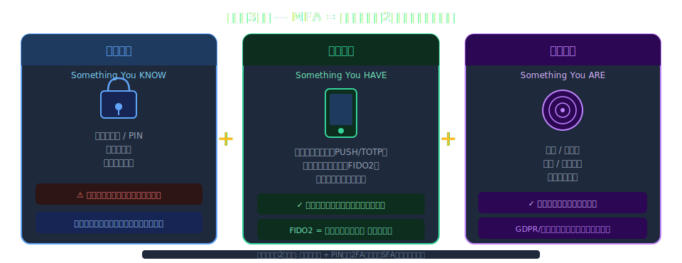

---

# パスワード単体が抱えるリスク

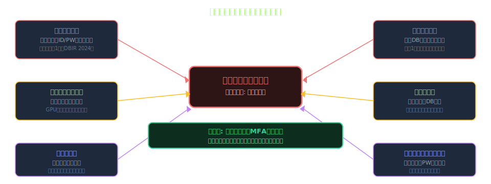

---

# MFAの定義と原則

- <svg viewBox="0 0 800 400" style="max-height:70vh;max-width:100%;display:block;margin:0 auto;" xmlns="http://www.w3.org/2000/svg">
<rect width="800" height="400" fill="#1a1a2e"/>
<text x="400" y="28" text-anchor="middle" fill="#ffffff" font-size="16" font-weight="bold" font-family="sans-serif">MFAの定義と原則</text>
<rect x="20" y="50" width="760" height="80" rx="10" fill="#16213e" stroke="#f9a825" stroke-width="2"/>
<text x="400" y="82" text-anchor="middle" fill="#f9a825" font-size="14" font-weight="bold" font-family="sans-serif">Multi-Factor Authentication</text>
<text x="400" y="112" text-anchor="middle" fill="#ffffff" font-size="13" font-family="sans-serif">2つ以上の異なるカテゴリの認証要素を組み合わせて本人確認を行う方式</text>
<rect x="30" y="155" width="220" height="90" rx="8" fill="#16213e" stroke="#f9a825" stroke-width="2"/>
<rect x="290" y="155" width="220" height="90" rx="8" fill="#16213e" stroke="#e91e63" stroke-width="2"/>
<rect x="550" y="155" width="220" height="90" rx="8" fill="#16213e" stroke="#4caf50" stroke-width="2"/>
<text x="140" y="182" text-anchor="middle" fill="#f9a825" font-size="13" font-weight="bold" font-family="sans-serif">Factor 1</text>
<text x="400" y="182" text-anchor="middle" fill="#e91e63" font-size="13" font-weight="bold" font-family="sans-serif">Factor 2</text>
<text x="660" y="182" text-anchor="middle" fill="#4caf50" font-size="13" font-weight="bold" font-family="sans-serif">Factor 3 (オプション)</text>
<text x="140" y="210" text-anchor="middle" fill="#ffffff" font-size="12" font-family="sans-serif">Knowledge</text>
<text x="400" y="210" text-anchor="middle" fill="#ffffff" font-size="12" font-family="sans-serif">Possession</text>
<text x="660" y="210" text-anchor="middle" fill="#ffffff" font-size="12" font-family="sans-serif">Inherence</text>
<text x="140" y="234" text-anchor="middle" fill="#ffffff" font-size="11" font-family="sans-serif">パスワード / PIN</text>
<text x="400" y="234" text-anchor="middle" fill="#ffffff" font-size="11" font-family="sans-serif">TOTP / FIDO2 / SMS</text>
<text x="660" y="234" text-anchor="middle" fill="#ffffff" font-size="11" font-family="sans-serif">生体認証</text>
<text x="255" y="200" text-anchor="middle" fill="#ffffff" font-size="20" font-family="sans-serif">+</text>
<text x="515" y="200" text-anchor="middle" fill="#ffffff" font-size="20" font-family="sans-serif">+</text>
<rect x="30" y="275" width="740" height="60" rx="8" fill="#16213e" stroke="#e91e63" stroke-width="1.5"/>
<text x="400" y="300" text-anchor="middle" fill="#e91e63" font-size="13" font-weight="bold" font-family="sans-serif">重要: 同一カテゴリの2要素はMFAではない</text>
<text x="400" y="325" text-anchor="middle" fill="#ffffff" font-size="12" font-family="sans-serif">例: パスワード + 秘密の質問 = 両方 Knowledge = MFA NOT OK</text>
</svg>
- **多要素認証（MFA）**: 2種類以上の**異なるカテゴリ**の認証要素を組み合わせる認証方式
- **2FA（二要素認証）** はMFAの最も一般的な実装形態
- 同カテゴリの組合せ（パスワード + PIN）は **SFA（単要素認証）** のまま
- **ステップアップ認証**: リスクに応じて追加要素を動的要求するアダプティブMFA
- ISO27001:2022 附属書A 8.5「セキュアな認証」— MFAを**明示的に要求**
- NIST SP 800-63B — 保証レベル（AAL1/2/3）によりMFA方式の強度を規定

---

# MFAの発展史

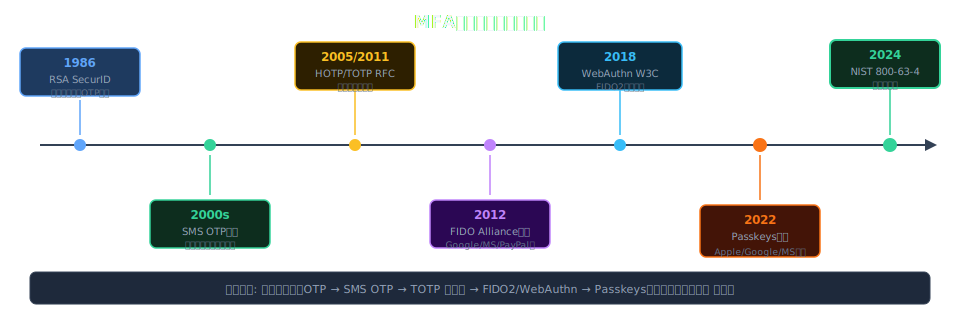

---

<!-- _class: lead -->
# Sec.2 — MFA技術種別・詳細比較

- 各認証方式の仕組みとセキュリティ特性を理解する

---

# MFA方式の全体分類

- <svg viewBox="0 0 800 400" style="max-height:70vh;max-width:100%;display:block;margin:0 auto;" xmlns="http://www.w3.org/2000/svg">
<rect width="800" height="400" fill="#1a1a2e"/>
<text x="400" y="28" text-anchor="middle" fill="#ffffff" font-size="16" font-weight="bold" font-family="sans-serif">MFA方式の全体分類</text>
<rect x="20" y="50" width="230" height="305" rx="10" fill="#16213e" stroke="#f9a825" stroke-width="2"/>
<rect x="285" y="50" width="230" height="305" rx="10" fill="#16213e" stroke="#e91e63" stroke-width="2"/>
<rect x="550" y="50" width="230" height="305" rx="10" fill="#16213e" stroke="#4caf50" stroke-width="2"/>
<text x="135" y="78" text-anchor="middle" fill="#f9a825" font-size="14" font-weight="bold" font-family="sans-serif">OTP系</text>
<text x="400" y="78" text-anchor="middle" fill="#e91e63" font-size="14" font-weight="bold" font-family="sans-serif">Push / App系</text>
<text x="665" y="78" text-anchor="middle" fill="#4caf50" font-size="14" font-weight="bold" font-family="sans-serif">ハードウェア系</text>
<text x="35" y="112" fill="#ffffff" font-size="12" font-family="sans-serif">• SMS OTP</text>
<text x="35" y="140" fill="#ffffff" font-size="12" font-family="sans-serif">• 音声 OTP</text>
<text x="35" y="168" fill="#ffffff" font-size="12" font-family="sans-serif">• TOTP (RFC 6238)</text>
<text x="35" y="196" fill="#ffffff" font-size="12" font-family="sans-serif">• HOTP (RFC 4226)</text>
<text x="35" y="240" fill="#e91e63" font-size="12" font-family="sans-serif">セキュリティ: 中</text>
<text x="35" y="265" fill="#e91e63" font-size="12" font-family="sans-serif">SIM Swap脆弱性</text>
<text x="35" y="290" fill="#f9a825" font-size="12" font-family="sans-serif">導入: 低コスト</text>
<text x="300" y="112" fill="#ffffff" font-size="12" font-family="sans-serif">• Authenticator App</text>
<text x="300" y="140" fill="#ffffff" font-size="12" font-family="sans-serif">• Push通知 (Okta等)</text>
<text x="300" y="168" fill="#ffffff" font-size="12" font-family="sans-serif">• Number Matching</text>
<text x="300" y="196" fill="#ffffff" font-size="12" font-family="sans-serif">• Passwordless Push</text>
<text x="300" y="240" fill="#f9a825" font-size="12" font-family="sans-serif">セキュリティ: 中〜高</text>
<text x="300" y="265" fill="#e91e63" font-size="12" font-family="sans-serif">Push疲労攻撃に注意</text>
<text x="300" y="290" fill="#f9a825" font-size="12" font-family="sans-serif">Number Matchingで対策</text>
<text x="565" y="112" fill="#ffffff" font-size="12" font-family="sans-serif">• FIDO2 / WebAuthn</text>
<text x="565" y="140" fill="#ffffff" font-size="12" font-family="sans-serif">• Passkeys</text>
<text x="565" y="168" fill="#ffffff" font-size="12" font-family="sans-serif">• YubiKey等セキュリティキー</text>
<text x="565" y="196" fill="#ffffff" font-size="12" font-family="sans-serif">• スマートカード</text>
<text x="565" y="240" fill="#4caf50" font-size="12" font-family="sans-serif">セキュリティ: 最高</text>
<text x="565" y="265" fill="#4caf50" font-size="12" font-family="sans-serif">フィッシング耐性あり</text>
<text x="565" y="290" fill="#e91e63" font-size="12" font-family="sans-serif">コスト: 高め</text>
</svg>
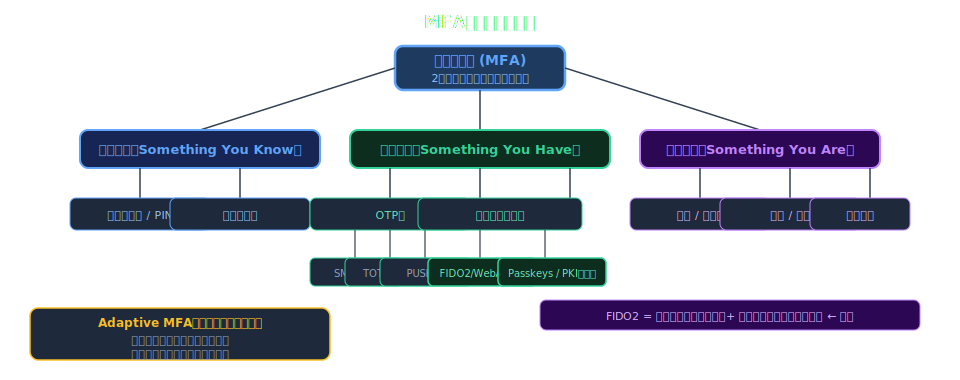

---

# SMS / 電話 OTP

- **仕組み**: SMSまたは音声通話でワンタイムパスワード（6桁）を送信
- **長所**: 追加アプリ不要・なじみがある・導入が容易・低コスト
- **短所**: SIMスワッピング / SS7攻撃に脆弱、電波不要環境で使用不可、AiTMに無防備
- **NIST評価**: SP 800-63B で **AAL1（RESTRICTED）**— 高セキュリティ用途に非推奨
- **廃止動向**: NIST 2016年にSMS OTPを「制限付き（RESTRICTED）」に分類して以降、廃止の流れ
- **用途例**: 一般消費者向け低リスクサービス限定。社内システムへの使用は避けるべき

---

# TOTP（Time-based OTP） — RFC 6238

- **仕組み**: 共有秘密鍵 + 現在時刻（30秒窓）から HMAC-SHA1 で6桁のコードを生成
- **標準規格**: RFC 6238（TOTP）/ RFC 4226（HOTP）— 完全オープンスタンダード
- **実装例**: Google Authenticator, Microsoft Authenticator, Authy, 1Password, Bitwarden
- **長所**: オフライン動作・オープン標準・追加コスト低・幅広く対応
- **短所**: AiTMフィッシングに脆弱（リアルタイム転送可能）・秘密鍵漏洩リスク
- **秘密鍵管理**: QRコード初回登録時のスクリーンショット・通信路漏洩に注意

---

# PUSH通知認証

- **仕組み**: 認証リクエストをスマートフォンアプリにプッシュ送信し、ユーザーが承認/拒否
- **実装例**: Microsoft Authenticator, Duo Security, Okta Verify, PingID
- **進化型**: 番号照合（Number Matching）でPush Bombing攻撃を防御
- **長所**: UXが優秀（タップ1回）・追加コンテキスト（IP/場所）表示が可能
- **短所**: インターネット接続が必要・Push Bombing攻撃に脆弱（番号照合なしの場合）
- **ISMS推奨**: 番号照合 + 位置情報表示を必須設定にすること

---

# FIDO2 / WebAuthn — フィッシング耐性MFA

- **仕組み**: 公開鍵暗号方式。デバイス上で鍵ペア生成、サーバーは公開鍵のみ保存
- **標準**: FIDO Alliance + W3C WebAuthn（Level 3）/ CTAP2.1
- **デバイス**: YubiKey, Google Titan Key, Windows Hello などのハードウェアセキュリティキー
- **フィッシング耐性**: 鍵はオリジン（ドメイン）にバインド → 偽サイトでは絶対に使用不能
- **NIST AAL3**: 物理セキュリティキーで最高保証レベルを達成。政府機関・金融に推奨
- **採用実績**: Google（社内全社員）, Microsoft, GitHub, 日本政府（デジタル庁）

---

# Passkeys — パスワードレス認証の仕組み

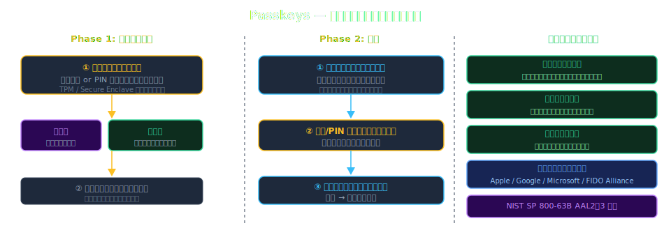

---

# バイオメトリクス認証

- **種別**: 指紋・顔・虹彩・声紋・静脈パターン（各方式で精度が異なる）
- **FAR/FRR**: 誤受入率（FAR）と誤拒否率（FRR）はトレードオフ — 用途によりチューニング
- **FIDO2統合**: 生体認証はデバイスローカルで処理 → バイオデータがサーバーに送信されない
- **個人情報保護**: 生体情報は **要配慮個人情報** — GDPR/個人情報保護法で厳格管理が必要
- **ISMS観点**: 附属書A 8.5 — 生体認証システムの精度要件・データ保存場所・アクセス制御を文書化
- **限界**: 顔・指紋の複製リスク・加齢/怪我による誤拒否・センサー品質依存

---

# リスクベース認証（Adaptive MFA）

- **概念**: ユーザーの行動・環境リスクを動的評価し、要求する認証強度を自動変化
- **評価シグナル**: IP評判・デバイス登録状態・地理的異常・時間帯・行動バイオメトリクス
- **実装例**: Azure AD 条件付きアクセス, Okta ThreatInsight, Auth0 Risk Engine
- **ゼロトラスト連携**: 「決して信頼しない、常に検証する」原則を動的認証で実現
- **ISMS観点**: A.8.3「情報アクセスの制限」— 継続的検証による最小権限強化
- **課題**: 機械学習モデルの精度・誤検知によるユーザー体験悪化のバランス

---

# MFA方式 比較マトリクス

- <svg viewBox="0 0 800 400" style="max-height:70vh;max-width:100%;display:block;margin:0 auto;" xmlns="http://www.w3.org/2000/svg">
<rect width="800" height="400" fill="#1a1a2e"/>
<text x="400" y="28" text-anchor="middle" fill="#ffffff" font-size="15" font-weight="bold" font-family="sans-serif">MFA方式 比較マトリクス</text>
<rect x="10" y="45" width="780" height="40" rx="6" fill="#f9a825" opacity="0.2"/>
<text x="100" y="70" text-anchor="middle" fill="#f9a825" font-size="12" font-weight="bold" font-family="sans-serif">方式</text>
<text x="250" y="70" text-anchor="middle" fill="#f9a825" font-size="12" font-weight="bold" font-family="sans-serif">セキュリティ</text>
<text x="390" y="70" text-anchor="middle" fill="#f9a825" font-size="12" font-weight="bold" font-family="sans-serif">UX</text>
<text x="520" y="70" text-anchor="middle" fill="#f9a825" font-size="12" font-weight="bold" font-family="sans-serif">フィッシング耐性</text>
<text x="670" y="70" text-anchor="middle" fill="#f9a825" font-size="12" font-weight="bold" font-family="sans-serif">コスト</text>
<text x="100" y="108" text-anchor="middle" fill="#ffffff" font-size="12" font-family="sans-serif">SMS OTP</text>
<text x="250" y="108" text-anchor="middle" fill="#e91e63" font-size="12" font-family="sans-serif">低</text>
<text x="390" y="108" text-anchor="middle" fill="#4caf50" font-size="12" font-family="sans-serif">高</text>
<text x="520" y="108" text-anchor="middle" fill="#e91e63" font-size="12" font-family="sans-serif">なし</text>
<text x="670" y="108" text-anchor="middle" fill="#4caf50" font-size="12" font-family="sans-serif">低</text>
<text x="100" y="142" text-anchor="middle" fill="#ffffff" font-size="12" font-family="sans-serif">TOTP</text>
<text x="250" y="142" text-anchor="middle" fill="#f9a825" font-size="12" font-family="sans-serif">中</text>
<text x="390" y="142" text-anchor="middle" fill="#f9a825" font-size="12" font-family="sans-serif">中</text>
<text x="520" y="142" text-anchor="middle" fill="#e91e63" font-size="12" font-family="sans-serif">なし</text>
<text x="670" y="142" text-anchor="middle" fill="#4caf50" font-size="12" font-family="sans-serif">低</text>
<text x="100" y="176" text-anchor="middle" fill="#ffffff" font-size="12" font-family="sans-serif">Push通知</text>
<text x="250" y="176" text-anchor="middle" fill="#f9a825" font-size="12" font-family="sans-serif">中〜高</text>
<text x="390" y="176" text-anchor="middle" fill="#4caf50" font-size="12" font-family="sans-serif">高</text>
<text x="520" y="176" text-anchor="middle" fill="#e91e63" font-size="12" font-family="sans-serif">なし</text>
<text x="670" y="176" text-anchor="middle" fill="#f9a825" font-size="12" font-family="sans-serif">中</text>
<text x="100" y="210" text-anchor="middle" fill="#ffffff" font-size="12" font-family="sans-serif">FIDO2/WebAuthn</text>
<text x="250" y="210" text-anchor="middle" fill="#4caf50" font-size="12" font-family="sans-serif">最高</text>
<text x="390" y="210" text-anchor="middle" fill="#4caf50" font-size="12" font-family="sans-serif">高</text>
<text x="520" y="210" text-anchor="middle" fill="#4caf50" font-size="12" font-family="sans-serif">あり</text>
<text x="670" y="210" text-anchor="middle" fill="#f9a825" font-size="12" font-family="sans-serif">中〜高</text>
<text x="100" y="244" text-anchor="middle" fill="#ffffff" font-size="12" font-family="sans-serif">Passkeys</text>
<text x="250" y="244" text-anchor="middle" fill="#4caf50" font-size="12" font-family="sans-serif">最高</text>
<text x="390" y="244" text-anchor="middle" fill="#4caf50" font-size="12" font-family="sans-serif">最高</text>
<text x="520" y="244" text-anchor="middle" fill="#4caf50" font-size="12" font-family="sans-serif">あり</text>
<text x="670" y="244" text-anchor="middle" fill="#4caf50" font-size="12" font-family="sans-serif">低</text>
<text x="100" y="278" text-anchor="middle" fill="#ffffff" font-size="12" font-family="sans-serif">スマートカード</text>
<text x="250" y="278" text-anchor="middle" fill="#4caf50" font-size="12" font-family="sans-serif">最高</text>
<text x="390" y="278" text-anchor="middle" fill="#f9a825" font-size="12" font-family="sans-serif">中</text>
<text x="520" y="278" text-anchor="middle" fill="#4caf50" font-size="12" font-family="sans-serif">あり</text>
<text x="670" y="278" text-anchor="middle" fill="#e91e63" font-size="12" font-family="sans-serif">高</text>
<line x1="10" y1="88" x2="790" y2="88" stroke="#ffffff" stroke-width="0.5" opacity="0.4"/>
<line x1="10" y1="122" x2="790" y2="122" stroke="#ffffff" stroke-width="0.5" opacity="0.3"/>
<line x1="10" y1="156" x2="790" y2="156" stroke="#ffffff" stroke-width="0.5" opacity="0.3"/>
<line x1="10" y1="190" x2="790" y2="190" stroke="#ffffff" stroke-width="0.5" opacity="0.3"/>
<line x1="10" y1="224" x2="790" y2="224" stroke="#ffffff" stroke-width="0.5" opacity="0.3"/>
<line x1="10" y1="258" x2="790" y2="258" stroke="#ffffff" stroke-width="0.5" opacity="0.3"/>
<line x1="170" y1="45" x2="170" y2="290" stroke="#ffffff" stroke-width="0.5" opacity="0.4"/>
<line x1="320" y1="45" x2="320" y2="290" stroke="#ffffff" stroke-width="0.5" opacity="0.4"/>
<line x1="450" y1="45" x2="450" y2="290" stroke="#ffffff" stroke-width="0.5" opacity="0.4"/>
<line x1="600" y1="45" x2="600" y2="290" stroke="#ffffff" stroke-width="0.5" opacity="0.4"/>
<text x="400" y="340" text-anchor="middle" fill="#f9a825" font-size="12" font-family="sans-serif">推奨: FIDO2/Passkeys → フィッシング耐性 × UX の両立</text>
</svg>
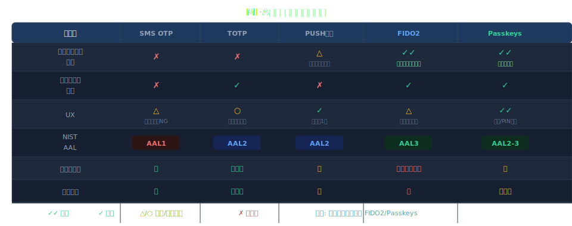

---

# ユースケース別 推奨MFA方式

- **特権アカウント / 重要システム（AAL3）**: FIDO2セキュリティキー（YubiKey等）
- **社内業務システム / VPN（AAL2）**: Passkeys または PUSH通知（番号照合必須）
- **一般従業員 / リモートワーク（AAL2）**: TOTP認証アプリ または Passkeys
- **外部委託先・ベンダー（AAL2）**: TOTP または 期限付きPUSH（ゲストポリシー）
- **消費者向けサービス（AAL1〜2）**: SMS OTP（基本）→ Passkeys移行ロードマップ
- **サービスアカウント / API**: FIDO2またはクライアント証明書（人間要素不要）

---

<!-- _class: lead -->
# Sec.3 — ISMS / ISO 27001 要件マッピング

- 規格要件と多要素認証の具体的な対応関係

---

# ISO27001:2022 — アクセス制御の要求

- **ISO/IEC 27001:2022**: 2022年版で大幅改訂 → 114→93コントロール（11の新規追加）
- **8.2 特権アクセス権限管理**: 管理者・特権アカウントへのMFA強制を**事実上要求**
- **8.3 情報アクセスの制限**: 最小権限原則 + 強化認証の組合せ要求
- **8.5 セキュアな認証**: **MFAを明示的に言及**（2013年版にはなかった重要強化点）
- **5.17 認証情報の管理**: パスワードポリシー + 追加認証要素の管理手順策定
- **8.15 ログ管理**: MFA認証イベントのログ記録・保護・保管期間の設定要求

---

# 附属書A — MFA関連コントロール一覧

- **5.15 アクセス制御**: ビジネス・セキュリティ要件に基づくアクセス制御ポリシー策定
- **5.16 識別情報管理**: 一意ID + 認証情報の割当・管理手順の確立
- **5.17 認証情報管理**: パスワード規則・認証情報の秘密保持・MFA登録手順
- **8.2 特権アクセス権限管理**: 特権アクセスへのMFA要件（推奨→必須化の傾向）
- **8.5 セキュアな認証**: MFAを明示・技術的実装要件・認証失敗対応規定
- **8.18 特権ユーティリティプログラム使用**: 管理ツールへのアクセス制御・MFA要件

---

# ISO27001 × MFA 要件マッピング

- <svg viewBox="0 0 800 400" style="max-height:70vh;max-width:100%;display:block;margin:0 auto;" xmlns="http://www.w3.org/2000/svg">
<rect width="800" height="400" fill="#1a1a2e"/>
<text x="400" y="28" text-anchor="middle" fill="#ffffff" font-size="15" font-weight="bold" font-family="sans-serif">ISO27001 × MFA 要件マッピング</text>
<rect x="10" y="45" width="780" height="40" rx="6" fill="#f9a825" opacity="0.2"/>
<text x="155" y="70" text-anchor="middle" fill="#f9a825" font-size="13" font-weight="bold" font-family="sans-serif">ISO27001管理策</text>
<text x="420" y="70" text-anchor="middle" fill="#f9a825" font-size="13" font-weight="bold" font-family="sans-serif">MFA要件</text>
<text x="650" y="70" text-anchor="middle" fill="#f9a825" font-size="13" font-weight="bold" font-family="sans-serif">対応方式</text>
<text x="155" y="108" text-anchor="middle" fill="#ffffff" font-size="12" font-family="sans-serif">8.2 特権アクセス管理</text>
<text x="420" y="108" text-anchor="middle" fill="#ffffff" font-size="12" font-family="sans-serif">管理者は必須MFA</text>
<text x="650" y="108" text-anchor="middle" fill="#4caf50" font-size="12" font-family="sans-serif">FIDO2 / スマートカード</text>
<text x="155" y="142" text-anchor="middle" fill="#ffffff" font-size="12" font-family="sans-serif">8.3 情報アクセス制限</text>
<text x="420" y="142" text-anchor="middle" fill="#ffffff" font-size="12" font-family="sans-serif">機密システムへのMFA</text>
<text x="650" y="142" text-anchor="middle" fill="#f9a825" font-size="12" font-family="sans-serif">TOTP / Push通知</text>
<text x="155" y="176" text-anchor="middle" fill="#ffffff" font-size="12" font-family="sans-serif">8.5 安全な認証</text>
<text x="420" y="176" text-anchor="middle" fill="#ffffff" font-size="12" font-family="sans-serif">リスクに応じたMFA強度</text>
<text x="650" y="176" text-anchor="middle" fill="#f9a825" font-size="12" font-family="sans-serif">Adaptive MFA</text>
<text x="155" y="210" text-anchor="middle" fill="#ffffff" font-size="12" font-family="sans-serif">5.14 情報伝達</text>
<text x="420" y="210" text-anchor="middle" fill="#ffffff" font-size="12" font-family="sans-serif">外部アクセスへのMFA</text>
<text x="650" y="210" text-anchor="middle" fill="#f9a825" font-size="12" font-family="sans-serif">VPN + MFA 必須</text>
<text x="155" y="244" text-anchor="middle" fill="#ffffff" font-size="12" font-family="sans-serif">8.18 特権ユーティリティ</text>
<text x="420" y="244" text-anchor="middle" fill="#ffffff" font-size="12" font-family="sans-serif">特権ツール使用時MFA</text>
<text x="650" y="244" text-anchor="middle" fill="#f9a825" font-size="12" font-family="sans-serif">PAM + MFA 統合</text>
<text x="155" y="278" text-anchor="middle" fill="#ffffff" font-size="12" font-family="sans-serif">8.6 キャパシティ管理</text>
<text x="420" y="278" text-anchor="middle" fill="#ffffff" font-size="12" font-family="sans-serif">クラウドAPIへのMFA</text>
<text x="650" y="278" text-anchor="middle" fill="#f9a825" font-size="12" font-family="sans-serif">サービスアカウント保護</text>
<line x1="10" y1="88" x2="790" y2="88" stroke="#ffffff" stroke-width="0.5" opacity="0.4"/>
<line x1="10" y1="122" x2="790" y2="122" stroke="#ffffff" stroke-width="0.5" opacity="0.3"/>
<line x1="10" y1="156" x2="790" y2="156" stroke="#ffffff" stroke-width="0.5" opacity="0.3"/>
<line x1="10" y1="190" x2="790" y2="190" stroke="#ffffff" stroke-width="0.5" opacity="0.3"/>
<line x1="10" y1="224" x2="790" y2="224" stroke="#ffffff" stroke-width="0.5" opacity="0.3"/>
<line x1="10" y1="258" x2="790" y2="258" stroke="#ffffff" stroke-width="0.5" opacity="0.3"/>
<line x1="270" y1="45" x2="270" y2="290" stroke="#ffffff" stroke-width="0.5" opacity="0.4"/>
<line x1="560" y1="45" x2="560" y2="290" stroke="#ffffff" stroke-width="0.5" opacity="0.4"/>
<text x="400" y="345" text-anchor="middle" fill="#f9a825" font-size="12" font-family="sans-serif">ISO27001:2022 Annex A — MFA要件はリスクベースで段階的に実装</text>
</svg>
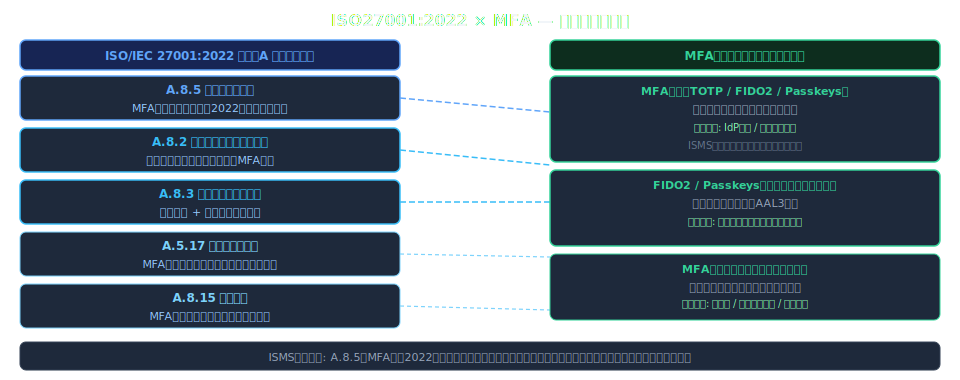

---

# NIST SP 800-63B — AAL 保証レベル

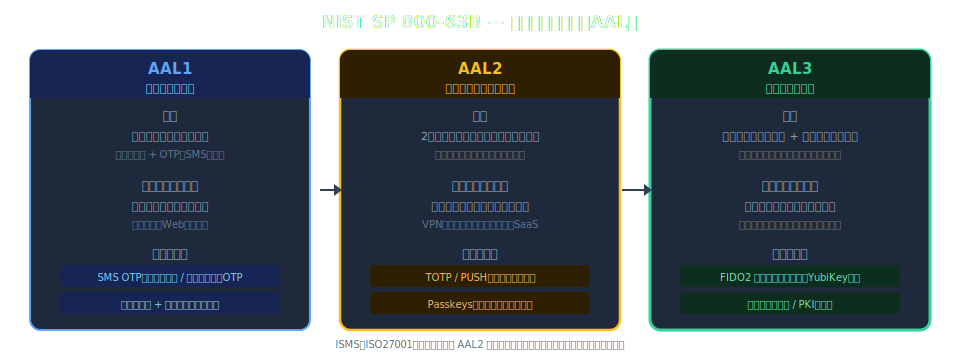

---

# 関連法規制 / フレームワークとの対応

- **GDPR（EU一般データ保護規則）**: Art.32 — 適切な技術的措置（MFAを含む暗号化・アクセス制御）
- **個人情報保護法（日本）**: 安全管理措置 — 不正アクセス防止のためのMFA的措置を要求
- **PCI DSS v4.0**: Req.8.4 — カード会員データ環境へのすべてのアクセスに**MFA必須**
- **SOC 2 Type II**: CC6.1/CC6.2 — 論理アクセス制御の有効性評価にMFAが含まれる
- **金融庁サイバーセキュリティガイドライン**: 重要システムへのMFA必須化を推奨
- **NISC クラウドセキュリティガイド**: 重要業務システムへのMFA導入を要求（2023年版）

---

# ゼロトラストアーキテクチャとMFA

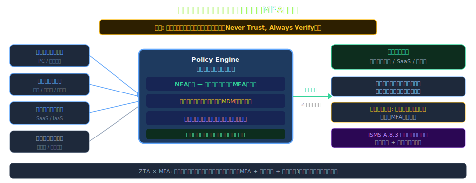

---

# MFA導入のリスク評価プロセス（ISMS手順）

- <svg viewBox="0 0 800 400" style="max-height:70vh;max-width:100%;display:block;margin:0 auto;" xmlns="http://www.w3.org/2000/svg">
<rect width="800" height="400" fill="#1a1a2e"/>
<text x="400" y="28" text-anchor="middle" fill="#ffffff" font-size="15" font-weight="bold" font-family="sans-serif">MFA導入のリスク評価プロセス（ISMS手順）</text>
<rect x="30" y="55" width="160" height="80" rx="10" fill="#16213e" stroke="#f9a825" stroke-width="2"/>
<text x="110" y="87" text-anchor="middle" fill="#f9a825" font-size="13" font-weight="bold" font-family="sans-serif">1. 資産特定</text>
<text x="110" y="110" text-anchor="middle" fill="#ffffff" font-size="11" font-family="sans-serif">システム・データの</text>
<text x="110" y="128" text-anchor="middle" fill="#ffffff" font-size="11" font-family="sans-serif">重要度評価</text>
<rect x="220" y="55" width="160" height="80" rx="10" fill="#16213e" stroke="#e91e63" stroke-width="2"/>
<text x="300" y="87" text-anchor="middle" fill="#e91e63" font-size="13" font-weight="bold" font-family="sans-serif">2. 脅威分析</text>
<text x="300" y="110" text-anchor="middle" fill="#ffffff" font-size="11" font-family="sans-serif">攻撃ベクター・</text>
<text x="300" y="128" text-anchor="middle" fill="#ffffff" font-size="11" font-family="sans-serif">脆弱性の把握</text>
<rect x="410" y="55" width="160" height="80" rx="10" fill="#16213e" stroke="#2196f3" stroke-width="2"/>
<text x="490" y="87" text-anchor="middle" fill="#2196f3" font-size="13" font-weight="bold" font-family="sans-serif">3. リスク評価</text>
<text x="490" y="110" text-anchor="middle" fill="#ffffff" font-size="11" font-family="sans-serif">影響度×発生確率</text>
<text x="490" y="128" text-anchor="middle" fill="#ffffff" font-size="11" font-family="sans-serif">リスクレベル算出</text>
<rect x="600" y="55" width="160" height="80" rx="10" fill="#16213e" stroke="#4caf50" stroke-width="2"/>
<text x="680" y="87" text-anchor="middle" fill="#4caf50" font-size="13" font-weight="bold" font-family="sans-serif">4. MFA選定</text>
<text x="680" y="110" text-anchor="middle" fill="#ffffff" font-size="11" font-family="sans-serif">リスクに応じた</text>
<text x="680" y="128" text-anchor="middle" fill="#ffffff" font-size="11" font-family="sans-serif">方式の選択</text>
<line x1="190" y1="95" x2="220" y2="95" stroke="#f9a825" stroke-width="2"/>
<polygon points="220,95 208,89 208,101" fill="#f9a825"/>
<line x1="380" y1="95" x2="410" y2="95" stroke="#e91e63" stroke-width="2"/>
<polygon points="410,95 398,89 398,101" fill="#e91e63"/>
<line x1="570" y1="95" x2="600" y2="95" stroke="#2196f3" stroke-width="2"/>
<polygon points="600,95 588,89 588,101" fill="#2196f3"/>
<rect x="30" y="175" width="740" height="185" rx="10" fill="#16213e" stroke="#f9a825" stroke-width="1.5"/>
<text x="400" y="200" text-anchor="middle" fill="#f9a825" font-size="13" font-weight="bold" font-family="sans-serif">リスクレベル別MFA要件</text>
<text x="60" y="235" fill="#e91e63" font-size="13" font-weight="bold" font-family="sans-serif">高リスク:</text>
<text x="200" y="235" fill="#ffffff" font-size="12" font-family="sans-serif">特権アカウント / 機密データ → FIDO2 / スマートカード必須</text>
<text x="60" y="270" fill="#f9a825" font-size="13" font-weight="bold" font-family="sans-serif">中リスク:</text>
<text x="200" y="270" fill="#ffffff" font-size="12" font-family="sans-serif">一般業務システム / VPN → TOTP / Push通知</text>
<text x="60" y="305" fill="#4caf50" font-size="13" font-weight="bold" font-family="sans-serif">低リスク:</text>
<text x="200" y="305" fill="#ffffff" font-size="12" font-family="sans-serif">社内のみ低感度 → SMS OTP でも可 (段階的強化)</text>
<text x="400" y="345" text-anchor="middle" fill="#ffffff" font-size="12" font-family="sans-serif">ISMS原則: リスクアセスメント結果に基づく適切な管理策の選択</text>
</svg>
- **Step 1**: 保護対象の特定 — 情報資産・システム一覧（ISMS資産管理台帳から抽出）
- **Step 2**: 脅威・脆弱性評価 — パスワードリスト攻撃・内部不正のリスクスコアリング
- **Step 3**: 影響度評価 — 侵害時の業務影響・法的リスク・レピュテーション損害の定量化
- **Step 4**: MFA方式のリスクプロファイル評価 — 各方式の残存リスク・コスト比較
- **Step 5**: 受容リスクの定義と経営承認 — ISMSリスク受容基準との整合・記録
- **Step 6**: 定期レビュー — 脅威動向変化に応じた年次評価更新とISMSプログラムへの反映

---

# ISMSコンプライアンス チェックリスト（MFA）

- **ポリシー**: MFA利用ポリシーが文書化・経営承認済みか
- **スコープ定義**: 対象システム（特権・リモート・クラウド・外部委託先）を明確に定義しているか
- **技術選定**: NIST AAL / ISO27001要件に合致したMFA方式を選定・記録しているか
- **例外管理**: MFA免除申請プロセス・緊急アクセス手順が文書化・承認済みか
- **教育・訓練**: 全対象ユーザーへのMFA操作教育を実施し記録しているか
- **監査証跡**: MFA認証ログの記録・保管期間・アラート設定が適切か
- **定期見直し**: MFA設定・ポリシーの年次レビュー計画が存在するか

---

# 監査証跡・ログ要件（ISMS観点）

- **ISO27001 8.15 ログ管理**: 認証イベント（成功・失敗）の記録・保護・保管期間設定
- **記録必須項目**: ユーザーID / タイムスタンプ / 認証方式 / 接続元IP / 成否 / デバイス情報
- **保管期間**: 最低1年（ISO27001要件）/ PCI DSS: 最低1年（3ヶ月オンライン保持）
- **改ざん防止**: ログのWORM保存（Write Once Read Many）または署名付き転送
- **SIEM連携**: 異常パターン（深夜/海外IP/連続失敗）の自動アラート設定
- **定期レビュー**: 四半期ごとの認証ログレビューをISMS内部監査計画に組み込む

---

<!-- _class: lead -->
# Sec.4 — 攻撃パターン & バイパス事例

- MFAは万能ではない — 攻撃手法を知り、適切な対策を講じる

---

# MFAを標的とする主要攻撃手法

- <svg viewBox="0 0 800 400" style="max-height:70vh;max-width:100%;display:block;margin:0 auto;" xmlns="http://www.w3.org/2000/svg">
<rect width="800" height="400" fill="#1a1a2e"/>
<text x="400" y="28" text-anchor="middle" fill="#ffffff" font-size="15" font-weight="bold" font-family="sans-serif">MFAを標的とする主要攻撃手法</text>
<rect x="20" y="50" width="230" height="140" rx="10" fill="#16213e" stroke="#e91e63" stroke-width="2"/>
<rect x="285" y="50" width="230" height="140" rx="10" fill="#16213e" stroke="#e91e63" stroke-width="2"/>
<rect x="550" y="50" width="230" height="140" rx="10" fill="#16213e" stroke="#e91e63" stroke-width="2"/>
<rect x="20" y="220" width="230" height="140" rx="10" fill="#16213e" stroke="#e91e63" stroke-width="2"/>
<rect x="285" y="220" width="230" height="140" rx="10" fill="#16213e" stroke="#e91e63" stroke-width="2"/>
<rect x="550" y="220" width="230" height="140" rx="10" fill="#16213e" stroke="#4caf50" stroke-width="2"/>
<text x="135" y="77" text-anchor="middle" fill="#e91e63" font-size="13" font-weight="bold" font-family="sans-serif">AiTM フィッシング</text>
<text x="135" y="100" text-anchor="middle" fill="#ffffff" font-size="11" font-family="sans-serif">プロキシでOTP傍受</text>
<text x="135" y="122" text-anchor="middle" fill="#ffffff" font-size="11" font-family="sans-serif">Evilginx2等ツール</text>
<text x="135" y="160" text-anchor="middle" fill="#4caf50" font-size="11" font-family="sans-serif">対策: FIDO2のみ有効</text>
<text x="400" y="77" text-anchor="middle" fill="#e91e63" font-size="13" font-weight="bold" font-family="sans-serif">SIMスワッピング</text>
<text x="400" y="100" text-anchor="middle" fill="#ffffff" font-size="11" font-family="sans-serif">電話番号乗っ取り</text>
<text x="400" y="122" text-anchor="middle" fill="#ffffff" font-size="11" font-family="sans-serif">SMS OTP奪取</text>
<text x="400" y="160" text-anchor="middle" fill="#4caf50" font-size="11" font-family="sans-serif">対策: TOTP/FIDO2へ移行</text>
<text x="665" y="77" text-anchor="middle" fill="#e91e63" font-size="13" font-weight="bold" font-family="sans-serif">Push疲労攻撃</text>
<text x="665" y="100" text-anchor="middle" fill="#ffffff" font-size="11" font-family="sans-serif">大量Push通知送信</text>
<text x="665" y="122" text-anchor="middle" fill="#ffffff" font-size="11" font-family="sans-serif">ユーザーが誤承認</text>
<text x="665" y="160" text-anchor="middle" fill="#4caf50" font-size="11" font-family="sans-serif">対策: Number Matching</text>
<text x="135" y="247" text-anchor="middle" fill="#e91e63" font-size="13" font-weight="bold" font-family="sans-serif">SS7脆弱性</text>
<text x="135" y="270" text-anchor="middle" fill="#ffffff" font-size="11" font-family="sans-serif">通信プロトコル悪用</text>
<text x="135" y="292" text-anchor="middle" fill="#ffffff" font-size="11" font-family="sans-serif">SMS傍受</text>
<text x="135" y="330" text-anchor="middle" fill="#4caf50" font-size="11" font-family="sans-serif">対策: SMS MFA廃止</text>
<text x="400" y="247" text-anchor="middle" fill="#e91e63" font-size="13" font-weight="bold" font-family="sans-serif">リアルタイムフィッシング</text>
<text x="400" y="270" text-anchor="middle" fill="#ffffff" font-size="11" font-family="sans-serif">OTPコードを即時入力</text>
<text x="400" y="292" text-anchor="middle" fill="#ffffff" font-size="11" font-family="sans-serif">タイミング攻撃</text>
<text x="400" y="330" text-anchor="middle" fill="#4caf50" font-size="11" font-family="sans-serif">対策: FIDO2 + origin確認</text>
<text x="665" y="247" text-anchor="middle" fill="#4caf50" font-size="13" font-weight="bold" font-family="sans-serif">最強の防御</text>
<text x="665" y="275" text-anchor="middle" fill="#ffffff" font-size="12" font-family="sans-serif">FIDO2 / WebAuthn</text>
<text x="665" y="300" text-anchor="middle" fill="#ffffff" font-size="12" font-family="sans-serif">物理キー拘束</text>
<text x="665" y="325" text-anchor="middle" fill="#4caf50" font-size="12" font-family="sans-serif">全攻撃に耐性あり</text>
</svg>
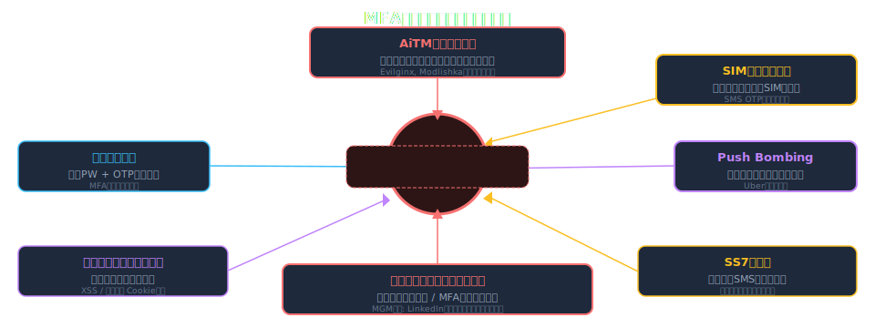

---

# AiTM（Adversary-in-the-Middle）フィッシング

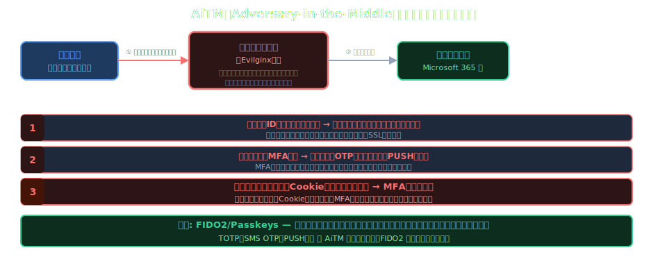

---

# SIMスワッピング攻撃

- **概要**: 攻撃者がキャリアを騙して被害者の電話番号を攻撃者のSIMに移管する攻撃
- **手口**: ①個人情報収集（SNS/ダークウェブ）→ ②キャリアへのなりすまし手続き → ③SMS OTP傍受
- **被害例**: 2019年 Jack Dorsey（Twitter CEO）乗っ取り / 暗号資産盗難多数
- **対策**: SMS OTPを廃止してFIDO2/TOTPへ移行 / キャリアへのSIM変更時の認証強化要求
- **ISMS観点**: 高リスク資産へのSMS MFA使用を**禁止するポリシー**を策定すること
- **日本の状況**: 2023年〜 キャリア各社がSIM変更時の本人確認を強化（マイナンバーカード照合等）

---

# MFA Push疲労攻撃（Push Bombing）

- **手口**: 攻撃者は正しいID/PWを入手済み → 大量のプッシュ通知を深夜等に連続送信
- **狙い**: ユーザーが誤操作・疲れ・諦めで承認 または 止まらないと思い込んで承認
- **実例**: 2022年 Uber社侵害 — 深夜のPush Bombing後にソーシャルエンジニアリングで承認取得
- **対策①**: 番号照合（Number Matching）— 画面の数字と一致するものを必ず選択
- **対策②**: 追加コンテキスト表示 — 場所・デバイス・アプリ情報を通知に含める
- **対策③**: Push通知の送信頻度制限（Rate Limiting） + 連続失敗でアカウントロック

---

# SS7プロトコル脆弱性

- **SS7**: 1975年設計の電話網シグナリングプロトコル — 認証機構が設計に存在しない
- **攻撃**: 電話網への不正アクセスにより通話・SMSをリアルタイムで傍受・転送が可能
- **必要条件**: 電話キャリアネットワークへのアクセス（国家機関・高度な犯罪者集団等）
- **リスク評価**: SMS OTPは傍受可能 — 高価値標的への SMS MFA は不適切
- **代替**: TOTP（オフライン生成）またはFIDO2（SS7攻撃の影響を受けない）
- **NIST見解**: SS7脆弱性を理由にSMS OTPをAAL1「RESTRICTED（制限付き）」に分類（2017年〜）

---

# 実例ケーススタディ（2022-2024）

- **Uber（2022年）**: PUSH疲労 + SEで社員が承認 → 内部システム完全アクセス。犯人は18歳
- **Cisco（2022年）**: 個人Googleアカウント経由でMFAリカバリーコード奪取 → VPN侵害
- **Twilio（2022年）**: SMS標的フィッシングで社員誘導 → Authy顧客データ侵害（約1900アカウント）
- **MGM Resorts（2023年）**: LinkedInで社員特定 → ヘルプデスクへのSE → MFAリセット → カジノ全停止
- **Microsoft（2023年）**: AiTM攻撃でセッショントークン奪取 → MFAをバイパスしメール侵害
- **教訓**: 技術的MFAだけでなく **プロセス・人的要素**（ヘルプデスク・リカバリー手順）の保護が不可欠

---

# 攻撃別 対策マッピング

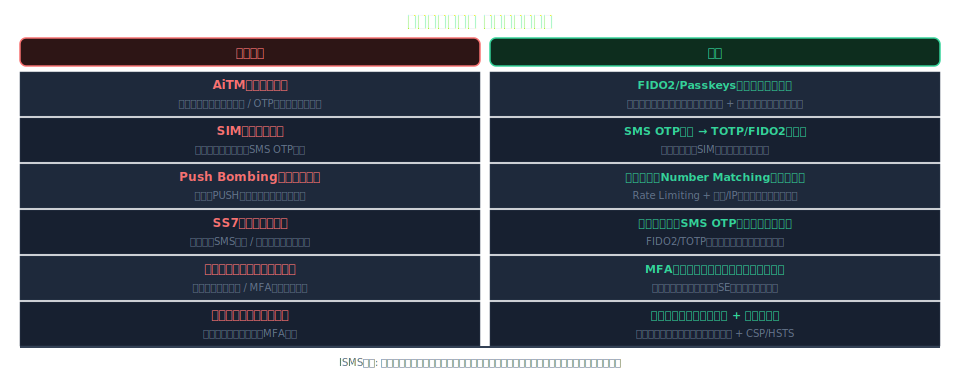

---

# MFA方式別 攻撃耐性マトリクス

- <svg viewBox="0 0 800 400" style="max-height:70vh;max-width:100%;display:block;margin:0 auto;" xmlns="http://www.w3.org/2000/svg">
<rect width="800" height="400" fill="#1a1a2e"/>
<text x="400" y="28" text-anchor="middle" fill="#ffffff" font-size="15" font-weight="bold" font-family="sans-serif">MFA方式別 攻撃耐性マトリクス</text>
<rect x="10" y="45" width="780" height="40" rx="6" fill="#f9a825" opacity="0.2"/>
<text x="105" y="70" text-anchor="middle" fill="#f9a825" font-size="12" font-weight="bold" font-family="sans-serif">攻撃種別</text>
<text x="255" y="70" text-anchor="middle" fill="#f9a825" font-size="12" font-weight="bold" font-family="sans-serif">SMS OTP</text>
<text x="375" y="70" text-anchor="middle" fill="#f9a825" font-size="12" font-weight="bold" font-family="sans-serif">TOTP</text>
<text x="490" y="70" text-anchor="middle" fill="#f9a825" font-size="12" font-weight="bold" font-family="sans-serif">Push通知</text>
<text x="620" y="70" text-anchor="middle" fill="#f9a825" font-size="12" font-weight="bold" font-family="sans-serif">FIDO2</text>
<text x="730" y="70" text-anchor="middle" fill="#f9a825" font-size="12" font-weight="bold" font-family="sans-serif">Passkeys</text>
<text x="105" y="108" text-anchor="middle" fill="#ffffff" font-size="12" font-family="sans-serif">フィッシング</text>
<text x="255" y="108" text-anchor="middle" fill="#e91e63" font-size="14" font-family="sans-serif">✗</text>
<text x="375" y="108" text-anchor="middle" fill="#e91e63" font-size="14" font-family="sans-serif">✗</text>
<text x="490" y="108" text-anchor="middle" fill="#e91e63" font-size="14" font-family="sans-serif">✗</text>
<text x="620" y="108" text-anchor="middle" fill="#4caf50" font-size="14" font-family="sans-serif">✓</text>
<text x="730" y="108" text-anchor="middle" fill="#4caf50" font-size="14" font-family="sans-serif">✓</text>
<text x="105" y="142" text-anchor="middle" fill="#ffffff" font-size="12" font-family="sans-serif">SIMスワッピング</text>
<text x="255" y="142" text-anchor="middle" fill="#e91e63" font-size="14" font-family="sans-serif">✗</text>
<text x="375" y="142" text-anchor="middle" fill="#4caf50" font-size="14" font-family="sans-serif">✓</text>
<text x="490" y="142" text-anchor="middle" fill="#4caf50" font-size="14" font-family="sans-serif">✓</text>
<text x="620" y="142" text-anchor="middle" fill="#4caf50" font-size="14" font-family="sans-serif">✓</text>
<text x="730" y="142" text-anchor="middle" fill="#4caf50" font-size="14" font-family="sans-serif">✓</text>
<text x="105" y="176" text-anchor="middle" fill="#ffffff" font-size="12" font-family="sans-serif">Push疲労攻撃</text>
<text x="255" y="176" text-anchor="middle" fill="#4caf50" font-size="14" font-family="sans-serif">✓</text>
<text x="375" y="176" text-anchor="middle" fill="#4caf50" font-size="14" font-family="sans-serif">✓</text>
<text x="490" y="176" text-anchor="middle" fill="#e91e63" font-size="14" font-family="sans-serif">△</text>
<text x="620" y="176" text-anchor="middle" fill="#4caf50" font-size="14" font-family="sans-serif">✓</text>
<text x="730" y="176" text-anchor="middle" fill="#4caf50" font-size="14" font-family="sans-serif">✓</text>
<text x="105" y="210" text-anchor="middle" fill="#ffffff" font-size="12" font-family="sans-serif">SS7攻撃</text>
<text x="255" y="210" text-anchor="middle" fill="#e91e63" font-size="14" font-family="sans-serif">✗</text>
<text x="375" y="210" text-anchor="middle" fill="#4caf50" font-size="14" font-family="sans-serif">✓</text>
<text x="490" y="210" text-anchor="middle" fill="#4caf50" font-size="14" font-family="sans-serif">✓</text>
<text x="620" y="210" text-anchor="middle" fill="#4caf50" font-size="14" font-family="sans-serif">✓</text>
<text x="730" y="210" text-anchor="middle" fill="#4caf50" font-size="14" font-family="sans-serif">✓</text>
<text x="105" y="244" text-anchor="middle" fill="#ffffff" font-size="12" font-family="sans-serif">AiTMフィッシング</text>
<text x="255" y="244" text-anchor="middle" fill="#e91e63" font-size="14" font-family="sans-serif">✗</text>
<text x="375" y="244" text-anchor="middle" fill="#e91e63" font-size="14" font-family="sans-serif">✗</text>
<text x="490" y="244" text-anchor="middle" fill="#e91e63" font-size="14" font-family="sans-serif">✗</text>
<text x="620" y="244" text-anchor="middle" fill="#4caf50" font-size="14" font-family="sans-serif">✓</text>
<text x="730" y="244" text-anchor="middle" fill="#4caf50" font-size="14" font-family="sans-serif">✓</text>
<line x1="10" y1="88" x2="790" y2="88" stroke="#ffffff" stroke-width="0.5" opacity="0.4"/>
<line x1="10" y1="122" x2="790" y2="122" stroke="#ffffff" stroke-width="0.5" opacity="0.3"/>
<line x1="10" y1="156" x2="790" y2="156" stroke="#ffffff" stroke-width="0.5" opacity="0.3"/>
<line x1="10" y1="190" x2="790" y2="190" stroke="#ffffff" stroke-width="0.5" opacity="0.3"/>
<line x1="10" y1="224" x2="790" y2="224" stroke="#ffffff" stroke-width="0.5" opacity="0.3"/>
<line x1="190" y1="45" x2="190" y2="258" stroke="#ffffff" stroke-width="0.5" opacity="0.4"/>
<line x1="310" y1="45" x2="310" y2="258" stroke="#ffffff" stroke-width="0.5" opacity="0.4"/>
<line x1="430" y1="45" x2="430" y2="258" stroke="#ffffff" stroke-width="0.5" opacity="0.4"/>
<line x1="560" y1="45" x2="560" y2="258" stroke="#ffffff" stroke-width="0.5" opacity="0.4"/>
<line x1="680" y1="45" x2="680" y2="258" stroke="#ffffff" stroke-width="0.5" opacity="0.4"/>
<text x="400" y="310" text-anchor="middle" fill="#f9a825" font-size="12" font-family="sans-serif">FIDO2 / Passkeys のみがすべての攻撃に耐性あり</text>
</svg>
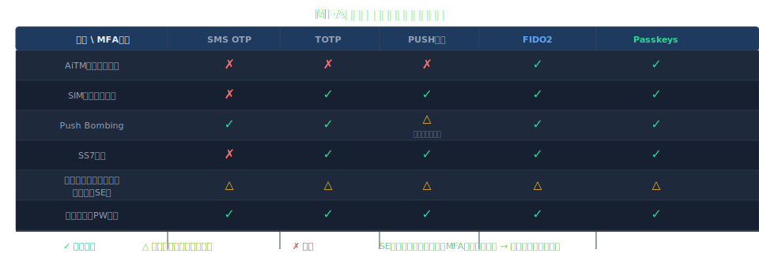

---

<!-- _class: lead -->
# Sec.5 — MFA導入・実践ガイドライン

- 計画から運用まで — ISMS管理者のための実践ロードマップ

---

# MFA導入ロードマップ（4フェーズ）

- <svg viewBox="0 0 800 400" style="max-height:70vh;max-width:100%;display:block;margin:0 auto;" xmlns="http://www.w3.org/2000/svg">
<rect width="800" height="400" fill="#1a1a2e"/>
<text x="400" y="28" text-anchor="middle" fill="#ffffff" font-size="15" font-weight="bold" font-family="sans-serif">MFA導入ロードマップ（4フェーズ）</text>
<rect x="20" y="55" width="165" height="300" rx="10" fill="#16213e" stroke="#f9a825" stroke-width="2"/>
<rect x="213" y="55" width="165" height="300" rx="10" fill="#16213e" stroke="#e91e63" stroke-width="2"/>
<rect x="406" y="55" width="165" height="300" rx="10" fill="#16213e" stroke="#2196f3" stroke-width="2"/>
<rect x="599" y="55" width="165" height="300" rx="10" fill="#16213e" stroke="#4caf50" stroke-width="2"/>
<text x="102" y="82" text-anchor="middle" fill="#f9a825" font-size="13" font-weight="bold" font-family="sans-serif">Phase 1</text>
<text x="295" y="82" text-anchor="middle" fill="#e91e63" font-size="13" font-weight="bold" font-family="sans-serif">Phase 2</text>
<text x="488" y="82" text-anchor="middle" fill="#2196f3" font-size="13" font-weight="bold" font-family="sans-serif">Phase 3</text>
<text x="681" y="82" text-anchor="middle" fill="#4caf50" font-size="13" font-weight="bold" font-family="sans-serif">Phase 4</text>
<text x="102" y="106" text-anchor="middle" fill="#ffffff" font-size="11" font-family="sans-serif">基盤整備</text>
<text x="295" y="106" text-anchor="middle" fill="#ffffff" font-size="11" font-family="sans-serif">特権MFA展開</text>
<text x="488" y="106" text-anchor="middle" fill="#ffffff" font-size="11" font-family="sans-serif">全社展開</text>
<text x="681" y="106" text-anchor="middle" fill="#ffffff" font-size="11" font-family="sans-serif">高度化</text>
<text x="35" y="138" fill="#ffffff" font-size="11" font-family="sans-serif">• MFA方式選定</text>
<text x="35" y="163" fill="#ffffff" font-size="11" font-family="sans-serif">• IdP/IAM選定</text>
<text x="35" y="188" fill="#ffffff" font-size="11" font-family="sans-serif">• PoC実施</text>
<text x="35" y="213" fill="#ffffff" font-size="11" font-family="sans-serif">• リスク評価</text>
<text x="35" y="238" fill="#ffffff" font-size="11" font-family="sans-serif">• UXテスト</text>
<text x="35" y="275" fill="#f9a825" font-size="11" font-family="sans-serif">期間: 1-2ヶ月</text>
<text x="228" y="138" fill="#ffffff" font-size="11" font-family="sans-serif">• 管理者に強制</text>
<text x="228" y="163" fill="#ffffff" font-size="11" font-family="sans-serif">• 特権IDへ適用</text>
<text x="228" y="188" fill="#ffffff" font-size="11" font-family="sans-serif">• サービスアカウント</text>
<text x="228" y="213" fill="#ffffff" font-size="11" font-family="sans-serif">• 監視設定</text>
<text x="228" y="238" fill="#ffffff" font-size="11" font-family="sans-serif">• インシデント訓練</text>
<text x="228" y="275" fill="#e91e63" font-size="11" font-family="sans-serif">期間: 2-3ヶ月</text>
<text x="421" y="138" fill="#ffffff" font-size="11" font-family="sans-serif">• 全社員へ展開</text>
<text x="421" y="163" fill="#ffffff" font-size="11" font-family="sans-serif">• ヘルプデスク対応</text>
<text x="421" y="188" fill="#ffffff" font-size="11" font-family="sans-serif">• 例外申請フロー</text>
<text x="421" y="213" fill="#ffffff" font-size="11" font-family="sans-serif">• ユーザー教育</text>
<text x="421" y="238" fill="#ffffff" font-size="11" font-family="sans-serif">• 定着化確認</text>
<text x="421" y="275" fill="#2196f3" font-size="11" font-family="sans-serif">期間: 3-6ヶ月</text>
<text x="614" y="138" fill="#ffffff" font-size="11" font-family="sans-serif">• FIDO2移行</text>
<text x="614" y="163" fill="#ffffff" font-size="11" font-family="sans-serif">• Adaptive MFA</text>
<text x="614" y="188" fill="#ffffff" font-size="11" font-family="sans-serif">• Passkeys対応</text>
<text x="614" y="213" fill="#ffffff" font-size="11" font-family="sans-serif">• ゼロトラスト統合</text>
<text x="614" y="238" fill="#ffffff" font-size="11" font-family="sans-serif">• 継続的改善</text>
<text x="614" y="275" fill="#4caf50" font-size="11" font-family="sans-serif">期間: 継続的</text>
<line x1="185" y1="205" x2="213" y2="205" stroke="#f9a825" stroke-width="2"/>
<polygon points="213,205 201,199 201,211" fill="#f9a825"/>
<line x1="378" y1="205" x2="406" y2="205" stroke="#e91e63" stroke-width="2"/>
<polygon points="406,205 394,199 394,211" fill="#e91e63"/>
<line x1="571" y1="205" x2="599" y2="205" stroke="#2196f3" stroke-width="2"/>
<polygon points="599,205 587,199 587,211" fill="#2196f3"/>
</svg>
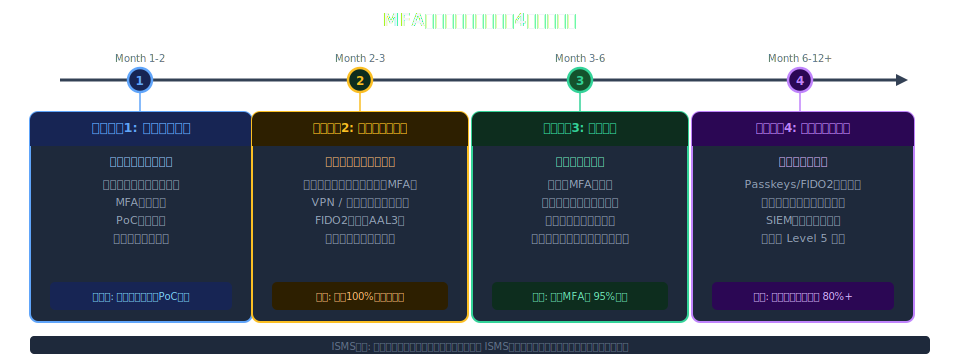

---

# リスクベースのMFA選択フレームワーク

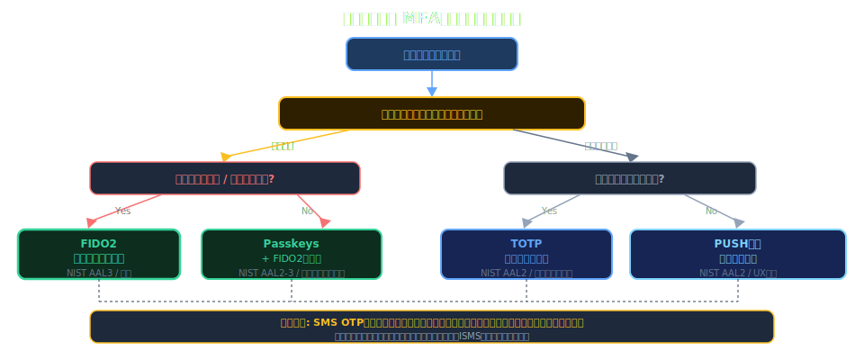

---

# IdP / IAM システムとの統合パターン

- **統合アーキテクチャ**: IdP（Okta/Azure AD/Google Workspace）がMFAの中央管理を担う
- **SAML 2.0 / OIDC**: アプリ側での個別MFA実装を廃止 → IdP統合で一元管理・ポリシー統一
- **SCIM**: ユーザーライフサイクル管理（入社・異動・退社）とMFA設定の自動プロビジョニング
- **条件付きアクセス**: デバイスコンプライアンス × MFA × ネットワーク位置の組合せポリシー
- **MFA Fatigue対策**: IdP レベルで番号照合・Rate Limiting を一括設定（全アプリに適用）
- **ISMS観点**: 認証ポリシーの変更は変更管理手順書に従い承認・記録する

---

# ユーザー受容性 & UX設計

- **摩擦と安全性のバランス**: 過度なMFA要求はシャドーITや回避行動を招く
- **段階的導入**: 特権アカウント → 全社員 → 外部委託先 の順序で展開（混乱を最小化）
- **セルフサービス登録**: ポータルで社員が自分でデバイス登録できる設計（ヘルプデスク負荷軽減）
- **コミュニケーション**: 導入前の説明会・FAQ整備・ヘルプデスクサポート体制の事前整備
- **アクセシビリティ**: 障害者・高齢者向けの代替認証方法の提供（WCAG 2.1 準拠）
- **KPIモニタリング**: MFA失敗率・ヘルプデスク問合せ数・登録完了率を定期レポート

---

# 例外処理・アカウントリカバリー設計

- **リカバリーコード**: MFA登録時に発行 → 印刷/暗号化保管を指示（デジタルのみはNG）
- **緊急アクセス手順**: 全MFAデバイス紛失時の本人確認フロー（対面確認/管理者承認/ID証明）
- **MFA免除申請**: 業務上やむを得ない免除は 申請 → リスク評価 → 経営承認 → 有期限設定
- **ブレークグラスアカウント**: 緊急時専用高権限アカウント — 使用は即座にアラート + 全ログ記録
- **ISMS観点**: 例外はすべて文書化し四半期ごとの免除リスト棚卸しを実施すること
- **インシデント対応**: MFA妨害が疑われる場合のアカウントロック → 調査 → 復旧フローを整備

---

# 導入時のよくある落とし穴

- **サービスアカウントの見落とし**: 人間アカウントのみMFA対応 → 機械アカウントが抜け穴になる
- **リカバリープロセスの脆弱性**: MFA自体は堅牢でもリセット手順がSEに弱い（MGM事例）
- **例外の常態化**: 業務理由でのMFA免除が増加 → スコープが空洞化して形骸化
- **ベンダー・委託先の漏れ**: 社内のみMFA対応 → 外部アクセス権限がバイパス経路になる
- **ログの未活用**: MFAログは取得しているが監視・アラートが未整備で侵害に気づかない
- **レガシー認証の残存**: NTLM / レガシー認証が有効のままMFAをバイパスされる可能性

---

# MFAセキュリティ成熟度モデル

- <svg viewBox="0 0 800 400" style="max-height:70vh;max-width:100%;display:block;margin:0 auto;" xmlns="http://www.w3.org/2000/svg">
<rect width="800" height="400" fill="#1a1a2e"/>
<text x="400" y="28" text-anchor="middle" fill="#ffffff" font-size="15" font-weight="bold" font-family="sans-serif">MFAセキュリティ成熟度モデル</text>
<rect x="30" y="50" width="740" height="305" rx="10" fill="#16213e" stroke="#f9a825" stroke-width="1.5"/>
<rect x="50" y="70" width="680" height="55" rx="8" fill="#1a1a2e" stroke="#e91e63" stroke-width="1.5"/>
<text x="150" y="95" text-anchor="middle" fill="#e91e63" font-size="13" font-weight="bold" font-family="sans-serif">Level 1</text>
<text x="150" y="113" text-anchor="middle" fill="#ffffff" font-size="11" font-family="sans-serif">初期</text>
<text x="510" y="95" text-anchor="middle" fill="#ffffff" font-size="12" font-family="sans-serif">一部システムでSMS MFA / パスワード+SMSのみ</text>
<rect x="50" y="140" width="680" height="55" rx="8" fill="#1a1a2e" stroke="#f9a825" stroke-width="1.5"/>
<text x="150" y="165" text-anchor="middle" fill="#f9a825" font-size="13" font-weight="bold" font-family="sans-serif">Level 2</text>
<text x="150" y="183" text-anchor="middle" fill="#ffffff" font-size="11" font-family="sans-serif">管理</text>
<text x="510" y="165" text-anchor="middle" fill="#ffffff" font-size="12" font-family="sans-serif">特権アカウントにTOTP必須 / MFAポリシー文書化</text>
<rect x="50" y="210" width="680" height="55" rx="8" fill="#1a1a2e" stroke="#2196f3" stroke-width="1.5"/>
<text x="150" y="235" text-anchor="middle" fill="#2196f3" font-size="13" font-weight="bold" font-family="sans-serif">Level 3</text>
<text x="150" y="253" text-anchor="middle" fill="#ffffff" font-size="11" font-family="sans-serif">定義</text>
<text x="510" y="235" text-anchor="middle" fill="#ffffff" font-size="12" font-family="sans-serif">全社員にMFA強制 / Adaptive MFA導入 / 監査証跡</text>
<rect x="50" y="280" width="680" height="55" rx="8" fill="#1a1a2e" stroke="#4caf50" stroke-width="2"/>
<text x="150" y="305" text-anchor="middle" fill="#4caf50" font-size="13" font-weight="bold" font-family="sans-serif">Level 4</text>
<text x="150" y="323" text-anchor="middle" fill="#ffffff" font-size="11" font-family="sans-serif">最適化</text>
<text x="510" y="305" text-anchor="middle" fill="#ffffff" font-size="12" font-family="sans-serif">FIDO2/Passkeys全社展開 / ゼロトラスト統合 / 継続的改善</text>
<text x="400" y="375" text-anchor="middle" fill="#f9a825" font-size="12" font-family="sans-serif">ISMS目標: Level 3以上 / 高セキュリティ環境: Level 4</text>
</svg>
- **Level 1（初期）**: 特権アカウントのみMFA（SMS/TOTP）、ポリシー未整備
- **Level 2（管理）**: 全従業員にMFA展開、ポリシー文書化、一部例外あり
- **Level 3（定義）**: フィッシング耐性MFA（FIDO2）採用、リスクベース認証、例外管理プロセス確立
- **Level 4（定量的）**: MFAカバレッジ率・失敗率をKPI化、SIEM連携で自動検知・対応
- **Level 5（最適化）**: Passkeys/デバイス証明書でパスワードレス実現、継続的な脅威対応サイクル
- **目標設定**: 現在レベルを自己評価 → 年間でLevel+1を目標 → ISMSレビューで進捗を追跡

---

<!-- _class: lead -->
# まとめ

- 重要ポイントの整理とアクションアイテム

---

# キーテイクアウェイ

- **MFAは必須**: 認証侵害の80%以上はパスワード単体の弱さが原因 — MFAで99.9%防御可能
- **MFAにも弱点あり**: AiTM・Push Bombing・SIMスワッピングへの対策が不可欠
- **FIDO2/Passkeysが最強**: フィッシング耐性・NIST AAL3達成 — 高リスク環境に推奨
- **ISMSとの統合**: ISO27001 A.8.5を軸にポリシー・例外管理・監査証跡を体系的に整備
- **プロセスも守る**: 技術だけでなくリカバリー手順・ヘルプデスク・例外管理の堅牢化
- **段階的に推進**: 特権アカウント → 全社員 → パスワードレス のロードマップで着実に進める

---

# 参考文献・推奨リソース（1/2）

- **標準・規格:**
- [NIST SP 800-63B Digital Identity Guidelines](https://pages.nist.gov/800-63-3/sp800-63b.html)
- [ISO/IEC 27001:2022 Information Security Management](https://www.iso.org/standard/27001)
- **業界レポート・研究:**

---

# 参考文献・推奨リソース（2/2）

- [Verizon DBIR 2024](https://www.verizon.com/business/resources/reports/dbir/)
- [FIDO Alliance — MFA Overview](https://fidoalliance.org/overview/)
- **実装ガイド:**
- [CISA MFA Best Practices](https://www.cisa.gov/mfa)
- [Microsoft MFA Deployment Guide](https://learn.microsoft.com/azure/active-directory/authentication/howto-mfa-getstarted)

