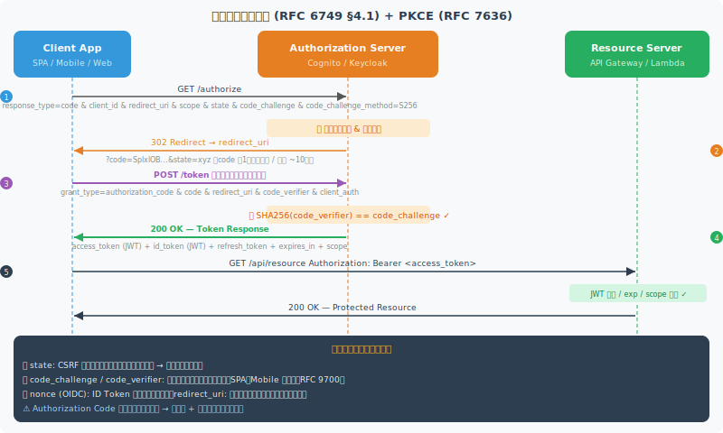
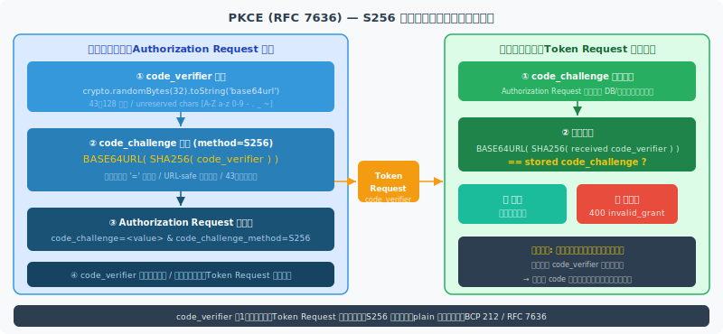
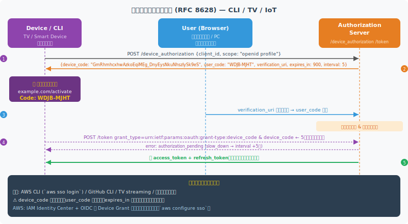
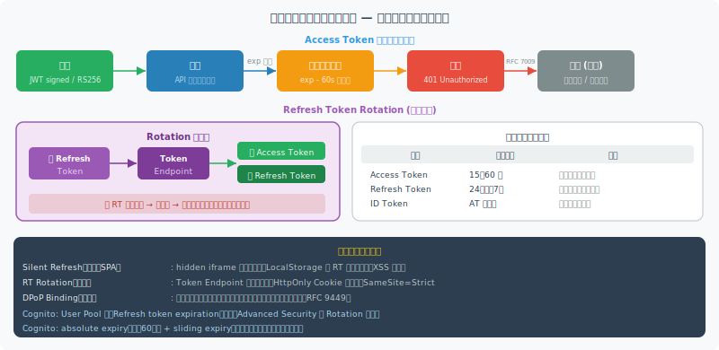
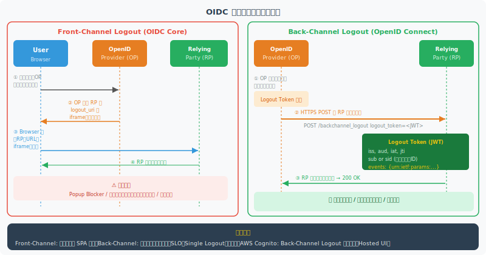
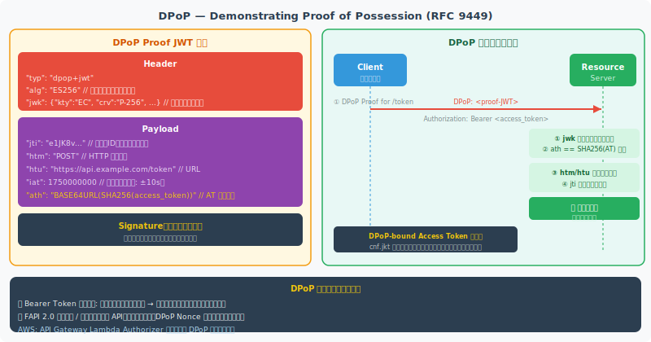
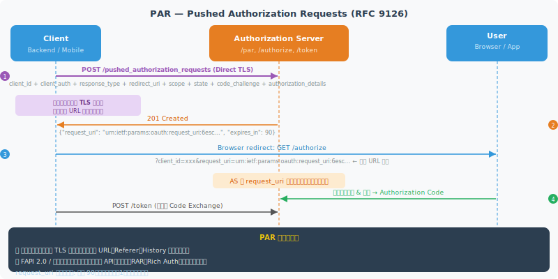

<!-- _class: lead -->
# OAuth2 / OIDC 実装詳細ガイド

- プロトコル設計から AWS 実装まで徹底解説
- アーキテクト・TL 向け実践ガイド 2026


---

# アジェンダ

- **① OAuth2 コアフロー** — 全フロー・全パラメータ・トークン戦略
- **② OIDC 詳解** — Discovery・ID Token・セッション管理・ログアウト
- **③ セキュリティ拡張仕様** — DPoP・PAR・RAR・JARM・FAPI 2.0
- **④ 認可サーバー実装** — JWT 設計・鍵管理・JWKS ローテーション
- **⑤ クライアント実装** — SPA・モバイル・BFF・M2M パターン
- **⑥ 攻撃と対策** — CSRF・コードインジェクション・Mix-Up
- **⑦ AWS 実装・まとめ** — Cognito / ALB / API GW・チェックリスト


---

<!-- _class: lead -->
# Section 1: OAuth2 コアフロー詳解

- 認可コードフロー / PKCE 深掘り
- Client Credentials / Device Grant
- トークン管理戦略


---

# 認可コードフロー — 全パラメータ解説




---

# PKCE 深掘り — code_verifier / challenge 生成



```typescript
// PKCE S256 生成 (TypeScript)
const verifier = randomBytes(32).toString('base64url');
const challenge = createHash('sha256')
  .update(verifier).digest('base64url');

// Authorization Request に追加
authParams.code_challenge = challenge;
authParams.code_challenge_method = 'S256';
// Token Request: code_verifier=<verifier>
```


---

# クライアントクレデンシャルフロー (RFC 6749 §4.4) — M2M 認証

- **用途**: M2M 通信・バックエンドサービス間・CI/CD パイプライン
- **認証方式**: `client_secret_basic` / `client_secret_post` / **`private_key_jwt`（推奨）**
- **スコープ設計**: リソース単位 `payments:write` or サービス単位 `payment-service`
- **注意**: リフレッシュトークンなし。有効期限は短め（5〜15 分）推奨

```http
POST /token
Authorization: Basic base64(client_id:client_secret)
Content-Type: application/x-www-form-urlencoded

grant_type=client_credentials&scope=payments:write

# Response
{"access_token":"eyJ...","token_type":"Bearer",
 "expires_in":900,"scope":"payments:write"}
```


---

# デバイス認可グラント (RFC 8628) — CLI / TV / IoT




---

# トークンエンドポイント — grant_type 別パラメータ詳解

- **共通必須**: `grant_type`、クライアント認証（Basic / Body / JWT）
- **authorization_code**: `code` + `redirect_uri` + `code_verifier`（PKCE 時）
- **refresh_token**: `refresh_token` + `scope`（元スコープ以下のみ縮小可）
- **レスポンス**: `access_token` / `token_type: Bearer` / `expires_in` / `id_token`（OIDC）

```json
// Token Response (OIDC)
{
  "access_token": "eyJhbGciOiJSUzI1NiIsImtpZCI...",
  "token_type": "Bearer",
  "expires_in": 3600,
  "refresh_token": "def50200...",
  "id_token": "eyJhbGciOiJSUzI1NiJ9...",
  "scope": "openid profile email"
}
```


---

# トークンイントロスペクション (RFC 7662) — リソースサーバー統合

- **用途**: Opaque トークン検証・JWT 失効確認・リアルタイム有効性チェック
- **`active: false`**: 期限切れ・失効済み・未発行いずれも同じレスポンス（情報漏洩防止）
- **キャッシュ推奨**: `Cache-Control: max-age` で有効期限まで結果をキャッシュ
- **保護**: リソースサーバーもクライアント認証が必要（無制限アクセス禁止）

```http
POST /introspect
Authorization: Basic base64(rs-id:rs-secret)

token=eyJhbGc...&token_type_hint=access_token

# 200 OK
{"active":true,"sub":"user-123","scope":"read write",
 "client_id":"app-xyz","exp":1750000000}
```


---

# トークン失効 (RFC 7009) — 即時無効化

- **`token_type_hint`**: `access_token` / `refresh_token`（ヒントのみ、逆順も試行される）
- **失効伝播**: RT 失効 → 紐づく AT も失効推奨。逆は非推奨
- **成功レスポンス**: `200 OK`（トークン不存在でも 200 返却）
- **ユースケース**: ログアウト・デバイス紛失・セキュリティインシデント時の全セッション強制終了

```http
POST /revoke
Authorization: Basic base64(client_id:secret)
Content-Type: application/x-www-form-urlencoded

token=def50200...&token_type_hint=refresh_token

# Response: 200 OK (body なし)
```


---

# リフレッシュトークン戦略 — ライフサイクルと設計




---

# スコープ設計パターン — 粒度と命名規則

| パターン | 例 | 利点 | 注意点 |
| --- | --- | --- | --- |
| リソース:アクション | `payments:write` | 細粒度・ABAC 親和性 | スコープ数増加 |
| OIDC 標準 | `openid profile email` | 相互運用性 | カスタマイズ不可 |
| サービス識別 | `payment-service` | M2M 向けシンプル | 粗粒度 |
| 階層型 | `api:data:read` | 継承・Casbin 連携可 | 複雑化注意 |
- **推奨**: `<resource>:<action>` + OIDC 標準スコープの組み合わせ
- **Cognito**: Resource Server で `<identifier>/<scope>` 形式（例: `api.example.com/payments:write`）


---

# OAuth2 フロー選択マトリクス

| クライアントタイプ | 推奨フロー | PKCE | 備考 |
| --- | --- | --- | --- |
| SPA (公開クライアント) | Authorization Code | **必須** | Implicit 廃止 (RFC 9700) |
| モバイル / デスクトップ | Authorization Code | **必須** | Custom URI Scheme |
| Web アプリ (機密クライアント) | Authorization Code | 推奨 | Client Secret 使用可 |
| CLI / TV / IoT | Device Authorization | — | ブラウザ不要 |
| M2M / サービス間 | Client Credentials | — | ユーザーなし |


---

<!-- _class: lead -->
# Section 2: OIDC 詳解

- Discovery Document / ID Token クレーム
- UserInfo / セッション管理 / ログアウト
- カスタムクレーム設計


---

# Discovery ドキュメント — /.well-known/openid-configuration

- **自動設定**: OIDC Client はこのエンドポイントから設定を動的取得（URL ハードコード不要）
- **必須フィールド**: `issuer`, `authorization_endpoint`, `token_endpoint`, `jwks_uri`
- **推奨追加**: `introspection_endpoint`, `revocation_endpoint`, `code_challenge_methods_supported`
- **実装**: URL = `issuer + /.well-known/openid-configuration`

```json
{
  "issuer": "https://auth.example.com",
  "authorization_endpoint": ".../authorize",
  "token_endpoint": ".../token",
  "userinfo_endpoint": ".../userinfo",
  "jwks_uri": ".../jwks",
  "scopes_supported": ["openid","profile","email"],
  "grant_types_supported": ["authorization_code"],
  "code_challenge_methods_supported": ["S256"]
}
```


---

# ID Token クレーム完全解説

| クレーム | 必須 | 説明 |
| --- | --- | --- |
| iss / sub / aud | ✅ | Issuer / Subject (ユーザー一意 ID) / Audience (client_id) |
| exp / iat | ✅ | 有効期限 / 発行時刻（Unix timestamp） |
| nonce | OIDC 必須 | リプレイ攻撃防止。認可 Request 時に生成 → 検証 |
| at_hash | 推奨 | Access Token ハッシュ（AT との整合性検証） |
| acr / amr | オプション | 認証コンテキスト / 認証方法（pwd / mfa / fido2） |
- **検証必須**: `iss` 一致 / `aud` に自 client_id / `exp` 未来 / `nonce` 一致


---

# Access Token vs ID Token — 用途の厳密な分離

| 項目 | Access Token | ID Token |
| --- | --- | --- |
| 目的 | API リソースへのアクセス許可 | ユーザー認証の証明 |
| 受信者 | **リソースサーバー** | **クライアント (RP) のみ** |
| 主要クレーム | scope / sub / client_id | ユーザー属性 / nonce / at_hash |
| 有効期間 | 短め（15〜60 分） | AT と同じ |
| 検証方法 | Introspect or JWT 検証 | JWT 検証（JWKS 公開鍵） |
- ⚠ **ID Token を API 呼び出しに使用禁止**（audience が一致しない）
- ⚠ **Access Token の中身をクライアントが信頼しない**（RS が検証する）


---

# UserInfo エンドポイント — スコープとクレームマッピング

- **認証**: Bearer `access_token`（scope に `openid` が必要）
- **スコープ → クレーム**: `profile` → name/picture/locale、`email` → email/email_verified
- **レスポンス**: JSON or JWT（署名 / 暗号化も可能）
- **集約クレーム**: 外部 IdP クレームを aggregate して返すことも可能

```http
GET /userinfo HTTP/1.1
Authorization: Bearer eyJhbGc...

# Response (scope: openid profile email)
{
  "sub": "user-123",
  "name": "山田 太郎",
  "email": "taro@example.com",
  "email_verified": true,
  "locale": "ja"
}
```


---

# OIDC セッション管理 — check_session_iframe

- **目的**: RP がバックグラウンドで OP のセッション状態を監視（ポーリング方式）
- **仕組み**: `check_session_iframe` の URL に postMessage でポーリング送信
- **session_state**: 認可レスポンスで返却。変化を検知したら再認証 or ログアウト
- **限界**: Third-party Cookie 規制で現代ブラウザでは動作しないケースが多い
- **代替推奨**: Back-Channel Logout（高信頼性） or 定期的なサイレントリフレッシュ


---

# Front-Channel Logout — iframe ブロードキャスト

- **動作**: OP が全 RP の `frontchannel_logout_uri` を iframe で呼び出しセッション削除
- **`iss` / `sid`**: ログアウト URI に付加。複数セッション時の正確な特定に使用
- ⚠ **Popup Blocker / Cookie 制限によるサイレント失敗の可能性**
- RP は `204 No Content` or `200 OK` を返却（リダイレクト禁止）

```http
# RP が OP に事前登録する frontchannel_logout_uri
https://rp.example.com/logout

# OP がブラウザ iframe で呼び出す URL
https://rp.example.com/logout
  ?iss=https://op.example.com
  &sid=abc123
```


---

# OIDC ログアウトフロー比較 — Front-Channel vs Back-Channel




---

# RP-Initiated Logout — エンドユーザー主導ログアウト

- **動作**: RP が OP の `end_session_endpoint` にリダイレクトしてログアウト要求
- **`id_token_hint`**: OP がユーザーを確認するために推奨（必須ではない）
- **`post_logout_redirect_uri`**: ログアウト後のリダイレクト先（RP 側で事前登録必要）
- **Cognito**: `logout` エンドポイント + `client_id` + `logout_uri` パラメータ形式

```http
GET /end_session

?id_token_hint=eyJhbGciOiJSUzI1NiJ9...
&post_logout_redirect_uri=https://app.example.com/
&state=xyz-csrf-token

# Cognito 形式
https://<domain>.auth.ap-northeast-1.amazoncognito.com/logout
  ?client_id=xxx&logout_uri=https://app.example.com/
```


---

# カスタムクレーム設計 — ネームスペースと外部 IdP マッピング

- **ネームスペース必須**: `https://` URI プレフィックスで標準クレームとの衝突防止
- **Cognito**: `Pre Token Generation` Lambda Trigger でクレームを追加・変換
- **外部 IdP マッピング**: Attribute Mapping で外部クレームを内部クレームに変換
- **肥大化防止**: 頻繁参照クレームのみ AT/ID Token に。その他は UserInfo エンドポイントへ

```javascript
// Pre Token Generation Lambda (Cognito)
exports.handler = async (event) => {
  event.response.claimsOverrideDetails = {
    claimsToAddOrOverride: {
      'https://app.example.com/roles':  'admin,editor',
      'https://app.example.com/tenant': 'acme-corp',
    }
  };
  return event;
};
```


---

<!-- _class: lead -->
# Section 3: セキュリティ拡張仕様

- DPoP / PAR / RAR / JARM
- OAuth2 + mTLS / FAPI 2.0


---

# DPoP — Demonstrating Proof of Possession (RFC 9449)




---

# PAR — Pushed Authorization Requests (RFC 9126)




---

# RAR — Rich Authorization Requests (RFC 9396) — 精緻な認可要求

- **目的**: `scope` 文字列では表現不可能な複雑な認可詳細を構造化 JSON で送信
- **`authorization_details`**: 型 (`type`) + 対象リソース + アクション + 金額等を指定
- **適用先**: 金融 API (PSD2) / 医療 / 電子処方箋 / 法人間契約
- **FAPI 2.0**: PAR + RAR の組み合わせが標準フロー

```json
{
  "authorization_details": [{
    "type": "payment_initiation",
    "locations": ["https://payments.example.com"],
    "instructedAmount": {
      "currency": "JPY",
      "amount": "100000"
    },
    "creditorAccount": {"iban": "DE02100100..."}
  }]
}
```


---

# JARM — JWT Secured Authorization Response Mode

- **目的**: 認可レスポンス（code + state）を JWT で署名 / 暗号化
- **`response_mode`**: `jwt` / `query.jwt` / `fragment.jwt` / `form_post.jwt`
- **検証必須**: `iss` / `aud`（client_id）/ `exp` を検証 → Mix-Up 攻撃防止
- **FAPI 2.0 必須**: `query.jwt` or `form_post.jwt`

```http
# response_mode=query.jwt での Authorization Response
GET /callback?response=eyJhbGciOiJSUzI1NiJ9...

# JWT Payload
{
  "iss": "https://auth.example.com",
  "aud": "client-id",
  "code": "SplxlOBeZQQYbY...",
  "state": "xyz"
}
```


---

# OAuth2 + mTLS クライアント認証 (RFC 8705) — 証明書バインドトークン

- **mTLS 認証**: TLS ハンドシェイクでクライアント証明書を送信し client_id と紐づけ
- **Certificate-Bound AT**: `cnf.x5t#S256` クレームで証明書フィンガープリントをバインド
- **RS での検証**: TLS クライアント証明書のフィンガープリントと AT の `cnf` を照合
- **PKI**: 自己署名 or プライベート CA（ACM PCA）で発行。SAN に client_id を含める

```http
# Token Request（証明書は TLS ハンドシェイク済み）
POST /token
Content-Type: application/x-www-form-urlencoded

grant_type=client_credentials&client_id=svc-order

# AT の cnf クレーム（証明書バインド）
{"cnf":{"x5t#S256":"bwcK0esc3ACC3DB2Y5_lESsXE8o9..."}
```


---

# FAPI 2.0 Security Profile — 金融グレード API

| 要件項目 | FAPI 1.0 Advanced | FAPI 2.0 Security Profile |
| --- | --- | --- |
| 認可リクエスト | JAR（推奨） | **PAR 必須** |
| クライアント認証 | mTLS / private_key_jwt | mTLS / DPoP |
| PKCE | 推奨 | **S256 必須** |
| レスポンスモード | JARM | **JARM 必須** |
| Token Binding | — | DPoP 推奨 |
- **対象**: 金融 API (PSD2) / 医療 / 政府 API。OpenID Foundation FAPI WG 認定あり

