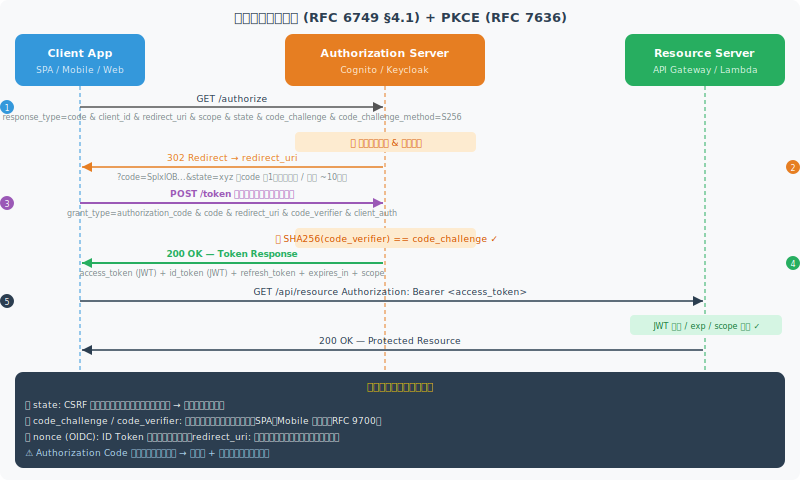
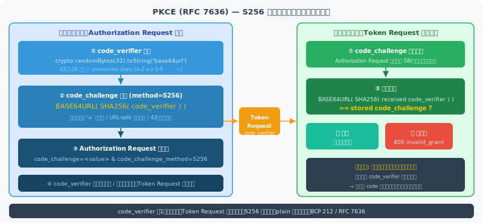
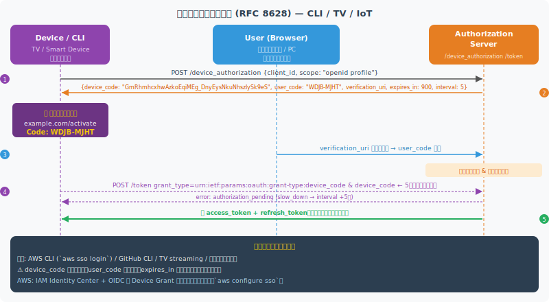
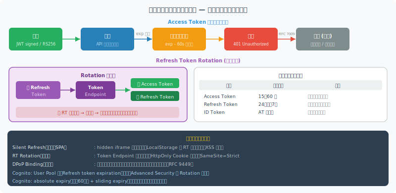
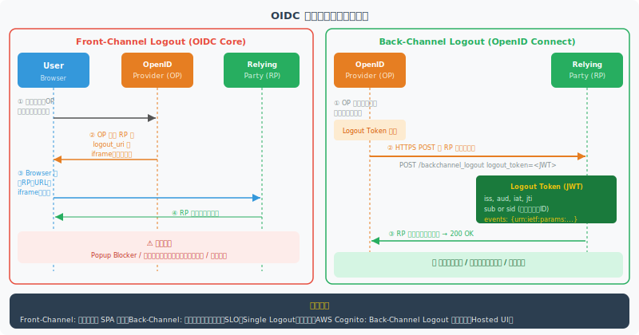
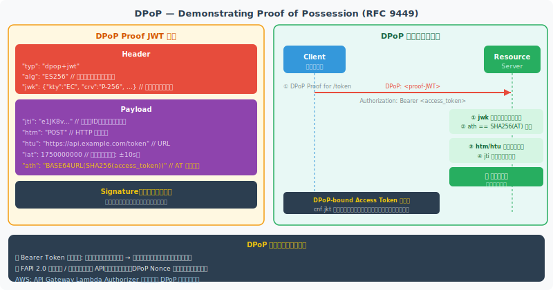
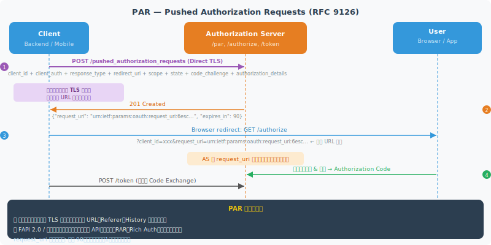

<!-- _class: lead -->
# OAuth2 / OIDC 実装詳細ガイド

- プロトコル設計から AWS 実装まで徹底解説
- アーキテクト・TL 向け実践ガイド 2026


---

# アジェンダ

- **① OAuth2 コアフロー** — 全フロー・全パラメータ・トークン戦略
- **② OIDC 詳解** — Discovery・ID Token・セッション管理・ログアウト
- **③ セキュリティ拡張仕様** — DPoP・PAR・RAR・JARM・FAPI 2.0
- **④ 認可サーバー実装** — JWT 設計・鍵管理・JWKS ローテーション
- **⑤ クライアント実装** — SPA・モバイル・BFF・M2M パターン
- **⑥ 攻撃と対策** — CSRF・コードインジェクション・Mix-Up
- **⑦ AWS 実装・まとめ** — Cognito / ALB / API GW・チェックリスト


---

<!-- _class: lead -->
# Section 1: OAuth2 コアフロー詳解

- 認可コードフロー / PKCE 深掘り
- Client Credentials / Device Grant
- トークン管理戦略


---

# 認可コードフロー — 全パラメータ解説

- <svg viewBox="0 0 800 400" style="max-height:70vh;max-width:100%;display:block;margin:0 auto;" xmlns="http://www.w3.org/2000/svg">
<rect width="800" height="400" fill="#1a1a2e"/>
<text x="400" y="28" text-anchor="middle" fill="#ffffff" font-size="15" font-weight="bold" font-family="sans-serif">認可コードフロー — 全パラメータ解説</text>
<rect x="20" y="45" width="110" height="40" rx="6" fill="#16213e" stroke="#4caf50" stroke-width="2"/>
<text x="75" y="70" text-anchor="middle" fill="#4caf50" font-size="12" font-family="sans-serif">Browser</text>
<rect x="200" y="45" width="130" height="40" rx="6" fill="#16213e" stroke="#e91e63" stroke-width="2"/>
<text x="265" y="70" text-anchor="middle" fill="#e91e63" font-size="12" font-family="sans-serif">Client App</text>
<rect x="440" y="45" width="140" height="40" rx="6" fill="#16213e" stroke="#f9a825" stroke-width="2"/>
<text x="510" y="70" text-anchor="middle" fill="#f9a825" font-size="12" font-family="sans-serif">Auth Server</text>
<rect x="650" y="45" width="130" height="40" rx="6" fill="#16213e" stroke="#2196f3" stroke-width="2"/>
<text x="715" y="70" text-anchor="middle" fill="#2196f3" font-size="12" font-family="sans-serif">Resource Server</text>
<line x1="75" y1="85" x2="75" y2="390" stroke="#ffffff" stroke-width="1" stroke-dasharray="3,3" opacity="0.3"/>
<line x1="265" y1="85" x2="265" y2="390" stroke="#ffffff" stroke-width="1" stroke-dasharray="3,3" opacity="0.3"/>
<line x1="510" y1="85" x2="510" y2="390" stroke="#ffffff" stroke-width="1" stroke-dasharray="3,3" opacity="0.3"/>
<line x1="715" y1="85" x2="715" y2="390" stroke="#ffffff" stroke-width="1" stroke-dasharray="3,3" opacity="0.3"/>
<line x1="75" y1="108" x2="260" y2="108" stroke="#4caf50" stroke-width="1.5"/>
<polygon points="260,108 248,102 248,114" fill="#4caf50"/>
<text x="168" y="100" text-anchor="middle" fill="#ffffff" font-size="10" font-family="sans-serif">① ログイン開始</text>
<line x1="260" y1="130" x2="80" y2="130" stroke="#e91e63" stroke-width="1.5"/>
<polygon points="80,130 92,124 92,136" fill="#e91e63"/>
<text x="168" y="122" text-anchor="middle" fill="#ffffff" font-size="10" font-family="sans-serif">② 302 redirect (response_type=code, state, code_challenge)</text>
<line x1="75" y1="155" x2="505" y2="155" stroke="#4caf50" stroke-width="1.5"/>
<polygon points="505,155 493,149 493,161" fill="#4caf50"/>
<text x="290" y="147" text-anchor="middle" fill="#ffffff" font-size="10" font-family="sans-serif">③ GET /authorize (+ scope, nonce)</text>
<line x1="510" y1="180" x2="510" y2="200" stroke="#f9a825" stroke-width="1.5"/>
<text x="560" y="194" fill="#f9a825" font-size="10" font-family="sans-serif">認証UI</text>
<line x1="505" y1="220" x2="80" y2="220" stroke="#f9a825" stroke-width="1.5"/>
<polygon points="80,220 92,214 92,226" fill="#f9a825"/>
<text x="290" y="212" text-anchor="middle" fill="#ffffff" font-size="10" font-family="sans-serif">④ 302 redirect_uri?code=xxx&state=yyy</text>
<line x1="75" y1="245" x2="260" y2="245" stroke="#4caf50" stroke-width="1.5"/>
<polygon points="260,245 248,239 248,251" fill="#4caf50"/>
<text x="168" y="237" text-anchor="middle" fill="#ffffff" font-size="10" font-family="sans-serif">⑤ code callback</text>
<line x1="265" y1="268" x2="505" y2="268" stroke="#e91e63" stroke-width="1.5"/>
<polygon points="505,268 493,262 493,274" fill="#e91e63"/>
<text x="385" y="260" text-anchor="middle" fill="#ffffff" font-size="10" font-family="sans-serif">⑥ POST /token (code, code_verifier, client_secret)</text>
<line x1="505" y1="290" x2="270" y2="290" stroke="#f9a825" stroke-width="1.5"/>
<polygon points="270,290 282,284 282,296" fill="#f9a825"/>
<text x="385" y="282" text-anchor="middle" fill="#ffffff" font-size="10" font-family="sans-serif">⑦ access_token + refresh_token (+ id_token)</text>
<line x1="265" y1="315" x2="710" y2="315" stroke="#e91e63" stroke-width="1.5"/>
<polygon points="710,315 698,309 698,321" fill="#e91e63"/>
<text x="490" y="307" text-anchor="middle" fill="#ffffff" font-size="10" font-family="sans-serif">⑧ GET /resource (Bearer access_token)</text>
<line x1="710" y1="338" x2="270" y2="338" stroke="#2196f3" stroke-width="1.5"/>
<polygon points="270,338 282,332 282,344" fill="#2196f3"/>
<text x="490" y="356" text-anchor="middle" fill="#ffffff" font-size="10" font-family="sans-serif">⑨ 200 OK (protected resource)</text>
</svg>



---

# PKCE 深掘り — code_verifier / challenge 生成




---

# PKCE 深掘り — code_verifier / challenge 生成（コード例）

```typescript
// PKCE S256 生成 (TypeScript)
const verifier = randomBytes(32).toString('base64url');
const challenge = createHash('sha256')
  .update(verifier).digest('base64url');

// Authorization Request に追加
authParams.code_challenge = challenge;
authParams.code_challenge_method = 'S256';
// Token Request: code_verifier=<verifier>
```


---

# クライアントクレデンシャルフロー (RFC 6749 §4.4) — M2M 認証

- <svg viewBox="0 0 800 400" style="max-height:70vh;max-width:100%;display:block;margin:0 auto;" xmlns="http://www.w3.org/2000/svg">
<rect width="800" height="400" fill="#1a1a2e"/>
<text x="400" y="28" text-anchor="middle" fill="#ffffff" font-size="15" font-weight="bold" font-family="sans-serif">クライアントクレデンシャルフロー — M2M 認証</text>
<rect x="60" y="80" width="200" height="70" rx="10" fill="#16213e" stroke="#e91e63" stroke-width="2"/>
<text x="160" y="112" text-anchor="middle" fill="#e91e63" font-size="15" font-weight="bold" font-family="sans-serif">Client (M2M)</text>
<text x="160" y="135" text-anchor="middle" fill="#ffffff" font-size="12" font-family="sans-serif">microservice / CLI</text>
<rect x="330" y="80" width="200" height="70" rx="10" fill="#16213e" stroke="#f9a825" stroke-width="2"/>
<text x="430" y="112" text-anchor="middle" fill="#f9a825" font-size="15" font-weight="bold" font-family="sans-serif">Auth Server</text>
<text x="430" y="135" text-anchor="middle" fill="#ffffff" font-size="12" font-family="sans-serif">Token Endpoint</text>
<rect x="600" y="80" width="160" height="70" rx="10" fill="#16213e" stroke="#2196f3" stroke-width="2"/>
<text x="680" y="112" text-anchor="middle" fill="#2196f3" font-size="15" font-weight="bold" font-family="sans-serif">API</text>
<text x="680" y="135" text-anchor="middle" fill="#ffffff" font-size="12" font-family="sans-serif">Resource Server</text>
<line x1="260" y1="220" x2="330" y2="220" stroke="#e91e63" stroke-width="2"/>
<polygon points="330,220 318,214 318,226" fill="#e91e63"/>
<text x="295" y="210" text-anchor="middle" fill="#ffffff" font-size="11" font-family="sans-serif">① POST /token</text>
<text x="295" y="240" text-anchor="middle" fill="#ffffff" font-size="10" font-family="sans-serif">grant_type=client_credentials</text>
<text x="295" y="258" text-anchor="middle" fill="#ffffff" font-size="10" font-family="sans-serif">client_id + client_secret</text>
<line x1="530" y1="290" x2="260" y2="290" stroke="#f9a825" stroke-width="2"/>
<polygon points="260,290 272,284 272,296" fill="#f9a825"/>
<text x="395" y="282" text-anchor="middle" fill="#ffffff" font-size="11" font-family="sans-serif">② access_token (no user context)</text>
<line x1="260" y1="330" x2="600" y2="330" stroke="#4caf50" stroke-width="2"/>
<polygon points="600,330 588,324 588,336" fill="#4caf50"/>
<text x="430" y="322" text-anchor="middle" fill="#ffffff" font-size="11" font-family="sans-serif">③ API呼び出し (Bearer token)</text>
<text x="400" y="375" text-anchor="middle" fill="#f9a825" font-size="12" font-family="sans-serif">ユーザーなし・サービス間通信専用</text>
</svg>
- **用途**: M2M 通信・バックエンドサービス間・CI/CD パイプライン
- **認証方式**: `client_secret_basic` / `client_secret_post` / **`private_key_jwt`（推奨）**
- **スコープ設計**: リソース単位 `payments:write` or サービス単位 `payment-service`
- **注意**: リフレッシュトークンなし。有効期限は短め（5〜15 分）推奨


---

# クライアントクレデンシャルフロー (RFC 6749 §4.4) — M2M 認証（コード例）

```http
POST /token
Authorization: Basic base64(client_id:client_secret)
Content-Type: application/x-www-form-urlencoded

grant_type=client_credentials&scope=payments:write

# Response
{"access_token":"eyJ...","token_type":"Bearer",
 "expires_in":900,"scope":"payments:write"}
```


---

# デバイス認可グラント (RFC 8628) — CLI / TV / IoT

- <svg viewBox="0 0 800 400" style="max-height:70vh;max-width:100%;display:block;margin:0 auto;" xmlns="http://www.w3.org/2000/svg">
<rect width="800" height="400" fill="#1a1a2e"/>
<text x="400" y="28" text-anchor="middle" fill="#ffffff" font-size="15" font-weight="bold" font-family="sans-serif">デバイス認可グラント (RFC 8628) — CLI / TV / IoT</text>
<rect x="20" y="50" width="140" height="55" rx="8" fill="#16213e" stroke="#4caf50" stroke-width="2"/>
<text x="90" y="74" text-anchor="middle" fill="#4caf50" font-size="12" font-family="sans-serif">Device</text>
<text x="90" y="95" text-anchor="middle" fill="#ffffff" font-size="10" font-family="sans-serif">TV / CLI / IoT</text>
<rect x="330" y="50" width="140" height="55" rx="8" fill="#16213e" stroke="#f9a825" stroke-width="2"/>
<text x="400" y="74" text-anchor="middle" fill="#f9a825" font-size="12" font-family="sans-serif">Auth Server</text>
<text x="400" y="95" text-anchor="middle" fill="#ffffff" font-size="10" font-family="sans-serif">Device Endpoint</text>
<rect x="610" y="50" width="160" height="55" rx="8" fill="#16213e" stroke="#e91e63" stroke-width="2"/>
<text x="690" y="74" text-anchor="middle" fill="#e91e63" font-size="12" font-family="sans-serif">User Browser</text>
<text x="690" y="95" text-anchor="middle" fill="#ffffff" font-size="10" font-family="sans-serif">スマホ / PC</text>
<line x1="160" y1="140" x2="330" y2="140" stroke="#4caf50" stroke-width="2"/>
<polygon points="330,140 318,134 318,146" fill="#4caf50"/>
<text x="245" y="130" text-anchor="middle" fill="#ffffff" font-size="10" font-family="sans-serif">① POST /device_authorization</text>
<line x1="330" y1="168" x2="160" y2="168" stroke="#f9a825" stroke-width="2"/>
<polygon points="160,168 172,162 172,174" fill="#f9a825"/>
<text x="245" y="160" text-anchor="middle" fill="#ffffff" font-size="10" font-family="sans-serif">② device_code + user_code + verification_uri</text>
<rect x="20" y="185" width="140" height="55" rx="6" fill="#16213e" stroke="#f9a825" stroke-width="1.5"/>
<text x="90" y="206" text-anchor="middle" fill="#f9a825" font-size="11" font-family="sans-serif">画面表示:</text>
<text x="90" y="225" text-anchor="middle" fill="#ffffff" font-size="11" font-family="sans-serif">USER CODE: ABCD-1234</text>
<text x="400" y="230" text-anchor="middle" fill="#ffffff" font-size="11" font-family="sans-serif">③ ユーザーにコード表示</text>
<line x1="400" y1="245" x2="690" y2="245" stroke="#e91e63" stroke-width="2"/>
<polygon points="690,245 678,239 678,251" fill="#e91e63"/>
<text x="545" y="237" text-anchor="middle" fill="#ffffff" font-size="10" font-family="sans-serif">④ ブラウザでコード入力・認証</text>
<line x1="90" y1="270" x2="330" y2="270" stroke="#4caf50" stroke-width="2" stroke-dasharray="5,3"/>
<text x="210" y="262" text-anchor="middle" fill="#ffffff" font-size="10" font-family="sans-serif">⑤ Poll /token (device_code)</text>
<line x1="330" y1="300" x2="90" y2="300" stroke="#f9a825" stroke-width="2"/>
<polygon points="90,300 102,294 102,306" fill="#f9a825"/>
<text x="245" y="292" text-anchor="middle" fill="#ffffff" font-size="10" font-family="sans-serif">⑥ access_token 発行 (認証完了後)</text>
<text x="400" y="360" text-anchor="middle" fill="#f9a825" font-size="12" font-family="sans-serif">ブラウザなし端末でも安全にOAuth2認可が可能</text>
</svg>



---

# トークンエンドポイント — grant_type 別パラメータ詳解

- **共通必須**: `grant_type`、クライアント認証（Basic / Body / JWT）
- **authorization_code**: `code` + `redirect_uri` + `code_verifier`（PKCE 時）
- **refresh_token**: `refresh_token` + `scope`（元スコープ以下のみ縮小可）
- **レスポンス**: `access_token` / `token_type: Bearer` / `expires_in` / `id_token`（OIDC）


---

# トークンエンドポイント — grant_type 別パラメータ詳解（コード例）

```json
// Token Response (OIDC)
{
  "access_token": "eyJhbGciOiJSUzI1NiIsImtpZCI...",
  "token_type": "Bearer",
  "expires_in": 3600,
  "refresh_token": "def50200...",
  "id_token": "eyJhbGciOiJSUzI1NiJ9...",
  "scope": "openid profile email"
}
```


---

# トークンイントロスペクション (RFC 7662) — リソースサーバー統合

- **用途**: Opaque トークン検証・JWT 失効確認・リアルタイム有効性チェック
- **`active: false`**: 期限切れ・失効済み・未発行いずれも同じレスポンス（情報漏洩防止）
- **キャッシュ推奨**: `Cache-Control: max-age` で有効期限まで結果をキャッシュ
- **保護**: リソースサーバーもクライアント認証が必要（無制限アクセス禁止）


---

# トークンイントロスペクション (RFC 7662) — リソースサーバー統合（コード例）

```http
POST /introspect
Authorization: Basic base64(rs-id:rs-secret)

token=eyJhbGc...&token_type_hint=access_token

# 200 OK
{"active":true,"sub":"user-123","scope":"read write",
 "client_id":"app-xyz","exp":1750000000}
```


---

# トークン失効 (RFC 7009) — 即時無効化

- **`token_type_hint`**: `access_token` / `refresh_token`（ヒントのみ、逆順も試行される）
- **失効伝播**: RT 失効 → 紐づく AT も失効推奨。逆は非推奨
- **成功レスポンス**: `200 OK`（トークン不存在でも 200 返却）
- **ユースケース**: ログアウト・デバイス紛失・セキュリティインシデント時の全セッション強制終了


---

# トークン失効 (RFC 7009) — 即時無効化（コード例）

```http
POST /revoke
Authorization: Basic base64(client_id:secret)
Content-Type: application/x-www-form-urlencoded

token=def50200...&token_type_hint=refresh_token

# Response: 200 OK (body なし)
```


---

# リフレッシュトークン戦略 — ライフサイクルと設計

- <svg viewBox="0 0 800 400" style="max-height:70vh;max-width:100%;display:block;margin:0 auto;" xmlns="http://www.w3.org/2000/svg">
<rect width="800" height="400" fill="#1a1a2e"/>
<text x="400" y="28" text-anchor="middle" fill="#ffffff" font-size="15" font-weight="bold" font-family="sans-serif">リフレッシュトークン戦略 — ライフサイクルと設計</text>
<rect x="20" y="50" width="180" height="120" rx="10" fill="#16213e" stroke="#f9a825" stroke-width="2"/>
<text x="110" y="76" text-anchor="middle" fill="#f9a825" font-size="13" font-weight="bold" font-family="sans-serif">Access Token</text>
<text x="110" y="102" text-anchor="middle" fill="#ffffff" font-size="12" font-family="sans-serif">有効期限: 15分〜1時間</text>
<text x="110" y="125" text-anchor="middle" fill="#ffffff" font-size="12" font-family="sans-serif">ステートレス</text>
<text x="110" y="148" text-anchor="middle" fill="#ffffff" font-size="12" font-family="sans-serif">API認可に使用</text>
<rect x="310" y="50" width="180" height="120" rx="10" fill="#16213e" stroke="#e91e63" stroke-width="2"/>
<text x="400" y="76" text-anchor="middle" fill="#e91e63" font-size="13" font-weight="bold" font-family="sans-serif">Refresh Token</text>
<text x="400" y="102" text-anchor="middle" fill="#ffffff" font-size="12" font-family="sans-serif">有効期限: 数日〜数週間</text>
<text x="400" y="125" text-anchor="middle" fill="#ffffff" font-size="12" font-family="sans-serif">安全なストレージ必須</text>
<text x="400" y="148" text-anchor="middle" fill="#ffffff" font-size="12" font-family="sans-serif">Rotation推奨</text>
<rect x="600" y="50" width="180" height="120" rx="10" fill="#16213e" stroke="#2196f3" stroke-width="2"/>
<text x="690" y="76" text-anchor="middle" fill="#2196f3" font-size="13" font-weight="bold" font-family="sans-serif">Token Rotation</text>
<text x="690" y="102" text-anchor="middle" fill="#ffffff" font-size="12" font-family="sans-serif">使用ごとに新発行</text>
<text x="690" y="125" text-anchor="middle" fill="#ffffff" font-size="12" font-family="sans-serif">古トークン即時無効</text>
<text x="690" y="148" text-anchor="middle" fill="#ffffff" font-size="12" font-family="sans-serif">漏洩検知に有効</text>
<text x="400" y="210" text-anchor="middle" fill="#ffffff" font-size="14" font-weight="bold" font-family="sans-serif">ライフサイクル</text>
<line x1="50" y1="230" x2="750" y2="230" stroke="#ffffff" stroke-width="1" opacity="0.4"/>
<rect x="50" y="245" width="120" height="30" rx="4" fill="#f9a825" opacity="0.7"/>
<text x="110" y="265" text-anchor="middle" fill="#ffffff" font-size="10" font-family="sans-serif">Initial Auth</text>
<rect x="185" y="245" width="120" height="30" rx="4" fill="#e91e63" opacity="0.7"/>
<text x="245" y="265" text-anchor="middle" fill="#ffffff" font-size="10" font-family="sans-serif">Access Token使用</text>
<rect x="320" y="245" width="120" height="30" rx="4" fill="#2196f3" opacity="0.7"/>
<text x="380" y="265" text-anchor="middle" fill="#ffffff" font-size="10" font-family="sans-serif">Token期限切れ</text>
<rect x="455" y="245" width="120" height="30" rx="4" fill="#4caf50" opacity="0.7"/>
<text x="515" y="265" text-anchor="middle" fill="#ffffff" font-size="10" font-family="sans-serif">Refresh実行</text>
<rect x="590" y="245" width="150" height="30" rx="4" fill="#f9a825" opacity="0.7"/>
<text x="665" y="265" text-anchor="middle" fill="#ffffff" font-size="10" font-family="sans-serif">新Token発行</text>
<text x="400" y="325" text-anchor="middle" fill="#f9a825" font-size="13" font-weight="bold" font-family="sans-serif">セキュリティ原則:</text>
<text x="400" y="353" text-anchor="middle" fill="#ffffff" font-size="12" font-family="sans-serif">Refresh Token は httpOnly Cookie / Secure Storage に保管</text>
<text x="400" y="378" text-anchor="middle" fill="#ffffff" font-size="12" font-family="sans-serif">Rotation で盗難検知 → 不正使用即時無効化</text>
</svg>



---

# スコープ設計パターン — 粒度と命名規則

- <svg viewBox="0 0 800 400" style="max-height:70vh;max-width:100%;display:block;margin:0 auto;" xmlns="http://www.w3.org/2000/svg">
<rect width="800" height="400" fill="#1a1a2e"/>
<text x="400" y="28" text-anchor="middle" fill="#ffffff" font-size="15" font-weight="bold" font-family="sans-serif">スコープ設計パターン — 粒度と命名規則</text>
<rect x="20" y="50" width="230" height="310" rx="10" fill="#16213e" stroke="#f9a825" stroke-width="2"/>
<rect x="285" y="50" width="230" height="310" rx="10" fill="#16213e" stroke="#e91e63" stroke-width="2"/>
<rect x="550" y="50" width="230" height="310" rx="10" fill="#16213e" stroke="#4caf50" stroke-width="2"/>
<text x="135" y="77" text-anchor="middle" fill="#f9a825" font-size="13" font-weight="bold" font-family="sans-serif">粗粒度</text>
<text x="400" y="77" text-anchor="middle" fill="#e91e63" font-size="13" font-weight="bold" font-family="sans-serif">細粒度</text>
<text x="665" y="77" text-anchor="middle" fill="#4caf50" font-size="13" font-weight="bold" font-family="sans-serif">Resource-based</text>
<text x="135" y="110" text-anchor="middle" fill="#ffffff" font-size="12" font-family="sans-serif">read</text>
<text x="135" y="140" text-anchor="middle" fill="#ffffff" font-size="12" font-family="sans-serif">write</text>
<text x="135" y="170" text-anchor="middle" fill="#ffffff" font-size="12" font-family="sans-serif">admin</text>
<text x="135" y="215" text-anchor="middle" fill="#ffffff" font-size="12" font-family="sans-serif">シンプル</text>
<text x="135" y="240" text-anchor="middle" fill="#ffffff" font-size="12" font-family="sans-serif">管理容易</text>
<text x="135" y="270" text-anchor="middle" fill="#e91e63" font-size="12" font-family="sans-serif">権限過剰の恐れ</text>
<text x="400" y="110" text-anchor="middle" fill="#ffffff" font-size="12" font-family="sans-serif">users:read</text>
<text x="400" y="140" text-anchor="middle" fill="#ffffff" font-size="12" font-family="sans-serif">users:write</text>
<text x="400" y="170" text-anchor="middle" fill="#ffffff" font-size="12" font-family="sans-serif">orders:read</text>
<text x="400" y="200" text-anchor="middle" fill="#ffffff" font-size="12" font-family="sans-serif">orders:delete</text>
<text x="400" y="240" text-anchor="middle" fill="#4caf50" font-size="12" font-family="sans-serif">最小権限原則</text>
<text x="400" y="265" text-anchor="middle" fill="#ffffff" font-size="12" font-family="sans-serif">スコープが増える</text>
<text x="665" y="110" text-anchor="middle" fill="#ffffff" font-size="12" font-family="sans-serif">api://myapp/read</text>
<text x="665" y="140" text-anchor="middle" fill="#ffffff" font-size="12" font-family="sans-serif">api://myapp/write</text>
<text x="665" y="170" text-anchor="middle" fill="#ffffff" font-size="12" font-family="sans-serif">api://myapp/admin</text>
<text x="665" y="215" text-anchor="middle" fill="#4caf50" font-size="12" font-family="sans-serif">Azure AD標準</text>
<text x="665" y="240" text-anchor="middle" fill="#ffffff" font-size="12" font-family="sans-serif">URI形式で衝突回避</text>
<text x="665" y="265" text-anchor="middle" fill="#ffffff" font-size="12" font-family="sans-serif">マルチAPI対応</text>
<text x="400" y="350" text-anchor="middle" fill="#f9a825" font-size="12" font-family="sans-serif">推奨: 細粒度 + リソース型 / Least Privilege 徹底</text>
</svg>
| パターン | 例 | 利点 | 注意点 |
| --- | --- | --- | --- |
| リソース:アクション | `payments:write` | 細粒度・ABAC 親和性 | スコープ数増加 |
| OIDC 標準 | `openid profile email` | 相互運用性 | カスタマイズ不可 |
| サービス識別 | `payment-service` | M2M 向けシンプル | 粗粒度 |
| 階層型 | `api:data:read` | 継承・Casbin 連携可 | 複雑化注意 |
- **推奨**: `<resource>:<action>` + OIDC 標準スコープの組み合わせ
- **Cognito**: Resource Server で `<identifier>/<scope>` 形式（例: `api.example.com/payments:write`）


---

# OAuth2 フロー選択マトリクス

- <svg viewBox="0 0 800 400" style="max-height:70vh;max-width:100%;display:block;margin:0 auto;" xmlns="http://www.w3.org/2000/svg">
<rect width="800" height="400" fill="#1a1a2e"/>
<text x="400" y="28" text-anchor="middle" fill="#ffffff" font-size="15" font-weight="bold" font-family="sans-serif">OAuth2 フロー選択マトリクス</text>
<rect x="15" y="48" width="770" height="40" rx="6" fill="#f9a825" opacity="0.2"/>
<text x="155" y="73" text-anchor="middle" fill="#f9a825" font-size="13" font-weight="bold" font-family="sans-serif">ユースケース</text>
<text x="345" y="73" text-anchor="middle" fill="#f9a825" font-size="13" font-weight="bold" font-family="sans-serif">推奨フロー</text>
<text x="555" y="73" text-anchor="middle" fill="#f9a825" font-size="13" font-weight="bold" font-family="sans-serif">PKCE</text>
<text x="700" y="73" text-anchor="middle" fill="#f9a825" font-size="13" font-weight="bold" font-family="sans-serif">User Context</text>
<text x="155" y="112" text-anchor="middle" fill="#ffffff" font-size="12" font-family="sans-serif">Webアプリ (サーバーサイド)</text>
<text x="345" y="112" text-anchor="middle" fill="#e91e63" font-size="12" font-family="sans-serif">Authorization Code</text>
<text x="555" y="112" text-anchor="middle" fill="#ffffff" font-size="12" font-family="sans-serif">任意</text>
<text x="700" y="112" text-anchor="middle" fill="#4caf50" font-size="12" font-family="sans-serif">あり</text>
<text x="155" y="149" text-anchor="middle" fill="#ffffff" font-size="12" font-family="sans-serif">SPA / モバイルアプリ</text>
<text x="345" y="149" text-anchor="middle" fill="#e91e63" font-size="12" font-family="sans-serif">Authorization Code</text>
<text x="555" y="149" text-anchor="middle" fill="#f9a825" font-size="12" font-family="sans-serif">必須 (S256)</text>
<text x="700" y="149" text-anchor="middle" fill="#4caf50" font-size="12" font-family="sans-serif">あり</text>
<text x="155" y="186" text-anchor="middle" fill="#ffffff" font-size="12" font-family="sans-serif">M2M / サービス間</text>
<text x="345" y="186" text-anchor="middle" fill="#e91e63" font-size="12" font-family="sans-serif">Client Credentials</text>
<text x="555" y="186" text-anchor="middle" fill="#ffffff" font-size="12" font-family="sans-serif">不要</text>
<text x="700" y="186" text-anchor="middle" fill="#e91e63" font-size="12" font-family="sans-serif">なし</text>
<text x="155" y="223" text-anchor="middle" fill="#ffffff" font-size="12" font-family="sans-serif">TV / CLI / IoT</text>
<text x="345" y="223" text-anchor="middle" fill="#e91e63" font-size="12" font-family="sans-serif">Device Authorization</text>
<text x="555" y="223" text-anchor="middle" fill="#ffffff" font-size="12" font-family="sans-serif">不要</text>
<text x="700" y="223" text-anchor="middle" fill="#4caf50" font-size="12" font-family="sans-serif">あり</text>
<text x="155" y="260" text-anchor="middle" fill="#ffffff" font-size="12" font-family="sans-serif">レガシー (非推奨)</text>
<text x="345" y="260" text-anchor="middle" fill="#ffffff" font-size="12" font-family="sans-serif">Resource Owner Password</text>
<text x="555" y="260" text-anchor="middle" fill="#e91e63" font-size="12" font-family="sans-serif">使用禁止</text>
<text x="700" y="260" text-anchor="middle" fill="#e91e63" font-size="12" font-family="sans-serif">非推奨</text>
<line x1="15" y1="88" x2="785" y2="88" stroke="#ffffff" stroke-width="0.5" opacity="0.4"/>
<line x1="15" y1="125" x2="785" y2="125" stroke="#ffffff" stroke-width="0.5" opacity="0.3"/>
<line x1="15" y1="162" x2="785" y2="162" stroke="#ffffff" stroke-width="0.5" opacity="0.3"/>
<line x1="15" y1="199" x2="785" y2="199" stroke="#ffffff" stroke-width="0.5" opacity="0.3"/>
<line x1="15" y1="236" x2="785" y2="236" stroke="#ffffff" stroke-width="0.5" opacity="0.3"/>
<line x1="245" y1="48" x2="245" y2="275" stroke="#ffffff" stroke-width="0.5" opacity="0.4"/>
<line x1="460" y1="48" x2="460" y2="275" stroke="#ffffff" stroke-width="0.5" opacity="0.4"/>
<line x1="640" y1="48" x2="640" y2="275" stroke="#ffffff" stroke-width="0.5" opacity="0.4"/>
<text x="400" y="320" text-anchor="middle" fill="#f9a825" font-size="12" font-family="sans-serif">Implicit フローは廃止 (RFC 6749 → BCP 212 により非推奨)</text>
</svg>
| クライアントタイプ | 推奨フロー | PKCE | 備考 |
| --- | --- | --- | --- |
| SPA (公開クライアント) | Authorization Code | **必須** | Implicit 廃止 (RFC 9700) |
| モバイル / デスクトップ | Authorization Code | **必須** | Custom URI Scheme |
| Web アプリ (機密クライアント) | Authorization Code | 推奨 | Client Secret 使用可 |
| CLI / TV / IoT | Device Authorization | — | ブラウザ不要 |
| M2M / サービス間 | Client Credentials | — | ユーザーなし |


---

<!-- _class: lead -->
# Section 2: OIDC 詳解

- Discovery Document / ID Token クレーム
- UserInfo / セッション管理 / ログアウト
- カスタムクレーム設計


---

# Discovery ドキュメント — /.well-known/openid-configuration

- **自動設定**: OIDC Client はこのエンドポイントから設定を動的取得（URL ハードコード不要）
- **必須フィールド**: `issuer`, `authorization_endpoint`, `token_endpoint`, `jwks_uri`
- **推奨追加**: `introspection_endpoint`, `revocation_endpoint`, `code_challenge_methods_supported`
- **実装**: URL = `issuer + /.well-known/openid-configuration`


---

# Discovery ドキュメント — /.well-known/openid-configuration（コード例）

```json
{
  "issuer": "https://auth.example.com",
  "authorization_endpoint": ".../authorize",
  "token_endpoint": ".../token",
  "userinfo_endpoint": ".../userinfo",
  "jwks_uri": ".../jwks",
  "scopes_supported": ["openid","profile","email"],
  "grant_types_supported": ["authorization_code"],
  "code_challenge_methods_supported": ["S256"]
}
```


---

# ID Token クレーム完全解説

| クレーム | 必須 | 説明 |
| --- | --- | --- |
| iss / sub / aud | ✅ | Issuer / Subject (ユーザー一意 ID) / Audience (client_id) |
| exp / iat | ✅ | 有効期限 / 発行時刻（Unix timestamp） |
| nonce | OIDC 必須 | リプレイ攻撃防止。認可 Request 時に生成 → 検証 |
| at_hash | 推奨 | Access Token ハッシュ（AT との整合性検証） |
| acr / amr | オプション | 認証コンテキスト / 認証方法（pwd / mfa / fido2） |
- **検証必須**: `iss` 一致 / `aud` に自 client_id / `exp` 未来 / `nonce` 一致


---

# Access Token vs ID Token — 用途の厳密な分離

- <svg viewBox="0 0 800 400" style="max-height:70vh;max-width:100%;display:block;margin:0 auto;" xmlns="http://www.w3.org/2000/svg">
<rect width="800" height="400" fill="#1a1a2e"/>
<text x="400" y="28" text-anchor="middle" fill="#ffffff" font-size="15" font-weight="bold" font-family="sans-serif">Access Token vs ID Token — 用途の厳密な分離</text>
<rect x="30" y="50" width="340" height="310" rx="12" fill="#16213e" stroke="#e91e63" stroke-width="2.5"/>
<rect x="430" y="50" width="340" height="310" rx="12" fill="#16213e" stroke="#f9a825" stroke-width="2.5"/>
<text x="200" y="78" text-anchor="middle" fill="#e91e63" font-size="15" font-weight="bold" font-family="sans-serif">Access Token</text>
<text x="600" y="78" text-anchor="middle" fill="#f9a825" font-size="15" font-weight="bold" font-family="sans-serif">ID Token</text>
<text x="200" y="108" text-anchor="middle" fill="#ffffff" font-size="12" font-family="sans-serif">対象: Resource Server</text>
<text x="600" y="108" text-anchor="middle" fill="#ffffff" font-size="12" font-family="sans-serif">対象: Client (RP)</text>
<text x="200" y="138" text-anchor="middle" fill="#ffffff" font-size="12" font-family="sans-serif">用途: API認可</text>
<text x="600" y="138" text-anchor="middle" fill="#ffffff" font-size="12" font-family="sans-serif">用途: ユーザー認証証明</text>
<text x="200" y="168" text-anchor="middle" fill="#ffffff" font-size="12" font-family="sans-serif">含む情報: scope / aud</text>
<text x="600" y="168" text-anchor="middle" fill="#ffffff" font-size="12" font-family="sans-serif">含む情報: sub / email / name</text>
<text x="200" y="198" text-anchor="middle" fill="#ffffff" font-size="12" font-family="sans-serif">JWT か opaque か選択可</text>
<text x="600" y="198" text-anchor="middle" fill="#ffffff" font-size="12" font-family="sans-serif">常に JWT</text>
<text x="200" y="228" text-anchor="middle" fill="#ffffff" font-size="12" font-family="sans-serif">送る先: API サーバー</text>
<text x="600" y="228" text-anchor="middle" fill="#ffffff" font-size="12" font-family="sans-serif">送る先: Client内部のみ</text>
<rect x="50" y="255" width="300" height="45" rx="6" fill="#1a1a2e" stroke="#e91e63" stroke-width="1.5"/>
<text x="200" y="278" text-anchor="middle" fill="#ffffff" font-size="11" font-family="sans-serif">Authorization: Bearer &lt;token&gt;</text>
<rect x="450" y="255" width="300" height="45" rx="6" fill="#1a1a2e" stroke="#e91e63" stroke-width="1.5"/>
<text x="600" y="278" text-anchor="middle" fill="#e91e63" font-size="12" font-weight="bold" font-family="sans-serif">APIには絶対に送らない!</text>
<text x="200" y="330" text-anchor="middle" fill="#4caf50" font-size="12" font-family="sans-serif">scope の中身だけ見る</text>
<text x="600" y="330" text-anchor="middle" fill="#4caf50" font-size="12" font-family="sans-serif">sub でユーザー識別</text>
</svg>
| 項目 | Access Token | ID Token |
| --- | --- | --- |
| 目的 | API リソースへのアクセス許可 | ユーザー認証の証明 |
| 受信者 | **リソースサーバー** | **クライアント (RP) のみ** |
| 主要クレーム | scope / sub / client_id | ユーザー属性 / nonce / at_hash |
| 有効期間 | 短め（15〜60 分） | AT と同じ |
| 検証方法 | Introspect or JWT 検証 | JWT 検証（JWKS 公開鍵） |
- ⚠ **ID Token を API 呼び出しに使用禁止**（audience が一致しない）
- ⚠ **Access Token の中身をクライアントが信頼しない**（RS が検証する）


---

# UserInfo エンドポイント — スコープとクレームマッピング

- **認証**: Bearer `access_token`（scope に `openid` が必要）
- **スコープ → クレーム**: `profile` → name/picture/locale、`email` → email/email_verified
- **レスポンス**: JSON or JWT（署名 / 暗号化も可能）
- **集約クレーム**: 外部 IdP クレームを aggregate して返すことも可能


---

# UserInfo エンドポイント — スコープとクレームマッピング（コード例）

```http
GET /userinfo HTTP/1.1
Authorization: Bearer eyJhbGc...

# Response (scope: openid profile email)
{
  "sub": "user-123",
  "name": "山田 太郎",
  "email": "taro@example.com",
  "email_verified": true,
  "locale": "ja"
}
```


---

# OIDC セッション管理 — check_session_iframe

- **目的**: RP がバックグラウンドで OP のセッション状態を監視（ポーリング方式）
- **仕組み**: `check_session_iframe` の URL に postMessage でポーリング送信
- **session_state**: 認可レスポンスで返却。変化を検知したら再認証 or ログアウト
- **限界**: Third-party Cookie 規制で現代ブラウザでは動作しないケースが多い
- **代替推奨**: Back-Channel Logout（高信頼性） or 定期的なサイレントリフレッシュ


---

# Front-Channel Logout — iframe ブロードキャスト

- **動作**: OP が全 RP の `frontchannel_logout_uri` を iframe で呼び出しセッション削除
- **`iss` / `sid`**: ログアウト URI に付加。複数セッション時の正確な特定に使用
- ⚠ **Popup Blocker / Cookie 制限によるサイレント失敗の可能性**
- RP は `204 No Content` or `200 OK` を返却（リダイレクト禁止）


---

# Front-Channel Logout — iframe ブロードキャスト（コード例）

```http
# RP が OP に事前登録する frontchannel_logout_uri
https://rp.example.com/logout

# OP がブラウザ iframe で呼び出す URL
https://rp.example.com/logout
  ?iss=https://op.example.com
  &sid=abc123
```


---

# OIDC ログアウトフロー比較 — Front-Channel vs Back-Channel

- <svg viewBox="0 0 800 400" style="max-height:70vh;max-width:100%;display:block;margin:0 auto;" xmlns="http://www.w3.org/2000/svg">
<rect width="800" height="400" fill="#1a1a2e"/>
<text x="400" y="28" text-anchor="middle" fill="#ffffff" font-size="15" font-weight="bold" font-family="sans-serif">OIDC ログアウトフロー比較 — Front-Channel vs Back-Channel</text>
<rect x="20" y="50" width="370" height="310" rx="10" fill="#16213e" stroke="#f9a825" stroke-width="2"/>
<rect x="410" y="50" width="370" height="310" rx="10" fill="#16213e" stroke="#e91e63" stroke-width="2"/>
<text x="205" y="78" text-anchor="middle" fill="#f9a825" font-size="14" font-weight="bold" font-family="sans-serif">Front-Channel Logout</text>
<text x="595" y="78" text-anchor="middle" fill="#e91e63" font-size="14" font-weight="bold" font-family="sans-serif">Back-Channel Logout</text>
<text x="40" y="112" fill="#ffffff" font-size="12" font-family="sans-serif">方式: iframe URL呼び出し</text>
<text x="40" y="140" fill="#ffffff" font-size="12" font-family="sans-serif">ブラウザ経由: Yes</text>
<text x="40" y="168" fill="#ffffff" font-size="12" font-family="sans-serif">Cookieセッション削除: Yes</text>
<text x="40" y="196" fill="#ffffff" font-size="12" font-family="sans-serif">信頼性: iframe ブロックで失敗</text>
<text x="40" y="224" fill="#ffffff" font-size="12" font-family="sans-serif">RFC: OIDC Front-Channel Logout</text>
<text x="40" y="265" fill="#e91e63" font-size="12" font-family="sans-serif">短所: サードパーティCookie廃止で問題</text>
<text x="40" y="290" fill="#f9a825" font-size="12" font-family="sans-serif">長所: 実装シンプル</text>
<text x="430" y="112" fill="#ffffff" font-size="12" font-family="sans-serif">方式: サーバー→サーバーPOST</text>
<text x="430" y="140" fill="#ffffff" font-size="12" font-family="sans-serif">ブラウザ経由: No</text>
<text x="430" y="168" fill="#ffffff" font-size="12" font-family="sans-serif">JWT logout_token送信</text>
<text x="430" y="196" fill="#ffffff" font-size="12" font-family="sans-serif">信頼性: ブラウザ依存なし</text>
<text x="430" y="224" fill="#ffffff" font-size="12" font-family="sans-serif">RFC: OIDC Back-Channel Logout</text>
<text x="430" y="265" fill="#4caf50" font-size="12" font-family="sans-serif">長所: 確実・Cookie非依存</text>
<text x="430" y="290" fill="#e91e63" font-size="12" font-family="sans-serif">短所: エンドポイント実装必要</text>
<text x="400" y="370" text-anchor="middle" fill="#f9a825" font-size="12" font-family="sans-serif">現代的な実装: Back-Channel Logout を推奨</text>
</svg>



---

# RP-Initiated Logout — エンドユーザー主導ログアウト

- **動作**: RP が OP の `end_session_endpoint` にリダイレクトしてログアウト要求
- **`id_token_hint`**: OP がユーザーを確認するために推奨（必須ではない）
- **`post_logout_redirect_uri`**: ログアウト後のリダイレクト先（RP 側で事前登録必要）
- **Cognito**: `logout` エンドポイント + `client_id` + `logout_uri` パラメータ形式


---

# RP-Initiated Logout — エンドユーザー主導ログアウト（コード例）

```http
GET /end_session

?id_token_hint=eyJhbGciOiJSUzI1NiJ9...
&post_logout_redirect_uri=https://app.example.com/
&state=xyz-csrf-token

# Cognito 形式
https://<domain>.auth.ap-northeast-1.amazoncognito.com/logout
  ?client_id=xxx&logout_uri=https://app.example.com/
```


---

# カスタムクレーム設計 — ネームスペースと外部 IdP マッピング

- **ネームスペース必須**: `https://` URI プレフィックスで標準クレームとの衝突防止
- **Cognito**: `Pre Token Generation` Lambda Trigger でクレームを追加・変換
- **外部 IdP マッピング**: Attribute Mapping で外部クレームを内部クレームに変換
- **肥大化防止**: 頻繁参照クレームのみ AT/ID Token に。その他は UserInfo エンドポイントへ


---

# カスタムクレーム設計 — ネームスペースと外部 IdP マッピング（コード例）

```javascript
// Pre Token Generation Lambda (Cognito)
exports.handler = async (event) => {
  event.response.claimsOverrideDetails = {
    claimsToAddOrOverride: {
      'https://app.example.com/roles':  'admin,editor',
      'https://app.example.com/tenant': 'acme-corp',
    }
  };
  return event;
};
```


---

<!-- _class: lead -->
# Section 3: セキュリティ拡張仕様

- <svg viewBox="0 0 800 400" style="max-height:70vh;max-width:100%;display:block;margin:0 auto;" xmlns="http://www.w3.org/2000/svg">
<rect width="800" height="400" fill="#1a1a2e"/>
<text x="400" y="28" text-anchor="middle" fill="#ffffff" font-size="15" font-weight="bold" font-family="sans-serif">OAuth2 セキュリティ拡張仕様 — 概要</text>
<rect x="20" y="50" width="230" height="100" rx="10" fill="#16213e" stroke="#f9a825" stroke-width="2"/>
<text x="135" y="78" text-anchor="middle" fill="#f9a825" font-size="13" font-weight="bold" font-family="sans-serif">DPoP</text>
<text x="135" y="100" text-anchor="middle" fill="#ffffff" font-size="11" font-family="sans-serif">RFC 9449</text>
<text x="135" y="122" text-anchor="middle" fill="#ffffff" font-size="11" font-family="sans-serif">トークン所有証明</text>
<text x="135" y="142" text-anchor="middle" fill="#ffffff" font-size="11" font-family="sans-serif">Bearer盗難対策</text>
<rect x="285" y="50" width="230" height="100" rx="10" fill="#16213e" stroke="#e91e63" stroke-width="2"/>
<text x="400" y="78" text-anchor="middle" fill="#e91e63" font-size="13" font-weight="bold" font-family="sans-serif">PAR</text>
<text x="400" y="100" text-anchor="middle" fill="#ffffff" font-size="11" font-family="sans-serif">RFC 9126</text>
<text x="400" y="122" text-anchor="middle" fill="#ffffff" font-size="11" font-family="sans-serif">事前認可リクエスト</text>
<text x="400" y="142" text-anchor="middle" fill="#ffffff" font-size="11" font-family="sans-serif">URLパラメータ露出防止</text>
<rect x="550" y="50" width="230" height="100" rx="10" fill="#16213e" stroke="#2196f3" stroke-width="2"/>
<text x="665" y="78" text-anchor="middle" fill="#2196f3" font-size="13" font-weight="bold" font-family="sans-serif">RAR</text>
<text x="665" y="100" text-anchor="middle" fill="#ffffff" font-size="11" font-family="sans-serif">RFC 9396</text>
<text x="665" y="122" text-anchor="middle" fill="#ffffff" font-size="11" font-family="sans-serif">精緻な認可リクエスト</text>
<text x="665" y="142" text-anchor="middle" fill="#ffffff" font-size="11" font-family="sans-serif">scopeを超えた表現力</text>
<rect x="20" y="185" width="230" height="100" rx="10" fill="#16213e" stroke="#4caf50" stroke-width="2"/>
<text x="135" y="213" text-anchor="middle" fill="#4caf50" font-size="13" font-weight="bold" font-family="sans-serif">JARM</text>
<text x="135" y="235" text-anchor="middle" fill="#ffffff" font-size="11" font-family="sans-serif">JWT Secured Authz Response</text>
<text x="135" y="257" text-anchor="middle" fill="#ffffff" font-size="11" font-family="sans-serif">レスポンス改ざん防止</text>
<text x="135" y="277" text-anchor="middle" fill="#ffffff" font-size="11" font-family="sans-serif">署名・暗号化対応</text>
<rect x="285" y="185" width="230" height="100" rx="10" fill="#16213e" stroke="#f9a825" stroke-width="2"/>
<text x="400" y="213" text-anchor="middle" fill="#f9a825" font-size="13" font-weight="bold" font-family="sans-serif">mTLS</text>
<text x="400" y="235" text-anchor="middle" fill="#ffffff" font-size="11" font-family="sans-serif">RFC 8705</text>
<text x="400" y="257" text-anchor="middle" fill="#ffffff" font-size="11" font-family="sans-serif">証明書バインドトークン</text>
<text x="400" y="277" text-anchor="middle" fill="#ffffff" font-size="11" font-family="sans-serif">クライアント認証強化</text>
<rect x="550" y="185" width="230" height="100" rx="10" fill="#16213e" stroke="#e91e63" stroke-width="2"/>
<text x="665" y="213" text-anchor="middle" fill="#e91e63" font-size="13" font-weight="bold" font-family="sans-serif">FAPI 2.0</text>
<text x="665" y="235" text-anchor="middle" fill="#ffffff" font-size="11" font-family="sans-serif">Financial-grade API</text>
<text x="665" y="257" text-anchor="middle" fill="#ffffff" font-size="11" font-family="sans-serif">PAR + DPoP + RAR 統合</text>
<text x="665" y="277" text-anchor="middle" fill="#ffffff" font-size="11" font-family="sans-serif">金融・医療向け</text>
<text x="400" y="360" text-anchor="middle" fill="#f9a825" font-size="12" font-family="sans-serif">組み合わせ: PAR + DPoP + JARM = 最高セキュリティレベル</text>
</svg>
- DPoP / PAR / RAR / JARM
- OAuth2 + mTLS / FAPI 2.0


---

# DPoP — Demonstrating Proof of Possession (RFC 9449)




---

# PAR — Pushed Authorization Requests (RFC 9126)




---

# RAR — Rich Authorization Requests (RFC 9396) — 精緻な認可要求

- **目的**: `scope` 文字列では表現不可能な複雑な認可詳細を構造化 JSON で送信
- **`authorization_details`**: 型 (`type`) + 対象リソース + アクション + 金額等を指定
- **適用先**: 金融 API (PSD2) / 医療 / 電子処方箋 / 法人間契約
- **FAPI 2.0**: PAR + RAR の組み合わせが標準フロー


---

# RAR — Rich Authorization Requests (RFC 9396) — 精緻な認可要求（コード例）

```json
{
  "authorization_details": [{
    "type": "payment_initiation",
    "locations": ["https://payments.example.com"],
    "instructedAmount": {
      "currency": "JPY",
      "amount": "100000"
    },
    "creditorAccount": {"iban": "DE02100100..."}
  }]
}
```


---

# JARM — JWT Secured Authorization Response Mode

- **目的**: 認可レスポンス（code + state）を JWT で署名 / 暗号化
- **`response_mode`**: `jwt` / `query.jwt` / `fragment.jwt` / `form_post.jwt`
- **検証必須**: `iss` / `aud`（client_id）/ `exp` を検証 → Mix-Up 攻撃防止
- **FAPI 2.0 必須**: `query.jwt` or `form_post.jwt`


---

# JARM — JWT Secured Authorization Response Mode（コード例）

```http
# response_mode=query.jwt での Authorization Response
GET /callback?response=eyJhbGciOiJSUzI1NiJ9...

# JWT Payload
{
  "iss": "https://auth.example.com",
  "aud": "client-id",
  "code": "SplxlOBeZQQYbY...",
  "state": "xyz"
}
```


---

# OAuth2 + mTLS クライアント認証 (RFC 8705) — 証明書バインドトークン

- **mTLS 認証**: TLS ハンドシェイクでクライアント証明書を送信し client_id と紐づけ
- **Certificate-Bound AT**: `cnf.x5t#S256` クレームで証明書フィンガープリントをバインド
- **RS での検証**: TLS クライアント証明書のフィンガープリントと AT の `cnf` を照合
- **PKI**: 自己署名 or プライベート CA（ACM PCA）で発行。SAN に client_id を含める


---

# OAuth2 + mTLS クライアント認証 (RFC 8705) — 証明書バインドトークン（コード例）

```http
# Token Request（証明書は TLS ハンドシェイク済み）
POST /token
Content-Type: application/x-www-form-urlencoded

grant_type=client_credentials&client_id=svc-order

# AT の cnf クレーム（証明書バインド）
{"cnf":{"x5t#S256":"bwcK0esc3ACC3DB2Y5_lESsXE8o9..."}
```


---

# FAPI 2.0 Security Profile — 金融グレード API

- <svg viewBox="0 0 800 400" style="max-height:70vh;max-width:100%;display:block;margin:0 auto;" xmlns="http://www.w3.org/2000/svg">
<rect width="800" height="400" fill="#1a1a2e"/>
<text x="400" y="28" text-anchor="middle" fill="#ffffff" font-size="15" font-weight="bold" font-family="sans-serif">FAPI 2.0 Security Profile — 金融グレード API</text>
<rect x="30" y="50" width="740" height="310" rx="12" fill="#16213e" stroke="#f9a825" stroke-width="2"/>
<text x="400" y="80" text-anchor="middle" fill="#f9a825" font-size="14" font-weight="bold" font-family="sans-serif">FAPI 2.0 構成要素</text>
<rect x="60" y="95" width="200" height="70" rx="8" fill="#1a1a2e" stroke="#e91e63" stroke-width="1.5"/>
<text x="160" y="122" text-anchor="middle" fill="#e91e63" font-size="13" font-weight="bold" font-family="sans-serif">PAR (必須)</text>
<text x="160" y="147" text-anchor="middle" fill="#ffffff" font-size="11" font-family="sans-serif">事前認可リクエスト</text>
<rect x="300" y="95" width="200" height="70" rx="8" fill="#1a1a2e" stroke="#e91e63" stroke-width="1.5"/>
<text x="400" y="122" text-anchor="middle" fill="#e91e63" font-size="13" font-weight="bold" font-family="sans-serif">DPoP / mTLS (必須)</text>
<text x="400" y="147" text-anchor="middle" fill="#ffffff" font-size="11" font-family="sans-serif">証明書バインドトークン</text>
<rect x="540" y="95" width="200" height="70" rx="8" fill="#1a1a2e" stroke="#e91e63" stroke-width="1.5"/>
<text x="640" y="122" text-anchor="middle" fill="#e91e63" font-size="13" font-weight="bold" font-family="sans-serif">PKCE (必須)</text>
<text x="640" y="147" text-anchor="middle" fill="#ffffff" font-size="11" font-family="sans-serif">コード横取り防止</text>
<rect x="60" y="190" width="200" height="70" rx="8" fill="#1a1a2e" stroke="#2196f3" stroke-width="1.5"/>
<text x="160" y="217" text-anchor="middle" fill="#2196f3" font-size="13" font-weight="bold" font-family="sans-serif">RAR (推奨)</text>
<text x="160" y="242" text-anchor="middle" fill="#ffffff" font-size="11" font-family="sans-serif">精緻な認可表現</text>
<rect x="300" y="190" width="200" height="70" rx="8" fill="#1a1a2e" stroke="#2196f3" stroke-width="1.5"/>
<text x="400" y="217" text-anchor="middle" fill="#2196f3" font-size="13" font-weight="bold" font-family="sans-serif">JARM (推奨)</text>
<text x="400" y="242" text-anchor="middle" fill="#ffffff" font-size="11" font-family="sans-serif">レスポンス署名</text>
<rect x="540" y="190" width="200" height="70" rx="8" fill="#1a1a2e" stroke="#2196f3" stroke-width="1.5"/>
<text x="640" y="217" text-anchor="middle" fill="#2196f3" font-size="13" font-weight="bold" font-family="sans-serif">OpenBanking対応</text>
<text x="640" y="242" text-anchor="middle" fill="#ffffff" font-size="11" font-family="sans-serif">PSD2 / UK OB</text>
<text x="400" y="300" text-anchor="middle" fill="#ffffff" font-size="12" font-family="sans-serif">適用領域: 金融API / 医療 / 政府 / 高セキュリティサービス</text>
<text x="400" y="330" text-anchor="middle" fill="#f9a825" font-size="12" font-family="sans-serif">すべての拡張仕様を組み合わせた最高レベルのセキュリティプロファイル</text>
</svg>
| 要件項目 | FAPI 1.0 Advanced | FAPI 2.0 Security Profile |
| --- | --- | --- |
| 認可リクエスト | JAR（推奨） | **PAR 必須** |
| クライアント認証 | mTLS / private_key_jwt | mTLS / DPoP |
| PKCE | 推奨 | **S256 必須** |
| レスポンスモード | JARM | **JARM 必須** |
| Token Binding | — | DPoP 推奨 |
- **対象**: 金融 API (PSD2) / 医療 / 政府 API。OpenID Foundation FAPI WG 認定あり

