<!-- _class: lead -->
# OIDC vs SAML

- アーキテクトのための選択ガイド
- 認証プロトコルの深層比較 — フロー・構造・セキュリティ・移行
- 対象: アーキテクト / Tech Lead

<!--
本日はOIDCとSAMLの違いを、アーキテクトの視点から深掘りします。単なる機能比較だけでなく、フロー図解・トークン構造・セキュリティ・移行パターンまで網羅します。
-->

---

# アジェンダ (1/2)

- **Part 1: 背景と基礎** — 認証/認可の概念、SAMLとOIDCの歴史
- **Part 2: プロトコルフロー詳解** — SP-Initiated, IdP-Initiated, PKCE
- **Part 3: トークン・アサーション構造** — SAML Assertion vs JWT ID Token
- **Part 4: ユースケース別選択基準** — 選択マトリクス・Decision Flowchart
- **Part 5: セキュリティ考慮事項** — XSW, Token Leakage, 対策チェックリスト
- **Part 6: 実装・移行ガイド** — 主要IdP対応, SAML→OIDC 4フェーズ移行


---

# アジェンダ (2/2) — 本日のゴール

- **判断できるようになること:**
- 新規プロジェクトで SAML か OIDC どちらを選ぶべきか即答できる
- 既存 SAML 環境から OIDC への移行計画を立てられる
- 各プロトコルの脆弱性を理解し、正しい実装方針を示せる
- **前提知識:** HTTP / OAuth 2.0 の基本的な概念があると理解が深まります
- **スライド資料:** 図解 14 枚 + コードサンプル + 参考資料一覧


---

<!-- _class: lead -->
# Part 1: 背景と基礎

- 認証・認可の概念整理
- IdP / SP の関係
- SAML と OIDC の歴史的背景


---

# 認証（AuthN）vs 認可（AuthZ）

- **認証 (Authentication / AuthN):** 「あなたは誰ですか？」を確認するプロセス
- **認可 (Authorization / AuthZ):** 「あなたは何をしてよいですか？」を確認するプロセス
- **SAML:** 主に認証（SSO）に特化。認可情報は Attribute で補完
- **OIDC:** OAuth 2.0（認可）の上に認証レイヤー（ID Token）を追加
- **混乱しやすい点:** OAuth 2.0 は認可フレームワーク。OIDC がその上の認証層
- **Identity Federation:** 異なるドメイン間で認証情報を信頼・共有する仕組み

<!--
認証と認可は厳密に分けて考えることが重要です。OAuth 2.0 単体は認可のみ。OIDC が認証を追加します。
-->

---

# フェデレーションの基本概念: IdP と SP

- **Identity Provider (IdP):** ユーザーの認証情報を管理・認証結果を発行する側
- **Service Provider (SP) / Relying Party (RP):** IdP の認証結果を受け取り、サービスを提供する側
- **フェデレーション:** SP が独自のユーザー管理をせず、IdP の認証結果を信頼する
- **シングルサインオン (SSO):** 1回の認証で複数のサービスにアクセス可能
- **信頼関係:** SP と IdP の間に事前に確立するメタデータ/証明書の交換
- **SAML の呼び名:** IdP / SP   |   **OIDC の呼び名:** OP (OpenID Provider) / RP


---

# SAML の歴史と設計思想

- **2002年:** OASIS が SAML 1.0 策定。企業間 SSO が目的
- **2005年:** SAML 2.0 リリース。現在も標準として使用
- **設計思想:** エンタープライズ向け。SOAP/XML が全盛の時代
- **ブラウザ中心:** リダイレクトと HTML フォームの POST で動作
- **強み:** AD/LDAP との統合、成熟したエコシステム、Salesforce/SAP 等の対応
- **弱み:** XML の複雑さ、モバイル非対応、API 認可は設計外


---

# OIDC / OAuth 2.0 の登場

- **2012年:** OAuth 2.0 (RFC 6749) — API 認可フレームワークとして策定
- **2014年:** OpenID Connect 1.0 — OAuth 2.0 の上に認証レイヤーを追加
- **設計思想:** Web・モバイル・API 時代の認証認可
- **JSON/JWT:** 軽量、パース容易、言語非依存（JavaScript フレンドリー）
- **Google・Facebook** がログイン基盤に採用。ソーシャルログインで普及
- **現在:** AWS Cognito, Auth0, Okta, Keycloak が OIDC を標準サポート


---

# SAML vs OIDC: アーキテクチャ概念比較


<!--
左がSAML、右がOIDCのアーキテクチャ概念図です。SAMLはブラウザ経由のXML POST、OIDCはJSON/JWTベースのREST API指向です。
-->

---

<!-- _class: lead -->
# Part 2: プロトコルフロー詳解

- SAML SP-Initiated / IdP-Initiated
- OIDC 認可コードフロー
- PKCE（モバイル/SPA 向け）


---

# SAML SP-Initiated SSO フロー

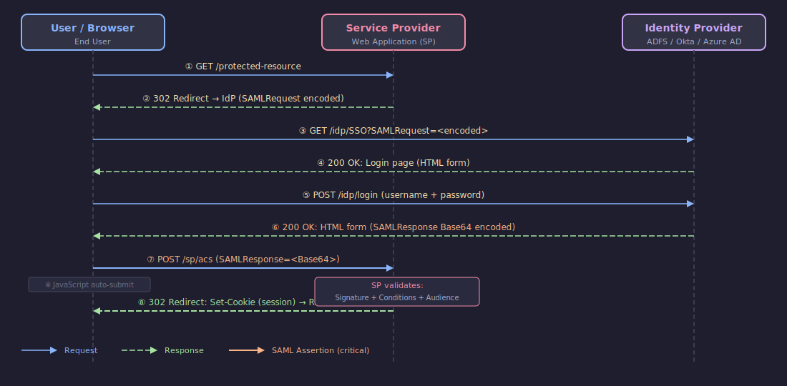

<!--
SP-InitiatedはSPがSAMLRequestを作りIdPにリダイレクト。認証後、IdPがSAMLResponseをブラウザ経由でSPにPOSTします。
-->

---

# SAML SP-Initiated フロー — ポイント

- **Step 2:** SP が SAMLRequest を Base64 エンコードしてリダイレクト
- **Step 6:** IdP が署名付き SAMLResponse を HTML フォームに埋め込む
- **Step 7:** JavaScript で自動サブミット → SP の ACS (Assertion Consumer Service) URL に POST
- **SP 検証項目:** 署名の正当性 / Audience (自分宛か) / Conditions (有効期限) / Issuer
- **RelayState:** 元のリクエスト URL を保持し、認証後にリダイレクトするための情報
- **セッション:** SP が独自にセッション Cookie を発行（SAML は SSO, セッション管理は SP 独自）


---

# SAML IdP-Initiated SSO フロー

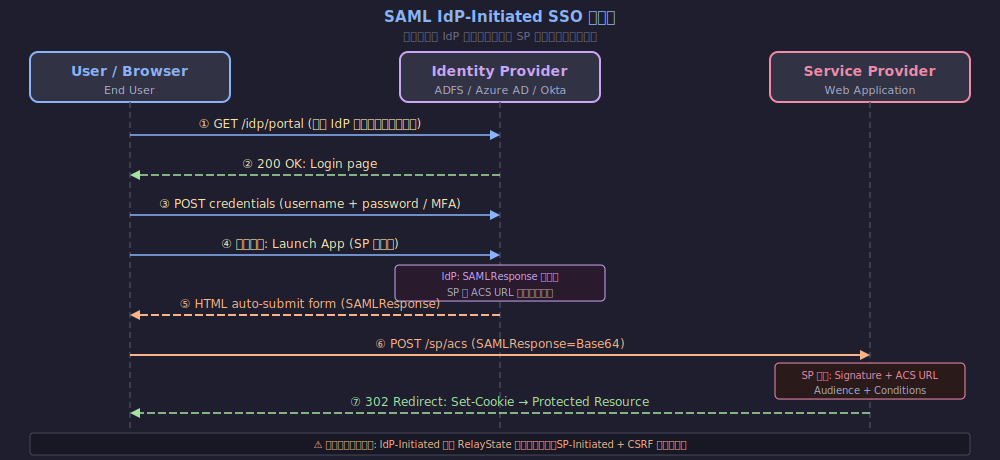

<!--
IdP-InitiatedはユーザーがIdPのポータルからアプリを選ぶパターン。セキュリティリスクが高いため非推奨。
-->

---

# SAML Binding: HTTP-Redirect vs HTTP-POST

- **HTTP-Redirect Binding:** SAMLRequest を URL クエリパラメータで送信
-   → URL 長さ制限あり（〜2KB）。SAMLRequest に使用が一般的
- **HTTP-POST Binding:** HTML フォームの hidden フィールドに埋め込み
-   → サイズ制限なし。SAMLResponse に必須（署名付き XML は大きい）
- **SOAP Binding (ECP):** XML SOAP メッセージで直接通信。ブラウザ不要
-   → CLI ツール・ネイティブアプリ向け。実装が複雑
- **推奨組み合わせ:** Request: HTTP-Redirect, Response: HTTP-POST


---

# OIDC 認証コードフロー + ID Token

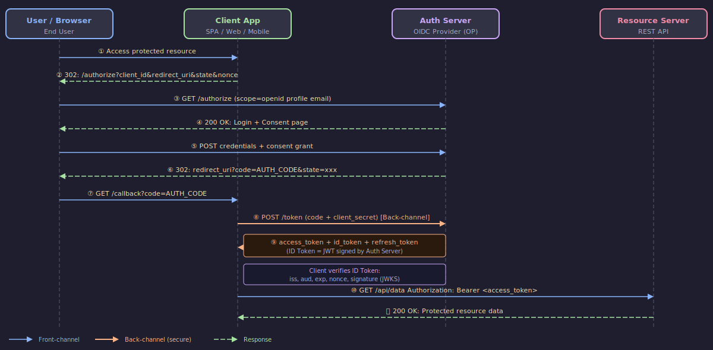

<!--
OIDCの認可コードフローです。重要なのはStep 8-9のバックチャンネルでのトークン交換と、IDトークンの検証です。
-->

---

# OIDC フロー — ポイント

- **scope=openid:** これが OIDC の起動キー。これがないと OAuth 2.0 のみ
- **state パラメータ:** CSRF 攻撃防止。リクエストとコールバックで一致確認必須
- **nonce:** リプレイ攻撃防止。ID Token のクレームと一致確認必須
- **バックチャンネル交換 (Step 8):** Auth Code をトークンに変換。直接 HTTPS POST
- **ID Token 検証:** iss / aud / exp / nonce / 署名 (JWKS で公開鍵取得) を確認
- **UserInfo Endpoint:** Access Token で追加のユーザー情報を取得できる


---

# OIDC PKCE フロー (モバイル/SPA 向け)

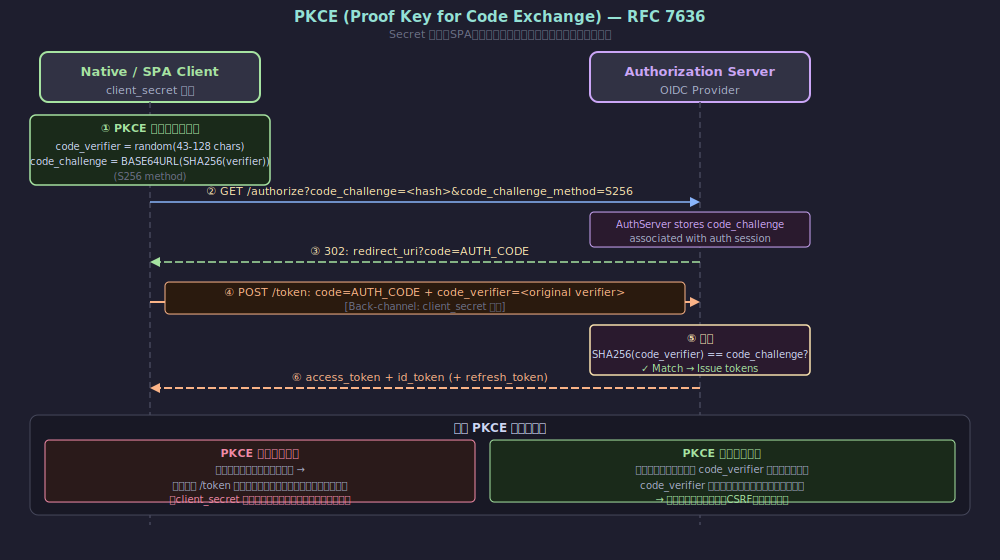

<!--
PKCEはRFC 7636で定義。client_secretを使わないパブリッククライアントでの認可コードフローを安全にします。
-->

---

# プロトコルフロー比較サマリー

| 観点 | SAML SP-Initiated | OIDC Auth Code + PKCE |
|------|-------------------|----------------------|
| 仲介 | ブラウザ (必須) | ブラウザ + バックチャンネル |
| トークン形式 | XML (Base64 POST) | JWT (JSON) |
| CSRF 対策 | RelayState | state + PKCE |
| リプレイ対策 | Conditions/InResponseTo | nonce + exp |
| バックチャンネル通信 | なし | あり (安全) |
| モバイル対応 | ✗ 困難 | ✓ PKCE で対応 |


---

<!-- _class: lead -->
# Part 3: トークン・アサーション構造

- SAML Assertion の XML 構造
- JWT ID Token の 3 部構成
- Access Token vs ID Token の役割分離


---

# SAML Assertion の構造

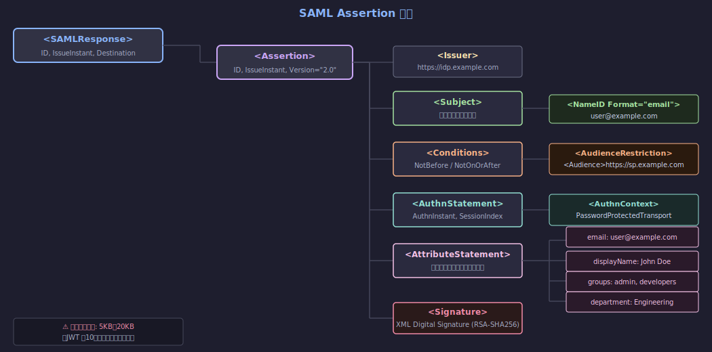

<!--
SAML AssertionはXMLで構成されます。Issuer, Subject, Conditions, AuthnStatement, AttributeStatementが主要要素です。
-->

---

# SAML Assertion — XML サンプル

- 署名付き Assertion の実際の XML 構造を確認する

```xml
<saml:Assertion xmlns:saml="urn:oasis:names:tc:SAML:2.0:assertion"
  ID="_abc123" IssueInstant="2026-02-19T12:00:00Z" Version="2.0">
  <saml:Issuer>https://idp.example.com</saml:Issuer>
  <saml:Subject>
    <saml:NameID Format="urn:oasis:names:tc:SAML:1.1:nameid-format:emailAddress">
      user@example.com
    </saml:NameID>
    <saml:SubjectConfirmation Method="...bearer">
      <saml:SubjectConfirmationData
        NotOnOrAfter="2026-02-19T12:05:00Z"
        Recipient="https://sp.example.com/acs"/>
    </saml:SubjectConfirmation>
  </saml:Subject>
  <saml:Conditions NotBefore="..." NotOnOrAfter="...">
    <saml:AudienceRestriction>
      <saml:Audience>https://sp.example.com</saml:Audience>
    </saml:AudienceRestriction>
  </saml:Conditions>
  <saml:AttributeStatement>
    <saml:Attribute Name="email"><saml:AttributeValue>user@example.com</saml:AttributeValue></saml:Attribute>
    <saml:Attribute Name="groups"><saml:AttributeValue>admin</saml:AttributeValue></saml:Attribute>
  </saml:AttributeStatement>
  <ds:Signature><!-- RSA-SHA256 デジタル署名 --></ds:Signature>
</saml:Assertion>
```


---

# JWT ID Token の構造

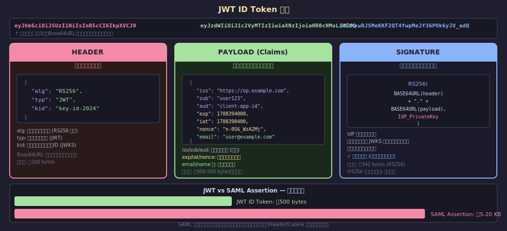

<!--
JWTは3つのBase64URLエンコードされたパーツをピリオドで結合。ヘッダー・ペイロード・署名。
-->

---

# ID Token の標準クレーム (OIDC Core 仕様)

| クレーム | 必須 | 説明 |
|---------|------|------|
| `iss` | ✓ | 発行者 URL (https://op.example.com) |
| `sub` | ✓ | ユーザー識別子 (不変・プロバイダー固有) |
| `aud` | ✓ | 対象クライアント (client_id) |
| `exp` | ✓ | 有効期限 (Unix timestamp) |
| `iat` | ✓ | 発行時刻 |
| `nonce` | 条件付 | リプレイ攻撃防止 (リクエスト時に送った値) |
| `email` `name` `picture` | オプション | scope に応じて含まれる |


---

# Access Token vs ID Token — 役割の分離

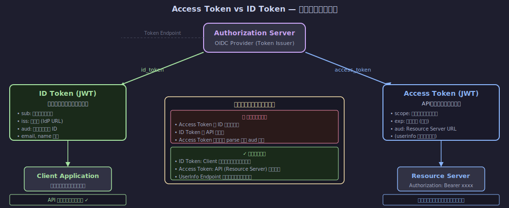

<!--
ID TokenはClientがユーザー認証確認のために使うもの。Access TokenはResource Serverへの認可証明。混乱しやすいポイントです。
-->

---

# SAML Assertion vs JWT ID Token — 属性比較

| 比較項目 | SAML Assertion | JWT ID Token |
|---------|----------------|--------------|
| **形式** | XML (署名付き) | JSON (Base64URL) |
| **典型サイズ** | 5〜20 KB | 300〜1000 bytes |
| **署名** | XML Digital Signature | RS256 / ES256 |
| **有効期限** | Conditions NotOnOrAfter | `exp` クレーム |
| **対象者** | AudienceRestriction | `aud` クレーム |
| **ユーザー識別** | NameID (Format 指定) | `sub` (不変) |
| **属性** | AttributeStatement (柔軟) | Claims (標準化) |


---

# クレームマッピング: IdP → SP 属性変換

- IdP の属性名と SP が期待する属性名が異なる場合のマッピング設定例

```yaml
# Okta / Azure AD での SAML 属性マッピング設定例
saml_attributes:
  - name: "http://schemas.xmlsoap.org/ws/2005/05/identity/claims/emailaddress"
    value: "user.email"        # IdP フィールド名
    # SP では 'email' として受け取りたい場合、SP 側でも変換設定

# OIDC スコープとクレームのマッピング例 (Keycloak)
oidc_scope_mappings:
  openid:
    - sub
  profile:
    - name, given_name, family_name, picture
  email:
    - email, email_verified
  # カスタムスコープ
  roles:
    - realm_roles, resource_access

# JWT クレームでのグループ情報例
{
  "sub": "user123",
  "email": "user@example.com",
  "groups": ["admin", "developers"],
  "custom:department": "Engineering"
}
```


---

<!-- _class: lead -->
# Part 4: ユースケース別選択基準

- エンタープライズ SSO / モバイル・SPA
- B2B フェデレーション / API 認可
- マルチプロトコル構成と選択フローチャート


---

# エンタープライズ SSO — SAML が適切な理由

- **Active Directory / ADFS との深い統合:** Kerberos→SAML変換が成熟
- **ベンダーサポートの幅広さ:** Salesforce, SAP, ServiceNow, Workday は SAML が標準
- **Windows 統合認証 (WIA):** イントラネット環境では Kerberos→SAML のシームレス SSO
- **組織内ポリシーの伝達:** Group/Role 情報を Attribute Statement で SP に渡せる
- **成熟した実装:** 20年以上の実績。脆弱性と対策が出揃っている
- **判断基準:** 既存 AD + エンタープライズ SaaS の SSO が主目的 → SAML を維持


---

# モバイル・SPA — OIDC が適切な理由

- **SAML の根本的問題:** XML HTML フォームの POST はネイティブアプリで扱えない
- **PKCE による安全な認可:** client_secret 不要でパブリッククライアントに対応
- **カスタムスキーム:** `myapp://callback` で Auth Code をアプリが受け取れる
- **JWT の軽量さ:** ネットワーク帯域・解析コスト共に有利（モバイル回線考慮）
- **SDKライブラリの充実:** AppAuth (iOS/Android), MSAL, Auth0 SDK 等が完備
- **判断基準:** iOS・Android アプリや React/Vue SPA → OIDC + PKCE 一択


---

# B2B フェデレーション — 状況に応じた選択

- **エンタープライズ B2B:** 相手企業が SAML IdP (AD/ADFS) を持つ → SAML
- **クラウドネイティブ B2B:** 相手が Okta / Auth0 等 → OIDC が増えてきた
- **実用的アプローチ:** マルチプロトコル対応 IdP を使い、相手に合わせる
- **AWS IAM Identity Center:** SAML 2.0 + OIDC 両対応。外部 IdP と連携
- **Google Workspace / Azure AD:** 外部 SAML フェデレーション、OIDC フェデレーション両対応
- **判断基準:** 相手先のシステム制約に合わせる。自社 IdP はマルチプロトコル対応を


---

# マルチプロトコル対応 IdP 構成

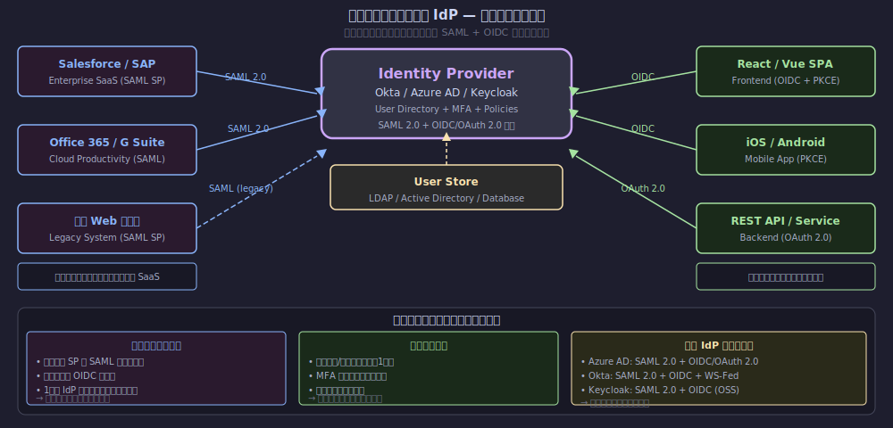

<!--
エンタープライズ移行期の現実解です。1つのIdPでSAMLとOIDCを両対応し、段階的に移行します。
-->

---

# ユースケース別選択マトリクス

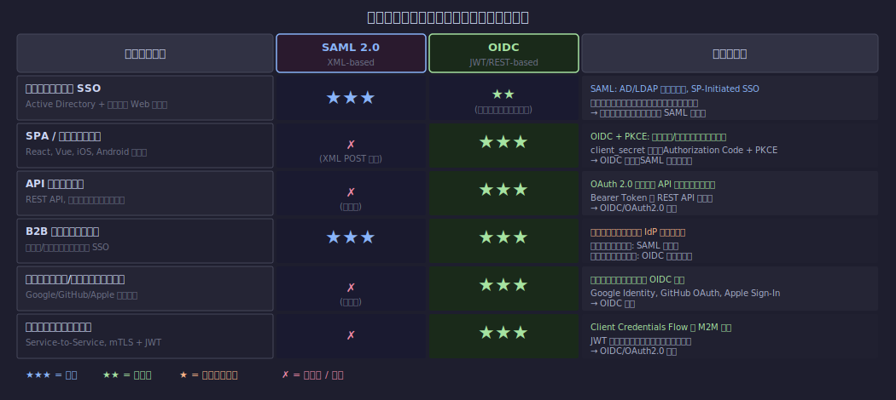

<!--
各ユースケースでの推奨度をまとめた表です。新規開発はほぼOIDC一択、エンタープライズSSOはSAML優位です。
-->

---

# Decision Flowchart: どちらを選ぶか

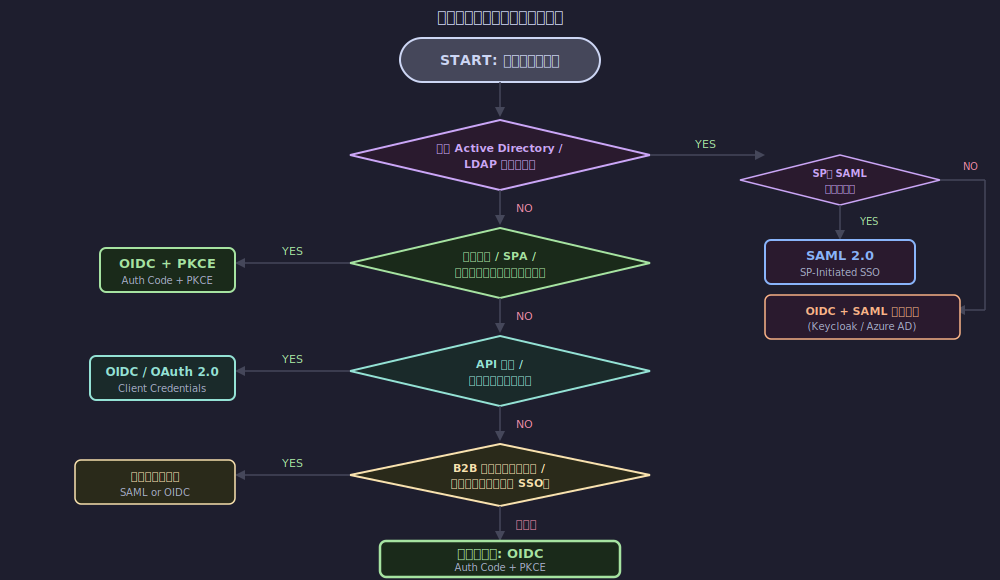

<!--
迷ったときはこのフローチャートを使ってください。基本的に新規プロジェクトはOIDCがデフォルトです。
-->

---

<!-- _class: lead -->
# Part 5: セキュリティ考慮事項

- SAML の主要脆弱性 (XSW, リプレイ攻撃)
- OIDC の主要脆弱性 (不正リダイレクト, Token Leakage)
- セキュリティ対策チェックリスト


---

# SAML 脆弱性 #1: XML Signature Wrapping (XSW)


<!--
XSWはSAMLの最も深刻な脆弱性。署名は有効でも別の要素が処理される。検証済みライブラリの使用が必須。
-->

---

# SAML 脆弱性 #2 — その他のリスク

- **XML インジェクション:** XML メタキャラクタを含む属性値でパーサーを混乱
-   → 対策: 属性値のエスケープ、strict な XML パーサー設定
- **リプレイ攻撃:** 有効期限内の SAMLResponse を再送して不正アクセス
-   → 対策: InResponseTo / AssertionID のキャッシュで重複検出
- **オープンリダイレクト:** RelayState を検証しない場合に任意 URL へリダイレクト
-   → 対策: RelayState はホワイトリスト or 相対 URL のみ許可
- **中間者攻撃:** TLS を使わない場合の SAMLResponse 傍受・改ざん
-   → 対策: 全通信 HTTPS 必須、SP でアサーション署名を必須化


---

# OIDC 脆弱性 #1: リダイレクト URI 攻撃

- **不正 redirect_uri:** 登録外のURIに Auth Code / Token がリダイレクトされる
-   → 対策: redirect_uri を完全一致で事前登録。ワイルドカード禁止
- **オープンリダイレクタ利用:** 正規ドメインのリダイレクタ経由で外部へ誘導
-   → 対策: redirect_uri は完全 URL で登録。動的登録には注意
- **CSRF 攻撃 (state 未検証):** state パラメータ検証なしで認可コードを送信
-   → 対策: state は必ず生成・検証。セッション/Cookie に保存して照合
- **Code Injection (Implicit Flow):** URL フラグメントのトークンが Referer 漏洩
-   → 対策: Implicit Flow は廃止。Auth Code + PKCE を使用


---

# OIDC 脆弱性 #2: Token Leakage と実装ミス

- **Access Token のログ記録:** Bearer Token がアクセスログに残る
-   → 対策: Authorization ヘッダーはログから除外。短命トークン使用
- **`alg: none` 攻撃:** JWT の署名アルゴリズムに none を指定し検証スキップ
-   → 対策: alg を明示的に RS256/ES256 に限定。none を拒否
- **HS256 共有鍵の漏洩:** 対称鍵が漏洩すると全トークン偽造可能
-   → 対策: RS256 (公開鍵暗号) を推奨。HS256 はマイクロサービス内部のみ
- **nonce 未検証:** リプレイ攻撃防止の nonce をクライアントが確認しない
-   → 対策: nonce は必ずセッションに保存し ID Token クレームと照合


---

# セキュリティ対策比較チェックリスト

| 脅威 | SAML 対策 | OIDC 対策 |
|------|-----------|-----------|
| リプレイ攻撃 | InResponseTo + AssertionID キャッシュ | nonce + exp 検証 |
| 改ざん | XML Digital Signature 必須化 | RS256 署名 + JWKS 検証 |
| CSRF | RelayState 検証 | state パラメータ検証 |
| 不正リダイレクト | ACS URL ホワイトリスト | redirect_uri 完全一致 |
| 中間者攻撃 | 全通信 TLS 必須 | HTTPS 必須 + HSTS |
| トークン漏洩 | SAMLResponse の短命化 | 短命 Access Token + Refresh Token |


---

# 共通セキュリティ ベストプラクティス

- **実装は必ず検証済みライブラリを使用:** 独自実装は危険（特に SAML の XML 署名）
- **SAML:** OneLogin python-saml / Shibboleth / Spring Security SAML
- **OIDC:** Authlib / Keycloak / Auth0 SDK / Microsoft MSAL
- **定期的な依存ライブラリの更新:** CVE を定期スキャン (Dependabot, Snyk)
- **最小スコープ原則:** 必要最小限の scope / 属性のみ要求
- **ログと監査:** 認証成功/失敗をすべて記録。異常検知アラートを設定


---

<!-- _class: lead -->
# Part 6: 実装・移行ガイド

- 主要 IdP / ライブラリの対応状況
- SAML → OIDC 4 フェーズ移行パターン
- よくある実装ミス Top 5


---

# 主要 IdP・ライブラリ対応状況

| プロダクト | SAML 2.0 | OIDC | 備考 |
|-----------|----------|------|------|
| **Azure AD / Entra ID** | ✓ | ✓ | 両対応。新規は OIDC 推奨 |
| **Okta** | ✓ | ✓ | 両対応。設定 UI が充実 |
| **Keycloak (OSS)** | ✓ | ✓ | 両対応。オンプレ向け |
| **Auth0** | ✓ | ✓ | 両対応。SaaS IdP |
| **AWS IAM Identity Center** | ✓ | ✓ | 外部 IdP との連携 |
| **Google Identity** | — | ✓ | OIDC のみ |
| **GitHub OAuth** | — | ✓ | OAuth 2.0 / OIDC |


---

# SAML → OIDC 移行パターン (4 フェーズ)

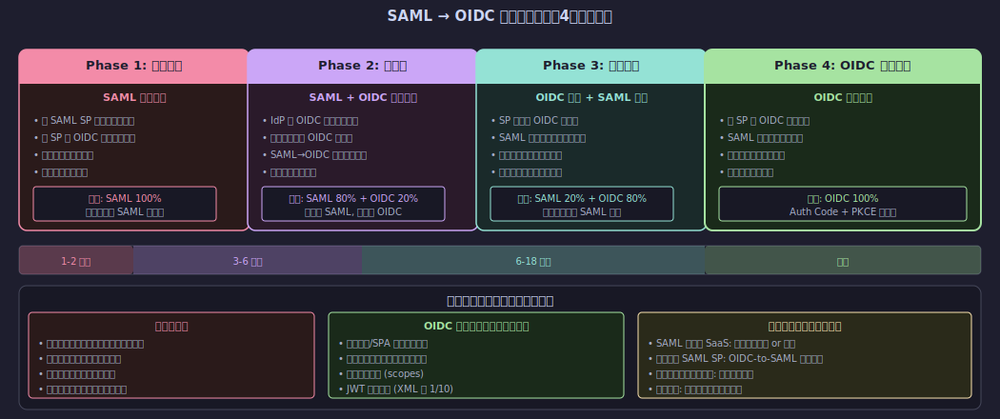

<!--
移行は段階的に。最初に現状把握→並存期→移行実行→完全移行の4フェーズで進めます。ロールバック手順の準備が重要です。
-->

---

# Azure AD / Okta での OIDC 設定例

- 主要 IdP での OIDC アプリ登録と検証コードの例

```python
# Azure AD (MSAL Python) での OIDC 設定
import msal

app = msal.ConfidentialClientApplication(
    client_id="your-client-id",
    client_credential="your-client-secret",
    authority="https://login.microsoftonline.com/tenant-id"
)

# 1. Authorization URL を生成
auth_url = app.get_authorization_request_url(
    scopes=["openid", "profile", "email"],
    redirect_uri="https://app.example.com/callback",
    state="random-csrf-token",
    nonce="random-nonce"
)

# 2. Auth Code → Token 交換
result = app.acquire_token_by_authorization_code(
    code=request.args["code"],
    scopes=["openid", "profile"],
    redirect_uri="https://app.example.com/callback"
)
# result["id_token_claims"] に検証済みクレームが入る
```


---

# よくある実装ミス Top 5

- **❌ #1 SAML:** 署名検証をスキップ or 自己実装 → XSW 攻撃の温床
-   ✅ 対策: 検証済みライブラリ使用。署名 + Conditions + Audience を全て確認
- **❌ #2 OIDC:** state / nonce を検証しない → CSRF / リプレイ攻撃に脆弱
-   ✅ 対策: セッションに保存し、コールバック時に必ず照合
- **❌ #3 OIDC:** Access Token を ID として使う → sub クレームで識別すること
-   ✅ 対策: ユーザー識別は ID Token の sub。UserInfo API で補完
- **❌ #4 OIDC:** JWT の alg を未検証 → alg:none 攻撃やアルゴリズム混乱攻撃
-   ✅ 対策: 受け入れ alg を RS256/ES256 に明示的に制限


---

# よくある実装ミス Top 5 (続き)

- **❌ #5 共通:** セッション管理と認証を混同 → SLO (Single Logout) の未実装
-   ✅ 対策: SAML SLO / OIDC RP-Initiated Logout を適切に実装
- **その他の注意点:**
- SAML: InResponseTo を検証しないと IdP-Initiated 攻撃に弱い
- OIDC: Implicit Flow の使用（廃止済み）→ Auth Code + PKCE へ移行
- OIDC: client_secret をフロントエンドコードに埋め込む → 公開される
- 共通: トークン/アサーションの有効期限を長く設定しすぎる
- 共通: エラーメッセージに認証情報の詳細を含める → 情報漏洩


---

<!-- _class: lead -->
# まとめ

- SAML vs OIDC 総合比較
- 選択ガイド


---

# SAML vs OIDC — 総合比較表

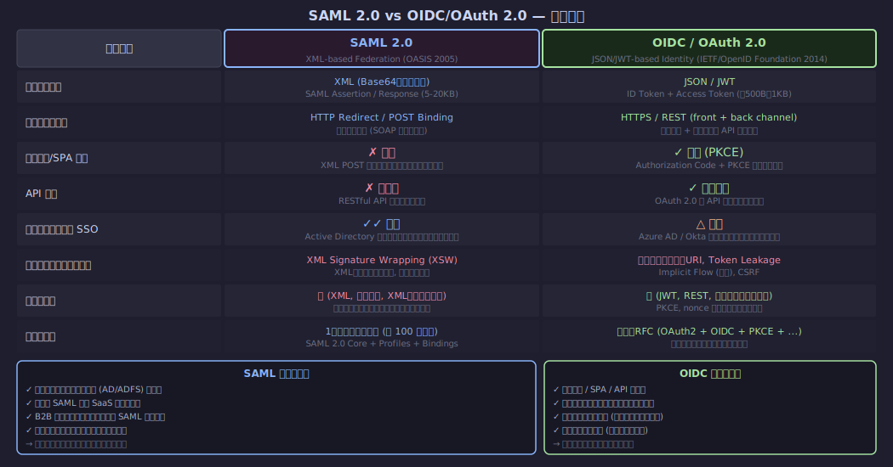

<!--
総合比較のまとめです。新規プロジェクトはOIDCがデフォルト、既存エンタープライズはSAML維持が現実解です。
-->

---

# 選択ガイド — 3 行サマリー

- **新規プロジェクト:** → **OIDC + PKCE** (モバイル・SPA・API・マイクロサービス全て対応)
- **既存エンタープライズ SSO:** → **SAML 維持** (AD 統合・コスト・リスクを考慮)
- **移行計画:** → **マルチプロトコル IdP** で並存しながら段階移行
- **重要な原則:**
- 認証実装は必ずライブラリを使う。独自実装は脆弱性の温床
- OIDC でも SAML でも、検証項目（署名・有効期限・対象者）は必ず全て確認
- 「どちらが優れているか」ではなく「ユースケースに何が最適か」で判断


---

# 参考資料 / RFC (1/2)

- **仕様書・RFC:**
- [SAML 2.0 Core (OASIS)](https://docs.oasis-open.org/security/saml/v2.0/saml-core-2.0-os.pdf)
- [OpenID Connect Core 1.0](https://openid.net/specs/openid-connect-core-1_0.html)
- [RFC 6749: OAuth 2.0](https://www.rfc-editor.org/rfc/rfc6749)
- [RFC 7636: PKCE](https://www.rfc-editor.org/rfc/rfc7636)
- [RFC 7519: JWT](https://www.rfc-editor.org/rfc/rfc7519)
- **セキュリティ:**
- [OAuth 2.0 Security Best Current Practice (RFC 9700)](https://www.rfc-editor.org/rfc/rfc9700)


---

# 参考資料 / RFC (2/2)

- **実装ガイド・ライブラリ:**
- [Okta: OIDC vs SAML](https://developer.okta.com/blog/2020/09/14/password-management-for-devs)
- [Auth0: SAML vs JWT](https://auth0.com/blog/saml-vs-oauth/)
- [OWASP Authentication Cheat Sheet](https://cheatsheetseries.owasp.org/cheatsheets/Authentication_Cheat_Sheet.html)
- **OSS ライブラリ:**
- [Keycloak (IdP)](https://www.keycloak.org/) | [python-saml (OneLogin)](https://github.com/onelogin/python-saml)
- [AppAuth (Mobile OIDC)](https://appauth.io/) | [Authlib (Python OIDC)](https://authlib.org/)
- [MSAL (Microsoft)](https://github.com/AzureAD/microsoft-authentication-library-for-python)

