<!-- _class: lead -->
# OIDC vs SAML

- アーキテクトのための選択ガイド
- 認証プロトコルの深層比較 — フロー・構造・セキュリティ・移行
- 対象: アーキテクト / Tech Lead

<!--
本日はOIDCとSAMLの違いを、アーキテクトの視点から深掘りします。単なる機能比較だけでなく、フロー図解・トークン構造・セキュリティ・移行パターンまで網羅します。
-->

---

# アジェンダ (1/2)

- **Part 1: 背景と基礎** — 認証/認可の概念、SAMLとOIDCの歴史
- **Part 2: プロトコルフロー詳解** — SP-Initiated, IdP-Initiated, PKCE
- **Part 3: トークン・アサーション構造** — SAML Assertion vs JWT ID Token
- **Part 4: ユースケース別選択基準** — 選択マトリクス・Decision Flowchart
- **Part 5: セキュリティ考慮事項** — XSW, Token Leakage, 対策チェックリスト
- **Part 6: 実装・移行ガイド** — 主要IdP対応, SAML→OIDC 4フェーズ移行


---

# アジェンダ (2/2) — 本日のゴール

- **判断できるようになること:**
- 新規プロジェクトで SAML か OIDC どちらを選ぶべきか即答できる
- 既存 SAML 環境から OIDC への移行計画を立てられる
- 各プロトコルの脆弱性を理解し、正しい実装方針を示せる
- **前提知識:** HTTP / OAuth 2.0 の基本的な概念があると理解が深まります
- **スライド資料:** 図解 14 枚 + コードサンプル + 参考資料一覧


---

<!-- _class: lead -->
# Part 1: 背景と基礎

- 認証・認可の概念整理
- IdP / SP の関係
- SAML と OIDC の歴史的背景


---

# 認証（AuthN）vs 認可（AuthZ）

- <svg viewBox="0 0 800 400" style="max-height:70vh;max-width:100%;display:block;margin:0 auto;" xmlns="http://www.w3.org/2000/svg">
<rect width="800" height="400" fill="#1a1a2e"/>
<rect x="30" y="60" width="340" height="280" rx="12" fill="#16213e" stroke="#f9a825" stroke-width="2"/>
<rect x="430" y="60" width="340" height="280" rx="12" fill="#16213e" stroke="#e91e63" stroke-width="2"/>
<text x="200" y="100" text-anchor="middle" fill="#f9a825" font-size="22" font-weight="bold" font-family="sans-serif">認証 (AuthN)</text>
<text x="600" y="100" text-anchor="middle" fill="#e91e63" font-size="22" font-weight="bold" font-family="sans-serif">認可 (AuthZ)</text>
<text x="200" y="135" text-anchor="middle" fill="#ffffff" font-size="14" font-family="sans-serif">あなたは誰ですか？</text>
<text x="600" y="135" text-anchor="middle" fill="#ffffff" font-size="14" font-family="sans-serif">何ができますか？</text>
<text x="200" y="175" text-anchor="middle" fill="#ffffff" font-size="13" font-family="sans-serif">ID確認・本人証明</text>
<text x="600" y="175" text-anchor="middle" fill="#ffffff" font-size="13" font-family="sans-serif">アクセス権限の判断</text>
<text x="200" y="215" text-anchor="middle" fill="#ffffff" font-size="13" font-family="sans-serif">例: パスワード / MFA</text>
<text x="600" y="215" text-anchor="middle" fill="#ffffff" font-size="13" font-family="sans-serif">例: RBAC / ポリシー</text>
<text x="200" y="255" text-anchor="middle" fill="#ffffff" font-size="13" font-family="sans-serif">プロトコル: SAML / OIDC</text>
<text x="600" y="255" text-anchor="middle" fill="#ffffff" font-size="13" font-family="sans-serif">プロトコル: OAuth2</text>
<text x="200" y="305" text-anchor="middle" fill="#f9a825" font-size="13" font-family="sans-serif">先に実行される</text>
<text x="600" y="305" text-anchor="middle" fill="#e91e63" font-size="13" font-family="sans-serif">後に実行される</text>
<text x="400" y="200" text-anchor="middle" fill="#ffffff" font-size="28" font-family="sans-serif">→</text>
</svg>
- **認証 (Authentication / AuthN):** 「あなたは誰ですか？」を確認するプロセス
- **認可 (Authorization / AuthZ):** 「あなたは何をしてよいですか？」を確認するプロセス
- **SAML:** 主に認証（SSO）に特化。認可情報は Attribute で補完
- **OIDC:** OAuth 2.0（認可）の上に認証レイヤー（ID Token）を追加
- **混乱しやすい点:** OAuth 2.0 は認可フレームワーク。OIDC がその上の認証層
- **Identity Federation:** 異なるドメイン間で認証情報を信頼・共有する仕組み

<!--
認証と認可は厳密に分けて考えることが重要です。OAuth 2.0 単体は認可のみ。OIDC が認証を追加します。
-->

---

# フェデレーションの基本概念: IdP と SP

- <svg viewBox="0 0 800 400" style="max-height:70vh;max-width:100%;display:block;margin:0 auto;" xmlns="http://www.w3.org/2000/svg">
<rect width="800" height="400" fill="#1a1a2e"/>
<rect x="50" y="130" width="180" height="100" rx="10" fill="#16213e" stroke="#f9a825" stroke-width="2"/>
<text x="140" y="175" text-anchor="middle" fill="#f9a825" font-size="16" font-weight="bold" font-family="sans-serif">IdP</text>
<text x="140" y="200" text-anchor="middle" fill="#ffffff" font-size="12" font-family="sans-serif">Identity Provider</text>
<rect x="310" y="80" width="180" height="80" rx="10" fill="#16213e" stroke="#e91e63" stroke-width="2"/>
<text x="400" y="115" text-anchor="middle" fill="#e91e63" font-size="15" font-weight="bold" font-family="sans-serif">SP / RP</text>
<text x="400" y="140" text-anchor="middle" fill="#ffffff" font-size="12" font-family="sans-serif">Service Provider</text>
<rect x="310" y="220" width="180" height="80" rx="10" fill="#16213e" stroke="#e91e63" stroke-width="2"/>
<text x="400" y="255" text-anchor="middle" fill="#e91e63" font-size="15" font-weight="bold" font-family="sans-serif">SP / RP</text>
<text x="400" y="280" text-anchor="middle" fill="#ffffff" font-size="12" font-family="sans-serif">Service Provider</text>
<rect x="570" y="130" width="180" height="100" rx="10" fill="#16213e" stroke="#4caf50" stroke-width="2"/>
<text x="660" y="175" text-anchor="middle" fill="#4caf50" font-size="15" font-weight="bold" font-family="sans-serif">ユーザー</text>
<text x="660" y="200" text-anchor="middle" fill="#ffffff" font-size="12" font-family="sans-serif">End User</text>
<line x1="230" y1="180" x2="310" y2="120" stroke="#f9a825" stroke-width="2"/>
<polygon points="310,120 295,125 302,138" fill="#f9a825"/>
<line x1="230" y1="180" x2="310" y2="260" stroke="#f9a825" stroke-width="2"/>
<polygon points="310,260 295,252 302,265" fill="#f9a825"/>
<line x1="570" y1="180" x2="490" y2="120" stroke="#4caf50" stroke-width="2"/>
<polygon points="490,120 500,130 508,118" fill="#4caf50"/>
<text x="400" y="380" text-anchor="middle" fill="#ffffff" font-size="12" font-family="sans-serif">フェデレーション: IdPで認証 → SP/RPへアサーション伝達</text>
</svg>
- **Identity Provider (IdP):** ユーザーの認証情報を管理・認証結果を発行する側
- **Service Provider (SP) / Relying Party (RP):** IdP の認証結果を受け取り、サービスを提供する側
- **フェデレーション:** SP が独自のユーザー管理をせず、IdP の認証結果を信頼する
- **シングルサインオン (SSO):** 1回の認証で複数のサービスにアクセス可能
- **信頼関係:** SP と IdP の間に事前に確立するメタデータ/証明書の交換
- **SAML の呼び名:** IdP / SP   |   **OIDC の呼び名:** OP (OpenID Provider) / RP


---

# SAML の歴史と設計思想

- **2002年:** OASIS が SAML 1.0 策定。企業間 SSO が目的
- **2005年:** SAML 2.0 リリース。現在も標準として使用
- **設計思想:** エンタープライズ向け。SOAP/XML が全盛の時代
- **ブラウザ中心:** リダイレクトと HTML フォームの POST で動作
- **強み:** AD/LDAP との統合、成熟したエコシステム、Salesforce/SAP 等の対応
- **弱み:** XML の複雑さ、モバイル非対応、API 認可は設計外


---

# OIDC / OAuth 2.0 の登場

- **2012年:** OAuth 2.0 (RFC 6749) — API 認可フレームワークとして策定
- **2014年:** OpenID Connect 1.0 — OAuth 2.0 の上に認証レイヤーを追加
- **設計思想:** Web・モバイル・API 時代の認証認可
- **JSON/JWT:** 軽量、パース容易、言語非依存（JavaScript フレンドリー）
- **Google・Facebook** がログイン基盤に採用。ソーシャルログインで普及
- **現在:** AWS Cognito, Auth0, Okta, Keycloak が OIDC を標準サポート


---

# SAML vs OIDC: アーキテクチャ概念比較

- <svg viewBox="0 0 800 400" style="max-height:70vh;max-width:100%;display:block;margin:0 auto;" xmlns="http://www.w3.org/2000/svg">
<rect width="800" height="400" fill="#1a1a2e"/>
<text x="400" y="35" text-anchor="middle" fill="#ffffff" font-size="18" font-weight="bold" font-family="sans-serif">アーキテクチャ概念比較</text>
<rect x="20" y="55" width="370" height="320" rx="10" fill="#16213e" stroke="#f9a825" stroke-width="2"/>
<rect x="410" y="55" width="370" height="320" rx="10" fill="#16213e" stroke="#e91e63" stroke-width="2"/>
<text x="205" y="85" text-anchor="middle" fill="#f9a825" font-size="16" font-weight="bold" font-family="sans-serif">SAML 2.0</text>
<text x="595" y="85" text-anchor="middle" fill="#e91e63" font-size="16" font-weight="bold" font-family="sans-serif">OIDC / OAuth2</text>
<text x="55" y="120" fill="#ffffff" font-size="13" font-family="sans-serif">• XML ベース</text>
<text x="55" y="150" fill="#ffffff" font-size="13" font-family="sans-serif">• ブラウザリダイレクト中心</text>
<text x="55" y="180" fill="#ffffff" font-size="13" font-family="sans-serif">• エンタープライズ SSO</text>
<text x="55" y="210" fill="#ffffff" font-size="13" font-family="sans-serif">• IdP + SP (Service Provider)</text>
<text x="55" y="240" fill="#ffffff" font-size="13" font-family="sans-serif">• Assertion = XML署名</text>
<text x="55" y="270" fill="#ffffff" font-size="13" font-family="sans-serif">• 2002年〜</text>
<text x="55" y="310" fill="#f9a825" font-size="13" font-family="sans-serif">最適: 企業間SSO / レガシー統合</text>
<text x="445" y="120" fill="#ffffff" font-size="13" font-family="sans-serif">• JSON / JWT ベース</text>
<text x="445" y="150" fill="#ffffff" font-size="13" font-family="sans-serif">• API・モバイル対応</text>
<text x="445" y="180" fill="#ffffff" font-size="13" font-family="sans-serif">• 認証(OIDC) + 認可(OAuth2)</text>
<text x="445" y="210" fill="#ffffff" font-size="13" font-family="sans-serif">• IdP + RP (Relying Party)</text>
<text x="445" y="240" fill="#ffffff" font-size="13" font-family="sans-serif">• Token = JWT署名</text>
<text x="445" y="270" fill="#ffffff" font-size="13" font-family="sans-serif">• 2012年〜</text>
<text x="445" y="310" fill="#e91e63" font-size="13" font-family="sans-serif">最適: Web/モバイル / マイクロサービス</text>
</svg>
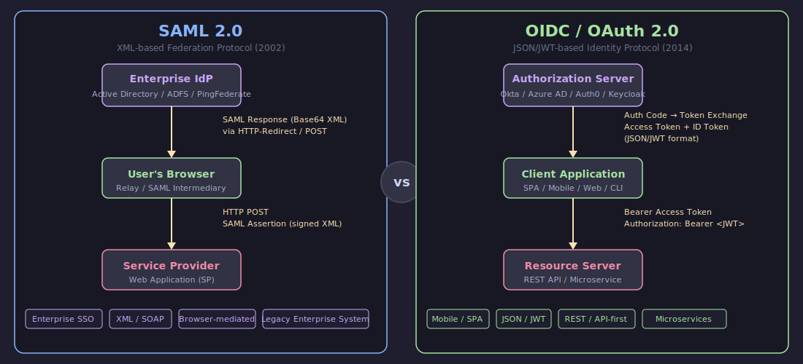

<!--
左がSAML、右がOIDCのアーキテクチャ概念図です。SAMLはブラウザ経由のXML POST、OIDCはJSON/JWTベースのREST API指向です。
-->

---

<!-- _class: lead -->
# Part 2: プロトコルフロー詳解

- SAML SP-Initiated / IdP-Initiated
- OIDC 認可コードフロー
- PKCE（モバイル/SPA 向け）


---

# SAML SP-Initiated SSO フロー

- <svg viewBox="0 0 800 400" style="max-height:70vh;max-width:100%;display:block;margin:0 auto;" xmlns="http://www.w3.org/2000/svg">
<rect width="800" height="400" fill="#1a1a2e"/>
<text x="400" y="30" text-anchor="middle" fill="#ffffff" font-size="16" font-weight="bold" font-family="sans-serif">SAML SP-Initiated SSO フロー</text>
<rect x="30" y="50" width="100" height="40" rx="6" fill="#16213e" stroke="#4caf50" stroke-width="2"/>
<text x="80" y="75" text-anchor="middle" fill="#4caf50" font-size="12" font-family="sans-serif">ユーザー</text>
<rect x="200" y="50" width="120" height="40" rx="6" fill="#16213e" stroke="#e91e63" stroke-width="2"/>
<text x="260" y="75" text-anchor="middle" fill="#e91e63" font-size="12" font-family="sans-serif">SP (Service)</text>
<rect x="480" y="50" width="120" height="40" rx="6" fill="#16213e" stroke="#f9a825" stroke-width="2"/>
<text x="540" y="75" text-anchor="middle" fill="#f9a825" font-size="12" font-family="sans-serif">IdP</text>
<line x1="80" y1="90" x2="80" y2="380" stroke="#ffffff" stroke-width="1" stroke-dasharray="4,4" opacity="0.3"/>
<line x1="260" y1="90" x2="260" y2="380" stroke="#ffffff" stroke-width="1" stroke-dasharray="4,4" opacity="0.3"/>
<line x1="540" y1="90" x2="540" y2="380" stroke="#ffffff" stroke-width="1" stroke-dasharray="4,4" opacity="0.3"/>
<line x1="80" y1="120" x2="255" y2="120" stroke="#4caf50" stroke-width="2"/>
<polygon points="255,120 242,114 242,126" fill="#4caf50"/>
<text x="168" y="113" text-anchor="middle" fill="#ffffff" font-size="11" font-family="sans-serif">① SP アクセス要求</text>
<line x1="255" y1="155" x2="85" y2="155" stroke="#e91e63" stroke-width="2"/>
<polygon points="85,155 98,149 98,161" fill="#e91e63"/>
<text x="168" y="148" text-anchor="middle" fill="#ffffff" font-size="11" font-family="sans-serif">② AuthnRequest リダイレクト</text>
<line x1="80" y1="190" x2="535" y2="190" stroke="#4caf50" stroke-width="2"/>
<polygon points="535,190 522,184 522,196" fill="#4caf50"/>
<text x="308" y="183" text-anchor="middle" fill="#ffffff" font-size="11" font-family="sans-serif">③ IdP に転送 (AuthnRequest)</text>
<line x1="540" y1="225" x2="540" y2="255" stroke="#f9a825" stroke-width="2"/>
<text x="620" y="245" fill="#f9a825" font-size="11" font-family="sans-serif">④ 認証処理</text>
<line x1="535" y1="280" x2="85" y2="280" stroke="#f9a825" stroke-width="2"/>
<polygon points="85,280 98,274 98,286" fill="#f9a825"/>
<text x="308" y="273" text-anchor="middle" fill="#ffffff" font-size="11" font-family="sans-serif">⑤ SAML Response (Assertion) 返却</text>
<line x1="80" y1="315" x2="255" y2="315" stroke="#4caf50" stroke-width="2"/>
<polygon points="255,315 242,309 242,321" fill="#4caf50"/>
<text x="168" y="308" text-anchor="middle" fill="#ffffff" font-size="11" font-family="sans-serif">⑥ Assertion を SP に POST</text>
<line x1="260" y1="350" x2="85" y2="350" stroke="#e91e63" stroke-width="2"/>
<polygon points="85,350 98,344 98,356" fill="#e91e63"/>
<text x="168" y="368" text-anchor="middle" fill="#ffffff" font-size="11" font-family="sans-serif">⑦ アクセス許可・セッション確立</text>
</svg>
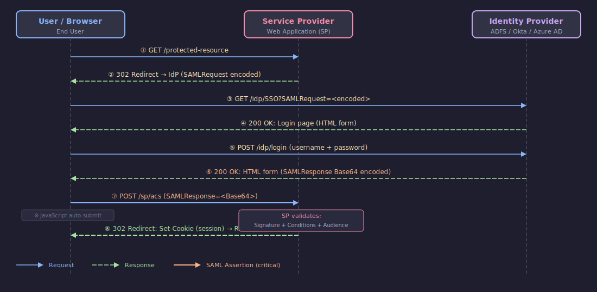

<!--
SP-InitiatedはSPがSAMLRequestを作りIdPにリダイレクト。認証後、IdPがSAMLResponseをブラウザ経由でSPにPOSTします。
-->

---

# SAML SP-Initiated フロー — ポイント

- **Step 2:** SP が SAMLRequest を Base64 エンコードしてリダイレクト
- **Step 6:** IdP が署名付き SAMLResponse を HTML フォームに埋め込む
- **Step 7:** JavaScript で自動サブミット → SP の ACS (Assertion Consumer Service) URL に POST
- **SP 検証項目:** 署名の正当性 / Audience (自分宛か) / Conditions (有効期限) / Issuer
- **RelayState:** 元のリクエスト URL を保持し、認証後にリダイレクトするための情報
- **セッション:** SP が独自にセッション Cookie を発行（SAML は SSO, セッション管理は SP 独自）


---

# SAML IdP-Initiated SSO フロー

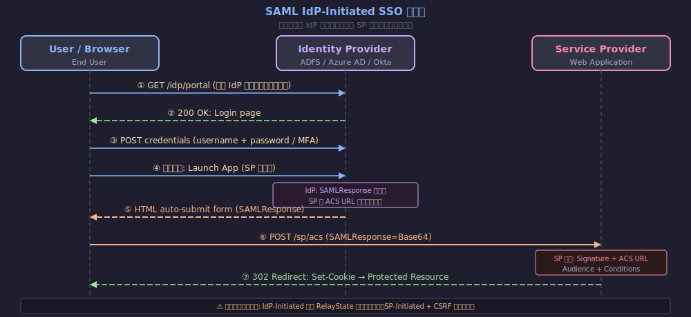

<!--
IdP-InitiatedはユーザーがIdPのポータルからアプリを選ぶパターン。セキュリティリスクが高いため非推奨。
-->

---

# SAML Binding: HTTP-Redirect vs HTTP-POST

- **HTTP-Redirect Binding:** SAMLRequest を URL クエリパラメータで送信
-   → URL 長さ制限あり（〜2KB）。SAMLRequest に使用が一般的
- **HTTP-POST Binding:** HTML フォームの hidden フィールドに埋め込み
-   → サイズ制限なし。SAMLResponse に必須（署名付き XML は大きい）
- **SOAP Binding (ECP):** XML SOAP メッセージで直接通信。ブラウザ不要
-   → CLI ツール・ネイティブアプリ向け。実装が複雑
- **推奨組み合わせ:** Request: HTTP-Redirect, Response: HTTP-POST


---

# OIDC 認証コードフロー + ID Token

- <svg viewBox="0 0 800 400" style="max-height:70vh;max-width:100%;display:block;margin:0 auto;" xmlns="http://www.w3.org/2000/svg">
<rect width="800" height="400" fill="#1a1a2e"/>
<text x="400" y="28" text-anchor="middle" fill="#ffffff" font-size="16" font-weight="bold" font-family="sans-serif">OIDC 認証コードフロー + ID Token</text>
<rect x="20" y="45" width="90" height="35" rx="5" fill="#16213e" stroke="#4caf50" stroke-width="2"/>
<text x="65" y="67" text-anchor="middle" fill="#4caf50" font-size="11" font-family="sans-serif">ユーザー</text>
<rect x="175" y="45" width="110" height="35" rx="5" fill="#16213e" stroke="#e91e63" stroke-width="2"/>
<text x="230" y="67" text-anchor="middle" fill="#e91e63" font-size="11" font-family="sans-serif">Client (RP)</text>
<rect x="475" y="45" width="110" height="35" rx="5" fill="#16213e" stroke="#f9a825" stroke-width="2"/>
<text x="530" y="67" text-anchor="middle" fill="#f9a825" font-size="11" font-family="sans-serif">Authorization</text>
<rect x="660" y="45" width="110" height="35" rx="5" fill="#16213e" stroke="#2196f3" stroke-width="2"/>
<text x="715" y="67" text-anchor="middle" fill="#2196f3" font-size="11" font-family="sans-serif">Token Endpoint</text>
<line x1="65" y1="80" x2="65" y2="390" stroke="#ffffff" stroke-width="1" stroke-dasharray="3,3" opacity="0.3"/>
<line x1="230" y1="80" x2="230" y2="390" stroke="#ffffff" stroke-width="1" stroke-dasharray="3,3" opacity="0.3"/>
<line x1="530" y1="80" x2="530" y2="390" stroke="#ffffff" stroke-width="1" stroke-dasharray="3,3" opacity="0.3"/>
<line x1="715" y1="80" x2="715" y2="390" stroke="#ffffff" stroke-width="1" stroke-dasharray="3,3" opacity="0.3"/>
<line x1="65" y1="105" x2="225" y2="105" stroke="#4caf50" stroke-width="1.5"/>
<polygon points="225,105 213,99 213,111" fill="#4caf50"/>
<text x="145" y="98" text-anchor="middle" fill="#ffffff" font-size="10" font-family="sans-serif">① ログイン要求</text>
<line x1="225" y1="130" x2="70" y2="130" stroke="#e91e63" stroke-width="1.5"/>
<polygon points="70,130 82,124 82,136" fill="#e91e63"/>
<text x="145" y="123" text-anchor="middle" fill="#ffffff" font-size="10" font-family="sans-serif">② auth URL にリダイレクト</text>
<line x1="65" y1="155" x2="525" y2="155" stroke="#4caf50" stroke-width="1.5"/>
<polygon points="525,155 513,149 513,161" fill="#4caf50"/>
<text x="295" y="148" text-anchor="middle" fill="#ffffff" font-size="10" font-family="sans-serif">③ Authorization Request (scope=openid)</text>
<line x1="530" y1="180" x2="530" y2="205" stroke="#f9a825" stroke-width="1.5"/>
<text x="570" y="196" fill="#f9a825" font-size="10" font-family="sans-serif">④ 認証</text>
<line x1="525" y1="225" x2="70" y2="225" stroke="#f9a825" stroke-width="1.5"/>
<polygon points="70,225 82,219 82,231" fill="#f9a825"/>
<text x="295" y="218" text-anchor="middle" fill="#ffffff" font-size="10" font-family="sans-serif">⑤ code=xxx リダイレクト</text>
<line x1="230" y1="250" x2="710" y2="250" stroke="#e91e63" stroke-width="1.5"/>
<polygon points="710,250 698,244 698,256" fill="#e91e63"/>
<text x="470" y="243" text-anchor="middle" fill="#ffffff" font-size="10" font-family="sans-serif">⑥ code + client_secret でトークン要求</text>
<line x1="710" y1="275" x2="235" y2="275" stroke="#2196f3" stroke-width="1.5"/>
<polygon points="235,275 247,269 247,281" fill="#2196f3"/>
<text x="470" y="268" text-anchor="middle" fill="#ffffff" font-size="10" font-family="sans-serif">⑦ access_token + id_token 返却</text>
<rect x="175" y="295" width="170" height="60" rx="6" fill="#16213e" stroke="#f9a825" stroke-width="1.5"/>
<text x="260" y="317" text-anchor="middle" fill="#f9a825" font-size="11" font-weight="bold" font-family="sans-serif">ID Token (JWT)</text>
<text x="260" y="335" text-anchor="middle" fill="#ffffff" font-size="10" font-family="sans-serif">sub, email, name, iat...</text>
<text x="260" y="352" text-anchor="middle" fill="#ffffff" font-size="10" font-family="sans-serif">署名検証 → ユーザー確認</text>
</svg>
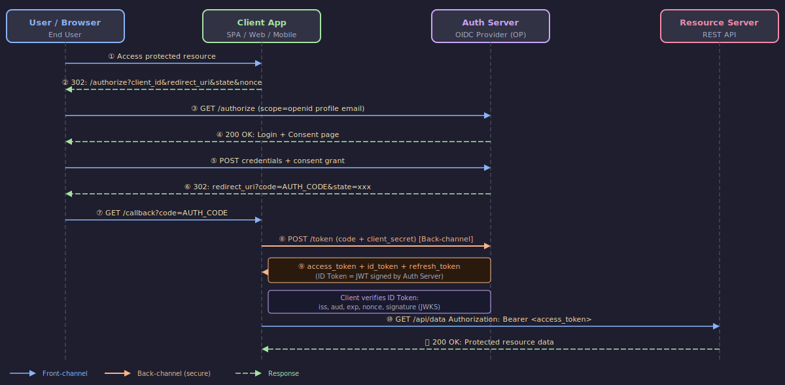

<!--
OIDCの認可コードフローです。重要なのはStep 8-9のバックチャンネルでのトークン交換と、IDトークンの検証です。
-->

---

# OIDC フロー — ポイント

- **scope=openid:** これが OIDC の起動キー。これがないと OAuth 2.0 のみ
- **state パラメータ:** CSRF 攻撃防止。リクエストとコールバックで一致確認必須
- **nonce:** リプレイ攻撃防止。ID Token のクレームと一致確認必須
- **バックチャンネル交換 (Step 8):** Auth Code をトークンに変換。直接 HTTPS POST
- **ID Token 検証:** iss / aud / exp / nonce / 署名 (JWKS で公開鍵取得) を確認
- **UserInfo Endpoint:** Access Token で追加のユーザー情報を取得できる


---

# OIDC PKCE フロー (モバイル/SPA 向け)

- <svg viewBox="0 0 800 400" style="max-height:70vh;max-width:100%;display:block;margin:0 auto;" xmlns="http://www.w3.org/2000/svg">
<rect width="800" height="400" fill="#1a1a2e"/>
<text x="400" y="28" text-anchor="middle" fill="#ffffff" font-size="16" font-weight="bold" font-family="sans-serif">OIDC PKCE フロー (モバイル/SPA向け)</text>
<rect x="20" y="50" width="160" height="50" rx="8" fill="#16213e" stroke="#4caf50" stroke-width="2"/>
<text x="100" y="81" text-anchor="middle" fill="#4caf50" font-size="13" font-family="sans-serif">Mobile / SPA</text>
<rect x="310" y="50" width="160" height="50" rx="8" fill="#16213e" stroke="#f9a825" stroke-width="2"/>
<text x="390" y="81" text-anchor="middle" fill="#f9a825" font-size="13" font-family="sans-serif">Auth Server</text>
<rect x="610" y="50" width="160" height="50" rx="8" fill="#16213e" stroke="#e91e63" stroke-width="2"/>
<text x="690" y="81" text-anchor="middle" fill="#e91e63" font-size="13" font-family="sans-serif">Token Endpoint</text>
<line x1="100" y1="100" x2="100" y2="390" stroke="#ffffff" stroke-width="1" stroke-dasharray="3,3" opacity="0.3"/>
<line x1="390" y1="100" x2="390" y2="390" stroke="#ffffff" stroke-width="1" stroke-dasharray="3,3" opacity="0.3"/>
<line x1="690" y1="100" x2="690" y2="390" stroke="#ffffff" stroke-width="1" stroke-dasharray="3,3" opacity="0.3"/>
<rect x="20" y="115" width="160" height="50" rx="6" fill="#16213e" stroke="#4caf50" stroke-width="1.5"/>
<text x="100" y="136" text-anchor="middle" fill="#ffffff" font-size="10" font-family="sans-serif">① code_verifier 生成</text>
<text x="100" y="154" text-anchor="middle" fill="#f9a825" font-size="10" font-family="sans-serif">code_challenge=S256(verifier)</text>
<line x1="180" y1="180" x2="385" y2="180" stroke="#4caf50" stroke-width="1.5"/>
<polygon points="385,180 373,174 373,186" fill="#4caf50"/>
<text x="282" y="172" text-anchor="middle" fill="#ffffff" font-size="10" font-family="sans-serif">② Authz Request + code_challenge</text>
<line x1="385" y1="210" x2="105" y2="210" stroke="#f9a825" stroke-width="1.5"/>
<polygon points="105,210 117,204 117,216" fill="#f9a825"/>
<text x="245" y="203" text-anchor="middle" fill="#ffffff" font-size="10" font-family="sans-serif">③ code 返却 (redirect)</text>
<line x1="180" y1="240" x2="685" y2="240" stroke="#4caf50" stroke-width="1.5"/>
<polygon points="685,240 673,234 673,246" fill="#4caf50"/>
<text x="430" y="232" text-anchor="middle" fill="#ffffff" font-size="10" font-family="sans-serif">④ code + code_verifier → Token Request</text>
<rect x="310" y="258" width="390" height="45" rx="6" fill="#16213e" stroke="#f9a825" stroke-width="1.5"/>
<text x="505" y="278" text-anchor="middle" fill="#f9a825" font-size="11" font-family="sans-serif">⑤ S256(code_verifier) == code_challenge?</text>
<text x="505" y="297" text-anchor="middle" fill="#ffffff" font-size="10" font-family="sans-serif">検証OK → access_token / id_token 発行</text>
<line x1="685" y1="303" x2="105" y2="303" stroke="#e91e63" stroke-width="1.5"/>
<polygon points="105,303 117,297 117,309" fill="#e91e63"/>
<text x="395" y="320" text-anchor="middle" fill="#ffffff" font-size="10" font-family="sans-serif">⑥ access_token + id_token</text>
<text x="400" y="360" text-anchor="middle" fill="#f9a825" font-size="12" font-family="sans-serif">PKCE: client_secret不要 → モバイル/SPAでも安全</text>
</svg>
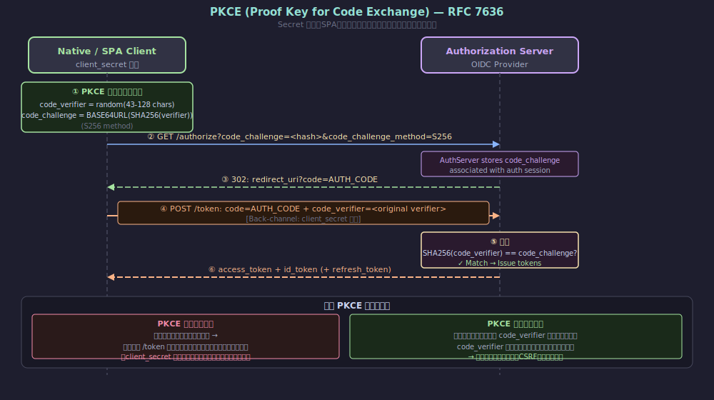

<!--
PKCEはRFC 7636で定義。client_secretを使わないパブリッククライアントでの認可コードフローを安全にします。
-->

---

# プロトコルフロー比較サマリー

- <svg viewBox="0 0 800 400" style="max-height:70vh;max-width:100%;display:block;margin:0 auto;" xmlns="http://www.w3.org/2000/svg">
<rect width="800" height="400" fill="#1a1a2e"/>
<text x="400" y="32" text-anchor="middle" fill="#ffffff" font-size="17" font-weight="bold" font-family="sans-serif">プロトコルフロー比較サマリー</text>
<rect x="20" y="55" width="370" height="320" rx="10" fill="#16213e" stroke="#f9a825" stroke-width="2"/>
<rect x="410" y="55" width="370" height="320" rx="10" fill="#16213e" stroke="#e91e63" stroke-width="2"/>
<text x="205" y="82" text-anchor="middle" fill="#f9a825" font-size="15" font-weight="bold" font-family="sans-serif">SAML</text>
<text x="595" y="82" text-anchor="middle" fill="#e91e63" font-size="15" font-weight="bold" font-family="sans-serif">OIDC</text>
<text x="40" y="115" fill="#ffffff" font-size="13" font-family="sans-serif">トークン形式: XML Assertion</text>
<text x="40" y="145" fill="#ffffff" font-size="13" font-family="sans-serif">転送方式: HTTPリダイレクト/POST</text>
<text x="40" y="175" fill="#ffffff" font-size="13" font-family="sans-serif">署名: XML Signature (XSD)</text>
<text x="40" y="205" fill="#ffffff" font-size="13" font-family="sans-serif">エンドポイント: IdP SSO URL</text>
<text x="40" y="235" fill="#ffffff" font-size="13" font-family="sans-serif">セッション: SP セッションCookie</text>
<text x="40" y="275" fill="#f9a825" font-size="12" font-family="sans-serif">長所: 成熟・エンプラ実績多数</text>
<text x="40" y="300" fill="#e91e63" font-size="12" font-family="sans-serif">短所: XMLサイズ大・実装複雑</text>
<text x="430" y="115" fill="#ffffff" font-size="13" font-family="sans-serif">トークン形式: JWT</text>
<text x="430" y="145" fill="#ffffff" font-size="13" font-family="sans-serif">転送方式: HTTP/API呼び出し</text>
<text x="430" y="175" fill="#ffffff" font-size="13" font-family="sans-serif">署名: JWS (RS256/ES256)</text>
<text x="430" y="205" fill="#ffffff" font-size="13" font-family="sans-serif">エンドポイント: 複数(auth/token)</text>
<text x="430" y="235" fill="#ffffff" font-size="13" font-family="sans-serif">セッション: トークン自己完結</text>
<text x="430" y="275" fill="#e91e63" font-size="12" font-family="sans-serif">長所: 軽量・REST API親和性高</text>
<text x="430" y="300" fill="#f9a825" font-size="12" font-family="sans-serif">短所: Token管理の責任</text>
<text x="40" y="350" fill="#ffffff" font-size="12" font-family="sans-serif">用途: 企業内 / B2B SSO</text>
<text x="430" y="350" fill="#ffffff" font-size="12" font-family="sans-serif">用途: Web / モバイル / API</text>
</svg>
| 観点 | SAML SP-Initiated | OIDC Auth Code + PKCE |
|------|-------------------|----------------------|
| 仲介 | ブラウザ (必須) | ブラウザ + バックチャンネル |
| トークン形式 | XML (Base64 POST) | JWT (JSON) |
| CSRF 対策 | RelayState | state + PKCE |
| リプレイ対策 | Conditions/InResponseTo | nonce + exp |
| バックチャンネル通信 | なし | あり (安全) |
| モバイル対応 | ✗ 困難 | ✓ PKCE で対応 |


---

<!-- _class: lead -->
# Part 3: トークン・アサーション構造

- SAML Assertion の XML 構造
- JWT ID Token の 3 部構成
- Access Token vs ID Token の役割分離


---

# SAML Assertion の構造

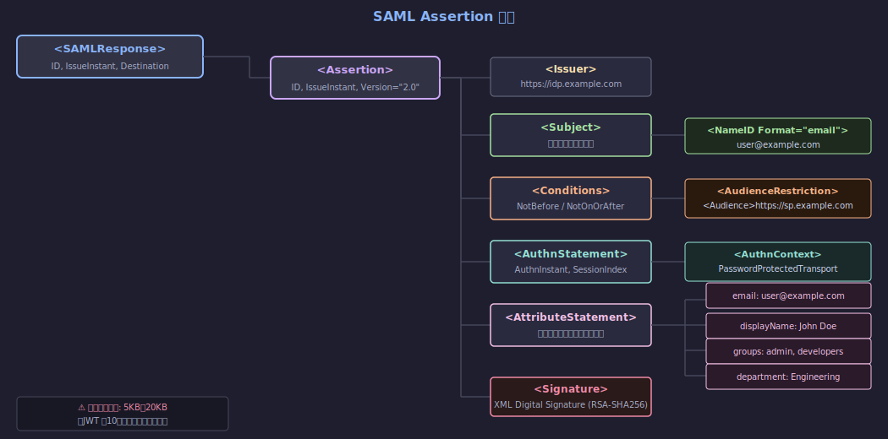

<!--
SAML AssertionはXMLで構成されます。Issuer, Subject, Conditions, AuthnStatement, AttributeStatementが主要要素です。
-->

---

# SAML Assertion — XML サンプル

- 署名付き Assertion の実際の XML 構造を確認する


---

# SAML Assertion — XML サンプル（コード例）

```xml
<saml:Assertion xmlns:saml="urn:oasis:names:tc:SAML:2.0:assertion"
  ID="_abc123" IssueInstant="2026-02-19T12:00:00Z" Version="2.0">
  <saml:Issuer>https://idp.example.com</saml:Issuer>
  <saml:Subject>
    <saml:NameID Format="urn:oasis:names:tc:SAML:1.1:nameid-format:emailAddress">
      user@example.com
    </saml:NameID>
    <saml:SubjectConfirmation Method="...bearer">
      <saml:SubjectConfirmationData
        NotOnOrAfter="2026-02-19T12:05:00Z"
        Recipient="https://sp.example.com/acs"/>
    </saml:SubjectConfirmation>
  </saml:Subject>
  <saml:Conditions NotBefore="..." NotOnOrAfter="...">
    <saml:AudienceRestriction>
      <saml:Audience>https://sp.example.com</saml:Audience>
    </saml:AudienceRestriction>
  </saml:Conditions>
  <saml:AttributeStatement>
    <saml:Attribute Name="email"><saml:AttributeValue>user@example.com</saml:AttributeValue></saml:Attribute>
    <saml:Attribute Name="groups"><saml:AttributeValue>admin</saml:AttributeValue></saml:Attribute>
  </saml:AttributeStatement>
  <ds:Signature><!-- RSA-SHA256 デジタル署名 --></ds:Signature>
</saml:Assertion>
```


---

# JWT ID Token の構造

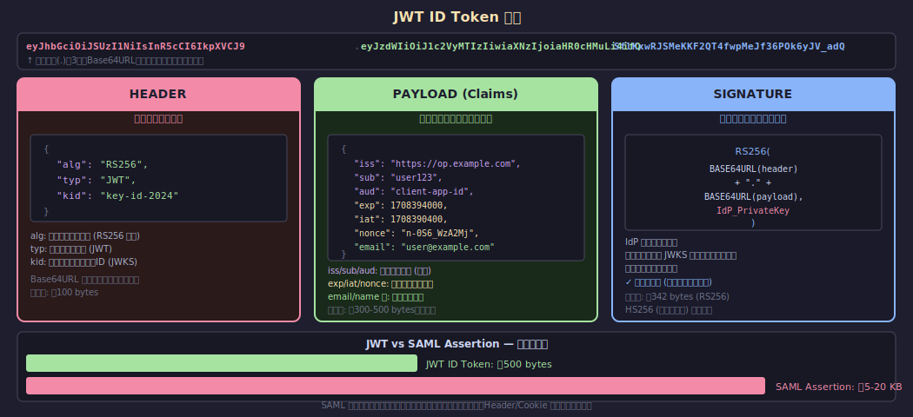

<!--
JWTは3つのBase64URLエンコードされたパーツをピリオドで結合。ヘッダー・ペイロード・署名。
-->

---

# ID Token の標準クレーム (OIDC Core 仕様)

| クレーム | 必須 | 説明 |
|---------|------|------|
| `iss` | ✓ | 発行者 URL (https://op.example.com) |
| `sub` | ✓ | ユーザー識別子 (不変・プロバイダー固有) |
| `aud` | ✓ | 対象クライアント (client_id) |
| `exp` | ✓ | 有効期限 (Unix timestamp) |
| `iat` | ✓ | 発行時刻 |
| `nonce` | 条件付 | リプレイ攻撃防止 (リクエスト時に送った値) |
| `email` `name` `picture` | オプション | scope に応じて含まれる |


---

# Access Token vs ID Token — 役割の分離

- <svg viewBox="0 0 800 400" style="max-height:70vh;max-width:100%;display:block;margin:0 auto;" xmlns="http://www.w3.org/2000/svg">
<rect width="800" height="400" fill="#1a1a2e"/>
<text x="400" y="30" text-anchor="middle" fill="#ffffff" font-size="16" font-weight="bold" font-family="sans-serif">Access Token vs ID Token — 役割の分離</text>
<rect x="30" y="55" width="340" height="310" rx="12" fill="#16213e" stroke="#e91e63" stroke-width="2"/>
<rect x="430" y="55" width="340" height="310" rx="12" fill="#16213e" stroke="#f9a825" stroke-width="2"/>
<text x="200" y="82" text-anchor="middle" fill="#e91e63" font-size="15" font-weight="bold" font-family="sans-serif">Access Token</text>
<text x="600" y="82" text-anchor="middle" fill="#f9a825" font-size="15" font-weight="bold" font-family="sans-serif">ID Token</text>
<text x="200" y="108" text-anchor="middle" fill="#ffffff" font-size="12" font-family="sans-serif">目的: リソースへの認可</text>
<text x="600" y="108" text-anchor="middle" fill="#ffffff" font-size="12" font-family="sans-serif">目的: ユーザー認証の証明</text>
<text x="200" y="140" text-anchor="middle" fill="#ffffff" font-size="12" font-family="sans-serif">読み手: Resource Server</text>
<text x="600" y="140" text-anchor="middle" fill="#ffffff" font-size="12" font-family="sans-serif">読み手: Client (RP)</text>
<text x="200" y="172" text-anchor="middle" fill="#ffffff" font-size="12" font-family="sans-serif">含む情報: scope / aud</text>
<text x="600" y="172" text-anchor="middle" fill="#ffffff" font-size="12" font-family="sans-serif">含む情報: sub / email / name</text>
<text x="200" y="204" text-anchor="middle" fill="#ffffff" font-size="12" font-family="sans-serif">有効期限: 短命 (1時間等)</text>
<text x="600" y="204" text-anchor="middle" fill="#ffffff" font-size="12" font-family="sans-serif">有効期限: 短命 (数分〜1時間)</text>
<text x="200" y="236" text-anchor="middle" fill="#ffffff" font-size="12" font-family="sans-serif">転送先: API サーバー</text>
<text x="600" y="236" text-anchor="middle" fill="#ffffff" font-size="12" font-family="sans-serif">転送先: Client内部のみ</text>
<text x="200" y="268" text-anchor="middle" fill="#e91e63" font-size="12" font-family="sans-serif">APIに Bearer ヘッダーで送信</text>
<text x="600" y="268" text-anchor="middle" fill="#f9a825" font-size="12" font-family="sans-serif">APIには送信しない!</text>
<rect x="50" y="290" width="300" height="55" rx="6" fill="#1a1a2e" stroke="#e91e63" stroke-width="1.5"/>
<text x="200" y="310" text-anchor="middle" fill="#ffffff" font-size="11" font-family="sans-serif">Authorization: Bearer &lt;access_token&gt;</text>
<text x="200" y="330" text-anchor="middle" fill="#e91e63" font-size="11" font-family="sans-serif">→ リソース操作の権限証明</text>
<rect x="450" y="290" width="300" height="55" rx="6" fill="#1a1a2e" stroke="#f9a825" stroke-width="1.5"/>
<text x="600" y="310" text-anchor="middle" fill="#ffffff" font-size="11" font-family="sans-serif">JWT検証 → ユーザーセッション確立</text>
<text x="600" y="330" text-anchor="middle" fill="#f9a825" font-size="11" font-family="sans-serif">→ 「誰がログインしているか」確認</text>
</svg>
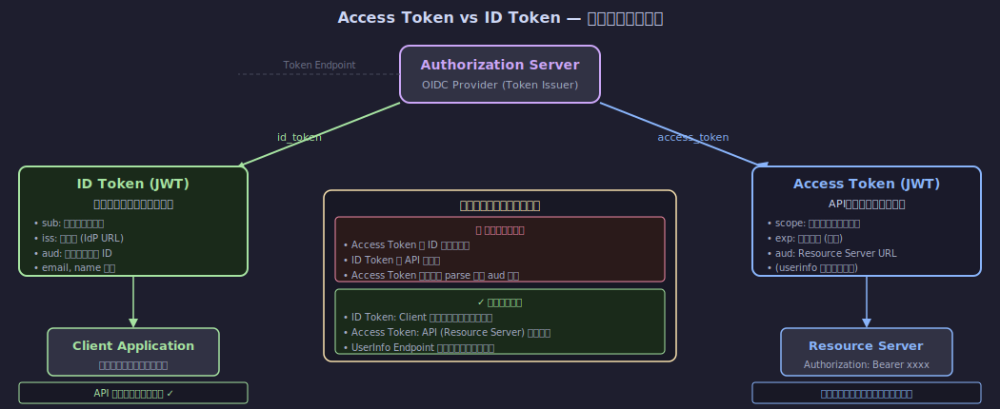

<!--
ID TokenはClientがユーザー認証確認のために使うもの。Access TokenはResource Serverへの認可証明。混乱しやすいポイントです。
-->

---

# SAML Assertion vs JWT ID Token — 属性比較

- <svg viewBox="0 0 800 400" style="max-height:70vh;max-width:100%;display:block;margin:0 auto;" xmlns="http://www.w3.org/2000/svg">
<rect width="800" height="400" fill="#1a1a2e"/>
<text x="400" y="32" text-anchor="middle" fill="#ffffff" font-size="16" font-weight="bold" font-family="sans-serif">SAML Assertion vs JWT ID Token — 属性比較</text>
<rect x="20" y="55" width="370" height="310" rx="10" fill="#16213e" stroke="#f9a825" stroke-width="2"/>
<rect x="410" y="55" width="370" height="310" rx="10" fill="#16213e" stroke="#e91e63" stroke-width="2"/>
<text x="205" y="80" text-anchor="middle" fill="#f9a825" font-size="14" font-weight="bold" font-family="sans-serif">SAML Assertion</text>
<text x="595" y="80" text-anchor="middle" fill="#e91e63" font-size="14" font-weight="bold" font-family="sans-serif">JWT ID Token</text>
<text x="40" y="115" fill="#ffffff" font-size="12" font-family="sans-serif">形式: XML (署名済み)</text>
<text x="40" y="145" fill="#ffffff" font-size="12" font-family="sans-serif">サイズ: 2-10KB (通常)</text>
<text x="40" y="175" fill="#ffffff" font-size="12" font-family="sans-serif">主体識別子: NameID</text>
<text x="40" y="205" fill="#ffffff" font-size="12" font-family="sans-serif">属性: AttributeStatement</text>
<text x="40" y="235" fill="#ffffff" font-size="12" font-family="sans-serif">有効期限: Conditions/@NotOnOrAfter</text>
<text x="40" y="265" fill="#ffffff" font-size="12" font-family="sans-serif">発行者: Issuer 要素</text>
<text x="40" y="295" fill="#ffffff" font-size="12" font-family="sans-serif">署名: xmldsig (XSD)</text>
<text x="40" y="340" fill="#f9a825" font-size="12" font-family="sans-serif">→ エンプラ標準・複雑だが実績</text>
<text x="430" y="115" fill="#ffffff" font-size="12" font-family="sans-serif">形式: JSON (Base64url署名)</text>
<text x="430" y="145" fill="#ffffff" font-size="12" font-family="sans-serif">サイズ: 200-500B (通常)</text>
<text x="430" y="175" fill="#ffffff" font-size="12" font-family="sans-serif">主体識別子: sub クレーム</text>
<text x="430" y="205" fill="#ffffff" font-size="12" font-family="sans-serif">属性: 任意の JSON クレーム</text>
<text x="430" y="235" fill="#ffffff" font-size="12" font-family="sans-serif">有効期限: exp クレーム (UNIX)</text>
<text x="430" y="265" fill="#ffffff" font-size="12" font-family="sans-serif">発行者: iss クレーム</text>
<text x="430" y="295" fill="#ffffff" font-size="12" font-family="sans-serif">署名: JWS (RS256/ES256)</text>
<text x="430" y="340" fill="#e91e63" font-size="12" font-family="sans-serif">→ 軽量・モバイル/API対応</text>
</svg>
| 比較項目 | SAML Assertion | JWT ID Token |
|---------|----------------|--------------|
| **形式** | XML (署名付き) | JSON (Base64URL) |
| **典型サイズ** | 5〜20 KB | 300〜1000 bytes |
| **署名** | XML Digital Signature | RS256 / ES256 |
| **有効期限** | Conditions NotOnOrAfter | `exp` クレーム |
| **対象者** | AudienceRestriction | `aud` クレーム |
| **ユーザー識別** | NameID (Format 指定) | `sub` (不変) |
| **属性** | AttributeStatement (柔軟) | Claims (標準化) |


---

# クレームマッピング: IdP → SP 属性変換

- IdP の属性名と SP が期待する属性名が異なる場合のマッピング設定例


---

# クレームマッピング: IdP → SP 属性変換（コード例）

```yaml
# Okta / Azure AD での SAML 属性マッピング設定例
saml_attributes:
  - name: "http://schemas.xmlsoap.org/ws/2005/05/identity/claims/emailaddress"
    value: "user.email"        # IdP フィールド名
    # SP では 'email' として受け取りたい場合、SP 側でも変換設定

# OIDC スコープとクレームのマッピング例 (Keycloak)
oidc_scope_mappings:
  openid:
    - sub
  profile:
    - name, given_name, family_name, picture
  email:
    - email, email_verified
  # カスタムスコープ
  roles:
    - realm_roles, resource_access

# JWT クレームでのグループ情報例
{
  "sub": "user123",
  "email": "user@example.com",
  "groups": ["admin", "developers"],
  "custom:department": "Engineering"
}
```


---

<!-- _class: lead -->
# Part 4: ユースケース別選択基準

- エンタープライズ SSO / モバイル・SPA
- B2B フェデレーション / API 認可
- マルチプロトコル構成と選択フローチャート


---

# エンタープライズ SSO — SAML が適切な理由

- <svg viewBox="0 0 800 400" style="max-height:70vh;max-width:100%;display:block;margin:0 auto;" xmlns="http://www.w3.org/2000/svg">
<rect width="800" height="400" fill="#1a1a2e"/>
<text x="400" y="28" text-anchor="middle" fill="#ffffff" font-size="15" font-weight="bold" font-family="sans-serif">エンタープライズ SSO — SAML が適切な理由</text>
<rect x="30" y="55" width="230" height="280" rx="10" fill="#16213e" stroke="#f9a825" stroke-width="2"/>
<rect x="540" y="55" width="230" height="280" rx="10" fill="#16213e" stroke="#e91e63" stroke-width="2"/>
<text x="145" y="80" text-anchor="middle" fill="#f9a825" font-size="13" font-weight="bold" font-family="sans-serif">企業 IdP (ADFS等)</text>
<text x="655" y="80" text-anchor="middle" fill="#e91e63" font-size="13" font-weight="bold" font-family="sans-serif">業務システム群 (SP)</text>
<text x="145" y="115" text-anchor="middle" fill="#ffffff" font-size="12" font-family="sans-serif">Active Directory</text>
<text x="145" y="140" text-anchor="middle" fill="#ffffff" font-size="12" font-family="sans-serif">LDAP / Kerberos</text>
<text x="145" y="165" text-anchor="middle" fill="#ffffff" font-size="12" font-family="sans-serif">証明書管理</text>
<text x="145" y="200" text-anchor="middle" fill="#f9a825" font-size="12" font-family="sans-serif">一度認証すれば</text>
<text x="145" y="220" text-anchor="middle" fill="#f9a825" font-size="12" font-family="sans-serif">全SP自動ログイン</text>
<text x="655" y="115" text-anchor="middle" fill="#ffffff" font-size="12" font-family="sans-serif">Salesforce</text>
<text x="655" y="140" text-anchor="middle" fill="#ffffff" font-size="12" font-family="sans-serif">ServiceNow</text>
<text x="655" y="165" text-anchor="middle" fill="#ffffff" font-size="12" font-family="sans-serif">Workday / SAP</text>
<text x="655" y="190" text-anchor="middle" fill="#ffffff" font-size="12" font-family="sans-serif">社内ポータル</text>
<text x="655" y="220" text-anchor="middle" fill="#e91e63" font-size="12" font-family="sans-serif">SAML対応必須</text>
<line x1="260" y1="190" x2="540" y2="190" stroke="#f9a825" stroke-width="2.5"/>
<polygon points="540,190 527,183 527,197" fill="#f9a825"/>
<text x="400" y="180" text-anchor="middle" fill="#ffffff" font-size="12" font-family="sans-serif">SAML Assertion</text>
<text x="400" y="215" text-anchor="middle" fill="#ffffff" font-size="11" font-family="sans-serif">XML + 署名付き属性</text>
<text x="400" y="270" text-anchor="middle" fill="#ffffff" font-size="12" font-family="sans-serif">SAML採用理由:</text>
<text x="400" y="295" text-anchor="middle" fill="#ffffff" font-size="11" font-family="sans-serif">• 既存AD/LDAPとの統合が容易</text>
<text x="400" y="318" text-anchor="middle" fill="#ffffff" font-size="11" font-family="sans-serif">• 主要 SaaS が標準サポート</text>
</svg>
- **Active Directory / ADFS との深い統合:** Kerberos→SAML変換が成熟
- **ベンダーサポートの幅広さ:** Salesforce, SAP, ServiceNow, Workday は SAML が標準
- **Windows 統合認証 (WIA):** イントラネット環境では Kerberos→SAML のシームレス SSO
- **組織内ポリシーの伝達:** Group/Role 情報を Attribute Statement で SP に渡せる
- **成熟した実装:** 20年以上の実績。脆弱性と対策が出揃っている
- **判断基準:** 既存 AD + エンタープライズ SaaS の SSO が主目的 → SAML を維持


---

# モバイル・SPA — OIDC が適切な理由

- **SAML の根本的問題:** XML HTML フォームの POST はネイティブアプリで扱えない
- **PKCE による安全な認可:** client_secret 不要でパブリッククライアントに対応
- **カスタムスキーム:** `myapp://callback` で Auth Code をアプリが受け取れる
- **JWT の軽量さ:** ネットワーク帯域・解析コスト共に有利（モバイル回線考慮）
- **SDKライブラリの充実:** AppAuth (iOS/Android), MSAL, Auth0 SDK 等が完備
- **判断基準:** iOS・Android アプリや React/Vue SPA → OIDC + PKCE 一択


---

# B2B フェデレーション — 状況に応じた選択

- **エンタープライズ B2B:** 相手企業が SAML IdP (AD/ADFS) を持つ → SAML
- **クラウドネイティブ B2B:** 相手が Okta / Auth0 等 → OIDC が増えてきた
- **実用的アプローチ:** マルチプロトコル対応 IdP を使い、相手に合わせる
- **AWS IAM Identity Center:** SAML 2.0 + OIDC 両対応。外部 IdP と連携
- **Google Workspace / Azure AD:** 外部 SAML フェデレーション、OIDC フェデレーション両対応
- **判断基準:** 相手先のシステム制約に合わせる。自社 IdP はマルチプロトコル対応を


---

# マルチプロトコル対応 IdP 構成

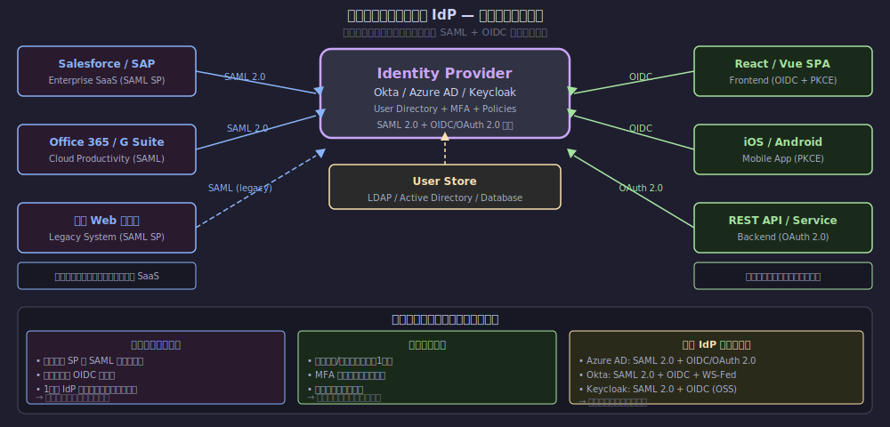

<!--
エンタープライズ移行期の現実解です。1つのIdPでSAMLとOIDCを両対応し、段階的に移行します。
-->

---

# ユースケース別選択マトリクス

- <svg viewBox="0 0 800 400" style="max-height:70vh;max-width:100%;display:block;margin:0 auto;" xmlns="http://www.w3.org/2000/svg">
<rect width="800" height="400" fill="#1a1a2e"/>
<text x="400" y="30" text-anchor="middle" fill="#ffffff" font-size="16" font-weight="bold" font-family="sans-serif">ユースケース別選択マトリクス</text>
<rect x="30" y="50" width="740" height="45" rx="6" fill="#f9a825" opacity="0.2"/>
<text x="155" y="79" text-anchor="middle" fill="#f9a825" font-size="13" font-weight="bold" font-family="sans-serif">ユースケース</text>
<text x="370" y="79" text-anchor="middle" fill="#f9a825" font-size="13" font-weight="bold" font-family="sans-serif">SAML</text>
<text x="530" y="79" text-anchor="middle" fill="#f9a825" font-size="13" font-weight="bold" font-family="sans-serif">OIDC</text>
<text x="700" y="79" text-anchor="middle" fill="#f9a825" font-size="13" font-weight="bold" font-family="sans-serif">推奨</text>
<text x="155" y="120" text-anchor="middle" fill="#ffffff" font-size="12" font-family="sans-serif">企業内 SSO</text>
<text x="370" y="120" text-anchor="middle" fill="#4caf50" font-size="16" font-family="sans-serif">✓</text>
<text x="530" y="120" text-anchor="middle" fill="#4caf50" font-size="16" font-family="sans-serif">✓</text>
<text x="700" y="120" text-anchor="middle" fill="#f9a825" font-size="12" font-family="sans-serif">SAML優先</text>
<text x="155" y="157" text-anchor="middle" fill="#ffffff" font-size="12" font-family="sans-serif">モバイル/SPA アプリ</text>
<text x="370" y="157" text-anchor="middle" fill="#e91e63" font-size="16" font-family="sans-serif">✗</text>
<text x="530" y="157" text-anchor="middle" fill="#4caf50" font-size="16" font-family="sans-serif">✓</text>
<text x="700" y="157" text-anchor="middle" fill="#e91e63" font-size="12" font-family="sans-serif">OIDC必須</text>
<text x="155" y="194" text-anchor="middle" fill="#ffffff" font-size="12" font-family="sans-serif">B2B フェデレーション</text>
<text x="370" y="194" text-anchor="middle" fill="#4caf50" font-size="16" font-family="sans-serif">✓</text>
<text x="530" y="194" text-anchor="middle" fill="#4caf50" font-size="16" font-family="sans-serif">✓</text>
<text x="700" y="194" text-anchor="middle" fill="#ffffff" font-size="12" font-family="sans-serif">相手次第</text>
<text x="155" y="231" text-anchor="middle" fill="#ffffff" font-size="12" font-family="sans-serif">API 認可</text>
<text x="370" y="231" text-anchor="middle" fill="#e91e63" font-size="16" font-family="sans-serif">✗</text>
<text x="530" y="231" text-anchor="middle" fill="#4caf50" font-size="16" font-family="sans-serif">✓</text>
<text x="700" y="231" text-anchor="middle" fill="#e91e63" font-size="12" font-family="sans-serif">OIDC必須</text>
<text x="155" y="268" text-anchor="middle" fill="#ffffff" font-size="12" font-family="sans-serif">レガシー連携</text>
<text x="370" y="268" text-anchor="middle" fill="#4caf50" font-size="16" font-family="sans-serif">✓</text>
<text x="530" y="268" text-anchor="middle" fill="#e91e63" font-size="16" font-family="sans-serif">△</text>
<text x="700" y="268" text-anchor="middle" fill="#f9a825" font-size="12" font-family="sans-serif">SAML優先</text>
<text x="155" y="305" text-anchor="middle" fill="#ffffff" font-size="12" font-family="sans-serif">新規 Web サービス</text>
<text x="370" y="305" text-anchor="middle" fill="#e91e63" font-size="16" font-family="sans-serif">△</text>
<text x="530" y="305" text-anchor="middle" fill="#4caf50" font-size="16" font-family="sans-serif">✓</text>
<text x="700" y="305" text-anchor="middle" fill="#e91e63" font-size="12" font-family="sans-serif">OIDC推奨</text>
<line x1="30" y1="100" x2="770" y2="100" stroke="#ffffff" stroke-width="0.5" opacity="0.3"/>
<line x1="30" y1="137" x2="770" y2="137" stroke="#ffffff" stroke-width="0.5" opacity="0.3"/>
<line x1="30" y1="174" x2="770" y2="174" stroke="#ffffff" stroke-width="0.5" opacity="0.3"/>
<line x1="30" y1="211" x2="770" y2="211" stroke="#ffffff" stroke-width="0.5" opacity="0.3"/>
<line x1="30" y1="248" x2="770" y2="248" stroke="#ffffff" stroke-width="0.5" opacity="0.3"/>
<line x1="30" y1="285" x2="770" y2="285" stroke="#ffffff" stroke-width="0.5" opacity="0.3"/>
<line x1="280" y1="50" x2="280" y2="320" stroke="#ffffff" stroke-width="0.5" opacity="0.3"/>
<line x1="460" y1="50" x2="460" y2="320" stroke="#ffffff" stroke-width="0.5" opacity="0.3"/>
<line x1="620" y1="50" x2="620" y2="320" stroke="#ffffff" stroke-width="0.5" opacity="0.3"/>
</svg>
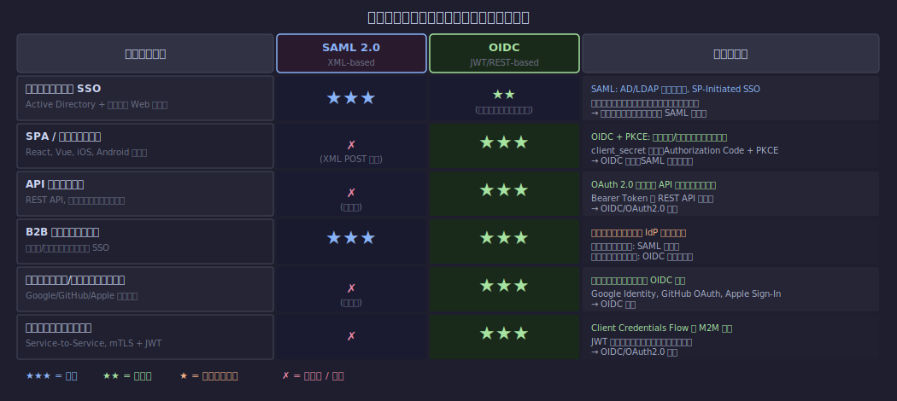

<!--
各ユースケースでの推奨度をまとめた表です。新規開発はほぼOIDC一択、エンタープライズSSOはSAML優位です。
-->

---

# Decision Flowchart: どちらを選ぶか

- <svg viewBox="0 0 800 400" style="max-height:70vh;max-width:100%;display:block;margin:0 auto;" xmlns="http://www.w3.org/2000/svg">
<rect width="800" height="400" fill="#1a1a2e"/>
<text x="400" y="28" text-anchor="middle" fill="#ffffff" font-size="15" font-weight="bold" font-family="sans-serif">Decision Flowchart: どちらを選ぶか</text>
<rect x="300" y="40" width="200" height="45" rx="8" fill="#16213e" stroke="#ffffff" stroke-width="2"/>
<text x="400" y="68" text-anchor="middle" fill="#ffffff" font-size="13" font-family="sans-serif">新しいシステム？</text>
<line x1="400" y1="85" x2="400" y2="110" stroke="#ffffff" stroke-width="1.5"/>
<polygon points="400,110 394,98 406,98" fill="#ffffff"/>
<rect x="130" y="115" width="160" height="45" rx="8" fill="#16213e" stroke="#e91e63" stroke-width="2"/>
<text x="210" y="143" text-anchor="middle" fill="#e91e63" font-size="13" font-family="sans-serif">モバイル/SPA?</text>
<rect x="510" y="115" width="160" height="45" rx="8" fill="#16213e" stroke="#f9a825" stroke-width="2"/>
<text x="590" y="143" text-anchor="middle" fill="#f9a825" font-size="13" font-family="sans-serif">既存SAML統合?</text>
<line x1="340" y1="130" x2="290" y2="138" stroke="#ffffff" stroke-width="1.5"/>
<text x="305" y="128" fill="#4caf50" font-size="11" font-family="sans-serif">YES</text>
<line x1="460" y1="130" x2="510" y2="138" stroke="#ffffff" stroke-width="1.5"/>
<text x="470" y="128" fill="#e91e63" font-size="11" font-family="sans-serif">NO</text>
<line x1="210" y1="160" x2="210" y2="200" stroke="#ffffff" stroke-width="1.5"/>
<polygon points="210,200 204,188 216,188" fill="#ffffff"/>
<rect x="120" y="205" width="180" height="45" rx="8" fill="#e91e63" opacity="0.8"/>
<text x="210" y="233" text-anchor="middle" fill="#ffffff" font-size="14" font-weight="bold" font-family="sans-serif">OIDC + PKCE</text>
<line x1="590" y1="160" x2="590" y2="200" stroke="#ffffff" stroke-width="1.5"/>
<polygon points="590,200 584,188 596,188" fill="#ffffff"/>
<rect x="120" y="310" width="180" height="45" rx="8" fill="#f9a825" opacity="0.8"/>
<text x="210" y="338" text-anchor="middle" fill="#ffffff" font-size="14" font-weight="bold" font-family="sans-serif">SAML 2.0</text>
<rect x="490" y="205" width="200" height="45" rx="8" fill="#16213e" stroke="#4caf50" stroke-width="2"/>
<text x="590" y="233" text-anchor="middle" fill="#4caf50" font-size="13" font-family="sans-serif">エンプラB2B連携?</text>
<line x1="490" y1="228" x2="300" y2="228" stroke="#4caf50" stroke-width="1.5"/>
<polygon points="300,228 312,222 312,234" fill="#4caf50"/>
<text x="395" y="220" fill="#4caf50" font-size="11" font-family="sans-serif">YES→SAML</text>
<line x1="590" y1="250" x2="590" y2="310" stroke="#ffffff" stroke-width="1.5"/>
<polygon points="590,310 584,298 596,298" fill="#ffffff"/>
<rect x="490" y="315" width="200" height="45" rx="8" fill="#e91e63" opacity="0.8"/>
<text x="590" y="343" text-anchor="middle" fill="#ffffff" font-size="14" font-weight="bold" font-family="sans-serif">OIDC 推奨</text>
</svg>
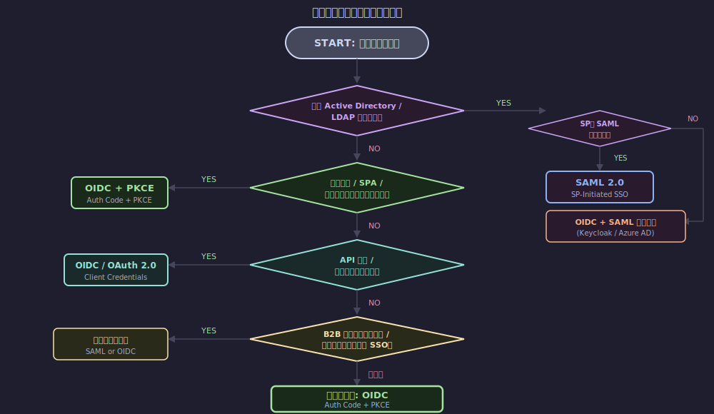

<!--
迷ったときはこのフローチャートを使ってください。基本的に新規プロジェクトはOIDCがデフォルトです。
-->

---

<!-- _class: lead -->
# Part 5: セキュリティ考慮事項

- SAML の主要脆弱性 (XSW, リプレイ攻撃)
- OIDC の主要脆弱性 (不正リダイレクト, Token Leakage)
- セキュリティ対策チェックリスト


---

# SAML 脆弱性 #1: XML Signature Wrapping (XSW)

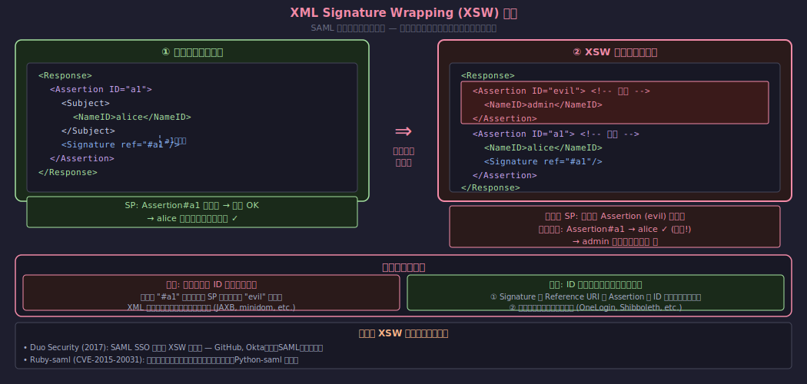

<!--
XSWはSAMLの最も深刻な脆弱性。署名は有効でも別の要素が処理される。検証済みライブラリの使用が必須。
-->

---

# SAML 脆弱性 #2 — その他のリスク（1/2）

- **XML インジェクション:** XML メタキャラクタを含む属性値でパーサーを混乱
-   → 対策: 属性値のエスケープ、strict な XML パーサー設定
- **リプレイ攻撃:** 有効期限内の SAMLResponse を再送して不正アクセス
-   → 対策: InResponseTo / AssertionID のキャッシュで重複検出


---

# SAML 脆弱性 #2 — その他のリスク（2/2）

- **オープンリダイレクト:** RelayState を検証しない場合に任意 URL へリダイレクト
-   → 対策: RelayState はホワイトリスト or 相対 URL のみ許可
- **中間者攻撃:** TLS を使わない場合の SAMLResponse 傍受・改ざん
-   → 対策: 全通信 HTTPS 必須、SP でアサーション署名を必須化


---

# OIDC 脆弱性 #1: リダイレクト URI 攻撃（1/2）

- **不正 redirect_uri:** 登録外のURIに Auth Code / Token がリダイレクトされる
-   → 対策: redirect_uri を完全一致で事前登録。ワイルドカード禁止
- **オープンリダイレクタ利用:** 正規ドメインのリダイレクタ経由で外部へ誘導
-   → 対策: redirect_uri は完全 URL で登録。動的登録には注意


---

# OIDC 脆弱性 #1: リダイレクト URI 攻撃（2/2）

- **CSRF 攻撃 (state 未検証):** state パラメータ検証なしで認可コードを送信
-   → 対策: state は必ず生成・検証。セッション/Cookie に保存して照合
- **Code Injection (Implicit Flow):** URL フラグメントのトークンが Referer 漏洩
-   → 対策: Implicit Flow は廃止。Auth Code + PKCE を使用


---

# OIDC 脆弱性 #2: Token Leakage と実装ミス（1/2）

- **Access Token のログ記録:** Bearer Token がアクセスログに残る
-   → 対策: Authorization ヘッダーはログから除外。短命トークン使用
- **`alg: none` 攻撃:** JWT の署名アルゴリズムに none を指定し検証スキップ
-   → 対策: alg を明示的に RS256/ES256 に限定。none を拒否


---

# OIDC 脆弱性 #2: Token Leakage と実装ミス（2/2）

- **HS256 共有鍵の漏洩:** 対称鍵が漏洩すると全トークン偽造可能
-   → 対策: RS256 (公開鍵暗号) を推奨。HS256 はマイクロサービス内部のみ
- **nonce 未検証:** リプレイ攻撃防止の nonce をクライアントが確認しない
-   → 対策: nonce は必ずセッションに保存し ID Token クレームと照合


---

# セキュリティ対策比較チェックリスト

- <svg viewBox="0 0 800 400" style="max-height:70vh;max-width:100%;display:block;margin:0 auto;" xmlns="http://www.w3.org/2000/svg">
<rect width="800" height="400" fill="#1a1a2e"/>
<text x="400" y="30" text-anchor="middle" fill="#ffffff" font-size="15" font-weight="bold" font-family="sans-serif">セキュリティ対策比較チェックリスト</text>
<rect x="20" y="50" width="370" height="330" rx="10" fill="#16213e" stroke="#f9a825" stroke-width="2"/>
<rect x="410" y="50" width="370" height="330" rx="10" fill="#16213e" stroke="#e91e63" stroke-width="2"/>
<text x="205" y="77" text-anchor="middle" fill="#f9a825" font-size="14" font-weight="bold" font-family="sans-serif">SAML 対策</text>
<text x="595" y="77" text-anchor="middle" fill="#e91e63" font-size="14" font-weight="bold" font-family="sans-serif">OIDC 対策</text>
<text x="35" y="112" fill="#4caf50" font-size="13" font-family="sans-serif">✓</text>
<text x="55" y="112" fill="#ffffff" font-size="12" font-family="sans-serif">XMLデジタル署名検証</text>
<text x="35" y="142" fill="#4caf50" font-size="13" font-family="sans-serif">✓</text>
<text x="55" y="142" fill="#ffffff" font-size="12" font-family="sans-serif">XSW攻撃対策</text>
<text x="35" y="172" fill="#4caf50" font-size="13" font-family="sans-serif">✓</text>
<text x="55" y="172" fill="#ffffff" font-size="12" font-family="sans-serif">InResponseTo検証</text>
<text x="35" y="202" fill="#4caf50" font-size="13" font-family="sans-serif">✓</text>
<text x="55" y="202" fill="#ffffff" font-size="12" font-family="sans-serif">有効期限(Conditions)確認</text>
<text x="35" y="232" fill="#4caf50" font-size="13" font-family="sans-serif">✓</text>
<text x="55" y="232" fill="#ffffff" font-size="12" font-family="sans-serif">Audience Restriction確認</text>
<text x="35" y="262" fill="#4caf50" font-size="13" font-family="sans-serif">✓</text>
<text x="55" y="262" fill="#ffffff" font-size="12" font-family="sans-serif">HTTPS強制 + HSTS</text>
<text x="35" y="292" fill="#4caf50" font-size="13" font-family="sans-serif">✓</text>
<text x="55" y="292" fill="#ffffff" font-size="12" font-family="sans-serif">署名アルゴリズム: SHA-256+</text>
<text x="425" y="112" fill="#4caf50" font-size="13" font-family="sans-serif">✓</text>
<text x="445" y="112" fill="#ffffff" font-size="12" font-family="sans-serif">JWT署名検証(RS256/ES256)</text>
<text x="425" y="142" fill="#4caf50" font-size="13" font-family="sans-serif">✓</text>
<text x="445" y="142" fill="#ffffff" font-size="12" font-family="sans-serif">PKCE使用 (S256)</text>
<text x="425" y="172" fill="#4caf50" font-size="13" font-family="sans-serif">✓</text>
<text x="445" y="172" fill="#ffffff" font-size="12" font-family="sans-serif">state パラメータ検証</text>
<text x="425" y="202" fill="#4caf50" font-size="13" font-family="sans-serif">✓</text>
<text x="445" y="202" fill="#ffffff" font-size="12" font-family="sans-serif">nonce検証 (リプレイ防止)</text>
<text x="425" y="232" fill="#4caf50" font-size="13" font-family="sans-serif">✓</text>
<text x="445" y="232" fill="#ffffff" font-size="12" font-family="sans-serif">redirect_uri ホワイトリスト</text>
<text x="425" y="262" fill="#4caf50" font-size="13" font-family="sans-serif">✓</text>
<text x="445" y="262" fill="#ffffff" font-size="12" font-family="sans-serif">aud/iss クレーム検証</text>
<text x="425" y="292" fill="#4caf50" font-size="13" font-family="sans-serif">✓</text>
<text x="445" y="292" fill="#ffffff" font-size="12" font-family="sans-serif">短命アクセストークン</text>
<text x="400" y="360" text-anchor="middle" fill="#ffffff" font-size="12" font-family="sans-serif">共通: HTTPS必須 / セキュリティヘッダー / 監査ログ</text>
</svg>
| 脅威 | SAML 対策 | OIDC 対策 |
|------|-----------|-----------|
| リプレイ攻撃 | InResponseTo + AssertionID キャッシュ | nonce + exp 検証 |
| 改ざん | XML Digital Signature 必須化 | RS256 署名 + JWKS 検証 |
| CSRF | RelayState 検証 | state パラメータ検証 |
| 不正リダイレクト | ACS URL ホワイトリスト | redirect_uri 完全一致 |
| 中間者攻撃 | 全通信 TLS 必須 | HTTPS 必須 + HSTS |
| トークン漏洩 | SAMLResponse の短命化 | 短命 Access Token + Refresh Token |


---

# 共通セキュリティ ベストプラクティス

- **実装は必ず検証済みライブラリを使用:** 独自実装は危険（特に SAML の XML 署名）
- **SAML:** OneLogin python-saml / Shibboleth / Spring Security SAML
- **OIDC:** Authlib / Keycloak / Auth0 SDK / Microsoft MSAL
- **定期的な依存ライブラリの更新:** CVE を定期スキャン (Dependabot, Snyk)
- **最小スコープ原則:** 必要最小限の scope / 属性のみ要求
- **ログと監査:** 認証成功/失敗をすべて記録。異常検知アラートを設定


---

<!-- _class: lead -->
# Part 6: 実装・移行ガイド

- 主要 IdP / ライブラリの対応状況
- SAML → OIDC 4 フェーズ移行パターン
- よくある実装ミス Top 5


---

# 主要 IdP・ライブラリ対応状況

| プロダクト | SAML 2.0 | OIDC | 備考 |
|-----------|----------|------|------|
| **Azure AD / Entra ID** | ✓ | ✓ | 両対応。新規は OIDC 推奨 |
| **Okta** | ✓ | ✓ | 両対応。設定 UI が充実 |
| **Keycloak (OSS)** | ✓ | ✓ | 両対応。オンプレ向け |
| **Auth0** | ✓ | ✓ | 両対応。SaaS IdP |
| **AWS IAM Identity Center** | ✓ | ✓ | 外部 IdP との連携 |
| **Google Identity** | — | ✓ | OIDC のみ |
| **GitHub OAuth** | — | ✓ | OAuth 2.0 / OIDC |


---

# SAML → OIDC 移行パターン (4 フェーズ)

- <svg viewBox="0 0 800 400" style="max-height:70vh;max-width:100%;display:block;margin:0 auto;" xmlns="http://www.w3.org/2000/svg">
<rect width="800" height="400" fill="#1a1a2e"/>
<text x="400" y="30" text-anchor="middle" fill="#ffffff" font-size="16" font-weight="bold" font-family="sans-serif">SAML → OIDC 移行パターン (4フェーズ)</text>
<rect x="20" y="60" width="165" height="290" rx="10" fill="#16213e" stroke="#f9a825" stroke-width="2"/>
<rect x="215" y="60" width="165" height="290" rx="10" fill="#16213e" stroke="#e91e63" stroke-width="2"/>
<rect x="410" y="60" width="165" height="290" rx="10" fill="#16213e" stroke="#2196f3" stroke-width="2"/>
<rect x="605" y="60" width="165" height="290" rx="10" fill="#16213e" stroke="#4caf50" stroke-width="2"/>
<text x="102" y="88" text-anchor="middle" fill="#f9a825" font-size="14" font-weight="bold" font-family="sans-serif">Phase 1</text>
<text x="297" y="88" text-anchor="middle" fill="#e91e63" font-size="14" font-weight="bold" font-family="sans-serif">Phase 2</text>
<text x="492" y="88" text-anchor="middle" fill="#2196f3" font-size="14" font-weight="bold" font-family="sans-serif">Phase 3</text>
<text x="687" y="88" text-anchor="middle" fill="#4caf50" font-size="14" font-weight="bold" font-family="sans-serif">Phase 4</text>
<text x="102" y="112" text-anchor="middle" fill="#ffffff" font-size="12" font-family="sans-serif">評価・計画</text>
<text x="297" y="112" text-anchor="middle" fill="#ffffff" font-size="12" font-family="sans-serif">並行運用</text>
<text x="492" y="112" text-anchor="middle" fill="#ffffff" font-size="12" font-family="sans-serif">段階移行</text>
<text x="687" y="112" text-anchor="middle" fill="#ffffff" font-size="12" font-family="sans-serif">SAML廃止</text>
<text x="35" y="150" fill="#ffffff" font-size="11" font-family="sans-serif">• SP一覧作成</text>
<text x="35" y="175" fill="#ffffff" font-size="11" font-family="sans-serif">• OIDC対応確認</text>
<text x="35" y="200" fill="#ffffff" font-size="11" font-family="sans-serif">• IdP選定</text>
<text x="35" y="225" fill="#ffffff" font-size="11" font-family="sans-serif">• ロードマップ</text>
<text x="35" y="250" fill="#ffffff" font-size="11" font-family="sans-serif">• リスク評価</text>
<text x="230" y="150" fill="#ffffff" font-size="11" font-family="sans-serif">• SAML維持</text>
<text x="230" y="175" fill="#ffffff" font-size="11" font-family="sans-serif">• OIDC追加設定</text>
<text x="230" y="200" fill="#ffffff" font-size="11" font-family="sans-serif">• テスト環境検証</text>
<text x="230" y="225" fill="#ffffff" font-size="11" font-family="sans-serif">• クレームマッピング</text>
<text x="230" y="250" fill="#ffffff" font-size="11" font-family="sans-serif">• SP選別</text>
<text x="425" y="150" fill="#ffffff" font-size="11" font-family="sans-serif">• SP毎に切替</text>
<text x="425" y="175" fill="#ffffff" font-size="11" font-family="sans-serif">• ユーザー通知</text>
<text x="425" y="200" fill="#ffffff" font-size="11" font-family="sans-serif">• 動作確認</text>
<text x="425" y="225" fill="#ffffff" font-size="11" font-family="sans-serif">• ロールバック準備</text>
<text x="425" y="250" fill="#ffffff" font-size="11" font-family="sans-serif">• 監視強化</text>
<text x="620" y="150" fill="#ffffff" font-size="11" font-family="sans-serif">• SAML無効化</text>
<text x="620" y="175" fill="#ffffff" font-size="11" font-family="sans-serif">• 証明書破棄</text>
<text x="620" y="200" fill="#ffffff" font-size="11" font-family="sans-serif">• ドキュメント更新</text>
<text x="620" y="225" fill="#ffffff" font-size="11" font-family="sans-serif">• 監査完了</text>
<text x="620" y="250" fill="#ffffff" font-size="11" font-family="sans-serif">• 完全OIDC移行</text>
<line x1="185" y1="205" x2="215" y2="205" stroke="#f9a825" stroke-width="2"/>
<polygon points="215,205 203,199 203,211" fill="#f9a825"/>
<line x1="380" y1="205" x2="410" y2="205" stroke="#e91e63" stroke-width="2"/>
<polygon points="410,205 398,199 398,211" fill="#e91e63"/>
<line x1="575" y1="205" x2="605" y2="205" stroke="#2196f3" stroke-width="2"/>
<polygon points="605,205 593,199 593,211" fill="#2196f3"/>
</svg>
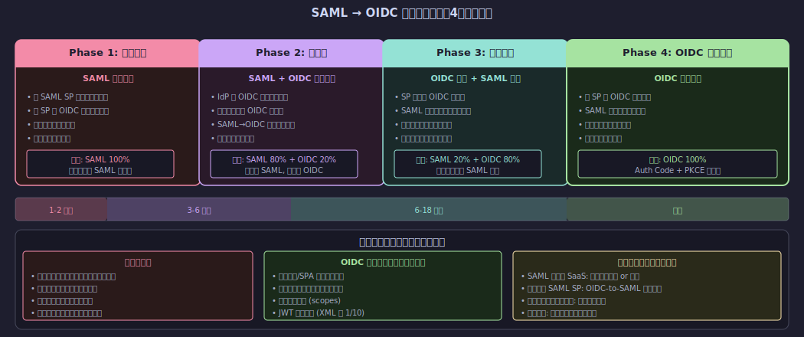

<!--
移行は段階的に。最初に現状把握→並存期→移行実行→完全移行の4フェーズで進めます。ロールバック手順の準備が重要です。
-->

---

# Azure AD / Okta での OIDC 設定例

- 主要 IdP での OIDC アプリ登録と検証コードの例


---

# Azure AD / Okta での OIDC 設定例（コード例）

```python
# Azure AD (MSAL Python) での OIDC 設定
import msal

app = msal.ConfidentialClientApplication(
    client_id="your-client-id",
    client_credential="your-client-secret",
    authority="https://login.microsoftonline.com/tenant-id"
)

# 1. Authorization URL を生成
auth_url = app.get_authorization_request_url(
    scopes=["openid", "profile", "email"],
    redirect_uri="https://app.example.com/callback",
    state="random-csrf-token",
    nonce="random-nonce"
)

# 2. Auth Code → Token 交換
result = app.acquire_token_by_authorization_code(
    code=request.args["code"],
    scopes=["openid", "profile"],
    redirect_uri="https://app.example.com/callback"
)
# result["id_token_claims"] に検証済みクレームが入る
```


---

# よくある実装ミス Top 5（1/2）

- **❌ #1 SAML:** 署名検証をスキップ or 自己実装 → XSW 攻撃の温床
-   ✅ 対策: 検証済みライブラリ使用。署名 + Conditions + Audience を全て確認
- **❌ #2 OIDC:** state / nonce を検証しない → CSRF / リプレイ攻撃に脆弱
-   ✅ 対策: セッションに保存し、コールバック時に必ず照合


---

# よくある実装ミス Top 5（2/2）

- **❌ #3 OIDC:** Access Token を ID として使う → sub クレームで識別すること
-   ✅ 対策: ユーザー識別は ID Token の sub。UserInfo API で補完
- **❌ #4 OIDC:** JWT の alg を未検証 → alg:none 攻撃やアルゴリズム混乱攻撃
-   ✅ 対策: 受け入れ alg を RS256/ES256 に明示的に制限


---

# よくある実装ミス Top 5 (続き)（1/2）

- **❌ #5 共通:** セッション管理と認証を混同 → SLO (Single Logout) の未実装
-   ✅ 対策: SAML SLO / OIDC RP-Initiated Logout を適切に実装
- **その他の注意点:**
- SAML: InResponseTo を検証しないと IdP-Initiated 攻撃に弱い


---

# よくある実装ミス Top 5 (続き)（2/2）

- OIDC: Implicit Flow の使用（廃止済み）→ Auth Code + PKCE へ移行
- OIDC: client_secret をフロントエンドコードに埋め込む → 公開される
- 共通: トークン/アサーションの有効期限を長く設定しすぎる
- 共通: エラーメッセージに認証情報の詳細を含める → 情報漏洩


---

<!-- _class: lead -->
# まとめ

- SAML vs OIDC 総合比較
- 選択ガイド


---

# SAML vs OIDC — 総合比較表

- <svg viewBox="0 0 800 400" style="max-height:70vh;max-width:100%;display:block;margin:0 auto;" xmlns="http://www.w3.org/2000/svg">
<rect width="800" height="400" fill="#1a1a2e"/>
<text x="400" y="28" text-anchor="middle" fill="#ffffff" font-size="15" font-weight="bold" font-family="sans-serif">SAML vs OIDC — 総合比較表</text>
<rect x="15" y="45" width="770" height="40" rx="6" fill="#f9a825" opacity="0.25"/>
<text x="120" y="71" text-anchor="middle" fill="#f9a825" font-size="13" font-weight="bold" font-family="sans-serif">項目</text>
<text x="335" y="71" text-anchor="middle" fill="#f9a825" font-size="13" font-weight="bold" font-family="sans-serif">SAML 2.0</text>
<text x="590" y="71" text-anchor="middle" fill="#e91e63" font-size="13" font-weight="bold" font-family="sans-serif">OIDC / OAuth2</text>
<text x="120" y="108" text-anchor="middle" fill="#ffffff" font-size="12" font-family="sans-serif">標準化年</text>
<text x="335" y="108" text-anchor="middle" fill="#ffffff" font-size="12" font-family="sans-serif">2005</text>
<text x="590" y="108" text-anchor="middle" fill="#ffffff" font-size="12" font-family="sans-serif">2012 / 2014</text>
<text x="120" y="140" text-anchor="middle" fill="#ffffff" font-size="12" font-family="sans-serif">データ形式</text>
<text x="335" y="140" text-anchor="middle" fill="#ffffff" font-size="12" font-family="sans-serif">XML</text>
<text x="590" y="140" text-anchor="middle" fill="#ffffff" font-size="12" font-family="sans-serif">JSON / JWT</text>
<text x="120" y="172" text-anchor="middle" fill="#ffffff" font-size="12" font-family="sans-serif">モバイル対応</text>
<text x="335" y="172" text-anchor="middle" fill="#e91e63" font-size="12" font-family="sans-serif">困難</text>
<text x="590" y="172" text-anchor="middle" fill="#4caf50" font-size="12" font-family="sans-serif">ネイティブ対応</text>
<text x="120" y="204" text-anchor="middle" fill="#ffffff" font-size="12" font-family="sans-serif">実装複雑度</text>
<text x="335" y="204" text-anchor="middle" fill="#e91e63" font-size="12" font-family="sans-serif">高い</text>
<text x="590" y="204" text-anchor="middle" fill="#4caf50" font-size="12" font-family="sans-serif">中程度</text>
<text x="120" y="236" text-anchor="middle" fill="#ffffff" font-size="12" font-family="sans-serif">エンプラ採用率</text>
<text x="335" y="236" text-anchor="middle" fill="#4caf50" font-size="12" font-family="sans-serif">非常に高い</text>
<text x="590" y="236" text-anchor="middle" fill="#4caf50" font-size="12" font-family="sans-serif">急速に拡大中</text>
<text x="120" y="268" text-anchor="middle" fill="#ffffff" font-size="12" font-family="sans-serif">API認可</text>
<text x="335" y="268" text-anchor="middle" fill="#e91e63" font-size="12" font-family="sans-serif">非対応</text>
<text x="590" y="268" text-anchor="middle" fill="#4caf50" font-size="12" font-family="sans-serif">OAuth2で対応</text>
<text x="120" y="300" text-anchor="middle" fill="#ffffff" font-size="12" font-family="sans-serif">主要IdP</text>
<text x="335" y="300" text-anchor="middle" fill="#ffffff" font-size="11" font-family="sans-serif">AD FS / Shibboleth</text>
<text x="590" y="300" text-anchor="middle" fill="#ffffff" font-size="11" font-family="sans-serif">Okta / Auth0 / Azure AD</text>
<line x1="15" y1="88" x2="785" y2="88" stroke="#ffffff" stroke-width="0.5" opacity="0.4"/>
<line x1="15" y1="120" x2="785" y2="120" stroke="#ffffff" stroke-width="0.5" opacity="0.3"/>
<line x1="15" y1="152" x2="785" y2="152" stroke="#ffffff" stroke-width="0.5" opacity="0.3"/>
<line x1="15" y1="184" x2="785" y2="184" stroke="#ffffff" stroke-width="0.5" opacity="0.3"/>
<line x1="15" y1="216" x2="785" y2="216" stroke="#ffffff" stroke-width="0.5" opacity="0.3"/>
<line x1="15" y1="248" x2="785" y2="248" stroke="#ffffff" stroke-width="0.5" opacity="0.3"/>
<line x1="15" y1="280" x2="785" y2="280" stroke="#ffffff" stroke-width="0.5" opacity="0.3"/>
<line x1="225" y1="45" x2="225" y2="315" stroke="#ffffff" stroke-width="0.5" opacity="0.4"/>
<line x1="450" y1="45" x2="450" y2="315" stroke="#ffffff" stroke-width="0.5" opacity="0.4"/>
</svg>
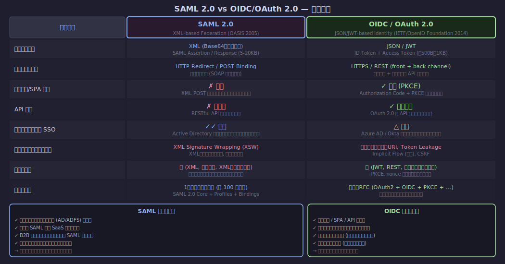

<!--
総合比較のまとめです。新規プロジェクトはOIDCがデフォルト、既存エンタープライズはSAML維持が現実解です。
-->

---

# 選択ガイド — 3 行サマリー

- <svg viewBox="0 0 800 400" style="max-height:70vh;max-width:100%;display:block;margin:0 auto;" xmlns="http://www.w3.org/2000/svg">
<rect width="800" height="400" fill="#1a1a2e"/>
<text x="400" y="40" text-anchor="middle" fill="#ffffff" font-size="18" font-weight="bold" font-family="sans-serif">選択ガイド — 3行サマリー</text>
<rect x="50" y="70" width="700" height="90" rx="12" fill="#16213e" stroke="#f9a825" stroke-width="2.5"/>
<text x="400" y="102" text-anchor="middle" fill="#f9a825" font-size="16" font-weight="bold" font-family="sans-serif">1. 新規Webサービス / モバイル / API</text>
<text x="400" y="140" text-anchor="middle" fill="#ffffff" font-size="14" font-family="sans-serif">→ OIDC + OAuth2 (PKCE) を選択</text>
<rect x="50" y="180" width="700" height="90" rx="12" fill="#16213e" stroke="#e91e63" stroke-width="2.5"/>
<text x="400" y="212" text-anchor="middle" fill="#e91e63" font-size="16" font-weight="bold" font-family="sans-serif">2. 既存エンプラ / B2B / SAMLが必須</text>
<text x="400" y="250" text-anchor="middle" fill="#ffffff" font-size="14" font-family="sans-serif">→ SAML 2.0 を維持・活用</text>
<rect x="50" y="290" width="700" height="80" rx="12" fill="#16213e" stroke="#4caf50" stroke-width="2.5"/>
<text x="400" y="322" text-anchor="middle" fill="#4caf50" font-size="16" font-weight="bold" font-family="sans-serif">3. 混在環境 / マルチプロトコル対応IdP</text>
<text x="400" y="352" text-anchor="middle" fill="#ffffff" font-size="14" font-family="sans-serif">→ Okta / Azure AD で両対応</text>
</svg>
- **新規プロジェクト:** → **OIDC + PKCE** (モバイル・SPA・API・マイクロサービス全て対応)
- **既存エンタープライズ SSO:** → **SAML 維持** (AD 統合・コスト・リスクを考慮)
- **移行計画:** → **マルチプロトコル IdP** で並存しながら段階移行
- **重要な原則:**
- 認証実装は必ずライブラリを使う。独自実装は脆弱性の温床
- OIDC でも SAML でも、検証項目（署名・有効期限・対象者）は必ず全て確認
- 「どちらが優れているか」ではなく「ユースケースに何が最適か」で判断


---

# 参考資料 / RFC (1/2)（1/2）

- **仕様書・RFC:**
- [SAML 2.0 Core (OASIS)](https://docs.oasis-open.org/security/saml/v2.0/saml-core-2.0-os.pdf)
- [OpenID Connect Core 1.0](https://openid.net/specs/openid-connect-core-1_0.html)
- [RFC 6749: OAuth 2.0](https://www.rfc-editor.org/rfc/rfc6749)


---

# 参考資料 / RFC (1/2)（2/2）

- [RFC 7636: PKCE](https://www.rfc-editor.org/rfc/rfc7636)
- [RFC 7519: JWT](https://www.rfc-editor.org/rfc/rfc7519)
- **セキュリティ:**
- [OAuth 2.0 Security Best Current Practice (RFC 9700)](https://www.rfc-editor.org/rfc/rfc9700)


---

# 参考資料 / RFC (2/2)（1/2）

- **実装ガイド・ライブラリ:**
- [Okta: OIDC vs SAML](https://developer.okta.com/blog/2020/09/14/password-management-for-devs)
- [Auth0: SAML vs JWT](https://auth0.com/blog/saml-vs-oauth/)
- [OWASP Authentication Cheat Sheet](https://cheatsheetseries.owasp.org/cheatsheets/Authentication_Cheat_Sheet.html)


---

# 参考資料 / RFC (2/2)（2/2）

- **OSS ライブラリ:**
- [Keycloak (IdP)](https://www.keycloak.org/) | [python-saml (OneLogin)](https://github.com/onelogin/python-saml)
- [AppAuth (Mobile OIDC)](https://appauth.io/) | [Authlib (Python OIDC)](https://authlib.org/)
- [MSAL (Microsoft)](https://github.com/AzureAD/microsoft-authentication-library-for-python)

