<!-- _class: lead -->
# ISMS 完全ガイド

- ISO/IEC 27001:2022 — 審査員・コンサルタントのための詳解
- 2026年2月

---

# アジェンダ (1/2)

> *第1〜5章でCIA・規格構造・リスク管理・管理策・審査実践を網羅する*

- **第1章** ISMSの基礎概念 — CIAトライアド・規格体系・歴史
- **第2章** ISO/IEC 27001:2022の構造 — HLS・箇条4〜10・Annex A
- **第3章** リスクマネジメント — アセスメント・SoA・レジスター
- **第4章** 主要管理策の詳細 — 組織・人的・物理・技術（Annex A）
- **第5章** 認証審査の実践 — Stage 1/2・不適合事例・証跡収集

---

# アジェンダ (2/2)

> *第6〜10章で導入事例・2022改訂・規制連携・AIクラウド時代の展望を解説する*

- **第6章** 実際の導入事例 — IT企業・製造業・金融・医療
- **第7章** ISO/IEC 27001:2022 改訂ポイント — 新規11管理策・移行
- **第8章** 関連規制との連携 — GDPR・個人情報保護法・SOC 2
- **第9章** AI・クラウド時代のISMS — ゼロトラスト・ISO 42001
- **第10章** まとめと今後の展望

---

<!-- _class: lead -->
# 第1章 ISMSの基礎概念

- Information Security Management System

---

# ISMSとは何か

> *ISMSはリスクベースのPDCAで情報資産を体系管理し第三者認証で信頼を証明する*

- <svg viewBox="0 0 800 400" style="max-height:70vh;max-width:100%;display:block;margin:0 auto;" xmlns="http://www.w3.org/2000/svg">
<rect width="800" height="400" fill="#1a1a2e"/>
<text x="400" y="28" text-anchor="middle" fill="#ffffff" font-size="16" font-weight="bold" font-family="sans-serif">ISMSとは何か</text>
<rect x="200" y="50" width="400" height="80" rx="12" fill="#16213e" stroke="#f9a825" stroke-width="2.5"/>
<text x="400" y="84" text-anchor="middle" fill="#f9a825" font-size="16" font-weight="bold" font-family="sans-serif">ISMS</text>
<text x="400" y="112" text-anchor="middle" fill="#ffffff" font-size="13" font-family="sans-serif">Information Security Management System</text>
<text x="400" y="160" text-anchor="middle" fill="#ffffff" font-size="13" font-family="sans-serif">情報セキュリティを組織的・体系的に管理するフレームワーク</text>
<rect x="30" y="185" width="220" height="80" rx="8" fill="#16213e" stroke="#e91e63" stroke-width="2"/>
<rect x="290" y="185" width="220" height="80" rx="8" fill="#16213e" stroke="#2196f3" stroke-width="2"/>
<rect x="550" y="185" width="220" height="80" rx="8" fill="#16213e" stroke="#4caf50" stroke-width="2"/>
<text x="140" y="216" text-anchor="middle" fill="#e91e63" font-size="13" font-weight="bold" font-family="sans-serif">リスクベース</text>
<text x="400" y="216" text-anchor="middle" fill="#2196f3" font-size="13" font-weight="bold" font-family="sans-serif">PDCAサイクル</text>
<text x="660" y="216" text-anchor="middle" fill="#4caf50" font-size="13" font-weight="bold" font-family="sans-serif">継続的改善</text>
<text x="140" y="248" text-anchor="middle" fill="#ffffff" font-size="12" font-family="sans-serif">リスクを特定・評価・対応</text>
<text x="400" y="248" text-anchor="middle" fill="#ffffff" font-size="12" font-family="sans-serif">Plan→Do→Check→Act</text>
<text x="660" y="248" text-anchor="middle" fill="#ffffff" font-size="12" font-family="sans-serif">マネジメントレビュー</text>
<rect x="30" y="295" width="740" height="75" rx="8" fill="#16213e" stroke="#f9a825" stroke-width="1.5"/>
<text x="400" y="320" text-anchor="middle" fill="#f9a825" font-size="13" font-weight="bold" font-family="sans-serif">ISO/IEC 27001 の目的</text>
<text x="400" y="348" text-anchor="middle" fill="#ffffff" font-size="12" font-family="sans-serif">情報の機密性・完全性・可用性を維持し、利害関係者の信頼を獲得する</text>
</svg>
- **ISMS（情報セキュリティマネジメントシステム）** — 組織が情報資産を体系的に管理するための仕組み
- **基盤規格:** ISO/IEC 27001（現行版: 2022年版）。IAF認定審査機関による第三者認証が可能
- **目的:** リスクベースアプローチで情報セキュリティリスクを特定・評価・対処し継続的に改善
- **適用範囲:** 規模・業種を問わず、あらゆる組織に適用可能（スコープは組織が決定）
- **3つの保護対象:** 紙・電子・人の頭の中にある情報資産すべて
- **認証の価値:** 顧客・取引先への信頼性証明、入札要件、内部ガバナンス強化

---

# 情報セキュリティの3要素（CIA トライアド）

> *機密性・完全性・可用性の3軸がセキュリティ対策の評価基準*

- <svg viewBox="0 0 800 400" style="max-height:70vh;max-width:100%;display:block;margin:0 auto;" xmlns="http://www.w3.org/2000/svg">
<rect width="800" height="400" fill="#1a1a2e"/>
<text x="400" y="28" text-anchor="middle" fill="#ffffff" font-size="16" font-weight="bold" font-family="sans-serif">情報セキュリティの3要素（CIA トライアド）</text>
<polygon points="400,55 560,310 240,310" fill="#16213e" stroke="#f9a825" stroke-width="2.5"/>
<text x="400" y="120" text-anchor="middle" fill="#f9a825" font-size="18" font-weight="bold" font-family="sans-serif">C</text>
<text x="400" y="145" text-anchor="middle" fill="#f9a825" font-size="14" font-weight="bold" font-family="sans-serif">Confidentiality</text>
<text x="400" y="168" text-anchor="middle" fill="#ffffff" font-size="12" font-family="sans-serif">機密性</text>
<text x="280" y="295" text-anchor="middle" fill="#e91e63" font-size="18" font-weight="bold" font-family="sans-serif">I</text>
<text x="280" y="315" text-anchor="middle" fill="#e91e63" font-size="11" font-weight="bold" font-family="sans-serif">Integrity</text>
<text x="280" y="330" text-anchor="middle" fill="#ffffff" font-size="10" font-family="sans-serif">完全性</text>
<text x="520" y="295" text-anchor="middle" fill="#4caf50" font-size="18" font-weight="bold" font-family="sans-serif">A</text>
<text x="520" y="315" text-anchor="middle" fill="#4caf50" font-size="11" font-weight="bold" font-family="sans-serif">Availability</text>
<text x="520" y="330" text-anchor="middle" fill="#ffffff" font-size="10" font-family="sans-serif">可用性</text>
<rect x="20" y="50" width="180" height="65" rx="6" fill="#16213e" stroke="#f9a825" stroke-width="1.5"/>
<text x="110" y="76" text-anchor="middle" fill="#f9a825" font-size="12" font-weight="bold" font-family="sans-serif">機密性</text>
<text x="110" y="97" text-anchor="middle" fill="#ffffff" font-size="11" font-family="sans-serif">認可されたユーザーのみ</text>
<text x="110" y="112" text-anchor="middle" fill="#ffffff" font-size="11" font-family="sans-serif">アクセス可能</text>
<rect x="600" y="50" width="180" height="65" rx="6" fill="#16213e" stroke="#4caf50" stroke-width="1.5"/>
<text x="690" y="76" text-anchor="middle" fill="#4caf50" font-size="12" font-weight="bold" font-family="sans-serif">可用性</text>
<text x="690" y="97" text-anchor="middle" fill="#ffffff" font-size="11" font-family="sans-serif">必要なときに</text>
<text x="690" y="112" text-anchor="middle" fill="#ffffff" font-size="11" font-family="sans-serif">利用可能</text>
<rect x="310" y="345" width="180" height="50" rx="6" fill="#16213e" stroke="#e91e63" stroke-width="1.5"/>
<text x="400" y="368" text-anchor="middle" fill="#e91e63" font-size="12" font-weight="bold" font-family="sans-serif">完全性</text>
<text x="400" y="388" text-anchor="middle" fill="#ffffff" font-size="11" font-family="sans-serif">改ざん・欠損なし</text>
</svg>
- **機密性 (Confidentiality):** 権限を持つ者のみが情報にアクセスできる状態を維持
- **完全性 (Integrity):** 情報が正確・完全であり、不正な改ざんがない状態を保持
- **可用性 (Availability):** 権限を持つ者が必要なときに情報・システムを利用できる状態を確保
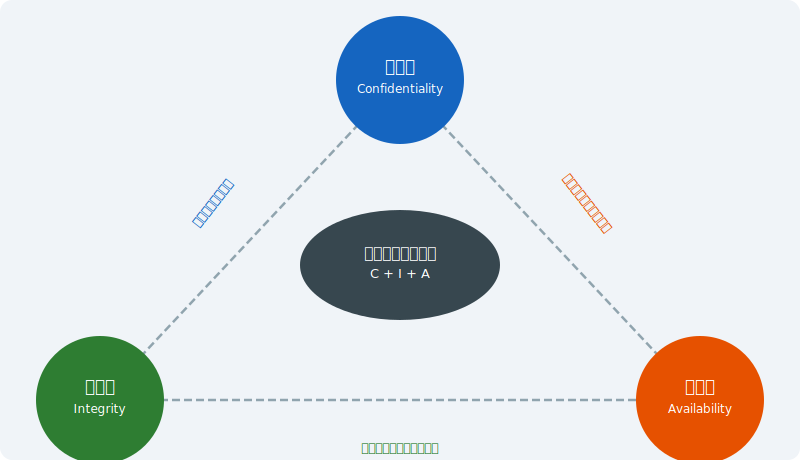

---

# なぜISMSが必要か — サイバー脅威の現状

> *インシデント対応コスト平均4〜5億円に対し予防的管理策は圧倒的にコストが低い*

- <svg viewBox="0 0 800 400" style="max-height:70vh;max-width:100%;display:block;margin:0 auto;" xmlns="http://www.w3.org/2000/svg"><rect width="800" height="400" fill="#1a1a2e"/>
<text x="400" y="35" font-size="18" fill="#f9a825" text-anchor="middle" font-weight="bold">サイバー脅威の現状 — 主要統計</text>
<rect x="30" y="55" width="220" height="130" rx="8" fill="#16213e" stroke="#e91e63" stroke-width="2"/>
<text x="140" y="82" font-size="13" fill="#e91e63" text-anchor="middle" font-weight="bold">ランサムウェア</text>
<text x="140" y="108" font-size="34" fill="#f9a825" text-anchor="middle" font-weight="bold">6倍</text>
<text x="140" y="132" font-size="11" fill="#ffffff" text-anchor="middle">2019→2023年の被害増加</text>
<text x="140" y="155" font-size="10" fill="#aaa" text-anchor="middle">平均身代金: $1.5M (2023)</text>
<rect x="290" y="55" width="220" height="130" rx="8" fill="#16213e" stroke="#f9a825" stroke-width="2"/>
<text x="400" y="82" font-size="13" fill="#f9a825" text-anchor="middle" font-weight="bold">情報漏えいコスト</text>
<text x="400" y="108" font-size="34" fill="#f9a825" text-anchor="middle" font-weight="bold">$4.45M</text>
<text x="400" y="132" font-size="11" fill="#ffffff" text-anchor="middle">平均コスト (IBM 2023)</text>
<text x="400" y="155" font-size="10" fill="#aaa" text-anchor="middle">日本: 約5.3億円</text>
<rect x="550" y="55" width="220" height="130" rx="8" fill="#16213e" stroke="#4caf50" stroke-width="2"/>
<text x="660" y="82" font-size="13" fill="#4caf50" text-anchor="middle" font-weight="bold">サプライチェーン攻撃</text>
<text x="660" y="108" font-size="34" fill="#f9a825" text-anchor="middle" font-weight="bold">742%</text>
<text x="660" y="132" font-size="11" fill="#ffffff" text-anchor="middle">2019→2022年の増加率</text>
<text x="660" y="155" font-size="10" fill="#aaa" text-anchor="middle">ENISA報告</text>
<text x="400" y="215" font-size="15" fill="#f9a825" text-anchor="middle" font-weight="bold">なぜISMSが必要か</text>
<rect x="50" y="230" width="700" height="50" rx="6" fill="#16213e"/>
<text x="400" y="251" font-size="12" fill="#ffffff" text-anchor="middle">法令遵守（個人情報保護法・サイバーセキュリティ基本法）</text>
<text x="400" y="270" font-size="12" fill="#ffffff" text-anchor="middle">取引先・顧客からのセキュリティ要求への対応</text>
<rect x="50" y="295" width="700" height="50" rx="6" fill="#16213e"/>
<text x="400" y="316" font-size="12" fill="#e91e63" text-anchor="middle">ISMS認証 = 組織的・体系的なリスク管理の証明</text>
<text x="400" y="336" font-size="12" fill="#ffffff" text-anchor="middle">事後対応 → 事前予防へのパラダイムシフト</text>
<text x="400" y="378" font-size="11" fill="#aaa" text-anchor="middle">出典: IBM Cost of a Data Breach 2023, ENISA Threat Landscape 2023</text></svg>
- **サイバー攻撃の深刻化:** ランサムウェアによる業務停止・データ漏えいが急増
- **サプライチェーンリスク:** 子会社・協力会社経由の侵害（2022〜2024年 国内主要事案）
- **法規制の強化:** 個人情報保護法改正（2022）・重要インフラのセキュリティ強化要請
- **ビジネス要件:** 取引先・顧客からのISMS認証要求がサプライチェール参加条件に
- **内部不正リスク:** 退職者・委託先による不正アクセス・情報持ち出し
- **投資対効果:** インシデント対応コスト（平均4〜5億円/件）vs 予防的管理策コストの比較

---

# ISMSと関連規格の全体像

- ISO/IEC 27001を中心に、目的別の拡張規格が体系化されている
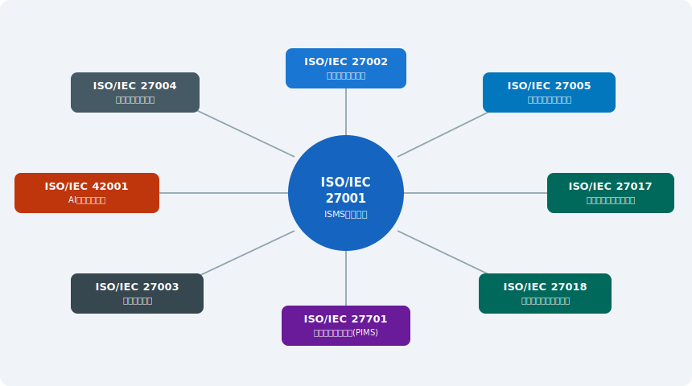

---

# ISMSの歴史と変遷

> *2022年版で管理策が114→93に再編、クラウド・AI時代の11新規管理策が追加された*

- <svg viewBox="0 0 800 400" style="max-height:70vh;max-width:100%;display:block;margin:0 auto;" xmlns="http://www.w3.org/2000/svg"><rect width="800" height="400" fill="#1a1a2e"/>
<text x="400" y="30" font-size="17" fill="#f9a825" text-anchor="middle" font-weight="bold">ISMSの歴史と変遷</text>
<line x1="60" y1="200" x2="740" y2="200" stroke="#f9a825" stroke-width="3"/>
<polygon points="740,194 756,200 740,206" fill="#f9a825"/>
<circle cx="60" cy="200" r="7" fill="#f9a825"/>
<line x1="60" y1="140" x2="60" y2="200" stroke="#555" stroke-width="1" stroke-dasharray="4"/>
<text x="60" y="120" font-size="10" fill="#f9a825" text-anchor="middle" font-weight="bold">1995</text>
<text x="60" y="134" font-size="9" fill="#ffffff" text-anchor="middle">BS 7799</text>
<text x="60" y="151" font-size="8" fill="#aaa" text-anchor="middle">英国規格</text><circle cx="180" cy="200" r="7" fill="#f9a825"/>
<line x1="180" y1="200" x2="180" y2="240" stroke="#555" stroke-width="1" stroke-dasharray="4"/>
<text x="180" y="240" font-size="10" fill="#f9a825" text-anchor="middle" font-weight="bold">2000</text>
<text x="180" y="254" font-size="9" fill="#ffffff" text-anchor="middle">ISO/IEC</text><text x="180" y="267" font-size="9" fill="#ffffff" text-anchor="middle">17799</text>
<text x="180" y="284" font-size="8" fill="#aaa" text-anchor="middle">国際規格化</text><circle cx="300" cy="200" r="7" fill="#f9a825"/>
<line x1="300" y1="140" x2="300" y2="200" stroke="#555" stroke-width="1" stroke-dasharray="4"/>
<text x="300" y="120" font-size="10" fill="#f9a825" text-anchor="middle" font-weight="bold">2005</text>
<text x="300" y="134" font-size="9" fill="#ffffff" text-anchor="middle">ISO/IEC</text><text x="300" y="147" font-size="9" fill="#ffffff" text-anchor="middle">27001:2005</text>
<text x="300" y="164" font-size="8" fill="#aaa" text-anchor="middle">ISMS認証開始</text><circle cx="430" cy="200" r="7" fill="#f9a825"/>
<line x1="430" y1="200" x2="430" y2="240" stroke="#555" stroke-width="1" stroke-dasharray="4"/>
<text x="430" y="240" font-size="10" fill="#f9a825" text-anchor="middle" font-weight="bold">2013</text>
<text x="430" y="254" font-size="9" fill="#ffffff" text-anchor="middle">ISO/IEC</text><text x="430" y="267" font-size="9" fill="#ffffff" text-anchor="middle">27001:2013</text>
<text x="430" y="284" font-size="8" fill="#aaa" text-anchor="middle">大幅改訂</text><circle cx="560" cy="200" r="7" fill="#f9a825"/>
<line x1="560" y1="140" x2="560" y2="200" stroke="#555" stroke-width="1" stroke-dasharray="4"/>
<text x="560" y="120" font-size="10" fill="#f9a825" text-anchor="middle" font-weight="bold">2022</text>
<text x="560" y="134" font-size="9" fill="#ffffff" text-anchor="middle">ISO/IEC</text><text x="560" y="147" font-size="9" fill="#ffffff" text-anchor="middle">27001:2022</text>
<text x="560" y="164" font-size="8" fill="#aaa" text-anchor="middle">最新版</text><circle cx="690" cy="200" r="7" fill="#f9a825"/>
<line x1="690" y1="200" x2="690" y2="240" stroke="#555" stroke-width="1" stroke-dasharray="4"/>
<text x="690" y="240" font-size="10" fill="#f9a825" text-anchor="middle" font-weight="bold">2024</text>
<text x="690" y="254" font-size="9" fill="#ffffff" text-anchor="middle">移行期限</text>
<text x="690" y="271" font-size="8" fill="#aaa" text-anchor="middle">〜10月末</text>
<rect x="50" y="320" width="700" height="60" rx="6" fill="#16213e"/>
<text x="400" y="345" font-size="13" fill="#f9a825" text-anchor="middle" font-weight="bold">2022年版の主な変更点</text>
<text x="400" y="365" font-size="11" fill="#ffffff" text-anchor="middle">管理策: 114項目 → 93項目（統合・整理・新設11項目）/ 4カテゴリ制（組織・人的・物理・技術）</text>
<text x="400" y="380" font-size="11" fill="#ffffff" text-anchor="middle">新設: 脅威インテリジェンス・クラウドセキュリティ・ICTサプライチェーン・データ漏えい等</text></svg>
- **1995年** BS 7799（英国規格）— 情報セキュリティの実践規範として制定
- **2000年** ISO/IEC 17799:2000 — BS 7799 Part 1 が国際規格化
- **2005年** ISO/IEC 27001:2005 — 初の国際ISMS認証規格として制定（第三者認証開始）
- **2013年** ISO/IEC 27001:2013 — HLS導入・管理策114項目（14のドメイン）に大幅改訂
- **2022年** ISO/IEC 27001:2022 — **現行版** 管理策93項目（4カテゴリ）・11の新規管理策追加
- **移行期限: 2025年10月31日** — 2013年版認証は失効（IAF MD 26）

---

<!-- _class: lead -->
# 第2章 ISO/IEC 27001:2022の構造

- <svg viewBox="0 0 800 380" style="max-height:70vh;max-width:100%;display:block;margin:0 auto;" xmlns="http://www.w3.org/2000/svg"><rect width="800" height="380" fill="#1a1a2e"/>
<text x="400" y="30" font-size="17" fill="#f9a825" text-anchor="middle" font-weight="bold">ISO/IEC 27001:2022 — 全体構造</text>
<rect x="250" y="50" width="300" height="45" rx="8" fill="#e91e63"/>
<text x="400" y="70" font-size="13" fill="#ffffff" text-anchor="middle" font-weight="bold">箇条4〜10（本文）</text>
<text x="400" y="87" font-size="11" fill="#ffffff" text-anchor="middle">ISMS要求事項 — HLS準拠</text>
<rect x="50" y="130" width="120" height="60" rx="6" fill="#16213e" stroke="#f9a825" stroke-width="2"/>
<text x="110" y="158" font-size="10" fill="#f9a825" text-anchor="middle" font-weight="bold">箇条4</text>
<text x="110" y="174" font-size="10" fill="#ffffff" text-anchor="middle">コンテキスト</text><rect x="190" y="130" width="120" height="60" rx="6" fill="#16213e" stroke="#f9a825" stroke-width="2"/>
<text x="250" y="158" font-size="10" fill="#f9a825" text-anchor="middle" font-weight="bold">箇条5</text>
<text x="250" y="174" font-size="10" fill="#ffffff" text-anchor="middle">リーダーシップ</text><rect x="330" y="130" width="120" height="60" rx="6" fill="#16213e" stroke="#f9a825" stroke-width="2"/>
<text x="390" y="158" font-size="10" fill="#f9a825" text-anchor="middle" font-weight="bold">箇条6</text>
<text x="390" y="174" font-size="10" fill="#ffffff" text-anchor="middle">計画</text><rect x="470" y="130" width="120" height="60" rx="6" fill="#16213e" stroke="#f9a825" stroke-width="2"/>
<text x="530" y="158" font-size="10" fill="#f9a825" text-anchor="middle" font-weight="bold">箇条7</text>
<text x="530" y="174" font-size="10" fill="#ffffff" text-anchor="middle">支援</text><rect x="610" y="130" width="120" height="60" rx="6" fill="#16213e" stroke="#f9a825" stroke-width="2"/>
<text x="670" y="158" font-size="10" fill="#f9a825" text-anchor="middle" font-weight="bold">箇条8</text>
<text x="670" y="174" font-size="10" fill="#ffffff" text-anchor="middle">運用</text>
<rect x="130" y="215" width="210" height="60" rx="6" fill="#16213e" stroke="#2196f3" stroke-width="2"/>
<text x="235" y="243" font-size="11" fill="#2196f3" text-anchor="middle" font-weight="bold">箇条9</text>
<text x="235" y="261" font-size="11" fill="#ffffff" text-anchor="middle">パフォーマンス評価</text><rect x="390" y="215" width="210" height="60" rx="6" fill="#16213e" stroke="#2196f3" stroke-width="2"/>
<text x="495" y="243" font-size="11" fill="#2196f3" text-anchor="middle" font-weight="bold">箇条10</text>
<text x="495" y="261" font-size="11" fill="#ffffff" text-anchor="middle">改善</text>
<line x1="400" y1="95" x2="400" y2="130" stroke="#555" stroke-width="1"/>
<rect x="150" y="295" width="500" height="60" rx="8" fill="#16213e" stroke="#4caf50" stroke-width="2"/>
<text x="400" y="320" font-size="13" fill="#4caf50" text-anchor="middle" font-weight="bold">Annex A — 93の情報セキュリティ管理策（参照規範）</text>
<text x="400" y="342" font-size="11" fill="#ffffff" text-anchor="middle">組織的(37) ・ 人的(8) ・ 物理的(14) ・ 技術的(34)</text>
<line x1="400" y1="275" x2="400" y2="295" stroke="#555" stroke-width="1"/></svg>
- HLS（高位構造）と Annex A 管理策

---

# ISO/IEC 27001:2022 全体構造

> *箇条4〜10のHLS+附属書A管理策で認証要件の全体を定義*

- <svg viewBox="0 0 800 400" style="max-height:70vh;max-width:100%;display:block;margin:0 auto;" xmlns="http://www.w3.org/2000/svg">
<rect width="800" height="400" fill="#1a1a2e"/>
<text x="400" y="28" text-anchor="middle" fill="#ffffff" font-size="16" font-weight="bold" font-family="sans-serif">ISO/IEC 27001:2022 全体構造</text>
<rect x="20" y="50" width="760" height="45" rx="8" fill="#16213e" stroke="#f9a825" stroke-width="2.5"/>
<text x="400" y="79" text-anchor="middle" fill="#f9a825" font-size="15" font-weight="bold" font-family="sans-serif">本文 (箇条4〜10) + Annex A (93管理策)</text>
<rect x="30" y="110" width="105" height="55" rx="6" fill="#16213e" stroke="#ffffff" stroke-width="1.5"/>
<text x="82" y="136" text-anchor="middle" fill="#ffffff" font-size="12" font-family="sans-serif">箇条4</text>
<text x="82" y="155" text-anchor="middle" fill="#ffffff" font-size="11" font-family="sans-serif">組織の状況</text>
<rect x="148" y="110" width="105" height="55" rx="6" fill="#16213e" stroke="#e91e63" stroke-width="1.5"/>
<text x="200" y="136" text-anchor="middle" fill="#e91e63" font-size="12" font-family="sans-serif">箇条5</text>
<text x="200" y="155" text-anchor="middle" fill="#ffffff" font-size="11" font-family="sans-serif">リーダーシップ</text>
<rect x="266" y="110" width="105" height="55" rx="6" fill="#16213e" stroke="#f9a825" stroke-width="2"/>
<text x="318" y="136" text-anchor="middle" fill="#f9a825" font-size="12" font-weight="bold" font-family="sans-serif">箇条6</text>
<text x="318" y="155" text-anchor="middle" fill="#f9a825" font-size="11" font-family="sans-serif">計画(リスク)</text>
<rect x="384" y="110" width="105" height="55" rx="6" fill="#16213e" stroke="#ffffff" stroke-width="1.5"/>
<text x="436" y="136" text-anchor="middle" fill="#ffffff" font-size="12" font-family="sans-serif">箇条7</text>
<text x="436" y="155" text-anchor="middle" fill="#ffffff" font-size="11" font-family="sans-serif">支援</text>
<rect x="502" y="110" width="105" height="55" rx="6" fill="#16213e" stroke="#ffffff" stroke-width="1.5"/>
<text x="554" y="136" text-anchor="middle" fill="#ffffff" font-size="12" font-family="sans-serif">箇条8</text>
<text x="554" y="155" text-anchor="middle" fill="#ffffff" font-size="11" font-family="sans-serif">運用</text>
<rect x="620" y="110" width="105" height="55" rx="6" fill="#16213e" stroke="#4caf50" stroke-width="1.5"/>
<text x="672" y="136" text-anchor="middle" fill="#4caf50" font-size="12" font-family="sans-serif">箇条9</text>
<text x="672" y="155" text-anchor="middle" fill="#ffffff" font-size="11" font-family="sans-serif">評価</text>
<rect x="740" y="110" width="48" height="55" rx="6" fill="#16213e" stroke="#4caf50" stroke-width="1.5"/>
<text x="764" y="136" text-anchor="middle" fill="#4caf50" font-size="11" font-family="sans-serif">10</text>
<text x="764" y="155" text-anchor="middle" fill="#ffffff" font-size="10" font-family="sans-serif">改善</text>
<rect x="20" y="190" width="760" height="170" rx="10" fill="#16213e" stroke="#e91e63" stroke-width="2"/>
<text x="400" y="218" text-anchor="middle" fill="#e91e63" font-size="14" font-weight="bold" font-family="sans-serif">Annex A — 93の情報セキュリティ管理策 (2022年版)</text>
<rect x="40" y="232" width="160" height="60" rx="6" fill="#1a1a2e" stroke="#f9a825" stroke-width="1.5"/>
<text x="120" y="255" text-anchor="middle" fill="#f9a825" font-size="12" font-weight="bold" font-family="sans-serif">組織的 (5)</text>
<text x="120" y="278" text-anchor="middle" fill="#ffffff" font-size="11" font-family="sans-serif">37管理策</text>
<rect x="225" y="232" width="160" height="60" rx="6" fill="#1a1a2e" stroke="#e91e63" stroke-width="1.5"/>
<text x="305" y="255" text-anchor="middle" fill="#e91e63" font-size="12" font-weight="bold" font-family="sans-serif">人的 (6)</text>
<text x="305" y="278" text-anchor="middle" fill="#ffffff" font-size="11" font-family="sans-serif">8管理策</text>
<rect x="410" y="232" width="160" height="60" rx="6" fill="#1a1a2e" stroke="#2196f3" stroke-width="1.5"/>
<text x="490" y="255" text-anchor="middle" fill="#2196f3" font-size="12" font-weight="bold" font-family="sans-serif">物理的 (7)</text>
<text x="490" y="278" text-anchor="middle" fill="#ffffff" font-size="11" font-family="sans-serif">14管理策</text>
<rect x="595" y="232" width="165" height="60" rx="6" fill="#1a1a2e" stroke="#4caf50" stroke-width="1.5"/>
<text x="677" y="255" text-anchor="middle" fill="#4caf50" font-size="12" font-weight="bold" font-family="sans-serif">技術的 (8)</text>
<text x="677" y="278" text-anchor="middle" fill="#ffffff" font-size="11" font-family="sans-serif">34管理策</text>
<text x="400" y="345" text-anchor="middle" fill="#ffffff" font-size="12" font-family="sans-serif">合計93管理策 (2022年改訂: 2013年版114→93に再編)</text>
</svg>
- 箇条4〜10はすべてのISOマネジメントシステム規格に共通のHLS（高位構造）
- Annex Aは箇条6.1.3（リスク対応）と8.3で参照する管理策カタログ
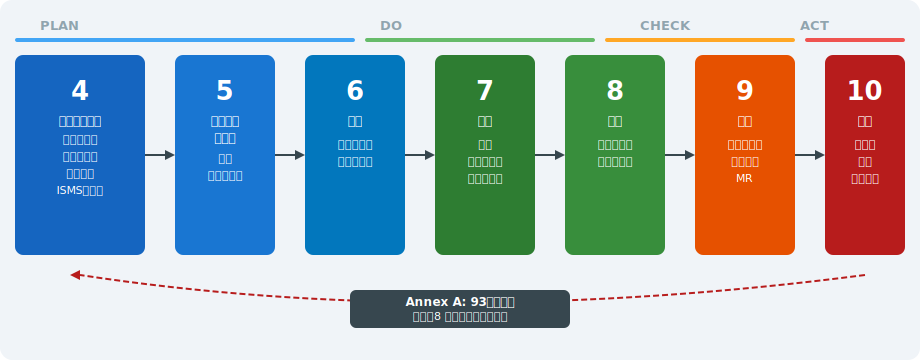

---

# HLS（高位構造）— ISMSに共通する骨格

> *HLS準拠で他のISOマネジメントシステムと統合運用でき移行とコストを大幅削減できる*

- <svg viewBox="0 0 800 400" style="max-height:70vh;max-width:100%;display:block;margin:0 auto;" xmlns="http://www.w3.org/2000/svg"><rect width="800" height="400" fill="#1a1a2e"/>
<text x="400" y="30" font-size="17" fill="#f9a825" text-anchor="middle" font-weight="bold">HLS（高位構造）— マネジメントシステムの共通骨格</text>
<rect x="200" y="50" width="400" height="40" rx="6" fill="#e91e63"/>
<text x="400" y="76" font-size="13" fill="#ffffff" text-anchor="middle" font-weight="bold">HLS (High Level Structure)</text>
<rect x="80" y="110" width="140" height="55" rx="6" fill="#16213e" stroke="#4caf50" stroke-width="2"/>
<text x="150" y="133" font-size="11" fill="#4caf50" text-anchor="middle" font-weight="bold">ISO 27001</text>
<text x="150" y="150" font-size="10" fill="#ffffff" text-anchor="middle">ISMS</text><rect x="230" y="110" width="140" height="55" rx="6" fill="#16213e" stroke="#2196f3" stroke-width="2"/>
<text x="300" y="133" font-size="11" fill="#2196f3" text-anchor="middle" font-weight="bold">ISO 9001</text>
<text x="300" y="150" font-size="10" fill="#ffffff" text-anchor="middle">品質</text><rect x="380" y="110" width="140" height="55" rx="6" fill="#16213e" stroke="#f9a825" stroke-width="2"/>
<text x="450" y="133" font-size="11" fill="#f9a825" text-anchor="middle" font-weight="bold">ISO 14001</text>
<text x="450" y="150" font-size="10" fill="#ffffff" text-anchor="middle">環境</text><rect x="530" y="110" width="140" height="55" rx="6" fill="#16213e" stroke="#ff6f00" stroke-width="2"/>
<text x="600" y="133" font-size="11" fill="#ff6f00" text-anchor="middle" font-weight="bold">ISO 45001</text>
<text x="600" y="150" font-size="10" fill="#ffffff" text-anchor="middle">安全衛生</text>
<line x1="150" y1="90" x2="150" y2="110" stroke="#555" stroke-width="1"/><line x1="300" y1="90" x2="300" y2="110" stroke="#555" stroke-width="1"/><line x1="450" y1="90" x2="450" y2="110" stroke="#555" stroke-width="1"/><line x1="600" y1="90" x2="600" y2="110" stroke="#555" stroke-width="1"/>
<text x="400" y="195" font-size="14" fill="#f9a825" text-anchor="middle" font-weight="bold">共通構造の利点</text>
<rect x="50" y="215" width="170" height="85" rx="6" fill="#16213e"/>
<text x="135" y="237" font-size="12" fill="#f9a825" text-anchor="middle" font-weight="bold">統合マネジメント</text>
<text x="135" y="257" font-size="10" fill="#ffffff" text-anchor="middle">ISO 9001+27001 を</text><text x="135" y="274" font-size="10" fill="#ffffff" text-anchor="middle">一体運用できる</text><rect x="230" y="215" width="170" height="85" rx="6" fill="#16213e"/>
<text x="315" y="237" font-size="12" fill="#f9a825" text-anchor="middle" font-weight="bold">移行の容易さ</text>
<text x="315" y="257" font-size="10" fill="#ffffff" text-anchor="middle">他規格認証済なら</text><text x="315" y="274" font-size="10" fill="#ffffff" text-anchor="middle">共通条文を流用</text><rect x="410" y="215" width="170" height="85" rx="6" fill="#16213e"/>
<text x="495" y="237" font-size="12" fill="#f9a825" text-anchor="middle" font-weight="bold">審査の効率化</text>
<text x="495" y="257" font-size="10" fill="#ffffff" text-anchor="middle">共通項目をまとめ</text><text x="495" y="274" font-size="10" fill="#ffffff" text-anchor="middle">審査できる</text><rect x="590" y="215" width="170" height="85" rx="6" fill="#16213e"/>
<text x="675" y="237" font-size="12" fill="#f9a825" text-anchor="middle" font-weight="bold">用語の統一</text>
<text x="675" y="257" font-size="10" fill="#ffffff" text-anchor="middle">リスク・文書管理等</text><text x="675" y="274" font-size="10" fill="#ffffff" text-anchor="middle">概念が統一</text>
<rect x="100" y="320" width="600" height="55" rx="6" fill="#16213e" stroke="#f9a825" stroke-width="1"/>
<text x="400" y="345" font-size="12" fill="#f9a825" text-anchor="middle" font-weight="bold">PDCAサイクルとの対応</text>
<text x="400" y="363" font-size="11" fill="#ffffff" text-anchor="middle">Plan(箇条6) → Do(箇条8) → Check(箇条9) → Act(箇条10)</text></svg>
- **HLS（High Level Structure）** — ISO 9001・14001・45001など全マネジメントシステム規格の共通構造
- **利点①:** 複数のマネジメントシステムを統合実施できる（IMS: 統合マネジメントシステム）
- **利点②:** 審査員・コンサルタントが他規格の知識を流用しやすい
- **箇条1〜3:** 適用範囲・引用規格・用語の定義（ISMS固有の要求事項ではない）
- **箇条4〜10:** ISMS固有の要求事項（PLAN→DO→CHECK→ACT のPDCAに対応）
- **注意:** Annex Aは「規範的附属書」—適用宣言書(SoA)でカバーの是非を示す義務あり

---

# 箇条4・5 — コンテキストとリーダーシップ

> *スコープ定義とCISO任命が最初の関門で曖昧にすると審査不適合に直結する*

- <svg viewBox="0 0 800 380" style="max-height:70vh;max-width:100%;display:block;margin:0 auto;" xmlns="http://www.w3.org/2000/svg"><rect width="800" height="380" fill="#1a1a2e"/>
<text x="400" y="28" font-size="16" fill="#f9a825" text-anchor="middle" font-weight="bold">箇条4・5 — コンテキストとリーダーシップ</text>
<rect x="30" y="45" width="360" height="150" rx="8" fill="#16213e" stroke="#f9a825" stroke-width="2"/>
<text x="210" y="68" font-size="13" fill="#f9a825" text-anchor="middle" font-weight="bold">箇条4: 組織のコンテキスト</text>
<text x="50" y="90" font-size="11" fill="#ffffff">4.1 内外の課題（SWOT・PESTLE）</text><text x="50" y="112" font-size="11" fill="#ffffff">4.2 利害関係者のニーズ</text><text x="50" y="134" font-size="11" fill="#ffffff">4.3 ISMSのスコープ定義</text><text x="50" y="156" font-size="11" fill="#ffffff">4.4 ISMSの確立・実施・維持・改善</text>
<rect x="410" y="45" width="360" height="150" rx="8" fill="#16213e" stroke="#e91e63" stroke-width="2"/>
<text x="590" y="68" font-size="13" fill="#e91e63" text-anchor="middle" font-weight="bold">箇条5: リーダーシップ</text>
<text x="425" y="90" font-size="11" fill="#ffffff">5.1 リーダーシップとコミットメント</text><text x="425" y="112" font-size="11" fill="#ffffff">5.2 情報セキュリティ方針の策定</text><text x="425" y="134" font-size="11" fill="#ffffff">5.3 役割・責任・権限の割り当て</text><text x="425" y="156" font-size="11" fill="#ffffff">→ CISO/ISMSオーナーの任命</text>
<text x="400" y="225" font-size="13" fill="#4caf50" text-anchor="middle" font-weight="bold">スコープ定義の重要性</text>
<rect x="50" y="240" width="165" height="80" rx="6" fill="#16213e"/>
<text x="132" y="260" font-size="11" fill="#f9a825" text-anchor="middle" font-weight="bold">物理的境界</text>
<text x="132" y="278" font-size="10" fill="#ffffff" text-anchor="middle">オフィス・データセンター・</text><text x="132" y="294" font-size="10" fill="#ffffff" text-anchor="middle">リモートワーク環境</text><rect x="230" y="240" width="165" height="80" rx="6" fill="#16213e"/>
<text x="312" y="260" font-size="11" fill="#f9a825" text-anchor="middle" font-weight="bold">組織的境界</text>
<text x="312" y="278" font-size="10" fill="#ffffff" text-anchor="middle">部門・子会社・</text><text x="312" y="294" font-size="10" fill="#ffffff" text-anchor="middle">委託先の含め方</text><rect x="410" y="240" width="165" height="80" rx="6" fill="#16213e"/>
<text x="492" y="260" font-size="11" fill="#f9a825" text-anchor="middle" font-weight="bold">情報資産範囲</text>
<text x="492" y="278" font-size="10" fill="#ffffff" text-anchor="middle">クラウド・SaaS・</text><text x="492" y="294" font-size="10" fill="#ffffff" text-anchor="middle">オンプレ混在</text><rect x="590" y="240" width="165" height="80" rx="6" fill="#16213e"/>
<text x="672" y="260" font-size="11" fill="#f9a825" text-anchor="middle" font-weight="bold">除外の根拠</text>
<text x="672" y="278" font-size="10" fill="#ffffff" text-anchor="middle">合理的な理由を</text><text x="672" y="294" font-size="10" fill="#ffffff" text-anchor="middle">文書化すること</text>
<rect x="100" y="340" width="600" height="30" rx="5" fill="#16213e" stroke="#f9a825" stroke-width="1"/>
<text x="400" y="360" font-size="11" fill="#ffffff" text-anchor="middle">スコープが曖昧 → 審査で不適合 → 再認証リスク。最初に明確化することが最重要</text></svg>
- **箇条4.1** 組織及びその状況の理解 — 内部・外部の課題を特定（SWOT・PESTLE等活用）
- **箇条4.2** 利害関係者のニーズと期待 — 顧客・規制当局・株主・従業員のセキュリティ要求
- **箇条4.3** ISMSの適用範囲 — 境界と適用範囲を明確に文書化（審査で頻出確認事項）
- **箇条5.1** リーダーシップとコミットメント — トップマネジメントの関与・資源提供
- **箇条5.2** 情報セキュリティ方針 — 組織の方向性を示す文書（公開義務あり）
- **箇条5.3** 役割・責任・権限の割当 — CISO・管理責任者・各部門の役割明確化

---

# 箇条6 — 計画（リスクアセスメントと目的）

> *SoAの論理的整合性と測定可能なKPIが審査員が最初に確認する二大ポイント*

- <svg viewBox="0 0 800 400" style="max-height:70vh;max-width:100%;display:block;margin:0 auto;" xmlns="http://www.w3.org/2000/svg"><rect width="800" height="400" fill="#1a1a2e"/>
<text x="400" y="28" font-size="16" fill="#f9a825" text-anchor="middle" font-weight="bold">箇条6 — 計画: リスクアセスメントプロセス</text>
<rect x="50" y="60" width="140" height="65" rx="8" fill="#16213e" stroke="#f9a825" stroke-width="2"/>
<text x="120" y="82" font-size="12" fill="#f9a825" text-anchor="middle" font-weight="bold">資産特定</text>
<text x="120" y="99" font-size="10" fill="#ffffff" text-anchor="middle">情報資産の</text><text x="120" y="114" font-size="10" fill="#ffffff" text-anchor="middle">洗い出し</text>
<polygon points="195,90 205,85 205,95" fill="#f9a825"/>
<line x1="190" y1="90" x2="205" y2="90" stroke="#f9a825" stroke-width="2"/><rect x="200" y="60" width="140" height="65" rx="8" fill="#16213e" stroke="#f9a825" stroke-width="2"/>
<text x="270" y="82" font-size="12" fill="#f9a825" text-anchor="middle" font-weight="bold">脅威分析</text>
<text x="270" y="99" font-size="10" fill="#ffffff" text-anchor="middle">脅威・脆弱性</text><text x="270" y="114" font-size="10" fill="#ffffff" text-anchor="middle">の特定</text>
<polygon points="345,90 355,85 355,95" fill="#f9a825"/>
<line x1="340" y1="90" x2="355" y2="90" stroke="#f9a825" stroke-width="2"/><rect x="350" y="60" width="140" height="65" rx="8" fill="#16213e" stroke="#f9a825" stroke-width="2"/>
<text x="420" y="82" font-size="12" fill="#f9a825" text-anchor="middle" font-weight="bold">リスク評価</text>
<text x="420" y="99" font-size="10" fill="#ffffff" text-anchor="middle">影響×可能性</text><text x="420" y="114" font-size="10" fill="#ffffff" text-anchor="middle">スコア算出</text>
<polygon points="495,90 505,85 505,95" fill="#f9a825"/>
<line x1="490" y1="90" x2="505" y2="90" stroke="#f9a825" stroke-width="2"/><rect x="500" y="60" width="140" height="65" rx="8" fill="#16213e" stroke="#f9a825" stroke-width="2"/>
<text x="570" y="82" font-size="12" fill="#f9a825" text-anchor="middle" font-weight="bold">リスク対応</text>
<text x="570" y="99" font-size="10" fill="#ffffff" text-anchor="middle">4つの選択肢</text><text x="570" y="114" font-size="10" fill="#ffffff" text-anchor="middle">検討</text>
<polygon points="645,90 655,85 655,95" fill="#f9a825"/>
<line x1="640" y1="90" x2="655" y2="90" stroke="#f9a825" stroke-width="2"/><rect x="650" y="60" width="140" height="65" rx="8" fill="#16213e" stroke="#f9a825" stroke-width="2"/>
<text x="720" y="82" font-size="12" fill="#f9a825" text-anchor="middle" font-weight="bold">SoA作成</text>
<text x="720" y="99" font-size="10" fill="#ffffff" text-anchor="middle">管理策適用</text><text x="720" y="114" font-size="10" fill="#ffffff" text-anchor="middle">宣言書</text>

<text x="400" y="160" font-size="13" fill="#e91e63" text-anchor="middle" font-weight="bold">6.1.2 リスク基準の設定（必須）</text>
<rect x="50" y="175" width="700" height="55" rx="6" fill="#16213e" stroke="#e91e63" stroke-width="1"/>
<text x="400" y="197" font-size="11" fill="#ffffff" text-anchor="middle">リスク受容基準: スコア閾値（例: 12以上は対応必須）/ 影響度・発生可能性の評価尺度（5段階等）</text>
<text x="400" y="218" font-size="11" fill="#ffffff" text-anchor="middle">定量的: 財務損失ベース / 定性的: 業務影響度ベース（どちらも可、一貫性が重要）</text>
<text x="400" y="255" font-size="13" fill="#4caf50" text-anchor="middle" font-weight="bold">6.2 情報セキュリティ目的 — 設定要件</text>
<rect x="50" y="272" width="165" height="75" rx="6" fill="#16213e" stroke="#4caf50" stroke-width="1"/>
<text x="132" y="292" font-size="11" fill="#4caf50" text-anchor="middle" font-weight="bold">測定可能</text>
<text x="132" y="310" font-size="10" fill="#ffffff" text-anchor="middle">KPI設定:</text><text x="132" y="326" font-size="10" fill="#ffffff" text-anchor="middle">パッチ適用率95%以上</text><rect x="228" y="272" width="165" height="75" rx="6" fill="#16213e" stroke="#4caf50" stroke-width="1"/>
<text x="310" y="292" font-size="11" fill="#4caf50" text-anchor="middle" font-weight="bold">整合性</text>
<text x="310" y="310" font-size="10" fill="#ffffff" text-anchor="middle">ISMSスコープ・</text><text x="310" y="326" font-size="10" fill="#ffffff" text-anchor="middle">方針と一致</text><rect x="406" y="272" width="165" height="75" rx="6" fill="#16213e" stroke="#4caf50" stroke-width="1"/>
<text x="488" y="292" font-size="11" fill="#4caf50" text-anchor="middle" font-weight="bold">リソース確保</text>
<text x="488" y="310" font-size="10" fill="#ffffff" text-anchor="middle">目的達成に必要な</text><text x="488" y="326" font-size="10" fill="#ffffff" text-anchor="middle">予算・人員を確保</text><rect x="584" y="272" width="165" height="75" rx="6" fill="#16213e" stroke="#4caf50" stroke-width="1"/>
<text x="666" y="292" font-size="11" fill="#4caf50" text-anchor="middle" font-weight="bold">モニタリング</text>
<text x="666" y="310" font-size="10" fill="#ffffff" text-anchor="middle">四半期レビュー・</text><text x="666" y="326" font-size="10" fill="#ffffff" text-anchor="middle">年次評価</text></svg>
- **箇条6.1.1** リスク及び機会への取組み — ISMS目的達成を阻害する要因の特定
- **箇条6.1.2** 情報セキュリティリスクアセスメント — 資産・脅威・脆弱性に基づく体系的評価
- **箇条6.1.3** 情報セキュリティリスク対応 — Annex Aを参照した対応策の選択・SoA作成
- **箇条6.2** 情報セキュリティ目的 — 測定可能な目標設定（SMART原則）
- **箇条6.3** 変更の計画策定 — ISMSへの変更を計画的に実施（2022年新設）
- **審査のポイント:** リスクアセスメント方法論の一貫性・SoAの論理的整合性

---

# 箇条7・8 — 支援と運用

> *資源確保・力量評価・教育・コミュニケーション・文書化の5要素が支援の要求事項*

- <svg viewBox="0 0 800 380" style="max-height:70vh;max-width:100%;display:block;margin:0 auto;" xmlns="http://www.w3.org/2000/svg"><rect width="800" height="380" fill="#1a1a2e"/>
<text x="400" y="28" font-size="16" fill="#f9a825" text-anchor="middle" font-weight="bold">箇条7・8 — 支援と運用</text>
<rect x="30" y="45" width="360" height="155" rx="8" fill="#16213e" stroke="#f9a825" stroke-width="2"/>
<text x="210" y="66" font-size="13" fill="#f9a825" text-anchor="middle" font-weight="bold">箇条7: 支援</text>
<text x="48" y="90" font-size="10" fill="#f9a825" font-weight="bold">7.1 資源</text>
<text x="175" y="90" font-size="10" fill="#ffffff">人・物・予算・技術の確保</text><text x="48" y="112" font-size="10" fill="#f9a825" font-weight="bold">7.2 力量</text>
<text x="175" y="112" font-size="10" fill="#ffffff">スキル特定・OJT・外部研修</text><text x="48" y="134" font-size="10" fill="#f9a825" font-weight="bold">7.3 認識</text>
<text x="175" y="134" font-size="10" fill="#ffffff">全従業員への方針周知</text><text x="48" y="156" font-size="10" fill="#f9a825" font-weight="bold">7.4 コミュニケーション</text>
<text x="175" y="156" font-size="10" fill="#ffffff">報告・情報共有ルール</text><text x="48" y="178" font-size="10" fill="#f9a825" font-weight="bold">7.5 文書化情報</text>
<text x="175" y="178" font-size="10" fill="#ffffff">文書管理・版管理・アクセス制御</text>
<rect x="410" y="45" width="360" height="155" rx="8" fill="#16213e" stroke="#e91e63" stroke-width="2"/>
<text x="590" y="66" font-size="13" fill="#e91e63" text-anchor="middle" font-weight="bold">箇条8: 運用</text>
<text x="428" y="90" font-size="10" fill="#e91e63" font-weight="bold">8.1 運用の計画・管理</text>
<text x="560" y="90" font-size="10" fill="#ffffff">ISMSプロセスの実施</text><text x="428" y="112" font-size="10" fill="#e91e63" font-weight="bold">8.2 リスクアセスメント</text>
<text x="560" y="112" font-size="10" fill="#ffffff">定期的な再評価（年1回以上）</text><text x="428" y="134" font-size="10" fill="#e91e63" font-weight="bold">8.3 リスク対応</text>
<text x="560" y="134" font-size="10" fill="#ffffff">リスク対応計画の実施</text><text x="428" y="156" font-size="10" fill="#e91e63" font-weight="bold">→ 変更管理</text>
<text x="560" y="156" font-size="10" fill="#ffffff">ISMSへの影響評価・承認</text><text x="428" y="178" font-size="10" fill="#e91e63" font-weight="bold">→ 外部委託</text>
<text x="560" y="178" font-size="10" fill="#ffffff">委託先の管理・契約要件</text>
<text x="400" y="228" font-size="13" fill="#4caf50" text-anchor="middle" font-weight="bold">文書化情報の管理ポイント</text>
<rect x="40" y="243" width="228" height="90" rx="6" fill="#16213e" stroke="#f9a825" stroke-width="1"/>
<text x="154" y="263" font-size="11" fill="#f9a825" text-anchor="middle" font-weight="bold">必須文書</text>
<text x="154" y="280" font-size="10" fill="#ffffff" text-anchor="middle">ISMS方針・SoA・リスクアセスメント結果</text><text x="154" y="296" font-size="10" fill="#ffffff" text-anchor="middle">リスク対応計画・情報セキュリティ目的</text><rect x="285" y="243" width="228" height="90" rx="6" fill="#16213e" stroke="#2196f3" stroke-width="1"/>
<text x="399" y="263" font-size="11" fill="#2196f3" text-anchor="middle" font-weight="bold">任意推奨文書</text>
<text x="399" y="280" font-size="10" fill="#ffffff" text-anchor="middle">手順書・作業指示書・チェックリスト</text><text x="399" y="296" font-size="10" fill="#ffffff" text-anchor="middle">インシデント記録・訓練記録</text><rect x="530" y="243" width="228" height="90" rx="6" fill="#16213e" stroke="#ff6f00" stroke-width="1"/>
<text x="644" y="263" font-size="11" fill="#ff6f00" text-anchor="middle" font-weight="bold">版管理要件</text>
<text x="644" y="280" font-size="10" fill="#ffffff" text-anchor="middle">改訂日・改訂者・承認者を記録</text><text x="644" y="296" font-size="10" fill="#ffffff" text-anchor="middle">旧版の廃棄・参照防止策</text></svg>
- **箇条7.1** 資源 — ISMS運用に必要な人・物・資金・技術の確保
- **箇条7.2** 力量 — 情報セキュリティ業務に必要なスキル・資格の特定と教育
- **箇条7.3** 認識 — 全従業員が方針・自分の役割・インシデント時の対応を理解
- **箇条7.4** コミュニケーション — セキュリティ情報の伝達手段・頻度・責任者の明確化
- **箇条7.5** 文書化された情報 — 文書の作成・更新・管理（バージョン管理・アクセス制御）
- **箇条8** 運用 — リスクアセスメント・対応策の実施・変更時の再評価

---

# 箇条9・10 — パフォーマンス評価と改善

> *内部監査と管理層レビューの2サイクルでPDCAを回しISMSの継続改善を担保する*

- <svg viewBox="0 0 800 380" style="max-height:70vh;max-width:100%;display:block;margin:0 auto;" xmlns="http://www.w3.org/2000/svg"><rect width="800" height="380" fill="#1a1a2e"/>
<text x="400" y="28" font-size="16" fill="#f9a825" text-anchor="middle" font-weight="bold">箇条9・10 — パフォーマンス評価と改善</text>
<rect x="30" y="45" width="355" height="165" rx="8" fill="#16213e" stroke="#2196f3" stroke-width="2"/>
<text x="207" y="66" font-size="13" fill="#2196f3" text-anchor="middle" font-weight="bold">箇条9: パフォーマンス評価</text>
<text x="48" y="90" font-size="9.5" fill="#2196f3" font-weight="bold">9.1 監視・測定・分析・評価</text>
<text x="225" y="90" font-size="9.5" fill="#ffffff">KPIモニタリング・有効性評価</text><text x="48" y="108" font-size="9.5" fill="#2196f3" font-weight="bold">9.2 内部監査</text>
<text x="225" y="108" font-size="9.5" fill="#ffffff">年1回以上・全スコープカバー</text><text x="48" y="126" font-size="9.5" fill="#2196f3" font-weight="bold">  → 監査プログラム</text>
<text x="225" y="126" font-size="9.5" fill="#ffffff">独立性確保・力量ある監査員</text><text x="48" y="144" font-size="9.5" fill="#2196f3" font-weight="bold">9.3 マネジメントレビュー</text>
<text x="225" y="144" font-size="9.5" fill="#ffffff">トップマネジメントによる年次評価</text><text x="48" y="162" font-size="9.5" fill="#2196f3" font-weight="bold">  → インプット</text>
<text x="225" y="162" font-size="9.5" fill="#ffffff">監査結果・KPI・リスク変化</text><text x="48" y="180" font-size="9.5" fill="#2196f3" font-weight="bold">  → アウトプット</text>
<text x="225" y="180" font-size="9.5" fill="#ffffff">改善決定・リソース確保</text>
<rect x="415" y="45" width="355" height="165" rx="8" fill="#16213e" stroke="#4caf50" stroke-width="2"/>
<text x="592" y="66" font-size="13" fill="#4caf50" text-anchor="middle" font-weight="bold">箇条10: 改善</text>
<text x="432" y="90" font-size="9.5" fill="#4caf50" font-weight="bold">10.1 継続的改善</text>
<text x="600" y="90" font-size="9.5" fill="#ffffff">ISMSの有効性・適切性の向上</text><text x="432" y="108" font-size="9.5" fill="#4caf50" font-weight="bold">10.2 不適合と是正処置</text>
<text x="600" y="108" font-size="9.5" fill="#ffffff"></text><text x="432" y="126" font-size="9.5" fill="#4caf50" font-weight="bold">  ① 不適合の特定</text>
<text x="600" y="126" font-size="9.5" fill="#ffffff">根本原因分析（RCA）実施</text><text x="432" y="144" font-size="9.5" fill="#4caf50" font-weight="bold">  ② 是正処置の実施</text>
<text x="600" y="144" font-size="9.5" fill="#ffffff">再発防止策の策定・実行</text><text x="432" y="162" font-size="9.5" fill="#4caf50" font-weight="bold">  ③ 有効性の評価</text>
<text x="600" y="162" font-size="9.5" fill="#ffffff">処置後の効果検証・記録</text><text x="432" y="180" font-size="9.5" fill="#4caf50" font-weight="bold">  ④ 文書化</text>
<text x="600" y="180" font-size="9.5" fill="#ffffff">不適合・処置・結果を記録</text>
<text x="400" y="240" font-size="13" fill="#f9a825" text-anchor="middle" font-weight="bold">PDCAサイクルの実践</text>
<circle cx="120" cy="310" r="38" fill="#16213e" stroke="#f9a825" stroke-width="3"/>
<text x="120" y="305" font-size="13" fill="#f9a825" text-anchor="middle" font-weight="bold">Plan</text>
<text x="120" y="322" font-size="9" fill="#ffffff" text-anchor="middle">(箇条6)</text><circle cx="280" cy="310" r="38" fill="#16213e" stroke="#e91e63" stroke-width="3"/>
<text x="280" y="305" font-size="13" fill="#e91e63" text-anchor="middle" font-weight="bold">Do</text>
<text x="280" y="322" font-size="9" fill="#ffffff" text-anchor="middle">(箇条8)</text><circle cx="520" cy="310" r="38" fill="#16213e" stroke="#2196f3" stroke-width="3"/>
<text x="520" y="305" font-size="13" fill="#2196f3" text-anchor="middle" font-weight="bold">Check</text>
<text x="520" y="322" font-size="9" fill="#ffffff" text-anchor="middle">(箇条9)</text><circle cx="680" cy="310" r="38" fill="#16213e" stroke="#4caf50" stroke-width="3"/>
<text x="680" y="305" font-size="13" fill="#4caf50" text-anchor="middle" font-weight="bold">Act</text>
<text x="680" y="322" font-size="9" fill="#ffffff" text-anchor="middle">(箇条10)</text>
<text x="176" y="315" font-size="20" fill="#f9a825" text-anchor="middle">→</text><text x="378" y="315" font-size="20" fill="#f9a825" text-anchor="middle">→</text><text x="536" y="315" font-size="20" fill="#f9a825" text-anchor="middle">→</text></svg>
- **箇条9.1** 監視・測定・分析・評価 — KPI設定（インシデント件数・研修完了率・パッチ適用率等）
- **箇条9.2** 内部監査 — 全スコープを対象に年1回以上実施・独立性の確保が必須
- **箇条9.3** マネジメントレビュー — トップが参加し、ISMS有効性を評価・改善方針を決定
- **箇条10.1** 継続的改善 — ISMSの有効性・適切性・充実性を継続的に向上
- **箇条10.2** 不適合及び是正処置 — 不適合の根本原因分析・再発防止策の実施・有効性確認
- **審査のポイント:** MRの議事録・内部監査プログラムの計画と実績・是正処置の追跡記録

---

# Annex A — 93の情報セキュリティ管理策（2022年版）

> *組織37・人的8・物理14・技術34の4カテゴリ93管理策が2022年版の新分類体系*

- <svg viewBox="0 0 800 380" style="max-height:70vh;max-width:100%;display:block;margin:0 auto;" xmlns="http://www.w3.org/2000/svg"><rect width="800" height="380" fill="#1a1a2e"/>
<text x="400" y="28" font-size="16" fill="#f9a825" text-anchor="middle" font-weight="bold">Annex A — 93の情報セキュリティ管理策（2022年版）</text>
<rect x="30" y="50" width="360" height="130" rx="8" fill="#16213e" stroke="#f9a825" stroke-width="2"/>
<text x="210" y="74" font-size="13" fill="#f9a825" text-anchor="middle" font-weight="bold">第5節 組織的管理策</text>
<text x="210" y="94" font-size="20" fill="#f9a825" text-anchor="middle" font-weight="bold">37項目</text>
<text x="210" y="112" font-size="10" fill="#aaa" text-anchor="middle">5.1〜5.37</text>
<text x="210" y="132" font-size="10" fill="#ffffff" text-anchor="middle">方針・役割・資産・サプライヤー</text><text x="210" y="149" font-size="10" fill="#ffffff" text-anchor="middle">インシデント・法令コンプライアンス</text><rect x="410" y="50" width="360" height="130" rx="8" fill="#16213e" stroke="#e91e63" stroke-width="2"/>
<text x="590" y="74" font-size="13" fill="#e91e63" text-anchor="middle" font-weight="bold">第6節 人的管理策</text>
<text x="590" y="94" font-size="20" fill="#f9a825" text-anchor="middle" font-weight="bold">8項目</text>
<text x="590" y="112" font-size="10" fill="#aaa" text-anchor="middle">6.1〜6.8</text>
<text x="590" y="132" font-size="10" fill="#ffffff" text-anchor="middle">採用・教育・責任・テレワーク</text><text x="590" y="149" font-size="10" fill="#ffffff" text-anchor="middle">懲戒・退職プロセス</text><rect x="30" y="200" width="360" height="130" rx="8" fill="#16213e" stroke="#4caf50" stroke-width="2"/>
<text x="210" y="224" font-size="13" fill="#4caf50" text-anchor="middle" font-weight="bold">第7節 物理的管理策</text>
<text x="210" y="244" font-size="20" fill="#f9a825" text-anchor="middle" font-weight="bold">14項目</text>
<text x="210" y="262" font-size="10" fill="#aaa" text-anchor="middle">7.1〜7.14</text>
<text x="210" y="282" font-size="10" fill="#ffffff" text-anchor="middle">入退室管理・機器保護・クリアデスク</text><text x="210" y="299" font-size="10" fill="#ffffff" text-anchor="middle">ケーブル・機器廃棄</text><rect x="410" y="200" width="360" height="130" rx="8" fill="#16213e" stroke="#2196f3" stroke-width="2"/>
<text x="590" y="224" font-size="13" fill="#2196f3" text-anchor="middle" font-weight="bold">第8節 技術的管理策</text>
<text x="590" y="244" font-size="20" fill="#f9a825" text-anchor="middle" font-weight="bold">34項目</text>
<text x="590" y="262" font-size="10" fill="#aaa" text-anchor="middle">8.1〜8.34</text>
<text x="590" y="282" font-size="10" fill="#ffffff" text-anchor="middle">アクセス管理・暗号化・マルウェア対策</text><text x="590" y="299" font-size="10" fill="#ffffff" text-anchor="middle">ネットワーク・ログ・開発・クラウド</text>
<rect x="150" y="345" width="500" height="28" rx="5" fill="#16213e" stroke="#f9a825" stroke-width="1"/>
<text x="400" y="364" font-size="11" fill="#f9a825" text-anchor="middle">2013年版(114項目)から統合・再編。新設11項目（脅威インテリジェンス等）</text></svg>
- **第5節 組織的管理策（Organizational controls）:** 37項目 — 方針・役割・リスク・サプライヤー等
- **第6節 人的管理策（People controls）:** 8項目 — 採用・教育・テレワーク・退職後等
- **第7節 物理的管理策（Physical controls）:** 14項目 — 入退室・設備・監視カメラ等
- **第8節 技術的管理策（Technological controls）:** 34項目 — アクセス管理・暗号化・ログ等
- **「属性（Attributes）」** — 2022年版で新設。管理策タイプ・CIAへの効果・NISCFとの対応等5軸で分類
- **重要:** SoAで全93項目の適用/除外と理由を文書化。除外は正当な理由必須

---

<!-- _class: lead -->
# 第3章 リスクマネジメント

- <svg viewBox="0 0 800 350" style="max-height:70vh;max-width:100%;display:block;margin:0 auto;" xmlns="http://www.w3.org/2000/svg"><rect width="800" height="350" fill="#1a1a2e"/>
<text x="400" y="35" font-size="18" fill="#f9a825" text-anchor="middle" font-weight="bold">第3章 リスクマネジメント — ISO/IEC 27005:2022</text>
<rect x="100" y="60" width="600" height="50" rx="8" fill="#16213e" stroke="#f9a825" stroke-width="2"/>
<text x="400" y="82" font-size="13" fill="#ffffff" text-anchor="middle">ISO/IEC 27005:2022 = ISMSのリスクマネジメント専門ガイドライン</text>
<text x="400" y="100" font-size="11" fill="#aaa" text-anchor="middle">（ISO/IEC 27001 箇条6.1・8.2・8.3の実践的解説）</text>
<rect x="50" y="130" width="140" height="75" rx="8" fill="#16213e" stroke="#f9a825" stroke-width="2"/>
<text x="120" y="148" font-size="14" fill="#f9a825" text-anchor="middle" font-weight="bold">①</text>
<text x="120" y="164" font-size="11" fill="#ffffff" text-anchor="middle">コンテキスト</text><text x="120" y="178" font-size="11" fill="#ffffff" text-anchor="middle">確立</text>
<text x="120" y="188" font-size="9" fill="#aaa" text-anchor="middle">スコープ・基準・</text><text x="120" y="200" font-size="9" fill="#aaa" text-anchor="middle">責任の明確化</text>
<polygon points="195,168 205,163 205,173" fill="#f9a825"/>
<line x1="190" y1="168" x2="205" y2="168" stroke="#f9a825" stroke-width="2"/><rect x="200" y="130" width="140" height="75" rx="8" fill="#16213e" stroke="#f9a825" stroke-width="2"/>
<text x="270" y="148" font-size="14" fill="#f9a825" text-anchor="middle" font-weight="bold">②</text>
<text x="270" y="164" font-size="11" fill="#ffffff" text-anchor="middle">リスク</text><text x="270" y="178" font-size="11" fill="#ffffff" text-anchor="middle">アセスメント</text>
<text x="270" y="188" font-size="9" fill="#aaa" text-anchor="middle">特定→分析</text><text x="270" y="200" font-size="9" fill="#aaa" text-anchor="middle">→評価</text>
<polygon points="345,168 355,163 355,173" fill="#f9a825"/>
<line x1="340" y1="168" x2="355" y2="168" stroke="#f9a825" stroke-width="2"/><rect x="350" y="130" width="140" height="75" rx="8" fill="#16213e" stroke="#f9a825" stroke-width="2"/>
<text x="420" y="148" font-size="14" fill="#f9a825" text-anchor="middle" font-weight="bold">③</text>
<text x="420" y="164" font-size="11" fill="#ffffff" text-anchor="middle">リスク</text><text x="420" y="178" font-size="11" fill="#ffffff" text-anchor="middle">対応</text>
<text x="420" y="188" font-size="9" fill="#aaa" text-anchor="middle">4つの選択肢</text><text x="420" y="200" font-size="9" fill="#aaa" text-anchor="middle">から決定</text>
<polygon points="495,168 505,163 505,173" fill="#f9a825"/>
<line x1="490" y1="168" x2="505" y2="168" stroke="#f9a825" stroke-width="2"/><rect x="500" y="130" width="140" height="75" rx="8" fill="#16213e" stroke="#f9a825" stroke-width="2"/>
<text x="570" y="148" font-size="14" fill="#f9a825" text-anchor="middle" font-weight="bold">④</text>
<text x="570" y="164" font-size="11" fill="#ffffff" text-anchor="middle">リスク受容</text>
<text x="570" y="188" font-size="9" fill="#aaa" text-anchor="middle">残留リスクを</text><text x="570" y="200" font-size="9" fill="#aaa" text-anchor="middle">トップが承認</text>
<polygon points="645,168 655,163 655,173" fill="#f9a825"/>
<line x1="640" y1="168" x2="655" y2="168" stroke="#f9a825" stroke-width="2"/><rect x="650" y="130" width="140" height="75" rx="8" fill="#16213e" stroke="#f9a825" stroke-width="2"/>
<text x="720" y="148" font-size="14" fill="#f9a825" text-anchor="middle" font-weight="bold">⑤</text>
<text x="720" y="164" font-size="11" fill="#ffffff" text-anchor="middle">モニタリング</text><text x="720" y="178" font-size="11" fill="#ffffff" text-anchor="middle">・レビュー</text>
<text x="720" y="188" font-size="9" fill="#aaa" text-anchor="middle">定期的な</text><text x="720" y="200" font-size="9" fill="#aaa" text-anchor="middle">見直し</text>

<text x="400" y="240" font-size="13" fill="#e91e63" text-anchor="middle" font-weight="bold">リスクマネジメントの2つのアプローチ</text>
<rect x="80" y="255" width="300" height="85" rx="6" fill="#16213e" stroke="#2196f3" stroke-width="2"/>
<text x="230" y="275" font-size="12" fill="#2196f3" text-anchor="middle" font-weight="bold">シナリオベース アプローチ</text>
<text x="230" y="293" font-size="10" fill="#ffffff" text-anchor="middle">脅威シナリオを定義し</text><text x="230" y="309" font-size="10" fill="#ffffff" text-anchor="middle">リスクを特定する方法</text><text x="230" y="325" font-size="10" fill="#ffffff" text-anchor="middle">（規模が小さい組織向け）</text><rect x="420" y="255" width="300" height="85" rx="6" fill="#16213e" stroke="#4caf50" stroke-width="2"/>
<text x="570" y="275" font-size="12" fill="#4caf50" text-anchor="middle" font-weight="bold">資産ベース アプローチ</text>
<text x="570" y="293" font-size="10" fill="#ffffff" text-anchor="middle">資産→脅威→脆弱性の</text><text x="570" y="309" font-size="10" fill="#ffffff" text-anchor="middle">チェーンでリスク特定</text><text x="570" y="325" font-size="10" fill="#ffffff" text-anchor="middle">（従来の一般的な方法）</text></svg>
- ISO/IEC 27005:2022 に基づく体系的アプローチ

---

# リスクアセスメントのプロセス

> *リスク受容基準と評価方法論の一貫性がリスクアセスメントの審査通過の核心*

- <svg viewBox="0 0 800 400" style="max-height:70vh;max-width:100%;display:block;margin:0 auto;" xmlns="http://www.w3.org/2000/svg">
<rect width="800" height="400" fill="#1a1a2e"/>
<text x="400" y="28" text-anchor="middle" fill="#ffffff" font-size="16" font-weight="bold" font-family="sans-serif">リスクアセスメントのプロセス</text>
<rect x="30" y="55" width="155" height="80" rx="10" fill="#16213e" stroke="#f9a825" stroke-width="2"/>
<text x="107" y="88" text-anchor="middle" fill="#f9a825" font-size="13" font-weight="bold" font-family="sans-serif">1. 資産特定</text>
<text x="107" y="112" text-anchor="middle" fill="#ffffff" font-size="11" font-family="sans-serif">情報資産の</text>
<text x="107" y="128" text-anchor="middle" fill="#ffffff" font-size="11" font-family="sans-serif">洗い出しと評価</text>
<rect x="215" y="55" width="155" height="80" rx="10" fill="#16213e" stroke="#e91e63" stroke-width="2"/>
<text x="292" y="88" text-anchor="middle" fill="#e91e63" font-size="13" font-weight="bold" font-family="sans-serif">2. 脅威分析</text>
<text x="292" y="112" text-anchor="middle" fill="#ffffff" font-size="11" font-family="sans-serif">脅威・脆弱性の</text>
<text x="292" y="128" text-anchor="middle" fill="#ffffff" font-size="11" font-family="sans-serif">特定</text>
<rect x="400" y="55" width="155" height="80" rx="10" fill="#16213e" stroke="#2196f3" stroke-width="2"/>
<text x="477" y="88" text-anchor="middle" fill="#2196f3" font-size="13" font-weight="bold" font-family="sans-serif">3. リスク評価</text>
<text x="477" y="112" text-anchor="middle" fill="#ffffff" font-size="11" font-family="sans-serif">影響×発生確率</text>
<text x="477" y="128" text-anchor="middle" fill="#ffffff" font-size="11" font-family="sans-serif">レベル算出</text>
<rect x="585" y="55" width="185" height="80" rx="10" fill="#16213e" stroke="#4caf50" stroke-width="2"/>
<text x="677" y="88" text-anchor="middle" fill="#4caf50" font-size="13" font-weight="bold" font-family="sans-serif">4. リスク対応</text>
<text x="677" y="112" text-anchor="middle" fill="#ffffff" font-size="11" font-family="sans-serif">回避/低減/移転</text>
<text x="677" y="128" text-anchor="middle" fill="#ffffff" font-size="11" font-family="sans-serif">/受容</text>
<line x1="185" y1="95" x2="215" y2="95" stroke="#f9a825" stroke-width="2"/>
<polygon points="215,95 203,89 203,101" fill="#f9a825"/>
<line x1="370" y1="95" x2="400" y2="95" stroke="#e91e63" stroke-width="2"/>
<polygon points="400,95 388,89 388,101" fill="#e91e63"/>
<line x1="555" y1="95" x2="585" y2="95" stroke="#2196f3" stroke-width="2"/>
<polygon points="585,95 573,89 573,101" fill="#2196f3"/>
<rect x="30" y="165" width="740" height="195" rx="10" fill="#16213e" stroke="#f9a825" stroke-width="1.5"/>
<text x="400" y="192" text-anchor="middle" fill="#f9a825" font-size="13" font-weight="bold" font-family="sans-serif">リスク評価マトリクス (影響度 × 発生確率)</text>
<text x="60" y="225" fill="#ffffff" font-size="12" font-weight="bold" font-family="sans-serif">影響度↑</text>
<rect x="100" y="215" width="80" height="40" rx="4" fill="#e91e63" opacity="0.8"/>
<text x="140" y="240" text-anchor="middle" fill="#ffffff" font-size="11" font-family="sans-serif">高×高</text>
<rect x="200" y="215" width="80" height="40" rx="4" fill="#e91e63" opacity="0.5"/>
<text x="240" y="240" text-anchor="middle" fill="#ffffff" font-size="11" font-family="sans-serif">高×中</text>
<rect x="300" y="215" width="80" height="40" rx="4" fill="#f9a825" opacity="0.7"/>
<text x="340" y="240" text-anchor="middle" fill="#ffffff" font-size="11" font-family="sans-serif">高×低</text>
<rect x="100" y="265" width="80" height="40" rx="4" fill="#e91e63" opacity="0.5"/>
<text x="140" y="290" text-anchor="middle" fill="#ffffff" font-size="11" font-family="sans-serif">中×高</text>
<rect x="200" y="265" width="80" height="40" rx="4" fill="#f9a825" opacity="0.7"/>
<text x="240" y="290" text-anchor="middle" fill="#ffffff" font-size="11" font-family="sans-serif">中×中</text>
<rect x="300" y="265" width="80" height="40" rx="4" fill="#4caf50" opacity="0.5"/>
<text x="340" y="290" text-anchor="middle" fill="#ffffff" font-size="11" font-family="sans-serif">中×低</text>
<rect x="100" y="315" width="80" height="40" rx="4" fill="#f9a825" opacity="0.7"/>
<text x="140" y="340" text-anchor="middle" fill="#ffffff" font-size="11" font-family="sans-serif">低×高</text>
<rect x="200" y="315" width="80" height="40" rx="4" fill="#4caf50" opacity="0.5"/>
<text x="240" y="340" text-anchor="middle" fill="#ffffff" font-size="11" font-family="sans-serif">低×中</text>
<rect x="300" y="315" width="80" height="40" rx="4" fill="#4caf50" opacity="0.3"/>
<text x="340" y="340" text-anchor="middle" fill="#ffffff" font-size="11" font-family="sans-serif">低×低</text>
<text x="200" y="375" text-anchor="middle" fill="#ffffff" font-size="12" font-family="sans-serif">発生確率 →</text>
<rect x="430" y="215" width="300" height="140" rx="6" fill="#1a1a2e" stroke="#ffffff" stroke-width="0.5" opacity="0.5"/>
<text x="580" y="238" text-anchor="middle" fill="#e91e63" font-size="12" font-weight="bold" font-family="sans-serif">高×高: 即時対応必須</text>
<text x="580" y="265" text-anchor="middle" fill="#f9a825" font-size="12" font-family="sans-serif">中〜高: 計画的対応</text>
<text x="580" y="292" text-anchor="middle" fill="#4caf50" font-size="12" font-family="sans-serif">低: 監視継続</text>
<text x="580" y="320" text-anchor="middle" fill="#ffffff" font-size="11" font-family="sans-serif">→ SoA (適用宣言書)に記録</text>
<text x="580" y="345" text-anchor="middle" fill="#ffffff" font-size="11" font-family="sans-serif">→ リスクレジスターに管理</text>
</svg>
- **Step 1** コンテキスト確立 — スコープ・リスク受容基準・方法論の決定
- **Step 2** 資産の特定 — 情報資産目録（クラウドサービス・APIも含む）
- **Step 3** 脅威・脆弱性分析 — 資産ごとのリスクシナリオ作成
- **Step 4** リスク評価 — 影響度×発生可能性でスコアリング
- **Step 5** リスク対応 — 回避・移転・低減・受容から選択
- **Step 6** 残留リスク受容 — トップマネジメントによる承認

---

# 資産の特定と評価

> *一次・二次・支援の3層で情報資産を分類しCIA影響度とオーナーを明確にする*

- <svg viewBox="0 0 800 380" style="max-height:70vh;max-width:100%;display:block;margin:0 auto;" xmlns="http://www.w3.org/2000/svg"><rect width="800" height="380" fill="#1a1a2e"/>
<text x="400" y="28" font-size="16" fill="#f9a825" text-anchor="middle" font-weight="bold">資産の特定と評価</text>
<rect x="30" y="45" width="740" height="35" rx="5" fill="#16213e" stroke="#f9a825" stroke-width="1"/>
<text x="400" y="68" font-size="12" fill="#ffffff" text-anchor="middle">情報資産 = ISMSスコープ内で価値を持つすべての情報・情報システム・関連資産</text>
<text x="110" y="108" font-size="12" fill="#f9a825" text-anchor="middle" font-weight="bold">一次情報資産</text>
<text x="590" y="108" font-size="12" fill="#e91e63" text-anchor="middle" font-weight="bold">支援情報資産（一次資産を支える）</text>
<rect x="30" y="104" width="175" height="22" rx="3" fill="#16213e"/>
<text x="118" y="118" font-size="10" fill="#f9a825" text-anchor="middle">顧客データ・個人情報</text><rect x="30" y="129" width="175" height="22" rx="3" fill="#16213e"/>
<text x="118" y="143" font-size="10" fill="#f9a825" text-anchor="middle">財務情報・予算計画</text><rect x="30" y="154" width="175" height="22" rx="3" fill="#16213e"/>
<text x="118" y="168" font-size="10" fill="#f9a825" text-anchor="middle">知的財産・設計書</text><rect x="30" y="179" width="175" height="22" rx="3" fill="#16213e"/>
<text x="118" y="193" font-size="10" fill="#f9a825" text-anchor="middle">契約書・法的文書</text><rect x="210" y="104" width="175" height="22" rx="3" fill="#16213e"/>
<text x="298" y="118" font-size="10" fill="#f9a825" text-anchor="middle">ソースコード</text><rect x="210" y="129" width="175" height="22" rx="3" fill="#16213e"/>
<text x="298" y="143" font-size="10" fill="#f9a825" text-anchor="middle">研究開発データ</text><rect x="210" y="154" width="175" height="22" rx="3" fill="#16213e"/>
<text x="298" y="168" font-size="10" fill="#f9a825" text-anchor="middle">業務プロセス</text><rect x="210" y="179" width="175" height="22" rx="3" fill="#16213e"/>
<text x="298" y="193" font-size="10" fill="#f9a825" text-anchor="middle">従業員情報</text>
<rect x="420" y="104" width="175" height="22" rx="3" fill="#16213e"/>
<text x="508" y="118" font-size="10" fill="#e91e63" text-anchor="middle">サーバ・クラウド</text><rect x="420" y="129" width="175" height="22" rx="3" fill="#16213e"/>
<text x="508" y="143" font-size="10" fill="#e91e63" text-anchor="middle">ネットワーク機器</text><rect x="420" y="154" width="175" height="22" rx="3" fill="#16213e"/>
<text x="508" y="168" font-size="10" fill="#e91e63" text-anchor="middle">エンドポイント</text><rect x="420" y="179" width="175" height="22" rx="3" fill="#16213e"/>
<text x="508" y="193" font-size="10" fill="#e91e63" text-anchor="middle">ストレージ・バックアップ</text><rect x="610" y="104" width="175" height="22" rx="3" fill="#16213e"/>
<text x="698" y="118" font-size="10" fill="#e91e63" text-anchor="middle">OS・ミドルウェア</text><rect x="610" y="129" width="175" height="22" rx="3" fill="#16213e"/>
<text x="698" y="143" font-size="10" fill="#e91e63" text-anchor="middle">業務アプリケーション</text><rect x="610" y="154" width="175" height="22" rx="3" fill="#16213e"/>
<text x="698" y="168" font-size="10" fill="#e91e63" text-anchor="middle">通信回線</text><rect x="610" y="179" width="175" height="22" rx="3" fill="#16213e"/>
<text x="698" y="193" font-size="10" fill="#e91e63" text-anchor="middle">人（スキル・知識）</text>
<line x1="395" y1="95" x2="395" y2="215" stroke="#444" stroke-width="1" stroke-dasharray="4"/>
<text x="400" y="240" font-size="13" fill="#4caf50" text-anchor="middle" font-weight="bold">資産評価の3軸（CIAベース）</text>
<rect x="50" y="255" width="155" height="90" rx="6" fill="#16213e" stroke="#f9a825" stroke-width="2"/>
<text x="127" y="275" font-size="11" fill="#f9a825" text-anchor="middle" font-weight="bold">機密性</text><text x="127" y="289" font-size="11" fill="#f9a825" text-anchor="middle" font-weight="bold">(Confidentiality)</text>
<text x="127" y="308" font-size="10" fill="#ffffff" text-anchor="middle">不正アクセスから</text><text x="127" y="324" font-size="10" fill="#ffffff" text-anchor="middle">保護する必要性</text><rect x="270" y="255" width="155" height="90" rx="6" fill="#16213e" stroke="#e91e63" stroke-width="2"/>
<text x="347" y="275" font-size="11" fill="#e91e63" text-anchor="middle" font-weight="bold">完全性</text><text x="347" y="289" font-size="11" fill="#e91e63" text-anchor="middle" font-weight="bold">(Integrity)</text>
<text x="347" y="308" font-size="10" fill="#ffffff" text-anchor="middle">改ざん・誤りから</text><text x="347" y="324" font-size="10" fill="#ffffff" text-anchor="middle">保護する必要性</text><rect x="490" y="255" width="155" height="90" rx="6" fill="#16213e" stroke="#4caf50" stroke-width="2"/>
<text x="567" y="275" font-size="11" fill="#4caf50" text-anchor="middle" font-weight="bold">可用性</text><text x="567" y="289" font-size="11" fill="#4caf50" text-anchor="middle" font-weight="bold">(Availability)</text>
<text x="567" y="308" font-size="10" fill="#ffffff" text-anchor="middle">必要な時に使える</text><text x="567" y="324" font-size="10" fill="#ffffff" text-anchor="middle">必要性</text><rect x="650" y="255" width="155" height="90" rx="6" fill="#16213e" stroke="#2196f3" stroke-width="2"/>
<text x="727" y="275" font-size="11" fill="#2196f3" text-anchor="middle" font-weight="bold">評価スケール</text>
<text x="727" y="308" font-size="10" fill="#ffffff" text-anchor="middle">1〜3 or 1〜5</text><text x="727" y="324" font-size="10" fill="#ffffff" text-anchor="middle">で定量化する</text></svg>
- **一次情報資産:** 顧客データ・財務情報・知的財産・設計図・ソースコード
- **支援情報資産（一次資産を支えるもの）:** サーバ・ネットワーク機器・クラウドサービス・OS・従業員
- **資産評価の視点:** 機密性・完全性・可用性それぞれの喪失時の影響度（1〜5スケール等）
- **クラウド時代の注意点:** SaaS・IaaS・PaaS上のデータも資産として管理対象に含める
- **外部委託先が持つ情報資産:** 委託先での管理状況も親組織のリスク評価に反映する
- **資産目録の維持:** 定期的な棚卸し（最低年1回）・新規システム導入時の即時登録

---

# 脅威・脆弱性の分析

> *意図的・偶発的・環境的の3種類の脅威に対し脆弱性を体系的にマッピングする*

- <svg viewBox="0 0 800 380" style="max-height:70vh;max-width:100%;display:block;margin:0 auto;" xmlns="http://www.w3.org/2000/svg"><rect width="800" height="380" fill="#1a1a2e"/>
<text x="400" y="28" font-size="16" fill="#f9a825" text-anchor="middle" font-weight="bold">脅威・脆弱性の分析</text>
<text x="200" y="58" font-size="13" fill="#e91e63" text-anchor="middle" font-weight="bold">脅威の分類</text>
<text x="590" y="58" font-size="13" fill="#2196f3" text-anchor="middle" font-weight="bold">脆弱性の分類</text>
<line x1="400" y1="45" x2="400" y2="220" stroke="#444" stroke-width="1" stroke-dasharray="4"/>
<rect x="30" y="70" width="360" height="65" rx="6" fill="#16213e" stroke="#e91e63" stroke-width="1"/>
<text x="50" y="89" font-size="11" fill="#e91e63" font-weight="bold">意図的脅威</text>
<text x="50" y="106" font-size="10" fill="#ffffff">不正アクセス・ランサムウェア</text><text x="50" y="122" font-size="10" fill="#ffffff">標的型攻撃・内部不正・盗難</text><rect x="30" y="145" width="360" height="65" rx="6" fill="#16213e" stroke="#ff6f00" stroke-width="1"/>
<text x="50" y="164" font-size="11" fill="#ff6f00" font-weight="bold">偶発的脅威</text>
<text x="50" y="181" font-size="10" fill="#ffffff">誤操作・誤送信・</text><text x="50" y="197" font-size="10" fill="#ffffff">システム障害・紛失</text><rect x="30" y="220" width="360" height="65" rx="6" fill="#16213e" stroke="#4caf50" stroke-width="1"/>
<text x="50" y="239" font-size="11" fill="#4caf50" font-weight="bold">環境的脅威</text>
<text x="50" y="256" font-size="10" fill="#ffffff">自然災害（地震・洪水）</text><text x="50" y="272" font-size="10" fill="#ffffff">停電・建物損傷</text>
<rect x="410" y="70" width="360" height="65" rx="6" fill="#16213e" stroke="#e91e63" stroke-width="1"/>
<text x="430" y="89" font-size="11" fill="#e91e63" font-weight="bold">技術的脆弱性</text>
<text x="430" y="106" font-size="10" fill="#ffffff">パッチ未適用・設定ミス</text><text x="430" y="122" font-size="10" fill="#ffffff">弱い認証・暗号化不備</text><rect x="410" y="145" width="360" height="65" rx="6" fill="#16213e" stroke="#ff6f00" stroke-width="1"/>
<text x="430" y="164" font-size="11" fill="#ff6f00" font-weight="bold">組織的脆弱性</text>
<text x="430" y="181" font-size="10" fill="#ffffff">教育不足・手順書なし</text><text x="430" y="197" font-size="10" fill="#ffffff">アクセス権過剰付与</text><rect x="410" y="220" width="360" height="65" rx="6" fill="#16213e" stroke="#4caf50" stroke-width="1"/>
<text x="430" y="239" font-size="11" fill="#4caf50" font-weight="bold">物理的脆弱性</text>
<text x="430" y="256" font-size="10" fill="#ffffff">入退室管理の不備</text><text x="430" y="272" font-size="10" fill="#ffffff">機器の不適切な廃棄</text>
<text x="400" y="310" font-size="13" fill="#f9a825" text-anchor="middle" font-weight="bold">リスク = 脅威 × 脆弱性 × 資産価値</text>
<rect x="100" y="322" width="600" height="48" rx="6" fill="#16213e" stroke="#f9a825" stroke-width="1"/>
<text x="400" y="342" font-size="11" fill="#ffffff" text-anchor="middle">情報入手先: NIST NVD・JVN（脆弱性DB）・ENISA・IPA・ISACコミュニティ</text>
<text x="400" y="360" font-size="11" fill="#ffffff" text-anchor="middle">脅威インテリジェンス（Annex A 5.7 新設）= 外部情報の継続的収集・分析・活用</text></svg>
- **脅威の種類:** 意図的（不正アクセス・ランサムウェア・内部不正）/ 偶発的（誤操作・紛失）/ 環境的（自然災害・停電）
- **脅威情報の入手先:** NISC・IPA・JPCERT/CC・業界ISAC・ISO/IEC 27005 Annex C
- **脆弱性の例（技術的）:** 未パッチのOS・デフォルトパスワード・暗号化なし通信・設定ミス
- **脆弱性の例（管理的）:** アクセス権レビュー未実施・教育未受講・手順書の陳腐化
- **CVSSスコアの活用:** 技術的脆弱性の深刻度定量化に活用（NVD・JVN等を参照）
- **脅威インテリジェンス（Annex A 5.7）:** 2022年新規管理策 — 脅威情報を収集・分析・対策に反映

---

# リスク評価マトリクス

- 影響度と発生可能性を5段階で評価し、リスクスコアを算出してリスク受容基準と比較
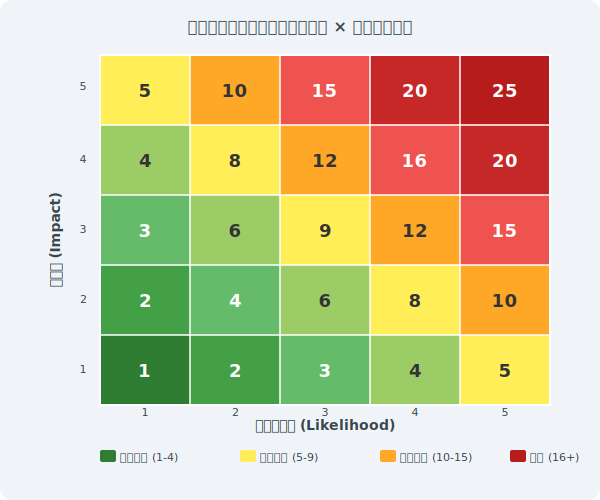

---

# リスク対応の4つの選択肢

> *回避・低減・移転・受容の4択でリスクごとに最適対応を選ぶ*

- <svg viewBox="0 0 800 400" style="max-height:70vh;max-width:100%;display:block;margin:0 auto;" xmlns="http://www.w3.org/2000/svg">
<rect width="800" height="400" fill="#1a1a2e"/>
<text x="400" y="28" text-anchor="middle" fill="#ffffff" font-size="16" font-weight="bold" font-family="sans-serif">リスク対応の4つの選択肢</text>
<rect x="20" y="55" width="370" height="140" rx="10" fill="#16213e" stroke="#f9a825" stroke-width="2.5"/>
<rect x="410" y="55" width="370" height="140" rx="10" fill="#16213e" stroke="#e91e63" stroke-width="2.5"/>
<rect x="20" y="215" width="370" height="140" rx="10" fill="#16213e" stroke="#2196f3" stroke-width="2.5"/>
<rect x="410" y="215" width="370" height="140" rx="10" fill="#16213e" stroke="#4caf50" stroke-width="2.5"/>
<text x="205" y="82" text-anchor="middle" fill="#f9a825" font-size="16" font-weight="bold" font-family="sans-serif">回避 (Avoid)</text>
<text x="595" y="82" text-anchor="middle" fill="#e91e63" font-size="16" font-weight="bold" font-family="sans-serif">低減 (Reduce)</text>
<text x="205" y="242" text-anchor="middle" fill="#2196f3" font-size="16" font-weight="bold" font-family="sans-serif">移転 (Transfer)</text>
<text x="595" y="242" text-anchor="middle" fill="#4caf50" font-size="16" font-weight="bold" font-family="sans-serif">受容 (Accept)</text>
<text x="205" y="112" text-anchor="middle" fill="#ffffff" font-size="13" font-family="sans-serif">リスクが高すぎる活動を</text>
<text x="205" y="135" text-anchor="middle" fill="#ffffff" font-size="13" font-family="sans-serif">停止・変更する</text>
<text x="205" y="160" text-anchor="middle" fill="#f9a825" font-size="12" font-family="sans-serif">例: 危険なサービスの廃止</text>
<text x="595" y="112" text-anchor="middle" fill="#ffffff" font-size="13" font-family="sans-serif">管理策を実装して</text>
<text x="595" y="135" text-anchor="middle" fill="#ffffff" font-size="13" font-family="sans-serif">リスクを許容レベルに</text>
<text x="595" y="160" text-anchor="middle" fill="#e91e63" font-size="12" font-family="sans-serif">例: 暗号化・アクセス制御</text>
<text x="205" y="272" text-anchor="middle" fill="#ffffff" font-size="13" font-family="sans-serif">第三者にリスクを</text>
<text x="205" y="295" text-anchor="middle" fill="#ffffff" font-size="13" font-family="sans-serif">移転する</text>
<text x="205" y="320" text-anchor="middle" fill="#2196f3" font-size="12" font-family="sans-serif">例: サイバー保険・外部委託</text>
<text x="595" y="272" text-anchor="middle" fill="#ffffff" font-size="13" font-family="sans-serif">許容できるリスクを</text>
<text x="595" y="295" text-anchor="middle" fill="#ffffff" font-size="13" font-family="sans-serif">受け入れる</text>
<text x="595" y="320" text-anchor="middle" fill="#4caf50" font-size="12" font-family="sans-serif">例: 低リスク・費用対効果低</text>
</svg>
- リスクアセスメント結果に基づき、各リスクへの対処方法を選択する
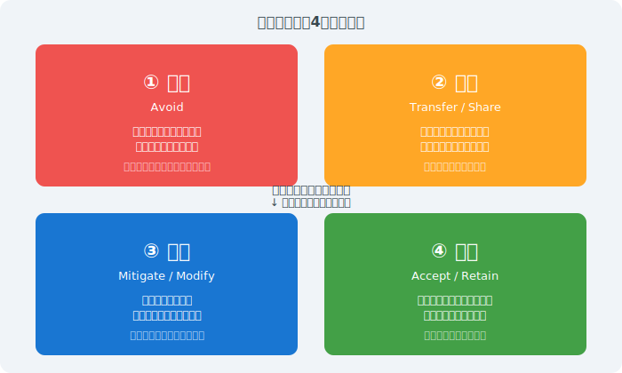

---

# 適用宣言書（Statement of Applicability / SoA）

> *SoAは93全管理策の適用・除外理由と実施状況を記載した認証審査の最重要文書*

- <svg viewBox="0 0 800 380" style="max-height:70vh;max-width:100%;display:block;margin:0 auto;" xmlns="http://www.w3.org/2000/svg"><rect width="800" height="380" fill="#1a1a2e"/>
<text x="400" y="28" font-size="16" fill="#f9a825" text-anchor="middle" font-weight="bold">適用宣言書（SoA）— Annex A 93管理策の適用判断</text>
<rect x="30" y="45" width="740" height="40" rx="6" fill="#16213e" stroke="#f9a825" stroke-width="2"/>
<text x="400" y="62" font-size="12" fill="#ffffff" text-anchor="middle">SoA = 全93管理策に対し「適用/除外」と理由・実施状況を記録した必須文書</text>
<text x="400" y="78" font-size="11" fill="#aaa" text-anchor="middle">（ISO/IEC 27001 箇条6.1.3 d) で明示要求）</text>
<text x="60" y="113" font-size="13" fill="#f9a825" text-anchor="middle">管理策</text>
<text x="200" y="113" font-size="13" fill="#f9a825" text-anchor="middle">適用</text>
<text x="320" y="113" font-size="13" fill="#f9a825" text-anchor="middle">適用理由</text>
<text x="510" y="113" font-size="13" fill="#f9a825" text-anchor="middle">実施状況</text>
<text x="680" y="113" font-size="13" fill="#f9a825" text-anchor="middle">除外理由</text>
<line x1="30" y1="118" x2="770" y2="118" stroke="#555" stroke-width="1"/>
<rect x="30" y="130" width="740" height="38" fill="#0d0d1a"/>
<text x="60" y="150" font-size="9.5" fill="#ffffff">5.1 情報セキュリティ方針</text>
<text x="200" y="150" font-size="13" fill="#4caf50" text-anchor="middle">✓</text>
<text x="320" y="150" font-size="9" fill="#ffffff" text-anchor="middle">法令要件・リスク対応</text>
<text x="510" y="150" font-size="9" fill="#4caf50" text-anchor="middle">完全実施</text>
<text x="680" y="144" font-size="8" fill="#aaa" text-anchor="middle">—</text><rect x="30" y="175" width="740" height="38" fill="#16213e"/>
<text x="60" y="195" font-size="9.5" fill="#ffffff">8.24 暗号の使用</text>
<text x="200" y="195" font-size="13" fill="#4caf50" text-anchor="middle">✓</text>
<text x="320" y="195" font-size="9" fill="#ffffff" text-anchor="middle">顧客データ保護</text>
<text x="510" y="195" font-size="9" fill="#ffffff" text-anchor="middle">一部実施</text>
<text x="680" y="189" font-size="8" fill="#aaa" text-anchor="middle">—</text><rect x="30" y="220" width="740" height="38" fill="#0d0d1a"/>
<text x="60" y="240" font-size="9.5" fill="#ffffff">7.4 物理的セキュリティ監視</text>
<text x="200" y="240" font-size="13" fill="#e91e63" text-anchor="middle">✗</text>
<text x="320" y="240" font-size="9" fill="#ffffff" text-anchor="middle">—</text>
<text x="510" y="240" font-size="9" fill="#ffffff" text-anchor="middle">—</text>
<text x="680" y="234" font-size="8" fill="#aaa" text-anchor="middle">全社員がセキュリティ区域</text><text x="680" y="248" font-size="8" fill="#aaa" text-anchor="middle">なし（オフィスのみ）</text><rect x="30" y="265" width="740" height="38" fill="#16213e"/>
<text x="60" y="285" font-size="9.5" fill="#ffffff">8.12 データ漏えい防止</text>
<text x="200" y="285" font-size="13" fill="#4caf50" text-anchor="middle">✓</text>
<text x="320" y="285" font-size="9" fill="#ffffff" text-anchor="middle">個人情報保護法対応</text>
<text x="510" y="285" font-size="9" fill="#f9a825" text-anchor="middle">計画中</text>
<text x="680" y="279" font-size="8" fill="#aaa" text-anchor="middle">—</text>
<rect x="30" y="315" width="740" height="55" rx="6" fill="#16213e" stroke="#4caf50" stroke-width="1"/>
<text x="400" y="338" font-size="12" fill="#4caf50" text-anchor="middle" font-weight="bold">SoA作成のポイント</text>
<text x="400" y="356" font-size="11" fill="#ffffff" text-anchor="middle">除外は合理的理由が必要 / リスクアセスメント結果と紐付け / 年次レビュー・更新が必須</text>
<text x="400" y="372" font-size="11" fill="#ffffff" text-anchor="middle">認証審査で必ず確認される最重要文書 — 形式より実態との一致が重要</text></svg>
- **SoAとは:** Annex A全93管理策について、適用の有無・理由・実施状況を記載した文書
- **必須記載事項:** ① 適用/除外の判断、② 選択根拠（リスク対応・法要件・契約等）、③ 実施状況
- **除外管理策:** 正当な理由が必要（例：物理的施設なし → 7.x の一部除外が可能）
- **SoAの作成タイミング:** リスクアセスメント・対応計画策定後に作成。認証審査の中心文書
- **2022年対応:** 旧114項目から93項目へのマッピング表を作成し移行する
- **審査員の確認ポイント:** 除外の論理的根拠・リスク対応計画との一致・実際の実施状況との整合

---

# リスクレジスターの実例

> *スコア化と残留リスク記録で経営層への説明責任を果たす*

| 資産 | 脅威 | 脆弱性 | 影響 | 可能性 | スコア | 対応 | 残留 |
|------|------|--------|------|--------|--------|------|------|
| 顧客DBサーバ | 不正ログイン | 弱いパスワード | 5 | 4 | **20** | MFA導入(8.5) | 8 |
| 業務PC | ランサムウェア | 未パッチOS | 4 | 4 | **16** | パッチ管理(8.8) | 6 |
| メールシステム | フィッシング | 教育不足 | 4 | 3 | **12** | 教育訓練(6.3) | 6 |
- リスクレジスターは**資産台帳・脅威分析・対応計画・SoAを接続する中核文書**として維持

---

<!-- _class: lead -->
# 第4章 主要管理策の詳細

- Annex A — 93の管理策を4カテゴリで詳解

---

# Annex A 管理策の4カテゴリ（2022年版）

> *4カテゴリへの再編はクラウド・AI・サプライチェーンリスクへの対応を意図している*

- <svg viewBox="0 0 800 380" style="max-height:70vh;max-width:100%;display:block;margin:0 auto;" xmlns="http://www.w3.org/2000/svg"><rect width="800" height="380" fill="#1a1a2e"/>
<text x="400" y="28" font-size="16" fill="#f9a825" text-anchor="middle" font-weight="bold">Annex A 管理策の4カテゴリ構造（2022年版）</text>
<rect x="30" y="50" width="360" height="155" rx="8" fill="#16213e" stroke="#f9a825" stroke-width="2"/>
<text x="210" y="72" font-size="12" fill="#f9a825" text-anchor="middle" font-weight="bold">第5節 組織的管理策</text>
<text x="210" y="90" font-size="16" fill="#f9a825" text-anchor="middle" font-weight="bold">37項目</text>
<text x="50" y="110" font-size="9" fill="#ffffff">5.1〜5.5: 方針・役割</text><text x="50" y="126" font-size="9" fill="#ffffff">5.6〜5.12: 資産・情報分類</text><text x="50" y="142" font-size="9" fill="#ffffff">5.13〜5.18: アクセス・供給者</text><text x="50" y="158" font-size="9" fill="#ffffff">5.19〜5.22: サプライヤー</text><text x="50" y="174" font-size="9" fill="#ffffff">5.23〜5.28: クラウド・インシデント</text><text x="50" y="190" font-size="9" fill="#ffffff">5.29〜5.37: BCP・法令・監査</text><rect x="410" y="50" width="360" height="155" rx="8" fill="#16213e" stroke="#e91e63" stroke-width="2"/>
<text x="590" y="72" font-size="12" fill="#e91e63" text-anchor="middle" font-weight="bold">第6節 人的管理策</text>
<text x="590" y="90" font-size="16" fill="#f9a825" text-anchor="middle" font-weight="bold">8項目</text>
<text x="430" y="110" font-size="9" fill="#ffffff">6.1: 選考（採用前）</text><text x="430" y="126" font-size="9" fill="#ffffff">6.2: 雇用条件・責任</text><text x="430" y="142" font-size="9" fill="#ffffff">6.3: 情報セキュリティ啓発</text><text x="430" y="158" font-size="9" fill="#ffffff">6.4: 懲戒プロセス</text><text x="430" y="174" font-size="9" fill="#ffffff">6.5: 退職後の責任</text><text x="430" y="190" font-size="9" fill="#ffffff">6.6〜6.8: 守秘義務・テレワーク</text><rect x="30" y="225" width="360" height="155" rx="8" fill="#16213e" stroke="#4caf50" stroke-width="2"/>
<text x="210" y="247" font-size="12" fill="#4caf50" text-anchor="middle" font-weight="bold">第7節 物理的管理策</text>
<text x="210" y="265" font-size="16" fill="#f9a825" text-anchor="middle" font-weight="bold">14項目</text>
<text x="50" y="285" font-size="9" fill="#ffffff">7.1〜7.4: 入退室・セキュリティ区域</text><text x="50" y="301" font-size="9" fill="#ffffff">7.5〜7.8: デスク・スクリーン・機器</text><text x="50" y="317" font-size="9" fill="#ffffff">7.9〜7.11: 持込/持出・保全</text><text x="50" y="333" font-size="9" fill="#ffffff">7.12〜7.14: ケーブル・廃棄・監視</text><rect x="410" y="225" width="360" height="155" rx="8" fill="#16213e" stroke="#2196f3" stroke-width="2"/>
<text x="590" y="247" font-size="12" fill="#2196f3" text-anchor="middle" font-weight="bold">第8節 技術的管理策</text>
<text x="590" y="265" font-size="16" fill="#f9a825" text-anchor="middle" font-weight="bold">34項目</text>
<text x="430" y="285" font-size="9" fill="#ffffff">8.1〜8.6: エンドポイント・アクセス</text><text x="430" y="301" font-size="9" fill="#ffffff">8.7〜8.13: マルウェア・バックアップ</text><text x="430" y="317" font-size="9" fill="#ffffff">8.14〜8.20: ネットワーク・Web</text><text x="430" y="333" font-size="9" fill="#ffffff">8.21〜8.34: 暗号・開発・脆弱性・クラウド</text></svg>
- **第5節 組織的管理策（37項目）:** 5.1〜5.37 — 方針・役割・資産管理・サプライヤー・インシデント・法令
- **第6節 人的管理策（8項目）:** 6.1〜6.8 — 採用・教育・秘密保持・テレワーク・退職時処理
- **第7節 物理的管理策（14項目）:** 7.1〜7.14 — 施設セキュリティ・クリアデスク・機器廃棄
- **第8節 技術的管理策（34項目）:** 8.1〜8.34 — アクセス管理・暗号化・ネットワーク・ログ
- **2013年版との比較:** 14ドメイン・114管理策 → 4カテゴリ・93管理策（統廃合＋11新規追加）
- **属性（Attributes）の活用:** 管理策タイプ（予防・検知・是正）等でフィルタリング可能

---

# 組織的管理策（Annex A 5） — 主要項目

> *方針・役割・資産管理・サプライヤー・インシデント管理が組織的管理策の5本柱*

- <svg viewBox="0 0 800 380" style="max-height:70vh;max-width:100%;display:block;margin:0 auto;" xmlns="http://www.w3.org/2000/svg"><rect width="800" height="380" fill="#1a1a2e"/>
<text x="400" y="28" font-size="15" fill="#f9a825" text-anchor="middle" font-weight="bold">組織的管理策（Annex A 5）— 主要項目と新設管理策</text>
<rect x="30" y="45" width="740" height="30" rx="5" fill="#16213e" stroke="#f9a825" stroke-width="1"/>
<text x="400" y="65" font-size="11" fill="#ffffff" text-anchor="middle">37項目（5.1〜5.37）— 2022年版で最も管理策数が多いカテゴリ</text>
<text x="90" y="100" font-size="12" fill="#e91e63" text-anchor="middle" font-weight="bold">新設管理策（2022年版）</text>
<rect x="30" y="110" width="740" height="26" rx="4" fill="#16213e" stroke="#e91e63" stroke-width="1"/>
<text x="50" y="128" font-size="11" fill="#e91e63" font-weight="bold">5.7 脅威インテリジェンス</text>
<text x="300" y="128" font-size="10" fill="#ffffff">脅威情報の収集・分析・活用</text><rect x="30" y="142" width="740" height="26" rx="4" fill="#16213e" stroke="#e91e63" stroke-width="1"/>
<text x="50" y="160" font-size="11" fill="#e91e63" font-weight="bold">5.23 クラウドセキュリティ</text>
<text x="300" y="160" font-size="10" fill="#ffffff">クラウドサービスの情報セキュリティ</text><rect x="30" y="174" width="740" height="26" rx="4" fill="#16213e" stroke="#e91e63" stroke-width="1"/>
<text x="50" y="192" font-size="11" fill="#e91e63" font-weight="bold">5.30 事業継続のためのICT対応</text>
<text x="300" y="192" font-size="10" fill="#ffffff">中断・障害時のICT継続性</text>
<text x="120" y="220" font-size="12" fill="#f9a825" text-anchor="middle" font-weight="bold">重要管理策</text>
<rect x="30" y="228" width="740" height="22" rx="3" fill="#0d0d1a"/>
<text x="50" y="244" font-size="10" fill="#f9a825" font-weight="bold">5.1 情報セキュリティ方針</text>
<text x="340" y="244" font-size="10" fill="#ffffff">経営者が承認・全員に伝達・定期見直し</text><rect x="30" y="256" width="740" height="22" rx="3" fill="#16213e"/>
<text x="50" y="272" font-size="10" fill="#f9a825" font-weight="bold">5.9 情報・関連資産のインベントリ</text>
<text x="340" y="272" font-size="10" fill="#ffffff">資産台帳の維持・所有者の割り当て</text><rect x="30" y="284" width="740" height="22" rx="3" fill="#0d0d1a"/>
<text x="50" y="300" font-size="10" fill="#f9a825" font-weight="bold">5.19 サプライヤー関係の情報セキュリティ</text>
<text x="340" y="300" font-size="10" fill="#ffffff">委託契約への要件明記</text><rect x="30" y="312" width="740" height="22" rx="3" fill="#16213e"/>
<text x="50" y="328" font-size="10" fill="#f9a825" font-weight="bold">5.24 インシデント管理の計画・準備</text>
<text x="340" y="328" font-size="10" fill="#ffffff">対応手順・報告体制の整備</text><rect x="30" y="340" width="740" height="22" rx="3" fill="#0d0d1a"/>
<text x="50" y="356" font-size="10" fill="#f9a825" font-weight="bold">5.34 プライバシーとPII保護</text>
<text x="340" y="356" font-size="10" fill="#ffffff">個人情報保護法との整合</text></svg>
- **5.1** 情報セキュリティのための方針群 — 方針の策定・承認・伝達・レビューサイクル
- **5.7** 脅威インテリジェンス（新規）— 脅威情報の収集・分析・組織内共有の仕組み
- **5.15〜5.18** アクセス制御 — ニーズトゥノウ原則・最小特権・アクセスレビュー
- **5.19〜5.22** サプライヤー関係 — セキュリティ要件の契約明記・定期的な監視と評価
- **5.23** クラウドサービスのセキュリティ（新規）— クラウド利用ポリシー・プロバイダ評価
- **5.24〜5.28** インシデント管理 — 検知・対応・学習・証拠保全のプロセス整備

---

# 人的管理策（Annex A 6） — 主要項目

> *採用前スクリーニングから退職後のアクセス管理まで従業員ライフサイクル全体をカバー*

- <svg viewBox="0 0 800 380" style="max-height:70vh;max-width:100%;display:block;margin:0 auto;" xmlns="http://www.w3.org/2000/svg"><rect width="800" height="380" fill="#1a1a2e"/>
<text x="400" y="28" font-size="15" fill="#f9a825" text-anchor="middle" font-weight="bold">人的管理策（Annex A 6）— ライフサイクル管理</text>
<rect x="30" y="50" width="170" height="180" rx="8" fill="#16213e" stroke="#4caf50" stroke-width="2"/>
<text x="115" y="72" font-size="12" fill="#4caf50" text-anchor="middle" font-weight="bold">採用前</text>
<text x="115" y="88" font-size="10" fill="#aaa" text-anchor="middle">Before</text>
<text x="42" y="108" font-size="9.5" fill="#ffffff">6.1 選考（スクリーニング）</text><text x="42" y="125" font-size="9.5" fill="#ffffff">  身元確認・犯歴確認・学歴確認</text><text x="42" y="142" font-size="9.5" fill="#ffffff">  役割に応じた深度で実施</text><rect x="210" y="50" width="280" height="180" rx="8" fill="#16213e" stroke="#f9a825" stroke-width="2"/>
<text x="350" y="72" font-size="12" fill="#f9a825" text-anchor="middle" font-weight="bold">雇用中</text>
<text x="350" y="88" font-size="10" fill="#aaa" text-anchor="middle">During</text>
<text x="222" y="108" font-size="9.5" fill="#ffffff">6.2 雇用条件</text><text x="222" y="125" font-size="9.5" fill="#ffffff">  守秘義務・セキュリティ責任を契約に明記</text><text x="222" y="142" font-size="9.5" fill="#ffffff">6.3 情報セキュリティ啓発・教育・訓練</text><text x="222" y="159" font-size="9.5" fill="#ffffff">  年1回以上の研修・記録の保管</text><rect x="500" y="50" width="170" height="180" rx="8" fill="#16213e" stroke="#e91e63" stroke-width="2"/>
<text x="585" y="72" font-size="12" fill="#e91e63" text-anchor="middle" font-weight="bold">退職・異動</text>
<text x="585" y="88" font-size="10" fill="#aaa" text-anchor="middle">After</text>
<text x="512" y="108" font-size="9.5" fill="#ffffff">6.5 退職・変更後の責任</text><text x="512" y="125" font-size="9.5" fill="#ffffff">  機密保持の継続義務</text><text x="512" y="142" font-size="9.5" fill="#ffffff">6.6 守秘義務または秘密保持契約</text><text x="512" y="159" font-size="9.5" fill="#ffffff">  退職時に再署名</text>
<polygon points="195,135 210,130 210,140" fill="#f9a825"/>
<line x1="200" y1="135" x2="210" y2="135" stroke="#f9a825" stroke-width="2"/>
<polygon points="485,135 498,130 498,140" fill="#f9a825"/>
<line x1="490" y1="135" x2="498" y2="135" stroke="#f9a825" stroke-width="2"/>
<text x="400" y="262" font-size="13" fill="#e91e63" text-anchor="middle" font-weight="bold">新設: 6.7 リモートワーク / 6.8 情報セキュリティ事象の報告</text>
<rect x="30" y="275" width="380" height="80" rx="6" fill="#16213e" stroke="#2196f3" stroke-width="1"/>
<text x="220" y="295" font-size="11" fill="#2196f3" text-anchor="middle" font-weight="bold">6.7 リモートワーク</text>
<text x="220" y="313" font-size="10" fill="#ffffff" text-anchor="middle">テレワーク環境のセキュリティ要件</text><text x="220" y="330" font-size="10" fill="#ffffff" text-anchor="middle">（端末管理・VPN・画面覗き見対策）</text><rect x="420" y="275" width="380" height="80" rx="6" fill="#16213e" stroke="#ff6f00" stroke-width="1"/>
<text x="610" y="295" font-size="11" fill="#ff6f00" text-anchor="middle" font-weight="bold">6.8 情報セキュリティ事象の報告</text>
<text x="610" y="313" font-size="10" fill="#ffffff" text-anchor="middle">インシデントの迅速な報告体制</text><text x="610" y="330" font-size="10" fill="#ffffff" text-anchor="middle">（報告チャネル・報告義務の周知）</text></svg>
- **6.1** 選考（スクリーニング）— 採用前の身元確認・経歴確認（役割に応じた深度）
- **6.2** 雇用条件 — 守秘義務・セキュリティ義務を雇用契約・就業規則に明記
- **6.3** 情報セキュリティの認識・教育・訓練 — 全従業員対象の定期教育・役割別訓練
- **6.4** 懲戒手続き — セキュリティポリシー違反への対応手順を明文化
- **6.5** 雇用の終了または変更後の責任 — 退職・異動時のアクセス権即時無効化
- **6.8** 情報セキュリティ事象の報告 — 従業員が疑わしい事象を容易に報告できる仕組み

---

# 物理的管理策（Annex A 7） — 主要項目

> *多層入退室管理・環境制御・ケーブルセキュリティが物理的管理策の三大要件*

- <svg viewBox="0 0 800 380" style="max-height:70vh;max-width:100%;display:block;margin:0 auto;" xmlns="http://www.w3.org/2000/svg"><rect width="800" height="380" fill="#1a1a2e"/>
<text x="400" y="28" font-size="15" fill="#f9a825" text-anchor="middle" font-weight="bold">物理的管理策（Annex A 7）— 多層防御</text>
<rect x="280" y="45" width="240" height="35" rx="6" fill="#16213e" stroke="#e91e63" stroke-width="2"/>
<text x="400" y="68" font-size="12" fill="#ffffff" text-anchor="middle">外部（建物・敷地境界）</text>
<rect x="200" y="88" width="400" height="35" rx="6" fill="#16213e" stroke="#f9a825" stroke-width="2"/>
<text x="400" y="111" font-size="12" fill="#ffffff" text-anchor="middle">入館管理（受付・ICカード）</text>
<rect x="150" y="131" width="500" height="35" rx="6" fill="#16213e" stroke="#4caf50" stroke-width="2"/>
<text x="400" y="154" font-size="12" fill="#ffffff" text-anchor="middle">オフィスフロア（クリアデスク・スクリーンロック）</text>
<rect x="100" y="174" width="600" height="35" rx="6" fill="#16213e" stroke="#2196f3" stroke-width="2"/>
<text x="400" y="197" font-size="12" fill="#ffffff" text-anchor="middle">サーバ室・機密区域（生体認証・2人規則・CCTV）</text>
<rect x="50" y="217" width="700" height="35" rx="6" fill="#16213e" stroke="#ff6f00" stroke-width="2"/>
<text x="400" y="240" font-size="12" fill="#ffffff" text-anchor="middle">機器・媒体（施錠・ケーブルロック・暗号化ストレージ）</text>
<text x="400" y="285" font-size="12" fill="#e91e63" text-anchor="middle" font-weight="bold">主要管理策のポイント</text>
<rect x="30" y="295" width="175" height="80" rx="5" fill="#16213e"/>
<text x="117" y="313" font-size="9.5" fill="#f9a825" text-anchor="middle" font-weight="bold">7.1 物理的境界</text>
<text x="117" y="345" font-size="9" fill="#ffffff" text-anchor="middle">サーバ室の壁・施錠扉</text><text x="117" y="361" font-size="9" fill="#ffffff" text-anchor="middle">窓・天井・床も対象</text><rect x="215" y="295" width="175" height="80" rx="5" fill="#16213e"/>
<text x="302" y="313" font-size="9.5" fill="#f9a825" text-anchor="middle" font-weight="bold">7.6 セキュリティ区域</text><text x="302" y="327" font-size="9.5" fill="#f9a825" text-anchor="middle" font-weight="bold">での作業</text>
<text x="302" y="345" font-size="9" fill="#ffffff" text-anchor="middle">一人作業禁止</text><text x="302" y="361" font-size="9" fill="#ffffff" text-anchor="middle">訪問者の常時同行</text><rect x="400" y="295" width="175" height="80" rx="5" fill="#16213e"/>
<text x="487" y="313" font-size="9.5" fill="#f9a825" text-anchor="middle" font-weight="bold">7.9 構外の資産</text>
<text x="487" y="345" font-size="9" fill="#ffffff" text-anchor="middle">ノートPC・スマホの</text><text x="487" y="361" font-size="9" fill="#ffffff" text-anchor="middle">持ち出し記録・暗号化</text><rect x="585" y="295" width="175" height="80" rx="5" fill="#16213e"/>
<text x="672" y="313" font-size="9.5" fill="#f9a825" text-anchor="middle" font-weight="bold">7.14 機器の安全な廃棄</text><text x="672" y="327" font-size="9.5" fill="#f9a825" text-anchor="middle" font-weight="bold">・転用</text>
<text x="672" y="345" font-size="9" fill="#ffffff" text-anchor="middle">データ消去証明</text><text x="672" y="361" font-size="9" fill="#ffffff" text-anchor="middle">物理破壊または上書き</text></svg>
- **7.1** 物理的セキュリティ境界 — サーバ室・機密区域への多層的な入退室管理
- **7.2** 物理的エントリ — ICカード・生体認証・訪問者管理台帳・同行ルール
- **7.4** 物理的セキュリティ監視（新規）— 監視カメラ・警備システムの導入・録画保管
- **7.7** クリアデスク・クリアスクリーン方針 — 離席時のPC施錠・書類の保管
- **7.8〜7.12** 機器の管理 — 廃棄時のデータ消去・持ち出し承認・ケーブル管理
- **7.14** 機器の安全な廃棄 — HDDの物理破壊またはDoD準拠の消去、証跡の保管

---

# 技術的管理策（Annex A 8） — 全体概観

> *アクセス管理・暗号・脆弱性管理・ログ監視の4技術領域が技術的管理策の主軸*

- <svg viewBox="0 0 800 380" style="max-height:70vh;max-width:100%;display:block;margin:0 auto;" xmlns="http://www.w3.org/2000/svg"><rect width="800" height="380" fill="#1a1a2e"/>
<text x="400" y="28" font-size="15" fill="#f9a825" text-anchor="middle" font-weight="bold">技術的管理策（Annex A 8）— 34項目の全体像</text>
<rect x="30" y="45" width="200" height="140" rx="6" fill="#16213e" stroke="#2196f3" stroke-width="2"/>
<text x="130" y="63" font-size="9.5" fill="#2196f3" text-anchor="middle" font-weight="bold">アクセス管理</text><text x="130" y="77" font-size="9.5" fill="#2196f3" text-anchor="middle" font-weight="bold">(8.2〜8.6)</text>
<text x="130" y="97" font-size="9" fill="#ffffff" text-anchor="middle">特権アクセス・認証・最小権限</text><text x="130" y="113" font-size="9" fill="#ffffff" text-anchor="middle">情報アクセス制限・ソースコード</text><rect x="240" y="45" width="200" height="140" rx="6" fill="#16213e" stroke="#e91e63" stroke-width="2"/>
<text x="340" y="63" font-size="9.5" fill="#e91e63" text-anchor="middle" font-weight="bold">マルウェア・変更管理</text><text x="340" y="77" font-size="9.5" fill="#e91e63" text-anchor="middle" font-weight="bold">(8.7〜8.9)</text>
<text x="340" y="97" font-size="9" fill="#ffffff" text-anchor="middle">マルウェア対策・設定管理</text><text x="340" y="113" font-size="9" fill="#ffffff" text-anchor="middle">変更管理プロセス</text><rect x="450" y="45" width="200" height="140" rx="6" fill="#16213e" stroke="#ff6f00" stroke-width="2"/>
<text x="550" y="63" font-size="9.5" fill="#ff6f00" text-anchor="middle" font-weight="bold">情報削除・ログ</text><text x="550" y="77" font-size="9.5" fill="#ff6f00" text-anchor="middle" font-weight="bold">(8.10〜8.16)</text>
<text x="550" y="97" font-size="9" fill="#ffffff" text-anchor="middle">ストレージ・ログ記録</text><text x="550" y="113" font-size="9" fill="#ffffff" text-anchor="middle">監視・特権ユーティリティ</text><rect x="660" y="45" width="200" height="140" rx="6" fill="#16213e" stroke="#f9a825" stroke-width="2"/>
<text x="760" y="63" font-size="9.5" fill="#f9a825" text-anchor="middle" font-weight="bold">脆弱性管理</text><text x="760" y="77" font-size="9.5" fill="#f9a825" text-anchor="middle" font-weight="bold">(8.17〜8.20)</text>
<text x="760" y="97" font-size="9" fill="#ffffff" text-anchor="middle">脆弱性管理・監査ログ</text><text x="760" y="113" font-size="9" fill="#ffffff" text-anchor="middle">Webフィルタリング・ネットワーク</text><rect x="30" y="195" width="200" height="140" rx="6" fill="#16213e" stroke="#4caf50" stroke-width="2"/>
<text x="130" y="213" font-size="9.5" fill="#4caf50" text-anchor="middle" font-weight="bold">暗号・開発</text><text x="130" y="227" font-size="9.5" fill="#4caf50" text-anchor="middle" font-weight="bold">(8.21〜8.28)</text>
<text x="130" y="247" font-size="9" fill="#ffffff" text-anchor="middle">暗号化・PKI・セキュアな</text><text x="130" y="263" font-size="9" fill="#ffffff" text-anchor="middle">開発・テスト・バックアップ</text><rect x="240" y="195" width="200" height="140" rx="6" fill="#16213e" stroke="#2196f3" stroke-width="2"/>
<text x="340" y="213" font-size="9.5" fill="#2196f3" text-anchor="middle" font-weight="bold">クラウドセキュリティ</text><text x="340" y="227" font-size="9.5" fill="#2196f3" text-anchor="middle" font-weight="bold">(8.23〜8.25)</text>
<text x="340" y="247" font-size="9" fill="#ffffff" text-anchor="middle">クラウド利用制御</text><text x="340" y="263" font-size="9" fill="#ffffff" text-anchor="middle">インターネット露出・フィルタ</text><rect x="450" y="195" width="200" height="140" rx="6" fill="#16213e" stroke="#ff6f00" stroke-width="2"/>
<text x="550" y="213" font-size="9.5" fill="#ff6f00" text-anchor="middle" font-weight="bold">情報システム監査</text><text x="550" y="227" font-size="9.5" fill="#ff6f00" text-anchor="middle" font-weight="bold">(8.33〜8.34)</text>
<text x="550" y="247" font-size="9" fill="#ffffff" text-anchor="middle">監査ツールの保護</text><text x="550" y="263" font-size="9" fill="#ffffff" text-anchor="middle">システム監査への影響排除</text><rect x="660" y="195" width="200" height="140" rx="6" fill="#16213e" stroke="#e91e63" stroke-width="2"/>
<text x="760" y="213" font-size="9.5" fill="#e91e63" text-anchor="middle" font-weight="bold">新設管理策</text>
<text x="760" y="247" font-size="9" fill="#ffffff" text-anchor="middle">8.9 構成管理</text><text x="760" y="263" font-size="9" fill="#ffffff" text-anchor="middle">8.10 情報の削除</text><text x="760" y="279" font-size="9" fill="#ffffff" text-anchor="middle">8.11 データマスキング</text><text x="760" y="295" font-size="9" fill="#ffffff" text-anchor="middle">8.12 データ漏えい防止</text><text x="760" y="311" font-size="9" fill="#ffffff" text-anchor="middle">8.16 監視活動 など</text></svg>
- **アクセス管理（8.2〜8.6）:** 特権アクセス・認証・最小権限・情報アクセス制限
- **マルウェア対策・変更管理（8.7〜8.9）:** エンドポイント保護・ソフトウェアインストール制限・構成管理
- **データ管理（8.10〜8.13）:** 情報の削除・データマスキング・DLP・バックアップ
- **ログと監視（8.15〜8.17）:** 監査ログ・監視活動・クロック同期
- **ネットワーク・暗号化（8.20〜8.24）:** 通信の保護・Webフィルタリング・暗号アルゴリズム
- **開発・運用（8.25〜8.34）:** セキュアな開発・テスト・脆弱性管理・ペネトレーションテスト

---

# アクセス管理と認証（Annex A 8.2〜8.6）

> *特権アクセスのJust-in-Time払い出しとMFAによる認証強化が最優先の対策*

- <svg viewBox="0 0 800 380" style="max-height:70vh;max-width:100%;display:block;margin:0 auto;" xmlns="http://www.w3.org/2000/svg"><rect width="800" height="380" fill="#1a1a2e"/>
<text x="400" y="28" font-size="15" fill="#f9a825" text-anchor="middle" font-weight="bold">アクセス管理と認証（Annex A 8.2〜8.6）</text>
<rect x="30" y="45" width="360" height="155" rx="6" fill="#16213e" stroke="#e91e63" stroke-width="2"/>
<text x="210" y="65" font-size="11" fill="#e91e63" text-anchor="middle" font-weight="bold">8.2 特権アクセス権の管理</text>
<text x="50" y="85" font-size="10" fill="#ffffff">原則: Just-in-Time 権限（使用時のみ付与）</text><text x="50" y="107" font-size="10" fill="#ffffff">特権アカウントの申請・承認フロー</text><text x="50" y="129" font-size="10" fill="#ffffff">四半期ごとのレビュー・棚卸し</text><text x="50" y="151" font-size="10" fill="#ffffff">PAM（特権アクセス管理）ツールの活用</text><rect x="410" y="45" width="360" height="155" rx="6" fill="#16213e" stroke="#2196f3" stroke-width="2"/>
<text x="590" y="65" font-size="11" fill="#2196f3" text-anchor="middle" font-weight="bold">8.3 情報アクセス制限</text>
<text x="430" y="85" font-size="10" fill="#ffffff">Need-to-Know原則（必要最小限）</text><text x="430" y="107" font-size="10" fill="#ffffff">情報分類に基づくアクセス制御</text><text x="430" y="129" font-size="10" fill="#ffffff">RBAC/ABAC（役割/属性ベース）</text><text x="430" y="151" font-size="10" fill="#ffffff">データオーナーによる定期レビュー</text><rect x="30" y="200" width="360" height="155" rx="6" fill="#16213e" stroke="#4caf50" stroke-width="2"/>
<text x="210" y="220" font-size="11" fill="#4caf50" text-anchor="middle" font-weight="bold">8.5 セキュアな認証</text>
<text x="50" y="240" font-size="10" fill="#ffffff">多要素認証（MFA）の適用範囲</text><text x="50" y="262" font-size="10" fill="#ffffff">特権アカウント: 必須</text><text x="50" y="284" font-size="10" fill="#ffffff">外部アクセス（VPN・クラウド）: 必須</text><text x="50" y="306" font-size="10" fill="#ffffff">パスワードポリシー: 複雑性より長さ優先</text><rect x="410" y="200" width="360" height="155" rx="6" fill="#16213e" stroke="#f9a825" stroke-width="2"/>
<text x="590" y="220" font-size="11" fill="#f9a825" text-anchor="middle" font-weight="bold">8.6 容量・能力管理</text>
<text x="430" y="240" font-size="10" fill="#ffffff">ストレージ・CPU・帯域の監視</text><text x="430" y="262" font-size="10" fill="#ffffff">閾値アラート設定</text><text x="430" y="284" font-size="10" fill="#ffffff">容量計画（6〜12ヶ月先見通し）</text><text x="430" y="306" font-size="10" fill="#ffffff">DDoS対策（WAF・CDN）</text>
<rect x="30" y="370" width="740" height="0" rx="0" fill="none"/></svg>
- **8.2 特権アクセス権の管理:** 管理者アカウントの払い出し基準・定期的なレビュー・Just-in-Time権限
- **8.3 情報アクセス制限:** ロールベースアクセス制御（RBAC）・ニーズトゥノウ原則の徹底
- **8.5 セキュアな認証:** 多要素認証（MFA）の実装 — パスワードポリシー（長さ・複雑さ・有効期限）
- **8.6 容量・能力の管理:** システムリソースの監視・ピーク時のキャパシティ確保
- **特権アクセス管理（PAM）ツール:** 特権IDの一元管理・セッション録画・自動払い出し
- **審査のポイント:** アクセス権の定期棚卸し記録（半年〜1年に1回以上）・退職者の即時無効化証跡

---

# 暗号化とデータ保護（Annex A 8.24）

> *禁止アルゴリズムの明文化と鍵管理プロセスの文書化が暗号管理策の必須要件*

- <svg viewBox="0 0 800 380" style="max-height:70vh;max-width:100%;display:block;margin:0 auto;" xmlns="http://www.w3.org/2000/svg"><rect width="800" height="380" fill="#1a1a2e"/>
<text x="400" y="28" font-size="15" fill="#f9a825" text-anchor="middle" font-weight="bold">暗号化とデータ保護（Annex A 8.24）</text>
<text x="200" y="58" font-size="13" fill="#e91e63" text-anchor="middle" font-weight="bold">禁止アルゴリズム</text>
<text x="590" y="58" font-size="13" fill="#4caf50" text-anchor="middle" font-weight="bold">推奨アルゴリズム</text>
<line x1="400" y1="45" x2="400" y2="175" stroke="#444" stroke-width="1" stroke-dasharray="4"/>
<rect x="50" y="68" width="75" height="28" rx="5" fill="#16213e" stroke="#e91e63" stroke-width="2"/>
<text x="87" y="87" font-size="11" fill="#e91e63" text-anchor="middle">MD5</text><rect x="130" y="68" width="75" height="28" rx="5" fill="#16213e" stroke="#e91e63" stroke-width="2"/>
<text x="167" y="87" font-size="11" fill="#e91e63" text-anchor="middle">SHA-1</text><rect x="210" y="68" width="75" height="28" rx="5" fill="#16213e" stroke="#e91e63" stroke-width="2"/>
<text x="247" y="87" font-size="11" fill="#e91e63" text-anchor="middle">DES/3DES</text><rect x="290" y="68" width="75" height="28" rx="5" fill="#16213e" stroke="#e91e63" stroke-width="2"/>
<text x="327" y="87" font-size="11" fill="#e91e63" text-anchor="middle">RC4</text>
<rect x="415" y="68" width="85" height="28" rx="5" fill="#16213e" stroke="#4caf50" stroke-width="2"/>
<text x="457" y="87" font-size="10" fill="#4caf50" text-anchor="middle">AES-256</text><rect x="505" y="68" width="85" height="28" rx="5" fill="#16213e" stroke="#4caf50" stroke-width="2"/>
<text x="547" y="87" font-size="10" fill="#4caf50" text-anchor="middle">ChaCha20</text><rect x="595" y="68" width="85" height="28" rx="5" fill="#16213e" stroke="#4caf50" stroke-width="2"/>
<text x="637" y="87" font-size="10" fill="#4caf50" text-anchor="middle">SHA-256/512</text><rect x="685" y="68" width="85" height="28" rx="5" fill="#16213e" stroke="#4caf50" stroke-width="2"/>
<text x="727" y="87" font-size="10" fill="#4caf50" text-anchor="middle">RSA-2048+</text>
<rect x="415" y="100" width="85" height="28" rx="5" fill="#16213e" stroke="#4caf50" stroke-width="2"/>
<text x="457" y="119" font-size="10" fill="#4caf50" text-anchor="middle">ECDSA P-256</text><rect x="505" y="100" width="85" height="28" rx="5" fill="#16213e" stroke="#4caf50" stroke-width="2"/>
<text x="547" y="119" font-size="10" fill="#4caf50" text-anchor="middle">Ed25519</text><rect x="595" y="100" width="85" height="28" rx="5" fill="#16213e" stroke="#4caf50" stroke-width="2"/>
<text x="637" y="119" font-size="10" fill="#4caf50" text-anchor="middle">TLS 1.2/1.3</text><rect x="685" y="100" width="85" height="28" rx="5" fill="#16213e" stroke="#4caf50" stroke-width="2"/>
<text x="727" y="119" font-size="10" fill="#4caf50" text-anchor="middle">bcrypt/scrypt</text>
<text x="400" y="200" font-size="13" fill="#f9a825" text-anchor="middle" font-weight="bold">暗号ポリシーの必須要素</text>
<rect x="30" y="215" width="170" height="90" rx="6" fill="#16213e" stroke="#2196f3" stroke-width="1"/>
<text x="115" y="235" font-size="11" fill="#2196f3" text-anchor="middle" font-weight="bold">鍵管理</text>
<text x="115" y="265" font-size="10" fill="#ffffff" text-anchor="middle">鍵の生成・配布・</text><text x="115" y="281" font-size="10" fill="#ffffff" text-anchor="middle">保管・廃棄・更新周期</text><rect x="220" y="215" width="170" height="90" rx="6" fill="#16213e" stroke="#f9a825" stroke-width="1"/>
<text x="305" y="235" font-size="11" fill="#f9a825" text-anchor="middle" font-weight="bold">適用範囲</text>
<text x="305" y="265" font-size="10" fill="#ffffff" text-anchor="middle">保存データ・通信データ</text><text x="305" y="281" font-size="10" fill="#ffffff" text-anchor="middle">・バックアップ</text><rect x="410" y="215" width="170" height="90" rx="6" fill="#16213e" stroke="#4caf50" stroke-width="1"/>
<text x="495" y="235" font-size="11" fill="#4caf50" text-anchor="middle" font-weight="bold">アルゴリズム</text><text x="495" y="249" font-size="11" fill="#4caf50" text-anchor="middle" font-weight="bold">承認リスト</text>
<text x="495" y="265" font-size="10" fill="#ffffff" text-anchor="middle">禁止/推奨を明文化</text><text x="495" y="281" font-size="10" fill="#ffffff" text-anchor="middle">年次見直し</text><rect x="600" y="215" width="170" height="90" rx="6" fill="#16213e" stroke="#ff6f00" stroke-width="1"/>
<text x="685" y="235" font-size="11" fill="#ff6f00" text-anchor="middle" font-weight="bold">コンプライアンス</text>
<text x="685" y="265" font-size="10" fill="#ffffff" text-anchor="middle">輸出規制・</text><text x="685" y="281" font-size="10" fill="#ffffff" text-anchor="middle">法域ごとの制約</text>
<rect x="30" y="320" width="740" height="50" rx="6" fill="#16213e" stroke="#f9a825" stroke-width="1"/>
<text x="400" y="343" font-size="11" fill="#ffffff" text-anchor="middle">HSM（ハードウェアセキュリティモジュール）: 鍵の安全な保管 / 量子コンピュータ対策（PQC）への移行計画も検討</text>
<text x="400" y="361" font-size="11" fill="#ffffff" text-anchor="middle">TLS 1.0/1.1は廃止 / 証明書の自動更新（Let's Encrypt・ACM）で管理負担を軽減</text></svg>
- **8.24 暗号の使用:** 暗号アルゴリズムポリシー — 禁止アルゴリズム（MD5・SHA-1・DES等）の明文化
- **推奨アルゴリズム:** 対称 AES-256、非対称 RSA-2048以上/ECDSA-P256以上、ハッシュ SHA-256以上
- **鍵管理:** 鍵の生成・配布・保管・ローテーション・廃棄サイクルの文書化
- **TLS 1.2以上の強制:** HTTPSの導入・古いプロトコル（TLS 1.0/1.1）の無効化
- **保存データの暗号化:** DBの暗号化・フルディスク暗号化（Bitlocker/FileVault等）
- **法的要件との調整:** 一部国では強暗号の輸出規制あり（海外展開時に要確認）

---

# サプライヤー管理（Annex A 5.19〜5.22）

- 委託先・クラウドプロバイダへの情報セキュリティ要件の伝達・管理が必須
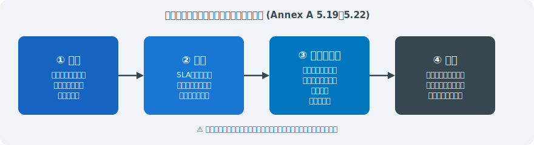

---

# インシデント管理プロセス（Annex A 5.24〜5.28）

- 検知から学習まで一貫したプロセスで対応し、継続的改善につなげる
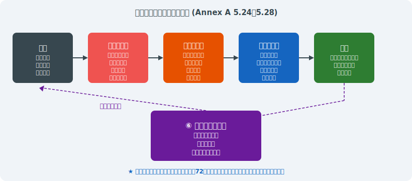

---

<!-- _class: lead -->
# 第5章 認証審査の実践ポイント

- Stage 1・Stage 2・サーベイランス・更新審査の実務

---

# ISMS認証審査プロセスの全体像

> *Stage1文書審査→Stage2現地審査→認証→サーベイランスの流れ*

- <svg viewBox="0 0 800 400" style="max-height:70vh;max-width:100%;display:block;margin:0 auto;" xmlns="http://www.w3.org/2000/svg">
<rect width="800" height="400" fill="#1a1a2e"/>
<text x="400" y="28" text-anchor="middle" fill="#ffffff" font-size="15" font-weight="bold" font-family="sans-serif">ISMS認証審査プロセスの全体像</text>
<rect x="20" y="50" width="165" height="270" rx="10" fill="#16213e" stroke="#f9a825" stroke-width="2"/>
<rect x="210" y="50" width="165" height="270" rx="10" fill="#16213e" stroke="#e91e63" stroke-width="2"/>
<rect x="400" y="50" width="165" height="270" rx="10" fill="#16213e" stroke="#2196f3" stroke-width="2"/>
<rect x="590" y="50" width="185" height="270" rx="10" fill="#16213e" stroke="#4caf50" stroke-width="2"/>
<text x="102" y="78" text-anchor="middle" fill="#f9a825" font-size="13" font-weight="bold" font-family="sans-serif">初期適用</text>
<text x="292" y="78" text-anchor="middle" fill="#e91e63" font-size="13" font-weight="bold" font-family="sans-serif">Stage 1</text>
<text x="482" y="78" text-anchor="middle" fill="#2196f3" font-size="13" font-weight="bold" font-family="sans-serif">Stage 2</text>
<text x="682" y="78" text-anchor="middle" fill="#4caf50" font-size="13" font-weight="bold" font-family="sans-serif">維持審査</text>
<text x="102" y="105" text-anchor="middle" fill="#ffffff" font-size="11" font-family="sans-serif">ISMS構築</text>
<text x="292" y="105" text-anchor="middle" fill="#ffffff" font-size="11" font-family="sans-serif">文書審査</text>
<text x="482" y="105" text-anchor="middle" fill="#ffffff" font-size="11" font-family="sans-serif">現地審査</text>
<text x="682" y="105" text-anchor="middle" fill="#ffffff" font-size="11" font-family="sans-serif">サーベイランス</text>
<text x="35" y="135" fill="#ffffff" font-size="11" font-family="sans-serif">• 適用範囲決定</text>
<text x="35" y="158" fill="#ffffff" font-size="11" font-family="sans-serif">• リスクアセスメント</text>
<text x="35" y="181" fill="#ffffff" font-size="11" font-family="sans-serif">• 管理策実施</text>
<text x="35" y="204" fill="#ffffff" font-size="11" font-family="sans-serif">• 内部監査</text>
<text x="35" y="227" fill="#ffffff" font-size="11" font-family="sans-serif">• マネジメント</text>
<text x="35" y="244" fill="#ffffff" font-size="11" font-family="sans-serif">  レビュー</text>
<text x="225" y="135" fill="#ffffff" font-size="11" font-family="sans-serif">• ISMS文書確認</text>
<text x="225" y="158" fill="#ffffff" font-size="11" font-family="sans-serif">• SoA確認</text>
<text x="225" y="181" fill="#ffffff" font-size="11" font-family="sans-serif">• リスク台帳確認</text>
<text x="225" y="204" fill="#ffffff" font-size="11" font-family="sans-serif">• 是正事項の確認</text>
<text x="225" y="230" fill="#e91e63" font-size="11" font-family="sans-serif">不適合→是正必要</text>
<text x="415" y="135" fill="#ffffff" font-size="11" font-family="sans-serif">• 現場インタビュー</text>
<text x="415" y="158" fill="#ffffff" font-size="11" font-family="sans-serif">• 証跡確認</text>
<text x="415" y="181" fill="#ffffff" font-size="11" font-family="sans-serif">• 運用確認</text>
<text x="415" y="204" fill="#ffffff" font-size="11" font-family="sans-serif">• 教育記録確認</text>
<text x="415" y="230" fill="#f9a825" font-size="11" font-family="sans-serif">認証決定</text>
<text x="605" y="135" fill="#ffffff" font-size="11" font-family="sans-serif">• 年1回(3年間)</text>
<text x="605" y="158" fill="#ffffff" font-size="11" font-family="sans-serif">• 継続運用確認</text>
<text x="605" y="181" fill="#ffffff" font-size="11" font-family="sans-serif">• 改善実施確認</text>
<text x="605" y="204" fill="#ffffff" font-size="11" font-family="sans-serif">• 更新審査(3年)</text>
<text x="605" y="230" fill="#4caf50" font-size="11" font-family="sans-serif">認証維持</text>
<line x1="185" y1="205" x2="210" y2="205" stroke="#f9a825" stroke-width="2"/>
<polygon points="210,205 198,199 198,211" fill="#f9a825"/>
<line x1="375" y1="205" x2="400" y2="205" stroke="#e91e63" stroke-width="2"/>
<polygon points="400,205 388,199 388,211" fill="#e91e63"/>
<line x1="565" y1="205" x2="590" y2="205" stroke="#2196f3" stroke-width="2"/>
<polygon points="590,205 578,199 578,211" fill="#2196f3"/>
<text x="400" y="360" text-anchor="middle" fill="#f9a825" font-size="12" font-family="sans-serif">認証取得後: サーベイランス(年1回) + 更新審査(3年毎)</text>
</svg>
- ギャップ分析から認証後のサーベイランスまで、3年サイクルで継続的に維持する
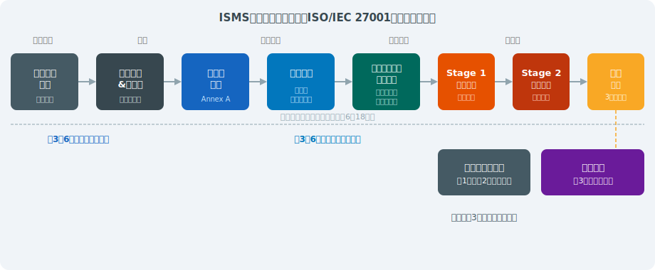

---

# Stage 1 審査（文書審査）— 重点確認事項

> *SoA・スコープ・リスクアセスメント文書の整合性がStage 1審査の三大確認事項*

- <svg viewBox="0 0 800 380" style="max-height:70vh;max-width:100%;display:block;margin:0 auto;" xmlns="http://www.w3.org/2000/svg"><rect width="800" height="380" fill="#1a1a2e"/>
<text x="400" y="28" font-size="15" fill="#f9a825" text-anchor="middle" font-weight="bold">Stage 1 審査（文書審査）— 重点確認事項</text>
<rect x="30" y="45" width="740" height="30" rx="5" fill="#16213e" stroke="#f9a825" stroke-width="1"/>
<text x="400" y="66" font-size="11" fill="#ffffff" text-anchor="middle">目的: ISMSの設計が適切で Stage 2 に進める準備ができているか確認（通常1〜2日）</text>
<text x="90" y="98" font-size="12" fill="#f9a825" text-anchor="middle">確認項目</text>
<text x="550" y="98" font-size="12" fill="#f9a825" text-anchor="middle">審査官が確認すること</text>
<line x1="30" y1="104" x2="770" y2="104" stroke="#444" stroke-width="1"/>
<rect x="30" y="112" width="740" height="26" rx="3" fill="#0d0d1a"/>
<text x="50" y="130" font-size="10" fill="#f9a825" font-weight="bold">スコープ文書</text>
<text x="220" y="130" font-size="9.5" fill="#ffffff">組織の境界・除外範囲・根拠が明確に記載されているか</text><rect x="30" y="144" width="740" height="26" rx="3" fill="#16213e"/>
<text x="50" y="162" font-size="10" fill="#f9a825" font-weight="bold">情報セキュリティ方針</text>
<text x="220" y="162" font-size="9.5" fill="#ffffff">経営者が署名・承認し、全員に伝達されているか</text><rect x="30" y="176" width="740" height="26" rx="3" fill="#0d0d1a"/>
<text x="50" y="194" font-size="10" fill="#f9a825" font-weight="bold">リスクアセスメント文書</text>
<text x="220" y="194" font-size="9.5" fill="#ffffff">方法論が文書化され、全資産がカバーされているか</text><rect x="30" y="208" width="740" height="26" rx="3" fill="#16213e"/>
<text x="50" y="226" font-size="10" fill="#f9a825" font-weight="bold">SoA（適用宣言書）</text>
<text x="220" y="226" font-size="9.5" fill="#ffffff">全93管理策の適用/除外と理由が記載されているか</text><rect x="30" y="240" width="740" height="26" rx="3" fill="#0d0d1a"/>
<text x="50" y="258" font-size="10" fill="#f9a825" font-weight="bold">リスク対応計画</text>
<text x="220" y="258" font-size="9.5" fill="#ffffff">優先度・担当者・期限が明記され、承認されているか</text><rect x="30" y="272" width="740" height="26" rx="3" fill="#16213e"/>
<text x="50" y="290" font-size="10" fill="#f9a825" font-weight="bold">内部監査記録</text>
<text x="220" y="290" font-size="9.5" fill="#ffffff">スコープ全体を網羅した監査が実施されているか</text><rect x="30" y="304" width="740" height="26" rx="3" fill="#0d0d1a"/>
<text x="50" y="322" font-size="10" fill="#f9a825" font-weight="bold">マネジメントレビュー記録</text>
<text x="220" y="322" font-size="9.5" fill="#ffffff">インプット・アウトプット要件を満たしているか</text>
<rect x="30" y="345" width="740" height="28" rx="5" fill="#16213e" stroke="#e91e63" stroke-width="1"/>
<text x="400" y="364" font-size="11" fill="#e91e63" text-anchor="middle">Stage 1 で重大な不備 → Stage 2 延期。文書を「整備」してから臨むこと</text></svg>
- **目的:** ISMSの設計が適切で Stage 2 審査に進める準備ができているかを確認
- **スコープ文書:** 組織の境界・除外範囲・根拠が明確に記載されているか
- **リスクアセスメント記録:** 方法論の一貫性・全スコープ資産のカバレッジ
- **SoA（適用宣言書）:** 全93管理策の適用/除外の記録・除外理由の論理的妥当性
- **内部監査結果・MR記録:** 少なくとも1サイクル実施済みであること
- **よくある指摘:** スコープが曖昧・SoAとリスク対応計画の不整合・MR未実施

---

# Stage 2 審査（現地審査）— 重点確認事項

> *管理策の実施証跡と有効性の実証がStage 2審査で審査員が最重視する要素*

- <svg viewBox="0 0 800 380" style="max-height:70vh;max-width:100%;display:block;margin:0 auto;" xmlns="http://www.w3.org/2000/svg"><rect width="800" height="380" fill="#1a1a2e"/>
<text x="400" y="28" font-size="15" fill="#f9a825" text-anchor="middle" font-weight="bold">Stage 2 審査（現地審査）— 重点確認事項</text>
<rect x="30" y="45" width="740" height="30" rx="5" fill="#16213e" stroke="#e91e63" stroke-width="1"/>
<text x="400" y="66" font-size="11" fill="#ffffff" text-anchor="middle">目的: 管理策が文書通りに実施され、有効に機能しているか証拠で確認（通常2〜4日）</text>
<text x="200" y="100" font-size="12" fill="#e91e63" text-anchor="middle" font-weight="bold">審査の3本柱</text>
<rect x="30" y="110" width="240" height="120" rx="6" fill="#16213e" stroke="#e91e63" stroke-width="2"/>
<text x="150" y="132" font-size="12" fill="#e91e63" text-anchor="middle" font-weight="bold">①インタビュー</text>
<text x="150" y="154" font-size="10" fill="#ffffff" text-anchor="middle">「どうやってますか？」</text><text x="150" y="172" font-size="10" fill="#ffffff" text-anchor="middle">「見せてもらえますか？」</text><text x="150" y="190" font-size="10" fill="#ffffff" text-anchor="middle">担当者の実態確認</text><rect x="290" y="110" width="240" height="120" rx="6" fill="#16213e" stroke="#f9a825" stroke-width="2"/>
<text x="410" y="132" font-size="12" fill="#f9a825" text-anchor="middle" font-weight="bold">②文書・記録の確認</text>
<text x="410" y="154" font-size="10" fill="#ffffff" text-anchor="middle">手順書どおりの実施証跡</text><text x="410" y="172" font-size="10" fill="#ffffff" text-anchor="middle">ログ・承認記録</text><text x="410" y="190" font-size="10" fill="#ffffff" text-anchor="middle">研修完了証明</text><rect x="550" y="110" width="240" height="120" rx="6" fill="#16213e" stroke="#4caf50" stroke-width="2"/>
<text x="670" y="132" font-size="12" fill="#4caf50" text-anchor="middle" font-weight="bold">③現地確認</text>
<text x="670" y="154" font-size="10" fill="#ffffff" text-anchor="middle">サーバ室の入退室</text><text x="670" y="172" font-size="10" fill="#ffffff" text-anchor="middle">PC画面・施錠状況</text><text x="670" y="190" font-size="10" fill="#ffffff" text-anchor="middle">実際の運用状況</text>
<text x="400" y="260" font-size="12" fill="#f9a825" text-anchor="middle" font-weight="bold">不適合の分類</text>
<rect x="30" y="272" width="175" height="85" rx="6" fill="#16213e" stroke="#e91e63" stroke-width="2"/>
<text x="117" y="292" font-size="11" fill="#e91e63" text-anchor="middle" font-weight="bold">重大な不適合</text><text x="117" y="306" font-size="11" fill="#e91e63" text-anchor="middle" font-weight="bold">(Major)</text>
<text x="117" y="322" font-size="10" fill="#ffffff" text-anchor="middle">認証取得不可</text><text x="117" y="338" font-size="10" fill="#ffffff" text-anchor="middle">または取消し</text><rect x="225" y="272" width="175" height="85" rx="6" fill="#16213e" stroke="#ff6f00" stroke-width="2"/>
<text x="312" y="292" font-size="11" fill="#ff6f00" text-anchor="middle" font-weight="bold">軽微な不適合</text><text x="312" y="306" font-size="11" fill="#ff6f00" text-anchor="middle" font-weight="bold">(Minor)</text>
<text x="312" y="322" font-size="10" fill="#ffffff" text-anchor="middle">指定期間内に</text><text x="312" y="338" font-size="10" fill="#ffffff" text-anchor="middle">是正必要</text><rect x="420" y="272" width="175" height="85" rx="6" fill="#16213e" stroke="#f9a825" stroke-width="2"/>
<text x="507" y="292" font-size="11" fill="#f9a825" text-anchor="middle" font-weight="bold">観察事項</text><text x="507" y="306" font-size="11" fill="#f9a825" text-anchor="middle" font-weight="bold">(Observation)</text>
<text x="507" y="322" font-size="10" fill="#ffffff" text-anchor="middle">改善推奨</text><text x="507" y="338" font-size="10" fill="#ffffff" text-anchor="middle">（義務なし）</text><rect x="620" y="272" width="175" height="85" rx="6" fill="#16213e" stroke="#4caf50" stroke-width="2"/>
<text x="707" y="292" font-size="11" fill="#4caf50" text-anchor="middle" font-weight="bold">適合所見</text><text x="707" y="306" font-size="11" fill="#4caf50" text-anchor="middle" font-weight="bold">(Conformity)</text>
<text x="707" y="322" font-size="10" fill="#ffffff" text-anchor="middle">うまくいっている</text><text x="707" y="338" font-size="10" fill="#ffffff" text-anchor="middle">好事例</text></svg>
- **目的:** 管理策が文書通りに実施され、有効に機能しているかを証拠で確認
- **インタビュー技法:** 「どうやっていますか？」→「見せてもらえますか？」→「記録はありますか？」
- **サンプリング:** 全件審査は不可能。リスクの高い領域を重点的に、かつ無作為にも抽出
- **確認すべき証跡（例）:** アクセスログ・パッチ適用履歴・教育訓練記録・インシデント報告書
- **インタビュー対象:** 管理責任者・IT担当者・一般従業員（方針の認識確認）・経営層
- **不適合の種類:** Major（要求事項の重大な不満足）/ Minor（軽微な不適合）/ 観察事項

---

# よくある不適合① — リスクマネジメント

> *方法論の文書化不足とリスクレジスターの更新停止がリスク管理不適合の二大原因*

- <svg viewBox="0 0 800 380" style="max-height:70vh;max-width:100%;display:block;margin:0 auto;" xmlns="http://www.w3.org/2000/svg"><rect width="800" height="380" fill="#1a1a2e"/>
<text x="400" y="28" font-size="15" fill="#e91e63" text-anchor="middle" font-weight="bold">よくある不適合① — リスクマネジメント</text>
<rect x="30" y="45" width="740" height="75" rx="6" fill="#16213e" stroke="#e91e63" stroke-width="1"/>
<text x="50" y="64" font-size="11" fill="#e91e63" font-weight="bold">不適合1: 方法論の文書化不備</text>
<text x="50" y="82" font-size="9.5" fill="#ccc">リスクアセスメントの方法論が文書化されておらず、誰が実施しても同じ結果にならない</text>
<text x="50" y="100" font-size="9.5" fill="#4caf50" font-weight="bold">→ リスクアセスメント手順書を作成し、評価基準・スコア計算式を明文化する</text><rect x="30" y="127" width="740" height="75" rx="6" fill="#16213e" stroke="#e91e63" stroke-width="1"/>
<text x="50" y="146" font-size="11" fill="#e91e63" font-weight="bold">不適合2: スコープの漏れ</text>
<text x="50" y="164" font-size="9.5" fill="#ccc">クラウドサービス・テレワーク・サプライヤーがスコープから除外されている</text>
<text x="50" y="182" font-size="9.5" fill="#4caf50" font-weight="bold">→ スコープ文書を見直し、除外する場合は合理的根拠を記載する</text><rect x="30" y="209" width="740" height="75" rx="6" fill="#16213e" stroke="#e91e63" stroke-width="1"/>
<text x="50" y="228" font-size="11" fill="#e91e63" font-weight="bold">不適合3: 更新の不実施</text>
<text x="50" y="246" font-size="9.5" fill="#ccc">リスクアセスメントが初回のみで年次更新されていない（新しいサービス・変更未反映）</text>
<text x="50" y="264" font-size="9.5" fill="#4caf50" font-weight="bold">→ トリガーベースの見直し（重大変更時）＋年次定期レビューの両方を実施</text><rect x="30" y="291" width="740" height="75" rx="6" fill="#16213e" stroke="#e91e63" stroke-width="1"/>
<text x="50" y="310" font-size="11" fill="#e91e63" font-weight="bold">不適合4: 残留リスクの未承認</text>
<text x="50" y="328" font-size="9.5" fill="#ccc">リスク対応後の残留リスクをトップマネジメントが承認していない記録がない</text>
<text x="50" y="346" font-size="9.5" fill="#4caf50" font-weight="bold">→ マネジメントレビュー議事録に残留リスク承認を明記する</text></svg>
- **不適合例1:** リスクアセスメントの方法論が文書化されておらず、再現性がない
- **不適合例2:** スコープ内の一部資産（クラウドサービス・テレワーク端末）がリスク評価から漏れている
- **不適合例3:** SoAに記載した管理策とリスク対応計画の対応関係が不明確
- **不適合例4:** リスク受容基準が定量的に定義されておらず、受容の判断が恣意的
- **不適合例5:** リスクアセスメントが年1回実施されていない（または重大変更後の再評価なし）
- **是正のポイント:** 方法論の文書化 → 資産台帳の完全性確認 → SoAとのリンク確認

---

# よくある不適合② — 管理策の実施

> *SoA形骸化と証跡不備は審査でMajor不適合になる最頻出パターン*

- <svg viewBox="0 0 800 380" style="max-height:70vh;max-width:100%;display:block;margin:0 auto;" xmlns="http://www.w3.org/2000/svg"><rect width="800" height="380" fill="#1a1a2e"/>
<text x="400" y="28" font-size="15" fill="#e91e63" text-anchor="middle" font-weight="bold">よくある不適合② — 管理策の実施</text>
<rect x="30" y="45" width="740" height="75" rx="6" fill="#16213e" stroke="#e91e63" stroke-width="1"/>
<text x="50" y="64" font-size="11" fill="#e91e63" font-weight="bold">不適合1: SoAと実態の乖離</text>
<text x="50" y="82" font-size="9.5" fill="#ccc">SoAに「実施済み」と記載しているが、実際の運用証跡が存在しない（形骸化）</text>
<text x="50" y="100" font-size="9.5" fill="#4caf50" font-weight="bold">→ 各管理策に対応する証跡（ログ・記録・承認書）の体系的な管理を徹底</text><rect x="30" y="127" width="740" height="75" rx="6" fill="#16213e" stroke="#e91e63" stroke-width="1"/>
<text x="50" y="146" font-size="11" fill="#e91e63" font-weight="bold">不適合2: アクセス権棚卸しの未実施</text>
<text x="50" y="164" font-size="9.5" fill="#ccc">アクセス権の定期棚卸しが実施されていない、または退職者のアカウントが残留</text>
<text x="50" y="182" font-size="9.5" fill="#4caf50" font-weight="bold">→ 四半期ごとのアクセス権レビューと退職手続きチェックリストを整備</text><rect x="30" y="209" width="740" height="75" rx="6" fill="#16213e" stroke="#e91e63" stroke-width="1"/>
<text x="50" y="228" font-size="11" fill="#e91e63" font-weight="bold">不適合3: インシデント記録の不備</text>
<text x="50" y="246" font-size="9.5" fill="#ccc">セキュリティインシデントが記録されていない、または根本原因分析が行われていない</text>
<text x="50" y="264" font-size="9.5" fill="#4caf50" font-weight="bold">→ インシデント管理手順書と記録テンプレートを整備し、全件記録を義務化</text><rect x="30" y="291" width="740" height="75" rx="6" fill="#16213e" stroke="#e91e63" stroke-width="1"/>
<text x="50" y="310" font-size="11" fill="#e91e63" font-weight="bold">不適合4: サプライヤー管理の不備</text>
<text x="50" y="328" font-size="9.5" fill="#ccc">委託先との契約にセキュリティ要件が含まれていない、または年次評価が未実施</text>
<text x="50" y="346" font-size="9.5" fill="#4caf50" font-weight="bold">→ 契約書テンプレートにISMS要件を追加し、年次評価プロセスを確立</text></svg>
- **不適合例1:** SoAに「実施済み」と記載しているが、実際の運用証跡が存在しない（形骸化）
- **不適合例2:** アクセス権の定期棚卸しが実施されていない、または記録が残っていない
- **不適合例3:** 退職者のアカウントが認証日時点で有効のまま残存している
- **不適合例4:** パッチ適用が1年以上遅延しているシステムが本番稼働中
- **不適合例5:** 暗号化ポリシーで禁止しているTLS 1.0が本番環境でまだ有効
- **是正のポイント:** 文書と実態の一致の確認 → 定期的な設定確認ツールの導入

---

# よくある不適合③ — 教育・文書管理

> *教育記録の欠如と文書バージョン管理の不備が文書・教育系不適合の二大原因*

- <svg viewBox="0 0 800 380" style="max-height:70vh;max-width:100%;display:block;margin:0 auto;" xmlns="http://www.w3.org/2000/svg"><rect width="800" height="380" fill="#1a1a2e"/>
<text x="400" y="28" font-size="15" fill="#e91e63" text-anchor="middle" font-weight="bold">よくある不適合③ — 教育・文書管理</text>
<rect x="30" y="45" width="740" height="75" rx="6" fill="#16213e" stroke="#e91e63" stroke-width="1"/>
<text x="50" y="64" font-size="11" fill="#e91e63" font-weight="bold">不適合1: 教育記録の不備</text>
<text x="50" y="82" font-size="9.5" fill="#ccc">情報セキュリティ教育を受けていない従業員が多数存在（記録確認で判明）</text>
<text x="50" y="100" font-size="9.5" fill="#4caf50" font-weight="bold">→ LMS（学習管理システム）等で受講状況を一元管理し、未受講者に督促</text><rect x="30" y="127" width="740" height="75" rx="6" fill="#16213e" stroke="#e91e63" stroke-width="1"/>
<text x="50" y="146" font-size="11" fill="#e91e63" font-weight="bold">不適合2: 文書の陳腐化</text>
<text x="50" y="164" font-size="9.5" fill="#ccc">方針・手順書の最終改訂が3年以上前で、現在の技術・法令・リスクに対応できていない</text>
<text x="50" y="182" font-size="9.5" fill="#4caf50" font-weight="bold">→ 年次文書レビューをカレンダーに設定し、オーナーに通知・更新義務化</text><rect x="30" y="209" width="740" height="75" rx="6" fill="#16213e" stroke="#e91e63" stroke-width="1"/>
<text x="50" y="228" font-size="11" fill="#e91e63" font-weight="bold">不適合3: 版管理の不備</text>
<text x="50" y="246" font-size="9.5" fill="#ccc">複数バージョンの手順書が並存し、従業員が最新版を把握できていない</text>
<text x="50" y="264" font-size="9.5" fill="#4caf50" font-weight="bold">→ 文書管理システム（DMS）で版管理・公開管理を一元化</text><rect x="30" y="291" width="740" height="75" rx="6" fill="#16213e" stroke="#e91e63" stroke-width="1"/>
<text x="50" y="310" font-size="11" fill="#e91e63" font-weight="bold">不適合4: 内部監査の形骸化</text>
<text x="50" y="328" font-size="9.5" fill="#ccc">内部監査が毎年同じ部門しかカバーしておらず、全スコープを網羅していない</text>
<text x="50" y="346" font-size="9.5" fill="#4caf50" font-weight="bold">→ 3年間で全スコープをカバーする内部監査計画を策定し、力量ある監査員を確保</text></svg>
- **不適合例1:** 情報セキュリティ教育を受けていない従業員が多数存在（記録確認で判明）
- **不適合例2:** 方針・手順書の最終改訂が3年以上前で内容が現状と乖離している
- **不適合例3:** 同一名称の手順書の旧バージョンが現場で使用されている（版管理の失敗）
- **不適合例4:** 委託先との秘密保持契約や情報セキュリティ要件が契約書に含まれていない
- **不適合例5:** インシデント対応手順書は存在するが、担当者がその内容を知らない
- **是正のポイント:** 教育記録の体系的管理 → 文書の定期レビューサイクルの確立

---

# 審査証跡の効果的な収集技術

> *TTTF（Talk・Trace・Test・Verify）の4ステップが効果的な審査証跡収集の基本*

- **TTTF（Talk, Trace, Test, Verify）アプローチ:** インタビュー→文書追跡→実証テスト→相互確認
- **証跡の三角測量:** 複数の異なる種類の証跡（文書・記録・インタビュー）で同一事実を確認
- **スクリーンショット vs ログファイル:** 審査員が直接確認できるものを優先、加工のないローデータ
- **時系列の重要性:** インシデント記録・変更管理・レビュー記録は日付の連続性を確認
- **統計的サンプリング:** 大量の記録は無作為抽出で信頼性確保（ISO 19011の原則）
- **デジタルフォレンジック的アプローチ:** 「何かあったはずの記録がない」も重要な発見事項

---

# リモート審査の実施（IAF MD 4 準拠）

> *リモート審査はIAF MD 4準拠でハイブリッド形式が標準化されセキュアな接続が必須*

- **IAF MD 4:** リモート審査の実施基準（2022年改訂）— ハイブリッド審査が標準化
- **技術要件:** 高品質ビデオ会議・画面共有・電子文書のリアルタイム共有環境
- **効果的な用途:** 文書審査（Stage 1）・文書記録の確認・非現地スタッフのインタビュー
- **現地審査が必要な場面:** 物理的管理策の確認（サーバ室・入退室）・機器の実物確認
- **リモート審査の制限:** サプリングの深度・ランダム性が低下するリスクへの対処
- **注意点:** 被審査組織のIT環境の脆弱性情報を共有するセキュリティへの配慮

---

# サーベイランス審査と更新審査

> *サーベイランスは年1回で重点領域を確認し更新審査は3年毎に全管理策を再審査する*

- **サーベイランス審査:** 第1年・第2年に年1回実施（約1〜2日間）— 継続的適合性を確認
- **サーベイランスの重点:** 前回審査からの変更点・不適合の是正処置・改善目標の進捗
- **更新審査（再認証審査）:** 第3年に実施（約3〜4日間）— 3年間の改善実績を総合評価
- **更新審査の特徴:** 9.2内部監査・9.3MRの3年分の記録確認・スコープ変更の確認
- **認証維持のための実務:** 毎年の内部監査・MR・是正処置の記録を着実に蓄積
- **是正処置の期限:** Major不適合は通常30日以内・Minor不適合は90日以内に是正完了

---

<!-- _class: lead -->
# 第6章 実際の導入事例

- IT企業・製造業・金融機関・医療機関の4事例

---

# 事例1：IT企業（300名）— プロジェクトタイムライン

- **背景:** 大手金融機関からの委託開発案件獲得のためISMS認証が入札要件に
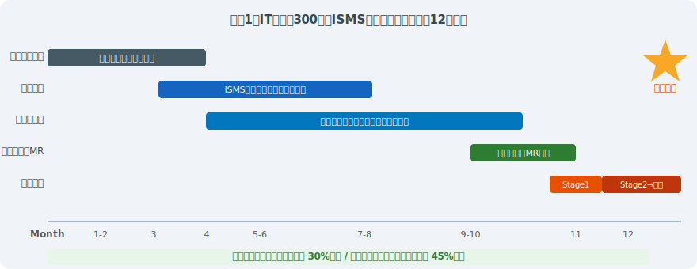

---

# 事例1：IT企業 — 課題と対策の詳細

> *部門間のセキュリティ認識格差とDevOpsとの整合性確保が IT企業ISMSの二大課題*

- **主な課題①:** 開発・運用・管理の部門間でセキュリティ認識に大きな差がある
- **対策:** 部門横断ISMS推進チーム設置・部門代表者が参加する月次レビュー会議
- **主な課題②:** クラウドサービス（AWS・Azure・SaaS）をスコープに含める方法が不明
- **対策:** 共有責任モデルの整理・CSP（クラウドサービスプロバイダ）ごとのセキュリティ評価
- **主な課題③:** 認証後も継続的に維持できるか（担当者依存のリスク）
- **対策:** 手順書の整備・後任担当者の育成・外部コンサルタントとの顧問契約

---

# 事例2：製造業（OT/ITセキュリティ統合）

> *IT/OT統合ISMSはIEC 62443との整合と工場ネットワーク分離が製造業の核心課題*

- **背景:** 工場ネットワークへのランサムウェア被害（2023年）を受け、IT・OT統合ISMSを構築
- **スコープ:** 本社IT環境 + 主力工場の製造システム（OT/SCADA）を同一スコープに
- **主な対応策①:** IT/OTネットワーク間のファイアウォール強化・データダイオード導入
- **主な対応策②:** OT専用の脆弱性管理プロセス（パッチ適用は計画停止時に限定）
- **主な対応策③:** サプライヤーへのセキュリティ要件通知・部品調達先のリスク評価
- **成果:** 工場ネットワーク分離により被害範囲を最小化・ISM認証で取引先の信頼回復

---

# 事例3：金融機関（規制対応とISMSの統合）

> *金融庁ガイドライン・FISC基準・PCIDSS三者の要求をISMSで統合管理する設計が必要*

- **背景:** 金融庁のサイバーセキュリティ管理態勢向上要請・FISC安全対策基準への対応
- **アプローチ:** ISMS・FISC基準・PCI DSS要件を単一の管理策フレームワークに統合
- **コントロールマッピング:** ISO 27001 Annex A ↔ FISC基準 ↔ PCI DSS v4.0 の対応表作成
- **効果①:** 複数の外部審査（ISO認証・PCI DSS QSA審査・金融庁考査）の準備コスト削減
- **効果②:** 統合内部監査プログラムにより、監査工数を35%削減
- **教訓:** 統合フレームワーク構築には相応の初期工数が必要 — コンサルタントの活用が有効

---

# 事例4：医療機関（個人情報保護とISMS）

> *電子カルテの第三者委託管理と職員の情報リテラシー向上が医療機関の最重要課題*

- **背景:** 電子カルテへの不正アクセス事案発生・厚生労働省ガイドラインへの対応強化
- **スコープ:** 電子カルテシステム・医療情報システム・院内ネットワーク
- **ISO/IEC 27701（PIMS）との統合:** ISMSにプライバシー拡張を追加し、個人情報保護法・GDPRへも対応
- **重点管理策:** 医師・看護師等のロールベースアクセス制御・二次利用目的の制限・保管期限管理
- **インシデント対応:** 個人情報漏えいは個人情報保護委員会への72時間以内の速報義務
- **成果:** 患者データアクセスログの100%取得・不審アクセスの検知時間が30分以内に短縮

---

# 失敗事例：ISMS形骸化のパターンと教訓

> *認証取得後の運用停止・形式的対応・トップコミット欠如の三パターンが形骸化の典型*

- **失敗パターン①「認証取得が目的化」:** 認証後に運用が止まり、翌年のサーベイランスでMajor不適合が多発
- **失敗パターン②「IT部門だけの取組み」:** 他部門が方針を知らず、教育・インシデント報告が機能しない
- **失敗パターン③「文書は整備、運用なし」:** 手順書は存在するが誰も読まず実際の作業は慣例で行われる
- **失敗パターン④「リスクアセスメントのコピー流用」:** 毎年同じリスク評価書をそのまま更新なしで提出
- **共通の根本原因:** トップマネジメントのコミットメント不足・担当者個人に依存した推進体制
- **予防策:** 定期的なMR・経営KPIへのISMS指標組み込み・全部門へのISMS役割の明確化

---

# 成功要因の分析 — 5つの鍵

- 事例分析から導出した、ISMS持続的成功のための共通要因
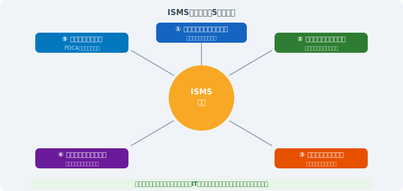

---

<!-- _class: lead -->
# 第7章 ISO/IEC 27001:2022 改訂ポイント

- 2013年版との差分と移行対応の実務

---

# 2022年改訂の背景と主要変更点

> *クラウド・AI・テレワーク普及と11新規管理策追加が2022年改訂の核心*

- <svg viewBox="0 0 800 400" style="max-height:70vh;max-width:100%;display:block;margin:0 auto;" xmlns="http://www.w3.org/2000/svg">
<rect width="800" height="400" fill="#1a1a2e"/>
<text x="400" y="28" text-anchor="middle" fill="#ffffff" font-size="15" font-weight="bold" font-family="sans-serif">2022年改訂の背景と主要変更点</text>
<rect x="20" y="50" width="370" height="140" rx="10" fill="#16213e" stroke="#f9a825" stroke-width="2"/>
<rect x="410" y="50" width="370" height="140" rx="10" fill="#16213e" stroke="#e91e63" stroke-width="2"/>
<text x="205" y="78" text-anchor="middle" fill="#f9a825" font-size="14" font-weight="bold" font-family="sans-serif">改訂の背景</text>
<text x="595" y="78" text-anchor="middle" fill="#e91e63" font-size="14" font-weight="bold" font-family="sans-serif">主要変更点</text>
<text x="35" y="112" fill="#ffffff" font-size="12" font-family="sans-serif">• クラウド普及と新しい脅威</text>
<text x="35" y="138" fill="#ffffff" font-size="12" font-family="sans-serif">• テレワーク・リモートアクセス</text>
<text x="35" y="164" fill="#ffffff" font-size="12" font-family="sans-serif">• サプライチェーン攻撃の増加</text>
<text x="430" y="112" fill="#ffffff" font-size="12" font-family="sans-serif">• 114→93管理策に統廃合</text>
<text x="430" y="138" fill="#ffffff" font-size="12" font-family="sans-serif">• 新規11管理策追加</text>
<text x="430" y="164" fill="#ffffff" font-size="12" font-family="sans-serif">• 4カテゴリに再編</text>
<rect x="20" y="210" width="760" height="150" rx="10" fill="#16213e" stroke="#4caf50" stroke-width="1.5"/>
<text x="400" y="238" text-anchor="middle" fill="#4caf50" font-size="13" font-weight="bold" font-family="sans-serif">2022年版 新規追加 主要11管理策</text>
<text x="45" y="268" fill="#ffffff" font-size="12" font-family="sans-serif">5.7 脅威インテリジェンス</text>
<text x="45" y="292" fill="#ffffff" font-size="12" font-family="sans-serif">5.23 クラウドサービスの情報セキュリティ</text>
<text x="45" y="316" fill="#ffffff" font-size="12" font-family="sans-serif">5.30 BCPのためのICT準備</text>
<text x="45" y="340" fill="#ffffff" font-size="12" font-family="sans-serif">7.4 物理的なセキュリティ監視</text>
<text x="430" y="268" fill="#ffffff" font-size="12" font-family="sans-serif">8.9 構成管理</text>
<text x="430" y="292" fill="#ffffff" font-size="12" font-family="sans-serif">8.10 情報の削除</text>
<text x="430" y="316" fill="#ffffff" font-size="12" font-family="sans-serif">8.11 データマスキング</text>
<text x="430" y="340" fill="#ffffff" font-size="12" font-family="sans-serif">8.28 セキュアコーディング</text>
</svg>
- **改訂背景:** クラウド化・AI活用・サプライチェーンリスク・テレワーク普及等の環境変化に対応
- **箇条4〜10:** 軽微な修正のみ（HLS構造は維持）— 箇条6.3「変更の計画策定」が新設
- **Annex Aの大幅改訂:** 114管理策（14ドメイン）→ **93管理策（4カテゴリ）**
- **新規追加:** 11の新規管理策（主にクラウド・AI・データ管理・監視系）
- **統廃合:** 複数の管理策を統合・整理（削除された管理策はゼロ — すべて何らかの形で存続）
- **「属性（Attributes）」:** 各管理策に5種類の属性タグを付与し、多軸での分析が可能

---

# 管理策の大幅再編 — 2013年版と2022年版の比較

- 11の新規管理策が追加され、組織・人・物理・技術の4カテゴリに再編された
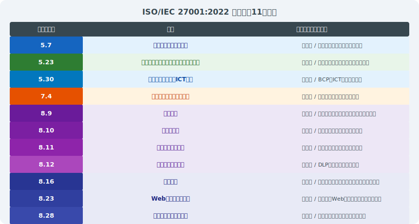

---

# 2013年版から統廃合された主要管理策

> *職務分離・移動端末・暗号化など主要管理策は統廃合されても要求内容は継続している*

- **A.6.1.2 職務の分離（→8.2に統合）:** アクセス制御セクションへ移行・内容は継続
- **A.11 物理的・環境的セキュリティ（114→7）:** 15項目から14項目へ。内容は整理統合
- **A.12 運用のセキュリティ（→8）:** 技術的管理策として大幅に統合・再編
- **A.14 システムの取得・開発・保守（→8.25〜8.34）:** セキュアな開発ライフサイクルとして整理
- **A.15 サプライヤー関係（→5.19〜5.22）:** 組織的管理策に移動・クラウドサービス（5.23）を分離
- **マッピングシート:** ISO/IEC 27002:2022 にAnnex B（2013→2022対応表）あり — 移行に必須

---

# 2013年版認証からの移行手順

> *2025年10月移行期限に向けてギャップ分析→新管理策対応→SoA更新の3ステップが必須*

- **Step 1** ギャップ分析 — 新規11管理策に対する現在の対応状況を評価（SoAの更新）
- **Step 2** SoA更新 — 93管理策ベースのSoAを新規作成（旧114管理策からのマッピング）
- **Step 3** 管理策の実装・改善 — 特に新規11管理策への対応（脅威インテリジェンス・クラウド管理等）
- **Step 4** 内部監査 — 2022年版要件への適合性を確認
- **Step 5** マネジメントレビュー — 移行計画の進捗・残課題を経営層が承認
- **Step 6** 移行審査 — 認証機関と協議の上、通常のサーベイランス・更新審査と合わせて実施

---

# 移行対応チェックリスト（実務用）

> *SoA更新・リスクアセスメント見直し・内部監査実施の文書三点が移行の証跡になる*

- **文書関連:** □ SoA更新（93管理策版）/ □ リスクアセスメント方法論の見直し / □ 情報セキュリティ方針の更新
- **新規管理策の実装確認:** □ 5.7脅威インテリジェンス（仕組みの有無）/ □ 5.23クラウドセキュリティポリシー
- **新規管理策の実装確認:** □ 8.9構成管理台帳 / □ 8.10データ削除手順 / □ 8.12 DLPツール評価
- **新規管理策の実装確認:** □ 8.16監視活動のSIEM等ツール導入 / □ 8.28セキュアコーディング基準
- **内部監査:** □ 2022年版チェックリストへの更新 / □ 全スコープの再評価完了
- **認証機関との調整:** □ 移行審査日程の確認 / □ **期限: 2025年10月31日** までに移行完了

---

<!-- _class: lead -->
# 第8章 関連規制・標準との連携

- GDPR・個人情報保護法・SOC 2・NISC基準との関係

---

# GDPR・個人情報保護法との関係

- ISMSはセキュリティの枠組みを提供し、プライバシー法規制への技術的・組織的対策を支援する
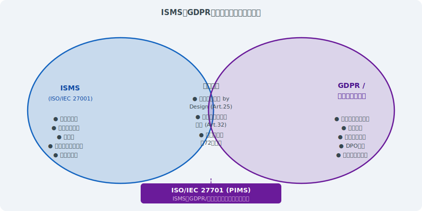

---

# SOC 2・PCI DSS・NISC基準との比較

> *SOC 2・PCIDSS・NISTはISMSと目的と適用範囲が異なるが統合実施でコストを削減できる*

- **SOC 2（AICPA）:** サービス組織向け。Trust Service Criteria（セキュリティ等5軸）。TypeⅡは6〜12ヶ月の運用確認
- **PCI DSS v4.0:** カード会員データを扱う組織向け。12要件・300以上のサブ要件。ISMSとの高い親和性
- **NISC重要インフラ基準:** 日本の重要インフラ14分野に適用。ISMSを基盤として追加要件を充足
- **NIST CSF 2.0:** 米国発のサイバーセキュリティフレームワーク。Govern・Identify・Protect・Detect・Respond・Recover
- **ISMSとの関係:** ISMSは要求事項規格（What）。他標準はベストプラクティス（How）を提供
- **実務上の活用:** コントロールマッピングにより1つの実施を複数フレームワークへ対応付け可能

---

# 業界別セキュリティ基準とISMSの整合

> *金融・医療・製造・クラウド各業界の規制基準はISMSをベースに業界固有要件を上乗せする*

- **金融:** FISC安全対策基準・金融庁サイバーセキュリティガイドライン（ISMSが基礎）
- **医療:** 厚生労働省「医療情報システムの安全管理に関するガイドライン」第6版（ISMS準拠を推奨）
- **製造・重要インフラ:** IEC 62443（OTセキュリティ）+ ISO 27001でIT/OT統合セキュリティ
- **政府・防衛調達:** CMMC（米国）・NIST SP 800-171 — ISMSとマッピング可能な多くの要件
- **クラウドサービス事業者:** ISO/IEC 27017・27018・CSA STAR認証（ISMSの上位互換として認定）
- **ISMSの汎用性:** 業界固有の要件は追加管理策として取り込み、ISMSを核とした統合運用が理想

---

<!-- _class: lead -->
# 第9章 AI・クラウド時代のISMS

- 新技術がもたらすリスクとISMSによる対応

---

# クラウドサービスとISMS

> *共有責任モデルの理解とISMSスコープへのクラウドサービス明示が不可欠*

- <svg viewBox="0 0 800 400" style="max-height:70vh;max-width:100%;display:block;margin:0 auto;" xmlns="http://www.w3.org/2000/svg">
<rect width="800" height="400" fill="#1a1a2e"/>
<text x="400" y="28" text-anchor="middle" fill="#ffffff" font-size="16" font-weight="bold" font-family="sans-serif">クラウドサービスとISMS</text>
<rect x="30" y="50" width="340" height="300" rx="10" fill="#16213e" stroke="#f9a825" stroke-width="2"/>
<rect x="430" y="50" width="340" height="300" rx="10" fill="#16213e" stroke="#e91e63" stroke-width="2"/>
<text x="200" y="78" text-anchor="middle" fill="#f9a825" font-size="14" font-weight="bold" font-family="sans-serif">クラウド利用時の課題</text>
<text x="600" y="78" text-anchor="middle" fill="#e91e63" font-size="14" font-weight="bold" font-family="sans-serif">ISMS管理策 対応</text>
<text x="45" y="112" fill="#ffffff" font-size="12" font-family="sans-serif">• 責任共有モデルの理解</text>
<text x="45" y="140" fill="#ffffff" font-size="12" font-family="sans-serif">• データ所在地の不明確さ</text>
<text x="45" y="168" fill="#ffffff" font-size="12" font-family="sans-serif">• マルチテナント環境</text>
<text x="45" y="196" fill="#ffffff" font-size="12" font-family="sans-serif">• API経由のアクセス管理</text>
<text x="45" y="224" fill="#ffffff" font-size="12" font-family="sans-serif">• クラウド設定ミス</text>
<text x="45" y="252" fill="#ffffff" font-size="12" font-family="sans-serif">• サプライヤー依存リスク</text>
<text x="45" y="295" fill="#f9a825" font-size="12" font-family="sans-serif">ISO/IEC 27017 (クラウド特化)</text>
<text x="445" y="112" fill="#ffffff" font-size="12" font-family="sans-serif">5.23 クラウドサービス管理</text>
<text x="445" y="140" fill="#ffffff" font-size="12" font-family="sans-serif">5.19 サプライヤー管理</text>
<text x="445" y="168" fill="#ffffff" font-size="12" font-family="sans-serif">8.2 特権アクセス管理</text>
<text x="445" y="196" fill="#ffffff" font-size="12" font-family="sans-serif">8.9 構成管理</text>
<text x="445" y="224" fill="#ffffff" font-size="12" font-family="sans-serif">8.10 情報削除 (退会時)</text>
<text x="445" y="252" fill="#ffffff" font-size="12" font-family="sans-serif">8.16 監視・モニタリング</text>
<text x="445" y="295" fill="#e91e63" font-size="12" font-family="sans-serif">責任分界点の文書化必須</text>
</svg>
- **共有責任モデル:** IaaS/PaaS/SaaS で責任分担が異なる — ISMSスコープ設定に影響
- **ISO/IEC 27017:** クラウドサービス固有の追加管理策（CSP・クラウドサービス顧客双方向け）
- **ISO/IEC 27018:** クラウドでの個人情報（PII）処理に特化した実施指針
- **SaaS利用時の注意点（5.23）:** データ所在・エンドポイント管理・ログ取得可否・退会時のデータ消去
- **マルチクラウド環境:** 複数CSPを利用する場合の一元的なアクセス管理・暗号鍵管理の課題
- **CSPの認証確認:** ISO 27001・SOC 2 TypeⅡ・CSA STARレポートを入手し委託先管理（5.19）に活用

---

# AIリスクとISMS — ISO/IEC 42001との関係

> *ISO 42001のAIMSは同じHLSでISMSと統合実施可能でAIリスク管理を体系化できる*

- **ISO/IEC 42001:2023（AIMS）:** AI管理システム規格 — ISMSと同じHLSで統合実施が可能
- **AIシステム固有のリスク:** モデルへの敵対的攻撃・データポイズニング・プロンプトインジェクション
- **学習データの保護:** 個人情報・機密情報を含む学習データへのアクセス制御（8.3）
- **AIの出力監視（8.16応用）:** 異常な出力・差別的な結果・機密情報の漏えいを検知
- **生成AIの業務利用リスク:** 機密情報の入力禁止ポリシー（5.1）・ログ保全・利用者教育（6.3）
- **今後の方向性:** NIST AI RMF・EU AI Act との整合 — AIガバナンスフレームワークとの統合

---

# ゼロトラストアーキテクチャとISMS管理策の対応

> *ZTA実装がISMSのAnnex A技術管理策の多くを自動的に充足*

- <svg viewBox="0 0 800 400" style="max-height:70vh;max-width:100%;display:block;margin:0 auto;" xmlns="http://www.w3.org/2000/svg">
<rect width="800" height="400" fill="#1a1a2e"/>
<text x="400" y="28" text-anchor="middle" fill="#ffffff" font-size="15" font-weight="bold" font-family="sans-serif">ゼロトラストアーキテクチャとISMS管理策の対応</text>
<rect x="20" y="50" width="380" height="310" rx="10" fill="#16213e" stroke="#f9a825" stroke-width="2"/>
<rect x="420" y="50" width="360" height="310" rx="10" fill="#16213e" stroke="#e91e63" stroke-width="2"/>
<text x="210" y="78" text-anchor="middle" fill="#f9a825" font-size="14" font-weight="bold" font-family="sans-serif">ゼロトラスト原則</text>
<text x="600" y="78" text-anchor="middle" fill="#e91e63" font-size="14" font-weight="bold" font-family="sans-serif">対応ISMS管理策</text>
<text x="35" y="112" fill="#4caf50" font-size="13" font-family="sans-serif">Never Trust:</text>
<text x="35" y="135" fill="#ffffff" font-size="12" font-family="sans-serif">全アクセスを疑う</text>
<text x="35" y="170" fill="#4caf50" font-size="13" font-family="sans-serif">Always Verify:</text>
<text x="35" y="193" fill="#ffffff" font-size="12" font-family="sans-serif">継続的な認証・認可</text>
<text x="35" y="228" fill="#4caf50" font-size="13" font-family="sans-serif">Least Privilege:</text>
<text x="35" y="251" fill="#ffffff" font-size="12" font-family="sans-serif">最小権限の原則</text>
<text x="35" y="286" fill="#4caf50" font-size="13" font-family="sans-serif">Assume Breach:</text>
<text x="35" y="309" fill="#ffffff" font-size="12" font-family="sans-serif">侵害前提の設計</text>
<text x="435" y="112" fill="#e91e63" font-size="12" font-family="sans-serif">8.5 安全な認証</text>
<text x="435" y="135" fill="#ffffff" font-size="11" font-family="sans-serif">MFA / 証明書認証</text>
<text x="435" y="170" fill="#e91e63" font-size="12" font-family="sans-serif">8.2 特権アクセス管理</text>
<text x="435" y="193" fill="#ffffff" font-size="11" font-family="sans-serif">継続的な権限評価</text>
<text x="435" y="228" fill="#e91e63" font-size="12" font-family="sans-serif">8.3 情報アクセス制限</text>
<text x="435" y="251" fill="#ffffff" font-size="11" font-family="sans-serif">RBAC / ABAC実装</text>
<text x="435" y="286" fill="#e91e63" font-size="12" font-family="sans-serif">5.24〜5.28 インシデント</text>
<text x="435" y="309" fill="#ffffff" font-size="11" font-family="sans-serif">侵害時の封じ込め</text>
<text x="400" y="375" text-anchor="middle" fill="#f9a825" font-size="12" font-family="sans-serif">ゼロトラスト実装 = ISMS管理策の実践的適用</text>
</svg>
- 「すべてを信頼しない」原則をISMSの管理策と組み合わせて実装する
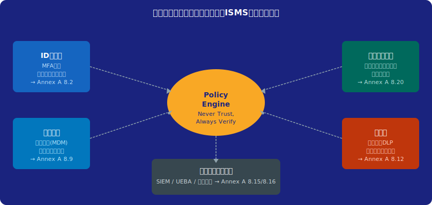

---

# まとめ — ISMSの価値と将来展望

> *ISMSは書類作りではなく継続的リスク管理プロセスの構築こそが本質的価値*

- <svg viewBox="0 0 800 400" style="max-height:70vh;max-width:100%;display:block;margin:0 auto;" xmlns="http://www.w3.org/2000/svg">
<rect width="800" height="400" fill="#1a1a2e"/>
<text x="400" y="28" text-anchor="middle" fill="#ffffff" font-size="16" font-weight="bold" font-family="sans-serif">まとめ — ISMSの価値と将来展望</text>
<rect x="20" y="55" width="230" height="280" rx="10" fill="#16213e" stroke="#f9a825" stroke-width="2.5"/>
<rect x="285" y="55" width="230" height="280" rx="10" fill="#16213e" stroke="#e91e63" stroke-width="2.5"/>
<rect x="550" y="55" width="230" height="280" rx="10" fill="#16213e" stroke="#4caf50" stroke-width="2.5"/>
<text x="135" y="82" text-anchor="middle" fill="#f9a825" font-size="14" font-weight="bold" font-family="sans-serif">現在の価値</text>
<text x="400" y="82" text-anchor="middle" fill="#e91e63" font-size="14" font-weight="bold" font-family="sans-serif">導入効果</text>
<text x="665" y="82" text-anchor="middle" fill="#4caf50" font-size="14" font-weight="bold" font-family="sans-serif">将来展望</text>
<text x="35" y="115" fill="#ffffff" font-size="12" font-family="sans-serif">• 信頼の証明</text>
<text x="35" y="143" fill="#ffffff" font-size="12" font-family="sans-serif">• 規制対応の基盤</text>
<text x="35" y="171" fill="#ffffff" font-size="12" font-family="sans-serif">• リスク可視化</text>
<text x="35" y="199" fill="#ffffff" font-size="12" font-family="sans-serif">• 組織文化改善</text>
<text x="35" y="227" fill="#ffffff" font-size="12" font-family="sans-serif">• 取引先信頼獲得</text>
<text x="35" y="255" fill="#ffffff" font-size="12" font-family="sans-serif">• インシデント削減</text>
<text x="300" y="115" fill="#ffffff" font-size="12" font-family="sans-serif">• セキュリティ強化</text>
<text x="300" y="143" fill="#ffffff" font-size="12" font-family="sans-serif">• 競合優位性</text>
<text x="300" y="171" fill="#ffffff" font-size="12" font-family="sans-serif">• 保険料低減</text>
<text x="300" y="199" fill="#ffffff" font-size="12" font-family="sans-serif">• 営業機会拡大</text>
<text x="300" y="227" fill="#ffffff" font-size="12" font-family="sans-serif">• コスト削減</text>
<text x="300" y="255" fill="#ffffff" font-size="12" font-family="sans-serif">• 法的リスク低減</text>
<text x="565" y="115" fill="#ffffff" font-size="12" font-family="sans-serif">• AI: ISO 42001連携</text>
<text x="565" y="143" fill="#ffffff" font-size="12" font-family="sans-serif">• ゼロトラスト統合</text>
<text x="565" y="171" fill="#ffffff" font-size="12" font-family="sans-serif">• 自動化・AI監査</text>
<text x="565" y="199" fill="#ffffff" font-size="12" font-family="sans-serif">• クラウドネイティブ</text>
<text x="565" y="227" fill="#ffffff" font-size="12" font-family="sans-serif">• 継続的コンプライアンス</text>
<text x="565" y="255" fill="#ffffff" font-size="12" font-family="sans-serif">• 量子暗号対応</text>
<text x="400" y="365" text-anchor="middle" fill="#f9a825" font-size="13" font-weight="bold" font-family="sans-serif">ISMSは「認証取得」が目的ではなく「継続的改善の仕組み」</text>
</svg>
- **業務価値:** サイバーリスクの可視化・定量化による合理的な投資判断と経営への説明責任
- **市場価値:** 国内ISMS認証件数は約7,000件（2025年末）— 調達条件・入札要件として定着
- **法的・規制的価値:** 個人情報保護法・重要インフラ基準等への対応基盤として機能
- **将来展望①:** AI・IoT・OTセキュリティへのISMS拡張（ISO/IEC 42001・IEC 62443との統合）
- **将来展望②:** 自動化・継続的監視によるContinuous Complianceへの進化
- **将来展望③:** ESGの観点からの情報セキュリティガバナンス — 非財務情報開示との連動

---

# 審査員・コンサルタントへの提言

> *審査員は形式適合より実質的有効性を問い、コンサルタントは組織文化の変革を支援する*

- **審査員として:** 「形式適合」より「実質的な有効性」を重視した審査アプローチを貫く
- **コンサルタントとして:** 認証取得だけでなく「持続的に機能するISMS」の構築を支援する
- **共通の責務:** 被審査組織のリスク文化醸成に貢献 — 形骸化を生まない処方箋を提供
- **継続的学習:** NISC・IPA・JPCERT/CCの情報を定期的に収集・ISMSへの反映を支援
- **倫理的責任:** 審査で得た組織の機密情報・脆弱性情報の厳格な守秘義務
- **コミュニティへの貢献:** 審査・コンサルの知見を業界全体で共有し、日本全体のセキュリティレベルを向上

---

# 参考資料・参考文献

> *ISO規格・JNSA・IPA・NISC・学術論文が実務と理論を支える一次情報源*

- **規格・標準:** [ISO/IEC 27001:2022](https://www.iso.org/standard/82875.html) / [ISO/IEC 27002:2022](https://www.iso.org/standard/75652.html) / ISO/IEC 27005:2022
- **移行関連:** [IAF MD 26:2023 ISO/IEC 27001移行要件](https://iaf.nu/iaf_system/uploads/documents/IAF_MD_26_Transition_Requirements_for_ISO_IEC_27001_2022.pdf)
- **国内ガイダンス:** [IPA「情報セキュリティマネジメント」](https://www.ipa.go.jp/security/manager/) / [NISC重要インフラ行動計画](https://www.nisc.go.jp/)
- **認証統計:** [ISMS-AC 国内ISMS認証件数推移](https://isms.jp/) / [ISO Survey](https://www.iso.org/the-iso-survey.html)
- **参考文献:** 「ISO 27001:2022 実践ガイド」/ 「情報セキュリティ管理の教科書」/ JNSA各種ガイドライン
- **脅威情報:** [JPCERT/CC](https://www.jpcert.or.jp/) / [IPA 情報セキュリティ10大脅威](https://www.ipa.go.jp/security/10threats/)

