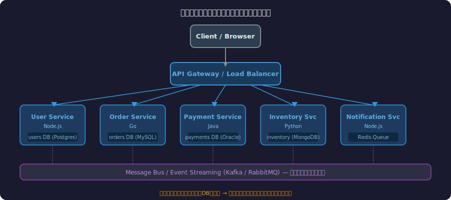
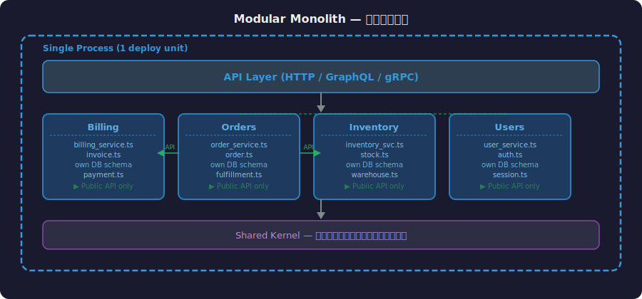
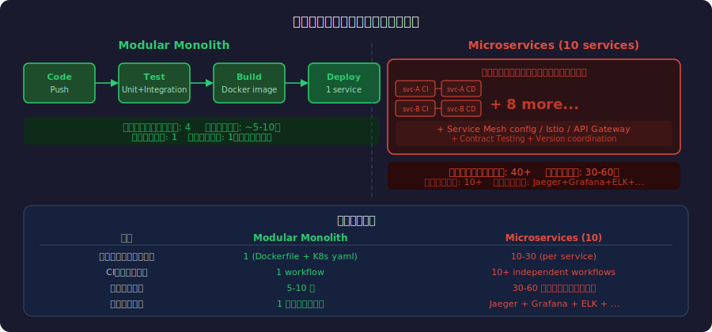
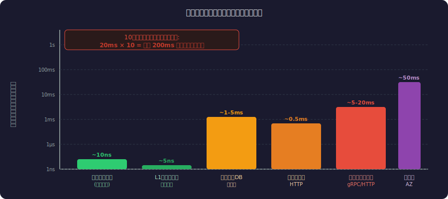

<!-- _class: lead -->
# なぜモノリスは再評価されているか

- マイクロサービスブームへの反論
- テックリード・アーキテクト向け技術講演
- 2026年


---

# アジェンダ

- **Part 1** マイクロサービスの夢 — 何が約束されたのか
- **Part 2** モノリス再評価の潮流 — 誰が言い始めたのか
- **Part 3** モノリスの現代的定義 — 「悪いモノリス」との違い
- **Part 4** 技術的トレードオフ深掘り — 数字で見る差異
- **Part 5** 意思決定フレームワーク — いつ何を選ぶか
- **Part 6** 実践ガイド — モジュラーモノリスの始め方


---

<!-- _class: lead -->
# Part 1: マイクロサービスの夢

- 何が約束されたのか


---

# マイクロサービスが約束したもの

- **独立デプロイ** — チームごとに独自リリースサイクルを持てる
- **スケールの自由** — ボトルネックサービスだけを水平スケール
- **技術の多様性** — サービスごとに最適な言語・DBを選択
- **障害分離** — 1サービスの障害が全体に波及しない
- **チームの自律性** — コードベース分離で並行開発が加速


---

# マイクロサービスアーキテクチャの全体像




---

# なぜ全員が採用したのか

- **Netflix** — 2009年からマイクロサービスへ段階移行、動画配信の大規模化に対応
- **Amazon** — Two-Pizza Teams が組織モデルとして世界に広まる
- **Uber** — 急成長期にモノリスを分解、数百サービスへ
- **FAANG追従の波** — 「成功企業がやっているから正しい」バイアス
- 業界カンファレンスのトレンド、採用市場の需要が加速させた


---

# 分散コンピューティングの8つの誤謬

- ネットワークは**信頼できる** → ❌ パケットロスは常に発生する
- レイテンシは**ゼロ** → ❌ ローカル関数呼び出しの1000倍のコスト
- 帯域幅は**無限大** → ❌ シリアライズ/デシリアライズのオーバーヘッド
- ネットワークは**安全** → ❌ サービス間通信も攻撃対象になる
- トポロジーは**変わらない** → ❌ Kubernetes Podは常に変動する
- 管理者は**1人** → ❌ 分散システムの運用は複数チームにまたがる

<!--
Peter Deutsch (Sun Microsystems) が1994年に定義。30年前の警告がマイクロサービス時代に再び表面化した。
-->

---

# マイクロサービスの現実コスト

- **運用負荷の爆発** — サービスディスカバリ・サーキットブレーカー・分散トレーシングが必須
- **デバッグ地獄** — エラーが5サービスをまたぐと原因特定に数時間
- **インフラコスト** — コンテナ・サービスメッシュ・オーケストレーションの維持費
- **テストの複雑化** — 統合テスト環境の再現が困難
- **ネットワークレイテンシ** — ローカル呼び出し数μs → HTTP/gRPC数ms〜数十ms


---

# 過剰エンジニアリングの罠

- **2〜3人チームにマイクロサービスは有害** — 組織の複雑度がコードベースに転嫁される
- **スタートアップの失敗パターン** — PMFを達成する前に分散システムの罠にはまる
- Martin Fowler: *「マイクロサービスは少なくとも100人のエンジニアがいる組織向け」*
- 「分散モノリス」 — 境界が悪く、マイクロサービスの複雑さだけを得た最悪のパターン
- **コンウェイの法則の逆用** — アーキテクチャが組織を決める、組織がアーキテクチャを決める

<!--
Fowlerの「MonolithFirst」パターンを参照。まず作って、後で分ける判断をする。
-->

---

<!-- _class: lead -->
# Part 2: モノリス再評価の潮流

- 誰が言い始めたのか


---

# Amazon Prime Video の告白（2023年）

- AWS公式ブログ: *「マイクロサービス → モノリシックアーキテクチャへの移行でコスト **90%削減** 」*
- 映像品質監視システム: 分散ステップ関数（Step Functions）から単一プロセスへ
- **移行の理由**: 大量データのサービス間転送コストが支配的になった
- **結果**: スケーラビリティも維持しながら運用コストを劇的削減
- Amazonが自らAWSの「マイクロサービス賛歌」に反証した衝撃

<!--
2023年5月に公開されたブログが業界に衝撃を与えた。Hacker Newsで数千のコメントが付いた。
-->

---

# Segment の撤退（2020年）

- データパイプラインを **130以上のマイクロサービス** で構築
- 問題: 循環依存・カスケード障害・デプロイの調整コストが臨界点に
- **解決策**: 単一の "Centrifuge" サービスへ統合
- 移行後: レイテンシ改善・障害率低下・エンジニア認知負荷の大幅削減
- ブログタイトル: *"Goodbye Microservices: From 100s of problem children to 1 boring monolith"*


---

# Shopify の Modular Monolith

- Railsモノリスとして創業、現在も **単一リポジトリ** で月数兆円の流通を処理
- 対策: "Modularity" プロジェクト — 内部をコンポーネント境界で分割
- **パッケージベースアーキテクチャ** — モジュール間の依存をコードレベルで強制
- マイクロサービスへの移行なしに、チーム独立性とスケールを両立
- Shopify Engineering Blog: *"Deconstructing the Monolith"*


---

# DHH と 「The Majestic Monolith」

- DHH (Ruby on Rails 作者): *「マイクロサービスは複雑さを組織的に正当化するための口実だ」*
- **Majestic Monolith** — 1つのコードベースが「壮大」に機能する
- Basecamp (Hey): 数百万ユーザーを少数精鋭チームで単一Railsアプリで運用
- *「マイクロサービスは大企業の組織問題をアーキテクチャ問題にすり替えている」*
- 反論: 小さく保てる組織なら、アーキテクチャも小さく保てる


---

# Stack Overflow の実績

- 月間 **14億ページビュー** を処理する世界最大級の開発者コミュニティ
- アーキテクチャ: **ASP.NET モノリス** + 9台のWebサーバー
- サービス分割なしで、Cloudflare経由で数億リクエストを日常的に捌く
- SQL Server 1台のプライマリDBが全データを管理
- *「シンプルさは複雑さに勝る — もし機能するなら」*

<!--
Stack Overflowのインフラブログはこの分野の名記事が多い。Nick Craver氏のブログ参照。
-->

---

<!-- _class: lead -->
# Part 3: モノリスの現代的定義

- 「悪いモノリス」との違い


---

# 「モノリス」という言葉の誤解

- **誤解**: モノリス = Big Ball of Mud（スパゲッティコード）
- **正確な定義**: 単一プロセスとしてデプロイされるシステム
- デプロイ境界とコード境界は **独立した概念**
- Big Ball of Mud は設計の失敗であり、デプロイ形態の問題ではない
- マイクロサービスでも Big Ball of Mud は作れる（分散 Big Ball of Mud）


---

# Big Ball of Mud vs. Modular Monolith


---

# Modular Monolith のアーキテクチャ




---

# Bounded Context とモジュール境界

- **DDD (Domain-Driven Design)** の Bounded Context をモジュールにマッピング
- 各モジュールは **Public API** のみを公開 — 内部実装は隠蔽
- モジュール間の通信は **インターフェース経由** — 直接依存禁止
- データストアは **モジュール内部** に閉じる（テーブルを直接共有しない）
- 将来のサービス分割に備えた **分離可能な設計**


---

# コード例: モジュール境界の実装

- Railsでの実装例（Packwerk / Zeitwerk）

```ruby
# app/packages/billing/public/billing_service.rb
module Billing
  class BillingService
    def charge(order_id:, amount:)
      # Internal implementation hidden
      invoice = Invoice.create!(order_id:, amount:)
      PaymentGateway.new.process(invoice)
    end
  end
end

# app/packages/orders/order_processor.rb
module Orders
  class OrderProcessor
    def complete(order)
      # Only uses Billing's public API
      Billing::BillingService.new.charge(
        order_id: order.id,
        amount: order.total
      )
    end
  end
end
```


---

<!-- _class: lead -->
# Part 4: 技術的トレードオフ深掘り

- 数字で見る差異


---

# デプロイ複雑度の比較




---

# ネットワーク vs. 関数呼び出し




---

# 分散トレーシングの地獄

- エラーログに必要な情報を全て揃えるためのコード例

```go
// マイクロサービス: 障害追跡のコスト
span := tracer.StartSpan("order.process")
span.SetTag("order_id", orderID)
defer span.Finish()

ctx := opentracing.ContextWithSpan(ctx, span)

// 5サービスにコンテキスト伝播が必要
inventory, err := inventoryClient.Check(ctx, items)
if err != nil {
    span.SetTag("error", true)
    span.LogFields(log.Error(err))
    // ここでエラーが出ても originは不明
    return fmt.Errorf("inventory: %w", err)
}
```

<!--
モノリスでは同じエラーがスタックトレース1枚で完結する。
-->

---

# データ整合性: 分散トランザクションの罠

- **ローカルトランザクション（モノリス）**: ACID保証、ロールバック即時
- **分散トランザクション（2PC）**: ネットワーク障害でデッドロックリスク
- **Sagaパターン**: 補償トランザクションの実装コストが高い
- **最終整合性**: ユーザーが中間状態（不整合）を見る可能性
- マイクロサービスでトランザクションを正しく扱うには **専門知識が必要**


---

# スケーリング戦略の比較

- **モノリス水平スケール**: アプリ全体をレプリカ追加 — 無駄があるが単純
- **マイクロサービス**: ボトルネックサービスのみスケール — 効率的だが複雑
- 現実: **ボトルネックの特定** がスケールより難しい問題
- モノリスのプロファイリング: 単一プロセスで計測 → 原因を即特定
- サービスの90%はDBがボトルネック → **DBスケーリングは共通課題**


---

# 開発者体験 (DX) の差

- **ローカル起動**: モノリス `./start` vs マイクロサービス `docker-compose up` (20分)
- **デバッグ**: モノリス IDE ブレークポイント vs 分散トレーシング + ログ集約
- **テスト**: モノリス `rspec` (数分) vs 統合テスト環境の再現 (数時間)
- **onboarding**: モノリス 1リポジトリ理解 vs マイクロサービス10+リポジトリ把握
- 開発者生産性は **目に見えないコスト** — アーキテクチャ決定時に軽視されがち


---

# コンウェイの法則と組織設計

- **コンウェイの法則**: 「組織が生み出すシステムは、その組織のコミュニケーション構造を模倣する」
- 10チームあれば10サービスを作りたくなる — これがマイクロサービス採用の本質
- **逆コンウェイ戦略**: アーキテクチャを先に決め、組織をそれに合わせる
- チームが2〜3人なら: モジュラーモノリスで **1コードベース・1チーム** が自然
- チームが100人超なら: サービス分割で **認知負荷軽減** が有効


---

<!-- _class: lead -->
# Part 5: 意思決定フレームワーク

- いつ何を選ぶか


---

# モノリスを選ぶべき条件

- **チームサイズ**: 〜50人以下（Two-Pizza Team 1〜5チーム）
- **プロダクト成熟度**: PMF未達成、ドメインモデルが頻繁に変わる
- **ドメインの複雑度**: ビジネスロジックが密に結合している
- **スタートアップ**: 速度と変更コストが最優先
- **独立スケール不要**: トラフィックパターンが均一
- → まず **Modular Monolith** で始め、境界を明確にしてから分割を判断


---

# マイクロサービスを選ぶべき条件

- **チームサイズ**: 100人超、機能チームが明確に独立している
- **独立SLA要件**: 一部機能が 99.999% 可用性、他は 99.9% など差異がある
- **独立スケール要件**: 動画エンコードだけが1000倍のCPUを消費する
- **技術多様性の必然**: ML推論（Python）とWebAPI（Go）が同居
- **組織の成熟度**: 分散システムの設計・運用・デバッグのノウハウがある


---

# Strangler Fig Pattern — 段階的移行


---

# 意思決定ツリー — どちらを選ぶか


---

# モノリス→マイクロへの正しいタイミング

- **Martin Fowler の MonolithFirst**: まずモノリスで作り、必要になったら分割
- 分割のシグナル: 特定モジュールのデプロイ頻度が他と2倍以上乖離
- 分割のシグナル: チームが同じファイルを頻繁にコンフリクト
- 分割のシグナル: 1モジュールのスケール要件が他と桁違い
- **危険サイン**: 「将来のスケールに備えて」という理由での早期分割
- YAGNI原則: *You Ain't Gonna Need It*


---

<!-- _class: lead -->
# Part 6: 実践ガイド

- モジュラーモノリスの始め方


---

# モジュラーモノリスのディレクトリ設計

- ドメイン境界を反映したディレクトリ構造例

```text
src/
├── modules/
│   ├── billing/
│   │   ├── public/          # 外部公開API
│   │   │   └── billing_service.ts
│   │   ├── internal/        # 内部実装（直接インポート禁止）
│   │   │   ├── invoice.ts
│   │   │   └── payment_gateway.ts
│   │   └── index.ts         # 公開エントリポイント
│   ├── orders/
│   │   ├── public/
│   │   ├── internal/
│   │   └── index.ts
│   └── inventory/
├── shared/                  # 全モジュール共通（最小限）
│   └── types.ts
└── app.ts
```

<!--
ESLint の import ルールや Packwerk（Ruby）でモジュール境界をlintで強制できる。
-->

---

# テスト戦略: テストピラミッド


---

# 監視・可観測性のシンプル化

- **ログ**: 単一プロセス → 1ログストリームで全リクエストが追える
- **メトリクス**: Prometheus + Grafana で APM 1ダッシュボード
- **プロファイリング**: pprof / py-spy で本番プロセスをリアルタイム計測
- **エラートラッキング**: Sentry 1プロジェクト → スタックトレースで即原因特定
- マイクロサービスでは同等の可観測性を得るために **Jaeger + ELK + Service Mesh** が必要


---

# まとめ: 銀の弾丸はない

- **マイクロサービスは間違っていない** — 適切な規模・組織での選択肢
- **モノリスは時代遅れでない** — 設計次第で大規模も捌ける
- 判断基準は **チームサイズ・ドメイン成熟度・運用ノウハウ**
- Amazon・Segment・Shopify・Basecampの事例が示す: **複雑さへの回帰コストは高い**
- 推奨: **Modular Monolith で始め、明確な理由ができたら分割する**
- アーキテクチャは手段であり、目的は **ビジネス価値の持続的デリバリー**


---

# 参考文献・リソース (1/2)

- **事例・ブログ:**
- [Amazon Prime Video: Microservices to Monolith (2023)](https://www.primevideotech.com/video-streaming/scaling-up-the-prime-video-audio-video-monitoring-service-and-reducing-costs-by-90)
- [Segment: Goodbye Microservices (2020)](https://segment.com/blog/goodbye-microservices/)
- [DHH: The Majestic Monolith (2016)](https://m.signalvnoise.com/the-majestic-monolith/)
- [Shopify: Deconstructing the Monolith](https://shopify.engineering/deconstructing-monolith-designing-software-maximizes-developer-productivity)
- [Stack Overflow Architecture](https://nickcraver.com/blog/2016/02/17/stack-overflow-the-architecture-2016-edition/)


---

# 参考文献・リソース (2/2)

- **書籍・論文:**
- [Martin Fowler: MonolithFirst](https://martinfowler.com/bliki/MonolithFirst.html)
- [Sam Newman: Building Microservices (O'Reilly)](https://samnewman.io/books/building_microservices/)
- [Sam Newman: Monolith to Microservices (O'Reilly)](https://samnewman.io/books/monolith-to-microservices/)
- **ツール:**
- [Packwerk (Shopify) — Ruby モジュール境界強制](https://github.com/Shopify/packwerk)
- [ArchUnit — Java/Kotlin アーキテクチャlint](https://www.archunit.org/)

