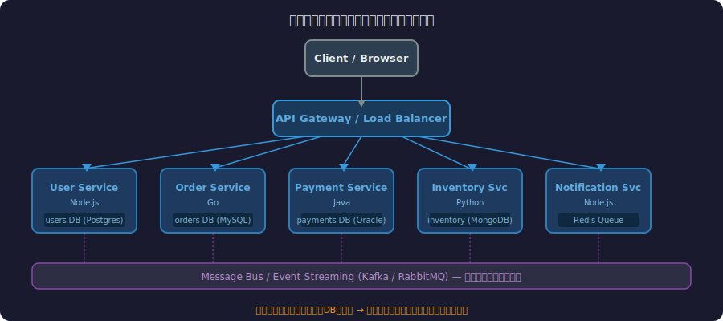
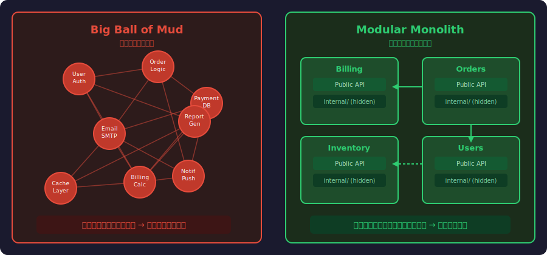
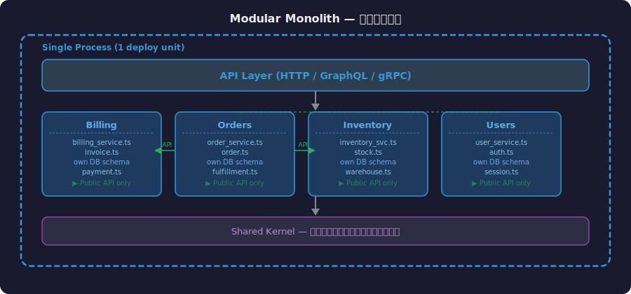
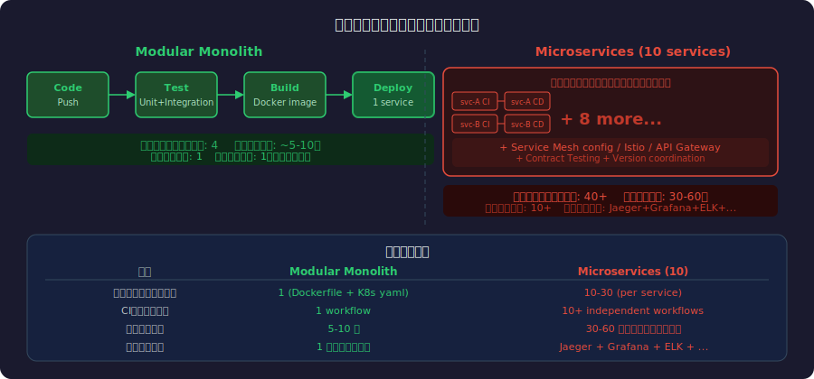
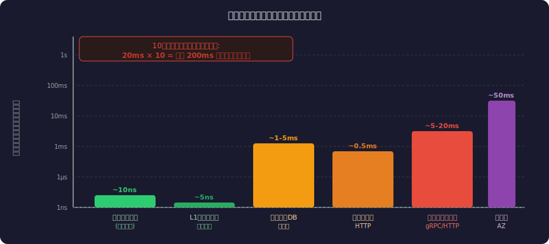
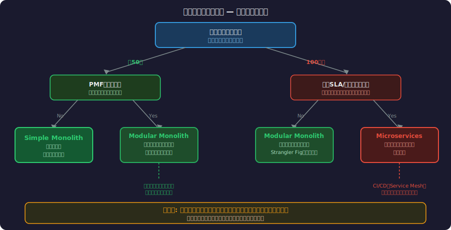
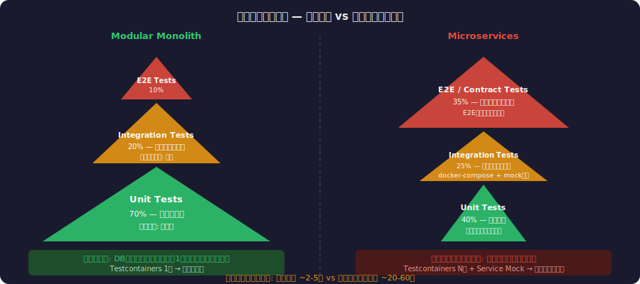

<!-- _class: lead -->
# なぜモノリスは再評価されているか

- マイクロサービスブームへの反論
- テックリード・アーキテクト向け技術講演
- 2026年


---

# アジェンダ

> *Part 1〜6でマイクロサービス批判から意思決定フレームワーク・実践ガイドを網羅*

- **Part 1** マイクロサービスの夢 — 何が約束されたのか
- **Part 2** モノリス再評価の潮流 — 誰が言い始めたのか
- **Part 3** モノリスの現代的定義 — 「悪いモノリス」との違い
- **Part 4** 技術的トレードオフ深掘り — 数字で見る差異
- **Part 5** 意思決定フレームワーク — いつ何を選ぶか
- **Part 6** 実践ガイド — モジュラーモノリスの始め方


---

<!-- _class: lead -->
# Part 1: マイクロサービスの夢

- 何が約束されたのか


---

# マイクロサービスが約束したもの

> *独立デプロイ・障害分離の約束に対し運用負荷とデバッグコストが現実の壁になった*

- <svg viewBox="0 0 800 400" xmlns="http://www.w3.org/2000/svg" style="max-height:70vh;max-width:100%;display:block;margin:0 auto;">
<rect width="800" height="400" fill="#1a1a2e"/>
<text x="400" y="35" fill="#ffffff" font-size="15" text-anchor="middle" font-family="sans-serif">マイクロサービスが約束したもの</text>
<rect x="40" y="60" width="330" height="300" rx="10" fill="#16213e" stroke="#f9a825" stroke-width="2"/>
<text x="205" y="88" fill="#f9a825" font-size="13" text-anchor="middle" font-family="sans-serif">約束されたメリット</text>
<text x="205" y="120" fill="#ffffff" font-size="12" text-anchor="middle" font-family="sans-serif">独立デプロイ</text>
<text x="205" y="148" fill="#ffffff" font-size="12" text-anchor="middle" font-family="sans-serif">スケールの自由</text>
<text x="205" y="176" fill="#ffffff" font-size="12" text-anchor="middle" font-family="sans-serif">技術の多様性</text>
<text x="205" y="204" fill="#ffffff" font-size="12" text-anchor="middle" font-family="sans-serif">障害分離</text>
<text x="205" y="232" fill="#ffffff" font-size="12" text-anchor="middle" font-family="sans-serif">チームの自律性</text>
<text x="205" y="270" fill="#aaaaaa" font-size="11" text-anchor="middle" font-family="sans-serif">Netflix / Amazon が証明</text>
<text x="205" y="290" fill="#aaaaaa" font-size="11" text-anchor="middle" font-family="sans-serif">業界が一斉に採用</text>
<rect x="430" y="60" width="330" height="300" rx="10" fill="#16213e" stroke="#e91e63" stroke-width="2"/>
<text x="595" y="88" fill="#e91e63" font-size="13" text-anchor="middle" font-family="sans-serif">現実のコスト</text>
<text x="595" y="120" fill="#ffffff" font-size="12" text-anchor="middle" font-family="sans-serif">運用負荷の爆発</text>
<text x="595" y="148" fill="#ffffff" font-size="12" text-anchor="middle" font-family="sans-serif">デバッグ地獄</text>
<text x="595" y="176" fill="#ffffff" font-size="12" text-anchor="middle" font-family="sans-serif">高いインフラコスト</text>
<text x="595" y="204" fill="#ffffff" font-size="12" text-anchor="middle" font-family="sans-serif">テストの複雑化</text>
<text x="595" y="232" fill="#ffffff" font-size="12" text-anchor="middle" font-family="sans-serif">ネットワークレイテンシ</text>
<text x="595" y="270" fill="#aaaaaa" font-size="11" text-anchor="middle" font-family="sans-serif">2〜3人チームには有害</text>
<text x="595" y="290" fill="#aaaaaa" font-size="11" text-anchor="middle" font-family="sans-serif">分散モノリスの罠</text>
</svg>
- **独立デプロイ** — チームごとに独自リリースサイクルを持てる
- **スケールの自由** — ボトルネックサービスだけを水平スケール
- **技術の多様性** — サービスごとに最適な言語・DBを選択
- **障害分離** — 1サービスの障害が全体に波及しない
- **チームの自律性** — コードベース分離で並行開発が加速


---

# マイクロサービスアーキテクチャの全体像




---

# なぜ全員が採用したのか

- <svg viewBox="0 0 800 400" xmlns="http://www.w3.org/2000/svg" style="max-height:70vh;max-width:100%;display:block;margin:0 auto;">
<rect width="800" height="400" fill="#1a1a2e"/>
<text x="400" y="35" fill="#ffffff" font-size="15" text-anchor="middle" font-family="sans-serif">マイクロサービス採用の連鎖反応</text>
<rect x="300" y="55" width="200" height="60" rx="8" fill="#16213e" stroke="#f9a825" stroke-width="2"/>
<text x="400" y="82" fill="#f9a825" font-size="13" text-anchor="middle" font-family="sans-serif">FAANG の成功事例</text>
<text x="400" y="103" fill="#aaaaaa" font-size="11" text-anchor="middle" font-family="sans-serif">Netflix / Amazon / Uber</text>
<line x1="400" y1="115" x2="400" y2="145" stroke="#f9a825" stroke-width="1.5"/>
<polygon points="395,145 400,158 405,145" fill="#f9a825"/>
<rect x="270" y="158" width="260" height="50" rx="8" fill="#16213e" stroke="#aaaaaa" stroke-width="1"/>
<text x="400" y="183" fill="#ffffff" font-size="12" text-anchor="middle" font-family="sans-serif">「成功企業がやっている = 正しい」</text>
<text x="400" y="200" fill="#aaaaaa" font-size="10" text-anchor="middle" font-family="sans-serif">コンファメーションバイアス</text>
<line x1="400" y1="208" x2="220" y2="248" stroke="#aaaaaa" stroke-width="1" stroke-dasharray="4,3"/>
<line x1="400" y1="208" x2="580" y2="248" stroke="#aaaaaa" stroke-width="1" stroke-dasharray="4,3"/>
<rect x="80" y="248" width="270" height="55" rx="8" fill="#16213e" stroke="#aaaaaa" stroke-width="1"/>
<text x="215" y="273" fill="#ffffff" font-size="12" text-anchor="middle" font-family="sans-serif">カンファレンストレンド</text>
<text x="215" y="293" fill="#aaaaaa" font-size="10" text-anchor="middle" font-family="sans-serif">KubeCon / MicroXchg 急増</text>
<rect x="450" y="248" width="270" height="55" rx="8" fill="#16213e" stroke="#aaaaaa" stroke-width="1"/>
<text x="585" y="273" fill="#ffffff" font-size="12" text-anchor="middle" font-family="sans-serif">採用市場の需要</text>
<text x="585" y="293" fill="#aaaaaa" font-size="10" text-anchor="middle" font-family="sans-serif">マイクロサービス経験必須</text>
<line x1="215" y1="303" x2="380" y2="338" stroke="#aaaaaa" stroke-width="1" stroke-dasharray="4,3"/>
<line x1="585" y1="303" x2="420" y2="338" stroke="#aaaaaa" stroke-width="1" stroke-dasharray="4,3"/>
<rect x="260" y="338" width="280" height="45" rx="8" fill="#16213e" stroke="#e91e63" stroke-width="2"/>
<text x="400" y="362" fill="#e91e63" font-size="13" text-anchor="middle" font-family="sans-serif">業界全体が一斉採用</text>
<text x="400" y="378" fill="#aaaaaa" font-size="10" text-anchor="middle" font-family="sans-serif">規模・成熟度を問わず</text>
</svg>
- **Netflix** — 2009年からマイクロサービスへ段階移行、動画配信の大規模化に対応
- **Amazon** — Two-Pizza Teams が組織モデルとして世界に広まる
- **Uber** — 急成長期にモノリスを分解、数百サービスへ
- **FAANG追従の波** — 「成功企業がやっているから正しい」バイアス
- 業界カンファレンスのトレンド、採用市場の需要が加速させた


---

# 分散コンピューティングの8つの誤謬

> *FANGの成功事例をバイアスで一般化し組織規模を問わず全員が採用した失敗の構造*

- <svg viewBox="0 0 800 400" xmlns="http://www.w3.org/2000/svg" style="max-height:70vh;max-width:100%;display:block;margin:0 auto;">
<rect width="800" height="400" fill="#1a1a2e"/>
<text x="400" y="35" fill="#ffffff" font-size="15" text-anchor="middle" font-family="sans-serif">分散コンピューティングの誤謬 (Peter Deutsch, 1994)</text>
<rect x="30" y="60" width="355" height="75" rx="8" fill="#16213e" stroke="#e91e63" stroke-width="1.5"/>
<text x="207" y="88" fill="#e91e63" font-size="12" text-anchor="middle" font-family="sans-serif">誤謬1: ネットワークは信頼できる</text>
<text x="207" y="115" fill="#aaaaaa" font-size="11" text-anchor="middle" font-family="sans-serif">パケットロス・タイムアウト常に発生</text>
<rect x="415" y="60" width="355" height="75" rx="8" fill="#16213e" stroke="#e91e63" stroke-width="1.5"/>
<text x="592" y="88" fill="#e91e63" font-size="12" text-anchor="middle" font-family="sans-serif">誤謬2: レイテンシはゼロ</text>
<text x="592" y="115" fill="#aaaaaa" font-size="11" text-anchor="middle" font-family="sans-serif">ローカル関数呼び出しの1000倍コスト</text>
<rect x="30" y="155" width="355" height="75" rx="8" fill="#16213e" stroke="#e91e63" stroke-width="1.5"/>
<text x="207" y="183" fill="#e91e63" font-size="12" text-anchor="middle" font-family="sans-serif">誤謬3: 帯域幅は無限大</text>
<text x="207" y="210" fill="#aaaaaa" font-size="11" text-anchor="middle" font-family="sans-serif">シリアライズオーバーヘッド無視不可</text>
<rect x="415" y="155" width="355" height="75" rx="8" fill="#16213e" stroke="#e91e63" stroke-width="1.5"/>
<text x="592" y="183" fill="#e91e63" font-size="12" text-anchor="middle" font-family="sans-serif">誤謬4: ネットワークは安全</text>
<text x="592" y="210" fill="#aaaaaa" font-size="11" text-anchor="middle" font-family="sans-serif">サービス間通信も攻撃対象</text>
<rect x="30" y="250" width="355" height="75" rx="8" fill="#16213e" stroke="#e91e63" stroke-width="1.5"/>
<text x="207" y="278" fill="#e91e63" font-size="12" text-anchor="middle" font-family="sans-serif">誤謬5: トポロジーは変わらない</text>
<text x="207" y="305" fill="#aaaaaa" font-size="11" text-anchor="middle" font-family="sans-serif">Kubernetes Pod は常に変動する</text>
<rect x="415" y="250" width="355" height="75" rx="8" fill="#16213e" stroke="#e91e63" stroke-width="1.5"/>
<text x="592" y="278" fill="#e91e63" font-size="12" text-anchor="middle" font-family="sans-serif">誤謬6: 管理者は1人</text>
<text x="592" y="305" fill="#aaaaaa" font-size="11" text-anchor="middle" font-family="sans-serif">分散システムは複数チームにまたがる</text>
<rect x="200" y="345" width="400" height="40" rx="8" fill="#16213e" stroke="#f9a825" stroke-width="1.5"/>
<text x="400" y="370" fill="#f9a825" font-size="12" text-anchor="middle" font-family="sans-serif">30年前の警告がマイクロサービス時代に再び表面化</text>
</svg>
- ネットワークは**信頼できる** → ❌ パケットロスは常に発生する
- レイテンシは**ゼロ** → ❌ ローカル関数呼び出しの1000倍のコスト
- 帯域幅は**無限大** → ❌ シリアライズ/デシリアライズのオーバーヘッド
- ネットワークは**安全** → ❌ サービス間通信も攻撃対象になる
- トポロジーは**変わらない** → ❌ Kubernetes Podは常に変動する
- 管理者は**1人** → ❌ 分散システムの運用は複数チームにまたがる

<!--
Peter Deutsch (Sun Microsystems) が1994年に定義。30年前の警告がマイクロサービス時代に再び表面化した。
-->

---

# マイクロサービスの現実コスト

> *1994年の分散コンピューティング8つの誤謬をマイクロサービス採用者が繰り返し踏んでいる*

- <svg viewBox="0 0 800 400" xmlns="http://www.w3.org/2000/svg" style="max-height:70vh;max-width:100%;display:block;margin:0 auto;">
<rect width="800" height="400" fill="#1a1a2e"/>
<text x="400" y="35" fill="#ffffff" font-size="15" text-anchor="middle" font-family="sans-serif">マイクロサービス採用の隠れたコスト</text>
<rect x="40" y="60" width="215" height="290" rx="10" fill="#16213e" stroke="#e91e63" stroke-width="1.5"/>
<text x="147" y="88" fill="#e91e63" font-size="12" text-anchor="middle" font-family="sans-serif">運用コスト</text>
<rect x="55" y="100" width="185" height="25" rx="4" fill="#2a0a0a"/>
<text x="147" y="117" fill="#ffffff" font-size="11" text-anchor="middle" font-family="sans-serif">サービスディスカバリ</text>
<rect x="55" y="133" width="185" height="25" rx="4" fill="#2a0a0a"/>
<text x="147" y="150" fill="#ffffff" font-size="11" text-anchor="middle" font-family="sans-serif">サーキットブレーカー</text>
<rect x="55" y="166" width="185" height="25" rx="4" fill="#2a0a0a"/>
<text x="147" y="183" fill="#ffffff" font-size="11" text-anchor="middle" font-family="sans-serif">分散トレーシング</text>
<rect x="55" y="199" width="185" height="25" rx="4" fill="#2a0a0a"/>
<text x="147" y="216" fill="#ffffff" font-size="11" text-anchor="middle" font-family="sans-serif">サービスメッシュ</text>
<text x="147" y="295" fill="#e91e63" font-size="20" text-anchor="middle" font-family="sans-serif">高</text>
<text x="147" y="320" fill="#aaaaaa" font-size="11" text-anchor="middle" font-family="sans-serif">習熟に6〜12ヶ月</text>
<rect x="293" y="60" width="215" height="290" rx="10" fill="#16213e" stroke="#f9a825" stroke-width="1.5"/>
<text x="400" y="88" fill="#f9a825" font-size="12" text-anchor="middle" font-family="sans-serif">インフラコスト</text>
<rect x="308" y="100" width="185" height="25" rx="4" fill="#2a1a0a"/>
<text x="400" y="117" fill="#ffffff" font-size="11" text-anchor="middle" font-family="sans-serif">コンテナオーケストレーション</text>
<rect x="308" y="133" width="185" height="25" rx="4" fill="#2a1a0a"/>
<text x="400" y="150" fill="#ffffff" font-size="11" text-anchor="middle" font-family="sans-serif">ロードバランサー × N</text>
<rect x="308" y="166" width="185" height="25" rx="4" fill="#2a1a0a"/>
<text x="400" y="183" fill="#ffffff" font-size="11" text-anchor="middle" font-family="sans-serif">ログ集約 (ELK stack)</text>
<rect x="308" y="199" width="185" height="25" rx="4" fill="#2a1a0a"/>
<text x="400" y="216" fill="#ffffff" font-size="11" text-anchor="middle" font-family="sans-serif">監視ダッシュボード × N</text>
<text x="400" y="295" fill="#f9a825" font-size="20" text-anchor="middle" font-family="sans-serif">中〜高</text>
<text x="400" y="320" fill="#aaaaaa" font-size="11" text-anchor="middle" font-family="sans-serif">Amazon: 90%削減事例も</text>
<rect x="546" y="60" width="215" height="290" rx="10" fill="#16213e" stroke="#aaaaaa" stroke-width="1"/>
<text x="653" y="88" fill="#aaaaaa" font-size="12" text-anchor="middle" font-family="sans-serif">開発コスト</text>
<rect x="561" y="100" width="185" height="25" rx="4" fill="#1a1a2a"/>
<text x="653" y="117" fill="#ffffff" font-size="11" text-anchor="middle" font-family="sans-serif">サービス間API設計</text>
<rect x="561" y="133" width="185" height="25" rx="4" fill="#1a1a2a"/>
<text x="653" y="150" fill="#ffffff" font-size="11" text-anchor="middle" font-family="sans-serif">分散トランザクション</text>
<rect x="561" y="166" width="185" height="25" rx="4" fill="#1a1a2a"/>
<text x="653" y="183" fill="#ffffff" font-size="11" text-anchor="middle" font-family="sans-serif">統合テスト環境再現</text>
<rect x="561" y="199" width="185" height="25" rx="4" fill="#1a1a2a"/>
<text x="653" y="216" fill="#ffffff" font-size="11" text-anchor="middle" font-family="sans-serif">ローカル起動の複雑さ</text>
<text x="653" y="295" fill="#aaaaaa" font-size="20" text-anchor="middle" font-family="sans-serif">中</text>
<text x="653" y="320" fill="#aaaaaa" font-size="11" text-anchor="middle" font-family="sans-serif">DX低下が生産性に直撃</text>
</svg>
- **運用負荷の爆発** — サービスディスカバリ・サーキットブレーカー・分散トレーシングが必須
- **デバッグ地獄** — エラーが5サービスをまたぐと原因特定に数時間
- **インフラコスト** — コンテナ・サービスメッシュ・オーケストレーションの維持費
- **テストの複雑化** — 統合テスト環境の再現が困難
- **ネットワークレイテンシ** — ローカル呼び出し数μs → HTTP/gRPC数ms〜数十ms


---

# 過剰エンジニアリングの罠

> *運用・インフラ・開発コストの三重負担が小規模組織では即座に致命的になる*

- <svg viewBox="0 0 800 400" xmlns="http://www.w3.org/2000/svg" style="max-height:70vh;max-width:100%;display:block;margin:0 auto;">
<rect width="800" height="400" fill="#1a1a2e"/>
<text x="400" y="35" fill="#ffffff" font-size="15" text-anchor="middle" font-family="sans-serif">組織規模 vs アーキテクチャ適切性</text>
<line x1="70" y1="340" x2="760" y2="340" stroke="#aaaaaa" stroke-width="1.5"/>
<line x1="70" y1="340" x2="70" y2="60" stroke="#aaaaaa" stroke-width="1.5"/>
<text x="415" y="380" fill="#aaaaaa" font-size="12" text-anchor="middle" font-family="sans-serif">チームサイズ（エンジニア数）</text>
<text x="30" y="200" fill="#aaaaaa" font-size="11" text-anchor="middle" font-family="sans-serif" transform="rotate(-90,30,200)">生産性</text>
<text x="150" y="358" fill="#aaaaaa" font-size="10" text-anchor="middle" font-family="sans-serif">1〜10人</text>
<text x="350" y="358" fill="#aaaaaa" font-size="10" text-anchor="middle" font-family="sans-serif">10〜50人</text>
<text x="550" y="358" fill="#aaaaaa" font-size="10" text-anchor="middle" font-family="sans-serif">50〜100人</text>
<text x="710" y="358" fill="#aaaaaa" font-size="10" text-anchor="middle" font-family="sans-serif">100+人</text>
<polyline points="70,200 150,160 350,140 550,130 710,120" stroke="#4caf50" stroke-width="2.5" fill="none"/>
<text x="650" y="115" fill="#4caf50" font-size="11" font-family="sans-serif">モジュラーモノリス</text>
<polyline points="70,280 150,260 350,200 550,160 710,120" stroke="#f9a825" stroke-width="2.5" fill="none" stroke-dasharray="8,4"/>
<text x="650" y="140" fill="#f9a825" font-size="11" font-family="sans-serif">マイクロサービス</text>
<rect x="75" y="220" width="200" height="50" rx="6" fill="#16213e" stroke="#e91e63" stroke-width="1.5"/>
<text x="175" y="243" fill="#e91e63" font-size="11" text-anchor="middle" font-family="sans-serif">スタートアップでの採用</text>
<text x="175" y="263" fill="#aaaaaa" font-size="10" text-anchor="middle" font-family="sans-serif">オーバーエンジニアリング</text>
<line x1="175" y1="270" x2="175" y2="300" stroke="#e91e63" stroke-width="1" stroke-dasharray="4,3"/>
<text x="175" y="315" fill="#e91e63" font-size="10" text-anchor="middle" font-family="sans-serif">PMF前に複雑さの罠</text>
<line x1="550" y1="130" x2="550" y2="340" stroke="#aaaaaa" stroke-width="0.8" stroke-dasharray="4,3"/>
<text x="560" y="100" fill="#aaaaaa" font-size="10" font-family="sans-serif">分岐点</text>
</svg>
- **2〜3人チームにマイクロサービスは有害** — 組織の複雑度がコードベースに転嫁される
- **スタートアップの失敗パターン** — PMFを達成する前に分散システムの罠にはまる
- Martin Fowler: *「マイクロサービスは少なくとも100人のエンジニアがいる組織向け」*
- 「分散モノリス」 — 境界が悪く、マイクロサービスの複雑さだけを得た最悪のパターン
- **コンウェイの法則の逆用** — アーキテクチャが組織を決める、組織がアーキテクチャを決める

<!--
Fowlerの「MonolithFirst」パターンを参照。まず作って、後で分ける判断をする。
-->

---

<!-- _class: lead -->
# Part 2: モノリス再評価の潮流

- 誰が言い始めたのか


---

# Amazon Prime Video の告白（2023年）

- <svg viewBox="0 0 800 400" xmlns="http://www.w3.org/2000/svg" style="max-height:70vh;max-width:100%;display:block;margin:0 auto;">
<rect width="800" height="400" fill="#1a1a2e"/>
<text x="400" y="35" fill="#ffffff" font-size="15" text-anchor="middle" font-family="sans-serif">Amazon Prime Video: マイクロサービス → モノリスへ (2023)</text>
<rect x="60" y="70" width="300" height="250" rx="10" fill="#16213e" stroke="#e91e63" stroke-width="1.5"/>
<text x="210" y="100" fill="#e91e63" font-size="13" text-anchor="middle" font-family="sans-serif">Before: 分散アーキテクチャ</text>
<text x="210" y="135" fill="#ffffff" font-size="12" text-anchor="middle" font-family="sans-serif">Step Functions ステート管理</text>
<text x="210" y="160" fill="#ffffff" font-size="12" text-anchor="middle" font-family="sans-serif">S3 経由データ転送</text>
<text x="210" y="185" fill="#ffffff" font-size="12" text-anchor="middle" font-family="sans-serif">多数のLambda関数</text>
<text x="210" y="220" fill="#aaaaaa" font-size="11" text-anchor="middle" font-family="sans-serif">問題: 大量データのサービス間</text>
<text x="210" y="238" fill="#aaaaaa" font-size="11" text-anchor="middle" font-family="sans-serif">転送コストが支配的に</text>
<text x="210" y="290" fill="#e91e63" font-size="28" text-anchor="middle" font-family="sans-serif">高コスト</text>
<polygon points="375,185 395,185 395,175 425,195 395,215 395,205 375,205" fill="#f9a825"/>
<rect x="440" y="70" width="300" height="250" rx="10" fill="#16213e" stroke="#f9a825" stroke-width="2"/>
<text x="590" y="100" fill="#f9a825" font-size="13" text-anchor="middle" font-family="sans-serif">After: モノリシック化</text>
<text x="590" y="135" fill="#ffffff" font-size="12" text-anchor="middle" font-family="sans-serif">単一プロセスへ統合</text>
<text x="590" y="160" fill="#ffffff" font-size="12" text-anchor="middle" font-family="sans-serif">インプロセス通信</text>
<text x="590" y="185" fill="#ffffff" font-size="12" text-anchor="middle" font-family="sans-serif">スケーラビリティ維持</text>
<text x="590" y="220" fill="#4caf50" font-size="12" text-anchor="middle" font-family="sans-serif">スケーラビリティも</text>
<text x="590" y="238" fill="#4caf50" font-size="12" text-anchor="middle" font-family="sans-serif">維持しながら達成</text>
<text x="590" y="285" fill="#f9a825" font-size="28" text-anchor="middle" font-weight="bold" font-family="sans-serif">90%削減</text>
<rect x="60" y="345" width="680" height="35" rx="8" fill="#16213e" stroke="#f9a825" stroke-width="1"/>
<text x="400" y="367" fill="#f9a825" font-size="12" text-anchor="middle" font-family="sans-serif">Amazonが自らAWSの「マイクロサービス推奨」に反証した衝撃的な事例</text>
</svg>
- AWS公式ブログ: *「マイクロサービス → モノリシックアーキテクチャへの移行でコスト **90%削減** 」*
- 映像品質監視システム: 分散ステップ関数（Step Functions）から単一プロセスへ
- **移行の理由**: 大量データのサービス間転送コストが支配的になった
- **結果**: スケーラビリティも維持しながら運用コストを劇的削減
- Amazonが自らAWSの「マイクロサービス賛歌」に反証した衝撃

<!--
2023年5月に公開されたブログが業界に衝撃を与えた。Hacker Newsで数千のコメントが付いた。
-->

---

# Segment の撤退（2020年）

> *AmazonがAWSの分散アーキテクチャをモノリスに戻しコストを90%削減した衝撃*

- <svg viewBox="0 0 800 400" xmlns="http://www.w3.org/2000/svg" style="max-height:70vh;max-width:100%;display:block;margin:0 auto;">
<rect width="800" height="400" fill="#1a1a2e"/>
<text x="400" y="35" fill="#ffffff" font-size="15" text-anchor="middle" font-family="sans-serif">Segment の撤退 (2020): 130+ サービス → 1 モノリス</text>
<rect x="40" y="60" width="320" height="290" rx="10" fill="#16213e" stroke="#e91e63" stroke-width="1.5"/>
<text x="200" y="88" fill="#e91e63" font-size="13" text-anchor="middle" font-family="sans-serif">130+ マイクロサービス時代</text>
<text x="200" y="125" fill="#ffffff" font-size="12" text-anchor="middle" font-family="sans-serif">循環依存の発生</text>
<text x="200" y="150" fill="#ffffff" font-size="12" text-anchor="middle" font-family="sans-serif">カスケード障害</text>
<text x="200" y="175" fill="#ffffff" font-size="12" text-anchor="middle" font-family="sans-serif">デプロイ調整コスト</text>
<text x="200" y="200" fill="#ffffff" font-size="12" text-anchor="middle" font-family="sans-serif">エンジニア認知負荷MAX</text>
<text x="200" y="240" fill="#aaaaaa" font-size="11" text-anchor="middle" font-family="sans-serif">問題が臨界点に達した</text>
<polygon points="370,195 400,195 400,185 430,200 400,215 400,205 370,215" fill="#f9a825"/>
<rect x="440" y="60" width="320" height="290" rx="10" fill="#16213e" stroke="#f9a825" stroke-width="2"/>
<text x="600" y="88" fill="#f9a825" font-size="13" text-anchor="middle" font-family="sans-serif">Centrifuge (統合後)</text>
<text x="600" y="125" fill="#4caf50" font-size="12" text-anchor="middle" font-family="sans-serif">レイテンシ改善</text>
<text x="600" y="150" fill="#4caf50" font-size="12" text-anchor="middle" font-family="sans-serif">障害率低下</text>
<text x="600" y="175" fill="#4caf50" font-size="12" text-anchor="middle" font-family="sans-serif">デプロイ簡素化</text>
<text x="600" y="200" fill="#4caf50" font-size="12" text-anchor="middle" font-family="sans-serif">認知負荷の大幅削減</text>
<text x="600" y="240" fill="#f9a825" font-size="11" text-anchor="middle" font-family="sans-serif">"1 boring monolith"</text>
<text x="600" y="260" fill="#aaaaaa" font-size="11" text-anchor="middle" font-family="sans-serif">退屈なモノリスに価値あり</text>
</svg>
- データパイプラインを **130以上のマイクロサービス** で構築
- 問題: 循環依存・カスケード障害・デプロイの調整コストが臨界点に
- **解決策**: 単一の "Centrifuge" サービスへ統合
- 移行後: レイテンシ改善・障害率低下・エンジニア認知負荷の大幅削減
- ブログタイトル: *"Goodbye Microservices: From 100s of problem children to 1 boring monolith"*


---

# Shopify の Modular Monolith

> *130サービスを1モノリスに集約し障害率・認知負荷を大幅削減した「退屈なモノリス」*

- Railsモノリスとして創業、現在も **単一リポジトリ** で月数兆円の流通を処理
- 対策: "Modularity" プロジェクト — 内部をコンポーネント境界で分割
- **パッケージベースアーキテクチャ** — モジュール間の依存をコードレベルで強制
- マイクロサービスへの移行なしに、チーム独立性とスケールを両立
- Shopify Engineering Blog: *"Deconstructing the Monolith"*


---

# DHH と 「The Majestic Monolith」

> *Shopifyは単一リポジトリのままパッケージ境界で独立性を担保し月兆円規模を処理する*

- <svg viewBox="0 0 800 400" xmlns="http://www.w3.org/2000/svg" style="max-height:70vh;max-width:100%;display:block;margin:0 auto;">
<rect width="800" height="400" fill="#1a1a2e"/>
<text x="400" y="35" fill="#ffffff" font-size="15" text-anchor="middle" font-family="sans-serif">The Majestic Monolith — DHHの哲学</text>
<rect x="40" y="60" width="720" height="90" rx="10" fill="#16213e" stroke="#f9a825" stroke-width="1.5"/>
<text x="400" y="92" fill="#f9a825" font-size="14" text-anchor="middle" font-style="italic" font-family="sans-serif">"マイクロサービスは複雑さを</text>
<text x="400" y="118" fill="#f9a825" font-size="14" text-anchor="middle" font-style="italic" font-family="sans-serif">組織的に正当化するための口実だ"</text>
<text x="740" y="145" fill="#aaaaaa" font-size="11" text-anchor="end" font-family="sans-serif">— DHH (Ruby on Rails 作者)</text>
<rect x="40" y="175" width="340" height="180" rx="10" fill="#16213e" stroke="#aaaaaa" stroke-width="1"/>
<text x="210" y="205" fill="#aaaaaa" font-size="13" text-anchor="middle" font-family="sans-serif">Basecamp / Hey の実績</text>
<text x="210" y="240" fill="#ffffff" font-size="12" text-anchor="middle" font-family="sans-serif">数百万ユーザー対応</text>
<text x="210" y="265" fill="#ffffff" font-size="12" text-anchor="middle" font-family="sans-serif">少数精鋭チーム</text>
<text x="210" y="290" fill="#ffffff" font-size="12" text-anchor="middle" font-family="sans-serif">単一 Rails アプリ</text>
<text x="210" y="335" fill="#aaaaaa" font-size="11" text-anchor="middle" font-family="sans-serif">シンプルさが最大の武器</text>
<rect x="420" y="175" width="340" height="180" rx="10" fill="#16213e" stroke="#aaaaaa" stroke-width="1"/>
<text x="590" y="205" fill="#aaaaaa" font-size="13" text-anchor="middle" font-family="sans-serif">コンウェイの法則的解釈</text>
<text x="590" y="240" fill="#ffffff" font-size="12" text-anchor="middle" font-family="sans-serif">組織問題を</text>
<text x="590" y="258" fill="#ffffff" font-size="12" text-anchor="middle" font-family="sans-serif">アーキテクチャに転嫁</text>
<text x="590" y="290" fill="#f9a825" font-size="12" text-anchor="middle" font-family="sans-serif">小さい組織 =</text>
<text x="590" y="310" fill="#f9a825" font-size="12" text-anchor="middle" font-family="sans-serif">小さいアーキテクチャ</text>
<text x="590" y="335" fill="#aaaaaa" font-size="11" text-anchor="middle" font-family="sans-serif">それで十分</text>
</svg>
- DHH (Ruby on Rails 作者): *「マイクロサービスは複雑さを組織的に正当化するための口実だ」*
- **Majestic Monolith** — 1つのコードベースが「壮大」に機能する
- Basecamp (Hey): 数百万ユーザーを少数精鋭チームで単一Railsアプリで運用
- *「マイクロサービスは大企業の組織問題をアーキテクチャ問題にすり替えている」*
- 反論: 小さく保てる組織なら、アーキテクチャも小さく保てる


---

# Stack Overflow の実績

> *マイクロサービスは大企業の組織問題をアーキテクチャ問題にすり替えた口実に過ぎない*

- <svg viewBox="0 0 800 400" xmlns="http://www.w3.org/2000/svg" style="max-height:70vh;max-width:100%;display:block;margin:0 auto;">
<rect width="800" height="400" fill="#1a1a2e"/>
<text x="400" y="35" fill="#ffffff" font-size="15" text-anchor="middle" font-family="sans-serif">Stack Overflow: モノリスで月14億PVを処理</text>
<rect x="40" y="60" width="340" height="300" rx="10" fill="#16213e" stroke="#f9a825" stroke-width="2"/>
<text x="210" y="90" fill="#f9a825" font-size="13" text-anchor="middle" font-family="sans-serif">インフラ構成</text>
<text x="210" y="130" fill="#ffffff" font-size="12" text-anchor="middle" font-family="sans-serif">ASP.NET モノリス</text>
<text x="210" y="158" fill="#ffffff" font-size="12" text-anchor="middle" font-family="sans-serif">Webサーバー × 9台</text>
<text x="210" y="186" fill="#ffffff" font-size="12" text-anchor="middle" font-family="sans-serif">SQL Server × 1台 (主DB)</text>
<text x="210" y="214" fill="#ffffff" font-size="12" text-anchor="middle" font-family="sans-serif">Redis キャッシュ</text>
<text x="210" y="242" fill="#ffffff" font-size="12" text-anchor="middle" font-family="sans-serif">Cloudflare CDN</text>
<text x="210" y="290" fill="#aaaaaa" font-size="11" text-anchor="middle" font-family="sans-serif">サービス分割なし</text>
<text x="210" y="312" fill="#aaaaaa" font-size="11" text-anchor="middle" font-family="sans-serif">数十名のエンジニアで運用</text>
<rect x="420" y="60" width="340" height="300" rx="10" fill="#16213e" stroke="#aaaaaa" stroke-width="1"/>
<text x="590" y="90" fill="#aaaaaa" font-size="13" text-anchor="middle" font-family="sans-serif">処理規模</text>
<text x="590" y="135" fill="#f9a825" font-size="24" text-anchor="middle" font-weight="bold" font-family="sans-serif">14億</text>
<text x="590" y="158" fill="#ffffff" font-size="13" text-anchor="middle" font-family="sans-serif">月間ページビュー</text>
<text x="590" y="200" fill="#f9a825" font-size="18" text-anchor="middle" font-weight="bold" font-family="sans-serif">世界最大級</text>
<text x="590" y="223" fill="#ffffff" font-size="12" text-anchor="middle" font-family="sans-serif">開発者コミュニティ</text>
<rect x="440" y="258" width="300" height="60" rx="8" fill="#16213e" stroke="#f9a825" stroke-width="1"/>
<text x="590" y="283" fill="#f9a825" font-size="12" text-anchor="middle" font-family="sans-serif">"シンプルさは複雑さに勝る</text>
<text x="590" y="303" fill="#f9a825" font-size="12" text-anchor="middle" font-family="sans-serif">— もし機能するなら"</text>
</svg>
- 月間 **14億ページビュー** を処理する世界最大級の開発者コミュニティ
- アーキテクチャ: **ASP.NET モノリス** + 9台のWebサーバー
- サービス分割なしで、Cloudflare経由で数億リクエストを日常的に捌く
- SQL Server 1台のプライマリDBが全データを管理
- *「シンプルさは複雑さに勝る — もし機能するなら」*

<!--
Stack Overflowのインフラブログはこの分野の名記事が多い。Nick Craver氏のブログ参照。
-->

---

<!-- _class: lead -->
# Part 3: モノリスの現代的定義

- 「悪いモノリス」との違い


---

# 「モノリス」という言葉の誤解

- <svg viewBox="0 0 800 400" xmlns="http://www.w3.org/2000/svg" style="max-height:70vh;max-width:100%;display:block;margin:0 auto;">
<rect width="800" height="400" fill="#1a1a2e"/>
<text x="400" y="35" fill="#ffffff" font-size="15" text-anchor="middle" font-family="sans-serif">「モノリス」の正確な定義</text>
<rect x="40" y="60" width="335" height="300" rx="10" fill="#16213e" stroke="#e91e63" stroke-width="1.5"/>
<text x="207" y="88" fill="#e91e63" font-size="13" text-anchor="middle" font-family="sans-serif">誤解 (多くの人のイメージ)</text>
<rect x="60" y="105" width="295" height="200" rx="8" fill="#2a0a0a"/>
<text x="207" y="140" fill="#e91e63" font-size="11" text-anchor="middle" font-family="sans-serif">混沌としたスパゲッティコード</text>
<text x="207" y="165" fill="#aaaaaa" font-size="10" text-anchor="middle" font-family="sans-serif">全てが密結合</text>
<text x="207" y="185" fill="#aaaaaa" font-size="10" text-anchor="middle" font-family="sans-serif">変更が怖い巨大な塊</text>
<text x="207" y="205" fill="#aaaaaa" font-size="10" text-anchor="middle" font-family="sans-serif">Big Ball of Mud</text>
<text x="207" y="225" fill="#aaaaaa" font-size="10" text-anchor="middle" font-family="sans-serif">時代遅れのアンチパターン</text>
<text x="207" y="310" fill="#aaaaaa" font-size="11" text-anchor="middle" font-family="sans-serif">設計の失敗 ≠ デプロイ形態</text>
<rect x="425" y="60" width="335" height="300" rx="10" fill="#16213e" stroke="#f9a825" stroke-width="2"/>
<text x="592" y="88" fill="#f9a825" font-size="13" text-anchor="middle" font-family="sans-serif">正確な定義</text>
<rect x="445" y="105" width="295" height="200" rx="8" fill="#1a2a1a"/>
<text x="592" y="140" fill="#f9a825" font-size="11" text-anchor="middle" font-family="sans-serif">単一プロセスとして</text>
<text x="592" y="160" fill="#f9a825" font-size="11" text-anchor="middle" font-family="sans-serif">デプロイされるシステム</text>
<text x="592" y="195" fill="#ffffff" font-size="11" text-anchor="middle" font-family="sans-serif">デプロイ境界 ≠ コード境界</text>
<text x="592" y="220" fill="#ffffff" font-size="11" text-anchor="middle" font-family="sans-serif">内部は整理されていていい</text>
<text x="592" y="245" fill="#ffffff" font-size="11" text-anchor="middle" font-family="sans-serif">Modular Monolith が可能</text>
<text x="592" y="310" fill="#f9a825" font-size="11" text-anchor="middle" font-family="sans-serif">デプロイ ≠ 設計の良し悪し</text>
</svg>
- **誤解**: モノリス = Big Ball of Mud（スパゲッティコード）
- **正確な定義**: 単一プロセスとしてデプロイされるシステム
- デプロイ境界とコード境界は **独立した概念**
- Big Ball of Mud は設計の失敗であり、デプロイ形態の問題ではない
- マイクロサービスでも Big Ball of Mud は作れる（分散 Big Ball of Mud）


---

# Big Ball of Mud vs. Modular Monolith




---

# Modular Monolith のアーキテクチャ




---

# Bounded Context とモジュール境界

- <svg viewBox="0 0 800 400" xmlns="http://www.w3.org/2000/svg" style="max-height:70vh;max-width:100%;display:block;margin:0 auto;">
<rect width="800" height="400" fill="#1a1a2e"/>
<text x="400" y="35" fill="#ffffff" font-size="15" text-anchor="middle" font-family="sans-serif">DDD Bounded Context → モジュール境界</text>
<rect x="30" y="60" width="210" height="230" rx="10" fill="#16213e" stroke="#f9a825" stroke-width="2"/>
<text x="135" y="88" fill="#f9a825" font-size="13" text-anchor="middle" font-family="sans-serif">Billing</text>
<text x="135" y="115" fill="#ffffff" font-size="11" text-anchor="middle" font-family="sans-serif">Public API:</text>
<text x="135" y="135" fill="#ffffff" font-size="11" text-anchor="middle" font-family="sans-serif">charge(orderId, amount)</text>
<line x1="50" y1="155" x2="220" y2="155" stroke="#aaaaaa" stroke-width="0.5" stroke-dasharray="4,3"/>
<text x="135" y="175" fill="#aaaaaa" font-size="10" text-anchor="middle" font-family="sans-serif">Internal (非公開):</text>
<text x="135" y="195" fill="#aaaaaa" font-size="10" text-anchor="middle" font-family="sans-serif">Invoice, PaymentGW</text>
<rect x="295" y="60" width="210" height="230" rx="10" fill="#16213e" stroke="#e91e63" stroke-width="2"/>
<text x="400" y="88" fill="#e91e63" font-size="13" text-anchor="middle" font-family="sans-serif">Orders</text>
<text x="400" y="115" fill="#ffffff" font-size="11" text-anchor="middle" font-family="sans-serif">Public API:</text>
<text x="400" y="135" fill="#ffffff" font-size="11" text-anchor="middle" font-family="sans-serif">create(items), complete(id)</text>
<line x1="315" y1="155" x2="485" y2="155" stroke="#aaaaaa" stroke-width="0.5" stroke-dasharray="4,3"/>
<text x="400" y="175" fill="#aaaaaa" font-size="10" text-anchor="middle" font-family="sans-serif">Internal (非公開):</text>
<text x="400" y="195" fill="#aaaaaa" font-size="10" text-anchor="middle" font-family="sans-serif">OrderProcessor, Validator</text>
<rect x="560" y="60" width="210" height="230" rx="10" fill="#16213e" stroke="#4fc3f7" stroke-width="2"/>
<text x="665" y="88" fill="#4fc3f7" font-size="13" text-anchor="middle" font-family="sans-serif">Inventory</text>
<text x="665" y="115" fill="#ffffff" font-size="11" text-anchor="middle" font-family="sans-serif">Public API:</text>
<text x="665" y="135" fill="#ffffff" font-size="11" text-anchor="middle" font-family="sans-serif">check(items), reserve(id)</text>
<line x1="580" y1="155" x2="750" y2="155" stroke="#aaaaaa" stroke-width="0.5" stroke-dasharray="4,3"/>
<text x="665" y="175" fill="#aaaaaa" font-size="10" text-anchor="middle" font-family="sans-serif">Internal (非公開):</text>
<text x="665" y="195" fill="#aaaaaa" font-size="10" text-anchor="middle" font-family="sans-serif">StockTracker, Warehouse</text>
<line x1="240" y1="175" x2="295" y2="175" stroke="#f9a825" stroke-width="1.5" stroke-dasharray="5,3"/>
<polygon points="285,170 295,175 285,180" fill="#f9a825"/>
<line x1="505" y1="175" x2="560" y2="175" stroke="#e91e63" stroke-width="1.5" stroke-dasharray="5,3"/>
<polygon points="550,170 560,175 550,180" fill="#e91e63"/>
<rect x="80" y="320" width="640" height="60" rx="8" fill="#16213e" stroke="#aaaaaa" stroke-width="1"/>
<text x="400" y="343" fill="#aaaaaa" font-size="12" text-anchor="middle" font-family="sans-serif">Public API のみを介して通信 — 内部実装は隠蔽</text>
<text x="400" y="365" fill="#ffffff" font-size="11" text-anchor="middle" font-family="sans-serif">将来のサービス分割に備えた境界設計。テーブルの直接共有禁止。</text>
</svg>
- **DDD (Domain-Driven Design)** の Bounded Context をモジュールにマッピング
- 各モジュールは **Public API** のみを公開 — 内部実装は隠蔽
- モジュール間の通信は **インターフェース経由** — 直接依存禁止
- データストアは **モジュール内部** に閉じる（テーブルを直接共有しない）
- 将来のサービス分割に備えた **分離可能な設計**


---

# コード例: モジュール境界の実装

- Railsでの実装例（Packwerk / Zeitwerk）


---

# コード例: モジュール境界の実装（コード例）

```ruby
# app/packages/billing/public/billing_service.rb
module Billing
  class BillingService
    def charge(order_id:, amount:)
      # Internal implementation hidden
      invoice = Invoice.create!(order_id:, amount:)
      PaymentGateway.new.process(invoice)
    end
  end
end

# app/packages/orders/order_processor.rb
module Orders
  class OrderProcessor
    def complete(order)
      # Only uses Billing's public API
      Billing::BillingService.new.charge(
        order_id: order.id,
        amount: order.total
      )
    end
  end
end
```


---

<!-- _class: lead -->
# Part 4: 技術的トレードオフ深掘り

- 数字で見る差異


---

# デプロイ複雑度の比較




---

# ネットワーク vs. 関数呼び出し




---

# 分散トレーシングの地獄

- エラーログに必要な情報を全て揃えるためのコード例


---

# 分散トレーシングの地獄（コード例）

```go
// マイクロサービス: 障害追跡のコスト
span := tracer.StartSpan("order.process")
span.SetTag("order_id", orderID)
defer span.Finish()

ctx := opentracing.ContextWithSpan(ctx, span)

// 5サービスにコンテキスト伝播が必要
inventory, err := inventoryClient.Check(ctx, items)
if err != nil {
    span.SetTag("error", true)
    span.LogFields(log.Error(err))
    // ここでエラーが出ても originは不明
    return fmt.Errorf("inventory: %w", err)
}
```


---

# データ整合性: 分散トランザクションの罠

> *ローカル起動・デバッグ・テストすべてでモノリスが圧勝し長期生産性を左右する*

- <svg viewBox="0 0 800 400" xmlns="http://www.w3.org/2000/svg" style="max-height:70vh;max-width:100%;display:block;margin:0 auto;">
<rect width="800" height="400" fill="#1a1a2e"/>
<text x="400" y="35" fill="#ffffff" font-size="15" text-anchor="middle" font-family="sans-serif">トランザクション: モノリス vs マイクロサービス</text>
<rect x="30" y="60" width="340" height="290" rx="10" fill="#16213e" stroke="#4caf50" stroke-width="2"/>
<text x="200" y="88" fill="#4caf50" font-size="13" text-anchor="middle" font-family="sans-serif">モノリス: ローカルトランザクション</text>
<text x="200" y="120" fill="#ffffff" font-size="12" text-anchor="middle" font-family="sans-serif">BEGIN TRANSACTION</text>
<text x="200" y="143" fill="#ffffff" font-size="12" text-anchor="middle" font-family="sans-serif">Order.create(items)</text>
<text x="200" y="166" fill="#ffffff" font-size="12" text-anchor="middle" font-family="sans-serif">Inventory.reduce(items)</text>
<text x="200" y="189" fill="#ffffff" font-size="12" text-anchor="middle" font-family="sans-serif">Billing.charge(amount)</text>
<text x="200" y="212" fill="#4caf50" font-size="12" text-anchor="middle" font-family="sans-serif">COMMIT</text>
<text x="200" y="250" fill="#aaaaaa" font-size="11" text-anchor="middle" font-family="sans-serif">ACID 保証</text>
<text x="200" y="270" fill="#aaaaaa" font-size="11" text-anchor="middle" font-family="sans-serif">即時ロールバック可能</text>
<text x="200" y="290" fill="#aaaaaa" font-size="11" text-anchor="middle" font-family="sans-serif">実装シンプル</text>
<rect x="430" y="60" width="340" height="290" rx="10" fill="#16213e" stroke="#e91e63" stroke-width="2"/>
<text x="600" y="88" fill="#e91e63" font-size="13" text-anchor="middle" font-family="sans-serif">マイクロサービス: Sagaパターン</text>
<text x="600" y="120" fill="#ffffff" font-size="12" text-anchor="middle" font-family="sans-serif">1. OrderSvc.create()</text>
<text x="600" y="143" fill="#ffffff" font-size="12" text-anchor="middle" font-family="sans-serif">2. InventorySvc.reserve()</text>
<text x="600" y="166" fill="#ffffff" font-size="12" text-anchor="middle" font-family="sans-serif">3. BillingSvc.charge()</text>
<text x="600" y="189" fill="#e91e63" font-size="12" text-anchor="middle" font-family="sans-serif">各ステップで補償Txが必要</text>
<text x="600" y="250" fill="#aaaaaa" font-size="11" text-anchor="middle" font-family="sans-serif">最終整合性のみ</text>
<text x="600" y="270" fill="#aaaaaa" font-size="11" text-anchor="middle" font-family="sans-serif">中間状態がユーザーに見える</text>
<text x="600" y="290" fill="#aaaaaa" font-size="11" text-anchor="middle" font-family="sans-serif">実装コスト高い</text>
</svg>
- **ローカルトランザクション（モノリス）**: ACID保証、ロールバック即時
- **分散トランザクション（2PC）**: ネットワーク障害でデッドロックリスク
- **Sagaパターン**: 補償トランザクションの実装コストが高い
- **最終整合性**: ユーザーが中間状態（不整合）を見る可能性
- マイクロサービスでトランザクションを正しく扱うには **専門知識が必要**


---

# スケーリング戦略の比較

> *チームが2〜3人ならModular Monolithが自然な選択でマイクロサービスは組織問題の転嫁*

- <svg viewBox="0 0 800 400" xmlns="http://www.w3.org/2000/svg" style="max-height:70vh;max-width:100%;display:block;margin:0 auto;">
<rect width="800" height="400" fill="#1a1a2e"/>
<text x="400" y="35" fill="#ffffff" font-size="15" text-anchor="middle" font-family="sans-serif">スケーリング戦略の比較</text>
<rect x="40" y="60" width="330" height="290" rx="10" fill="#16213e" stroke="#aaaaaa" stroke-width="1.5"/>
<text x="205" y="90" fill="#aaaaaa" font-size="13" text-anchor="middle" font-family="sans-serif">モノリス水平スケール</text>
<rect x="55" y="110" width="300" height="50" rx="6" fill="#16213e" stroke="#aaaaaa" stroke-width="0.8"/>
<text x="205" y="142" fill="#ffffff" font-size="12" text-anchor="middle" font-family="sans-serif">アプリ全体 × 3 レプリカ</text>
<text x="205" y="188" fill="#aaaaaa" font-size="11" text-anchor="middle" font-family="sans-serif">シンプルだが非効率な部分も</text>
<text x="205" y="215" fill="#f9a825" font-size="12" text-anchor="middle" font-family="sans-serif">メリット: 設定シンプル</text>
<text x="205" y="240" fill="#f9a825" font-size="12" text-anchor="middle" font-family="sans-serif">プロファイリングが容易</text>
<text x="205" y="278" fill="#aaaaaa" font-size="11" text-anchor="middle" font-family="sans-serif">ボトルネック: 単一プロセスで計測</text>
<text x="205" y="300" fill="#aaaaaa" font-size="11" text-anchor="middle" font-family="sans-serif">原因を即特定できる</text>
<rect x="430" y="60" width="330" height="290" rx="10" fill="#16213e" stroke="#aaaaaa" stroke-width="1.5"/>
<text x="595" y="90" fill="#aaaaaa" font-size="13" text-anchor="middle" font-family="sans-serif">マイクロサービス選択的スケール</text>
<rect x="445" y="110" width="100" height="30" rx="4" fill="#e91e63" opacity="0.6"/>
<text x="495" y="130" fill="#ffffff" font-size="10" text-anchor="middle" font-family="sans-serif">Video × 10</text>
<rect x="555" y="110" width="80" height="30" rx="4" fill="#16213e" stroke="#aaaaaa" stroke-width="0.5"/>
<text x="595" y="130" fill="#ffffff" font-size="10" text-anchor="middle" font-family="sans-serif">Auth × 1</text>
<rect x="645" y="110" width="80" height="30" rx="4" fill="#16213e" stroke="#aaaaaa" stroke-width="0.5"/>
<text x="685" y="130" fill="#ffffff" font-size="10" text-anchor="middle" font-family="sans-serif">API × 2</text>
<text x="595" y="188" fill="#aaaaaa" font-size="11" text-anchor="middle" font-family="sans-serif">効率的だが複雑</text>
<text x="595" y="215" fill="#aaaaaa" font-size="11" text-anchor="middle" font-family="sans-serif">デメリット: ボトルネック特定が先決</text>
<text x="595" y="240" fill="#aaaaaa" font-size="11" text-anchor="middle" font-family="sans-serif">90%のサービスはDB律速</text>
<text x="595" y="278" fill="#e91e63" font-size="11" text-anchor="middle" font-family="sans-serif">DB スケールは共通課題</text>
<text x="595" y="300" fill="#e91e63" font-size="11" text-anchor="middle" font-family="sans-serif">アーキテクチャで解決しない</text>
</svg>
- **モノリス水平スケール**: アプリ全体をレプリカ追加 — 無駄があるが単純
- **マイクロサービス**: ボトルネックサービスのみスケール — 効率的だが複雑
- 現実: **ボトルネックの特定** がスケールより難しい問題
- モノリスのプロファイリング: 単一プロセスで計測 → 原因を即特定
- サービスの90%はDBがボトルネック → **DBスケーリングは共通課題**


---

# 開発者体験 (DX) の差

- <svg viewBox="0 0 800 400" xmlns="http://www.w3.org/2000/svg" style="max-height:70vh;max-width:100%;display:block;margin:0 auto;">
<rect width="800" height="400" fill="#1a1a2e"/>
<text x="400" y="35" fill="#ffffff" font-size="15" text-anchor="middle" font-family="sans-serif">開発者体験 (DX) の差</text>
<rect x="30" y="55" width="180" height="30" rx="4" fill="#16213e"/>
<text x="120" y="75" fill="#aaaaaa" font-size="12" text-anchor="middle" font-family="sans-serif">評価軸</text>
<rect x="220" y="55" width="240" height="30" rx="4" fill="#16213e" stroke="#4caf50" stroke-width="1.5"/>
<text x="340" y="75" fill="#4caf50" font-size="12" text-anchor="middle" font-family="sans-serif">モノリス</text>
<rect x="475" y="55" width="295" height="30" rx="4" fill="#16213e" stroke="#e91e63" stroke-width="1.5"/>
<text x="622" y="75" fill="#e91e63" font-size="12" text-anchor="middle" font-family="sans-serif">マイクロサービス</text>
<text x="120" y="120" fill="#aaaaaa" font-size="12" text-anchor="middle" font-family="sans-serif">ローカル起動</text>
<text x="340" y="120" fill="#4caf50" font-size="12" text-anchor="middle" font-family="sans-serif">./start で即起動</text>
<text x="622" y="120" fill="#e91e63" font-size="12" text-anchor="middle" font-family="sans-serif">docker-compose up (20分)</text>
<rect x="30" y="132" width="740" height="1" fill="#aaaaaa" opacity="0.2"/>
<text x="120" y="165" fill="#aaaaaa" font-size="12" text-anchor="middle" font-family="sans-serif">デバッグ</text>
<text x="340" y="165" fill="#4caf50" font-size="12" text-anchor="middle" font-family="sans-serif">IDEブレークポイント</text>
<text x="622" y="165" fill="#e91e63" font-size="12" text-anchor="middle" font-family="sans-serif">分散トレーシング + ログ</text>
<rect x="30" y="177" width="740" height="1" fill="#aaaaaa" opacity="0.2"/>
<text x="120" y="210" fill="#aaaaaa" font-size="12" text-anchor="middle" font-family="sans-serif">テスト実行</text>
<text x="340" y="210" fill="#4caf50" font-size="12" text-anchor="middle" font-family="sans-serif">rspec (数分)</text>
<text x="622" y="210" fill="#e91e63" font-size="12" text-anchor="middle" font-family="sans-serif">統合環境再現 (数時間)</text>
<rect x="30" y="222" width="740" height="1" fill="#aaaaaa" opacity="0.2"/>
<text x="120" y="255" fill="#aaaaaa" font-size="12" text-anchor="middle" font-family="sans-serif">Onboarding</text>
<text x="340" y="255" fill="#4caf50" font-size="12" text-anchor="middle" font-family="sans-serif">1リポジトリを理解</text>
<text x="622" y="255" fill="#e91e63" font-size="12" text-anchor="middle" font-family="sans-serif">10+リポジトリを把握</text>
<rect x="30" y="267" width="740" height="1" fill="#aaaaaa" opacity="0.2"/>
<text x="120" y="300" fill="#aaaaaa" font-size="12" text-anchor="middle" font-family="sans-serif">デプロイ</text>
<text x="340" y="300" fill="#4caf50" font-size="12" text-anchor="middle" font-family="sans-serif">1パイプライン</text>
<text x="622" y="300" fill="#e91e63" font-size="12" text-anchor="middle" font-family="sans-serif">N × パイプライン管理</text>
<rect x="30" y="330" width="740" height="55" rx="8" fill="#16213e"/>
<text x="400" y="355" fill="#f9a825" font-size="12" text-anchor="middle" font-family="sans-serif">開発者生産性は目に見えないコスト</text>
<text x="400" y="375" fill="#aaaaaa" font-size="11" text-anchor="middle" font-family="sans-serif">アーキテクチャ決定時に軽視されがちだが、長期的に最大のコスト要因になる</text>
</svg>
- **ローカル起動**: モノリス `./start` vs マイクロサービス `docker-compose up` (20分)
- **デバッグ**: モノリス IDE ブレークポイント vs 分散トレーシング + ログ集約
- **テスト**: モノリス `rspec` (数分) vs 統合テスト環境の再現 (数時間)
- **onboarding**: モノリス 1リポジトリ理解 vs マイクロサービス10+リポジトリ把握
- 開発者生産性は **目に見えないコスト** — アーキテクチャ決定時に軽視されがち


---

# コンウェイの法則と組織設計

> *PMF未達・50人以下・均一トラフィックならModular Monolithで始めるのが最善*

- <svg viewBox="0 0 800 400" xmlns="http://www.w3.org/2000/svg" style="max-height:70vh;max-width:100%;display:block;margin:0 auto;">
<rect width="800" height="400" fill="#1a1a2e"/>
<text x="400" y="35" fill="#ffffff" font-size="15" text-anchor="middle" font-family="sans-serif">コンウェイの法則: 組織 = アーキテクチャ</text>
<rect x="30" y="60" width="340" height="130" rx="10" fill="#16213e" stroke="#aaaaaa" stroke-width="1"/>
<text x="200" y="88" fill="#aaaaaa" font-size="13" text-anchor="middle" font-family="sans-serif">小チーム (2〜10人)</text>
<rect x="50" y="105" width="300" height="60" rx="6" fill="#1a2a1a" stroke="#4caf50" stroke-width="1"/>
<text x="200" y="138" fill="#4caf50" font-size="12" text-anchor="middle" font-family="sans-serif">1コードベース → モジュラーモノリスが自然</text>
<rect x="430" y="60" width="340" height="130" rx="10" fill="#16213e" stroke="#aaaaaa" stroke-width="1"/>
<text x="600" y="88" fill="#aaaaaa" font-size="13" text-anchor="middle" font-family="sans-serif">大組織 (100人+)</text>
<rect x="450" y="105" width="300" height="60" rx="6" fill="#2a1a1a" stroke="#f9a825" stroke-width="1"/>
<text x="600" y="138" fill="#f9a825" font-size="12" text-anchor="middle" font-family="sans-serif">独立チーム → マイクロサービスが自然</text>
<rect x="150" y="220" width="500" height="80" rx="10" fill="#16213e" stroke="#f9a825" stroke-width="1.5"/>
<text x="400" y="248" fill="#f9a825" font-size="13" text-anchor="middle" font-family="sans-serif">逆コンウェイ戦略</text>
<text x="400" y="273" fill="#ffffff" font-size="12" text-anchor="middle" font-family="sans-serif">アーキテクチャを先に決め、組織をそれに合わせる</text>
<rect x="80" y="330" width="640" height="50" rx="8" fill="#16213e"/>
<text x="400" y="353" fill="#aaaaaa" font-size="12" text-anchor="middle" font-family="sans-serif">マイクロサービス採用の本質 = 組織の複雑さをコードに転嫁</text>
<text x="400" y="373" fill="#aaaaaa" font-size="11" text-anchor="middle" font-family="sans-serif">チームが2〜3人なら、まずモノリスで十分</text>
</svg>
- **コンウェイの法則**: 「組織が生み出すシステムは、その組織のコミュニケーション構造を模倣する」
- 10チームあれば10サービスを作りたくなる — これがマイクロサービス採用の本質
- **逆コンウェイ戦略**: アーキテクチャを先に決め、組織をそれに合わせる
- チームが2〜3人なら: モジュラーモノリスで **1コードベース・1チーム** が自然
- チームが100人超なら: サービス分割で **認知負荷軽減** が有効


---

<!-- _class: lead -->
# Part 5: 意思決定フレームワーク

- いつ何を選ぶか


---

# モノリスを選ぶべき条件

- **チームサイズ**: 〜50人以下（Two-Pizza Team 1〜5チーム）
- **プロダクト成熟度**: PMF未達成、ドメインモデルが頻繁に変わる
- **ドメインの複雑度**: ビジネスロジックが密に結合している
- **スタートアップ**: 速度と変更コストが最優先
- **独立スケール不要**: トラフィックパターンが均一
- → まず **Modular Monolith** で始め、境界を明確にしてから分割を判断


---

# マイクロサービスを選ぶべき条件

> *データで証明できる分割シグナルがなければYAGNIに従いMonolithFirstを守れ*

- **チームサイズ**: 100人超、機能チームが明確に独立している
- **独立SLA要件**: 一部機能が 99.999% 可用性、他は 99.9% など差異がある
- **独立スケール要件**: 動画エンコードだけが1000倍のCPUを消費する
- **技術多様性の必然**: ML推論（Python）とWebAPI（Go）が同居
- **組織の成熟度**: 分散システムの設計・運用・デバッグのノウハウがある


---

# Strangler Fig Pattern — 段階的移行


---

# 意思決定ツリー — どちらを選ぶか




---

# モノリス→マイクロへの正しいタイミング

> *単一プロセスのPrometheus+Grafana+Sentry3ツールで完結しSREチーム不要*

- <svg viewBox="0 0 800 400" xmlns="http://www.w3.org/2000/svg" style="max-height:70vh;max-width:100%;display:block;margin:0 auto;">
<rect width="800" height="400" fill="#1a1a2e"/>
<text x="400" y="35" fill="#ffffff" font-size="15" text-anchor="middle" font-family="sans-serif">サービス分割の判断シグナル</text>
<rect x="40" y="60" width="330" height="290" rx="10" fill="#16213e" stroke="#4caf50" stroke-width="2"/>
<text x="205" y="90" fill="#4caf50" font-size="13" text-anchor="middle" font-family="sans-serif">分割すべきシグナル</text>
<text x="205" y="128" fill="#ffffff" font-size="12" text-anchor="middle" font-family="sans-serif">デプロイ頻度が2倍以上乖離</text>
<text x="205" y="153" fill="#aaaaaa" font-size="10" text-anchor="middle" font-family="sans-serif">特定モジュールだけ頻繁にリリース</text>
<text x="205" y="188" fill="#ffffff" font-size="12" text-anchor="middle" font-family="sans-serif">コンフリクトが頻発するファイル</text>
<text x="205" y="213" fill="#aaaaaa" font-size="10" text-anchor="middle" font-family="sans-serif">同じファイルへの複数チームの競合</text>
<text x="205" y="248" fill="#ffffff" font-size="12" text-anchor="middle" font-family="sans-serif">スケール要件が桁違い</text>
<text x="205" y="273" fill="#aaaaaa" font-size="10" text-anchor="middle" font-family="sans-serif">動画処理だけCPU1000倍消費</text>
<text x="205" y="320" fill="#4caf50" font-size="11" text-anchor="middle" font-family="sans-serif">データで証明できる理由がある</text>
<rect x="430" y="60" width="330" height="290" rx="10" fill="#16213e" stroke="#e91e63" stroke-width="2"/>
<text x="595" y="90" fill="#e91e63" font-size="13" text-anchor="middle" font-family="sans-serif">危険なシグナル (分割しない)</text>
<text x="595" y="128" fill="#ffffff" font-size="12" text-anchor="middle" font-family="sans-serif">「将来のスケールに備えて」</text>
<text x="595" y="153" fill="#aaaaaa" font-size="10" text-anchor="middle" font-family="sans-serif">YAGNI違反。今は不要</text>
<text x="595" y="188" fill="#ffffff" font-size="12" text-anchor="middle" font-family="sans-serif">「みんなやってるから」</text>
<text x="595" y="213" fill="#aaaaaa" font-size="10" text-anchor="middle" font-family="sans-serif">流行への追従</text>
<text x="595" y="248" fill="#ffffff" font-size="12" text-anchor="middle" font-family="sans-serif">「採用要件を満たすため」</text>
<text x="595" y="273" fill="#aaaaaa" font-size="10" text-anchor="middle" font-family="sans-serif">技術負債を正当化する口実</text>
<text x="595" y="320" fill="#e91e63" font-size="11" text-anchor="middle" font-family="sans-serif">MonolithFirst が基本戦略</text>
</svg>
- **Martin Fowler の MonolithFirst**: まずモノリスで作り、必要になったら分割
- 分割のシグナル: 特定モジュールのデプロイ頻度が他と2倍以上乖離
- 分割のシグナル: チームが同じファイルを頻繁にコンフリクト
- 分割のシグナル: 1モジュールのスケール要件が他と桁違い
- **危険サイン**: 「将来のスケールに備えて」という理由での早期分割
- YAGNI原則: *You Ain't Gonna Need It*


---

<!-- _class: lead -->
# Part 6: 実践ガイド

- モジュラーモノリスの始め方


---

# モジュラーモノリスのディレクトリ設計

- ドメイン境界を反映したディレクトリ構造例


---

# モジュラーモノリスのディレクトリ設計（コード例）

```text
src/
├── modules/
│   ├── billing/
│   │   ├── public/          # 外部公開API
│   │   │   └── billing_service.ts
│   │   ├── internal/        # 内部実装（直接インポート禁止）
│   │   │   ├── invoice.ts
│   │   │   └── payment_gateway.ts
│   │   └── index.ts         # 公開エントリポイント
│   ├── orders/
│   │   ├── public/
│   │   ├── internal/
│   │   └── index.ts
│   └── inventory/
├── shared/                  # 全モジュール共通（最小限）
│   └── types.ts
└── app.ts
```


---

# テスト戦略: テストピラミッド




---

# 監視・可観測性のシンプル化

- <svg viewBox="0 0 800 400" xmlns="http://www.w3.org/2000/svg" style="max-height:70vh;max-width:100%;display:block;margin:0 auto;">
<rect width="800" height="400" fill="#1a1a2e"/>
<text x="400" y="35" fill="#ffffff" font-size="15" text-anchor="middle" font-family="sans-serif">可観測性: モノリス vs マイクロサービス</text>
<rect x="30" y="60" width="340" height="290" rx="10" fill="#16213e" stroke="#4caf50" stroke-width="2"/>
<text x="200" y="88" fill="#4caf50" font-size="13" text-anchor="middle" font-family="sans-serif">モノリスの可観測性</text>
<text x="200" y="120" fill="#ffffff" font-size="12" text-anchor="middle" font-family="sans-serif">ログ: 1ストリームで全追跡可能</text>
<text x="200" y="148" fill="#ffffff" font-size="12" text-anchor="middle" font-family="sans-serif">メトリクス: 1ダッシュボード</text>
<text x="200" y="176" fill="#ffffff" font-size="12" text-anchor="middle" font-family="sans-serif">プロファイリング: pprof/py-spy</text>
<text x="200" y="204" fill="#ffffff" font-size="12" text-anchor="middle" font-family="sans-serif">エラー: 1プロジェクトで追跡</text>
<text x="200" y="260" fill="#4caf50" font-size="20" text-anchor="middle" font-family="sans-serif">シンプル</text>
<text x="200" y="290" fill="#aaaaaa" font-size="11" text-anchor="middle" font-family="sans-serif">Prometheus + Grafana + Sentry</text>
<text x="200" y="310" fill="#aaaaaa" font-size="11" text-anchor="middle" font-family="sans-serif">3ツールで完結</text>
<rect x="430" y="60" width="340" height="290" rx="10" fill="#16213e" stroke="#e91e63" stroke-width="2"/>
<text x="600" y="88" fill="#e91e63" font-size="13" text-anchor="middle" font-family="sans-serif">マイクロサービスの可観測性</text>
<text x="600" y="120" fill="#ffffff" font-size="12" text-anchor="middle" font-family="sans-serif">ログ: ELK Stack (集約必須)</text>
<text x="600" y="148" fill="#ffffff" font-size="12" text-anchor="middle" font-family="sans-serif">トレース: Jaeger/Zipkin</text>
<text x="600" y="176" fill="#ffffff" font-size="12" text-anchor="middle" font-family="sans-serif">メトリクス: N個のダッシュボード</text>
<text x="600" y="204" fill="#ffffff" font-size="12" text-anchor="middle" font-family="sans-serif">サービスメッシュ管理</text>
<text x="600" y="260" fill="#e91e63" font-size="20" text-anchor="middle" font-family="sans-serif">複雑</text>
<text x="600" y="290" fill="#aaaaaa" font-size="11" text-anchor="middle" font-family="sans-serif">専任のSREチームが必要</text>
<text x="600" y="310" fill="#aaaaaa" font-size="11" text-anchor="middle" font-family="sans-serif">習熟に6〜12ヶ月</text>
</svg>
- **ログ**: 単一プロセス → 1ログストリームで全リクエストが追える
- **メトリクス**: Prometheus + Grafana で APM 1ダッシュボード
- **プロファイリング**: pprof / py-spy で本番プロセスをリアルタイム計測
- **エラートラッキング**: Sentry 1プロジェクト → スタックトレースで即原因特定
- マイクロサービスでは同等の可観測性を得るために **Jaeger + ELK + Service Mesh** が必要


---

# まとめ: 銀の弾丸はない

- <svg viewBox="0 0 800 400" xmlns="http://www.w3.org/2000/svg" style="max-height:70vh;max-width:100%;display:block;margin:0 auto;">
<rect width="800" height="400" fill="#1a1a2e"/>
<text x="400" y="35" fill="#ffffff" font-size="15" text-anchor="middle" font-family="sans-serif">意思決定の3原則</text>
<rect x="40" y="60" width="720" height="80" rx="10" fill="#16213e" stroke="#4caf50" stroke-width="2"/>
<text x="400" y="90" fill="#4caf50" font-size="14" text-anchor="middle" font-family="sans-serif">原則1: チームサイズ・ドメイン成熟度・運用ノウハウで判断</text>
<text x="400" y="118" fill="#aaaaaa" font-size="12" text-anchor="middle" font-family="sans-serif">技術トレンドではなく、組織の現実に基づいて選択する</text>
<rect x="40" y="160" width="720" height="80" rx="10" fill="#16213e" stroke="#f9a825" stroke-width="1.5"/>
<text x="400" y="190" fill="#f9a825" font-size="14" text-anchor="middle" font-family="sans-serif">原則2: Modular Monolith で始め、必要が生じたら分割</text>
<text x="400" y="218" fill="#aaaaaa" font-size="12" text-anchor="middle" font-family="sans-serif">Amazon・Segment・Shopifyの事例: 複雑さへの回帰コストは高い</text>
<rect x="40" y="260" width="720" height="80" rx="10" fill="#16213e" stroke="#e91e63" stroke-width="1.5"/>
<text x="400" y="290" fill="#e91e63" font-size="14" text-anchor="middle" font-family="sans-serif">原則3: アーキテクチャは手段、目的はビジネス価値の継続配信</text>
<text x="400" y="318" fill="#aaaaaa" font-size="12" text-anchor="middle" font-family="sans-serif">「正しいアーキテクチャ」は文脈によって変わる — 銀の弾丸はない</text>
</svg>
- **マイクロサービスは間違っていない** — 適切な規模・組織での選択肢
- **モノリスは時代遅れでない** — 設計次第で大規模も捌ける
- 判断基準は **チームサイズ・ドメイン成熟度・運用ノウハウ**
- Amazon・Segment・Shopify・Basecampの事例が示す: **複雑さへの回帰コストは高い**
- 推奨: **Modular Monolith で始め、明確な理由ができたら分割する**
- アーキテクチャは手段であり、目的は **ビジネス価値の持続的デリバリー**


---

# 参考文献・リソース (1/2)

- **事例・ブログ:**
- [Amazon Prime Video: Microservices to Monolith (2023)](https://www.primevideotech.com/video-streaming/scaling-up-the-prime-video-audio-video-monitoring-service-and-reducing-costs-by-90)
- [Segment: Goodbye Microservices (2020)](https://segment.com/blog/goodbye-microservices/)
- [DHH: The Majestic Monolith (2016)](https://m.signalvnoise.com/the-majestic-monolith/)
- [Shopify: Deconstructing the Monolith](https://shopify.engineering/deconstructing-monolith-designing-software-maximizes-developer-productivity)
- [Stack Overflow Architecture](https://nickcraver.com/blog/2016/02/17/stack-overflow-the-architecture-2016-edition/)


---

# 参考文献・リソース (2/2)

- **書籍・論文:**
- [Martin Fowler: MonolithFirst](https://martinfowler.com/bliki/MonolithFirst.html)
- [Sam Newman: Building Microservices (O'Reilly)](https://samnewman.io/books/building_microservices/)
- [Sam Newman: Monolith to Microservices (O'Reilly)](https://samnewman.io/books/monolith-to-microservices/)
- **ツール:**
- [Packwerk (Shopify) — Ruby モジュール境界強制](https://github.com/Shopify/packwerk)
- [ArchUnit — Java/Kotlin アーキテクチャlint](https://www.archunit.org/)

