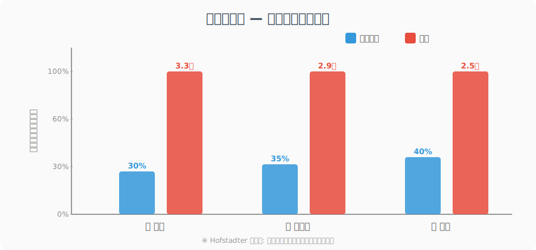
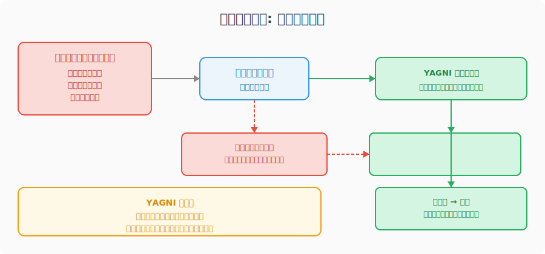
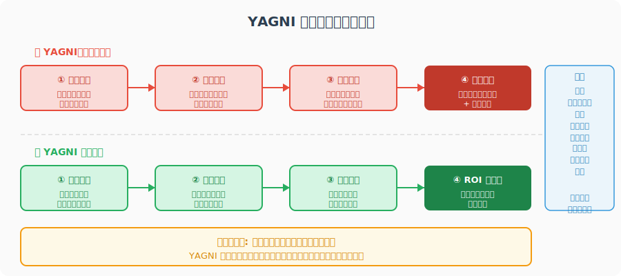
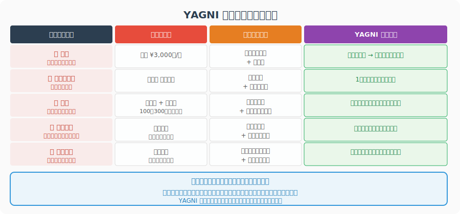
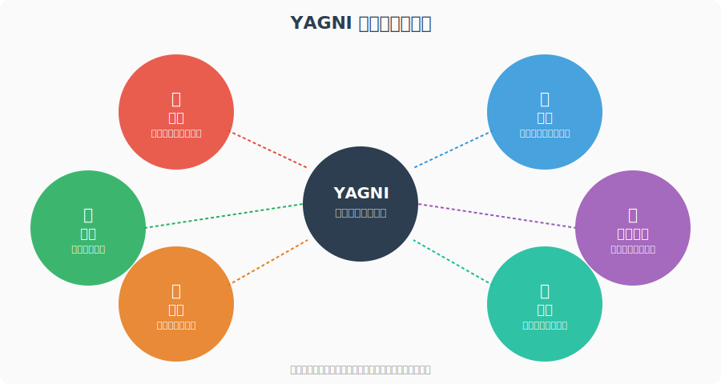
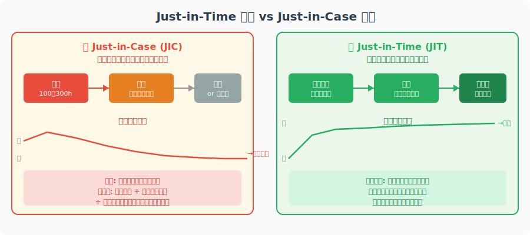
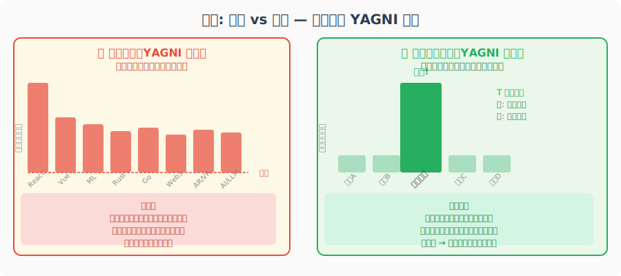
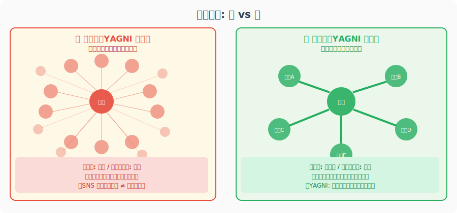
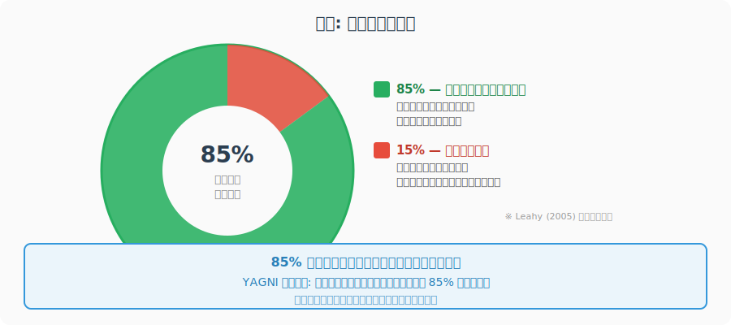
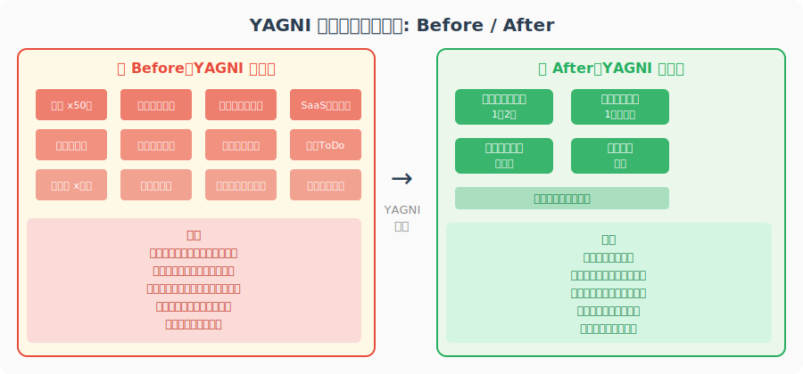

<!-- _class: lead -->
# YAGNI原則を人生に適用する

- You Ain't Gonna Need It
- エンジニアの設計思想が、人生を変える


---

# 自己紹介

- エンジニア歴 N 年
- YAGNI に救われた人間
- 同時に YAGNI を無視して失敗し続けた人間
- 今日は後者の失敗談を中心にお話しします


---

# アジェンダ (1/2)

- **Chapter 1**: YAGNIとは何か — 定義・歴史・認識論
- **Chapter 2**: 失敗誰談 — 私のYAGNI違反史
- **Chapter 3 前半**: 人生への応用 — モノ・時間・学習


---

# アジェンダ (2/2)

- **Chapter 3 後半**: 人生への応用 — キャリア・思考・お金
- **Chapter 4**: 実践法 — 原則・ツール・落とし穴
- **Chapter 5**: まとめ — 哲学・今日からできること


---

<!-- _class: lead -->
# Chapter 1

- YAGNIとは何か
- — 定義・歴史・認識論 —


---

# YAGNIとは

- **YAGNI** = You Ain't Gonna Need It
- 「それ、必要になると思ってるけど、実際には必要にならないよ」
- ソフトウェア開発の設計原則のひとつ
- 「今必要ではない機能は実装するな」
- XP（エクストリームプログラミング）で広まった考え方


---

<!-- _class: lead -->
# You Ain't Gonna Need It

- 未来のために今コストを払うな
- 必要になったときに実装すればいい
- **YAGNI は予測への懐疑論である**


---

# 誕生の背景: エクストリームプログラミング

- 1990年代後半、Kent Beck が提唱した開発手法
- 「今必要なことだけを、完璧にやる」
- XP の12のプラクティスのひとつとして YAGNI が登場
- 「変化に対応できる設計」vs「変化を予測した設計」
- YAGNI は後者を否定する


---

# Martin Fowler の言葉

- > Yagni only applies to capabilities built into the software to support a presumptive feature
- — Martin Fowler
- 「推測による機能」にコストを払ってはいけない
- 必要性が **証明されたとき** だけ実装する


---

# コードでの YAGNI 違反

- 「将来的に多言語対応するかもしれないから...」

```typescript
// 「いつか使うかも」な抽象化
class UserRepository {
  // 将来の DB 切り替えに備えて
  private adapter: DatabaseAdapter;
  private cache: CacheLayer;      // 未使用
  private fallback: FallbackStrategy; // 未使用

  // 将来の分散処理に備えて
  async findAll(options?: {
    shard?: string;
    replica?: 'primary' | 'secondary';
  }) { /* ... */ }
}
```


---

# コードでの YAGNI 実践

- 「今必要なことだけ書く」

```typescript
// 今必要なことだけ
class UserRepository {
  async findAll(): Promise<User[]> {
    return db.query('SELECT * FROM users');
  }

  async findById(id: string): Promise<User | null> {
    return db.query(
      'SELECT * FROM users WHERE id = ?',
      [id]
    );
  }
}
```


---

# なぜ YAGNI が難しいか

- 人間は「将来を予測できる」と思いがち
- 不確実性への不安を「準備」で解消しようとする
- 「後でやるより今やった方が安い」という誤信
- コードを書くことへの快感（過剰エンジニアリングの誘惑）
- チームへの見せ方（「考えてます」アピール）


---

# 認知バイアス: 計画の誤謬




---

# 認知バイアス: サンクコスト




---

# 本質: 未来への過投資という病

- YAGNI 違反の正体は「未来への過投資」
- 未来は常に不確実 → 投資は必ず一部が無駄になる
- 「来た未来」にしかコストを払えなかった
- YAGNI: 来た未来にだけコストを払う
- **「今」を最大限に生きることが最善の未来投資**


---

<!-- _class: lead -->
# Chapter 2

- 私のYAGNI違反史
- — 失敗から学んだこと —


---

# 失敗1: 積読

- 「いつか読もう」と買い続けた技術書・ビジネス書
- 読んだ本: 全体の 20% 以下
- 理由: 「今必要かどうか」ではなく「面白そう」で買っていた
- コスト: 本代 + 本棚スペース + 罪悪感
- **YAGNI 視点**: 必要になったとき、必要な本だけ買えばよかった


---

# 失敗2: 使わないガジェット購入

- 「いつか使いそう」なガジェットを購入し続けた
- 使わなかった率: 約 60%
- 「これがあれば生産性が上がる」という幻想
- コスト: 購入費 + 保管場所 + 処分の手間
- **YAGNI 視点**: 「今すぐ使う」でなければ買わない


---

# 失敗3: 役に立たなかった資格

- 「将来使えそう」な資格を複数取得した
- 実際に業務で活用した資格: 半数以下
- 勉強時間: 各資格に 100〜300 時間
- 「持っておけば安心」という安心感のための資格
- **YAGNI 視点**: 必要になったとき、必要な資格を取る


---

# 失敗4: 過度な準備で動けなかった

- 副業・ブログ・OSS活動... 「完璧な準備」を待ち続けた
- 「もう少し知識が増えてから」「もう少し時間ができてから」
- 準備期間中に機会を逃した
- 実際には「やりながら学ぶ」方が速かった
- **YAGNI 視点**: 最低限のものだけ準備して、あとは動きながら足す


---

# 失敗5: 使わないコード機能の実装

- 「将来マルチテナント対応するかも」で実装

```typescript
// 結果: 3年間一度も使われなかった
interface TenantConfig {
  tenantId: string;
  features: FeatureFlag[];
  customTheme: ThemeConfig;
  dataIsolation: 'shared' | 'dedicated';
}

// 総実装時間: 2週間
// 削除日: 3年後
// 後悔度: MAX
```


---

# 失敗6: キャリアの迷走

- 「将来 AI が来るから機械学習を勉強しよう」
- 「ブロックチェーン エンジニアが稼げるらしい」
- 「メタバース開発者が需要あるかも」
- 流行に流されて浅く広く学んだ 3 年間
- 結果: どれも中途半端、本業のスキルが止まっていた
- **YAGNI 視点**: 今の仕事に必要なスキルを深く伸ばす


---

# 共通パターン: 未来への賭けに負けた




---

# コストの可視化




---

<!-- _class: lead -->
# 教訓: もっと早く失敗すればよかった

- すべての失敗に共通すること...
- 「**やってから判断**すれば、コストが小さかった」
- YAGNI = 「必要になったら対応する」
- = 「失敗を小さく、早く経験する」
- **Fail fast, fail cheap, fail forward.**


---

<!-- _class: lead -->
# Chapter 3

- 人生への応用
- — YAGNI を生き方にする —


---

# YAGNI の適用領域マップ




---

# モノ: ワードローブ戦略

- **YAGNI 違反例**: 「いつか着るかも」な服が溢れる
- クローゼットの 20% の服を 80% の確率で着る（80:20 則）
- **YAGNI 実践**: 今の生活スタイルに必要な服だけ持つ
- 「1 着買ったら 1 着捨てる」ルール
- 着なかったら即処分する基準を持つ


---

# モノ: ガジェット購入ルール

- **YAGNI 違反例**: スペックへの過投資
- 「将来 4K 動画編集するかも」→ 実際はしない
- **YAGNI 実践の購入判断フロー**
- ① 今すぐ使うか？ → NO なら買わない
- ② 1ヶ月後も使っているか？ → 確認してから検討
- ③ 代替手段はないか？ → あるなら買わない


---

# モノ: 本の選び方

- **YAGNI 違反例**: 「面白そう」で買う積読
- **YAGNI 実践**: Just-in-Time 読書
- 「今困っていること」に直接関係する本だけ買う
- 図書館・電子書籍で「試し読み」してから購入
- 読み終えたら手放す（物理的・精神的スペース確保）


---

# 時間: スケジュールのバッファ


---

# 時間: やらないことリスト

- **YAGNI 違反例**: Todo リストが無限に増える
- 「いつかやる」タスクが溢れて優先度が崩壊
- **YAGNI 実践**: Not Todo リストを作る
- 「今の自分に必要ない」ことを明示的に決める
- 例: 「今年は新しい趣味を始めない」
- 例: 「週3回以上の会食は断る」


---

# 時間: 「ゆとり」の価値

- スケジュールをびっちり埋めることは YAGNI 違反
- 「ゆとり」= 未来の予期しない需要に応えるバッファ
- 急な仕事・チャンス・体調不良に対応できる余白
- 認知的な余裕が創造性と判断力を生む
- **「暇」は怠惰ではなく、戦略的空白である**


---

# 学習: Just-in-Time 学習




---

# 学習: 技術トレンドとの付き合い方

- **YAGNI 違反例**: 全トレンドをキャッチアップしようとする
- Hype Cycle の「幻滅期」で消えるものが多い
- **YAGNI 実践の判断基準**
- ① 今の仕事で使えるか？
- ② 1年後も存在しているか？
- ③ 深く学ぶ価値のある基礎技術か？
- → NO なら「見守り」でよい


---

# 学習: 深さ vs 広さ




---

# キャリア: 今の仕事に集中する

- **YAGNI 違反例**: 常に「次のキャリア」を考えて今が疎かに
- 「転職活動しながら今の仕事もこなす」の両立失敗
- **YAGNI 実践**: 今の仕事で圧倒的な成果を出す
- 優れた成果 → 機会が自然に集まる
- 転職は「必要になったとき」に考える


---

# キャリア: 転職タイミングの判断

- **YAGNI 的転職判断**: 「今」必要性が生じているか？
- 転職すべきシグナル（YAGNI 的）
- ① 今の環境で学べることがなくなった
- ② 明確なオファーや機会が目の前にある
- ③ 価値観・方向性の根本的なミスマッチ
- 転職しなくていいシグナル
- ④ 「なんとなく不安」「流行のスタートアップが気になる」


---

# 人間関係: 質 vs 量




---

# 思考: 心配の空振り率




---

# 思考: 意思決定の簡素化

- **YAGNI 違反例**: 全ての選択肢を調べ尽くしてから決める
- 「完全な情報」を得ようとするが、それは不可能
- **YAGNI 実践の意思決定ルール**
- ① 2択で迷ったら「今の自分」にフィットする方
- ② 1週間考えても決まらないなら、どちらでもいい
- ③ 「十分に良い選択」を素早くする


---

<!-- _class: lead -->
# 「考えすぎ」をやめる

- 思考もオーバーエンジニアリングする
- 「もしこうなったら」の連鎖は止まらない
- **YAGNI の思考版**: 「今必要な思考だけ」
- 起きていないことを考えるな
- 起きたときに考えればいい


---

# お金: YAGNI 的支出判断

- **YAGNI 違反例**: 「いつか使う日のため」の過剰貯蓄
- または: 「将来のため」という名の衝動買い
- **YAGNI 的支出の判断基準**
- ① 今の生活の質を上げるか？
- ② 1ヶ月後に後悔しないか？
- ③ 「将来のため」の割合が高すぎないか？
- 今を生きるために使うお金の価値を認める


---

# ライフスタイル: ミニマリズムと YAGNI

- ミニマリズム = 「今必要なものだけ持つ」
- これは YAGNI そのもの
- モノを減らすメリット
- ① 探す時間ゼロ（検索コスト削減）
- ② 選択疲れゼロ（認知コスト削減）
- ③ 引越し・移動が楽（変更コスト削減）
- エンジニアなら直感的に理解できる思想


---

# YAGNI 的ライフデザイン




---

# 人生のリファクタリング

- コードをリファクタリングするように、人生を整理する
- 「使っていないモジュール（習慣・モノ・関係）」を削除
- 「複雑になりすぎた関数（役割・義務）」を分解
- 「依存関係が強すぎる部分」を疎結合にする
- リファクタリングは一度ではなく、継続的に行う


---

# 定期的なレビューのすすめ

- コードレビューと同じように、人生もレビューする
- **月次レビュー**: 今月使ったもの・やったことを振り返る
- **年次レビュー**: 「まだ必要か？」を全てのものに問う
- 「積み上げる」よりも「削ぎ落とす」レビューを
- 今の自分に必要なものだけを残す


---

<!-- _class: lead -->
# Chapter 4

- 実践編
- — 今日から YAGNI を生きる —


---

# 原則1: 今必要なことだけやる

- **「今」にフォーカスする**
- 今日必要なことリストを毎朝作る
- リストにないことは原則やらない
- 「将来役に立つかも」は理由にならない
- 今日の問題を今日解く — それだけでいい


---

# 原則2: 捨てる勇気を持つ

- **「削除」は後退ではなく、前進である**
- 使っていないコードを消すように、使っていないものを手放す
- 「いつか使うかも」は「使わない」の言い訳
- 捨てることで「今必要なもの」が見えてくる
- Git は履歴を残す — でも人生に git blame は不要


---

# 原則3: 短いフィードバックループ


---

# ツール: 1ヶ月ルール

- **モノの購入・学習の開始 → 1ヶ月待つ**
- 「欲しい！」「やりたい！」と思ったら、メモして 1ヶ月待つ
- 1ヶ月後にまだ必要なら、それは本当に必要なもの
- 大半の「欲しい」は 1ヶ月後に消える
- **これが最強の YAGNI フィルター**


---

# 落とし穴: YAGNI は怠惰ではない

- 「今必要なことだけ」 ≠ 「楽をする」
- 今必要なことを **完璧に** やることが YAGNI
- XP での YAGNI: 「今のストーリーを完璧に実装する」
- 人生での YAGNI: 「今の役割を完璧に果たす」
- **YAGNI は集中の原則であり、省エネの原則ではない**


---

# 落とし穴: 必要なものまで削らない

- YAGNI の誤用: 「健康管理」「人間関係」を削る
- 基盤となるもの（健康・睡眠・基礎学習）は削ってはいけない
- 判断基準: 「今必要か」ではなく「将来も必要か」
- YAGNI の適用範囲は「推測による先行投資」であり、
- 「確実に必要な基盤」ではない


---

<!-- _class: lead -->
# Chapter 5

- まとめ
- — YAGNI is a Lifestyle —


---

# YAGNI と東洋哲学

- **禅**: 「今ここに集中する」
- 余分なものを排して、今この瞬間に全力を注ぐ
- **老子 / 無為自然**: 「為さずして為す」
- 余計なことをしないことで、自然の流れに従う
- **YAGNI は西洋工学の原則であり、東洋哲学でもある**
- エンジニアとして YAGNI を学んだ私たちは、古来の知恵を手に入れていた


---

# エンジニアの強み: 設計思考の転用


---

# 今日から始める3つのこと

- **① 1ヶ月ルールを始める**
- 欲しいもの・やりたいことをメモして 1ヶ月待つ
- **② 「今日やること」だけのリストを作る**
- 「いつかやる」は今日のリストから外す
- **③ 何か一つ捨てる**
- 使っていないアプリ・モノ・予定を今日削除する


---

<!-- _class: lead -->
# YAGNI is a Lifestyle

- You Ain't Gonna Need It
- それ、必要にならないから。
- **今を生きよう。**


---

# 参考文献・リソース

- **YAGNI・XP 関連**
- [Martin Fowler — Yagni](https://martinfowler.com/bliki/Yagni.html)
- [Extreme Programming Explained — Kent Beck](https://www.informit.com/store/extreme-programming-explained-embrace-change-9780321278654)
- **ミニマリズム・思想**
- [The Life-Changing Magic of Tidying Up — Marie Kondo](https://konmari.com/)
- [エッセンシャル思考 — Greg McKeown](https://gregmckeown.com/books/essentialism/)


---

<!-- _class: lead -->
# おわりに

- ご清聴ありがとうございました
- 「今必要なことだけ」を伝えようとしたら 60 枚になりました
- YAGNI 違反かもしれません 😅
- 質問・ご意見はお気軽にどうぞ

