<!-- _class: lead -->
# YAGNI原則を人生に適用する

- You Ain't Gonna Need It
- エンジニアの設計思想が、人生を変える


---

# 自己紹介

> *失敗談から学ぶ—YAGNI違反の代償を体験者が正直に語る*

- エンジニア歴 N 年
- YAGNI に救われた人間
- 同時に YAGNI を無視して失敗し続けた人間
- 今日は後者の失敗談を中心にお話しします


---

# アジェンダ (1/2)

- **Chapter 1**: YAGNIとは何か — 定義・歴史・認識論
- **Chapter 2**: 失敗誰談 — 私のYAGNI違反史
- **Chapter 3 前半**: 人生への応用 — モノ・時間・学習


---

# アジェンダ (2/2)

- **Chapter 3 後半**: 人生への応用 — キャリア・思考・お金
- **Chapter 4**: 実践法 — 原則・ツール・落とし穴
- **Chapter 5**: まとめ — 哲学・今日からできること


---

<!-- _class: lead -->
# Chapter 1

- YAGNIとは何か
- — 定義・歴史・認識論 —


---

# YAGNIとは

> *YAGNI = 推測による実装を全廃する予測懐疑論の原則*

- <svg viewBox="0 0 800 400" xmlns="http://www.w3.org/2000/svg" style="max-height:70vh;max-width:100%;display:block;margin:0 auto;">
<rect width="800" height="400" fill="#1a1a2e"/>
<text x="400" y="35" fill="#ffffff" font-size="15" text-anchor="middle" font-family="sans-serif">YAGNI の核心: 予測への懐疑論</text>
<rect x="50" y="65" width="320" height="130" rx="12" fill="#16213e" stroke="#e91e63" stroke-width="2"/>
<text x="210" y="93" fill="#e91e63" font-size="13" text-anchor="middle" font-family="sans-serif">予測駆動の設計</text>
<text x="210" y="128" fill="#ffffff" font-size="12" text-anchor="middle" font-family="sans-serif">「将来Xが必要になるはず」</text>
<text x="210" y="153" fill="#ffffff" font-size="12" text-anchor="middle" font-family="sans-serif">今コストを払って実装する</text>
<text x="210" y="178" fill="#aaaaaa" font-size="11" text-anchor="middle" font-family="sans-serif">→ 多くは使われないまま</text>
<rect x="430" y="65" width="320" height="130" rx="12" fill="#16213e" stroke="#f9a825" stroke-width="2"/>
<text x="590" y="93" fill="#f9a825" font-size="13" text-anchor="middle" font-family="sans-serif">YAGNI の設計</text>
<text x="590" y="128" fill="#ffffff" font-size="12" text-anchor="middle" font-family="sans-serif">「今必要なことだけ実装する」</text>
<text x="590" y="153" fill="#ffffff" font-size="12" text-anchor="middle" font-family="sans-serif">必要になったとき対応する</text>
<text x="590" y="178" fill="#4caf50" font-size="11" text-anchor="middle" font-family="sans-serif">→ コストは実際の需要に一致</text>
<text x="400" y="240" fill="#f9a825" font-size="16" text-anchor="middle" font-weight="bold" font-family="sans-serif">You Ain't Gonna Need It</text>
<rect x="100" y="265" width="600" height="105" rx="10" fill="#16213e" stroke="#aaaaaa" stroke-width="1"/>
<text x="400" y="293" fill="#aaaaaa" font-size="12" text-anchor="middle" font-family="sans-serif">YAGNI が守るもの:</text>
<text x="200" y="323" fill="#ffffff" font-size="12" text-anchor="middle" font-family="sans-serif">開発時間</text>
<text x="400" y="323" fill="#ffffff" font-size="12" text-anchor="middle" font-family="sans-serif">コードの複雑さ</text>
<text x="600" y="323" fill="#ffffff" font-size="12" text-anchor="middle" font-family="sans-serif">保守コスト</text>
<text x="400" y="355" fill="#aaaaaa" font-size="11" text-anchor="middle" font-family="sans-serif">XP (エクストリームプログラミング) の12プラクティスのひとつ</text>
</svg>
- **YAGNI** = You Ain't Gonna Need It
- 「それ、必要になると思ってるけど、実際には必要にならないよ」
- ソフトウェア開発の設計原則のひとつ
- 「今必要ではない機能は実装するな」
- XP（エクストリームプログラミング）で広まった考え方


---

<!-- _class: lead -->
# You Ain't Gonna Need It

- 未来のために今コストを払うな
- 必要になったときに実装すればいい
- **YAGNI は予測への懐疑論である**


---

# 誕生の背景: エクストリームプログラミング

> *XPの哲学は「変化に備える設計」ではなく「変化に対応する設計」*

- <svg viewBox="0 0 800 400" xmlns="http://www.w3.org/2000/svg" style="max-height:70vh;max-width:100%;display:block;margin:0 auto;">
<rect width="800" height="400" fill="#1a1a2e"/>
<text x="400" y="35" fill="#ffffff" font-size="15" text-anchor="middle" font-family="sans-serif">エクストリームプログラミング と YAGNI</text>
<rect x="40" y="55" width="340" height="300" rx="10" fill="#16213e" stroke="#f9a825" stroke-width="1.5"/>
<text x="210" y="83" fill="#f9a825" font-size="13" text-anchor="middle" font-family="sans-serif">XP の価値観</text>
<text x="210" y="120" fill="#ffffff" font-size="12" text-anchor="middle" font-family="sans-serif">Communication</text>
<text x="210" y="148" fill="#ffffff" font-size="12" text-anchor="middle" font-family="sans-serif">Simplicity</text>
<text x="210" y="176" fill="#ffffff" font-size="12" text-anchor="middle" font-family="sans-serif">Feedback</text>
<text x="210" y="204" fill="#ffffff" font-size="12" text-anchor="middle" font-family="sans-serif">Courage</text>
<text x="210" y="232" fill="#f9a825" font-size="12" text-anchor="middle" font-family="sans-serif">Respect</text>
<text x="210" y="275" fill="#aaaaaa" font-size="11" text-anchor="middle" font-family="sans-serif">Kent Beck が 1990年代後半に提唱</text>
<text x="210" y="298" fill="#aaaaaa" font-size="11" text-anchor="middle" font-family="sans-serif">「今必要なことを完璧に」</text>
<rect x="420" y="55" width="340" height="300" rx="10" fill="#16213e" stroke="#e91e63" stroke-width="1.5"/>
<text x="590" y="83" fill="#e91e63" font-size="13" text-anchor="middle" font-family="sans-serif">変化への対応 vs 予測</text>
<rect x="440" y="100" width="300" height="55" rx="6" fill="#2a0a0a"/>
<text x="590" y="123" fill="#e91e63" font-size="12" text-anchor="middle" font-family="sans-serif">変化を予測した設計</text>
<text x="590" y="143" fill="#aaaaaa" font-size="10" text-anchor="middle" font-family="sans-serif">→ YAGNI が否定する</text>
<rect x="440" y="168" width="300" height="55" rx="6" fill="#1a2a1a"/>
<text x="590" y="191" fill="#4caf50" font-size="12" text-anchor="middle" font-family="sans-serif">変化に対応できる設計</text>
<text x="590" y="211" fill="#aaaaaa" font-size="10" text-anchor="middle" font-family="sans-serif">→ YAGNI が推奨する</text>
<rect x="440" y="236" width="300" height="90" rx="6" fill="#16213e" stroke="#f9a825" stroke-width="1"/>
<text x="590" y="262" fill="#f9a825" font-size="12" text-anchor="middle" font-family="sans-serif">Martin Fowler:</text>
<text x="590" y="285" fill="#ffffff" font-size="11" text-anchor="middle" font-family="sans-serif">「推測による機能に</text>
<text x="590" y="305" fill="#ffffff" font-size="11" text-anchor="middle" font-family="sans-serif">コストを払うな」</text>
</svg>
- 1990年代後半、Kent Beck が提唱した開発手法
- 「今必要なことだけを、完璧にやる」
- XP の12のプラクティスのひとつとして YAGNI が登場
- 「変化に対応できる設計」vs「変化を予測した設計」
- YAGNI は後者を否定する


---

# Martin Fowler の言葉

> *Fowlerの一言—推測による機能にコストを払うのは合理的でない*

- <svg viewBox="0 0 800 400" xmlns="http://www.w3.org/2000/svg" style="max-height:70vh;max-width:100%;display:block;margin:0 auto;">
<rect width="800" height="400" fill="#1a1a2e"/>
<text x="400" y="35" fill="#ffffff" font-size="15" text-anchor="middle" font-family="sans-serif">Martin Fowler の YAGNI 解釈</text>
<rect x="50" y="60" width="700" height="110" rx="12" fill="#16213e" stroke="#f9a825" stroke-width="2"/>
<text x="400" y="98" fill="#f9a825" font-size="14" text-anchor="middle" font-style="italic" font-family="sans-serif">"Yagni only applies to capabilities built into the</text>
<text x="400" y="122" fill="#f9a825" font-size="14" text-anchor="middle" font-style="italic" font-family="sans-serif">software to support a presumptive feature"</text>
<text x="750" y="155" fill="#aaaaaa" font-size="11" text-anchor="end" font-family="sans-serif">— Martin Fowler, martinfowler.com</text>
<rect x="50" y="190" width="330" height="175" rx="10" fill="#16213e" stroke="#e91e63" stroke-width="1.5"/>
<text x="215" y="218" fill="#e91e63" font-size="13" text-anchor="middle" font-family="sans-serif">YAGNI 違反のコスト</text>
<text x="215" y="253" fill="#ffffff" font-size="12" text-anchor="middle" font-family="sans-serif">実装コスト (今払う)</text>
<text x="215" y="278" fill="#ffffff" font-size="12" text-anchor="middle" font-family="sans-serif">保守コスト (毎回払う)</text>
<text x="215" y="303" fill="#ffffff" font-size="12" text-anchor="middle" font-family="sans-serif">複雑さコスト (理解コスト)</text>
<text x="215" y="340" fill="#e91e63" font-size="11" text-anchor="middle" font-family="sans-serif">未来の需要が来なければ全て無駄</text>
<rect x="420" y="190" width="330" height="175" rx="10" fill="#16213e" stroke="#4caf50" stroke-width="1.5"/>
<text x="585" y="218" fill="#4caf50" font-size="13" text-anchor="middle" font-family="sans-serif">YAGNI 実践のコスト</text>
<text x="585" y="253" fill="#ffffff" font-size="12" text-anchor="middle" font-family="sans-serif">後から実装するコスト</text>
<text x="585" y="278" fill="#aaaaaa" font-size="12" text-anchor="middle" font-family="sans-serif">(ほとんど変わらない)</text>
<text x="585" y="315" fill="#4caf50" font-size="12" text-anchor="middle" font-family="sans-serif">必要性が証明されたとき</text>
<text x="585" y="340" fill="#4caf50" font-size="11" text-anchor="middle" font-family="sans-serif">だけ払えばいい</text>
</svg>
- > Yagni only applies to capabilities built into the software to support a presumptive feature
- — Martin Fowler
- 「推測による機能」にコストを払ってはいけない
- 必要性が **証明されたとき** だけ実装する


---

# コードでの YAGNI 違反

- 「将来的に多言語対応するかもしれないから...」


---

# コードでの YAGNI 違反（コード例）

```typescript
// 「いつか使うかも」な抽象化
class UserRepository {
  // 将来の DB 切り替えに備えて
  private adapter: DatabaseAdapter;
  private cache: CacheLayer;      // 未使用
  private fallback: FallbackStrategy; // 未使用

  // 将来の分散処理に備えて
  async findAll(options?: {
    shard?: string;
    replica?: 'primary' | 'secondary';
  }) { /* ... */ }
}
```


---

# コードでの YAGNI 実践

- 「今必要なことだけ書く」


---

# コードでの YAGNI 実践（コード例）

```typescript
// 今必要なことだけ
class UserRepository {
  async findAll(): Promise<User[]> {
    return db.query('SELECT * FROM users');
  }

  async findById(id: string): Promise<User | null> {
    return db.query(
      'SELECT * FROM users WHERE id = ?',
      [id]
    );
  }
}
```


---

# なぜ YAGNI が難しいか

> *過剰自信・不確実性回避・快感の3バイアスがYAGNIを難しくする*

- <svg viewBox="0 0 800 400" xmlns="http://www.w3.org/2000/svg" style="max-height:70vh;max-width:100%;display:block;margin:0 auto;">
<rect width="800" height="400" fill="#1a1a2e"/>
<text x="400" y="35" fill="#ffffff" font-size="15" text-anchor="middle" font-family="sans-serif">YAGNI を難しくする心理的要因</text>
<rect x="40" y="60" width="220" height="110" rx="10" fill="#16213e" stroke="#e91e63" stroke-width="1.5"/>
<text x="150" y="88" fill="#e91e63" font-size="12" text-anchor="middle" font-family="sans-serif">過剰自信バイアス</text>
<text x="150" y="115" fill="#ffffff" font-size="11" text-anchor="middle" font-family="sans-serif">「将来を予測できる」</text>
<text x="150" y="138" fill="#aaaaaa" font-size="10" text-anchor="middle" font-family="sans-serif">という誤信</text>
<rect x="290" y="60" width="220" height="110" rx="10" fill="#16213e" stroke="#e91e63" stroke-width="1.5"/>
<text x="400" y="88" fill="#e91e63" font-size="12" text-anchor="middle" font-family="sans-serif">不確実性回避</text>
<text x="400" y="115" fill="#ffffff" font-size="11" text-anchor="middle" font-family="sans-serif">「準備」で不安を解消</text>
<text x="400" y="138" fill="#aaaaaa" font-size="10" text-anchor="middle" font-family="sans-serif">しようとする本能</text>
<rect x="540" y="60" width="220" height="110" rx="10" fill="#16213e" stroke="#e91e63" stroke-width="1.5"/>
<text x="650" y="88" fill="#e91e63" font-size="12" text-anchor="middle" font-family="sans-serif">計画の誤謬</text>
<text x="650" y="115" fill="#ffffff" font-size="11" text-anchor="middle" font-family="sans-serif">「今やった方が安い」</text>
<text x="650" y="138" fill="#aaaaaa" font-size="10" text-anchor="middle" font-family="sans-serif">という根拠なき確信</text>
<rect x="40" y="200" width="220" height="110" rx="10" fill="#16213e" stroke="#f9a825" stroke-width="1"/>
<text x="150" y="228" fill="#f9a825" font-size="12" text-anchor="middle" font-family="sans-serif">コーディング快感</text>
<text x="150" y="255" fill="#ffffff" font-size="11" text-anchor="middle" font-family="sans-serif">実装の楽しさ</text>
<text x="150" y="278" fill="#aaaaaa" font-size="10" text-anchor="middle" font-family="sans-serif">過剰設計の誘惑</text>
<rect x="290" y="200" width="220" height="110" rx="10" fill="#16213e" stroke="#f9a825" stroke-width="1"/>
<text x="400" y="228" fill="#f9a825" font-size="12" text-anchor="middle" font-family="sans-serif">サンクコスト</text>
<text x="400" y="255" fill="#ffffff" font-size="11" text-anchor="middle" font-family="sans-serif">「もう作ったから使おう」</text>
<text x="400" y="278" fill="#aaaaaa" font-size="10" text-anchor="middle" font-family="sans-serif">使わないのに残す</text>
<rect x="540" y="200" width="220" height="110" rx="10" fill="#16213e" stroke="#f9a825" stroke-width="1"/>
<text x="650" y="228" fill="#f9a825" font-size="12" text-anchor="middle" font-family="sans-serif">アピール欲求</text>
<text x="650" y="255" fill="#ffffff" font-size="11" text-anchor="middle" font-family="sans-serif">「考えてます」見せ</text>
<text x="650" y="278" fill="#aaaaaa" font-size="10" text-anchor="middle" font-family="sans-serif">チームへのアピール</text>
<rect x="100" y="330" width="600" height="50" rx="8" fill="#16213e" stroke="#f9a825" stroke-width="1"/>
<text x="400" y="360" fill="#f9a825" font-size="12" text-anchor="middle" font-family="sans-serif">YAGNI は認知バイアスと戦う原則</text>
</svg>
- 人間は「将来を予測できる」と思いがち
- 不確実性への不安を「準備」で解消しようとする
- 「後でやるより今やった方が安い」という誤信
- コードを書くことへの快感（過剰エンジニアリングの誘惑）
- チームへの見せ方（「考えてます」アピール）


---

# 認知バイアス: 計画の誤謬

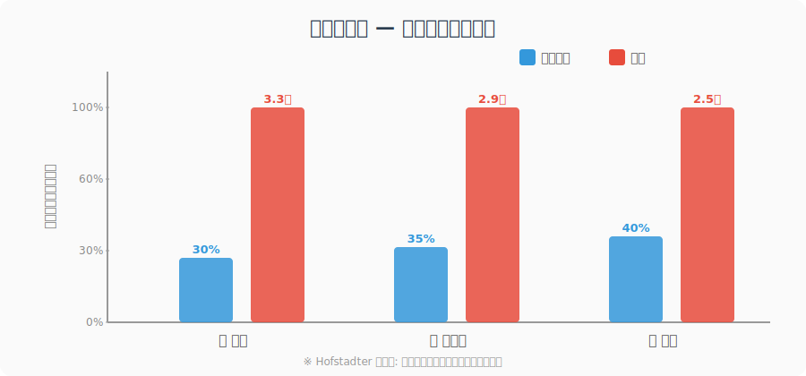


---

# 認知バイアス: サンクコスト

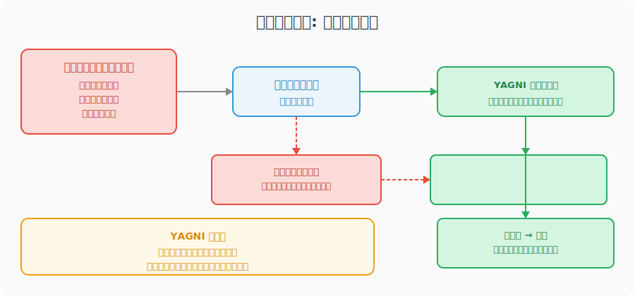


---

# 本質: 未来への過投資という病

> *未来への過投資は必ず損—来た未来にだけコストを払うのが最善*

- <svg viewBox="0 0 800 400" xmlns="http://www.w3.org/2000/svg" style="max-height:70vh;max-width:100%;display:block;margin:0 auto;">
<rect width="800" height="400" fill="#1a1a2e"/>
<text x="400" y="35" fill="#ffffff" font-size="15" text-anchor="middle" font-family="sans-serif">未来への過投資という病</text>
<line x1="60" y1="300" x2="740" y2="300" stroke="#aaaaaa" stroke-width="1.5"/>
<line x1="60" y1="300" x2="60" y2="60" stroke="#aaaaaa" stroke-width="1.5"/>
<text x="400" y="340" fill="#aaaaaa" font-size="12" text-anchor="middle" font-family="sans-serif">時間軸</text>
<text x="30" y="180" fill="#aaaaaa" font-size="11" text-anchor="middle" font-family="sans-serif" transform="rotate(-90,30,180)">コスト/価値</text>
<polyline points="60,280 150,250 250,200 350,200 450,200 550,200 650,200 740,200" stroke="#aaaaaa" stroke-width="2" fill="none" stroke-dasharray="8,4"/>
<text x="680" y="190" fill="#aaaaaa" font-size="10" font-family="sans-serif">想定価値</text>
<polyline points="60,200 150,185 250,170 350,160 450,165 550,190 650,280 740,300" stroke="#e91e63" stroke-width="2.5" fill="none"/>
<text x="650" y="270" fill="#e91e63" font-size="11" font-family="sans-serif">YAGNI違反</text>
<text x="650" y="288" fill="#e91e63" font-size="11" font-family="sans-serif">実際の価値</text>
<polyline points="60,280 150,260 250,235 350,210 450,185 550,165 650,150 740,140" stroke="#4caf50" stroke-width="2.5" fill="none"/>
<text x="650" y="140" fill="#4caf50" font-size="11" font-family="sans-serif">YAGNI実践</text>
<rect x="60" y="140" width="250" height="60" rx="8" fill="#16213e" stroke="#e91e63" stroke-width="1.5"/>
<text x="185" y="163" fill="#e91e63" font-size="11" text-anchor="middle" font-family="sans-serif">早期に高コスト投入</text>
<text x="185" y="183" fill="#aaaaaa" font-size="10" text-anchor="middle" font-family="sans-serif">→ 価値は来なかった</text>
<rect x="500" y="100" width="240" height="60" rx="8" fill="#16213e" stroke="#4caf50" stroke-width="1.5"/>
<text x="620" y="123" fill="#4caf50" font-size="11" text-anchor="middle" font-family="sans-serif">必要になったとき対応</text>
<text x="620" y="143" fill="#aaaaaa" font-size="10" text-anchor="middle" font-family="sans-serif">→ コストと価値が一致</text>
</svg>
- YAGNI 違反の正体は「未来への過投資」
- 未来は常に不確実 → 投資は必ず一部が無駄になる
- 「来た未来」にしかコストを払えなかった
- YAGNI: 来た未来にだけコストを払う
- **「今」を最大限に生きることが最善の未来投資**


---

<!-- _class: lead -->
# Chapter 2

- 私のYAGNI違反史
- — 失敗から学んだこと —


---

# 失敗1: 積読

> *積読の読了率20%以下—「面白そう」で買う習慣が生む純損失*

- <svg viewBox="0 0 800 400" xmlns="http://www.w3.org/2000/svg" style="max-height:70vh;max-width:100%;display:block;margin:0 auto;">
<rect width="800" height="400" fill="#1a1a2e"/>
<text x="400" y="35" fill="#ffffff" font-size="15" text-anchor="middle" font-family="sans-serif">失敗1: 積読 — YAGNI 違反の典型例</text>
<rect x="40" y="60" width="330" height="290" rx="10" fill="#16213e" stroke="#e91e63" stroke-width="1.5"/>
<text x="205" y="88" fill="#e91e63" font-size="13" text-anchor="middle" font-family="sans-serif">積読のコスト構造</text>
<text x="205" y="130" fill="#ffffff" font-size="12" text-anchor="middle" font-family="sans-serif">本代</text>
<rect x="60" y="140" width="290" height="18" rx="3" fill="#e91e63" opacity="0.4"/>
<rect x="60" y="140" width="87" height="18" rx="3" fill="#e91e63"/>
<text x="205" y="176" fill="#ffffff" font-size="12" text-anchor="middle" font-family="sans-serif">本棚スペース</text>
<rect x="60" y="186" width="290" height="18" rx="3" fill="#e91e63" opacity="0.4"/>
<rect x="60" y="186" width="145" height="18" rx="3" fill="#e91e63" opacity="0.6"/>
<text x="205" y="222" fill="#ffffff" font-size="12" text-anchor="middle" font-family="sans-serif">罪悪感 (認知コスト)</text>
<rect x="60" y="232" width="290" height="18" rx="3" fill="#e91e63" opacity="0.4"/>
<rect x="60" y="232" width="232" height="18" rx="3" fill="#e91e63" opacity="0.7"/>
<text x="205" y="290" fill="#e91e63" font-size="13" text-anchor="middle" font-family="sans-serif">読んだ本: 20% 以下</text>
<text x="205" y="320" fill="#aaaaaa" font-size="11" text-anchor="middle" font-family="sans-serif">80% はそのまま棚に残る</text>
<rect x="430" y="60" width="330" height="290" rx="10" fill="#16213e" stroke="#4caf50" stroke-width="1.5"/>
<text x="595" y="88" fill="#4caf50" font-size="13" text-anchor="middle" font-family="sans-serif">YAGNI 実践: JIT 読書</text>
<text x="595" y="130" fill="#ffffff" font-size="12" text-anchor="middle" font-family="sans-serif">今困っていることに関連する本</text>
<text x="595" y="153" fill="#ffffff" font-size="12" text-anchor="middle" font-family="sans-serif">だけを買う</text>
<text x="595" y="195" fill="#ffffff" font-size="12" text-anchor="middle" font-family="sans-serif">図書館・電子書籍で試し読み</text>
<text x="595" y="218" fill="#ffffff" font-size="12" text-anchor="middle" font-family="sans-serif">後から購入</text>
<text x="595" y="260" fill="#ffffff" font-size="12" text-anchor="middle" font-family="sans-serif">読んだら手放す</text>
<text x="595" y="300" fill="#4caf50" font-size="13" text-anchor="middle" font-family="sans-serif">読了率: 90%+ を目指す</text>
<text x="595" y="330" fill="#aaaaaa" font-size="11" text-anchor="middle" font-family="sans-serif">「面白そう」ではなく「今必要か」</text>
</svg>
- 「いつか読もう」と買い続けた技術書・ビジネス書
- 読んだ本: 全体の 20% 以下
- 理由: 「今必要かどうか」ではなく「面白そう」で買っていた
- コスト: 本代 + 本棚スペース + 罪悪感
- **YAGNI 視点**: 必要になったとき、必要な本だけ買えばよかった


---

# 失敗2: 使わないガジェット購入

> *ガジェット不使用率60%—「今すぐ使う」フィルターで損失を防げる*

- <svg viewBox="0 0 800 400" xmlns="http://www.w3.org/2000/svg" style="max-height:70vh;max-width:100%;display:block;margin:0 auto;">
<rect width="800" height="400" fill="#1a1a2e"/>
<text x="400" y="35" fill="#ffffff" font-size="15" text-anchor="middle" font-family="sans-serif">失敗2: 使わないガジェット — スペック過剰投資</text>
<rect x="40" y="60" width="330" height="290" rx="10" fill="#16213e" stroke="#e91e63" stroke-width="2"/>
<text x="205" y="88" fill="#e91e63" font-size="13" text-anchor="middle" font-family="sans-serif">ガジェット YAGNI 違反例</text>
<text x="205" y="128" fill="#ffffff" font-size="12" text-anchor="middle" font-family="sans-serif">「4K動画編集するかも」</text>
<text x="205" y="150" fill="#aaaaaa" font-size="10" text-anchor="middle" font-family="sans-serif">→ 実際には YouTube 視聴のみ</text>
<text x="205" y="190" fill="#ffffff" font-size="12" text-anchor="middle" font-family="sans-serif">「ポッドキャスト始めるかも」</text>
<text x="205" y="212" fill="#aaaaaa" font-size="10" text-anchor="middle" font-family="sans-serif">→ 3回録音して終了</text>
<text x="205" y="252" fill="#ffffff" font-size="12" text-anchor="middle" font-family="sans-serif">「外でコーディングするかも」</text>
<text x="205" y="274" fill="#aaaaaa" font-size="10" text-anchor="middle" font-family="sans-serif">→ 家から出ない</text>
<text x="205" y="325" fill="#e91e63" font-size="12" text-anchor="middle" font-family="sans-serif">使わなかった率: 約 60%</text>
<rect x="430" y="60" width="330" height="290" rx="10" fill="#16213e" stroke="#f9a825" stroke-width="2"/>
<text x="595" y="88" fill="#f9a825" font-size="13" text-anchor="middle" font-family="sans-serif">YAGNI 購入判断フロー</text>
<rect x="450" y="108" width="290" height="38" rx="6" fill="#1a2a1a"/>
<text x="595" y="133" fill="#4caf50" font-size="12" text-anchor="middle" font-family="sans-serif">① 今すぐ使うか？ → NO = 買わない</text>
<rect x="450" y="158" width="290" height="38" rx="6" fill="#1a2a1a"/>
<text x="595" y="183" fill="#4caf50" font-size="12" text-anchor="middle" font-family="sans-serif">② 1ヶ月後も使う？ → NO = 買わない</text>
<rect x="450" y="208" width="290" height="38" rx="6" fill="#1a2a1a"/>
<text x="595" y="233" fill="#4caf50" font-size="12" text-anchor="middle" font-family="sans-serif">③ 代替手段ある？ → YES = 買わない</text>
<rect x="450" y="270" width="290" height="55" rx="6" fill="#16213e" stroke="#f9a825" stroke-width="1"/>
<text x="595" y="295" fill="#f9a825" font-size="12" text-anchor="middle" font-family="sans-serif">全て通過したとき</text>
<text x="595" y="315" fill="#f9a825" font-size="12" text-anchor="middle" font-family="sans-serif">初めて購入を検討する</text>
</svg>
- 「いつか使いそう」なガジェットを購入し続けた
- 使わなかった率: 約 60%
- 「これがあれば生産性が上がる」という幻想
- コスト: 購入費 + 保管場所 + 処分の手間
- **YAGNI 視点**: 「今すぐ使う」でなければ買わない


---

# 失敗3: 役に立たなかった資格

> *業務活用率50%以下の資格—必要になってから取れば全て活きる*

- 「将来使えそう」な資格を複数取得した
- 実際に業務で活用した資格: 半数以下
- 勉強時間: 各資格に 100〜300 時間
- 「持っておけば安心」という安心感のための資格
- **YAGNI 視点**: 必要になったとき、必要な資格を取る


---

# 失敗4: 過度な準備で動けなかった

> *準備過剰で機会を逃す分析麻痺—最低限で動けば失敗コストは小さい*

- <svg viewBox="0 0 800 400" xmlns="http://www.w3.org/2000/svg" style="max-height:70vh;max-width:100%;display:block;margin:0 auto;">
<rect width="800" height="400" fill="#1a1a2e"/>
<text x="400" y="35" fill="#ffffff" font-size="15" text-anchor="middle" font-family="sans-serif">失敗4: 準備過剰で動けない — 分析麻痺</text>
<rect x="40" y="60" width="340" height="280" rx="10" fill="#16213e" stroke="#e91e63" stroke-width="2"/>
<text x="210" y="88" fill="#e91e63" font-size="13" text-anchor="middle" font-family="sans-serif">準備完璧主義の罠</text>
<text x="210" y="130" fill="#ffffff" font-size="12" text-anchor="middle" font-family="sans-serif">「もう少し知識が増えてから」</text>
<text x="210" y="155" fill="#ffffff" font-size="12" text-anchor="middle" font-family="sans-serif">「もう少し時間ができてから」</text>
<text x="210" y="180" fill="#ffffff" font-size="12" text-anchor="middle" font-family="sans-serif">「もう少し完璧な計画が立ったら」</text>
<text x="210" y="225" fill="#e91e63" font-size="13" text-anchor="middle" font-family="sans-serif">その間に:</text>
<text x="210" y="255" fill="#aaaaaa" font-size="12" text-anchor="middle" font-family="sans-serif">機会を逃す</text>
<text x="210" y="278" fill="#aaaaaa" font-size="12" text-anchor="middle" font-family="sans-serif">競合が先に動く</text>
<text x="210" y="300" fill="#aaaaaa" font-size="12" text-anchor="middle" font-family="sans-serif">「準備の準備」が始まる</text>
<rect x="430" y="60" width="330" height="280" rx="10" fill="#16213e" stroke="#4caf50" stroke-width="2"/>
<text x="595" y="88" fill="#4caf50" font-size="13" text-anchor="middle" font-family="sans-serif">YAGNI 的アプローチ</text>
<text x="595" y="130" fill="#ffffff" font-size="12" text-anchor="middle" font-family="sans-serif">最低限の準備だけして動く</text>
<text x="595" y="158" fill="#ffffff" font-size="12" text-anchor="middle" font-family="sans-serif">動きながら学ぶ</text>
<text x="595" y="186" fill="#ffffff" font-size="12" text-anchor="middle" font-family="sans-serif">失敗を早めに経験する</text>
<rect x="450" y="220" width="290" height="95" rx="8" fill="#16213e" stroke="#f9a825" stroke-width="1.5"/>
<text x="595" y="248" fill="#f9a825" font-size="12" text-anchor="middle" font-family="sans-serif">Fail fast, fail cheap</text>
<text x="595" y="273" fill="#ffffff" font-size="11" text-anchor="middle" font-family="sans-serif">早く失敗するほど</text>
<text x="595" y="295" fill="#ffffff" font-size="11" text-anchor="middle" font-family="sans-serif">修正コストが低い</text>
</svg>
- 副業・ブログ・OSS活動... 「完璧な準備」を待ち続けた
- 「もう少し知識が増えてから」「もう少し時間ができてから」
- 準備期間中に機会を逃した
- 実際には「やりながら学ぶ」方が速かった
- **YAGNI 視点**: 最低限のものだけ準備して、あとは動きながら足す


---

# 失敗5: 使わないコード機能の実装

- 「将来マルチテナント対応するかも」で実装


---

# 失敗5: 使わないコード機能の実装（コード例）

```typescript
// 結果: 3年間一度も使われなかった
interface TenantConfig {
  tenantId: string;
  features: FeatureFlag[];
  customTheme: ThemeConfig;
  dataIsolation: 'shared' | 'dedicated';
}

// 総実装時間: 2週間
// 削除日: 3年後
// 後悔度: MAX
```


---

# 失敗6: キャリアの迷走

> *流行3技術を追った3年間が本業スキルの停滞を招いた教訓*

- <svg viewBox="0 0 800 400" xmlns="http://www.w3.org/2000/svg" style="max-height:70vh;max-width:100%;display:block;margin:0 auto;">
<rect width="800" height="400" fill="#1a1a2e"/>
<text x="400" y="35" fill="#ffffff" font-size="15" text-anchor="middle" font-family="sans-serif">失敗6: 流行に流されたキャリアの迷走</text>
<line x1="50" y1="280" x2="750" y2="280" stroke="#aaaaaa" stroke-width="1.5"/>
<text x="400" y="310" fill="#aaaaaa" font-size="11" text-anchor="middle" font-family="sans-serif">時間</text>
<polyline points="60,240 150,180 220,120 260,150 350,200 430,150 500,110 550,140 630,190 700,240" stroke="#aaaaaa" stroke-width="1.5" fill="none" stroke-dasharray="8,4"/>
<text x="680" y="175" fill="#aaaaaa" font-size="10" font-family="sans-serif">Hype</text>
<circle cx="220" cy="120" r="8" fill="#e91e63"/>
<text x="220" y="108" fill="#e91e63" font-size="10" text-anchor="middle" font-family="sans-serif">機械学習</text>
<circle cx="500" cy="110" r="8" fill="#e91e63"/>
<text x="500" y="98" fill="#e91e63" font-size="10" text-anchor="middle" font-family="sans-serif">ブロックチェーン</text>
<circle cx="630" cy="190" r="8" fill="#e91e63"/>
<text x="630" y="178" fill="#e91e63" font-size="10" text-anchor="middle" font-family="sans-serif">メタバース</text>
<rect x="60" y="325" width="680" height="55" rx="8" fill="#16213e" stroke="#e91e63" stroke-width="1.5"/>
<text x="400" y="350" fill="#e91e63" font-size="12" text-anchor="middle" font-family="sans-serif">流行3年間の結果: どれも中途半端、本業スキルが止まった</text>
<text x="400" y="370" fill="#aaaaaa" font-size="11" text-anchor="middle" font-family="sans-serif">YAGNI視点: 今の仕事に必要なスキルを深く伸ばす</text>
</svg>
- 「将来 AI が来るから機械学習を勉強しよう」
- 「ブロックチェーン エンジニアが稼げるらしい」
- 「メタバース開発者が需要あるかも」
- 流行に流されて浅く広く学んだ 3 年間
- 結果: どれも中途半端、本業のスキルが止まっていた
- **YAGNI 視点**: 今の仕事に必要なスキルを深く伸ばす


---

# 共通パターン: 未来への賭けに負けた

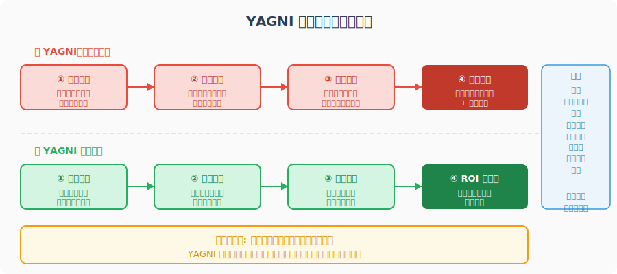


---

# コストの可視化

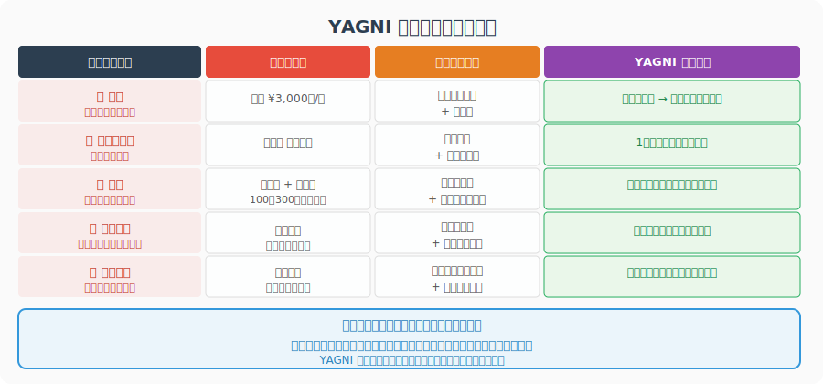


---

<!-- _class: lead -->
# 教訓: もっと早く失敗すればよかった

- <svg viewBox="0 0 800 400" xmlns="http://www.w3.org/2000/svg" style="max-height:70vh;max-width:100%;display:block;margin:0 auto;">
<rect width="800" height="400" fill="#1a1a2e"/>
<text x="400" y="35" fill="#ffffff" font-size="15" text-anchor="middle" font-family="sans-serif">教訓: Fail Fast, Fail Cheap</text>
<rect x="40" y="60" width="330" height="280" rx="10" fill="#16213e" stroke="#e91e63" stroke-width="2"/>
<text x="205" y="88" fill="#e91e63" font-size="13" text-anchor="middle" font-family="sans-serif">遅く失敗するパターン</text>
<line x1="60" y1="200" x2="110" y2="200" stroke="#e91e63" stroke-width="2.5"/>
<line x1="110" y1="200" x2="110" y2="130" stroke="#e91e63" stroke-width="2.5"/>
<line x1="110" y1="130" x2="320" y2="130" stroke="#e91e63" stroke-width="2.5"/>
<line x1="320" y1="130" x2="320" y2="280" stroke="#e91e63" stroke-width="2.5"/>
<text x="205" y="118" fill="#ffffff" font-size="11" text-anchor="middle" font-family="sans-serif">長期準備 → 大きな失敗</text>
<text x="205" y="255" fill="#aaaaaa" font-size="11" text-anchor="middle" font-family="sans-serif">コスト: 大</text>
<text x="205" y="278" fill="#aaaaaa" font-size="11" text-anchor="middle" font-family="sans-serif">フィードバックまで: 遅</text>
<rect x="430" y="60" width="330" height="280" rx="10" fill="#16213e" stroke="#4caf50" stroke-width="2"/>
<text x="595" y="88" fill="#4caf50" font-size="13" text-anchor="middle" font-family="sans-serif">早く失敗するパターン (YAGNI)</text>
<line x1="450" y1="200" x2="490" y2="200" stroke="#4caf50" stroke-width="2"/>
<line x1="490" y1="200" x2="490" y2="160" stroke="#4caf50" stroke-width="2"/>
<line x1="490" y1="160" x2="530" y2="160" stroke="#4caf50" stroke-width="2"/>
<line x1="530" y1="160" x2="530" y2="185" stroke="#4caf50" stroke-width="2"/>
<line x1="530" y1="185" x2="560" y2="185" stroke="#4caf50" stroke-width="2"/>
<line x1="560" y1="185" x2="560" y2="165" stroke="#4caf50" stroke-width="2"/>
<line x1="560" y1="165" x2="590" y2="165" stroke="#4caf50" stroke-width="2"/>
<line x1="590" y1="165" x2="590" y2="150" stroke="#4caf50" stroke-width="2"/>
<line x1="590" y1="150" x2="630" y2="150" stroke="#4caf50" stroke-width="2"/>
<line x1="630" y1="150" x2="630" y2="135" stroke="#4caf50" stroke-width="2"/>
<line x1="630" y1="135" x2="730" y2="135" stroke="#4caf50" stroke-width="2"/>
<text x="595" y="265" fill="#aaaaaa" font-size="11" text-anchor="middle" font-family="sans-serif">コスト: 小さく分散</text>
<text x="595" y="288" fill="#aaaaaa" font-size="11" text-anchor="middle" font-family="sans-serif">フィードバックまで: 速</text>
</svg>
- すべての失敗に共通すること...
- 「**やってから判断**すれば、コストが小さかった」
- YAGNI = 「必要になったら対応する」
- = 「失敗を小さく、早く経験する」
- **Fail fast, fail cheap, fail forward.**


---

<!-- _class: lead -->
# Chapter 3

- 人生への応用
- — YAGNI を生き方にする —


---

# YAGNI の適用領域マップ

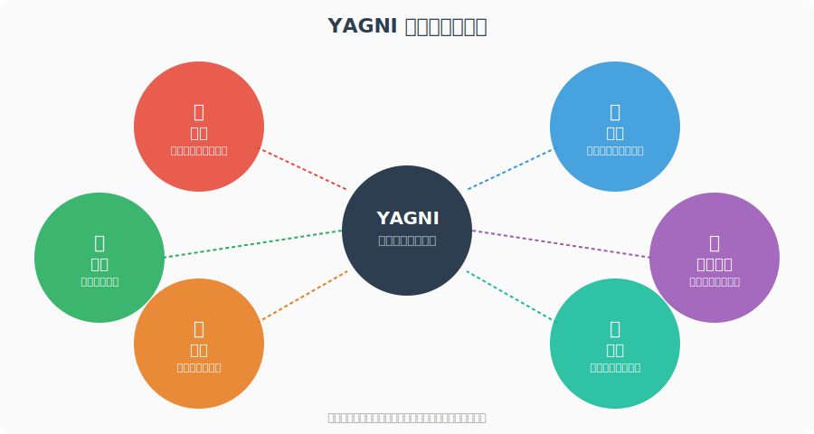


---

# モノ: ワードローブ戦略

> *80:20則—全服の20%しか着ないクローゼットにYAGNI原則を適用*

- <svg viewBox="0 0 800 400" xmlns="http://www.w3.org/2000/svg" style="max-height:70vh;max-width:100%;display:block;margin:0 auto;">
<rect width="800" height="400" fill="#1a1a2e"/>
<text x="400" y="35" fill="#ffffff" font-size="15" text-anchor="middle" font-family="sans-serif">YAGNI ワードローブ戦略 — 80:20の法則</text>
<rect x="40" y="60" width="330" height="290" rx="10" fill="#16213e" stroke="#e91e63" stroke-width="1.5"/>
<text x="205" y="88" fill="#e91e63" font-size="13" text-anchor="middle" font-family="sans-serif">YAGNI違反クローゼット</text>
<rect x="60" y="108" width="290" height="25" rx="4" fill="#e91e63" opacity="0.3"/>
<rect x="60" y="141" width="290" height="25" rx="4" fill="#e91e63" opacity="0.3"/>
<rect x="60" y="174" width="290" height="25" rx="4" fill="#e91e63" opacity="0.7"/>
<rect x="60" y="207" width="290" height="25" rx="4" fill="#e91e63" opacity="0.3"/>
<rect x="60" y="240" width="290" height="25" rx="4" fill="#e91e63"/>
<rect x="60" y="273" width="290" height="25" rx="4" fill="#e91e63" opacity="0.3"/>
<text x="205" y="325" fill="#e91e63" font-size="11" text-anchor="middle" font-family="sans-serif">「いつか着るかも」な服が80%</text>
<text x="205" y="345" fill="#aaaaaa" font-size="10" text-anchor="middle" font-family="sans-serif">実際に着るのは20%だけ</text>
<rect x="430" y="60" width="330" height="290" rx="10" fill="#16213e" stroke="#4caf50" stroke-width="2"/>
<text x="595" y="88" fill="#4caf50" font-size="13" text-anchor="middle" font-family="sans-serif">YAGNI クローゼット</text>
<rect x="450" y="108" width="290" height="25" rx="4" fill="#4caf50" opacity="0.8"/>
<rect x="450" y="141" width="290" height="25" rx="4" fill="#4caf50" opacity="0.8"/>
<rect x="450" y="174" width="290" height="25" rx="4" fill="#4caf50"/>
<rect x="450" y="207" width="290" height="25" rx="4" fill="#4caf50" opacity="0.8"/>
<text x="595" y="280" fill="#4caf50" font-size="13" text-anchor="middle" font-family="sans-serif">全て着る服だけ</text>
<text x="595" y="305" fill="#ffffff" font-size="11" text-anchor="middle" font-family="sans-serif">1着買ったら1着捨てる</text>
<text x="595" y="325" fill="#ffffff" font-size="11" text-anchor="middle" font-family="sans-serif">6ヶ月着なければ手放す</text>
</svg>
- **YAGNI 違反例**: 「いつか着るかも」な服が溢れる
- クローゼットの 20% の服を 80% の確率で着る（80:20 則）
- **YAGNI 実践**: 今の生活スタイルに必要な服だけ持つ
- 「1 着買ったら 1 着捨てる」ルール
- 着なかったら即処分する基準を持つ


---

# モノ: ガジェット購入ルール

> *3ステップフィルターで衝動購入をゼロにするYAGNI購入判断術*

- **YAGNI 違反例**: スペックへの過投資
- 「将来 4K 動画編集するかも」→ 実際はしない
- **YAGNI 実践の購入判断フロー**
- ① 今すぐ使うか？ → NO なら買わない
- ② 1ヶ月後も使っているか？ → 確認してから検討
- ③ 代替手段はないか？ → あるなら買わない


---

# モノ: 本の選び方

> *JIT読書—今困っていることに直結する本だけ買えば読了率は9割超*

- **YAGNI 違反例**: 「面白そう」で買う積読
- **YAGNI 実践**: Just-in-Time 読書
- 「今困っていること」に直接関係する本だけ買う
- 図書館・電子書籍で「試し読み」してから購入
- 読み終えたら手放す（物理的・精神的スペース確保）


---

# 時間: スケジュールのバッファ

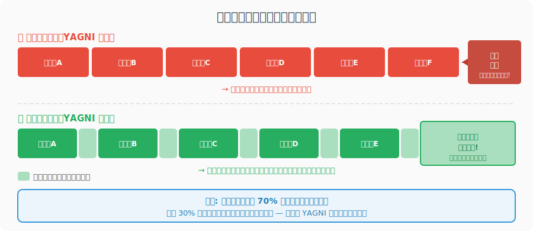


---

# 時間: やらないことリスト

> *Not Todoリスト—「しない」を決めることで集中すべき本質が見える*

- <svg viewBox="0 0 800 400" xmlns="http://www.w3.org/2000/svg" style="max-height:70vh;max-width:100%;display:block;margin:0 auto;">
<rect width="800" height="400" fill="#1a1a2e"/>
<text x="400" y="35" fill="#ffffff" font-size="15" text-anchor="middle" font-family="sans-serif">Not Todo リスト — YAGNI の時間版</text>
<rect x="40" y="60" width="330" height="290" rx="10" fill="#16213e" stroke="#e91e63" stroke-width="1.5"/>
<text x="205" y="88" fill="#e91e63" font-size="13" text-anchor="middle" font-family="sans-serif">無限増殖する Todo リスト</text>
<text x="205" y="130" fill="#ffffff" font-size="11" text-anchor="middle" font-family="sans-serif">新しい趣味を始める</text>
<text x="205" y="155" fill="#ffffff" font-size="11" text-anchor="middle" font-family="sans-serif">英語を勉強する</text>
<text x="205" y="180" fill="#ffffff" font-size="11" text-anchor="middle" font-family="sans-serif">ブログを書く</text>
<text x="205" y="205" fill="#ffffff" font-size="11" text-anchor="middle" font-family="sans-serif">OSSにコントリビュートする</text>
<text x="205" y="230" fill="#ffffff" font-size="11" text-anchor="middle" font-family="sans-serif">筋トレを始める</text>
<text x="205" y="255" fill="#ffffff" font-size="11" text-anchor="middle" font-family="sans-serif">副業を始める</text>
<text x="205" y="300" fill="#e91e63" font-size="12" text-anchor="middle" font-family="sans-serif">「いつか」が溢れて優先度崩壊</text>
<rect x="430" y="60" width="330" height="290" rx="10" fill="#16213e" stroke="#f9a825" stroke-width="2"/>
<text x="595" y="88" fill="#f9a825" font-size="13" text-anchor="middle" font-family="sans-serif">Not Todo リスト</text>
<rect x="450" y="108" width="290" height="30" rx="4" fill="#2a0a0a"/>
<text x="595" y="128" fill="#e91e63" font-size="11" text-anchor="middle" font-family="sans-serif">今年は新しい趣味を始めない</text>
<rect x="450" y="148" width="290" height="30" rx="4" fill="#2a0a0a"/>
<text x="595" y="168" fill="#e91e63" font-size="11" text-anchor="middle" font-family="sans-serif">週3回以上の会食は断る</text>
<rect x="450" y="188" width="290" height="30" rx="4" fill="#2a0a0a"/>
<text x="595" y="208" fill="#e91e63" font-size="11" text-anchor="middle" font-family="sans-serif">SNSは1日30分まで</text>
<text x="595" y="270" fill="#f9a825" font-size="13" text-anchor="middle" font-family="sans-serif">「しない」を決めることで</text>
<text x="595" y="293" fill="#f9a825" font-size="13" text-anchor="middle" font-family="sans-serif">「する」ことが明確になる</text>
<text x="595" y="330" fill="#aaaaaa" font-size="11" text-anchor="middle" font-family="sans-serif">YAGNI: 今必要なことだけに集中</text>
</svg>
- **YAGNI 違反例**: Todo リストが無限に増える
- 「いつかやる」タスクが溢れて優先度が崩壊
- **YAGNI 実践**: Not Todo リストを作る
- 「今の自分に必要ない」ことを明示的に決める
- 例: 「今年は新しい趣味を始めない」
- 例: 「週3回以上の会食は断る」


---

# 時間: 「ゆとり」の価値

> *戦略的空白—スケジュールのバッファが創造性と判断力を生み出す*

- <svg viewBox="0 0 800 400" xmlns="http://www.w3.org/2000/svg" style="max-height:70vh;max-width:100%;display:block;margin:0 auto;">
<rect width="800" height="400" fill="#1a1a2e"/>
<text x="400" y="35" fill="#ffffff" font-size="15" text-anchor="middle" font-family="sans-serif">「ゆとり」は戦略的空白 — スラックの価値</text>
<rect x="40" y="60" width="330" height="295" rx="10" fill="#16213e" stroke="#e91e63" stroke-width="1.5"/>
<text x="205" y="88" fill="#e91e63" font-size="13" text-anchor="middle" font-family="sans-serif">過密スケジュール</text>
<rect x="60" y="105" width="290" height="28" rx="4" fill="#e91e63" opacity="0.7"/>
<text x="205" y="124" fill="#ffffff" font-size="10" text-anchor="middle" font-family="sans-serif">09:00 定例会議</text>
<rect x="60" y="141" width="290" height="28" rx="4" fill="#e91e63" opacity="0.7"/>
<text x="205" y="160" fill="#ffffff" font-size="10" text-anchor="middle" font-family="sans-serif">10:00 タスクA</text>
<rect x="60" y="177" width="290" height="28" rx="4" fill="#e91e63" opacity="0.7"/>
<text x="205" y="196" fill="#ffffff" font-size="10" text-anchor="middle" font-family="sans-serif">11:00 タスクB</text>
<rect x="60" y="213" width="290" height="28" rx="4" fill="#e91e63" opacity="0.7"/>
<text x="205" y="232" fill="#ffffff" font-size="10" text-anchor="middle" font-family="sans-serif">13:00 タスクC</text>
<rect x="60" y="249" width="290" height="28" rx="4" fill="#e91e63" opacity="0.7"/>
<text x="205" y="268" fill="#ffffff" font-size="10" text-anchor="middle" font-family="sans-serif">14:00 緊急対応 ← 入れる場所なし</text>
<text x="205" y="330" fill="#e91e63" font-size="12" text-anchor="middle" font-family="sans-serif">想定外に対応できない</text>
<rect x="430" y="60" width="330" height="295" rx="10" fill="#16213e" stroke="#4caf50" stroke-width="2"/>
<text x="595" y="88" fill="#4caf50" font-size="13" text-anchor="middle" font-family="sans-serif">YAGNI スケジュール</text>
<rect x="450" y="105" width="290" height="28" rx="4" fill="#4caf50" opacity="0.5"/>
<text x="595" y="124" fill="#ffffff" font-size="10" text-anchor="middle" font-family="sans-serif">09:00 定例会議</text>
<rect x="450" y="141" width="290" height="28" rx="4" fill="#4caf50" opacity="0.5"/>
<text x="595" y="160" fill="#ffffff" font-size="10" text-anchor="middle" font-family="sans-serif">10:00 タスクA</text>
<rect x="450" y="177" width="290" height="28" rx="4" fill="#16213e" stroke="#4caf50" stroke-width="1" stroke-dasharray="4,3"/>
<text x="595" y="196" fill="#4caf50" font-size="10" text-anchor="middle" font-family="sans-serif">11:00 ゆとり (バッファ)</text>
<rect x="450" y="213" width="290" height="28" rx="4" fill="#4caf50" opacity="0.5"/>
<text x="595" y="232" fill="#ffffff" font-size="10" text-anchor="middle" font-family="sans-serif">13:00 タスクB</text>
<rect x="450" y="249" width="290" height="28" rx="4" fill="#4caf50" opacity="0.7"/>
<text x="595" y="268" fill="#ffffff" font-size="10" text-anchor="middle" font-family="sans-serif">14:00 緊急対応 ← バッファに吸収</text>
<text x="595" y="330" fill="#4caf50" font-size="12" text-anchor="middle" font-family="sans-serif">想定外もゆとりが吸収する</text>
</svg>
- スケジュールをびっちり埋めることは YAGNI 違反
- 「ゆとり」= 未来の予期しない需要に応えるバッファ
- 急な仕事・チャンス・体調不良に対応できる余白
- 認知的な余裕が創造性と判断力を生む
- **「暇」は怠惰ではなく、戦略的空白である**


---

# 学習: Just-in-Time 学習

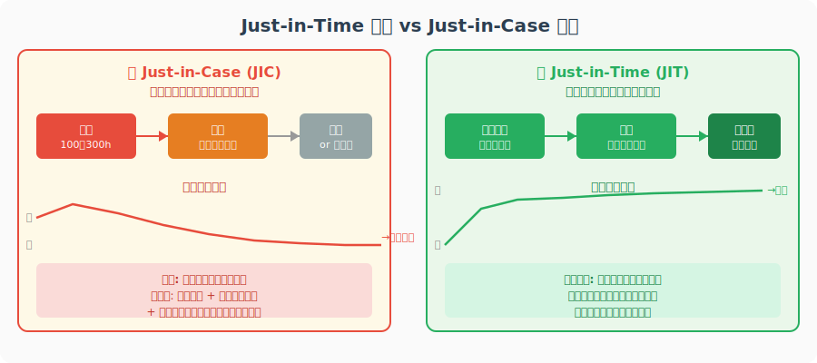


---

# 学習: 技術トレンドとの付き合い方

> *幻滅期で消えるトレンドを3基準でフィルターし本業投資を守る*

- **YAGNI 違反例**: 全トレンドをキャッチアップしようとする
- Hype Cycle の「幻滅期」で消えるものが多い
- **YAGNI 実践の判断基準**
- ① 今の仕事で使えるか？
- ② 1年後も存在しているか？
- ③ 深く学ぶ価値のある基礎技術か？
- → NO なら「見守り」でよい


---

# 学習: 深さ vs 広さ

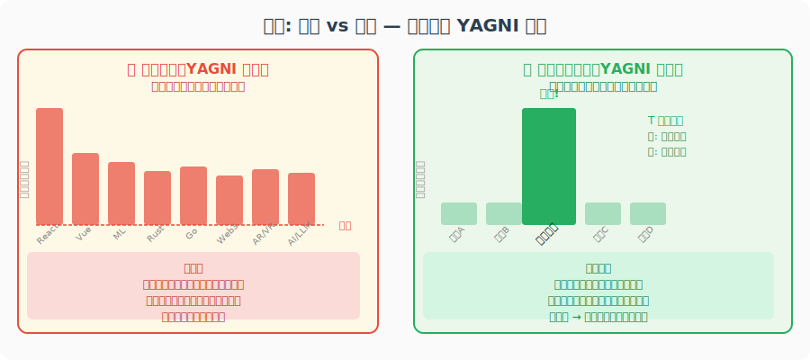


---

# キャリア: 今の仕事に集中する

> *今の仕事で圧倒的な成果を出すことで転職機会は自然に引き寄せられる*

- **YAGNI 違反例**: 常に「次のキャリア」を考えて今が疎かに
- 「転職活動しながら今の仕事もこなす」の両立失敗
- **YAGNI 実践**: 今の仕事で圧倒的な成果を出す
- 優れた成果 → 機会が自然に集まる
- 転職は「必要になったとき」に考える


---

# キャリア: 転職タイミングの判断

> *3つのシグナルだけが転職の正当理由—なんとなくは理由にならない*

- **YAGNI 的転職判断**: 「今」必要性が生じているか？
- 転職すべきシグナル（YAGNI 的）
- ① 今の環境で学べることがなくなった
- ② 明確なオファーや機会が目の前にある
- ③ 価値観・方向性の根本的なミスマッチ
- 転職しなくていいシグナル
- ④ 「なんとなく不安」「流行のスタートアップが気になる」


---

# 人間関係: 質 vs 量

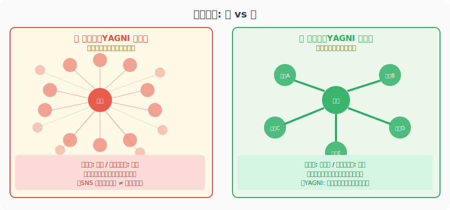


---

# 思考: 心配の空振り率

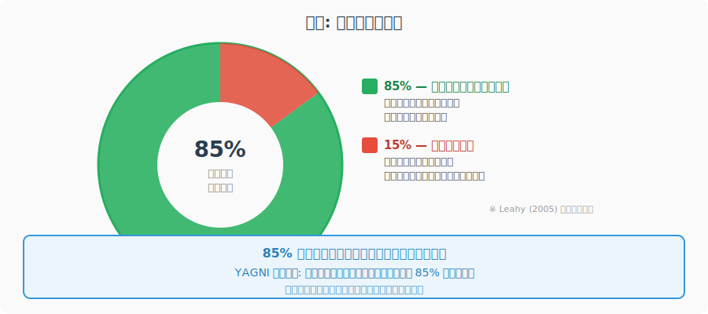


---

# 思考: 意思決定の簡素化

> *完全情報を待つな—3ルールで「十分に良い選択」を素早く下せる*

- **YAGNI 違反例**: 全ての選択肢を調べ尽くしてから決める
- 「完全な情報」を得ようとするが、それは不可能
- **YAGNI 実践の意思決定ルール**
- ① 2択で迷ったら「今の自分」にフィットする方
- ② 1週間考えても決まらないなら、どちらでもいい
- ③ 「十分に良い選択」を素早くする


---

<!-- _class: lead -->
# 「考えすぎ」をやめる

- 思考もオーバーエンジニアリングする
- 「もしこうなったら」の連鎖は止まらない
- **YAGNI の思考版**: 「今必要な思考だけ」
- 起きていないことを考えるな
- 起きたときに考えればいい


---

# お金: YAGNI 的支出判断（1/2）

> *「いつか使う」貯蓄が非YAGNI——今の基準で支出を判断する*

- <svg viewBox="0 0 800 400" xmlns="http://www.w3.org/2000/svg" style="max-height:70vh;max-width:100%;display:block;margin:0 auto;">
<rect width="800" height="400" fill="#1a1a2e"/>
<text x="400" y="35" fill="#ffffff" font-size="15" text-anchor="middle" font-family="sans-serif">YAGNI 的支出の判断基準</text>
<rect x="40" y="60" width="330" height="290" rx="10" fill="#16213e" stroke="#e91e63" stroke-width="1.5"/>
<text x="205" y="88" fill="#e91e63" font-size="13" text-anchor="middle" font-family="sans-serif">YAGNI 違反の支出パターン</text>
<text x="205" y="130" fill="#ffffff" font-size="12" text-anchor="middle" font-family="sans-serif">「将来のため」な衝動買い</text>
<text x="205" y="158" fill="#ffffff" font-size="12" text-anchor="middle" font-family="sans-serif">いつか使う日のための過剰貯蓄</text>
<text x="205" y="186" fill="#ffffff" font-size="12" text-anchor="middle" font-family="sans-serif">セール品の買いだめ</text>
<text x="205" y="240" fill="#e91e63" font-size="12" text-anchor="middle" font-family="sans-serif">「将来のため」が口実になり</text>
<text x="205" y="263" fill="#e91e63" font-size="12" text-anchor="middle" font-family="sans-serif">現在が犠牲になる</text>
<rect x="430" y="60" width="330" height="290" rx="10" fill="#16213e" stroke="#f9a825" stroke-width="2"/>
<text x="595" y="88" fill="#f9a825" font-size="13" text-anchor="middle" font-family="sans-serif">YAGNI 的判断基準</text>
<rect x="450" y="108" width="290" height="38" rx="6" fill="#1a2a1a"/>
<text x="595" y="133" fill="#4caf50" font-size="12" text-anchor="middle" font-family="sans-serif">① 今の生活の質を上げるか？</text>
<rect x="450" y="155" width="290" height="38" rx="6" fill="#1a2a1a"/>
<text x="595" y="180" fill="#4caf50" font-size="12" text-anchor="middle" font-family="sans-serif">② 1ヶ月後に後悔しないか？</text>
<rect x="450" y="202" width="290" height="38" rx="6" fill="#1a2a1a"/>
<text x="595" y="227" fill="#4caf50" font-size="12" text-anchor="middle" font-family="sans-serif">③ 「将来のため」割合が高すぎない？</text>
<rect x="450" y="268" width="290" height="60" rx="6" fill="#16213e" stroke="#f9a825" stroke-width="1"/>
<text x="595" y="292" fill="#f9a825" font-size="12" text-anchor="middle" font-family="sans-serif">今を生きるために使うお金の</text>
<text x="595" y="313" fill="#f9a825" font-size="12" text-anchor="middle" font-family="sans-serif">価値を認める</text>
</svg>
- **YAGNI 違反例**: 「いつか使う日のため」の過剰貯蓄
- または: 「将来のため」という名の衝動買い
- **YAGNI 的支出の判断基準**


---

# お金: YAGNI 的支出判断（2/2）

> *今の生活の質向上を基準に—将来のため割合が高すぎる支出を断つ*

- ① 今の生活の質を上げるか？
- ② 1ヶ月後に後悔しないか？
- ③ 「将来のため」の割合が高すぎないか？
- 今を生きるために使うお金の価値を認める


---

# ライフスタイル: ミニマリズムと YAGNI（1/2）

> *今必要なものだけ持つことがYAGNIの生活版実践*

- <svg viewBox="0 0 800 400" xmlns="http://www.w3.org/2000/svg" style="max-height:70vh;max-width:100%;display:block;margin:0 auto;">
<rect width="800" height="400" fill="#1a1a2e"/>
<text x="400" y="35" fill="#ffffff" font-size="15" text-anchor="middle" font-family="sans-serif">ミニマリズム = YAGNI のライフスタイル版</text>
<rect x="40" y="65" width="215" height="290" rx="10" fill="#16213e" stroke="#f9a825" stroke-width="1.5"/>
<text x="147" y="93" fill="#f9a825" font-size="13" text-anchor="middle" font-family="sans-serif">YAGNI 原則</text>
<text x="147" y="130" fill="#ffffff" font-size="12" text-anchor="middle" font-family="sans-serif">今必要なものだけ</text>
<text x="147" y="155" fill="#ffffff" font-size="12" text-anchor="middle" font-family="sans-serif">持つ・作る</text>
<text x="147" y="200" fill="#aaaaaa" font-size="11" text-anchor="middle" font-family="sans-serif">必要になったとき</text>
<text x="147" y="220" fill="#aaaaaa" font-size="11" text-anchor="middle" font-family="sans-serif">対応する</text>
<polygon points="263,205 290,205 290,195 320,210 290,225 290,215 263,215" fill="#f9a825"/>
<rect x="328" y="65" width="144" height="290" rx="10" fill="#16213e" stroke="#e91e63" stroke-width="1.5"/>
<text x="400" y="93" fill="#e91e63" font-size="13" text-anchor="middle" font-family="sans-serif">メリット</text>
<text x="400" y="130" fill="#ffffff" font-size="11" text-anchor="middle" font-family="sans-serif">探す時間ゼロ</text>
<text x="400" y="155" fill="#ffffff" font-size="11" text-anchor="middle" font-family="sans-serif">選択疲れゼロ</text>
<text x="400" y="180" fill="#ffffff" font-size="11" text-anchor="middle" font-family="sans-serif">移動楽</text>
<text x="400" y="220" fill="#aaaaaa" font-size="10" text-anchor="middle" font-family="sans-serif">検索コスト↓</text>
<text x="400" y="243" fill="#aaaaaa" font-size="10" text-anchor="middle" font-family="sans-serif">認知コスト↓</text>
<text x="400" y="266" fill="#aaaaaa" font-size="10" text-anchor="middle" font-family="sans-serif">変更コスト↓</text>
<polygon points="479,205 506,205 506,195 536,210 506,225 506,215 479,215" fill="#e91e63"/>
<rect x="544" y="65" width="216" height="290" rx="10" fill="#16213e" stroke="#4caf50" stroke-width="2"/>
<text x="652" y="93" fill="#4caf50" font-size="13" text-anchor="middle" font-family="sans-serif">ミニマリズム</text>
<text x="652" y="130" fill="#ffffff" font-size="12" text-anchor="middle" font-family="sans-serif">所有物を最小化</text>
<text x="652" y="155" fill="#ffffff" font-size="12" text-anchor="middle" font-family="sans-serif">空間の確保</text>
<text x="652" y="200" fill="#aaaaaa" font-size="11" text-anchor="middle" font-family="sans-serif">集中力の向上</text>
<text x="652" y="223" fill="#aaaaaa" font-size="11" text-anchor="middle" font-family="sans-serif">本当に大切なものへ</text>
<text x="652" y="260" fill="#4caf50" font-size="11" text-anchor="middle" font-family="sans-serif">エンジニアなら</text>
<text x="652" y="280" fill="#4caf50" font-size="11" text-anchor="middle" font-family="sans-serif">直感的に理解できる</text>
<text x="652" y="300" fill="#4caf50" font-size="11" text-anchor="middle" font-family="sans-serif">思想</text>
</svg>
- ミニマリズム = 「今必要なものだけ持つ」
- これは YAGNI そのもの
- モノを減らすメリット


---

# ライフスタイル: ミニマリズムと YAGNI（2/2）

> *検索・選択・移動コストを三重に削減するミニマリストの合理性*

- ① 探す時間ゼロ（検索コスト削減）
- ② 選択疲れゼロ（認知コスト削減）
- ③ 引越し・移動が楽（変更コスト削減）
- エンジニアなら直感的に理解できる思想


---

# YAGNI 的ライフデザイン

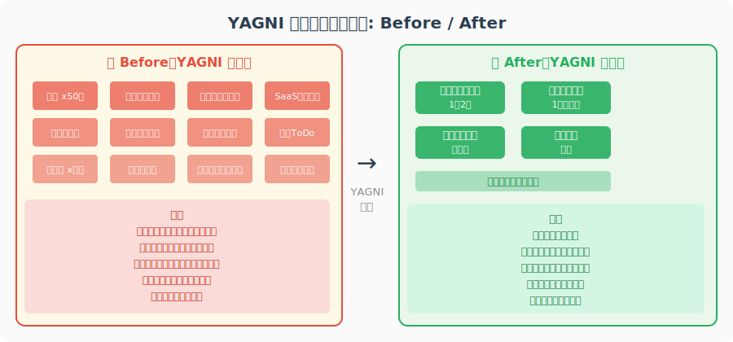


---

# 人生のリファクタリング

> *不要な習慣・役割・依存を削除し続けることが人生の変更耐性を高める*

- <svg viewBox="0 0 800 400" xmlns="http://www.w3.org/2000/svg" style="max-height:70vh;max-width:100%;display:block;margin:0 auto;">
<rect width="800" height="400" fill="#1a1a2e"/>
<text x="400" y="35" fill="#ffffff" font-size="15" text-anchor="middle" font-family="sans-serif">人生のリファクタリング — コード設計思想を転用</text>
<rect x="40" y="60" width="330" height="295" rx="10" fill="#16213e" stroke="#e91e63" stroke-width="1.5"/>
<text x="205" y="88" fill="#e91e63" font-size="13" text-anchor="middle" font-family="sans-serif">リファクタリング前</text>
<text x="205" y="130" fill="#ffffff" font-size="12" text-anchor="middle" font-family="sans-serif">使わない習慣 (コード)</text>
<text x="205" y="155" fill="#ffffff" font-size="12" text-anchor="middle" font-family="sans-serif">役割の過密 (巨大関数)</text>
<text x="205" y="180" fill="#ffffff" font-size="12" text-anchor="middle" font-family="sans-serif">強すぎる依存関係</text>
<text x="205" y="205" fill="#ffffff" font-size="12" text-anchor="middle" font-family="sans-serif">重複するタスク</text>
<text x="205" y="250" fill="#e91e63" font-size="12" text-anchor="middle" font-family="sans-serif">複雑な人生 = 低速なシステム</text>
<text x="205" y="275" fill="#aaaaaa" font-size="11" text-anchor="middle" font-family="sans-serif">変更コストが高い</text>
<rect x="430" y="60" width="330" height="295" rx="10" fill="#16213e" stroke="#4caf50" stroke-width="2"/>
<text x="595" y="88" fill="#4caf50" font-size="13" text-anchor="middle" font-family="sans-serif">リファクタリング後 (YAGNI)</text>
<text x="595" y="130" fill="#4caf50" font-size="12" text-anchor="middle" font-family="sans-serif">不要な習慣を削除</text>
<text x="595" y="155" fill="#4caf50" font-size="12" text-anchor="middle" font-family="sans-serif">役割を分解・集中</text>
<text x="595" y="180" fill="#4caf50" font-size="12" text-anchor="middle" font-family="sans-serif">依存を疎結合に</text>
<text x="595" y="205" fill="#4caf50" font-size="12" text-anchor="middle" font-family="sans-serif">本質だけを残す</text>
<text x="595" y="250" fill="#4caf50" font-size="12" text-anchor="middle" font-family="sans-serif">シンプルな人生 = 高速なシステム</text>
<text x="595" y="275" fill="#aaaaaa" font-size="11" text-anchor="middle" font-family="sans-serif">変更コストが低い → 適応しやすい</text>
</svg>
- コードをリファクタリングするように、人生を整理する
- 「使っていないモジュール（習慣・モノ・関係）」を削除
- 「複雑になりすぎた関数（役割・義務）」を分解
- 「依存関係が強すぎる部分」を疎結合にする
- リファクタリングは一度ではなく、継続的に行う


---

# 定期的なレビューのすすめ

> *月次30分・年次半日のレビューで人生を定期的にリファクタリングする*

- <svg viewBox="0 0 800 400" xmlns="http://www.w3.org/2000/svg" style="max-height:70vh;max-width:100%;display:block;margin:0 auto;">
<rect width="800" height="400" fill="#1a1a2e"/>
<text x="400" y="35" fill="#ffffff" font-size="15" text-anchor="middle" font-family="sans-serif">定期的なレビュー — 削ぎ落とすサイクル</text>
<rect x="40" y="60" width="720" height="75" rx="10" fill="#16213e" stroke="#f9a825" stroke-width="1.5"/>
<text x="400" y="90" fill="#f9a825" font-size="13" text-anchor="middle" font-family="sans-serif">コードレビューと同じように、人生もレビューする</text>
<text x="400" y="118" fill="#aaaaaa" font-size="12" text-anchor="middle" font-family="sans-serif">「積み上げる」よりも「削ぎ落とす」レビューを</text>
<rect x="40" y="155" width="340" height="200" rx="10" fill="#16213e" stroke="#aaaaaa" stroke-width="1"/>
<text x="210" y="183" fill="#aaaaaa" font-size="13" text-anchor="middle" font-family="sans-serif">月次レビュー</text>
<text x="210" y="218" fill="#ffffff" font-size="12" text-anchor="middle" font-family="sans-serif">今月使ったものを振り返る</text>
<text x="210" y="245" fill="#ffffff" font-size="12" text-anchor="middle" font-family="sans-serif">使わなかったものを記録</text>
<text x="210" y="280" fill="#f9a825" font-size="12" text-anchor="middle" font-family="sans-serif">「まだ必要か？」を問う</text>
<text x="210" y="330" fill="#aaaaaa" font-size="10" text-anchor="middle" font-family="sans-serif">毎月末 30分</text>
<rect x="420" y="155" width="340" height="200" rx="10" fill="#16213e" stroke="#f9a825" stroke-width="1.5"/>
<text x="590" y="183" fill="#f9a825" font-size="13" text-anchor="middle" font-family="sans-serif">年次レビュー</text>
<text x="590" y="218" fill="#ffffff" font-size="12" text-anchor="middle" font-family="sans-serif">全てのものに「まだ必要か？」</text>
<text x="590" y="245" fill="#ffffff" font-size="12" text-anchor="middle" font-family="sans-serif">使わなかったものを手放す</text>
<text x="590" y="280" fill="#f9a825" font-size="12" text-anchor="middle" font-family="sans-serif">今の自分に最適化する</text>
<text x="590" y="330" fill="#aaaaaa" font-size="10" text-anchor="middle" font-family="sans-serif">年初/年末 半日</text>
</svg>
- コードレビューと同じように、人生もレビューする
- **月次レビュー**: 今月使ったもの・やったことを振り返る
- **年次レビュー**: 「まだ必要か？」を全てのものに問う
- 「積み上げる」よりも「削ぎ落とす」レビューを
- 今の自分に必要なものだけを残す


---

<!-- _class: lead -->
# Chapter 4

- 実践編
- — 今日から YAGNI を生きる —


---

# 原則1: 今必要なことだけやる

> *毎朝3タスクに絞り今日の問題を今日解くことが最高の未来投資*

- <svg viewBox="0 0 800 400" xmlns="http://www.w3.org/2000/svg" style="max-height:70vh;max-width:100%;display:block;margin:0 auto;">
<rect width="800" height="400" fill="#1a1a2e"/>
<text x="400" y="35" fill="#ffffff" font-size="15" text-anchor="middle" font-family="sans-serif">原則1: 「今」にフォーカスする</text>
<rect x="40" y="60" width="720" height="70" rx="10" fill="#16213e" stroke="#f9a825" stroke-width="2"/>
<text x="400" y="92" fill="#f9a825" font-size="16" text-anchor="middle" font-weight="bold" font-family="sans-serif">今日必要なことリストを毎朝作る</text>
<text x="400" y="118" fill="#aaaaaa" font-size="12" text-anchor="middle" font-family="sans-serif">リストにないことは原則やらない。「将来役に立つかも」は理由にならない</text>
<rect x="40" y="155" width="330" height="205" rx="10" fill="#16213e" stroke="#e91e63" stroke-width="1.5"/>
<text x="205" y="183" fill="#e91e63" font-size="13" text-anchor="middle" font-family="sans-serif">やってはいけないこと</text>
<text x="205" y="220" fill="#ffffff" font-size="12" text-anchor="middle" font-family="sans-serif">「いつかやる」タスクを追加</text>
<text x="205" y="248" fill="#ffffff" font-size="12" text-anchor="middle" font-family="sans-serif">今日のリストを膨らませる</text>
<text x="205" y="276" fill="#ffffff" font-size="12" text-anchor="middle" font-family="sans-serif">完了できなかった昨日のタスクを</text>
<text x="205" y="296" fill="#ffffff" font-size="12" text-anchor="middle" font-family="sans-serif">そのまま今日に持ち越す</text>
<text x="205" y="340" fill="#e91e63" font-size="11" text-anchor="middle" font-family="sans-serif">→ リストが成長し続ける</text>
<rect x="430" y="155" width="330" height="205" rx="10" fill="#16213e" stroke="#4caf50" stroke-width="1.5"/>
<text x="595" y="183" fill="#4caf50" font-size="13" text-anchor="middle" font-family="sans-serif">やるべきこと</text>
<text x="595" y="220" fill="#ffffff" font-size="12" text-anchor="middle" font-family="sans-serif">今日の最重要タスク 3つ</text>
<text x="595" y="248" fill="#ffffff" font-size="12" text-anchor="middle" font-family="sans-serif">完了したら今日は終了</text>
<text x="595" y="276" fill="#ffffff" font-size="12" text-anchor="middle" font-family="sans-serif">残ったタスクは翌日判断</text>
<text x="595" y="296" fill="#ffffff" font-size="12" text-anchor="middle" font-family="sans-serif">必要なら追加、不要なら削除</text>
<text x="595" y="340" fill="#4caf50" font-size="11" text-anchor="middle" font-family="sans-serif">→ 今日の問題を今日解く</text>
</svg>
- **「今」にフォーカスする**
- 今日必要なことリストを毎朝作る
- リストにないことは原則やらない
- 「将来役に立つかも」は理由にならない
- 今日の問題を今日解く — それだけでいい


---

# 原則2: 捨てる勇気を持つ

> *削除は退行でなく前進—使っていないものを手放すことで本質が見える*

- **「削除」は後退ではなく、前進である**
- 使っていないコードを消すように、使っていないものを手放す
- 「いつか使うかも」は「使わない」の言い訳
- 捨てることで「今必要なもの」が見えてくる
- Git は履歴を残す — でも人生に git blame は不要


---

# 原則3: 短いフィードバックループ


---

# ツール: 1ヶ月ルール

> *1ヶ月ルールで欲しいの70%が消える—これが最強のYAGNIフィルター*

- **モノの購入・学習の開始 → 1ヶ月待つ**
- 「欲しい！」「やりたい！」と思ったら、メモして 1ヶ月待つ
- 1ヶ月後にまだ必要なら、それは本当に必要なもの
- 大半の「欲しい」は 1ヶ月後に消える
- **これが最強の YAGNI フィルター**


---

# 落とし穴: YAGNI は怠惰ではない

> *YAGNIは省エネではなく集中—今の役割を完璧に果たすことが本義*

- <svg viewBox="0 0 800 400" xmlns="http://www.w3.org/2000/svg" style="max-height:70vh;max-width:100%;display:block;margin:0 auto;">
<rect width="800" height="400" fill="#1a1a2e"/>
<text x="400" y="35" fill="#ffffff" font-size="15" text-anchor="middle" font-family="sans-serif">1ヶ月ルール — 最強の YAGNI フィルター</text>
<rect x="40" y="60" width="720" height="70" rx="10" fill="#16213e" stroke="#f9a825" stroke-width="2"/>
<text x="400" y="90" fill="#f9a825" font-size="14" text-anchor="middle" font-family="sans-serif">「欲しい！」「やりたい！」 → メモして1ヶ月待つ</text>
<text x="400" y="118" fill="#aaaaaa" font-size="12" text-anchor="middle" font-family="sans-serif">1ヶ月後にまだ必要なら、それは本当に必要なもの</text>
<rect x="40" y="155" width="340" height="215" rx="10" fill="#16213e" stroke="#e91e63" stroke-width="1.5"/>
<text x="210" y="183" fill="#e91e63" font-size="13" text-anchor="middle" font-family="sans-serif">1ヶ月後に消えるもの</text>
<text x="210" y="225" fill="#ffffff" font-size="12" text-anchor="middle" font-family="sans-serif">衝動買い的な購入欲求</text>
<text x="210" y="253" fill="#ffffff" font-size="12" text-anchor="middle" font-family="sans-serif">流行に乗ったスキル習得</text>
<text x="210" y="281" fill="#ffffff" font-size="12" text-anchor="middle" font-family="sans-serif">感情的な意思決定</text>
<text x="210" y="330" fill="#e91e63" font-size="12" text-anchor="middle" font-family="sans-serif">多くの「欲しい」が消える</text>
<text x="210" y="353" fill="#aaaaaa" font-size="10" text-anchor="middle" font-family="sans-serif">約 70% は 1ヶ月後に消えると言われる</text>
<rect x="420" y="155" width="340" height="215" rx="10" fill="#16213e" stroke="#4caf50" stroke-width="2"/>
<text x="590" y="183" fill="#4caf50" font-size="13" text-anchor="middle" font-family="sans-serif">1ヶ月後も残るもの</text>
<text x="590" y="225" fill="#ffffff" font-size="12" text-anchor="middle" font-family="sans-serif">本当に必要な購入</text>
<text x="590" y="253" fill="#ffffff" font-size="12" text-anchor="middle" font-family="sans-serif">継続的に必要なスキル</text>
<text x="590" y="281" fill="#ffffff" font-size="12" text-anchor="middle" font-family="sans-serif">長期的に価値ある投資</text>
<text x="590" y="330" fill="#4caf50" font-size="12" text-anchor="middle" font-family="sans-serif">これだけ実行すればいい</text>
<text x="590" y="353" fill="#aaaaaa" font-size="10" text-anchor="middle" font-family="sans-serif">残った30%は本物の需要</text>
</svg>
- 「今必要なことだけ」 ≠ 「楽をする」
- 今必要なことを **完璧に** やることが YAGNI
- XP での YAGNI: 「今のストーリーを完璧に実装する」
- 人生での YAGNI: 「今の役割を完璧に果たす」
- **YAGNI は集中の原則であり、省エネの原則ではない**


---

# 落とし穴: 必要なものまで削らない

> *健康・睡眠・基礎学習は削れない—YAGNIは推測投資に適用する原則*

- YAGNI の誤用: 「健康管理」「人間関係」を削る
- 基盤となるもの（健康・睡眠・基礎学習）は削ってはいけない
- 判断基準: 「今必要か」ではなく「将来も必要か」
- YAGNI の適用範囲は「推測による先行投資」であり、
- 「確実に必要な基盤」ではない


---

<!-- _class: lead -->
# Chapter 5

- まとめ
- — YAGNI is a Lifestyle —


---

# YAGNI と東洋哲学

> *YAGNIは禅・老子と同根—エンジニアは古来の知恵を既に手にしている*

- <svg viewBox="0 0 800 400" xmlns="http://www.w3.org/2000/svg" style="max-height:70vh;max-width:100%;display:block;margin:0 auto;">
<rect width="800" height="400" fill="#1a1a2e"/>
<text x="400" y="35" fill="#ffffff" font-size="15" text-anchor="middle" font-family="sans-serif">YAGNI と東洋哲学 — 普遍的な知恵</text>
<rect x="40" y="60" width="215" height="280" rx="10" fill="#16213e" stroke="#f9a825" stroke-width="1.5"/>
<text x="147" y="88" fill="#f9a825" font-size="13" text-anchor="middle" font-family="sans-serif">禅</text>
<text x="147" y="128" fill="#ffffff" font-size="12" text-anchor="middle" font-family="sans-serif">今ここに集中する</text>
<text x="147" y="153" fill="#ffffff" font-size="12" text-anchor="middle" font-family="sans-serif">余分なものを排する</text>
<text x="147" y="193" fill="#aaaaaa" font-size="11" text-anchor="middle" font-family="sans-serif">「今この瞬間」に</text>
<text x="147" y="213" fill="#aaaaaa" font-size="11" text-anchor="middle" font-family="sans-serif">全力を注ぐ</text>
<rect x="295" y="60" width="215" height="280" rx="10" fill="#16213e" stroke="#e91e63" stroke-width="1.5"/>
<text x="402" y="88" fill="#e91e63" font-size="13" text-anchor="middle" font-family="sans-serif">老子 / 無為自然</text>
<text x="402" y="128" fill="#ffffff" font-size="12" text-anchor="middle" font-family="sans-serif">為さずして為す</text>
<text x="402" y="153" fill="#ffffff" font-size="12" text-anchor="middle" font-family="sans-serif">余計なことをしない</text>
<text x="402" y="193" fill="#aaaaaa" font-size="11" text-anchor="middle" font-family="sans-serif">自然の流れに従う</text>
<text x="402" y="213" fill="#aaaaaa" font-size="11" text-anchor="middle" font-family="sans-serif">過剰な介入を避ける</text>
<rect x="550" y="60" width="215" height="280" rx="10" fill="#16213e" stroke="#4fc3f7" stroke-width="1.5"/>
<text x="657" y="88" fill="#4fc3f7" font-size="13" text-anchor="middle" font-family="sans-serif">YAGNI</text>
<text x="657" y="128" fill="#ffffff" font-size="12" text-anchor="middle" font-family="sans-serif">今必要なことだけ</text>
<text x="657" y="153" fill="#ffffff" font-size="12" text-anchor="middle" font-family="sans-serif">余計な実装をしない</text>
<text x="657" y="193" fill="#aaaaaa" font-size="11" text-anchor="middle" font-family="sans-serif">必要になったとき</text>
<text x="657" y="213" fill="#aaaaaa" font-size="11" text-anchor="middle" font-family="sans-serif">対応する</text>
<rect x="80" y="368" width="640" height="25" rx="6" fill="#16213e" stroke="#f9a825" stroke-width="1"/>
<text x="400" y="385" fill="#f9a825" font-size="11" text-anchor="middle" font-family="sans-serif">エンジニアとして YAGNI を学んだ私たちは、古来の知恵を手に入れていた</text>
</svg>
- **禅**: 「今ここに集中する」
- 余分なものを排して、今この瞬間に全力を注ぐ
- **老子 / 無為自然**: 「為さずして為す」
- 余計なことをしないことで、自然の流れに従う
- **YAGNI は西洋工学の原則であり、東洋哲学でもある**
- エンジニアとして YAGNI を学んだ私たちは、古来の知恵を手に入れていた


---

# エンジニアの強み: 設計思考の転用


---

# 今日から始める3つのこと

> *1ヶ月ルール・今日リスト・何か一つ捨てる—今日から始める3ステップ*

- <svg viewBox="0 0 800 400" xmlns="http://www.w3.org/2000/svg" style="max-height:70vh;max-width:100%;display:block;margin:0 auto;">
<rect width="800" height="400" fill="#1a1a2e"/>
<text x="400" y="35" fill="#ffffff" font-size="15" text-anchor="middle" font-family="sans-serif">今日から始める3つのこと</text>
<rect x="40" y="60" width="720" height="95" rx="10" fill="#16213e" stroke="#f9a825" stroke-width="2"/>
<text x="400" y="88" fill="#f9a825" font-size="14" text-anchor="middle" font-family="sans-serif">① 1ヶ月ルールを始める</text>
<text x="400" y="115" fill="#ffffff" font-size="12" text-anchor="middle" font-family="sans-serif">欲しいもの・やりたいことをメモして 1ヶ月待つ</text>
<text x="400" y="138" fill="#aaaaaa" font-size="11" text-anchor="middle" font-family="sans-serif">実装コスト: メモアプリに1行書くだけ</text>
<rect x="40" y="175" width="720" height="95" rx="10" fill="#16213e" stroke="#f9a825" stroke-width="1.5"/>
<text x="400" y="203" fill="#f9a825" font-size="14" text-anchor="middle" font-family="sans-serif">② 「今日やること」だけのリストを作る</text>
<text x="400" y="230" fill="#ffffff" font-size="12" text-anchor="middle" font-family="sans-serif">「いつかやる」は今日のリストから外す</text>
<text x="400" y="253" fill="#aaaaaa" font-size="11" text-anchor="middle" font-family="sans-serif">実装コスト: 毎朝5分のリスト作成</text>
<rect x="40" y="290" width="720" height="95" rx="10" fill="#16213e" stroke="#e91e63" stroke-width="2"/>
<text x="400" y="318" fill="#e91e63" font-size="14" text-anchor="middle" font-family="sans-serif">③ 何か一つ今日捨てる</text>
<text x="400" y="345" fill="#ffffff" font-size="12" text-anchor="middle" font-family="sans-serif">使っていないアプリ・モノ・予定を今日削除する</text>
<text x="400" y="368" fill="#aaaaaa" font-size="11" text-anchor="middle" font-family="sans-serif">実装コスト: 5分で1つ手放すだけ</text>
</svg>
- **① 1ヶ月ルールを始める**
- 欲しいもの・やりたいことをメモして 1ヶ月待つ
- **② 「今日やること」だけのリストを作る**
- 「いつかやる」は今日のリストから外す
- **③ 何か一つ捨てる**
- 使っていないアプリ・モノ・予定を今日削除する


---

<!-- _class: lead -->
# YAGNI is a Lifestyle

- You Ain't Gonna Need It
- それ、必要にならないから。
- **今を生きよう。**


---

# 参考文献・リソース

> *YAGNIとミニマリズムの二大思想を1デッキで学べる厳選文献リスト*

- **YAGNI・XP 関連**
- [Martin Fowler — Yagni](https://martinfowler.com/bliki/Yagni.html)
- [Extreme Programming Explained — Kent Beck](https://www.informit.com/store/extreme-programming-explained-embrace-change-9780321278654)
- **ミニマリズム・思想**
- [The Life-Changing Magic of Tidying Up — Marie Kondo](https://konmari.com/)
- [エッセンシャル思考 — Greg McKeown](https://gregmckeown.com/books/essentialism/)


---

<!-- _class: lead -->
# おわりに

- ご清聴ありがとうございました
- 「今必要なことだけ」を伝えようとしたら 60 枚になりました
- YAGNI 違反かもしれません 😅
- 質問・ご意見はお気軽にどうぞ

