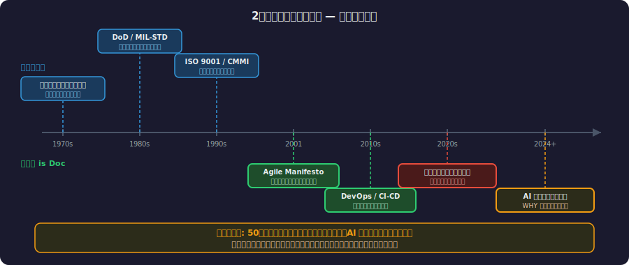
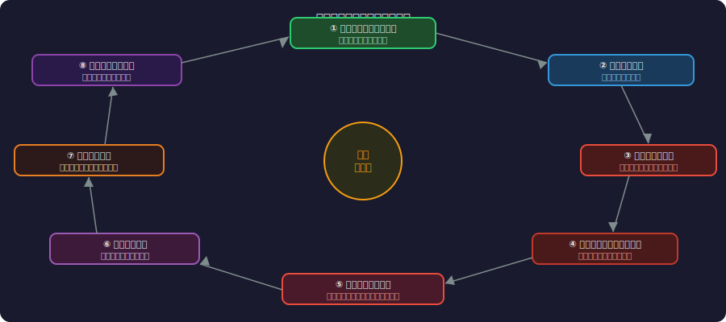
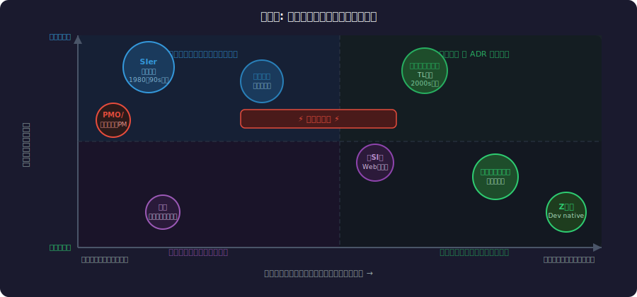
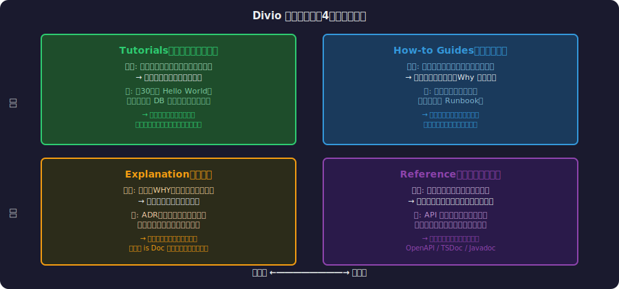
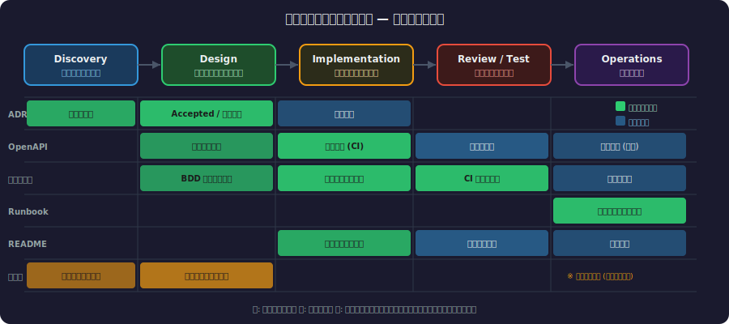
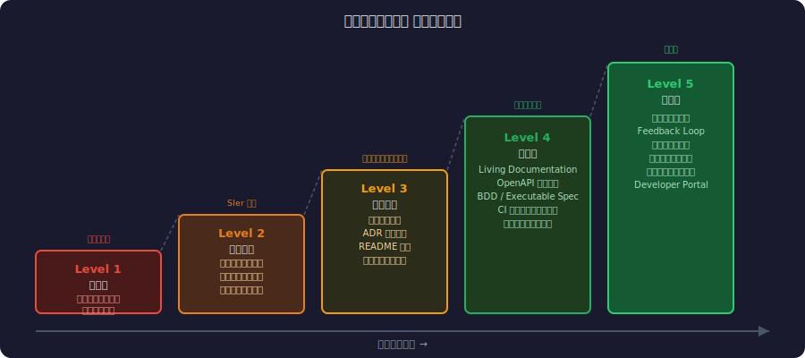

<!-- _class: lead -->
# 「仕様書文化」vs「コード is ドキュメント」

- ― 世代間・文化間の衝突を超えて ―
- 
- テックリード・エンジニアリングマネージャー向け
- 2026年


---

# アジェンダ

- **Part 1** 両文化の誕生 — 定義と歴史的背景
- **Part 2** 仕様書文化の光と影
- **Part 3** コード is ドキュメント文化の光と影
- **Part 4** 世代間・文化間の衝突を解剖する
- **Part 5** 対立を超えて — 統合的アプローチ
- **Part 6** テックリード・EM のための実践ガイド


---

<!-- _class: lead -->
# Part 1: 両文化の誕生

- 定義と歴史的背景


---

# 「仕様書文化」の世界観（1/2）

- <svg viewBox="0 0 800 400" style="max-height:70vh;max-width:100%;display:block;margin:0 auto;" xmlns="http://www.w3.org/2000/svg">
<rect x="0" y="0" width="800" height="400" fill="#1a1a2e" rx="0"/>
<rect x="30" y="30" width="350" height="340" fill="#16213e" rx="8"/>
<rect x="420" y="30" width="350" height="340" fill="#16213e" rx="8"/>
<text x="205" y="70" font-size="20" fill="#f9a825" text-anchor="middle" font-weight="bold" font-family="sans-serif">仕様書文化</text>
<text x="595" y="70" font-size="17" fill="#e91e63" text-anchor="middle" font-weight="bold" font-family="sans-serif">コード is ドキュメント</text>
<text x="205" y="105" font-size="13" fill="#ffffff" text-anchor="middle" font-weight="normal" font-family="sans-serif">・合意の証跡を重視</text>
<text x="205" y="130" font-size="13" fill="#ffffff" text-anchor="middle" font-weight="normal" font-family="sans-serif">・先行設計が前提</text>
<text x="205" y="155" font-size="13" fill="#ffffff" text-anchor="middle" font-weight="normal" font-family="sans-serif">・責任の明確化</text>
<text x="205" y="185" font-size="13" fill="#f9a825" text-anchor="middle" font-weight="normal" font-family="sans-serif">成果物:</text>
<text x="205" y="210" font-size="12" fill="#ffffff" text-anchor="middle" font-weight="normal" font-family="sans-serif">要件定義書・設計書</text>
<text x="205" y="230" font-size="12" fill="#ffffff" text-anchor="middle" font-weight="normal" font-family="sans-serif">ER図・シーケンス図</text>
<text x="595" y="105" font-size="13" fill="#ffffff" text-anchor="middle" font-weight="normal" font-family="sans-serif">・コードが唯一の真実</text>
<text x="595" y="130" font-size="13" fill="#ffffff" text-anchor="middle" font-weight="normal" font-family="sans-serif">・自己文書化コード</text>
<text x="595" y="155" font-size="13" fill="#ffffff" text-anchor="middle" font-weight="normal" font-family="sans-serif">・ドキュメントは負債</text>
<text x="595" y="185" font-size="13" fill="#e91e63" text-anchor="middle" font-weight="normal" font-family="sans-serif">成果物:</text>
<text x="595" y="210" font-size="12" fill="#ffffff" text-anchor="middle" font-weight="normal" font-family="sans-serif">README・型・テスト</text>
<text x="595" y="230" font-size="12" fill="#ffffff" text-anchor="middle" font-weight="normal" font-family="sans-serif">コードレビュー</text>
<rect x="330" y="30" width="140" height="340" fill="#0f3460" rx="8"/>
<text x="400" y="160" font-size="36" fill="#ffffff" text-anchor="middle" font-weight="bold" font-family="sans-serif">VS</text>
<text x="400" y="200" font-size="13" fill="#aaa" text-anchor="middle" font-weight="normal" font-family="sans-serif">衝突の</text>
<text x="400" y="220" font-size="13" fill="#aaa" text-anchor="middle" font-weight="normal" font-family="sans-serif">本質</text>
<text x="205" y="310" font-size="12" fill="#aaa" text-anchor="middle" font-weight="normal" font-family="sans-serif">SIer・官公庁・金融</text>
<text x="205" y="330" font-size="12" fill="#aaa" text-anchor="middle" font-weight="normal" font-family="sans-serif">大規模・長期プロジェクト</text>
<text x="595" y="310" font-size="12" fill="#aaa" text-anchor="middle" font-weight="normal" font-family="sans-serif">スタートアップ・OSS</text>
<text x="595" y="330" font-size="12" fill="#aaa" text-anchor="middle" font-weight="normal" font-family="sans-serif">小規模・短サイクル</text>
</svg>
- **定義**: コードを書く前に要件・設計を文書化し、それを正として開発を進める文化
- 
- **中心にある価値観:**
- - 合意の証跡: 「書いてあること」が真実
- - 先行設計: 動く前にすべてを決める


---

# 「仕様書文化」の世界観（2/2）

- <svg viewBox="0 0 800 380" style="max-height:70vh;max-width:100%;display:block;margin:0 auto;" xmlns="http://www.w3.org/2000/svg">
<rect x="0" y="0" width="800" height="380" fill="#1a1a2e" rx="0"/>
<text x="400" y="26" font-size="15" fill="#ffffff" text-anchor="middle" font-weight="bold" font-family="sans-serif">2つの文化が生まれた歴史的背景</text>
<rect x="40" y="50" width="340" height="270" fill="#16213e" rx="8"/>
<text x="210" y="78" font-size="15" fill="#f9a825" text-anchor="middle" font-weight="bold" font-family="sans-serif">仕様書文化の源泉</text>
<text x="210" y="105" font-size="12" fill="#ffffff" text-anchor="middle" font-weight="normal" font-family="sans-serif">1960-80年代: ウォーターフォール</text>
<text x="210" y="128" font-size="12" fill="#aaa" text-anchor="middle" font-weight="normal" font-family="sans-serif">IBMメインフレーム時代の規律</text>
<text x="210" y="152" font-size="12" fill="#ffffff" text-anchor="middle" font-weight="normal" font-family="sans-serif">大型SI案件・官公庁案件</text>
<text x="210" y="175" font-size="13" fill="#f9a825" text-anchor="middle" font-weight="normal" font-family="sans-serif">→ 合意の証跡が最重要</text>
<text x="210" y="205" font-size="12" fill="#aaa" text-anchor="middle" font-weight="normal" font-family="sans-serif">1990年代: RFP・要件定義が標準</text>
<text x="210" y="228" font-size="12" fill="#aaa" text-anchor="middle" font-weight="normal" font-family="sans-serif">日本SI産業の成長期</text>
<rect x="420" y="50" width="340" height="270" fill="#0f3460" rx="8"/>
<text x="590" y="78" font-size="14" fill="#e91e63" text-anchor="middle" font-weight="bold" font-family="sans-serif">コード is ドキュメントの源泉</text>
<text x="590" y="105" font-size="12" fill="#ffffff" text-anchor="middle" font-weight="normal" font-family="sans-serif">2000年代: アジャイル宣言 (2001)</text>
<text x="590" y="128" font-size="12" fill="#aaa" text-anchor="middle" font-weight="normal" font-family="sans-serif">XP・Scrum の普及</text>
<text x="590" y="152" font-size="12" fill="#ffffff" text-anchor="middle" font-weight="normal" font-family="sans-serif">GitHub の台頭 (2008)</text>
<text x="590" y="175" font-size="13" fill="#e91e63" text-anchor="middle" font-weight="normal" font-family="sans-serif">→ 動くソフトが最重要</text>
<text x="590" y="205" font-size="12" fill="#aaa" text-anchor="middle" font-weight="normal" font-family="sans-serif">2010年代: OSS文化・DevOps</text>
<text x="590" y="228" font-size="12" fill="#aaa" text-anchor="middle" font-weight="normal" font-family="sans-serif">CI/CD・テスト駆動開発の普及</text>
<text x="400" y="355" font-size="12" fill="#ffffff" text-anchor="middle" font-weight="bold" font-family="sans-serif">どちらも「時代の要請」から生まれた。どちらかが間違いではない</text>
</svg>
- - 責任の明確化: 仕様通りに作ったか否か
- 
- **典型的な成果物:**
- - 要件定義書・外部設計書・内部設計書
- - ER図・シーケンス図・テスト仕様書


---

# 「コード is ドキュメント」の世界観（1/2）

- <svg viewBox="0 0 800 380" style="max-height:70vh;max-width:100%;display:block;margin:0 auto;" xmlns="http://www.w3.org/2000/svg">
<rect x="0" y="0" width="800" height="400" fill="#1a1a2e" rx="0"/>
<text x="400" y="35" font-size="16" fill="#ffffff" text-anchor="middle" font-weight="bold" font-family="sans-serif">仕様書とコードの乖離が生まれるプロセス</text>
<rect x="50" y="60" width="160" height="60" fill="#16213e" rx="8"/>
<text x="130" y="97" font-size="14" fill="#f9a825" text-anchor="middle" font-weight="bold" font-family="sans-serif">仕様書作成</text>
<line x1="210" y1="90" x2="268" y2="90" stroke="#f9a825" stroke-width="2"/>
<polygon points="280,90 268,96 268,84" fill="#f9a825"/>
<rect x="280" y="60" width="160" height="60" fill="#16213e" rx="8"/>
<text x="360" y="97" font-size="14" fill="#ffffff" text-anchor="middle" font-weight="normal" font-family="sans-serif">コーディング</text>
<line x1="440" y1="90" x2="498" y2="90" stroke="#f9a825" stroke-width="2"/>
<polygon points="510,90 498,96 498,84" fill="#f9a825"/>
<rect x="510" y="60" width="160" height="60" fill="#16213e" rx="8"/>
<text x="590" y="97" font-size="14" fill="#e91e63" text-anchor="middle" font-weight="normal" font-family="sans-serif">仕様変更発生</text>
<line x1="590" y1="120" x2="590" y2="158" stroke="#f9a825" stroke-width="2"/>
<polygon points="590,170 584,158 596,158" fill="#f9a825"/>
<rect x="510" y="170" width="160" height="60" fill="#16213e" rx="8"/>
<text x="590" y="207" font-size="14" fill="#ffffff" text-anchor="middle" font-weight="normal" font-family="sans-serif">コードのみ更新</text>
<line x1="510" y1="200" x2="452" y2="200" stroke="#f9a825" stroke-width="2"/>
<polygon points="440,200 452,194 452,206" fill="#f9a825"/>
<rect x="280" y="170" width="160" height="60" fill="#16213e" rx="8"/>
<text x="360" y="207" font-size="14" fill="#f44" text-anchor="middle" font-weight="normal" font-family="sans-serif">仕様書は古いまま</text>
<line x1="280" y1="200" x2="222" y2="200" stroke="#f9a825" stroke-width="2"/>
<polygon points="210,200 222,194 222,206" fill="#f9a825"/>
<rect x="50" y="170" width="160" height="60" fill="#16213e" rx="8"/>
<text x="130" y="207" font-size="14" fill="#e91e63" text-anchor="middle" font-weight="bold" font-family="sans-serif">乖離が蓄積</text>
<text x="130" y="270" font-size="24" fill="#e91e63" text-anchor="middle" font-weight="normal" font-family="sans-serif">↓</text>
<text x="400" y="300" font-size="14" fill="#aaa" text-anchor="middle" font-weight="normal" font-family="sans-serif">誰も読まない・誰も信じない仕様書の誕生</text>
<text x="400" y="340" font-size="13" fill="#888" text-anchor="middle" font-weight="normal" font-family="sans-serif">「書いてあることと動きが違う」→ 信頼崩壊</text>
</svg>
- **定義**: コード自体が最も正確なドキュメントであり、別途文書を最小化する文化
- 
- **中心にある価値観:**
- - 単一の真実: コードは嘘をつかない
- - 自己文書化: 読めばわかるコードを書く


---

# 「コード is ドキュメント」の世界観（2/2）

- <svg viewBox="0 0 800 380" style="max-height:70vh;max-width:100%;display:block;margin:0 auto;" xmlns="http://www.w3.org/2000/svg">
<rect x="0" y="0" width="800" height="380" fill="#1a1a2e" rx="0"/>
<text x="400" y="26" font-size="14" fill="#ffffff" text-anchor="middle" font-weight="bold" font-family="sans-serif">オンボーディングで露わになるドキュメントの問題</text>
<rect x="50" y="50" width="320" height="280" fill="#16213e" rx="8"/>
<text x="210" y="78" font-size="15" fill="#e91e63" text-anchor="middle" font-weight="bold" font-family="sans-serif">コード is Doc 陣営</text>
<text x="210" y="108" font-size="13" fill="#ffffff" text-anchor="middle" font-weight="normal" font-family="sans-serif">新メンバーが聞く:</text>
<text x="210" y="132" font-size="13" fill="#aaa" text-anchor="middle" font-weight="normal" font-family="sans-serif">「なぜこの設計にしたの?」</text>
<text x="210" y="156" font-size="13" fill="#e91e63" text-anchor="middle" font-weight="normal" font-family="sans-serif">答え: 「コード読めばわかる」</text>
<text x="210" y="188" font-size="13" fill="#ffffff" text-anchor="middle" font-weight="normal" font-family="sans-serif">実際:</text>
<text x="210" y="212" font-size="12" fill="#aaa" text-anchor="middle" font-weight="normal" font-family="sans-serif">コードを読んでもわからない</text>
<text x="210" y="235" font-size="12" fill="#aaa" text-anchor="middle" font-weight="normal" font-family="sans-serif">→ キー担当者に聞き続ける</text>
<text x="210" y="258" font-size="13" fill="#e91e63" text-anchor="middle" font-weight="bold" font-family="sans-serif">→ 属人化が解消されない</text>
<rect x="430" y="50" width="320" height="280" fill="#0f3460" rx="8"/>
<text x="590" y="78" font-size="15" fill="#f9a825" text-anchor="middle" font-weight="bold" font-family="sans-serif">仕様書陣営</text>
<text x="590" y="108" font-size="13" fill="#ffffff" text-anchor="middle" font-weight="normal" font-family="sans-serif">新メンバーが聞く:</text>
<text x="590" y="132" font-size="12" fill="#aaa" text-anchor="middle" font-weight="normal" font-family="sans-serif">「最新の仕様書どこにある?」</text>
<text x="590" y="156" font-size="12" fill="#e91e63" text-anchor="middle" font-weight="normal" font-family="sans-serif">答え: 「3年前のやつだけど…」</text>
<text x="590" y="188" font-size="13" fill="#ffffff" text-anchor="middle" font-weight="normal" font-family="sans-serif">実際:</text>
<text x="590" y="212" font-size="12" fill="#aaa" text-anchor="middle" font-weight="normal" font-family="sans-serif">読んでも現状と違う</text>
<text x="590" y="235" font-size="12" fill="#aaa" text-anchor="middle" font-weight="normal" font-family="sans-serif">→ どれが正しいかわからない</text>
<text x="590" y="258" font-size="13" fill="#e91e63" text-anchor="middle" font-weight="bold" font-family="sans-serif">→ 信頼性ゼロの設計書</text>
<text x="400" y="365" font-size="12" fill="#ffffff" text-anchor="middle" font-weight="normal" font-family="sans-serif">どちらも「WHY が残っていない」という共通の問題を抱えている</text>
</svg>
- - ドキュメントは負債: メンテされない仕様書は害悪
- 
- **典型的な実践:**
- - 関数名・型・テストコードが仕様
- - README と inline comment のみ
- - コードレビューで意図を伝える


---

# 歴史的背景 — 2つの文化が生まれた理由




---

# なぜ今、対立が激化しているのか（1/2）

- <svg viewBox="0 0 800 360" style="max-height:70vh;max-width:100%;display:block;margin:0 auto;" xmlns="http://www.w3.org/2000/svg">
<rect x="0" y="0" width="800" height="360" fill="#1a1a2e" rx="0"/>
<text x="400" y="30" font-size="14" fill="#ffffff" text-anchor="middle" font-weight="bold" font-family="sans-serif">「エビデンス重視」vs「動くコード重視」のスペクトラム</text>
<rect x="50" y="70" width="700" height="20" fill="#333" rx="8"/>
<rect x="50" y="70" width="20" height="20" fill="#e91e63" rx="8"/>
<rect x="730" y="70" width="20" height="20" fill="#f9a825" rx="8"/>
<text x="60" y="120" font-size="14" fill="#e91e63" text-anchor="middle" font-weight="normal" font-family="sans-serif">エビデンス重視</text>
<text x="740" y="120" font-size="14" fill="#f9a825" text-anchor="middle" font-weight="normal" font-family="sans-serif">コード重視</text>
<text x="60" y="150" font-size="12" fill="#aaa" text-anchor="middle" font-weight="normal" font-family="sans-serif">成果物=設計書</text>
<text x="60" y="170" font-size="12" fill="#aaa" text-anchor="middle" font-weight="normal" font-family="sans-serif">仕様通り=完了</text>
<text x="60" y="190" font-size="12" fill="#aaa" text-anchor="middle" font-weight="normal" font-family="sans-serif">変更=承認フロー</text>
<text x="740" y="150" font-size="12" fill="#aaa" text-anchor="middle" font-weight="normal" font-family="sans-serif">成果物=動くもの</text>
<text x="740" y="170" font-size="12" fill="#aaa" text-anchor="middle" font-weight="normal" font-family="sans-serif">デモ=完了</text>
<text x="740" y="190" font-size="12" fill="#aaa" text-anchor="middle" font-weight="normal" font-family="sans-serif">変更=即PR</text>
<rect x="320" y="60" width="160" height="40" fill="#16213e" rx="8"/>
<text x="400" y="87" font-size="13" fill="#ffffff" text-anchor="middle" font-weight="normal" font-family="sans-serif">文脈で使い分け</text>
<text x="160" y="280" font-size="13" fill="#e91e63" text-anchor="middle" font-weight="normal" font-family="sans-serif">金融・医療・官公庁</text>
<text x="160" y="300" font-size="12" fill="#aaa" text-anchor="middle" font-weight="normal" font-family="sans-serif">長期保守・委託開発</text>
<text x="640" y="280" font-size="13" fill="#f9a825" text-anchor="middle" font-weight="normal" font-family="sans-serif">スタートアップ</text>
<text x="640" y="300" font-size="12" fill="#aaa" text-anchor="middle" font-weight="normal" font-family="sans-serif">内製・小規模チーム</text>
<text x="400" y="320" font-size="13" fill="#ffffff" text-anchor="middle" font-weight="bold" font-family="sans-serif">↑ どちらが正しいかではなく、文脈が最適解を決める</text>
</svg>
- **3つの構造変化が「価値観の衝突」を表面化させた**
- 
- **① リモート・グローバル化**
- - 暗黙知が通じない。文脈が共有されない
- - 時差・言語の壁で「口頭で補う」が不可能に
- 


---

# なぜ今、対立が激化しているのか（2/2）

- <svg viewBox="0 0 800 380" style="max-height:70vh;max-width:100%;display:block;margin:0 auto;" xmlns="http://www.w3.org/2000/svg">
<rect x="0" y="0" width="800" height="380" fill="#1a1a2e" rx="0"/>
<text x="400" y="26" font-size="15" fill="#ffffff" text-anchor="middle" font-weight="bold" font-family="sans-serif">世代間・文化間の衝突パターン</text>
<rect x="40" y="45" width="160" height="55" fill="#0f3460" rx="8"/>
<text x="120" y="68" font-size="10" fill="#aaa" text-anchor="middle" font-weight="normal" font-family="sans-serif">マネージャー → エンジニア</text>
<rect x="215" y="45" width="240" height="55" fill="#16213e" rx="8"/>
<text x="335" y="75" font-size="11" fill="#e91e63" text-anchor="middle" font-weight="normal" font-family="sans-serif">「なぜ仕様書がないのか」</text>
<rect x="545" y="45" width="215" height="55" fill="#16213e" rx="8"/>
<text x="652" y="75" font-size="11" fill="#f9a825" text-anchor="middle" font-weight="normal" font-family="sans-serif">「コードとテストが仕様書です」</text>
<line x1="405" y1="72" x2="533" y2="72" stroke="#f9a825" stroke-width="2"/>
<polygon points="545,72 533,78 533,66" fill="#f9a825"/>
<rect x="40" y="118" width="160" height="55" fill="#0f3460" rx="8"/>
<text x="120" y="141" font-size="10" fill="#aaa" text-anchor="middle" font-weight="normal" font-family="sans-serif">日本チーム → 海外チーム</text>
<rect x="215" y="118" width="240" height="55" fill="#16213e" rx="8"/>
<text x="335" y="148" font-size="11" fill="#e91e63" text-anchor="middle" font-weight="normal" font-family="sans-serif">「空気を読んでください」</text>
<rect x="545" y="118" width="215" height="55" fill="#16213e" rx="8"/>
<text x="652" y="148" font-size="11" fill="#f9a825" text-anchor="middle" font-weight="normal" font-family="sans-serif">「書いてないことは決まっていない」</text>
<line x1="405" y1="145" x2="533" y2="145" stroke="#f9a825" stroke-width="2"/>
<polygon points="545,145 533,151 533,139" fill="#f9a825"/>
<rect x="40" y="191" width="160" height="55" fill="#0f3460" rx="8"/>
<text x="120" y="214" font-size="10" fill="#aaa" text-anchor="middle" font-weight="normal" font-family="sans-serif">ウォーターフォール世代</text>
<rect x="215" y="191" width="240" height="55" fill="#16213e" rx="8"/>
<text x="335" y="221" font-size="11" fill="#e91e63" text-anchor="middle" font-weight="normal" font-family="sans-serif">「先に全部決めるべきだ」</text>
<rect x="545" y="191" width="215" height="55" fill="#16213e" rx="8"/>
<text x="652" y="221" font-size="11" fill="#f9a825" text-anchor="middle" font-weight="normal" font-family="sans-serif">「スプリントで変えながら作る」</text>
<line x1="405" y1="218" x2="533" y2="218" stroke="#f9a825" stroke-width="2"/>
<polygon points="545,218 533,224 533,212" fill="#f9a825"/>
<rect x="40" y="264" width="160" height="55" fill="#0f3460" rx="8"/>
<text x="120" y="287" font-size="10" fill="#aaa" text-anchor="middle" font-weight="normal" font-family="sans-serif">SIer → スタートアップ</text>
<rect x="215" y="264" width="240" height="55" fill="#16213e" rx="8"/>
<text x="335" y="294" font-size="11" fill="#e91e63" text-anchor="middle" font-weight="normal" font-family="sans-serif">「承認フローに通せない」</text>
<rect x="545" y="264" width="215" height="55" fill="#16213e" rx="8"/>
<text x="652" y="294" font-size="11" fill="#f9a825" text-anchor="middle" font-weight="normal" font-family="sans-serif">「デモを見れば分かります」</text>
<line x1="405" y1="291" x2="533" y2="291" stroke="#f9a825" stroke-width="2"/>
<polygon points="545,291 533,297 533,285" fill="#f9a825"/>
<text x="400" y="368" font-size="13" fill="#ffffff" text-anchor="middle" font-weight="bold" font-family="sans-serif">根本: 「何が合意の証拠か」の定義がすれ違っている</text>
</svg>
- **② 世代交代の加速**
- - 「ウォーターフォール世代」とアジャイルネイティブの共存
- - キャリアパス・評価基準の違い
- 
- **③ AI コーディングツールの普及**
- - コードは書けるが、WHY は生成されない
- - 「コードが増えるほどドキュメントが消える」逆説


---

<!-- _class: lead -->
# Part 2: 仕様書文化の光と影

- <svg viewBox="0 0 800 370" style="max-height:70vh;max-width:100%;display:block;margin:0 auto;" xmlns="http://www.w3.org/2000/svg">
<rect x="0" y="0" width="800" height="380" fill="#1a1a2e" rx="0"/>
<text x="400" y="30" font-size="15" fill="#ffffff" text-anchor="middle" font-weight="bold" font-family="sans-serif">自己文書化の限界 — コードが表現できないもの</text>
<rect x="50" y="60" width="700" height="60" fill="#16213e" rx="8"/>
<text x="400" y="88" font-size="14" fill="#f9a825" text-anchor="middle" font-weight="bold" font-family="sans-serif">コードで表現できるもの (WHAT / HOW)</text>
<text x="400" y="108" font-size="12" fill="#aaa" text-anchor="middle" font-weight="normal" font-family="sans-serif">変数名・型・テスト・関数シグネチャ・アルゴリズム</text>
<rect x="50" y="140" width="700" height="60" fill="#1a0a1a" rx="8"/>
<text x="400" y="168" font-size="14" fill="#e91e63" text-anchor="middle" font-weight="bold" font-family="sans-serif">コードで表現が難しいもの (WHY / CONTEXT)</text>
<text x="400" y="188" font-size="12" fill="#aaa" text-anchor="middle" font-weight="normal" font-family="sans-serif">設計判断の理由・捨てた選択肢・ビジネスコンテキスト</text>
<text x="130" y="250" font-size="13" fill="#f9a825" text-anchor="middle" font-weight="normal" font-family="sans-serif">✓ getUserByEmail()</text>
<text x="130" y="275" font-size="13" fill="#f9a825" text-anchor="middle" font-weight="normal" font-family="sans-serif">✓ type UserId = string</text>
<text x="130" y="300" font-size="13" fill="#f9a825" text-anchor="middle" font-weight="normal" font-family="sans-serif">✓ should_reject_expired()</text>
<text x="500" y="250" font-size="13" fill="#e91e63" text-anchor="middle" font-weight="normal" font-family="sans-serif">✗ なぜ PostgreSQL?</text>
<text x="500" y="275" font-size="13" fill="#e91e63" text-anchor="middle" font-weight="normal" font-family="sans-serif">✗ なぜこのアルゴリズム?</text>
<text x="500" y="300" font-size="13" fill="#e91e63" text-anchor="middle" font-weight="normal" font-family="sans-serif">✗ 法律 X 条に基づく仕様</text>
<text x="400" y="345" font-size="14" fill="#ffffff" text-anchor="middle" font-weight="bold" font-family="sans-serif">→ ADR で補完することで「完全な」ドキュメントになる</text>
</svg>
- 正しく機能する場面と崩壊する場面


---

# 仕様書が真価を発揮する場面（1/2）

- <svg viewBox="0 0 800 380" style="max-height:70vh;max-width:100%;display:block;margin:0 auto;" xmlns="http://www.w3.org/2000/svg">
<rect x="0" y="0" width="800" height="380" fill="#1a1a2e" rx="0"/>
<text x="400" y="30" font-size="16" fill="#ffffff" text-anchor="middle" font-weight="bold" font-family="sans-serif">ドキュメント品質チェックリスト</text>

<rect x="50" y="55" width="30" height="30" fill="#f9a825" rx="8"/>
<text x="65" y="76" font-size="16" fill="#000" text-anchor="middle" font-weight="bold" font-family="sans-serif">✓</text>
<text x="110" y="68" font-size="14" fill="#ffffff" text-anchor="start" font-weight="bold" font-family="sans-serif">目的が明確か</text>
<text x="110" y="88" font-size="12" fill="#aaa" text-anchor="start" font-weight="normal" font-family="sans-serif">誰が・いつ・なぜ読むか定義されている</text>

<rect x="50" y="107" width="30" height="30" fill="#f9a825" rx="8"/>
<text x="65" y="128" font-size="16" fill="#000" text-anchor="middle" font-weight="bold" font-family="sans-serif">✓</text>
<text x="110" y="120" font-size="14" fill="#ffffff" text-anchor="start" font-weight="bold" font-family="sans-serif">発見可能か</text>
<text x="110" y="140" font-size="12" fill="#aaa" text-anchor="start" font-weight="normal" font-family="sans-serif">適切な場所に配置・インデックスあり</text>

<rect x="50" y="159" width="30" height="30" fill="#f9a825" rx="8"/>
<text x="65" y="180" font-size="16" fill="#000" text-anchor="middle" font-weight="bold" font-family="sans-serif">✓</text>
<text x="110" y="172" font-size="14" fill="#ffffff" text-anchor="start" font-weight="bold" font-family="sans-serif">最新か</text>
<text x="110" y="192" font-size="12" fill="#aaa" text-anchor="start" font-weight="normal" font-family="sans-serif">コード変更と同期している / 自動生成</text>

<rect x="50" y="211" width="30" height="30" fill="#e91e63" rx="8"/>
<text x="65" y="232" font-size="16" fill="#000" text-anchor="middle" font-weight="bold" font-family="sans-serif">✓</text>
<text x="110" y="224" font-size="14" fill="#ffffff" text-anchor="start" font-weight="bold" font-family="sans-serif">読まれる長さか</text>
<text x="110" y="244" font-size="12" fill="#aaa" text-anchor="start" font-weight="normal" font-family="sans-serif">必要最小限・過剰でない</text>

<rect x="50" y="263" width="30" height="30" fill="#e91e63" rx="8"/>
<text x="65" y="284" font-size="16" fill="#000" text-anchor="middle" font-weight="bold" font-family="sans-serif">✓</text>
<text x="110" y="276" font-size="14" fill="#ffffff" text-anchor="start" font-weight="bold" font-family="sans-serif">WHY があるか</text>
<text x="110" y="296" font-size="12" fill="#aaa" text-anchor="start" font-weight="normal" font-family="sans-serif">設計判断の理由が記録されている</text>

<rect x="50" y="315" width="30" height="30" fill="#e91e63" rx="8"/>
<text x="65" y="336" font-size="16" fill="#000" text-anchor="middle" font-weight="bold" font-family="sans-serif">✓</text>
<text x="110" y="328" font-size="14" fill="#ffffff" text-anchor="start" font-weight="bold" font-family="sans-serif">テスト可能か</text>
<text x="110" y="348" font-size="12" fill="#aaa" text-anchor="start" font-weight="normal" font-family="sans-serif">CIで検証・壊れたら失敗する</text>

</svg>
- **仕様書が本当に必要なケース:**
- 
- - **法的・コンプライアンス要件** — 金融・医療・官公庁
-   - 変更のたびに承認が必要。監査証跡が必須
- - **外部委託・オフショア開発**


---

# 仕様書が真価を発揮する場面（2/2）

- <svg viewBox="0 0 800 380" style="max-height:70vh;max-width:100%;display:block;margin:0 auto;" xmlns="http://www.w3.org/2000/svg">
<rect x="0" y="0" width="800" height="380" fill="#1a1a2e" rx="0"/>
<text x="400" y="26" font-size="15" fill="#ffffff" text-anchor="middle" font-weight="bold" font-family="sans-serif">ドキュメント棚卸しの進め方</text>
<rect x="50" y="45" width="120" height="40" fill="#0f3460" rx="8"/>
<text x="110" y="70" font-size="13" fill="#f9a825" text-anchor="middle" font-weight="bold" font-family="sans-serif">Step 1</text>
<rect x="185" y="45" width="280" height="40" fill="#16213e" rx="8"/>
<text x="325" y="70" font-size="12" fill="#ffffff" text-anchor="middle" font-weight="normal" font-family="sans-serif">現存ドキュメントを全て列挙する</text>
<rect x="478" y="45" width="270" height="40" fill="#1a0a2a" rx="8"/>
<text x="613" y="70" font-size="10" fill="#aaa" text-anchor="middle" font-weight="normal" font-family="sans-serif">Confluence/Wiki/GitHub/フォルダを全部見る</text>
<rect x="50" y="98" width="120" height="40" fill="#0f3460" rx="8"/>
<text x="110" y="123" font-size="13" fill="#f9a825" text-anchor="middle" font-weight="bold" font-family="sans-serif">Step 2</text>
<rect x="185" y="98" width="280" height="40" fill="#16213e" rx="8"/>
<text x="325" y="123" font-size="12" fill="#ffffff" text-anchor="middle" font-weight="normal" font-family="sans-serif">Divio 4分類でラベリング</text>
<rect x="478" y="98" width="270" height="40" fill="#1a0a2a" rx="8"/>
<text x="613" y="123" font-size="10" fill="#aaa" text-anchor="middle" font-weight="normal" font-family="sans-serif">学習/参照/説明/手順 のどれか?</text>
<rect x="50" y="151" width="120" height="40" fill="#0f3460" rx="8"/>
<text x="110" y="176" font-size="13" fill="#f9a825" text-anchor="middle" font-weight="bold" font-family="sans-serif">Step 3</text>
<rect x="185" y="151" width="280" height="40" fill="#16213e" rx="8"/>
<text x="325" y="176" font-size="12" fill="#ffffff" text-anchor="middle" font-weight="normal" font-family="sans-serif">腐敗度を評価</text>
<rect x="478" y="151" width="270" height="40" fill="#1a0a2a" rx="8"/>
<text x="613" y="176" font-size="10" fill="#aaa" text-anchor="middle" font-weight="normal" font-family="sans-serif">最終更新日・コードとの乖離・読んだ人の数</text>
<rect x="50" y="204" width="120" height="40" fill="#0f3460" rx="8"/>
<text x="110" y="229" font-size="13" fill="#f9a825" text-anchor="middle" font-weight="bold" font-family="sans-serif">Step 4</text>
<rect x="185" y="204" width="280" height="40" fill="#16213e" rx="8"/>
<text x="325" y="229" font-size="12" fill="#ffffff" text-anchor="middle" font-weight="normal" font-family="sans-serif">優先度を決定</text>
<rect x="478" y="204" width="270" height="40" fill="#1a0a2a" rx="8"/>
<text x="613" y="229" font-size="10" fill="#aaa" text-anchor="middle" font-weight="normal" font-family="sans-serif">影響範囲 × メンテコスト のマトリクス</text>
<rect x="50" y="257" width="120" height="40" fill="#0f3460" rx="8"/>
<text x="110" y="282" font-size="13" fill="#f9a825" text-anchor="middle" font-weight="bold" font-family="sans-serif">Step 5</text>
<rect x="185" y="257" width="280" height="40" fill="#16213e" rx="8"/>
<text x="325" y="282" font-size="12" fill="#ffffff" text-anchor="middle" font-weight="normal" font-family="sans-serif">自動化できるものを特定</text>
<rect x="478" y="257" width="270" height="40" fill="#1a0a2a" rx="8"/>
<text x="613" y="282" font-size="10" fill="#aaa" text-anchor="middle" font-weight="normal" font-family="sans-serif">OpenAPI・TSDoc で自動生成できるか?</text>
<rect x="50" y="310" width="120" height="40" fill="#0f3460" rx="8"/>
<text x="110" y="335" font-size="13" fill="#f9a825" text-anchor="middle" font-weight="bold" font-family="sans-serif">Step 6</text>
<rect x="185" y="310" width="280" height="40" fill="#16213e" rx="8"/>
<text x="325" y="335" font-size="12" fill="#ffffff" text-anchor="middle" font-weight="normal" font-family="sans-serif">廃棄基準を決める</text>
<rect x="478" y="310" width="270" height="40" fill="#1a0a2a" rx="8"/>
<text x="613" y="335" font-size="10" fill="#aaa" text-anchor="middle" font-weight="normal" font-family="sans-serif">1年以上更新なし + 参照ゼロ = アーカイブ</text>
<text x="400" y="368" font-size="12" fill="#ffffff" text-anchor="middle" font-weight="normal" font-family="sans-serif">棚卸しは一度やれば終わりではなく、四半期ごとの習慣にする</text>
</svg>
-   - 同じ場所にいない、言語が違う、文化が違う
-   - 「言った言わない」をなくす唯一の手段
- - **長期保守・引き継ぎ**
-   - 10年後に誰かが読む。コードだけでは足りない
- - **複数ベンダー間の契約境界**
-   - API 仕様書がないと責任分界が曖昧になる


---

# 日本の現場: SIer・官公庁の仕様書文化（1/2）

- <svg viewBox="0 0 800 370" style="max-height:70vh;max-width:100%;display:block;margin:0 auto;" xmlns="http://www.w3.org/2000/svg">
<rect x="0" y="0" width="800" height="380" fill="#1a1a2e" rx="0"/>
<text x="400" y="30" font-size="15" fill="#ffffff" text-anchor="middle" font-weight="bold" font-family="sans-serif">オフショア開発で仕様書が必須になる理由</text>
<rect x="60" y="60" width="200" height="250" fill="#16213e" rx="8"/>
<text x="160" y="90" font-size="15" fill="#f9a825" text-anchor="middle" font-weight="bold" font-family="sans-serif">日本チーム</text>
<text x="160" y="115" font-size="12" fill="#aaa" text-anchor="middle" font-weight="normal" font-family="sans-serif">ハイコンテキスト</text>
<text x="160" y="140" font-size="12" fill="#ffffff" text-anchor="middle" font-weight="normal" font-family="sans-serif">・空気を読む</text>
<text x="160" y="162" font-size="12" fill="#ffffff" text-anchor="middle" font-weight="normal" font-family="sans-serif">・根回し</text>
<text x="160" y="184" font-size="12" fill="#ffffff" text-anchor="middle" font-weight="normal" font-family="sans-serif">・行間で伝える</text>
<rect x="540" y="60" width="200" height="250" fill="#16213e" rx="8"/>
<text x="640" y="90" font-size="15" fill="#e91e63" text-anchor="middle" font-weight="bold" font-family="sans-serif">海外チーム</text>
<text x="640" y="115" font-size="12" fill="#aaa" text-anchor="middle" font-weight="normal" font-family="sans-serif">ローコンテキスト</text>
<text x="640" y="140" font-size="12" fill="#ffffff" text-anchor="middle" font-weight="normal" font-family="sans-serif">・明文化が前提</text>
<text x="640" y="162" font-size="12" fill="#ffffff" text-anchor="middle" font-weight="normal" font-family="sans-serif">・書いてないことは</text>
<text x="640" y="182" font-size="12" fill="#ffffff" text-anchor="middle" font-weight="normal" font-family="sans-serif">　存在しない</text>
<rect x="290" y="160" width="220" height="80" fill="#0f3460" rx="8"/>
<text x="400" y="193" font-size="20" fill="#ffffff" text-anchor="middle" font-weight="bold" font-family="sans-serif">仕様書</text>
<text x="400" y="218" font-size="14" fill="#f9a825" text-anchor="middle" font-weight="normal" font-family="sans-serif">共通言語</text>
<line x1="260" y1="200" x2="278" y2="200" stroke="#f9a825" stroke-width="2"/>
<polygon points="290,200 278,206 278,194" fill="#f9a825"/>
<line x1="540" y1="200" x2="522" y2="200" stroke="#f9a825" stroke-width="2"/>
<polygon points="510,200 522,194 522,206" fill="#f9a825"/>
<text x="400" y="340" font-size="13" fill="#ffffff" text-anchor="middle" font-weight="bold" font-family="sans-serif">言語・時差・文化の壁を超える唯一の手段</text>
</svg>
- **なぜ日本に「仕様書文化」が根付いたか:**
- 
- - **体制**: 発注者 → 元請け → 下請け → 孫請けの多層構造
-   - 各レイヤーで「証拠」が必要
- - **責任文化**: 問題が起きたとき「仕様通りに作った」が免責の根拠


---

# 日本の現場: SIer・官公庁の仕様書文化（2/2）

- <svg viewBox="0 0 800 380" style="max-height:70vh;max-width:100%;display:block;margin:0 auto;" xmlns="http://www.w3.org/2000/svg">
<rect x="0" y="0" width="800" height="380" fill="#1a1a2e" rx="0"/>
<text x="400" y="26" font-size="14" fill="#ffffff" text-anchor="middle" font-weight="bold" font-family="sans-serif">「書いたけど誰も読まない」症候群の診断</text>
<rect x="40" y="45" width="700" height="38" fill="#16213e" rx="8"/>
<rect x="40" y="45" width="8" height="38" fill="#e91e63" rx="0"/>
<text x="60" y="60" font-size="13" fill="#e91e63" text-anchor="start" font-weight="bold" font-family="sans-serif">発見できない</text>
<text x="260" y="60" font-size="12" fill="#aaa" text-anchor="start" font-weight="normal" font-family="sans-serif">→  どこにあるか誰も知らない</text>
<rect x="40" y="95" width="700" height="38" fill="#16213e" rx="8"/>
<rect x="40" y="95" width="8" height="38" fill="#e91e63" rx="0"/>
<text x="60" y="110" font-size="13" fill="#e91e63" text-anchor="start" font-weight="bold" font-family="sans-serif">最新かわからない</text>
<text x="260" y="110" font-size="12" fill="#aaa" text-anchor="start" font-weight="normal" font-family="sans-serif">→  更新日時が6ヶ月前</text>
<rect x="40" y="145" width="700" height="38" fill="#16213e" rx="8"/>
<rect x="40" y="145" width="8" height="38" fill="#e91e63" rx="0"/>
<text x="60" y="160" font-size="13" fill="#e91e63" text-anchor="start" font-weight="bold" font-family="sans-serif">長すぎる</text>
<text x="260" y="160" font-size="12" fill="#aaa" text-anchor="start" font-weight="normal" font-family="sans-serif">→  200ページの設計書は読む気が起きない</text>
<rect x="40" y="195" width="700" height="38" fill="#16213e" rx="8"/>
<rect x="40" y="195" width="8" height="38" fill="#e91e63" rx="0"/>
<text x="60" y="210" font-size="13" fill="#e91e63" text-anchor="start" font-weight="bold" font-family="sans-serif">コードと乖離</text>
<text x="260" y="210" font-size="12" fill="#aaa" text-anchor="start" font-weight="normal" font-family="sans-serif">→  動かしてみると動作が違う</text>
<rect x="40" y="245" width="700" height="38" fill="#111" rx="8"/>
<rect x="40" y="245" width="8" height="38" fill="#888" rx="0"/>
<text x="60" y="260" font-size="13" fill="#888" text-anchor="start" font-weight="bold" font-family="sans-serif">書いた人しか読まない</text>
<text x="260" y="260" font-size="12" fill="#aaa" text-anchor="start" font-weight="normal" font-family="sans-serif">→  作る人と使う人が違う問題</text>
<rect x="40" y="295" width="700" height="38" fill="#111" rx="8"/>
<rect x="40" y="295" width="8" height="38" fill="#888" rx="0"/>
<text x="60" y="310" font-size="13" fill="#888" text-anchor="start" font-weight="bold" font-family="sans-serif">義務で書いた</text>
<text x="260" y="310" font-size="12" fill="#aaa" text-anchor="start" font-weight="normal" font-family="sans-serif">→  最低限しか書いていない</text>
<text x="400" y="358" font-size="13" fill="#f9a825" text-anchor="middle" font-weight="bold" font-family="sans-serif">解決策: 読み手を先に定義し、目的から形式を選ぶ</text>
</svg>
- - **変更管理の硬直性**: 仕様変更は正式な変更管理プロセスが必要
- - **成果物主義**: 納品物 = 設計書 + ソースコード + テスト証跡
- 
- **現代での弊害:**
- - 仕様書作成コストがエンジニアリング時間の 30〜50% を占めることも
- - ドキュメントのために機能実装が後回しになる


---

# ドキュメントの腐敗サイクル




---

# 「書いたけど誰も読まない」症候群（1/2）

- <svg viewBox="0 0 800 380" style="max-height:70vh;max-width:100%;display:block;margin:0 auto;" xmlns="http://www.w3.org/2000/svg">
<rect x="0" y="0" width="800" height="380" fill="#1a1a2e" rx="0"/>
<text x="400" y="26" font-size="14" fill="#ffffff" text-anchor="middle" font-weight="bold" font-family="sans-serif">「書いたけど誰も読まない」症候群の診断</text>
<rect x="40" y="45" width="700" height="38" fill="#16213e" rx="8"/>
<rect x="40" y="45" width="8" height="38" fill="#e91e63" rx="0"/>
<text x="60" y="60" font-size="13" fill="#e91e63" text-anchor="start" font-weight="bold" font-family="sans-serif">発見できない</text>
<text x="260" y="60" font-size="12" fill="#aaa" text-anchor="start" font-weight="normal" font-family="sans-serif">→  どこにあるか誰も知らない</text>
<rect x="40" y="95" width="700" height="38" fill="#16213e" rx="8"/>
<rect x="40" y="95" width="8" height="38" fill="#e91e63" rx="0"/>
<text x="60" y="110" font-size="13" fill="#e91e63" text-anchor="start" font-weight="bold" font-family="sans-serif">最新かわからない</text>
<text x="260" y="110" font-size="12" fill="#aaa" text-anchor="start" font-weight="normal" font-family="sans-serif">→  更新日時が6ヶ月前</text>
<rect x="40" y="145" width="700" height="38" fill="#16213e" rx="8"/>
<rect x="40" y="145" width="8" height="38" fill="#e91e63" rx="0"/>
<text x="60" y="160" font-size="13" fill="#e91e63" text-anchor="start" font-weight="bold" font-family="sans-serif">長すぎる</text>
<text x="260" y="160" font-size="12" fill="#aaa" text-anchor="start" font-weight="normal" font-family="sans-serif">→  200ページの設計書は読む気が起きない</text>
<rect x="40" y="195" width="700" height="38" fill="#16213e" rx="8"/>
<rect x="40" y="195" width="8" height="38" fill="#e91e63" rx="0"/>
<text x="60" y="210" font-size="13" fill="#e91e63" text-anchor="start" font-weight="bold" font-family="sans-serif">コードと乖離</text>
<text x="260" y="210" font-size="12" fill="#aaa" text-anchor="start" font-weight="normal" font-family="sans-serif">→  動かしてみると動作が違う</text>
<rect x="40" y="245" width="700" height="38" fill="#111" rx="8"/>
<rect x="40" y="245" width="8" height="38" fill="#888" rx="0"/>
<text x="60" y="260" font-size="13" fill="#888" text-anchor="start" font-weight="bold" font-family="sans-serif">書いた人しか読まない</text>
<text x="260" y="260" font-size="12" fill="#aaa" text-anchor="start" font-weight="normal" font-family="sans-serif">→  作る人と使う人が違う問題</text>
<rect x="40" y="295" width="700" height="38" fill="#111" rx="8"/>
<rect x="40" y="295" width="8" height="38" fill="#888" rx="0"/>
<text x="60" y="310" font-size="13" fill="#888" text-anchor="start" font-weight="bold" font-family="sans-serif">義務で書いた</text>
<text x="260" y="310" font-size="12" fill="#aaa" text-anchor="start" font-weight="normal" font-family="sans-serif">→  最低限しか書いていない</text>
<text x="400" y="358" font-size="13" fill="#f9a825" text-anchor="middle" font-weight="bold" font-family="sans-serif">解決策: 読み手を先に定義し、目的から形式を選ぶ</text>
</svg>
- **なぜドキュメントは読まれないのか:**
- 
- - **発見できない**: どこにあるか誰も知らない
- - **最新かわからない**: 更新日時が半年前
- - **長すぎる**: 読む気が起きない 200ページの設計書


---

# 「書いたけど誰も読まない」症候群（2/2）

- <svg viewBox="0 0 800 380" style="max-height:70vh;max-width:100%;display:block;margin:0 auto;" xmlns="http://www.w3.org/2000/svg">
<rect x="0" y="0" width="800" height="380" fill="#1a1a2e" rx="0"/>
<text x="400" y="26" font-size="14" fill="#ffffff" text-anchor="middle" font-weight="bold" font-family="sans-serif">「書いたけど誰も読まない」症候群の診断</text>
<rect x="40" y="45" width="700" height="38" fill="#16213e" rx="8"/>
<rect x="40" y="45" width="8" height="38" fill="#e91e63" rx="0"/>
<text x="60" y="60" font-size="13" fill="#e91e63" text-anchor="start" font-weight="bold" font-family="sans-serif">発見できない</text>
<text x="260" y="60" font-size="12" fill="#aaa" text-anchor="start" font-weight="normal" font-family="sans-serif">→  どこにあるか誰も知らない</text>
<rect x="40" y="95" width="700" height="38" fill="#16213e" rx="8"/>
<rect x="40" y="95" width="8" height="38" fill="#e91e63" rx="0"/>
<text x="60" y="110" font-size="13" fill="#e91e63" text-anchor="start" font-weight="bold" font-family="sans-serif">最新かわからない</text>
<text x="260" y="110" font-size="12" fill="#aaa" text-anchor="start" font-weight="normal" font-family="sans-serif">→  更新日時が6ヶ月前</text>
<rect x="40" y="145" width="700" height="38" fill="#16213e" rx="8"/>
<rect x="40" y="145" width="8" height="38" fill="#e91e63" rx="0"/>
<text x="60" y="160" font-size="13" fill="#e91e63" text-anchor="start" font-weight="bold" font-family="sans-serif">長すぎる</text>
<text x="260" y="160" font-size="12" fill="#aaa" text-anchor="start" font-weight="normal" font-family="sans-serif">→  200ページの設計書は読む気が起きない</text>
<rect x="40" y="195" width="700" height="38" fill="#16213e" rx="8"/>
<rect x="40" y="195" width="8" height="38" fill="#e91e63" rx="0"/>
<text x="60" y="210" font-size="13" fill="#e91e63" text-anchor="start" font-weight="bold" font-family="sans-serif">コードと乖離</text>
<text x="260" y="210" font-size="12" fill="#aaa" text-anchor="start" font-weight="normal" font-family="sans-serif">→  動かしてみると動作が違う</text>
<rect x="40" y="245" width="700" height="38" fill="#111" rx="8"/>
<rect x="40" y="245" width="8" height="38" fill="#888" rx="0"/>
<text x="60" y="260" font-size="13" fill="#888" text-anchor="start" font-weight="bold" font-family="sans-serif">書いた人しか読まない</text>
<text x="260" y="260" font-size="12" fill="#aaa" text-anchor="start" font-weight="normal" font-family="sans-serif">→  作る人と使う人が違う問題</text>
<rect x="40" y="295" width="700" height="38" fill="#111" rx="8"/>
<rect x="40" y="295" width="8" height="38" fill="#888" rx="0"/>
<text x="60" y="310" font-size="13" fill="#888" text-anchor="start" font-weight="bold" font-family="sans-serif">義務で書いた</text>
<text x="260" y="310" font-size="12" fill="#aaa" text-anchor="start" font-weight="normal" font-family="sans-serif">→  最低限しか書いていない</text>
<text x="400" y="358" font-size="13" fill="#f9a825" text-anchor="middle" font-weight="bold" font-family="sans-serif">解決策: 読み手を先に定義し、目的から形式を選ぶ</text>
</svg>
- - **コードと乖離している**: 動かしてみると違う
- 
- **心理的メカニズム:**
- - 作る人と使う人が違う → ゴール設定がズレる
- - 「書いた」で満足 → 「読まれる」までが仕事だという認識がない
- - 義務で書く → 最低限しか書かない


---

<!-- _class: lead -->
# Part 3: コード is ドキュメント文化の光と影

- <svg viewBox="0 0 800 400" style="max-height:70vh;max-width:100%;display:block;margin:0 auto;" xmlns="http://www.w3.org/2000/svg">
<rect x="0" y="0" width="800" height="400" fill="#1a1a2e" rx="0"/>
<rect x="30" y="30" width="350" height="340" fill="#16213e" rx="8"/>
<rect x="420" y="30" width="350" height="340" fill="#16213e" rx="8"/>
<text x="205" y="70" font-size="20" fill="#f9a825" text-anchor="middle" font-weight="bold" font-family="sans-serif">仕様書文化</text>
<text x="595" y="70" font-size="17" fill="#e91e63" text-anchor="middle" font-weight="bold" font-family="sans-serif">コード is ドキュメント</text>
<text x="205" y="105" font-size="13" fill="#ffffff" text-anchor="middle" font-weight="normal" font-family="sans-serif">・合意の証跡を重視</text>
<text x="205" y="130" font-size="13" fill="#ffffff" text-anchor="middle" font-weight="normal" font-family="sans-serif">・先行設計が前提</text>
<text x="205" y="155" font-size="13" fill="#ffffff" text-anchor="middle" font-weight="normal" font-family="sans-serif">・責任の明確化</text>
<text x="205" y="185" font-size="13" fill="#f9a825" text-anchor="middle" font-weight="normal" font-family="sans-serif">成果物:</text>
<text x="205" y="210" font-size="12" fill="#ffffff" text-anchor="middle" font-weight="normal" font-family="sans-serif">要件定義書・設計書</text>
<text x="205" y="230" font-size="12" fill="#ffffff" text-anchor="middle" font-weight="normal" font-family="sans-serif">ER図・シーケンス図</text>
<text x="595" y="105" font-size="13" fill="#ffffff" text-anchor="middle" font-weight="normal" font-family="sans-serif">・コードが唯一の真実</text>
<text x="595" y="130" font-size="13" fill="#ffffff" text-anchor="middle" font-weight="normal" font-family="sans-serif">・自己文書化コード</text>
<text x="595" y="155" font-size="13" fill="#ffffff" text-anchor="middle" font-weight="normal" font-family="sans-serif">・ドキュメントは負債</text>
<text x="595" y="185" font-size="13" fill="#e91e63" text-anchor="middle" font-weight="normal" font-family="sans-serif">成果物:</text>
<text x="595" y="210" font-size="12" fill="#ffffff" text-anchor="middle" font-weight="normal" font-family="sans-serif">README・型・テスト</text>
<text x="595" y="230" font-size="12" fill="#ffffff" text-anchor="middle" font-weight="normal" font-family="sans-serif">コードレビュー</text>
<rect x="330" y="30" width="140" height="340" fill="#0f3460" rx="8"/>
<text x="400" y="160" font-size="36" fill="#ffffff" text-anchor="middle" font-weight="bold" font-family="sans-serif">VS</text>
<text x="400" y="200" font-size="13" fill="#aaa" text-anchor="middle" font-weight="normal" font-family="sans-serif">衝突の</text>
<text x="400" y="220" font-size="13" fill="#aaa" text-anchor="middle" font-weight="normal" font-family="sans-serif">本質</text>
<text x="205" y="310" font-size="12" fill="#aaa" text-anchor="middle" font-weight="normal" font-family="sans-serif">SIer・官公庁・金融</text>
<text x="205" y="330" font-size="12" fill="#aaa" text-anchor="middle" font-weight="normal" font-family="sans-serif">大規模・長期プロジェクト</text>
<text x="595" y="310" font-size="12" fill="#aaa" text-anchor="middle" font-weight="normal" font-family="sans-serif">スタートアップ・OSS</text>
<text x="595" y="330" font-size="12" fill="#aaa" text-anchor="middle" font-weight="normal" font-family="sans-serif">小規模・短サイクル</text>
</svg>
- 哲学の正しさと現実の落とし穴


---

# 自己文書化コードの哲学（1/2）

- <svg viewBox="0 0 800 380" style="max-height:70vh;max-width:100%;display:block;margin:0 auto;" xmlns="http://www.w3.org/2000/svg">
<rect x="0" y="0" width="800" height="380" fill="#1a1a2e" rx="0"/>
<text x="400" y="26" font-size="14" fill="#ffffff" text-anchor="middle" font-weight="bold" font-family="sans-serif">オンボーディングで露わになるドキュメントの問題</text>
<rect x="50" y="50" width="320" height="280" fill="#16213e" rx="8"/>
<text x="210" y="78" font-size="15" fill="#e91e63" text-anchor="middle" font-weight="bold" font-family="sans-serif">コード is Doc 陣営</text>
<text x="210" y="108" font-size="13" fill="#ffffff" text-anchor="middle" font-weight="normal" font-family="sans-serif">新メンバーが聞く:</text>
<text x="210" y="132" font-size="13" fill="#aaa" text-anchor="middle" font-weight="normal" font-family="sans-serif">「なぜこの設計にしたの?」</text>
<text x="210" y="156" font-size="13" fill="#e91e63" text-anchor="middle" font-weight="normal" font-family="sans-serif">答え: 「コード読めばわかる」</text>
<text x="210" y="188" font-size="13" fill="#ffffff" text-anchor="middle" font-weight="normal" font-family="sans-serif">実際:</text>
<text x="210" y="212" font-size="12" fill="#aaa" text-anchor="middle" font-weight="normal" font-family="sans-serif">コードを読んでもわからない</text>
<text x="210" y="235" font-size="12" fill="#aaa" text-anchor="middle" font-weight="normal" font-family="sans-serif">→ キー担当者に聞き続ける</text>
<text x="210" y="258" font-size="13" fill="#e91e63" text-anchor="middle" font-weight="bold" font-family="sans-serif">→ 属人化が解消されない</text>
<rect x="430" y="50" width="320" height="280" fill="#0f3460" rx="8"/>
<text x="590" y="78" font-size="15" fill="#f9a825" text-anchor="middle" font-weight="bold" font-family="sans-serif">仕様書陣営</text>
<text x="590" y="108" font-size="13" fill="#ffffff" text-anchor="middle" font-weight="normal" font-family="sans-serif">新メンバーが聞く:</text>
<text x="590" y="132" font-size="12" fill="#aaa" text-anchor="middle" font-weight="normal" font-family="sans-serif">「最新の仕様書どこにある?」</text>
<text x="590" y="156" font-size="12" fill="#e91e63" text-anchor="middle" font-weight="normal" font-family="sans-serif">答え: 「3年前のやつだけど…」</text>
<text x="590" y="188" font-size="13" fill="#ffffff" text-anchor="middle" font-weight="normal" font-family="sans-serif">実際:</text>
<text x="590" y="212" font-size="12" fill="#aaa" text-anchor="middle" font-weight="normal" font-family="sans-serif">読んでも現状と違う</text>
<text x="590" y="235" font-size="12" fill="#aaa" text-anchor="middle" font-weight="normal" font-family="sans-serif">→ どれが正しいかわからない</text>
<text x="590" y="258" font-size="13" fill="#e91e63" text-anchor="middle" font-weight="bold" font-family="sans-serif">→ 信頼性ゼロの設計書</text>
<text x="400" y="365" font-size="12" fill="#ffffff" text-anchor="middle" font-weight="normal" font-family="sans-serif">どちらも「WHY が残っていない」という共通の問題を抱えている</text>
</svg>
- **Clean Code (Robert C. Martin) の核心:**
- - 「コードで意図を表現せよ。コメントはコードの失敗を補うもの」
- 
- **自己文書化の3原則:**
- - **命名**: 変数・関数・クラス名で意図を完全表現
-   - `getUserByEmail()` > `get()` > `func1()`


---

# 自己文書化コードの哲学（2/2）

- <svg viewBox="0 0 800 410" style="max-height:70vh;max-width:100%;display:block;margin:0 auto;" xmlns="http://www.w3.org/2000/svg">
<rect x="0" y="0" width="800" height="420" fill="#1a1a2e" rx="0"/>
<text x="400" y="35" font-size="16" fill="#ffffff" text-anchor="middle" font-weight="bold" font-family="sans-serif">Living Documentation の循環フロー</text>
<rect x="300" y="60" width="200" height="55" fill="#16213e" rx="8"/>
<text x="400" y="85" font-size="16" fill="#f9a825" text-anchor="middle" font-weight="bold" font-family="sans-serif">コード</text>
<text x="400" y="105" font-size="12" fill="#aaa" text-anchor="middle" font-weight="normal" font-family="sans-serif">(唯一の真実)</text>
<line x1="500" y1="87" x2="588.6044562107672" y2="116.23947054955318" stroke="#f9a825" stroke-width="2"/>
<polygon points="600,120 586.7241914855439,121.93724244416957 590.4847209359906,110.54169865493678" fill="#f9a825"/>
<rect x="580" y="110" width="180" height="55" fill="#16213e" rx="8"/>
<text x="670" y="135" font-size="14" fill="#e91e63" text-anchor="middle" font-weight="bold" font-family="sans-serif">自動生成</text>
<text x="670" y="155" font-size="12" fill="#aaa" text-anchor="middle" font-weight="normal" font-family="sans-serif">APIドキュメント</text>
<line x1="670" y1="165" x2="670" y2="208" stroke="#f9a825" stroke-width="2"/>
<polygon points="670,220 664,208 676,208" fill="#f9a825"/>
<rect x="580" y="220" width="180" height="55" fill="#16213e" rx="8"/>
<text x="670" y="245" font-size="14" fill="#ffffff" text-anchor="middle" font-weight="normal" font-family="sans-serif">CI チェック</text>
<text x="670" y="265" font-size="12" fill="#aaa" text-anchor="middle" font-weight="normal" font-family="sans-serif">ドキュメント検証</text>
<line x1="580" y1="247" x2="511.3699073478464" y2="223.83734372989815" stroke="#f9a825" stroke-width="2"/>
<polygon points="500,220 513.2885792127954,218.15239005597496 509.4512354828973,229.52229740382134" fill="#f9a825"/>
<rect x="300" y="210" width="200" height="55" fill="#16213e" rx="8"/>
<text x="400" y="235" font-size="16" fill="#f9a825" text-anchor="middle" font-weight="bold" font-family="sans-serif">ADR</text>
<text x="400" y="255" font-size="12" fill="#aaa" text-anchor="middle" font-weight="normal" font-family="sans-serif">(なぜ？を記録)</text>
<line x1="300" y1="237" x2="229.7730490810576" y2="186.96329747025354" stroke="#f9a825" stroke-width="2"/>
<polygon points="220,180 233.25469781618438,182.07677292972474 226.2914003459308,191.84982201078233" fill="#f9a825"/>
<rect x="40" y="150" width="180" height="55" fill="#16213e" rx="8"/>
<text x="130" y="175" font-size="14" fill="#ffffff" text-anchor="middle" font-weight="normal" font-family="sans-serif">テストコード</text>
<text x="130" y="195" font-size="12" fill="#aaa" text-anchor="middle" font-weight="normal" font-family="sans-serif">= 動く仕様書</text>
<line x1="130" y1="150" x2="288.48761398114476" y2="103.3859958878986" stroke="#f9a825" stroke-width="2"/>
<polygon points="300,100 290.18061192509407,109.14218889732622 286.79461603719545,97.62980287847098" fill="#f9a825"/>
<text x="400" y="340" font-size="13" fill="#f9a825" text-anchor="middle" font-weight="normal" font-family="sans-serif">コードが変わる → ドキュメントが自動追従 → 腐らない</text>
<text x="400" y="370" font-size="14" fill="#ffffff" text-anchor="middle" font-weight="bold" font-family="sans-serif">Living Doc = 生きているドキュメント</text>
</svg>
- - **型**: 型システムが仕様を強制する
-   - `UserId` (型エイリアス) > `string`
- - **テスト**: テストコードが動く仕様書
-   - `should_reject_expired_token()` は仕様そのもの
- 
- **正しい前提条件**: 同じコードベースに長く関わるメンバーがいる場合


---

# コード例: 良い自己文書化 vs 悪い例

- **悪い例 (What しか伝わらない):**


---

# コード例: 良い自己文書化 vs 悪い例（コード例）

```typescript
// NG: コメントが何も説明していない
function calc(u: User, d: Date): number {
  // calculate
  const days = diffDays(u.trialStart, d);
  return days > 14 ? u.plan.price : 0;
}

// OK: 命名で意図を表現
function calculateBillingAmount(
  user: User,
  billingDate: Date
): Money {
  const trialPeriodDays = 14;
  const isInTrialPeriod =
    daysBetween(user.trialStartDate, billingDate)
    <= trialPeriodDays;
  return isInTrialPeriod ? Money.zero() : user.plan.monthlyFee;
}
```


---

# 「型で全部わかる」という過信（1/2）

- <svg viewBox="0 0 800 380" style="max-height:70vh;max-width:100%;display:block;margin:0 auto;" xmlns="http://www.w3.org/2000/svg">
<rect x="0" y="0" width="800" height="380" fill="#1a1a2e" rx="0"/>
<text x="400" y="26" font-size="15" fill="#ffffff" text-anchor="middle" font-weight="bold" font-family="sans-serif">2つの文化が生まれた歴史的背景</text>
<rect x="40" y="50" width="340" height="270" fill="#16213e" rx="8"/>
<text x="210" y="78" font-size="15" fill="#f9a825" text-anchor="middle" font-weight="bold" font-family="sans-serif">仕様書文化の源泉</text>
<text x="210" y="105" font-size="12" fill="#ffffff" text-anchor="middle" font-weight="normal" font-family="sans-serif">1960-80年代: ウォーターフォール</text>
<text x="210" y="128" font-size="12" fill="#aaa" text-anchor="middle" font-weight="normal" font-family="sans-serif">IBMメインフレーム時代の規律</text>
<text x="210" y="152" font-size="12" fill="#ffffff" text-anchor="middle" font-weight="normal" font-family="sans-serif">大型SI案件・官公庁案件</text>
<text x="210" y="175" font-size="13" fill="#f9a825" text-anchor="middle" font-weight="normal" font-family="sans-serif">→ 合意の証跡が最重要</text>
<text x="210" y="205" font-size="12" fill="#aaa" text-anchor="middle" font-weight="normal" font-family="sans-serif">1990年代: RFP・要件定義が標準</text>
<text x="210" y="228" font-size="12" fill="#aaa" text-anchor="middle" font-weight="normal" font-family="sans-serif">日本SI産業の成長期</text>
<rect x="420" y="50" width="340" height="270" fill="#0f3460" rx="8"/>
<text x="590" y="78" font-size="14" fill="#e91e63" text-anchor="middle" font-weight="bold" font-family="sans-serif">コード is ドキュメントの源泉</text>
<text x="590" y="105" font-size="12" fill="#ffffff" text-anchor="middle" font-weight="normal" font-family="sans-serif">2000年代: アジャイル宣言 (2001)</text>
<text x="590" y="128" font-size="12" fill="#aaa" text-anchor="middle" font-weight="normal" font-family="sans-serif">XP・Scrum の普及</text>
<text x="590" y="152" font-size="12" fill="#ffffff" text-anchor="middle" font-weight="normal" font-family="sans-serif">GitHub の台頭 (2008)</text>
<text x="590" y="175" font-size="13" fill="#e91e63" text-anchor="middle" font-weight="normal" font-family="sans-serif">→ 動くソフトが最重要</text>
<text x="590" y="205" font-size="12" fill="#aaa" text-anchor="middle" font-weight="normal" font-family="sans-serif">2010年代: OSS文化・DevOps</text>
<text x="590" y="228" font-size="12" fill="#aaa" text-anchor="middle" font-weight="normal" font-family="sans-serif">CI/CD・テスト駆動開発の普及</text>
<text x="400" y="355" font-size="12" fill="#ffffff" text-anchor="middle" font-weight="bold" font-family="sans-serif">どちらも「時代の要請」から生まれた。どちらかが間違いではない</text>
</svg>
- **コードが表現できないもの:**
- 
- - **なぜその設計にしたか (WHY)**
-   - 「なぜ PostgreSQL を使ったか」はコードにない
-   - 「なぜこのアルゴリズムを選んだか」も同様
- - **捨てた選択肢**


---

# 「型で全部わかる」という過信（2/2）

- <svg viewBox="0 0 800 400" style="max-height:70vh;max-width:100%;display:block;margin:0 auto;" xmlns="http://www.w3.org/2000/svg">
<rect x="0" y="0" width="800" height="400" fill="#1a1a2e" rx="0"/>
<text x="400" y="30" font-size="16" fill="#ffffff" text-anchor="middle" font-weight="bold" font-family="sans-serif">統合的アプローチの判断フロー</text>
<rect x="280" y="60" width="240" height="50" fill="#0f3460" rx="8"/>
<text x="400" y="90" font-size="15" fill="#ffffff" text-anchor="middle" font-weight="bold" font-family="sans-serif">ドキュメントが必要？</text>
<line x1="400" y1="110" x2="400" y2="133" stroke="#f9a825" stroke-width="2"/>
<polygon points="400,145 394,133 406,133" fill="#f9a825"/>
<rect x="280" y="145" width="240" height="45" fill="#16213e" rx="8"/>
<text x="400" y="175" font-size="13" fill="#f9a825" text-anchor="middle" font-weight="normal" font-family="sans-serif">誰が・いつ・何のため？</text>
<line x1="280" y1="167" x2="170.97702554331565" y2="215.1518137183689" stroke="#f9a825" stroke-width="2"/>
<polygon points="160,220 168.55293240250012,209.6633009467111 173.40111868413118,220.64032649002672" fill="#f9a825"/>
<line x1="520" y1="167" x2="629.0229744566843" y2="215.1518137183689" stroke="#f9a825" stroke-width="2"/>
<polygon points="640,220 626.5988813158688,220.64032649002672 631.4470675974999,209.6633009467111" fill="#f9a825"/>
<rect x="50" y="220" width="200" height="100" fill="#16213e" rx="8"/>
<text x="150" y="248" font-size="14" fill="#e91e63" text-anchor="middle" font-weight="bold" font-family="sans-serif">外部向け</text>
<text x="150" y="270" font-size="12" fill="#aaa" text-anchor="middle" font-weight="normal" font-family="sans-serif">オフショア・委託</text>
<text x="150" y="290" font-size="13" fill="#f9a825" text-anchor="middle" font-weight="normal" font-family="sans-serif">→仕様書</text>
<rect x="550" y="220" width="200" height="100" fill="#0f3460" rx="8"/>
<text x="650" y="248" font-size="14" fill="#f9a825" text-anchor="middle" font-weight="bold" font-family="sans-serif">内部向け</text>
<text x="650" y="270" font-size="12" fill="#aaa" text-anchor="middle" font-weight="normal" font-family="sans-serif">チーム・自分</text>
<text x="650" y="290" font-size="13" fill="#f9a825" text-anchor="middle" font-weight="normal" font-family="sans-serif">→ADR+テスト</text>
<line x1="150" y1="320" x2="150" y2="348" stroke="#f9a825" stroke-width="2"/>
<polygon points="150,360 144,348 156,348" fill="#f9a825"/>
<line x1="650" y1="320" x2="650" y2="348" stroke="#f9a825" stroke-width="2"/>
<polygon points="650,360 644,348 656,348" fill="#f9a825"/>
<rect x="50" y="360" width="700" height="25" fill="#16213e" rx="8"/>
<text x="400" y="378" font-size="14" fill="#ffffff" text-anchor="middle" font-weight="normal" font-family="sans-serif">Living Doc で自動生成・常に最新を維持</text>
</svg>
-   - 試みた別のアプローチとその失敗理由
- - **ビジネスコンテキスト**
-   - 「この仕様は法律 X 条に基づく」という背景
- - **非自明なトレードオフ**
-   - 「パフォーマンスより可読性を優先した理由」
- 
- **結果:** 新メンバーがコードを読んでも「なぜそうなっているか」がわからない


---

# 引き継ぎ・オンボーディングで崩壊するとき（1/2）

- <svg viewBox="0 0 800 380" style="max-height:70vh;max-width:100%;display:block;margin:0 auto;" xmlns="http://www.w3.org/2000/svg">
<rect x="0" y="0" width="800" height="380" fill="#1a1a2e" rx="0"/>
<text x="400" y="26" font-size="14" fill="#ffffff" text-anchor="middle" font-weight="bold" font-family="sans-serif">オンボーディングで露わになるドキュメントの問題</text>
<rect x="50" y="50" width="320" height="280" fill="#16213e" rx="8"/>
<text x="210" y="78" font-size="15" fill="#e91e63" text-anchor="middle" font-weight="bold" font-family="sans-serif">コード is Doc 陣営</text>
<text x="210" y="108" font-size="13" fill="#ffffff" text-anchor="middle" font-weight="normal" font-family="sans-serif">新メンバーが聞く:</text>
<text x="210" y="132" font-size="13" fill="#aaa" text-anchor="middle" font-weight="normal" font-family="sans-serif">「なぜこの設計にしたの?」</text>
<text x="210" y="156" font-size="13" fill="#e91e63" text-anchor="middle" font-weight="normal" font-family="sans-serif">答え: 「コード読めばわかる」</text>
<text x="210" y="188" font-size="13" fill="#ffffff" text-anchor="middle" font-weight="normal" font-family="sans-serif">実際:</text>
<text x="210" y="212" font-size="12" fill="#aaa" text-anchor="middle" font-weight="normal" font-family="sans-serif">コードを読んでもわからない</text>
<text x="210" y="235" font-size="12" fill="#aaa" text-anchor="middle" font-weight="normal" font-family="sans-serif">→ キー担当者に聞き続ける</text>
<text x="210" y="258" font-size="13" fill="#e91e63" text-anchor="middle" font-weight="bold" font-family="sans-serif">→ 属人化が解消されない</text>
<rect x="430" y="50" width="320" height="280" fill="#0f3460" rx="8"/>
<text x="590" y="78" font-size="15" fill="#f9a825" text-anchor="middle" font-weight="bold" font-family="sans-serif">仕様書陣営</text>
<text x="590" y="108" font-size="13" fill="#ffffff" text-anchor="middle" font-weight="normal" font-family="sans-serif">新メンバーが聞く:</text>
<text x="590" y="132" font-size="12" fill="#aaa" text-anchor="middle" font-weight="normal" font-family="sans-serif">「最新の仕様書どこにある?」</text>
<text x="590" y="156" font-size="12" fill="#e91e63" text-anchor="middle" font-weight="normal" font-family="sans-serif">答え: 「3年前のやつだけど…」</text>
<text x="590" y="188" font-size="13" fill="#ffffff" text-anchor="middle" font-weight="normal" font-family="sans-serif">実際:</text>
<text x="590" y="212" font-size="12" fill="#aaa" text-anchor="middle" font-weight="normal" font-family="sans-serif">読んでも現状と違う</text>
<text x="590" y="235" font-size="12" fill="#aaa" text-anchor="middle" font-weight="normal" font-family="sans-serif">→ どれが正しいかわからない</text>
<text x="590" y="258" font-size="13" fill="#e91e63" text-anchor="middle" font-weight="bold" font-family="sans-serif">→ 信頼性ゼロの設計書</text>
<text x="400" y="365" font-size="12" fill="#ffffff" text-anchor="middle" font-weight="normal" font-family="sans-serif">どちらも「WHY が残っていない」という共通の問題を抱えている</text>
</svg>
- **典型的なシナリオ:**
- 
- - キーエンジニアが退職。コードしか残っていない
- - 「コードを読めばわかる」 → 読んでもわからない
| 状況 | リスク |
|------|-------|
| 属人化したコードベース | 「書いた本人しか読めない」 |
| 急速に成長するチーム | オンボーディングコストが爆発 |
| マイクロサービス境界 | サービス間のコンテキストが消える |
| AI 生成コードの増加 | WHY が一切ない大量のコード |


---

# 引き継ぎ・オンボーディングで崩壊するとき（2/2）

- <svg viewBox="0 0 800 380" style="max-height:70vh;max-width:100%;display:block;margin:0 auto;" xmlns="http://www.w3.org/2000/svg">
<rect x="0" y="0" width="800" height="380" fill="#1a1a2e" rx="0"/>
<text x="400" y="26" font-size="15" fill="#ffffff" text-anchor="middle" font-weight="bold" font-family="sans-serif">世代間・文化間の衝突パターン</text>
<rect x="40" y="45" width="160" height="55" fill="#0f3460" rx="8"/>
<text x="120" y="68" font-size="10" fill="#aaa" text-anchor="middle" font-weight="normal" font-family="sans-serif">マネージャー → エンジニア</text>
<rect x="215" y="45" width="240" height="55" fill="#16213e" rx="8"/>
<text x="335" y="75" font-size="11" fill="#e91e63" text-anchor="middle" font-weight="normal" font-family="sans-serif">「なぜ仕様書がないのか」</text>
<rect x="545" y="45" width="215" height="55" fill="#16213e" rx="8"/>
<text x="652" y="75" font-size="11" fill="#f9a825" text-anchor="middle" font-weight="normal" font-family="sans-serif">「コードとテストが仕様書です」</text>
<line x1="405" y1="72" x2="533" y2="72" stroke="#f9a825" stroke-width="2"/>
<polygon points="545,72 533,78 533,66" fill="#f9a825"/>
<rect x="40" y="118" width="160" height="55" fill="#0f3460" rx="8"/>
<text x="120" y="141" font-size="10" fill="#aaa" text-anchor="middle" font-weight="normal" font-family="sans-serif">日本チーム → 海外チーム</text>
<rect x="215" y="118" width="240" height="55" fill="#16213e" rx="8"/>
<text x="335" y="148" font-size="11" fill="#e91e63" text-anchor="middle" font-weight="normal" font-family="sans-serif">「空気を読んでください」</text>
<rect x="545" y="118" width="215" height="55" fill="#16213e" rx="8"/>
<text x="652" y="148" font-size="11" fill="#f9a825" text-anchor="middle" font-weight="normal" font-family="sans-serif">「書いてないことは決まっていない」</text>
<line x1="405" y1="145" x2="533" y2="145" stroke="#f9a825" stroke-width="2"/>
<polygon points="545,145 533,151 533,139" fill="#f9a825"/>
<rect x="40" y="191" width="160" height="55" fill="#0f3460" rx="8"/>
<text x="120" y="214" font-size="10" fill="#aaa" text-anchor="middle" font-weight="normal" font-family="sans-serif">ウォーターフォール世代</text>
<rect x="215" y="191" width="240" height="55" fill="#16213e" rx="8"/>
<text x="335" y="221" font-size="11" fill="#e91e63" text-anchor="middle" font-weight="normal" font-family="sans-serif">「先に全部決めるべきだ」</text>
<rect x="545" y="191" width="215" height="55" fill="#16213e" rx="8"/>
<text x="652" y="221" font-size="11" fill="#f9a825" text-anchor="middle" font-weight="normal" font-family="sans-serif">「スプリントで変えながら作る」</text>
<line x1="405" y1="218" x2="533" y2="218" stroke="#f9a825" stroke-width="2"/>
<polygon points="545,218 533,224 533,212" fill="#f9a825"/>
<rect x="40" y="264" width="160" height="55" fill="#0f3460" rx="8"/>
<text x="120" y="287" font-size="10" fill="#aaa" text-anchor="middle" font-weight="normal" font-family="sans-serif">SIer → スタートアップ</text>
<rect x="215" y="264" width="240" height="55" fill="#16213e" rx="8"/>
<text x="335" y="294" font-size="11" fill="#e91e63" text-anchor="middle" font-weight="normal" font-family="sans-serif">「承認フローに通せない」</text>
<rect x="545" y="264" width="215" height="55" fill="#16213e" rx="8"/>
<text x="652" y="294" font-size="11" fill="#f9a825" text-anchor="middle" font-weight="normal" font-family="sans-serif">「デモを見れば分かります」</text>
<line x1="405" y1="291" x2="533" y2="291" stroke="#f9a825" stroke-width="2"/>
<polygon points="545,291 533,297 533,285" fill="#f9a825"/>
<text x="400" y="368" font-size="13" fill="#ffffff" text-anchor="middle" font-weight="bold" font-family="sans-serif">根本: 「何が合意の証拠か」の定義がすれ違っている</text>
</svg>
- - 暗黙のルール・設計上の制約が頭の中だけに
- 
- **コード is ドキュメントが失敗する条件:**
- 
| 状況 | リスク |
|------|-------|
| 属人化したコードベース | 「書いた本人しか読めない」 |
| 急速に成長するチーム | オンボーディングコストが爆発 |
| マイクロサービス境界 | サービス間のコンテキストが消える |
| AI 生成コードの増加 | WHY が一切ない大量のコード |


---

<!-- _class: lead -->
# Part 4: 世代間・文化間の衝突

- <svg viewBox="0 0 800 380" style="max-height:70vh;max-width:100%;display:block;margin:0 auto;" xmlns="http://www.w3.org/2000/svg">
<rect x="0" y="0" width="800" height="380" fill="#1a1a2e" rx="0"/>
<text x="400" y="26" font-size="15" fill="#ffffff" text-anchor="middle" font-weight="bold" font-family="sans-serif">世代間・文化間の衝突パターン</text>
<rect x="40" y="45" width="160" height="55" fill="#0f3460" rx="8"/>
<text x="120" y="68" font-size="10" fill="#aaa" text-anchor="middle" font-weight="normal" font-family="sans-serif">マネージャー → エンジニア</text>
<rect x="215" y="45" width="240" height="55" fill="#16213e" rx="8"/>
<text x="335" y="75" font-size="11" fill="#e91e63" text-anchor="middle" font-weight="normal" font-family="sans-serif">「なぜ仕様書がないのか」</text>
<rect x="545" y="45" width="215" height="55" fill="#16213e" rx="8"/>
<text x="652" y="75" font-size="11" fill="#f9a825" text-anchor="middle" font-weight="normal" font-family="sans-serif">「コードとテストが仕様書です」</text>
<line x1="405" y1="72" x2="533" y2="72" stroke="#f9a825" stroke-width="2"/>
<polygon points="545,72 533,78 533,66" fill="#f9a825"/>
<rect x="40" y="118" width="160" height="55" fill="#0f3460" rx="8"/>
<text x="120" y="141" font-size="10" fill="#aaa" text-anchor="middle" font-weight="normal" font-family="sans-serif">日本チーム → 海外チーム</text>
<rect x="215" y="118" width="240" height="55" fill="#16213e" rx="8"/>
<text x="335" y="148" font-size="11" fill="#e91e63" text-anchor="middle" font-weight="normal" font-family="sans-serif">「空気を読んでください」</text>
<rect x="545" y="118" width="215" height="55" fill="#16213e" rx="8"/>
<text x="652" y="148" font-size="11" fill="#f9a825" text-anchor="middle" font-weight="normal" font-family="sans-serif">「書いてないことは決まっていない」</text>
<line x1="405" y1="145" x2="533" y2="145" stroke="#f9a825" stroke-width="2"/>
<polygon points="545,145 533,151 533,139" fill="#f9a825"/>
<rect x="40" y="191" width="160" height="55" fill="#0f3460" rx="8"/>
<text x="120" y="214" font-size="10" fill="#aaa" text-anchor="middle" font-weight="normal" font-family="sans-serif">ウォーターフォール世代</text>
<rect x="215" y="191" width="240" height="55" fill="#16213e" rx="8"/>
<text x="335" y="221" font-size="11" fill="#e91e63" text-anchor="middle" font-weight="normal" font-family="sans-serif">「先に全部決めるべきだ」</text>
<rect x="545" y="191" width="215" height="55" fill="#16213e" rx="8"/>
<text x="652" y="221" font-size="11" fill="#f9a825" text-anchor="middle" font-weight="normal" font-family="sans-serif">「スプリントで変えながら作る」</text>
<line x1="405" y1="218" x2="533" y2="218" stroke="#f9a825" stroke-width="2"/>
<polygon points="545,218 533,224 533,212" fill="#f9a825"/>
<rect x="40" y="264" width="160" height="55" fill="#0f3460" rx="8"/>
<text x="120" y="287" font-size="10" fill="#aaa" text-anchor="middle" font-weight="normal" font-family="sans-serif">SIer → スタートアップ</text>
<rect x="215" y="264" width="240" height="55" fill="#16213e" rx="8"/>
<text x="335" y="294" font-size="11" fill="#e91e63" text-anchor="middle" font-weight="normal" font-family="sans-serif">「承認フローに通せない」</text>
<rect x="545" y="264" width="215" height="55" fill="#16213e" rx="8"/>
<text x="652" y="294" font-size="11" fill="#f9a825" text-anchor="middle" font-weight="normal" font-family="sans-serif">「デモを見れば分かります」</text>
<line x1="405" y1="291" x2="533" y2="291" stroke="#f9a825" stroke-width="2"/>
<polygon points="545,291 533,297 533,285" fill="#f9a825"/>
<text x="400" y="368" font-size="13" fill="#ffffff" text-anchor="middle" font-weight="bold" font-family="sans-serif">根本: 「何が合意の証拠か」の定義がすれ違っている</text>
</svg>
- 対立の構造を解剖する


---

# 世代別: ドキュメントへの価値観マップ




---

# 日本 vs 欧米: 文化的背景の違い

- <svg viewBox="0 0 800 360" style="max-height:70vh;max-width:100%;display:block;margin:0 auto;" xmlns="http://www.w3.org/2000/svg">
<rect x="0" y="0" width="800" height="360" fill="#1a1a2e" rx="0"/>
<text x="400" y="30" font-size="14" fill="#ffffff" text-anchor="middle" font-weight="bold" font-family="sans-serif">「エビデンス重視」vs「動くコード重視」のスペクトラム</text>
<rect x="50" y="70" width="700" height="20" fill="#333" rx="8"/>
<rect x="50" y="70" width="20" height="20" fill="#e91e63" rx="8"/>
<rect x="730" y="70" width="20" height="20" fill="#f9a825" rx="8"/>
<text x="60" y="120" font-size="14" fill="#e91e63" text-anchor="middle" font-weight="normal" font-family="sans-serif">エビデンス重視</text>
<text x="740" y="120" font-size="14" fill="#f9a825" text-anchor="middle" font-weight="normal" font-family="sans-serif">コード重視</text>
<text x="60" y="150" font-size="12" fill="#aaa" text-anchor="middle" font-weight="normal" font-family="sans-serif">成果物=設計書</text>
<text x="60" y="170" font-size="12" fill="#aaa" text-anchor="middle" font-weight="normal" font-family="sans-serif">仕様通り=完了</text>
<text x="60" y="190" font-size="12" fill="#aaa" text-anchor="middle" font-weight="normal" font-family="sans-serif">変更=承認フロー</text>
<text x="740" y="150" font-size="12" fill="#aaa" text-anchor="middle" font-weight="normal" font-family="sans-serif">成果物=動くもの</text>
<text x="740" y="170" font-size="12" fill="#aaa" text-anchor="middle" font-weight="normal" font-family="sans-serif">デモ=完了</text>
<text x="740" y="190" font-size="12" fill="#aaa" text-anchor="middle" font-weight="normal" font-family="sans-serif">変更=即PR</text>
<rect x="320" y="60" width="160" height="40" fill="#16213e" rx="8"/>
<text x="400" y="87" font-size="13" fill="#ffffff" text-anchor="middle" font-weight="normal" font-family="sans-serif">文脈で使い分け</text>
<text x="160" y="280" font-size="13" fill="#e91e63" text-anchor="middle" font-weight="normal" font-family="sans-serif">金融・医療・官公庁</text>
<text x="160" y="300" font-size="12" fill="#aaa" text-anchor="middle" font-weight="normal" font-family="sans-serif">長期保守・委託開発</text>
<text x="640" y="280" font-size="13" fill="#f9a825" text-anchor="middle" font-weight="normal" font-family="sans-serif">スタートアップ</text>
<text x="640" y="300" font-size="12" fill="#aaa" text-anchor="middle" font-weight="normal" font-family="sans-serif">内製・小規模チーム</text>
<text x="400" y="320" font-size="13" fill="#ffffff" text-anchor="middle" font-weight="bold" font-family="sans-serif">↑ どちらが正しいかではなく、文脈が最適解を決める</text>
</svg>
- **ハイコンテキスト文化 (日本) vs ローコンテキスト文化 (欧米):**
- 
| 観点 | 日本 (ハイコンテキスト) | 欧米 (ローコンテキスト) |
|------|----------------------|----------------------|
| コミュニケーション | 行間・空気を読む | 明文化・直接表現 |
| ドキュメント観 | 書かなくても通じる | 書かないと存在しない |
| 合意形成 | 根回し・阿吽の呼吸 | ミーティング + 議事録 |
| 責任の所在 | 曖昧・全員で共有 | 個人・役割で明確 |
- 
- **グローバルチームでの衝突の本質:**
- - 日本側: 「空気を読んでくれ」
- - 海外側: 「書いてないことは決まっていない」


---

# オフショア開発における仕様書の役割（1/2）

- <svg viewBox="0 0 800 380" style="max-height:70vh;max-width:100%;display:block;margin:0 auto;" xmlns="http://www.w3.org/2000/svg">
<rect x="0" y="0" width="800" height="380" fill="#1a1a2e" rx="0"/>
<text x="400" y="26" font-size="15" fill="#ffffff" text-anchor="middle" font-weight="bold" font-family="sans-serif">ドキュメント棚卸しの進め方</text>
<rect x="50" y="45" width="120" height="40" fill="#0f3460" rx="8"/>
<text x="110" y="70" font-size="13" fill="#f9a825" text-anchor="middle" font-weight="bold" font-family="sans-serif">Step 1</text>
<rect x="185" y="45" width="280" height="40" fill="#16213e" rx="8"/>
<text x="325" y="70" font-size="12" fill="#ffffff" text-anchor="middle" font-weight="normal" font-family="sans-serif">現存ドキュメントを全て列挙する</text>
<rect x="478" y="45" width="270" height="40" fill="#1a0a2a" rx="8"/>
<text x="613" y="70" font-size="10" fill="#aaa" text-anchor="middle" font-weight="normal" font-family="sans-serif">Confluence/Wiki/GitHub/フォルダを全部見る</text>
<rect x="50" y="98" width="120" height="40" fill="#0f3460" rx="8"/>
<text x="110" y="123" font-size="13" fill="#f9a825" text-anchor="middle" font-weight="bold" font-family="sans-serif">Step 2</text>
<rect x="185" y="98" width="280" height="40" fill="#16213e" rx="8"/>
<text x="325" y="123" font-size="12" fill="#ffffff" text-anchor="middle" font-weight="normal" font-family="sans-serif">Divio 4分類でラベリング</text>
<rect x="478" y="98" width="270" height="40" fill="#1a0a2a" rx="8"/>
<text x="613" y="123" font-size="10" fill="#aaa" text-anchor="middle" font-weight="normal" font-family="sans-serif">学習/参照/説明/手順 のどれか?</text>
<rect x="50" y="151" width="120" height="40" fill="#0f3460" rx="8"/>
<text x="110" y="176" font-size="13" fill="#f9a825" text-anchor="middle" font-weight="bold" font-family="sans-serif">Step 3</text>
<rect x="185" y="151" width="280" height="40" fill="#16213e" rx="8"/>
<text x="325" y="176" font-size="12" fill="#ffffff" text-anchor="middle" font-weight="normal" font-family="sans-serif">腐敗度を評価</text>
<rect x="478" y="151" width="270" height="40" fill="#1a0a2a" rx="8"/>
<text x="613" y="176" font-size="10" fill="#aaa" text-anchor="middle" font-weight="normal" font-family="sans-serif">最終更新日・コードとの乖離・読んだ人の数</text>
<rect x="50" y="204" width="120" height="40" fill="#0f3460" rx="8"/>
<text x="110" y="229" font-size="13" fill="#f9a825" text-anchor="middle" font-weight="bold" font-family="sans-serif">Step 4</text>
<rect x="185" y="204" width="280" height="40" fill="#16213e" rx="8"/>
<text x="325" y="229" font-size="12" fill="#ffffff" text-anchor="middle" font-weight="normal" font-family="sans-serif">優先度を決定</text>
<rect x="478" y="204" width="270" height="40" fill="#1a0a2a" rx="8"/>
<text x="613" y="229" font-size="10" fill="#aaa" text-anchor="middle" font-weight="normal" font-family="sans-serif">影響範囲 × メンテコスト のマトリクス</text>
<rect x="50" y="257" width="120" height="40" fill="#0f3460" rx="8"/>
<text x="110" y="282" font-size="13" fill="#f9a825" text-anchor="middle" font-weight="bold" font-family="sans-serif">Step 5</text>
<rect x="185" y="257" width="280" height="40" fill="#16213e" rx="8"/>
<text x="325" y="282" font-size="12" fill="#ffffff" text-anchor="middle" font-weight="normal" font-family="sans-serif">自動化できるものを特定</text>
<rect x="478" y="257" width="270" height="40" fill="#1a0a2a" rx="8"/>
<text x="613" y="282" font-size="10" fill="#aaa" text-anchor="middle" font-weight="normal" font-family="sans-serif">OpenAPI・TSDoc で自動生成できるか?</text>
<rect x="50" y="310" width="120" height="40" fill="#0f3460" rx="8"/>
<text x="110" y="335" font-size="13" fill="#f9a825" text-anchor="middle" font-weight="bold" font-family="sans-serif">Step 6</text>
<rect x="185" y="310" width="280" height="40" fill="#16213e" rx="8"/>
<text x="325" y="335" font-size="12" fill="#ffffff" text-anchor="middle" font-weight="normal" font-family="sans-serif">廃棄基準を決める</text>
<rect x="478" y="310" width="270" height="40" fill="#1a0a2a" rx="8"/>
<text x="613" y="335" font-size="10" fill="#aaa" text-anchor="middle" font-weight="normal" font-family="sans-serif">1年以上更新なし + 参照ゼロ = アーカイブ</text>
<text x="400" y="368" font-size="12" fill="#ffffff" text-anchor="middle" font-weight="normal" font-family="sans-serif">棚卸しは一度やれば終わりではなく、四半期ごとの習慣にする</text>
</svg>
- **なぜオフショアで仕様書が必須になるか:**
- 
- - **言語バリア**: 英語 or 現地語の詳細仕様書がないと意図が伝わらない
- - **時差**: リアルタイムの確認ができない。非同期が前提
- - **文化バリア**: 「察する」ができない
- - **契約関係**: スコープ定義がないと追加費用の根拠が曖昧
- 


---

# オフショア開発における仕様書の役割（2/2）

- <svg viewBox="0 0 800 370" style="max-height:70vh;max-width:100%;display:block;margin:0 auto;" xmlns="http://www.w3.org/2000/svg">
<rect x="0" y="0" width="800" height="380" fill="#1a1a2e" rx="0"/>
<text x="400" y="30" font-size="15" fill="#ffffff" text-anchor="middle" font-weight="bold" font-family="sans-serif">オフショア開発で仕様書が必須になる理由</text>
<rect x="60" y="60" width="200" height="250" fill="#16213e" rx="8"/>
<text x="160" y="90" font-size="15" fill="#f9a825" text-anchor="middle" font-weight="bold" font-family="sans-serif">日本チーム</text>
<text x="160" y="115" font-size="12" fill="#aaa" text-anchor="middle" font-weight="normal" font-family="sans-serif">ハイコンテキスト</text>
<text x="160" y="140" font-size="12" fill="#ffffff" text-anchor="middle" font-weight="normal" font-family="sans-serif">・空気を読む</text>
<text x="160" y="162" font-size="12" fill="#ffffff" text-anchor="middle" font-weight="normal" font-family="sans-serif">・根回し</text>
<text x="160" y="184" font-size="12" fill="#ffffff" text-anchor="middle" font-weight="normal" font-family="sans-serif">・行間で伝える</text>
<rect x="540" y="60" width="200" height="250" fill="#16213e" rx="8"/>
<text x="640" y="90" font-size="15" fill="#e91e63" text-anchor="middle" font-weight="bold" font-family="sans-serif">海外チーム</text>
<text x="640" y="115" font-size="12" fill="#aaa" text-anchor="middle" font-weight="normal" font-family="sans-serif">ローコンテキスト</text>
<text x="640" y="140" font-size="12" fill="#ffffff" text-anchor="middle" font-weight="normal" font-family="sans-serif">・明文化が前提</text>
<text x="640" y="162" font-size="12" fill="#ffffff" text-anchor="middle" font-weight="normal" font-family="sans-serif">・書いてないことは</text>
<text x="640" y="182" font-size="12" fill="#ffffff" text-anchor="middle" font-weight="normal" font-family="sans-serif">　存在しない</text>
<rect x="290" y="160" width="220" height="80" fill="#0f3460" rx="8"/>
<text x="400" y="193" font-size="20" fill="#ffffff" text-anchor="middle" font-weight="bold" font-family="sans-serif">仕様書</text>
<text x="400" y="218" font-size="14" fill="#f9a825" text-anchor="middle" font-weight="normal" font-family="sans-serif">共通言語</text>
<line x1="260" y1="200" x2="278" y2="200" stroke="#f9a825" stroke-width="2"/>
<polygon points="290,200 278,206 278,194" fill="#f9a825"/>
<line x1="540" y1="200" x2="522" y2="200" stroke="#f9a825" stroke-width="2"/>
<polygon points="510,200 522,194 522,206" fill="#f9a825"/>
<text x="400" y="340" font-size="13" fill="#ffffff" text-anchor="middle" font-weight="bold" font-family="sans-serif">言語・時差・文化の壁を超える唯一の手段</text>
</svg>
- **実際の問題:**
- - 仕様書を「あとで書く」文化の会社がオフショアを始めると即座に破綻
- - 「コードで確認して」は通じない
- 
- **解決策の方向性:**
- - OpenAPI / Protobuf 定義が「実行可能な仕様書」として機能
- - 自動生成ドキュメントで腐敗を防ぐ


---

# 「エビデンス」vs「動くコード」（1/2）

- <svg viewBox="0 0 800 380" style="max-height:70vh;max-width:100%;display:block;margin:0 auto;" xmlns="http://www.w3.org/2000/svg">
<rect x="0" y="0" width="800" height="380" fill="#1a1a2e" rx="0"/>
<text x="400" y="26" font-size="15" fill="#ffffff" text-anchor="middle" font-weight="bold" font-family="sans-serif">世代間・文化間の衝突パターン</text>
<rect x="40" y="45" width="160" height="55" fill="#0f3460" rx="8"/>
<text x="120" y="68" font-size="10" fill="#aaa" text-anchor="middle" font-weight="normal" font-family="sans-serif">マネージャー → エンジニア</text>
<rect x="215" y="45" width="240" height="55" fill="#16213e" rx="8"/>
<text x="335" y="75" font-size="11" fill="#e91e63" text-anchor="middle" font-weight="normal" font-family="sans-serif">「なぜ仕様書がないのか」</text>
<rect x="545" y="45" width="215" height="55" fill="#16213e" rx="8"/>
<text x="652" y="75" font-size="11" fill="#f9a825" text-anchor="middle" font-weight="normal" font-family="sans-serif">「コードとテストが仕様書です」</text>
<line x1="405" y1="72" x2="533" y2="72" stroke="#f9a825" stroke-width="2"/>
<polygon points="545,72 533,78 533,66" fill="#f9a825"/>
<rect x="40" y="118" width="160" height="55" fill="#0f3460" rx="8"/>
<text x="120" y="141" font-size="10" fill="#aaa" text-anchor="middle" font-weight="normal" font-family="sans-serif">日本チーム → 海外チーム</text>
<rect x="215" y="118" width="240" height="55" fill="#16213e" rx="8"/>
<text x="335" y="148" font-size="11" fill="#e91e63" text-anchor="middle" font-weight="normal" font-family="sans-serif">「空気を読んでください」</text>
<rect x="545" y="118" width="215" height="55" fill="#16213e" rx="8"/>
<text x="652" y="148" font-size="11" fill="#f9a825" text-anchor="middle" font-weight="normal" font-family="sans-serif">「書いてないことは決まっていない」</text>
<line x1="405" y1="145" x2="533" y2="145" stroke="#f9a825" stroke-width="2"/>
<polygon points="545,145 533,151 533,139" fill="#f9a825"/>
<rect x="40" y="191" width="160" height="55" fill="#0f3460" rx="8"/>
<text x="120" y="214" font-size="10" fill="#aaa" text-anchor="middle" font-weight="normal" font-family="sans-serif">ウォーターフォール世代</text>
<rect x="215" y="191" width="240" height="55" fill="#16213e" rx="8"/>
<text x="335" y="221" font-size="11" fill="#e91e63" text-anchor="middle" font-weight="normal" font-family="sans-serif">「先に全部決めるべきだ」</text>
<rect x="545" y="191" width="215" height="55" fill="#16213e" rx="8"/>
<text x="652" y="221" font-size="11" fill="#f9a825" text-anchor="middle" font-weight="normal" font-family="sans-serif">「スプリントで変えながら作る」</text>
<line x1="405" y1="218" x2="533" y2="218" stroke="#f9a825" stroke-width="2"/>
<polygon points="545,218 533,224 533,212" fill="#f9a825"/>
<rect x="40" y="264" width="160" height="55" fill="#0f3460" rx="8"/>
<text x="120" y="287" font-size="10" fill="#aaa" text-anchor="middle" font-weight="normal" font-family="sans-serif">SIer → スタートアップ</text>
<rect x="215" y="264" width="240" height="55" fill="#16213e" rx="8"/>
<text x="335" y="294" font-size="11" fill="#e91e63" text-anchor="middle" font-weight="normal" font-family="sans-serif">「承認フローに通せない」</text>
<rect x="545" y="264" width="215" height="55" fill="#16213e" rx="8"/>
<text x="652" y="294" font-size="11" fill="#f9a825" text-anchor="middle" font-weight="normal" font-family="sans-serif">「デモを見れば分かります」</text>
<line x1="405" y1="291" x2="533" y2="291" stroke="#f9a825" stroke-width="2"/>
<polygon points="545,291 533,297 533,285" fill="#f9a825"/>
<text x="400" y="368" font-size="13" fill="#ffffff" text-anchor="middle" font-weight="bold" font-family="sans-serif">根本: 「何が合意の証拠か」の定義がすれ違っている</text>
</svg>
- **同じ作業、まったく違う価値基準:**
- 
- - **仕様書文化**: 成果物 = 設計書・テスト証跡・議事録
-   - 「ドキュメントが揃っていれば仕事は完了」
-   - 「バグが出ても仕様通りなら問題ない」
- 
- - **コード is ドキュメント**: 成果物 = 動くソフトウェア


---

# 「エビデンス」vs「動くコード」（2/2）

- <svg viewBox="0 0 800 370" style="max-height:70vh;max-width:100%;display:block;margin:0 auto;" xmlns="http://www.w3.org/2000/svg">
<rect x="0" y="0" width="800" height="380" fill="#1a1a2e" rx="0"/>
<text x="400" y="30" font-size="15" fill="#ffffff" text-anchor="middle" font-weight="bold" font-family="sans-serif">ADR ワークフロー — 「なぜ」を残すプロセス</text>
<rect x="50" y="70" width="140" height="60" fill="#16213e" rx="8"/>
<text x="120" y="103" font-size="13" fill="#ffffff" text-anchor="middle" font-weight="normal" font-family="sans-serif">技術判断の</text>
<text x="120" y="120" font-size="13" fill="#ffffff" text-anchor="middle" font-weight="normal" font-family="sans-serif">必要性発生</text>
<line x1="190" y1="100" x2="218" y2="100" stroke="#f9a825" stroke-width="2"/>
<polygon points="230,100 218,106 218,94" fill="#f9a825"/>
<rect x="230" y="70" width="140" height="60" fill="#16213e" rx="8"/>
<text x="300" y="103" font-size="13" fill="#ffffff" text-anchor="middle" font-weight="normal" font-family="sans-serif">選択肢の</text>
<text x="300" y="120" font-size="13" fill="#ffffff" text-anchor="middle" font-weight="normal" font-family="sans-serif">列挙と比較</text>
<line x1="370" y1="100" x2="398" y2="100" stroke="#f9a825" stroke-width="2"/>
<polygon points="410,100 398,106 398,94" fill="#f9a825"/>
<rect x="410" y="70" width="140" height="60" fill="#0f3460" rx="8"/>
<text x="480" y="103" font-size="15" fill="#f9a825" text-anchor="middle" font-weight="bold" font-family="sans-serif">ADR 作成</text>
<text x="480" y="120" font-size="11" fill="#aaa" text-anchor="middle" font-weight="normal" font-family="sans-serif">Status: Proposed</text>
<line x1="550" y1="100" x2="578" y2="100" stroke="#f9a825" stroke-width="2"/>
<polygon points="590,100 578,106 578,94" fill="#f9a825"/>
<rect x="590" y="70" width="160" height="60" fill="#16213e" rx="8"/>
<text x="670" y="103" font-size="13" fill="#ffffff" text-anchor="middle" font-weight="normal" font-family="sans-serif">チームレビュー</text>
<text x="670" y="120" font-size="13" fill="#ffffff" text-anchor="middle" font-weight="normal" font-family="sans-serif">& 承認</text>
<line x1="670" y1="130" x2="670" y2="168" stroke="#f9a825" stroke-width="2"/>
<polygon points="670,180 664,168 676,168" fill="#f9a825"/>
<rect x="590" y="180" width="160" height="60" fill="#2a0a1a" rx="8"/>
<text x="670" y="213" font-size="13" fill="#e91e63" text-anchor="middle" font-weight="normal" font-family="sans-serif">Status: Accepted</text>
<line x1="590" y1="210" x2="492" y2="210" stroke="#f9a825" stroke-width="2"/>
<polygon points="480,210 492,204 492,216" fill="#f9a825"/>
<rect x="410" y="180" width="140" height="60" fill="#16213e" rx="8"/>
<text x="480" y="213" font-size="13" fill="#ffffff" text-anchor="middle" font-weight="normal" font-family="sans-serif">実装 → コミット</text>
<line x1="410" y1="210" x2="242" y2="210" stroke="#f9a825" stroke-width="2"/>
<polygon points="230,210 242,204 242,216" fill="#f9a825"/>
<rect x="50" y="180" width="160" height="60" fill="#0f3460" rx="8"/>
<text x="130" y="213" font-size="13" fill="#ffffff" text-anchor="middle" font-weight="normal" font-family="sans-serif">docs/adr/ に配置</text>
<text x="400" y="310" font-size="13" fill="#f9a825" text-anchor="middle" font-weight="normal" font-family="sans-serif">コードの近くに置く → GitHubで検索可能 → 腐らない</text>
<text x="400" y="340" font-size="12" fill="#aaa" text-anchor="middle" font-weight="normal" font-family="sans-serif">「なぜ」の記録がオンボーディング時間を劇的に短縮する</text>
</svg>
-   - 「ドキュメントより先にデモを見せる」
-   - 「動かなければ存在しないのと同じ」
- 
- **マネジメント層での衝突:**
- - PM: 「なぜ仕様書がないのか」
- - エンジニア: 「コードとテストが仕様書です」
- - PM: 「承認フローに通せない」


---

# 事例: リモートチームで起きた混乱（1/2）

- <svg viewBox="0 0 800 380" style="max-height:70vh;max-width:100%;display:block;margin:0 auto;" xmlns="http://www.w3.org/2000/svg">
<rect x="0" y="0" width="800" height="380" fill="#1a1a2e" rx="0"/>
<text x="400" y="26" font-size="15" fill="#ffffff" text-anchor="middle" font-weight="bold" font-family="sans-serif">世代間・文化間の衝突パターン</text>
<rect x="40" y="45" width="160" height="55" fill="#0f3460" rx="8"/>
<text x="120" y="68" font-size="10" fill="#aaa" text-anchor="middle" font-weight="normal" font-family="sans-serif">マネージャー → エンジニア</text>
<rect x="215" y="45" width="240" height="55" fill="#16213e" rx="8"/>
<text x="335" y="75" font-size="11" fill="#e91e63" text-anchor="middle" font-weight="normal" font-family="sans-serif">「なぜ仕様書がないのか」</text>
<rect x="545" y="45" width="215" height="55" fill="#16213e" rx="8"/>
<text x="652" y="75" font-size="11" fill="#f9a825" text-anchor="middle" font-weight="normal" font-family="sans-serif">「コードとテストが仕様書です」</text>
<line x1="405" y1="72" x2="533" y2="72" stroke="#f9a825" stroke-width="2"/>
<polygon points="545,72 533,78 533,66" fill="#f9a825"/>
<rect x="40" y="118" width="160" height="55" fill="#0f3460" rx="8"/>
<text x="120" y="141" font-size="10" fill="#aaa" text-anchor="middle" font-weight="normal" font-family="sans-serif">日本チーム → 海外チーム</text>
<rect x="215" y="118" width="240" height="55" fill="#16213e" rx="8"/>
<text x="335" y="148" font-size="11" fill="#e91e63" text-anchor="middle" font-weight="normal" font-family="sans-serif">「空気を読んでください」</text>
<rect x="545" y="118" width="215" height="55" fill="#16213e" rx="8"/>
<text x="652" y="148" font-size="11" fill="#f9a825" text-anchor="middle" font-weight="normal" font-family="sans-serif">「書いてないことは決まっていない」</text>
<line x1="405" y1="145" x2="533" y2="145" stroke="#f9a825" stroke-width="2"/>
<polygon points="545,145 533,151 533,139" fill="#f9a825"/>
<rect x="40" y="191" width="160" height="55" fill="#0f3460" rx="8"/>
<text x="120" y="214" font-size="10" fill="#aaa" text-anchor="middle" font-weight="normal" font-family="sans-serif">ウォーターフォール世代</text>
<rect x="215" y="191" width="240" height="55" fill="#16213e" rx="8"/>
<text x="335" y="221" font-size="11" fill="#e91e63" text-anchor="middle" font-weight="normal" font-family="sans-serif">「先に全部決めるべきだ」</text>
<rect x="545" y="191" width="215" height="55" fill="#16213e" rx="8"/>
<text x="652" y="221" font-size="11" fill="#f9a825" text-anchor="middle" font-weight="normal" font-family="sans-serif">「スプリントで変えながら作る」</text>
<line x1="405" y1="218" x2="533" y2="218" stroke="#f9a825" stroke-width="2"/>
<polygon points="545,218 533,224 533,212" fill="#f9a825"/>
<rect x="40" y="264" width="160" height="55" fill="#0f3460" rx="8"/>
<text x="120" y="287" font-size="10" fill="#aaa" text-anchor="middle" font-weight="normal" font-family="sans-serif">SIer → スタートアップ</text>
<rect x="215" y="264" width="240" height="55" fill="#16213e" rx="8"/>
<text x="335" y="294" font-size="11" fill="#e91e63" text-anchor="middle" font-weight="normal" font-family="sans-serif">「承認フローに通せない」</text>
<rect x="545" y="264" width="215" height="55" fill="#16213e" rx="8"/>
<text x="652" y="294" font-size="11" fill="#f9a825" text-anchor="middle" font-weight="normal" font-family="sans-serif">「デモを見れば分かります」</text>
<line x1="405" y1="291" x2="533" y2="291" stroke="#f9a825" stroke-width="2"/>
<polygon points="545,291 533,297 533,285" fill="#f9a825"/>
<text x="400" y="368" font-size="13" fill="#ffffff" text-anchor="middle" font-weight="bold" font-family="sans-serif">根本: 「何が合意の証拠か」の定義がすれ違っている</text>
</svg>
- **実際によくある状況 (複合ケース):**
- 
- **背景**: 日本チーム (仕様書文化) ＋ 海外チーム (アジャイル) の協業
- 
- **起きたこと:**
- - 日本チームが 50ページの仕様書を送付


---

# 事例: リモートチームで起きた混乱（2/2）

- <svg viewBox="0 0 800 400" style="max-height:70vh;max-width:100%;display:block;margin:0 auto;" xmlns="http://www.w3.org/2000/svg">
<rect x="0" y="0" width="800" height="400" fill="#1a1a2e" rx="0"/>
<rect x="30" y="30" width="350" height="340" fill="#16213e" rx="8"/>
<rect x="420" y="30" width="350" height="340" fill="#16213e" rx="8"/>
<text x="205" y="70" font-size="20" fill="#f9a825" text-anchor="middle" font-weight="bold" font-family="sans-serif">仕様書文化</text>
<text x="595" y="70" font-size="17" fill="#e91e63" text-anchor="middle" font-weight="bold" font-family="sans-serif">コード is ドキュメント</text>
<text x="205" y="105" font-size="13" fill="#ffffff" text-anchor="middle" font-weight="normal" font-family="sans-serif">・合意の証跡を重視</text>
<text x="205" y="130" font-size="13" fill="#ffffff" text-anchor="middle" font-weight="normal" font-family="sans-serif">・先行設計が前提</text>
<text x="205" y="155" font-size="13" fill="#ffffff" text-anchor="middle" font-weight="normal" font-family="sans-serif">・責任の明確化</text>
<text x="205" y="185" font-size="13" fill="#f9a825" text-anchor="middle" font-weight="normal" font-family="sans-serif">成果物:</text>
<text x="205" y="210" font-size="12" fill="#ffffff" text-anchor="middle" font-weight="normal" font-family="sans-serif">要件定義書・設計書</text>
<text x="205" y="230" font-size="12" fill="#ffffff" text-anchor="middle" font-weight="normal" font-family="sans-serif">ER図・シーケンス図</text>
<text x="595" y="105" font-size="13" fill="#ffffff" text-anchor="middle" font-weight="normal" font-family="sans-serif">・コードが唯一の真実</text>
<text x="595" y="130" font-size="13" fill="#ffffff" text-anchor="middle" font-weight="normal" font-family="sans-serif">・自己文書化コード</text>
<text x="595" y="155" font-size="13" fill="#ffffff" text-anchor="middle" font-weight="normal" font-family="sans-serif">・ドキュメントは負債</text>
<text x="595" y="185" font-size="13" fill="#e91e63" text-anchor="middle" font-weight="normal" font-family="sans-serif">成果物:</text>
<text x="595" y="210" font-size="12" fill="#ffffff" text-anchor="middle" font-weight="normal" font-family="sans-serif">README・型・テスト</text>
<text x="595" y="230" font-size="12" fill="#ffffff" text-anchor="middle" font-weight="normal" font-family="sans-serif">コードレビュー</text>
<rect x="330" y="30" width="140" height="340" fill="#0f3460" rx="8"/>
<text x="400" y="160" font-size="36" fill="#ffffff" text-anchor="middle" font-weight="bold" font-family="sans-serif">VS</text>
<text x="400" y="200" font-size="13" fill="#aaa" text-anchor="middle" font-weight="normal" font-family="sans-serif">衝突の</text>
<text x="400" y="220" font-size="13" fill="#aaa" text-anchor="middle" font-weight="normal" font-family="sans-serif">本質</text>
<text x="205" y="310" font-size="12" fill="#aaa" text-anchor="middle" font-weight="normal" font-family="sans-serif">SIer・官公庁・金融</text>
<text x="205" y="330" font-size="12" fill="#aaa" text-anchor="middle" font-weight="normal" font-family="sans-serif">大規模・長期プロジェクト</text>
<text x="595" y="310" font-size="12" fill="#aaa" text-anchor="middle" font-weight="normal" font-family="sans-serif">スタートアップ・OSS</text>
<text x="595" y="330" font-size="12" fill="#aaa" text-anchor="middle" font-weight="normal" font-family="sans-serif">小規模・短サイクル</text>
</svg>
- - 海外チームが「古いから参考程度に」とコードを先行実装
- - 日本チームが「仕様書と違う」と差し戻し
- - 海外チームが「仕様書に書いてあることは現実的じゃない」と反発
- 
- **根本原因:**
- - どの粒度のドキュメントが「合意の場」かが共有されていなかった
- - 「仕様書 = 設計完了」vs「仕様書 = 叩き台」という認識の違い


---

<!-- _class: lead -->
# Part 5: 対立を超えて — 統合的アプローチ

- <svg viewBox="0 0 800 380" style="max-height:70vh;max-width:100%;display:block;margin:0 auto;" xmlns="http://www.w3.org/2000/svg">
<rect x="0" y="0" width="800" height="380" fill="#1a1a2e" rx="0"/>
<text x="400" y="26" font-size="15" fill="#ffffff" text-anchor="middle" font-weight="bold" font-family="sans-serif">2つの文化が生まれた歴史的背景</text>
<rect x="40" y="50" width="340" height="270" fill="#16213e" rx="8"/>
<text x="210" y="78" font-size="15" fill="#f9a825" text-anchor="middle" font-weight="bold" font-family="sans-serif">仕様書文化の源泉</text>
<text x="210" y="105" font-size="12" fill="#ffffff" text-anchor="middle" font-weight="normal" font-family="sans-serif">1960-80年代: ウォーターフォール</text>
<text x="210" y="128" font-size="12" fill="#aaa" text-anchor="middle" font-weight="normal" font-family="sans-serif">IBMメインフレーム時代の規律</text>
<text x="210" y="152" font-size="12" fill="#ffffff" text-anchor="middle" font-weight="normal" font-family="sans-serif">大型SI案件・官公庁案件</text>
<text x="210" y="175" font-size="13" fill="#f9a825" text-anchor="middle" font-weight="normal" font-family="sans-serif">→ 合意の証跡が最重要</text>
<text x="210" y="205" font-size="12" fill="#aaa" text-anchor="middle" font-weight="normal" font-family="sans-serif">1990年代: RFP・要件定義が標準</text>
<text x="210" y="228" font-size="12" fill="#aaa" text-anchor="middle" font-weight="normal" font-family="sans-serif">日本SI産業の成長期</text>
<rect x="420" y="50" width="340" height="270" fill="#0f3460" rx="8"/>
<text x="590" y="78" font-size="14" fill="#e91e63" text-anchor="middle" font-weight="bold" font-family="sans-serif">コード is ドキュメントの源泉</text>
<text x="590" y="105" font-size="12" fill="#ffffff" text-anchor="middle" font-weight="normal" font-family="sans-serif">2000年代: アジャイル宣言 (2001)</text>
<text x="590" y="128" font-size="12" fill="#aaa" text-anchor="middle" font-weight="normal" font-family="sans-serif">XP・Scrum の普及</text>
<text x="590" y="152" font-size="12" fill="#ffffff" text-anchor="middle" font-weight="normal" font-family="sans-serif">GitHub の台頭 (2008)</text>
<text x="590" y="175" font-size="13" fill="#e91e63" text-anchor="middle" font-weight="normal" font-family="sans-serif">→ 動くソフトが最重要</text>
<text x="590" y="205" font-size="12" fill="#aaa" text-anchor="middle" font-weight="normal" font-family="sans-serif">2010年代: OSS文化・DevOps</text>
<text x="590" y="228" font-size="12" fill="#aaa" text-anchor="middle" font-weight="normal" font-family="sans-serif">CI/CD・テスト駆動開発の普及</text>
<text x="400" y="355" font-size="12" fill="#ffffff" text-anchor="middle" font-weight="bold" font-family="sans-serif">どちらも「時代の要請」から生まれた。どちらかが間違いではない</text>
</svg>
- 問いを立て直す


---

# 本当の問題: ドキュメントの「目的」が定義されていない（1/2）

- <svg viewBox="0 0 800 380" style="max-height:70vh;max-width:100%;display:block;margin:0 auto;" xmlns="http://www.w3.org/2000/svg">
<rect x="0" y="0" width="800" height="380" fill="#1a1a2e" rx="0"/>
<text x="400" y="26" font-size="14" fill="#ffffff" text-anchor="middle" font-weight="bold" font-family="sans-serif">「書いたけど誰も読まない」症候群の診断</text>
<rect x="40" y="45" width="700" height="38" fill="#16213e" rx="8"/>
<rect x="40" y="45" width="8" height="38" fill="#e91e63" rx="0"/>
<text x="60" y="60" font-size="13" fill="#e91e63" text-anchor="start" font-weight="bold" font-family="sans-serif">発見できない</text>
<text x="260" y="60" font-size="12" fill="#aaa" text-anchor="start" font-weight="normal" font-family="sans-serif">→  どこにあるか誰も知らない</text>
<rect x="40" y="95" width="700" height="38" fill="#16213e" rx="8"/>
<rect x="40" y="95" width="8" height="38" fill="#e91e63" rx="0"/>
<text x="60" y="110" font-size="13" fill="#e91e63" text-anchor="start" font-weight="bold" font-family="sans-serif">最新かわからない</text>
<text x="260" y="110" font-size="12" fill="#aaa" text-anchor="start" font-weight="normal" font-family="sans-serif">→  更新日時が6ヶ月前</text>
<rect x="40" y="145" width="700" height="38" fill="#16213e" rx="8"/>
<rect x="40" y="145" width="8" height="38" fill="#e91e63" rx="0"/>
<text x="60" y="160" font-size="13" fill="#e91e63" text-anchor="start" font-weight="bold" font-family="sans-serif">長すぎる</text>
<text x="260" y="160" font-size="12" fill="#aaa" text-anchor="start" font-weight="normal" font-family="sans-serif">→  200ページの設計書は読む気が起きない</text>
<rect x="40" y="195" width="700" height="38" fill="#16213e" rx="8"/>
<rect x="40" y="195" width="8" height="38" fill="#e91e63" rx="0"/>
<text x="60" y="210" font-size="13" fill="#e91e63" text-anchor="start" font-weight="bold" font-family="sans-serif">コードと乖離</text>
<text x="260" y="210" font-size="12" fill="#aaa" text-anchor="start" font-weight="normal" font-family="sans-serif">→  動かしてみると動作が違う</text>
<rect x="40" y="245" width="700" height="38" fill="#111" rx="8"/>
<rect x="40" y="245" width="8" height="38" fill="#888" rx="0"/>
<text x="60" y="260" font-size="13" fill="#888" text-anchor="start" font-weight="bold" font-family="sans-serif">書いた人しか読まない</text>
<text x="260" y="260" font-size="12" fill="#aaa" text-anchor="start" font-weight="normal" font-family="sans-serif">→  作る人と使う人が違う問題</text>
<rect x="40" y="295" width="700" height="38" fill="#111" rx="8"/>
<rect x="40" y="295" width="8" height="38" fill="#888" rx="0"/>
<text x="60" y="310" font-size="13" fill="#888" text-anchor="start" font-weight="bold" font-family="sans-serif">義務で書いた</text>
<text x="260" y="310" font-size="12" fill="#aaa" text-anchor="start" font-weight="normal" font-family="sans-serif">→  最低限しか書いていない</text>
<text x="400" y="358" font-size="13" fill="#f9a825" text-anchor="middle" font-weight="bold" font-family="sans-serif">解決策: 読み手を先に定義し、目的から形式を選ぶ</text>
</svg>
- **対立の根本にある「問いの立て方の誤り」:**
- 
- ❌ 「仕様書を書くべきか、書かないべきか」
- ✅ 「誰が・いつ・何のために読むドキュメントか」
- 
- **ドキュメントには複数の目的がある:**
- 


---

# 本当の問題: ドキュメントの「目的」が定義されていない（2/2）

- <svg viewBox="0 0 800 380" style="max-height:70vh;max-width:100%;display:block;margin:0 auto;" xmlns="http://www.w3.org/2000/svg">
<rect x="0" y="0" width="800" height="420" fill="#1a1a2e" rx="0"/>
<text x="400" y="30" font-size="16" fill="#ffffff" text-anchor="middle" font-weight="bold" font-family="sans-serif">ドキュメントの目的マトリクス</text>
<rect x="0" y="0" width="800" height="420" fill="#1a1a2e" rx="0"/>
() => {}
<rect x="50" y="60" width="160" height="80" fill="#0f3460" rx="8"/>
<text x="130" y="95" font-size="18" fill="#f9a825" text-anchor="middle" font-weight="bold" font-family="sans-serif">学習</text>
<text x="130" y="120" font-size="11" fill="#aaa" text-anchor="middle" font-weight="normal" font-family="sans-serif">初めての人向け</text>
<rect x="230" y="60" width="160" height="80" fill="#0f3460" rx="8"/>
<text x="310" y="95" font-size="18" fill="#f9a825" text-anchor="middle" font-weight="bold" font-family="sans-serif">参照</text>
<text x="310" y="120" font-size="11" fill="#aaa" text-anchor="middle" font-weight="normal" font-family="sans-serif">実装中に確認</text>
<rect x="410" y="60" width="160" height="80" fill="#0f3460" rx="8"/>
<text x="490" y="95" font-size="18" fill="#e91e63" text-anchor="middle" font-weight="bold" font-family="sans-serif">説明</text>
<text x="490" y="120" font-size="11" fill="#aaa" text-anchor="middle" font-weight="normal" font-family="sans-serif">WHY を残す</text>
<rect x="590" y="60" width="160" height="80" fill="#0f3460" rx="8"/>
<text x="670" y="95" font-size="18" fill="#ffffff" text-anchor="middle" font-weight="bold" font-family="sans-serif">手順</text>
<text x="670" y="120" font-size="11" fill="#aaa" text-anchor="middle" font-weight="normal" font-family="sans-serif">操作を再現</text>
<rect x="50" y="170" width="160" height="80" fill="#16213e" rx="8"/>
<text x="130" y="200" font-size="13" fill="#f9a825" text-anchor="middle" font-weight="normal" font-family="sans-serif">チュートリアル</text>
<text x="130" y="220" font-size="11" fill="#aaa" text-anchor="middle" font-weight="normal" font-family="sans-serif">Getting Started</text>
<rect x="230" y="170" width="160" height="80" fill="#16213e" rx="8"/>
<text x="310" y="200" font-size="13" fill="#f9a825" text-anchor="middle" font-weight="normal" font-family="sans-serif">API Reference</text>
<text x="310" y="220" font-size="11" fill="#aaa" text-anchor="middle" font-weight="normal" font-family="sans-serif">OpenAPI/TSDoc</text>
<rect x="410" y="170" width="160" height="80" fill="#16213e" rx="8"/>
<text x="490" y="200" font-size="13" fill="#e91e63" text-anchor="middle" font-weight="normal" font-family="sans-serif">ADR</text>
<text x="490" y="220" font-size="11" fill="#aaa" text-anchor="middle" font-weight="normal" font-family="sans-serif">設計判断の記録</text>
<rect x="590" y="170" width="160" height="80" fill="#16213e" rx="8"/>
<text x="670" y="200" font-size="13" fill="#ffffff" text-anchor="middle" font-weight="normal" font-family="sans-serif">Runbook</text>
<text x="670" y="220" font-size="11" fill="#aaa" text-anchor="middle" font-weight="normal" font-family="sans-serif">GitHub Wiki</text>
<text x="400" y="310" font-size="13" fill="#e91e63" text-anchor="middle" font-weight="normal" font-family="sans-serif">「仕様書」という単語で全部を括るから議論が噛み合わない</text>
<text x="400" y="340" font-size="14" fill="#ffffff" text-anchor="middle" font-weight="bold" font-family="sans-serif">→ 目的を先に定義すれば最適な形式が決まる</text>
</svg>
- - **学習**: 初めて触れる人がシステムを理解する
- - **参照**: 実装中に詳細を確認する
- - **説明**: なぜその決定をしたか残す
- - **手順**: 具体的な操作手順を再現する
- 
- **目的が違えば、最適な形式も違う。**
- "仕様書"という単語で全部を括るから議論が噛み合わない


---

# Divio ドキュメント4分類




---

# Architecture Decision Records (ADR)

- <svg viewBox="0 0 800 380" style="max-height:70vh;max-width:100%;display:block;margin:0 auto;" xmlns="http://www.w3.org/2000/svg">
<rect x="0" y="0" width="800" height="380" fill="#1a1a2e" rx="0"/>
<text x="400" y="26" font-size="15" fill="#ffffff" text-anchor="middle" font-weight="bold" font-family="sans-serif">ドキュメント棚卸しの進め方</text>
<rect x="50" y="45" width="120" height="40" fill="#0f3460" rx="8"/>
<text x="110" y="70" font-size="13" fill="#f9a825" text-anchor="middle" font-weight="bold" font-family="sans-serif">Step 1</text>
<rect x="185" y="45" width="280" height="40" fill="#16213e" rx="8"/>
<text x="325" y="70" font-size="12" fill="#ffffff" text-anchor="middle" font-weight="normal" font-family="sans-serif">現存ドキュメントを全て列挙する</text>
<rect x="478" y="45" width="270" height="40" fill="#1a0a2a" rx="8"/>
<text x="613" y="70" font-size="10" fill="#aaa" text-anchor="middle" font-weight="normal" font-family="sans-serif">Confluence/Wiki/GitHub/フォルダを全部見る</text>
<rect x="50" y="98" width="120" height="40" fill="#0f3460" rx="8"/>
<text x="110" y="123" font-size="13" fill="#f9a825" text-anchor="middle" font-weight="bold" font-family="sans-serif">Step 2</text>
<rect x="185" y="98" width="280" height="40" fill="#16213e" rx="8"/>
<text x="325" y="123" font-size="12" fill="#ffffff" text-anchor="middle" font-weight="normal" font-family="sans-serif">Divio 4分類でラベリング</text>
<rect x="478" y="98" width="270" height="40" fill="#1a0a2a" rx="8"/>
<text x="613" y="123" font-size="10" fill="#aaa" text-anchor="middle" font-weight="normal" font-family="sans-serif">学習/参照/説明/手順 のどれか?</text>
<rect x="50" y="151" width="120" height="40" fill="#0f3460" rx="8"/>
<text x="110" y="176" font-size="13" fill="#f9a825" text-anchor="middle" font-weight="bold" font-family="sans-serif">Step 3</text>
<rect x="185" y="151" width="280" height="40" fill="#16213e" rx="8"/>
<text x="325" y="176" font-size="12" fill="#ffffff" text-anchor="middle" font-weight="normal" font-family="sans-serif">腐敗度を評価</text>
<rect x="478" y="151" width="270" height="40" fill="#1a0a2a" rx="8"/>
<text x="613" y="176" font-size="10" fill="#aaa" text-anchor="middle" font-weight="normal" font-family="sans-serif">最終更新日・コードとの乖離・読んだ人の数</text>
<rect x="50" y="204" width="120" height="40" fill="#0f3460" rx="8"/>
<text x="110" y="229" font-size="13" fill="#f9a825" text-anchor="middle" font-weight="bold" font-family="sans-serif">Step 4</text>
<rect x="185" y="204" width="280" height="40" fill="#16213e" rx="8"/>
<text x="325" y="229" font-size="12" fill="#ffffff" text-anchor="middle" font-weight="normal" font-family="sans-serif">優先度を決定</text>
<rect x="478" y="204" width="270" height="40" fill="#1a0a2a" rx="8"/>
<text x="613" y="229" font-size="10" fill="#aaa" text-anchor="middle" font-weight="normal" font-family="sans-serif">影響範囲 × メンテコスト のマトリクス</text>
<rect x="50" y="257" width="120" height="40" fill="#0f3460" rx="8"/>
<text x="110" y="282" font-size="13" fill="#f9a825" text-anchor="middle" font-weight="bold" font-family="sans-serif">Step 5</text>
<rect x="185" y="257" width="280" height="40" fill="#16213e" rx="8"/>
<text x="325" y="282" font-size="12" fill="#ffffff" text-anchor="middle" font-weight="normal" font-family="sans-serif">自動化できるものを特定</text>
<rect x="478" y="257" width="270" height="40" fill="#1a0a2a" rx="8"/>
<text x="613" y="282" font-size="10" fill="#aaa" text-anchor="middle" font-weight="normal" font-family="sans-serif">OpenAPI・TSDoc で自動生成できるか?</text>
<rect x="50" y="310" width="120" height="40" fill="#0f3460" rx="8"/>
<text x="110" y="335" font-size="13" fill="#f9a825" text-anchor="middle" font-weight="bold" font-family="sans-serif">Step 6</text>
<rect x="185" y="310" width="280" height="40" fill="#16213e" rx="8"/>
<text x="325" y="335" font-size="12" fill="#ffffff" text-anchor="middle" font-weight="normal" font-family="sans-serif">廃棄基準を決める</text>
<rect x="478" y="310" width="270" height="40" fill="#1a0a2a" rx="8"/>
<text x="613" y="335" font-size="10" fill="#aaa" text-anchor="middle" font-weight="normal" font-family="sans-serif">1年以上更新なし + 参照ゼロ = アーカイブ</text>
<text x="400" y="368" font-size="12" fill="#ffffff" text-anchor="middle" font-weight="normal" font-family="sans-serif">棚卸しは一度やれば終わりではなく、四半期ごとの習慣にする</text>
</svg>
- **ADR = コードが表現できない「WHY」を残す最小限の実践**
- 
- **形式 (Michael Nygard の提案):**


---

# Architecture Decision Records (ADR)（コード例）

```markdown
# ADR-0042: PostgreSQL を主データベースとして採用

## Status
Accepted (2025-03-01)

## Context
- 複雑なリレーショナルクエリが必要
- JSONB による柔軟なスキーマも必要
- チームに MySQL の知見はあるが PG 経験者も複数いる

## Decision
PostgreSQL 17 を採用する

## Consequences
- (+) JSONB と RDB の両立が可能
- (+) 豊富な拡張 (pgvector など) が使える
- (-) MySQL との差異でハマるリスクがある
```


---

# Living Documentation と Executable Spec（1/2）

- <svg viewBox="0 0 800 380" style="max-height:70vh;max-width:100%;display:block;margin:0 auto;" xmlns="http://www.w3.org/2000/svg">
<rect x="0" y="0" width="800" height="380" fill="#1a1a2e" rx="0"/>
<text x="400" y="26" font-size="14" fill="#ffffff" text-anchor="middle" font-weight="bold" font-family="sans-serif">オンボーディングで露わになるドキュメントの問題</text>
<rect x="50" y="50" width="320" height="280" fill="#16213e" rx="8"/>
<text x="210" y="78" font-size="15" fill="#e91e63" text-anchor="middle" font-weight="bold" font-family="sans-serif">コード is Doc 陣営</text>
<text x="210" y="108" font-size="13" fill="#ffffff" text-anchor="middle" font-weight="normal" font-family="sans-serif">新メンバーが聞く:</text>
<text x="210" y="132" font-size="13" fill="#aaa" text-anchor="middle" font-weight="normal" font-family="sans-serif">「なぜこの設計にしたの?」</text>
<text x="210" y="156" font-size="13" fill="#e91e63" text-anchor="middle" font-weight="normal" font-family="sans-serif">答え: 「コード読めばわかる」</text>
<text x="210" y="188" font-size="13" fill="#ffffff" text-anchor="middle" font-weight="normal" font-family="sans-serif">実際:</text>
<text x="210" y="212" font-size="12" fill="#aaa" text-anchor="middle" font-weight="normal" font-family="sans-serif">コードを読んでもわからない</text>
<text x="210" y="235" font-size="12" fill="#aaa" text-anchor="middle" font-weight="normal" font-family="sans-serif">→ キー担当者に聞き続ける</text>
<text x="210" y="258" font-size="13" fill="#e91e63" text-anchor="middle" font-weight="bold" font-family="sans-serif">→ 属人化が解消されない</text>
<rect x="430" y="50" width="320" height="280" fill="#0f3460" rx="8"/>
<text x="590" y="78" font-size="15" fill="#f9a825" text-anchor="middle" font-weight="bold" font-family="sans-serif">仕様書陣営</text>
<text x="590" y="108" font-size="13" fill="#ffffff" text-anchor="middle" font-weight="normal" font-family="sans-serif">新メンバーが聞く:</text>
<text x="590" y="132" font-size="12" fill="#aaa" text-anchor="middle" font-weight="normal" font-family="sans-serif">「最新の仕様書どこにある?」</text>
<text x="590" y="156" font-size="12" fill="#e91e63" text-anchor="middle" font-weight="normal" font-family="sans-serif">答え: 「3年前のやつだけど…」</text>
<text x="590" y="188" font-size="13" fill="#ffffff" text-anchor="middle" font-weight="normal" font-family="sans-serif">実際:</text>
<text x="590" y="212" font-size="12" fill="#aaa" text-anchor="middle" font-weight="normal" font-family="sans-serif">読んでも現状と違う</text>
<text x="590" y="235" font-size="12" fill="#aaa" text-anchor="middle" font-weight="normal" font-family="sans-serif">→ どれが正しいかわからない</text>
<text x="590" y="258" font-size="13" fill="#e91e63" text-anchor="middle" font-weight="bold" font-family="sans-serif">→ 信頼性ゼロの設計書</text>
<text x="400" y="365" font-size="12" fill="#ffffff" text-anchor="middle" font-weight="normal" font-family="sans-serif">どちらも「WHY が残っていない」という共通の問題を抱えている</text>
</svg>
- **コードとドキュメントを分離しない実践:**
- 
- **Living Documentation:**
- - コードから自動生成されるドキュメント
- - OpenAPI / GraphQL Schema → API ドキュメント自動生成
- - JavaDoc / TSDoc → 型定義からリファレンス生成
- - 「腐らない」: コードが変わればドキュメントも変わる


---

# Living Documentation と Executable Spec（2/2）

- <svg viewBox="0 0 800 410" style="max-height:70vh;max-width:100%;display:block;margin:0 auto;" xmlns="http://www.w3.org/2000/svg">
<rect x="0" y="0" width="800" height="420" fill="#1a1a2e" rx="0"/>
<text x="400" y="35" font-size="16" fill="#ffffff" text-anchor="middle" font-weight="bold" font-family="sans-serif">Living Documentation の循環フロー</text>
<rect x="300" y="60" width="200" height="55" fill="#16213e" rx="8"/>
<text x="400" y="85" font-size="16" fill="#f9a825" text-anchor="middle" font-weight="bold" font-family="sans-serif">コード</text>
<text x="400" y="105" font-size="12" fill="#aaa" text-anchor="middle" font-weight="normal" font-family="sans-serif">(唯一の真実)</text>
<line x1="500" y1="87" x2="588.6044562107672" y2="116.23947054955318" stroke="#f9a825" stroke-width="2"/>
<polygon points="600,120 586.7241914855439,121.93724244416957 590.4847209359906,110.54169865493678" fill="#f9a825"/>
<rect x="580" y="110" width="180" height="55" fill="#16213e" rx="8"/>
<text x="670" y="135" font-size="14" fill="#e91e63" text-anchor="middle" font-weight="bold" font-family="sans-serif">自動生成</text>
<text x="670" y="155" font-size="12" fill="#aaa" text-anchor="middle" font-weight="normal" font-family="sans-serif">APIドキュメント</text>
<line x1="670" y1="165" x2="670" y2="208" stroke="#f9a825" stroke-width="2"/>
<polygon points="670,220 664,208 676,208" fill="#f9a825"/>
<rect x="580" y="220" width="180" height="55" fill="#16213e" rx="8"/>
<text x="670" y="245" font-size="14" fill="#ffffff" text-anchor="middle" font-weight="normal" font-family="sans-serif">CI チェック</text>
<text x="670" y="265" font-size="12" fill="#aaa" text-anchor="middle" font-weight="normal" font-family="sans-serif">ドキュメント検証</text>
<line x1="580" y1="247" x2="511.3699073478464" y2="223.83734372989815" stroke="#f9a825" stroke-width="2"/>
<polygon points="500,220 513.2885792127954,218.15239005597496 509.4512354828973,229.52229740382134" fill="#f9a825"/>
<rect x="300" y="210" width="200" height="55" fill="#16213e" rx="8"/>
<text x="400" y="235" font-size="16" fill="#f9a825" text-anchor="middle" font-weight="bold" font-family="sans-serif">ADR</text>
<text x="400" y="255" font-size="12" fill="#aaa" text-anchor="middle" font-weight="normal" font-family="sans-serif">(なぜ？を記録)</text>
<line x1="300" y1="237" x2="229.7730490810576" y2="186.96329747025354" stroke="#f9a825" stroke-width="2"/>
<polygon points="220,180 233.25469781618438,182.07677292972474 226.2914003459308,191.84982201078233" fill="#f9a825"/>
<rect x="40" y="150" width="180" height="55" fill="#16213e" rx="8"/>
<text x="130" y="175" font-size="14" fill="#ffffff" text-anchor="middle" font-weight="normal" font-family="sans-serif">テストコード</text>
<text x="130" y="195" font-size="12" fill="#aaa" text-anchor="middle" font-weight="normal" font-family="sans-serif">= 動く仕様書</text>
<line x1="130" y1="150" x2="288.48761398114476" y2="103.3859958878986" stroke="#f9a825" stroke-width="2"/>
<polygon points="300,100 290.18061192509407,109.14218889732622 286.79461603719545,97.62980287847098" fill="#f9a825"/>
<text x="400" y="340" font-size="13" fill="#f9a825" text-anchor="middle" font-weight="normal" font-family="sans-serif">コードが変わる → ドキュメントが自動追従 → 腐らない</text>
<text x="400" y="370" font-size="14" fill="#ffffff" text-anchor="middle" font-weight="bold" font-family="sans-serif">Living Doc = 生きているドキュメント</text>
</svg>
- 
- **Executable Specification (BDD):**
- - Gherkin / Cucumber: 自然言語で書いたシナリオがテストになる
- - 「仕様書が動く」: 失敗したらドキュメントが壊れたことがわかる
- 
- **実践のコツ:**
- - ドキュメントを CI でチェック → 壊れたら PR がマージできない


---

# チームのドキュメント戦略設計




---

# ドキュメント負債の可視化と返済（1/2）

- <svg viewBox="0 0 800 400" style="max-height:70vh;max-width:100%;display:block;margin:0 auto;" xmlns="http://www.w3.org/2000/svg">
<rect x="0" y="0" width="800" height="400" fill="#1a1a2e" rx="0"/>
<text x="400" y="30" font-size="16" fill="#ffffff" text-anchor="middle" font-weight="bold" font-family="sans-serif">統合的アプローチの判断フロー</text>
<rect x="280" y="60" width="240" height="50" fill="#0f3460" rx="8"/>
<text x="400" y="90" font-size="15" fill="#ffffff" text-anchor="middle" font-weight="bold" font-family="sans-serif">ドキュメントが必要？</text>
<line x1="400" y1="110" x2="400" y2="133" stroke="#f9a825" stroke-width="2"/>
<polygon points="400,145 394,133 406,133" fill="#f9a825"/>
<rect x="280" y="145" width="240" height="45" fill="#16213e" rx="8"/>
<text x="400" y="175" font-size="13" fill="#f9a825" text-anchor="middle" font-weight="normal" font-family="sans-serif">誰が・いつ・何のため？</text>
<line x1="280" y1="167" x2="170.97702554331565" y2="215.1518137183689" stroke="#f9a825" stroke-width="2"/>
<polygon points="160,220 168.55293240250012,209.6633009467111 173.40111868413118,220.64032649002672" fill="#f9a825"/>
<line x1="520" y1="167" x2="629.0229744566843" y2="215.1518137183689" stroke="#f9a825" stroke-width="2"/>
<polygon points="640,220 626.5988813158688,220.64032649002672 631.4470675974999,209.6633009467111" fill="#f9a825"/>
<rect x="50" y="220" width="200" height="100" fill="#16213e" rx="8"/>
<text x="150" y="248" font-size="14" fill="#e91e63" text-anchor="middle" font-weight="bold" font-family="sans-serif">外部向け</text>
<text x="150" y="270" font-size="12" fill="#aaa" text-anchor="middle" font-weight="normal" font-family="sans-serif">オフショア・委託</text>
<text x="150" y="290" font-size="13" fill="#f9a825" text-anchor="middle" font-weight="normal" font-family="sans-serif">→仕様書</text>
<rect x="550" y="220" width="200" height="100" fill="#0f3460" rx="8"/>
<text x="650" y="248" font-size="14" fill="#f9a825" text-anchor="middle" font-weight="bold" font-family="sans-serif">内部向け</text>
<text x="650" y="270" font-size="12" fill="#aaa" text-anchor="middle" font-weight="normal" font-family="sans-serif">チーム・自分</text>
<text x="650" y="290" font-size="13" fill="#f9a825" text-anchor="middle" font-weight="normal" font-family="sans-serif">→ADR+テスト</text>
<line x1="150" y1="320" x2="150" y2="348" stroke="#f9a825" stroke-width="2"/>
<polygon points="150,360 144,348 156,348" fill="#f9a825"/>
<line x1="650" y1="320" x2="650" y2="348" stroke="#f9a825" stroke-width="2"/>
<polygon points="650,360 644,348 656,348" fill="#f9a825"/>
<rect x="50" y="360" width="700" height="25" fill="#16213e" rx="8"/>
<text x="400" y="378" font-size="14" fill="#ffffff" text-anchor="middle" font-weight="normal" font-family="sans-serif">Living Doc で自動生成・常に最新を維持</text>
</svg>
- **ドキュメントを「技術的負債」と同じフレームで扱う:**
- 
- **負債の種類:**
- - **腐敗ドキュメント**: 内容が現状と乖離している
- - **欠落ドキュメント**: 重要な WHY が残っていない
- - **過剰ドキュメント**: メンテコストが価値を超えている
- 


---

# ドキュメント負債の可視化と返済（2/2）

- <svg viewBox="0 0 800 380" style="max-height:70vh;max-width:100%;display:block;margin:0 auto;" xmlns="http://www.w3.org/2000/svg">
<rect x="0" y="0" width="800" height="380" fill="#1a1a2e" rx="0"/>
<text x="400" y="26" font-size="15" fill="#ffffff" text-anchor="middle" font-weight="bold" font-family="sans-serif">ドキュメント棚卸しの進め方</text>
<rect x="50" y="45" width="120" height="40" fill="#0f3460" rx="8"/>
<text x="110" y="70" font-size="13" fill="#f9a825" text-anchor="middle" font-weight="bold" font-family="sans-serif">Step 1</text>
<rect x="185" y="45" width="280" height="40" fill="#16213e" rx="8"/>
<text x="325" y="70" font-size="12" fill="#ffffff" text-anchor="middle" font-weight="normal" font-family="sans-serif">現存ドキュメントを全て列挙する</text>
<rect x="478" y="45" width="270" height="40" fill="#1a0a2a" rx="8"/>
<text x="613" y="70" font-size="10" fill="#aaa" text-anchor="middle" font-weight="normal" font-family="sans-serif">Confluence/Wiki/GitHub/フォルダを全部見る</text>
<rect x="50" y="98" width="120" height="40" fill="#0f3460" rx="8"/>
<text x="110" y="123" font-size="13" fill="#f9a825" text-anchor="middle" font-weight="bold" font-family="sans-serif">Step 2</text>
<rect x="185" y="98" width="280" height="40" fill="#16213e" rx="8"/>
<text x="325" y="123" font-size="12" fill="#ffffff" text-anchor="middle" font-weight="normal" font-family="sans-serif">Divio 4分類でラベリング</text>
<rect x="478" y="98" width="270" height="40" fill="#1a0a2a" rx="8"/>
<text x="613" y="123" font-size="10" fill="#aaa" text-anchor="middle" font-weight="normal" font-family="sans-serif">学習/参照/説明/手順 のどれか?</text>
<rect x="50" y="151" width="120" height="40" fill="#0f3460" rx="8"/>
<text x="110" y="176" font-size="13" fill="#f9a825" text-anchor="middle" font-weight="bold" font-family="sans-serif">Step 3</text>
<rect x="185" y="151" width="280" height="40" fill="#16213e" rx="8"/>
<text x="325" y="176" font-size="12" fill="#ffffff" text-anchor="middle" font-weight="normal" font-family="sans-serif">腐敗度を評価</text>
<rect x="478" y="151" width="270" height="40" fill="#1a0a2a" rx="8"/>
<text x="613" y="176" font-size="10" fill="#aaa" text-anchor="middle" font-weight="normal" font-family="sans-serif">最終更新日・コードとの乖離・読んだ人の数</text>
<rect x="50" y="204" width="120" height="40" fill="#0f3460" rx="8"/>
<text x="110" y="229" font-size="13" fill="#f9a825" text-anchor="middle" font-weight="bold" font-family="sans-serif">Step 4</text>
<rect x="185" y="204" width="280" height="40" fill="#16213e" rx="8"/>
<text x="325" y="229" font-size="12" fill="#ffffff" text-anchor="middle" font-weight="normal" font-family="sans-serif">優先度を決定</text>
<rect x="478" y="204" width="270" height="40" fill="#1a0a2a" rx="8"/>
<text x="613" y="229" font-size="10" fill="#aaa" text-anchor="middle" font-weight="normal" font-family="sans-serif">影響範囲 × メンテコスト のマトリクス</text>
<rect x="50" y="257" width="120" height="40" fill="#0f3460" rx="8"/>
<text x="110" y="282" font-size="13" fill="#f9a825" text-anchor="middle" font-weight="bold" font-family="sans-serif">Step 5</text>
<rect x="185" y="257" width="280" height="40" fill="#16213e" rx="8"/>
<text x="325" y="282" font-size="12" fill="#ffffff" text-anchor="middle" font-weight="normal" font-family="sans-serif">自動化できるものを特定</text>
<rect x="478" y="257" width="270" height="40" fill="#1a0a2a" rx="8"/>
<text x="613" y="282" font-size="10" fill="#aaa" text-anchor="middle" font-weight="normal" font-family="sans-serif">OpenAPI・TSDoc で自動生成できるか?</text>
<rect x="50" y="310" width="120" height="40" fill="#0f3460" rx="8"/>
<text x="110" y="335" font-size="13" fill="#f9a825" text-anchor="middle" font-weight="bold" font-family="sans-serif">Step 6</text>
<rect x="185" y="310" width="280" height="40" fill="#16213e" rx="8"/>
<text x="325" y="335" font-size="12" fill="#ffffff" text-anchor="middle" font-weight="normal" font-family="sans-serif">廃棄基準を決める</text>
<rect x="478" y="310" width="270" height="40" fill="#1a0a2a" rx="8"/>
<text x="613" y="335" font-size="10" fill="#aaa" text-anchor="middle" font-weight="normal" font-family="sans-serif">1年以上更新なし + 参照ゼロ = アーカイブ</text>
<text x="400" y="368" font-size="12" fill="#ffffff" text-anchor="middle" font-weight="normal" font-family="sans-serif">棚卸しは一度やれば終わりではなく、四半期ごとの習慣にする</text>
</svg>
- **返済の優先順位:**
- 1. アーキテクチャ判断 (ADR) — チーム全員が影響を受ける
- 2. オンボーディングガイド — 採用コストに直結
- 3. API リファレンス — 自動生成で返済コスト最小
- 
- **定量化のヒント:**
- - 「新メンバーが最初の PR を出すまでの日数」を計測
- - 「同じ質問が Slack で何回聞かれたか」をカウント


---

<!-- _class: lead -->
# Part 6: テックリード・EM のための実践ガイド

- <svg viewBox="0 0 800 370" style="max-height:70vh;max-width:100%;display:block;margin:0 auto;" xmlns="http://www.w3.org/2000/svg">
<rect x="0" y="0" width="800" height="380" fill="#1a1a2e" rx="0"/>
<text x="400" y="30" font-size="15" fill="#ffffff" text-anchor="middle" font-weight="bold" font-family="sans-serif">ADR ワークフロー — 「なぜ」を残すプロセス</text>
<rect x="50" y="70" width="140" height="60" fill="#16213e" rx="8"/>
<text x="120" y="103" font-size="13" fill="#ffffff" text-anchor="middle" font-weight="normal" font-family="sans-serif">技術判断の</text>
<text x="120" y="120" font-size="13" fill="#ffffff" text-anchor="middle" font-weight="normal" font-family="sans-serif">必要性発生</text>
<line x1="190" y1="100" x2="218" y2="100" stroke="#f9a825" stroke-width="2"/>
<polygon points="230,100 218,106 218,94" fill="#f9a825"/>
<rect x="230" y="70" width="140" height="60" fill="#16213e" rx="8"/>
<text x="300" y="103" font-size="13" fill="#ffffff" text-anchor="middle" font-weight="normal" font-family="sans-serif">選択肢の</text>
<text x="300" y="120" font-size="13" fill="#ffffff" text-anchor="middle" font-weight="normal" font-family="sans-serif">列挙と比較</text>
<line x1="370" y1="100" x2="398" y2="100" stroke="#f9a825" stroke-width="2"/>
<polygon points="410,100 398,106 398,94" fill="#f9a825"/>
<rect x="410" y="70" width="140" height="60" fill="#0f3460" rx="8"/>
<text x="480" y="103" font-size="15" fill="#f9a825" text-anchor="middle" font-weight="bold" font-family="sans-serif">ADR 作成</text>
<text x="480" y="120" font-size="11" fill="#aaa" text-anchor="middle" font-weight="normal" font-family="sans-serif">Status: Proposed</text>
<line x1="550" y1="100" x2="578" y2="100" stroke="#f9a825" stroke-width="2"/>
<polygon points="590,100 578,106 578,94" fill="#f9a825"/>
<rect x="590" y="70" width="160" height="60" fill="#16213e" rx="8"/>
<text x="670" y="103" font-size="13" fill="#ffffff" text-anchor="middle" font-weight="normal" font-family="sans-serif">チームレビュー</text>
<text x="670" y="120" font-size="13" fill="#ffffff" text-anchor="middle" font-weight="normal" font-family="sans-serif">& 承認</text>
<line x1="670" y1="130" x2="670" y2="168" stroke="#f9a825" stroke-width="2"/>
<polygon points="670,180 664,168 676,168" fill="#f9a825"/>
<rect x="590" y="180" width="160" height="60" fill="#2a0a1a" rx="8"/>
<text x="670" y="213" font-size="13" fill="#e91e63" text-anchor="middle" font-weight="normal" font-family="sans-serif">Status: Accepted</text>
<line x1="590" y1="210" x2="492" y2="210" stroke="#f9a825" stroke-width="2"/>
<polygon points="480,210 492,204 492,216" fill="#f9a825"/>
<rect x="410" y="180" width="140" height="60" fill="#16213e" rx="8"/>
<text x="480" y="213" font-size="13" fill="#ffffff" text-anchor="middle" font-weight="normal" font-family="sans-serif">実装 → コミット</text>
<line x1="410" y1="210" x2="242" y2="210" stroke="#f9a825" stroke-width="2"/>
<polygon points="230,210 242,204 242,216" fill="#f9a825"/>
<rect x="50" y="180" width="160" height="60" fill="#0f3460" rx="8"/>
<text x="130" y="213" font-size="13" fill="#ffffff" text-anchor="middle" font-weight="normal" font-family="sans-serif">docs/adr/ に配置</text>
<text x="400" y="310" font-size="13" fill="#f9a825" text-anchor="middle" font-weight="normal" font-family="sans-serif">コードの近くに置く → GitHubで検索可能 → 腐らない</text>
<text x="400" y="340" font-size="12" fill="#aaa" text-anchor="middle" font-weight="normal" font-family="sans-serif">「なぜ」の記録がオンボーディング時間を劇的に短縮する</text>
</svg>
- 今日から使えるアクション


---

# 今週からできること (テックリード向け)（1/2）

- <svg viewBox="0 0 800 380" style="max-height:70vh;max-width:100%;display:block;margin:0 auto;" xmlns="http://www.w3.org/2000/svg">
<rect x="0" y="0" width="800" height="380" fill="#1a1a2e" rx="0"/>
<text x="400" y="26" font-size="15" fill="#ffffff" text-anchor="middle" font-weight="bold" font-family="sans-serif">ドキュメント棚卸しの進め方</text>
<rect x="50" y="45" width="120" height="40" fill="#0f3460" rx="8"/>
<text x="110" y="70" font-size="13" fill="#f9a825" text-anchor="middle" font-weight="bold" font-family="sans-serif">Step 1</text>
<rect x="185" y="45" width="280" height="40" fill="#16213e" rx="8"/>
<text x="325" y="70" font-size="12" fill="#ffffff" text-anchor="middle" font-weight="normal" font-family="sans-serif">現存ドキュメントを全て列挙する</text>
<rect x="478" y="45" width="270" height="40" fill="#1a0a2a" rx="8"/>
<text x="613" y="70" font-size="10" fill="#aaa" text-anchor="middle" font-weight="normal" font-family="sans-serif">Confluence/Wiki/GitHub/フォルダを全部見る</text>
<rect x="50" y="98" width="120" height="40" fill="#0f3460" rx="8"/>
<text x="110" y="123" font-size="13" fill="#f9a825" text-anchor="middle" font-weight="bold" font-family="sans-serif">Step 2</text>
<rect x="185" y="98" width="280" height="40" fill="#16213e" rx="8"/>
<text x="325" y="123" font-size="12" fill="#ffffff" text-anchor="middle" font-weight="normal" font-family="sans-serif">Divio 4分類でラベリング</text>
<rect x="478" y="98" width="270" height="40" fill="#1a0a2a" rx="8"/>
<text x="613" y="123" font-size="10" fill="#aaa" text-anchor="middle" font-weight="normal" font-family="sans-serif">学習/参照/説明/手順 のどれか?</text>
<rect x="50" y="151" width="120" height="40" fill="#0f3460" rx="8"/>
<text x="110" y="176" font-size="13" fill="#f9a825" text-anchor="middle" font-weight="bold" font-family="sans-serif">Step 3</text>
<rect x="185" y="151" width="280" height="40" fill="#16213e" rx="8"/>
<text x="325" y="176" font-size="12" fill="#ffffff" text-anchor="middle" font-weight="normal" font-family="sans-serif">腐敗度を評価</text>
<rect x="478" y="151" width="270" height="40" fill="#1a0a2a" rx="8"/>
<text x="613" y="176" font-size="10" fill="#aaa" text-anchor="middle" font-weight="normal" font-family="sans-serif">最終更新日・コードとの乖離・読んだ人の数</text>
<rect x="50" y="204" width="120" height="40" fill="#0f3460" rx="8"/>
<text x="110" y="229" font-size="13" fill="#f9a825" text-anchor="middle" font-weight="bold" font-family="sans-serif">Step 4</text>
<rect x="185" y="204" width="280" height="40" fill="#16213e" rx="8"/>
<text x="325" y="229" font-size="12" fill="#ffffff" text-anchor="middle" font-weight="normal" font-family="sans-serif">優先度を決定</text>
<rect x="478" y="204" width="270" height="40" fill="#1a0a2a" rx="8"/>
<text x="613" y="229" font-size="10" fill="#aaa" text-anchor="middle" font-weight="normal" font-family="sans-serif">影響範囲 × メンテコスト のマトリクス</text>
<rect x="50" y="257" width="120" height="40" fill="#0f3460" rx="8"/>
<text x="110" y="282" font-size="13" fill="#f9a825" text-anchor="middle" font-weight="bold" font-family="sans-serif">Step 5</text>
<rect x="185" y="257" width="280" height="40" fill="#16213e" rx="8"/>
<text x="325" y="282" font-size="12" fill="#ffffff" text-anchor="middle" font-weight="normal" font-family="sans-serif">自動化できるものを特定</text>
<rect x="478" y="257" width="270" height="40" fill="#1a0a2a" rx="8"/>
<text x="613" y="282" font-size="10" fill="#aaa" text-anchor="middle" font-weight="normal" font-family="sans-serif">OpenAPI・TSDoc で自動生成できるか?</text>
<rect x="50" y="310" width="120" height="40" fill="#0f3460" rx="8"/>
<text x="110" y="335" font-size="13" fill="#f9a825" text-anchor="middle" font-weight="bold" font-family="sans-serif">Step 6</text>
<rect x="185" y="310" width="280" height="40" fill="#16213e" rx="8"/>
<text x="325" y="335" font-size="12" fill="#ffffff" text-anchor="middle" font-weight="normal" font-family="sans-serif">廃棄基準を決める</text>
<rect x="478" y="310" width="270" height="40" fill="#1a0a2a" rx="8"/>
<text x="613" y="335" font-size="10" fill="#aaa" text-anchor="middle" font-weight="normal" font-family="sans-serif">1年以上更新なし + 参照ゼロ = アーカイブ</text>
<text x="400" y="368" font-size="12" fill="#ffffff" text-anchor="middle" font-weight="normal" font-family="sans-serif">棚卸しは一度やれば終わりではなく、四半期ごとの習慣にする</text>
</svg>
- **即日: コードレビューの基準を変える**
- - 「なぜこの実装にしたか」を PR description に必須化
- - 型・テスト・コメントの「WHY」を指摘する習慣
- 
- **今週: ADR を1枚書く**
- - 直近の大きな技術判断を ADR フォーマットで残す
- - `docs/adr/` ディレクトリを作ってコミット


---

# 今週からできること (テックリード向け)（2/2）

- <svg viewBox="0 0 800 380" style="max-height:70vh;max-width:100%;display:block;margin:0 auto;" xmlns="http://www.w3.org/2000/svg">
<rect x="0" y="0" width="800" height="380" fill="#1a1a2e" rx="0"/>
<text x="400" y="26" font-size="15" fill="#ffffff" text-anchor="middle" font-weight="bold" font-family="sans-serif">ドキュメント棚卸しの進め方</text>
<rect x="50" y="45" width="120" height="40" fill="#0f3460" rx="8"/>
<text x="110" y="70" font-size="13" fill="#f9a825" text-anchor="middle" font-weight="bold" font-family="sans-serif">Step 1</text>
<rect x="185" y="45" width="280" height="40" fill="#16213e" rx="8"/>
<text x="325" y="70" font-size="12" fill="#ffffff" text-anchor="middle" font-weight="normal" font-family="sans-serif">現存ドキュメントを全て列挙する</text>
<rect x="478" y="45" width="270" height="40" fill="#1a0a2a" rx="8"/>
<text x="613" y="70" font-size="10" fill="#aaa" text-anchor="middle" font-weight="normal" font-family="sans-serif">Confluence/Wiki/GitHub/フォルダを全部見る</text>
<rect x="50" y="98" width="120" height="40" fill="#0f3460" rx="8"/>
<text x="110" y="123" font-size="13" fill="#f9a825" text-anchor="middle" font-weight="bold" font-family="sans-serif">Step 2</text>
<rect x="185" y="98" width="280" height="40" fill="#16213e" rx="8"/>
<text x="325" y="123" font-size="12" fill="#ffffff" text-anchor="middle" font-weight="normal" font-family="sans-serif">Divio 4分類でラベリング</text>
<rect x="478" y="98" width="270" height="40" fill="#1a0a2a" rx="8"/>
<text x="613" y="123" font-size="10" fill="#aaa" text-anchor="middle" font-weight="normal" font-family="sans-serif">学習/参照/説明/手順 のどれか?</text>
<rect x="50" y="151" width="120" height="40" fill="#0f3460" rx="8"/>
<text x="110" y="176" font-size="13" fill="#f9a825" text-anchor="middle" font-weight="bold" font-family="sans-serif">Step 3</text>
<rect x="185" y="151" width="280" height="40" fill="#16213e" rx="8"/>
<text x="325" y="176" font-size="12" fill="#ffffff" text-anchor="middle" font-weight="normal" font-family="sans-serif">腐敗度を評価</text>
<rect x="478" y="151" width="270" height="40" fill="#1a0a2a" rx="8"/>
<text x="613" y="176" font-size="10" fill="#aaa" text-anchor="middle" font-weight="normal" font-family="sans-serif">最終更新日・コードとの乖離・読んだ人の数</text>
<rect x="50" y="204" width="120" height="40" fill="#0f3460" rx="8"/>
<text x="110" y="229" font-size="13" fill="#f9a825" text-anchor="middle" font-weight="bold" font-family="sans-serif">Step 4</text>
<rect x="185" y="204" width="280" height="40" fill="#16213e" rx="8"/>
<text x="325" y="229" font-size="12" fill="#ffffff" text-anchor="middle" font-weight="normal" font-family="sans-serif">優先度を決定</text>
<rect x="478" y="204" width="270" height="40" fill="#1a0a2a" rx="8"/>
<text x="613" y="229" font-size="10" fill="#aaa" text-anchor="middle" font-weight="normal" font-family="sans-serif">影響範囲 × メンテコスト のマトリクス</text>
<rect x="50" y="257" width="120" height="40" fill="#0f3460" rx="8"/>
<text x="110" y="282" font-size="13" fill="#f9a825" text-anchor="middle" font-weight="bold" font-family="sans-serif">Step 5</text>
<rect x="185" y="257" width="280" height="40" fill="#16213e" rx="8"/>
<text x="325" y="282" font-size="12" fill="#ffffff" text-anchor="middle" font-weight="normal" font-family="sans-serif">自動化できるものを特定</text>
<rect x="478" y="257" width="270" height="40" fill="#1a0a2a" rx="8"/>
<text x="613" y="282" font-size="10" fill="#aaa" text-anchor="middle" font-weight="normal" font-family="sans-serif">OpenAPI・TSDoc で自動生成できるか?</text>
<rect x="50" y="310" width="120" height="40" fill="#0f3460" rx="8"/>
<text x="110" y="335" font-size="13" fill="#f9a825" text-anchor="middle" font-weight="bold" font-family="sans-serif">Step 6</text>
<rect x="185" y="310" width="280" height="40" fill="#16213e" rx="8"/>
<text x="325" y="335" font-size="12" fill="#ffffff" text-anchor="middle" font-weight="normal" font-family="sans-serif">廃棄基準を決める</text>
<rect x="478" y="310" width="270" height="40" fill="#1a0a2a" rx="8"/>
<text x="613" y="335" font-size="10" fill="#aaa" text-anchor="middle" font-weight="normal" font-family="sans-serif">1年以上更新なし + 参照ゼロ = アーカイブ</text>
<text x="400" y="368" font-size="12" fill="#ffffff" text-anchor="middle" font-weight="normal" font-family="sans-serif">棚卸しは一度やれば終わりではなく、四半期ごとの習慣にする</text>
</svg>
- 
- **今月: ドキュメント棚卸し**
- - 現存するドキュメントを Divio 4分類でラベリング
- - 腐敗・欠落・過剰を可視化してチームに共有
- 
- **今四半期: Living Doc パイプライン**
- - OpenAPI / TSDoc の CI 自動生成を1つ実装


---

# 文化の橋渡し: 合意形成の進め方（1/2）

- <svg viewBox="0 0 800 360" style="max-height:70vh;max-width:100%;display:block;margin:0 auto;" xmlns="http://www.w3.org/2000/svg">
<rect x="0" y="0" width="800" height="360" fill="#1a1a2e" rx="0"/>
<text x="400" y="30" font-size="15" fill="#ffffff" text-anchor="middle" font-weight="bold" font-family="sans-serif">テックリードのドキュメント改革ロードマップ</text>
<rect x="60" y="80" width="155" height="180" fill="#16213e" rx="8"/>
<text x="137" y="105" font-size="16" fill="#e91e63" text-anchor="middle" font-weight="bold" font-family="sans-serif">今日</text>
<text x="137" y="130" font-size="11" fill="#ffffff" text-anchor="middle" font-weight="normal" font-family="sans-serif">・PR descriptionに</text>
<text x="137" y="148" font-size="11" fill="#ffffff" text-anchor="middle" font-weight="normal" font-family="sans-serif"> WHY 必須化</text>
<text x="137" y="170" font-size="11" fill="#ffffff" text-anchor="middle" font-weight="normal" font-family="sans-serif">・コードレビューで</text>
<text x="137" y="188" font-size="11" fill="#ffffff" text-anchor="middle" font-weight="normal" font-family="sans-serif"> WHY を指摘</text>
<rect x="230" y="80" width="155" height="180" fill="#0f3460" rx="8"/>
<text x="307" y="105" font-size="16" fill="#f9a825" text-anchor="middle" font-weight="bold" font-family="sans-serif">今週</text>
<text x="307" y="130" font-size="11" fill="#ffffff" text-anchor="middle" font-weight="normal" font-family="sans-serif">・ADR を1枚書く</text>
<text x="307" y="150" font-size="11" fill="#ffffff" text-anchor="middle" font-weight="normal" font-family="sans-serif">・docs/adr/作成</text>
<rect x="400" y="80" width="155" height="180" fill="#16213e" rx="8"/>
<text x="477" y="105" font-size="16" fill="#ffffff" text-anchor="middle" font-weight="bold" font-family="sans-serif">今月</text>
<text x="477" y="130" font-size="11" fill="#ffffff" text-anchor="middle" font-weight="normal" font-family="sans-serif">・Divio4分類で</text>
<text x="477" y="148" font-size="11" fill="#ffffff" text-anchor="middle" font-weight="normal" font-family="sans-serif"> ドキュメント棚卸</text>
<text x="477" y="168" font-size="11" fill="#ffffff" text-anchor="middle" font-weight="normal" font-family="sans-serif">・腐敗・欠落の可視化</text>
<rect x="570" y="80" width="170" height="180" fill="#0f3460" rx="8"/>
<text x="655" y="105" font-size="14" fill="#f9a825" text-anchor="middle" font-weight="bold" font-family="sans-serif">今四半期</text>
<text x="655" y="128" font-size="11" fill="#ffffff" text-anchor="middle" font-weight="normal" font-family="sans-serif">・OpenAPI/TSDoc</text>
<text x="655" y="146" font-size="11" fill="#ffffff" text-anchor="middle" font-weight="normal" font-family="sans-serif"> CI自動生成実装</text>
<text x="655" y="166" font-size="11" fill="#ffffff" text-anchor="middle" font-weight="normal" font-family="sans-serif">・Living Doc化</text>
<line x1="215" y1="170" x2="218" y2="170" stroke="#f9a825" stroke-width="2"/>
<polygon points="230,170 218,176 218,164" fill="#f9a825"/>
<line x1="385" y1="170" x2="388" y2="170" stroke="#f9a825" stroke-width="2"/>
<polygon points="400,170 388,176 388,164" fill="#f9a825"/>
<line x1="555" y1="170" x2="558" y2="170" stroke="#f9a825" stroke-width="2"/>
<polygon points="570,170 558,176 558,164" fill="#f9a825"/>
<text x="400" y="320" font-size="14" fill="#f9a825" text-anchor="middle" font-weight="bold" font-family="sans-serif">小さく始め、成功事例を作り、文化を変える</text>
</svg>
- **「仕様書派」vs「コード派」の議論を建設的にする:**
- 
- **Step 1: 用語を定義する**
- - 「ドキュメント」が指すものを全員で揃える
- - 「仕様書」= API 定義書なのか、設計書なのか、ADR なのか
- 
- **Step 2: 目的から合意する**
- - 「誰がいつ読む？」を先に決めると選択肢が絞れる


---

# 文化の橋渡し: 合意形成の進め方（2/2）

- <svg viewBox="0 0 800 380" style="max-height:70vh;max-width:100%;display:block;margin:0 auto;" xmlns="http://www.w3.org/2000/svg">
<rect x="0" y="0" width="800" height="380" fill="#1a1a2e" rx="0"/>
<text x="400" y="26" font-size="15" fill="#ffffff" text-anchor="middle" font-weight="bold" font-family="sans-serif">世代間・文化間の衝突パターン</text>
<rect x="40" y="45" width="160" height="55" fill="#0f3460" rx="8"/>
<text x="120" y="68" font-size="10" fill="#aaa" text-anchor="middle" font-weight="normal" font-family="sans-serif">マネージャー → エンジニア</text>
<rect x="215" y="45" width="240" height="55" fill="#16213e" rx="8"/>
<text x="335" y="75" font-size="11" fill="#e91e63" text-anchor="middle" font-weight="normal" font-family="sans-serif">「なぜ仕様書がないのか」</text>
<rect x="545" y="45" width="215" height="55" fill="#16213e" rx="8"/>
<text x="652" y="75" font-size="11" fill="#f9a825" text-anchor="middle" font-weight="normal" font-family="sans-serif">「コードとテストが仕様書です」</text>
<line x1="405" y1="72" x2="533" y2="72" stroke="#f9a825" stroke-width="2"/>
<polygon points="545,72 533,78 533,66" fill="#f9a825"/>
<rect x="40" y="118" width="160" height="55" fill="#0f3460" rx="8"/>
<text x="120" y="141" font-size="10" fill="#aaa" text-anchor="middle" font-weight="normal" font-family="sans-serif">日本チーム → 海外チーム</text>
<rect x="215" y="118" width="240" height="55" fill="#16213e" rx="8"/>
<text x="335" y="148" font-size="11" fill="#e91e63" text-anchor="middle" font-weight="normal" font-family="sans-serif">「空気を読んでください」</text>
<rect x="545" y="118" width="215" height="55" fill="#16213e" rx="8"/>
<text x="652" y="148" font-size="11" fill="#f9a825" text-anchor="middle" font-weight="normal" font-family="sans-serif">「書いてないことは決まっていない」</text>
<line x1="405" y1="145" x2="533" y2="145" stroke="#f9a825" stroke-width="2"/>
<polygon points="545,145 533,151 533,139" fill="#f9a825"/>
<rect x="40" y="191" width="160" height="55" fill="#0f3460" rx="8"/>
<text x="120" y="214" font-size="10" fill="#aaa" text-anchor="middle" font-weight="normal" font-family="sans-serif">ウォーターフォール世代</text>
<rect x="215" y="191" width="240" height="55" fill="#16213e" rx="8"/>
<text x="335" y="221" font-size="11" fill="#e91e63" text-anchor="middle" font-weight="normal" font-family="sans-serif">「先に全部決めるべきだ」</text>
<rect x="545" y="191" width="215" height="55" fill="#16213e" rx="8"/>
<text x="652" y="221" font-size="11" fill="#f9a825" text-anchor="middle" font-weight="normal" font-family="sans-serif">「スプリントで変えながら作る」</text>
<line x1="405" y1="218" x2="533" y2="218" stroke="#f9a825" stroke-width="2"/>
<polygon points="545,218 533,224 533,212" fill="#f9a825"/>
<rect x="40" y="264" width="160" height="55" fill="#0f3460" rx="8"/>
<text x="120" y="287" font-size="10" fill="#aaa" text-anchor="middle" font-weight="normal" font-family="sans-serif">SIer → スタートアップ</text>
<rect x="215" y="264" width="240" height="55" fill="#16213e" rx="8"/>
<text x="335" y="294" font-size="11" fill="#e91e63" text-anchor="middle" font-weight="normal" font-family="sans-serif">「承認フローに通せない」</text>
<rect x="545" y="264" width="215" height="55" fill="#16213e" rx="8"/>
<text x="652" y="294" font-size="11" fill="#f9a825" text-anchor="middle" font-weight="normal" font-family="sans-serif">「デモを見れば分かります」</text>
<line x1="405" y1="291" x2="533" y2="291" stroke="#f9a825" stroke-width="2"/>
<polygon points="545,291 533,297 533,285" fill="#f9a825"/>
<text x="400" y="368" font-size="13" fill="#ffffff" text-anchor="middle" font-weight="bold" font-family="sans-serif">根本: 「何が合意の証拠か」の定義がすれ違っている</text>
</svg>
- 
- **Step 3: 段階的に導入**
- - まず ADR 1枚から始める (低コスト・高効果)
- - 全部一気に変えようとしない
- 
- **Step 4: 成功事例を見せる**
- - 「ADR があって助かった」実例をチームに共有
- - 数字で効果を示す (オンボーディング日数の短縮など)


---

# ツール選定ガイド

- <svg viewBox="0 0 800 380" style="max-height:70vh;max-width:100%;display:block;margin:0 auto;" xmlns="http://www.w3.org/2000/svg">
<rect x="0" y="0" width="800" height="380" fill="#1a1a2e" rx="0"/>
<text x="400" y="26" font-size="15" fill="#ffffff" text-anchor="middle" font-weight="bold" font-family="sans-serif">2つの文化が生まれた歴史的背景</text>
<rect x="40" y="50" width="340" height="270" fill="#16213e" rx="8"/>
<text x="210" y="78" font-size="15" fill="#f9a825" text-anchor="middle" font-weight="bold" font-family="sans-serif">仕様書文化の源泉</text>
<text x="210" y="105" font-size="12" fill="#ffffff" text-anchor="middle" font-weight="normal" font-family="sans-serif">1960-80年代: ウォーターフォール</text>
<text x="210" y="128" font-size="12" fill="#aaa" text-anchor="middle" font-weight="normal" font-family="sans-serif">IBMメインフレーム時代の規律</text>
<text x="210" y="152" font-size="12" fill="#ffffff" text-anchor="middle" font-weight="normal" font-family="sans-serif">大型SI案件・官公庁案件</text>
<text x="210" y="175" font-size="13" fill="#f9a825" text-anchor="middle" font-weight="normal" font-family="sans-serif">→ 合意の証跡が最重要</text>
<text x="210" y="205" font-size="12" fill="#aaa" text-anchor="middle" font-weight="normal" font-family="sans-serif">1990年代: RFP・要件定義が標準</text>
<text x="210" y="228" font-size="12" fill="#aaa" text-anchor="middle" font-weight="normal" font-family="sans-serif">日本SI産業の成長期</text>
<rect x="420" y="50" width="340" height="270" fill="#0f3460" rx="8"/>
<text x="590" y="78" font-size="14" fill="#e91e63" text-anchor="middle" font-weight="bold" font-family="sans-serif">コード is ドキュメントの源泉</text>
<text x="590" y="105" font-size="12" fill="#ffffff" text-anchor="middle" font-weight="normal" font-family="sans-serif">2000年代: アジャイル宣言 (2001)</text>
<text x="590" y="128" font-size="12" fill="#aaa" text-anchor="middle" font-weight="normal" font-family="sans-serif">XP・Scrum の普及</text>
<text x="590" y="152" font-size="12" fill="#ffffff" text-anchor="middle" font-weight="normal" font-family="sans-serif">GitHub の台頭 (2008)</text>
<text x="590" y="175" font-size="13" fill="#e91e63" text-anchor="middle" font-weight="normal" font-family="sans-serif">→ 動くソフトが最重要</text>
<text x="590" y="205" font-size="12" fill="#aaa" text-anchor="middle" font-weight="normal" font-family="sans-serif">2010年代: OSS文化・DevOps</text>
<text x="590" y="228" font-size="12" fill="#aaa" text-anchor="middle" font-weight="normal" font-family="sans-serif">CI/CD・テスト駆動開発の普及</text>
<text x="400" y="355" font-size="12" fill="#ffffff" text-anchor="middle" font-weight="bold" font-family="sans-serif">どちらも「時代の要請」から生まれた。どちらかが間違いではない</text>
</svg>
- **ドキュメントの種類 × 更新頻度で選ぶ:**
- 
| ドキュメント種別 | 推奨ツール | 理由 |
|----------------|-----------|------|
| ADR (設計判断) | GitHub Markdown | コードと同じ場所・PR で議論 |
| API リファレンス | OpenAPI + Redoc | 自動生成・常に最新 |
| チュートリアル | Notion / Confluence | 非エンジニアも編集しやすい |
| 手順書 (runbook) | GitHub Wiki | エンジニアが更新しやすい |
| アーキテクチャ図 | Mermaid + コミット | バージョン管理できる |
- 
- **避けるべきパターン:**
- - 全部 Confluence / Notion → 更新が止まり検索性が落ちる
- - 全部コードコメント → 長大化して読まれなくなる


---

# ドキュメント文化 成熟度モデル




---

# まとめ: 「どちらが正しい」は問い方が間違い（1/2）

- <svg viewBox="0 0 800 380" style="max-height:70vh;max-width:100%;display:block;margin:0 auto;" xmlns="http://www.w3.org/2000/svg">
<rect x="0" y="0" width="800" height="380" fill="#1a1a2e" rx="0"/>
<text x="400" y="26" font-size="14" fill="#ffffff" text-anchor="middle" font-weight="bold" font-family="sans-serif">「書いたけど誰も読まない」症候群の診断</text>
<rect x="40" y="45" width="700" height="38" fill="#16213e" rx="8"/>
<rect x="40" y="45" width="8" height="38" fill="#e91e63" rx="0"/>
<text x="60" y="60" font-size="13" fill="#e91e63" text-anchor="start" font-weight="bold" font-family="sans-serif">発見できない</text>
<text x="260" y="60" font-size="12" fill="#aaa" text-anchor="start" font-weight="normal" font-family="sans-serif">→  どこにあるか誰も知らない</text>
<rect x="40" y="95" width="700" height="38" fill="#16213e" rx="8"/>
<rect x="40" y="95" width="8" height="38" fill="#e91e63" rx="0"/>
<text x="60" y="110" font-size="13" fill="#e91e63" text-anchor="start" font-weight="bold" font-family="sans-serif">最新かわからない</text>
<text x="260" y="110" font-size="12" fill="#aaa" text-anchor="start" font-weight="normal" font-family="sans-serif">→  更新日時が6ヶ月前</text>
<rect x="40" y="145" width="700" height="38" fill="#16213e" rx="8"/>
<rect x="40" y="145" width="8" height="38" fill="#e91e63" rx="0"/>
<text x="60" y="160" font-size="13" fill="#e91e63" text-anchor="start" font-weight="bold" font-family="sans-serif">長すぎる</text>
<text x="260" y="160" font-size="12" fill="#aaa" text-anchor="start" font-weight="normal" font-family="sans-serif">→  200ページの設計書は読む気が起きない</text>
<rect x="40" y="195" width="700" height="38" fill="#16213e" rx="8"/>
<rect x="40" y="195" width="8" height="38" fill="#e91e63" rx="0"/>
<text x="60" y="210" font-size="13" fill="#e91e63" text-anchor="start" font-weight="bold" font-family="sans-serif">コードと乖離</text>
<text x="260" y="210" font-size="12" fill="#aaa" text-anchor="start" font-weight="normal" font-family="sans-serif">→  動かしてみると動作が違う</text>
<rect x="40" y="245" width="700" height="38" fill="#111" rx="8"/>
<rect x="40" y="245" width="8" height="38" fill="#888" rx="0"/>
<text x="60" y="260" font-size="13" fill="#888" text-anchor="start" font-weight="bold" font-family="sans-serif">書いた人しか読まない</text>
<text x="260" y="260" font-size="12" fill="#aaa" text-anchor="start" font-weight="normal" font-family="sans-serif">→  作る人と使う人が違う問題</text>
<rect x="40" y="295" width="700" height="38" fill="#111" rx="8"/>
<rect x="40" y="295" width="8" height="38" fill="#888" rx="0"/>
<text x="60" y="310" font-size="13" fill="#888" text-anchor="start" font-weight="bold" font-family="sans-serif">義務で書いた</text>
<text x="260" y="310" font-size="12" fill="#aaa" text-anchor="start" font-weight="normal" font-family="sans-serif">→  最低限しか書いていない</text>
<text x="400" y="358" font-size="13" fill="#f9a825" text-anchor="middle" font-weight="bold" font-family="sans-serif">解決策: 読み手を先に定義し、目的から形式を選ぶ</text>
</svg>
- **3つの核心:**
- 
- **① 対立の本質は「目的の不一致」**
- - 仕様書派もコード派も「チームが動けること」を目指している
- - 違うのは「何が証拠になるか」という前提
- 
- **② 文脈によって最適解は変わる**


---

# まとめ: 「どちらが正しい」は問い方が間違い（2/2）

- <svg viewBox="0 0 800 370" style="max-height:70vh;max-width:100%;display:block;margin:0 auto;" xmlns="http://www.w3.org/2000/svg">
<rect x="0" y="0" width="800" height="380" fill="#1a1a2e" rx="0"/>
<text x="400" y="30" font-size="16" fill="#ffffff" text-anchor="middle" font-weight="bold" font-family="sans-serif">ドキュメント成熟度の5段階</text>
<rect x="50" y="240" width="130" height="60" fill="#555" rx="8"/>
<text x="115" y="265" font-size="13" fill="#ffffff" text-anchor="middle" font-weight="bold" font-family="sans-serif">Lv.1</text>
<text x="115" y="284" font-size="12" fill="#ffffff" text-anchor="middle" font-weight="normal" font-family="sans-serif">アドホック</text>
<text x="115" y="330" font-size="10" fill="#aaa" text-anchor="middle" font-weight="normal" font-family="sans-serif">必要なときだけ書く</text>
<rect x="195" y="210" width="130" height="90" fill="#334" rx="8"/>
<text x="260" y="235" font-size="13" fill="#ffffff" text-anchor="middle" font-weight="bold" font-family="sans-serif">Lv.2</text>
<text x="260" y="254" font-size="12" fill="#ffffff" text-anchor="middle" font-weight="normal" font-family="sans-serif">規則的</text>
<text x="260" y="330" font-size="10" fill="#aaa" text-anchor="middle" font-weight="normal" font-family="sans-serif">テンプレートが存在</text>
<rect x="340" y="180" width="130" height="120" fill="#0f3460" rx="8"/>
<text x="405" y="205" font-size="13" fill="#ffffff" text-anchor="middle" font-weight="bold" font-family="sans-serif">Lv.3</text>
<text x="405" y="224" font-size="12" fill="#ffffff" text-anchor="middle" font-weight="normal" font-family="sans-serif">管理</text>
<text x="405" y="330" font-size="10" fill="#aaa" text-anchor="middle" font-weight="normal" font-family="sans-serif">レビュープロセスあり</text>
<rect x="485" y="150" width="130" height="150" fill="#16213e" rx="8"/>
<text x="550" y="175" font-size="13" fill="#ffffff" text-anchor="middle" font-weight="bold" font-family="sans-serif">Lv.4</text>
<text x="550" y="194" font-size="12" fill="#ffffff" text-anchor="middle" font-weight="normal" font-family="sans-serif">定量化</text>
<text x="550" y="330" font-size="10" fill="#aaa" text-anchor="middle" font-weight="normal" font-family="sans-serif">品質を計測している</text>
<rect x="630" y="120" width="130" height="180" fill="#f9a825" rx="8"/>
<text x="695" y="145" font-size="13" fill="#ffffff" text-anchor="middle" font-weight="bold" font-family="sans-serif">Lv.5</text>
<text x="695" y="164" font-size="12" fill="#ffffff" text-anchor="middle" font-weight="normal" font-family="sans-serif">最適化</text>
<text x="695" y="330" font-size="10" fill="#aaa" text-anchor="middle" font-weight="normal" font-family="sans-serif">Living Doc・CI連携</text>
</svg>
- - オフショア・コンプライアンス → 仕様書が必要
- - 小規模・同室チーム → コード＋ADR で十分
- - どちらも「絶対正義」はない
- 
- **③ テックリード・EM の役割**
- - 「どちらが正しいか」を仲裁するのではなく
- - 「誰が・いつ・何のために読むか」を問い続けること
- - 文化を強制するより、目的から合意形成する


---

# 参考文献・リソース (1/2)（1/2）

- <svg viewBox="0 0 800 380" style="max-height:70vh;max-width:100%;display:block;margin:0 auto;" xmlns="http://www.w3.org/2000/svg">
<rect x="0" y="0" width="800" height="380" fill="#1a1a2e" rx="0"/>
<text x="400" y="26" font-size="15" fill="#ffffff" text-anchor="middle" font-weight="bold" font-family="sans-serif">2つの文化が生まれた歴史的背景</text>
<rect x="40" y="50" width="340" height="270" fill="#16213e" rx="8"/>
<text x="210" y="78" font-size="15" fill="#f9a825" text-anchor="middle" font-weight="bold" font-family="sans-serif">仕様書文化の源泉</text>
<text x="210" y="105" font-size="12" fill="#ffffff" text-anchor="middle" font-weight="normal" font-family="sans-serif">1960-80年代: ウォーターフォール</text>
<text x="210" y="128" font-size="12" fill="#aaa" text-anchor="middle" font-weight="normal" font-family="sans-serif">IBMメインフレーム時代の規律</text>
<text x="210" y="152" font-size="12" fill="#ffffff" text-anchor="middle" font-weight="normal" font-family="sans-serif">大型SI案件・官公庁案件</text>
<text x="210" y="175" font-size="13" fill="#f9a825" text-anchor="middle" font-weight="normal" font-family="sans-serif">→ 合意の証跡が最重要</text>
<text x="210" y="205" font-size="12" fill="#aaa" text-anchor="middle" font-weight="normal" font-family="sans-serif">1990年代: RFP・要件定義が標準</text>
<text x="210" y="228" font-size="12" fill="#aaa" text-anchor="middle" font-weight="normal" font-family="sans-serif">日本SI産業の成長期</text>
<rect x="420" y="50" width="340" height="270" fill="#0f3460" rx="8"/>
<text x="590" y="78" font-size="14" fill="#e91e63" text-anchor="middle" font-weight="bold" font-family="sans-serif">コード is ドキュメントの源泉</text>
<text x="590" y="105" font-size="12" fill="#ffffff" text-anchor="middle" font-weight="normal" font-family="sans-serif">2000年代: アジャイル宣言 (2001)</text>
<text x="590" y="128" font-size="12" fill="#aaa" text-anchor="middle" font-weight="normal" font-family="sans-serif">XP・Scrum の普及</text>
<text x="590" y="152" font-size="12" fill="#ffffff" text-anchor="middle" font-weight="normal" font-family="sans-serif">GitHub の台頭 (2008)</text>
<text x="590" y="175" font-size="13" fill="#e91e63" text-anchor="middle" font-weight="normal" font-family="sans-serif">→ 動くソフトが最重要</text>
<text x="590" y="205" font-size="12" fill="#aaa" text-anchor="middle" font-weight="normal" font-family="sans-serif">2010年代: OSS文化・DevOps</text>
<text x="590" y="228" font-size="12" fill="#aaa" text-anchor="middle" font-weight="normal" font-family="sans-serif">CI/CD・テスト駆動開発の普及</text>
<text x="400" y="355" font-size="12" fill="#ffffff" text-anchor="middle" font-weight="bold" font-family="sans-serif">どちらも「時代の要請」から生まれた。どちらかが間違いではない</text>
</svg>
- **書籍:**
- - [Clean Code — Robert C. Martin](https://www.oreilly.com/library/view/clean-code-a/9780136083238/)
- - [A Philosophy of Software Design — John Ousterhout](https://web.stanford.edu/~ouster/cgi-bin/book.php)
- - [Living Documentation — Cyrille Martraire](https://www.pearson.com/en-us/subject-catalog/p/living-documentation/P200000009483)
- 


---

# 参考文献・リソース (1/2)（2/2）

- <svg viewBox="0 0 800 380" style="max-height:70vh;max-width:100%;display:block;margin:0 auto;" xmlns="http://www.w3.org/2000/svg">
<rect x="0" y="0" width="800" height="380" fill="#1a1a2e" rx="0"/>
<text x="400" y="26" font-size="15" fill="#ffffff" text-anchor="middle" font-weight="bold" font-family="sans-serif">2つの文化が生まれた歴史的背景</text>
<rect x="40" y="50" width="340" height="270" fill="#16213e" rx="8"/>
<text x="210" y="78" font-size="15" fill="#f9a825" text-anchor="middle" font-weight="bold" font-family="sans-serif">仕様書文化の源泉</text>
<text x="210" y="105" font-size="12" fill="#ffffff" text-anchor="middle" font-weight="normal" font-family="sans-serif">1960-80年代: ウォーターフォール</text>
<text x="210" y="128" font-size="12" fill="#aaa" text-anchor="middle" font-weight="normal" font-family="sans-serif">IBMメインフレーム時代の規律</text>
<text x="210" y="152" font-size="12" fill="#ffffff" text-anchor="middle" font-weight="normal" font-family="sans-serif">大型SI案件・官公庁案件</text>
<text x="210" y="175" font-size="13" fill="#f9a825" text-anchor="middle" font-weight="normal" font-family="sans-serif">→ 合意の証跡が最重要</text>
<text x="210" y="205" font-size="12" fill="#aaa" text-anchor="middle" font-weight="normal" font-family="sans-serif">1990年代: RFP・要件定義が標準</text>
<text x="210" y="228" font-size="12" fill="#aaa" text-anchor="middle" font-weight="normal" font-family="sans-serif">日本SI産業の成長期</text>
<rect x="420" y="50" width="340" height="270" fill="#0f3460" rx="8"/>
<text x="590" y="78" font-size="14" fill="#e91e63" text-anchor="middle" font-weight="bold" font-family="sans-serif">コード is ドキュメントの源泉</text>
<text x="590" y="105" font-size="12" fill="#ffffff" text-anchor="middle" font-weight="normal" font-family="sans-serif">2000年代: アジャイル宣言 (2001)</text>
<text x="590" y="128" font-size="12" fill="#aaa" text-anchor="middle" font-weight="normal" font-family="sans-serif">XP・Scrum の普及</text>
<text x="590" y="152" font-size="12" fill="#ffffff" text-anchor="middle" font-weight="normal" font-family="sans-serif">GitHub の台頭 (2008)</text>
<text x="590" y="175" font-size="13" fill="#e91e63" text-anchor="middle" font-weight="normal" font-family="sans-serif">→ 動くソフトが最重要</text>
<text x="590" y="205" font-size="12" fill="#aaa" text-anchor="middle" font-weight="normal" font-family="sans-serif">2010年代: OSS文化・DevOps</text>
<text x="590" y="228" font-size="12" fill="#aaa" text-anchor="middle" font-weight="normal" font-family="sans-serif">CI/CD・テスト駆動開発の普及</text>
<text x="400" y="355" font-size="12" fill="#ffffff" text-anchor="middle" font-weight="bold" font-family="sans-serif">どちらも「時代の要請」から生まれた。どちらかが間違いではない</text>
</svg>
- **記事・仕様:**
- - [Divio Documentation System](https://docs.divio.com/documentation-system/)
- - [ADR GitHub — Michael Nygard](https://github.com/joelparkerhenderson/architecture-decision-record)
- - [Architecture Haiku — Simon Brown](https://simonbrown.je/)
- - [The Majestic Monolith — DHH (2016)](https://signalvnoise.com/svn3/the-majestic-monolith/)


---

# 参考文献・リソース (2/2)（1/2）

- <svg viewBox="0 0 800 370" style="max-height:70vh;max-width:100%;display:block;margin:0 auto;" xmlns="http://www.w3.org/2000/svg">
<rect x="0" y="0" width="800" height="380" fill="#1a1a2e" rx="0"/>
<text x="400" y="30" font-size="15" fill="#ffffff" text-anchor="middle" font-weight="bold" font-family="sans-serif">ADR ワークフロー — 「なぜ」を残すプロセス</text>
<rect x="50" y="70" width="140" height="60" fill="#16213e" rx="8"/>
<text x="120" y="103" font-size="13" fill="#ffffff" text-anchor="middle" font-weight="normal" font-family="sans-serif">技術判断の</text>
<text x="120" y="120" font-size="13" fill="#ffffff" text-anchor="middle" font-weight="normal" font-family="sans-serif">必要性発生</text>
<line x1="190" y1="100" x2="218" y2="100" stroke="#f9a825" stroke-width="2"/>
<polygon points="230,100 218,106 218,94" fill="#f9a825"/>
<rect x="230" y="70" width="140" height="60" fill="#16213e" rx="8"/>
<text x="300" y="103" font-size="13" fill="#ffffff" text-anchor="middle" font-weight="normal" font-family="sans-serif">選択肢の</text>
<text x="300" y="120" font-size="13" fill="#ffffff" text-anchor="middle" font-weight="normal" font-family="sans-serif">列挙と比較</text>
<line x1="370" y1="100" x2="398" y2="100" stroke="#f9a825" stroke-width="2"/>
<polygon points="410,100 398,106 398,94" fill="#f9a825"/>
<rect x="410" y="70" width="140" height="60" fill="#0f3460" rx="8"/>
<text x="480" y="103" font-size="15" fill="#f9a825" text-anchor="middle" font-weight="bold" font-family="sans-serif">ADR 作成</text>
<text x="480" y="120" font-size="11" fill="#aaa" text-anchor="middle" font-weight="normal" font-family="sans-serif">Status: Proposed</text>
<line x1="550" y1="100" x2="578" y2="100" stroke="#f9a825" stroke-width="2"/>
<polygon points="590,100 578,106 578,94" fill="#f9a825"/>
<rect x="590" y="70" width="160" height="60" fill="#16213e" rx="8"/>
<text x="670" y="103" font-size="13" fill="#ffffff" text-anchor="middle" font-weight="normal" font-family="sans-serif">チームレビュー</text>
<text x="670" y="120" font-size="13" fill="#ffffff" text-anchor="middle" font-weight="normal" font-family="sans-serif">& 承認</text>
<line x1="670" y1="130" x2="670" y2="168" stroke="#f9a825" stroke-width="2"/>
<polygon points="670,180 664,168 676,168" fill="#f9a825"/>
<rect x="590" y="180" width="160" height="60" fill="#2a0a1a" rx="8"/>
<text x="670" y="213" font-size="13" fill="#e91e63" text-anchor="middle" font-weight="normal" font-family="sans-serif">Status: Accepted</text>
<line x1="590" y1="210" x2="492" y2="210" stroke="#f9a825" stroke-width="2"/>
<polygon points="480,210 492,204 492,216" fill="#f9a825"/>
<rect x="410" y="180" width="140" height="60" fill="#16213e" rx="8"/>
<text x="480" y="213" font-size="13" fill="#ffffff" text-anchor="middle" font-weight="normal" font-family="sans-serif">実装 → コミット</text>
<line x1="410" y1="210" x2="242" y2="210" stroke="#f9a825" stroke-width="2"/>
<polygon points="230,210 242,204 242,216" fill="#f9a825"/>
<rect x="50" y="180" width="160" height="60" fill="#0f3460" rx="8"/>
<text x="130" y="213" font-size="13" fill="#ffffff" text-anchor="middle" font-weight="normal" font-family="sans-serif">docs/adr/ に配置</text>
<text x="400" y="310" font-size="13" fill="#f9a825" text-anchor="middle" font-weight="normal" font-family="sans-serif">コードの近くに置く → GitHubで検索可能 → 腐らない</text>
<text x="400" y="340" font-size="12" fill="#aaa" text-anchor="middle" font-weight="normal" font-family="sans-serif">「なぜ」の記録がオンボーディング時間を劇的に短縮する</text>
</svg>
- **ツール・実践:**
- - [OpenAPI Specification](https://swagger.io/specification/)
- - [Cucumber / BDD (Executable Specification)](https://cucumber.io/)
- - [arc42 — Architecture Documentation](https://arc42.org/)
- - [Backstage — Developer Portal (Spotify)](https://backstage.io/)


---

# 参考文献・リソース (2/2)（2/2）

- <svg viewBox="0 0 800 380" style="max-height:70vh;max-width:100%;display:block;margin:0 auto;" xmlns="http://www.w3.org/2000/svg">
<rect x="0" y="0" width="800" height="380" fill="#1a1a2e" rx="0"/>
<text x="400" y="26" font-size="15" fill="#ffffff" text-anchor="middle" font-weight="bold" font-family="sans-serif">ドキュメント棚卸しの進め方</text>
<rect x="50" y="45" width="120" height="40" fill="#0f3460" rx="8"/>
<text x="110" y="70" font-size="13" fill="#f9a825" text-anchor="middle" font-weight="bold" font-family="sans-serif">Step 1</text>
<rect x="185" y="45" width="280" height="40" fill="#16213e" rx="8"/>
<text x="325" y="70" font-size="12" fill="#ffffff" text-anchor="middle" font-weight="normal" font-family="sans-serif">現存ドキュメントを全て列挙する</text>
<rect x="478" y="45" width="270" height="40" fill="#1a0a2a" rx="8"/>
<text x="613" y="70" font-size="10" fill="#aaa" text-anchor="middle" font-weight="normal" font-family="sans-serif">Confluence/Wiki/GitHub/フォルダを全部見る</text>
<rect x="50" y="98" width="120" height="40" fill="#0f3460" rx="8"/>
<text x="110" y="123" font-size="13" fill="#f9a825" text-anchor="middle" font-weight="bold" font-family="sans-serif">Step 2</text>
<rect x="185" y="98" width="280" height="40" fill="#16213e" rx="8"/>
<text x="325" y="123" font-size="12" fill="#ffffff" text-anchor="middle" font-weight="normal" font-family="sans-serif">Divio 4分類でラベリング</text>
<rect x="478" y="98" width="270" height="40" fill="#1a0a2a" rx="8"/>
<text x="613" y="123" font-size="10" fill="#aaa" text-anchor="middle" font-weight="normal" font-family="sans-serif">学習/参照/説明/手順 のどれか?</text>
<rect x="50" y="151" width="120" height="40" fill="#0f3460" rx="8"/>
<text x="110" y="176" font-size="13" fill="#f9a825" text-anchor="middle" font-weight="bold" font-family="sans-serif">Step 3</text>
<rect x="185" y="151" width="280" height="40" fill="#16213e" rx="8"/>
<text x="325" y="176" font-size="12" fill="#ffffff" text-anchor="middle" font-weight="normal" font-family="sans-serif">腐敗度を評価</text>
<rect x="478" y="151" width="270" height="40" fill="#1a0a2a" rx="8"/>
<text x="613" y="176" font-size="10" fill="#aaa" text-anchor="middle" font-weight="normal" font-family="sans-serif">最終更新日・コードとの乖離・読んだ人の数</text>
<rect x="50" y="204" width="120" height="40" fill="#0f3460" rx="8"/>
<text x="110" y="229" font-size="13" fill="#f9a825" text-anchor="middle" font-weight="bold" font-family="sans-serif">Step 4</text>
<rect x="185" y="204" width="280" height="40" fill="#16213e" rx="8"/>
<text x="325" y="229" font-size="12" fill="#ffffff" text-anchor="middle" font-weight="normal" font-family="sans-serif">優先度を決定</text>
<rect x="478" y="204" width="270" height="40" fill="#1a0a2a" rx="8"/>
<text x="613" y="229" font-size="10" fill="#aaa" text-anchor="middle" font-weight="normal" font-family="sans-serif">影響範囲 × メンテコスト のマトリクス</text>
<rect x="50" y="257" width="120" height="40" fill="#0f3460" rx="8"/>
<text x="110" y="282" font-size="13" fill="#f9a825" text-anchor="middle" font-weight="bold" font-family="sans-serif">Step 5</text>
<rect x="185" y="257" width="280" height="40" fill="#16213e" rx="8"/>
<text x="325" y="282" font-size="12" fill="#ffffff" text-anchor="middle" font-weight="normal" font-family="sans-serif">自動化できるものを特定</text>
<rect x="478" y="257" width="270" height="40" fill="#1a0a2a" rx="8"/>
<text x="613" y="282" font-size="10" fill="#aaa" text-anchor="middle" font-weight="normal" font-family="sans-serif">OpenAPI・TSDoc で自動生成できるか?</text>
<rect x="50" y="310" width="120" height="40" fill="#0f3460" rx="8"/>
<text x="110" y="335" font-size="13" fill="#f9a825" text-anchor="middle" font-weight="bold" font-family="sans-serif">Step 6</text>
<rect x="185" y="310" width="280" height="40" fill="#16213e" rx="8"/>
<text x="325" y="335" font-size="12" fill="#ffffff" text-anchor="middle" font-weight="normal" font-family="sans-serif">廃棄基準を決める</text>
<rect x="478" y="310" width="270" height="40" fill="#1a0a2a" rx="8"/>
<text x="613" y="335" font-size="10" fill="#aaa" text-anchor="middle" font-weight="normal" font-family="sans-serif">1年以上更新なし + 参照ゼロ = アーカイブ</text>
<text x="400" y="368" font-size="12" fill="#ffffff" text-anchor="middle" font-weight="normal" font-family="sans-serif">棚卸しは一度やれば終わりではなく、四半期ごとの習慣にする</text>
</svg>
- 
- **日本語リソース:**
- - [ドキュメント駆動開発 — Qiita まとめ](https://qiita.com/tags/ドキュメント駆動開発)
- - [ADR を日本語チームに導入した話 — various tech blogs](https://zenn.dev/topics/adr)
- - [DX白書 2023 — IPA](https://www.ipa.go.jp/publish/wp-dx/)

