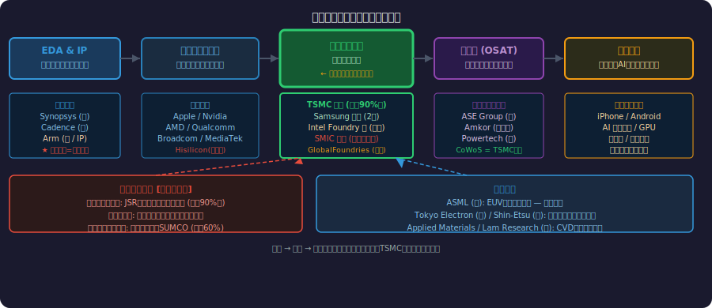
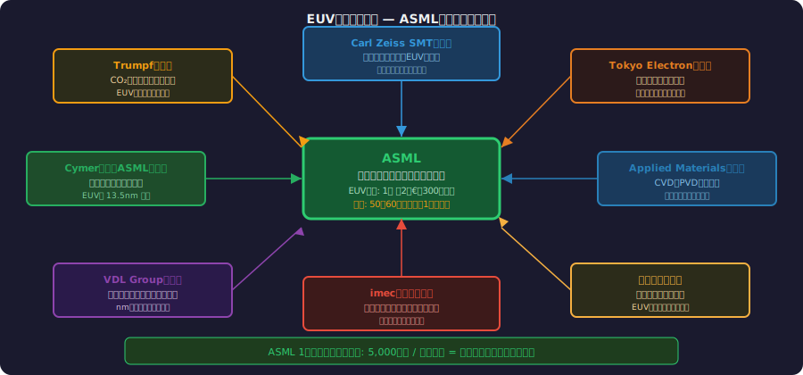
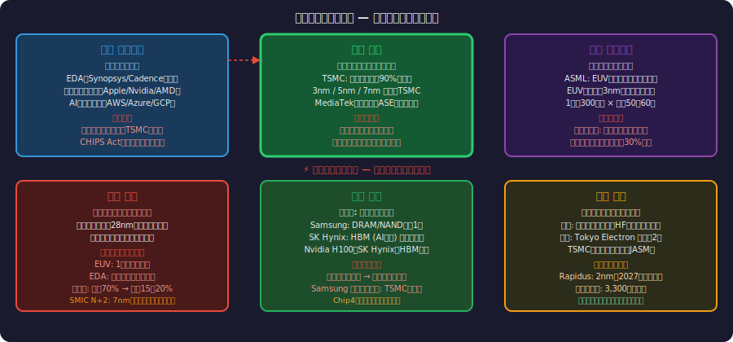
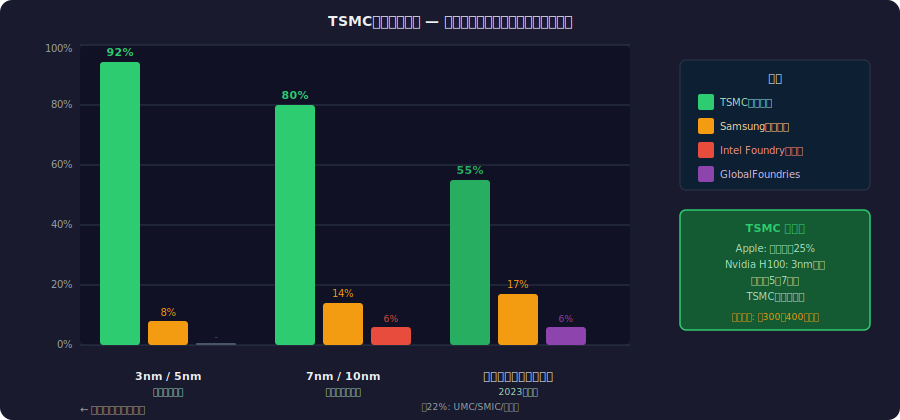
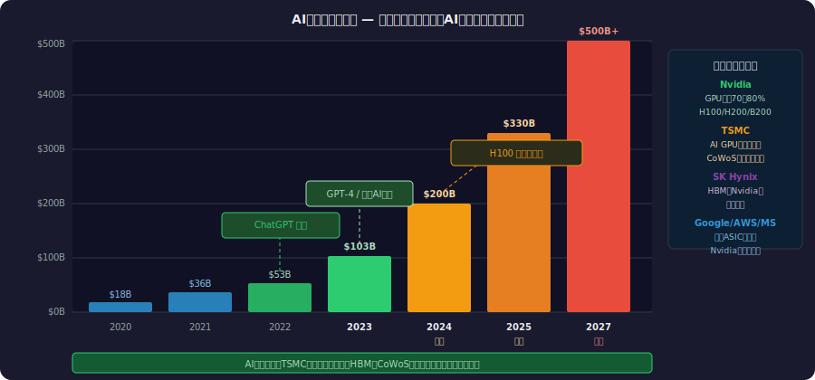

<!-- _class: lead -->
# 半導体戦争の地政学

- TSMCという名の核ボタン
- 
- 台湾の一社が世界経済を人質にしている構造を解き明かす
- 
- 対象: エンジニア・技術者向け技術解説

---

# アジェンダ

- **Part 1:** 半導体が「世界の支配権」になった日
- **Part 2:** 半導体サプライチェーンの構造
- **Part 3:** 地政学的プレイヤー — 米・中・台・韓・日・蘭
- **Part 4:** TSMC = 世界最重要ボトルネック
- **Part 5:** AIチップ時代と技術トレンド
- **Part 6:** エンジニアへの示唆

---

<!-- _class: lead -->
# Part 1: 半導体が「世界の支配権」になった日

---

# 現代の「石油」— なぜ今チップなのか

- **20世紀:** 石油を制する者が世界を制した（中東・ロシア・テキサス）
- **21世紀:** 半導体を制する者が世界を制す
- 
- チップが支配するもの:
- - スマートフォン・PC・サーバー → 情報通信インフラ
- - 自動車（1台あたり1,000〜3,000個）→ 産業・物流
- - 兵器・ミサイル誘導システム → 軍事力
- - AI/クラウド → 経済競争力そのもの
- 
- **チップなくして現代文明は1日も維持できない**

---

# チップとは何か（エンジニア向け基礎）

- 半導体（semiconductor）= 電気を通したり通さなかったりできる素材
- 代表素材: シリコン（Si）— 砂から精製
- 
- **製造の複雑さ:**
- - 先端ロジックチップ（3nm）: トランジスタ密度 **1億個/mm²**
- - 製造工程: **1,000〜2,000ステップ**、2〜3ヶ月かかる
- - 歩留まり管理: 99.9%の精度でないとビジネスにならない
- 
- **なぜ難しいか:**
- - 光の波長より小さい構造を作る（EUV: 13.5nm光で3nm回路）
- - 原子数個レベルの精度が必要
- - 一度構築した工場は再現不可能に近い

---

# 半導体の用途：すべてのものの中にある

- **ロジックチップ（CPU/GPU/ASIC）:**
- - スマートフォン、PC、データセンター、AI推論
- - 最先端プロセス（3〜7nm）が必要
- 
- **メモリ（DRAM/NAND）:**
- - スマートフォン、サーバー、SSD
- - Samsung・SK Hynix・Micronが寡占
- 
- **パワー半導体:**
- - EV、電力インフラ、家電
- - SiC・GaN材料が次世代主力
- 
- **アナログ・センサー:**
- - 自動車、工場、IoTデバイス
- - 旧世代プロセス（28nm〜）でも市場大

---

<!-- _class: lead -->
# Part 2: 半導体サプライチェーンの構造

---

# サプライチェーン全体図

---

# 設計層：EDAツールとIPの独占

- **EDA（Electronic Design Automation）ツール:**
- - Synopsys（米）、Cadence（米）、Siemens EDA（独）の3社寡占
- - なければチップ設計は不可能 → アメリカが輸出禁止すれば中国は詰む
- 
- **IPコア（設計資産の再利用）:**
- - Arm（英・SoftBank傘下）: スマートフォンCPUの95%以上がArmアーキテクチャ
- - Armライセンスなしではモバイルチップが作れない
- - 中国リスク: AppleもQualcommもArmに依存
- 
- **ファブレスモデル:**
- - Qualcomm・Apple・Nvidia・AMD → 設計のみ、製造は外注
- - 製造能力を持たない → TSMCへの依存度が極めて高い

---

# 製造層：TSMCの圧倒的優位

- **純粋製造会社（Foundry）の構造:**
- - TSMC（台湾）: 先端プロセスシェア **90%超**
- - Samsung（韓国）: 2位だが歩留まりで大差あり
- - Intel Foundry: 復権を目指すが実績なし
- 
- **なぜTSMCが一人勝ちなのか:**
- - 1987年創業、Morris Changが「製造専業」モデルを発明
- - 顧客（Apple/Nvidia/Qualcomm）と競合しない → 信頼の蓄積
- - 設備投資額: 年間300〜400億ドル（競合の追随を許さない）
- 
- **TSMC の収益構成（2023）:**
- - 先端プロセス（7nm以下）: 売上の約60%
- - Apple一社でTSMC売上の約25%

---

# EUVリソグラフィ：ASMLだけが作れる機械

---

# 材料・化学品：意外な弱点

- **フォトレジスト（感光材料）:**
- - JSR・東京応化・信越化学（いずれも日本）が世界シェア90%超
- - 半導体製造の「隠れた急所」
- 
- **特殊ガス・化学品:**
- - フッ化水素（HF）: 三菱ケミカル・ステラケミファ（日本）が高純度品を独占
- - 日韓関係悪化（2019年）で韓国工場が生産危機に陥った事例
- 
- **シリコンウェーハ:**
- - 信越半導体・SUMCO（日本）で世界シェア60%
- - ウェーハなければチップは作れない
- 
- → **日本は「見えない急所」として半導体サプライチェーンに深く刺さっている**

---

<!-- _class: lead -->
# Part 3: 地政学的プレイヤー

---

# 地政学マップ：誰が何を握っているか

---

# アメリカ：CHIPS Act と輸出規制の実態

- **強み:**
- - 設計（Apple/Nvidia/Qualcomm/AMD）
- - EDAツール（Synopsys/Cadence）
- - 知的財産・ソフトウェア全般
- 
- **CHIPS and Science Act（2022年）:**
- - 半導体製造への補助金 **527億ドル**
- - TSMC・Samsung・Intelが米国内工場建設を決定
- - 目標: 2030年までに先端チップ製造能力の米国内比率20%
- 
- **輸出規制（Entity List）:**
- - Huawei・SMIC・その他中国企業へのEDA/チップ輸出禁止
- - 2022年10月: 先端半導体製造装置の対中輸出を全面禁止
- - 同盟国（日・蘭）にも同調規制を要請 → 外交摩擦

---

# 中国：Made in China 2025の現実

- **野望と現実:**
- - 目標: 2025年までに半導体自給率70% → **実際は15〜20%**
- - 中芯国際（SMIC）: 最先端は7nm相当、量産困難
- - EDA・EUV・最先端材料すべてで依存が続く
- 
- **中国の弱点:**
- - EUVリソグラフィ機: 1台も保有できない（輸出禁止）
- - 高性能EDA: 米国製に頼らざるを得ない
- - 人材: トップ研究者の多くが海外在住
- 
- **中国の対応策:**
- - 国家主導の巨額投資（国家ICファンド: 累計3,500億元超）
- - 成熟プロセス（28nm〜）の能力増強で市場席巻を狙う
- - 装備国産化（NAURA・AMEC）への集中投資

---

# ファーウェイ制裁と「7nmの壁」

- **ファーウェイへの打撃:**
- - 2019年: Entity Listに追加 → Androidサービス停止
- - 2020年: TSMCとの取引禁止 → スマートフォン事業が実質停止
- - 売上: 2020年の約8,600億元 → 2021年は約6,340億元に急落
- 
- **ファーウェイの「反撃」— Kirin 9000S（2023年）:**
- - SMIC 7nm相当プロセスで製造（N+2プロセス）
- - EUVなしでDUVを多重露光して実現
- - 世界が驚いた: 「制裁をくぐり抜けた」と報道
- 
- **実態:**
- - 歩留まりが低く量産コストが高い
- - 性能はApple A17 Proと比べ大幅劣位
- - 先端製造への道は依然として閉ざされている

---

# オランダ・ASMLの板挟み

- **ASMLとは:**
- - オランダ（フィリップス系）発祥のリソグラフィ装置メーカー
- - EUV露光装置: **世界で唯一** 製造できる企業
- - 1台の価格: **約2億ユーロ**（約300億円）
- - 年間生産台数: 50〜60台（超精密・時間がかかる）
- 
- **板挟みの構造:**
- - アメリカの圧力: 「中国へのEUV輸出禁止に協力せよ」
- - 中国は重要顧客: SMIC等への売上が全体の30%超
- - 2019年: オランダ政府、中国へのEUV輸出ライセンス不発行
- - 2023年: DUV（旧世代）も輸出規制対象に拡大
- 
- **ASMLの本音:**
- - 「地政学は我々のビジネスには関係ない」→ 強制的に巻き込まれた
- - 売上への影響: 中国売上比率が急速に低下見込み

---

# 韓国（Samsung/SK Hynix）の立場

- **Samsung の二重ジレンマ:**
- - 中国に巨大な半導体工場（メモリ）を保有（NAND: 40%、DRAM: 一部）
- - アメリカから「中国工場の先端化禁止」を要求される
- - 中国市場での売上を失えば経営に深刻な影響
- 
- **SK Hynix の状況:**
- - HBM（High Bandwidth Memory）でNvidiaへの独占供給
- - Nvidiaの AI GPU（H100/H200）の性能はHBMに依存
- - 米国から「中国向けHBM禁止」の規制が強化
- 
- **韓国政府の対応:**
- - 米韓同盟を重視しながら中国との経済関係も維持
- - 「チップ同盟（Chip 4）」= 米・日・台・韓の連携枠組みに参加
- - サムスンの中国工場: 既存設備の維持は容認されている

---

# 日本の復権：ラピダス計画の野望

- **日本の半導体の歴史:**
- - 1980年代: DRAM世界シェア80%（NEC・東芝・日立）
- - 1990年代: 米国の圧力（日米半導体協定）と韓国の台頭で凋落
- - 2010年代: ルネサス・東芝メモリ（Kioxia）のみ生き残り
- 
- **ラピダス（Rapidus）計画（2022年設立）:**
- - 目標: 2027年に **2nm** 先端プロセスの量産
- - パートナー: IBMの技術支援、imec（ベルギー）との共同研究
- - 工場: 北海道千歳市に建設中
- - 国家補助金: 3,300億円以上（さらに増額見込み）
- 
- **現実的評価:**
- - TSMCの40年のノウハウを5年で追いつくのは至難
- - ただし「材料・装置」の国内サプライチェーン強化には意義あり

---

<!-- _class: lead -->
# Part 4: TSMC = 世界最重要ボトルネック

---

# TSMCの市場支配率

---

# なぜ誰もTSMCに追いつけないのか

- **技術的優位（Learning Curve）:**
- - 累積製造経験が世界断トツ → 歩留まり改善の速度が他社の追随を許さない
- - 3nmから2nmへの移行: TSMCは2年サイクル、競合は5年以上
- 
- **顧客エコシステム:**
- - Apple・Nvidia・AMD・Qualcomm・Broadcomがすべてカスタマイズ済み
- - 「TSMCから移行するにはチップを完全設計し直す必要がある」
- 
- **投資の圧倒性:**
- - 年間設備投資: 300〜400億ドル（Samsung・Intel・GlobalFoundriesの合計を超える）
- - EUV保有台数: TSMCが世界保有台数の50%以上
- 
- **文化的要因:**
- - 「顧客と競合しない」創業以来の哲学
- - 24時間365日稼働のオペレーション文化

---

# 台湾有事シナリオ：世界経済への影響

- **もし台湾海峡で軍事衝突が起きたら:**
- 
- **即時影響（1〜3ヶ月）:**
- - 先端チップの世界供給が90%以上停止
- - スマートフォン・PC・サーバー生産がすべて停止
- - 自動車生産停止（半導体不足再来の比ではない）
- 
- **中期影響（1〜2年）:**
- - 世界GDP 約**10兆ドル**の損失（試算: AIIBレポート）
- - AIインフラ拡張が完全停止
- - 代替手段なし（Samsung追加投資でも2〜3年で追いつけない）
- 
- **長期影響（3年以上）:**
- - 先端製造拠点の再構築に最低10年
- - 技術的優位の喪失（中国への流出リスク）
- - デジタル経済の根幹が崩壊

---

# 「シリコンシールド」理論

- **シリコンシールドとは:**
- 台湾が先端半導体製造を独占することで、
- 軍事侵攻を抑止する「経済的核抑止力」として機能する理論
- 
- **理論の論拠:**
- - 中国が台湾を攻撃 → TSMCが破壊される
- - 中国自身も半導体依存（スマートフォン産業など）で自滅
- - アメリカ・日本・韓国・欧州が即座に介入 → 孤立する
- 
- **理論への反論:**
- - 中国が電撃戦でTSMCを無傷で占領できれば「盾」が矛になる
- - 習近平政権の「面子」優先でリスク計算が変わるリスク
- - TSMCのキーエンジニアが海外脱出すれば工場は機能停止
- 
- **TSMCの対応:**
- - 台湾以外への製造分散（米・日・独）が進行中

---

# TSMCの地政学的分散戦略

- **TSMCは「台湾だけ」戦略を変えつつある:**
- 
- **アリゾナ工場（米国）:**
- - Fab 21: 4nm/3nm → 2024年量産開始
- - 投資額: **400億ドル**（当初250億→拡大）
- - 課題: 人材不足・コスト高（台湾比2〜3倍）
- 
- **熊本工場（日本）:**
- - JASM（TSMCと日本連合の合弁）
- - 第1工場: 12/16nm → 2024年開業
- - 第2工場: 6nm → 2027年予定
- - 補助金: 日本政府から最大1.2兆円
- 
- **ドレスデン工場（ドイツ）:**
- - Bosch・Infineon・NXPとの合弁（ESMC）
- - 28/22nm（車載向け）→ 2027年開業予定
- 
- → **分散は進むが「台湾中枢」は変わらない**

---

<!-- _class: lead -->
# Part 5: AIチップ時代と技術トレンド

---

# AIチップ需要爆発の実態

---

# Nvidia・TPU・専用ASICの戦い

- **Nvidia の一人勝ち（現在）:**
- - H100/H200/B200: AI学習用GPU市場の70〜80%
- - CUDA エコシステム: 10年以上の囲い込みで移行コストが高い
- - TSMCの最先端プロセスを優先的に確保
- 
- **Google TPU（Tensor Processing Unit）:**
- - 内部AIインフラ用専用チップ
- - Gemini等の大規模モデル学習に使用
- - Cloud TPU として外部提供も開始
- 
- **独自ASIC（専用AI推論チップ）:**
- - Amazon Trainium/Inferentia
- - Meta MTIA
- - Microsoft Maia
- - 「Nvidiaへの依存を下げたい」各社が独自開発を加速
- 
- → **競争がTSMC先端プロセスへの需要をさらに増大させる**

---

# 先端パッケージング（HBM・CoWoS）の台頭

- **なぜパッケージングが重要になったか:**
- 微細化（ムーアの法則）が鈍化 → 複数チップを近接配置して性能向上
- 
- **HBM（High Bandwidth Memory）:**
- - DRAMチップを縦に積層し、超広帯域メモリを実現
- - AIチップ（H100/H200等）に不可欠
- - 供給: SK Hynix が主力 → Nvidiaとの深い依存関係
- 
- **CoWoS（Chip on Wafer on Substrate）:**
- - TSMCが開発した先端パッケージング技術
- - GPUとHBMを同一基板に実装 → データ転送速度が桁違い
- - Nvidia H100の性能の鍵はTSMCのCoWoSにある
- 
- **地政学的含意:**
- - HBM禁輸（対中）が発動すれば中国AIが詰む
- - 実際に2023年以降、段階的な規制が強化中

---

# 中国の迂回策：Huawei Kirin 9000Sの衝撃

- **2023年8月の衝撃:**
- - Huawei Mate 60 Pro 発売
- - 搭載チップ: Kirin 9000S（SMIC N+2プロセス、7nm相当）
- - 制裁下でEUVなしでここまで到達したことに世界が驚愕
- 
- **SMICの技術:**
- - DUV（ArF液浸）の多重露光（SADP/SAQP）で7nm相当を実現
- - EUVがなくてもここまでできる → 制裁の「抜け穴」
- 
- **限界と実態:**
- - 歩留まり: TSMCの約30〜50%（コスト2〜3倍）
- - 量産能力: 限定的（SMIC全体で月100万枚レベル）
- - 性能: Apple A17 Proと比べ電力効率で大幅劣位
- 
- **制裁強化の連鎖:**
- - 米国: DUV（中古含む）の対中輸出規制を強化
- - → 中国の自力更生には依然として長い時間が必要

---

<!-- _class: lead -->
# Part 6: エンジニアへの示唆

---

# ソフトウェアエンジニアにとっての意味

- **クラウドコストへの影響:**
- - AIチップ不足 → GPU時間の高騰 → 推論コストの上昇
- - 2024〜2025年のNvidiaチップ待機リスト（数ヶ月待ち）
- 
- **技術選択への影響:**
- - 「CUDA最適化」スキルの希少性と価値上昇
- - ARM vs x86: Apple Siliconの台頭はTSMCへの依存で成立
- - エッジAI: チップ制約がモデル設計の前提条件になる
- 
- **サービス提供リスク:**
- - 地政学リスクがインフラのダウンタイムリスクに直結
- - 台湾有事 = クラウドインフラの長期調達危機
- 
- **キャリア的示唆:**
- - ハードウェア・ファームウェアエンジニアの需要急増
- - 半導体関連スタートアップ（設計ツール・パッケージング）が熱い

---

# ハードウェアセキュリティリスク

- **サプライチェーン攻撃:**
- - 製造段階でのバックドア埋め込みリスク
- - 2018年: Supermicro「スパイチップ」疑惑（Bloomberg報道）
- - 国防・政府機関が「信頼できる製造元」を重要視する理由
- 
- **チップの出所管理:**
- - 偽造品（counterfeit chips）の流通問題
- - 特に旧世代チップ（供給不足時に偽造品が増加）
- - 航空・医療・軍事分野では致命的リスク
- 
- **プロセッサ脆弱性:**
- - Spectre/Meltdown: アーキテクチャレベルの脆弱性
- - 製造プロセスの微細化によりサイドチャネル攻撃リスクが増加
- 
- **セキュリティエンジニアへの示唆:**
- - ハードウェアルートオブトラストの重要性
- - Trusted Execution Environment（TEE）の設計・評価

---

<!-- _class: lead -->
# まとめ：「半導体を制する者が世界を制す」

- **TSMCという名の核ボタン:**
- 台湾の一社が世界の先端チップ製造の90%を担う
- これは偶然ではなく、40年の技術蓄積と投資の結果
- 
- **構造的な結論:**
- - ハードウェアはソフトウェアより「地政学的」である
- - 制裁・輸出規制はコードと同じくらい技術を制約する
- - AIの未来はシリコンの地政学と不可分
- 
- **エンジニアとして知っておくべきこと:**
- あなたが書くコードは、どこかの工場で作られたチップで動いている
- そのチップがどこで作られ、誰に管理されているかを知ることは
- 今や技術リテラシーの一部である

---

# 参考文献・リソース (1/2)

- **書籍・研究:**
- - [Chip War: The Fight for the World's Most Critical Technology — Chris Miller (2022)](https://www.simonandschuster.com/books/Chip-War/Chris-Miller/9781982172008)
- - [The Chip Letter (Newsletter) — Asianometry](https://www.chipstrat.com/)
- - [SemiAnalysis (専門分析)](https://www.semianalysis.com/)
- 
- **公式データ・レポート:**
- - [TSMC Annual Report 2023](https://investor.tsmc.com/english/annual-reports)
- - [SEMI World Fab Forecast](https://www.semi.org/en/products-services/market-data/world-fab-forecast)
- - [Semiconductor Industry Association (SIA)](https://www.semiconductors.org/data/)
- 
- **地政学分析:**
- - [CSIS: Semiconductors and the US-China Innovation Race](https://www.csis.org/programs/strategic-technologies-program/semiconductors)
- - [ASML Annual Report 2023](https://www.asml.com/en/investors/annual-report)

---

# 参考文献・リソース (2/2)

- **技術解説:**
- - [IEEE Spectrum: Semiconductor Coverage](https://spectrum.ieee.org/semiconductors)
- - [AnandTech: Semiconductor Deep Dives](https://www.anandtech.com/)
- - [WikiChip: Process Nodes Comparison](https://en.wikichip.org/wiki/WikiChip)
- 
- **動画・講義:**
- - [Asianometry YouTube Channel — TSMC/ASML/半導体産業解説](https://www.youtube.com/@Asianometry)
- - [Real Engineering: How ASML Makes EUV Machines](https://www.youtube.com/watch?v=_t-3_Q2-Abs)
- 
- **日本語リソース:**
- - [半導体産業新聞](https://www.semiconportal.com/)
- - [EE Times Japan](https://eetimes.itmedia.co.jp/ee/)
- - [経済産業省: 半導体・デジタル産業戦略](https://www.meti.go.jp/policy/mono_info_service/joho/semiconductor/)

