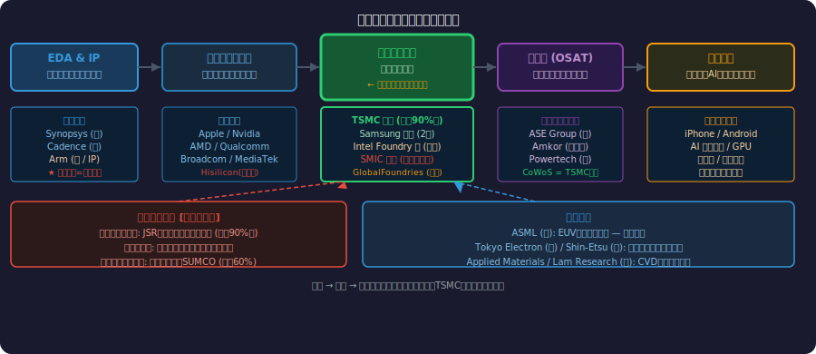
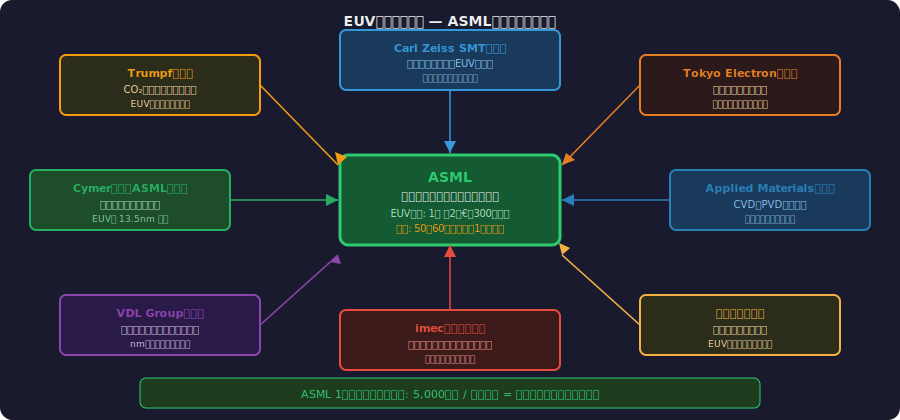
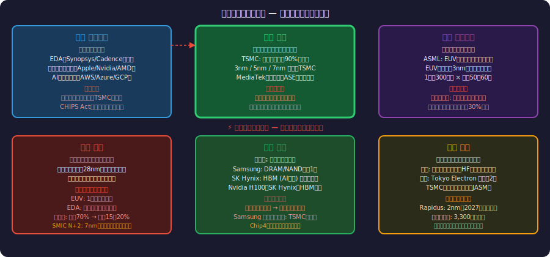
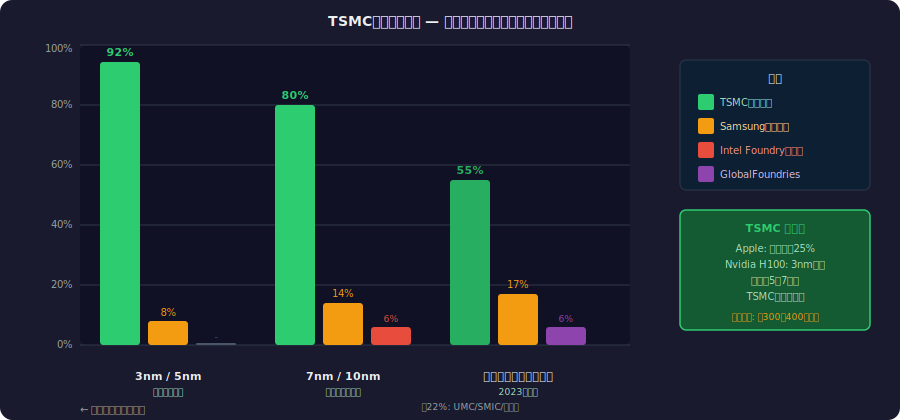
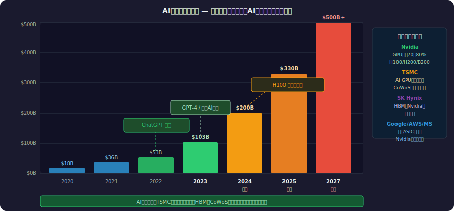

<!-- _class: lead -->
# 半導体戦争の地政学

- <svg viewBox="0 0 800 380" style="max-height:70vh;max-width:100%;display:block;margin:0 auto;" xmlns="http://www.w3.org/2000/svg">
<rect x="0" y="0" width="800" height="380" fill="#1a1a2e" rx="0"/>
<text x="400" y="26" font-size="16" fill="#ffffff" text-anchor="middle" font-weight="bold" font-family="sans-serif">半導体産業の核心数値</text>
<rect x="50" y="45" width="440" height="32" fill="#16213e" rx="8"/>
<text x="270" y="67" font-size="12" fill="#ffffff" text-anchor="middle" font-weight="normal" font-family="sans-serif">TSMC 先端シェア</text>
<rect x="500" y="45" width="250" height="32" fill="#0f3460" rx="8"/>
<text x="625" y="67" font-size="14" fill="#e91e63" text-anchor="middle" font-weight="bold" font-family="sans-serif">90%超</text>
<rect x="50" y="87" width="440" height="32" fill="#16213e" rx="8"/>
<text x="270" y="109" font-size="12" fill="#ffffff" text-anchor="middle" font-weight="normal" font-family="sans-serif">Arm アーキテクチャ普及率</text>
<rect x="500" y="87" width="250" height="32" fill="#0f3460" rx="8"/>
<text x="625" y="109" font-size="14" fill="#f9a825" text-anchor="middle" font-weight="bold" font-family="sans-serif">スマホ CPU 95%以上</text>
<rect x="50" y="129" width="440" height="32" fill="#16213e" rx="8"/>
<text x="270" y="151" font-size="12" fill="#ffffff" text-anchor="middle" font-weight="normal" font-family="sans-serif">Apple の TSMC 売上比率</text>
<rect x="500" y="129" width="250" height="32" fill="#0f3460" rx="8"/>
<text x="625" y="151" font-size="14" fill="#ffffff" text-anchor="middle" font-weight="bold" font-family="sans-serif">約 25%</text>
<rect x="50" y="171" width="440" height="32" fill="#16213e" rx="8"/>
<text x="270" y="193" font-size="12" fill="#ffffff" text-anchor="middle" font-weight="normal" font-family="sans-serif">CHIPS Act 補助金</text>
<rect x="500" y="171" width="250" height="32" fill="#0f3460" rx="8"/>
<text x="625" y="193" font-size="14" fill="#f9a825" text-anchor="middle" font-weight="bold" font-family="sans-serif">$527億</text>
<rect x="50" y="213" width="440" height="32" fill="#16213e" rx="8"/>
<text x="270" y="235" font-size="12" fill="#ffffff" text-anchor="middle" font-weight="normal" font-family="sans-serif">台湾有事 GDP損失試算</text>
<rect x="500" y="213" width="250" height="32" fill="#0f3460" rx="8"/>
<text x="625" y="235" font-size="14" fill="#e91e63" text-anchor="middle" font-weight="bold" font-family="sans-serif">約 $10兆</text>
<rect x="50" y="255" width="440" height="32" fill="#16213e" rx="8"/>
<text x="270" y="277" font-size="12" fill="#ffffff" text-anchor="middle" font-weight="normal" font-family="sans-serif">ASML EUV 1台の価格</text>
<rect x="500" y="255" width="250" height="32" fill="#0f3460" rx="8"/>
<text x="625" y="277" font-size="14" fill="#ffffff" text-anchor="middle" font-weight="bold" font-family="sans-serif">約 2億ユーロ (300億円)</text>
<rect x="50" y="297" width="440" height="32" fill="#16213e" rx="8"/>
<text x="270" y="319" font-size="12" fill="#ffffff" text-anchor="middle" font-weight="normal" font-family="sans-serif">先端パッケージ EUV 年産台数</text>
<rect x="500" y="297" width="250" height="32" fill="#0f3460" rx="8"/>
<text x="625" y="319" font-size="14" fill="#888" text-anchor="middle" font-weight="bold" font-family="sans-serif">50-60台</text>
<text x="400" y="365" font-size="12" fill="#aaa" text-anchor="middle" font-weight="normal" font-family="sans-serif">これらの数値が「半導体地政学」のリアルを物語る</text>
</svg>
- TSMCという名の核ボタン
- 
- 台湾の一社が世界経済を人質にしている構造を解き明かす
- 
- 対象: エンジニア・技術者向け技術解説

---

# アジェンダ

> *6パートで半導体の技術・地政学・AIトレンドを体系的に解説する*

- <svg viewBox="0 0 800 380" style="max-height:70vh;max-width:100%;display:block;margin:0 auto;" xmlns="http://www.w3.org/2000/svg">
<rect x="0" y="0" width="800" height="380" fill="#1a1a2e" rx="0"/>
<text x="400" y="26" font-size="15" fill="#ffffff" text-anchor="middle" font-weight="bold" font-family="sans-serif">半導体サプライチェーンのリスク層</text>
<rect x="100" y="50" width="600" height="50" fill="#2a1a0a" rx="8"/>
<text x="400" y="82" font-size="13" fill="#e91e63" text-anchor="middle" font-weight="bold" font-family="sans-serif">Lv.4 地政学リスク: 台湾有事・制裁・輸出規制</text>
<rect x="100" y="110" width="600" height="50" fill="#16213e" rx="8"/>
<text x="400" y="142" font-size="13" fill="#f9a825" text-anchor="middle" font-weight="normal" font-family="sans-serif">Lv.3 集中リスク: TSMC・ASML・韓国メモリへの過度な依存</text>
<rect x="100" y="170" width="600" height="50" fill="#0f3460" rx="8"/>
<text x="400" y="202" font-size="13" fill="#ffffff" text-anchor="middle" font-weight="normal" font-family="sans-serif">Lv.2 技術リスク: ムーアの法則鈍化・歩留まり・人材不足</text>
<rect x="100" y="230" width="600" height="50" fill="#16213e" rx="8"/>
<text x="400" y="262" font-size="13" fill="#aaa" text-anchor="middle" font-weight="normal" font-family="sans-serif">Lv.1 需要リスク: AIブーム後の調整・在庫サイクル</text>
<line x1="400" y1="300" x2="400" y2="333" stroke="#f9a825" stroke-width="2"/>
<polygon points="400,345 394,333 406,333" fill="#f9a825"/>
<text x="400" y="360" font-size="13" fill="#ffffff" text-anchor="middle" font-weight="bold" font-family="sans-serif">リスクは重なり合う — 単一イベントが全層を同時に揺らす可能性</text>
</svg>
- **Part 1:** 半導体が「世界の支配権」になった日
- **Part 2:** 半導体サプライチェーンの構造
- **Part 3:** 地政学的プレイヤー — 米・中・台・韓・日・蘭
- **Part 4:** TSMC = 世界最重要ボトルネック
- **Part 5:** AIチップ時代と技術トレンド
- **Part 6:** エンジニアへの示唆

---

<!-- _class: lead -->
# Part 1: 半導体が「世界の支配権」になった日

- <svg viewBox="0 0 800 380" style="max-height:70vh;max-width:100%;display:block;margin:0 auto;" xmlns="http://www.w3.org/2000/svg">
<rect x="0" y="0" width="800" height="380" fill="#1a1a2e" rx="0"/>
<text x="400" y="26" font-size="16" fill="#ffffff" text-anchor="middle" font-weight="bold" font-family="sans-serif">半導体産業の核心数値</text>
<rect x="50" y="45" width="440" height="32" fill="#16213e" rx="8"/>
<text x="270" y="67" font-size="12" fill="#ffffff" text-anchor="middle" font-weight="normal" font-family="sans-serif">TSMC 先端シェア</text>
<rect x="500" y="45" width="250" height="32" fill="#0f3460" rx="8"/>
<text x="625" y="67" font-size="14" fill="#e91e63" text-anchor="middle" font-weight="bold" font-family="sans-serif">90%超</text>
<rect x="50" y="87" width="440" height="32" fill="#16213e" rx="8"/>
<text x="270" y="109" font-size="12" fill="#ffffff" text-anchor="middle" font-weight="normal" font-family="sans-serif">Arm アーキテクチャ普及率</text>
<rect x="500" y="87" width="250" height="32" fill="#0f3460" rx="8"/>
<text x="625" y="109" font-size="14" fill="#f9a825" text-anchor="middle" font-weight="bold" font-family="sans-serif">スマホ CPU 95%以上</text>
<rect x="50" y="129" width="440" height="32" fill="#16213e" rx="8"/>
<text x="270" y="151" font-size="12" fill="#ffffff" text-anchor="middle" font-weight="normal" font-family="sans-serif">Apple の TSMC 売上比率</text>
<rect x="500" y="129" width="250" height="32" fill="#0f3460" rx="8"/>
<text x="625" y="151" font-size="14" fill="#ffffff" text-anchor="middle" font-weight="bold" font-family="sans-serif">約 25%</text>
<rect x="50" y="171" width="440" height="32" fill="#16213e" rx="8"/>
<text x="270" y="193" font-size="12" fill="#ffffff" text-anchor="middle" font-weight="normal" font-family="sans-serif">CHIPS Act 補助金</text>
<rect x="500" y="171" width="250" height="32" fill="#0f3460" rx="8"/>
<text x="625" y="193" font-size="14" fill="#f9a825" text-anchor="middle" font-weight="bold" font-family="sans-serif">$527億</text>
<rect x="50" y="213" width="440" height="32" fill="#16213e" rx="8"/>
<text x="270" y="235" font-size="12" fill="#ffffff" text-anchor="middle" font-weight="normal" font-family="sans-serif">台湾有事 GDP損失試算</text>
<rect x="500" y="213" width="250" height="32" fill="#0f3460" rx="8"/>
<text x="625" y="235" font-size="14" fill="#e91e63" text-anchor="middle" font-weight="bold" font-family="sans-serif">約 $10兆</text>
<rect x="50" y="255" width="440" height="32" fill="#16213e" rx="8"/>
<text x="270" y="277" font-size="12" fill="#ffffff" text-anchor="middle" font-weight="normal" font-family="sans-serif">ASML EUV 1台の価格</text>
<rect x="500" y="255" width="250" height="32" fill="#0f3460" rx="8"/>
<text x="625" y="277" font-size="14" fill="#ffffff" text-anchor="middle" font-weight="bold" font-family="sans-serif">約 2億ユーロ (300億円)</text>
<rect x="50" y="297" width="440" height="32" fill="#16213e" rx="8"/>
<text x="270" y="319" font-size="12" fill="#ffffff" text-anchor="middle" font-weight="normal" font-family="sans-serif">先端パッケージ EUV 年産台数</text>
<rect x="500" y="297" width="250" height="32" fill="#0f3460" rx="8"/>
<text x="625" y="319" font-size="14" fill="#888" text-anchor="middle" font-weight="bold" font-family="sans-serif">50-60台</text>
<text x="400" y="365" font-size="12" fill="#aaa" text-anchor="middle" font-weight="normal" font-family="sans-serif">これらの数値が「半導体地政学」のリアルを物語る</text>
</svg>

---

# 現代の「石油」— なぜ今チップなのか（1/2）

> *半導体はスマホ・自動車・兵器の全てを動かし現代文明の生命線となった*

- <svg viewBox="0 0 800 360" style="max-height:70vh;max-width:100%;display:block;margin:0 auto;" xmlns="http://www.w3.org/2000/svg">
<rect x="0" y="0" width="800" height="380" fill="#1a1a2e" rx="0"/>
<text x="400" y="28" font-size="16" fill="#ffffff" text-anchor="middle" font-weight="bold" font-family="sans-serif">先端ファブの地理的集中</text>
<rect x="50" y="50" width="200" height="260" fill="#16213e" rx="8"/>
<text x="150" y="80" font-size="18" fill="#e91e63" text-anchor="middle" font-weight="bold" font-family="sans-serif">台湾</text>
<text x="150" y="106" font-size="15" fill="#f9a825" text-anchor="middle" font-weight="bold" font-family="sans-serif">TSMC</text>
<text x="150" y="128" font-size="12" fill="#aaa" text-anchor="middle" font-weight="normal" font-family="sans-serif">先端ロジック</text>
<text x="150" y="148" font-size="14" fill="#ffffff" text-anchor="middle" font-weight="normal" font-family="sans-serif">シェア 90%超</text>
<text x="150" y="175" font-size="13" fill="#f9a825" text-anchor="middle" font-weight="normal" font-family="sans-serif">3nm / 2nm</text>
<text x="150" y="195" font-size="12" fill="#aaa" text-anchor="middle" font-weight="normal" font-family="sans-serif">年投資 $300-400B</text>
<rect x="300" y="50" width="200" height="260" fill="#16213e" rx="8"/>
<text x="400" y="80" font-size="18" fill="#f9a825" text-anchor="middle" font-weight="bold" font-family="sans-serif">韓国</text>
<text x="400" y="106" font-size="15" fill="#ffffff" text-anchor="middle" font-weight="normal" font-family="sans-serif">Samsung</text>
<text x="400" y="126" font-size="14" fill="#ffffff" text-anchor="middle" font-weight="normal" font-family="sans-serif">SK Hynix</text>
<text x="400" y="150" font-size="13" fill="#aaa" text-anchor="middle" font-weight="normal" font-family="sans-serif">メモリ世界首位</text>
<text x="400" y="172" font-size="13" fill="#e91e63" text-anchor="middle" font-weight="normal" font-family="sans-serif">HBM → AI必須</text>
<rect x="550" y="50" width="200" height="260" fill="#16213e" rx="8"/>
<text x="650" y="80" font-size="18" fill="#ffffff" text-anchor="middle" font-weight="bold" font-family="sans-serif">その他</text>
<text x="650" y="106" font-size="13" fill="#aaa" text-anchor="middle" font-weight="normal" font-family="sans-serif">Intel (米)</text>
<text x="650" y="126" font-size="12" fill="#aaa" text-anchor="middle" font-weight="normal" font-family="sans-serif">GlobalFoundries</text>
<text x="650" y="148" font-size="13" fill="#f9a825" text-anchor="middle" font-weight="normal" font-family="sans-serif">ラピダス (日)</text>
<text x="650" y="168" font-size="13" fill="#e91e63" text-anchor="middle" font-weight="normal" font-family="sans-serif">SMIC (中)</text>
<text x="650" y="190" font-size="12" fill="#aaa" text-anchor="middle" font-weight="normal" font-family="sans-serif">TSMC Arizona</text>
<text x="400" y="340" font-size="12" fill="#e91e63" text-anchor="middle" font-weight="normal" font-family="sans-serif">先端製造は台湾・韓国の2カ国に極度集中 → 地政学リスクの震源地</text>
</svg>
- **20世紀:** 石油を制する者が世界を制した（中東・ロシア・テキサス）
- **21世紀:** 半導体を制する者が世界を制す
- 
- チップが支配するもの:
- - スマートフォン・PC・サーバー → 情報通信インフラ

---

# 現代の「石油」— なぜ今チップなのか（2/2）

> *チップのない1日は現代文明には存在しない—普及浸透の圧倒的現実*

- <svg viewBox="0 0 800 380" style="max-height:70vh;max-width:100%;display:block;margin:0 auto;" xmlns="http://www.w3.org/2000/svg">
<rect x="0" y="0" width="800" height="380" fill="#1a1a2e" rx="0"/>
<text x="400" y="26" font-size="16" fill="#ffffff" text-anchor="middle" font-weight="bold" font-family="sans-serif">半導体産業の核心数値</text>
<rect x="50" y="45" width="440" height="32" fill="#16213e" rx="8"/>
<text x="270" y="67" font-size="12" fill="#ffffff" text-anchor="middle" font-weight="normal" font-family="sans-serif">TSMC 先端シェア</text>
<rect x="500" y="45" width="250" height="32" fill="#0f3460" rx="8"/>
<text x="625" y="67" font-size="14" fill="#e91e63" text-anchor="middle" font-weight="bold" font-family="sans-serif">90%超</text>
<rect x="50" y="87" width="440" height="32" fill="#16213e" rx="8"/>
<text x="270" y="109" font-size="12" fill="#ffffff" text-anchor="middle" font-weight="normal" font-family="sans-serif">Arm アーキテクチャ普及率</text>
<rect x="500" y="87" width="250" height="32" fill="#0f3460" rx="8"/>
<text x="625" y="109" font-size="14" fill="#f9a825" text-anchor="middle" font-weight="bold" font-family="sans-serif">スマホ CPU 95%以上</text>
<rect x="50" y="129" width="440" height="32" fill="#16213e" rx="8"/>
<text x="270" y="151" font-size="12" fill="#ffffff" text-anchor="middle" font-weight="normal" font-family="sans-serif">Apple の TSMC 売上比率</text>
<rect x="500" y="129" width="250" height="32" fill="#0f3460" rx="8"/>
<text x="625" y="151" font-size="14" fill="#ffffff" text-anchor="middle" font-weight="bold" font-family="sans-serif">約 25%</text>
<rect x="50" y="171" width="440" height="32" fill="#16213e" rx="8"/>
<text x="270" y="193" font-size="12" fill="#ffffff" text-anchor="middle" font-weight="normal" font-family="sans-serif">CHIPS Act 補助金</text>
<rect x="500" y="171" width="250" height="32" fill="#0f3460" rx="8"/>
<text x="625" y="193" font-size="14" fill="#f9a825" text-anchor="middle" font-weight="bold" font-family="sans-serif">$527億</text>
<rect x="50" y="213" width="440" height="32" fill="#16213e" rx="8"/>
<text x="270" y="235" font-size="12" fill="#ffffff" text-anchor="middle" font-weight="normal" font-family="sans-serif">台湾有事 GDP損失試算</text>
<rect x="500" y="213" width="250" height="32" fill="#0f3460" rx="8"/>
<text x="625" y="235" font-size="14" fill="#e91e63" text-anchor="middle" font-weight="bold" font-family="sans-serif">約 $10兆</text>
<rect x="50" y="255" width="440" height="32" fill="#16213e" rx="8"/>
<text x="270" y="277" font-size="12" fill="#ffffff" text-anchor="middle" font-weight="normal" font-family="sans-serif">ASML EUV 1台の価格</text>
<rect x="500" y="255" width="250" height="32" fill="#0f3460" rx="8"/>
<text x="625" y="277" font-size="14" fill="#ffffff" text-anchor="middle" font-weight="bold" font-family="sans-serif">約 2億ユーロ (300億円)</text>
<rect x="50" y="297" width="440" height="32" fill="#16213e" rx="8"/>
<text x="270" y="319" font-size="12" fill="#ffffff" text-anchor="middle" font-weight="normal" font-family="sans-serif">先端パッケージ EUV 年産台数</text>
<rect x="500" y="297" width="250" height="32" fill="#0f3460" rx="8"/>
<text x="625" y="319" font-size="14" fill="#888" text-anchor="middle" font-weight="bold" font-family="sans-serif">50-60台</text>
<text x="400" y="365" font-size="12" fill="#aaa" text-anchor="middle" font-weight="normal" font-family="sans-serif">これらの数値が「半導体地政学」のリアルを物語る</text>
</svg>
- - 自動車（1台あたり1,000〜3,000個）→ 産業・物流
- - 兵器・ミサイル誘導システム → 軍事力
- - AI/クラウド → 経済競争力そのもの
- 
- **チップなくして現代文明は1日も維持できない**

---

# チップとは何か（エンジニア向け基礎）（1/2）

> *3nmチップは1mm²に1億個のトランジスタ—製造工程は1000〜2000ステップ*

- <svg viewBox="0 0 800 370" style="max-height:70vh;max-width:100%;display:block;margin:0 auto;" xmlns="http://www.w3.org/2000/svg">
<rect x="0" y="0" width="800" height="380" fill="#1a1a2e" rx="0"/>
<text x="400" y="28" font-size="15" fill="#ffffff" text-anchor="middle" font-weight="bold" font-family="sans-serif">地政学リスクがエンジニアに与える影響</text>
<rect x="50" y="60" width="200" height="260" fill="#16213e" rx="8"/>
<text x="150" y="90" font-size="15" fill="#f9a825" text-anchor="middle" font-weight="bold" font-family="sans-serif">インフラコスト</text>
<text x="150" y="115" font-size="13" fill="#ffffff" text-anchor="middle" font-weight="normal" font-family="sans-serif">AI GPU不足</text>
<text x="150" y="138" font-size="12" fill="#aaa" text-anchor="middle" font-weight="normal" font-family="sans-serif">→ GPU時間高騰</text>
<text x="150" y="162" font-size="13" fill="#ffffff" text-anchor="middle" font-weight="normal" font-family="sans-serif">CUDA最適化</text>
<text x="150" y="185" font-size="12" fill="#f9a825" text-anchor="middle" font-weight="normal" font-family="sans-serif">スキル価値↑</text>
<text x="150" y="215" font-size="12" fill="#aaa" text-anchor="middle" font-weight="normal" font-family="sans-serif">数ヶ月待ちの</text>
<text x="150" y="235" font-size="12" fill="#aaa" text-anchor="middle" font-weight="normal" font-family="sans-serif">チップ待機リスト</text>
<rect x="300" y="60" width="200" height="260" fill="#16213e" rx="8"/>
<text x="400" y="90" font-size="15" fill="#f9a825" text-anchor="middle" font-weight="bold" font-family="sans-serif">技術選択</text>
<text x="400" y="115" font-size="13" fill="#ffffff" text-anchor="middle" font-weight="normal" font-family="sans-serif">ARM vs x86:</text>
<text x="400" y="138" font-size="12" fill="#aaa" text-anchor="middle" font-weight="normal" font-family="sans-serif">Apple Silicon=TSMC依存</text>
<text x="400" y="162" font-size="13" fill="#ffffff" text-anchor="middle" font-weight="normal" font-family="sans-serif">エッジAIモデル設計は</text>
<text x="400" y="185" font-size="12" fill="#aaa" text-anchor="middle" font-weight="normal" font-family="sans-serif">チップ制約が前提に</text>
<text x="400" y="215" font-size="12" fill="#f9a825" text-anchor="middle" font-weight="normal" font-family="sans-serif">HW/FWエンジニア</text>
<text x="400" y="235" font-size="12" fill="#aaa" text-anchor="middle" font-weight="normal" font-family="sans-serif">需要が急増</text>
<rect x="550" y="60" width="200" height="260" fill="#16213e" rx="8"/>
<text x="650" y="90" font-size="15" fill="#e91e63" text-anchor="middle" font-weight="bold" font-family="sans-serif">リスク管理</text>
<text x="650" y="115" font-size="13" fill="#ffffff" text-anchor="middle" font-weight="normal" font-family="sans-serif">台湾有事=</text>
<text x="650" y="138" font-size="12" fill="#aaa" text-anchor="middle" font-weight="normal" font-family="sans-serif">クラウド調達危機</text>
<text x="650" y="162" font-size="13" fill="#ffffff" text-anchor="middle" font-weight="normal" font-family="sans-serif">HWセキュリティ</text>
<text x="650" y="185" font-size="12" fill="#aaa" text-anchor="middle" font-weight="normal" font-family="sans-serif">サプライチェーン攻撃</text>
<text x="650" y="215" font-size="12" fill="#aaa" text-anchor="middle" font-weight="normal" font-family="sans-serif">Spectre/Meltdown級</text>
<text x="650" y="235" font-size="12" fill="#aaa" text-anchor="middle" font-weight="normal" font-family="sans-serif">脆弱性のリスク↑</text>
<text x="400" y="360" font-size="13" fill="#f9a825" text-anchor="middle" font-weight="bold" font-family="sans-serif">あなたのコードは地政学に依存したチップで動いている</text>
</svg>
- 半導体（semiconductor）= 電気を通したり通さなかったりできる素材
- 代表素材: シリコン（Si）— 砂から精製
- 
- **製造の複雑さ:**
- - 先端ロジックチップ（3nm）: トランジスタ密度 **1億個/mm²**
- - 製造工程: **1,000〜2,000ステップ**、2〜3ヶ月かかる

---

# チップとは何か（エンジニア向け基礎）（2/2）

> *光より小さい構造を原子数個精度で作る—一度構築した工場は再現不可能*

- <svg viewBox="0 0 800 380" style="max-height:70vh;max-width:100%;display:block;margin:0 auto;" xmlns="http://www.w3.org/2000/svg">
<rect x="0" y="0" width="800" height="380" fill="#1a1a2e" rx="0"/>
<text x="400" y="26" font-size="15" fill="#ffffff" text-anchor="middle" font-weight="bold" font-family="sans-serif">EDA ツールと IP コアの独占構造</text>
<rect x="50" y="50" width="340" height="140" fill="#16213e" rx="8"/>
<text x="220" y="80" font-size="14" fill="#f9a825" text-anchor="middle" font-weight="bold" font-family="sans-serif">EDA ツール 3社寡占</text>
<text x="220" y="105" font-size="12" fill="#ffffff" text-anchor="middle" font-weight="normal" font-family="sans-serif">Synopsys (米)</text>
<text x="220" y="126" font-size="12" fill="#ffffff" text-anchor="middle" font-weight="normal" font-family="sans-serif">Cadence (米)</text>
<text x="220" y="147" font-size="12" fill="#ffffff" text-anchor="middle" font-weight="normal" font-family="sans-serif">Siemens EDA (独)</text>
<text x="220" y="170" font-size="12" fill="#e91e63" text-anchor="middle" font-weight="normal" font-family="sans-serif">→ 輸出禁止 = 中国の設計が止まる</text>
<rect x="410" y="50" width="340" height="140" fill="#0f3460" rx="8"/>
<text x="580" y="80" font-size="14" fill="#f9a825" text-anchor="middle" font-weight="bold" font-family="sans-serif">Arm (英・SoftBank)</text>
<text x="580" y="105" font-size="12" fill="#ffffff" text-anchor="middle" font-weight="normal" font-family="sans-serif">スマホ CPU の 95%以上が Arm</text>
<text x="580" y="126" font-size="12" fill="#aaa" text-anchor="middle" font-weight="normal" font-family="sans-serif">Armライセンスなし</text>
<text x="580" y="148" font-size="12" fill="#aaa" text-anchor="middle" font-weight="normal" font-family="sans-serif">= モバイルチップ作れない</text>
<text x="580" y="170" font-size="12" fill="#e91e63" text-anchor="middle" font-weight="normal" font-family="sans-serif">→ 設計段階での依存が根深い</text>
<rect x="50" y="210" width="700" height="55" fill="#16213e" rx="8"/>
<text x="400" y="235" font-size="14" fill="#ffffff" text-anchor="middle" font-weight="bold" font-family="sans-serif">ファブレス企業 (Apple/Nvidia/Qualcomm/AMD)</text>
<text x="400" y="256" font-size="12" fill="#aaa" text-anchor="middle" font-weight="normal" font-family="sans-serif">設計のみ → 製造は TSMC に外注 → 二重依存が生まれる</text>
<text x="400" y="315" font-size="13" fill="#e91e63" text-anchor="middle" font-weight="bold" font-family="sans-serif">EDA + Arm + TSMC のトリプルロックが中国の進出を阻む</text>
</svg>
- - 歩留まり管理: 99.9%の精度でないとビジネスにならない
- 
- **なぜ難しいか:**
- - 光の波長より小さい構造を作る（EUV: 13.5nm光で3nm回路）
- - 原子数個レベルの精度が必要
- - 一度構築した工場は再現不可能に近い

---

# 半導体の用途：すべてのものの中にある（1/2）（1/2）

> *CPU/GPU/ASICが最先端3〜7nmを必要とし現代インフラの核になった*

- <svg viewBox="0 0 800 360" style="max-height:70vh;max-width:100%;display:block;margin:0 auto;" xmlns="http://www.w3.org/2000/svg">
<rect x="0" y="0" width="800" height="360" fill="#1a1a2e" rx="0"/>
<text x="400" y="28" font-size="15" fill="#ffffff" text-anchor="middle" font-weight="bold" font-family="sans-serif">中国の半導体自給率: 目標 vs 現実</text>
<rect x="100" y="60" width="200" height="180" fill="#0f3460" rx="8"/>
<text x="200" y="85" font-size="14" fill="#f9a825" text-anchor="middle" font-weight="bold" font-family="sans-serif">目標 (2025)</text>
<text x="200" y="108" font-size="12" fill="#aaa" text-anchor="middle" font-weight="normal" font-family="sans-serif">Made in China 2025</text>
<text x="200" y="135" font-size="13" fill="#ffffff" text-anchor="middle" font-weight="normal" font-family="sans-serif">自給率</text>
<text x="200" y="158" font-size="28" fill="#f9a825" text-anchor="middle" font-weight="bold" font-family="sans-serif">70%</text>
<rect x="500" y="60" width="200" height="180" fill="#16213e" rx="8"/>
<text x="600" y="85" font-size="14" fill="#e91e63" text-anchor="middle" font-weight="bold" font-family="sans-serif">現実 (2025年頃)</text>
<text x="600" y="108" font-size="12" fill="#aaa" text-anchor="middle" font-weight="normal" font-family="sans-serif">実際の達成度</text>
<text x="600" y="135" font-size="13" fill="#ffffff" text-anchor="middle" font-weight="normal" font-family="sans-serif">自給率</text>
<text x="600" y="158" font-size="24" fill="#e91e63" text-anchor="middle" font-weight="bold" font-family="sans-serif">15-20%</text>
<line x1="300" y1="150" x2="488" y2="150" stroke="#f9a825" stroke-width="2"/>
<polygon points="500,150 488,156 488,144" fill="#f9a825"/>
<text x="400" y="146" font-size="16" fill="#ffffff" text-anchor="middle" font-weight="bold" font-family="sans-serif">GAP</text>
<text x="400" y="270" font-size="12" fill="#aaa" text-anchor="middle" font-weight="normal" font-family="sans-serif">EUVゼロ・EDA依存・人材不足が壁となっている</text>
<text x="400" y="300" font-size="13" fill="#ffffff" text-anchor="middle" font-weight="normal" font-family="sans-serif">成熟プロセス(28nm~)増産で市場席巻を狙う戦略に転換</text>
<text x="400" y="330" font-size="12" fill="#888" text-anchor="middle" font-weight="normal" font-family="sans-serif">Huawei Kirin9000S = 最大限の抵抗だが先端への道は遠い</text>
</svg>
- **ロジックチップ（CPU/GPU/ASIC）:**
- - スマートフォン、PC、データセンター、AI推論
- - 最先端プロセス（3〜7nm）が必要

---

# 半導体の用途：すべてのものの中にある（1/2）（2/2）

> *メモリ三社寡占の実態—DRAMとNANDで世界のデジタルインフラを支配*

- 
- **メモリ（DRAM/NAND）:**
- - スマートフォン、サーバー、SSD
- - Samsung・SK Hynix・Micronが寡占

---

# 半導体の用途：すべてのものの中にある（2/2）（1/2）

> *EVから家電まで広域のパワー半導体が経済安全保障の盲点になっている*

- <svg viewBox="0 0 800 380" style="max-height:70vh;max-width:100%;display:block;margin:0 auto;" xmlns="http://www.w3.org/2000/svg">
<rect x="0" y="0" width="800" height="380" fill="#1a1a2e" rx="0"/>
<text x="400" y="26" font-size="15" fill="#ffffff" text-anchor="middle" font-weight="bold" font-family="sans-serif">半導体サプライチェーンのリスク層</text>
<rect x="100" y="50" width="600" height="50" fill="#2a1a0a" rx="8"/>
<text x="400" y="82" font-size="13" fill="#e91e63" text-anchor="middle" font-weight="bold" font-family="sans-serif">Lv.4 地政学リスク: 台湾有事・制裁・輸出規制</text>
<rect x="100" y="110" width="600" height="50" fill="#16213e" rx="8"/>
<text x="400" y="142" font-size="13" fill="#f9a825" text-anchor="middle" font-weight="normal" font-family="sans-serif">Lv.3 集中リスク: TSMC・ASML・韓国メモリへの過度な依存</text>
<rect x="100" y="170" width="600" height="50" fill="#0f3460" rx="8"/>
<text x="400" y="202" font-size="13" fill="#ffffff" text-anchor="middle" font-weight="normal" font-family="sans-serif">Lv.2 技術リスク: ムーアの法則鈍化・歩留まり・人材不足</text>
<rect x="100" y="230" width="600" height="50" fill="#16213e" rx="8"/>
<text x="400" y="262" font-size="13" fill="#aaa" text-anchor="middle" font-weight="normal" font-family="sans-serif">Lv.1 需要リスク: AIブーム後の調整・在庫サイクル</text>
<line x1="400" y1="300" x2="400" y2="333" stroke="#f9a825" stroke-width="2"/>
<polygon points="400,345 394,333 406,333" fill="#f9a825"/>
<text x="400" y="360" font-size="13" fill="#ffffff" text-anchor="middle" font-weight="bold" font-family="sans-serif">リスクは重なり合う — 単一イベントが全層を同時に揺らす可能性</text>
</svg>
- 
- **パワー半導体:**
- - EV、電力インフラ、家電

---

# 半導体の用途：すべてのものの中にある（2/2）（2/2）

> *旧世代28nm以上のアナログ・センサーが車載とIoT市場を今も支える*

- - SiC・GaN材料が次世代主力
- 
- **アナログ・センサー:**
- - 自動車、工場、IoTデバイス
- - 旧世代プロセス（28nm〜）でも市場大

---

<!-- _class: lead -->
# Part 2: 半導体サプライチェーンの構造

- <svg viewBox="0 0 800 380" style="max-height:70vh;max-width:100%;display:block;margin:0 auto;" xmlns="http://www.w3.org/2000/svg">
<rect x="0" y="0" width="800" height="380" fill="#1a1a2e" rx="0"/>
<text x="400" y="26" font-size="15" fill="#ffffff" text-anchor="middle" font-weight="bold" font-family="sans-serif">半導体サプライチェーンのリスク層</text>
<rect x="100" y="50" width="600" height="50" fill="#2a1a0a" rx="8"/>
<text x="400" y="82" font-size="13" fill="#e91e63" text-anchor="middle" font-weight="bold" font-family="sans-serif">Lv.4 地政学リスク: 台湾有事・制裁・輸出規制</text>
<rect x="100" y="110" width="600" height="50" fill="#16213e" rx="8"/>
<text x="400" y="142" font-size="13" fill="#f9a825" text-anchor="middle" font-weight="normal" font-family="sans-serif">Lv.3 集中リスク: TSMC・ASML・韓国メモリへの過度な依存</text>
<rect x="100" y="170" width="600" height="50" fill="#0f3460" rx="8"/>
<text x="400" y="202" font-size="13" fill="#ffffff" text-anchor="middle" font-weight="normal" font-family="sans-serif">Lv.2 技術リスク: ムーアの法則鈍化・歩留まり・人材不足</text>
<rect x="100" y="230" width="600" height="50" fill="#16213e" rx="8"/>
<text x="400" y="262" font-size="13" fill="#aaa" text-anchor="middle" font-weight="normal" font-family="sans-serif">Lv.1 需要リスク: AIブーム後の調整・在庫サイクル</text>
<line x1="400" y1="300" x2="400" y2="333" stroke="#f9a825" stroke-width="2"/>
<polygon points="400,345 394,333 406,333" fill="#f9a825"/>
<text x="400" y="360" font-size="13" fill="#ffffff" text-anchor="middle" font-weight="bold" font-family="sans-serif">リスクは重なり合う — 単一イベントが全層を同時に揺らす可能性</text>
</svg>

---

# サプライチェーン全体図

---

# 設計層：EDAツールとIPの独占（1/2）

> *EDA3社と米国の輸出禁止が中国の先端チップ設計を実質封鎖している*

- <svg viewBox="0 0 800 380" style="max-height:70vh;max-width:100%;display:block;margin:0 auto;" xmlns="http://www.w3.org/2000/svg">
<rect x="0" y="0" width="800" height="380" fill="#1a1a2e" rx="0"/>
<text x="400" y="26" font-size="15" fill="#ffffff" text-anchor="middle" font-weight="bold" font-family="sans-serif">EDA ツールと IP コアの独占構造</text>
<rect x="50" y="50" width="340" height="140" fill="#16213e" rx="8"/>
<text x="220" y="80" font-size="14" fill="#f9a825" text-anchor="middle" font-weight="bold" font-family="sans-serif">EDA ツール 3社寡占</text>
<text x="220" y="105" font-size="12" fill="#ffffff" text-anchor="middle" font-weight="normal" font-family="sans-serif">Synopsys (米)</text>
<text x="220" y="126" font-size="12" fill="#ffffff" text-anchor="middle" font-weight="normal" font-family="sans-serif">Cadence (米)</text>
<text x="220" y="147" font-size="12" fill="#ffffff" text-anchor="middle" font-weight="normal" font-family="sans-serif">Siemens EDA (独)</text>
<text x="220" y="170" font-size="12" fill="#e91e63" text-anchor="middle" font-weight="normal" font-family="sans-serif">→ 輸出禁止 = 中国の設計が止まる</text>
<rect x="410" y="50" width="340" height="140" fill="#0f3460" rx="8"/>
<text x="580" y="80" font-size="14" fill="#f9a825" text-anchor="middle" font-weight="bold" font-family="sans-serif">Arm (英・SoftBank)</text>
<text x="580" y="105" font-size="12" fill="#ffffff" text-anchor="middle" font-weight="normal" font-family="sans-serif">スマホ CPU の 95%以上が Arm</text>
<text x="580" y="126" font-size="12" fill="#aaa" text-anchor="middle" font-weight="normal" font-family="sans-serif">Armライセンスなし</text>
<text x="580" y="148" font-size="12" fill="#aaa" text-anchor="middle" font-weight="normal" font-family="sans-serif">= モバイルチップ作れない</text>
<text x="580" y="170" font-size="12" fill="#e91e63" text-anchor="middle" font-weight="normal" font-family="sans-serif">→ 設計段階での依存が根深い</text>
<rect x="50" y="210" width="700" height="55" fill="#16213e" rx="8"/>
<text x="400" y="235" font-size="14" fill="#ffffff" text-anchor="middle" font-weight="bold" font-family="sans-serif">ファブレス企業 (Apple/Nvidia/Qualcomm/AMD)</text>
<text x="400" y="256" font-size="12" fill="#aaa" text-anchor="middle" font-weight="normal" font-family="sans-serif">設計のみ → 製造は TSMC に外注 → 二重依存が生まれる</text>
<text x="400" y="315" font-size="13" fill="#e91e63" text-anchor="middle" font-weight="bold" font-family="sans-serif">EDA + Arm + TSMC のトリプルロックが中国の進出を阻む</text>
</svg>
- **EDA（Electronic Design Automation）ツール:**
- - Synopsys（米）、Cadence（米）、Siemens EDA（独）の3社寡占
- - なければチップ設計は不可能 → アメリカが輸出禁止すれば中国は詰む
- 
- **IPコア（設計資産の再利用）:**
- - Arm（英・SoftBank傘下）: スマートフォンCPUの95%以上がArmアーキテクチャ

---

# 設計層：EDAツールとIPの独占（2/2）

> *ArmなきモバイルチップはなくApple・QualcommのTSMC依存は極めて高い*

- <svg viewBox="0 0 800 345" style="max-height:70vh;max-width:100%;display:block;margin:0 auto;" xmlns="http://www.w3.org/2000/svg">
<rect x="0" y="0" width="800" height="360" fill="#1a1a2e" rx="0"/>
<text x="400" y="28" font-size="14" fill="#ffffff" text-anchor="middle" font-weight="bold" font-family="sans-serif">ムーアの法則の鈍化と先端パッケージングへの転換</text>
<rect x="70" y="190" width="50" height="100" fill="#16213e" rx="8"/>
<text x="100" y="170" font-size="9" fill="#aaa" text-anchor="middle" font-weight="normal" font-family="sans-serif">250nm</text>
<text x="100" y="308" font-size="9" fill="#888" text-anchor="middle" font-weight="normal" font-family="sans-serif">1990s</text><rect x="160" y="175" width="50" height="115" fill="#16213e" rx="8"/>
<text x="190" y="155" font-size="9" fill="#aaa" text-anchor="middle" font-weight="normal" font-family="sans-serif">130nm</text>
<text x="190" y="308" font-size="9" fill="#888" text-anchor="middle" font-weight="normal" font-family="sans-serif">2000s</text><rect x="250" y="155" width="50" height="135" fill="#16213e" rx="8"/>
<text x="280" y="135" font-size="9" fill="#aaa" text-anchor="middle" font-weight="normal" font-family="sans-serif">22nm</text>
<text x="280" y="308" font-size="9" fill="#888" text-anchor="middle" font-weight="normal" font-family="sans-serif">2010s</text><rect x="340" y="130" width="50" height="160" fill="#16213e" rx="8"/>
<text x="370" y="110" font-size="9" fill="#aaa" text-anchor="middle" font-weight="normal" font-family="sans-serif">7nm</text>
<text x="370" y="308" font-size="9" fill="#888" text-anchor="middle" font-weight="normal" font-family="sans-serif">2018</text><rect x="430" y="110" width="50" height="180" fill="#16213e" rx="8"/>
<text x="460" y="90" font-size="9" fill="#aaa" text-anchor="middle" font-weight="normal" font-family="sans-serif">5nm</text>
<text x="460" y="308" font-size="9" fill="#888" text-anchor="middle" font-weight="normal" font-family="sans-serif">2020</text><rect x="520" y="90" width="50" height="200" fill="#16213e" rx="8"/>
<text x="550" y="70" font-size="9" fill="#aaa" text-anchor="middle" font-weight="normal" font-family="sans-serif">3nm</text>
<text x="550" y="308" font-size="9" fill="#888" text-anchor="middle" font-weight="normal" font-family="sans-serif">2022</text><rect x="610" y="75" width="50" height="215" fill="#16213e" rx="8"/>
<text x="640" y="55" font-size="9" fill="#aaa" text-anchor="middle" font-weight="normal" font-family="sans-serif">2nm</text>
<text x="640" y="308" font-size="9" fill="#888" text-anchor="middle" font-weight="normal" font-family="sans-serif">2024</text><rect x="700" y="65" width="50" height="225" fill="#16213e" rx="8"/>
<text x="730" y="45" font-size="9" fill="#aaa" text-anchor="middle" font-weight="normal" font-family="sans-serif">1.X nm</text>
<text x="730" y="308" font-size="9" fill="#888" text-anchor="middle" font-weight="normal" font-family="sans-serif">2026E</text>
<text x="400" y="325" font-size="11" fill="#f9a825" text-anchor="middle" font-weight="normal" font-family="sans-serif">微細化の速度が鈍化 → 先端パッケージング (HBM/CoWoS/Chiplet) が新フロンティア</text>
</svg>
- - Armライセンスなしではモバイルチップが作れない
- - 中国リスク: AppleもQualcommもArmに依存
- 
- **ファブレスモデル:**
- - Qualcomm・Apple・Nvidia・AMD → 設計のみ、製造は外注
- - 製造能力を持たない → TSMCへの依存度が極めて高い

---

# 製造層：TSMCの圧倒的優位（1/2）

> *TSMC先端プロセスシェア90%超—Samsung・Intelとの差は歩留まりで決定的*

- <svg viewBox="0 0 800 380" style="max-height:70vh;max-width:100%;display:block;margin:0 auto;" xmlns="http://www.w3.org/2000/svg">
<rect x="0" y="0" width="800" height="380" fill="#1a1a2e" rx="0"/>
<text x="400" y="26" font-size="16" fill="#ffffff" text-anchor="middle" font-weight="bold" font-family="sans-serif">半導体産業の核心数値</text>
<rect x="50" y="45" width="440" height="32" fill="#16213e" rx="8"/>
<text x="270" y="67" font-size="12" fill="#ffffff" text-anchor="middle" font-weight="normal" font-family="sans-serif">TSMC 先端シェア</text>
<rect x="500" y="45" width="250" height="32" fill="#0f3460" rx="8"/>
<text x="625" y="67" font-size="14" fill="#e91e63" text-anchor="middle" font-weight="bold" font-family="sans-serif">90%超</text>
<rect x="50" y="87" width="440" height="32" fill="#16213e" rx="8"/>
<text x="270" y="109" font-size="12" fill="#ffffff" text-anchor="middle" font-weight="normal" font-family="sans-serif">Arm アーキテクチャ普及率</text>
<rect x="500" y="87" width="250" height="32" fill="#0f3460" rx="8"/>
<text x="625" y="109" font-size="14" fill="#f9a825" text-anchor="middle" font-weight="bold" font-family="sans-serif">スマホ CPU 95%以上</text>
<rect x="50" y="129" width="440" height="32" fill="#16213e" rx="8"/>
<text x="270" y="151" font-size="12" fill="#ffffff" text-anchor="middle" font-weight="normal" font-family="sans-serif">Apple の TSMC 売上比率</text>
<rect x="500" y="129" width="250" height="32" fill="#0f3460" rx="8"/>
<text x="625" y="151" font-size="14" fill="#ffffff" text-anchor="middle" font-weight="bold" font-family="sans-serif">約 25%</text>
<rect x="50" y="171" width="440" height="32" fill="#16213e" rx="8"/>
<text x="270" y="193" font-size="12" fill="#ffffff" text-anchor="middle" font-weight="normal" font-family="sans-serif">CHIPS Act 補助金</text>
<rect x="500" y="171" width="250" height="32" fill="#0f3460" rx="8"/>
<text x="625" y="193" font-size="14" fill="#f9a825" text-anchor="middle" font-weight="bold" font-family="sans-serif">$527億</text>
<rect x="50" y="213" width="440" height="32" fill="#16213e" rx="8"/>
<text x="270" y="235" font-size="12" fill="#ffffff" text-anchor="middle" font-weight="normal" font-family="sans-serif">台湾有事 GDP損失試算</text>
<rect x="500" y="213" width="250" height="32" fill="#0f3460" rx="8"/>
<text x="625" y="235" font-size="14" fill="#e91e63" text-anchor="middle" font-weight="bold" font-family="sans-serif">約 $10兆</text>
<rect x="50" y="255" width="440" height="32" fill="#16213e" rx="8"/>
<text x="270" y="277" font-size="12" fill="#ffffff" text-anchor="middle" font-weight="normal" font-family="sans-serif">ASML EUV 1台の価格</text>
<rect x="500" y="255" width="250" height="32" fill="#0f3460" rx="8"/>
<text x="625" y="277" font-size="14" fill="#ffffff" text-anchor="middle" font-weight="bold" font-family="sans-serif">約 2億ユーロ (300億円)</text>
<rect x="50" y="297" width="440" height="32" fill="#16213e" rx="8"/>
<text x="270" y="319" font-size="12" fill="#ffffff" text-anchor="middle" font-weight="normal" font-family="sans-serif">先端パッケージ EUV 年産台数</text>
<rect x="500" y="297" width="250" height="32" fill="#0f3460" rx="8"/>
<text x="625" y="319" font-size="14" fill="#888" text-anchor="middle" font-weight="bold" font-family="sans-serif">50-60台</text>
<text x="400" y="365" font-size="12" fill="#aaa" text-anchor="middle" font-weight="normal" font-family="sans-serif">これらの数値が「半導体地政学」のリアルを物語る</text>
</svg>
- **純粋製造会社（Foundry）の構造:**
- - TSMC（台湾）: 先端プロセスシェア **90%超**
- - Samsung（韓国）: 2位だが歩留まりで大差あり
- - Intel Foundry: 復権を目指すが実績なし
- 
- **なぜTSMCが一人勝ちなのか:**

---

# 製造層：TSMCの圧倒的優位（2/2）（1/2）

> *競合非参入モデルと年300〜400億ドル投資がTSMCの堀を不可侵にした*

- <svg viewBox="0 0 800 380" style="max-height:70vh;max-width:100%;display:block;margin:0 auto;" xmlns="http://www.w3.org/2000/svg">
<rect x="0" y="0" width="800" height="380" fill="#1a1a2e" rx="0"/>
<text x="400" y="26" font-size="15" fill="#ffffff" text-anchor="middle" font-weight="bold" font-family="sans-serif">EDA ツールと IP コアの独占構造</text>
<rect x="50" y="50" width="340" height="140" fill="#16213e" rx="8"/>
<text x="220" y="80" font-size="14" fill="#f9a825" text-anchor="middle" font-weight="bold" font-family="sans-serif">EDA ツール 3社寡占</text>
<text x="220" y="105" font-size="12" fill="#ffffff" text-anchor="middle" font-weight="normal" font-family="sans-serif">Synopsys (米)</text>
<text x="220" y="126" font-size="12" fill="#ffffff" text-anchor="middle" font-weight="normal" font-family="sans-serif">Cadence (米)</text>
<text x="220" y="147" font-size="12" fill="#ffffff" text-anchor="middle" font-weight="normal" font-family="sans-serif">Siemens EDA (独)</text>
<text x="220" y="170" font-size="12" fill="#e91e63" text-anchor="middle" font-weight="normal" font-family="sans-serif">→ 輸出禁止 = 中国の設計が止まる</text>
<rect x="410" y="50" width="340" height="140" fill="#0f3460" rx="8"/>
<text x="580" y="80" font-size="14" fill="#f9a825" text-anchor="middle" font-weight="bold" font-family="sans-serif">Arm (英・SoftBank)</text>
<text x="580" y="105" font-size="12" fill="#ffffff" text-anchor="middle" font-weight="normal" font-family="sans-serif">スマホ CPU の 95%以上が Arm</text>
<text x="580" y="126" font-size="12" fill="#aaa" text-anchor="middle" font-weight="normal" font-family="sans-serif">Armライセンスなし</text>
<text x="580" y="148" font-size="12" fill="#aaa" text-anchor="middle" font-weight="normal" font-family="sans-serif">= モバイルチップ作れない</text>
<text x="580" y="170" font-size="12" fill="#e91e63" text-anchor="middle" font-weight="normal" font-family="sans-serif">→ 設計段階での依存が根深い</text>
<rect x="50" y="210" width="700" height="55" fill="#16213e" rx="8"/>
<text x="400" y="235" font-size="14" fill="#ffffff" text-anchor="middle" font-weight="bold" font-family="sans-serif">ファブレス企業 (Apple/Nvidia/Qualcomm/AMD)</text>
<text x="400" y="256" font-size="12" fill="#aaa" text-anchor="middle" font-weight="normal" font-family="sans-serif">設計のみ → 製造は TSMC に外注 → 二重依存が生まれる</text>
<text x="400" y="315" font-size="13" fill="#e91e63" text-anchor="middle" font-weight="bold" font-family="sans-serif">EDA + Arm + TSMC のトリプルロックが中国の進出を阻む</text>
</svg>
- - 1987年創業、Morris Changが「製造専業」モデルを発明
- - 顧客（Apple/Nvidia/Qualcomm）と競合しない → 信頼の蓄積
- - 設備投資額: 年間300〜400億ドル（競合の追随を許さない）

---

# 製造層：TSMCの圧倒的優位（2/2）（2/2）

> *Apple一社がTSMC売上の25%—先端チップ売上は全体の60%に達する*

- 
- **TSMC の収益構成（2023）:**
- - 先端プロセス（7nm以下）: 売上の約60%
- - Apple一社でTSMC売上の約25%

---

# EUVリソグラフィ：ASMLだけが作れる機械

---

# 材料・化学品：意外な弱点（1/2）

> *JSR・東京応化・信越化学—日本3社がフォトレジスト世界シェア90%超を握る*

- <svg viewBox="0 0 800 380" style="max-height:70vh;max-width:100%;display:block;margin:0 auto;" xmlns="http://www.w3.org/2000/svg">
<rect x="0" y="0" width="800" height="380" fill="#1a1a2e" rx="0"/>
<text x="400" y="26" font-size="14" fill="#ffffff" text-anchor="middle" font-weight="bold" font-family="sans-serif">日本の「見えない急所」— 材料・化学品の独占</text>
<rect x="40" y="55" width="220" height="48" fill="#0f3460" rx="8"/>
<text x="150" y="75" font-size="14" fill="#f9a825" text-anchor="middle" font-weight="bold" font-family="sans-serif">フォトレジスト</text>
<text x="150" y="95" font-size="11" fill="#aaa" text-anchor="middle" font-weight="normal" font-family="sans-serif">世界シェア 90%超</text>
<rect x="270" y="55" width="490" height="48" fill="#16213e" rx="8"/>
<text x="515" y="82" font-size="13" fill="#ffffff" text-anchor="middle" font-weight="normal" font-family="sans-serif">JSR・東京応化・信越化学</text>
<rect x="40" y="120" width="220" height="48" fill="#0f3460" rx="8"/>
<text x="150" y="140" font-size="14" fill="#f9a825" text-anchor="middle" font-weight="bold" font-family="sans-serif">フッ化水素(HF)</text>
<text x="150" y="160" font-size="11" fill="#aaa" text-anchor="middle" font-weight="normal" font-family="sans-serif">高純度品を独占</text>
<rect x="270" y="120" width="490" height="48" fill="#16213e" rx="8"/>
<text x="515" y="147" font-size="13" fill="#ffffff" text-anchor="middle" font-weight="normal" font-family="sans-serif">三菱ケミカル・ステラケミファ</text>
<rect x="40" y="185" width="220" height="48" fill="#0f3460" rx="8"/>
<text x="150" y="205" font-size="14" fill="#f9a825" text-anchor="middle" font-weight="bold" font-family="sans-serif">シリコンウェーハ</text>
<text x="150" y="225" font-size="11" fill="#aaa" text-anchor="middle" font-weight="normal" font-family="sans-serif">世界シェア 60%</text>
<rect x="270" y="185" width="490" height="48" fill="#16213e" rx="8"/>
<text x="515" y="212" font-size="13" fill="#ffffff" text-anchor="middle" font-weight="normal" font-family="sans-serif">信越半導体・SUMCO</text>
<rect x="40" y="250" width="220" height="48" fill="#0f3460" rx="8"/>
<text x="150" y="270" font-size="14" fill="#f9a825" text-anchor="middle" font-weight="bold" font-family="sans-serif">特殊ガス</text>
<text x="150" y="290" font-size="11" fill="#aaa" text-anchor="middle" font-weight="normal" font-family="sans-serif">製造工程に不可欠</text>
<rect x="270" y="250" width="490" height="48" fill="#16213e" rx="8"/>
<text x="515" y="277" font-size="13" fill="#ffffff" text-anchor="middle" font-weight="normal" font-family="sans-serif">日本・米国数社</text>
<text x="400" y="340" font-size="12" fill="#e91e63" text-anchor="middle" font-weight="normal" font-family="sans-serif">2019年日韓摩擦: フッ化水素輸出規制 → 韓国半導体工場が生産危機</text>
<text x="400" y="362" font-size="12" fill="#ffffff" text-anchor="middle" font-weight="normal" font-family="sans-serif">→ 日本は「見えない急所」として半導体サプライチェーンに深く刺さっている</text>
</svg>
- **フォトレジスト（感光材料）:**
- - JSR・東京応化・信越化学（いずれも日本）が世界シェア90%超
- - 半導体製造の「隠れた急所」
- 
- **特殊ガス・化学品:**
- - フッ化水素（HF）: 三菱ケミカル・ステラケミファ（日本）が高純度品を独占

---

# 材料・化学品：意外な弱点（2/2）（1/2）

> *日韓関係悪化で露呈した通り特殊材料1品目が全工場を止め得る*

- <svg viewBox="0 0 800 380" style="max-height:70vh;max-width:100%;display:block;margin:0 auto;" xmlns="http://www.w3.org/2000/svg">
<rect x="0" y="0" width="800" height="380" fill="#1a1a2e" rx="0"/>
<text x="400" y="26" font-size="14" fill="#ffffff" text-anchor="middle" font-weight="bold" font-family="sans-serif">日本の「見えない急所」— 材料・化学品の独占</text>
<rect x="40" y="55" width="220" height="48" fill="#0f3460" rx="8"/>
<text x="150" y="75" font-size="14" fill="#f9a825" text-anchor="middle" font-weight="bold" font-family="sans-serif">フォトレジスト</text>
<text x="150" y="95" font-size="11" fill="#aaa" text-anchor="middle" font-weight="normal" font-family="sans-serif">世界シェア 90%超</text>
<rect x="270" y="55" width="490" height="48" fill="#16213e" rx="8"/>
<text x="515" y="82" font-size="13" fill="#ffffff" text-anchor="middle" font-weight="normal" font-family="sans-serif">JSR・東京応化・信越化学</text>
<rect x="40" y="120" width="220" height="48" fill="#0f3460" rx="8"/>
<text x="150" y="140" font-size="14" fill="#f9a825" text-anchor="middle" font-weight="bold" font-family="sans-serif">フッ化水素(HF)</text>
<text x="150" y="160" font-size="11" fill="#aaa" text-anchor="middle" font-weight="normal" font-family="sans-serif">高純度品を独占</text>
<rect x="270" y="120" width="490" height="48" fill="#16213e" rx="8"/>
<text x="515" y="147" font-size="13" fill="#ffffff" text-anchor="middle" font-weight="normal" font-family="sans-serif">三菱ケミカル・ステラケミファ</text>
<rect x="40" y="185" width="220" height="48" fill="#0f3460" rx="8"/>
<text x="150" y="205" font-size="14" fill="#f9a825" text-anchor="middle" font-weight="bold" font-family="sans-serif">シリコンウェーハ</text>
<text x="150" y="225" font-size="11" fill="#aaa" text-anchor="middle" font-weight="normal" font-family="sans-serif">世界シェア 60%</text>
<rect x="270" y="185" width="490" height="48" fill="#16213e" rx="8"/>
<text x="515" y="212" font-size="13" fill="#ffffff" text-anchor="middle" font-weight="normal" font-family="sans-serif">信越半導体・SUMCO</text>
<rect x="40" y="250" width="220" height="48" fill="#0f3460" rx="8"/>
<text x="150" y="270" font-size="14" fill="#f9a825" text-anchor="middle" font-weight="bold" font-family="sans-serif">特殊ガス</text>
<text x="150" y="290" font-size="11" fill="#aaa" text-anchor="middle" font-weight="normal" font-family="sans-serif">製造工程に不可欠</text>
<rect x="270" y="250" width="490" height="48" fill="#16213e" rx="8"/>
<text x="515" y="277" font-size="13" fill="#ffffff" text-anchor="middle" font-weight="normal" font-family="sans-serif">日本・米国数社</text>
<text x="400" y="340" font-size="12" fill="#e91e63" text-anchor="middle" font-weight="normal" font-family="sans-serif">2019年日韓摩擦: フッ化水素輸出規制 → 韓国半導体工場が生産危機</text>
<text x="400" y="362" font-size="12" fill="#ffffff" text-anchor="middle" font-weight="normal" font-family="sans-serif">→ 日本は「見えない急所」として半導体サプライチェーンに深く刺さっている</text>
</svg>
- - 日韓関係悪化（2019年）で韓国工場が生産危機に陥った事例
- 
- **シリコンウェーハ:**

---

# 材料・化学品：意外な弱点（2/2）（2/2）

> *信越半導体・SUMCOでウェーハ世界60%—日本は見えない急所として深く刺さる*

- - 信越半導体・SUMCO（日本）で世界シェア60%
- - ウェーハなければチップは作れない
- 
- → **日本は「見えない急所」として半導体サプライチェーンに深く刺さっている**

---

<!-- _class: lead -->
# Part 3: 地政学的プレイヤー

- <svg viewBox="0 0 800 420" style="max-height:70vh;max-width:100%;display:block;margin:0 auto;" xmlns="http://www.w3.org/2000/svg">
<rect x="0" y="0" width="800" height="420" fill="#1a1a2e" rx="0"/>
<text x="400" y="30" font-size="17" fill="#ffffff" text-anchor="middle" font-weight="bold" font-family="sans-serif">米・中・台の戦略的三角形</text>
<rect x="300" y="55" width="200" height="65" fill="#0f3460" rx="8"/>
<text x="400" y="85" font-size="18" fill="#f9a825" text-anchor="middle" font-weight="bold" font-family="sans-serif">アメリカ</text>
<text x="400" y="108" font-size="12" fill="#aaa" text-anchor="middle" font-weight="normal" font-family="sans-serif">設計 / EDA / ソフト</text>
<rect x="80" y="310" width="180" height="65" fill="#16213e" rx="8"/>
<text x="170" y="340" font-size="18" fill="#e91e63" text-anchor="middle" font-weight="bold" font-family="sans-serif">中国</text>
<text x="170" y="362" font-size="12" fill="#aaa" text-anchor="middle" font-weight="normal" font-family="sans-serif">巨大市場 / 成熟製造</text>
<rect x="540" y="310" width="180" height="65" fill="#16213e" rx="8"/>
<text x="630" y="340" font-size="16" fill="#ffffff" text-anchor="middle" font-weight="bold" font-family="sans-serif">台湾 (TSMC)</text>
<text x="630" y="362" font-size="12" fill="#aaa" text-anchor="middle" font-weight="normal" font-family="sans-serif">先端製造の中枢</text>
<line x1="300" y1="105" x2="214.82388074442238" y2="299.0122716377046" stroke="#f9a825" stroke-width="2"/>
<polygon points="210,310 209.33001656327468,296.6003312654934 220.31774492557008,301.4242120099158" fill="#f9a825"/>
<line x1="540" y1="105" x2="587.1565258377079" y2="298.3417559346024" stroke="#f9a825" stroke-width="2"/>
<polygon points="590,310 581.3274038050091,299.76349301574845 592.9856478704068,296.9200188534564" fill="#f9a825"/>
<line x1="260" y1="342" x2="528" y2="342" stroke="#f9a825" stroke-width="2"/>
<polygon points="540,342 528,348 528,336" fill="#f9a825"/>
<text x="160" y="220" font-size="14" fill="#e91e63" text-anchor="middle" font-weight="normal" font-family="sans-serif">輸出規制</text>
<text x="160" y="240" font-size="13" fill="#aaa" text-anchor="middle" font-weight="normal" font-family="sans-serif">CHIPS Act</text>
<text x="640" y="220" font-size="14" fill="#f9a825" text-anchor="middle" font-weight="normal" font-family="sans-serif">安全保障</text>
<text x="640" y="240" font-size="13" fill="#aaa" text-anchor="middle" font-weight="normal" font-family="sans-serif">台湾防衛</text>
<text x="400" y="360" font-size="14" fill="#e91e63" text-anchor="middle" font-weight="normal" font-family="sans-serif">経済依存</text>
<text x="400" y="378" font-size="12" fill="#aaa" text-anchor="middle" font-weight="normal" font-family="sans-serif">最大顧客</text>
<rect x="310" y="190" width="180" height="50" fill="#2a1a0a" rx="8"/>
<text x="400" y="215" font-size="14" fill="#f9a825" text-anchor="middle" font-weight="bold" font-family="sans-serif">シリコンシールド</text>
<text x="400" y="232" font-size="12" fill="#aaa" text-anchor="middle" font-weight="normal" font-family="sans-serif">= 経済的核抑止力</text>
</svg>

---

# 地政学マップ：誰が何を握っているか

---

# アメリカ：CHIPS Act と輸出規制の実態（1/2）（1/2）

> *設計とEDAで圧倒的優位を持つ米国が製造回帰に巨額投資を決定*

- <svg viewBox="0 0 800 370" style="max-height:70vh;max-width:100%;display:block;margin:0 auto;" xmlns="http://www.w3.org/2000/svg">
<rect x="0" y="0" width="800" height="380" fill="#1a1a2e" rx="0"/>
<text x="400" y="28" font-size="16" fill="#ffffff" text-anchor="middle" font-weight="bold" font-family="sans-serif">各国の半導体国家戦略</text>
<rect x="50" y="55" width="340" height="260" fill="#16213e" rx="8"/>
<text x="220" y="85" font-size="14" fill="#f9a825" text-anchor="middle" font-weight="bold" font-family="sans-serif">CHIPS and Science Act (米)</text>
<text x="220" y="110" font-size="13" fill="#ffffff" text-anchor="middle" font-weight="normal" font-family="sans-serif">補助金: $527億</text>
<text x="220" y="132" font-size="12" fill="#aaa" text-anchor="middle" font-weight="normal" font-family="sans-serif">目標: 先端製造 国内比率20%</text>
<text x="220" y="154" font-size="12" fill="#ffffff" text-anchor="middle" font-weight="normal" font-family="sans-serif">TSMC Arizona: $400億投資</text>
<text x="220" y="176" font-size="12" fill="#aaa" text-anchor="middle" font-weight="normal" font-family="sans-serif">2022年成立、2030年目標</text>
<text x="220" y="210" font-size="13" fill="#e91e63" text-anchor="middle" font-weight="normal" font-family="sans-serif">輸出規制: Entity List</text>
<text x="220" y="232" font-size="12" fill="#aaa" text-anchor="middle" font-weight="normal" font-family="sans-serif">EDA・装置・チップ禁輸</text>
<rect x="410" y="55" width="340" height="260" fill="#16213e" rx="8"/>
<text x="580" y="85" font-size="14" fill="#f9a825" text-anchor="middle" font-weight="bold" font-family="sans-serif">日本のラピダス計画</text>
<text x="580" y="110" font-size="13" fill="#ffffff" text-anchor="middle" font-weight="normal" font-family="sans-serif">国家補助: 3300億円以上</text>
<text x="580" y="132" font-size="12" fill="#aaa" text-anchor="middle" font-weight="normal" font-family="sans-serif">目標: 2027年 2nm量産</text>
<text x="580" y="154" font-size="12" fill="#ffffff" text-anchor="middle" font-weight="normal" font-family="sans-serif">北海道千歳に工場建設中</text>
<text x="580" y="176" font-size="12" fill="#aaa" text-anchor="middle" font-weight="normal" font-family="sans-serif">IBM技術・imec共同研究</text>
<text x="580" y="210" font-size="12" fill="#f9a825" text-anchor="middle" font-weight="normal" font-family="sans-serif">強み: 材料・装置サプライチェーン</text>
<text x="580" y="232" font-size="11" fill="#aaa" text-anchor="middle" font-weight="normal" font-family="sans-serif">弱み: TSMCの40年を5年で追うのは至難</text>
<text x="400" y="345" font-size="12" fill="#e91e63" text-anchor="middle" font-weight="normal" font-family="sans-serif">国家が半導体産業に直接介入する時代 — 純粋な市場競争は終わった</text>
</svg>
- **強み:**
- - 設計（Apple/Nvidia/Qualcomm/AMD）
- - EDAツール（Synopsys/Cadence）

---

# アメリカ：CHIPS Act と輸出規制の実態（1/2）（2/2）

> *知的財産・ソフトウェア全般が米国の輸出管理の対象となっている現実*

- - 知的財産・ソフトウェア全般
- 
- **CHIPS and Science Act（2022年）:**
- - 半導体製造への補助金 **527億ドル**

---

# アメリカ：CHIPS Act と輸出規制の実態（2/2）（1/2）

> *TSMC・Samsung・Intelの米国工場建設で2030年に製造比率20%を目指す*

- <svg viewBox="0 0 800 380" style="max-height:70vh;max-width:100%;display:block;margin:0 auto;" xmlns="http://www.w3.org/2000/svg">
<rect x="0" y="0" width="800" height="380" fill="#1a1a2e" rx="0"/>
<text x="400" y="26" font-size="15" fill="#ffffff" text-anchor="middle" font-weight="bold" font-family="sans-serif">EDA ツールと IP コアの独占構造</text>
<rect x="50" y="50" width="340" height="140" fill="#16213e" rx="8"/>
<text x="220" y="80" font-size="14" fill="#f9a825" text-anchor="middle" font-weight="bold" font-family="sans-serif">EDA ツール 3社寡占</text>
<text x="220" y="105" font-size="12" fill="#ffffff" text-anchor="middle" font-weight="normal" font-family="sans-serif">Synopsys (米)</text>
<text x="220" y="126" font-size="12" fill="#ffffff" text-anchor="middle" font-weight="normal" font-family="sans-serif">Cadence (米)</text>
<text x="220" y="147" font-size="12" fill="#ffffff" text-anchor="middle" font-weight="normal" font-family="sans-serif">Siemens EDA (独)</text>
<text x="220" y="170" font-size="12" fill="#e91e63" text-anchor="middle" font-weight="normal" font-family="sans-serif">→ 輸出禁止 = 中国の設計が止まる</text>
<rect x="410" y="50" width="340" height="140" fill="#0f3460" rx="8"/>
<text x="580" y="80" font-size="14" fill="#f9a825" text-anchor="middle" font-weight="bold" font-family="sans-serif">Arm (英・SoftBank)</text>
<text x="580" y="105" font-size="12" fill="#ffffff" text-anchor="middle" font-weight="normal" font-family="sans-serif">スマホ CPU の 95%以上が Arm</text>
<text x="580" y="126" font-size="12" fill="#aaa" text-anchor="middle" font-weight="normal" font-family="sans-serif">Armライセンスなし</text>
<text x="580" y="148" font-size="12" fill="#aaa" text-anchor="middle" font-weight="normal" font-family="sans-serif">= モバイルチップ作れない</text>
<text x="580" y="170" font-size="12" fill="#e91e63" text-anchor="middle" font-weight="normal" font-family="sans-serif">→ 設計段階での依存が根深い</text>
<rect x="50" y="210" width="700" height="55" fill="#16213e" rx="8"/>
<text x="400" y="235" font-size="14" fill="#ffffff" text-anchor="middle" font-weight="bold" font-family="sans-serif">ファブレス企業 (Apple/Nvidia/Qualcomm/AMD)</text>
<text x="400" y="256" font-size="12" fill="#aaa" text-anchor="middle" font-weight="normal" font-family="sans-serif">設計のみ → 製造は TSMC に外注 → 二重依存が生まれる</text>
<text x="400" y="315" font-size="13" fill="#e91e63" text-anchor="middle" font-weight="bold" font-family="sans-serif">EDA + Arm + TSMC のトリプルロックが中国の進出を阻む</text>
</svg>
- - TSMC・Samsung・Intelが米国内工場建設を決定
- - 目標: 2030年までに先端チップ製造能力の米国内比率20%
- 

---

# アメリカ：CHIPS Act と輸出規制の実態（2/2）（2/2）

> *Entity List・装置全面禁止・同盟国への同調要請が三重の対中封鎖を形成*

- **輸出規制（Entity List）:**
- - Huawei・SMIC・その他中国企業へのEDA/チップ輸出禁止
- - 2022年10月: 先端半導体製造装置の対中輸出を全面禁止
- - 同盟国（日・蘭）にも同調規制を要請 → 外交摩擦

---

# 中国：Made in China 2025の現実（1/2）（1/2）

> *自給率70%目標に対し実績は15〜20%——制裁が計画の根幹を破壊した*

- <svg viewBox="0 0 800 360" style="max-height:70vh;max-width:100%;display:block;margin:0 auto;" xmlns="http://www.w3.org/2000/svg">
<rect x="0" y="0" width="800" height="380" fill="#1a1a2e" rx="0"/>
<text x="400" y="28" font-size="16" fill="#ffffff" text-anchor="middle" font-weight="bold" font-family="sans-serif">輸出規制の連鎖効果</text>
<rect x="50" y="60" width="160" height="55" fill="#0f3460" rx="8"/>
<text x="130" y="85" font-size="15" fill="#f9a825" text-anchor="middle" font-weight="bold" font-family="sans-serif">アメリカ</text>
<text x="130" y="104" font-size="12" fill="#aaa" text-anchor="middle" font-weight="normal" font-family="sans-serif">Entity List</text>
<line x1="210" y1="87" x2="268" y2="87" stroke="#f9a825" stroke-width="2"/>
<polygon points="280,87 268,93 268,81" fill="#f9a825"/>
<rect x="280" y="60" width="160" height="55" fill="#16213e" rx="8"/>
<text x="360" y="85" font-size="15" fill="#ffffff" text-anchor="middle" font-weight="bold" font-family="sans-serif">日本・蘭</text>
<text x="360" y="104" font-size="12" fill="#aaa" text-anchor="middle" font-weight="normal" font-family="sans-serif">同調規制要請</text>
<line x1="440" y1="87" x2="498" y2="87" stroke="#f9a825" stroke-width="2"/>
<polygon points="510,87 498,93 498,81" fill="#f9a825"/>
<rect x="510" y="60" width="230" height="55" fill="#16213e" rx="8"/>
<text x="625" y="85" font-size="14" fill="#e91e63" text-anchor="middle" font-weight="bold" font-family="sans-serif">ASML EUV禁輸</text>
<text x="625" y="104" font-size="12" fill="#aaa" text-anchor="middle" font-weight="normal" font-family="sans-serif">日本材料・装置制限</text>
<line x1="625" y1="115" x2="625" y2="153" stroke="#f9a825" stroke-width="2"/>
<polygon points="625,165 619,153 631,153" fill="#f9a825"/>
<rect x="480" y="165" width="280" height="55" fill="#16213e" rx="8"/>
<text x="620" y="190" font-size="15" fill="#e91e63" text-anchor="middle" font-weight="bold" font-family="sans-serif">中国: EUVゼロ</text>
<text x="620" y="210" font-size="12" fill="#aaa" text-anchor="middle" font-weight="normal" font-family="sans-serif">先端製造への道が閉ざされる</text>
<line x1="480" y1="192" x2="422" y2="192" stroke="#f9a825" stroke-width="2"/>
<polygon points="410,192 422,186 422,198" fill="#f9a825"/>
<rect x="200" y="165" width="250" height="55" fill="#16213e" rx="8"/>
<text x="325" y="190" font-size="14" fill="#e91e63" text-anchor="middle" font-weight="bold" font-family="sans-serif">Huawei/SMIC</text>
<text x="325" y="210" font-size="12" fill="#aaa" text-anchor="middle" font-weight="normal" font-family="sans-serif">DUV多重露光で迂回</text>
<line x1="200" y1="192" x2="132" y2="192" stroke="#f9a825" stroke-width="2"/>
<polygon points="120,192 132,186 132,198" fill="#f9a825"/>
<rect x="50" y="165" width="130" height="55" fill="#16213e" rx="8"/>
<text x="115" y="190" font-size="13" fill="#f9a825" text-anchor="middle" font-weight="bold" font-family="sans-serif">Kirin9000S</text>
<text x="115" y="210" font-size="12" fill="#aaa" text-anchor="middle" font-weight="normal" font-family="sans-serif">7nm相当</text>
<text x="400" y="290" font-size="14" fill="#f9a825" text-anchor="middle" font-weight="bold" font-family="sans-serif">規制 → 迂回 → 規制強化 のサイクルが続く</text>
<text x="400" y="320" font-size="12" fill="#aaa" text-anchor="middle" font-weight="normal" font-family="sans-serif">技術的優位を維持するための「チェスゲーム」</text>
</svg>
- **野望と現実:**
- - 目標: 2025年までに半導体自給率70% → **実際は15〜20%**
- - 中芯国際（SMIC）: 最先端は7nm相当、量産困難

---

# 中国：Made in China 2025の現実（1/2）（2/2）

> *EDA・EUV・最先端材料の全てで依存が続く中国の自立化の現実*

- - EDA・EUV・最先端材料すべてで依存が続く
- 
- **中国の弱点:**
- - EUVリソグラフィ機: 1台も保有できない（輸出禁止）

---

# 中国：Made in China 2025の現実（2/2）（1/2）

> *EDAツールも人材も海外依存が残り中国の完全自立は当面不可能*

- <svg viewBox="0 0 800 380" style="max-height:70vh;max-width:100%;display:block;margin:0 auto;" xmlns="http://www.w3.org/2000/svg">
<rect x="0" y="0" width="800" height="380" fill="#1a1a2e" rx="0"/>
<text x="400" y="26" font-size="15" fill="#ffffff" text-anchor="middle" font-weight="bold" font-family="sans-serif">半導体サプライチェーンのリスク層</text>
<rect x="100" y="50" width="600" height="50" fill="#2a1a0a" rx="8"/>
<text x="400" y="82" font-size="13" fill="#e91e63" text-anchor="middle" font-weight="bold" font-family="sans-serif">Lv.4 地政学リスク: 台湾有事・制裁・輸出規制</text>
<rect x="100" y="110" width="600" height="50" fill="#16213e" rx="8"/>
<text x="400" y="142" font-size="13" fill="#f9a825" text-anchor="middle" font-weight="normal" font-family="sans-serif">Lv.3 集中リスク: TSMC・ASML・韓国メモリへの過度な依存</text>
<rect x="100" y="170" width="600" height="50" fill="#0f3460" rx="8"/>
<text x="400" y="202" font-size="13" fill="#ffffff" text-anchor="middle" font-weight="normal" font-family="sans-serif">Lv.2 技術リスク: ムーアの法則鈍化・歩留まり・人材不足</text>
<rect x="100" y="230" width="600" height="50" fill="#16213e" rx="8"/>
<text x="400" y="262" font-size="13" fill="#aaa" text-anchor="middle" font-weight="normal" font-family="sans-serif">Lv.1 需要リスク: AIブーム後の調整・在庫サイクル</text>
<line x1="400" y1="300" x2="400" y2="333" stroke="#f9a825" stroke-width="2"/>
<polygon points="400,345 394,333 406,333" fill="#f9a825"/>
<text x="400" y="360" font-size="13" fill="#ffffff" text-anchor="middle" font-weight="bold" font-family="sans-serif">リスクは重なり合う — 単一イベントが全層を同時に揺らす可能性</text>
</svg>
- - 高性能EDA: 米国製に頼らざるを得ない
- - 人材: トップ研究者の多くが海外在住
- 

---

# 中国：Made in China 2025の現実（2/2）（2/2）

> *国家ICファンド3500億元超を投入しても先端プロセスへの道は閉ざされたまま*

- **中国の対応策:**
- - 国家主導の巨額投資（国家ICファンド: 累計3,500億元超）
- - 成熟プロセス（28nm〜）の能力増強で市場席巻を狙う
- - 装備国産化（NAURA・AMEC）への集中投資

---

# ファーウェイ制裁と「7nmの壁」（1/2）（1/2）

> *TSMCとの取引禁止でスマートフォン事業が実質停止に追い込まれた*

- <svg viewBox="0 0 800 370" style="max-height:70vh;max-width:100%;display:block;margin:0 auto;" xmlns="http://www.w3.org/2000/svg">
<rect x="0" y="0" width="800" height="380" fill="#1a1a2e" rx="0"/>
<text x="400" y="28" font-size="15" fill="#ffffff" text-anchor="middle" font-weight="bold" font-family="sans-serif">各国の半導体における強みと弱み</text>
<rect x="-10" y="50" width="180" height="260" fill="#16213e" rx="8"/>
<text x="80" y="78" font-size="16" fill="#f9a825" text-anchor="middle" font-weight="bold" font-family="sans-serif">アメリカ</text>
<text x="80" y="106" font-size="11" fill="#ffffff" text-anchor="middle" font-weight="normal" font-family="sans-serif">設計・EDA・IP</text><text x="80" y="132" font-size="11" fill="#ffffff" text-anchor="middle" font-weight="normal" font-family="sans-serif">知的財産</text><text x="80" y="158" font-size="11" fill="#ffffff" text-anchor="middle" font-weight="normal" font-family="sans-serif">CUDA</text><text x="80" y="184" font-size="11" fill="#ffffff" text-anchor="middle" font-weight="normal" font-family="sans-serif">輸出規制権限</text>
<rect x="190" y="50" width="180" height="260" fill="#16213e" rx="8"/>
<text x="280" y="78" font-size="16" fill="#f9a825" text-anchor="middle" font-weight="bold" font-family="sans-serif">台湾</text>
<text x="280" y="106" font-size="11" fill="#ffffff" text-anchor="middle" font-weight="normal" font-family="sans-serif">先端ロジック製造</text><text x="280" y="132" font-size="11" fill="#ffffff" text-anchor="middle" font-weight="normal" font-family="sans-serif">TSMC技術蓄積</text><text x="280" y="158" font-size="11" fill="#ffffff" text-anchor="middle" font-weight="normal" font-family="sans-serif">シリコンシールド</text><text x="280" y="184" font-size="11" fill="#333" text-anchor="middle" font-weight="normal" font-family="sans-serif"></text>
<rect x="390" y="50" width="180" height="260" fill="#16213e" rx="8"/>
<text x="480" y="78" font-size="16" fill="#f9a825" text-anchor="middle" font-weight="bold" font-family="sans-serif">韓国</text>
<text x="480" y="106" font-size="11" fill="#ffffff" text-anchor="middle" font-weight="normal" font-family="sans-serif">メモリ (DRAM/NAND)</text><text x="480" y="132" font-size="11" fill="#ffffff" text-anchor="middle" font-weight="normal" font-family="sans-serif">HBM供給</text><text x="480" y="158" font-size="11" fill="#ffffff" text-anchor="middle" font-weight="normal" font-family="sans-serif">Samsung/SK Hynix</text><text x="480" y="184" font-size="11" fill="#333" text-anchor="middle" font-weight="normal" font-family="sans-serif"></text>
<rect x="590" y="50" width="180" height="260" fill="#16213e" rx="8"/>
<text x="680" y="78" font-size="16" fill="#f9a825" text-anchor="middle" font-weight="bold" font-family="sans-serif">日本</text>
<text x="680" y="106" font-size="11" fill="#ffffff" text-anchor="middle" font-weight="normal" font-family="sans-serif">材料・フォトレジスト</text><text x="680" y="132" font-size="11" fill="#ffffff" text-anchor="middle" font-weight="normal" font-family="sans-serif">シリコンウェーハ</text><text x="680" y="158" font-size="11" fill="#ffffff" text-anchor="middle" font-weight="normal" font-family="sans-serif">製造装置</text><text x="680" y="184" font-size="11" fill="#ffffff" text-anchor="middle" font-weight="normal" font-family="sans-serif">ラピダス</text>
<text x="400" y="345" font-size="12" fill="#e91e63" text-anchor="middle" font-weight="normal" font-family="sans-serif">中国: 設計一部可能・製造7nmまで・材料/装置依存が続く</text>
</svg>
- **ファーウェイへの打撃:**
- - 2019年: Entity Listに追加 → Androidサービス停止
- - 2020年: TSMCとの取引禁止 → スマートフォン事業が実質停止

---

# ファーウェイ制裁と「7nmの壁」（1/2）（2/2）

> *SMIC 7nm相当で制裁下での反撃を見せたが歩留まりと量産能力に限界がある*

- - 売上: 2020年の約8,600億元 → 2021年は約6,340億元に急落
- 
- **ファーウェイの「反撃」— Kirin 9000S（2023年）:**
- - SMIC 7nm相当プロセスで製造（N+2プロセス）

---

# ファーウェイ制裁と「7nmの壁」（2/2）（1/2）

> *EUVなしDUV多重露光で7nm相当を実現し世界に制裁の限界を示した*

- <svg viewBox="0 0 800 380" style="max-height:70vh;max-width:100%;display:block;margin:0 auto;" xmlns="http://www.w3.org/2000/svg">
<rect x="0" y="0" width="800" height="380" fill="#1a1a2e" rx="0"/>
<text x="400" y="26" font-size="16" fill="#ffffff" text-anchor="middle" font-weight="bold" font-family="sans-serif">半導体産業の核心数値</text>
<rect x="50" y="45" width="440" height="32" fill="#16213e" rx="8"/>
<text x="270" y="67" font-size="12" fill="#ffffff" text-anchor="middle" font-weight="normal" font-family="sans-serif">TSMC 先端シェア</text>
<rect x="500" y="45" width="250" height="32" fill="#0f3460" rx="8"/>
<text x="625" y="67" font-size="14" fill="#e91e63" text-anchor="middle" font-weight="bold" font-family="sans-serif">90%超</text>
<rect x="50" y="87" width="440" height="32" fill="#16213e" rx="8"/>
<text x="270" y="109" font-size="12" fill="#ffffff" text-anchor="middle" font-weight="normal" font-family="sans-serif">Arm アーキテクチャ普及率</text>
<rect x="500" y="87" width="250" height="32" fill="#0f3460" rx="8"/>
<text x="625" y="109" font-size="14" fill="#f9a825" text-anchor="middle" font-weight="bold" font-family="sans-serif">スマホ CPU 95%以上</text>
<rect x="50" y="129" width="440" height="32" fill="#16213e" rx="8"/>
<text x="270" y="151" font-size="12" fill="#ffffff" text-anchor="middle" font-weight="normal" font-family="sans-serif">Apple の TSMC 売上比率</text>
<rect x="500" y="129" width="250" height="32" fill="#0f3460" rx="8"/>
<text x="625" y="151" font-size="14" fill="#ffffff" text-anchor="middle" font-weight="bold" font-family="sans-serif">約 25%</text>
<rect x="50" y="171" width="440" height="32" fill="#16213e" rx="8"/>
<text x="270" y="193" font-size="12" fill="#ffffff" text-anchor="middle" font-weight="normal" font-family="sans-serif">CHIPS Act 補助金</text>
<rect x="500" y="171" width="250" height="32" fill="#0f3460" rx="8"/>
<text x="625" y="193" font-size="14" fill="#f9a825" text-anchor="middle" font-weight="bold" font-family="sans-serif">$527億</text>
<rect x="50" y="213" width="440" height="32" fill="#16213e" rx="8"/>
<text x="270" y="235" font-size="12" fill="#ffffff" text-anchor="middle" font-weight="normal" font-family="sans-serif">台湾有事 GDP損失試算</text>
<rect x="500" y="213" width="250" height="32" fill="#0f3460" rx="8"/>
<text x="625" y="235" font-size="14" fill="#e91e63" text-anchor="middle" font-weight="bold" font-family="sans-serif">約 $10兆</text>
<rect x="50" y="255" width="440" height="32" fill="#16213e" rx="8"/>
<text x="270" y="277" font-size="12" fill="#ffffff" text-anchor="middle" font-weight="normal" font-family="sans-serif">ASML EUV 1台の価格</text>
<rect x="500" y="255" width="250" height="32" fill="#0f3460" rx="8"/>
<text x="625" y="277" font-size="14" fill="#ffffff" text-anchor="middle" font-weight="bold" font-family="sans-serif">約 2億ユーロ (300億円)</text>
<rect x="50" y="297" width="440" height="32" fill="#16213e" rx="8"/>
<text x="270" y="319" font-size="12" fill="#ffffff" text-anchor="middle" font-weight="normal" font-family="sans-serif">先端パッケージ EUV 年産台数</text>
<rect x="500" y="297" width="250" height="32" fill="#0f3460" rx="8"/>
<text x="625" y="319" font-size="14" fill="#888" text-anchor="middle" font-weight="bold" font-family="sans-serif">50-60台</text>
<text x="400" y="365" font-size="12" fill="#aaa" text-anchor="middle" font-weight="normal" font-family="sans-serif">これらの数値が「半導体地政学」のリアルを物語る</text>
</svg>
- - EUVなしでDUVを多重露光して実現
- - 世界が驚いた: 「制裁をくぐり抜けた」と報道
- 

---

# ファーウェイ制裁と「7nmの壁」（2/2）（2/2）

> *EUVなしでの量産は歩留まり低・コスト高・性能差大—先端への道は閉ざされている*

- **実態:**
- - 歩留まりが低く量産コストが高い
- - 性能はApple A17 Proと比べ大幅劣位
- - 先端製造への道は依然として閉ざされている

---

# オランダ・ASMLの板挟み（1/2）（1/2）

> *EUV装置を世界で唯一作るASMLが米中対立の地政学的要衝になった*

- <svg viewBox="0 0 800 370" style="max-height:70vh;max-width:100%;display:block;margin:0 auto;" xmlns="http://www.w3.org/2000/svg">
<rect x="0" y="0" width="800" height="380" fill="#1a1a2e" rx="0"/>
<text x="400" y="28" font-size="16" fill="#ffffff" text-anchor="middle" font-weight="bold" font-family="sans-serif">各国の半導体国家戦略</text>
<rect x="50" y="55" width="340" height="260" fill="#16213e" rx="8"/>
<text x="220" y="85" font-size="14" fill="#f9a825" text-anchor="middle" font-weight="bold" font-family="sans-serif">CHIPS and Science Act (米)</text>
<text x="220" y="110" font-size="13" fill="#ffffff" text-anchor="middle" font-weight="normal" font-family="sans-serif">補助金: $527億</text>
<text x="220" y="132" font-size="12" fill="#aaa" text-anchor="middle" font-weight="normal" font-family="sans-serif">目標: 先端製造 国内比率20%</text>
<text x="220" y="154" font-size="12" fill="#ffffff" text-anchor="middle" font-weight="normal" font-family="sans-serif">TSMC Arizona: $400億投資</text>
<text x="220" y="176" font-size="12" fill="#aaa" text-anchor="middle" font-weight="normal" font-family="sans-serif">2022年成立、2030年目標</text>
<text x="220" y="210" font-size="13" fill="#e91e63" text-anchor="middle" font-weight="normal" font-family="sans-serif">輸出規制: Entity List</text>
<text x="220" y="232" font-size="12" fill="#aaa" text-anchor="middle" font-weight="normal" font-family="sans-serif">EDA・装置・チップ禁輸</text>
<rect x="410" y="55" width="340" height="260" fill="#16213e" rx="8"/>
<text x="580" y="85" font-size="14" fill="#f9a825" text-anchor="middle" font-weight="bold" font-family="sans-serif">日本のラピダス計画</text>
<text x="580" y="110" font-size="13" fill="#ffffff" text-anchor="middle" font-weight="normal" font-family="sans-serif">国家補助: 3300億円以上</text>
<text x="580" y="132" font-size="12" fill="#aaa" text-anchor="middle" font-weight="normal" font-family="sans-serif">目標: 2027年 2nm量産</text>
<text x="580" y="154" font-size="12" fill="#ffffff" text-anchor="middle" font-weight="normal" font-family="sans-serif">北海道千歳に工場建設中</text>
<text x="580" y="176" font-size="12" fill="#aaa" text-anchor="middle" font-weight="normal" font-family="sans-serif">IBM技術・imec共同研究</text>
<text x="580" y="210" font-size="12" fill="#f9a825" text-anchor="middle" font-weight="normal" font-family="sans-serif">強み: 材料・装置サプライチェーン</text>
<text x="580" y="232" font-size="11" fill="#aaa" text-anchor="middle" font-weight="normal" font-family="sans-serif">弱み: TSMCの40年を5年で追うのは至難</text>
<text x="400" y="345" font-size="12" fill="#e91e63" text-anchor="middle" font-weight="normal" font-family="sans-serif">国家が半導体産業に直接介入する時代 — 純粋な市場競争は終わった</text>
</svg>
- **ASMLとは:**
- - オランダ（フィリップス系）発祥のリソグラフィ装置メーカー
- - EUV露光装置: **世界で唯一** 製造できる企業

---

# オランダ・ASMLの板挟み（1/2）（2/2）

> *約300億円・年産50台のEUV独占がASMLを地政学の板挟みに追い込んだ*

- - 1台の価格: **約2億ユーロ**（約300億円）
- - 年間生産台数: 50〜60台（超精密・時間がかかる）
- 
- **板挟みの構造:**

---

# オランダ・ASMLの板挟み（2/2）（1/2）

> *中国が売上30%超の顧客のためASMLは輸出禁止で経営リスクを負っている*

- <svg viewBox="0 0 800 380" style="max-height:70vh;max-width:100%;display:block;margin:0 auto;" xmlns="http://www.w3.org/2000/svg">
<rect x="0" y="0" width="800" height="380" fill="#1a1a2e" rx="0"/>
<text x="400" y="26" font-size="15" fill="#ffffff" text-anchor="middle" font-weight="bold" font-family="sans-serif">半導体サプライチェーンのリスク層</text>
<rect x="100" y="50" width="600" height="50" fill="#2a1a0a" rx="8"/>
<text x="400" y="82" font-size="13" fill="#e91e63" text-anchor="middle" font-weight="bold" font-family="sans-serif">Lv.4 地政学リスク: 台湾有事・制裁・輸出規制</text>
<rect x="100" y="110" width="600" height="50" fill="#16213e" rx="8"/>
<text x="400" y="142" font-size="13" fill="#f9a825" text-anchor="middle" font-weight="normal" font-family="sans-serif">Lv.3 集中リスク: TSMC・ASML・韓国メモリへの過度な依存</text>
<rect x="100" y="170" width="600" height="50" fill="#0f3460" rx="8"/>
<text x="400" y="202" font-size="13" fill="#ffffff" text-anchor="middle" font-weight="normal" font-family="sans-serif">Lv.2 技術リスク: ムーアの法則鈍化・歩留まり・人材不足</text>
<rect x="100" y="230" width="600" height="50" fill="#16213e" rx="8"/>
<text x="400" y="262" font-size="13" fill="#aaa" text-anchor="middle" font-weight="normal" font-family="sans-serif">Lv.1 需要リスク: AIブーム後の調整・在庫サイクル</text>
<line x1="400" y1="300" x2="400" y2="333" stroke="#f9a825" stroke-width="2"/>
<polygon points="400,345 394,333 406,333" fill="#f9a825"/>
<text x="400" y="360" font-size="13" fill="#ffffff" text-anchor="middle" font-weight="bold" font-family="sans-serif">リスクは重なり合う — 単一イベントが全層を同時に揺らす可能性</text>
</svg>
- - アメリカの圧力: 「中国へのEUV輸出禁止に協力せよ」
- - 中国は重要顧客: SMIC等への売上が全体の30%超
- - 2019年: オランダ政府、中国へのEUV輸出ライセンス不発行

---

# オランダ・ASMLの板挟み（2/2）（2/2）

> *中国売上比率低下とDUV追加規制がASMLの本音と外交的苦境を象徴する*

- - 2023年: DUV（旧世代）も輸出規制対象に拡大
- 
- **ASMLの本音:**
- - 「地政学は我々のビジネスには関係ない」→ 強制的に巻き込まれた
- - 売上への影響: 中国売上比率が急速に低下見込み

---

# 韓国（Samsung/SK Hynix）の立場（1/2）（1/2）

> *中国国内工場と米国要求の板挟みでSamsungは戦略的二律背反に直面*

- <svg viewBox="0 0 800 360" style="max-height:70vh;max-width:100%;display:block;margin:0 auto;" xmlns="http://www.w3.org/2000/svg">
<rect x="0" y="0" width="800" height="380" fill="#1a1a2e" rx="0"/>
<text x="400" y="28" font-size="16" fill="#ffffff" text-anchor="middle" font-weight="bold" font-family="sans-serif">先端ファブの地理的集中</text>
<rect x="50" y="50" width="200" height="260" fill="#16213e" rx="8"/>
<text x="150" y="80" font-size="18" fill="#e91e63" text-anchor="middle" font-weight="bold" font-family="sans-serif">台湾</text>
<text x="150" y="106" font-size="15" fill="#f9a825" text-anchor="middle" font-weight="bold" font-family="sans-serif">TSMC</text>
<text x="150" y="128" font-size="12" fill="#aaa" text-anchor="middle" font-weight="normal" font-family="sans-serif">先端ロジック</text>
<text x="150" y="148" font-size="14" fill="#ffffff" text-anchor="middle" font-weight="normal" font-family="sans-serif">シェア 90%超</text>
<text x="150" y="175" font-size="13" fill="#f9a825" text-anchor="middle" font-weight="normal" font-family="sans-serif">3nm / 2nm</text>
<text x="150" y="195" font-size="12" fill="#aaa" text-anchor="middle" font-weight="normal" font-family="sans-serif">年投資 $300-400B</text>
<rect x="300" y="50" width="200" height="260" fill="#16213e" rx="8"/>
<text x="400" y="80" font-size="18" fill="#f9a825" text-anchor="middle" font-weight="bold" font-family="sans-serif">韓国</text>
<text x="400" y="106" font-size="15" fill="#ffffff" text-anchor="middle" font-weight="normal" font-family="sans-serif">Samsung</text>
<text x="400" y="126" font-size="14" fill="#ffffff" text-anchor="middle" font-weight="normal" font-family="sans-serif">SK Hynix</text>
<text x="400" y="150" font-size="13" fill="#aaa" text-anchor="middle" font-weight="normal" font-family="sans-serif">メモリ世界首位</text>
<text x="400" y="172" font-size="13" fill="#e91e63" text-anchor="middle" font-weight="normal" font-family="sans-serif">HBM → AI必須</text>
<rect x="550" y="50" width="200" height="260" fill="#16213e" rx="8"/>
<text x="650" y="80" font-size="18" fill="#ffffff" text-anchor="middle" font-weight="bold" font-family="sans-serif">その他</text>
<text x="650" y="106" font-size="13" fill="#aaa" text-anchor="middle" font-weight="normal" font-family="sans-serif">Intel (米)</text>
<text x="650" y="126" font-size="12" fill="#aaa" text-anchor="middle" font-weight="normal" font-family="sans-serif">GlobalFoundries</text>
<text x="650" y="148" font-size="13" fill="#f9a825" text-anchor="middle" font-weight="normal" font-family="sans-serif">ラピダス (日)</text>
<text x="650" y="168" font-size="13" fill="#e91e63" text-anchor="middle" font-weight="normal" font-family="sans-serif">SMIC (中)</text>
<text x="650" y="190" font-size="12" fill="#aaa" text-anchor="middle" font-weight="normal" font-family="sans-serif">TSMC Arizona</text>
<text x="400" y="340" font-size="12" fill="#e91e63" text-anchor="middle" font-weight="normal" font-family="sans-serif">先端製造は台湾・韓国の2カ国に極度集中 → 地政学リスクの震源地</text>
</svg>
- **Samsung の二重ジレンマ:**
- - 中国に巨大な半導体工場（メモリ）を保有（NAND: 40%、DRAM: 一部）
- - アメリカから「中国工場の先端化禁止」を要求される

---

# 韓国（Samsung/SK Hynix）の立場（1/2）（2/2）

> *中国市場依存とHBM独占供給の狭間で韓国が迫られるバランス外交の実態*

- - 中国市場での売上を失えば経営に深刻な影響
- 
- **SK Hynix の状況:**
- - HBM（High Bandwidth Memory）でNvidiaへの独占供給

---

# 韓国（Samsung/SK Hynix）の立場（2/2）（1/2）

> *AI性能を決めるHBM供給国として米国の中国向け禁輸圧力が強まっている*

- <svg viewBox="0 0 800 380" style="max-height:70vh;max-width:100%;display:block;margin:0 auto;" xmlns="http://www.w3.org/2000/svg">
<rect x="0" y="0" width="800" height="380" fill="#1a1a2e" rx="0"/>
<text x="400" y="26" font-size="16" fill="#ffffff" text-anchor="middle" font-weight="bold" font-family="sans-serif">半導体産業の核心数値</text>
<rect x="50" y="45" width="440" height="32" fill="#16213e" rx="8"/>
<text x="270" y="67" font-size="12" fill="#ffffff" text-anchor="middle" font-weight="normal" font-family="sans-serif">TSMC 先端シェア</text>
<rect x="500" y="45" width="250" height="32" fill="#0f3460" rx="8"/>
<text x="625" y="67" font-size="14" fill="#e91e63" text-anchor="middle" font-weight="bold" font-family="sans-serif">90%超</text>
<rect x="50" y="87" width="440" height="32" fill="#16213e" rx="8"/>
<text x="270" y="109" font-size="12" fill="#ffffff" text-anchor="middle" font-weight="normal" font-family="sans-serif">Arm アーキテクチャ普及率</text>
<rect x="500" y="87" width="250" height="32" fill="#0f3460" rx="8"/>
<text x="625" y="109" font-size="14" fill="#f9a825" text-anchor="middle" font-weight="bold" font-family="sans-serif">スマホ CPU 95%以上</text>
<rect x="50" y="129" width="440" height="32" fill="#16213e" rx="8"/>
<text x="270" y="151" font-size="12" fill="#ffffff" text-anchor="middle" font-weight="normal" font-family="sans-serif">Apple の TSMC 売上比率</text>
<rect x="500" y="129" width="250" height="32" fill="#0f3460" rx="8"/>
<text x="625" y="151" font-size="14" fill="#ffffff" text-anchor="middle" font-weight="bold" font-family="sans-serif">約 25%</text>
<rect x="50" y="171" width="440" height="32" fill="#16213e" rx="8"/>
<text x="270" y="193" font-size="12" fill="#ffffff" text-anchor="middle" font-weight="normal" font-family="sans-serif">CHIPS Act 補助金</text>
<rect x="500" y="171" width="250" height="32" fill="#0f3460" rx="8"/>
<text x="625" y="193" font-size="14" fill="#f9a825" text-anchor="middle" font-weight="bold" font-family="sans-serif">$527億</text>
<rect x="50" y="213" width="440" height="32" fill="#16213e" rx="8"/>
<text x="270" y="235" font-size="12" fill="#ffffff" text-anchor="middle" font-weight="normal" font-family="sans-serif">台湾有事 GDP損失試算</text>
<rect x="500" y="213" width="250" height="32" fill="#0f3460" rx="8"/>
<text x="625" y="235" font-size="14" fill="#e91e63" text-anchor="middle" font-weight="bold" font-family="sans-serif">約 $10兆</text>
<rect x="50" y="255" width="440" height="32" fill="#16213e" rx="8"/>
<text x="270" y="277" font-size="12" fill="#ffffff" text-anchor="middle" font-weight="normal" font-family="sans-serif">ASML EUV 1台の価格</text>
<rect x="500" y="255" width="250" height="32" fill="#0f3460" rx="8"/>
<text x="625" y="277" font-size="14" fill="#ffffff" text-anchor="middle" font-weight="bold" font-family="sans-serif">約 2億ユーロ (300億円)</text>
<rect x="50" y="297" width="440" height="32" fill="#16213e" rx="8"/>
<text x="270" y="319" font-size="12" fill="#ffffff" text-anchor="middle" font-weight="normal" font-family="sans-serif">先端パッケージ EUV 年産台数</text>
<rect x="500" y="297" width="250" height="32" fill="#0f3460" rx="8"/>
<text x="625" y="319" font-size="14" fill="#888" text-anchor="middle" font-weight="bold" font-family="sans-serif">50-60台</text>
<text x="400" y="365" font-size="12" fill="#aaa" text-anchor="middle" font-weight="normal" font-family="sans-serif">これらの数値が「半導体地政学」のリアルを物語る</text>
</svg>
- - Nvidiaの AI GPU（H100/H200）の性能はHBMに依存
- - 米国から「中国向けHBM禁止」の規制が強化
- 

---

# 韓国（Samsung/SK Hynix）の立場（2/2）（2/2）

> *Chip4参加と中国工場維持—米韓同盟と経済関係を同時維持するソウルの賭け*

- **韓国政府の対応:**
- - 米韓同盟を重視しながら中国との経済関係も維持
- - 「チップ同盟（Chip 4）」= 米・日・台・韓の連携枠組みに参加
- - サムスンの中国工場: 既存設備の維持は容認されている

---

# 日本の復権：ラピダス計画の野望（1/2）（1/2）

> *1980年代世界シェア80%から凋落した日本が2nm国産製造に再挑戦中*

- <svg viewBox="0 0 800 380" style="max-height:70vh;max-width:100%;display:block;margin:0 auto;" xmlns="http://www.w3.org/2000/svg">
<rect x="0" y="0" width="800" height="380" fill="#1a1a2e" rx="0"/>
<text x="400" y="26" font-size="16" fill="#ffffff" text-anchor="middle" font-weight="bold" font-family="sans-serif">半導体産業の核心数値</text>
<rect x="50" y="45" width="440" height="32" fill="#16213e" rx="8"/>
<text x="270" y="67" font-size="12" fill="#ffffff" text-anchor="middle" font-weight="normal" font-family="sans-serif">TSMC 先端シェア</text>
<rect x="500" y="45" width="250" height="32" fill="#0f3460" rx="8"/>
<text x="625" y="67" font-size="14" fill="#e91e63" text-anchor="middle" font-weight="bold" font-family="sans-serif">90%超</text>
<rect x="50" y="87" width="440" height="32" fill="#16213e" rx="8"/>
<text x="270" y="109" font-size="12" fill="#ffffff" text-anchor="middle" font-weight="normal" font-family="sans-serif">Arm アーキテクチャ普及率</text>
<rect x="500" y="87" width="250" height="32" fill="#0f3460" rx="8"/>
<text x="625" y="109" font-size="14" fill="#f9a825" text-anchor="middle" font-weight="bold" font-family="sans-serif">スマホ CPU 95%以上</text>
<rect x="50" y="129" width="440" height="32" fill="#16213e" rx="8"/>
<text x="270" y="151" font-size="12" fill="#ffffff" text-anchor="middle" font-weight="normal" font-family="sans-serif">Apple の TSMC 売上比率</text>
<rect x="500" y="129" width="250" height="32" fill="#0f3460" rx="8"/>
<text x="625" y="151" font-size="14" fill="#ffffff" text-anchor="middle" font-weight="bold" font-family="sans-serif">約 25%</text>
<rect x="50" y="171" width="440" height="32" fill="#16213e" rx="8"/>
<text x="270" y="193" font-size="12" fill="#ffffff" text-anchor="middle" font-weight="normal" font-family="sans-serif">CHIPS Act 補助金</text>
<rect x="500" y="171" width="250" height="32" fill="#0f3460" rx="8"/>
<text x="625" y="193" font-size="14" fill="#f9a825" text-anchor="middle" font-weight="bold" font-family="sans-serif">$527億</text>
<rect x="50" y="213" width="440" height="32" fill="#16213e" rx="8"/>
<text x="270" y="235" font-size="12" fill="#ffffff" text-anchor="middle" font-weight="normal" font-family="sans-serif">台湾有事 GDP損失試算</text>
<rect x="500" y="213" width="250" height="32" fill="#0f3460" rx="8"/>
<text x="625" y="235" font-size="14" fill="#e91e63" text-anchor="middle" font-weight="bold" font-family="sans-serif">約 $10兆</text>
<rect x="50" y="255" width="440" height="32" fill="#16213e" rx="8"/>
<text x="270" y="277" font-size="12" fill="#ffffff" text-anchor="middle" font-weight="normal" font-family="sans-serif">ASML EUV 1台の価格</text>
<rect x="500" y="255" width="250" height="32" fill="#0f3460" rx="8"/>
<text x="625" y="277" font-size="14" fill="#ffffff" text-anchor="middle" font-weight="bold" font-family="sans-serif">約 2億ユーロ (300億円)</text>
<rect x="50" y="297" width="440" height="32" fill="#16213e" rx="8"/>
<text x="270" y="319" font-size="12" fill="#ffffff" text-anchor="middle" font-weight="normal" font-family="sans-serif">先端パッケージ EUV 年産台数</text>
<rect x="500" y="297" width="250" height="32" fill="#0f3460" rx="8"/>
<text x="625" y="319" font-size="14" fill="#888" text-anchor="middle" font-weight="bold" font-family="sans-serif">50-60台</text>
<text x="400" y="365" font-size="12" fill="#aaa" text-anchor="middle" font-weight="normal" font-family="sans-serif">これらの数値が「半導体地政学」のリアルを物語る</text>
</svg>
- **日本の半導体の歴史:**
- - 1980年代: DRAM世界シェア80%（NEC・東芝・日立）
- - 1990年代: 米国の圧力（日米半導体協定）と韓国の台頭で凋落

---

# 日本の復権：ラピダス計画の野望（1/2）（2/2）

> *2010年代の凋落から2027年2nm量産を目指すラピダス計画の野望と現実*

- - 2010年代: ルネサス・東芝メモリ（Kioxia）のみ生き残り
- 
- **ラピダス（Rapidus）計画（2022年設立）:**
- - 目標: 2027年に **2nm** 先端プロセスの量産

---

# 日本の復権：ラピダス計画の野望（2/2）（1/2）

> *IBM技術+国家補助3300億円超+北海道工場でラピダスが2027年量産を目標*

- <svg viewBox="0 0 800 370" style="max-height:70vh;max-width:100%;display:block;margin:0 auto;" xmlns="http://www.w3.org/2000/svg">
<rect x="0" y="0" width="800" height="380" fill="#1a1a2e" rx="0"/>
<text x="400" y="28" font-size="16" fill="#ffffff" text-anchor="middle" font-weight="bold" font-family="sans-serif">TSMC 集中リスクの構造</text>
<rect x="280" y="55" width="240" height="65" fill="#2a1a0a" rx="8"/>
<text x="400" y="83" font-size="17" fill="#e91e63" text-anchor="middle" font-weight="bold" font-family="sans-serif">TSMC（台湾）</text>
<text x="400" y="104" font-size="13" fill="#aaa" text-anchor="middle" font-weight="normal" font-family="sans-serif">先端ロジックシェア 90%超</text>
<rect x="25" y="165" width="130" height="55" fill="#16213e" rx="8"/>
<text x="80" y="190" font-size="14" fill="#ffffff" text-anchor="middle" font-weight="bold" font-family="sans-serif">Apple</text>
<text x="80" y="208" font-size="11" fill="#aaa" text-anchor="middle" font-weight="normal" font-family="sans-serif">iPhone・Mac</text>
<line x1="80" y1="165" x2="388.1169210539436" y2="121.67105797678919" stroke="#f9a825" stroke-width="2"/>
<polygon points="400,120 388.95245004233817,127.6125974498174 387.281392065549,115.72951850376097" fill="#f9a825"/>
<rect x="175" y="135" width="130" height="55" fill="#16213e" rx="8"/>
<text x="230" y="160" font-size="14" fill="#ffffff" text-anchor="middle" font-weight="bold" font-family="sans-serif">Nvidia</text>
<text x="230" y="178" font-size="11" fill="#aaa" text-anchor="middle" font-weight="normal" font-family="sans-serif">AI GPU</text>
<line x1="230" y1="135" x2="388.0464417996954" y2="121.05472572355629" stroke="#f9a825" stroke-width="2"/>
<polygon points="400,120 388.57380466147356,127.03150482370857 387.51907893791724,115.077946623404" fill="#f9a825"/>
<rect x="315" y="165" width="130" height="55" fill="#16213e" rx="8"/>
<text x="370" y="190" font-size="14" fill="#ffffff" text-anchor="middle" font-weight="bold" font-family="sans-serif">AMD</text>
<text x="370" y="208" font-size="11" fill="#aaa" text-anchor="middle" font-weight="normal" font-family="sans-serif">CPU/GPU</text>
<line x1="370" y1="165" x2="393.3435976452972" y2="129.98460353205414" stroke="#f9a825" stroke-width="2"/>
<polygon points="400,120 398.3358994113243,133.31280470940553 388.35129587927014,126.65640235470276" fill="#f9a825"/>
<rect x="455" y="135" width="130" height="55" fill="#16213e" rx="8"/>
<text x="510" y="160" font-size="14" fill="#ffffff" text-anchor="middle" font-weight="bold" font-family="sans-serif">Qualcomm</text>
<text x="510" y="178" font-size="11" fill="#aaa" text-anchor="middle" font-weight="normal" font-family="sans-serif">スマホSoC</text>
<line x1="510" y1="135" x2="411.88996201653157" y2="121.62135845679977" stroke="#f9a825" stroke-width="2"/>
<polygon points="400,120 412.70064124493143,115.67637744853397 411.0792827881317,127.56633946506557" fill="#f9a825"/>
<rect x="575" y="165" width="130" height="55" fill="#16213e" rx="8"/>
<text x="630" y="190" font-size="14" fill="#ffffff" text-anchor="middle" font-weight="bold" font-family="sans-serif">Broadcom</text>
<text x="630" y="208" font-size="11" fill="#aaa" text-anchor="middle" font-weight="normal" font-family="sans-serif">ネット機器</text>
<line x1="630" y1="165" x2="411.77671185832025" y2="122.30413927662788" stroke="#f9a825" stroke-width="2"/>
<polygon points="400,120 412.9287814966342,116.41578334746775 410.6246422200063,128.192495205788" fill="#f9a825"/>
<text x="400" y="310" font-size="12" fill="#e91e63" text-anchor="middle" font-weight="normal" font-family="sans-serif">台湾有事 → 先端チップ供給の90%停止 → 世界経済に10兆ドル損失</text>
<text x="400" y="340" font-size="14" fill="#ffffff" text-anchor="middle" font-weight="bold" font-family="sans-serif">「代替手段なし」が最大のリスク</text>
</svg>
- - パートナー: IBMの技術支援、imec（ベルギー）との共同研究
- - 工場: 北海道千歳市に建設中
- - 国家補助金: 3,300億円以上（さらに増額見込み）

---

# 日本の復権：ラピダス計画の野望（2/2）（2/2）

> *TSMCの40年を5年で追うのは至難だが材料・装置サプライチェーン強化に意義*

- 
- **現実的評価:**
- - TSMCの40年のノウハウを5年で追いつくのは至難
- - ただし「材料・装置」の国内サプライチェーン強化には意義あり

---

<!-- _class: lead -->
# Part 4: TSMC = 世界最重要ボトルネック

- <svg viewBox="0 0 800 380" style="max-height:70vh;max-width:100%;display:block;margin:0 auto;" xmlns="http://www.w3.org/2000/svg">
<rect x="0" y="0" width="800" height="380" fill="#1a1a2e" rx="0"/>
<text x="400" y="26" font-size="15" fill="#ffffff" text-anchor="middle" font-weight="bold" font-family="sans-serif">台湾有事の3シナリオ</text>
<rect x="50" y="50" width="220" height="260" fill="#16213e" rx="8"/>
<text x="160" y="78" font-size="14" fill="#f9a825" text-anchor="middle" font-weight="bold" font-family="sans-serif">楽観シナリオ</text>
<text x="160" y="105" font-size="13" fill="#ffffff" text-anchor="middle" font-weight="normal" font-family="sans-serif">現状維持</text>
<text x="160" y="128" font-size="12" fill="#aaa" text-anchor="middle" font-weight="normal" font-family="sans-serif">・分散投資が進む</text>
<text x="160" y="150" font-size="12" fill="#aaa" text-anchor="middle" font-weight="normal" font-family="sans-serif">・外交で抑止</text>
<text x="160" y="172" font-size="12" fill="#aaa" text-anchor="middle" font-weight="normal" font-family="sans-serif">・米国工場が補完</text>
<text x="160" y="200" font-size="14" fill="#f9a825" text-anchor="middle" font-weight="bold" font-family="sans-serif">確率: 65%</text>
<rect x="290" y="50" width="220" height="260" fill="#16213e" rx="8"/>
<text x="400" y="78" font-size="14" fill="#ffffff" text-anchor="middle" font-weight="bold" font-family="sans-serif">部分リスク</text>
<text x="400" y="105" font-size="13" fill="#ffffff" text-anchor="middle" font-weight="normal" font-family="sans-serif">制裁・海上封鎖</text>
<text x="400" y="128" font-size="12" fill="#aaa" text-anchor="middle" font-weight="normal" font-family="sans-serif">・チップ供給急減</text>
<text x="400" y="150" font-size="12" fill="#aaa" text-anchor="middle" font-weight="normal" font-family="sans-serif">・半導体不足2.0</text>
<text x="400" y="172" font-size="12" fill="#aaa" text-anchor="middle" font-weight="normal" font-family="sans-serif">・GDP-3〜5%</text>
<text x="400" y="200" font-size="14" fill="#aaa" text-anchor="middle" font-weight="normal" font-family="sans-serif">確率: 25%</text>
<rect x="530" y="50" width="220" height="260" fill="#2a0a0a" rx="8"/>
<text x="640" y="78" font-size="14" fill="#e91e63" text-anchor="middle" font-weight="bold" font-family="sans-serif">最悪シナリオ</text>
<text x="640" y="105" font-size="13" fill="#ffffff" text-anchor="middle" font-weight="normal" font-family="sans-serif">軍事衝突</text>
<text x="640" y="128" font-size="12" fill="#e91e63" text-anchor="middle" font-weight="normal" font-family="sans-serif">・供給 90%停止</text>
<text x="640" y="150" font-size="12" fill="#e91e63" text-anchor="middle" font-weight="normal" font-family="sans-serif">・世界GDP-10兆$</text>
<text x="640" y="172" font-size="12" fill="#aaa" text-anchor="middle" font-weight="normal" font-family="sans-serif">・AI革命が停止</text>
<text x="640" y="200" font-size="14" fill="#e91e63" text-anchor="middle" font-weight="bold" font-family="sans-serif">確率: 10%</text>
<text x="400" y="355" font-size="12" fill="#ffffff" text-anchor="middle" font-weight="normal" font-family="sans-serif">エンジニアは「インフラがいつでも使えること」を前提にしてはいけない</text>
</svg>

---

# TSMCの市場支配率

---

# なぜ誰もTSMCに追いつけないのか（1/2）（1/2）

> *累積学習曲線と2年サイクル微細化が競合の追随を構造的に不可能にしている*

- <svg viewBox="0 0 800 380" style="max-height:70vh;max-width:100%;display:block;margin:0 auto;" xmlns="http://www.w3.org/2000/svg">
<rect x="0" y="0" width="800" height="380" fill="#1a1a2e" rx="0"/>
<text x="400" y="26" font-size="16" fill="#ffffff" text-anchor="middle" font-weight="bold" font-family="sans-serif">半導体産業の核心数値</text>
<rect x="50" y="45" width="440" height="32" fill="#16213e" rx="8"/>
<text x="270" y="67" font-size="12" fill="#ffffff" text-anchor="middle" font-weight="normal" font-family="sans-serif">TSMC 先端シェア</text>
<rect x="500" y="45" width="250" height="32" fill="#0f3460" rx="8"/>
<text x="625" y="67" font-size="14" fill="#e91e63" text-anchor="middle" font-weight="bold" font-family="sans-serif">90%超</text>
<rect x="50" y="87" width="440" height="32" fill="#16213e" rx="8"/>
<text x="270" y="109" font-size="12" fill="#ffffff" text-anchor="middle" font-weight="normal" font-family="sans-serif">Arm アーキテクチャ普及率</text>
<rect x="500" y="87" width="250" height="32" fill="#0f3460" rx="8"/>
<text x="625" y="109" font-size="14" fill="#f9a825" text-anchor="middle" font-weight="bold" font-family="sans-serif">スマホ CPU 95%以上</text>
<rect x="50" y="129" width="440" height="32" fill="#16213e" rx="8"/>
<text x="270" y="151" font-size="12" fill="#ffffff" text-anchor="middle" font-weight="normal" font-family="sans-serif">Apple の TSMC 売上比率</text>
<rect x="500" y="129" width="250" height="32" fill="#0f3460" rx="8"/>
<text x="625" y="151" font-size="14" fill="#ffffff" text-anchor="middle" font-weight="bold" font-family="sans-serif">約 25%</text>
<rect x="50" y="171" width="440" height="32" fill="#16213e" rx="8"/>
<text x="270" y="193" font-size="12" fill="#ffffff" text-anchor="middle" font-weight="normal" font-family="sans-serif">CHIPS Act 補助金</text>
<rect x="500" y="171" width="250" height="32" fill="#0f3460" rx="8"/>
<text x="625" y="193" font-size="14" fill="#f9a825" text-anchor="middle" font-weight="bold" font-family="sans-serif">$527億</text>
<rect x="50" y="213" width="440" height="32" fill="#16213e" rx="8"/>
<text x="270" y="235" font-size="12" fill="#ffffff" text-anchor="middle" font-weight="normal" font-family="sans-serif">台湾有事 GDP損失試算</text>
<rect x="500" y="213" width="250" height="32" fill="#0f3460" rx="8"/>
<text x="625" y="235" font-size="14" fill="#e91e63" text-anchor="middle" font-weight="bold" font-family="sans-serif">約 $10兆</text>
<rect x="50" y="255" width="440" height="32" fill="#16213e" rx="8"/>
<text x="270" y="277" font-size="12" fill="#ffffff" text-anchor="middle" font-weight="normal" font-family="sans-serif">ASML EUV 1台の価格</text>
<rect x="500" y="255" width="250" height="32" fill="#0f3460" rx="8"/>
<text x="625" y="277" font-size="14" fill="#ffffff" text-anchor="middle" font-weight="bold" font-family="sans-serif">約 2億ユーロ (300億円)</text>
<rect x="50" y="297" width="440" height="32" fill="#16213e" rx="8"/>
<text x="270" y="319" font-size="12" fill="#ffffff" text-anchor="middle" font-weight="normal" font-family="sans-serif">先端パッケージ EUV 年産台数</text>
<rect x="500" y="297" width="250" height="32" fill="#0f3460" rx="8"/>
<text x="625" y="319" font-size="14" fill="#888" text-anchor="middle" font-weight="bold" font-family="sans-serif">50-60台</text>
<text x="400" y="365" font-size="12" fill="#aaa" text-anchor="middle" font-weight="normal" font-family="sans-serif">これらの数値が「半導体地政学」のリアルを物語る</text>
</svg>
- **技術的優位（Learning Curve）:**
- - 累積製造経験が世界断トツ → 歩留まり改善の速度が他社の追随を許さない
- - 3nmから2nmへの移行: TSMCは2年サイクル、競合は5年以上

---

# なぜ誰もTSMCに追いつけないのか（1/2）（2/2）

> *顧客エコシステムとのカスタム依存がTSMCからの移行を実質不可能にする*

- 
- **顧客エコシステム:**
- - Apple・Nvidia・AMD・Qualcomm・Broadcomがすべてカスタマイズ済み
- - 「TSMCから移行するにはチップを完全設計し直す必要がある」

---

# なぜ誰もTSMCに追いつけないのか（2/2）（1/2）

> *年300〜400億ドル設備投資が他社合計を超え差は毎年拡大し続けている*

- <svg viewBox="0 0 800 420" style="max-height:70vh;max-width:100%;display:block;margin:0 auto;" xmlns="http://www.w3.org/2000/svg">
<rect x="0" y="0" width="800" height="420" fill="#1a1a2e" rx="0"/>
<text x="400" y="30" font-size="17" fill="#ffffff" text-anchor="middle" font-weight="bold" font-family="sans-serif">米・中・台の戦略的三角形</text>
<rect x="300" y="55" width="200" height="65" fill="#0f3460" rx="8"/>
<text x="400" y="85" font-size="18" fill="#f9a825" text-anchor="middle" font-weight="bold" font-family="sans-serif">アメリカ</text>
<text x="400" y="108" font-size="12" fill="#aaa" text-anchor="middle" font-weight="normal" font-family="sans-serif">設計 / EDA / ソフト</text>
<rect x="80" y="310" width="180" height="65" fill="#16213e" rx="8"/>
<text x="170" y="340" font-size="18" fill="#e91e63" text-anchor="middle" font-weight="bold" font-family="sans-serif">中国</text>
<text x="170" y="362" font-size="12" fill="#aaa" text-anchor="middle" font-weight="normal" font-family="sans-serif">巨大市場 / 成熟製造</text>
<rect x="540" y="310" width="180" height="65" fill="#16213e" rx="8"/>
<text x="630" y="340" font-size="16" fill="#ffffff" text-anchor="middle" font-weight="bold" font-family="sans-serif">台湾 (TSMC)</text>
<text x="630" y="362" font-size="12" fill="#aaa" text-anchor="middle" font-weight="normal" font-family="sans-serif">先端製造の中枢</text>
<line x1="300" y1="105" x2="214.82388074442238" y2="299.0122716377046" stroke="#f9a825" stroke-width="2"/>
<polygon points="210,310 209.33001656327468,296.6003312654934 220.31774492557008,301.4242120099158" fill="#f9a825"/>
<line x1="540" y1="105" x2="587.1565258377079" y2="298.3417559346024" stroke="#f9a825" stroke-width="2"/>
<polygon points="590,310 581.3274038050091,299.76349301574845 592.9856478704068,296.9200188534564" fill="#f9a825"/>
<line x1="260" y1="342" x2="528" y2="342" stroke="#f9a825" stroke-width="2"/>
<polygon points="540,342 528,348 528,336" fill="#f9a825"/>
<text x="160" y="220" font-size="14" fill="#e91e63" text-anchor="middle" font-weight="normal" font-family="sans-serif">輸出規制</text>
<text x="160" y="240" font-size="13" fill="#aaa" text-anchor="middle" font-weight="normal" font-family="sans-serif">CHIPS Act</text>
<text x="640" y="220" font-size="14" fill="#f9a825" text-anchor="middle" font-weight="normal" font-family="sans-serif">安全保障</text>
<text x="640" y="240" font-size="13" fill="#aaa" text-anchor="middle" font-weight="normal" font-family="sans-serif">台湾防衛</text>
<text x="400" y="360" font-size="14" fill="#e91e63" text-anchor="middle" font-weight="normal" font-family="sans-serif">経済依存</text>
<text x="400" y="378" font-size="12" fill="#aaa" text-anchor="middle" font-weight="normal" font-family="sans-serif">最大顧客</text>
<rect x="310" y="190" width="180" height="50" fill="#2a1a0a" rx="8"/>
<text x="400" y="215" font-size="14" fill="#f9a825" text-anchor="middle" font-weight="bold" font-family="sans-serif">シリコンシールド</text>
<text x="400" y="232" font-size="12" fill="#aaa" text-anchor="middle" font-weight="normal" font-family="sans-serif">= 経済的核抑止力</text>
</svg>
- 
- **投資の圧倒性:**
- - 年間設備投資: 300〜400億ドル（Samsung・Intel・GlobalFoundriesの合計を超える）

---

# なぜ誰もTSMCに追いつけないのか（2/2）（2/2）

> *EUV保有50%超と24時間文化—ハードとソフト両面でTSMCは模倣不可能*

- - EUV保有台数: TSMCが世界保有台数の50%以上
- 
- **文化的要因:**
- - 「顧客と競合しない」創業以来の哲学
- - 24時間365日稼働のオペレーション文化

---

# 台湾有事シナリオ：世界経済への影響（1/2）（1/2）

> *台湾海峡の軍事衝突は1〜3ヶ月で世界のエレクトロニクス生産を止める*

- <svg viewBox="0 0 800 380" style="max-height:70vh;max-width:100%;display:block;margin:0 auto;" xmlns="http://www.w3.org/2000/svg">
<rect x="0" y="0" width="800" height="380" fill="#1a1a2e" rx="0"/>
<text x="400" y="26" font-size="15" fill="#ffffff" text-anchor="middle" font-weight="bold" font-family="sans-serif">台湾有事の3シナリオ</text>
<rect x="50" y="50" width="220" height="260" fill="#16213e" rx="8"/>
<text x="160" y="78" font-size="14" fill="#f9a825" text-anchor="middle" font-weight="bold" font-family="sans-serif">楽観シナリオ</text>
<text x="160" y="105" font-size="13" fill="#ffffff" text-anchor="middle" font-weight="normal" font-family="sans-serif">現状維持</text>
<text x="160" y="128" font-size="12" fill="#aaa" text-anchor="middle" font-weight="normal" font-family="sans-serif">・分散投資が進む</text>
<text x="160" y="150" font-size="12" fill="#aaa" text-anchor="middle" font-weight="normal" font-family="sans-serif">・外交で抑止</text>
<text x="160" y="172" font-size="12" fill="#aaa" text-anchor="middle" font-weight="normal" font-family="sans-serif">・米国工場が補完</text>
<text x="160" y="200" font-size="14" fill="#f9a825" text-anchor="middle" font-weight="bold" font-family="sans-serif">確率: 65%</text>
<rect x="290" y="50" width="220" height="260" fill="#16213e" rx="8"/>
<text x="400" y="78" font-size="14" fill="#ffffff" text-anchor="middle" font-weight="bold" font-family="sans-serif">部分リスク</text>
<text x="400" y="105" font-size="13" fill="#ffffff" text-anchor="middle" font-weight="normal" font-family="sans-serif">制裁・海上封鎖</text>
<text x="400" y="128" font-size="12" fill="#aaa" text-anchor="middle" font-weight="normal" font-family="sans-serif">・チップ供給急減</text>
<text x="400" y="150" font-size="12" fill="#aaa" text-anchor="middle" font-weight="normal" font-family="sans-serif">・半導体不足2.0</text>
<text x="400" y="172" font-size="12" fill="#aaa" text-anchor="middle" font-weight="normal" font-family="sans-serif">・GDP-3〜5%</text>
<text x="400" y="200" font-size="14" fill="#aaa" text-anchor="middle" font-weight="normal" font-family="sans-serif">確率: 25%</text>
<rect x="530" y="50" width="220" height="260" fill="#2a0a0a" rx="8"/>
<text x="640" y="78" font-size="14" fill="#e91e63" text-anchor="middle" font-weight="bold" font-family="sans-serif">最悪シナリオ</text>
<text x="640" y="105" font-size="13" fill="#ffffff" text-anchor="middle" font-weight="normal" font-family="sans-serif">軍事衝突</text>
<text x="640" y="128" font-size="12" fill="#e91e63" text-anchor="middle" font-weight="normal" font-family="sans-serif">・供給 90%停止</text>
<text x="640" y="150" font-size="12" fill="#e91e63" text-anchor="middle" font-weight="normal" font-family="sans-serif">・世界GDP-10兆$</text>
<text x="640" y="172" font-size="12" fill="#aaa" text-anchor="middle" font-weight="normal" font-family="sans-serif">・AI革命が停止</text>
<text x="640" y="200" font-size="14" fill="#e91e63" text-anchor="middle" font-weight="bold" font-family="sans-serif">確率: 10%</text>
<text x="400" y="355" font-size="12" fill="#ffffff" text-anchor="middle" font-weight="normal" font-family="sans-serif">エンジニアは「インフラがいつでも使えること」を前提にしてはいけない</text>
</svg>
- **もし台湾海峡で軍事衝突が起きたら:**
- 
- **即時影響（1〜3ヶ月）:**

---

# 台湾有事シナリオ：世界経済への影響（1/2）（2/2）

> *台湾有事で先端チップ90%停止—スマホ・PC・サーバー生産が世界規模で止まる*

- - 先端チップの世界供給が90%以上停止
- - スマートフォン・PC・サーバー生産がすべて停止
- - 自動車生産停止（半導体不足再来の比ではない）
- 
- **中期影響（1〜2年）:**

---

# 台湾有事シナリオ：世界経済への影響（2/2）（1/2）

> *世界GDP損失10兆ドルかつ代替手段がなく経済的ダメージは史上最大規模*

- <svg viewBox="0 0 800 380" style="max-height:70vh;max-width:100%;display:block;margin:0 auto;" xmlns="http://www.w3.org/2000/svg">
<rect x="0" y="0" width="800" height="380" fill="#1a1a2e" rx="0"/>
<text x="400" y="26" font-size="15" fill="#ffffff" text-anchor="middle" font-weight="bold" font-family="sans-serif">台湾有事の3シナリオ</text>
<rect x="50" y="50" width="220" height="260" fill="#16213e" rx="8"/>
<text x="160" y="78" font-size="14" fill="#f9a825" text-anchor="middle" font-weight="bold" font-family="sans-serif">楽観シナリオ</text>
<text x="160" y="105" font-size="13" fill="#ffffff" text-anchor="middle" font-weight="normal" font-family="sans-serif">現状維持</text>
<text x="160" y="128" font-size="12" fill="#aaa" text-anchor="middle" font-weight="normal" font-family="sans-serif">・分散投資が進む</text>
<text x="160" y="150" font-size="12" fill="#aaa" text-anchor="middle" font-weight="normal" font-family="sans-serif">・外交で抑止</text>
<text x="160" y="172" font-size="12" fill="#aaa" text-anchor="middle" font-weight="normal" font-family="sans-serif">・米国工場が補完</text>
<text x="160" y="200" font-size="14" fill="#f9a825" text-anchor="middle" font-weight="bold" font-family="sans-serif">確率: 65%</text>
<rect x="290" y="50" width="220" height="260" fill="#16213e" rx="8"/>
<text x="400" y="78" font-size="14" fill="#ffffff" text-anchor="middle" font-weight="bold" font-family="sans-serif">部分リスク</text>
<text x="400" y="105" font-size="13" fill="#ffffff" text-anchor="middle" font-weight="normal" font-family="sans-serif">制裁・海上封鎖</text>
<text x="400" y="128" font-size="12" fill="#aaa" text-anchor="middle" font-weight="normal" font-family="sans-serif">・チップ供給急減</text>
<text x="400" y="150" font-size="12" fill="#aaa" text-anchor="middle" font-weight="normal" font-family="sans-serif">・半導体不足2.0</text>
<text x="400" y="172" font-size="12" fill="#aaa" text-anchor="middle" font-weight="normal" font-family="sans-serif">・GDP-3〜5%</text>
<text x="400" y="200" font-size="14" fill="#aaa" text-anchor="middle" font-weight="normal" font-family="sans-serif">確率: 25%</text>
<rect x="530" y="50" width="220" height="260" fill="#2a0a0a" rx="8"/>
<text x="640" y="78" font-size="14" fill="#e91e63" text-anchor="middle" font-weight="bold" font-family="sans-serif">最悪シナリオ</text>
<text x="640" y="105" font-size="13" fill="#ffffff" text-anchor="middle" font-weight="normal" font-family="sans-serif">軍事衝突</text>
<text x="640" y="128" font-size="12" fill="#e91e63" text-anchor="middle" font-weight="normal" font-family="sans-serif">・供給 90%停止</text>
<text x="640" y="150" font-size="12" fill="#e91e63" text-anchor="middle" font-weight="normal" font-family="sans-serif">・世界GDP-10兆$</text>
<text x="640" y="172" font-size="12" fill="#aaa" text-anchor="middle" font-weight="normal" font-family="sans-serif">・AI革命が停止</text>
<text x="640" y="200" font-size="14" fill="#e91e63" text-anchor="middle" font-weight="bold" font-family="sans-serif">確率: 10%</text>
<text x="400" y="355" font-size="12" fill="#ffffff" text-anchor="middle" font-weight="normal" font-family="sans-serif">エンジニアは「インフラがいつでも使えること」を前提にしてはいけない</text>
</svg>
- - 世界GDP 約**10兆ドル**の損失（試算: AIIBレポート）
- - AIインフラ拡張が完全停止
- - 代替手段なし（Samsung追加投資でも2〜3年で追いつけない）

---

# 台湾有事シナリオ：世界経済への影響（2/2）（2/2）

> *先端製造拠点の再構築には最低10年—デジタル経済の根幹崩壊が現実のリスク*

- 
- **長期影響（3年以上）:**
- - 先端製造拠点の再構築に最低10年
- - 技術的優位の喪失（中国への流出リスク）
- - デジタル経済の根幹が崩壊

---

# 「シリコンシールド」理論（1/2）（1/2）

> *台湾の半導体独占が軍事侵攻を経済的核抑止力として機能させている*

- <svg viewBox="0 0 800 370" style="max-height:70vh;max-width:100%;display:block;margin:0 auto;" xmlns="http://www.w3.org/2000/svg">
<rect x="0" y="0" width="800" height="380" fill="#1a1a2e" rx="0"/>
<text x="400" y="28" font-size="15" fill="#ffffff" text-anchor="middle" font-weight="bold" font-family="sans-serif">HBM と CoWoS — AIチップの心臓部</text>
<rect x="100" y="70" width="220" height="200" fill="#16213e" rx="8"/>
<text x="210" y="100" font-size="13" fill="#f9a825" text-anchor="middle" font-weight="bold" font-family="sans-serif">GPU (Nvidia H100)</text>
<text x="210" y="122" font-size="12" fill="#aaa" text-anchor="middle" font-weight="normal" font-family="sans-serif">TSMC 4nm製造</text>
<text x="210" y="150" font-size="13" fill="#ffffff" text-anchor="middle" font-weight="normal" font-family="sans-serif">演算ユニット</text>
<text x="210" y="172" font-size="12" fill="#aaa" text-anchor="middle" font-weight="normal" font-family="sans-serif">80GB HBM2e</text>
<rect x="480" y="70" width="220" height="200" fill="#16213e" rx="8"/>
<text x="590" y="100" font-size="13" fill="#e91e63" text-anchor="middle" font-weight="bold" font-family="sans-serif">HBM3e (SK Hynix)</text>
<text x="590" y="122" font-size="12" fill="#aaa" text-anchor="middle" font-weight="normal" font-family="sans-serif">DRAMを縦積み</text>
<text x="590" y="150" font-size="13" fill="#ffffff" text-anchor="middle" font-weight="normal" font-family="sans-serif">帯域幅: 1TB/s超</text>
<text x="590" y="172" font-size="12" fill="#aaa" text-anchor="middle" font-weight="normal" font-family="sans-serif">容量: 96GB</text>
<rect x="270" y="185" width="260" height="40" fill="#0f3460" rx="8"/>
<text x="400" y="210" font-size="14" fill="#ffffff" text-anchor="middle" font-weight="bold" font-family="sans-serif">CoWoS (TSMC特許)</text>
<line x1="320" y1="185" x2="320" y2="172" stroke="#f9a825" stroke-width="2"/>
<polygon points="320,160 326,172 314,172" fill="#f9a825"/>
<line x1="480" y1="185" x2="480" y2="172" stroke="#f9a825" stroke-width="2"/>
<polygon points="480,160 486,172 474,172" fill="#f9a825"/>
<text x="400" y="310" font-size="12" fill="#ffffff" text-anchor="middle" font-weight="normal" font-family="sans-serif">GPU + HBM を同一基板上に実装 → データ転送が桁違いに高速</text>
<text x="400" y="335" font-size="12" fill="#e91e63" text-anchor="middle" font-weight="normal" font-family="sans-serif">HBM禁輸 → 中国AI開発が詰む  /  CoWoS不足 → Nvidiaの出荷遅延</text>
</svg>
- **シリコンシールドとは:**
- 台湾が先端半導体製造を独占することで、
- 軍事侵攻を抑止する「経済的核抑止力」として機能する理論

---

# 「シリコンシールド」理論（1/2）（2/2）

> *中国自身の半導体依存が台湾攻撃を抑止する—シリコンシールドの論理的根拠*

- 
- **理論の論拠:**
- - 中国が台湾を攻撃 → TSMCが破壊される
- - 中国自身も半導体依存（スマートフォン産業など）で自滅
- - アメリカ・日本・韓国・欧州が即座に介入 → 孤立する

---

# 「シリコンシールド」理論（2/2）（1/2）

> *電撃戦でTSMC無傷占領が可能ならシールドが逆に侵攻誘因になりうる*

- <svg viewBox="0 0 800 380" style="max-height:70vh;max-width:100%;display:block;margin:0 auto;" xmlns="http://www.w3.org/2000/svg">
<rect x="0" y="0" width="800" height="380" fill="#1a1a2e" rx="0"/>
<text x="400" y="26" font-size="15" fill="#ffffff" text-anchor="middle" font-weight="bold" font-family="sans-serif">台湾有事の3シナリオ</text>
<rect x="50" y="50" width="220" height="260" fill="#16213e" rx="8"/>
<text x="160" y="78" font-size="14" fill="#f9a825" text-anchor="middle" font-weight="bold" font-family="sans-serif">楽観シナリオ</text>
<text x="160" y="105" font-size="13" fill="#ffffff" text-anchor="middle" font-weight="normal" font-family="sans-serif">現状維持</text>
<text x="160" y="128" font-size="12" fill="#aaa" text-anchor="middle" font-weight="normal" font-family="sans-serif">・分散投資が進む</text>
<text x="160" y="150" font-size="12" fill="#aaa" text-anchor="middle" font-weight="normal" font-family="sans-serif">・外交で抑止</text>
<text x="160" y="172" font-size="12" fill="#aaa" text-anchor="middle" font-weight="normal" font-family="sans-serif">・米国工場が補完</text>
<text x="160" y="200" font-size="14" fill="#f9a825" text-anchor="middle" font-weight="bold" font-family="sans-serif">確率: 65%</text>
<rect x="290" y="50" width="220" height="260" fill="#16213e" rx="8"/>
<text x="400" y="78" font-size="14" fill="#ffffff" text-anchor="middle" font-weight="bold" font-family="sans-serif">部分リスク</text>
<text x="400" y="105" font-size="13" fill="#ffffff" text-anchor="middle" font-weight="normal" font-family="sans-serif">制裁・海上封鎖</text>
<text x="400" y="128" font-size="12" fill="#aaa" text-anchor="middle" font-weight="normal" font-family="sans-serif">・チップ供給急減</text>
<text x="400" y="150" font-size="12" fill="#aaa" text-anchor="middle" font-weight="normal" font-family="sans-serif">・半導体不足2.0</text>
<text x="400" y="172" font-size="12" fill="#aaa" text-anchor="middle" font-weight="normal" font-family="sans-serif">・GDP-3〜5%</text>
<text x="400" y="200" font-size="14" fill="#aaa" text-anchor="middle" font-weight="normal" font-family="sans-serif">確率: 25%</text>
<rect x="530" y="50" width="220" height="260" fill="#2a0a0a" rx="8"/>
<text x="640" y="78" font-size="14" fill="#e91e63" text-anchor="middle" font-weight="bold" font-family="sans-serif">最悪シナリオ</text>
<text x="640" y="105" font-size="13" fill="#ffffff" text-anchor="middle" font-weight="normal" font-family="sans-serif">軍事衝突</text>
<text x="640" y="128" font-size="12" fill="#e91e63" text-anchor="middle" font-weight="normal" font-family="sans-serif">・供給 90%停止</text>
<text x="640" y="150" font-size="12" fill="#e91e63" text-anchor="middle" font-weight="normal" font-family="sans-serif">・世界GDP-10兆$</text>
<text x="640" y="172" font-size="12" fill="#aaa" text-anchor="middle" font-weight="normal" font-family="sans-serif">・AI革命が停止</text>
<text x="640" y="200" font-size="14" fill="#e91e63" text-anchor="middle" font-weight="bold" font-family="sans-serif">確率: 10%</text>
<text x="400" y="355" font-size="12" fill="#ffffff" text-anchor="middle" font-weight="normal" font-family="sans-serif">エンジニアは「インフラがいつでも使えること」を前提にしてはいけない</text>
</svg>
- 
- **理論への反論:**
- - 中国が電撃戦でTSMCを無傷で占領できれば「盾」が矛になる

---

# 「シリコンシールド」理論（2/2）（2/2）

> *面子優先リスクとキーエンジニア脱出—シリコンシールドを揺るがす2つの弱点*

- - 習近平政権の「面子」優先でリスク計算が変わるリスク
- - TSMCのキーエンジニアが海外脱出すれば工場は機能停止
- 
- **TSMCの対応:**
- - 台湾以外への製造分散（米・日・独）が進行中

---

# TSMCの地政学的分散戦略（1/2）（1/2）

> *Fab21でアリゾナ先端製造を始めたTSMCが台湾外への分散を本格始動*

- <svg viewBox="0 0 800 370" style="max-height:70vh;max-width:100%;display:block;margin:0 auto;" xmlns="http://www.w3.org/2000/svg">
<rect x="0" y="0" width="800" height="380" fill="#1a1a2e" rx="0"/>
<text x="400" y="28" font-size="15" fill="#ffffff" text-anchor="middle" font-weight="bold" font-family="sans-serif">HBM と CoWoS — AIチップの心臓部</text>
<rect x="100" y="70" width="220" height="200" fill="#16213e" rx="8"/>
<text x="210" y="100" font-size="13" fill="#f9a825" text-anchor="middle" font-weight="bold" font-family="sans-serif">GPU (Nvidia H100)</text>
<text x="210" y="122" font-size="12" fill="#aaa" text-anchor="middle" font-weight="normal" font-family="sans-serif">TSMC 4nm製造</text>
<text x="210" y="150" font-size="13" fill="#ffffff" text-anchor="middle" font-weight="normal" font-family="sans-serif">演算ユニット</text>
<text x="210" y="172" font-size="12" fill="#aaa" text-anchor="middle" font-weight="normal" font-family="sans-serif">80GB HBM2e</text>
<rect x="480" y="70" width="220" height="200" fill="#16213e" rx="8"/>
<text x="590" y="100" font-size="13" fill="#e91e63" text-anchor="middle" font-weight="bold" font-family="sans-serif">HBM3e (SK Hynix)</text>
<text x="590" y="122" font-size="12" fill="#aaa" text-anchor="middle" font-weight="normal" font-family="sans-serif">DRAMを縦積み</text>
<text x="590" y="150" font-size="13" fill="#ffffff" text-anchor="middle" font-weight="normal" font-family="sans-serif">帯域幅: 1TB/s超</text>
<text x="590" y="172" font-size="12" fill="#aaa" text-anchor="middle" font-weight="normal" font-family="sans-serif">容量: 96GB</text>
<rect x="270" y="185" width="260" height="40" fill="#0f3460" rx="8"/>
<text x="400" y="210" font-size="14" fill="#ffffff" text-anchor="middle" font-weight="bold" font-family="sans-serif">CoWoS (TSMC特許)</text>
<line x1="320" y1="185" x2="320" y2="172" stroke="#f9a825" stroke-width="2"/>
<polygon points="320,160 326,172 314,172" fill="#f9a825"/>
<line x1="480" y1="185" x2="480" y2="172" stroke="#f9a825" stroke-width="2"/>
<polygon points="480,160 486,172 474,172" fill="#f9a825"/>
<text x="400" y="310" font-size="12" fill="#ffffff" text-anchor="middle" font-weight="normal" font-family="sans-serif">GPU + HBM を同一基板上に実装 → データ転送が桁違いに高速</text>
<text x="400" y="335" font-size="12" fill="#e91e63" text-anchor="middle" font-weight="normal" font-family="sans-serif">HBM禁輸 → 中国AI開発が詰む  /  CoWoS不足 → Nvidiaの出荷遅延</text>
</svg>
- **TSMCは「台湾だけ」戦略を変えつつある:**
- 
- **アリゾナ工場（米国）:**
- - Fab 21: 4nm/3nm → 2024年量産開始

---

# TSMCの地政学的分散戦略（1/2）（2/2）

> *400億ドル投資でも台湾比2〜3倍のコスト—アリゾナ工場が直面する現実*

- - 投資額: **400億ドル**（当初250億→拡大）
- - 課題: 人材不足・コスト高（台湾比2〜3倍）
- 
- **熊本工場（日本）:**
- - JASM（TSMCと日本連合の合弁）

---

# TSMCの地政学的分散戦略（2/2）（1/2）

> *熊本第1・第2工場と1.2兆円の補助金—日本拠点がTSMCの第二の柱になる*

- <svg viewBox="0 0 800 380" style="max-height:70vh;max-width:100%;display:block;margin:0 auto;" xmlns="http://www.w3.org/2000/svg">
<rect x="0" y="0" width="800" height="380" fill="#1a1a2e" rx="0"/>
<text x="400" y="26" font-size="16" fill="#ffffff" text-anchor="middle" font-weight="bold" font-family="sans-serif">半導体産業の核心数値</text>
<rect x="50" y="45" width="440" height="32" fill="#16213e" rx="8"/>
<text x="270" y="67" font-size="12" fill="#ffffff" text-anchor="middle" font-weight="normal" font-family="sans-serif">TSMC 先端シェア</text>
<rect x="500" y="45" width="250" height="32" fill="#0f3460" rx="8"/>
<text x="625" y="67" font-size="14" fill="#e91e63" text-anchor="middle" font-weight="bold" font-family="sans-serif">90%超</text>
<rect x="50" y="87" width="440" height="32" fill="#16213e" rx="8"/>
<text x="270" y="109" font-size="12" fill="#ffffff" text-anchor="middle" font-weight="normal" font-family="sans-serif">Arm アーキテクチャ普及率</text>
<rect x="500" y="87" width="250" height="32" fill="#0f3460" rx="8"/>
<text x="625" y="109" font-size="14" fill="#f9a825" text-anchor="middle" font-weight="bold" font-family="sans-serif">スマホ CPU 95%以上</text>
<rect x="50" y="129" width="440" height="32" fill="#16213e" rx="8"/>
<text x="270" y="151" font-size="12" fill="#ffffff" text-anchor="middle" font-weight="normal" font-family="sans-serif">Apple の TSMC 売上比率</text>
<rect x="500" y="129" width="250" height="32" fill="#0f3460" rx="8"/>
<text x="625" y="151" font-size="14" fill="#ffffff" text-anchor="middle" font-weight="bold" font-family="sans-serif">約 25%</text>
<rect x="50" y="171" width="440" height="32" fill="#16213e" rx="8"/>
<text x="270" y="193" font-size="12" fill="#ffffff" text-anchor="middle" font-weight="normal" font-family="sans-serif">CHIPS Act 補助金</text>
<rect x="500" y="171" width="250" height="32" fill="#0f3460" rx="8"/>
<text x="625" y="193" font-size="14" fill="#f9a825" text-anchor="middle" font-weight="bold" font-family="sans-serif">$527億</text>
<rect x="50" y="213" width="440" height="32" fill="#16213e" rx="8"/>
<text x="270" y="235" font-size="12" fill="#ffffff" text-anchor="middle" font-weight="normal" font-family="sans-serif">台湾有事 GDP損失試算</text>
<rect x="500" y="213" width="250" height="32" fill="#0f3460" rx="8"/>
<text x="625" y="235" font-size="14" fill="#e91e63" text-anchor="middle" font-weight="bold" font-family="sans-serif">約 $10兆</text>
<rect x="50" y="255" width="440" height="32" fill="#16213e" rx="8"/>
<text x="270" y="277" font-size="12" fill="#ffffff" text-anchor="middle" font-weight="normal" font-family="sans-serif">ASML EUV 1台の価格</text>
<rect x="500" y="255" width="250" height="32" fill="#0f3460" rx="8"/>
<text x="625" y="277" font-size="14" fill="#ffffff" text-anchor="middle" font-weight="bold" font-family="sans-serif">約 2億ユーロ (300億円)</text>
<rect x="50" y="297" width="440" height="32" fill="#16213e" rx="8"/>
<text x="270" y="319" font-size="12" fill="#ffffff" text-anchor="middle" font-weight="normal" font-family="sans-serif">先端パッケージ EUV 年産台数</text>
<rect x="500" y="297" width="250" height="32" fill="#0f3460" rx="8"/>
<text x="625" y="319" font-size="14" fill="#888" text-anchor="middle" font-weight="bold" font-family="sans-serif">50-60台</text>
<text x="400" y="365" font-size="12" fill="#aaa" text-anchor="middle" font-weight="normal" font-family="sans-serif">これらの数値が「半導体地政学」のリアルを物語る</text>
</svg>
- - 第1工場: 12/16nm → 2024年開業
- - 第2工場: 6nm → 2027年予定
- - 補助金: 日本政府から最大1.2兆円
- 

---

# TSMCの地政学的分散戦略（2/2）（2/2）

> *Bosch・Infineon・NXPとの合弁で欧州車載向け28nmを確保するドレスデン戦略*

- **ドレスデン工場（ドイツ）:**
- - Bosch・Infineon・NXPとの合弁（ESMC）
- - 28/22nm（車載向け）→ 2027年開業予定
- 
- → **分散は進むが「台湾中枢」は変わらない**

---

<!-- _class: lead -->
# Part 5: AIチップ時代と技術トレンド

- <svg viewBox="0 0 800 360" style="max-height:70vh;max-width:100%;display:block;margin:0 auto;" xmlns="http://www.w3.org/2000/svg">
<rect x="0" y="0" width="800" height="380" fill="#1a1a2e" rx="0"/>
<text x="400" y="28" font-size="16" fill="#ffffff" text-anchor="middle" font-weight="bold" font-family="sans-serif">輸出規制の連鎖効果</text>
<rect x="50" y="60" width="160" height="55" fill="#0f3460" rx="8"/>
<text x="130" y="85" font-size="15" fill="#f9a825" text-anchor="middle" font-weight="bold" font-family="sans-serif">アメリカ</text>
<text x="130" y="104" font-size="12" fill="#aaa" text-anchor="middle" font-weight="normal" font-family="sans-serif">Entity List</text>
<line x1="210" y1="87" x2="268" y2="87" stroke="#f9a825" stroke-width="2"/>
<polygon points="280,87 268,93 268,81" fill="#f9a825"/>
<rect x="280" y="60" width="160" height="55" fill="#16213e" rx="8"/>
<text x="360" y="85" font-size="15" fill="#ffffff" text-anchor="middle" font-weight="bold" font-family="sans-serif">日本・蘭</text>
<text x="360" y="104" font-size="12" fill="#aaa" text-anchor="middle" font-weight="normal" font-family="sans-serif">同調規制要請</text>
<line x1="440" y1="87" x2="498" y2="87" stroke="#f9a825" stroke-width="2"/>
<polygon points="510,87 498,93 498,81" fill="#f9a825"/>
<rect x="510" y="60" width="230" height="55" fill="#16213e" rx="8"/>
<text x="625" y="85" font-size="14" fill="#e91e63" text-anchor="middle" font-weight="bold" font-family="sans-serif">ASML EUV禁輸</text>
<text x="625" y="104" font-size="12" fill="#aaa" text-anchor="middle" font-weight="normal" font-family="sans-serif">日本材料・装置制限</text>
<line x1="625" y1="115" x2="625" y2="153" stroke="#f9a825" stroke-width="2"/>
<polygon points="625,165 619,153 631,153" fill="#f9a825"/>
<rect x="480" y="165" width="280" height="55" fill="#16213e" rx="8"/>
<text x="620" y="190" font-size="15" fill="#e91e63" text-anchor="middle" font-weight="bold" font-family="sans-serif">中国: EUVゼロ</text>
<text x="620" y="210" font-size="12" fill="#aaa" text-anchor="middle" font-weight="normal" font-family="sans-serif">先端製造への道が閉ざされる</text>
<line x1="480" y1="192" x2="422" y2="192" stroke="#f9a825" stroke-width="2"/>
<polygon points="410,192 422,186 422,198" fill="#f9a825"/>
<rect x="200" y="165" width="250" height="55" fill="#16213e" rx="8"/>
<text x="325" y="190" font-size="14" fill="#e91e63" text-anchor="middle" font-weight="bold" font-family="sans-serif">Huawei/SMIC</text>
<text x="325" y="210" font-size="12" fill="#aaa" text-anchor="middle" font-weight="normal" font-family="sans-serif">DUV多重露光で迂回</text>
<line x1="200" y1="192" x2="132" y2="192" stroke="#f9a825" stroke-width="2"/>
<polygon points="120,192 132,186 132,198" fill="#f9a825"/>
<rect x="50" y="165" width="130" height="55" fill="#16213e" rx="8"/>
<text x="115" y="190" font-size="13" fill="#f9a825" text-anchor="middle" font-weight="bold" font-family="sans-serif">Kirin9000S</text>
<text x="115" y="210" font-size="12" fill="#aaa" text-anchor="middle" font-weight="normal" font-family="sans-serif">7nm相当</text>
<text x="400" y="290" font-size="14" fill="#f9a825" text-anchor="middle" font-weight="bold" font-family="sans-serif">規制 → 迂回 → 規制強化 のサイクルが続く</text>
<text x="400" y="320" font-size="12" fill="#aaa" text-anchor="middle" font-weight="normal" font-family="sans-serif">技術的優位を維持するための「チェスゲーム」</text>
</svg>

---

# AIチップ需要爆発の実態

---

# Nvidia・TPU・専用ASICの戦い（1/2）（1/2）

> *NvidiaがAI GPU市場70〜80%を占有しCUDAロックインが競合排除を加速*

- <svg viewBox="0 0 800 380" style="max-height:70vh;max-width:100%;display:block;margin:0 auto;" xmlns="http://www.w3.org/2000/svg">
<rect x="0" y="0" width="800" height="380" fill="#1a1a2e" rx="0"/>
<text x="400" y="26" font-size="16" fill="#ffffff" text-anchor="middle" font-weight="bold" font-family="sans-serif">半導体産業の核心数値</text>
<rect x="50" y="45" width="440" height="32" fill="#16213e" rx="8"/>
<text x="270" y="67" font-size="12" fill="#ffffff" text-anchor="middle" font-weight="normal" font-family="sans-serif">TSMC 先端シェア</text>
<rect x="500" y="45" width="250" height="32" fill="#0f3460" rx="8"/>
<text x="625" y="67" font-size="14" fill="#e91e63" text-anchor="middle" font-weight="bold" font-family="sans-serif">90%超</text>
<rect x="50" y="87" width="440" height="32" fill="#16213e" rx="8"/>
<text x="270" y="109" font-size="12" fill="#ffffff" text-anchor="middle" font-weight="normal" font-family="sans-serif">Arm アーキテクチャ普及率</text>
<rect x="500" y="87" width="250" height="32" fill="#0f3460" rx="8"/>
<text x="625" y="109" font-size="14" fill="#f9a825" text-anchor="middle" font-weight="bold" font-family="sans-serif">スマホ CPU 95%以上</text>
<rect x="50" y="129" width="440" height="32" fill="#16213e" rx="8"/>
<text x="270" y="151" font-size="12" fill="#ffffff" text-anchor="middle" font-weight="normal" font-family="sans-serif">Apple の TSMC 売上比率</text>
<rect x="500" y="129" width="250" height="32" fill="#0f3460" rx="8"/>
<text x="625" y="151" font-size="14" fill="#ffffff" text-anchor="middle" font-weight="bold" font-family="sans-serif">約 25%</text>
<rect x="50" y="171" width="440" height="32" fill="#16213e" rx="8"/>
<text x="270" y="193" font-size="12" fill="#ffffff" text-anchor="middle" font-weight="normal" font-family="sans-serif">CHIPS Act 補助金</text>
<rect x="500" y="171" width="250" height="32" fill="#0f3460" rx="8"/>
<text x="625" y="193" font-size="14" fill="#f9a825" text-anchor="middle" font-weight="bold" font-family="sans-serif">$527億</text>
<rect x="50" y="213" width="440" height="32" fill="#16213e" rx="8"/>
<text x="270" y="235" font-size="12" fill="#ffffff" text-anchor="middle" font-weight="normal" font-family="sans-serif">台湾有事 GDP損失試算</text>
<rect x="500" y="213" width="250" height="32" fill="#0f3460" rx="8"/>
<text x="625" y="235" font-size="14" fill="#e91e63" text-anchor="middle" font-weight="bold" font-family="sans-serif">約 $10兆</text>
<rect x="50" y="255" width="440" height="32" fill="#16213e" rx="8"/>
<text x="270" y="277" font-size="12" fill="#ffffff" text-anchor="middle" font-weight="normal" font-family="sans-serif">ASML EUV 1台の価格</text>
<rect x="500" y="255" width="250" height="32" fill="#0f3460" rx="8"/>
<text x="625" y="277" font-size="14" fill="#ffffff" text-anchor="middle" font-weight="bold" font-family="sans-serif">約 2億ユーロ (300億円)</text>
<rect x="50" y="297" width="440" height="32" fill="#16213e" rx="8"/>
<text x="270" y="319" font-size="12" fill="#ffffff" text-anchor="middle" font-weight="normal" font-family="sans-serif">先端パッケージ EUV 年産台数</text>
<rect x="500" y="297" width="250" height="32" fill="#0f3460" rx="8"/>
<text x="625" y="319" font-size="14" fill="#888" text-anchor="middle" font-weight="bold" font-family="sans-serif">50-60台</text>
<text x="400" y="365" font-size="12" fill="#aaa" text-anchor="middle" font-weight="normal" font-family="sans-serif">これらの数値が「半導体地政学」のリアルを物語る</text>
</svg>
- **Nvidia の一人勝ち（現在）:**
- - H100/H200/B200: AI学習用GPU市場の70〜80%
- - CUDA エコシステム: 10年以上の囲い込みで移行コストが高い

---

# Nvidia・TPU・専用ASICの戦い（1/2）（2/2）

> *GoogleTPUがGemini学習を支え内製AIインフラの自律性を確保している*

- - TSMCの最先端プロセスを優先的に確保
- 
- **Google TPU（Tensor Processing Unit）:**
- - 内部AIインフラ用専用チップ
- - Gemini等の大規模モデル学習に使用

---

# Nvidia・TPU・専用ASICの戦い（2/2）（1/2）

> *AmazonTrainium・Inferentia—クラウド各社がNvidiaへの依存低減を加速*

- <svg viewBox="0 0 800 370" style="max-height:70vh;max-width:100%;display:block;margin:0 auto;" xmlns="http://www.w3.org/2000/svg">
<rect x="0" y="0" width="800" height="380" fill="#1a1a2e" rx="0"/>
<text x="400" y="28" font-size="15" fill="#ffffff" text-anchor="middle" font-weight="bold" font-family="sans-serif">地政学リスクがエンジニアに与える影響</text>
<rect x="50" y="60" width="200" height="260" fill="#16213e" rx="8"/>
<text x="150" y="90" font-size="15" fill="#f9a825" text-anchor="middle" font-weight="bold" font-family="sans-serif">インフラコスト</text>
<text x="150" y="115" font-size="13" fill="#ffffff" text-anchor="middle" font-weight="normal" font-family="sans-serif">AI GPU不足</text>
<text x="150" y="138" font-size="12" fill="#aaa" text-anchor="middle" font-weight="normal" font-family="sans-serif">→ GPU時間高騰</text>
<text x="150" y="162" font-size="13" fill="#ffffff" text-anchor="middle" font-weight="normal" font-family="sans-serif">CUDA最適化</text>
<text x="150" y="185" font-size="12" fill="#f9a825" text-anchor="middle" font-weight="normal" font-family="sans-serif">スキル価値↑</text>
<text x="150" y="215" font-size="12" fill="#aaa" text-anchor="middle" font-weight="normal" font-family="sans-serif">数ヶ月待ちの</text>
<text x="150" y="235" font-size="12" fill="#aaa" text-anchor="middle" font-weight="normal" font-family="sans-serif">チップ待機リスト</text>
<rect x="300" y="60" width="200" height="260" fill="#16213e" rx="8"/>
<text x="400" y="90" font-size="15" fill="#f9a825" text-anchor="middle" font-weight="bold" font-family="sans-serif">技術選択</text>
<text x="400" y="115" font-size="13" fill="#ffffff" text-anchor="middle" font-weight="normal" font-family="sans-serif">ARM vs x86:</text>
<text x="400" y="138" font-size="12" fill="#aaa" text-anchor="middle" font-weight="normal" font-family="sans-serif">Apple Silicon=TSMC依存</text>
<text x="400" y="162" font-size="13" fill="#ffffff" text-anchor="middle" font-weight="normal" font-family="sans-serif">エッジAIモデル設計は</text>
<text x="400" y="185" font-size="12" fill="#aaa" text-anchor="middle" font-weight="normal" font-family="sans-serif">チップ制約が前提に</text>
<text x="400" y="215" font-size="12" fill="#f9a825" text-anchor="middle" font-weight="normal" font-family="sans-serif">HW/FWエンジニア</text>
<text x="400" y="235" font-size="12" fill="#aaa" text-anchor="middle" font-weight="normal" font-family="sans-serif">需要が急増</text>
<rect x="550" y="60" width="200" height="260" fill="#16213e" rx="8"/>
<text x="650" y="90" font-size="15" fill="#e91e63" text-anchor="middle" font-weight="bold" font-family="sans-serif">リスク管理</text>
<text x="650" y="115" font-size="13" fill="#ffffff" text-anchor="middle" font-weight="normal" font-family="sans-serif">台湾有事=</text>
<text x="650" y="138" font-size="12" fill="#aaa" text-anchor="middle" font-weight="normal" font-family="sans-serif">クラウド調達危機</text>
<text x="650" y="162" font-size="13" fill="#ffffff" text-anchor="middle" font-weight="normal" font-family="sans-serif">HWセキュリティ</text>
<text x="650" y="185" font-size="12" fill="#aaa" text-anchor="middle" font-weight="normal" font-family="sans-serif">サプライチェーン攻撃</text>
<text x="650" y="215" font-size="12" fill="#aaa" text-anchor="middle" font-weight="normal" font-family="sans-serif">Spectre/Meltdown級</text>
<text x="650" y="235" font-size="12" fill="#aaa" text-anchor="middle" font-weight="normal" font-family="sans-serif">脆弱性のリスク↑</text>
<text x="400" y="360" font-size="13" fill="#f9a825" text-anchor="middle" font-weight="bold" font-family="sans-serif">あなたのコードは地政学に依存したチップで動いている</text>
</svg>
- - Cloud TPU として外部提供も開始
- 
- **独自ASIC（専用AI推論チップ）:**
- - Amazon Trainium/Inferentia

---

# Nvidia・TPU・専用ASICの戦い（2/2）（2/2）

> *Meta・Microsoft・AmazonのASIC開発競争がTSMC先端プロセス需要を増大させる*

- - Meta MTIA
- - Microsoft Maia
- - 「Nvidiaへの依存を下げたい」各社が独自開発を加速
- 
- → **競争がTSMC先端プロセスへの需要をさらに増大させる**

---

# 先端パッケージング（HBM・CoWoS）の台頭（1/2）（1/2）

> *ムーアの法則鈍化でパッケージング技術が次の性能向上の主戦場になった*

- <svg viewBox="0 0 800 380" style="max-height:70vh;max-width:100%;display:block;margin:0 auto;" xmlns="http://www.w3.org/2000/svg">
<rect x="0" y="0" width="800" height="380" fill="#1a1a2e" rx="0"/>
<text x="400" y="26" font-size="16" fill="#ffffff" text-anchor="middle" font-weight="bold" font-family="sans-serif">半導体産業の核心数値</text>
<rect x="50" y="45" width="440" height="32" fill="#16213e" rx="8"/>
<text x="270" y="67" font-size="12" fill="#ffffff" text-anchor="middle" font-weight="normal" font-family="sans-serif">TSMC 先端シェア</text>
<rect x="500" y="45" width="250" height="32" fill="#0f3460" rx="8"/>
<text x="625" y="67" font-size="14" fill="#e91e63" text-anchor="middle" font-weight="bold" font-family="sans-serif">90%超</text>
<rect x="50" y="87" width="440" height="32" fill="#16213e" rx="8"/>
<text x="270" y="109" font-size="12" fill="#ffffff" text-anchor="middle" font-weight="normal" font-family="sans-serif">Arm アーキテクチャ普及率</text>
<rect x="500" y="87" width="250" height="32" fill="#0f3460" rx="8"/>
<text x="625" y="109" font-size="14" fill="#f9a825" text-anchor="middle" font-weight="bold" font-family="sans-serif">スマホ CPU 95%以上</text>
<rect x="50" y="129" width="440" height="32" fill="#16213e" rx="8"/>
<text x="270" y="151" font-size="12" fill="#ffffff" text-anchor="middle" font-weight="normal" font-family="sans-serif">Apple の TSMC 売上比率</text>
<rect x="500" y="129" width="250" height="32" fill="#0f3460" rx="8"/>
<text x="625" y="151" font-size="14" fill="#ffffff" text-anchor="middle" font-weight="bold" font-family="sans-serif">約 25%</text>
<rect x="50" y="171" width="440" height="32" fill="#16213e" rx="8"/>
<text x="270" y="193" font-size="12" fill="#ffffff" text-anchor="middle" font-weight="normal" font-family="sans-serif">CHIPS Act 補助金</text>
<rect x="500" y="171" width="250" height="32" fill="#0f3460" rx="8"/>
<text x="625" y="193" font-size="14" fill="#f9a825" text-anchor="middle" font-weight="bold" font-family="sans-serif">$527億</text>
<rect x="50" y="213" width="440" height="32" fill="#16213e" rx="8"/>
<text x="270" y="235" font-size="12" fill="#ffffff" text-anchor="middle" font-weight="normal" font-family="sans-serif">台湾有事 GDP損失試算</text>
<rect x="500" y="213" width="250" height="32" fill="#0f3460" rx="8"/>
<text x="625" y="235" font-size="14" fill="#e91e63" text-anchor="middle" font-weight="bold" font-family="sans-serif">約 $10兆</text>
<rect x="50" y="255" width="440" height="32" fill="#16213e" rx="8"/>
<text x="270" y="277" font-size="12" fill="#ffffff" text-anchor="middle" font-weight="normal" font-family="sans-serif">ASML EUV 1台の価格</text>
<rect x="500" y="255" width="250" height="32" fill="#0f3460" rx="8"/>
<text x="625" y="277" font-size="14" fill="#ffffff" text-anchor="middle" font-weight="bold" font-family="sans-serif">約 2億ユーロ (300億円)</text>
<rect x="50" y="297" width="440" height="32" fill="#16213e" rx="8"/>
<text x="270" y="319" font-size="12" fill="#ffffff" text-anchor="middle" font-weight="normal" font-family="sans-serif">先端パッケージ EUV 年産台数</text>
<rect x="500" y="297" width="250" height="32" fill="#0f3460" rx="8"/>
<text x="625" y="319" font-size="14" fill="#888" text-anchor="middle" font-weight="bold" font-family="sans-serif">50-60台</text>
<text x="400" y="365" font-size="12" fill="#aaa" text-anchor="middle" font-weight="normal" font-family="sans-serif">これらの数値が「半導体地政学」のリアルを物語る</text>
</svg>
- **なぜパッケージングが重要になったか:**
- 微細化（ムーアの法則）が鈍化 → 複数チップを近接配置して性能向上
- 

---

# 先端パッケージング（HBM・CoWoS）の台頭（1/2）（2/2）

> *SK HynixとNvidiaの深い依存—HBM禁輸が発動すれば中国AIは即座に詰む*

- **HBM（High Bandwidth Memory）:**
- - DRAMチップを縦に積層し、超広帯域メモリを実現
- - AIチップ（H100/H200等）に不可欠
- - 供給: SK Hynix が主力 → Nvidiaとの深い依存関係
- 

---

# 先端パッケージング（HBM・CoWoS）の台頭（2/2）（1/2）

> *TSMCのCoWoSがGPUとHBMを同一基板に実装しデータ転送速度を桁違いに向上*

- <svg viewBox="0 0 800 360" style="max-height:70vh;max-width:100%;display:block;margin:0 auto;" xmlns="http://www.w3.org/2000/svg">
<rect x="0" y="0" width="800" height="360" fill="#1a1a2e" rx="0"/>
<text x="400" y="28" font-size="15" fill="#ffffff" text-anchor="middle" font-weight="bold" font-family="sans-serif">中国の半導体自給率: 目標 vs 現実</text>
<rect x="100" y="60" width="200" height="180" fill="#0f3460" rx="8"/>
<text x="200" y="85" font-size="14" fill="#f9a825" text-anchor="middle" font-weight="bold" font-family="sans-serif">目標 (2025)</text>
<text x="200" y="108" font-size="12" fill="#aaa" text-anchor="middle" font-weight="normal" font-family="sans-serif">Made in China 2025</text>
<text x="200" y="135" font-size="13" fill="#ffffff" text-anchor="middle" font-weight="normal" font-family="sans-serif">自給率</text>
<text x="200" y="158" font-size="28" fill="#f9a825" text-anchor="middle" font-weight="bold" font-family="sans-serif">70%</text>
<rect x="500" y="60" width="200" height="180" fill="#16213e" rx="8"/>
<text x="600" y="85" font-size="14" fill="#e91e63" text-anchor="middle" font-weight="bold" font-family="sans-serif">現実 (2025年頃)</text>
<text x="600" y="108" font-size="12" fill="#aaa" text-anchor="middle" font-weight="normal" font-family="sans-serif">実際の達成度</text>
<text x="600" y="135" font-size="13" fill="#ffffff" text-anchor="middle" font-weight="normal" font-family="sans-serif">自給率</text>
<text x="600" y="158" font-size="24" fill="#e91e63" text-anchor="middle" font-weight="bold" font-family="sans-serif">15-20%</text>
<line x1="300" y1="150" x2="488" y2="150" stroke="#f9a825" stroke-width="2"/>
<polygon points="500,150 488,156 488,144" fill="#f9a825"/>
<text x="400" y="146" font-size="16" fill="#ffffff" text-anchor="middle" font-weight="bold" font-family="sans-serif">GAP</text>
<text x="400" y="270" font-size="12" fill="#aaa" text-anchor="middle" font-weight="normal" font-family="sans-serif">EUVゼロ・EDA依存・人材不足が壁となっている</text>
<text x="400" y="300" font-size="13" fill="#ffffff" text-anchor="middle" font-weight="normal" font-family="sans-serif">成熟プロセス(28nm~)増産で市場席巻を狙う戦略に転換</text>
<text x="400" y="330" font-size="12" fill="#888" text-anchor="middle" font-weight="normal" font-family="sans-serif">Huawei Kirin9000S = 最大限の抵抗だが先端への道は遠い</text>
</svg>
- **CoWoS（Chip on Wafer on Substrate）:**
- - TSMCが開発した先端パッケージング技術
- - GPUとHBMを同一基板に実装 → データ転送速度が桁違い

---

# 先端パッケージング（HBM・CoWoS）の台頭（2/2）（2/2）

> *NvidiaH100の性能はTSMCのCoWoSに依存—先端パッケージングが次の戦場*

- - Nvidia H100の性能の鍵はTSMCのCoWoSにある
- 
- **地政学的含意:**
- - HBM禁輸（対中）が発動すれば中国AIが詰む
- - 実際に2023年以降、段階的な規制が強化中

---

# 中国の迂回策：Huawei Kirin 9000Sの衝撃（1/2）（1/2）

> *2023年8月に7nm相当チップの量産出荷が判明し制裁の抜け穴を世界に示した*

- <svg viewBox="0 0 800 380" style="max-height:70vh;max-width:100%;display:block;margin:0 auto;" xmlns="http://www.w3.org/2000/svg">
<rect x="0" y="0" width="800" height="380" fill="#1a1a2e" rx="0"/>
<text x="400" y="26" font-size="16" fill="#ffffff" text-anchor="middle" font-weight="bold" font-family="sans-serif">半導体産業の核心数値</text>
<rect x="50" y="45" width="440" height="32" fill="#16213e" rx="8"/>
<text x="270" y="67" font-size="12" fill="#ffffff" text-anchor="middle" font-weight="normal" font-family="sans-serif">TSMC 先端シェア</text>
<rect x="500" y="45" width="250" height="32" fill="#0f3460" rx="8"/>
<text x="625" y="67" font-size="14" fill="#e91e63" text-anchor="middle" font-weight="bold" font-family="sans-serif">90%超</text>
<rect x="50" y="87" width="440" height="32" fill="#16213e" rx="8"/>
<text x="270" y="109" font-size="12" fill="#ffffff" text-anchor="middle" font-weight="normal" font-family="sans-serif">Arm アーキテクチャ普及率</text>
<rect x="500" y="87" width="250" height="32" fill="#0f3460" rx="8"/>
<text x="625" y="109" font-size="14" fill="#f9a825" text-anchor="middle" font-weight="bold" font-family="sans-serif">スマホ CPU 95%以上</text>
<rect x="50" y="129" width="440" height="32" fill="#16213e" rx="8"/>
<text x="270" y="151" font-size="12" fill="#ffffff" text-anchor="middle" font-weight="normal" font-family="sans-serif">Apple の TSMC 売上比率</text>
<rect x="500" y="129" width="250" height="32" fill="#0f3460" rx="8"/>
<text x="625" y="151" font-size="14" fill="#ffffff" text-anchor="middle" font-weight="bold" font-family="sans-serif">約 25%</text>
<rect x="50" y="171" width="440" height="32" fill="#16213e" rx="8"/>
<text x="270" y="193" font-size="12" fill="#ffffff" text-anchor="middle" font-weight="normal" font-family="sans-serif">CHIPS Act 補助金</text>
<rect x="500" y="171" width="250" height="32" fill="#0f3460" rx="8"/>
<text x="625" y="193" font-size="14" fill="#f9a825" text-anchor="middle" font-weight="bold" font-family="sans-serif">$527億</text>
<rect x="50" y="213" width="440" height="32" fill="#16213e" rx="8"/>
<text x="270" y="235" font-size="12" fill="#ffffff" text-anchor="middle" font-weight="normal" font-family="sans-serif">台湾有事 GDP損失試算</text>
<rect x="500" y="213" width="250" height="32" fill="#0f3460" rx="8"/>
<text x="625" y="235" font-size="14" fill="#e91e63" text-anchor="middle" font-weight="bold" font-family="sans-serif">約 $10兆</text>
<rect x="50" y="255" width="440" height="32" fill="#16213e" rx="8"/>
<text x="270" y="277" font-size="12" fill="#ffffff" text-anchor="middle" font-weight="normal" font-family="sans-serif">ASML EUV 1台の価格</text>
<rect x="500" y="255" width="250" height="32" fill="#0f3460" rx="8"/>
<text x="625" y="277" font-size="14" fill="#ffffff" text-anchor="middle" font-weight="bold" font-family="sans-serif">約 2億ユーロ (300億円)</text>
<rect x="50" y="297" width="440" height="32" fill="#16213e" rx="8"/>
<text x="270" y="319" font-size="12" fill="#ffffff" text-anchor="middle" font-weight="normal" font-family="sans-serif">先端パッケージ EUV 年産台数</text>
<rect x="500" y="297" width="250" height="32" fill="#0f3460" rx="8"/>
<text x="625" y="319" font-size="14" fill="#888" text-anchor="middle" font-weight="bold" font-family="sans-serif">50-60台</text>
<text x="400" y="365" font-size="12" fill="#aaa" text-anchor="middle" font-weight="normal" font-family="sans-serif">これらの数値が「半導体地政学」のリアルを物語る</text>
</svg>
- **2023年8月の衝撃:**
- - Huawei Mate 60 Pro 発売
- - 搭載チップ: Kirin 9000S（SMIC N+2プロセス、7nm相当）

---

# 中国の迂回策：Huawei Kirin 9000Sの衝撃（1/2）（2/2）

> *DUV多重露光で7nm相当を実現したSMICの技術力が制裁の抜け穴を証明した*

- - 制裁下でEUVなしでここまで到達したことに世界が驚愕
- 
- **SMICの技術:**
- - DUV（ArF液浸）の多重露光（SADP/SAQP）で7nm相当を実現
- - EUVがなくてもここまでできる → 制裁の「抜け穴」

---

# 中国の迂回策：Huawei Kirin 9000Sの衝撃（2/2）（1/2）

> *歩留まり低・量産少・性能差大—Kirin 9000Sの限界が対中制裁の有効性を示す*

- <svg viewBox="0 0 800 420" style="max-height:70vh;max-width:100%;display:block;margin:0 auto;" xmlns="http://www.w3.org/2000/svg">
<rect x="0" y="0" width="800" height="420" fill="#1a1a2e" rx="0"/>
<text x="400" y="30" font-size="17" fill="#ffffff" text-anchor="middle" font-weight="bold" font-family="sans-serif">米・中・台の戦略的三角形</text>
<rect x="300" y="55" width="200" height="65" fill="#0f3460" rx="8"/>
<text x="400" y="85" font-size="18" fill="#f9a825" text-anchor="middle" font-weight="bold" font-family="sans-serif">アメリカ</text>
<text x="400" y="108" font-size="12" fill="#aaa" text-anchor="middle" font-weight="normal" font-family="sans-serif">設計 / EDA / ソフト</text>
<rect x="80" y="310" width="180" height="65" fill="#16213e" rx="8"/>
<text x="170" y="340" font-size="18" fill="#e91e63" text-anchor="middle" font-weight="bold" font-family="sans-serif">中国</text>
<text x="170" y="362" font-size="12" fill="#aaa" text-anchor="middle" font-weight="normal" font-family="sans-serif">巨大市場 / 成熟製造</text>
<rect x="540" y="310" width="180" height="65" fill="#16213e" rx="8"/>
<text x="630" y="340" font-size="16" fill="#ffffff" text-anchor="middle" font-weight="bold" font-family="sans-serif">台湾 (TSMC)</text>
<text x="630" y="362" font-size="12" fill="#aaa" text-anchor="middle" font-weight="normal" font-family="sans-serif">先端製造の中枢</text>
<line x1="300" y1="105" x2="214.82388074442238" y2="299.0122716377046" stroke="#f9a825" stroke-width="2"/>
<polygon points="210,310 209.33001656327468,296.6003312654934 220.31774492557008,301.4242120099158" fill="#f9a825"/>
<line x1="540" y1="105" x2="587.1565258377079" y2="298.3417559346024" stroke="#f9a825" stroke-width="2"/>
<polygon points="590,310 581.3274038050091,299.76349301574845 592.9856478704068,296.9200188534564" fill="#f9a825"/>
<line x1="260" y1="342" x2="528" y2="342" stroke="#f9a825" stroke-width="2"/>
<polygon points="540,342 528,348 528,336" fill="#f9a825"/>
<text x="160" y="220" font-size="14" fill="#e91e63" text-anchor="middle" font-weight="normal" font-family="sans-serif">輸出規制</text>
<text x="160" y="240" font-size="13" fill="#aaa" text-anchor="middle" font-weight="normal" font-family="sans-serif">CHIPS Act</text>
<text x="640" y="220" font-size="14" fill="#f9a825" text-anchor="middle" font-weight="normal" font-family="sans-serif">安全保障</text>
<text x="640" y="240" font-size="13" fill="#aaa" text-anchor="middle" font-weight="normal" font-family="sans-serif">台湾防衛</text>
<text x="400" y="360" font-size="14" fill="#e91e63" text-anchor="middle" font-weight="normal" font-family="sans-serif">経済依存</text>
<text x="400" y="378" font-size="12" fill="#aaa" text-anchor="middle" font-weight="normal" font-family="sans-serif">最大顧客</text>
<rect x="310" y="190" width="180" height="50" fill="#2a1a0a" rx="8"/>
<text x="400" y="215" font-size="14" fill="#f9a825" text-anchor="middle" font-weight="bold" font-family="sans-serif">シリコンシールド</text>
<text x="400" y="232" font-size="12" fill="#aaa" text-anchor="middle" font-weight="normal" font-family="sans-serif">= 経済的核抑止力</text>
</svg>
- 
- **限界と実態:**
- - 歩留まり: TSMCの約30〜50%（コスト2〜3倍）
- - 量産能力: 限定的（SMIC全体で月100万枚レベル）

---

# 中国の迂回策：Huawei Kirin 9000Sの衝撃（2/2）（2/2）

> *DUV追加規制の連鎖で中国の自力更生には依然として長い時間が必要*

- - 性能: Apple A17 Proと比べ電力効率で大幅劣位
- 
- **制裁強化の連鎖:**
- - 米国: DUV（中古含む）の対中輸出規制を強化
- - → 中国の自力更生には依然として長い時間が必要

---

<!-- _class: lead -->
# Part 6: エンジニアへの示唆

- <svg viewBox="0 0 800 380" style="max-height:70vh;max-width:100%;display:block;margin:0 auto;" xmlns="http://www.w3.org/2000/svg">
<rect x="0" y="0" width="800" height="380" fill="#1a1a2e" rx="0"/>
<text x="400" y="26" font-size="15" fill="#ffffff" text-anchor="middle" font-weight="bold" font-family="sans-serif">半導体サプライチェーンのリスク層</text>
<rect x="100" y="50" width="600" height="50" fill="#2a1a0a" rx="8"/>
<text x="400" y="82" font-size="13" fill="#e91e63" text-anchor="middle" font-weight="bold" font-family="sans-serif">Lv.4 地政学リスク: 台湾有事・制裁・輸出規制</text>
<rect x="100" y="110" width="600" height="50" fill="#16213e" rx="8"/>
<text x="400" y="142" font-size="13" fill="#f9a825" text-anchor="middle" font-weight="normal" font-family="sans-serif">Lv.3 集中リスク: TSMC・ASML・韓国メモリへの過度な依存</text>
<rect x="100" y="170" width="600" height="50" fill="#0f3460" rx="8"/>
<text x="400" y="202" font-size="13" fill="#ffffff" text-anchor="middle" font-weight="normal" font-family="sans-serif">Lv.2 技術リスク: ムーアの法則鈍化・歩留まり・人材不足</text>
<rect x="100" y="230" width="600" height="50" fill="#16213e" rx="8"/>
<text x="400" y="262" font-size="13" fill="#aaa" text-anchor="middle" font-weight="normal" font-family="sans-serif">Lv.1 需要リスク: AIブーム後の調整・在庫サイクル</text>
<line x1="400" y1="300" x2="400" y2="333" stroke="#f9a825" stroke-width="2"/>
<polygon points="400,345 394,333 406,333" fill="#f9a825"/>
<text x="400" y="360" font-size="13" fill="#ffffff" text-anchor="middle" font-weight="bold" font-family="sans-serif">リスクは重なり合う — 単一イベントが全層を同時に揺らす可能性</text>
</svg>

---

# ソフトウェアエンジニアにとっての意味（1/2）（1/2）

> *AIチップ不足がGPU時間高騰を招き推論コストとサービス設計に直撃している*

- <svg viewBox="0 0 800 370" style="max-height:70vh;max-width:100%;display:block;margin:0 auto;" xmlns="http://www.w3.org/2000/svg">
<rect x="0" y="0" width="800" height="380" fill="#1a1a2e" rx="0"/>
<text x="400" y="28" font-size="15" fill="#ffffff" text-anchor="middle" font-weight="bold" font-family="sans-serif">各国の半導体における強みと弱み</text>
<rect x="-10" y="50" width="180" height="260" fill="#16213e" rx="8"/>
<text x="80" y="78" font-size="16" fill="#f9a825" text-anchor="middle" font-weight="bold" font-family="sans-serif">アメリカ</text>
<text x="80" y="106" font-size="11" fill="#ffffff" text-anchor="middle" font-weight="normal" font-family="sans-serif">設計・EDA・IP</text><text x="80" y="132" font-size="11" fill="#ffffff" text-anchor="middle" font-weight="normal" font-family="sans-serif">知的財産</text><text x="80" y="158" font-size="11" fill="#ffffff" text-anchor="middle" font-weight="normal" font-family="sans-serif">CUDA</text><text x="80" y="184" font-size="11" fill="#ffffff" text-anchor="middle" font-weight="normal" font-family="sans-serif">輸出規制権限</text>
<rect x="190" y="50" width="180" height="260" fill="#16213e" rx="8"/>
<text x="280" y="78" font-size="16" fill="#f9a825" text-anchor="middle" font-weight="bold" font-family="sans-serif">台湾</text>
<text x="280" y="106" font-size="11" fill="#ffffff" text-anchor="middle" font-weight="normal" font-family="sans-serif">先端ロジック製造</text><text x="280" y="132" font-size="11" fill="#ffffff" text-anchor="middle" font-weight="normal" font-family="sans-serif">TSMC技術蓄積</text><text x="280" y="158" font-size="11" fill="#ffffff" text-anchor="middle" font-weight="normal" font-family="sans-serif">シリコンシールド</text><text x="280" y="184" font-size="11" fill="#333" text-anchor="middle" font-weight="normal" font-family="sans-serif"></text>
<rect x="390" y="50" width="180" height="260" fill="#16213e" rx="8"/>
<text x="480" y="78" font-size="16" fill="#f9a825" text-anchor="middle" font-weight="bold" font-family="sans-serif">韓国</text>
<text x="480" y="106" font-size="11" fill="#ffffff" text-anchor="middle" font-weight="normal" font-family="sans-serif">メモリ (DRAM/NAND)</text><text x="480" y="132" font-size="11" fill="#ffffff" text-anchor="middle" font-weight="normal" font-family="sans-serif">HBM供給</text><text x="480" y="158" font-size="11" fill="#ffffff" text-anchor="middle" font-weight="normal" font-family="sans-serif">Samsung/SK Hynix</text><text x="480" y="184" font-size="11" fill="#333" text-anchor="middle" font-weight="normal" font-family="sans-serif"></text>
<rect x="590" y="50" width="180" height="260" fill="#16213e" rx="8"/>
<text x="680" y="78" font-size="16" fill="#f9a825" text-anchor="middle" font-weight="bold" font-family="sans-serif">日本</text>
<text x="680" y="106" font-size="11" fill="#ffffff" text-anchor="middle" font-weight="normal" font-family="sans-serif">材料・フォトレジスト</text><text x="680" y="132" font-size="11" fill="#ffffff" text-anchor="middle" font-weight="normal" font-family="sans-serif">シリコンウェーハ</text><text x="680" y="158" font-size="11" fill="#ffffff" text-anchor="middle" font-weight="normal" font-family="sans-serif">製造装置</text><text x="680" y="184" font-size="11" fill="#ffffff" text-anchor="middle" font-weight="normal" font-family="sans-serif">ラピダス</text>
<text x="400" y="345" font-size="12" fill="#e91e63" text-anchor="middle" font-weight="normal" font-family="sans-serif">中国: 設計一部可能・製造7nmまで・材料/装置依存が続く</text>
</svg>
- **クラウドコストへの影響:**
- - AIチップ不足 → GPU時間の高騰 → 推論コストの上昇
- - 2024〜2025年のNvidiaチップ待機リスト（数ヶ月待ち）

---

# ソフトウェアエンジニアにとっての意味（1/2）（2/2）

> *CUDA・ARM・エッジAIのスキル需要急増—チップ制約がモデル設計の前提になる*

- 
- **技術選択への影響:**
- - 「CUDA最適化」スキルの希少性と価値上昇
- - ARM vs x86: Apple Siliconの台頭はTSMCへの依存で成立
- - エッジAI: チップ制約がモデル設計の前提条件になる

---

# ソフトウェアエンジニアにとっての意味（2/2）（1/2）

> *地政学リスクがクラウドインフラのダウンタイムリスクと直結する時代になった*

- <svg viewBox="0 0 800 380" style="max-height:70vh;max-width:100%;display:block;margin:0 auto;" xmlns="http://www.w3.org/2000/svg">
<rect x="0" y="0" width="800" height="380" fill="#1a1a2e" rx="0"/>
<text x="400" y="26" font-size="15" fill="#ffffff" text-anchor="middle" font-weight="bold" font-family="sans-serif">半導体サプライチェーンのリスク層</text>
<rect x="100" y="50" width="600" height="50" fill="#2a1a0a" rx="8"/>
<text x="400" y="82" font-size="13" fill="#e91e63" text-anchor="middle" font-weight="bold" font-family="sans-serif">Lv.4 地政学リスク: 台湾有事・制裁・輸出規制</text>
<rect x="100" y="110" width="600" height="50" fill="#16213e" rx="8"/>
<text x="400" y="142" font-size="13" fill="#f9a825" text-anchor="middle" font-weight="normal" font-family="sans-serif">Lv.3 集中リスク: TSMC・ASML・韓国メモリへの過度な依存</text>
<rect x="100" y="170" width="600" height="50" fill="#0f3460" rx="8"/>
<text x="400" y="202" font-size="13" fill="#ffffff" text-anchor="middle" font-weight="normal" font-family="sans-serif">Lv.2 技術リスク: ムーアの法則鈍化・歩留まり・人材不足</text>
<rect x="100" y="230" width="600" height="50" fill="#16213e" rx="8"/>
<text x="400" y="262" font-size="13" fill="#aaa" text-anchor="middle" font-weight="normal" font-family="sans-serif">Lv.1 需要リスク: AIブーム後の調整・在庫サイクル</text>
<line x1="400" y1="300" x2="400" y2="333" stroke="#f9a825" stroke-width="2"/>
<polygon points="400,345 394,333 406,333" fill="#f9a825"/>
<text x="400" y="360" font-size="13" fill="#ffffff" text-anchor="middle" font-weight="bold" font-family="sans-serif">リスクは重なり合う — 単一イベントが全層を同時に揺らす可能性</text>
</svg>
- 
- **サービス提供リスク:**
- - 地政学リスクがインフラのダウンタイムリスクに直結

---

# ソフトウェアエンジニアにとっての意味（2/2）（2/2）

> *台湾有事はクラウド長期調達危機—半導体関連スタートアップが最もホットな分野*

- - 台湾有事 = クラウドインフラの長期調達危機
- 
- **キャリア的示唆:**
- - ハードウェア・ファームウェアエンジニアの需要急増
- - 半導体関連スタートアップ（設計ツール・パッケージング）が熱い

---

# ハードウェアセキュリティリスク（1/2）（1/2）

> *製造段階のバックドア埋め込みリスクがゼロトラスト設計を必須にしている*

- <svg viewBox="0 0 800 380" style="max-height:70vh;max-width:100%;display:block;margin:0 auto;" xmlns="http://www.w3.org/2000/svg">
<rect x="0" y="0" width="800" height="380" fill="#1a1a2e" rx="0"/>
<text x="400" y="26" font-size="15" fill="#ffffff" text-anchor="middle" font-weight="bold" font-family="sans-serif">半導体サプライチェーンのリスク層</text>
<rect x="100" y="50" width="600" height="50" fill="#2a1a0a" rx="8"/>
<text x="400" y="82" font-size="13" fill="#e91e63" text-anchor="middle" font-weight="bold" font-family="sans-serif">Lv.4 地政学リスク: 台湾有事・制裁・輸出規制</text>
<rect x="100" y="110" width="600" height="50" fill="#16213e" rx="8"/>
<text x="400" y="142" font-size="13" fill="#f9a825" text-anchor="middle" font-weight="normal" font-family="sans-serif">Lv.3 集中リスク: TSMC・ASML・韓国メモリへの過度な依存</text>
<rect x="100" y="170" width="600" height="50" fill="#0f3460" rx="8"/>
<text x="400" y="202" font-size="13" fill="#ffffff" text-anchor="middle" font-weight="normal" font-family="sans-serif">Lv.2 技術リスク: ムーアの法則鈍化・歩留まり・人材不足</text>
<rect x="100" y="230" width="600" height="50" fill="#16213e" rx="8"/>
<text x="400" y="262" font-size="13" fill="#aaa" text-anchor="middle" font-weight="normal" font-family="sans-serif">Lv.1 需要リスク: AIブーム後の調整・在庫サイクル</text>
<line x1="400" y1="300" x2="400" y2="333" stroke="#f9a825" stroke-width="2"/>
<polygon points="400,345 394,333 406,333" fill="#f9a825"/>
<text x="400" y="360" font-size="13" fill="#ffffff" text-anchor="middle" font-weight="bold" font-family="sans-serif">リスクは重なり合う — 単一イベントが全層を同時に揺らす可能性</text>
</svg>
- **サプライチェーン攻撃:**
- - 製造段階でのバックドア埋め込みリスク
- - 2018年: Supermicro「スパイチップ」疑惑（Bloomberg報道）

---

# ハードウェアセキュリティリスク（1/2）（2/2）

> *偽造チップ流通と信頼できる製造元管理が国防・医療・航空の安全を左右する*

- - 国防・政府機関が「信頼できる製造元」を重要視する理由
- 
- **チップの出所管理:**
- - 偽造品（counterfeit chips）の流通問題
- - 特に旧世代チップ（供給不足時に偽造品が増加）

---

# ハードウェアセキュリティリスク（2/2）（1/2）

> *航空・医療・軍事分野では偽造チップ1個が致命的リスクになりうる*

- <svg viewBox="0 0 800 380" style="max-height:70vh;max-width:100%;display:block;margin:0 auto;" xmlns="http://www.w3.org/2000/svg">
<rect x="0" y="0" width="800" height="380" fill="#1a1a2e" rx="0"/>
<text x="400" y="26" font-size="15" fill="#ffffff" text-anchor="middle" font-weight="bold" font-family="sans-serif">半導体サプライチェーンのリスク層</text>
<rect x="100" y="50" width="600" height="50" fill="#2a1a0a" rx="8"/>
<text x="400" y="82" font-size="13" fill="#e91e63" text-anchor="middle" font-weight="bold" font-family="sans-serif">Lv.4 地政学リスク: 台湾有事・制裁・輸出規制</text>
<rect x="100" y="110" width="600" height="50" fill="#16213e" rx="8"/>
<text x="400" y="142" font-size="13" fill="#f9a825" text-anchor="middle" font-weight="normal" font-family="sans-serif">Lv.3 集中リスク: TSMC・ASML・韓国メモリへの過度な依存</text>
<rect x="100" y="170" width="600" height="50" fill="#0f3460" rx="8"/>
<text x="400" y="202" font-size="13" fill="#ffffff" text-anchor="middle" font-weight="normal" font-family="sans-serif">Lv.2 技術リスク: ムーアの法則鈍化・歩留まり・人材不足</text>
<rect x="100" y="230" width="600" height="50" fill="#16213e" rx="8"/>
<text x="400" y="262" font-size="13" fill="#aaa" text-anchor="middle" font-weight="normal" font-family="sans-serif">Lv.1 需要リスク: AIブーム後の調整・在庫サイクル</text>
<line x1="400" y1="300" x2="400" y2="333" stroke="#f9a825" stroke-width="2"/>
<polygon points="400,345 394,333 406,333" fill="#f9a825"/>
<text x="400" y="360" font-size="13" fill="#ffffff" text-anchor="middle" font-weight="bold" font-family="sans-serif">リスクは重なり合う — 単一イベントが全層を同時に揺らす可能性</text>
</svg>
- - 航空・医療・軍事分野では致命的リスク
- 
- **プロセッサ脆弱性:**
- - Spectre/Meltdown: アーキテクチャレベルの脆弱性

---

# ハードウェアセキュリティリスク（2/2）（2/2）

> *製造微細化によるサイドチャネル攻撃増加—TEEとハードウェアルートオブトラストが鍵*

- - 製造プロセスの微細化によりサイドチャネル攻撃リスクが増加
- 
- **セキュリティエンジニアへの示唆:**
- - ハードウェアルートオブトラストの重要性
- - Trusted Execution Environment（TEE）の設計・評価

---

<!-- _class: lead -->
# まとめ：「半導体を制する者が世界を制す」（1/2）

- <svg viewBox="0 0 800 380" style="max-height:70vh;max-width:100%;display:block;margin:0 auto;" xmlns="http://www.w3.org/2000/svg">
<rect x="0" y="0" width="800" height="380" fill="#1a1a2e" rx="0"/>
<text x="400" y="26" font-size="16" fill="#ffffff" text-anchor="middle" font-weight="bold" font-family="sans-serif">半導体産業の核心数値</text>
<rect x="50" y="45" width="440" height="32" fill="#16213e" rx="8"/>
<text x="270" y="67" font-size="12" fill="#ffffff" text-anchor="middle" font-weight="normal" font-family="sans-serif">TSMC 先端シェア</text>
<rect x="500" y="45" width="250" height="32" fill="#0f3460" rx="8"/>
<text x="625" y="67" font-size="14" fill="#e91e63" text-anchor="middle" font-weight="bold" font-family="sans-serif">90%超</text>
<rect x="50" y="87" width="440" height="32" fill="#16213e" rx="8"/>
<text x="270" y="109" font-size="12" fill="#ffffff" text-anchor="middle" font-weight="normal" font-family="sans-serif">Arm アーキテクチャ普及率</text>
<rect x="500" y="87" width="250" height="32" fill="#0f3460" rx="8"/>
<text x="625" y="109" font-size="14" fill="#f9a825" text-anchor="middle" font-weight="bold" font-family="sans-serif">スマホ CPU 95%以上</text>
<rect x="50" y="129" width="440" height="32" fill="#16213e" rx="8"/>
<text x="270" y="151" font-size="12" fill="#ffffff" text-anchor="middle" font-weight="normal" font-family="sans-serif">Apple の TSMC 売上比率</text>
<rect x="500" y="129" width="250" height="32" fill="#0f3460" rx="8"/>
<text x="625" y="151" font-size="14" fill="#ffffff" text-anchor="middle" font-weight="bold" font-family="sans-serif">約 25%</text>
<rect x="50" y="171" width="440" height="32" fill="#16213e" rx="8"/>
<text x="270" y="193" font-size="12" fill="#ffffff" text-anchor="middle" font-weight="normal" font-family="sans-serif">CHIPS Act 補助金</text>
<rect x="500" y="171" width="250" height="32" fill="#0f3460" rx="8"/>
<text x="625" y="193" font-size="14" fill="#f9a825" text-anchor="middle" font-weight="bold" font-family="sans-serif">$527億</text>
<rect x="50" y="213" width="440" height="32" fill="#16213e" rx="8"/>
<text x="270" y="235" font-size="12" fill="#ffffff" text-anchor="middle" font-weight="normal" font-family="sans-serif">台湾有事 GDP損失試算</text>
<rect x="500" y="213" width="250" height="32" fill="#0f3460" rx="8"/>
<text x="625" y="235" font-size="14" fill="#e91e63" text-anchor="middle" font-weight="bold" font-family="sans-serif">約 $10兆</text>
<rect x="50" y="255" width="440" height="32" fill="#16213e" rx="8"/>
<text x="270" y="277" font-size="12" fill="#ffffff" text-anchor="middle" font-weight="normal" font-family="sans-serif">ASML EUV 1台の価格</text>
<rect x="500" y="255" width="250" height="32" fill="#0f3460" rx="8"/>
<text x="625" y="277" font-size="14" fill="#ffffff" text-anchor="middle" font-weight="bold" font-family="sans-serif">約 2億ユーロ (300億円)</text>
<rect x="50" y="297" width="440" height="32" fill="#16213e" rx="8"/>
<text x="270" y="319" font-size="12" fill="#ffffff" text-anchor="middle" font-weight="normal" font-family="sans-serif">先端パッケージ EUV 年産台数</text>
<rect x="500" y="297" width="250" height="32" fill="#0f3460" rx="8"/>
<text x="625" y="319" font-size="14" fill="#888" text-anchor="middle" font-weight="bold" font-family="sans-serif">50-60台</text>
<text x="400" y="365" font-size="12" fill="#aaa" text-anchor="middle" font-weight="normal" font-family="sans-serif">これらの数値が「半導体地政学」のリアルを物語る</text>
</svg>
- **TSMCという名の核ボタン:**
- 台湾の一社が世界の先端チップ製造の90%を担う
- これは偶然ではなく、40年の技術蓄積と投資の結果
- 
- **構造的な結論:**
- - ハードウェアはソフトウェアより「地政学的」である

---

<!-- _class: lead -->
# まとめ：「半導体を制する者が世界を制す」（2/2）（1/2）

- <svg viewBox="0 0 800 380" style="max-height:70vh;max-width:100%;display:block;margin:0 auto;" xmlns="http://www.w3.org/2000/svg">
<rect x="0" y="0" width="800" height="380" fill="#1a1a2e" rx="0"/>
<text x="400" y="26" font-size="16" fill="#ffffff" text-anchor="middle" font-weight="bold" font-family="sans-serif">半導体産業の核心数値</text>
<rect x="50" y="45" width="440" height="32" fill="#16213e" rx="8"/>
<text x="270" y="67" font-size="12" fill="#ffffff" text-anchor="middle" font-weight="normal" font-family="sans-serif">TSMC 先端シェア</text>
<rect x="500" y="45" width="250" height="32" fill="#0f3460" rx="8"/>
<text x="625" y="67" font-size="14" fill="#e91e63" text-anchor="middle" font-weight="bold" font-family="sans-serif">90%超</text>
<rect x="50" y="87" width="440" height="32" fill="#16213e" rx="8"/>
<text x="270" y="109" font-size="12" fill="#ffffff" text-anchor="middle" font-weight="normal" font-family="sans-serif">Arm アーキテクチャ普及率</text>
<rect x="500" y="87" width="250" height="32" fill="#0f3460" rx="8"/>
<text x="625" y="109" font-size="14" fill="#f9a825" text-anchor="middle" font-weight="bold" font-family="sans-serif">スマホ CPU 95%以上</text>
<rect x="50" y="129" width="440" height="32" fill="#16213e" rx="8"/>
<text x="270" y="151" font-size="12" fill="#ffffff" text-anchor="middle" font-weight="normal" font-family="sans-serif">Apple の TSMC 売上比率</text>
<rect x="500" y="129" width="250" height="32" fill="#0f3460" rx="8"/>
<text x="625" y="151" font-size="14" fill="#ffffff" text-anchor="middle" font-weight="bold" font-family="sans-serif">約 25%</text>
<rect x="50" y="171" width="440" height="32" fill="#16213e" rx="8"/>
<text x="270" y="193" font-size="12" fill="#ffffff" text-anchor="middle" font-weight="normal" font-family="sans-serif">CHIPS Act 補助金</text>
<rect x="500" y="171" width="250" height="32" fill="#0f3460" rx="8"/>
<text x="625" y="193" font-size="14" fill="#f9a825" text-anchor="middle" font-weight="bold" font-family="sans-serif">$527億</text>
<rect x="50" y="213" width="440" height="32" fill="#16213e" rx="8"/>
<text x="270" y="235" font-size="12" fill="#ffffff" text-anchor="middle" font-weight="normal" font-family="sans-serif">台湾有事 GDP損失試算</text>
<rect x="500" y="213" width="250" height="32" fill="#0f3460" rx="8"/>
<text x="625" y="235" font-size="14" fill="#e91e63" text-anchor="middle" font-weight="bold" font-family="sans-serif">約 $10兆</text>
<rect x="50" y="255" width="440" height="32" fill="#16213e" rx="8"/>
<text x="270" y="277" font-size="12" fill="#ffffff" text-anchor="middle" font-weight="normal" font-family="sans-serif">ASML EUV 1台の価格</text>
<rect x="500" y="255" width="250" height="32" fill="#0f3460" rx="8"/>
<text x="625" y="277" font-size="14" fill="#ffffff" text-anchor="middle" font-weight="bold" font-family="sans-serif">約 2億ユーロ (300億円)</text>
<rect x="50" y="297" width="440" height="32" fill="#16213e" rx="8"/>
<text x="270" y="319" font-size="12" fill="#ffffff" text-anchor="middle" font-weight="normal" font-family="sans-serif">先端パッケージ EUV 年産台数</text>
<rect x="500" y="297" width="250" height="32" fill="#0f3460" rx="8"/>
<text x="625" y="319" font-size="14" fill="#888" text-anchor="middle" font-weight="bold" font-family="sans-serif">50-60台</text>
<text x="400" y="365" font-size="12" fill="#aaa" text-anchor="middle" font-weight="normal" font-family="sans-serif">これらの数値が「半導体地政学」のリアルを物語る</text>
</svg>
- - 制裁・輸出規制はコードと同じくらい技術を制約する
- - AIの未来はシリコンの地政学と不可分
- 

---

<!-- _class: lead -->
# まとめ：「半導体を制する者が世界を制す」（2/2）（2/2）

- **エンジニアとして知っておくべきこと:**
- あなたが書くコードは、どこかの工場で作られたチップで動いている
- そのチップがどこで作られ、誰に管理されているかを知ることは
- 今や技術リテラシーの一部である

---

# 参考文献・リソース (1/2)（1/2）

> *Chip War・The Chip Letter・SemiAnalysis—半導体地政学を学ぶ三大必読リソース*

- <svg viewBox="0 0 800 380" style="max-height:70vh;max-width:100%;display:block;margin:0 auto;" xmlns="http://www.w3.org/2000/svg">
<rect x="0" y="0" width="800" height="380" fill="#1a1a2e" rx="0"/>
<text x="400" y="26" font-size="16" fill="#ffffff" text-anchor="middle" font-weight="bold" font-family="sans-serif">半導体産業の核心数値</text>
<rect x="50" y="45" width="440" height="32" fill="#16213e" rx="8"/>
<text x="270" y="67" font-size="12" fill="#ffffff" text-anchor="middle" font-weight="normal" font-family="sans-serif">TSMC 先端シェア</text>
<rect x="500" y="45" width="250" height="32" fill="#0f3460" rx="8"/>
<text x="625" y="67" font-size="14" fill="#e91e63" text-anchor="middle" font-weight="bold" font-family="sans-serif">90%超</text>
<rect x="50" y="87" width="440" height="32" fill="#16213e" rx="8"/>
<text x="270" y="109" font-size="12" fill="#ffffff" text-anchor="middle" font-weight="normal" font-family="sans-serif">Arm アーキテクチャ普及率</text>
<rect x="500" y="87" width="250" height="32" fill="#0f3460" rx="8"/>
<text x="625" y="109" font-size="14" fill="#f9a825" text-anchor="middle" font-weight="bold" font-family="sans-serif">スマホ CPU 95%以上</text>
<rect x="50" y="129" width="440" height="32" fill="#16213e" rx="8"/>
<text x="270" y="151" font-size="12" fill="#ffffff" text-anchor="middle" font-weight="normal" font-family="sans-serif">Apple の TSMC 売上比率</text>
<rect x="500" y="129" width="250" height="32" fill="#0f3460" rx="8"/>
<text x="625" y="151" font-size="14" fill="#ffffff" text-anchor="middle" font-weight="bold" font-family="sans-serif">約 25%</text>
<rect x="50" y="171" width="440" height="32" fill="#16213e" rx="8"/>
<text x="270" y="193" font-size="12" fill="#ffffff" text-anchor="middle" font-weight="normal" font-family="sans-serif">CHIPS Act 補助金</text>
<rect x="500" y="171" width="250" height="32" fill="#0f3460" rx="8"/>
<text x="625" y="193" font-size="14" fill="#f9a825" text-anchor="middle" font-weight="bold" font-family="sans-serif">$527億</text>
<rect x="50" y="213" width="440" height="32" fill="#16213e" rx="8"/>
<text x="270" y="235" font-size="12" fill="#ffffff" text-anchor="middle" font-weight="normal" font-family="sans-serif">台湾有事 GDP損失試算</text>
<rect x="500" y="213" width="250" height="32" fill="#0f3460" rx="8"/>
<text x="625" y="235" font-size="14" fill="#e91e63" text-anchor="middle" font-weight="bold" font-family="sans-serif">約 $10兆</text>
<rect x="50" y="255" width="440" height="32" fill="#16213e" rx="8"/>
<text x="270" y="277" font-size="12" fill="#ffffff" text-anchor="middle" font-weight="normal" font-family="sans-serif">ASML EUV 1台の価格</text>
<rect x="500" y="255" width="250" height="32" fill="#0f3460" rx="8"/>
<text x="625" y="277" font-size="14" fill="#ffffff" text-anchor="middle" font-weight="bold" font-family="sans-serif">約 2億ユーロ (300億円)</text>
<rect x="50" y="297" width="440" height="32" fill="#16213e" rx="8"/>
<text x="270" y="319" font-size="12" fill="#ffffff" text-anchor="middle" font-weight="normal" font-family="sans-serif">先端パッケージ EUV 年産台数</text>
<rect x="500" y="297" width="250" height="32" fill="#0f3460" rx="8"/>
<text x="625" y="319" font-size="14" fill="#888" text-anchor="middle" font-weight="bold" font-family="sans-serif">50-60台</text>
<text x="400" y="365" font-size="12" fill="#aaa" text-anchor="middle" font-weight="normal" font-family="sans-serif">これらの数値が「半導体地政学」のリアルを物語る</text>
</svg>
- **書籍・研究:**
- - [Chip War: The Fight for the World's Most Critical Technology — Chris Miller (2022)](https://www.simonandschuster.com/books/Chip-War/Chris-Miller/9781982172008)
- - [The Chip Letter (Newsletter) — Asianometry](https://www.chipstrat.com/)
- - [SemiAnalysis (専門分析)](https://www.semianalysis.com/)
- 
- **公式データ・レポート:**

---

# 参考文献・リソース (1/2)（2/2）（1/2）

- <svg viewBox="0 0 800 380" style="max-height:70vh;max-width:100%;display:block;margin:0 auto;" xmlns="http://www.w3.org/2000/svg">
<rect x="0" y="0" width="800" height="380" fill="#1a1a2e" rx="0"/>
<text x="400" y="26" font-size="16" fill="#ffffff" text-anchor="middle" font-weight="bold" font-family="sans-serif">半導体産業の核心数値</text>
<rect x="50" y="45" width="440" height="32" fill="#16213e" rx="8"/>
<text x="270" y="67" font-size="12" fill="#ffffff" text-anchor="middle" font-weight="normal" font-family="sans-serif">TSMC 先端シェア</text>
<rect x="500" y="45" width="250" height="32" fill="#0f3460" rx="8"/>
<text x="625" y="67" font-size="14" fill="#e91e63" text-anchor="middle" font-weight="bold" font-family="sans-serif">90%超</text>
<rect x="50" y="87" width="440" height="32" fill="#16213e" rx="8"/>
<text x="270" y="109" font-size="12" fill="#ffffff" text-anchor="middle" font-weight="normal" font-family="sans-serif">Arm アーキテクチャ普及率</text>
<rect x="500" y="87" width="250" height="32" fill="#0f3460" rx="8"/>
<text x="625" y="109" font-size="14" fill="#f9a825" text-anchor="middle" font-weight="bold" font-family="sans-serif">スマホ CPU 95%以上</text>
<rect x="50" y="129" width="440" height="32" fill="#16213e" rx="8"/>
<text x="270" y="151" font-size="12" fill="#ffffff" text-anchor="middle" font-weight="normal" font-family="sans-serif">Apple の TSMC 売上比率</text>
<rect x="500" y="129" width="250" height="32" fill="#0f3460" rx="8"/>
<text x="625" y="151" font-size="14" fill="#ffffff" text-anchor="middle" font-weight="bold" font-family="sans-serif">約 25%</text>
<rect x="50" y="171" width="440" height="32" fill="#16213e" rx="8"/>
<text x="270" y="193" font-size="12" fill="#ffffff" text-anchor="middle" font-weight="normal" font-family="sans-serif">CHIPS Act 補助金</text>
<rect x="500" y="171" width="250" height="32" fill="#0f3460" rx="8"/>
<text x="625" y="193" font-size="14" fill="#f9a825" text-anchor="middle" font-weight="bold" font-family="sans-serif">$527億</text>
<rect x="50" y="213" width="440" height="32" fill="#16213e" rx="8"/>
<text x="270" y="235" font-size="12" fill="#ffffff" text-anchor="middle" font-weight="normal" font-family="sans-serif">台湾有事 GDP損失試算</text>
<rect x="500" y="213" width="250" height="32" fill="#0f3460" rx="8"/>
<text x="625" y="235" font-size="14" fill="#e91e63" text-anchor="middle" font-weight="bold" font-family="sans-serif">約 $10兆</text>
<rect x="50" y="255" width="440" height="32" fill="#16213e" rx="8"/>
<text x="270" y="277" font-size="12" fill="#ffffff" text-anchor="middle" font-weight="normal" font-family="sans-serif">ASML EUV 1台の価格</text>
<rect x="500" y="255" width="250" height="32" fill="#0f3460" rx="8"/>
<text x="625" y="277" font-size="14" fill="#ffffff" text-anchor="middle" font-weight="bold" font-family="sans-serif">約 2億ユーロ (300億円)</text>
<rect x="50" y="297" width="440" height="32" fill="#16213e" rx="8"/>
<text x="270" y="319" font-size="12" fill="#ffffff" text-anchor="middle" font-weight="normal" font-family="sans-serif">先端パッケージ EUV 年産台数</text>
<rect x="500" y="297" width="250" height="32" fill="#0f3460" rx="8"/>
<text x="625" y="319" font-size="14" fill="#888" text-anchor="middle" font-weight="bold" font-family="sans-serif">50-60台</text>
<text x="400" y="365" font-size="12" fill="#aaa" text-anchor="middle" font-weight="normal" font-family="sans-serif">これらの数値が「半導体地政学」のリアルを物語る</text>
</svg>
- - [TSMC Annual Report 2023](https://investor.tsmc.com/english/annual-reports)
- - [SEMI World Fab Forecast](https://www.semi.org/en/products-services/market-data/world-fab-forecast)
- - [Semiconductor Industry Association (SIA)](https://www.semiconductors.org/data/)

---

# 参考文献・リソース (1/2)（2/2）（2/2）

> *CSIS・ASMLレポート—地政学的文脈で半導体を読み解くための公式一次資料*

- 
- **地政学分析:**
- - [CSIS: Semiconductors and the US-China Innovation Race](https://www.csis.org/programs/strategic-technologies-program/semiconductors)
- - [ASML Annual Report 2023](https://www.asml.com/en/investors/annual-report)

---

# 参考文献・リソース (2/2)（1/2）

> *IEEE Spectrum・AnandTech・WikiChip—技術深掘りのための専門メディア厳選*

- <svg viewBox="0 0 800 380" style="max-height:70vh;max-width:100%;display:block;margin:0 auto;" xmlns="http://www.w3.org/2000/svg">
<rect x="0" y="0" width="800" height="380" fill="#1a1a2e" rx="0"/>
<text x="400" y="26" font-size="16" fill="#ffffff" text-anchor="middle" font-weight="bold" font-family="sans-serif">半導体産業の核心数値</text>
<rect x="50" y="45" width="440" height="32" fill="#16213e" rx="8"/>
<text x="270" y="67" font-size="12" fill="#ffffff" text-anchor="middle" font-weight="normal" font-family="sans-serif">TSMC 先端シェア</text>
<rect x="500" y="45" width="250" height="32" fill="#0f3460" rx="8"/>
<text x="625" y="67" font-size="14" fill="#e91e63" text-anchor="middle" font-weight="bold" font-family="sans-serif">90%超</text>
<rect x="50" y="87" width="440" height="32" fill="#16213e" rx="8"/>
<text x="270" y="109" font-size="12" fill="#ffffff" text-anchor="middle" font-weight="normal" font-family="sans-serif">Arm アーキテクチャ普及率</text>
<rect x="500" y="87" width="250" height="32" fill="#0f3460" rx="8"/>
<text x="625" y="109" font-size="14" fill="#f9a825" text-anchor="middle" font-weight="bold" font-family="sans-serif">スマホ CPU 95%以上</text>
<rect x="50" y="129" width="440" height="32" fill="#16213e" rx="8"/>
<text x="270" y="151" font-size="12" fill="#ffffff" text-anchor="middle" font-weight="normal" font-family="sans-serif">Apple の TSMC 売上比率</text>
<rect x="500" y="129" width="250" height="32" fill="#0f3460" rx="8"/>
<text x="625" y="151" font-size="14" fill="#ffffff" text-anchor="middle" font-weight="bold" font-family="sans-serif">約 25%</text>
<rect x="50" y="171" width="440" height="32" fill="#16213e" rx="8"/>
<text x="270" y="193" font-size="12" fill="#ffffff" text-anchor="middle" font-weight="normal" font-family="sans-serif">CHIPS Act 補助金</text>
<rect x="500" y="171" width="250" height="32" fill="#0f3460" rx="8"/>
<text x="625" y="193" font-size="14" fill="#f9a825" text-anchor="middle" font-weight="bold" font-family="sans-serif">$527億</text>
<rect x="50" y="213" width="440" height="32" fill="#16213e" rx="8"/>
<text x="270" y="235" font-size="12" fill="#ffffff" text-anchor="middle" font-weight="normal" font-family="sans-serif">台湾有事 GDP損失試算</text>
<rect x="500" y="213" width="250" height="32" fill="#0f3460" rx="8"/>
<text x="625" y="235" font-size="14" fill="#e91e63" text-anchor="middle" font-weight="bold" font-family="sans-serif">約 $10兆</text>
<rect x="50" y="255" width="440" height="32" fill="#16213e" rx="8"/>
<text x="270" y="277" font-size="12" fill="#ffffff" text-anchor="middle" font-weight="normal" font-family="sans-serif">ASML EUV 1台の価格</text>
<rect x="500" y="255" width="250" height="32" fill="#0f3460" rx="8"/>
<text x="625" y="277" font-size="14" fill="#ffffff" text-anchor="middle" font-weight="bold" font-family="sans-serif">約 2億ユーロ (300億円)</text>
<rect x="50" y="297" width="440" height="32" fill="#16213e" rx="8"/>
<text x="270" y="319" font-size="12" fill="#ffffff" text-anchor="middle" font-weight="normal" font-family="sans-serif">先端パッケージ EUV 年産台数</text>
<rect x="500" y="297" width="250" height="32" fill="#0f3460" rx="8"/>
<text x="625" y="319" font-size="14" fill="#888" text-anchor="middle" font-weight="bold" font-family="sans-serif">50-60台</text>
<text x="400" y="365" font-size="12" fill="#aaa" text-anchor="middle" font-weight="normal" font-family="sans-serif">これらの数値が「半導体地政学」のリアルを物語る</text>
</svg>
- **技術解説:**
- - [IEEE Spectrum: Semiconductor Coverage](https://spectrum.ieee.org/semiconductors)
- - [AnandTech: Semiconductor Deep Dives](https://www.anandtech.com/)
- - [WikiChip: Process Nodes Comparison](https://en.wikichip.org/wiki/WikiChip)
- 
- **動画・講義:**

---

# 参考文献・リソース (2/2)（2/2）（1/2）

- <svg viewBox="0 0 800 380" style="max-height:70vh;max-width:100%;display:block;margin:0 auto;" xmlns="http://www.w3.org/2000/svg">
<rect x="0" y="0" width="800" height="380" fill="#1a1a2e" rx="0"/>
<text x="400" y="26" font-size="15" fill="#ffffff" text-anchor="middle" font-weight="bold" font-family="sans-serif">半導体サプライチェーンのリスク層</text>
<rect x="100" y="50" width="600" height="50" fill="#2a1a0a" rx="8"/>
<text x="400" y="82" font-size="13" fill="#e91e63" text-anchor="middle" font-weight="bold" font-family="sans-serif">Lv.4 地政学リスク: 台湾有事・制裁・輸出規制</text>
<rect x="100" y="110" width="600" height="50" fill="#16213e" rx="8"/>
<text x="400" y="142" font-size="13" fill="#f9a825" text-anchor="middle" font-weight="normal" font-family="sans-serif">Lv.3 集中リスク: TSMC・ASML・韓国メモリへの過度な依存</text>
<rect x="100" y="170" width="600" height="50" fill="#0f3460" rx="8"/>
<text x="400" y="202" font-size="13" fill="#ffffff" text-anchor="middle" font-weight="normal" font-family="sans-serif">Lv.2 技術リスク: ムーアの法則鈍化・歩留まり・人材不足</text>
<rect x="100" y="230" width="600" height="50" fill="#16213e" rx="8"/>
<text x="400" y="262" font-size="13" fill="#aaa" text-anchor="middle" font-weight="normal" font-family="sans-serif">Lv.1 需要リスク: AIブーム後の調整・在庫サイクル</text>
<line x1="400" y1="300" x2="400" y2="333" stroke="#f9a825" stroke-width="2"/>
<polygon points="400,345 394,333 406,333" fill="#f9a825"/>
<text x="400" y="360" font-size="13" fill="#ffffff" text-anchor="middle" font-weight="bold" font-family="sans-serif">リスクは重なり合う — 単一イベントが全層を同時に揺らす可能性</text>
</svg>
- - [Asianometry YouTube Channel — TSMC/ASML/半導体産業解説](https://www.youtube.com/@Asianometry)
- - [Real Engineering: How ASML Makes EUV Machines](https://www.youtube.com/watch?v=_t-3_Q2-Abs)
- 

---

# 参考文献・リソース (2/2)（2/2）（2/2）

> *半導体産業新聞・EE Times Japan・経産省戦略—日本語で学ぶ国内視点リソース*

- **日本語リソース:**
- - [半導体産業新聞](https://www.semiconportal.com/)
- - [EE Times Japan](https://eetimes.itmedia.co.jp/ee/)
- - [経済産業省: 半導体・デジタル産業戦略](https://www.meti.go.jp/policy/mono_info_service/joho/semiconductor/)

