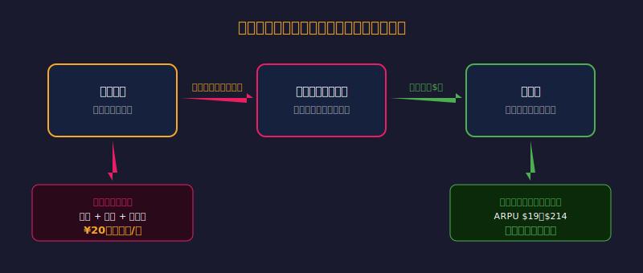
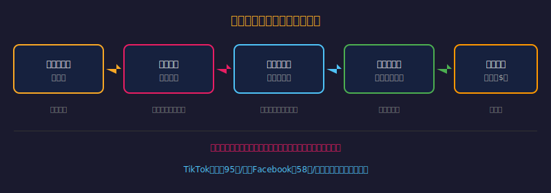
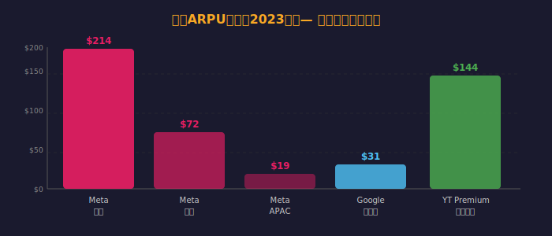
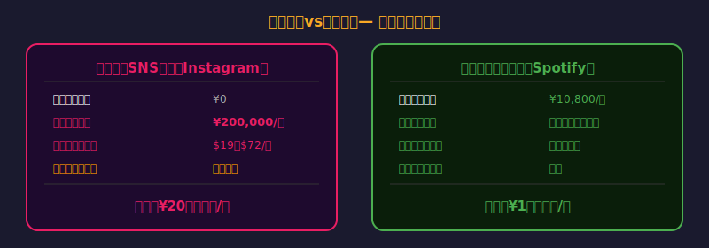

<!-- _class: lead -->
# 「無料」の本当のコスト計算

- 注意経済における時間の値段
- "If you're not paying, you're the product"の定量化
- 見えないコストを可視化する

---

# アジェンダ

- 1. 注意経済とは何か
- 2. あなたの「注意」の市場価格
- 3. SNSの「無料」の実際のコスト
- 4. データは何円で取引されているか
- 5. 真のコストを踏まえた判断

---

<!-- _class: lead -->
# 注意経済の登場

---

# 注意経済のバリューチェーン

- Herbert Simon（1971）：「情報の豊かさは注意の貧しさを生む」
- 人間の「注意（アテンション）」が最も希少なリソースになった経済
- 企業はコンテンツ・UIで注意を奪い合い、広告として販売する

---

# 数字で見る注意の争奪戦

- 人間の平均注意持続時間：**8秒**（2015年Microsoft調査）
- Facebookは平均**58分/日**を確保
- YouTubeは平均**40分/セッション**
- TikTokは平均**95分/日**（2024年）
- ---
- 毎日1〜2時間の「注意」を無意識に「支払っている」

---

<!-- _class: lead -->
# あなたの注意の市場価格

---

# GoogleとMetaの「ユーザー単価」

- **ARPU（Average Revenue Per User）：** 企業が1ユーザーから得る年間収益

---

# Instagramの「真のコスト」計算

- **仮定：** 1日30分のInstagram利用
- 30分/日 × 365日 = **182.5時間/年**
- 日本の平均時給（2024年）：約1,113円 → 時間的コスト：**約20万円/年**

---

# Instagramの精神的コスト

- **精神的コスト（研究より）：**
- 若者のInstagram使用と不安・抑うつの相関が示されている
- Meta内部資料（2021年内部告発）：
- 「Instagramは10代の女子の32%が体への不満を悪化させると知っている」
- ---
- **税務的価値：** Metaが得る$19〜$72の広告収益
- → **あなたは20万円のコストを払い、Metaに$19を渡している**

---

<!-- _class: lead -->
# データの売買価格

---

# あなたのデータは何円で取引されているか

- **データブローカー市場の規模（2024）：** 約3,000億ドル

---

# まとめ：「無料」を正しく評価する

- **「無料」なのはお金だけ。時間・注意・データ・精神的コストがある**
- **Meta・Googleのユーザー単価は$19〜$214** — あなたはそれを「支払っている」
- **時間コストを計算すると多くの「無料」サービスは有料より高い**

