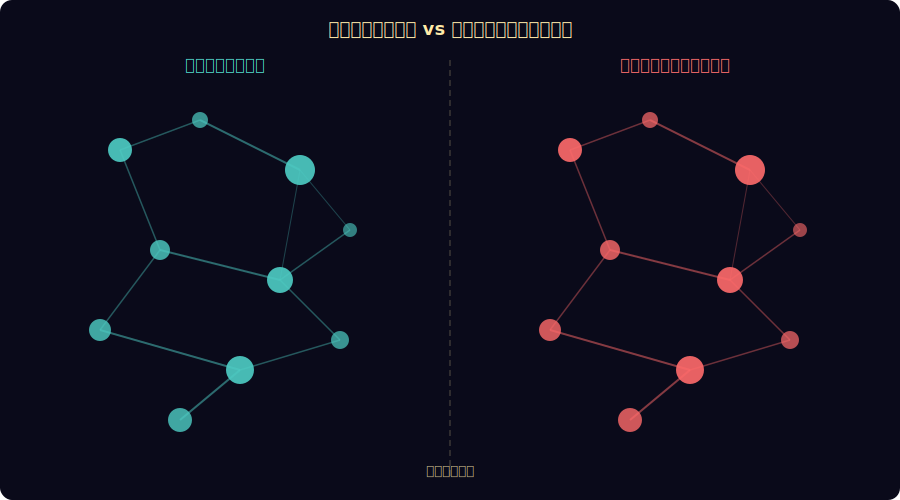
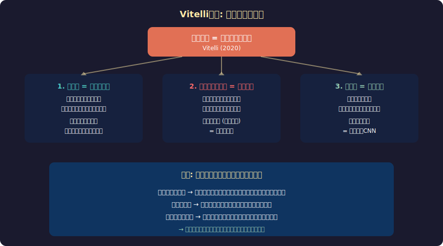
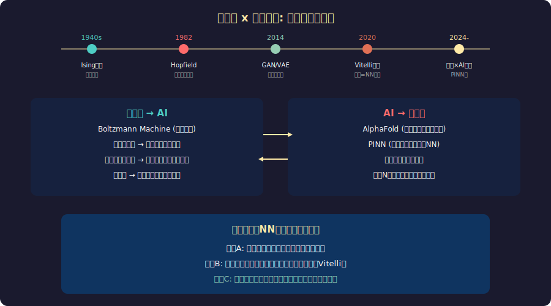

<!-- _class: lead -->
# 宇宙はニューラルネットワークなのか？

- 物理学と深層学習の驚くべき構造的類似性
- 2026-02-20

---

# 目次

- - 1. 宇宙の大規模構造とニューラルネットワーク
- - 2. スケールの驚くべき一致
- - 3. Vitelli仮説：宇宙は学習する
- - 4. 物理学とAIの相互作用
- - 5. 情報理論からの統一的視点
- - 6. この仮説の意味と限界

---

<!-- _class: lead -->
# 1. 宇宙の大規模構造

---

# 宇宙の「ニューラルネットワーク」

---

# 構造的類似性の発見

- - **2020年 Bologna大学の研究** (Vazza & Feletti)
- - 宇宙の大規模構造と脳のニューロンネットワークを定量比較
- - **パワースペクトル分析**で統計的に区別不可能と判明
- - 銀河間フィラメント ≈ 軸索・樹状突起
- - 銀河クラスター ≈ ニューロンの細胞体
- - ボイド（空洞） ≈ シナプス間の空間

---

<!-- _class: lead -->
# 2. スケールの驚くべき一致

---

# 数値で見る宇宙と脳

---

# なぜ同じ数値なのか

- - **ノード数**: 宇宙の銀河 ~10^11 ≈ 脳のニューロン ~10^11
- - **接続密度**: 両方ともスケールフリーネットワーク
- - **活動比率**: 宇宙のバリオン物質 ~5% ≈ 脳の活動ニューロン ~5-10%
- - **クラスタリング係数**: 同等の統計分布
- - スケール差は **27桁** (10^27) だが構造パターンは同一
- - → 自然界の普遍的なネットワーク形成原理？

---

<!-- _class: lead -->
# 3. Vitelli仮説

---

# 「宇宙は文字通りニューラルネットワークである」

---

# 仮説の核心

- - **Vitali Vanchurin (2020)**: "The world as a neural network"
- - 量子力学も一般相対論もNNの近似として導出可能と主張
- - 物理法則は宇宙が「学習」した結果の**重みパラメータ**
- - 最小作用の原理 = 誤差逆伝播法の一般化
- - 物理定数の微調整 = ネットワークの最適化結果

---

# ビッグバンは「学習の開始」

- - **初期状態**: ランダム重み（高エネルギー・高エントロピー）
- - **学習過程**: 宇宙膨張によるエネルギー散逸（勾配降下）
- - **収束**: 現在の物理法則（最適化された重み）
- - **エポック**: 宇宙年齢 138億年 = 学習時間
- - **損失関数**: ハミルトニアン（全系のエネルギー）
- - この解釈では「なぜこの物理法則か？」に答えられる

---

<!-- _class: lead -->
# 4. 物理学とAIの相互作用

---

# 双方向の知的交流

---

# 物理学がAIに与えた概念

- - **Boltzmann Machine** (1985): 統計力学のボルツマン分布を学習に応用
- - **Hopfield Network** (2024年ノーベル物理学賞): スピングラスの理論
- - **繰り込み群 → 深層学習**: 粗視化が多層NNの層構造に対応
- - **変分推論**: 量子力学の変分原理がベイズ推論に
- - **ハミルトニアンMC法**: 物理シミュレーション技法がサンプリングに

---

# AIが物理学を変革する

- - **AlphaFold**: タンパク質の3D構造を予測（50年来の難題を解決）
- - **PINN**: 物理法則を制約に組み込んだニューラルネット
- - **重力波検出**: LIGO信号からのリアルタイム検出をNNが高速化
- - **格子QCD**: 量子色力学の計算をNNで数万倍高速化
- - **宇宙論**: 大規模構造シミュレーションの近似をNNが実現

---

<!-- _class: lead -->
# 5. 情報理論からの統一的視点

---

# 情報は物理の根本か？

- - **「It from Bit」** (John Wheeler, 1990): 情報が物理実在の基盤
- - **ホログラフィック原理**: 3D空間の情報は2D表面にエンコード
- - **ブラックホール情報パラドックス**: 情報は物理的に保存される
- - **量子情報理論**: エンタングルメント = 情報の接続
- - もし宇宙が情報処理なら、NNとの類似は必然かもしれない

---

# エントロピーと学習の統一

- - **ボルツマンエントロピー**: S = k_B ln W（物理の乱雑さ）
- - **シャノンエントロピー**: H = -Σ p log p（情報の不確実性）
- - **交差エントロピー損失**: 深層学習の最も基本的な損失関数
- - これらは全て **同じ数学的構造**
- - 自由エネルギー原理（Friston）: 脳も宇宙も自由エネルギーを最小化
- - → 物理・情報・学習の境界が消える

---

<!-- _class: lead -->
# 6. この仮説の意味と限界

---

# 検証可能性と批判

- - **批判1**: 反証不可能ではないか？（ポパーの基準）
- - **批判2**: 単なるアナロジーの過度な拡大解釈
- - **批判3**: 数学的形式の一致 ≠ 物理的同一性
- - **反論**: 具体的な予測が可能（相転移の振る舞い等）
- - **反論**: 物理定数の値をNN最適化から導出する試み
- - 現時点では「刺激的な仮説」段階

---

# もし本当なら何が変わるか

- - **物理学**: 全ての力の統一が「ネットワーク構造」から自然に導出
- - **AI研究**: 物理法則からより効率的なアーキテクチャのヒント
- - **哲学**: 意識・自由意志に対する新しい枠組み
- - **数学**: なぜ数学が自然を記述できるか（不合理な有効性）への回答
- - **宇宙論**: 物理定数の微調整問題に自然な説明
- - 最も深い問い: **我々は宇宙NNの中の計算プロセスか？**

---

# まとめ

- - 宇宙と脳のネットワーク構造は**統計的に区別不可能**
- - Vitelli仮説: 物理法則は学習された重みパラメータ
- - 物理学とAIは双方向に概念を交換し続けている
- - **情報理論**が両者を統一する言語になりうる
- - 仮説の検証は始まったばかりだが、可能性は革命的
- - 我々は宇宙を理解するために、宇宙が使う言語（NN）を再発明したのかもしれない

---

# 参考文献

- - **研究論文:**
- - Vanchurin, V. (2020) "The world as a neural network"
- - Vazza & Feletti (2020) "The Quantitative Comparison Between the Neuronal Network and the Cosmic Web"
- - **関連書籍:**
- - Wheeler, J.A. "Information, Physics, Quantum" (1990)
- - Friston, K. "The free-energy principle" (2010)

