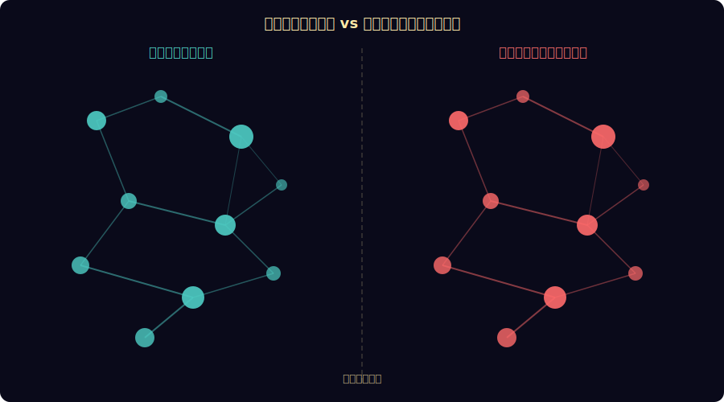
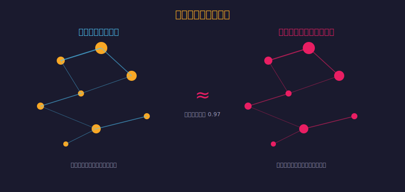
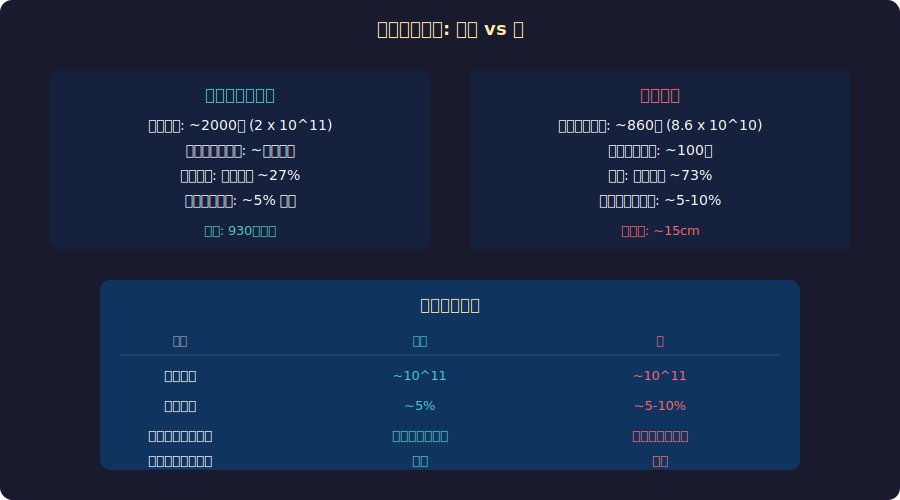
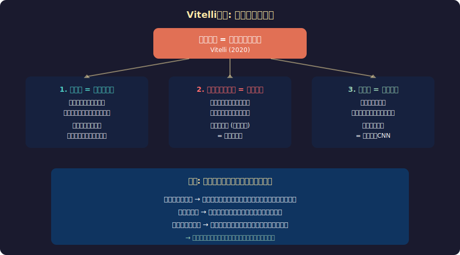
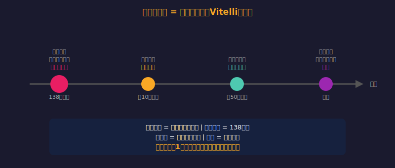
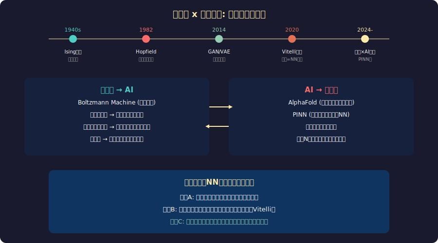
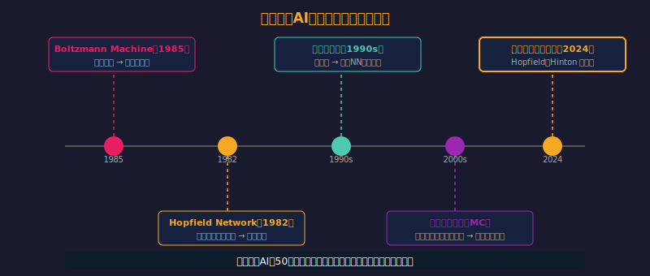
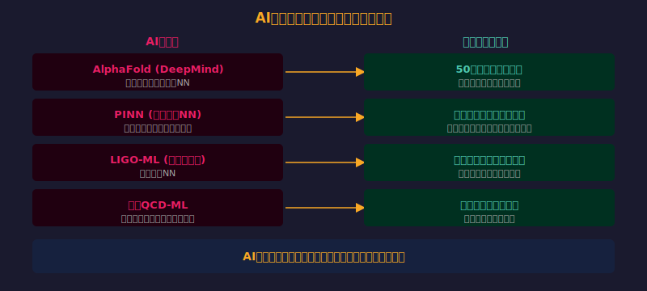
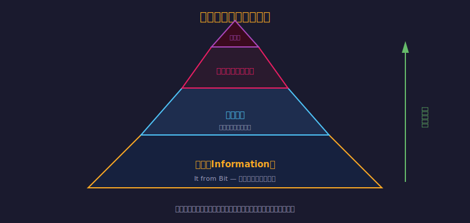
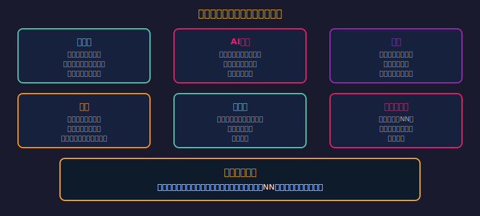

<!-- _class: invert lead -->
# 宇宙はニューラルネットワークなのか？

- 物理学と深層学習の驚くべき構造的類似性
- 2026-02-20

---

<!-- _class: invert fit-82 -->
# 目次

> *6つの視点から宇宙とニューラルネットワークの構造的類似性を体系的に検証する*

- 1. 宇宙の大規模構造とニューラルネットワーク
- 2. スケールの驚くべき一致
- 3. Vitelli仮説：宇宙は学習する
- 4. 物理学とAIの相互作用
- 5. 情報理論からの統一的視点
- 6. この仮説の意味と限界

---

<!-- _class: invert lead -->
# 1. 宇宙の大規模構造

---

# 宇宙の「ニューラルネットワーク」

---

<!-- _class: invert fit-70 -->
# 構造的類似性の発見

> *2020年の定量比較でパワースペクトルが統計的に区別不可能と判明し宇宙とNNの類似を実証*

- **2020年 Bologna大学の研究** (Vazza & Feletti)
- 宇宙の大規模構造と脳のニューロンネットワークを定量比較
- **パワースペクトル分析**で統計的に区別不可能と判明
- 銀河間フィラメント ≈ 軸索・樹状突起
- 銀河クラスター ≈ ニューロンの細胞体
- ボイド（空洞） ≈ シナプス間の空間

---

<!-- _class: invert lead -->
# 2. スケールの驚くべき一致

---

# 数値で見る宇宙と脳

---

<!-- _class: invert fit-64 -->
# なぜ同じ数値なのか

> *スケール差27桁を超えて宇宙と脳が同じネットワーク統計を持つのは自然の普遍則の証拠*

- **ノード数**: 宇宙の銀河 ~10^11 ≈ 脳のニューロン ~10^11
- **接続密度**: 両方ともスケールフリーネットワーク
- **活動比率**: 宇宙のバリオン物質 ~5% ≈ 脳の活動ニューロン ~5-10%
- **クラスタリング係数**: 同等の統計分布
- スケール差は **27桁** (10^27) だが構造パターンは同一
- → 自然界の普遍的なネットワーク形成原理？

---

<!-- _class: invert lead -->
# 3. Vitelli仮説

---

# 「宇宙は文字通りニューラルネットワークである」

---

<!-- _class: invert fit-82 -->
# 仮説の核心

> *物理法則を学習済み重みと解釈することで量子力学と一般相対論を統一的に導出できる*

- **Vitali Vanchurin (2020)**: "The world as a neural network"
- 量子力学も一般相対論もNNの近似として導出可能と主張
- 物理法則は宇宙が「学習」した結果の**重みパラメータ**
- 最小作用の原理 = 誤差逆伝播法の一般化
- 物理定数の微調整 = ネットワークの最適化結果

---

<!-- _class: invert fit-70 -->
# ビッグバンは「学習の開始」

> *138億年の宇宙進化をランダム初期化から現在の物理法則への収束として解釈できる*

- **初期状態**: ランダム重み（高エネルギー・高エントロピー）
- **学習過程**: 宇宙膨張によるエネルギー散逸（勾配降下）
- **収束**: 現在の物理法則（最適化された重み）
- **エポック**: 宇宙年齢 138億年 = 学習時間
- **損失関数**: ハミルトニアン（全系のエネルギー）
- この解釈では「なぜこの物理法則か？」に答えられる

---

<!-- _class: invert lead -->
# 4. 物理学とAIの相互作用

---

# 双方向の知的交流

---

<!-- _class: invert fit-64 -->
# 物理学がAIに与えた概念

> *統計力学・スピングラス・繰り込み群が深層学習の理論的基盤として直接流用されてきた*

- **Boltzmann Machine** (1985): 統計力学のボルツマン分布を学習に応用
- **Hopfield Network** (2024年ノーベル物理学賞): スピングラスの理論
- **繰り込み群 → 深層学習**: 粗視化が多層NNの層構造に対応
- **変分推論**: 量子力学の変分原理がベイズ推論に
- **ハミルトニアンMC法**: 物理シミュレーション技法がサンプリングに

---

<!-- _class: invert fit-70 -->
# AIが物理学を変革する

> *AlphaFoldからLIGO信号検出まで物理の未解決難題をNNが次々と突破している*

- **AlphaFold**: タンパク質の3D構造を予測（50年来の難題を解決）
- **PINN**: 物理法則を制約に組み込んだニューラルネット
- **重力波検出**: LIGO信号からのリアルタイム検出をNNが高速化
- **格子QCD**: 量子色力学の計算をNNで数万倍高速化
- **宇宙論**: 大規模構造シミュレーションの近似をNNが実現

---

<!-- _class: invert lead -->
# 5. 情報理論からの統一的視点

---

<!-- _class: invert fit-70 -->
# 情報は物理の根本か？

> *Wheelerの「It from Bit」からホログラフィー原理まで情報が物理実在の基盤である証拠が揃う*

- **「It from Bit」** (John Wheeler, 1990): 情報が物理実在の基盤
- **ホログラフィック原理**: 3D空間の情報は2D表面にエンコード
- **ブラックホール情報パラドックス**: 情報は物理的に保存される
- **量子情報理論**: エンタングルメント = 情報の接続
- もし宇宙が情報処理なら、NNとの類似は必然かもしれない

---

<!-- _class: invert fit-64 -->
# エントロピーと学習の統一

> *ボルツマン・シャノン・交差エントロピーが同一数学構造であり物理と学習が統一される*

- **ボルツマンエントロピー**: S = k_B ln W（物理の乱雑さ）
- **シャノンエントロピー**: H = -Σ p log p（情報の不確実性）
- **交差エントロピー損失**: 深層学習の最も基本的な損失関数
- これらは全て **同じ数学的構造**
- 自由エネルギー原理（Friston）: 脳も宇宙も自由エネルギーを最小化
- → 物理・情報・学習の境界が消える

---

<!-- _class: invert lead -->
# 6. この仮説の意味と限界

---

<!-- _class: invert fit-70 -->
# 検証可能性と批判

> *反証可能性の問題は残るが物理定数のNN導出という具体的検証経路が提示されている*

- **批判1**: 反証不可能ではないか？（ポパーの基準）
- **批判2**: 単なるアナロジーの過度な拡大解釈
- **批判3**: 数学的形式の一致 ≠ 物理的同一性
- **反論**: 具体的な予測が可能（相転移の振る舞い等）
- **反論**: 物理定数の値をNN最適化から導出する試み
- 現時点では「刺激的な仮説」段階

---

<!-- _class: invert fit-64 -->
# もし本当なら何が変わるか

> *力の統一・AIアーキテクチャ・意識・物理定数の微調整問題すべてに革命的な回答が生まれる*

- **物理学**: 全ての力の統一が「ネットワーク構造」から自然に導出
- **AI研究**: 物理法則からより効率的なアーキテクチャのヒント
- **哲学**: 意識・自由意志に対する新しい枠組み
- **数学**: なぜ数学が自然を記述できるか（不合理な有効性）への回答
- **宇宙論**: 物理定数の微調整問題に自然な説明
- 最も深い問い: **我々は宇宙NNの中の計算プロセスか？**

---

<!-- _class: invert fit-76 -->
# まとめ

> *宇宙とNNの統計的同一性は情報理論を共通言語として物理と学習の境界を消しつつある*

- 宇宙と脳のネットワーク構造は**統計的に区別不可能**
- Vitelli仮説: 物理法則は学習された重みパラメータ
- 物理学とAIは双方向に概念を交換し続けている
- **情報理論**が両者を統一する言語になりうる
- 仮説の検証は始まったばかりだが、可能性は革命的
- 我々は宇宙を理解するために、宇宙が使う言語（NN）を再発明したのかもしれない

---

<!-- _class: invert fit-64 -->
# 参考文献

> *Vazza・Feletti・Vanchurins論文が本講演の主要根拠、Wheeler・Fristonが理論的背景*

- **研究論文:**
- Vanchurin, V. (2020) "The world as a neural network"
- Vazza & Feletti (2020) "The Quantitative Comparison Between the Neuronal Network and the Cosmic Web"
- **関連書籍:**
- Wheeler, J.A. "Information, Physics, Quantum" (1990)
- Friston, K. "The free-energy principle" (2010)

