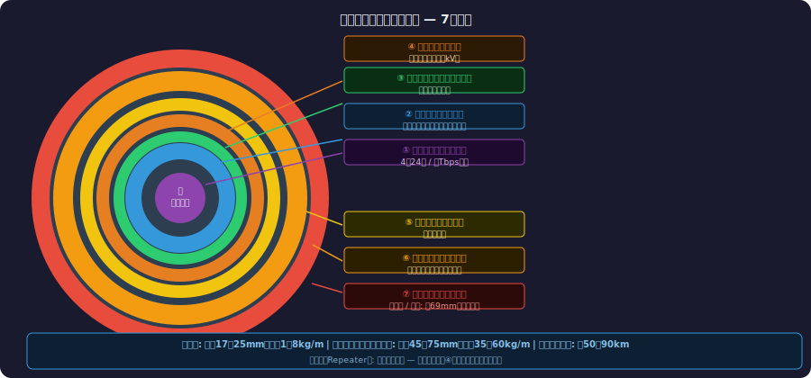
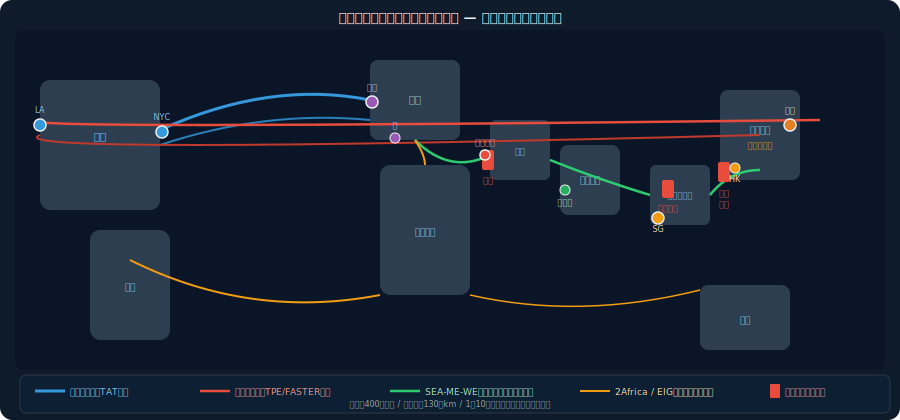
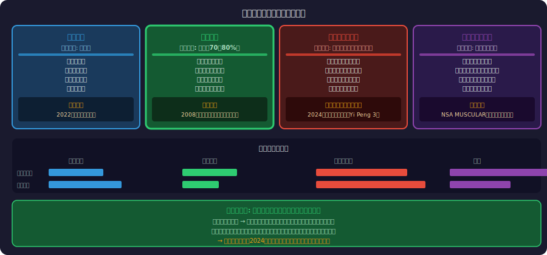
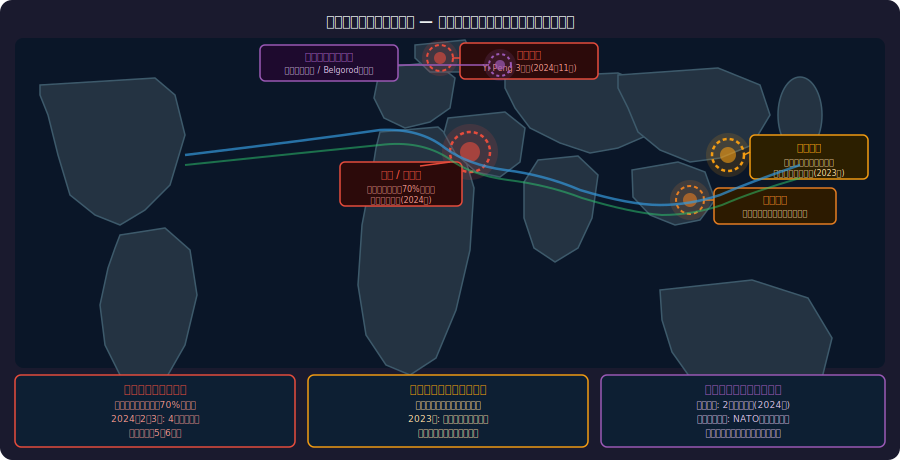
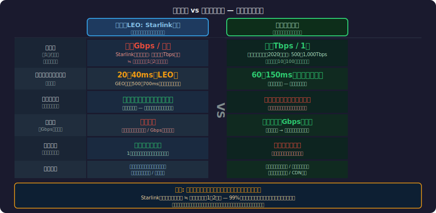

<!-- _class: lead -->
# 海底ケーブルが切れたら

- インターネットの物理的脆弱性
- 
- 2026年2月

---

# アジェンダ

- **Part 1:** 海底ケーブルが支えるインターネット
- **Part 2:** 誰が所有・管理するか
- **Part 3:** なぜ切れるのか — 脅威の分類
- **Part 4:** 地政学的脆弱性
- **Part 5:** 切断されたら何が起きるか
- **Part 6:** 冗長性と対策
- **Part 7:** エンジニアへの示唆

---

<!-- _class: lead -->
# Part 1: 海底ケーブルが支えるインターネット

- 物理インフラの実像

---

# インターネットの99%は海の底にある

- **衛星 vs 海底ケーブルの現実**
- - 全インターネットトラフィックの **99%以上** が海底ケーブル経由
- - 衛星の帯域: 合計でも数Tbps — ケーブルは1本で数百Tbps
- - Starlink全衛星合計でも海底ケーブル1〜2本分の帯域
- 
- **規模感**
- - 世界に **400本以上** の海底ケーブル（総延長: 約130万km）
- - 地球を **30周以上** する長さ
- - 1日の取引額 **10兆ドル以上** の金融決済が通過

---

# 海底ケーブルの物理構造

---

# 世界の海底ケーブルネットワーク

---

# ケーブルの歴史 — 1858年から現代へ

- **通信ケーブルの進化タイムライン**
- - **1858年**: 大西洋横断電信ケーブル（英米間） — 数週間→数分に短縮
- - **1956年**: 初の大西洋電話ケーブル TAT-1（36回線）
- - **1988年**: 初の光ファイバー海底ケーブル TAT-8（40,000回線相当）
- - **2000年代**: インターネットバブルで大量敷設 → 過剰供給
- - **2010年代**: Google/Facebook/Amazonが独自ケーブル参入
- - **2020年代**: AI・クラウドで需要爆発、敷設ラッシュ再燃

---

<!-- _class: lead -->
# Part 2: 誰が所有・管理するか

- 所有構造と権力の非対称

---

# テレコム連合 vs ハイパースケーラー

- **従来型: テレコム企業コンソーシアム**
- - NTT・KDDI・AT&T・Vodafone 等が費用を分担して共同所有
- - 例: SEA-ME-WE 5（欧〜中東〜アジア: 20社超の共同出資）
- 
- **新興: ハイパースケーラーの独自路線**
- - Google: 16本以上（Grace Hopper, Equiano, Curie 等）
- - Meta: 2Africa（アフリカ周回45,000km）、Echo
- - Amazon: AEConnect、Hawaiki など
- - Microsoft: AEC、Marea（MS/Facebook共同）
- - 背景: 帯域コスト削減 + データの流れをコントロール

---

# ハイパースケーラーの独自ケーブル戦略

- **なぜ自前で敷くのか**
- - クラウドサービスの国際トラフィックが急増 → 賃料より所有が安い
- - 品質・容量・ルートを自社コントロール
- - 競合他社（AWS vs Azure vs GCP）への依存を排除
- 
- **数字で見る規模**
- - Google の海底ケーブル総延長: **約100万km以上**（2024年）
- - 2024〜2026年の新規投資: 各社 **数千億円規模**
- - ハイパースケーラー所有比率: 国際帯域の **60%超**（2025年推計）

---

# 海底ケーブル敷設船 — 世界のインフラを担う数十隻

- **敷設船（Cable Ship）の現実**
- - 世界に約 **60〜70隻** のみ（新造に数年・数百億円）
- - 主要オペレーター: SubCom（米）、Alcatel Submarine Networks（仏）、NEC（日）
- 
- **敷設の難しさ**
- - 水深6,000m以上の海底へ精密敷設（誤差数m以内）
- - 1km敷設に数百万〜数千万円のコスト
- - 修理時も同じ船が必要 — **需給逼迫が常態化**
- 
- - 修理依頼から着工まで **数週間〜数ヶ月** 待ちが普通

---

<!-- _class: lead -->
# Part 3: なぜ切れるのか

- 脅威の分類と統計

---

# 脅威の分類

---

# 自然障害 — 地震・海流・津波

- **主な自然障害の事例**
- - **2006年 台湾地震**: 7本のケーブルが同時切断 → 東南アジア全域で通信障害
- - **2007年 台湾**: 台風・土砂流でさらに複数切断、修復に7週間
- - **2022年 トンガ**: 海底火山噴火でケーブル切断 → 島国が数週間孤立
- 
- **海底地形と地震リスク**
- - 大陸棚の縁（水深200〜3000m）が最も危険 — 土砂崩れが発生しやすい
- - 深海部（水深4000m〜）は比較的安定 — 問題は浅い陸揚げ区間

---

# 漁船・アンカー事故（全障害の70〜80%）

- **圧倒的に多い「人的過失」**
- - トロール漁船の網、錨が水深数百mのケーブルを引っ掛ける
- - 統計: 全切断事故の **70〜80%** が漁業・船舶関連
- 
- **なぜ防げないのか**
- - ケーブル敷設位置はIALA海図に記載されるが、遵守は任意
- - 浅い大陸棚（水深200m以下）は保護用コーティングのみ
- - 嵐・視界不良時のアンカー投下は「仕方ない」
- 
- - ケーブル1本当たりの年間切断確率: **約0.1〜0.5回**

---

# 意図的破壊工作の疑惑 — バルト海事件（2024年）

- **2024年11月: バルト海で2本のケーブルが切断**
- - Estlink-2（フィンランド〜エストニア電力ケーブル）
- - Cinia C-Lion 1（フィンランド〜ドイツ通信ケーブル）
- - 同日・同一海域で発生 → 「偶然」の確率は極めて低い
- 
- **疑惑の中心: 中国船「Yi Peng 3」**
- - 切断海域を通過した直後にスウェーデン海域で停船・拒否
- - 数週間にわたりNATO諸国が乗船調査を要求 → 中国側が拒絶
- - アンカーを引きずった痕跡が海底に残存
- 
- - 「グレーゾーン戦争」の典型事例として注目

---

<!-- _class: lead -->
# Part 4: 地政学的脆弱性

- チョークポイントと国家レベルの脅威

---

# 地政学的ホットスポット

---

# チョークポイント — 紅海・台湾海峡・南シナ海

- **紅海 / スエズ運河付近**
- - 欧州〜アジア間のケーブルの **約70%** が通過
- - 2024年: フーシ派攻撃で複数切断 → アフリカ迂回を余儀なくされる
- 
- **台湾海峡**
- - 台湾接続ケーブルの大部分が通過 — 台湾有事で即座に孤立
- - 2023年: 中国船が馬祖諸島のケーブルを2本切断（「事故」扱い）
- 
- **南シナ海**
- - 中国が実効支配する岩礁付近をアジア主要ケーブルが通過
- - 中国の「海上民兵」船による監視・妨害が常態化

---

# ロシアの海底調査船活動

- **ヤンタール号（Yantar）**
- - 表向き「海洋調査船」 — 実態はケーブル切断・盗聴能力を持つ特殊船
- - NATO海底ケーブルルートを繰り返し「調査」
- - 深海潜水艇（AS-12「Losharik」）を搭載
- 
- **Belgorod原子力潜水艦**
- - 「特殊任務」特化の改造原潜
- - 「Poseidon」核魚雷に加え、海底インフラ破壊能力が疑われる
- 
- **NATO の懸念**
- - 「平時」からの情報収集・切断位置の把握が進んでいる可能性
- - 即時切断なしでも「抑止としての脅し」に使える

---

# 盗聴疑惑 — NSAとSEA-ME-WEの暗い関係

- **スノーデン文書が示した実態（2013年〜）**
- - NSAの「MUSCULAR」作戦: Google/Yahoo! のデータセンター間ケーブルを盗聴
- - GCHQの「Tempora」: 英国陸揚げ局でケーブルの生データを大量取得
- 
- **陸揚げ局（Landing Station）が盗聴の急所**
- - ケーブルが陸に上がる地点（陸揚げ局）は物理アクセスが容易
- - 多くの陸揚げ局が「友好国」の領土内にある設計
- 
- **中国リスク**
- - 中国系企業がケーブル出資 → 盗聴バックドアの懸念
- - 米国: HMN Technologies（旧Huawei Marine）排除を推進

---

<!-- _class: lead -->
# Part 5: 切断されたら何が起きるか

- 障害伝播のメカニズムと影響範囲

---

# 2024年スエズ/アフリカ沖障害の実態

- **2024年2〜3月: 紅海で4本同時切断**
- - EIG（ヨーロッパ〜インド・ゲートウェイ）
- - SEA-ME-WE 4 / SEA-ME-WE 5
- - AAE-1（アジア〜アフリカ〜ヨーロッパ）
- 
- **影響の規模**
- - 欧州〜アジア間帯域の **約25〜30%** が喪失
- - インド: 国際帯域の **55%** が影響（数十Tbps消失）
- - アフリカ東部〜中東: レイテンシが2〜5倍に悪化
- 
- - フーシ派攻撃による「副次的損傷」か意図的かは不明

---

# BGPルーティングと障害伝播

- **切断後のトラフィック再ルーティング**
- - BGP（Border Gateway Protocol）が自動で迂回経路を選択
- - 迂回経路: アフリカ南端（喜望峰）回り、衛星、残存ケーブル
- 
- **問題: 容量の壁**
- - 迂回経路の容量 < 元の経路の容量 → 輻輳・パケットロス
- - レイテンシ: 東京〜ロンドン 最短230ms → 迂回で350〜500msに
- 
- **実際の症状**
- - 特定地域向けのクラウドサービスが著しく低速化
- - リアルタイム系（ビデオ会議・オンラインゲーム・FX取引）が使用不能に
- - CDNキャッシュが効くコンテンツは比較的正常

---

# クラウドサービスへの影響シナリオ

- **リージョン間の依存関係が露わになる**
- - マルチリージョン構成でも、同一ケーブルを使う場合は同時障害
- - 例: ap-northeast-1（東京）〜 eu-west-1（アイルランド）間で高遅延
- 
- **実害が出やすいシステム**
- - グローバルデータベース同期（Aurora Global, Spanner）
- - 国際 CDN の Origin Fetch（キャッシュミス時）
- - SaaS の認証サーバーが片側リージョンに集中するケース
- 
- **2022年 META 障害との比較**
- - BGP設定ミスによる「論理的切断」でも6時間のグローバル障害
- - 物理切断はより長期・広範囲・復旧が遥かに困難

---

# 金融システムへの波及 — SWIFTとFX市場

- **金融インフラのケーブル依存**
- - SWIFT: 銀行間国際送金の99%が海底ケーブル経由
- - FX市場: マイクロ秒単位の裁定取引 → レイテンシ増大で市場崩壊
- 
- **2008年 エジプト沖切断事件**
- - SEA-ME-WE 4 と FLAG が同日切断
- - インド: 国際帯域50%消失 → IT企業の業務が数日間停止
- - 中東・南アジアの決済処理に大規模遅延
- 
- **最悪シナリオ**
- - 主要チョークポイント（紅海 + 台湾海峡）の同時切断
- - 試算: グローバルGDPへの1日あたり損害 **数千億円**

---

# 修復にかかる時間とコスト

- **修復の流れ**
- - 障害検知 → 切断位置の特定（OTDR測定）→ 修理船手配 → 修復
- - 深海部: 位置特定に数日、修理船が到着するまで数週間
- 
- **コスト感**
- - 修理1件: **100万〜300万ドル**（浅海〜深海によって大きく変動）
- - 修理船の日当: **数十万ドル**
- 
- **実際の修復期間（実績）**
- - 浅海・近海: 1〜2週間
- - 深海・遠方: 2〜3ヶ月
- - 複数同時切断（2024年紅海事例）: 最長5〜6ヶ月

---

<!-- _class: lead -->
# Part 6: 冗長性と対策

- 現在の防衛と限界

---

# 現在の冗長化設計の限界

- **「複数ケーブルあるから大丈夫」の落とし穴**
- - 複数のケーブルが **同じルート** を通る（海峡・チョークポイント）
- - 同じ陸揚げ局に接続 → 陸揚げ局が破壊されると全滅
- - 地震断層ゾーン上をケーブルが束になって通過するケース多数
- 
- **容量の非対称**
- - 主要ルートと迂回ルートでは **5〜10倍** の容量差
- - 迂回時は帯域の大幅制限か優先制御が必須
- 
- **修理船の不足**
- - 需要急増に対して修理船の増備が追いついていない（建造に5〜7年）

---

# 衛星通信（Starlink/OneWeb）は代替になるか

---

# 各国の監視・防衛強化の動き

- **EU: 海底インフラ保護指令（2023年〜）**
- - 重要インフラの脆弱性評価を義務化
- - 加盟国の海底インフラ保護計画の策定要求
- 
- **英国**
- - 海底ケーブルを「重要国家インフラ」に指定
- - Royal Navy による定期パトロール開始
- 
- **日本**
- - 経済安保推進法（2022年）: 海底ケーブルを特定重要インフラに追加
- - KDDI/NTT: 国内陸揚げ局の冗長化・強化を推進
- 
- **米国**
- - 中国系企業（HMN Technologies）の米国向けケーブル工事を禁止

---

# NATOの海底インフラ保護戦略

- **NATO海底インフラ調整セル（2023年設立）**
- - 加盟国の海底インフラ情報を統合・共有
- - 異常活動の早期警戒システム構築
- 
- **海底監視の強化**
- - 水中ドローン・音響センサーネットワークの展開
- - DIANA（防衛加速革新のための同盟機関）で技術開発
- 
- **課題**
- - 「グレーゾーン攻撃」への法的・外交的対応が未整備
- - 平時に切断されても「武力攻撃」と認定しにくい
- - 5条（集団的自衛権）の発動基準が曖昧

---

<!-- _class: lead -->
# Part 7: エンジニアへの示唆

- 設計思想の転換点

---

# インフラ依存の再認識

- **「クラウドは海の底」という認識**
- - クラウドのグローバルリージョン間通信も物理ケーブルに依存
- - 「可用性99.99%」の保証は単一リージョン内の話
- 
- **エンジニアが見落としがちな仮定**
- - 「国際ネットワークは常に繋がっている」
- - 「マルチリージョン = 障害耐性がある」
- - 「CDNがあればオリジン障害は関係ない」
- 
- **実際の設計に必要な問い**
- - 国際通信が数時間〜数日間失われたら何が壊れるか？
- - 特定リージョン間の通信遅延が10倍になっても動くか？

---

# 障害時アーキテクチャの考慮点

- **ケーブル障害を前提とした設計パターン**
- - **地理的分散**: 同一チョークポイントを通らない複数経路
- - **非同期化**: クリティカルパスから国際通信を外す
- - **ローカルキャッシュ強化**: 海外オリジンへの依存を減らす
- 
- **SLA・契約の見直し**
- - 国際ケーブル障害は「フォースマジュール（不可抗力）」扱いが多い
- - SLAの免責条項を確認: クラウドベンダーの責任範囲はどこまでか
- 
- **障害訓練**
- - 「国際通信をブロック」した状態でのカオスエンジニアリング実施
- - 地域間レイテンシを意図的に劣化させたテスト

---

<!-- _class: lead -->
# まとめ

- **5つのキーメッセージ**
- 
- 1. インターネットは「雲」ではなく「海底の線」で動いている
- 2. 切断の70〜80%は漁船・アンカー — 地味だが防ぎにくい
- 3. チョークポイント（紅海・台湾海峡）は構造的脆弱性
- 4. 衛星は補完にはなるが、ケーブルの代替にはならない
- 5. 「国際通信断絶」を設計の前提に組み込む時代が来ている

---

# 参考文献・リソース

- **インフラ・技術解説**
- - [TeleGeography: Submarine Cable Map](https://www.submarinecablemap.com/)
- - [ICPC (International Cable Protection Committee)](https://www.iscpc.org/)
- - [ITU-T G.978: 海底ケーブルシステム標準](https://www.itu.int/)
- 
- **地政学・安全保障**
- - [Atlantic Council: Invisible and Vital (2021)](https://www.atlanticcouncil.org/)
- - [CSIS: Undersea Cables: Indispensable, Insecure (2019)](https://www.csis.org/)
- - [NATO: Critical Undersea Infrastructure Protection](https://www.nato.int/)
- 
- **事件・事例**
- - [2024年バルト海ケーブル切断報道 — Reuters/BBC]
- - [2024年紅海ケーブル障害 — TeleGeography Research]

