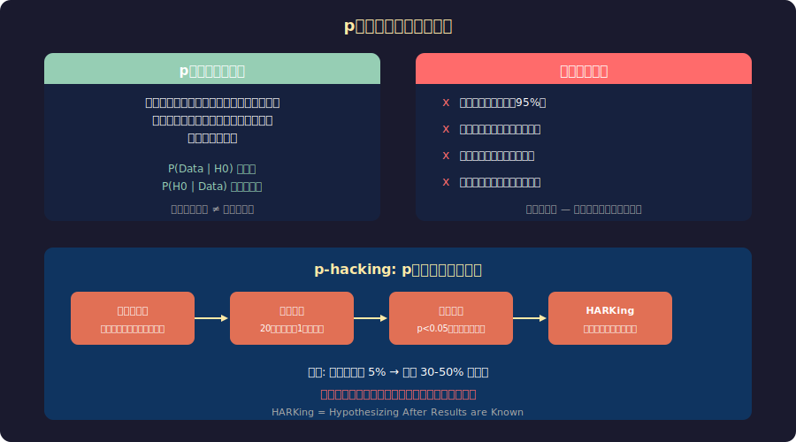
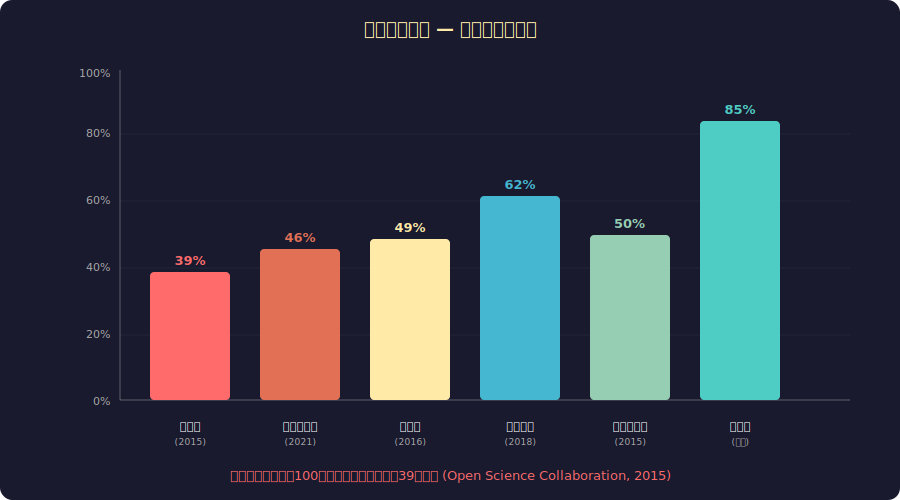

<!-- _class: lead -->
# p値の罠と再現性の危機

- 統計学が科学を騙すとき
- 2026-02-20

---

# 目次

- - 1. p値とは何か — 正しい定義
- - 2. p値の誤解と悪用
- - 3. 再現性の危機
- - 4. なぜこうなったのか
- - 5. 改革の動き
- - 6. エンジニアへの教訓

---

<!-- _class: lead -->
# 1. p値とは何か

---

# p値の誕生

- - **Ronald Fisher** (1925): 統計的検定の枠組みを提唱
- - 「p値は仮説を棄却するかの指標」として導入
- - Fisher自身は **0.05を絶対的閾値にするつもりはなかった**
- - 「便利な目安」のはずが「科学の門番」に
- - 100年後、科学界は0.05に支配されている

---

# p値の正しい意味と誤解

---

<!-- _class: lead -->
# 2. p値の悪用

---

# p-hacking: 統計的「不正」

- - **データドレッジング**: 20変数を試せば1つは偶然 p<0.05
- - **途中解析**: p<0.05になった瞬間にデータ収集を停止
- - **選択的報告**: 有意な結果だけ論文にする
- - **HARKing**: 結果を見てから仮説を「予測していた」と記述
- - **サンプルサイズ操作**: 有意になるまで被験者を追加
- - 意図的でなくても「研究者の自由度」が偽陽性を生む

---

# 「チョコレートでダイエット」実験

- - **2015年**: 科学ジャーナリストが意図的にp-hackingを実演
- - 15人の被験者で18種類の測定項目を同時測定
- - 「ダークチョコレートが減量を促進」(p=0.04) を「発見」
- - 多重比較補正なし → 偶然の一致を「有意」と報告
- - 複数の主要メディアが真面目に報道
- - → p<0.05だけで結果を信じる危険性を世界に示した

---

<!-- _class: lead -->
# 3. 再現性の危機

---

# 分野別の再現率

---

# 衝撃的な数字

- - **心理学**: 100本中39本のみ再現 (Open Science Collaboration, 2015)
- - **がん研究**: 53本中6本のみ再現 (Amgen, 2012)
- - **経済学**: 実験経済学の49%のみ再現 (Camerer et al., 2016)
- - **前臨床医学**: 約50%が再現不可能
- - 製薬業界の損失: 年間 **280億ドル** (再現不可能な研究への投資)
- - 科学への信頼危機: 一般市民の科学不信を助長

---

<!-- _class: lead -->
# 4. なぜこうなったのか

---

# 構造的な問題

- - **出版バイアス**: 有意な結果だけが論文として出版される
- - **Publish or Perish**: 論文数がキャリアを決める圧力
- - **統計教育の不足**: 多くの研究者がp値を正しく理解していない
- - **サンプルサイズ不足**: 検出力(power)が低い研究が多すぎる
- - **事前登録の欠如**: 仮説を後から変更できてしまう
- - → 「有意な結果を出す」インセンティブが歪みを生む

---

# ファイルドロワー問題

- - 「有意でない」結果は引き出し(file drawer)にしまわれる
- - 出版された研究は「成功」のみ = 生存者バイアス
- - 100チームが同じ実験 → 5チームが偶然 p<0.05 → 5本だけ出版
- - 読者は「5/5=100%成功」と誤認する
- - メタアナリシスも出版バイアスの影響を受ける

---

<!-- _class: lead -->
# 5. 改革の動き

---

# 統計改革の提案

- - **閾値の引き下げ**: p<0.005 を新基準に (Benjamin et al., 2018)
- - **事前登録**: 仮説・分析手法を事前に公開登録
- - **Registered Reports**: 結果の前にピアレビュー
- - **効果量と信頼区間**: p値だけでなく実質的な意味を報告
- - **ベイズ統計**: 事前知識を組み込んだ合理的推論
- - **オープンデータ**: データ・コードの公開で検証可能に

---

# ASAの歴史的声明 (2016)

- - **アメリカ統計学会**が175年の歴史で初めてp値に公式声明
- - 「p値は仮説が真である確率ではない」
- - 「p値だけで科学的結論を下すべきでない」
- - 「p<0.05を超えたかだけで有意/非有意と二分してはならない」
- - 2019年にはさらに踏み込み「統計的有意性を廃止せよ」
- - → 科学のあり方を根本から問い直す動き

---

<!-- _class: lead -->
# 6. エンジニアへの教訓

---

# A/Bテストでの応用

- - A/Bテストも本質的に統計的検定 → 同じ罠がある
- - **やりがちなミス**:
-   - 途中でp<0.05になったら「勝者」と判定
-   - 複数のメトリクスを同時測定して有意なものだけ報告
-   - サンプルサイズを事前に決めない
- - **ベストプラクティス**:
-   - 事前にサンプルサイズと評価期間を決定
-   - 多重比較補正(Bonferroni等)を適用
-   - 効果量と実務的意味を重視する

---

# まとめ

- - p値は「効果がある確率」ではない — よくある致命的誤解
- - 再現性の危機: 科学論文の半数以上が再現不可能な分野も
- - 構造的インセンティブの歪みが問題の根本原因
- - 事前登録・オープンデータ・ベイズ統計が改革の柱
- - エンジニアのA/Bテストにも同じ教訓が当てはまる
- - 「統計的に有意」は「正しい」を意味しない

---

# 参考文献

- - **研究・データ:**
- - Open Science Collaboration (2015) "Estimating the reproducibility of psychological science"
- - Ioannidis, J.P.A. (2005) "Why Most Published Research Findings Are False"
- - **公式声明:**
- - ASA Statement on Statistical Significance and P-Values (2016)
- - Amrhein, Greenland, McShane (2019) "Retire statistical significance"

