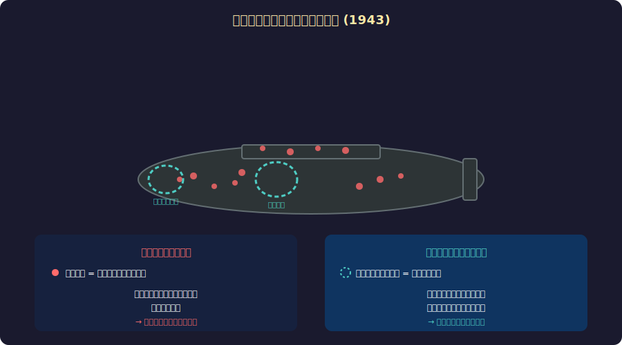
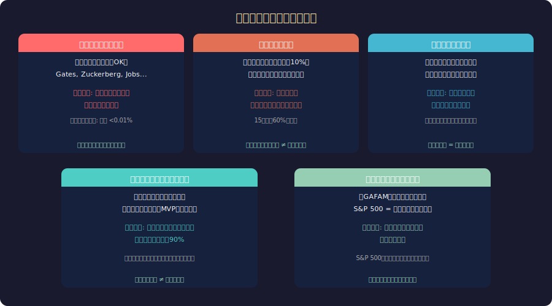

<!-- _class: lead -->
# 生存者バイアス

- 見えないデータが語る真実
- 2026-02-20

---

# 目次

- - 1. ウォルドと戦闘機の話
- - 2. 生存者バイアスとは
- - 3. 日常に潜む生存者バイアス
- - 4. テクノロジー業界での影響
- - 5. バイアスの回避法
- - 6. まとめと教訓

---

<!-- _class: lead -->
# 1. ウォルドと戦闘機

---

# 第二次世界大戦の統計学者

---

# エイブラハム・ウォルドの天才

- - **1943年**: 米軍が「帰還機の被弾箇所を装甲強化」を計画
- - ウォルドの反論: 「帰還した機体は、被弾しても飛べた証拠」
- - **帰ってこなかった機体**こそ、致命的な被弾箇所を示す
- - エンジンとコックピット — 被弾の少ない箇所こそ装甲が必要
- - この洞察で数千人のパイロットの命が救われた
- - 「見えないデータ」の重要性を示す歴史的事例

---

<!-- _class: lead -->
# 2. 生存者バイアスとは

---

# 定義と構造

- - **生存者バイアス** (Survivorship Bias):
- - 「成功した/生き残った」ものだけが目に見え、失敗・脱落したものが見えない
- - 結果として、成功の確率や特徴を過大評価してしまう認知バイアス
- - **構造**: 選択過程が存在するが、観察者にはその過程が見えない
- - 残ったサンプルだけで全体を判断 → 系統的に歪んだ結論
- - 「成功の共通点」≠「成功の原因」という誤りの根源

---

<!-- _class: lead -->
# 3. 日常の生存者バイアス

---

# 身近な例

---

# メディアが強化するバイアス

- - **成功物語**: ニュースは成功者を報道し、失敗者を無視する
- - **自己啓発書**: 成功者の回顧録が「法則」として語られる
- - **SNS**: 成功・幸福だけが共有され、失敗は隠される
- - **グルメサイト**: 生き残った店だけが掲載される
- - **書評**: 読まれた(=生き残った)本だけがレビューされる
- - 我々が触れる情報の大半は「生存者」のデータ

---

<!-- _class: lead -->
# 4. テクノロジー業界での影響

---

# スタートアップ神話

- - 「ガレージから始まったApple/Google/Amazon」
- - → ガレージから始めて消えたスタートアップは数百万社
- - **Y Combinator** 採択企業でも成功率は限定的
- - 「ピボットで成功」→ ピボットしても失敗する方が多い
- - 「PMF (Product-Market Fit) を見つけろ」→ 見つけられない方が圧倒的多数
- - 成功法則の本は生存者のデータしか分析していない

---

# ソフトウェア開発での例

- - **「マイクロサービスは正解」**: 成功事例(Netflix等)だけ参照
- - → マイクロサービスで失敗したプロジェクトは語られない
- - **「Rustで書き直せ」**: 成功したリライトだけが話題に
- - → 失敗したリライトプロジェクトは闇に葬られる
- - **「アジャイルで生産性UP」**: 成功チームだけが事例発表
- - 技術選定もバイアスの影響を強く受ける

---

<!-- _class: lead -->
# 5. バイアスの回避法

---

# 対策フレームワーク

- - **1. 失敗事例を積極的に探す**: 成功者と同じことをして失敗した人は？
- - **2. 母集団を意識する**: 成功者は全体の何%か？
- - **3. 選択過程を明示する**: どのフィルタでこのデータが残ったか？
- - **4. 逆を考える**: もしこの仮説が間違いなら何が見えるべきか？
- - **5. ベースレートを確認する**: 何もしなかった場合の成功率は？
- - **6. プレモーテム**: 「このプロジェクトが失敗した理由を事前に想像する」

---

# データ分析での実践

- - **チャーン分析**: 離脱ユーザーのデータこそ重要
- - **A/Bテスト**: 途中離脱(アトリション)を無視しない
- - **採用面接**: 「成功した社員の共通点」だけでなく「辞めた社員の共通点」も
- - **障害分析**: 「起きなかった障害」からも学ぶ (ニアミス分析)
- - **ポストモーテム**: 成功プロジェクトも「何が運だったか」を振り返る

---

# まとめ

- - 生存者バイアス = 見えるデータだけで判断する系統的な誤り
- - ウォルドの教訓: **見えないデータ**にこそ真実がある
- - スタートアップ、投資、技術選定...あらゆる場面で影響
- - 対策: 失敗事例を探す、母集団を意識する、逆を考える
- - 「成功者の共通点」は成功の原因とは限らない
- - 最も価値ある情報は、しばしば目に見えない場所にある

---

# 参考文献

- - **書籍:**
- - Taleb, N.N. "The Black Swan" (2007)
- - Ellenberg, J. "How Not to Be Wrong" (2014)
- - **研究:**
- - Wald, A. (1943) "A Method of Estimating Plane Vulnerability"
- - Brown, S.J. et al. (1992) "Survivorship Bias in Performance Studies"

