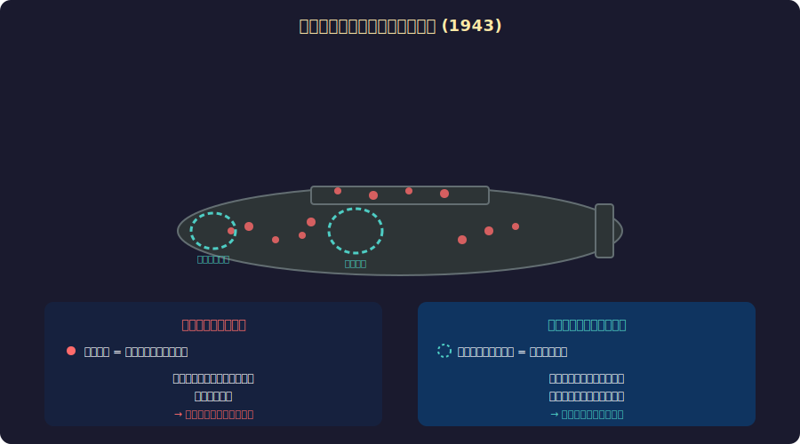
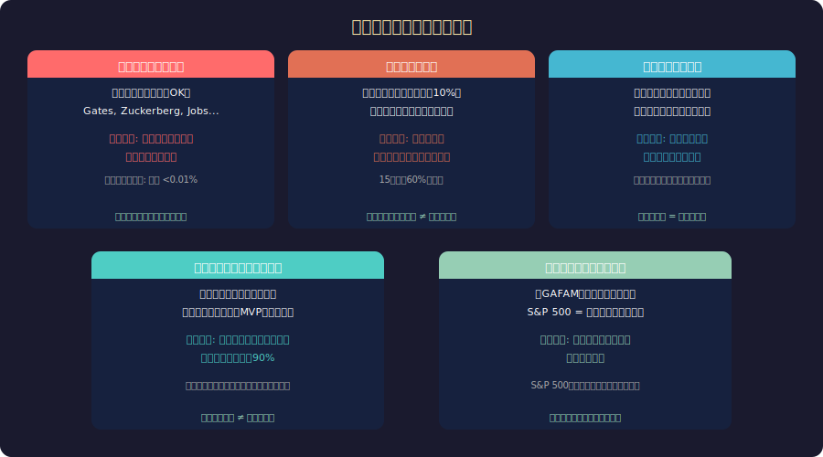

<!-- _class: lead -->
# 生存者バイアス

- 見えないデータが語る真実
- 2026-02-20
- <svg viewBox="0 0 800 200" style="max-height:70vh;max-width:100%;display:block;margin:0 auto;"><rect width="800" height="200" fill="#1a1a2e"/><text x="400" y="80" text-anchor="middle" fill="#f9a825" font-size="28" font-weight="bold" font-family="sans-serif">生存者バイアス</text><text x="400" y="120" text-anchor="middle" fill="#ffffff" font-size="18" font-family="sans-serif">Survivorship Bias</text><line x1="200" y1="140" x2="600" y2="140" stroke="#e91e63" stroke-width="2"/><text x="400" y="170" text-anchor="middle" fill="#aaaaaa" font-size="14" font-family="sans-serif">見えるもの vs 見えないもの</text></svg>

---

# 目次

> *生存者だけを分析すると失敗の原因が永遠に視野から消える*

- - 1. ウォルドと戦闘機の話
- - 2. 生存者バイアスとは
- - 3. 日常に潜む生存者バイアス
- - 4. テクノロジー業界での影響
- - 5. バイアスの回避法
- - 6. まとめと教訓

---

<!-- _class: lead -->
# 1. ウォルドと戦闘機

---

# 第二次世界大戦の統計学者

- <svg viewBox="0 0 800 100" style="max-height:70vh;max-width:100%;display:block;margin:0 auto;"><rect width="800" height="100" fill="#1a1a2e"/><rect x="20" y="15" width="360" height="65" rx="8" fill="#2a1a1a" stroke="#e91e63" stroke-width="2"/><text x="200" y="42" text-anchor="middle" fill="#e91e63" font-size="13" font-family="sans-serif" font-weight="bold">軍の依頼（1943年）</text><text x="200" y="64" text-anchor="middle" fill="#aaa" font-size="11" font-family="sans-serif">帰還機の被弾箇所を強化せよ</text><rect x="420" y="15" width="360" height="65" rx="8" fill="#1a2e1a" stroke="#4caf50" stroke-width="2"/><text x="600" y="42" text-anchor="middle" fill="#4caf50" font-size="13" font-family="sans-serif" font-weight="bold">ウォルド（統計学者）の反論</text><text x="600" y="64" text-anchor="middle" fill="#aaa" font-size="11" font-family="sans-serif">弾痕がない箇所こそ強化が必要</text><polygon points="383,47 415,47 407,40 407,54" fill="#f9a825"/></svg>

---

# エイブラハム・ウォルドの天才

> *ウォルドは被弾していない部分こそ補強すべきと逆転発想した*

- <svg viewBox="0 0 800 320" style="max-height:70vh;max-width:100%;display:block;margin:0 auto;"><rect width="800" height="320" fill="#1a1a2e"/><rect x="30" y="20" width="340" height="280" rx="10" fill="#16213e" stroke="#e91e63" stroke-width="2"/><text x="200" y="50" text-anchor="middle" fill="#e91e63" font-size="16" font-weight="bold" font-family="sans-serif">軍の当初の判断</text><text x="200" y="80" text-anchor="middle" fill="#ffffff" font-size="13" font-family="sans-serif">帰還機の被弾箇所を強化せよ</text><circle cx="200" cy="160" r="60" fill="none" stroke="#aaaaaa" stroke-width="1" stroke-dasharray="4 4"/><text x="200" y="185" text-anchor="middle" fill="#aaaaaa" font-size="22" font-family="sans-serif">✈</text><circle cx="150" cy="130" r="8" fill="#e91e63" opacity="0.8"/><circle cx="180" cy="155" r="8" fill="#e91e63" opacity="0.8"/><circle cx="230" cy="140" r="8" fill="#e91e63" opacity="0.8"/><circle cx="210" cy="170" r="8" fill="#e91e63" opacity="0.8"/><text x="200" y="260" text-anchor="middle" fill="#888888" font-size="12" font-family="sans-serif">● = 弾痕（帰還機）</text><rect x="430" y="20" width="340" height="280" rx="10" fill="#16213e" stroke="#f9a825" stroke-width="2"/><text x="600" y="50" text-anchor="middle" fill="#f9a825" font-size="16" font-weight="bold" font-family="sans-serif">ウォルドの洞察</text><text x="600" y="75" text-anchor="middle" fill="#ffffff" font-size="13" font-family="sans-serif">弾痕がない場所こそ強化が必要</text><circle cx="600" cy="160" r="60" fill="none" stroke="#aaaaaa" stroke-width="1" stroke-dasharray="4 4"/><text x="600" y="185" text-anchor="middle" fill="#aaaaaa" font-size="22" font-family="sans-serif">✈</text><circle cx="600" cy="130" r="8" fill="#f9a825" opacity="0.9"/><circle cx="620" cy="155" r="8" fill="#f9a825" opacity="0.9"/><text x="560" y="130" text-anchor="middle" fill="#f9a825" font-size="11" font-family="sans-serif">エンジン</text><text x="560" y="155" text-anchor="middle" fill="#f9a825" font-size="11" font-family="sans-serif">コックピット</text><text x="600" y="255" text-anchor="middle" fill="#f9a825" font-size="12" font-family="sans-serif">● = 強化すべき箇所</text><text x="600" y="275" text-anchor="middle" fill="#888888" font-size="11" font-family="sans-serif">（帰還できなかった機体の被弾箇所）</text><polygon points="390,160 410,150 410,170" fill="#ffffff"/></svg>
- - **1943年**: 米軍が「帰還機の被弾箇所を装甲強化」を計画
- - ウォルドの反論: 「帰還した機体は、被弾しても飛べた証拠」
- - **帰ってこなかった機体**こそ、致命的な被弾箇所を示す
- - エンジンとコックピット — 被弾の少ない箇所こそ装甲が必要

---

<!-- _class: lead -->
# 2. 生存者バイアスとは

---

# 定義と構造

> *生存者だけを観察すると失敗した多数が視野から消える*

- <svg viewBox="0 0 800 280" style="max-height:70vh;max-width:100%;display:block;margin:0 auto;"><rect width="800" height="280" fill="#1a1a2e"/><rect x="20" y="30" width="180" height="220" rx="8" fill="#16213e" stroke="#888888" stroke-width="1"/><text x="110" y="60" text-anchor="middle" fill="#aaaaaa" font-size="14" font-family="sans-serif">母集団</text><text x="110" y="85" text-anchor="middle" fill="#888888" font-size="12" font-family="sans-serif">（成功・失敗すべて）</text><circle cx="70" cy="120" r="12" fill="#f9a825"/><circle cx="110" cy="110" r="12" fill="#f9a825"/><circle cx="150" cy="125" r="12" fill="#f9a825"/><circle cx="80" cy="155" r="12" fill="#444466"/><circle cx="120" cy="160" r="12" fill="#444466"/><circle cx="155" cy="150" r="12" fill="#444466"/><circle cx="70" cy="195" r="12" fill="#444466"/><circle cx="110" cy="200" r="12" fill="#444466"/><circle cx="150" cy="190" r="12" fill="#444466"/><rect x="320" y="70" width="60" height="140" rx="4" fill="#16213e" stroke="#e91e63" stroke-width="2"/><text x="350" y="100" text-anchor="middle" fill="#e91e63" font-size="12" font-family="sans-serif">選択</text><text x="350" y="118" text-anchor="middle" fill="#e91e63" font-size="12" font-family="sans-serif">フィルタ</text><text x="350" y="158" text-anchor="middle" fill="#888888" font-size="11" font-family="sans-serif">失敗者</text><text x="350" y="174" text-anchor="middle" fill="#888888" font-size="11" font-family="sans-serif">は</text><text x="350" y="190" text-anchor="middle" fill="#888888" font-size="11" font-family="sans-serif">消える</text><rect x="500" y="50" width="180" height="180" rx="8" fill="#16213e" stroke="#f9a825" stroke-width="2"/><text x="590" y="80" text-anchor="middle" fill="#f9a825" font-size="14" font-family="sans-serif">観察可能な集合</text><text x="590" y="100" text-anchor="middle" fill="#888888" font-size="12" font-family="sans-serif">（生存者のみ）</text><circle cx="550" cy="140" r="14" fill="#f9a825"/><circle cx="590" cy="130" r="14" fill="#f9a825"/><circle cx="630" cy="145" r="14" fill="#f9a825"/><text x="590" y="210" text-anchor="middle" fill="#e91e63" font-size="13" font-family="sans-serif">これだけで判断 → バイアス発生</text><polygon points="205,160 315,160 305,150 305,170" fill="#888888"/><polygon points="385,140 495,140 485,130 485,150" fill="#888888"/><text x="255" y="240" text-anchor="middle" fill="#444466" font-size="11" font-family="sans-serif">●=失敗者（見えない）</text><text x="590" y="240" text-anchor="middle" fill="#f9a825" font-size="11" font-family="sans-serif">●=成功者（見える）</text></svg>
- - **生存者バイアス**: 成功した/生き残ったものだけが目に見える
- - 失敗・脱落したものが見えず、成功確率を過大評価してしまう
- - **構造**: 選択過程が存在するが、観察者にはその過程が見えない
- - 残ったサンプルだけで全体を判断 → 系統的に歪んだ結論

---

<!-- _class: lead -->
# 3. 日常の生存者バイアス

---

# 身近な例

---

# メディアが強化するバイアス

- <svg viewBox="0 0 800 300" style="max-height:70vh;max-width:100%;display:block;margin:0 auto;"><rect width="800" height="300" fill="#1a1a2e"/><rect x="20" y="20" width="760" height="60" rx="8" fill="#16213e" stroke="#e91e63" stroke-width="1"/><text x="400" y="45" text-anchor="middle" fill="#e91e63" font-size="16" font-weight="bold" font-family="sans-serif">メディアフィルター: 見せるもの vs 隠すもの</text><text x="400" y="68" text-anchor="middle" fill="#888888" font-size="13" font-family="sans-serif">情報源は常に「生存した」コンテンツを選択して提供する</text><rect x="20" y="100" width="140" height="180" rx="6" fill="#16213e" stroke="#555577" stroke-width="1"/><text x="90" y="125" text-anchor="middle" fill="#f9a825" font-size="13" font-weight="bold" font-family="sans-serif">ニュース</text><text x="90" y="148" text-anchor="middle" fill="#ffffff" font-size="11" font-family="sans-serif">✓ 億万長者の話</text><text x="90" y="168" text-anchor="middle" fill="#ffffff" font-size="11" font-family="sans-serif">✓ IPO成功事例</text><text x="90" y="195" text-anchor="middle" fill="#444466" font-size="11" font-family="sans-serif">✗ 廃業した1000社</text><text x="90" y="215" text-anchor="middle" fill="#444466" font-size="11" font-family="sans-serif">✗ 失職した起業家</text><rect x="175" y="100" width="140" height="180" rx="6" fill="#16213e" stroke="#555577" stroke-width="1"/><text x="245" y="125" text-anchor="middle" fill="#f9a825" font-size="13" font-weight="bold" font-family="sans-serif">SNS</text><text x="245" y="148" text-anchor="middle" fill="#ffffff" font-size="11" font-family="sans-serif">✓ 旅行・グルメ写真</text><text x="245" y="168" text-anchor="middle" fill="#ffffff" font-size="11" font-family="sans-serif">✓ 成功の投稿</text><text x="245" y="195" text-anchor="middle" fill="#444466" font-size="11" font-family="sans-serif">✗ 日常の失敗</text><text x="245" y="215" text-anchor="middle" fill="#444466" font-size="11" font-family="sans-serif">✗ 落ち込んだ日</text><rect x="330" y="100" width="140" height="180" rx="6" fill="#16213e" stroke="#555577" stroke-width="1"/><text x="400" y="125" text-anchor="middle" fill="#f9a825" font-size="13" font-weight="bold" font-family="sans-serif">ビジネス書</text><text x="400" y="148" text-anchor="middle" fill="#ffffff" font-size="11" font-family="sans-serif">✓ 成功CEOの哲学</text><text x="400" y="168" text-anchor="middle" fill="#ffffff" font-size="11" font-family="sans-serif">✓ 逆境からの復活</text><text x="400" y="195" text-anchor="middle" fill="#444466" font-size="11" font-family="sans-serif">✗ 同じ哲学で失敗</text><text x="400" y="215" text-anchor="middle" fill="#444466" font-size="11" font-family="sans-serif">✗ 復活できなかった人</text><rect x="485" y="100" width="140" height="180" rx="6" fill="#16213e" stroke="#555577" stroke-width="1"/><text x="555" y="125" text-anchor="middle" fill="#f9a825" font-size="13" font-weight="bold" font-family="sans-serif">レビューサイト</text><text x="555" y="148" text-anchor="middle" fill="#ffffff" font-size="11" font-family="sans-serif">✓ 今ある店のみ</text><text x="555" y="168" text-anchor="middle" fill="#ffffff" font-size="11" font-family="sans-serif">✓ 開業した店</text><text x="555" y="195" text-anchor="middle" fill="#444466" font-size="11" font-family="sans-serif">✗ 閉店した店</text><text x="555" y="215" text-anchor="middle" fill="#444466" font-size="11" font-family="sans-serif">✗ 開業失敗の話</text><rect x="640" y="100" width="140" height="180" rx="6" fill="#16213e" stroke="#555577" stroke-width="1"/><text x="710" y="125" text-anchor="middle" fill="#f9a825" font-size="13" font-weight="bold" font-family="sans-serif">投資情報</text><text x="710" y="148" text-anchor="middle" fill="#ffffff" font-size="11" font-family="sans-serif">✓ 高リターンファンド</text><text x="710" y="168" text-anchor="middle" fill="#ffffff" font-size="11" font-family="sans-serif">✓ 好成績の銘柄</text><text x="710" y="195" text-anchor="middle" fill="#444466" font-size="11" font-family="sans-serif">✗ 廃止されたファンド</text><text x="710" y="215" text-anchor="middle" fill="#444466" font-size="11" font-family="sans-serif">✗ 上場廃止銘柄</text><text x="400" y="268" text-anchor="middle" fill="#e91e63" font-size="13" font-family="sans-serif">✓=報道される　✗=消える（生存者バイアスが強化される）</text></svg>

---

<!-- _class: lead -->
# 4. テクノロジー業界での影響

---

# スタートアップ神話

> *成功したスタートアップだけ語られ廃業した90%は語られない*

- <svg viewBox="0 0 800 300" style="max-height:70vh;max-width:100%;display:block;margin:0 auto;"><rect width="800" height="300" fill="#1a1a2e"/><text x="400" y="35" text-anchor="middle" fill="#f9a825" font-size="16" font-weight="bold" font-family="sans-serif">スタートアップ生存率の現実</text><rect x="40" y="60" width="720" height="40" rx="4" fill="#16213e"/><text x="60" y="85" fill="#ffffff" font-size="13" font-family="sans-serif">創業 1000社</text><rect x="40" y="60" width="720" height="40" rx="4" fill="#333355" opacity="0.6"/><rect x="40" y="115" width="504" height="35" rx="4" fill="#e91e63" opacity="0.7"/><text x="60" y="137" fill="#ffffff" font-size="12" font-family="sans-serif">1年以内廃業 700社 (70%)</text><rect x="40" y="165" width="144" height="35" rx="4" fill="#f9a825" opacity="0.8"/><text x="60" y="187" fill="#1a1a2e" font-size="12" font-weight="bold" font-family="sans-serif">5年生存 200社</text><rect x="40" y="215" width="50" height="35" rx="4" fill="#4caf50"/><text x="60" y="237" fill="#ffffff" font-size="11" font-family="sans-serif">成功 70社</text><rect x="96" y="215" width="22" height="35" rx="4" fill="#2196f3"/><text x="730" y="85" text-anchor="end" fill="#888888" font-size="12" font-family="sans-serif">100%</text><text x="730" y="137" text-anchor="end" fill="#888888" font-size="12" font-family="sans-serif">70%が廃業</text><text x="730" y="187" text-anchor="end" fill="#888888" font-size="12" font-family="sans-serif">20%が存続</text><text x="730" y="237" text-anchor="end" fill="#f9a825" font-size="12" font-family="sans-serif">7%が成功、3%がユニコーン候補</text><text x="400" y="270" text-anchor="middle" fill="#e91e63" font-size="13" font-family="sans-serif">メディアが語るのはこの 7〜10% のみ → 「ガレージ創業神話」が生まれる</text></svg>
- - 「ガレージから始まったApple/Google/Amazon」
- - → ガレージから始めて消えたスタートアップは数百万社
- - **Y Combinator** 採択企業でも成功率は限定的
- - 成功法則の本は生存者のデータしか分析していない

---

# ソフトウェア開発での例

- <svg viewBox="0 0 800 280" style="max-height:70vh;max-width:100%;display:block;margin:0 auto;"><rect width="800" height="280" fill="#1a1a2e"/><text x="400" y="30" text-anchor="middle" fill="#f9a825" font-size="15" font-weight="bold" font-family="sans-serif">技術選定における生存者バイアス</text><rect x="20" y="50" width="370" height="210" rx="8" fill="#16213e" stroke="#f9a825" stroke-width="1"/><text x="205" y="75" text-anchor="middle" fill="#f9a825" font-size="14" font-weight="bold" font-family="sans-serif">語られる成功事例</text><rect x="35" y="88" width="340" height="38" rx="4" fill="#1e3a5f"/><text x="55" y="107" fill="#ffffff" font-size="12" font-family="sans-serif">Netflix → マイクロサービスで成功</text><text x="55" y="122" fill="#888888" font-size="11" font-family="sans-serif">「マイクロサービスは正解だ」</text><rect x="35" y="133" width="340" height="38" rx="4" fill="#1e3a5f"/><text x="55" y="152" fill="#ffffff" font-size="12" font-family="sans-serif">Discord → Rustで書き直して高速化</text><text x="55" y="167" fill="#888888" font-size="11" font-family="sans-serif">「Rustで書き直せ」</text><rect x="35" y="178" width="340" height="38" rx="4" fill="#1e3a5f"/><text x="55" y="197" fill="#ffffff" font-size="12" font-family="sans-serif">Spotify → アジャイルで成功</text><text x="55" y="212" fill="#888888" font-size="11" font-family="sans-serif">「アジャイルモデルを採用すべき」</text><rect x="410" y="50" width="370" height="210" rx="8" fill="#16213e" stroke="#444466" stroke-width="1"/><text x="595" y="75" text-anchor="middle" fill="#888888" font-size="14" font-weight="bold" font-family="sans-serif">語られない失敗事例</text><rect x="425" y="88" width="340" height="38" rx="4" fill="#2a1a2e"/><text x="445" y="107" fill="#888888" font-size="12" font-family="sans-serif">マイクロサービス化で破綻した多数の</text><text x="445" y="122" fill="#888888" font-size="11" font-family="sans-serif">中小チーム（複雑性爆発・障害増加）</text><rect x="425" y="133" width="340" height="38" rx="4" fill="#2a1a2e"/><text x="445" y="152" fill="#888888" font-size="12" font-family="sans-serif">言語移行で炎上・中断したプロジェクト</text><text x="445" y="167" fill="#888888" font-size="11" font-family="sans-serif">（コスト超過・スケジュール崩壊）</text><rect x="425" y="178" width="340" height="38" rx="4" fill="#2a1a2e"/><text x="445" y="197" fill="#888888" font-size="12" font-family="sans-serif">アジャイル導入で混乱したチーム</text><text x="445" y="212" fill="#888888" font-size="11" font-family="sans-serif">（プロセス形骸化・品質低下）</text><text x="400" y="250" text-anchor="middle" fill="#e91e63" font-size="13" font-family="sans-serif">右側（失敗）は公開されないため、左側だけが「ベストプラクティス」化する</text></svg>

---

<!-- _class: lead -->
# 5. バイアスの回避法

---

# 対策フレームワーク

> *失敗データを意図的に集める設計が生存者バイアスを防ぐ*

- <svg viewBox="0 0 800 310" style="max-height:70vh;max-width:100%;display:block;margin:0 auto;"><rect width="800" height="310" fill="#1a1a2e"/><text x="400" y="30" text-anchor="middle" fill="#f9a825" font-size="15" font-weight="bold" font-family="sans-serif">生存者バイアス回避の6ステップ</text><rect x="30" y="50" width="220" height="70" rx="8" fill="#16213e" stroke="#f9a825" stroke-width="2"/><text x="140" y="78" text-anchor="middle" fill="#f9a825" font-size="13" font-weight="bold" font-family="sans-serif">1. 失敗事例を探す</text><text x="140" y="98" text-anchor="middle" fill="#cccccc" font-size="11" font-family="sans-serif">同じことをして</text><text x="140" y="112" text-anchor="middle" fill="#cccccc" font-size="11" font-family="sans-serif">失敗した人は？</text><rect x="290" y="50" width="220" height="70" rx="8" fill="#16213e" stroke="#e91e63" stroke-width="2"/><text x="400" y="78" text-anchor="middle" fill="#e91e63" font-size="13" font-weight="bold" font-family="sans-serif">2. 母集団を意識</text><text x="400" y="98" text-anchor="middle" fill="#cccccc" font-size="11" font-family="sans-serif">成功者は全体の</text><text x="400" y="112" text-anchor="middle" fill="#cccccc" font-size="11" font-family="sans-serif">何%か？</text><rect x="550" y="50" width="220" height="70" rx="8" fill="#16213e" stroke="#4caf50" stroke-width="2"/><text x="660" y="78" text-anchor="middle" fill="#4caf50" font-size="13" font-weight="bold" font-family="sans-serif">3. 選択過程を明示</text><text x="660" y="98" text-anchor="middle" fill="#cccccc" font-size="11" font-family="sans-serif">どのフィルタで</text><text x="660" y="112" text-anchor="middle" fill="#cccccc" font-size="11" font-family="sans-serif">このデータが残ったか</text><rect x="30" y="185" width="220" height="70" rx="8" fill="#16213e" stroke="#2196f3" stroke-width="2"/><text x="140" y="213" text-anchor="middle" fill="#2196f3" font-size="13" font-weight="bold" font-family="sans-serif">4. 逆を考える</text><text x="140" y="233" text-anchor="middle" fill="#cccccc" font-size="11" font-family="sans-serif">仮説が間違いなら</text><text x="140" y="248" text-anchor="middle" fill="#cccccc" font-size="11" font-family="sans-serif">何が見えるべきか？</text><rect x="290" y="185" width="220" height="70" rx="8" fill="#16213e" stroke="#ff9800" stroke-width="2"/><text x="400" y="213" text-anchor="middle" fill="#ff9800" font-size="13" font-weight="bold" font-family="sans-serif">5. ベースレート確認</text><text x="400" y="233" text-anchor="middle" fill="#cccccc" font-size="11" font-family="sans-serif">何もしない場合の</text><text x="400" y="248" text-anchor="middle" fill="#cccccc" font-size="11" font-family="sans-serif">成功率は？</text><rect x="550" y="185" width="220" height="70" rx="8" fill="#16213e" stroke="#9c27b0" stroke-width="2"/><text x="660" y="213" text-anchor="middle" fill="#9c27b0" font-size="13" font-weight="bold" font-family="sans-serif">6. プレモーテム</text><text x="660" y="233" text-anchor="middle" fill="#cccccc" font-size="11" font-family="sans-serif">「なぜ失敗したか」を</text><text x="660" y="248" text-anchor="middle" fill="#cccccc" font-size="11" font-family="sans-serif">事前に想像する</text><polygon points="400,125 400,180 393,165 407,165" fill="#888888"/><polygon points="400,125 400,180 393,165 407,165" fill="#888888"/></svg>
- - **1.** 失敗事例を積極的に探す
- - **2.** 母集団を意識: 成功者は全体の何%か？
- - **3.** 選択過程を明示: どのフィルタでこのデータが残ったか？
- - **4.** 逆を考える / **5.** ベースレートを確認 / **6.** プレモーテム実施

---

# データ分析での実践

> *A/Bテストでも脱退ユーザーを無視すると誤った結論になる*

- <svg viewBox="0 0 800 260" style="max-height:70vh;max-width:100%;display:block;margin:0 auto;"><rect width="800" height="260" fill="#1a1a2e"/><text x="400" y="30" text-anchor="middle" fill="#f9a825" font-size="15" font-weight="bold" font-family="sans-serif">「見えないデータ」を積極的に収集する</text><rect x="20" y="50" width="370" height="190" rx="8" fill="#16213e" stroke="#e91e63" stroke-width="1"/><text x="205" y="75" text-anchor="middle" fill="#e91e63" font-size="13" font-weight="bold" font-family="sans-serif">バイアスあり（生存者のみ）</text><text x="55" y="105" fill="#ffffff" font-size="12" font-family="sans-serif">継続ユーザーのみ分析</text><text x="55" y="128" fill="#ffffff" font-size="12" font-family="sans-serif">→ 「満足度が高い」という結論</text><text x="55" y="158" fill="#ffffff" font-size="12" font-family="sans-serif">在籍社員の共通点を分析</text><text x="55" y="181" fill="#ffffff" font-size="12" font-family="sans-serif">→ 「採用基準の正解」という錯覚</text><text x="55" y="210" fill="#ffffff" font-size="12" font-family="sans-serif">成功プロジェクトだけ振り返る</text><text x="55" y="233" fill="#ffffff" font-size="12" font-family="sans-serif">→ 「チームの能力が高い」と過大評価</text><rect x="410" y="50" width="370" height="190" rx="8" fill="#16213e" stroke="#4caf50" stroke-width="1"/><text x="595" y="75" text-anchor="middle" fill="#4caf50" font-size="13" font-weight="bold" font-family="sans-serif">バイアスなし（全体を把握）</text><text x="445" y="105" fill="#cccccc" font-size="12" font-family="sans-serif">チャーン分析: 離脱ユーザーを追跡</text><text x="445" y="128" fill="#cccccc" font-size="12" font-family="sans-serif">→ 実際の離脱理由を把握</text><text x="445" y="158" fill="#cccccc" font-size="12" font-family="sans-serif">退職者インタビューも実施</text><text x="445" y="181" fill="#cccccc" font-size="12" font-family="sans-serif">→ 採用と定着の両方を改善</text><text x="445" y="210" fill="#cccccc" font-size="12" font-family="sans-serif">失敗プロジェクトもポストモーテム</text><text x="445" y="233" fill="#cccccc" font-size="12" font-family="sans-serif">→ 「何が運だったか」も明確に</text></svg>
- - **チャーン分析**: 離脱ユーザーのデータこそ重要
- - **A/Bテスト**: 途中離脱（アトリション）を無視しない
- - **採用面接**: 「辞めた社員の共通点」も必ず分析する
- - **障害分析**: 「起きなかった障害」からも学ぶ（ニアミス分析）

---

# まとめ

> *見えないデータを意識することが意思決定の精度を上げる*

- <svg viewBox="0 0 800 220" style="max-height:70vh;max-width:100%;display:block;margin:0 auto;"><rect width="800" height="220" fill="#1a1a2e"/><text x="400" y="35" text-anchor="middle" fill="#f9a825" font-size="16" font-weight="bold" font-family="sans-serif">ウォルドの教訓 — 見えないデータに真実がある</text><rect x="30" y="55" width="220" height="80" rx="8" fill="#16213e" stroke="#f9a825" stroke-width="2"/><text x="140" y="85" text-anchor="middle" fill="#f9a825" font-size="13" font-weight="bold" font-family="sans-serif">見えるもの</text><text x="140" y="108" text-anchor="middle" fill="#cccccc" font-size="12" font-family="sans-serif">成功者・生存者</text><text x="140" y="125" text-anchor="middle" fill="#888888" font-size="11" font-family="sans-serif">→ 過大評価のリスク</text><rect x="290" y="55" width="220" height="80" rx="8" fill="#16213e" stroke="#e91e63" stroke-width="2"/><text x="400" y="85" text-anchor="middle" fill="#e91e63" font-size="13" font-weight="bold" font-family="sans-serif">見えないもの</text><text x="400" y="108" text-anchor="middle" fill="#cccccc" font-size="12" font-family="sans-serif">失敗者・脱落者</text><text x="400" y="125" text-anchor="middle" fill="#f9a825" font-size="11" font-family="sans-serif">→ ここに真実がある</text><rect x="550" y="55" width="220" height="80" rx="8" fill="#16213e" stroke="#4caf50" stroke-width="2"/><text x="660" y="85" text-anchor="middle" fill="#4caf50" font-size="13" font-weight="bold" font-family="sans-serif">対策</text><text x="660" y="108" text-anchor="middle" fill="#cccccc" font-size="12" font-family="sans-serif">失敗事例を探す</text><text x="660" y="125" text-anchor="middle" fill="#cccccc" font-size="11" font-family="sans-serif">母集団を意識する</text><polygon points="255,95 285,95 275,88 275,102" fill="#888888"/><polygon points="515,95 545,95 535,88 535,102" fill="#888888"/><text x="400" y="170" text-anchor="middle" fill="#ffffff" font-size="13" font-family="sans-serif">「成功者の共通点」は成功の原因とは限らない</text><text x="400" y="195" text-anchor="middle" fill="#aaaaaa" font-size="12" font-family="sans-serif">最も価値ある情報は、しばしば目に見えない場所にある</text></svg>
- - 生存者バイアス = 見えるデータだけで判断する系統的な誤り
- - ウォルドの教訓: **見えないデータ**にこそ真実がある
- - スタートアップ、投資、技術選定...あらゆる場面で影響
- - 対策: 失敗事例を探す、母集団を意識する、逆を考える

---

# 参考文献

- - **書籍:**
- - Taleb, N.N. "The Black Swan" (2007)
- - Ellenberg, J. "How Not to Be Wrong" (2014)
- - **研究:**
- - Wald, A. (1943) "A Method of Estimating Plane Vulnerability"
- - Brown, S.J. et al. (1992) "Survivorship Bias in Performance Studies"

