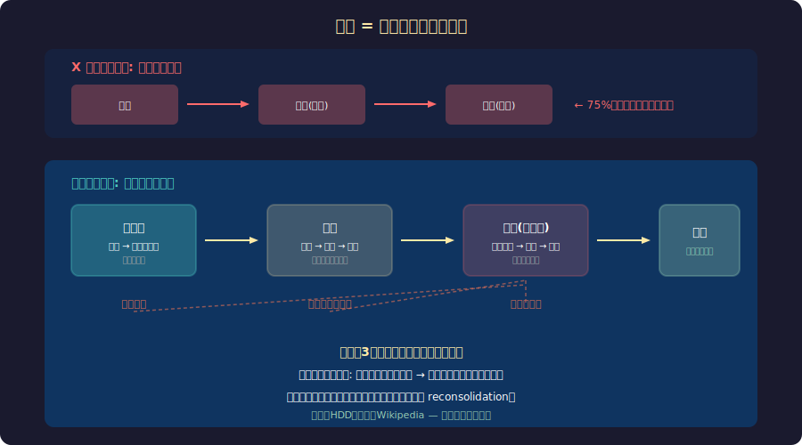

<!-- _class: lead -->
# 記憶は再構成される

- あなたの思い出は本当か？
- 2026-02-20

---

# 目次

- - 1. 記憶のビデオカメラ神話
- - 2. 記憶の再構成プロセス
- - 3. 偽記憶の実験
- - 4. 日常での記憶の歪み
- - 5. 法廷と記憶の問題
- - 6. エンジニアへの示唆

---

<!-- _class: lead -->
# 1. ビデオカメラ神話

---

# 記憶 ≠ 録画

---

# なぜ我々は記憶を信じるのか

- - 「鮮明に覚えている」= 正確とは限らない
- - **フラッシュバルブ記憶**: 9.11の記憶は詳細だが、3年後の調査で40%が不正確
- - 記憶の鮮明さと正確さの**相関はほぼゼロ**
- - 感情的に強い体験 → 鮮明だが歪んだ記憶になりやすい
- - 「確信度」と「正確性」は別物 → 目撃証言の最大の問題

---

<!-- _class: lead -->
# 2. 再構成プロセス

---

# 記憶の3段階の歪み

- - **符号化の歪み**: 注意していない情報は記録されない
-   - 「変化の見落とし」: 会話中に相手が入れ替わっても気づかない
- - **貯蔵の歪み**: 時間とともに細部が失われ、スキーマで補完される
-   - 一般的な知識で「こうだったはず」と埋められる
- - **検索の歪み**: 想起するたびに再構成 → 毎回少しずつ変わる
-   - 質問の仕方、現在の感情、後から得た情報が影響

---

# 再固定化 (Reconsolidation)

- - **2000年代の革命的発見**: 記憶は思い出すたびに「不安定化」する
- - 思い出す → 記憶が一時的に可塑的になる → 修正されて再保存
- - つまり: **思い出すことが記憶を変える**
- - PTSDの治療に応用: 恐怖記憶を想起中に介入し書き換える
- - プロパノロール (beta遮断薬) で感情的色彩を薄める実験
- - 「記憶は想起するたびに上書き保存される」

---

<!-- _class: lead -->
# 3. 偽記憶の実験

---

# Elizabeth Loftusの研究

- - **Loftus & Palmer (1974)**: 事故映像を見た後の質問
- - 「車がぶつかった(hit)」vs「車が激突した(smashed)」
- - 「激突」群: 速度の推定値が高く、存在しないガラスの破片を「見た」と回答
- - **ショッピングモール実験**: 「幼少期に迷子になった」偽の記憶を植え付け
- - 25%の被験者が偽の記憶を「思い出した」と報告
- - 詳細な情景描写まで作り出した

---

# 偽記憶はこんなに簡単に作れる

- - **DRM効果**: 「睡眠、枕、夢、夜...」→ 「ベッド」を聞いたと誤って報告
- - **写真操作**: 加工した子供時代の写真を見せると偽記憶が形成
- - **想像インフレーション**: 「これを想像してください」→ 実際にあったと信じる
- - **ソーシャルメディア**: 他人の投稿で自分の記憶が書き換えられる
- - 「記憶に自信がある」人ほど偽記憶に脆弱な傾向

---

<!-- _class: lead -->
# 4. 日常での記憶の歪み

---

# あなたの記憶も歪んでいる

- - **自己奉仕バイアス**: 成功は自分の能力、失敗は外部要因と記憶する
- - **一貫性バイアス**: 過去の自分の意見を現在の意見に合わせて記憶する
- - **ロージー回顧**: 過去を実際より良く記憶する
- - **テレスコーピング**: 最近の出来事を昔のこと（逆も）として記憶する
- - **感情一致記憶**: 現在悲しい → 悲しい記憶が想起されやすい
- - 夫婦喧嘩: 双方とも「自分の方が家事をしている」と記憶する

---

<!-- _class: lead -->
# 5. 法廷と記憶

---

# 目撃証言の危うさ

- - DNAで無罪が判明した冤罪事件の **75%** が誤った目撃証言が原因
- - **Innocence Project**: 375人以上の無実の人がDNA鑑定で釈放
- - 目撃者の「確信度」は信頼性の指標にならない
- - 警察の誘導的質問が記憶を書き換える
- - 異人種効果: 異なる人種の顔の識別が困難
- - → 多くの国で目撃証言の運用が改革されている

---

<!-- _class: lead -->
# 6. エンジニアへの示唆

---

# 記憶の歪みとソフトウェア開発

- - **ポストモーテム**: 記憶は歪む → 障害発生時にリアルタイムで記録する
- - **要件定義**: 「ユーザーが言っていた」記憶は歪んでいる → 録画・議事録必須
- - **見積もり**: 過去のプロジェクトの記憶は楽観的に歪む → 実績データを参照
- - **コードレビュー**: 「前はこう書いていた」の記憶より git log を信じる
- - **ドキュメント**: 記憶に頼らず書き残す文化が組織の記憶を守る

---

# まとめ

- - 記憶はビデオ再生ではなく、毎回の**創造的再構成**
- - 想起するたびに記憶は書き換えられる（再固定化）
- - 偽記憶は驚くほど簡単に植え付けられる
- - 「鮮明な記憶」≠「正確な記憶」
- - 目撃証言は冤罪の最大の原因
- - 対策: 記録する、データを信じる、記憶を過信しない

---

# 参考文献

- - **研究:**
- - Loftus, E.F. & Palmer, J.C. (1974) "Reconstruction of automobile destruction"
- - Nader, K. (2003) "Memory traces unbound" (再固定化の発見)
- - **書籍:**
- - Loftus, E.F. "The Myth of Repressed Memory" (1994)
- - Schacter, D.L. "The Seven Sins of Memory" (2001)

