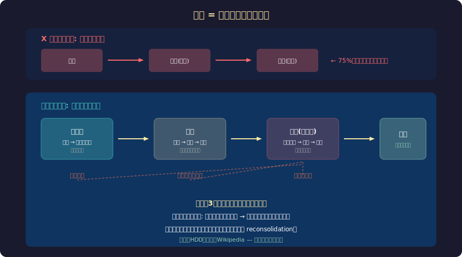

<!-- _class: lead -->
# 記憶は再構成される

- あなたの思い出は本当か？
- 2026-02-20

---

# 目次

- <svg xmlns="http://www.w3.org/2000/svg" viewBox="0 0 800 400" style="max-height:70vh;max-width:100%;display:block;margin:0 auto;"><rect width="800" height="400" fill="#1a1a2e"/><text x="400" y="32" text-anchor="middle" fill="#f9a825" font-size="17" font-weight="bold" font-family="sans-serif">記憶の再構成 — 章構成</text><rect x="30" y="52" width="225" height="70" rx="10" fill="#16213e" stroke="#f9a825" stroke-width="2"/><text x="143" y="78" text-anchor="middle" fill="#f9a825" font-size="13" font-weight="bold" font-family="sans-serif">1. ビデオカメラ神話</text><text x="143" y="96" text-anchor="middle" fill="#ccc" font-size="11" font-family="sans-serif">記憶は録画ではない</text><text x="143" y="113" text-anchor="middle" fill="#ccc" font-size="11" font-family="sans-serif">フラッシュバルブ記憶の限界</text><rect x="290" y="52" width="225" height="70" rx="10" fill="#16213e" stroke="#4fc3f7" stroke-width="2"/><text x="403" y="78" text-anchor="middle" fill="#4fc3f7" font-size="13" font-weight="bold" font-family="sans-serif">2. 再構成プロセス</text><text x="403" y="96" text-anchor="middle" fill="#ccc" font-size="11" font-family="sans-serif">符号化・保存・検索</text><text x="403" y="113" text-anchor="middle" fill="#ccc" font-size="11" font-family="sans-serif">再固定化（書き換え）</text><rect x="550" y="52" width="220" height="70" rx="10" fill="#16213e" stroke="#e91e63" stroke-width="2"/><text x="660" y="78" text-anchor="middle" fill="#e91e63" font-size="13" font-weight="bold" font-family="sans-serif">3. 偽記憶の実験</text><text x="660" y="96" text-anchor="middle" fill="#ccc" font-size="11" font-family="sans-serif">Loftus実験</text><text x="660" y="113" text-anchor="middle" fill="#ccc" font-size="11" font-family="sans-serif">偽記憶の5メカニズム</text><rect x="30" y="170" width="225" height="70" rx="10" fill="#16213e" stroke="#81c784" stroke-width="2"/><text x="143" y="196" text-anchor="middle" fill="#81c784" font-size="13" font-weight="bold" font-family="sans-serif">4. 日常の記憶の歪み</text><text x="143" y="214" text-anchor="middle" fill="#ccc" font-size="11" font-family="sans-serif">自己奉仕バイアス</text><text x="143" y="231" text-anchor="middle" fill="#ccc" font-size="11" font-family="sans-serif">ロージー回顧ほか</text><rect x="290" y="170" width="225" height="70" rx="10" fill="#16213e" stroke="#ff8a65" stroke-width="2"/><text x="403" y="196" text-anchor="middle" fill="#ff8a65" font-size="13" font-weight="bold" font-family="sans-serif">5. 法廷と記憶</text><text x="403" y="214" text-anchor="middle" fill="#ccc" font-size="11" font-family="sans-serif">目撃証言の危うさ</text><text x="403" y="231" text-anchor="middle" fill="#ccc" font-size="11" font-family="sans-serif">冤罪の75%が誤証言</text><rect x="550" y="170" width="220" height="70" rx="10" fill="#16213e" stroke="#ce93d8" stroke-width="2"/><text x="660" y="196" text-anchor="middle" fill="#ce93d8" font-size="13" font-weight="bold" font-family="sans-serif">6. エンジニアへの示唆</text><text x="660" y="214" text-anchor="middle" fill="#ccc" font-size="11" font-family="sans-serif">ポストモーテム対策</text><text x="660" y="231" text-anchor="middle" fill="#ccc" font-size="11" font-family="sans-serif">データを信じる</text><rect x="140" y="290" width="520" height="60" rx="10" fill="#0f3460" stroke="#f9a825" stroke-width="1.5"/><text x="400" y="317" text-anchor="middle" fill="#f9a825" font-size="14" font-weight="bold" font-family="sans-serif">記憶は録画ではなく「毎回の創造」</text><text x="400" y="338" text-anchor="middle" fill="#fff" font-size="12" font-family="sans-serif">符号化・保存・検索の各段階で歪みが累積する</text></svg>

---

<!-- _class: lead -->
# 1. ビデオカメラ神話

---

# 記憶 ≠ 録画

---

# なぜ我々は記憶を信じるのか

- - 「鮮明に覚えている」= 正確とは限らない
- - **フラッシュバルブ記憶**: 9.11の記憶は詳細だが、3年後の調査で40%が不正確
- - 記憶の鮮明さと正確さの**相関はほぼゼロ**
- <svg viewBox="0 0 800 280" style="max-height:70vh;max-width:100%;display:block;margin:0 auto;"><rect width="800" height="280" fill="#1a1a2e"/><text x="400" y="28" text-anchor="middle" fill="#f9a825" font-size="16" font-weight="bold" font-family="sans-serif">フラッシュバルブ記憶の正確性（9.11, n=54）</text><rect x="80" y="50" width="60" height="160" fill="#f9a825" rx="4"/><rect x="200" y="90" width="60" height="120" fill="#e91e63" rx="4"/><rect x="320" y="130" width="60" height="80" fill="#4fc3f7" rx="4"/><rect x="440" y="150" width="60" height="60" fill="#81c784" rx="4"/><text x="110" y="225" text-anchor="middle" fill="white" font-size="12" font-family="sans-serif">直後</text><text x="230" y="225" text-anchor="middle" fill="white" font-size="12" font-family="sans-serif">1年後</text><text x="350" y="225" text-anchor="middle" fill="white" font-size="12" font-family="sans-serif">2年後</text><text x="470" y="225" text-anchor="middle" fill="white" font-size="12" font-family="sans-serif">3年後</text><text x="110" y="242" text-anchor="middle" fill="#f9a825" font-size="13" font-weight="bold" font-family="sans-serif">100%</text><text x="230" y="202" text-anchor="middle" fill="#e91e63" font-size="13" font-weight="bold" font-family="sans-serif">75%</text><text x="350" y="222" text-anchor="middle" fill="#4fc3f7" font-size="13" font-weight="bold" font-family="sans-serif">63%</text><text x="470" y="242" text-anchor="middle" fill="#81c784" font-size="13" font-weight="bold" font-family="sans-serif">60%</text><text x="570" y="120" text-anchor="start" fill="#ff8a65" font-size="13" font-weight="bold" font-family="sans-serif">40%が不正確</text><line x1="558" y1="125" x2="500" y2="155" stroke="#ff8a65" stroke-width="1.5"/><polygon points="500,155 493,148 507,148" fill="#ff8a65"/><line x1="80" y1="240" x2="560" y2="240" stroke="#666" stroke-width="1"/><line x1="80" y1="50" x2="80" y2="240" stroke="#666" stroke-width="1"/><text x="400" y="268" text-anchor="middle" fill="#aaa" font-size="11" font-family="sans-serif">確信度は高いまま維持 — 正確さとは無相関</text></svg>

---

<!-- _class: lead -->
# 2. 再構成プロセス

---

# 記憶の3段階の歪み

- <svg viewBox="0 0 800 360" style="max-height:70vh;max-width:100%;display:block;margin:0 auto;"><rect width="800" height="360" fill="#1a1a2e"/><text x="400" y="30" text-anchor="middle" fill="#f9a825" font-size="17" font-weight="bold" font-family="sans-serif">記憶の3段階と歪みのポイント</text><rect x="40" y="55" width="200" height="220" rx="12" fill="#16213e" stroke="#f9a825" stroke-width="2"/><text x="140" y="82" text-anchor="middle" fill="#f9a825" font-size="14" font-weight="bold" font-family="sans-serif">符号化</text><text x="140" y="100" text-anchor="middle" fill="#f9a825" font-size="11" font-family="sans-serif">(Encoding)</text><text x="140" y="128" text-anchor="middle" fill="white" font-size="11" font-family="sans-serif">注意のフィルター</text><text x="140" y="148" text-anchor="middle" fill="white" font-size="11" font-family="sans-serif">感情による強調</text><text x="140" y="168" text-anchor="middle" fill="white" font-size="11" font-family="sans-serif">変化の見落とし</text><text x="140" y="200" text-anchor="middle" fill="#e91e63" font-size="10" font-family="sans-serif">⚠ 注意しない情報</text><text x="140" y="218" text-anchor="middle" fill="#e91e63" font-size="10" font-family="sans-serif">は記録されない</text><rect x="300" y="55" width="200" height="220" rx="12" fill="#16213e" stroke="#4fc3f7" stroke-width="2"/><text x="400" y="82" text-anchor="middle" fill="#4fc3f7" font-size="14" font-weight="bold" font-family="sans-serif">保存</text><text x="400" y="100" text-anchor="middle" fill="#4fc3f7" font-size="11" font-family="sans-serif">(Storage)</text><text x="400" y="128" text-anchor="middle" fill="white" font-size="11" font-family="sans-serif">時間とともに劣化</text><text x="400" y="148" text-anchor="middle" fill="white" font-size="11" font-family="sans-serif">スキーマで補完</text><text x="400" y="168" text-anchor="middle" fill="white" font-size="11" font-family="sans-serif">干渉・上書き</text><text x="400" y="200" text-anchor="middle" fill="#e91e63" font-size="10" font-family="sans-serif">⚠「こうだったはず」で</text><text x="400" y="218" text-anchor="middle" fill="#e91e63" font-size="10" font-family="sans-serif">細部が埋められる</text><rect x="560" y="55" width="200" height="220" rx="12" fill="#16213e" stroke="#81c784" stroke-width="2"/><text x="660" y="82" text-anchor="middle" fill="#81c784" font-size="14" font-weight="bold" font-family="sans-serif">検索</text><text x="660" y="100" text-anchor="middle" fill="#81c784" font-size="11" font-family="sans-serif">(Retrieval)</text><text x="660" y="128" text-anchor="middle" fill="white" font-size="11" font-family="sans-serif">再構成による書き換え</text><text x="660" y="148" text-anchor="middle" fill="white" font-size="11" font-family="sans-serif">質問の影響</text><text x="660" y="168" text-anchor="middle" fill="white" font-size="11" font-family="sans-serif">現在感情の影響</text><text x="660" y="200" text-anchor="middle" fill="#e91e63" font-size="10" font-family="sans-serif">⚠ 想起=再保存で</text><text x="660" y="218" text-anchor="middle" fill="#e91e63" font-size="10" font-family="sans-serif">毎回少し変わる</text><polygon points="255,165 285,155 285,175" fill="#f9a825"/><line x1="240" y1="165" x2="283" y2="165" stroke="#f9a825" stroke-width="2"/><polygon points="515,165 545,155 545,175" fill="#f9a825"/><line x1="500" y1="165" x2="543" y2="165" stroke="#f9a825" stroke-width="2"/><text x="400" y="310" text-anchor="middle" fill="#aaa" font-size="12" font-family="sans-serif">各段階で歪みが累積 — 最終的な記憶は原体験と大きく異なりうる</text><rect x="170" y="295" width="460" height="35" rx="6" fill="#0f3460" stroke="#f9a825" stroke-width="1"/><text x="400" y="318" text-anchor="middle" fill="#f9a825" font-size="12" font-family="sans-serif">各段階で歪みが累積 — 最終的な記憶は原体験と大きく異なりうる</text></svg>

---

# 再固定化 (Reconsolidation)

- - **2000年代の革命的発見**: 記憶は思い出すたびに「不安定化」する
- - PTSDの治療に応用: 恐怖記憶を想起中に介入し書き換える
- <svg viewBox="0 0 800 260" style="max-height:70vh;max-width:100%;display:block;margin:0 auto;"><rect width="800" height="260" fill="#1a1a2e"/><text x="400" y="28" text-anchor="middle" fill="#f9a825" font-size="15" font-weight="bold" font-family="sans-serif">再固定化サイクル — 思い出すたびに上書き保存</text><rect x="290" y="45" width="220" height="55" rx="10" fill="#0f3460" stroke="#f9a825" stroke-width="2"/><text x="400" y="68" text-anchor="middle" fill="#f9a825" font-size="13" font-weight="bold" font-family="sans-serif">安定した記憶</text><text x="400" y="87" text-anchor="middle" fill="white" font-size="11" font-family="sans-serif">(長期記憶に保存)</text><polygon points="400,108 393,100 407,100" fill="#4fc3f7"/><line x1="400" y1="100" x2="400" y2="115" stroke="#4fc3f7" stroke-width="2"/><rect x="150" y="115" width="500" height="55" rx="10" fill="#16213e" stroke="#e91e63" stroke-width="2"/><text x="400" y="138" text-anchor="middle" fill="#e91e63" font-size="13" font-weight="bold" font-family="sans-serif">想起 → 記憶が不安定化（可塑的状態）</text><text x="400" y="157" text-anchor="middle" fill="white" font-size="11" font-family="sans-serif">外部情報・感情・質問で内容が変わりやすい</text><polygon points="560,178 553,170 567,170" fill="#81c784"/><line x1="560" y1="170" x2="560" y2="185" stroke="#81c784" stroke-width="2"/><rect x="450" y="185" width="220" height="50" rx="10" fill="#0f3460" stroke="#81c784" stroke-width="2"/><text x="560" y="207" text-anchor="middle" fill="#81c784" font-size="12" font-weight="bold" font-family="sans-serif">修正されて再保存</text><text x="560" y="225" text-anchor="middle" fill="white" font-size="11" font-family="sans-serif">(少し変化した記憶)</text><path d="M 560 235 Q 720 235 720 72 Q 720 45 510 45" fill="none" stroke="#f9a825" stroke-width="1.5" stroke-dasharray="5,4"/><polygon points="510,45 517,38 517,52" fill="#f9a825"/><text x="700" y="148" text-anchor="middle" fill="#f9a825" font-size="10" font-family="sans-serif" transform="rotate(-90,700,148)">繰り返し</text><rect x="50" y="185" width="220" height="50" rx="10" fill="#0f3460" stroke="#ff8a65" stroke-width="1.5"/><text x="160" y="207" text-anchor="middle" fill="#ff8a65" font-size="12" font-weight="bold" font-family="sans-serif">PTSD治療への応用</text><text x="160" y="225" text-anchor="middle" fill="white" font-size="10" font-family="sans-serif">可塑化中に介入 → 恐怖を書き換える</text></svg>

---

<!-- _class: lead -->
# 3. 偽記憶の実験

- <svg xmlns="http://www.w3.org/2000/svg" viewBox="0 0 800 400" style="max-height:70vh;max-width:100%;display:block;margin:0 auto;"><rect width="800" height="400" fill="#1a1a2e"/><text x="400" y="34" text-anchor="middle" fill="#f9a825" font-size="17" font-weight="bold" font-family="sans-serif">偽記憶の形成モデル</text><rect x="290" y="55" width="220" height="60" rx="10" fill="#16213e" stroke="#4fc3f7" stroke-width="2"/><text x="400" y="81" text-anchor="middle" fill="#4fc3f7" font-size="13" font-weight="bold" font-family="sans-serif">実際の出来事</text><text x="400" y="100" text-anchor="middle" fill="#ccc" font-size="11" font-family="sans-serif">原体験（不完全に記録）</text><polygon points="400,123 393,115 407,115" fill="#f9a825"/><line x1="400" y1="115" x2="400" y2="130" stroke="#f9a825" stroke-width="2"/><rect x="200" y="130" width="400" height="60" rx="10" fill="#16213e" stroke="#e91e63" stroke-width="2"/><text x="400" y="156" text-anchor="middle" fill="#e91e63" font-size="13" font-weight="bold" font-family="sans-serif">記憶の不安定な保存状態</text><text x="400" y="175" text-anchor="middle" fill="#ccc" font-size="11" font-family="sans-serif">断片的・スキーマで補完済み・感情で着色</text><line x1="280" y1="190" x2="180" y2="230" stroke="#f9a825" stroke-width="1.5"/><polygon points="180,230 174,220 188,222" fill="#f9a825"/><line x1="520" y1="190" x2="620" y2="230" stroke="#f9a825" stroke-width="1.5"/><polygon points="620,230 612,222 626,220" fill="#f9a825"/><rect x="40" y="230" width="270" height="65" rx="10" fill="#16213e" stroke="#ff8a65" stroke-width="1.5"/><text x="175" y="255" text-anchor="middle" fill="#ff8a65" font-size="12" font-weight="bold" font-family="sans-serif">外部からの暗示</text><text x="175" y="272" text-anchor="middle" fill="#ccc" font-size="10" font-family="sans-serif">誘導的質問・写真・他者の話</text><text x="175" y="287" text-anchor="middle" fill="#ccc" font-size="10" font-family="sans-serif">「smashed」などの強い語彙</text><rect x="490" y="230" width="270" height="65" rx="10" fill="#16213e" stroke="#ff8a65" stroke-width="1.5"/><text x="625" y="255" text-anchor="middle" fill="#ff8a65" font-size="12" font-weight="bold" font-family="sans-serif">内部の補完処理</text><text x="625" y="272" text-anchor="middle" fill="#ccc" font-size="10" font-family="sans-serif">「こうだったはず」スキーマ</text><text x="625" y="287" text-anchor="middle" fill="#ccc" font-size="10" font-family="sans-serif">想像インフレーション</text><line x1="175" y1="295" x2="320" y2="330" stroke="#e91e63" stroke-width="1.5"/><polygon points="320,330 311,326 316,315" fill="#e91e63"/><line x1="625" y1="295" x2="480" y2="330" stroke="#e91e63" stroke-width="1.5"/><polygon points="480,330 484,319 489,329" fill="#e91e63"/><rect x="260" y="330" width="280" height="50" rx="10" fill="#e91e63" opacity="0.85"/><text x="400" y="353" text-anchor="middle" fill="#fff" font-size="13" font-weight="bold" font-family="sans-serif">偽記憶（本人には本物に感じる）</text><text x="400" y="371" text-anchor="middle" fill="#fff" font-size="11" font-family="sans-serif">25%が「迷子体験」を思い出す</text></svg>

---

# Elizabeth Loftusの研究

- - **Loftus & Palmer (1974)**: 「激突(smashed)」群は速度推定が高く、存在しないガラスを「見た」
- - **ショッピングモール実験**: 25%の被験者が偽の「迷子体験」を「思い出した」
- <svg viewBox="0 0 800 260" style="max-height:70vh;max-width:100%;display:block;margin:0 auto;"><rect width="800" height="260" fill="#1a1a2e"/><text x="400" y="28" text-anchor="middle" fill="#f9a825" font-size="15" font-weight="bold" font-family="sans-serif">Loftus &amp; Palmer 実験結果（1974）</text><rect x="50" y="45" width="330" height="185" rx="10" fill="#16213e" stroke="#4fc3f7" stroke-width="1.5"/><text x="215" y="68" text-anchor="middle" fill="#4fc3f7" font-size="13" font-weight="bold" font-family="sans-serif">速度推定（mph）</text><rect x="80" y="90" width="55" height="100" fill="#81c784" rx="3"/><rect x="160" y="78" width="55" height="112" fill="#f9a825" rx="3"/><rect x="240" y="68" width="55" height="122" fill="#e91e63" rx="3"/><text x="107" y="205" text-anchor="middle" fill="white" font-size="10" font-family="sans-serif">contacted</text><text x="107" y="218" text-anchor="middle" fill="#81c784" font-size="12" font-weight="bold" font-family="sans-serif">31.8</text><text x="187" y="205" text-anchor="middle" fill="white" font-size="10" font-family="sans-serif">hit</text><text x="187" y="218" text-anchor="middle" fill="#f9a825" font-size="12" font-weight="bold" font-family="sans-serif">34.0</text><text x="267" y="205" text-anchor="middle" fill="white" font-size="10" font-family="sans-serif">smashed</text><text x="267" y="218" text-anchor="middle" fill="#e91e63" font-size="12" font-weight="bold" font-family="sans-serif">40.8</text><text x="215" y="242" text-anchor="middle" fill="#aaa" font-size="10" font-family="sans-serif">単語1つで速度推定が+9mph変化</text><rect x="420" y="45" width="330" height="185" rx="10" fill="#16213e" stroke="#e91e63" stroke-width="1.5"/><text x="585" y="68" text-anchor="middle" fill="#e91e63" font-size="13" font-weight="bold" font-family="sans-serif">ガラスの破片を「見た」割合</text><rect x="460" y="120" width="60" height="70" fill="#81c784" rx="3"/><rect x="560" y="85" width="60" height="105" fill="#e91e63" rx="3"/><text x="490" y="205" text-anchor="middle" fill="white" font-size="10" font-family="sans-serif">hit群</text><text x="490" y="218" text-anchor="middle" fill="#81c784" font-size="12" font-weight="bold" font-family="sans-serif">14%</text><text x="590" y="205" text-anchor="middle" fill="white" font-size="10" font-family="sans-serif">smashed群</text><text x="590" y="218" text-anchor="middle" fill="#e91e63" font-size="12" font-weight="bold" font-family="sans-serif">32%</text><text x="585" y="242" text-anchor="middle" fill="#aaa" font-size="10" font-family="sans-serif">実際にガラスの破片は存在しなかった</text></svg>

---

# 偽記憶はこんなに簡単に作れる

- <svg viewBox="0 0 800 330" style="max-height:70vh;max-width:100%;display:block;margin:0 auto;"><rect width="800" height="330" fill="#1a1a2e"/><text x="400" y="28" text-anchor="middle" fill="#f9a825" font-size="16" font-weight="bold" font-family="sans-serif">偽記憶を生み出す5つのメカニズム</text><rect x="30" y="50" width="220" height="80" rx="8" fill="#16213e" stroke="#f9a825" stroke-width="1.5"/><text x="140" y="73" text-anchor="middle" fill="#f9a825" font-size="12" font-weight="bold" font-family="sans-serif">DRM効果</text><text x="140" y="92" text-anchor="middle" fill="white" font-size="10" font-family="sans-serif">関連語リスト提示で</text><text x="140" y="108" text-anchor="middle" fill="white" font-size="10" font-family="sans-serif">未提示語を「聞いた」と誤信</text><rect x="290" y="50" width="220" height="80" rx="8" fill="#16213e" stroke="#e91e63" stroke-width="1.5"/><text x="400" y="73" text-anchor="middle" fill="#e91e63" font-size="12" font-weight="bold" font-family="sans-serif">写真操作</text><text x="400" y="92" text-anchor="middle" fill="white" font-size="10" font-family="sans-serif">合成写真を見せるだけで</text><text x="400" y="108" text-anchor="middle" fill="white" font-size="10" font-family="sans-serif">幼少期の偽記憶が形成</text><rect x="550" y="50" width="220" height="80" rx="8" fill="#16213e" stroke="#4fc3f7" stroke-width="1.5"/><text x="660" y="73" text-anchor="middle" fill="#4fc3f7" font-size="12" font-weight="bold" font-family="sans-serif">想像インフレーション</text><text x="660" y="92" text-anchor="middle" fill="white" font-size="10" font-family="sans-serif">「これを想像してください」</text><text x="660" y="108" text-anchor="middle" fill="white" font-size="10" font-family="sans-serif">→ 実際にあったと信じる</text><rect x="30" y="165" width="220" height="80" rx="8" fill="#16213e" stroke="#81c784" stroke-width="1.5"/><text x="140" y="188" text-anchor="middle" fill="#81c784" font-size="12" font-weight="bold" font-family="sans-serif">ソーシャルメディア</text><text x="140" y="207" text-anchor="middle" fill="white" font-size="10" font-family="sans-serif">他人の投稿・写真タグで</text><text x="140" y="223" text-anchor="middle" fill="white" font-size="10" font-family="sans-serif">自分の記憶が書き換えられる</text><rect x="290" y="165" width="220" height="80" rx="8" fill="#16213e" stroke="#ff8a65" stroke-width="1.5"/><text x="400" y="188" text-anchor="middle" fill="#ff8a65" font-size="12" font-weight="bold" font-family="sans-serif">誘導的質問</text><text x="400" y="207" text-anchor="middle" fill="white" font-size="10" font-family="sans-serif">「そのとき怖かったですよね？」</text><text x="400" y="223" text-anchor="middle" fill="white" font-size="10" font-family="sans-serif">→ 感情まで植え付けられる</text><rect x="160" y="268" width="480" height="45" rx="8" fill="#0f3460" stroke="#f9a825" stroke-width="1.5"/><text x="400" y="289" text-anchor="middle" fill="#f9a825" font-size="12" font-weight="bold" font-family="sans-serif">「記憶に自信がある人」ほど偽記憶に脆弱</text><text x="400" y="305" text-anchor="middle" fill="white" font-size="10" font-family="sans-serif">確信度が高い ≠ 正確な記憶</text></svg>

---

<!-- _class: lead -->
# 4. 日常での記憶の歪み

---

# あなたの記憶も歪んでいる

- <svg viewBox="0 0 800 340" style="max-height:70vh;max-width:100%;display:block;margin:0 auto;"><rect width="800" height="340" fill="#1a1a2e"/><text x="400" y="28" text-anchor="middle" fill="#f9a825" font-size="16" font-weight="bold" font-family="sans-serif">日常的な記憶バイアスの種類</text><rect x="30" y="48" width="225" height="85" rx="8" fill="#16213e" stroke="#f9a825" stroke-width="1.5"/><text x="143" y="70" text-anchor="middle" fill="#f9a825" font-size="12" font-weight="bold" font-family="sans-serif">自己奉仕バイアス</text><text x="143" y="89" text-anchor="middle" fill="white" font-size="10" font-family="sans-serif">成功 → 自分の能力のおかげ</text><text x="143" y="106" text-anchor="middle" fill="white" font-size="10" font-family="sans-serif">失敗 → 外部要因のせい</text><text x="143" y="123" text-anchor="middle" fill="#e91e63" font-size="10" font-family="sans-serif">例: 夫婦どちらも「自分の方が家事をしている」</text><rect x="290" y="48" width="225" height="85" rx="8" fill="#16213e" stroke="#4fc3f7" stroke-width="1.5"/><text x="403" y="70" text-anchor="middle" fill="#4fc3f7" font-size="12" font-weight="bold" font-family="sans-serif">一貫性バイアス</text><text x="403" y="89" text-anchor="middle" fill="white" font-size="10" font-family="sans-serif">過去の意見を現在の自分の</text><text x="403" y="106" text-anchor="middle" fill="white" font-size="10" font-family="sans-serif">意見に合わせて「記憶する」</text><text x="403" y="123" text-anchor="middle" fill="#4fc3f7" font-size="10" font-family="sans-serif">例: 「ずっとそう思っていた」</text><rect x="550" y="48" width="220" height="85" rx="8" fill="#16213e" stroke="#81c784" stroke-width="1.5"/><text x="660" y="70" text-anchor="middle" fill="#81c784" font-size="12" font-weight="bold" font-family="sans-serif">ロージー回顧</text><text x="660" y="89" text-anchor="middle" fill="white" font-size="10" font-family="sans-serif">過去を実際より良く記憶</text><text x="660" y="106" text-anchor="middle" fill="white" font-size="10" font-family="sans-serif">時間が経つほど美化される</text><text x="660" y="123" text-anchor="middle" fill="#81c784" font-size="10" font-family="sans-serif">例: 「昔は良かった」</text><rect x="30" y="160" width="225" height="85" rx="8" fill="#16213e" stroke="#ff8a65" stroke-width="1.5"/><text x="143" y="182" text-anchor="middle" fill="#ff8a65" font-size="12" font-weight="bold" font-family="sans-serif">テレスコーピング</text><text x="143" y="201" text-anchor="middle" fill="white" font-size="10" font-family="sans-serif">最近の出来事を「昔」と</text><text x="143" y="218" text-anchor="middle" fill="white" font-size="10" font-family="sans-serif">記憶する（逆も）</text><text x="143" y="235" text-anchor="middle" fill="#ff8a65" font-size="10" font-family="sans-serif">例: 「もう5年前か...」(実は2年)</text><rect x="290" y="160" width="225" height="85" rx="8" fill="#16213e" stroke="#ce93d8" stroke-width="1.5"/><text x="403" y="182" text-anchor="middle" fill="#ce93d8" font-size="12" font-weight="bold" font-family="sans-serif">感情一致記憶</text><text x="403" y="201" text-anchor="middle" fill="white" font-size="10" font-family="sans-serif">今の気分が過去の記憶を</text><text x="403" y="218" text-anchor="middle" fill="white" font-size="10" font-family="sans-serif">フィルタリングする</text><text x="403" y="235" text-anchor="middle" fill="#ce93d8" font-size="10" font-family="sans-serif">例: 悲しいとき→悲しい記憶が想起</text><rect x="160" y="265" width="480" height="45" rx="8" fill="#0f3460" stroke="#f9a825" stroke-width="1.5"/><text x="400" y="286" text-anchor="middle" fill="#f9a825" font-size="12" font-weight="bold" font-family="sans-serif">これらは「記憶力が悪い」のではなく、</text><text x="400" y="304" text-anchor="middle" fill="white" font-size="10" font-family="sans-serif">脳の通常の情報処理メカニズムから生じる避けられない現象</text></svg>

---

<!-- _class: lead -->
# 5. 法廷と記憶

---

# 目撃証言の危うさ

- - DNAで無罪が判明した冤罪事件の **75%** が誤った目撃証言が原因
- - **Innocence Project**: 375人以上の無実の人がDNA鑑定で釈放
- <svg viewBox="0 0 800 250" style="max-height:70vh;max-width:100%;display:block;margin:0 auto;"><rect width="800" height="250" fill="#1a1a2e"/><text x="400" y="28" text-anchor="middle" fill="#f9a825" font-size="15" font-weight="bold" font-family="sans-serif">DNA鑑定で無実が証明された冤罪の原因（Innocence Project）</text><rect x="50" y="50" width="260" height="160" rx="10" fill="#16213e" stroke="#e91e63" stroke-width="2"/><text x="180" y="73" text-anchor="middle" fill="#e91e63" font-size="13" font-weight="bold" font-family="sans-serif">誤った目撃証言</text><text x="180" y="130" text-anchor="middle" fill="#e91e63" font-size="56" font-weight="bold" font-family="sans-serif">75%</text><text x="180" y="158" text-anchor="middle" fill="white" font-size="10" font-family="sans-serif">最大の原因</text><text x="180" y="196" text-anchor="middle" fill="#aaa" font-size="10" font-family="sans-serif">375+件の冤罪を分析</text><rect x="340" y="50" width="195" height="75" rx="8" fill="#16213e" stroke="#f9a825" stroke-width="1.5"/><text x="437" y="72" text-anchor="middle" fill="#f9a825" font-size="11" font-weight="bold" font-family="sans-serif">不適切な法科学鑑定</text><text x="437" y="100" text-anchor="middle" fill="white" font-size="36" font-weight="bold" font-family="sans-serif">45%</text><rect x="340" y="140" width="195" height="70" rx="8" fill="#16213e" stroke="#4fc3f7" stroke-width="1.5"/><text x="437" y="162" text-anchor="middle" fill="#4fc3f7" font-size="11" font-weight="bold" font-family="sans-serif">虚偽自白</text><text x="437" y="192" text-anchor="middle" fill="white" font-size="36" font-weight="bold" font-family="sans-serif">29%</text><rect x="555" y="50" width="195" height="75" rx="8" fill="#16213e" stroke="#81c784" stroke-width="1.5"/><text x="653" y="72" text-anchor="middle" fill="#81c784" font-size="11" font-weight="bold" font-family="sans-serif">密告者の証言</text><text x="653" y="100" text-anchor="middle" fill="white" font-size="36" font-weight="bold" font-family="sans-serif">18%</text><rect x="555" y="140" width="195" height="70" rx="8" fill="#16213e" stroke="#ff8a65" stroke-width="1.5"/><text x="653" y="162" text-anchor="middle" fill="#ff8a65" font-size="11" font-weight="bold" font-family="sans-serif">証拠隠蔽</text><text x="653" y="192" text-anchor="middle" fill="white" font-size="36" font-weight="bold" font-family="sans-serif">34%</text><text x="400" y="235" text-anchor="middle" fill="#aaa" font-size="10" font-family="sans-serif">※複数原因が重複する場合あり</text></svg>

---

<!-- _class: lead -->
# 6. エンジニアへの示唆

---

# 記憶の歪みとソフトウェア開発

- <svg viewBox="0 0 800 340" style="max-height:70vh;max-width:100%;display:block;margin:0 auto;"><rect width="800" height="340" fill="#1a1a2e"/><text x="400" y="28" text-anchor="middle" fill="#f9a825" font-size="16" font-weight="bold" font-family="sans-serif">記憶の歪み vs エンジニアリングの対策</text><rect x="30" y="45" width="320" height="55" rx="8" fill="#16213e" stroke="#e91e63" stroke-width="1.5"/><text x="190" y="68" text-anchor="middle" fill="#e91e63" font-size="12" font-weight="bold" font-family="sans-serif">障害発生後の記憶は歪む</text><text x="190" y="87" text-anchor="middle" fill="white" font-size="10" font-family="sans-serif">感情的体験 → 記憶が不正確に</text><polygon points="360,72 390,65 390,79" fill="#f9a825"/><line x1="350" y1="72" x2="388" y2="72" stroke="#f9a825" stroke-width="2"/><rect x="400" y="45" width="370" height="55" rx="8" fill="#0f3460" stroke="#81c784" stroke-width="1.5"/><text x="585" y="68" text-anchor="middle" fill="#81c784" font-size="12" font-weight="bold" font-family="sans-serif">ポストモーテム対策</text><text x="585" y="87" text-anchor="middle" fill="white" font-size="10" font-family="sans-serif">リアルタイムでのログ・タイムライン記録</text><rect x="30" y="120" width="320" height="55" rx="8" fill="#16213e" stroke="#e91e63" stroke-width="1.5"/><text x="190" y="143" text-anchor="middle" fill="#e91e63" font-size="12" font-weight="bold" font-family="sans-serif">「ユーザーが言っていた」は歪む</text><text x="190" y="162" text-anchor="middle" fill="white" font-size="10" font-family="sans-serif">要件定義の記憶は楽観的・不完全</text><polygon points="360,147 390,140 390,154" fill="#f9a825"/><line x1="350" y1="147" x2="388" y2="147" stroke="#f9a825" stroke-width="2"/><rect x="400" y="120" width="370" height="55" rx="8" fill="#0f3460" stroke="#81c784" stroke-width="1.5"/><text x="585" y="143" text-anchor="middle" fill="#81c784" font-size="12" font-weight="bold" font-family="sans-serif">要件定義対策</text><text x="585" y="162" text-anchor="middle" fill="white" font-size="10" font-family="sans-serif">録画・議事録・書面サインオフを必須に</text><rect x="30" y="195" width="320" height="55" rx="8" fill="#16213e" stroke="#e91e63" stroke-width="1.5"/><text x="190" y="218" text-anchor="middle" fill="#e91e63" font-size="12" font-weight="bold" font-family="sans-serif">見積もりの記憶は楽観的</text><text x="190" y="237" text-anchor="middle" fill="white" font-size="10" font-family="sans-serif">過去プロジェクトを美化して記憶する</text><polygon points="360,222 390,215 390,229" fill="#f9a825"/><line x1="350" y1="222" x2="388" y2="222" stroke="#f9a825" stroke-width="2"/><rect x="400" y="195" width="370" height="55" rx="8" fill="#0f3460" stroke="#81c784" stroke-width="1.5"/><text x="585" y="218" text-anchor="middle" fill="#81c784" font-size="12" font-weight="bold" font-family="sans-serif">見積もり対策</text><text x="585" y="237" text-anchor="middle" fill="white" font-size="10" font-family="sans-serif">実績データ・Jira履歴を参照する</text><rect x="30" y="270" width="320" height="50" rx="8" fill="#16213e" stroke="#e91e63" stroke-width="1.5"/><text x="190" y="293" text-anchor="middle" fill="#e91e63" font-size="12" font-weight="bold" font-family="sans-serif">「前はこう書いていた」は不正確</text><text x="190" y="310" text-anchor="middle" fill="white" font-size="10" font-family="sans-serif">コードの記憶は思い込みが多い</text><polygon points="360,295 390,288 390,302" fill="#f9a825"/><line x1="350" y1="295" x2="388" y2="295" stroke="#f9a825" stroke-width="2"/><rect x="400" y="270" width="370" height="50" rx="8" fill="#0f3460" stroke="#81c784" stroke-width="1.5"/><text x="585" y="293" text-anchor="middle" fill="#81c784" font-size="12" font-weight="bold" font-family="sans-serif">コードレビュー対策</text><text x="585" y="310" text-anchor="middle" fill="white" font-size="10" font-family="sans-serif">git log / git blame を信じる</text></svg>

---

# まとめ

- <svg viewBox="0 0 800 340" style="max-height:70vh;max-width:100%;display:block;margin:0 auto;"><rect width="800" height="340" fill="#1a1a2e"/><text x="400" y="28" text-anchor="middle" fill="#f9a825" font-size="17" font-weight="bold" font-family="sans-serif">記憶の再構成 — キーメッセージ</text><circle cx="120" cy="85" r="36" fill="#f9a825"/><text x="120" y="80" text-anchor="middle" fill="#1a1a2e" font-size="20" font-weight="bold" font-family="sans-serif">1</text><text x="120" y="97" text-anchor="middle" fill="#1a1a2e" font-size="9" font-family="sans-serif">再構成</text><rect x="170" y="60" width="580" height="50" rx="8" fill="#16213e" stroke="#f9a825" stroke-width="1"/><text x="460" y="82" text-anchor="middle" fill="white" font-size="12" font-family="sans-serif">記憶はビデオ再生ではなく、毎回の</text><text x="460" y="98" text-anchor="middle" fill="#f9a825" font-size="12" font-weight="bold" font-family="sans-serif">創造的再構成</text><circle cx="120" cy="155" r="36" fill="#e91e63"/><text x="120" y="150" text-anchor="middle" fill="white" font-size="20" font-weight="bold" font-family="sans-serif">2</text><text x="120" y="167" text-anchor="middle" fill="white" font-size="9" font-family="sans-serif">再固定化</text><rect x="170" y="130" width="580" height="50" rx="8" fill="#16213e" stroke="#e91e63" stroke-width="1"/><text x="460" y="152" text-anchor="middle" fill="white" font-size="12" font-family="sans-serif">想起するたびに記憶は書き換えられる</text><text x="460" y="168" text-anchor="middle" fill="#e91e63" font-size="12" font-weight="bold" font-family="sans-serif">（再固定化）</text><circle cx="120" cy="225" r="36" fill="#4fc3f7"/><text x="120" y="220" text-anchor="middle" fill="#1a1a2e" font-size="20" font-weight="bold" font-family="sans-serif">3</text><text x="120" y="237" text-anchor="middle" fill="#1a1a2e" font-size="9" font-family="sans-serif">対策</text><rect x="170" y="200" width="580" height="50" rx="8" fill="#16213e" stroke="#4fc3f7" stroke-width="1"/><text x="460" y="222" text-anchor="middle" fill="white" font-size="12" font-family="sans-serif">「鮮明な記憶」≠「正確な記憶」</text><text x="460" y="238" text-anchor="middle" fill="#4fc3f7" font-size="12" font-weight="bold" font-family="sans-serif">記録する・データを信じる・記憶を過信しない</text><rect x="80" y="285" width="640" height="40" rx="8" fill="#0f3460" stroke="#f9a825" stroke-width="1.5"/><text x="400" y="302" text-anchor="middle" fill="#f9a825" font-size="13" font-weight="bold" font-family="sans-serif">偽記憶は誰にでも起きる — 目撃証言の75%が冤罪の原因</text><text x="400" y="318" text-anchor="middle" fill="white" font-size="11" font-family="sans-serif">人間の記憶は録画ではなく創作だった</text></svg>

---

# 参考文献

- - **研究:**
- - Loftus, E.F. & Palmer, J.C. (1974) "Reconstruction of automobile destruction"
- - Nader, K. (2003) "Memory traces unbound" (再固定化の発見)
- - **書籍:**
- - Loftus, E.F. "The Myth of Repressed Memory" (1994)
- - Schacter, D.L. "The Seven Sins of Memory" (2001)

