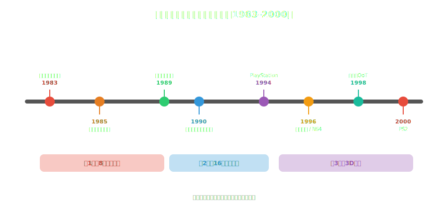
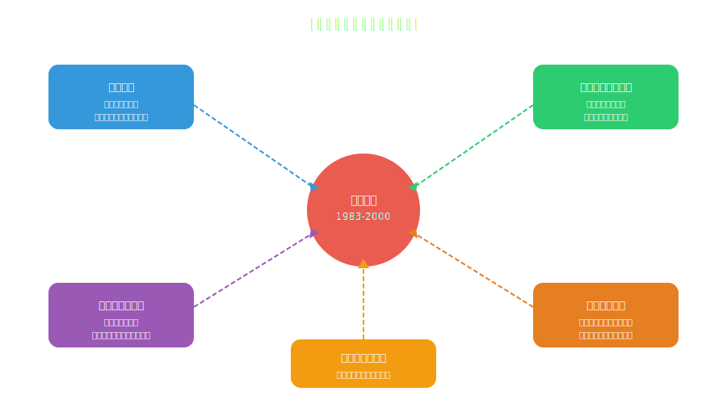
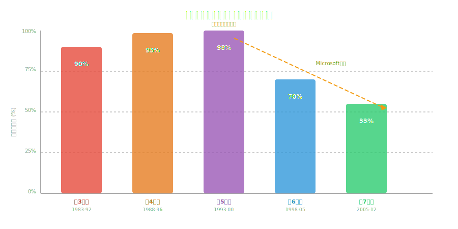

<!-- _class: lead -->
# 日本ゲーム産業の黄金時代
なぜ80-90年代の日本が世界を制覇したのか

- アタリショック後の廃墟から世界市場の98%を制覇
- 任天堂・ソニー・セガが築いた帝国の秘密
- そして、なぜ覇権は揺らいだのか

---

# アジェンダ

- 1. アタリショックと日本の機会
- 2. 任天堂の革命（1983-1990）
- 3. 16ビット戦争とクリエイターの台頭
- 4. PlayStation革命（1994-2000）
- 5. 黄金時代の成功要因
- 6. 衰退の始まりと教訓

---

<!-- _class: lead -->
# アタリショックと日本の機会

---

# 1983年：北米ゲーム市場の崩壊

- **アタリショック** ― 市場規模が32億ドルから1億ドルへ**97%縮小**
- 原因：粗悪なソフトの氾濫（E.T.は砂漠に埋められた）
- 品質管理の欠如 → 消費者の信頼喪失
- 「ビデオゲームは一時的な流行だった」という認識が広がる
- **しかし、太平洋の向こうでは全く別の物語が始まっていた**

---

<!-- _class: lead -->
# 任天堂の革命

---

# ファミリーコンピュータ（1983年）

- 山内溥社長の決断：**ゲーム専用機**に集中する
- 価格14,800円 ― 当時の競合の半額以下
- リコー製カスタムCPU（6502互換）で他社を圧倒
- **1985年までに日本で1,500万台を販売**
- 北米では「NES」として再設計 → トイザらスとの提携で復活

---

# 任天堂の品質管理革命

- **「Seal of Quality」システム** ― アタリの失敗を繰り返さない
- サードパーティは年間5本までしか発売できない
- 全ソフトを任天堂が審査・承認する仕組み
- 10NESロックアウトチップで非公認ソフトを排除
- **結果：** NESタイトルの平均品質が飛躍的に向上
- → これは現代のApp Storeレビューの原型

---

# 日本ゲーム産業タイムライン

---

<!-- _class: lead -->
# 16ビット戦争とクリエイターの台頭

---

# セガ vs 任天堂：最初のコンソール戦争

- **メガドライブ（1988）** vs **スーパーファミコン（1990）**
- セガ：「ジェネシスはニンテンドーのできないことをする」攻撃的マーケ
- ソニック・ザ・ヘッジホッグ → 北米でNESのシェアを奪う
- 任天堂：マリオ、ゼルダ、FF、ドラクエで反撃
- **この競争が両社の革新を加速した**
- → 競合が品質を高めるのはプラットフォーム競争の本質

---

# 天才クリエイターたちの時代

- **宮本茂（任天堂）** ― マリオ・ゼルダ・ドンキーコング
- **坂口博信（スクウェア）** ― ファイナルファンタジー
- **堀井雄二（エニックス）** ― ドラゴンクエスト
- **中裕司（セガ）** ― ソニック・ザ・ヘッジホッグ
- **横井軍平（任天堂）** ― ゲームボーイ「枯れた技術の水平思考」
- → **個人の天才がIPを創り、企業を支えた**

---

<!-- _class: lead -->
# PlayStation革命

---

# ソニーの参入（1994年）

- 任天堂との共同開発決裂 → 久夛良木健の独自プロジェクト
- **CD-ROM採用** ― カートリッジの10倍以上の容量
- 開発キットが安い → サードパーティが殺到
- ロイヤリティ率を任天堂より大幅に下げる
- **「ゲームは子供のもの」というイメージを覆す**
- → 20代・30代をターゲットにしたマーケティング戦略

---

# PlayStationが変えたもの

- **FF7（1997）** ― 3DCGムービーで映画的体験を実現
- メタルギアソリッド ― シネマティックなゲームデザイン
- グランツーリスモ ― シミュレーションジャンルの確立
- バイオハザード ― サバイバルホラーの誕生
- **累計販売：1億249万台** ― 初めて1億台を超えたゲーム機
- → ゲームが「文化」として認知される転換点

---

<!-- _class: lead -->
# 黄金時代の成功要因

---

# なぜ日本が世界を制覇できたのか

---

# 世界市場シェアの推移

---

# 5つの構造的優位性

- **1. アタリショック後の空白** ― 競合不在の市場に参入
- **2. ハード・ソフト垂直統合** ― プラットフォーム+コンテンツの両方を支配
- **3. 品質管理の徹底** ― 任天堂モデルが業界標準に
- **4. 文化的蓄積** ― マンガ・アニメのストーリーテリング技法
- **5. 長期的視点の経営** ― 短期利益より「ファンの信頼」を重視

---

<!-- _class: lead -->
# 衰退の始まりと教訓

---

# 覇権が揺らいだ理由

- **2001年：Xbox参入** ― Microsoftが3兆円の資金力で市場に
- オンライン対応の遅れ（Xbox LiveがPS2に先行）
- HD開発の高コスト化 → 日本の中小スタジオが淘汰
- FPSジャンルの勃興 → 西洋型ゲームデザインの台頭
- **日本の強みだった「職人芸」がスケールしなくなった**

---

# 黄金時代からの教訓

- **品質管理は持続的成長の基盤** ― 短期利益の追求は市場を壊す
- **プラットフォームの力** ― ハード+ソフトの垂直統合が最強の堀
- **クリエイターへの投資** ― 天才個人のビジョンがIPを創る
- **文化的土壌の重要性** ― 技術だけでは世界は獲れない
- **競争が革新を生む** ― 独占は停滞を、競争は進化を生む
- → **これらの教訓は、今のテック産業にもそのまま当てはまる**

---

<!-- _class: lead -->
# まとめ

- 日本ゲーム産業の黄金時代は**偶然ではなく構造的必然**だった
- 品質管理・技術革新・クリエイター投資・文化的蓄積の組み合わせ
- アタリの失敗に学び、任天堂が築いた仕組みが業界を変えた
- 覇権の喪失もまた構造的 ― グローバル化とコスト増大への対応遅れ
- **「なぜ勝てたか」を知ることは「何が普遍的か」を知ること**

---

# 参考文献

- - **書籍・論文:**
- - [Game Over: Press Start to Continue - David Sheff](https://www.amazon.com/dp/0966961706)
- - [Console Wars - Blake J. Harris](https://www.amazon.com/dp/0062276700)
- - **データ・統計:**
- - [Video Game History Foundation](https://gamehistory.org/)
- - [VGChartz - Hardware Sales](https://www.vgchartz.com/)
- - **記事:**
- - [The Rise of Nintendo - Ars Technica](https://arstechnica.com/gaming/)

