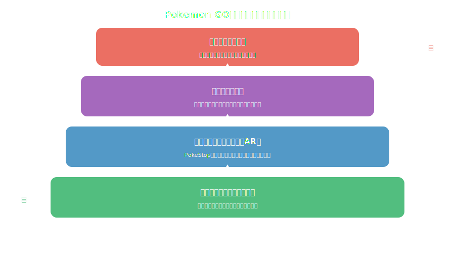
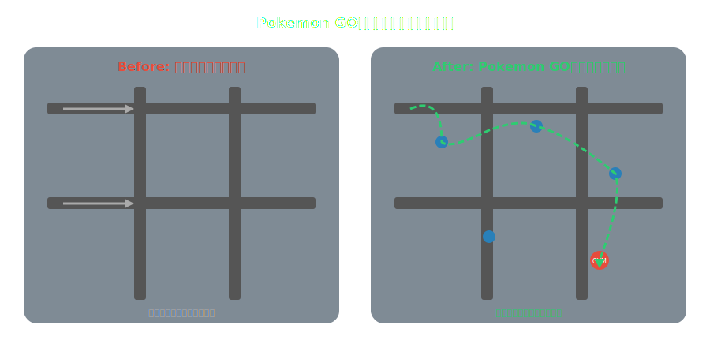
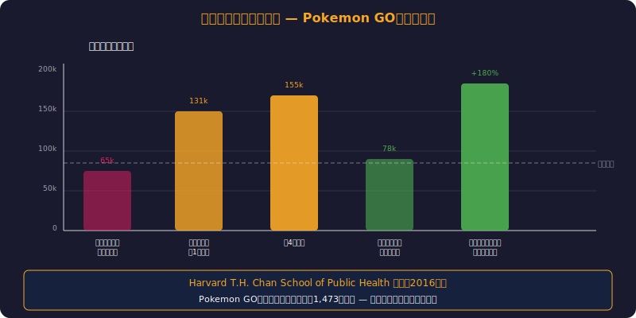
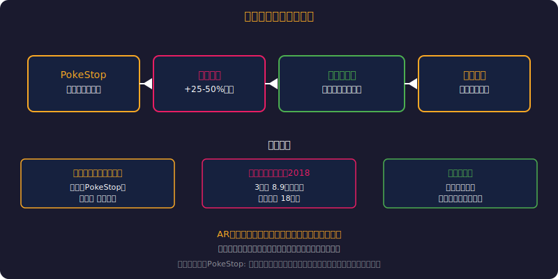
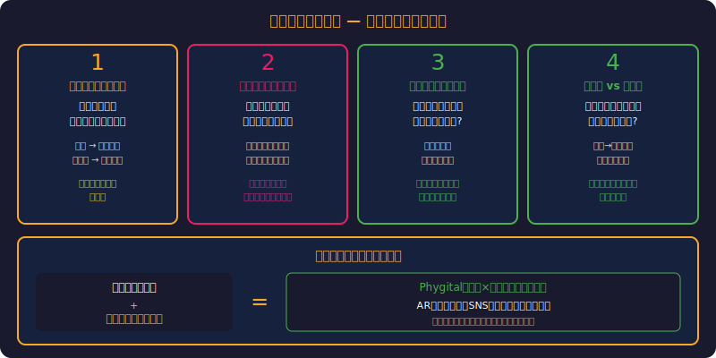
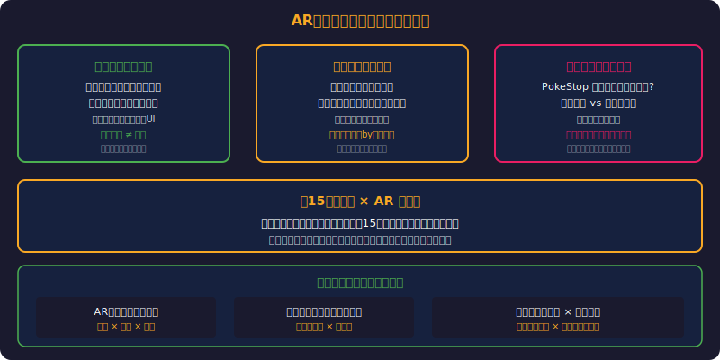

<!-- _class: lead -->
# Pokemon GOと都市デザイン
拡張現実が変えた街の歩き方

- 7.5億ダウンロードが生んだ社会実験
- ゲームが都市計画に影響を与えた史上初の事例
- ARと公共空間の未来を考える

---

# アジェンダ

> *ARが都市の歩き方・経済・コミュニティを変えた全貌を追う*

- 1. Pokemon GOの社会現象
- 2. 都市空間への影響メカニズム
- 3. 歩行パターンの変化
- 4. 経済・コミュニティ効果
- 5. 都市計画への示唆
- 6. AR時代の公共空間デザイン

---

<!-- _class: lead -->
# Pokemon GOの社会現象

---

# 数字で見るPokemon GOのインパクト

> *7.5億DL・初月26%歩行増加—史上最大の位置情報実験*

- **2016年7月リリース** ― 初月で最もDLされたアプリの世界記録
- 累計DL数：**7.5億以上**（2023年時点）
- 累計収益：**60億ドル以上**
- リリース初月の歩行距離増加：**平均26%**（Stanford研究）
- ピーク時のDAU：**2,800万人（米国のみ）**
- → **史上最大の位置情報ゲーム実験**

---

# なぜPokemon GOは特別だったのか

> *IPパワー+ARインフラ+無料のタイミングが揃った奇跡*

- **1. 既存のIPパワー** ― ポケモンブランドの20年の蓄積
- **2. 位置情報 + AR** ― Ingressの技術基盤（Niantic）
- **3. 低い参入障壁** ― スマホだけで遊べる無料ゲーム
- **4. 社会的ゲームデザイン** ― 外に出て歩くことがゲーム目的
- **5. 偶然のタイミング** ― スマホ普及率90%超の時代に登場

---

<!-- _class: lead -->
# 都市空間への影響メカニズム

---

# 4層の影響モデル

---

# PokeStopが都市の「目」を変えた

> *NYセントラルパーク利用30%増—デジタルが物理空間を再発見させた*

- **PokeStop = 都市のランドマークの再発見装置**
- 普段通り過ぎていた彫刻・記念碑・壁画に足を止める人々
- 地域の歴史・文化遺産への「気づき」が生まれた
- 公園や広場の利用率が大幅に上昇（NYセントラルパーク+30%）
- 「知っていたけど見ていなかった」場所の価値が可視化された
- → ジェイン・ジェイコブスの「街路の目」がデジタルで実現

---

<!-- _class: lead -->
# 歩行パターンの変化

---

# 最短経路から探索型歩行へ

---

# 歩行データが示す変化

> *非運動層への+1,473歩効果—ゲームが公衆衛生に貢献した稀有な事例*

- **Microsoft Research（2017）の分析結果：**
- Pokemon GOプレイヤーの1日あたり歩行数：**+1,473歩**
- 効果の持続期間：約30日後に減衰（ただし完全にはゼロに戻らない）
- 「運動しない層」への効果が最大 ― 普段歩かない人が歩いた
- 公園滞在時間：平均**+47分**（ポケモン出現スポットがある公園）
- → **ゲーミフィケーションが公衆衛生に貢献した稀有な事例**

---

<!-- _class: lead -->
# 経済・コミュニティ効果

---

# 地域経済への波及効果

> *3日間で8.9万人・18億円—ARが聖地巡礼の新しい形を創出した*

- **スポンサードPokeStop** ― マクドナルド・スターバックスが参加
- PokeStop近くの小売店：**売上+25-50%**（複数調査の報告）
- 地方自治体のコラボイベント ― 鳥取砂丘・横須賀・熊本
- 鳥取砂丘イベント（2018）：**3日間で8.9万人来場、経済効果18億円**
- → **ARゲームが「聖地巡礼」の新しい形を創出**

---

# コミュニティの自発的形成

> *デジタルがリアルなコミュニティを生む—弱い紐帯がゲームで実証*

- **レイドバトル** ― 見知らぬ人同士が協力する設計
- コミュニティ・デイ ― 月1回の大規模イベントが公園に人を集める
- Discord/LINEグループが自然発生 → リアルの友人関係に発展
- 高齢者の参加率が予想外に高い（社会的孤立の解消）
- 「弱い紐帯の強さ」（グラノヴェッター）がゲームで実証された
- → **デジタルがリアルなコミュニティを生むパラドックス**

---

<!-- _class: lead -->
# 都市計画への示唆

---

# Pokemon GOが教えた都市計画の盲点

> *動機付けなき公共空間は使われない—楽しさが経路を変える*

- **1. 公共空間はデザインだけでは使われない** ― 動機付けが必要
- **2. 歩行者は合理的に動かない** ― 「楽しさ」が経路を変える
- **3. ランドマークの価値は可視化されるまでわからない**
- **4. 「サードプレイス」はデジタルで創れる** ― 物理的な場所+デジタルレイヤー
- **5. 安全設計が追いつかない** ― 歩きスマホ・不法侵入の問題

---

# AR時代の都市計画フレームワーク

> *Walkability指標にデジタルレイヤーを加えた共同設計が必須*

- **Walkability（歩きやすさ）の再定義が必要：**
- 従来：歩道幅・信号タイミング・バリアフリー
- AR時代：+デジタルレイヤーとの共存・注意力の分散・集客ポイント設計
- ---
- **提案される新指標：**
- Digital Walkability Index ― AR利用時の安全性と楽しさの両立度
- → 物理空間とデジタル空間の**共同設計**が必須に

---

<!-- _class: lead -->
# AR時代の公共空間デザイン

---

# Pokemon GOの先にある未来

> *ARグラス時代に都市はパーソナライズされた景観になる*

- **ARグラス時代** ― スマホを覗き込む必要がなくなる
- デジタルツインと連携した都市体験（バーチャル歴史ガイドなど）
- 「見える人だけに見える」パーソナライズされた都市景観
- 公共アートのAR展示 ― 物理的設置不要のパブリックアート
- **課題：** デジタルデバイド・プライバシー・注意力の搾取
- → 技術的可能性と倫理的制約のバランスが鍵

---

<!-- _class: lead -->
# まとめ

- Pokemon GOは**ゲームの姿をした壮大な都市実験**だった
- ARが人の歩行パターン・経済活動・コミュニティを変えることを実証
- 都市計画は「物理空間のみ」の設計から脱却する必要がある
- 公共空間の価値はデジタルレイヤーで増幅できる
- **問い：** 次のPokemon GOは何か？その時、都市は準備できているか？

---

# 参考文献

- - **学術研究:**
- - [Pokemon GO and Physical Activity (The Lancet, 2016)](https://www.thelancet.com/journals/landig/)
- - [Influence of Pokemon GO on Physical Activity (JMIR, 2017)](https://www.jmir.org/)
- - **データ・分析:**
- - [Niantic Labs Official Blog](https://nianticlabs.com/blog)
- - [Sensor Tower - Pokemon GO Revenue Data](https://sensortower.com/)

