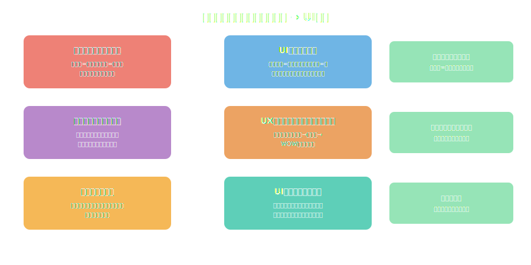

<!-- _class: lead -->
# マンガに学ぶUXデザイン
視線誘導・情報設計・感情設計の技法

- 100年の歴史を持つマンガの「読ませる技術」
- それはUIデザインの原則と驚くほど一致する
- コマ割り・視線誘導・感情曲線の応用

---

# アジェンダ

- 1. なぜマンガとUXデザインを比較するのか
- 2. 視線誘導の技法
- 3. 情報設計とコマ割り
- 4. 感情設計のテクニック
- 5. マンガ発のUX原則
- 6. 実践への応用

---

<!-- _class: lead -->
# なぜマンガとUXデザインを比較するのか

---

# マンガ = 紙の上のUXデザイン

- **マンガ家が解決している問題：**
- 限られた紙面に情報を配置し、読者の視線を制御する
- 感情の起伏を設計し、ページをめくらせ続ける
- 複雑な物語を誰でも理解できる形で伝える
- ---
- **UIデザイナーが解決している問題：**
- 限られた画面に情報を配置し、ユーザーの視線を制御する

---

# 手塚治虫が発明したもの

- **映画的手法の導入（1950年代）：**
- パン・ズーム・モンタージュをマンガに翻訳
- コマのサイズと配置で「時間の速度」を制御
- 見開きページで「WOWモーメント」を創出
- ---
- これらは全て、現代のUI/UXデザインの基本原則
- → **マンガは60年前からUXデザインを実践していた**

---

<!-- _class: lead -->
# 視線誘導の技法

---

# マンガとUIの視線フロー比較

---

# 視線誘導の3原則

- **1. 自然な読み順に逆らわない**
- マンガ：右→左、上→下（日本語の読み順）
- UI：左→右、上→下（F字パターン・Z字パターン）
- **2. 大きい要素が視線を引く**
- マンガ：大ゴマ = 重要なシーン / UI：ヒーロー画像 = メインメッセージ
- **3. コントラストが注目を集める**
- マンガ：ベタ（黒）と余白 / UI：色・サイズ・余白のコントラスト

---

<!-- _class: lead -->
# 情報設計とコマ割り

---

# コマ割り = レイアウトグリッド

- **マンガのコマ割りルール：**
- 均等なコマ割り → 安定感・日常シーン
- 不均等なコマ割り → 緊張感・アクション
- コマを壊す（枠線越え）→ 驚き・衝撃
- ---
- **UIのグリッドシステム：**
- 均等グリッド → ダッシュボード・一覧画面
- 非対称レイアウト → ランディングページ・プロモーション

---

# 情報の「密度」をコントロールする

- **マンガ：** 1ページあたりのコマ数で情報密度を調整
- アクション：1-3コマ（疾走感）→ 情報少・感情多
- 日常会話：5-7コマ（安定感）→ 情報多・感情安定
- 見開き：1コマ（衝撃）→ 情報集中・感情最大
- ---
- **UI：** 1スクリーンあたりの要素数で認知負荷を調整
- → マンガ家もUXデザイナーも**認知負荷管理の専門家**

---

<!-- _class: lead -->
# 感情設計のテクニック

---

# マンガの感情設計 → UI応用マッピング

---

# 「見開き」の力 = フルスクリーン体験

- マンガの見開きページ：**読者が息を呑む瞬間**
- 情報量をゼロにして、1つの絵だけで感情を伝える
- ---
- UIでの応用：
- フルスクリーンモーダル → 重要なアクション確認
- スプラッシュスクリーン → ブランドの第一印象
- 完了画面のアニメーション → 達成感の演出
- → **「何も見せない」ことで最も強い印象を残す**

---

<!-- _class: lead -->
# マンガ発のUX原則

---

# 原則1：ガター（コマ間の余白）の力

- **ガター = マンガのコマとコマの間の空白**
- 読者はガターで「時間の経過」や「場面転換」を脳内補完する
- スコット・マクラウドが「クロージャー」と呼んだ認知プロセス
- ---
- **UIでの応用：**
- ステップインジケーター間の空白 → 進行感
- カード間のスペーシング → 情報のチャンク化
- ページ遷移のトランジション → 文脈の切り替え
- → **余白は「何もない」のではなく「意味がある」**

---

# 原則2：吹き出し = 情報の階層化

- **マンガの吹き出しシステム：**
- 通常の吹き出し → 普通の会話
- ギザギザ吹き出し → 叫び・驚き
- モノローグ（角丸四角）→ 内心・ナレーション
- ---
- **UIでの応用：**
- ツールチップ → 補足情報（吹き出し的）
- トースト通知 → 一時的メッセージ
- アラートバナー → 緊急の情報（ギザギザ=赤いアラート）

---

<!-- _class: lead -->
# 実践への応用

---

# マンガ的UXデザインチェックリスト

- **視線誘導：** ユーザーの視線は自然な順序で流れているか？
- **情報密度：** 1画面に詰め込みすぎていないか？（コマ数管理）
- **感情曲線：** ユーザージャーニーに起伏があるか？
- **余白の意味：** ホワイトスペースは意図的に設計されているか？
- **WOWモーメント：** 「見開き」に相当する体験はあるか？
- **情報の階層：** 情報の重要度は視覚的に区別されているか？

---

<!-- _class: lead -->
# まとめ

- マンガは**100年かけて磨かれたUXデザインの宝庫**
- 視線誘導・情報設計・感情設計の原則はUIデザインと共通
- 「コマ割り=レイアウト」「ガター=余白」「見開き=フルスクリーン」
- マンガ家は「読者がページをめくり続ける」体験を設計している
- **UXデザイナーは「ユーザーがスクロールし続ける」体験を設計している**

---

# 参考文献

- - **書籍:**
- - [Understanding Comics - Scott McCloud](https://www.amazon.com/dp/006097625X)
- - [マンガの描き方 - 手塚治虫](https://www.amazon.co.jp/dp/4334727441)
- - **UXデザイン:**
- - [Don't Make Me Think - Steve Krug](https://www.amazon.com/dp/0321965515)
- - [Laws of UX - Jon Yablonski](https://lawsofux.com/)

