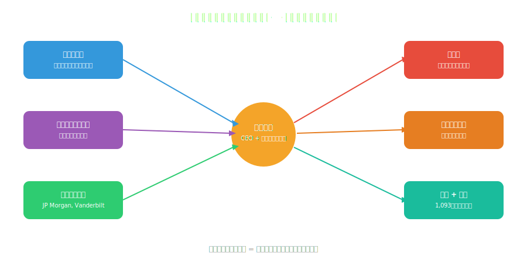
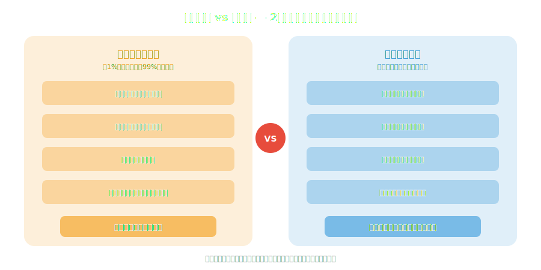

<!-- _class: lead -->
# エジソンは発明家ではなく起業家だった
イノベーションの真実

- 1,093件の特許を持つ「発明王」の本当の顔
- メンロパーク研究所 = 世界初のイノベーションファクトリー
- 現代のテック企業に通じるビジネスモデル

---

# アジェンダ

- 1. エジソン神話の解体
- 2. メンロパーク：世界初の研究開発ラボ
- 3. 発明ファクトリーのビジネスモデル
- 4. エジソン vs テスラ：2つのモデル
- 5. 現代テック企業との類似
- 6. イノベーションの教訓

---

<!-- _class: lead -->
# エジソン神話の解体

---

# 「電球を発明した」は嘘

- **白熱電球の歴史：**
- 1802年：ハンフリー・デイヴィーがアーク灯を実演
- 1840年代：ウォーレン・デ・ラ・リューが真空管電球を実験
- 1878年：ジョセフ・スワンが実用的な白熱電球を特許取得
- **1879年：エジソンがスワンの改良版で特許取得**
- → エジソンの天才は「発明」ではなく「改良+商業化+インフラ構築」

---

# エジソンの本当の才能

- **発明家としてのエジソン：** 確かに優秀だが、突出した天才ではない
- **起業家としてのエジソン：** 歴史上最も成功した一人
- ---
- 彼が本当に得意だったこと：
- 市場のニーズを見抜く力
- チームをマネジメントする力
- 投資家を説得する力
- メディアを操作する力（セルフブランディングの天才）

---

<!-- _class: lead -->
# メンロパーク：世界初の研究開発ラボ

---

# メンロパーク研究所（1876年）

- ニュージャージー州に設立された**世界初の産業研究所**
- 常時14-25人のエンジニア・科学者・職人が在籍
- 「10日ごとに小さな発明、6ヶ月ごとに大きな発明」が目標
- 数学者・機械工・吹きガラス職人・化学者の**学際チーム**
- → 現代のR&Dラボ、Google Xの原型
- → **発明を「個人の天才」から「組織のプロセス」に変えた**

---

<!-- _class: lead -->
# 発明ファクトリーのビジネスモデル

---

# エジソンのビジネスモデル全体像

---

# 特許戦略 ― 攻撃的IP経営

- **1,093件の米国特許** ― 生涯を通じた特許出願
- 多くの特許は「改良特許」― 他者の発明を実用化する方向で出願
- 特許訴訟を積極的に活用（「特許トロール」の元祖とも）
- 電球特許でスワンと訴訟 → 最終的に合弁会社で決着
- **映画産業では特許プールを形成** → 独占的地位を確立
- → 現代のApple/Qualcommの特許戦略と同じ発想

---

# インフラ戦略 ― 製品だけでなくシステムを売る

- 電球を売るだけでは不十分 → **電力インフラごと構築**
- 1882年：パールストリート発電所（マンハッタン）開設
- 発電所 + 送電線 + 電力メーター + 電球 = **垂直統合**
- 「電球が欲しければ、うちの電力網を使うしかない」
- → Appleの「ハード+OS+App Store」戦略と同じ構造
- → **ロックインによる独占がエジソンの本質**

---

<!-- _class: lead -->
# エジソン vs テスラ：2つのモデル

---

# 電流戦争に見る2つのイノベーションモデル

---

# テスラは正しかった、でもエジソンが勝った

- **技術的事実：** 交流（AC）は直流（DC）より送電効率が圧倒的に優れていた
- **ビジネス的事実：** エジソンはDCインフラに巨額投資済みだった
- エジソンの戦略：交流の危険性を宣伝（動物を交流で感電死させるデモ）
- 最終的にACが勝利 → しかしエジソンは別の事業で巨富を得た
- ---
- **教訓：** 技術的に正しいことと、ビジネスで勝つことは別問題

---

<!-- _class: lead -->
# 現代テック企業との類似

---

# エジソン → 現代テック企業マッピング

- **メンロパーク研究所** → Google X / Apple Park R&D
- **特許による独占** → Qualcommのライセンスモデル
- **インフラ垂直統合** → Apple（ハード+OS+サービス）
- **メディア操作** → イーロン・マスクのTwitter戦略
- **他者の発明を商業化** → Facebookの「コピー&スケール」
- → **エジソンは150年前のシリコンバレー起業家**

---

# スティーブ・ジョブズとの類似点

- **「発明」より「統合」が天才** ― iPodは最初のMP3プレーヤーではない
- **デザインと体験への執着** ― エジソンも電球の「見た目」にこだわった
- **チームの才能を引き出す** ― ウォズニアック = テスラ的存在
- **プレゼンの天才** ― エジソンもデモンストレーションの名手
- **残酷なビジネス判断** ― 両者とも元パートナーを容赦なく切った

---

<!-- _class: lead -->
# イノベーションの教訓

---

# エジソンから学ぶ6つの教訓

- **1. 発明 ≠ イノベーション** ― 商業化して初めて価値が生まれる
- **2. チームが個人に勝る** ― 天才よりシステムが持続する
- **3. インフラを制する者が市場を制する**
- **4. 特許は攻撃兵器にもなる** ― IPの戦略的活用
- **5. ナラティブの力** ― 「発明王」という物語が資金を集めた
- **6. 技術的正しさだけでは不十分** ― 市場・タイミング・政治が必要

---

<!-- _class: lead -->
# まとめ

- エジソンは「発明家」ではなく**「発明を産業化する起業家」**だった
- メンロパーク研究所は現代のR&Dラボの直接の祖先
- 特許戦略・垂直統合・メディア操作は現代テック企業の手法そのもの
- テスラの悲劇は「技術が正しくてもビジネスで負ける」ことの証明
- **イノベーション = 発明 × 商業化 × タイミング × 政治**

---

# 参考文献

- - **書籍:**
- - [Edison: A Life of Invention - Paul Israel](https://www.amazon.com/dp/0471529427)
- - [Empires of Light - Jill Jonnes](https://www.amazon.com/dp/0375758844)
- - **学術資料:**
- - [Thomas Edison Papers (Rutgers)](https://edison.rutgers.edu/)
- - [Smithsonian: Edison's Inventions](https://www.si.edu/spotlight/thomas-edison)

