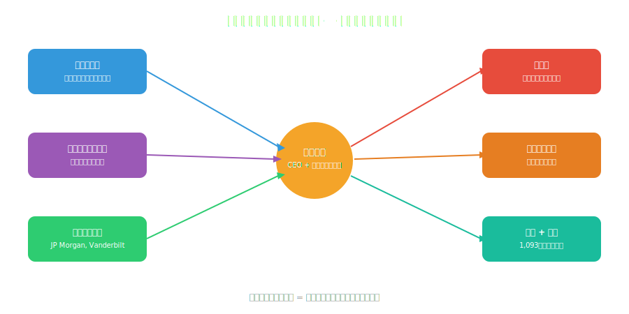
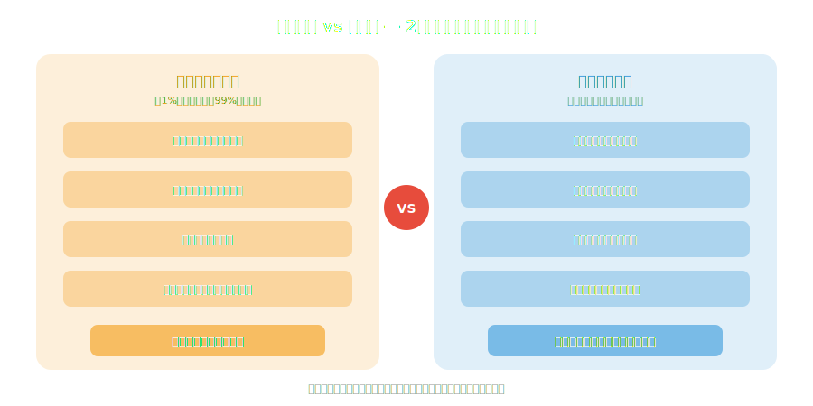

<!-- _class: invert lead -->
# エジソンは発明家ではなく起業家だった
イノベーションの真実

- 1,093件の特許を持つ「発明王」の本当の顔
- メンロパーク研究所 = 世界初のイノベーションファクトリー
- 現代のテック企業に通じるビジネスモデル

---

<!-- _class: invert fit-88 -->
# アジェンダ

> *神話を解体しR&D・IP・垂直統合の起業家モデルを再構成する*

1. エジソン神話の解体
2. メンロパーク：世界初の研究開発ラボ
3. 発明ファクトリーのビジネスモデル
4. エジソン vs テスラ：2つのモデル
5. 現代テック企業との類似
6. イノベーションの教訓

---

<!-- _class: invert lead -->
# エジソン神話の解体

---

<!-- _class: invert fit-70 -->
# 「電球を発明した」は嘘

> *改良+商業化+インフラ構築こそがエジソンの真の天才*

<svg viewBox="0 0 800 400" style="display:block;margin:0 auto;display:block;width:100%;height:100%;max-width:100%;max-height:100%;margin:0 auto;letter-spacing:0;" xmlns="http://www.w3.org/2000/svg">
  <rect width="800" height="400" fill="#1a1a2e"/>
  <text x="400" y="35" text-anchor="middle" fill="#ffffff" font-size="16" font-weight="bold" font-family="sans-serif">電球の歴史：エジソンは何番目か？</text>
  <line x1="60" y1="200" x2="740" y2="200" stroke="#16213e" stroke-width="6" rx="3"/>
  <!-- 1802 Davy -->
  <circle cx="100" cy="200" r="10" fill="#555555"/>
  <line x1="100" y1="190" x2="100" y2="120" stroke="#555555" stroke-width="1.5"/>
  <text x="100" y="110" text-anchor="middle" fill="#aaaaaa" font-size="11" font-family="sans-serif">1802</text>
  <text x="100" y="95" text-anchor="middle" fill="#aaaaaa" font-size="10" font-family="sans-serif">デイヴィー</text>
  <text x="100" y="82" text-anchor="middle" fill="#aaaaaa" font-size="10" font-family="sans-serif">アーク灯</text>
  <!-- 1840s De la Rue -->
  <circle cx="220" cy="200" r="10" fill="#555555"/>
  <line x1="220" y1="210" x2="220" y2="280" stroke="#555555" stroke-width="1.5"/>
  <text x="220" y="295" text-anchor="middle" fill="#aaaaaa" font-size="11" font-family="sans-serif">1840s</text>
  <text x="220" y="310" text-anchor="middle" fill="#aaaaaa" font-size="10" font-family="sans-serif">デ・ラ・リュー</text>
  <text x="220" y="325" text-anchor="middle" fill="#aaaaaa" font-size="10" font-family="sans-serif">真空管電球実験</text>
  <!-- 1878 Swan -->
  <circle cx="500" cy="200" r="12" fill="#f9a825"/>
  <line x1="500" y1="188" x2="500" y2="120" stroke="#f9a825" stroke-width="1.5"/>
  <text x="500" y="110" text-anchor="middle" fill="#f9a825" font-size="12" font-weight="bold" font-family="sans-serif">1878</text>
  <text x="500" y="95" text-anchor="middle" fill="#f9a825" font-size="11" font-family="sans-serif">スワン</text>
  <text x="500" y="82" text-anchor="middle" fill="#f9a825" font-size="10" font-family="sans-serif">実用白熱電球</text>
  <text x="500" y="69" text-anchor="middle" fill="#f9a825" font-size="10" font-family="sans-serif">特許取得</text>
  <!-- 1879 Edison -->
  <circle cx="650" cy="200" r="16" fill="#e91e63"/>
  <line x1="650" y1="216" x2="650" y2="285" stroke="#e91e63" stroke-width="2"/>
  <text x="650" y="300" text-anchor="middle" fill="#e91e63" font-size="13" font-weight="bold" font-family="sans-serif">1879</text>
  <text x="650" y="318" text-anchor="middle" fill="#ffffff" font-size="12" font-weight="bold" font-family="sans-serif">エジソン</text>
  <text x="650" y="335" text-anchor="middle" fill="#ffffff" font-size="10" font-family="sans-serif">スワンを改良・特許</text>
  <text x="650" y="350" text-anchor="middle" fill="#e91e63" font-size="10" font-family="sans-serif">+商業化+インフラ</text>
  <!-- Genius label -->
  <text x="400" y="375" text-anchor="middle" fill="#f9a825" font-size="13" font-family="sans-serif">エジソンの真の天才 = 改良 + 商業化 + 電力インフラ構築</text>
</svg>

- **白熱電球の歴史：**
- 1802年：ハンフリー・デイヴィーがアーク灯を実演
- 1840年代：ウォーレン・デ・ラ・リューが真空管電球を実験
- 1878年：ジョセフ・スワンが実用的な白熱電球を特許取得
- **1879年：エジソンがスワンの改良版で特許取得**
- → エジソンの天才は「発明」ではなく「改良+商業化+インフラ構築」

---

<!-- _class: invert fit-82 -->
# エジソンの本当の才能（1/2）

> *発明家60%・起業家95%—スキルレーダーが真実を示す*

<svg viewBox="0 0 800 400" style="display:block;margin:0 auto;display:block;width:100%;height:100%;max-width:100%;max-height:100%;margin:0 auto;letter-spacing:0;" xmlns="http://www.w3.org/2000/svg">
  <rect width="800" height="400" fill="#1a1a2e"/>
  <text x="400" y="30" text-anchor="middle" fill="#ffffff" font-size="16" font-weight="bold" font-family="sans-serif">エジソンのスキルプロフィール：発明家 vs 起業家</text>
  <!-- Radar center -->
  <g transform="translate(400,210)">
    <!-- Axes: 5 skills -->
    <!-- Pure Invention -->
    <line x1="0" y1="0" x2="0" y2="-130" stroke="#555555" stroke-width="1"/>
    <!-- Business -->
    <line x1="0" y1="0" x2="124" y2="-40" stroke="#555555" stroke-width="1"/>
    <!-- Team -->
    <line x1="0" y1="0" x2="76" y2="104" stroke="#555555" stroke-width="1"/>
    <!-- Marketing -->
    <line x1="0" y1="0" x2="-76" y2="104" stroke="#555555" stroke-width="1"/>
    <!-- Infra -->
    <line x1="0" y1="0" x2="-124" y2="-40" stroke="#555555" stroke-width="1"/>
    <!-- Grid circles -->
    <circle cx="0" cy="0" r="43" fill="none" stroke="#333355" stroke-width="1"/>
    <circle cx="0" cy="0" r="86" fill="none" stroke="#333355" stroke-width="1"/>
    <circle cx="0" cy="0" r="130" fill="none" stroke="#333355" stroke-width="1"/>
    <!-- Edison polygon (scores: invention 60%, business 95%, team 90%, marketing 95%, infra 95%) -->
    <polygon points="0,-78 118,-38 72,99 -72,99 -118,-38" fill="#f9a825" opacity="0.3" stroke="#f9a825" stroke-width="2"/>
    <!-- Labels -->
    <text x="0" y="-145" text-anchor="middle" fill="#aaaaaa" font-size="11" font-family="sans-serif">純粋な発明</text>
    <text x="145" y="-38" text-anchor="start" fill="#f9a825" font-size="11" font-family="sans-serif">ビジネス戦略</text>
    <text x="88" y="120" text-anchor="middle" fill="#f9a825" font-size="11" font-family="sans-serif">チーム管理</text>
    <text x="-88" y="120" text-anchor="middle" fill="#f9a825" font-size="11" font-family="sans-serif">マーケティング</text>
    <text x="-155" y="-38" text-anchor="end" fill="#f9a825" font-size="11" font-family="sans-serif">インフラ構築</text>
    <!-- Scores at tips -->
    <text x="0" y="-90" text-anchor="middle" fill="#aaaaaa" font-size="10" font-family="sans-serif">60%</text>
    <text x="130" y="-25" text-anchor="start" fill="#f9a825" font-size="10" font-family="sans-serif">95%</text>
    <text x="80" y="108" text-anchor="middle" fill="#f9a825" font-size="10" font-family="sans-serif">90%</text>
    <text x="-80" y="108" text-anchor="middle" fill="#f9a825" font-size="10" font-family="sans-serif">95%</text>
    <text x="-135" y="-25" text-anchor="end" fill="#f9a825" font-size="10" font-family="sans-serif">95%</text>
  </g>
</svg>

- **発明家としてのエジソン：** 確かに優秀だが、突出した天才ではない
- **起業家としてのエジソン：** 歴史上最も成功した一人
- ---
- 彼が本当に得意だったこと：

---

<!-- _class: invert fit-94 -->
# エジソンの本当の才能（2/2）

> *市場嗅覚+チーム構築+投資家説得が発明を産業に変えた*

<svg viewBox="0 0 800 400" style="display:block;margin:0 auto;display:block;width:100%;height:100%;max-width:100%;max-height:100%;margin:0 auto;letter-spacing:0;" xmlns="http://www.w3.org/2000/svg">
  <rect width="800" height="400" fill="#1a1a2e"/>
  <text x="400" y="28" text-anchor="middle" fill="#ffffff" font-size="16" font-weight="bold" font-family="sans-serif">エジソンの4つの核心能力</text>
  <!-- 4 boxes in 2x2 -->
  <!-- Market sensing -->
  <rect x="30" y="55" width="360" height="140" rx="10" fill="#16213e" stroke="#f9a825" stroke-width="2"/>
  <text x="210" y="85" text-anchor="middle" fill="#f9a825" font-size="13" font-weight="bold" font-family="sans-serif">市場ニーズを見抜く力</text>
  <text x="210" y="110" text-anchor="middle" fill="#ffffff" font-size="11" font-family="sans-serif">「電球」より「電力システム全体」を売る</text>
  <text x="210" y="130" text-anchor="middle" fill="#aaaaaa" font-size="10" font-family="sans-serif">個別製品ではなくプラットフォームを構想</text>
  <text x="210" y="152" text-anchor="middle" fill="#f9a825" font-size="10" font-family="sans-serif">→ 現代: Jobs の「PC でなくライフスタイルを売る」</text>
  <text x="210" y="182" text-anchor="middle" fill="#aaaaaa" font-size="9" font-family="sans-serif">ニーズ発見 → プロダクト化 → インフラ整備</text>
  <!-- Team management -->
  <rect x="410" y="55" width="360" height="140" rx="10" fill="#16213e" stroke="#f9a825" stroke-width="2"/>
  <text x="590" y="85" text-anchor="middle" fill="#f9a825" font-size="13" font-weight="bold" font-family="sans-serif">チームをマネジメントする力</text>
  <text x="590" y="110" text-anchor="middle" fill="#ffffff" font-size="11" font-family="sans-serif">数学者・化学者・職人を統率</text>
  <text x="590" y="130" text-anchor="middle" fill="#aaaaaa" font-size="10" font-family="sans-serif">「10日1発明」という明確なSLAを設定</text>
  <text x="590" y="152" text-anchor="middle" fill="#f9a825" font-size="10" font-family="sans-serif">→ 現代: Google の OKR / Sprint 文化</text>
  <text x="590" y="182" text-anchor="middle" fill="#aaaaaa" font-size="9" font-family="sans-serif">人材の多様性 × 明確なゴール設定</text>
  <!-- Investor persuasion -->
  <rect x="30" y="215" width="360" height="140" rx="10" fill="#16213e" stroke="#e91e63" stroke-width="2"/>
  <text x="210" y="245" text-anchor="middle" fill="#e91e63" font-size="13" font-weight="bold" font-family="sans-serif">投資家を説得する力</text>
  <text x="210" y="270" text-anchor="middle" fill="#ffffff" font-size="11" font-family="sans-serif">JP Morgan から資金調達</text>
  <text x="210" y="290" text-anchor="middle" fill="#aaaaaa" font-size="10" font-family="sans-serif">デモで「夢」を見せ資本を動かした</text>
  <text x="210" y="312" text-anchor="middle" fill="#e91e63" font-size="10" font-family="sans-serif">→ 現代: Y Combinator デモデー</text>
  <text x="210" y="342" text-anchor="middle" fill="#aaaaaa" font-size="9" font-family="sans-serif">技術ではなく「未来」を売る能力</text>
  <!-- Media manipulation -->
  <rect x="410" y="215" width="360" height="140" rx="10" fill="#16213e" stroke="#e91e63" stroke-width="2"/>
  <text x="590" y="245" text-anchor="middle" fill="#e91e63" font-size="13" font-weight="bold" font-family="sans-serif">メディアを操作する力</text>
  <text x="590" y="270" text-anchor="middle" fill="#ffffff" font-size="11" font-family="sans-serif">「発明王」というブランドを自ら創造</text>
  <text x="590" y="290" text-anchor="middle" fill="#aaaaaa" font-size="10" font-family="sans-serif">記者に積極的にデモを見せた</text>
  <text x="590" y="312" text-anchor="middle" fill="#e91e63" font-size="10" font-family="sans-serif">→ 現代: Elon Musk の Twitter 戦略</text>
  <text x="590" y="342" text-anchor="middle" fill="#aaaaaa" font-size="9" font-family="sans-serif">ナラティブが資金・人材を引き寄せる</text>
</svg>

- 市場のニーズを見抜く力
- チームをマネジメントする力
- 投資家を説得する力
- メディアを操作する力（セルフブランディングの天才）

---

<!-- _class: invert lead -->
# メンロパーク：世界初の研究開発ラボ

---

<!-- _class: invert fit-76 -->
# メンロパーク研究所（1876年）

> *組織的プロセスで発明する世界初のR&Dラボを設計した*

<svg viewBox="0 0 800 400" style="display:block;margin:0 auto;display:block;width:100%;height:100%;max-width:100%;max-height:100%;margin:0 auto;letter-spacing:0;" xmlns="http://www.w3.org/2000/svg">
  <rect width="800" height="400" fill="#1a1a2e"/>
  <text x="400" y="30" text-anchor="middle" fill="#ffffff" font-size="16" font-weight="bold" font-family="sans-serif">メンロパーク研究所：世界初の組織的イノベーション</text>
  <!-- Edison at top -->
  <rect x="310" y="50" width="180" height="50" rx="10" fill="#e91e63" stroke="#e91e63" stroke-width="2"/>
  <text x="400" y="74" text-anchor="middle" fill="#ffffff" font-size="14" font-weight="bold" font-family="sans-serif">エジソン</text>
  <text x="400" y="92" text-anchor="middle" fill="#ffffff" font-size="10" font-family="sans-serif">ビジョン × 資金調達</text>
  <!-- Teams below -->
  <line x1="400" y1="100" x2="400" y2="135" stroke="#f9a825" stroke-width="2"/>
  <line x1="130" y1="135" x2="670" y2="135" stroke="#f9a825" stroke-width="2"/>
  <!-- Math -->
  <line x1="130" y1="135" x2="130" y2="155" stroke="#f9a825" stroke-width="1.5"/>
  <rect x="60" y="155" width="140" height="50" rx="8" fill="#16213e" stroke="#f9a825" stroke-width="1.5"/>
  <text x="130" y="178" text-anchor="middle" fill="#f9a825" font-size="12" font-family="sans-serif">数学者</text>
  <text x="130" y="196" text-anchor="middle" fill="#aaaaaa" font-size="10" font-family="sans-serif">理論・計算</text>
  <!-- Mech -->
  <line x1="280" y1="135" x2="280" y2="155" stroke="#f9a825" stroke-width="1.5"/>
  <rect x="210" y="155" width="140" height="50" rx="8" fill="#16213e" stroke="#f9a825" stroke-width="1.5"/>
  <text x="280" y="178" text-anchor="middle" fill="#f9a825" font-size="12" font-family="sans-serif">機械工</text>
  <text x="280" y="196" text-anchor="middle" fill="#aaaaaa" font-size="10" font-family="sans-serif">プロトタイプ製作</text>
  <!-- Chemist -->
  <line x1="430" y1="135" x2="430" y2="155" stroke="#f9a825" stroke-width="1.5"/>
  <rect x="360" y="155" width="140" height="50" rx="8" fill="#16213e" stroke="#f9a825" stroke-width="1.5"/>
  <text x="430" y="178" text-anchor="middle" fill="#f9a825" font-size="12" font-family="sans-serif">化学者</text>
  <text x="430" y="196" text-anchor="middle" fill="#aaaaaa" font-size="10" font-family="sans-serif">材料・実験</text>
  <!-- Glass -->
  <line x1="580" y1="135" x2="580" y2="155" stroke="#f9a825" stroke-width="1.5"/>
  <rect x="510" y="155" width="140" height="50" rx="8" fill="#16213e" stroke="#f9a825" stroke-width="1.5"/>
  <text x="580" y="178" text-anchor="middle" fill="#f9a825" font-size="12" font-family="sans-serif">ガラス職人</text>
  <text x="580" y="196" text-anchor="middle" fill="#aaaaaa" font-size="10" font-family="sans-serif">真空管・電球</text>
  <!-- Output -->
  <rect x="200" y="265" width="400" height="55" rx="10" fill="#16213e" stroke="#e91e63" stroke-width="2"/>
  <text x="400" y="290" text-anchor="middle" fill="#e91e63" font-size="14" font-weight="bold" font-family="sans-serif">「10日ごとに小さな発明」</text>
  <text x="400" y="310" text-anchor="middle" fill="#ffffff" font-size="11" font-family="sans-serif">「6ヶ月ごとに大きな発明」← 世界初の発明SLA</text>
  <!-- Arrow down -->
  <line x1="400" y1="205" x2="400" y2="265" stroke="#e91e63" stroke-width="2"/>
  <polygon points="400,265 392,250 408,250" fill="#e91e63"/>
  <!-- Google X comparison -->
  <text x="400" y="360" text-anchor="middle" fill="#f9a825" font-size="12" font-family="sans-serif">→ Google X / Apple R&amp;D / Bell Labs の直接の祖先</text>
</svg>

- ニュージャージー州に設立された**世界初の産業研究所**
- 常時14-25人のエンジニア・科学者・職人が在籍
- 「10日ごとに小さな発明、6ヶ月ごとに大きな発明」が目標
- 数学者・機械工・吹きガラス職人・化学者の**学際チーム**
- → 現代のR&Dラボ、Google Xの原型
- → **発明を「個人の天才」から「組織のプロセス」に変えた**

---

<!-- _class: invert lead -->
# 発明ファクトリーのビジネスモデル

---

# エジソンのビジネスモデル全体像

---

<!-- _class: invert fit-88 -->
# 特許戦略 ― 攻撃的IP経営

> *1,093件の攻撃的特許戦略はApple/Qualcommの原型*

- **1,093件の米国特許** ― 生涯を通じた特許出願
- 多くの特許は「改良特許」― 他者の発明を実用化する方向で出願
- 特許訴訟を積極的に活用（「特許トロール」の元祖とも）
- 電球特許でスワンと訴訟 → 最終的に合弁会社で決着
- **映画産業では特許プールを形成** → 独占的地位を確立
- → 現代のApple/Qualcommの特許戦略と同じ発想

---

<!-- _class: invert fit-64 -->
# インフラ戦略 ― 製品だけでなくシステムを売る

> *製品ではなくシステムを売る垂直統合がGAFAMに受け継がれた*

<svg viewBox="0 0 800 400" style="display:block;margin:0 auto;display:block;width:100%;height:100%;max-width:100%;max-height:100%;margin:0 auto;letter-spacing:0;" xmlns="http://www.w3.org/2000/svg">
  <rect width="800" height="400" fill="#1a1a2e"/>
  <text x="400" y="30" text-anchor="middle" fill="#ffffff" font-size="16" font-weight="bold" font-family="sans-serif">エジソンの特許戦略：攻撃的IP経営</text>
  <!-- Total patents visual -->
  <!-- Grid of patent squares: 1093 total, show proportionally -->
  <text x="400" y="65" text-anchor="middle" fill="#aaaaaa" font-size="12" font-family="sans-serif">1,093件の米国特許 — 種類別内訳</text>
  <!-- Improvement patents (large) -->
  <rect x="60" y="80" width="300" height="140" rx="8" fill="#16213e" stroke="#f9a825" stroke-width="2"/>
  <text x="210" y="140" text-anchor="middle" fill="#f9a825" font-size="28" font-weight="bold" font-family="sans-serif">~70%</text>
  <text x="210" y="165" text-anchor="middle" fill="#ffffff" font-size="13" font-family="sans-serif">改良特許</text>
  <text x="210" y="183" text-anchor="middle" fill="#aaaaaa" font-size="10" font-family="sans-serif">他者の発明を実用化・改良</text>
  <!-- Original patents -->
  <rect x="380" y="80" width="180" height="140" rx="8" fill="#16213e" stroke="#e91e63" stroke-width="2"/>
  <text x="470" y="140" text-anchor="middle" fill="#e91e63" font-size="24" font-weight="bold" font-family="sans-serif">~30%</text>
  <text x="470" y="165" text-anchor="middle" fill="#ffffff" font-size="13" font-family="sans-serif">原発明</text>
  <text x="470" y="183" text-anchor="middle" fill="#aaaaaa" font-size="10" font-family="sans-serif">独自の新規発明</text>
  <!-- Strategy -->
  <rect x="580" y="80" width="160" height="140" rx="8" fill="#16213e" stroke="#f9a825" stroke-width="1.5"/>
  <text x="660" y="120" text-anchor="middle" fill="#f9a825" font-size="11" font-family="sans-serif">防衛的特許</text>
  <text x="660" y="140" text-anchor="middle" fill="#aaaaaa" font-size="10" font-family="sans-serif">競合排除</text>
  <text x="660" y="165" text-anchor="middle" fill="#f9a825" font-size="11" font-family="sans-serif">攻撃的特許</text>
  <text x="660" y="183" text-anchor="middle" fill="#aaaaaa" font-size="10" font-family="sans-serif">ライセンス収入</text>
  <!-- Battle with Swan -->
  <rect x="60" y="250" width="680" height="100" rx="8" fill="#16213e" stroke="#e91e63" stroke-width="1.5"/>
  <text x="400" y="275" text-anchor="middle" fill="#e91e63" font-size="13" font-weight="bold" font-family="sans-serif">電球特許訴訟 (Edison vs Swan)</text>
  <text x="400" y="298" text-anchor="middle" fill="#ffffff" font-size="12" font-family="sans-serif">スワン特許 ←→ エジソン特許 → 長期訴訟 → 合弁会社「Ediswan」で和解</text>
  <text x="400" y="318" text-anchor="middle" fill="#f9a825" font-size="11" font-family="sans-serif">訴訟コストより市場独占が有利と判断 = 現代の特許プールと同じ発想</text>
  <text x="400" y="338" text-anchor="middle" fill="#aaaaaa" font-size="10" font-family="sans-serif">→ Apple vs Samsung / Qualcommのライセンスモデルの原型</text>
</svg>

- 電球を売るだけでは不十分 → **電力インフラごと構築**
- 1882年：パールストリート発電所（マンハッタン）開設
- 発電所 + 送電線 + 電力メーター + 電球 = **垂直統合**
- 「電球が欲しければ、うちの電力網を使うしかない」
- → Appleの「ハード+OS+App Store」戦略と同じ構造
- → **ロックインによる独占がエジソンの本質**

---

<!-- _class: invert lead -->
# エジソン vs テスラ：2つのモデル

---

# 電流戦争に見る2つのイノベーションモデル

---

<!-- _class: invert fit-58 -->
# テスラは正しかった、でもエジソンが勝った

> *技術的優位より市場制圧速度がイノベーションの勝敗を決めた*

<svg viewBox="0 0 800 400" style="display:block;margin:0 auto;display:block;width:100%;height:100%;max-width:100%;max-height:100%;margin:0 auto;letter-spacing:0;" xmlns="http://www.w3.org/2000/svg">
  <rect width="800" height="400" fill="#1a1a2e"/>
  <text x="400" y="30" text-anchor="middle" fill="#ffffff" font-size="16" font-weight="bold" font-family="sans-serif">電流戦争：技術的正解 vs ビジネスの勝者</text>
  <!-- Left: DC (Edison) -->
  <rect x="30" y="60" width="340" height="300" rx="12" fill="#16213e" stroke="#e91e63" stroke-width="2"/>
  <text x="200" y="90" text-anchor="middle" fill="#e91e63" font-size="15" font-weight="bold" font-family="sans-serif">エジソン (DC)</text>
  <text x="200" y="130" text-anchor="middle" fill="#aaaaaa" font-size="11" font-family="sans-serif">✗ 送電ロスが大きい</text>
  <text x="200" y="155" text-anchor="middle" fill="#aaaaaa" font-size="11" font-family="sans-serif">✗ 長距離送電に不適</text>
  <text x="200" y="180" text-anchor="middle" fill="#f9a825" font-size="11" font-family="sans-serif">✓ 既存インフラあり</text>
  <text x="200" y="205" text-anchor="middle" fill="#f9a825" font-size="11" font-family="sans-serif">✓ 資本・政治力あり</text>
  <text x="200" y="230" text-anchor="middle" fill="#f9a825" font-size="11" font-family="sans-serif">✓ 強力なメディア戦略</text>
  <text x="200" y="275" text-anchor="middle" fill="#e91e63" font-size="20" font-family="sans-serif">技術で負け</text>
  <text x="200" y="310" text-anchor="middle" fill="#f9a825" font-size="14" font-family="sans-serif">ビジネスは勝利</text>
  <!-- Right: AC (Tesla/Westinghouse) -->
  <rect x="430" y="60" width="340" height="300" rx="12" fill="#16213e" stroke="#f9a825" stroke-width="2"/>
  <text x="600" y="90" text-anchor="middle" fill="#f9a825" font-size="15" font-weight="bold" font-family="sans-serif">テスラ / ウェスチングハウス (AC)</text>
  <text x="600" y="130" text-anchor="middle" fill="#f9a825" font-size="11" font-family="sans-serif">✓ 送電効率が高い</text>
  <text x="600" y="155" text-anchor="middle" fill="#f9a825" font-size="11" font-family="sans-serif">✓ 長距離送電が可能</text>
  <text x="600" y="180" text-anchor="middle" fill="#f9a825" font-size="11" font-family="sans-serif">✓ 変圧が容易</text>
  <text x="600" y="205" text-anchor="middle" fill="#aaaaaa" font-size="11" font-family="sans-serif">✗ インフラ構築力なし</text>
  <text x="600" y="230" text-anchor="middle" fill="#aaaaaa" font-size="11" font-family="sans-serif">✗ ビジネス経験が薄い</text>
  <text x="600" y="275" text-anchor="middle" fill="#f9a825" font-size="20" font-family="sans-serif">技術で勝ち</text>
  <text x="600" y="310" text-anchor="middle" fill="#aaaaaa" font-size="14" font-family="sans-serif">長期では普及</text>
  <!-- VS in middle -->
  <text x="400" y="215" text-anchor="middle" fill="#ffffff" font-size="22" font-weight="bold" font-family="sans-serif">VS</text>
  <text x="400" y="355" text-anchor="middle" fill="#ffffff" font-size="12" font-family="sans-serif">教訓：技術的正しさ ≠ ビジネスの勝利</text>
</svg>

- **技術的事実：** 交流（AC）は直流（DC）より送電効率が圧倒的に優れていた
- **ビジネス的事実：** エジソンはDCインフラに巨額投資済みだった
- エジソンの戦略：交流の危険性を宣伝（動物を交流で感電死させるデモ）
- 最終的にACが勝利 → しかしエジソンは別の事業で巨富を得た
- ---
- **教訓：** 技術的に正しいことと、ビジネスで勝つことは別問題

---

<!-- _class: invert lead -->
# 現代テック企業との類似

---

<!-- _class: invert fit-64 -->
# エジソン → 現代テック企業マッピング

> *130年後のAmazonとAppleはエジソンモデルを再現している*

<svg viewBox="0 0 800 400" style="display:block;margin:0 auto;display:block;width:100%;height:100%;max-width:100%;max-height:100%;margin:0 auto;letter-spacing:0;" xmlns="http://www.w3.org/2000/svg">
  <rect width="800" height="400" fill="#1a1a2e"/>
  <text x="400" y="30" text-anchor="middle" fill="#ffffff" font-size="16" font-weight="bold" font-family="sans-serif">エジソン → 現代テック企業：150年のDNA</text>
  <!-- Table header -->
  <rect x="40" y="50" width="260" height="40" rx="4" fill="#16213e" stroke="#f9a825" stroke-width="1"/>
  <text x="170" y="75" text-anchor="middle" fill="#f9a825" font-size="13" font-weight="bold" font-family="sans-serif">エジソンの戦略</text>
  <rect x="310" y="50" width="440" height="40" rx="4" fill="#16213e" stroke="#f9a825" stroke-width="1"/>
  <text x="530" y="75" text-anchor="middle" fill="#f9a825" font-size="13" font-weight="bold" font-family="sans-serif">現代企業の対応</text>
  <!-- Rows -->
  <rect x="40" y="100" width="260" height="45" rx="2" fill="#16213e" stroke="#333355" stroke-width="1"/>
    <text x="170" y="122" text-anchor="middle" fill="#ffffff" font-size="11" font-family="sans-serif">メンロパーク研究所</text>
    <text x="170" y="137" text-anchor="middle" fill="#e91e63" font-size="10" font-family="sans-serif">← エジソン</text>
    <rect x="310" y="100" width="440" height="45" rx="2" fill="#16213e" stroke="#333355" stroke-width="1"/>
    <text x="530" y="127" text-anchor="middle" fill="#f9a825" font-size="12" font-family="sans-serif">Google X / Apple Park / Bell Labs</text><rect x="40" y="152" width="260" height="45" rx="2" fill="#1a1a2e" stroke="#333355" stroke-width="1"/>
    <text x="170" y="174" text-anchor="middle" fill="#ffffff" font-size="11" font-family="sans-serif">特許による独占</text>
    <text x="170" y="189" text-anchor="middle" fill="#e91e63" font-size="10" font-family="sans-serif">← エジソン</text>
    <rect x="310" y="152" width="440" height="45" rx="2" fill="#1a1a2e" stroke="#333355" stroke-width="1"/>
    <text x="530" y="179" text-anchor="middle" fill="#f9a825" font-size="12" font-family="sans-serif">Qualcomm ライセンスモデル</text><rect x="40" y="204" width="260" height="45" rx="2" fill="#16213e" stroke="#333355" stroke-width="1"/>
    <text x="170" y="226" text-anchor="middle" fill="#ffffff" font-size="11" font-family="sans-serif">垂直統合インフラ</text>
    <text x="170" y="241" text-anchor="middle" fill="#e91e63" font-size="10" font-family="sans-serif">← エジソン</text>
    <rect x="310" y="204" width="440" height="45" rx="2" fill="#16213e" stroke="#333355" stroke-width="1"/>
    <text x="530" y="231" text-anchor="middle" fill="#f9a825" font-size="12" font-family="sans-serif">Apple (ハード+OS+App Store)</text><rect x="40" y="256" width="260" height="45" rx="2" fill="#1a1a2e" stroke="#333355" stroke-width="1"/>
    <text x="170" y="278" text-anchor="middle" fill="#ffffff" font-size="11" font-family="sans-serif">メディア操作・ブランディング</text>
    <text x="170" y="293" text-anchor="middle" fill="#e91e63" font-size="10" font-family="sans-serif">← エジソン</text>
    <rect x="310" y="256" width="440" height="45" rx="2" fill="#1a1a2e" stroke="#333355" stroke-width="1"/>
    <text x="530" y="283" text-anchor="middle" fill="#f9a825" font-size="12" font-family="sans-serif">Elon Musk / Twitter戦略</text><rect x="40" y="308" width="260" height="45" rx="2" fill="#16213e" stroke="#333355" stroke-width="1"/>
    <text x="170" y="330" text-anchor="middle" fill="#ffffff" font-size="11" font-family="sans-serif">他者発明の商業化</text>
    <text x="170" y="345" text-anchor="middle" fill="#e91e63" font-size="10" font-family="sans-serif">← エジソン</text>
    <rect x="310" y="308" width="440" height="45" rx="2" fill="#16213e" stroke="#333355" stroke-width="1"/>
    <text x="530" y="335" text-anchor="middle" fill="#f9a825" font-size="12" font-family="sans-serif">Facebook「コピー＆スケール」</text>
  <!-- Arrow between columns -->
  <text x="295" y="215" text-anchor="middle" fill="#ffffff" font-size="22" font-family="sans-serif">→</text>
</svg>

- **メンロパーク研究所** → Google X / Apple Park R&D
- **特許による独占** → Qualcommのライセンスモデル
- **インフラ垂直統合** → Apple（ハード+OS+サービス）
- **メディア操作** → イーロン・マスクのTwitter戦略
- **他者の発明を商業化** → Facebookの「コピー&スケール」
- → **エジソンは150年前のシリコンバレー起業家**

---

<!-- _class: invert fit-70 -->
# スティーブ・ジョブズとの類似点

> *発明より商業化・デザインより体験—2人の起業家思想が一致*

<svg viewBox="0 0 800 400" style="display:block;margin:0 auto;display:block;width:100%;height:100%;max-width:100%;max-height:100%;margin:0 auto;letter-spacing:0;" xmlns="http://www.w3.org/2000/svg">
  <rect width="800" height="400" fill="#1a1a2e"/>
  <text x="400" y="28" text-anchor="middle" fill="#ffffff" font-size="16" font-weight="bold" font-family="sans-serif">エジソン vs ジョブズ：150年を超えたDNA</text>
  <!-- Two columns comparison -->
  <rect x="20" y="50" width="350" height="310" rx="10" fill="#16213e" stroke="#f9a825" stroke-width="2"/>
  <text x="195" y="80" text-anchor="middle" fill="#f9a825" font-size="14" font-weight="bold" font-family="sans-serif">Thomas Edison (1847-1931)</text>
  <rect x="430" y="50" width="350" height="310" rx="10" fill="#16213e" stroke="#e91e63" stroke-width="2"/>
  <text x="605" y="80" text-anchor="middle" fill="#e91e63" font-size="14" font-weight="bold" font-family="sans-serif">Steve Jobs (1955-2011)</text>
  <!-- Common traits -->
  <rect x="40" y="100" width="310" height="42" rx="4" fill="#1a1a2e" stroke="#f9a825" stroke-width="1"/>
    <text x="195" y="116" text-anchor="middle" fill="#f9a825" font-size="11" font-family="sans-serif">電球=スワン改良</text>
    <text x="195" y="132" text-anchor="middle" fill="#aaaaaa" font-size="9" font-family="sans-serif">改良が天才</text>
    <rect x="450" y="100" width="310" height="42" rx="4" fill="#1a1a2e" stroke="#e91e63" stroke-width="1"/>
    <text x="605" y="116" text-anchor="middle" fill="#e91e63" font-size="11" font-family="sans-serif">iPod=MP3非初</text>
    <text x="605" y="132" text-anchor="middle" fill="#aaaaaa" font-size="9" font-family="sans-serif">改良が天才</text><rect x="40" y="150" width="310" height="42" rx="4" fill="#1a1a2e" stroke="#f9a825" stroke-width="1"/>
    <text x="195" y="166" text-anchor="middle" fill="#f9a825" font-size="11" font-family="sans-serif">電球の見た目を重視</text>
    <text x="195" y="182" text-anchor="middle" fill="#aaaaaa" font-size="9" font-family="sans-serif">体験へのこだわり</text>
    <rect x="450" y="150" width="310" height="42" rx="4" fill="#1a1a2e" stroke="#e91e63" stroke-width="1"/>
    <text x="605" y="166" text-anchor="middle" fill="#e91e63" font-size="11" font-family="sans-serif">デザイン哲学</text>
    <text x="605" y="182" text-anchor="middle" fill="#aaaaaa" font-size="9" font-family="sans-serif">体験へのこだわり</text><rect x="40" y="200" width="310" height="42" rx="4" fill="#1a1a2e" stroke="#f9a825" stroke-width="1"/>
    <text x="195" y="216" text-anchor="middle" fill="#f9a825" font-size="11" font-family="sans-serif">メンロパーク全員</text>
    <text x="195" y="232" text-anchor="middle" fill="#aaaaaa" font-size="9" font-family="sans-serif">チームの才能引出</text>
    <rect x="450" y="200" width="310" height="42" rx="4" fill="#1a1a2e" stroke="#e91e63" stroke-width="1"/>
    <text x="605" y="216" text-anchor="middle" fill="#e91e63" font-size="11" font-family="sans-serif">ウォズ=テスラ的存在</text>
    <text x="605" y="232" text-anchor="middle" fill="#aaaaaa" font-size="9" font-family="sans-serif">チームの才能引出</text><rect x="40" y="250" width="310" height="42" rx="4" fill="#1a1a2e" stroke="#f9a825" stroke-width="1"/>
    <text x="195" y="266" text-anchor="middle" fill="#f9a825" font-size="11" font-family="sans-serif">デモが資金を集めた</text>
    <text x="195" y="282" text-anchor="middle" fill="#aaaaaa" font-size="9" font-family="sans-serif">プレゼンの天才</text>
    <rect x="450" y="250" width="310" height="42" rx="4" fill="#1a1a2e" stroke="#e91e63" stroke-width="1"/>
    <text x="605" y="266" text-anchor="middle" fill="#e91e63" font-size="11" font-family="sans-serif">Macworld Keynote</text>
    <text x="605" y="282" text-anchor="middle" fill="#aaaaaa" font-size="9" font-family="sans-serif">プレゼンの天才</text><rect x="40" y="300" width="310" height="42" rx="4" fill="#1a1a2e" stroke="#f9a825" stroke-width="1"/>
    <text x="195" y="316" text-anchor="middle" fill="#f9a825" font-size="11" font-family="sans-serif">元パートナーを切る</text>
    <text x="195" y="332" text-anchor="middle" fill="#aaaaaa" font-size="9" font-family="sans-serif">残酷なビジネス判断</text>
    <rect x="450" y="300" width="310" height="42" rx="4" fill="#1a1a2e" stroke="#e91e63" stroke-width="1"/>
    <text x="605" y="316" text-anchor="middle" fill="#e91e63" font-size="11" font-family="sans-serif">共同創業者を解雇</text>
    <text x="605" y="332" text-anchor="middle" fill="#aaaaaa" font-size="9" font-family="sans-serif">残酷なビジネス判断</text>
  <!-- Bridge between -->
  <rect x="375" y="200" width="50" height="50" rx="8" fill="#1a1a2e" stroke="#ffffff" stroke-width="1"/>
  <text x="400" y="228" text-anchor="middle" fill="#ffffff" font-size="18" font-family="sans-serif">≡</text>
  <text x="400" y="375" text-anchor="middle" fill="#f9a825" font-size="12" font-family="sans-serif">150年を超えて同じ「起業家の型」が繰り返される</text>
</svg>

- **「発明」より「統合」が天才** ― iPodは最初のMP3プレーヤーではない
- **デザインと体験への執着** ― エジソンも電球の「見た目」にこだわった
- **チームの才能を引き出す** ― ウォズニアック = テスラ的存在
- **プレゼンの天才** ― エジソンもデモンストレーションの名手
- **残酷なビジネス判断** ― 両者とも元パートナーを容赦なく切った

---

<!-- _class: invert lead -->
# イノベーションの教訓

<svg viewBox="0 0 800 400" style="display:block;margin:0 auto;display:block;width:100%;height:100%;max-width:100%;max-height:100%;margin:0 auto;letter-spacing:0;" xmlns="http://www.w3.org/2000/svg">
  <rect width="800" height="400" fill="#1a1a2e"/>
  <text x="400" y="30" text-anchor="middle" fill="#ffffff" font-size="16" font-weight="bold" font-family="sans-serif">イノベーション = 発明 × 商業化 × タイミング × 政治</text>
  <!-- Central formula -->
  <rect x="250" y="155" width="300" height="60" rx="12" fill="#16213e" stroke="#e91e63" stroke-width="2.5"/>
  <text x="400" y="183" text-anchor="middle" fill="#e91e63" font-size="16" font-weight="bold" font-family="sans-serif">イノベーション</text>
  <text x="400" y="203" text-anchor="middle" fill="#ffffff" font-size="11" font-family="sans-serif">発明 × 商業化 × タイミング × 政治</text>
  <!-- 6 lesson nodes -->
  <!-- Top -->
  <rect x="310" y="60" width="180" height="45" rx="8" fill="#16213e" stroke="#f9a825" stroke-width="1.5"/>
  <text x="400" y="80" text-anchor="middle" fill="#f9a825" font-size="11" font-family="sans-serif">発明 ≠ イノベーション</text>
  <text x="400" y="97" text-anchor="middle" fill="#aaaaaa" font-size="10" font-family="sans-serif">商業化して初めて価値</text>
  <line x1="400" y1="105" x2="400" y2="155" stroke="#f9a825" stroke-width="1.5"/>
  <!-- Bottom -->
  <rect x="310" y="270" width="180" height="45" rx="8" fill="#16213e" stroke="#f9a825" stroke-width="1.5"/>
  <text x="400" y="290" text-anchor="middle" fill="#f9a825" font-size="11" font-family="sans-serif">ナラティブの力</text>
  <text x="400" y="307" text-anchor="middle" fill="#aaaaaa" font-size="10" font-family="sans-serif">「発明王」が資金を集めた</text>
  <line x1="400" y1="215" x2="400" y2="270" stroke="#f9a825" stroke-width="1.5"/>
  <!-- Left top -->
  <rect x="50" y="100" width="170" height="45" rx="8" fill="#16213e" stroke="#f9a825" stroke-width="1.5"/>
  <text x="135" y="120" text-anchor="middle" fill="#f9a825" font-size="11" font-family="sans-serif">チームが個人に勝る</text>
  <text x="135" y="137" text-anchor="middle" fill="#aaaaaa" font-size="10" font-family="sans-serif">システムが持続する</text>
  <line x1="220" y1="145" x2="305" y2="175" stroke="#f9a825" stroke-width="1.5"/>
  <!-- Left bottom -->
  <rect x="50" y="240" width="170" height="45" rx="8" fill="#16213e" stroke="#f9a825" stroke-width="1.5"/>
  <text x="135" y="260" text-anchor="middle" fill="#f9a825" font-size="11" font-family="sans-serif">インフラを制する</text>
  <text x="135" y="277" text-anchor="middle" fill="#aaaaaa" font-size="10" font-family="sans-serif">者が市場を制する</text>
  <line x1="220" y1="263" x2="305" y2="200" stroke="#f9a825" stroke-width="1.5"/>
  <!-- Right top -->
  <rect x="580" y="100" width="170" height="45" rx="8" fill="#16213e" stroke="#f9a825" stroke-width="1.5"/>
  <text x="665" y="120" text-anchor="middle" fill="#f9a825" font-size="11" font-family="sans-serif">特許は攻撃兵器</text>
  <text x="665" y="137" text-anchor="middle" fill="#aaaaaa" font-size="10" font-family="sans-serif">IPの戦略的活用</text>
  <line x1="580" y1="145" x2="495" y2="175" stroke="#f9a825" stroke-width="1.5"/>
  <!-- Right bottom -->
  <rect x="580" y="240" width="170" height="45" rx="8" fill="#16213e" stroke="#f9a825" stroke-width="1.5"/>
  <text x="665" y="260" text-anchor="middle" fill="#f9a825" font-size="11" font-family="sans-serif">技術的正しさだけでは</text>
  <text x="665" y="277" text-anchor="middle" fill="#aaaaaa" font-size="10" font-family="sans-serif">不十分</text>
  <line x1="580" y1="263" x2="495" y2="200" stroke="#f9a825" stroke-width="1.5"/>
</svg>

---

<!-- _class: invert fit-82 -->
# エジソンから学ぶ6つの教訓

> *失敗を数でこなし市場ニーズから逆算する6原則*

- **1. 発明 ≠ イノベーション** ― 商業化して初めて価値が生まれる
- **2. チームが個人に勝る** ― 天才よりシステムが持続する
- **3. インフラを制する者が市場を制する**
- **4. 特許は攻撃兵器にもなる** ― IPの戦略的活用
- **5. ナラティブの力** ― 「発明王」という物語が資金を集めた
- **6. 技術的正しさだけでは不十分** ― 市場・タイミング・政治が必要

---

<!-- _class: invert lead fit-88 -->
# まとめ

<svg viewBox="0 0 800 400" style="display:block;margin:0 auto;display:block;width:100%;height:100%;max-width:100%;max-height:100%;margin:0 auto;letter-spacing:0;" xmlns="http://www.w3.org/2000/svg">
  <rect width="800" height="400" fill="#1a1a2e"/>
  <text x="400" y="28" text-anchor="middle" fill="#ffffff" font-size="16" font-weight="bold" font-family="sans-serif">エジソンが証明したイノベーション方程式</text>
  <!-- Formula visualization -->
  <rect x="60" y="70" width="680" height="90" rx="12" fill="#16213e" stroke="#e91e63" stroke-width="3"/>
  <text x="400" y="105" text-anchor="middle" fill="#e91e63" font-size="18" font-weight="bold" font-family="sans-serif">イノベーション = 発明 × 商業化 × タイミング × 政治</text>
  <text x="400" y="140" text-anchor="middle" fill="#aaaaaa" font-size="12" font-family="sans-serif">全てが揃って初めてイノベーションが実現する</text>
  <!-- 4 factors breakdown -->
  
    <rect x="20" y="195" width="120" height="100" rx="8" fill="#16213e" stroke="#f9a825" stroke-width="2"/>
    <text x="80" y="220" text-anchor="middle" fill="#f9a825" font-size="13" font-weight="bold" font-family="sans-serif">発明</text>
    <text x="80" y="240" text-anchor="middle" fill="#aaaaaa" font-size="10" font-family="sans-serif">技術的アイデア</text><text x="80" y="257" text-anchor="middle" fill="#aaaaaa" font-size="10" font-family="sans-serif">（エジソンは60%）</text>
  
    <rect x="190" y="195" width="120" height="100" rx="8" fill="#16213e" stroke="#e91e63" stroke-width="2"/>
    <text x="250" y="220" text-anchor="middle" fill="#e91e63" font-size="13" font-weight="bold" font-family="sans-serif">商業化</text>
    <text x="250" y="240" text-anchor="middle" fill="#aaaaaa" font-size="10" font-family="sans-serif">市場化・スケール</text><text x="250" y="257" text-anchor="middle" fill="#aaaaaa" font-size="10" font-family="sans-serif">（エジソンは95%）</text>
  
    <rect x="450" y="195" width="120" height="100" rx="8" fill="#16213e" stroke="#f9a825" stroke-width="2"/>
    <text x="510" y="220" text-anchor="middle" fill="#f9a825" font-size="13" font-weight="bold" font-family="sans-serif">タイミング</text>
    <text x="510" y="240" text-anchor="middle" fill="#aaaaaa" font-size="10" font-family="sans-serif">電力需要が</text><text x="510" y="257" text-anchor="middle" fill="#aaaaaa" font-size="10" font-family="sans-serif">高まる時代</text>
  
    <rect x="590" y="195" width="120" height="100" rx="8" fill="#16213e" stroke="#e91e63" stroke-width="2"/>
    <text x="650" y="220" text-anchor="middle" fill="#e91e63" font-size="13" font-weight="bold" font-family="sans-serif">政治</text>
    <text x="650" y="240" text-anchor="middle" fill="#aaaaaa" font-size="10" font-family="sans-serif">JP Morgan の</text><text x="650" y="257" text-anchor="middle" fill="#aaaaaa" font-size="10" font-family="sans-serif">資本・規制対応</text>
  
  <!-- Multiplication signs -->
  <text x="215" y="255" text-anchor="middle" fill="#ffffff" font-size="24" font-family="sans-serif">×</text>
  <text x="378" y="255" text-anchor="middle" fill="#ffffff" font-size="24" font-family="sans-serif">×</text>
  <text x="615" y="255" text-anchor="middle" fill="#ffffff" font-size="24" font-family="sans-serif">×</text>
  <!-- Conclusion -->
  <rect x="80" y="325" width="640" height="55" rx="10" fill="#16213e" stroke="#f9a825" stroke-width="2"/>
  <text x="400" y="348" text-anchor="middle" fill="#f9a825" font-size="13" font-weight="bold" font-family="sans-serif">「発明家ではなく発明を産業化する起業家」</text>
  <text x="400" y="368" text-anchor="middle" fill="#aaaaaa" font-size="11" font-family="sans-serif">これがエジソンの本質であり、現代シリコンバレーの原型</text>
</svg>

- エジソンは「発明家」ではなく**「発明を産業化する起業家」**だった
- メンロパーク研究所は現代のR&Dラボの直接の祖先
- 特許戦略・垂直統合・メディア操作は現代テック企業の手法そのもの
- テスラの悲劇は「技術が正しくてもビジネスで負ける」ことの証明
- **イノベーション = 発明 × 商業化 × タイミング × 政治**

---

<!-- _class: invert fit-88 -->
# 参考文献

> *エジソンの発明と経営を深く知るための主要書籍・文献一覧*

- **書籍:**
- [Edison: A Life of Invention - Paul Israel](https://www.amazon.com/dp/0471529427)
- [Empires of Light - Jill Jonnes](https://www.amazon.com/dp/0375758844)
- **学術資料:**
- [Thomas Edison Papers (Rutgers)](https://edison.rutgers.edu/)
- [Smithsonian: Edison's Inventions](https://www.si.edu/spotlight/thomas-edison)

