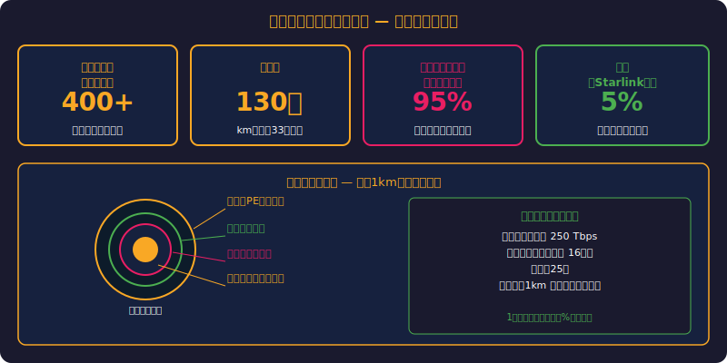
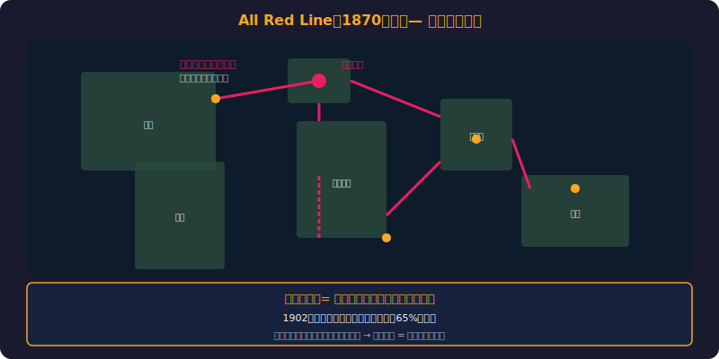
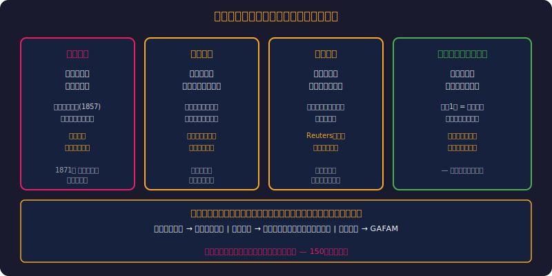
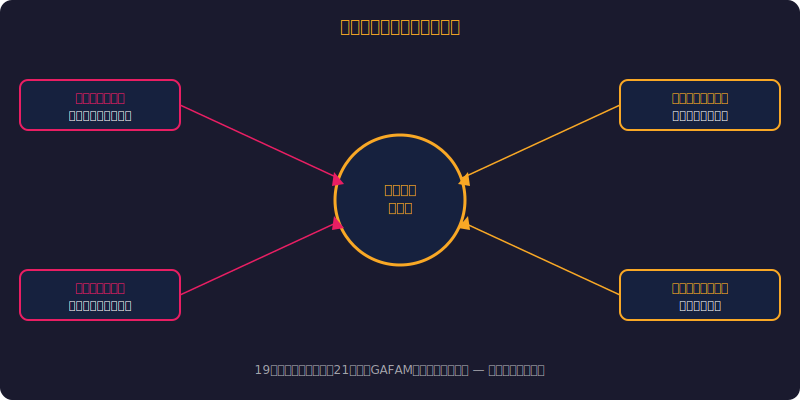
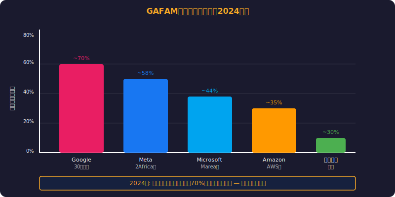
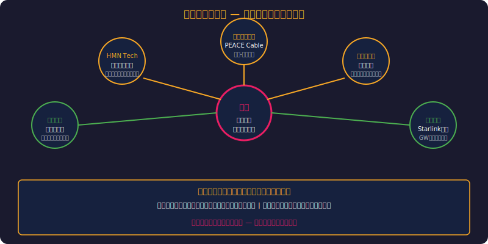
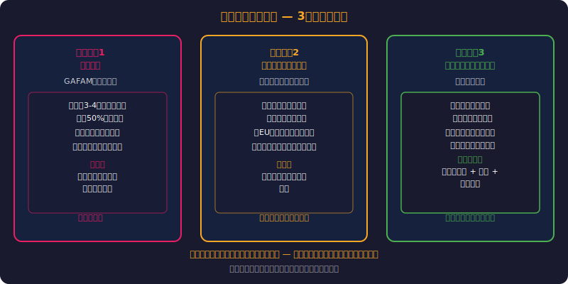
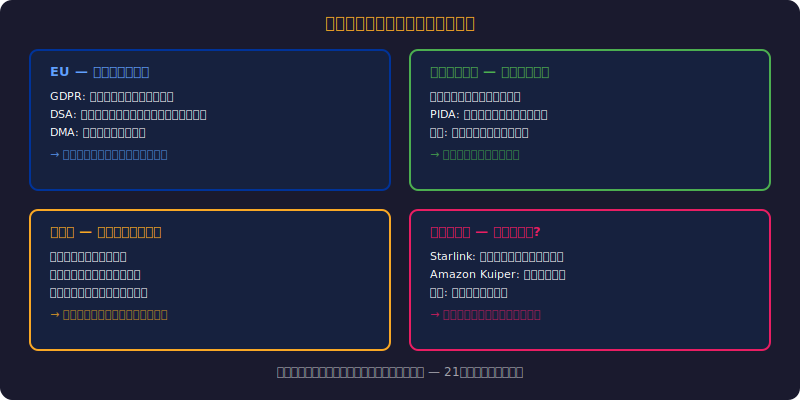

<!-- _class: invert lead -->
# 植民地ルートを走るインターネット
海底ケーブルと権力の地理学

- 世界のインターネット通信の99%は海底ケーブルを通る
- そのルートは大英帝国の電信網と驚くほど一致する
- デジタル時代にも「地理的権力」は存在する

---

<!-- _class: invert fit-88 -->
# アジェンダ

> *6章で海底ケーブルと地政学的権力の全構造を解明する*

1. 海底ケーブルの基本事実
2. 大英帝国の電信網（1870年代）
3. 植民地ルートとの一致
4. GAFAMが築く新たなケーブル帝国
5. アフリカの「デジタル植民地」問題
6. 地理的権力の未来

---

<!-- _class: invert lead -->
# 海底ケーブルの基本事実

---

<!-- _class: invert fit-88 -->
# 知られざるインターネットの物理層

> *99%が直径17mmのケーブルを通る—衛星はわずか1%未満*

- **世界のインターネット通信の99%** は海底ケーブルを通る
- 現在稼働中のケーブル：約**550本**、総延長**140万km以上**
- ケーブルの直径：わずか**17mm**（庭のホース程度）
- 海底8,000mに敷設されるものもある
- 1本のケーブルで毎秒**数百テラビット**を伝送
- → 衛星通信は全体の**1%未満**（遅延が大きく帯域が小さい）

---

<!-- _class: invert lead -->
# 大英帝国の電信網

---

<!-- _class: invert fit-76 -->
# All Red Line（1870年代）

> *全ルートが英領のみ通過—通信支配が帝国支配と同義だった*

- **大英帝国が「全赤線」と呼んだ世界電信ネットワーク**
- ロンドンからカイロ、ボンベイ、シンガポール、シドニーへ
- 全てのケーブルが**イギリス領土のみ**を中継する設計
- 目的：戦時にも敵国に傍受されない通信路の確保
- ケーブル敷設・運営はイギリス企業が独占
- → **電信の支配 = 帝国の支配**だった

---

<!-- _class: invert fit-64 -->
# 電信がなぜ植民地支配に不可欠だったか

> *数ヶ月から数時間へ—リアルタイム情報が支配の武器になった*

- **ロンドンからインドへの通信時間：**
- 手紙：数ヶ月 → 電信：**数時間**
- 植民地の反乱を即座に察知し、軍隊を派遣できる
- 商品価格をリアルタイムで把握 → 交易の主導権を握る
- 現地の行政官を本国から直接管理できる
- → **通信インフラ = 支配のインフラ**

---

<!-- _class: invert lead -->
# 植民地ルートとの一致

---

# 150年前と今の構造比較

---

<!-- _class: invert fit-88 -->
# ルートが一致する理由

> *港湾都市の固定化+地形制約+経済慣性が150年の継続性を説明*

- **1. 中継地点の固定化** ― 港湾都市は変わらない
- カイロ、ムンバイ、シンガポールは150年前から中継点
- **2. 地形的制約** ― ケーブルが通れる海底地形は限られる
- **3. 経済的合理性** ― 既存ルートに沿って敷設するのが安い
- **4. 需要の集中** ― 旧宗主国と旧植民地の経済的つながり
- → **物理的インフラは「歴史の慣性」から逃れられない**

---

<!-- _class: invert lead -->
# GAFAMが築く新たなケーブル帝国

---

<!-- _class: invert fit-70 -->
# テック企業の海底ケーブル投資

> *新規投資の70%超がGAFAM—通信会社からの権力移転が進行中*

- **Google** ― 世界30本以上のケーブルに投資・所有
- **Meta（Facebook）** ― 2Africa（アフリカ一周ケーブル、37,000km）
- **Microsoft** ― Marea（大西洋横断、160Tbps）
- **Amazon** ― 自社AWSデータセンター接続用ケーブル
- 2024年時点：**新規海底ケーブル投資の70%以上がテック企業**
- → 通信会社からテック企業への**インフラ権力移転**が進行中

---

<!-- _class: invert fit-64 -->
# 「ケーブルを持つ者がルールを決める」

> *データ経路の物理的制御=デジタル主権の喪失—現代の帝国構造*

- ケーブル所有 = **データの物理的経路を制御**できる
- どの国のどのデータセンターを経由するか決められる
- 障害時のトラフィック迂回を自社に有利に誘導できる
- 新興国にとって、ケーブル依存 = **デジタル主権の喪失**
- → かつてのイギリスがケーブルで帝国を管理したように
- → GAFAMがケーブルでデジタル世界を管理する

---

<!-- _class: invert lead -->
# アフリカの「デジタル植民地」問題

---

<!-- _class: invert fit-70 -->
# アフリカのインターネット接続の現実

> *ナイジェリアからケニアがロンドン経由—70%が大陸外を通る現実*

- アフリカの多くの国は**欧州経由**でインターネットに接続
- ナイジェリアからケニアへのデータが**ロンドン経由**で届く
- アフリカ内の国際通信の**70%以上が大陸外を経由**
- これはコスト増・遅延増・プライバシーリスクを意味する
- ---
- 旧宗主国のインフラに依存する構造 = **デジタル新植民地主義**
- → データの「通り道」が政治的権力を生んでいる

---

<!-- _class: invert fit-76 -->
# 中国の対抗戦略

> *PEACEケーブルが海底インフラを21世紀の地政学的領土にした*

- **PEACE Cable（2022年）** ― パキスタン-東アフリカ-フランス
- 一帯一路の「デジタルシルクロード」の一環
- HMN Technologies（華為海洋）がケーブル敷設を担当
- 米国・EU：「中国がケーブルに傍受装置を仕込むリスク」を警戒
- 結果：ケーブル敷設の地政学的審査が厳格化
- → **海底ケーブルは21世紀の「領土」になりつつある**

---

<!-- _class: invert lead -->
# 地理的権力の未来

---

<!-- _class: invert fit-76 -->
# デジタル主権への動き

> *衛星も米国依存—インフラの地政学から完全に逃れることはできない*

- **アフリカ連合：** 大陸内ケーブル網の構築を推進
- **EU：** GDPR + 欧州データ主権 → 域外経由を制限する動き
- **インド：** 自国接続ケーブルの多様化（中国経由を回避）
- **Starlink：** 衛星インターネットがケーブル依存を減らす可能性
- → しかし衛星も米国企業依存（SpaceX, Amazon Kuiper）
- → **インフラの地政学から完全に逃れることはできない**

---

<!-- _class: invert lead -->
# まとめ

- インターネットは「国境のないデジタル空間」ではない
- その物理的基盤は**150年前の植民地支配のルート**を踏襲している
- 通信インフラの支配 = 情報の支配 = 権力
- GAFAMは新たな「ケーブル帝国」を築きつつある
- **問い：** 誰が「インターネットの道路」を所有すべきか？

---

<!-- _class: invert fit-82 -->
# 参考文献

> *TeleGeographyと学術書でデジタル植民地構造を実証する*

- **書籍:**
- [The Undersea Network - Nicole Starosielski](https://www.amazon.com/dp/0822357550)
- [Tubes: A Journey to the Center of the Internet - Andrew Blum](https://www.amazon.com/dp/0061994952)
- **データ:**
- [Submarine Cable Map (TeleGeography)](https://www.submarinecablemap.com/)
- [Internet Society: Submarine Cables](https://www.internetsociety.org/)

