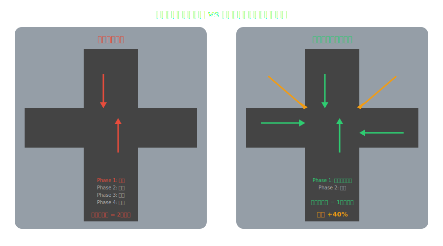

<!-- _class: lead -->
# 渋谷スクランブル交差点の最適化
3,000人が45秒で渡れる理由

- 世界最大級の交差点はなぜ「事故なく」機能するのか
- 群衆力学・信号制御・自己組織化の交差点
- エンジニアリングと人間行動の美しい調和

---

# アジェンダ

- 1. 渋谷スクランブル交差点とは
- 2. スクランブル方式の仕組み
- 3. 群衆力学：なぜぶつからないのか
- 4. 信号制御の最適化
- 5. 自己組織化する歩行者
- 6. 分散システム設計への示唆

---

<!-- _class: lead -->
# 渋谷スクランブル交差点とは

---

# 数字で見る渋谷スクランブル

![w:800 center]()
- **1回の青信号（約45秒）で最大3,000人が横断**
- 1日の横断者数：**約50万人**（休日は更に多い）
- 交差点の面積：約**3,000平方メートル**
- 5つの横断歩道が同時に青になる**全方向スクランブル方式**
- 1969年に導入 ― 50年以上事故率が極めて低い
- → 世界で最も効率的な交差点の一つ

---

<!-- _class: lead -->
# スクランブル方式の仕組み

---

# 通常交差点 vs スクランブル交差点

---

# スクランブル方式の発明と導入

- **1951年：** ヘンリー・バーンズがデンバーで初のスクランブル交差点を設置
- **1969年：** 渋谷に導入（当時は「歩車分離式」と呼ばれた）
- **原理：** 歩行者フェーズと車両フェーズを完全分離
- 歩行者青：全方向（対角線含む）の歩行が可能
- 車両青：歩行者は全員待機
- → **歩車の衝突リスクをゼロにする設計思想**

---

<!-- _class: lead -->
# 群衆力学：なぜぶつからないのか

---

# レーン形成（Lane Formation）

![w:800 center]()
- **3,000人が同時に歩いても衝突しない理由：**
- 歩行者は無意識に**同じ方向に向かう人の後ろに並ぶ**
- 対向する人流が自然に「レーン」を形成する
- → これは**自己組織化**の典型例（誰も指示していない）
- ---
- 物理学では「相転移」に似た現象として研究されている
- 個体の単純なルール → 集団の複雑な秩序が**創発**する

---

# 歩行者の3つの無意識ルール

![w:800 center]()
- **1. 回避ルール** ― 前方1.5-2mに人がいたら横にずれる
- **2. 追従ルール** ― 同じ方向の人の後ろを歩く（レーン形成）
- **3. 目的地直進ルール** ― 基本的に最短経路を目指す
- ---
- この3ルールだけで、3,000人の群衆が**45秒間ほぼ衝突なく**渡りきれる
- → アリのコロニーと同じ「単純ルール → 複雑秩序」のパターン

---

<!-- _class: lead -->
# 信号制御の最適化

---

# 渋谷の信号サイクル設計（1/2）

- **総サイクル：約150秒（2.5分）**
- 歩行者フェーズ：47秒（青40秒 + 点滅7秒）
- 車両フェーズ：約100秒（各方向に分配）
- ---

---

# 渋谷の信号サイクル設計（2/2）

- **最適化のポイント：**
- 歩行者青の時間は「最も遠い対角線を渡りきれる」長さに設定
- 対角線距離：約40m → 歩行速度1.0m/sで40秒
- 点滅7秒は「渡り始めた人が到着するための余裕」

---

# リアルタイム制御の進化

![w:800 center]()
- **カメラ+AI** ― 歩行者密度をリアルタイム計測
- 混雑時は歩行者フェーズを延長する動的制御
- イベント時（カウントダウン等）は特別制御に切り替え
- 渋谷区とNECが共同で群衆監視システムを運用
- → **50年前のアナログ設計 + 現代のAI制御 = ハイブリッド最適化**

---

<!-- _class: lead -->
# 自己組織化する歩行者

---

# 渋谷交差点が教える分散システムの原理（1/2）

- **中央制御はほぼない** ― 信号が「Go/Stop」を出すだけ
- 3,000人の経路計画は**各個人が自律的に行う**
- それでも全体として効率的なフローが実現する
- ---

---

# 渋谷交差点が教える分散システムの原理（2/2）

- 分散システムとの類似：
- 信号 = ロードバランサー（大まかな制御のみ）
- 歩行者 = マイクロサービス（自律的に動作）
- レーン形成 = 自己組織化クラスタリング

---

# なぜ渋谷では機能するのか（文化的要因）

![w:800 center]()
- **1. 規範遵守** ― 赤信号で渡らない文化
- **2. 他者への配慮** ― 「ぶつかったらすみません」の精神
- **3. 歩行速度の均一性** ― 極端に遅い/速い人が少ない
- **4. 傘の文化** ― 雨でも歩行パターンが安定（傘が「バッファ」に）
- ---
- → **同じ交差点設計でも、文化が違えば機能しない可能性がある**
- → システム設計は「ユーザーの行動特性」を前提に成立する

---

<!-- _class: lead -->
# 分散システム設計への示唆

![w:800 center]()

---

# 渋谷交差点から学ぶ設計原則

- **1. 完全分離は安全だが効率的** ― 歩車分離は衝突をゼロにする
- **2. 最小限の中央制御** ― 信号は「いつ動くか」だけを指示
- **3. 自己組織化を信頼する** ― 個体の単純ルールが全体秩序を生む
- **4. バッファを設計に組み込む** ― 点滅7秒の余裕が事故を防ぐ
- **5. 文化（プロトコル）が前提** ― 共有規範なしに秩序は生まれない

---

<!-- _class: lead -->
# まとめ

- 渋谷スクランブル交差点は**都市工学の傑作**
- 3,000人が45秒で渡れるのは偶然ではなく**設計と自己組織化の協働**
- 最小限の制御 + 個体の自律性 + 文化的プロトコル = 効率的な秩序
- この原理は分散システム・マイクロサービス設計にそのまま応用できる
- **「全てを制御しようとしない」ことが最も効率的な設計になる**

---

# 参考文献

- - **学術研究:**
- - [Pedestrian Dynamics - D. Helbing](https://www.amazon.com/dp/3540751203)
- - [Self-Organization of Pedestrian Flow (Nature)](https://www.nature.com/)
- - **データ:**
- - [渋谷区 交通量調査](https://www.city.shibuya.tokyo.jp/)
- - [NEC 群衆行動解析](https://www.nec.com/)

