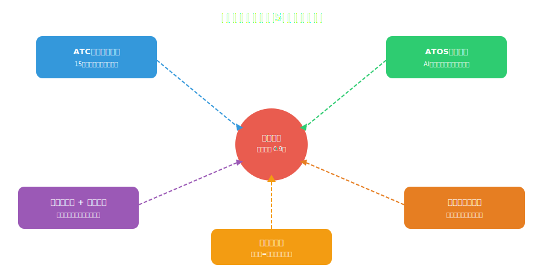

<!-- _class: lead -->
# 東京の電車はなぜ1分も遅れないのか
定時運行の科学

- 新幹線の年間平均遅延：0.9分
- 1日1,300万人を運ぶ東京の鉄道が秒単位で動く仕組み
- テクノロジー・設計・文化の三位一体

---

# アジェンダ

- 1. 世界が驚く東京の定時運行
- 2. ATC：自動列車制御の仕組み
- 3. ATOS：AI運行管理システム
- 4. ホーム設計と乗降の最適化
- 5. 人間の技術：乗務員の職人芸
- 6. システム設計への教訓

---

<!-- _class: lead -->
# 世界が驚く東京の定時運行

---

# 各国の鉄道定時率比較

- **日本（新幹線）：** 定時率 99.3%（遅延の定義：1分以上）
- **日本（在来線）：** 定時率 約95%（首都圏、1分以上基準）
- **ドイツ（DB）：** 定時率 65%（6分以上を遅延とカウント）
- **イギリス（National Rail）：** 定時率 70%（5分以上）
- **アメリカ（Amtrak）：** 定時率 50%（10分以上）
- → **日本は基準が「1分」で厳しいのに、なお世界最高**

---

# 「遅延証明書」という文化

- 電車が5分以上遅延すると**遅延証明書**が発行される
- 会社・学校に遅刻した時の「公式な言い訳」
- → 世界で日本だけの制度（他国では遅延は「日常」）
- 5分遅延で謝罪アナウンス、15分で駅員が頭を下げる
- 2018年：つくばエクスプレスが**20秒早発で公式謝罪**
- → **定時運行は技術だけでなく「文化的期待値」の問題**

---

<!-- _class: lead -->
# ATC：自動列車制御の仕組み

---

# ATC（Automatic Train Control）

- **軌道回路** ― レールに電流を流し、列車の位置を検知
- 先行列車との距離に応じて**自動で速度制限**をかける
- 運転士が速度超過 → システムが自動ブレーキ
- 山手線：最短**2分間隔**で運行可能（ATCなしでは不可能）
- ---
- 新幹線のDS-ATC：**15秒ごとに速度指令を更新**
- → 時速285kmの列車を**秒単位で制御**するリアルタイムシステム

---

# 定時運行を支えるシステム全体像

---

<!-- _class: lead -->
# ATOS：AI運行管理システム

---

# ATOS（Autonomous Decentralized Transport Operation control System）

- **JR東日本が開発した世界最先端の運行管理システム**
- 首都圏24線区、約1,600駅をリアルタイムで一元管理
- 列車遅延発生時：**自動でダイヤ復旧案を生成**
- 折り返し運転・列車順序変更・接続列車の調整を自動化
- 1日約12,000本の列車を同時に最適化
- → **人間では不可能な規模の最適化問題をAIが解く**

---

# 遅延回復の驚異的な速さ

- **山手線で3分の遅延が発生した場合：**
- ATOSが全列車の速度・停車時間を自動調整
- 各駅の停車時間を2-3秒ずつ短縮
- 3-4周で遅延がほぼ解消される
- → **自己修復するシステム**
- ---
- 分散システムでいう**自動スケーリング + リバランシング**と同じ概念

---

<!-- _class: lead -->
# ホーム設計と乗降の最適化

---

# 乗降時間を最小化する設計

- **整列乗車** ― ホームにマーキングされた位置に並ぶ
- 降車客が先 → 乗車客が後：暗黙のプロトコル
- ホームドア ― 安全確保 + 列車停車位置の精度向上
- ワイドドア車両（東西線）― ドア幅1.8m（通常1.3m）
- **目標：1駅あたりの停車時間30秒以内**
- → 乗降の「プロトコル」が全体のスループットを決める

---

<!-- _class: lead -->
# 人間の技術：乗務員の職人芸

---

# 秒単位の停車技術

- 運転士の停車位置精度：**±10cm以内**（ホームドア対応）
- ブレーキ操作は手動 ― ATOでも最終調整は人間
- 「指差確認」― 全ての操作を声に出して指差す安全習慣
- 車掌の乗降確認 → 0.5秒単位でドア閉鎖タイミングを判断
- 新人の訓練期間：**約1年**（シミュレーター + 実地訓練）
- → **テクノロジー + 人間の技術の組み合わせが最適解**

---

<!-- _class: lead -->
# システム設計への教訓

---

# 東京の鉄道から学ぶシステム設計原則

- **1. 多層防御** ― ATC + ATOS + 人間 の3層で信頼性確保
- **2. 自動回復** ― 遅延を自動で吸収するレジリエンス設計
- **3. プロトコルの標準化** ― 整列乗車という「暗黙のAPI」
- **4. 秒単位のSLA** ― 「1分」を遅延とする厳格な品質基準
- **5. 人間 + 機械のハイブリッド** ― 完全自動化より協調が効率的

---

<!-- _class: lead -->
# まとめ

- 東京の定時運行は**技術・設計・文化の三位一体**で実現している
- ATC（安全制御）+ ATOS（最適化）+ 人間（微調整）の多層構造
- 「遅延は恥」という文化的期待値がシステム全体の品質を引き上げる
- 1日1,300万人を秒単位で運ぶ ― 世界最大級のリアルタイムシステム
- **教訓：** 99.3%の信頼性は偶然では達成できない。設計の積み重ねが必要

---

# 参考文献

- - **書籍・論文:**
- - [新幹線のひみつ - JR東海](https://www.amazon.co.jp/)
- - [ATOS: Transport Operation System (IEEE)](https://ieeexplore.ieee.org/)
- - **データ:**
- - [JR東日本 安全報告書](https://www.jreast.co.jp/)
- - [国土交通省 鉄道統計](https://www.mlit.go.jp/)

